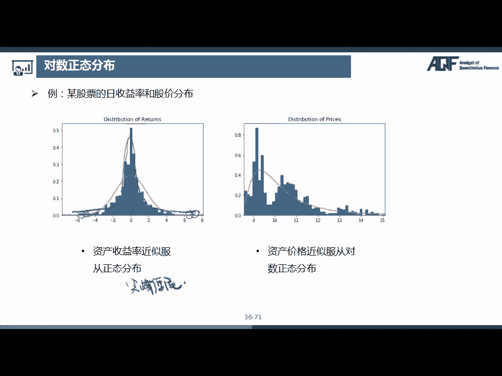

# 2024年金融大神老师讲解量化金融分析师.AQF—量化金融基础知识（完整版课程） - P3：《金融基础》03.数量分析-03_常见的概率分布 - 量化沿前 - BV1ar421K7Mo

那接下来我们介绍几种常见的概率分布，那我们这节课会介绍三种离散分布，伯努利分布，二项分布，和泊松分布，以及四种连续分布均匀分布，指数分布，正态分布，和对数正态分布，好那这三个是离散型随机变量的分布。

那下面四个是连续型随机变量的分布，那对于这些分布，大家只需要知道他们是怎么来的，有些怎样的特征，可以解决哪些问题就可以了，那在这里面的话，我会做一些数学推推导，这些推导大家不需要掌握嗯。

只是为了教学的完整性，所以如果有兴趣的同学呢，可以跟着一起推导一遍，因为其实也没有什么难的内容，最多的话就是嗯涉及到高数的一些基础知识，所以如果是有高数基础的同学嗯，还是比较建议大家和我一起推导一下。

如果数学基础稍微薄弱一些，觉得数学推导这部分太难了的话，也没有关系，因为我们可以使用编程，在Python中其实很多嗯，很多公式别人都已经帮我们写好了，打包好了，然后我们直接用就可以了。

那关于这门课程中可以使用的代码，我会在后面讲完编程基础之后给大家展示。

好，我们首先介绍一种最简单的离散型，随机变量的分布，伯努利分布，那它英文是叫做BERNI，嗯是两个l banni distribution，它就是伯努利试验对应的随机变量的分布。

那伯努利试验是一种非常简单的试验，它只有这个试验只有两种可能的结果，A和A拔，也就是A和它的对立事件，比如说抛硬币只有可能出现正面和反面，比如说我们明天啊到底是下雨还是不下雨。

嗯某个同学考试及格还是不及格好，那我们把这两种结果对应到实数零和一，所以伯努利分布也叫零一分布，随机变量X只取零和一，两个值，X等于一的概率呢是P，X等于零的概率是一减P，那这个其实就是嗯伯努利分。

服从伯努利分布的随机变量的概率质量函数，那这个其实就是它的PMF好，那有了概率质量函数之后，我们就可以算出，服从伯努利分布的随机变量的期望和方差，那我们首先写出离散型随机变量，期望和方差的公式。

那我们期望的话是等于是一个求和公式对吧，那求和的内容呢是p xi乘以xi，然后方差方差呢我们使用这个公式，就是ex的平方减掉ex括号的平方好，那我们首先来看这个期望，那这个很简单。

因为随机变量只可以取到零和一两个值，那取到零的值乘以它的概率是一减P，再加上一乘以概率是P那么算下来是等于P好，那求方差，我们首先要求EX的平方，那ex的平方就是零的平方乘以一减P。

也就是我们把X的平方看作一个新的随机变量，然后我们求X平方这个随机变量的期望，那我们直接用X的平方乘以呃，这个P就可以了，一一的平方乘以P那么算下来还是P好，那我们现在就可以求方差。

方差就等于这个ex的平方P，然后减掉ex括号的平方，就P的平方，那我们合并一下，就是P乘以一减P好，那伯努利分布是一个非常简单的分布，但是伯努利分布是非常多其他分部的基础，比如说后面的这个二项分布。

那二项分布式叫做binomial distribution，他是在N次独立重复的伯努利试验中，成功次数为K的概率，比如说我们抛十次硬币，求正面向上是四次的概率，那抛硬币是一个伯努利试验对吧。

那我们进行十次独立重复的，抛硬币的这样的一个实验，然后我们把这个向上叫做成功，然后他的次数为K的概率呢，可以用下面这个公式来求，那这里面N次独立重复试验的伯努，重复的伯努利试验中成功次数哎。

那这个的话其实就是随机变量X，那这个随机变量X就是服从二项分布的，那我这个X可以取到的值是不是可以取到零一，就零就是一次都不成功嘛，然后一次就是一就成功一次，然后成功两次，一直到成功N次。

就是每一次都成功，所以这里随机变量是可以取到这样有限个，并且可数的值好，那我们看一下它的概率，质量函数是嗯，X等于K的概率是CNK，也就是这是一个组合公式对吧，就是在N个数里面取出K个。

然后乘以P的K次方，在这里的P就是成功的概率，比如说我们抛硬币，抛硬币的话，其实P就是12了，那因为我们成功是K次，所以就是P的K次方，然后一减P就是失败的概率，那失败的概率乘以失败的次数。

失败次数是NN减K就是一减P的N减K次方，那这里的话给大家举一个例子，比如说我进行N次射击，然后每一次射击击中十环的概率，这个P是0。1，那我问在N次射击中呃，击中时击中M次十十环还的概率是多少。

那如果说这里M等于零的话，那是不是就是我们一次都没有击中啊，那一次都没有击中，是不是我们就是每一次都是这个0。9，然后第一次是0。9，然后第二次也是0。9，一直是一直一直到第N次都是0。9。

那也就是N个0。9相乘，那就是0。9的N次方对吧，那如果说M等于一的话，唉那也就是说我们在N次射击中是击中一次，但是到底是哪一次呢，我们是不是有N种选择啊，就是有可能是第一次，也有可能是第二次。

也有可能是第三次，那所以我们一共是有C嗯一种选择，那击中十环的概率是0。1，那因为我们击中了一次，那就是一次方，那还有的剩下N减一次，全部都是没有击中，那就是0。9的N减一次方好，那我们也可以以此类推。

比如说我们击中两次，那击中两次我们可以有哪两次呢，是不是在N个里面全两次，比如说我们是第一次击中或最后一次击中，或第一次击中，第二次击中，那我们一共有这样的CN2种组合方式，那我们再乘以它的概率，0。

1的平方，0。9的N减二次方好，那我们一直一直算，一直到NM等于N，就是我们能够就是每一次都击中，那其实就是CNN0。1的N次方，那最开始M等于零的时候，我们这里是不是前面没有乘啊。

那这是因为我们这里其实是有一个CN0，那CN0本来就是嗯等于一，所以这里写不写的话都是无所谓，那我们这整个的话归纳起来，就是这样的一个式子，好那有了这样的概率密度函数之后，我们就可以算出二项分布。

服从二项分布的随机变量的期望和方差，那如果说我们直接带公式来求的话，稍微会比较复杂一些，会用到一些这个组合的公式，比如说嗯这个case k c n k等于NCN减一，K减一这样的一个公式。

以及会用到一个二项展开啊，有兴趣的同学可以自己推导一下，嗯可以看呃，就是参照我这里给的两个提示来进行推导，那我这里的话，给大家介绍一个比较简单的推导方式，那我们知道二项分布是N次独立重复的。

伯努利试验对吧，那服从二项分布的随机变量是X，可以看做N个服从伯努利分布的随机变量，X1到XN的和，也就是说这个X1X2，一直到XN，这些随机变量都是服从伯努利额分布的，也就是服从零一分布。

他们要么是零，要么是一，那这个X呢是服从二项分布，那这个其实很好理解了，那因为我们在每一次伯努利试验中，如果是成功的话，我们记作一，那一共N次中成功呃，M次的话，那这个X算下来是不是就是M呀。

那这时候呢我们就可以用这个嗯，期望和方差的性质来求了，那我们只那我们可以算一下它的期望，EX是不是就等于E的X1加上X2，一直加加加加到XN的期望，那我们知道和的期望等于期望的和。

那就等于EX1加ex二一直加加加加到ex n，那因为这个X1X2到XN，都是服从伯努利分布，那伯努利分布的期望是P对吧，那这个都是P加P加加加加P，那这里面一共是有N个P，那所以等于NP那方差的话。

也可以用这样的公式，那我们知道这是N次独立嗯，独立重复的伯努利试验，也就是说这个XX1X2XN，它们两两之间都是相互独立的，那么我们知道，如果呃随机变量X和Y是相互独立的话，那么和的方差等于方差的和。

所以这个呢是等于X1的方差加上X2的方差，一直加加加加到XN的方差，那我们知道，服从伯努利分布的随机变量的方差，是P乘以一减P对吧，那然后这里面的话有N个，那我们在前面乘一个N好，那这样子的话。

我们就把二项分布的期望和方差推导出来了，然后我们看到ex是等于NP，然后X的方差是NP乘一减P，好我们来看一下这个二项分布的概率，质量函数的这个额分布情况，那这些图呢都是嗯概率质量函数。

那么看到如果说这个P是等于0。5的话，也就是成功和失败的概率是相同的话，它这个图形是轴对称的对吧，那如果说P是小于0。5，也就是成功的概率是小于0。5，比如说我这里取的比较小，是P等于0。1。

那我们看到它的图形是呈现一个右边的形态，这个尾巴是在右边，那如果说这个P是零，额是大于0。5，比如说这里P是等于0。9的话，那它是呈现一个左偏，但是呢随着N的增大，它的这个偏态会逐渐降低。

最终变成一个正态分布，比如说我们看这个最后一行都是N等于50，那我们看到这个P等于0。1，它这个也是呈现一个正态分布，但它就是呃这个期望比较小的正态分布，所以就是集中在在这个左边，然后它如果是P等于0。

5的话，它就是集中在中间，如果P等于0。9的话，它就是期望比较大的一个正态分布，那它也是成一个轴对称的形状，嗯所以说二项分布的极限分布是正态分布，那随着N的增大，二项分布趋近于正态分布。

那这个是二项分布的一个性质，那第三个离散分布是泊松分布，Persondistribution，那泊松分布式适合于描述单位时间内，随机事件发生的次数嗯，那我们我们来看一个例子。

好那我们来考虑这样的一个问题，假设我们现在有一个售后中心，然后售后客服，每一分钟接到电话的概率是0。05，就是每分钟，接到电话，的概率是0。05，那问一小时，接到两个电话的概率，是多少。

那这样的一个问题我们要怎么解决呢，大家可以思考一下，那么想到一小时是不是有60分钟啊，那如果我们假设每一分钟接到电话是独立的，那么我们每分钟接到电话，是不是可以看作一个伯努利事件。

就是伯努利试验就是要么接到电话，要么接不到，那这里一个小时接到电话的次数，那是不是就是服从一个二项分布的随机变量，也就是说我们其实就是独立重复的，这样进行60次，其中两次成功的概率。

那这里的嗯这个P就等于0。05，这里的N就是等于60，也就是我们把整个这个一小时，把它分成这样60份，那这个是一分钟，那每一分钟成功的概率P是等于0。05，然后他这里面呢一共是有N次嗯，60次实验好。

那我们也就是要在这个60分钟里面选出来，2分钟，就是C62是接到电话的0。05的平方，那还有58分钟呢是没有接到电话的，那我们是不是可以用这个二项分布额的，这个计算概率的公式，那我们算出来是等于0。

2259，好那这样的问题是不是就解决啦，哎嗯那这里的话我们是不考虑通话时长，并且是每分钟独立的，那有同学要说了，如果我是同一分钟接到两个电话怎么办呢，所以说如果我们要更加精确的计算。

是不是要把这个时间段进行一个，更加详细的划分呀，比如说我们考虑每秒钟接到电话的概率诶，那我们也就是要把这个一小时划分成每一秒，那每一秒的话，我们是不是有3600秒，那我们考虑这个每一秒接到电话的概率。

P，那么我们这里的话，直接用这个上面每一分钟的0。05，除以60好了，然后大概是0。0008，那这样的话我们是不是就是重复3600次，然后成功两次，那我们可以用二项分布的公式C3620。

然后成功的概率是0。0008，然后不成功的概率是0。9992，然后是3598次好，那我们算下来是0。2328，那但是我们用这个二项分布是不是有一个问题，就是我们这里计算呃公式非常非常复杂啊。

特别是当我们这个N变得非常大，P变得非常小的时候，这里是不是还非常容易出现误差，因为这里的P已经非常非常小了，如果说我们呃这里就是呃四舍五入算的，这个保留小数位数不不不够的话。

他可能误差算下来误差会比较大，所以二项分布解决这种N非常大，P非常小的问题的时候，会计算非常麻烦，而且不准确，那泊松这个人呢就发现了一个呃，就发现了这样，那泊松这个人呢就发现了一个规律。

就是当N就是在二项分布中，N趋向于无穷，并且P趋向于零，但是在同时呢，这个N乘以P是一个比较稳定的值，比如说它是等于兰姆达，它是一个常数，这个兰姆达是一个常数，那满足这样的条件的时候。

泊松分布呢可以作为二项分布的逼近，也就是说我们用泊松分布的概率，质量函数计算出来的概率，和二项分布的概率函数，概率质量函数计算出来的差不多，比如说我们看这个问题，这里的N乘P是等于等于三。

那这里的兰姆达是等于三，如果我们代入这个泊松分布的公式，我们看一下泊松分布的公式是嗯，X等于K的概率是这个东西，那这个公式大家其实也不需要，也不需要记，那这里的话X是等于二等于兰姆达的K次方。

然后K的阶乘E的-200，好那我们用这个公式算出来是等于0。224，那我们用这样的一个泊松分布的公式，来计算的话，是不是比我们刚刚用这个二项分布的公式计算，来的简单多了，所以泊松分布式比较适合嗯。

处理这样的一个问题，那我们来看一下PPT，那泊松分布式适合描述单位时间内，随机事件发生的次数，比如说一小时接到两个电话这样，然后它的这个概率质量函数是这样的一个形式，那K是可以取到011直到无穷嗯。

比如说我们接到零个电话，接到一个电话，接到两个电话，那理论上来说我们可以接到无无数个电话，那lambda是单位时间内随机事件的平均发生率，比如说一小时平均是接到呃三个电话的，当二项分布的N趋向于无穷。

P趋向于零，而NP比较稳定时，泊松分布可以作为二项分布的逼近，我们来看这个右边的这个图形，那这个图形的话，我是嗯取了N是比较大的一个值，然后P是比较小的一个值，然后画出来的一个二项分布和泊松分布的概率。

质量函数，那我们可以看到他们的重合度是非常高的，这里面蓝色的这个柱状图是泊松分布的，然后这里橙色的柱状图是二项分布的，我们看到它们基本上是重叠的，说明它的这个呃，泊松分布的逼近程度是非常好的。

那泊松分布的期望和方差，ex和YX都是等于拉姆达，那泊松分布的期望其实非常好理解，因为拉姆达本身就是单位时间内，随机事件的平均发生率，那额随机，那单位时间内随机事件发生次数的期望。

那就是它这个平均发生率LAMBD达了，那这个期望和方差的公式我们也是可以推导的，下面就是进入了枯燥的推导，数学推导时间，大家可以稍微看一看，好那对于离散随机变量的话，我们首先还是把它的这个期望和方差。

的公式写出来，那它的期望ex等于是一个求和公式，是PXI乘以xi，它的方差呢是等于EX的平方，减掉ex括号的平方，那这里的话我们还知道它PX等于K，等于兰姆达的K次方，K的阶乘E的负兰姆达次方好。

那我们来算一下他的期望，就是嗯K乘以朗姆达的K，K的阶乘E的两大次方，那这里的话K和K约掉一个，那就是K减一的阶乘好，那我们这里呢把这个E的负兰姆达次方，提到前面去，同时呢我们再提一个兰姆达到前面去。

那这个求和里面就剩下了兰姆达的K减一次方，然后K减一的阶乘好，那这样的一个东西其实是一个泰勒展开，那泰勒展开是E的X等于X的零次方，除以零的阶乘，加上X的一次方，一的阶乘，然后加上X的平方。

然后二的阶乘加加加加，一直加到X的K次方，K的阶乘啊，一直加加加加加好，那其实它就是一个X的K次方，K的阶乘的一个求和，那我们看到这里的话啊，是不是是相同的形式啊，那我们的这里的X就是兰姆达。

那就是E的兰姆达次方，所以这一块的话是等于E的兰姆达次方，那E的兰姆达次方和前面的E的兰姆达次，E的负兰姆达呃，相乘的话是等于一，所以他这里E额EX就等于兰姆达好，那这个期望就求出来了，那方差的话。

我们首先要求一个E的X的平方，那E的X的平方前面都还和上面一样，那到这个步骤的时候，我们还是从头开始写吧，那就是K的平方，然后拉姆达KK的阶乘，然后E的弗朗达，然后我们除掉一个K。

那我们再把E的负兰姆达和兰姆达提到前面来，那我们发现他这里的话会多了一个K额，多了一个K，那多了一个K怎么办呢，我们把这个K写成K减11，K减11，然后乘以拉姆达的K减一次方，然后K减一的阶乘。

那我们把这个K减一，这块呢和这个一这块把它拆开来，也就是说我们把这个拆成两个，拆成两个的芙兰达，我们写到下面一行吧，写到这里来，E的负兰姆达，那K减一和下面的K减一可以抵到，然后兰姆达的K减一次方。

K减二的阶乘好，再加上一个E的负兰姆达乘以朗姆达，然后兰姆达的K减一次方，K减一的阶乘哎，那这个后面这一块是不是和我们刚刚呃，这个ex是一样的呀，对吧，那我们这一块的话是等于拉姆达，那前面这一块呢。

我们发现是不是上面兰姆达的K减一次方，多了一个兰姆达了，那我们把这个兰姆达前面加上一个兰姆达，后面减掉一个兰姆达，就提到一提一个兰姆达到前面去，那这一块是不是又变成了一个泰勒展开。

那这一块的话又变成E的兰姆达，那这一边相除好，那它就等于兰姆达平方加兰姆达好，那我们知道了ex的平方之后，那方差就非常好求了，那方差就等于这个兰姆达的平方加兰姆达，然后减掉ex的平方。

那ex是兰姆达的平方，就是这个，然后我们来减掉诶，那我们发现它的方差也是等于兰姆达好，那这样子的话，我们就把泊松分布的期望和方差推导出来了，好那这个是我们带公式来推导的。

那其实泊松分布它既然作为二项分布的逼近，那他的期望和方差，应该和二项分布是差不多的对吧，那我们二项分布，的期望是多是什么，等于NP是吧，我们的方差是什么，NP1减P哎。

那我们发现这个NP是不是就等于拉姆达呀，它就等于拉姆达，那是不是正好和这个泊松分布的期望是一样的，那它的方差是NP1减P，那这个NP是等于拉姆达，那我们注意一下这个P我们是不是这里写了。

这里P已经趋近于零了呀，那P趋近于零，那一减P是不是就趋近于一了，那这块是不是可以去掉，所以这个方差的话也是逼近于拉姆达的，所以如果说我们呃，通过一个对二项分布的边线来看的话，也是可以非常容易的得到。

泊松分布的期望和方差，好，那这是我们要介绍的三个离散型，随机变量的分布，接下来呢我们介绍几种比较常见的连续型，随机变量的分布，那第一个是最简单的均匀分布，叫做uniform distribution。

那它的概率密度函数呢是一条水平的直线，我们看到图上是这个样子的，那均匀分布是说在区间ab内，比如说我们这里A是在这里，B是在这里，那在这个区间内，任意等长区间内事件发生的概率相同。

比如说我们是取这段时间，这段区间，那这段区间这个事件发生的概率，和这一段是区间发生的概率，那只要这一段区间是相同的，那么我们这段区间内发生的概率是相同的，但其实因为我们这里。

概率密度函数是一条水平的直线，那这样子的话，我们不管是做，不管是哪一个区间上的积分，只要这个区间长度是相同的话，我们这一部分的积分是相同的，嗯对吧，那均匀分布其实在现实中也有很多例子。

比如说这个时针在任意时刻的角度值，是从零度到三十三百六十度的一个均匀分布，还有比如说这个四舍五入的舍入误差，也是一个均匀分布，那它的概率密度函数呢是一条水平的直线呢。

它是在呃X大于等于A小于等于B的时候，FX等于B减A分之一，那因为我们这一块整个的面积是不是等于一呀，那整个的面积除以这个下面区间的长度，是B减A，那他这个高度是不是就是B减A分之一了，好。

那他在其他地方上的这个概率密度函数都是零，那均匀分布的累积分布函数，是一条这样斜向上的直线，那在这个A，之前呢它就是没有任何概率，它的概率都是零，所以它的累积分布函数也是零，那在这个B之后。

因为B之后的概率也都是零了，所以他到这里累计已经达到一了，那他到这里的话已经到达了一，那他之后也都是一，那在A到B之间，它是一条这样向上的直线，那在这条直线上的每一个值，比如说我这一点。

其实它这个值对应的就是我们在这个上面，这个点之前的这个面积，那因为它是均匀的嘛，那我们随着这个点向右移动，它这个面积是不是在均匀的变大嗯，所以他这个累积分布函数是一条直线，那它X小于A的时候嗯。

F大FX是等于零，然后X大于等于B的时候嗯，大FX是等于一，然后在A到B之间的时候，是B减A分之X减A，那其实就是这个区间的比，那个区间整个长度是B减A对吧，那这个比如说这里是X那这个X减。

那这个面这一块的面积比上整个的面积，是不是就是这一段的这一段的长度，比上整个长度啊，那这个均匀分布的是非常好理解的，那么来看一下均匀分布的期望和方差，那均匀分布的期望额是二分之A加B。

方差是12分之B减A的平方，那我们这里的话也带大家推导一下，好枯燥的数学推导又开始了，好，那我们首先呢写出这个连续型随机变量的额，期望和方差的公式，那ex是嗯负无穷到正无穷XFXDX那方差的话。

我们还用这个啊这个公式减掉ex，那FX我们已经知道了，是等于B减A分之一是在A到B区间上，那既然它只有A到B区间上有值，那我们这里ex的话直接可以写成AB，然后XB减ADX好。

那我们把这个B减A分之一提到前面去，那X的积分就是二分之1X的平方，AB我们算一下B平方减A平方二，那B平方减A平方就是B减A乘以B加A，那么B减A抵消掉就是二分之B加A好，那这个非常简单。

我们来算EX的平方，那ex平方就是把这个呃上面X换成X的平方，那我们还是和上面一样，那X的平方积分就是三分之1X的三次方，我们算下来B的三次方减A的三次方，然后3B减A，那这里可以用一个立方差的公式。

就是B减A，然后B的平方加ab加A的平方除以3B减A，那我们把B减A约掉，就是三分之B的平方加ab加A的平方，诶，那不要忘记了，我们还要把ex括号的平方减掉，那就是B的平方加ab加上A的平方33。

减掉嗯，A加二分之A加B的平方，那我们把它展开就是A的平方加二，ab加B的平方除以四，那么把它通分一下，4B的平方加四，ab加上4A的平方除以12，减掉3A的平方加上六，ab加上3B的平方除以12。

那就是B的平方减掉啊，2ab加上A的平方除以12，那这个是不是就是12分之B减A的平方，那就算出来了，那均匀分布还是比较简单的，那大家要记住均匀分布，它的这个概率密度函数是一条水平的直线。

也就是说它在每一段等区间上的概率是相同的，那也就体现了这个均匀嘛，那接下来我们要介绍的是指数分布，Exponential distribution，指数分布式描述泊松过程中，事件之间的间隔时间诶。

那泊松分布我们刚刚是不是已经介绍过了呀，那现在的话，我们可以把一个逻辑线给大家穿一穿，那我们最开始的时候，是不是学习了这个伯努利分布，那伯努利分布式进行一次伯努利试验，那他还可能有两种结果，零和一是吧。

那如果说我们嗯独立重复的进行N次，伯努利试验，他成功的次数是服从二项分布，那如果说这个二项分布中N是趋向于无穷，P趋向于零，并且NP是一个比较稳定的值，等于兰姆达的时候。

我们可以用泊松分布作为二项分布的逼近，好那这三个分布是不是我们之前已经讲过了呀，那现在我们要介绍的是指数分布，那指数分布和泊松分布呢，他们都是研究一个低频并且稳定的随机事件。

也就是说他们都是呃在这样的一个条件下，嗯比如说我们刚刚讲到这个售后电话，我们只是我们知道，平均每个小时是接到三个电话，那如果说我们要研究一个小时接到电话的次数，那这个次数的话就是服从泊松分布。

那如果说我们要计算啊，想要知道接到一个电话之后，我们要等待多少时间接到下一次电话，也就是说两次电话之间的这个间隔，那这个时间的间隔就是服从指数分布，那我们知道次数的话可以是零次，一次两次N次。

那它是一个离散型随机变量，那时间呢是一个连续型的随机变量，因为我们可以等待10分钟，20分钟啊，15分钟你也可以等待啊，10。2分钟，10。25分钟，10。2225分钟等等。

它它是可以就是无限分割的对吧，所以这个时间间隔的话是一个连续型随机变量，它是服从指数分布，那我们来看一下指数分布的概率密度函数，那指数分布它X小于等于零的时候是等于零。

因为我们这个时间间隔肯定是要大于零的嘛，所以它在大于零的时候，它的概率密度函数是兰姆达E的负，兰姆达X那这里的兰姆达的话，其实就是我们泊松分布中的兰姆达等于NP嗯，注意一下。

有的教材里面会把这个lambda写成西塔分之一，就是把这个兰姆达写成theta分之一，那它的概率密度函数就变成了theta分之一，E的负呃，西塔分之X那这个话其实和我们这里是一样的。

它只不过是写法有一定的差别，嗯指数分布的累积分布函数是这样的，一个分段函数，那X小于等于零的时候是等于零，因为它这上面的额概率函数就是零，那大于零的时候是一减E的负兰姆达X。

那这个是很很容易用这个公式来算出来的，因为嗯累积分布函数，就是它小于等于X的概率嘛，就是嗯负无穷到X，因为这里负无穷到零是没有，那我们就直接写零到X，然后是，那我们这里的话和这个前面的X区分。

我们这里用T然后DT好，那这个积分的话就是嗯负的E两大T，然后零到X那就是负的E负兰姆达X，然后减掉一个负的呃，E负兰姆达零呢E的零次方就是一，那减掉一的话就是呃加一，那也就是一减E的负兰姆达X。

那这个是非常容易可以推出来的，那我们来看一下指数分布的这个图形，嗯这个上面是PDF，就是概率密度函数，然后下面是累积分布函数，这个图形大家就是稍微了解一下就可以了，好。

接下来我们来看一下指数分布的期望和方差嗯，指数分布的期望是等于ex等于拉姆达分之一，那这个其实是比较好理解的，因为这里参数的话是表示单位时间内，发生某一个事件的次数。

比如说呃每一个小时平均是接到三个电话，那一个小时平均接到三个电话，那我们是不是平均就等待1/3小时啊，那这个ex的话，其实就是我们平均等待的时间，就是兰姆达分之一好，然后它的方差是兰姆达的平方分之一嗯。

好那这个的话其实我们也是可以公式推导的，但是需要一定积分啊，这个微积分的这个知识嗯，我们来看一下吧，好的，那我们首先看期望ex等于那连续型随机变量，期望是负无穷到正无穷，然后XFXDX。

那这里的话因为负无穷到零是没有的，那我们直接从零开始，然后XFX呢是等于兰姆达E的负兰姆达X，那这里我们把这一块放到嗯后面来，E的负兰达X，来这里我们要用到一个分部积分的方法，就是负的X1负兰姆达X。

然后我们先把这一块算出来，然后减掉一个呃负的就是加上零的零到正无穷，然后E的负兰达XDX次方好，那我们可以首先算前面这一块，那前面这一块的话呃，如果X是等于正无穷，那我们这里就要求一个极限。

就是X到正无穷的时候，XE的两大X，那我们上下求导就是朗姆达E的兰姆达X，那这个X趋向于正无穷的时候呢，这个是等于零的好，那我们这一个呃X等于零的时候，X等于正无穷的时候，它是等于零。

那我们来看一下X等于零的时候啊，那这个很简单，X等于零的时候，他正好就是零了，所以我们这个前面这一块的话是等于零等于零，那我们只要计算后面这个就可以了，那后面这个积分就非常容易了。

我们看到它的是呃负的兰姆达分之一，E的负兰姆达X然后零乘无穷，那X等于正无穷的时候，那这个是等于零，然后减掉一个负的，加上朗姆达分之一，E的零次方就是一，那我们算下来是朗姆达分之一。

好那接下来的话是方差，那计算方差，我们还是首先计算ex的平方，那ex的平方就是呃把上面的这个改成X的平方，那具体的计算方式还是和上面一样的，嗯等于负，然后X的平方d e-200X，然后进行一个分部积分。

然后减掉就是加上嗯，E的负兰姆达XDX的平方好，那这一块的话我们算下来还是等于零的，那我们其实就是要算这一块，那我们把这个DX的平方拆成嗯，X拆成2XDX好，那我们把这个二提到前面去，唉。

那我们现在看到这个是不是和这个呃差不多啊，都有这个XE的负兰姆达，X它唯一相差的就是一个兰姆达，那我们可以在这里再乘以一个朗姆达，然后在前面呢除以一个朗达，那这一块的话是不是就和上面是一样的了。

那上面算下来是兰姆达分之一，所以我们这个算下来是兰姆达平方分之二，那现在的话我们就可以算方差，等于这个ex的平方，减掉ex是兰姆达分之一的平方，也就是兰姆达平方分之一。

那我们一减就是兰姆达的平方分之一好，那这样子的话，我们就把这个期望和方差的公式推导出来了，好那指数分布还有一个非常神奇的特性，叫做无记忆性，也就是说对于任意的ST大于零，有这样的一个条件概率。

也就是X大于S的条件下，X大于X加T的概率是等于X大于T的概率的，那这个也是非常容易推导的，那我们直接带这个条件概率呃，这个条件概率的公式就可以了，那这样的条件概率就等于PX大于S加。

T除以一个PX大于S，那这个的话是不是就是一减FS加T对吧，因为这个FS加T就是X小于，等于X加T的概率，那一减的话就是大于，那这个的话就是一减F呃S，那我们算下来的话是E的兰姆达。

E的负兰姆达T也就是一减FT，那也就是PX大于P的概率，那这是什么意思呢，嗯比如说X是某一个元件的寿命，那X大于S，也就是说这个元件已经使用了S小时了，也就是这个是X大于S，就他使用了S小时还没有换的。

是不是说明它这个元件的寿命是大于S的，那他总共能使用至少S加T小时的条件，概率与从开始使用时算起，至少能使用T小时的概率相等，也就是说我们这个元件已经使用了四小时，我还能再使用T小时的概率和我一开始呃。

就是用T小时的概率是相同的，也就是说这个元件对它已经使用过S小时，没有记忆，那还有一个例子，比如说啊排队论，那排队嗯，一般来说这个排队的等待时间，也是服从这个指数分布的，那根据这样的一个无记忆性。

也就是说如果说我们已经排队排了半个小时了，我们自至我们再至少排半个小时的概率，和我们一开始就至少要排半个小时的概率，是相同的啊，那个那这个是不是听起来有点沮丧，也就是说我们等了这个半个小时。

好像是白等了一样，但是如果说如果说这个人的寿命也是嗯，有这样的无记忆性，是不是就超级好了，也就是说我们嗯比如说我们已经活了80年了，我们再活20年的概率，和我们一一生下来就活20年的概率是相同的。

至少20年的概率是相同的，那那这个是不是就是对我们已经活了多少年，没有记忆的话啊，那就那就有点好了嗯，啊那这个其实是一个理论上的无记忆性，那我们知道原件使用寿命肯定是有记忆性的嘛。

因为你使用了使用了一段时间，肯定是对这个元件有磨损，但人活了的话呃，人活了一段时间，肯定是对这个呃身体是有磨损的，所以嘛如果说想要他的这个记忆性更低的话，肯定就是要好好锻炼身体，早睡早起，然后健康生活。

有一个好身体嗯，那接下来的话，我们要介绍一种非常非常重要的分布，正态分布，Normal distribution，嗯正态分布是自然界中最常见的分布，比如说人的身高体重，学生成绩啊，收益率的分布。

测量误差，降水量等等，那这些都是会服从正态分布，那正态分布因为是数学家高斯发明的，所以它也叫做高斯分布，那正态分布的概率密度函数是啊，这么一坨是FX等于二额根号，二派西A西格玛分之1亿的负嗯。

二西格玛的平方分之X减mu的平方啊，这个看起来有点复杂呢，也不需要大家掌握，那大家呢只要呃知道这个正态分布的概率，密度函数和累积分布函数的图形就可以了，那我们来看一下右边的这个图形。

上面是概率密度函数PDF，下面是累积分布函数CDF，那么看到正态分布的话是关于它的期望对称的，比如说我这里画的是这个标准正态分布，也就是X是服从零一的一个正态分布，那这个零呢就是他的期望是缪。

那这个一呢就是西格玛的平方，那么正态分布的图形是关于X等于六对称的，并且在X等于六的时候，它的FX是达到一个最大值，那正态分布它是轴对称的，所以它的偏度是零，然后它是长风态，它的风度是三。

那CDF呢是这样的一个呃，像一个S型的曲线，那我们看到它在零的时候正好是等于0。5，因为我们它是轴对称的嘛，然后然后他然后我们这里的额，这个期望是等于零，所以我们零的左边和右边它这个面积是相同的，好。

那正态分布的期望和方差，就是缪和西格玛的平方，一般的话我们将服从期望为缪，方差为西格玛平方的正态分布的这个随机变量，X写成X服从这样的N然后缪西格玛的平方，那就是服从期望为缪。

方差为西格玛平方的正态分布，但正态分布具有可加性，两个或者多个满足正态分布的随机变量，经过线性组合构成新的随机变量，仍然是满足正态分布，比如说X是服从均值为mu，然后方差为西格玛平方的正态分布。

那么Y等于MX加B是服从呃，期望是M缪加B，也就是我们把这个X的就是MX加B嘛，我们就是乘以一个M再加上B，那它就是服从均值为啊M6加B，然后它的方差是M的平方，西格玛的平方，那其实这个的话。

我们都可以用这个期望和方差的性质，给求出来好，那这个其实我们还是只有一个随机变量啊，那如果说我们有两个随机变量，X和Y他们都是服从正态分布的，一个是呃缪一西格玛一的平方，然后缪二西格玛二的平方。

那么Z等于X加Y就把这两个随机变量加起来，也是服从正态分布的，那这个特性呢是非常有用的，比如说信息学在模拟噪音的时候，那每一个噪音都是服从一个正态分布，然后两个服从正态分布的噪音叠加起来，还是正态分布。

好，那下面的，那最后呢我们还要介绍一个标准正态分布，那标准正态分布也就是服从去呃，期望为零，方差为一的这样的一个正态分布，也就是X服从零一的正态分布，或者说嗯叫做Z分布，那我们为什么要用标准正态分布呢。

因为我们在对不同的这个随机变量，进行比较的时候，它们之间可能嗯存在这个单位上的区区别，或者说存在量纲上的差别，那这时候我们想要把它们投，投射到一个比较固定的区间上，那我们可以对它们进行标准化处理。

也就是说如果X是服从均值为缪，然后方差为西格玛平方的正态分布，那么我们可以构建这样的一个新的，这个随机变量Z那是等于X减缪除以西格玛，那这样的一个随机变量呢是服从标准正态分布。

那标准正态分布是呃非常有用的，比如说我们在进行多因子这个多因子策略中，那我们经常会先将因子值进行一个，标准化的处理，因为像市值啊，市值因子是不是都是非常非常大的值啊，但是像PE呀。

PBPS这些值都是非常小的值，它们如果放在一起比较的话，非常难以比较，所以我们都会将它进行一个标准化，将它们投射在一个比较小的区间范围内好，那对于标准正态分布，它的累积分布函数可以用这个大写的呃。

希腊字母Y来表示，那F负X就是嗯这个X小于等于负X的概率，那它是等于一减FX，那这个是因为它呃这个标准正态分布是根据零，这个X等于零对称的对吧，因为它是这样的一个图形，然后它是根据零对称，那负X在哪里。

负X在这里，那负负X是不是这块面积，那这个X是在这里，那这块面积是不是和这块面积是相等的呀，那这块面积是不是就等于一，减掉这个左边这个这这一块，我们画换一只颜色，那是不是就等于一减掉这块面积啊。

那这一块是一减掉FX，那这一块的话就直接是负的负X，那么可以发现这两个是相等的，那最后的话我们还要看一个，就是这个三西格玛法则，也就是说嗯在正态分布中，落在三西格玛区域范围内的概率是嗯，99。9%。

我们看这个右边的这个图形，右边这个图形中X是服从均这个期望为缪，然后方差为西格玛平方的额正态分布，然后我们看到它是根据X等于六轴对称，那这个点呢是缪减掉1。65个西格玛，然后这个点呢是没有加上1。

65个西格玛，然后这一块区间内的这个面积，也就是这块取到的概率是90%，那如果说1。96个sigma，那这一块的面积，就是95%，那如果说是2。58个西格玛的时候，就是零99%。

那如果说这里是三西格玛的话，这是三西格玛的话，这个值就变成了99。9，也就是说，我们也就是说有99。9%的概率，这个值都是落在三西格玛的这样的一个，区间范围内的，那这个的话我们会在后面这个呃置信区间。

还有这个假设检验中用到，所以大家可以把这些关键值给记一记，就是啊1。65对应的就是90%，然后1。96对应的是95%，2。58对应的是99%，好那这个是正态分布，我们来回顾一下。

因为这个正态分布是一个比较重要的呃，这个分布首先呢我们要知道它的概率，密度函数和累积分布函数的这个图形，它是跟呃它是关于这个X等于mu轴对称的，然后期望和方差，就是这里的缪和西格玛的平方嗯。

那正态分布具有可加性，就是多个满足正态分布的随机变量，经过线性组合构成新的随机变量，仍然是满足正态分布，那标准正态分布就是服从这个期望为零，然后方差为一的正态分布，那我们在对于服从标准正。

那我们在对于服从正态分布的呃，这个随机变量进行研究的时候，通常会将它进行标准化，那标准化的步骤呢，就是首先将这个呃随机变量减掉它的期望，然后再除以他的这个标准差，得到的这个新的标。

新的随机变量Z就是服从标准正态分布，然后最后的话我们记住几个关键的点，也就是90%的概率是在1。6，五个西格玛之间，就是记住这个关键值，11。65对应90%的概率，然后1。96对应的是95%，2。

58对应的是99%，好最后的话我们介绍一个对数正态分布，那对数正态分布，也就是LNX是满足正态分布的，那么X就是满足对数正态分布，它的图形是呈现一个右偏的状态，也就是正片。

我们看到他这个长长的尾巴是托在右边的，那它的概率密度函数是这个东西也比较复杂，大家就不用看了嗯，如果LNX是满足正态分布，那么X是满足正态分布，反之亦然，也就是说如果X是满足对数正态分布。

那么LNX是满足正态分布，这两个是可以互相推导的，那对数正态分布是在资产价格建模的时候，非常有用嗯，比如说BSM模型是假设标的资产的价格，满足对数正态分布的，那这是因为对数正态分布中X是大于零的。

那一般认为，一般我们是认为资产的价格是大于零的，所以是服从对数正态分布，那但是最近出现了一些暴雷事件之后，大家发现资产的价格可能是会变成负值的，那就对这个ms模型中呃，对资产价格满足对数分摊。

对数正态分布的这个假设产生了质疑嗯，那不过一般的条件下，我们还是呃，就是认为这个资产的收益率是服从正态分布，因为收益率可能是有正有负的嘛，然后它的价格呢是服从对数正态分布，比如说我们看到我这里的话是嗯。

就是做了某一个股票的日收益率，和股价的分布图，那左边是日收益率的分布，然后右边是股价的分布，那我们看到这个日收益率的分布，大致是呈现一个呃正态分布，它主要的是集中在这个零附近，然后向两边散开。

而股价的话它是额呈现一个这样的一个呃，右偏的状态是服从，是近似服从对数正态分布的，哎但是我们这里是不是也注意到一点，就是我们看到这里日收益率的分布，它这个尖尖是不是特别尖啊，然后它在这里的这个尾巴。

是不是相对于正态分布来说的话要厚一些，因为你看我们这里正态分布的话，这里已经这些值都已经呃，概率已经非常非常小了，但是实际上的话，我们这里这些还是有值取到的啊，会比正态分布的概率会大一些。

那这个是不是呈现了一个先锋后尾的特征，也就是我们之前所说的，金融资产的收益率额分布，会呈现一个尖峰后尾的形态，好，那这就是我们要介绍的关于一些常见的呃，概率分布，那离散概率分布我们介绍了伯努利分布。

二项分布和泊松分布，那对于连续性随机变量，我们介绍了均匀分布，指数分布，正态分布和对数正态分布，那大家只需要对这些分布啊是个什么东西，就是据大致的一个了解，然后可以处理哪些问题，然后它这个图形差呃。

这个大致是什么样子的，这样有一个认识就可以了，具体的像我们之前的像公式推导啊什么的。

