# 2024年金融大神老师讲解量化金融分析师.AQF—量化金融基础知识（完整版课程） - P5：+威❤hhh427501  了解获取全套课程 05.数量分析-05_抽样分布 - 量化沿前 - BV1ar421K7Mo

好，接下来我们来看一下总体和样本的概念。那总体和样本非常简单，总体就是研究对象的全体，叫做population。那样本呢就是从总体中抽取一部分的数据，或者说一部分的个体，那叫做sample。

比如说我们之前举的例子，那全国所有成年男性的身高就是总体。那样本就是我们抽取出来的1万个成年男性的身高。那我们的目标呢是呃从总体得到一个总体的特征，也就是总体参数。

比如说总体均值缪总体的方差西格玛平方等等。那我们一般是用希腊字母来表示总体参数。但是呢我们直接从总体来得到总体参数的话是非常困难的。因为总体的数量总是过于庞大，无法测量。

比如说我们想要知道全国成年男性的身高。那我们没有办法把所有的人的身高都测量一遍。所以的话这里的是一条虚线表示我们是很难直接这么获得的。但是呢我们可以绕一个弯儿。也就是说我们是通过样本来推断总体。

那这个就是叫做呃抽样估计，或者说叫做参数估计。那参数估计的整个流程就是像图中所示的分成三个步骤。首先第一个步骤就是从总体抽取样本，也就是一个抽样的过程。来抽取样本的大小叫做样本容量。这是我们样本的大小。

比如说我们是抽取1万个人的身高作为一个样本。那这时候样本容量就是1万。好，那我们抽取出来样本之后，我们可以由样本的观测值来计算样本统计量。好，那这个第二个步骤就是从样本观测值计算样本统计量。

比如说样本统计量有样本均值X8、样本方差、S平方等等。那样本统计量的话，通常是用大写的英文字母来表示的。好。那计算出来样本统计量之后，那第三个步骤就是估计，也就是用样本统计量作为总体参数的估计。

比如说我们这里的话是用样本参数作为总体参数的估计呃，样本均值作为总体均值的估计。样本的方差作为总体方差的估计。那这个的话就是整个参数估计的一个流程。那样本统计量其实就是样本观测值的函数。

比如说呃这个样本均值样本方差。那我们这里的话看几个嗯比较常见的样本统计量。那首先第一个的话就是样本均值。样本均值就是将所有样本观测值做一个平均啊。那首先的话就是把这里观测值嗯XI都加起来。

那我们看到是I等于一到小N。那这个小N的话就是我们这里的样本容量。那我们把所有样本观测值进行一个加总，然后再除以N，也就是算了一个平均值。那这个的话就是样本均值。那总体均值的话，6是等于。大N分之1。

然后呃。这个I等于一到大N的求和。那这个大N的话其实就是这个总体。数量的多少？比如说这里population这个数量是大N，那这个sle的数量是小N。好，那这个是样本均值和总体均值。那第二个是样本方差。

样本方差S的平方等于。N减1分之1，然后后面这个求和呢是XI减掉X8的平方。那我们看一下，这个是样本的观测值，减掉一个样本的均值。我们看到它这里是减样本均值，然后平方除以N减1。那它这里的话。

它除以N减一是因为为了使样本方差成为总体方差的无偏估计。那这个大家稍微了解一下就可以了。好，那总体方差的话非常简单，就是直接是XI减缪的平方，然后求和除以大N。那注意一下，这里的话是减掉总体的均值。

然后这里的话是除以一个大N。

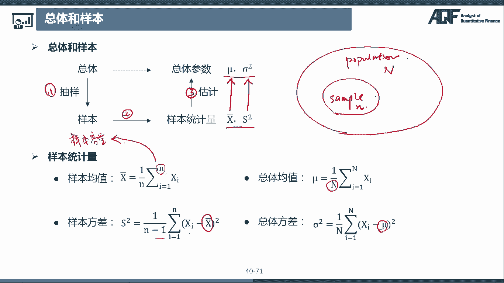

第三个样本统计量是标准差。那这个非常简单，那标准差就是直接方差开根号。那样本标准差的话就是这个S的平方开根号呢，就是嗯这样子的形式啊，总体标准差就是总体的方差开个根号。那这个很简单。

那这里要注意的是标准差和标准物的一个区分。有很多同学在刚开始学的时候，可能这两个名词会有呃容易混淆。那标准差呢是衡量数据的分散程度，嗯是叫做SD也就是standard deviation。

那标准物呢是standard error。好，那这个标准物是什么东西呢？那标准物它其实本质上也是一个标准差，但是注意一下，它是样本统计量的标准差。那比如说我们之前说了哪些样本统计量。

样本均值样本方差样本的标准差，对吧？那比如说样本均值的标准物是。SEM等于根号N分之西格玛。哎，它为什么是等于这么多呢？我们之前在讲这个中心底极限定理的时候，是不是有讲到X8是浮从均值为缪。

然后方差是N分之西格玛方的一个正态分布呀。那说明这个X8样本均值的方差是不是就是N分之西格玛的平方，那它的标准差是不是就是这个西格马N分之西格玛平方开根号，那是不是根号N分之西格玛。哎。

那样本统计量的标准差，也就是标准物。那这个的话就是样本均值的标准物。好，那这个是标准物是什么？那标准物有什么用呢？那我们来看一下标准物是衡量样本统计量抽样误差大小的尺度。

也就是说这个数据呢是衡量样本统计量的抽样误差的，它是来衡量一个误差的。也就是说我拿这个样本量。也就是说，我拿这个样本统计量去估计总体参数的话，估计的准不准确。好，那既然它是误差的话，那肯定是越小越好了。

对吧？比如说样本均值呃是服从均值为缪方差为N分之西格玛平方的正态分布。那我们看到如如果是画在图上的话，正态分布是不是这样的一个图形。然后它这个中间的话是缪，然后它的分散程度呢是N分之西格玛的平方。

那如果说这个样本。均值的方差越小，那它这个。分布是不是越集中，也就是我们这个图形其实就是越瘦，对吧？也就是它可能是呃长这个样子的。那么我们每一次抽取一个样本计算出来的样本均值。

很大概率上都是在总体均值附近，对吧？因为我们看到这里的话，概率是非常大的。然后到这里的话，概率是不是非常小的。也就是说我们抽取出来计算出来的样本均值基本上都是在啊这个附近在这个m的附近。

那如果说我们这个样本均值它的方差很大。比如说我们是这个胖胖的这个分布的话，那我们是不是计算出来它的这个样本均值在这个地方的概率也是挺大的呀。

比如说在这个地方的概率也是挺大的那这个数值是不是离样本呃离总体均值就比较远了呀？好，那我们来看一下样本均值，它的方差是N分之西格马平方，对吧？也就是说它的这个标准物是根号N分之西格玛。

那么看到这个N是不是就是样本容量呀？也就是说我们这个样本容量越大，那这个N是不是越大？它的分母越大的话，这个整个值是不是越小？那也就是说样本容量越大，这个样呃样本均值的标准物就越小。

也就是说它的误差越小，那这个其实很好理解了。因为如果我们最极端的情况就是取整个总体作为样本，那这时候样本容量是不是就是这个大N了？那大N是不是最大的这个数值。

那这时候我们计算出来的样本均值其实就是总体均值了。好。那如果说我们这个样本抽取的样本数量比较小的话，比如说这也就是说这个N比较小的话，嗯，比如说我们只抽取这个100个人作为一个样本。

那这个样本是不是不一定能很好的描述总体？比如说我们可能一抽，正好抽了，全部都是呃这个篮球队的人。那这个是不是偏离总体均值就比较多了呀？所以说样本如果过于小的话，可能误差就会比较大。

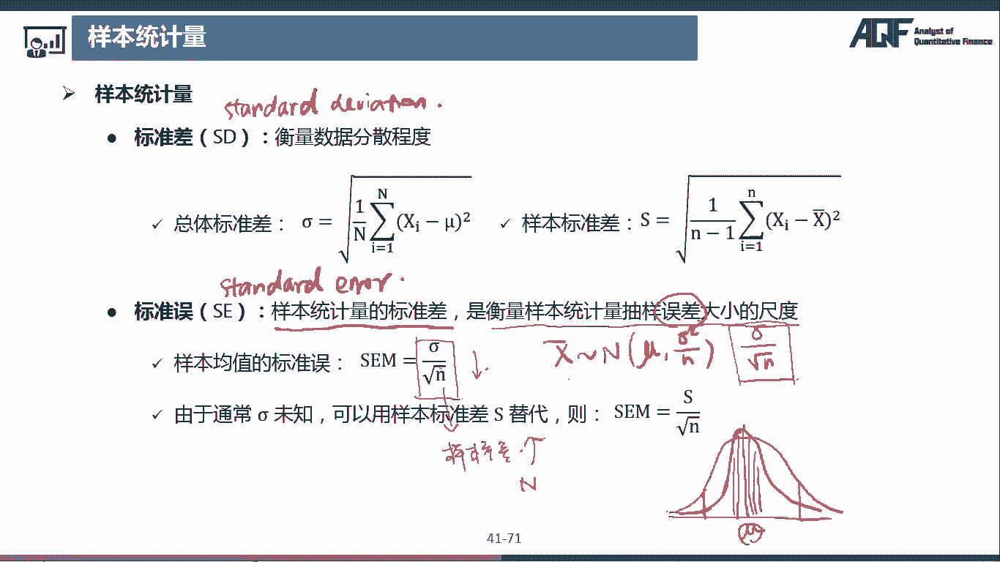

那因为样本呢是我们从总体中随机抽取出来的，所以我们每一次抽取样本计算出来的这个样本统计量是不是也是不同的呀？所以说样本统计量也是一个随机变量。那样本统计量服从的分布式叫做抽样分布。

我们这里的话给大家介绍三三大抽样分布，卡方分布T分布和F分布。那抽样分布主要是用在假设检验上面，大家只需要记住推导式和图形就可以了。也就是说，只要把这个PPT上面的内容掌握就可以了。

然后具体什么概率密度函数啊，累计分布函数啊，这些嗯，大家就不需要掌握了。好，我们来看一下，首先是卡方分布。如果N个相互独立的随机变量，X1X2到XN均服从标准正态分布。哎。

标准正态分布是不是就是这个N01。则Y等于X1平方加X2平方，加加加一直加到XN的平方是服从自由度为N的卡方分布，即为Y服从自由度为N的卡方分布。好，那我们来注意一下，这里面有呃就是两个点。

那首先这个X1的XN都是服从标准正态分布的。那第二步呢是这个样本统计量Y的一个构造式，就是X一平方一直加到XN的平方。然后呢，它这个Y呢是服从自由度为N的卡方分布。大家注意这几个点就可以了。好。

那第四个点是这个图形。我们看到这个图形的话，如果自由度为十，哎，是这个蓝色的这个图，自由度为20，是这个橙色的这个图。然后自由度为30是这个绿色。这个图。我们看到它是不是都是啊这个大于零的啊。

那因为这个很好理解嘛？因为Y的话都是平方和，平方和肯定是大于零的，所以它这边都是在这个零的右边。然后我们看一下它这个图形是呈现一个右偏的状态，也就是正偏，那这个是可以看到我们这里的一个尾巴是在右边。

那我们之前是不是讲到它尾巴在哪边。如果说尾巴在右边的话，是不是就是右偏，那因为这个右边的话是正数，所以它也叫做正偏。好，那期望和方差是N和2N的这个稍微了解一下就可以了。好。

第五个要记住的点是这个随着自由度的增加，卡方分布接近正态分布。那么看到它。随着这个自由度的增加的话，这个图形一直在往右移动，同时它的偏态也在降低。你看像这个绿色这个的话，它其实已经非常呃。

非常就是轴对称了。那如果说这个自由度更大的话，它最终的话是会非常逼近这个正态分布。好，第六个点是可加性。如果X1平方，那这个的话其实是一个随机变量。比如说我这里话叫做Y一吧，然后这个的话是叫做Y2。

那Y一是服从自由度为N1的卡方分布。Y2是服从自由度为N2的卡方分布。并且这个Y1Y2是相互独立的。那么Y1加Y2。也是服从卡方分布，并且它的自由度就直接是N1加N2。好，那这个是卡方分布。

大家记住这几个点就可以了。

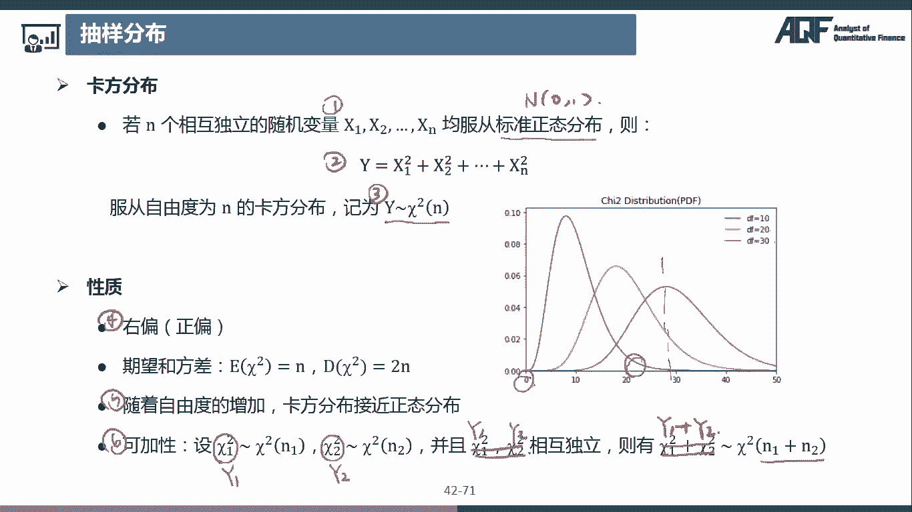

第二个是T分布，设X是服从标准正态分布，然后Y呢是服从自由度为N的卡方分布，并且XY相互独立，那么随机变量。T等于X除以一个呃Y除以N开根号，这样的一个随机变量是服从自由度为N的T分布。

即为大T服从自由度为N的T分布。那这里的话也是三个点。那第一个呢是这个XY，它们分别一个是服从标准正态分布，一个是服从卡方分布。然后他们构造出来的这个随机变量是服从呃是长这个样子的。

这个定义式是这个样子的。然后第三个是它是服从一个自由度为N的T分布。好，那第四点是这个图形。那这个图形T分布的图形是对轴对称的那是根据这个呃零轴对称。然后注意一下它是肥尾，也就是说，相比于正态分布来说。

这个T分布这个尾部会更厚一些。那注意一下它这里是其实是没有间峰态，是因为它的方差其实和标准正态分布是不一样的。我们看一下它的期望是零，它的方差是N减2分之N是不是小于一的呀，是小于标准正态分布的。好。

然后。第五点，随着自由度的增加，T分布也是接近标准正态分布。那么看一下这里的自由度从15到30，分别是这个蓝色的，然后橙色的。然后这个绿色的，它是不是一直都是呈现一个这样在向上的一个状态。

然后它的尾部是不是也是越来越薄。如果说这个自由度非常非常大。一般来说，我们认为当自由度大于等于30的时候，我们它就可以近似的看作一个标准正态分布了。那这个特征的话也是需要记住的。好，那这个是T分布。

大家就是记住这5个点就可以了。第三个是F分布。设XY是两个独立的随机变量，并且X是服从自由度为M的卡方分布。Y是服从自由度为N的卡方分布。哎，那我们注意一下这两个XY呢，它都是服从卡方分布的。

这是第一点。然后第二点是这个构造式，我们看到它是这个呃F统计量呢是等于X除以M，然后再比上一个Y除以N。也就是说它们分别将它们这个自由度给除掉，然后再进行一个呃这个比值。好。

那这样的一个统计量呢是服从自由度MN的F分布记作。F是浮从FMN。好，我们来看一下它这个图形的话也是右偏的。比如说我们这个这个蓝色的这个线和橙色的这条线是非常明显它这个尾巴是在右边，包括这条绿色的线。

它的尾巴也是在右边。那它这里面的其实这里漏掉了一个，它随着自由度增加的话，也是逼近正态分布的。比如说我们看到这里DF1DF2都等于30的时候，它这里的偏派是不是明显降低了？

这个这个绿色的线的偏态是不是明显比这个蓝色和橙色的这个线要低，就是说它更加的轴对称，对吧？好，然后这个是第五点，就是正态分布逼近正态分布。然后第六点呢是说，如果随机变量T是服从TN。

也就是自由度为N的T分布，那么T的平方是服从F1N。哎，那这个是为什么呢？这个其实是可以根据我们的这个呃定义式推导出来的。

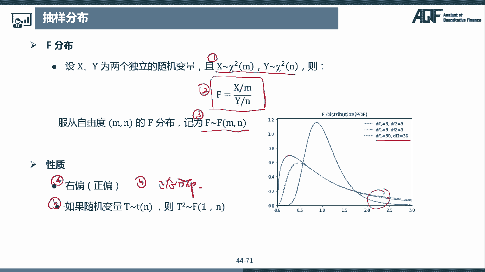

那我们来开一个空白的PPT。呃，看一下。那这个性质其实是非常容易推导出来的。那他是说如果随机变量大T是服从一个T分布，那么T的平方是服从F分布。那我们首先就要看T分布。

那T分布是不是呃T等于X除以一个Y除以N开根号这样的形式。那这里面的话X是服从标准正态分布，Y是服从自由度文的卡方分布。那如果。T平方是不是就等于X平方，然后Y除以。哎。

那这里X的平方是不是就是服从自由度为一的这个卡方分布，然后我们把它除以一除以它的自由度。那Y是卡方分布除以它的自由度为N。那这个的话是不是就是这个F分布的定义式那。他的话就是服从EN这样的一个F分布。

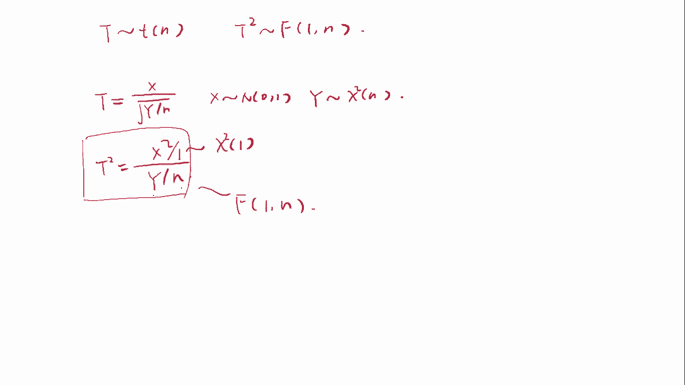

好，那这样子的话，我们就是把这门课程中所有概率分布都跟大家讲过了。那现在的话跟大家呃总结一下。

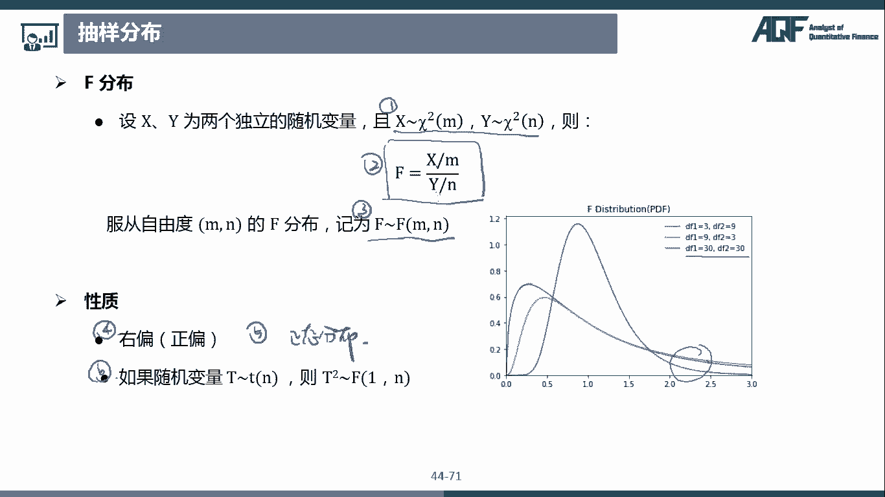

那首先我们来看这个最新学的这个抽样分布。那抽样分布我们是不是学了三个，一个是卡方分布。一个是T分布。一个是F分布。那卡方分布是说，如果X1X2到XN都是服从标准正态分布的话。

那么这个Y等于X1平方在X2平方加加加加到XN的平方，是服从自由度为N的卡方分布。好，那T分布是说，如果X是服从。呃，这个标准正态分布Y是服从自由度为N的卡方分布，那么T统计量是等于X除以Y除以N。

然后开根号。那这个呢是服从自由度为N的T分布。那F分布呢是说如果X呃。是说如果X是。服从。自由度为M的卡方分布。Y呢是服从自由度为N的卡方分布。那么F统计量等于X除以M，把它自由度给除掉。

Y呢就是除以N。那这个统计量呢是服从自由度为NN的F分布。好，那这个是三大抽样分布。那接下来呢我们再稍微复习一下之前学过的。那首先是不是这个离散分布？那最简单的就是博努力分布。

也就是一次博努力试验的这个结果。那因为它只有零和一两种结果，所以它也是叫做零一分布。那博努力分布肯定就是只有一个呃参数P，也就是它成功的概率。那如果说连续呃进行，那如果说进行N次独立重复的博努力试验。

它这个成功次数是服从二项分布。那二项分布的话就是有两个参数N和P。那我们记作X是服从这个bynoialdi，然后N和P两个参数。那如果说二项分数二项分布中的这个N是趋向无穷，P趋向于零。

并且N乘以P是一个稳定值的话，那我们可以使用泊松分布作为二项分布的逼近。那们记住X复从。泊松分布，然后泊松分布呢是只有一个参数是兰姆da，那 lamb姆da其实就是等于这里的N乘以P。好。

那这个的话是我们学习的离项分布。那连续分布。我们是不是首先学习了一个均匀分布，那均匀分布很简单。均匀分布的这个概率密度函数呢是一条直线。那如果说是服从这个A到B区间上的均匀分布的话。

那就是X服从这个呃UAB。那第二个是指数分布。那指数分布其实和上面这个博松分布是紧密相连的了。那博松分布研究的是这个博松过程中，事件发生次数。那指数分布研究的是两个事件发生之间这个时间长短。

那因为时间的话是一个这个连续的数值，所以它是一个连续分是一个那因为时间的话是一个连续型的随金变量，所以是服从连续分布。那指数分布的话，我们记作X服从这个exponential。

然后它也是和博松分布一样的参数兰da。那接下来呢是正态分布和对数正态分布。那正态分布的话，我们之后用的非常多，但是记作X服从N，然后缪西格马的平方，那这个缪就是均值，然后西格玛平方就是方差。

那对数正态分布的话是论X是服从正态分布的。那如果论X是服从正态分布的话，那么X就是服从对数正态分布。那最后的话就是三大抽样分布。那我们刚刚就是已经给大家总结过了呢，首先是这个卡方分布。是X复从。呃。

是YX都无所谓了。然后第二个呢是T分布。那T分布的话就是这个T是浮从。T分布，然后最后呢是F分布。F分布就是F统计量呢是服从。自由度为MN的这样的一个F分布。好。好。

那这几个的话就是我们在这门课上讲过的所有概率分布了。那大家可以记一下。

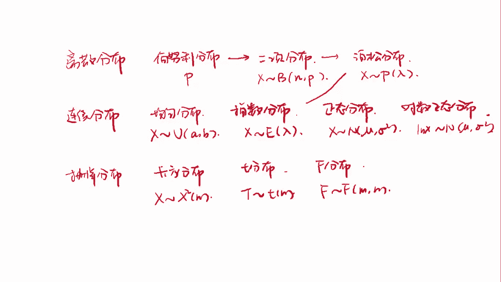

接下来我们来看一下抽样分布定理。那抽样分布定理是我们之后在假设检验中要用到的那这里给大家介绍三个定理。那这三个定理是大家需要了解掌握的。嗯，推导的话不需要大家掌握。我们来看一下定理一。

设X1X2到XN是来自正态总体N谬有西马平方的样本。X8S平方分别是样本均值和样本方差，则有Y等于N减1X平方除以西格玛平方是服从自由度为N减一的卡方分布。其中X8和X平方相互独立。

那这里的话大家就是要记住这个式子就可以了。那因为直接这么看的话，可能就是不知道这个式子是怎么来的。所以我们课上的话是跟大家就是推导一遍。

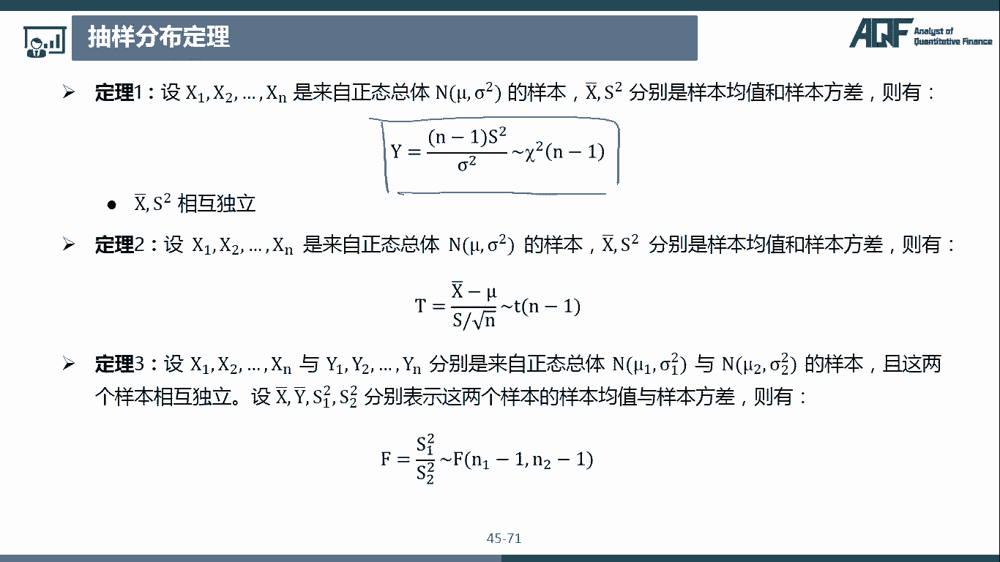

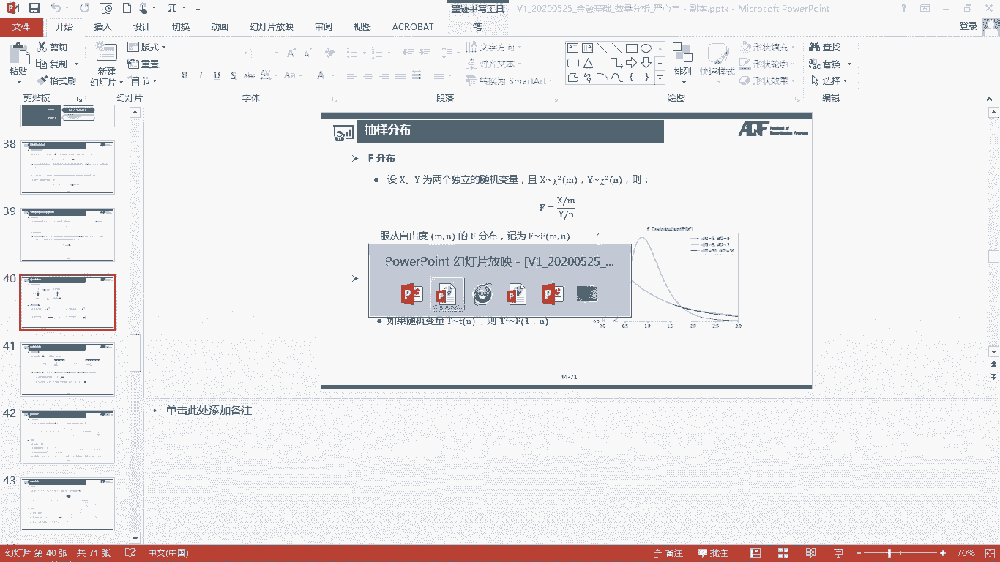

好，那首先的话我们是不是有这个X1到XN这个X是服从呃均值为缪，然后方差为西格玛平方的正态分布。那我们对X如果做一个标准化，是不是X减谬，然后除以西格玛是服从。01标准称达分布。好。

那我们现在要证明的是什么东西呢？我们是不是要说这个N减1S平方除以西格马平方是服从。自由度为N减一的卡方分布。那我们是不是要知道这个左边这个式子是等于什么东西啊？那上面的话这个N减1S的平方是不是呃？

呃，I等于1到N，然后。XI减掉X8的平方，然后下面的话除以西格马平方。那这里的话我们是认为这个缪西格玛平方都是一个常数啊，都是我们已知的参数。然后呢，我们将这个上面的这个式子改写一下。

我们把它改成XI减掉缪的平方。哎，那现在的话我们是不是要对比这个XI减缪平方和XI减X8平方之间的这个差别，把它给补齐，对吧？那我们首先这里的话减掉了2缪XI，那我们要把它加上加上2缪XI。

然后这里加上缪的平方，我们就减掉缪的平方。然后原来的式子里面是有减掉2X8XI。然后同时要加上XI8的平方。好，那这个上面式子是不是可以写成这样，来注意一下，这个是整个的。这个求和。然后C买平方。好。

那接下来的话，我们把这个左边这一块，然后还有这个右边这一块分开来来算。那左边的话是不是XI减掉缪的平方，然后除以一个西格ma平方。然后右边的话我们把这个每一项都来算一下。

那首先第一项我们是不是可以把这个二缪提到这个求和符号之前，那也就是2缪，然后XI的呃求和那XI求和就是N倍的X8，然后减掉一个N个缪平方，然后再减掉2X8。然后。这个XI求和又是NX8。

然后最后的话是N倍的X8平方。除以西格马平方。那我们看到这个上面是不是都有一个N啊，我们可以把这个N的话先呃就是。上下同时除一个N。哎，那是不是可以写成这样的形式？那也就是2缪X8减掉缪平方。

然后再减掉2X8的平方加X8平方。哎，那这个最后减掉2X8平方加X8平方，是不是就是直接减X8平方？好，那我们来看一下这个分子上是什么东西。那这个分子上是不是如果把这个负号提出来的话。

那是不是就是减掉X8平方，然后减掉2缪X8，加上缪平方除以一个西格马平方N。对不对？然后前面的话也是XI减掉缪平方除以西格马平方。好。那我们看一下这个X8平方减2缪X8加谬平方。

这个是不是就是X拔减掉缪的平方啊？那如果说我们把这个分母也写到平方里面去，那是不是就是。西格马除以一个根号N整个的平方。那前面我们也把这个西格玛放到这个平方里面去。

那是不是就是这个XI减掉缪除以西格马的平方？はい。😊，好，那我们这个其实就是我们最终的这个式子。那现在的话我们就可以呃推导出来了。那这里XI减谬除以西格马，那这个的话是不是服从标准正态分布？

然后它的平方，那这里面一共是有多少，是不是I等于一到N一共是有N个，那这个的话是不是？服从。自由度为的卡方分布。哎，那第二个的话，我们看到这个是什么东西呢？

那我们是不是中心极限定理中说了X拔是服从均值为缪，然后方差是CN分之西格马平方的正态分布，那我们也对它进行一个标准化，是不是就是X8减掉缪，然后除以一个西格玛。呃，除以N的开根号。

那这个是不是也是服从标准正态分布？哎，那这个的话是不是就是这个东西啊？那这个的话就是服从一个标准正态分布，那它的平方是不是就是服从自由度为一的卡方分布呀？好，那前面的这个呢是服从自由度为N的卡方分布。

后面这个呢是服从自由度为一的卡方分布。那它们相减的话，通过卡方分布的可加性，是不是它们这个整体就是服从一个。自由度为N减一的开发分布。哎，那是不是我们这个最终的这个结果就推导出来了。好。

那这个的话是呃这个抽样分布定理一。

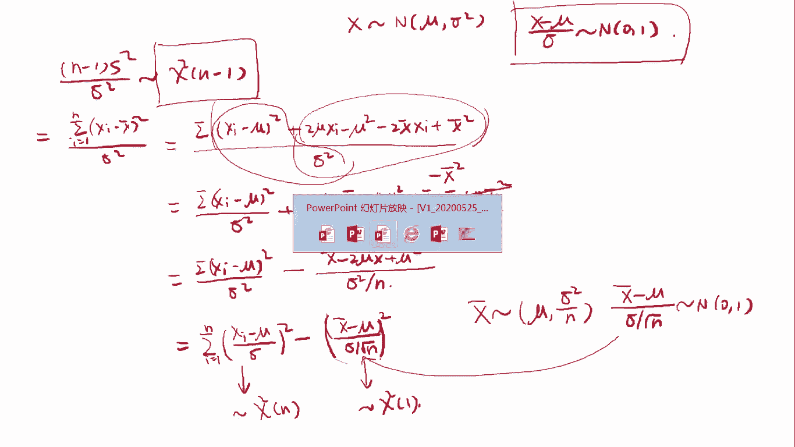

那定理二是说设X1X2大XN是来自正态总体缪有C呃N缪有西格玛平方的样本X8S平方分别是样本均值和样本方差，则有T等于X8减6除以一个S除以根号N，这个呢是符从。自由度为N减一的T分布。

那这个定理二的话是怎么推导出来的呢？定理二其实是要用到定理一的那我们也带大家推导一遍。

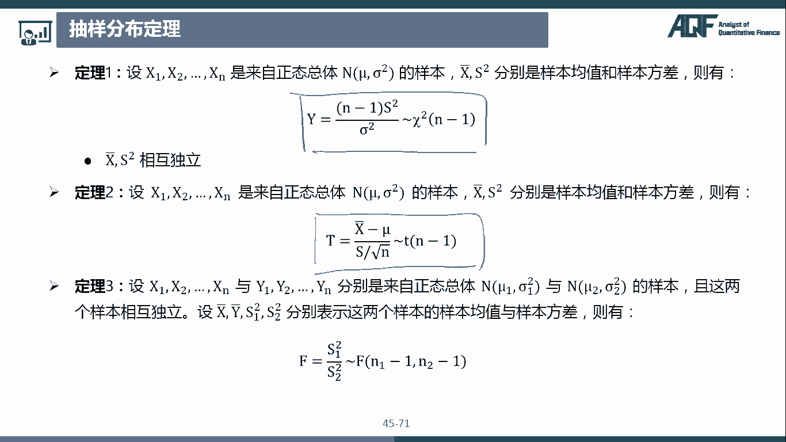

那抽样分布定理二呢是说嗯X8减6，然后除以一个X除以根号N，这个是服从自由度为N减1的T分布。那我们就往这上面靠呢，首先这里也是不是有一个X8，那么知道X8减谬除以一个这个。西格玛除以根号2。

那这个是服从。服从标准正态分布。那我们这个定理一呢，我们已经知道了N减1乘以S平方除以西格马平方是服从。自由度为N减一的卡方分布。那我们知道这个T统计量是不是XY。除以N，然后开根号。

那这个是服从自由度为N的卡方分布，其中X的话是服从一个标准正态分布。Y的话是服从自由度为N的卡方分布，然后把它自由度给除掉，然后开根号。那我们就是一葫芦画瓢套进这个公式上去。

那首先我们这个分子上是不是一个服从标准正态分布的那这里服从标准正态分布的，是不是这个X减掉缪除以一个呃西格马除以根号N，那这个是服从01标准正态分布。那下面的话是一个卡方分布除以自由度开根号。

那卡方分布，是不是我们这里有N减1S平方除以呃这个西格马平方，这个是呃它再除以它的自由度是N减1好开个根号好，那这个的话是不是就是服从这个自由度为N减一的T分布了呀？那我们把这个式子整理一下。嗯。

下面的话我们看到这个N减1N减一是不是可以除掉，然后就是X减减6，然后西格马除以根号N，然后下面的话是不是就是S除以一个西格玛？那接下来呢我们把这个分子上的这个分母放到分母上去，那其实就是X减缪。

然后下面本来是S除以西格玛，对吧？然后现在呢又下来一个西格马除以根号N，那西格马西格玛约掉，那现在的话是不是就是X把减缪，然后S除以根号N了呀？那这个的话是不是就是这个啦。

那这个是服从呃自由度为减一的T分布。好，那这个的话也证明完毕？

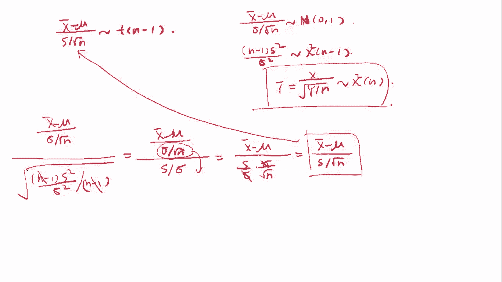

好，接下来我们来看一下电理三设X1X2到XN与Y1Y2到YN分别是来自正态总体N61西ma一的平方与N62西igma2的平方的样本。也就是说它是来自两个正态总体的样本。并且这两个样本是相互独立的。

设X8Y8S1平方S2平方分别表示这两个样本的样本均值和样本方差，则有F等于。啊，这里的话写错了，这里的话应该是呃上面还要除以一个西格玛一的平方，然后下面还要除以一个西格玛2的平方。那这这个。

才是服从N1减1N2减1的F。呃，F分布的。好，那这个的话也是跟大家来。

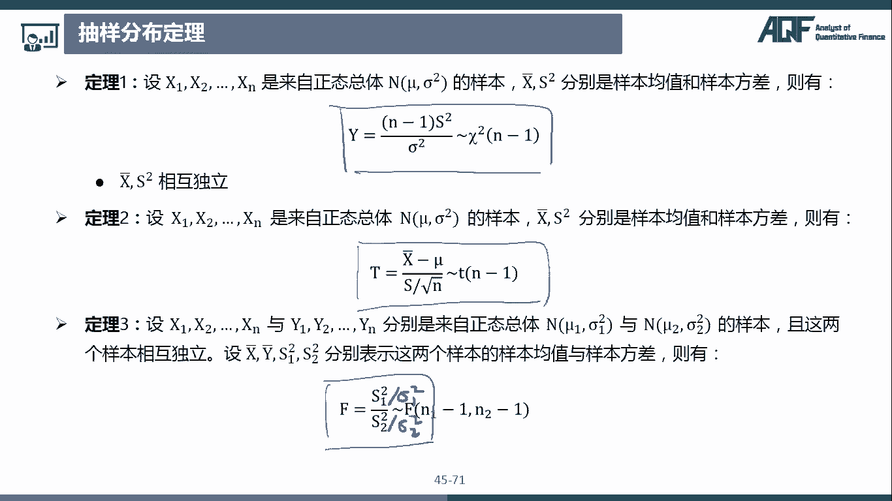

来推导一下。那我们要证明的是S1平方除以西马一平方，然后除以一个S2平方除以西格马2平方。那这个是服从N1减1呃N2减1的F分布。好，那我们来复习一下F分布是怎么构造的那F是不是等于X除以MY除以N。

那其中X是服从自由度为N的卡方分布，Y是服从自由度为N的卡方分布，对吧？那这里的话我们是不是就要套这个呃哪些是服从卡方分布的呀？那我们可以用到这个抽样分布定理一。

那定理一的话是不是N减1X平方除以西格玛平方是服从。N减一的卡方分布，那我们分别套到这两个正态总体里面去，一那一个就是N1减1S1的平方除以西格马一的平方。那这个呢是服从自由度为N1减1的卡方分布。

那第二个呢是N2减1S2的平方，除以一个西格马2的平方。那这个呢是服从N2减1自由度为N2减1的卡方分布。那我们把这个两个卡方分布分别除以它的这个自由度，也就是N1减1S1的平方。然后西格马一的平方。

这个是服从卡方分布，对吧？那除以它的自由度就是N1减1，那下面也一样，N2减1S2的平方除以N西格马2的平方除以它的自由度，N2减1。好，那我们这样构造出来的一个统计啊，它是不是就是复从一个F分布。

那F分布的话，它就是上面这个自由度除以呃上面这个自由度就是M，也就是N1减1，然后下面这个自由度就是N就是N2减1。那么来看一下这个左边的式子，那这个N1减一这些都可以约掉。

那上面的话是不是就是S一呃平方除以西ig玛一平方，然后下面的话就是S2平方除以西格玛2的平方。哎，那这个的话是不是就是和我们上面这个是一样的了呀。

所以这个的话其实推的还是非常简单的那这个是抽量分布定理3。

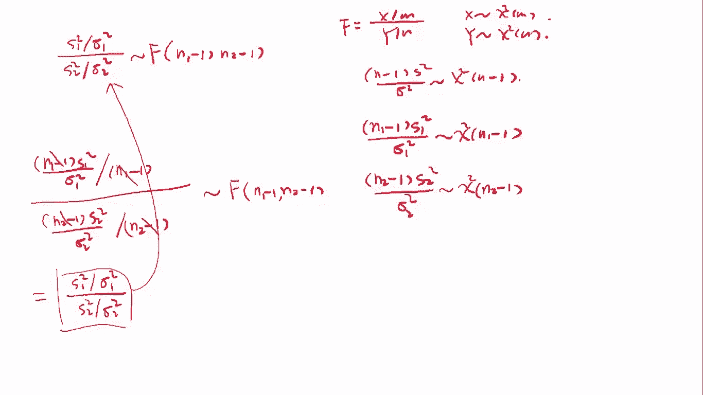

那这一些定理的话，大家就是知道这三个式子就可以了。具体推导过程的话，了解即可。

休息一下最新全套完整版课程和讲义，请添加微信，935989104。

