# 2024最值得学习的金融量化交易课程-第一讲：An Introduction to Machine Learning I - P1 - CQF金融学姐Lisa - BV1em411z7vL

现在来到我们的这个M4和M4，晚上好好久不见啊，接下来可能会经常见哈，接下来可能会见我见到烦的一个程度哈，呃呃M4的话呢，mm我们就进入这个机器学习的模块了，M4是关于嗯这个监督式学习的。

然后M5呢是针对非监督式学习的，然后呢我们会在嗯这两个模块当中呢，会认识到很多的这种就是呃机器学习的技术哈，以及我们会看一些就是这个Python的代码，怎么去对这些技术进行这个实施。

也就是说我们呃既要学这些技术背后的逻辑，他们背后的数学知识，然后我们也需要去学他们的一个应用，那么这个是这两个模块的一个情况嗯，我们今天这节课呢，其实是今天以及我们下一节课。

其实都是针对呃机器学习的introduction，就是这两节课呢其实大部分都是介绍哈，就是让大家先稍微的有一个嗯就是大纲吧，就是大概知道我们在这里会学到什么东西，然后每个技术呢会给大家简单的去呃。

提一提这些技术，它是一个什么样的一个技术，让它有一些怎么样的应用，那么这就是这两节课的一个情况，所以这两节课呢大家在讲到一些技术的时候，可能会觉得啊是不是有点有些细节无法理解呀，啊你都不用着急哈。

因为我们后面都会在这些，就是专门讲到这个技术的时候，再跟大家详细的去这个讲解哈，所以这两节课，其实大家还是可以稍微比较轻松的，然后呃呃我是第一次上模块四的内容哈，之前都是由seven老师来给大家去上的。

然后我上课的风格呢可能是我会更加去照顾嗯，就是新手，就是如果你之前没有接触过机器学习的话，那可能就比较适合上我的课，但如果说你之前已经比较熟练了啊，或者说你已经在这个领域比较啊。

就是接触了很长时间的话呢，其实你可以再回去看一下STEVEN老师的回放，因为他会在然后课程的这个过程当中，给大家去分享一些他的一个投资的经验哈，所以这个是我们两，我们两位老师的一个上课的风格。

给大家简单的说一下好，然后我们这节课introduction to machine learning的第一部分，就是我们会讲前面四个lecture哈，包括说呃，我整个模块四的课件已经上传到我们的那个。

高端的网校的系统上了，所以啊我用到的课件大家可以直接去下载，然后你就不需要再到我们的那个，就是呃那个city of portal上去下载了，就是我用的课件呢，就是可能有部分课程我用的是老课件。

因为可能老课件他讲的有的时候会更详细一些，然后呢还有就是如果说有啊就是比较新的内容，我也会去进行补充哈，所以我用到的课件已经就是以那个zip的方式发，就是上传到我们的网课上。

大家可以直接把那个zip下载下来，然后以后就用它里面的课件就好好，然后这节课呢就是非常基础的介绍我们啊，后面就是我们后面的课程，就是会有大量的机器学习的细节，包括理论编程等等，所以这节课呢包括下节课。

就是我们会给大家带来不同，机器学习技术的基本介绍，然后他们之间的比较以及数学建模，然后这节课给的example呢，基本上都不是金融领域的，就是嗯可能会有一点点金融领域。

但是大部分的example都是更贴近生活的，比较有趣的，然后更能够帮你去理解的，所以可能会介绍一些，比如说生活上的或者是什么政治上，因为我们就是他其实是对政治比较感兴趣哈。

他会也会给大家介绍一些政治上的例子，然后呢，后面我们的呃lecture当中会有更多金融的例子，所以这里的话呢，我们今天主要是会使用一些生活化的例子，来介绍机器学习它可以做什么好。

在这个lecture当中呢，我们会学到，首先就是啊这种经典数学建模的规则，那么经典数学建模，我们其实之前已经接触过很多了对吧，M1M2M三，其实大量的都是经典数学建模，然后数学经典数学建模它可以做什么。

然后其实还是可以做很多很多事情的哈，啊只是比较可惜的是一些研究机器学习的人，他们并没有非常去关注数学模型，但是如果我们既学了经典数学，又可以学机器学习的话，那么其实我们是可以把两者。

很多时候是可以结合起来，然后去用到他们的优点的，然后我们会给大家去介绍一下，就是机器学习跟经典数学模型有什么区别，然后第三个就是我们会给大家去，很简单的去关于机器学习，主要技术的一些介绍啊。

一些就是呃原则的介绍吧。

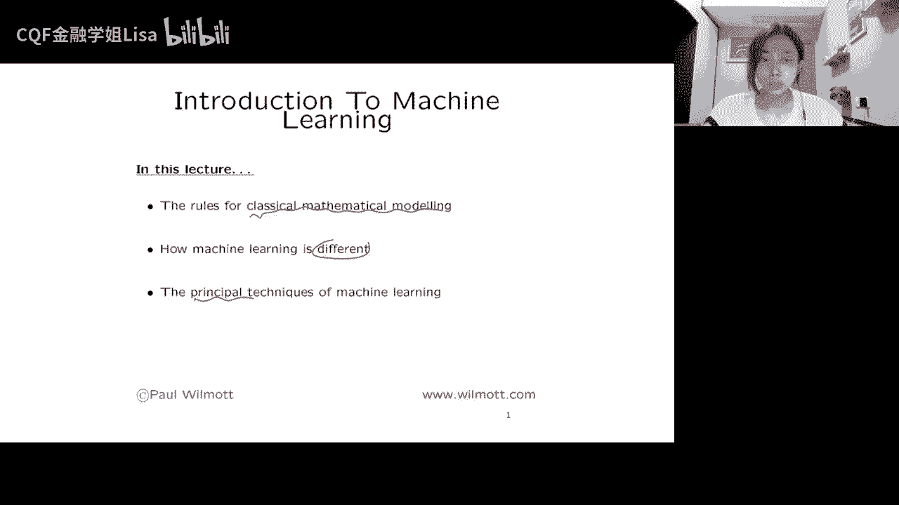

好然后我们来看一下这个introduction，好，这个呢是呃在维基百科上关于机器学习的定义，那么他是这样说的，他说机器学习是计算机科学的一个领域，然后它使用这个统统计技术来赋予计算机系统。

使用数据来学习，就是使用数据学习的能力，那么学习的话呢，其实就是说逐步去提高，他们完成特定任务的一个性能，这是他学习的一个概念，然后嗯它可能不需要哈，很多时候是不需要用到明确编程的。

因为我们其实后面再给大家去介绍代码的时候，想死我了，我也很想念大家啊，我很很很开心，可以再跟大家上课，然后嗯就是自己学习它，就是用数据和统计技术，然后把它们去扔给计算机，就是把这些数据去扔给计算机。

然后呢你所拥有的就是数就是机器学习哈，它是这样去定义，然后呢机器学习它是需要大量的数据的，因为机器它其实就是在自己去摸索，数据的一个模式，去自己去总结数据的规律，所以呢机器学习它可以做很多很聪明的事情。

有的时候就是你都不知道他是怎么去总结出来，或者他总结来总结出来的规律，是我们压根就没有注意到的，然后所以机器学习的关键词就是数据，计算机好，没考一三哈，没关系，我们慢慢考都可以哈。

跟着自己的节奏来就好了，好，还有就是呃除了数学呃，除了数据计算机之外，还有就是统计技术，比如说回归，因为回归它其实也是机器学习的一个分支嘛，那么这个呢就是维基百科上对于，机器学习的一个定义好。

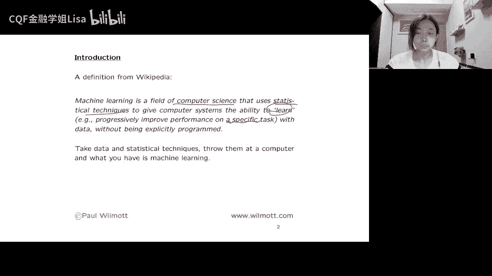

然后我们说机器学习的核心就是学习啊，learning是它的一个关键，然后呢这个也是他和呃经典建模的根本区别，就是根本差别，就是在我们的这个经典建模的这个领域，就是所谓的你可能需要啊自己做下来。

然后用你自己的大脑，然后用你的自己的思想去构建数学模型，比如说你要去构建嗯什么PDE呀，随便什么模型，其实都是你自己构造出来的，你自己用自己的，就是你自己想出来的，就是这里说的是在传统的这个建模当中啊。

你会拿着一张纸，然后一支铅笔，然后可能一杯麦芽酒的话，就随便你什么你喜欢的酒，然后你坐下来，然后呢你可以写一些比如说微分方程，然后呢去了解，比如说你想研究通胀啊，对就是通胀会如何对利率变化作出反应啊。

然后随着这个通胀的一个上升，那中央银行会怎么样通过提高利率去应对呀，啊提高利率导致什么呀，就是你你可能会稍微关注一下数据，但是呢就是你更多的是你自己去想，这个模型该怎么去建，你可能会做一些基本的统计。

但主要你使用的是你的大脑，就是不管出现什么问题，你都可以自己去构建模型，然后数据它可能只是用来去帮你，去验证你的模型的，那么这个呢就是跟机器学习的一个根本的区别，因为我们在面对机器学习的时候。

我们其实主要是把数据喂给机器，然后我们自己并没有去想这个模型。

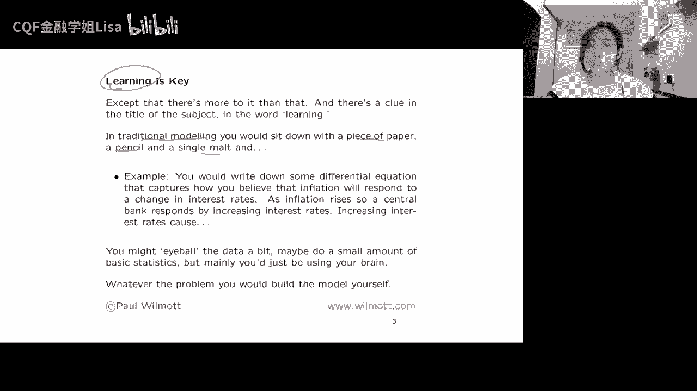

我该怎么去解好，所以在机器学习当中，我们啊就是你的一个roll，你在建模当中的作用是非常有限的，就是你可能就是决定一个框架，比如说你到底是使用啊神经网络呢，还是使用增强学习呢啊。

还是使用支持向量机呢对吧，就是你给到机器一个框架，然后呢你就把数据喂给这个机器，就是你就坐在数据面前，然后呢由这个机器他拿着这个数据自己去完成，其余的工作，就是算法他自己在学习啊，自己学习。

所以算法章当中呢有大量的参数，就是算法它是自己去学习，然后来估计参数来调整参数，来使得这个模型尽可能的好，然后嗯就是算法他自己去拟合这些参数，所以这个就是和这个古典建模，跟经典建模是非常不一样的。

就是古典建模是你自己去想这个模型，你怎么样去把它想出来啊，你自己坐下来思考，而这个机器学习呢是你不需要自己去建模，你只需要给到机器一个框架，让他去摸索，让他去建模，让他去调参。

就是啊就是估计参数调参就可以了啊，这就是经典数学建模，跟我们机器学习建模的一个根本的一个区别好。

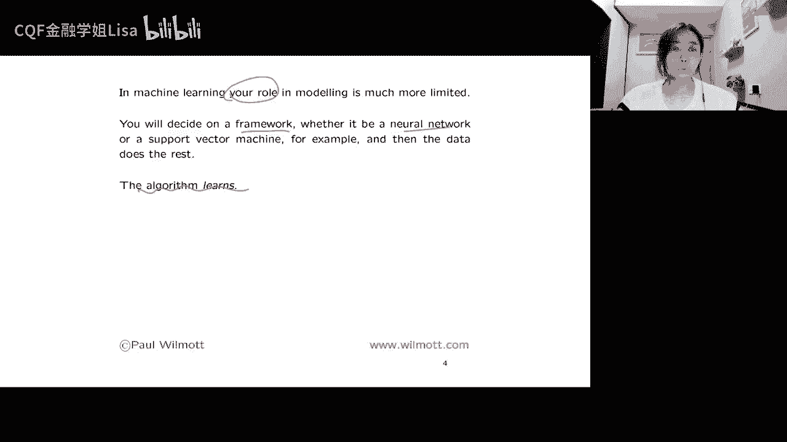

然后我们来看一下它的一些历史哈，就是还是要了解一下它的历史，你才知道它的一个根本逻辑是怎么样的，那么这边的话呢我们会介绍一个人物，叫做啊download mitch，然后嗯他是在这个应该是二战之后。

然后他呢就是在第二次是在大战期间，然后TODOMITCH呢，他是曾经和他的一个同事叫做艾伦图灵啊，大家可能都听过艾伦艾伦图灵，但可能没有怎么听过TNLMICHI哈，然后呢他跟他的同事艾伦图灵呢。

在这个这个布莱切公园，然后一起去研究哈，就讨论一些就是一些关于密码和代码，破解的一些东西对，然后呢在这个战争之后呢，就是呃download mitch呢，他作为爱丁堡的一个呃教授，一名教授。

然后他就把他的注意力转向了，要去训练计算机玩哈，像训练电脑去玩这个north and crosses这个游戏，就是这个游戏也可以叫tick tt哈，就这种这个游戏，其实就是我们中国的那种圈叉游戏。

就有点像是五子棋，但是呢它不是555个旗成一条线就赢，它是三个棋乘一条线就赢，所以这个就是TIK加错，就是我们在中国也可以叫做也就是圈叉游戏嘛，圈叉游戏也就是说嗯他有这样的一个一个棋盘。

就这样一个井字棋盘，然后两个人轮流在这个井字形的这个，九个九宫格当中去画圈或是画叉啊，只要有就是谁先把就是三个圈或者三个叉，连成一条线，不管是横着还是斜的，那么它就可以获胜。

然后当时呢就是DOWNMITCH呢，他就想要去训练电脑，去玩这个游戏，然后呢嗯这边说其实其实与其说是一个电脑，不如说是一个火柴盒阵列，就是很多很多的火柴盒，因为他们他其实是把这些。

他把这个九宫格的就是状态哈，就是画在了很多很多的火柴盒上，就比如说一个人他在这儿就是下了一个圈儿，那么他就会把这个状态划到一个火柴盒上，所以他准备了很多很多火柴盒来。

对应着去画很多很多种就是下下棋的状态，然后他当时一共准备了304个火柴盒，然后每一个火柴盒就用来代表啊，这个某一个这个比赛的一个状态，就比如说嗯比如说这个是一种状态，然后呢比如说他在下一个人。

他再画个叉对吧，再画一个叉在这里，那么这就是第二种状态，就是又是另外一种状态，又需要一个火柴盒，所以呢就是它有多少种状态，就需要多少个火柴盒，然后为什么他只需要304个火柴盒呢。

其实是因为他把那些就是可以反转之后的，那种状态也归于同一种状态，是什么意思呢。

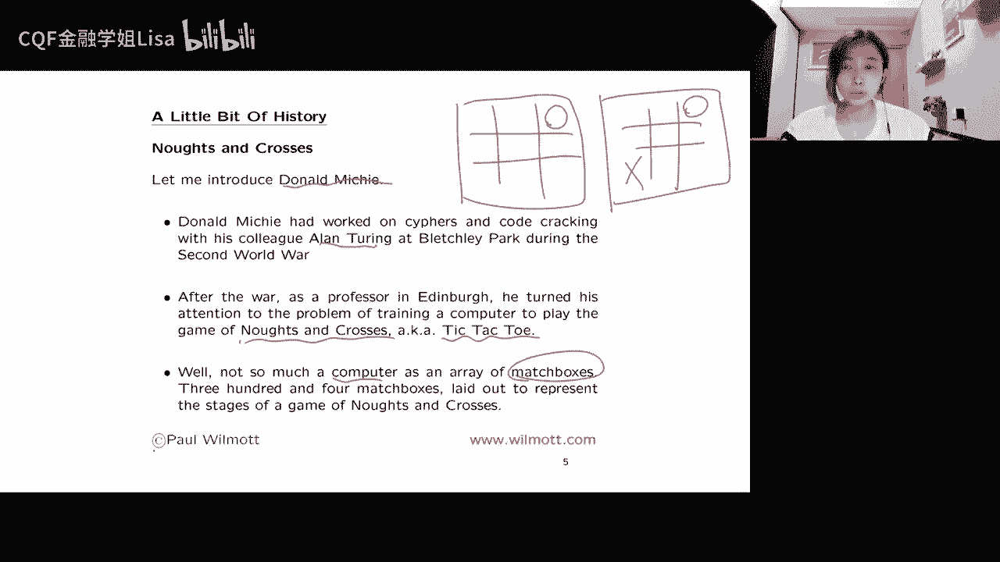

就是说它在每一个火柴盒上都画了一个圈叉，游戏的状态，然后因为这个火柴盒它是可以旋转的对吧，摆过来摆过去，往左边摆，往右边摆，或者是直接倒过来呀，怎么样的，所以呢他走比如说一个人。

他走这一步就在这画个圈儿，那其实他反转过来，就是比如说像左边旋转一下，那么这个圈就到这儿，那么它也属于同一种状态，或者说它再旋转一下这个圈到了这儿，或者说旋转一下这个圈到这儿哈，反正你旋转。

不管你怎么旋转，它这几个都属于同一种状态好，所以嗯他这样的话呢，就可以把火柴盒上的状态数量，就减少到304个，所以这个途中呢，其实就是也是其中一种可能的状态对吧，所以你可以看到。

这其实是双方已经各走了两步了啊，各走两步了，所以接下来的话呢可能又该这个差，这个就又该一个人去画差了对吧，所以如果说我们是人在玩这个游戏的话，就是你可能很清楚你接下来该怎么去画啊，该怎么去下这个棋。

然后可以让你获胜，但是如果说是计算机呢对吧，如果是啊，你要让计算机去搞清楚，接下来该换，比如说在哪画叉的话呢，对吧，所以呢就说传统上，可能人们可以用游戏的所有可能状态。

和每一种情况下的最佳下一步来做写信的编程，就是以前的那些传统的游戏，他是要去告诉这个计算机啊，你就是你的规则，我们的规则是什么，然后你下一步应该怎么样去用这个规则，然后去下棋。

但是呢其实呃当闹米奇他并没有这样做，他并没有啊，他也没有办法去告诉这个火柴和我们的游戏，规则是什么，然后他这里让这个火柴盒，会让这个计算机学习的一个方法是。

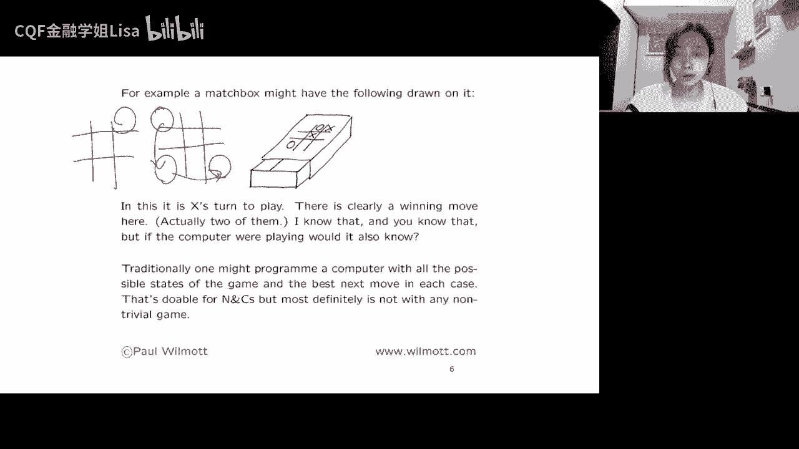

就是他用了一些彩色的珠子来填充，它的这304个火柴盒，就是啊每一个颜色的珠子，就代表这个网格当中的一个空单元格，也就是说，只要这个单元格当中还有一些是没有下的，是空的，那么它这个对应的就会有一些颜色哈。

它每一个格子都会对应一个彩色的，一个这个弹珠，然后呢只要它某些格子是空的，那么就会它对应的这个颜色弹珠，就会放在这个火柴盒里面好，然后呢他就怎么说呢，因为它利用了对称性，所以否则的话呢。

它的火柴盒的数量，应该是远远超过304格的好，然后呢接下来的话呢这个呃怎么玩呢，他就直接摇动这个火柴盒，他就也不会去看诶，我下一步到底该画就是在哪画叉呀，他就随便摇动这个火柴盒。

然后随机的去从这个火柴盒当中取出一颗珠子，然后呢，这个珠子肯定就是对应的是，就是我们某一个应该下的那一步嘛，比如说你取出一个深蓝色对吧，你取出深蓝色这个珠子，那么其实你就是在告诉这个火柴盒好。

我下一步需要在这画表达，就是这样，通过这样的方式去告诉这个火柴盒，这个计算机我下一步哈，就是我是在哪里下的啊，所以他就给到我们下一步的行动啊，走了一步，然后呢就是你的比赛继续对吧，继续进行。

然后下一个该画圈了，又是同样的要从这另外一个，因为他这个时候他下了一步之后，他又换到另外一个状态了对吧，另外一个状态就是另外一个火柴盒，然后他又到火柴盒当中啊，随机的摇动，随机的抽出一个珠子。

然后这个珠子的颜色呢又会告诉他，在下一步是在下下在哪一步啊，所以他就不断的这样去重复哈，从一个状态切换到另外一个状态，就是从一个火柴盒切换到另外一个火柴盒对，因为一个火柴盒就对应一个状态。

他就不断的去重复这个过程，然后下一步该走哪里对吧，所以呢如果他挑出来一个黑色，那么下一步可能又该走又该走这里啦对吧，所以他每一次就是他从初始到，他每一次抽出的这个珠子，就是每一次的行动。

每一次的行为的路径，它都是要去记录下来的哈，都是要去记录下来的好，然后呢如果说最后就是我们赢了比赛，那么他就会说这个游戏当中使用的每个火柴盒，就是每个状态，每个火柴盒都会获得，就是额外的所选颜色的珠子。

比如说这个火柴盒他选的是深蓝色好，然后呢如果说他这个路径它是赢了的话，那么这个火柴盒呢就会去往里面去加一个，深蓝色的柱子，但如果说输了，就整个这个路径，如果说最后输了好。

那么在这个状态之下会这个每一个火柴盒当中，就是你对应下的这一步，这个颜色的珠子就会被拿拿走，也就是说如果你这个路径输了好，那么你这个状态当中的深蓝色的珠子，就会被拿走，然后如果你这个路径输了。

你这个状态的黑色的柱子就会被拿走，那为什么要这样设计呢，就是因为如果你输了，你就把这个盒子当中之前下过的那一步，对应的颜色的珠子拿走，那么下一轮再玩这个游戏的时候，你摇到这个颜色的珠子。

也就是你走这一步的可能性就会变小对吧，也就是说你犯错误的概率就会变小，但相反如果说你最后赢了，你每个使用过的状态的这个火柴盒当中，都会增加之前所选颜色的珠子，那么下一轮游戏你走到这个状态的时候。

你抽到这个颜色，就这个正确颜色珠子的可能性就会增大，也就是说你走这个正确动作的可能性就会增大，那么这个呢其实就是机器学习的过程，就是做了这个正确的动作，那么下一次继续正确动作的概率就会上升。

那如果说犯了错，那么下一次继续犯这个错误的概率就会下降，那么这个呢，其实就是机器学习当中的奖励和惩罚了，所以这个就是啊DOTMI他在设计这个游戏哈，怎么样让这个火柴盒学会下这个棋的一个思路。

所以他并没有告诉这个火柴盒，我们的游戏规则是什么，但是你通过这样去设定奖惩，这火柴盒，最后他还是还是能够学会。

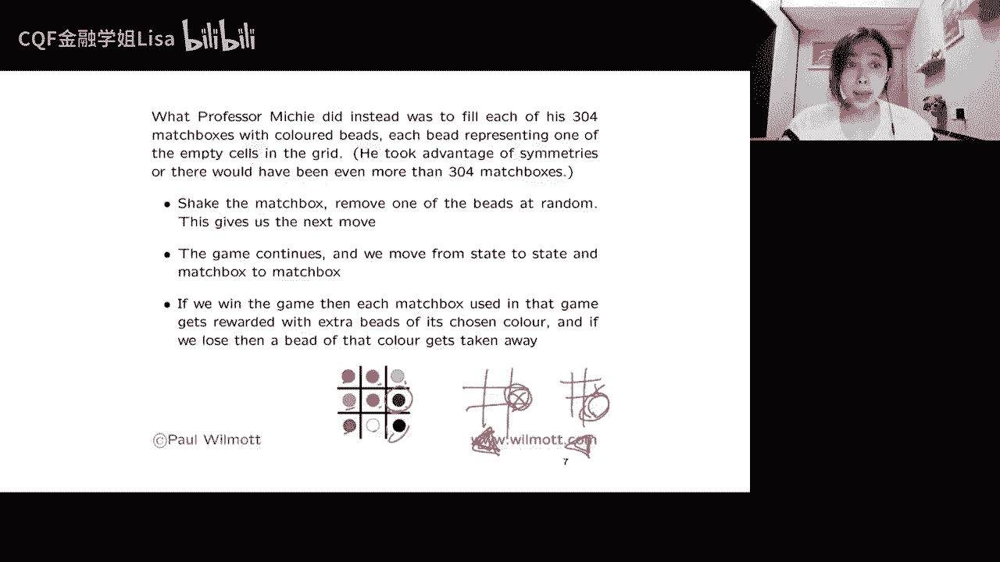

我到底该怎么去玩这个游戏好，所以就是多轮游戏下来的话呢，就是这个火柴盒当中应该就会装满了，代表某个状态最成功行动的珠子，也就是他每次到这状态，他就知道你该下哪一步了，所以这台机器呢啊。

TOMMISSION呢给它取名字叫menus menace，就是machine ek educable north and crosses engine，那这样的一个啊一个名字哈。

机器教育的north and crosses引擎，然后也就是说啊，这个火柴盒或者这个机器已经学会了怎么去玩，Northern crosses，好，这个是最开始这个机器学习，它出现的一个呃这个来源。

然后我们再来看一下，就是这些学习在过程当中，还有一些非常重要的事件，比如说ALPHAGO，那么呃ALPHAGO的话呢是google demand他们的一个这个团队，就是编程计算机学习围棋嘛。

我去下这个围棋，然后呢嗯就是阿尔法go的话呢，他很快就击败了这个是九段的围棋选手，叫做啊LEEDLE，Leedle，然后ALPHAGO呢它使用多种技术，其中包括像这个神经网络啊，增增强学习啊。

然后呢他再次学会了，在没有明确规则的情况之下，就是没有告诉他这个游戏的规则，规则的情况之下，他学习该怎样去玩这个游戏，怎么去下这个围棋，然后呢有一部电影就叫做阿尔法狗，然后呢这个电影其实非常好看哈。

就是虽然它的名字感觉很无聊，但是这个电影其实还是值得大家去看一看的，那么这个电影呢其实就讲的是就是这个呃，欧洲为这个围棋冠军杨辉，他是第一个面对google人工智能围棋系统。

阿尔法go的一个这个职业围棋手，然后当当他去就当他被邀请来到伦敦，就是去访问开发出了alpha go的，这个DeepMind公司的办公室的时候，他当时还是觉得很有信心的。

因为毕竟他觉得ALPHAGO只是一个程序哈啊，当时其实嗯反馈的这个自信确实还是很有理由，因为尽管人工智能在当时，最近几年确实获得了很多啊很好的成就，但是其实长期以来呢在围棋这个领域呢，还是鲜有建树的。

然后用google CEO的那个用google DeepMind的CEO啊，就是叫啊詹姆斯哈萨比斯的话来说，就是围棋就是棋盘游戏的顶峰，然后呢嗯哈萨比斯他自己其实就是围棋，就是世界级的一个棋手哈，对。

然后毕竟呢就是还从来没有任何一个程序可以，在真实的棋盘上去击败这个人类职业棋手，所以当樊辉他下午在伦敦开始去对弈的时候，他并不觉得会遇到什么挑战，但是呢就是阿尔法狗呢不是普通的危机程序。

就他是DeepMind，几十个科学家在创新工程当中研发的一个产品，而且重要的就是阿尔法go，他对弈的棋局的数量已经非常非常多了，然后并且呢就是通过这些对弈，他训练了自己对深度学习的。

这个就是深度学习的网络，然后增增强了他的一个就是呃棋力嘛，还是下棋的一个能力，所以当反馈他跟阿尔法狗下棋的时候，就是阿尔法go，其实已经学习了超过16万局顶级棋手的棋谱。

然后呢还和自己下了3000多万盘局，所以当樊辉发现自己，即将要输给阿尔法狗的时候，他突然就意识到就是自己的世界，甚至说整个职业围棋界都会永久地发生改变，所以曼CEO就是这个哈萨比斯，他说过一句话。

他说啊棋盘上的排列组合的数量，甚至是比这个宇宙上的原子的数量还要多的，那么如果说你要像像DONNAMEI那样，用火柴盒来表示状态的话，那么你可能需要比304个啊，火柴盒多得多的火柴盒。

你可能需要用火柴盒去填满整个已知的宇宙，所以这个就可以显示出来，就是在下围棋这种棋盘游戏的时候，我们的人工智能的一个能力的一个体现好。

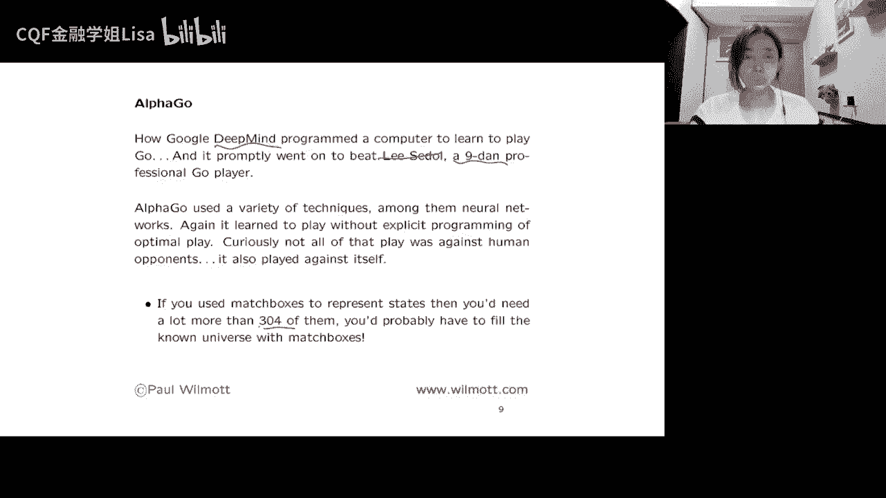

所以他当然还有提到一些细节，他说有的时候啊电脑会做出一些奇怪的动作，他在下棋的时候，他可能会下一些棋，让人类觉得很奇怪，然后呢就是可能任何一个职业围棋选手，他都不会考虑下这一步。

但是呢就是嗯就在电影当中哈，就有的人会讨论说这个是编程错误啊，还是说这是模型缺乏足够的训练呢，啊还是说这个就是这嗯，还是说这个就是呃就是一个电脑天才呀对吧，但是最后的事实证明就是这些所谓奇怪的动作。

其实就是计算机更聪明的一个体现，更聪明的证明，因为他们最后都是还是赢得了这个比赛的，对以前啊人们是向更专业的棋手去学习下围棋，但是现在的话呢人们可能要像计算机去学习，怎么去下围棋了。

好这个也是就是呃阿尔法go的一个一个故事吧，大家如果有兴趣可以去看一下那个电影好。

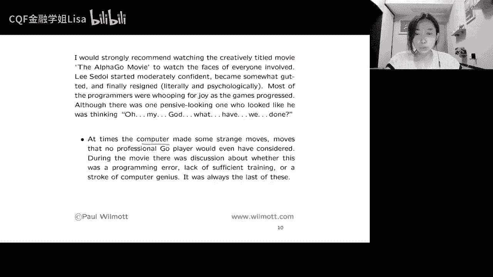

然后呢，我们接下来介绍一下我们机器学习的一些嗯，关键的方法论哈，一些主要的技术类别，那么其实我们主要是有三种主要的基础类别啊，分别是监督式学习，非监督式学习和强化学习，然后呢我们会有会给大家介绍。

大概九种具体的机器学习技术，然后这九种技术呢，它就是分别是属于某一种这个类别的，所以我们可以先来看一下就是监督式学习啊，监督式学习它的特点是什么，监督式学习的特点就是啊既有input，又有output。

就是你的数据是有标签的对吧，是打了标签的，那这个我们后面会跟大家去讲哈，我们会在M5的时候给大家去讲transformer，尤其是讲到自然语言处理的时候好，然后呢我们的输入它是一个向量。

也就是我们不止一个变量，然后呢我们可以使用监督学习去进行回归，然后预测我们输入的任何数据点的输出数值，也就是说啊，比如说我们的input可以是比如每天不同时间点，不同温度对应的电量。

那么接下来的话我们如果想要去就是啊，预测用电量对吧，只要你输入这个温度，输入一天当中的时间，那么你就可以预测用电量，那么这个就是非常典型的监督学习啊，或者说我们也可以把监督学习用来去做分类。

就是比如说啊我们有一些就是input，就是一些呃狗的照片哈，狗的图片或者是对狗特征的一些描述，比如它的颜色呀，它的毛发的软硬啊，他的身高体重等等，然后它的output呢就是它们的分类。

比如说这个狗可以被分成呃猎犬，玩具犬梗等等，所以我们在这些图片的这个input上，就是训练我们的这个算法，然后我们希望之后只要给他一张照片啊，或者是给给到这个计算机一些信息，他就可以正确的去做出分类啊。

所以监督式学习它就是一种非常典型的，就是有input output，或者说我们的数据是打了标标签的，然后呢你给到了这个数据，就是你拿到的这个数据，它本身就已经是一对，就是有X和Y了。

然后你之后呢如果想要去做分类的话呢，就是给定一个X，然后呢去预测一个Y就可以了。

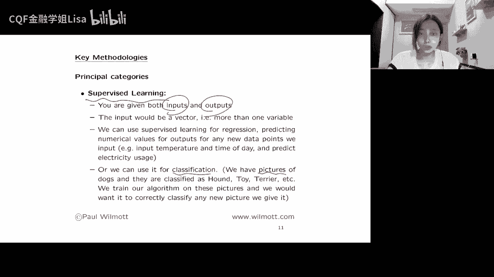

这个就是监督式学习对好，然后我们来看一下非监督，那非监督的话呢，它是啊很有意思的，因为你不知道你最后会得到什么，就是数据是没有标签的，对我们只有input啊，没有output。

就比如说像狗的照片就是数据，它并没有告诉你诶，哪一只是玩具犬，哪一只是猎犬，然后你呢是把解所有的数据全部丢给机器，让他自己去做分类，让他自己去做聚类，所以我们就只有输入没有输出。

然后算法呢它是为你找到这个关系或者是模式，那比如说我们展示了这个狗的电脑图片，然后现在呢这个电脑根据他认为最重要的特征，去把它们分组或者是聚集在一起啊，也许会出现猎犬啊，玩具犬梗。

或者也有可能会出现黑色，棕色白色这样的聚类哈，就是可能或者会出现一些，人类压根就从来没有注意到的，一些不同的一些类别，就比如说嗯，你可以想象，你把你的抽屉里面的东西全部倒出来，然后呢你给这个机器说。

诶你帮我做一下规制分类，然后呢你不要就是你不会告诉机器说，诶这个是指，然后你要把纸放在一起，也不会告诉他，这个是比你要把笔放在一起，就你这些都不会说，然后你让计算机，它自己根据他认为重要的特征去做区别。

就是去做这个聚类的一个规制，所以就是你最后你也不知道，计算机最后会怎么去帮你分类啊，可能会给到你一个很大的一个surprise啊，这个就是非监督学习，所以它是只有input，没有output。

然后让算法它自己去根据这些数据的一些特征，帮你去做聚类好。

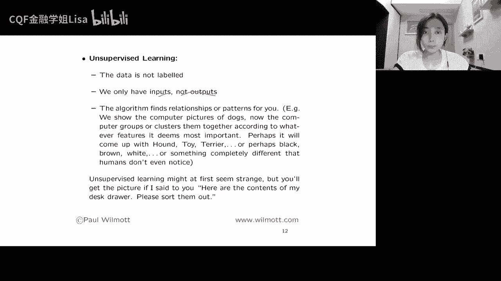

然后第三个就是强化学习，那么强化学习的话呢，其实就是让算法学会去做一些事情，就是你训练算法去做什么事情，然后成功的行为就会得到奖励，然后不成功的行为就会得到就会受到惩罚。

所以我们刚刚讲到的那个manners，它就是这样一个简单的例子对吧，奖励和惩罚就是在火柴盒当中去添加，或者是减去珠子，那么从嗯这个20世纪80年代开始，其实像学习玩棋盘游戏啊。

或者是玩一些电子游戏的一些电脑，其实就受到了很多的关注，然后他们通常都是涉及到强化学习，那包括像我们现在在做很多投资，我们在做量化投资的时候，其实很多时候我们也会去哈，就是很多很强的策略。

他们其实也在使用这个强化学习，好，我们来给大家具体的介绍几种。

这个机器学习的技术，那么首先呢就是K近邻，我会把它简称为KNN，所以大家以后看到KNN的话呢，就可以反应过来，它就是K近邻的意思，那么K近邻呢它是一种监督学习技术，就是我们嗯。

我们其实测量就是我们去测量任何数据，任何一个新的数据点，在任何的维度上，跟我们已经分类的数据之间的距离，然后从而得出我们的这个新数据点，它属于哪一类，就是它也可以用于回归。

然后呢可以举一个不太恰当的例子哈，比如说就是每个人都有身高，体重这样的数据向量，比如说现在呢有一堆人去参加这个party啊，所以就是我们可以把这一堆人他们的身高，体重标在这个坐标上。

比如说这个横坐标是升高，然后这个是啊体重，然后呢把这一堆人，他们每个人的身高和体重，都把它划到这个坐标上，那么就是对应的是一个点，所以呢就可能比如说这里有一些点，然后这里有一些点，好，那这个时候呢。

其实我们就可以把大家呢就是分成两类的吧，这样还是很明显有两个聚类，那么一边呢你可以把它认为啊这个是轻量级的，然后呢这边是重量级的，然后呢我们各自聚类成一堆好，然后这个时候呢可能又来了一个新的人。

然后这个新的人呢，我们就可以获取他的身高体重的数据，比如在这里，这是他的身高体重的数据，然后我们就可以去根据，他跟这两堆人之间的距离，来判断它属于哪一个类别，就它离哪一个更近，那么它就属于哪个类别。

那么这个呢就是呃K近邻他的一个思想好，这个是给大家简单介绍一下KG01，我们后面还会稍微的再详细介绍一下，每一个技术好，然后再来看第二个，第二个技术叫做K均值聚类。

K均值聚类k means cluster，然后呢简称KMC，然后K均值聚类呢，它是无监督学习的一种技术啊，我们有同样我们有很多向量形式的数据，就是表示关于每个点的许多维度的信息，比如说我们每个人啊。

我们每个人呢，其实都有就是很多的一些向量特征嘛，比如说这个人的收入怎么样啊，那他住在哪里呀，还有几个小孩啊，他有几只狗啊，他的肤色呀，他的身高啊，他的体重等等等等信息对吧，这个都是就是向量形式的数据。

就是每一个数据点，都有这样一个向量形式的数据，然后呢我们可以基于这些维度的信息，把所有人分到K个这个组里面去啊，这个K就是这个聚类的数量，所以呢我们可以通过测量每个数据点。

每个人跟这个K个质心的距离来做分类，就说我们有K个聚类，那么K个聚类就有K个质心，就是中心点，然后呢我们就可以看每个数据点跟这些句型的，跟这些质心的距离，然后呢就是距离最近的。

那么它就归属到这个聚类当中去，这就是K均值聚类，所以呢比如说啊，我们可以根据客户的购买历史，去对客户进行分类，就是可能每个客户他都有都有一些特征嘛，比如说他可能嗯，就是在化妆品上花的钱是多少钱。

花在服装上花的钱多少钱，他在啊这个什么运动产品，数码产品上花的钱是多少钱，就是每个人都有这么一个向量特征，然后呢，我们就可以根据它在不同类型商品的一个，支出的情况，然后就把它分到诶。

他到底是一个喜欢买化妆品的，还是喜欢买服装的，还是喜欢买这个数码产品的对吧，就可以分到不同的类型当中去，然后呢你可以不同类型的客户，你之后都可以对他去做精准的营销嘛，好这个是KK均值聚类。

好简单认识一下。

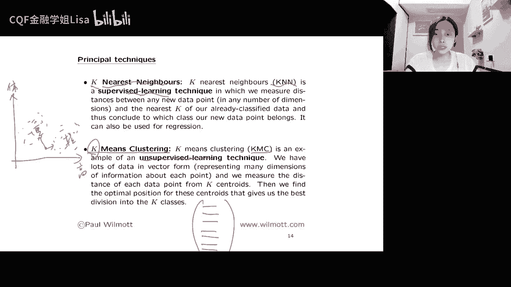

然后我们再来看一下这个朴素贝叶斯，朴素贝叶斯呢它是一种监督学习，监督学习的一个技术，然后它是使用贝叶斯定理去计算新的数据点，在不同类别当中的概率，就是这个朴素这个词啊，那if这个朴素这个词。

它其实指的是所做的这个假设，就是这些假设呢在实践当中，其实很少是真实的哈，但是好像也并不是很重要，比如说嗯，比如说比如说像美国政要做演讲的时候，我们可以基于他的演讲，去判断它到底是左翼还是右翼对吧。

我们可以去使用这个啊贝叶斯公式，那么这个就是具体什么，我们后面再讲了哈，先大概的认识一下就好好，然后再来看这个回归方法，那么回归方法的话呢，它是一种监督式学习的技术。

就是其实就是我们熟知的这个统计技术回归，然后他呢其实就是试图去用自变量去解释，因变量啊，数值因变量，然后呢你可能就是我们至少知道线性回归嘛，对吧，但是对于更复杂的回归类型。

就是我们可能会呃就是有更深入的一些研究，就除了线性回归之外，还有其他的一些回归好，然后再来就是支持向量机，它也是一个监督式学习嗯，支持向量机的话，它是根据每个数据点位于这个特征空间当中的。

超平面的哪一侧来去把数据划分为两类，划分为就是不同类别，那么同样的话呢，就是我们有嗯很就是多维的数据的向量来描述，每个数据点，每个数据点都有很多的信息，很多特征，比如说每个人的收入，身高体重年龄等等。

然后呢这些数据点呢就可以啊，因为如果说你是只有两个特征的话，你可以在我们的一个坐标上去画出来，但是如果说你的特征很多对吧，你是个多维向量的话，那你就只能去想象在一个多维空间当中，就是我们的每一个数据点。

就是一个多维空间当中的一个点，那么就有很多数据，那么就是多维空间当中有很多很多的点，那么这个时候呢我们就需要比如说啊，用一个比如说超平面去划一刀对吧，就是你通过超平面去把这些点去划分为，两个类别。

那么这个就是支持向量机。

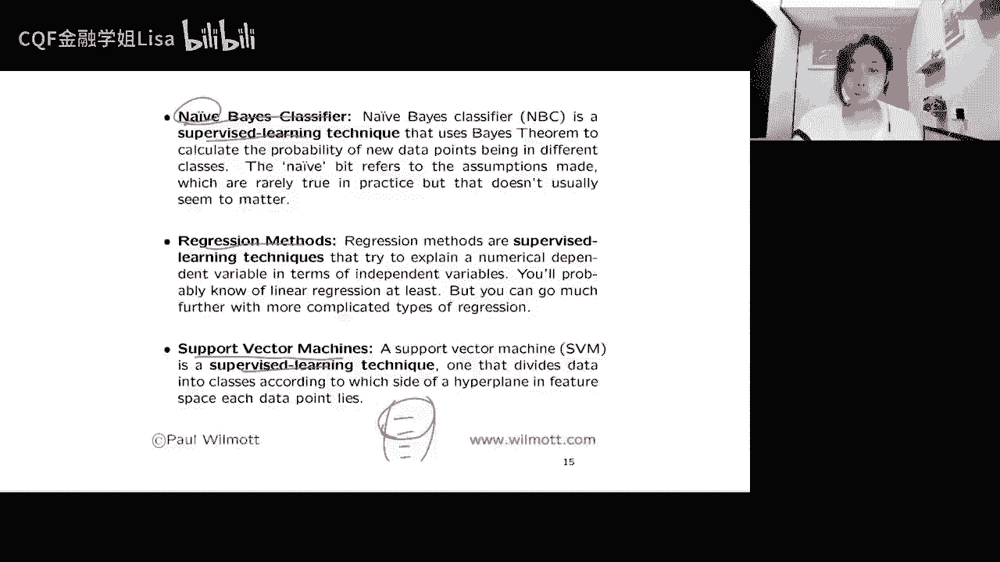

然后再来就是这个自组织映射啊，这个是嗯教授非常喜欢那种技术哈，它也是非监督的，就是就是你不知道机器会给你做出来，什么样的结果，然后他也是针对就是现在有很多人，每个人都是一个数据点。

然后每个人都有这个多维的信息向量，所以你可以想象我们把每个人去投射到一个，你可以把它想象成就是一个国际象棋的棋盘上，就本来这些点他们是在多维空间当中的，但是你现在呢要利用他们的这个特征。

去把它们映射到我们的一个二维的平面上，就是可能啊我们可能会把这是有上千个人哈，全部投射到这个棋盘上，然后呢这些棋盘上的单元格都是首尾相连的，就是棋盘嘛，然后呢帮助你去做可视化。

然后呢这样的话呢就可以去把那种很多维的，比如说像20维的一个数据，把它转化为一个非常漂亮的一个二维的图片，然后用于去可视化数据点之间的关系，就是那些具有相似特征的数据点，他们就可以投射到这个棋盘上的。

两个比较相近的单元格上好，所以通过这种方式你也是可以去实现聚类的，就是那些在棋盘上比较接近的那些数据点，他们肯定就是可以属于一个聚类嘛，好这是自组织映射好，然后再来就是决策树，决策树的话呢。

它也是一个监督式学习的一个技术啊，决策树的话呢其实就是在玩一个啊，yes or NO的游戏，然后可能大家都玩过这个游戏，就比如说我心里面想一个东西，然后呢你们要通过玩是非的问题，来找到我心中的这个答案。

比如说我心里面想的是一匹斑马，然后呢你就可以问啊，是不是动物对吧，然后我就可以说是，然后呢你就可以问是不是四条腿，然后我说是，然后你就可以继续对它有没有尾巴，然后说是就通过问这样的一系列的问题。

问一系列的这个是否的问题，然后你最终可以去找到那个正确的答案，所以呢啊决策树的话呢，就是我们这个机器，它能够学习有最佳的一个最佳的问题，以及最佳的提问的顺序，然后呢。

能够帮助他以最快的速度去准确地完成分类，那么这个就是决策树，然后再来就是神经网络啊。

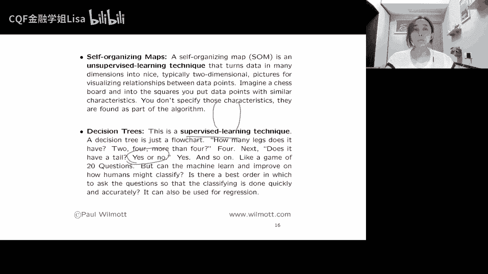

神经网络的话呢，呃有的时候也会在前面加个artificial，就是就是人工神经网络啊，然后它是一种机器学习，那它其实就是嗯就是在模拟大脑中发生的事情，去模仿这个生物神经元。

然后它可以用于监督或者是非监督的学习，就是你可以啊，一般来说我们有这样的一个图，这是我们的input，然后这种中间呢就是一些我们的，比如说隐藏层呢，然后最后什么的output对。

然后我们就是中间就是会有这样的一些网络，对这样的一些网络，然后呢你有一些特征向量，就是这些就是input，就是我们的输入变量X1X2等等哈，好，然后就是X3X4，这都是我们的input。

然后通过一些线性和非线性的变换，也就是通过放入一些激活函数去做变变换，放入隐藏层，然后通过一些计算也可以得到这个output，然后在这种形式之下呢，output实际上它只是原始数据的线性非线性函数。

就是每一层神经元它都附有一些参数，然后通过训练找到神经网络当中的这个参数，好，所以我们的transformer，它其实就是神经网络当中的一种好。

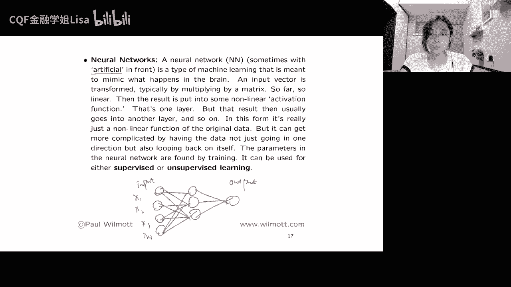

然后呢我们就是再回到我们的这个经典，数学建模，就是看它和机器学习有多大的一个区别，那么在啊我们下一个板块呢，我们会讲机器机器学习当中不同的这个工具，然后呢就是数学建模者呢，在面对一个新的问题的时候。

就是会走一条公认的，而且啊屡试不爽的一条道路，那我们来看一下。

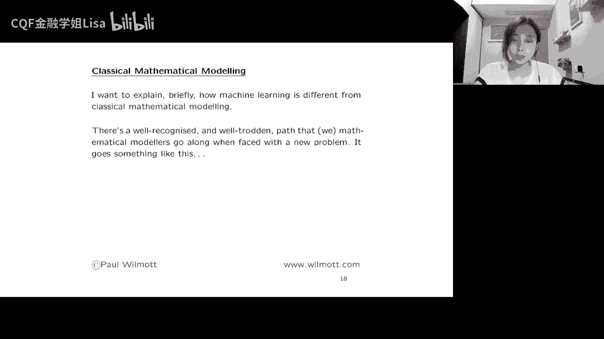

就是我们在做数学建模的时候，第一件事情就是要决定你的变量，所以呢就是你要先去决定你的variable，你的变量，所以呢你的这个变量呢一般就是两种形式嘛，要么就是independent。

要不就是dependent，就是自变量还是因变量，然后呢，自变量呢就表示的是你指定要研究的问题的预，就是一组常见的自变量，它就是我们的空间坐标XYZXYZT，那么这个是自变量。

然后因变量呢其实就是你要解决的问题，比如说啊，这里说如果你要考虑这个小提琴弦的一个震荡，那么因变量的话呢，就是这个弦从静止状态啊被扰动的一个距离，然后包括说如果你想研究一个人的收入对吧。

他的因变量是收入，那么它的自变量的话呢，它的X可以是学历呀，可以是证书啊，可以是工作经验啊等等对吧，所以如果说你在研究气体流动的速度，你可能会把温度作为自变量，因为温度它会影响气体的一个密度。

然后对你还可以想想，还有一些什么样其他的合理的自变量，所以呢其实我们在建模的时候是值得，就是做经典数学建模的时候，你是需要花一些时间来选择，你的自变量和因变量的，因为有的时候他们可能没有那么明显。

然后原则呢就是呃应该尽量的选择，尽可能少的变量来描述问题，就是你不要把所有可能相关的变量，全部都扔进去，所以啊像爱因斯坦曾经说过，他说要呃就是那让事情尽可能的简单嘛，然后，如果说你想让事情变得更复杂。

那么一次只做一个新的特征，但是这个的话呢，就是如果说你是做量化投资的话，那你是做量化分析，那么这个就会在你和交易员沟通的时候，就会非常的比较苦恼，就比如说你做了一个很非常好的模型，然后你告诉交易员啊。

但是他可能会说诶，你没有考虑到这个那个那个啊，但是你要知道，如果说你在一开始就考虑到所有的变量，你可能也做不出来好的模型，所以这个呢就是和机器学习差别很大的地方，就是在机器机器学习当中，你手上拿着数据。

你不知道哪些变量是相关的，没关系，把他们全部甩给电脑，让电脑来决定哪些是相关的，哪些变量我们需要保留哪些不表不保留，所以这个是一个很大的区别，所以呢像我们的经典数学建模，经典数学建模。

它现在现阶段的目标就是进入一个所谓的，这是最嗯就是memorally interesting，就是最不有趣的非平凡的问题，就是你不想得到无意义的东西，然后不有趣呢就是不要太复杂。

也就是说你设计的这个模型啊不能很复杂，但是呢要有意义，所以呢现在这个是经典数学建模，现阶段的目标就是我们后面讲到M5呢，其实有一个章节，还有个lecture呃，具体是哪个，nature忘了。

它其实就是在啊抨击这种经典的数学建模，就是因为很多经典的数学建模，像我们的BSM它都是过于简单的，它的假设过于苛刻，它的模型模型过于简单，它其实就是犯了这样的一个问题，就是嗯比较就是比较简单。

但是呢可能又没有啥意义的一个一个东西哈。

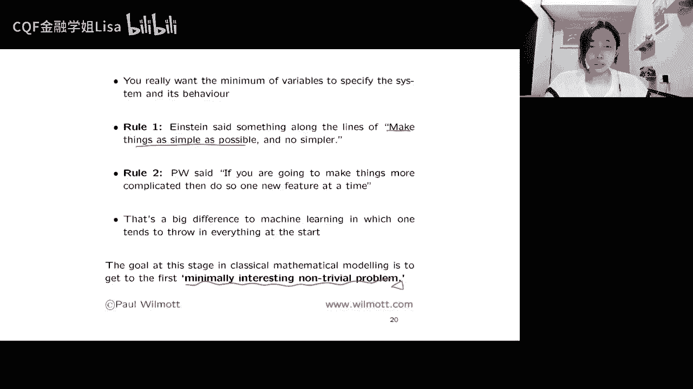

好然后嗯就是你在做你的模型的时候，你需要先弄清楚，你的系统当中的主要的驱动因素是什么，就是什么在驱动你的模型，就是有什么力量在推动，比如说分子是随机相互反弹的吗，然后比如买家和卖家会上下浮动牛奶价格吗。

就是你想要得到一个定量准确的模型，如果你就是如果你比较幸运的话，你可能会有一些不错的原则去作为模型的基础，比如说守恒定律，然后像这个小提琴的这个琴弦，它根据牛顿的第二定律，然后去运动哈。

显得这个弯曲所产生的力是弦运动，这些都是物理界的一些守恒定律，但是这个在金融领域是不成立的，这是我们在我记得我在第一节课，M1的第一节课就跟大家去讲过，就是金融界它跟物理界不一样。

就是很多东西它不是定量准确的，就是你最终得到的一个模型，可能是一个toy model，是一个玩具模型，就是你必须要依靠一些常识或者是观察，比如说你要做一个嗯这种叫做，这个叫做捕食者猎食者的一个模型哈。

就是嗯应该是捕食者猎物的模型，比如你要对狮子和羚羊的一个动力系统，去进行建模，因为狮子是要吃羚羊的嘛，所以你你想去预测狮子或是羚羊的一个数量，那么你会说诶狮子越多，它繁殖的越多，然后嗯像羚羊的话。

羚羊越多的话呢，狮子的食物就越多对吧，就是你从中可能可以写出一个比较漂亮，但是不一定定量准确的模型，那你可以写出一个微微分方程什么的，来帮助你去做预测，但是呢可能没有办法预测的非常准确。

但是也依然还是有用的。

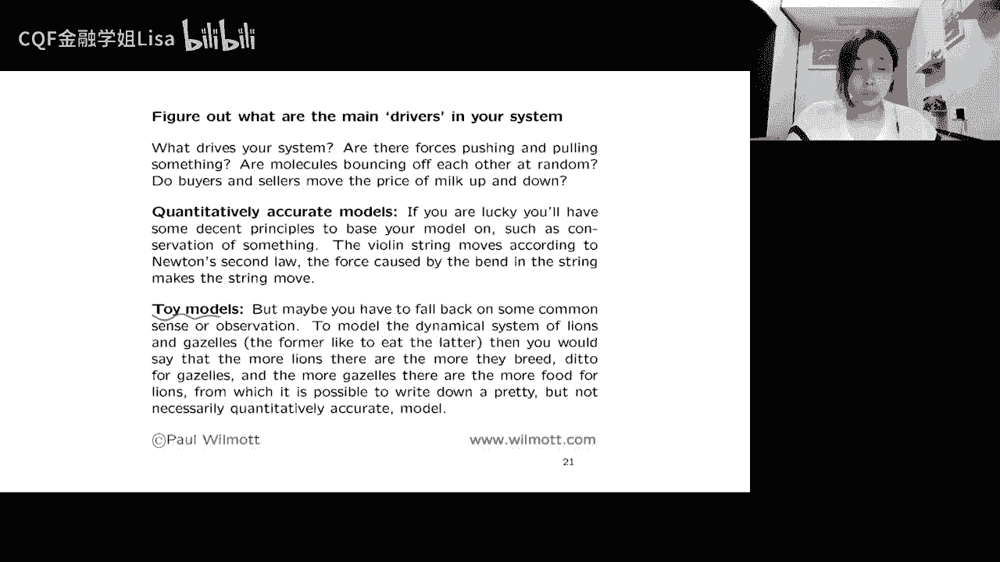

然后呢，你的模型需要你给他去提供一些参数的值，就是在我们的古典经典数学建模当中，你的参数可能比较少，比如说像在black rose marin当中，你有股票价格，你有鼓励你有波动率对吧。

你的参数可能就那么几个，就是相对来说是比较少的，但是如果你去做这个神经网络模型，通常像啊几个神经层，对每个神经层就有100个节点，那么你的参数其实就有几百个参数，也许这些参数会保持不变。

但是也许这些参数很难测量，就是不稳定，甚至可能不存在，比如说你比如像股票价格波动率啊什么的，就是这个呢也是就是经典建模跟机械建模的，一个机器学习建模的一个很大的区别，就是参数的数量。

好像我们的这个像这个GBT嘛对吧，GBT它的这个参数的数量，也是已经达到了几千万的一个数量的参数，所以呢这个跟经典建模是完全不同的，经典建模你的参数稍微多一点，你就可能就没有办法去得到它的这个解好。

所以这些呢其实都是嗯。

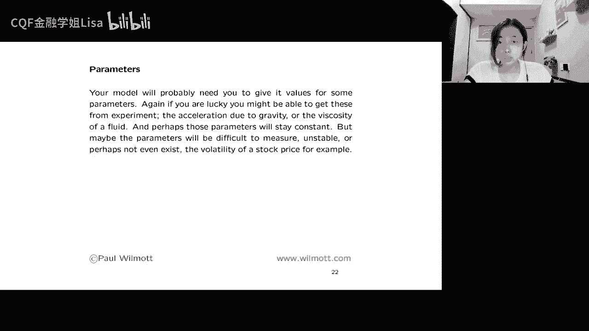

数学建模者需要解决的问题，并且呢就是要在具有可靠输出的模型和呃，仅用于解释现象的模型之间去产生这个差异好。

还有就是你需要决定你应该使用的数学类型，就是和机器学习一样，就是机器学习当中呢，你要选择不同的模型，就是你到底是让机器呢使用贝叶斯呢，还是使用自组织映射呀，那么在数学建模当中。

你需要决定到底是用比如说用离散的，还是用连续的数学呀，然后用微积分呢，还是用概率模型，还是用博弈论呢，啊这个倒是哈就是你要去决定模型，然后嗯机器学习嗯大不相同。

就是上面我们刚刚提到的那些内容，几乎都没有涉及到机器学习，就是一个很大的区别，就是数据的作用。

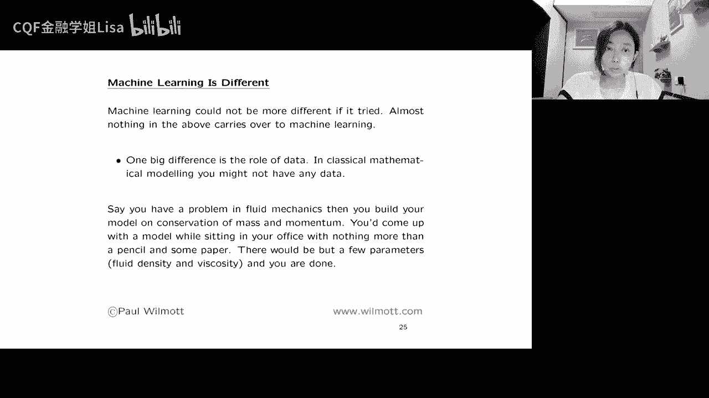

所以其实我们在前面提到的，包括说你要去搞清楚，你的系统的一个主要驱动因素是什么，这个其实我们机器学习也不需要你去搞清楚。

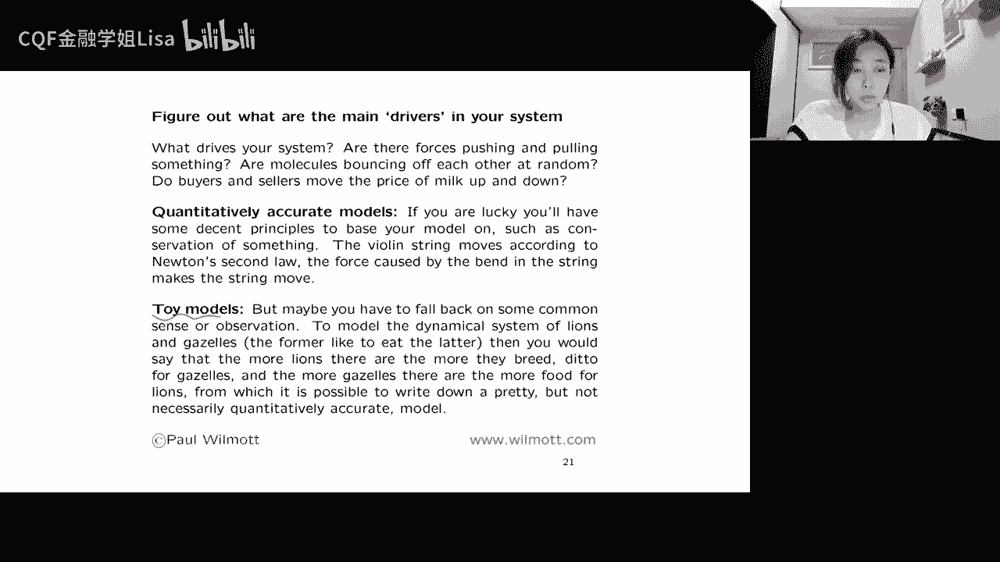

包括你的参数该怎么样去计算，包括对就是你的这个要不要选择数学模型，这些其实都是不涉及到我们的机器学习的。

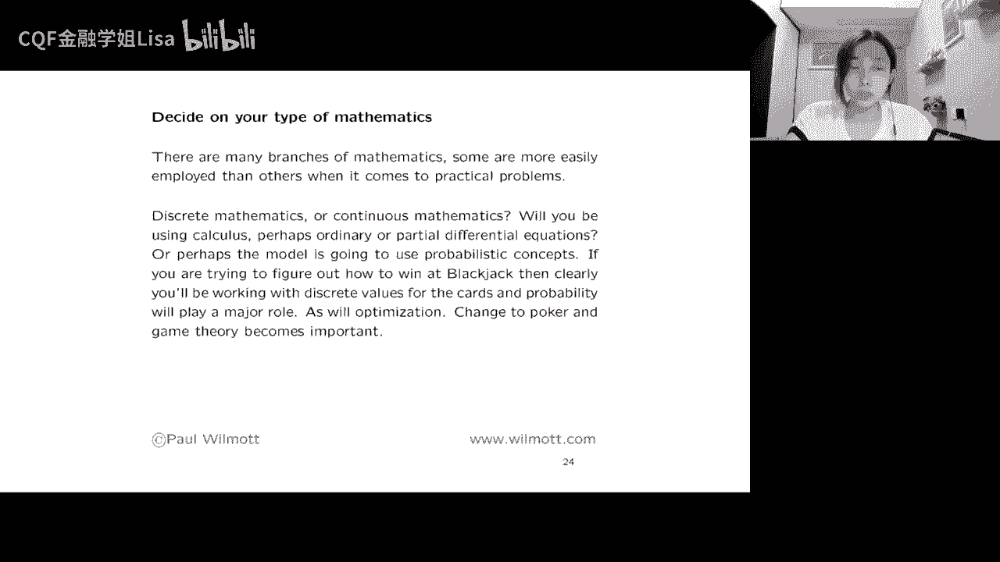

就是我们机器学习当中的一个很大的区别，就是在于数据在发生作用，就是在经典的数学建模当中，你可能没有任何的数据，就假设你有一个流体力学的问题，那么你就是坐在办公室啊，拿着一支铅笔，拿着一张纸对吧。

然后基于质量守恒，基于这个动量守恒，然后你想出一个很好的模型，比如说什么。

就是大家非常熟悉的这个novel，stokes equation对吧，只需要几个参数，流体密度粘度，然后就大功告成，但是呢建立金融模型是非常不同的，就它没有这些守恒的定律，建模更难。

就是你建出来的可能就是一个toy model。

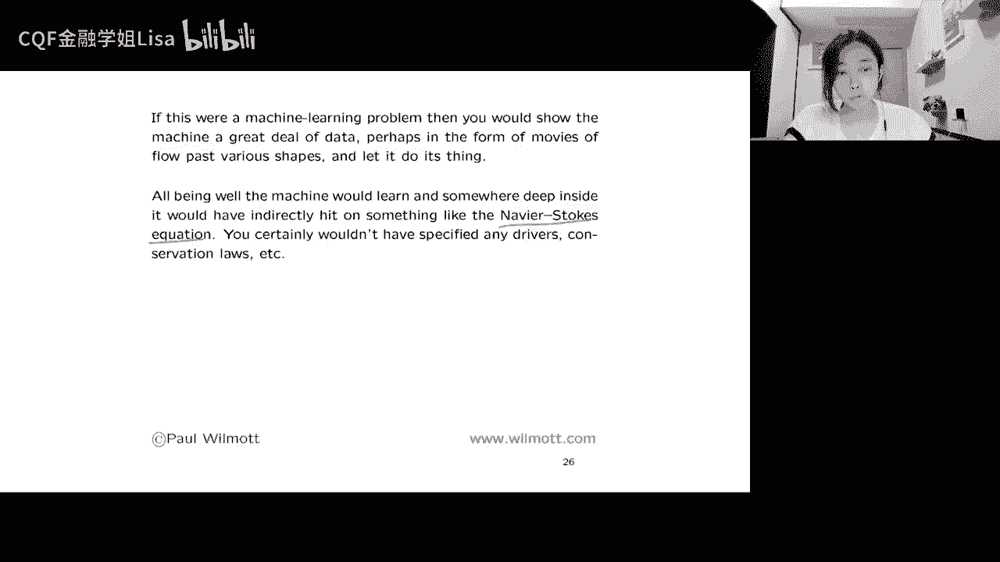

就是一个玩具模型啊，你就是但是你可以你也可以使用神经网络，就是你有几百个几千个甚至更多的参数，然后用这个数据去喂模型，让数据去找到这些合适的参数。

所以说如果这是一个机器学习的问题，那么就是你就需要哈，就是我们在面对机器学习的时候，一个主要的问题就是你需要大量的数据，你需要给机器喂大量的数据，然后让他做自己的事情，对如果说呃如果说一切顺利的话。

那么这个机器它就会自己学，然后在他的啊牲畜哈，他可能会间接的碰到类似于像NAVIOUS，OXEQUATION这样的东西，但是你肯定不会指定任何驱动因素，你不会给他指定任何守恒定律好。

所以这个就是我们想先给大家去嗯。

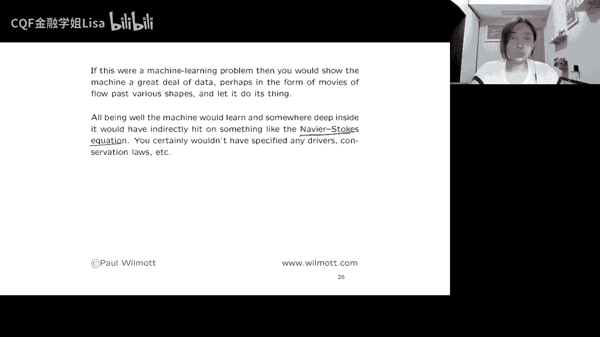

稍微的科普一下的，就是经典的数学建模。

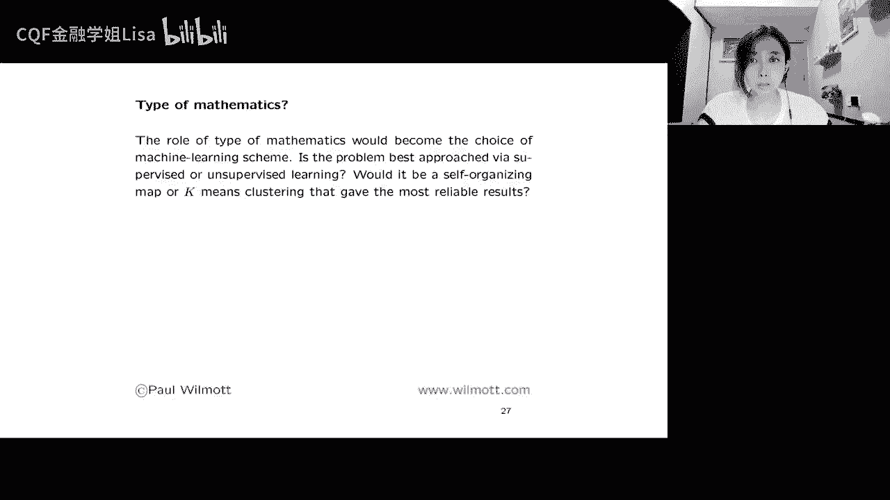

跟机器学习建模的一个区别好，然后这边的一个summary，就是我们有三个主要类型的机器学习，监督，非监督强化，所以我们说了监督就是你有input out，有output里的数据都是打了标签的。

都是成对的数据，然后unsupervised就是非监督的话，那你就只有X对吧，你只有就是你不是成对的数据，然后这些数据都没有给到你标签，然后你需要把这些数据喂给机器，让他自己去尝试着去探索它们之间的。

一些数据的规律模式特征，然后去做聚类，然后强化学习的话呢，就是你要让自己学会自己去做事情对吧，你给他一些奖励，给他一些惩罚，让他自己去学会做事情，然后在每一个类别当中都有很多的技术。

那我刚刚只是简单的给大家去过了一下，我们后面还会给大家去，相对来说详细的去介绍啊，那也不是特别详细好，然后还有就是机器学习跟经典数学建模，是非常非常不一样的啊，所以啊机器学习其实非常有意思。

就是你很多时候你会很惊讶于他，最后给到你的output，就是你会佩服这个机器的智商，你会佩服机器的学习能力，当然啊也有可能他给到你的output，就是一堆垃圾哈。

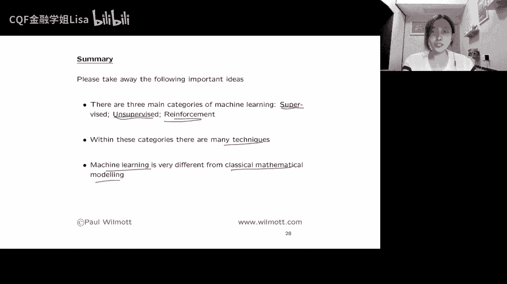