# 2024最值得学习的金融量化交易课程-第七讲：Unsupervised Learning I - P1 - CQF金融学姐Lisa - BV1VJ4m157sT

我M5的课程了哈，晚上好好，那我们今天第一节课呢是呃，就是非监督学习的part one，然后我们会在今天呢会讲一些量化工具箱的，一些基本工具哈，其实就是会讲PCA，然后会讲k means。

就是K均值聚类，然后还会讲分层凝聚算法，还有就是自组织映射。

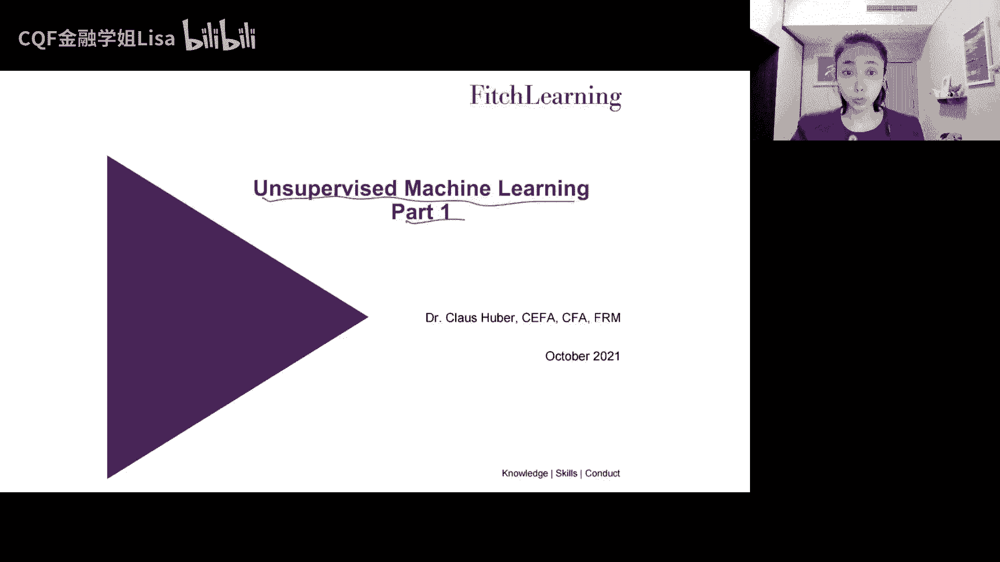

这些都会在我们今天晚上去覆盖，所以说我们今天晚上的agenda就是这四个算法，PCA这个邻居聚类，然后k means，然后SMS好。

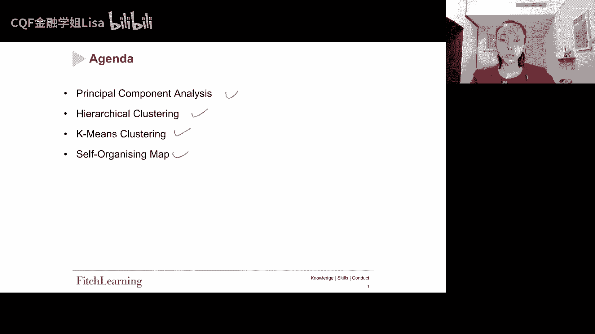

然后我们首先呢还是要去啊，就是问一个问题，就是为什么要去呃，为什么要学非监督学习，为什么有非监督学习，为什么要用它，那么其实也就是说嗯这个非监督学习，它的作用就是，首先呢它是可以在这种就是未知的。

甚至是高维的数据当中去查找它的一个结构啊，这个是第一个它的一个用处，然后第二个呢就是在数据集当中呢，我们是可以去找到，就是嗯尤其是在这个高维数据空间当中，属于一类的，属于一起的这些数据点啊。

其实就是聚类的一个就是聚类嘛，所以呢比如说呃在金融金融当中嗯，是否存在表现出类似风险行为的一些资产对吧，你是可以通过聚类去找到的，还有包括像这个字这个自动文本分析，自动文本分析的。

就是比如说呃是否有处理同一种主题的文档啊，对这些都是可以通过聚类去找到的，然后呢，我们想要去这个更好的去理解这个数据的结构，然后呢，也就是为以前没有标记的数据去指定标签对吧，我们以前监督式学习的时候。

我们的这个标签，如果说你啊提前没有得到的话呢，那么你是需要非监督学习，先去把他的这个标签给他得到的好，然后呢就是你得到了这个Y这个标签之后呢，然后你才可以使用它去做进一步的监督，学习算法。

所以呢我们的非监督呢，它可以说是对监督室的一个预处理好，还有就是啊非监督学习呢，他是为我们这个进一步分析去建立一个，可能的出发点对吧，这就是我们刚刚说的，就是监督式学习的优于处理。

还有就是非监督学习算法呢，它可以去降维，可以去降低我们数据的维度，然后呢使得我们的这个数据更容易解读，然后减少这个数据的噪音，然后我们也会在这个课上呢，给到大家一些example。

然后还有就是我们可以把这个数据呢，给它降维到，比如说二维或者三维，那么这样的话我们就可以去用平面，或者是用立体对吧，三维来去做数据可视化，那么能够帮我们从这个图像上，更好的去理解数据的结构。

那么这些都是非监督式学习它的一个作用，然后我们可以来看这样的一幅图。

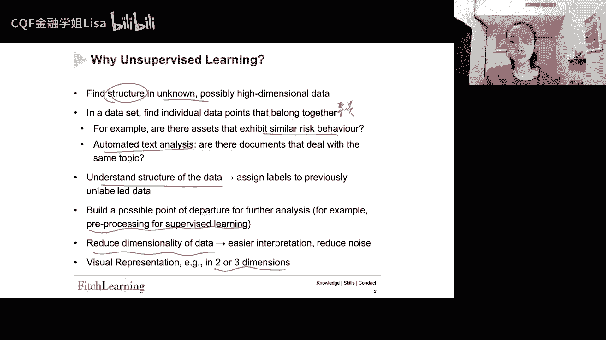

这是一个从高维到低维的一个例子，那么这边的话呢就非常明显的是非监督时，就是非结构化数据了对吧，这个是非结构化数据，然后呢我们不了解它里面的结构，然后呢非监督学习的思想呢。

就是把这个多维空间给它映射到二维，所以你可以看到就是这其中，比如说像啊这个圈圈啊，这个空间的这个状态的数据，那它其实就可以映射到我们右边，这个二维图的黄色这个角落，然后同样呢。

就是比如说藏在这里面的一些数据啊，这个缺水的这个数据，它又可以去映射到绿色这一块，所以它是从这个高维到低维的这样一个过程好。

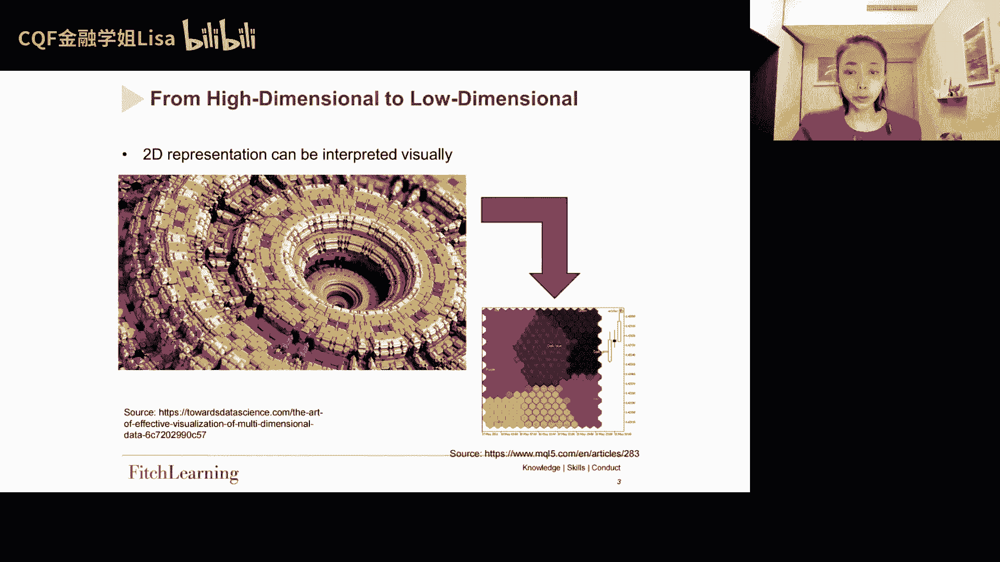

然后这个非监督学习在金融当中的应用，那么首先第一个呢还是宏观预测，就是我们上节课是讲了，就是监督式学习它在宏观预测的应用，然后呢在非监督式学习这里呢，我们呃应用于宏观预测的点。

就在于定义包含经济变量的向量，对定义这个包含经济变量的向量，那么这些变量呢代表经济状态，或者是金融市场的状态，然后另外的话呢还可以去做这个组合管理，做这个资产配置啊，我们可以利用非监督式学习。

去识别这个风险的集群，然后并且呢是这个投资组合分散化多样化，那我们一会儿可以看一个例子，然后还有包括像交易哈，我们可以定义相对价值机会，我们也会有个例子，然后另外呢就是自然语言处理。

我们可以利用自然语言处理，去识别具有类似内容的一些文档好，然后还有就是嗯这个基于回报的这个，风格的分类，比如说对于共同基金啊，对冲基金啊一些啊，有这个类似期权的回报啊，然后还有就是一个常见的应用。

就是这个异常值的发现，还有这个欺诈检测，就假设我们有包含数据的向量，然后我们包含最近几笔交易的这个数据，比如说呃这个银行账户当中的美元金额啊，然后你发现一个大的偏差，那么这就是一个欺诈的指标。

所以这个呢，其实你都是可以用非监督学习的方法去。

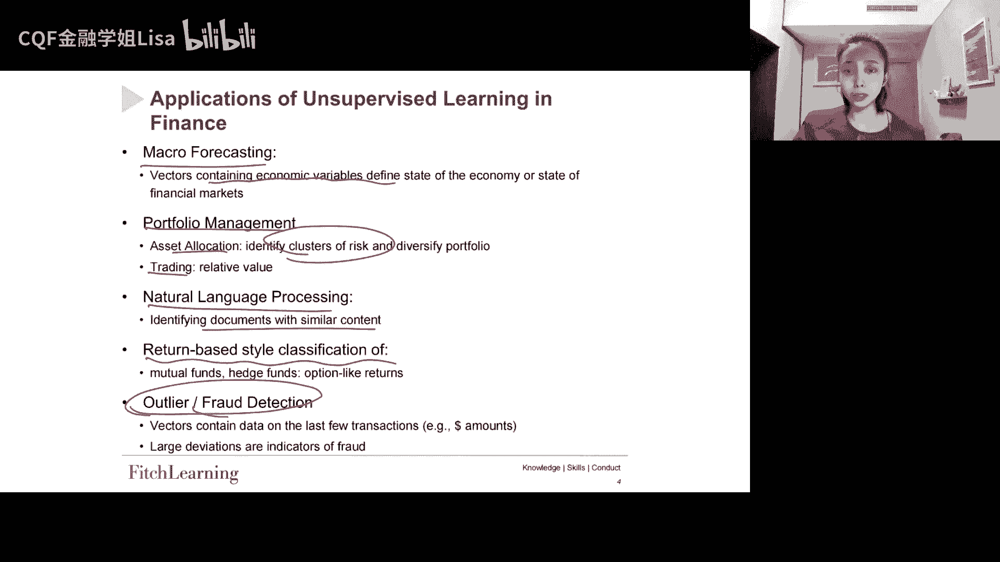

很容易可以发现的好，那我们就先来看第一个工具，就是PCA主成分分析，那么PC的话呢，它其实是这个机器学习，它的一个非常非常基本的一个工具之一，就是每个人都应该了解它是怎么样去运作的。

然后应该把它能够把它运用于数据啊，你会发现PCA的用用处其实也非常非常多，然后呢在我们这个PO上呢，也是提供了R2代码的，你可以自己去运行，还是去玩一玩，那也是R2代码。

然后呢PC呢它是可以去降低这个数据的维度啊，比如说我们有一个很大的数据集，比如说有十个变量，然后呢十个变量就十列，然后呢我们有170的数据，比如说有100周的数据，那么我们其实就有100行乘以十列的。

这样的一个input的这个数据集，然后呢我们可以把它呢去做预处理啊，就是嗯就是我们可以先要去把这个PCA呀，就是利用PCA，我们可以把这个100×10的这个变量，给它降低到100×3，就原先是十个变量。

然后给它降到三个对吧，当然我们降到的是就是不是说不是变量筛选哈，是我们说去把它降到三个，就叫做factor scorn后也会看到哈，我们这样就可以把这个数据从十个维度，降到三个维度。

然后呢组成它代表数据当中的，这个就是呃底层的结构哈，我们的第一个主成分啊，第二个主成分啊，第三个主成分啊啊等等等等，他们其实就是在代表我们这个数据当中的，底层结构，然后呢可以用它们啊。

就是这个嗯就是可以把这个PCA哈，去作为我们的预处理的一个呃一个动作，然后呢去作为其他方法的一个input，就是你比如降维之后，那么你这个这三个维度的这个数据。

就可以作为其他的这个机器学习的input好，然后我们还可以就是把高度相关的这种变量，给它聚合到我们的这个主成分当中来，然后另外呢就是PC它可以去使用一些统计包。

比如说我们的r Python matlab，其实都是有一些有些包，还有些第三方库可以去快速执行的，可能就是一行代码你就可以运行PCA，所以用的时候还是非常方便，但是你还是需要去先搞清楚它背后的这个逻辑。

他的数学好，然后呢它的一些应用，比如说可以做图像处理呀，可以做经营分析啊，可以做相对价值交易啊，风险建模啊，这些都是PCA的一些用处啊，其实你会在我们过程当中。

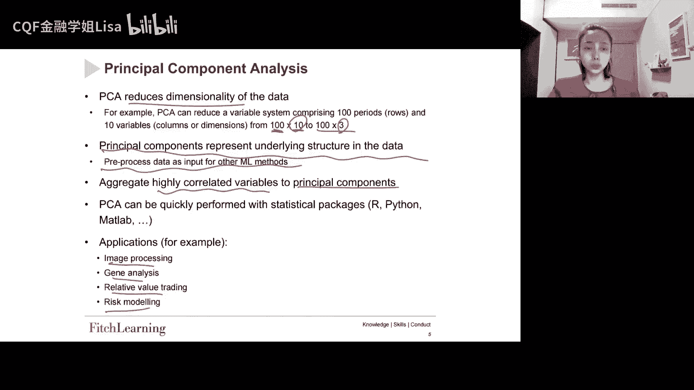

会不断地看到它的用处，然后呢PC的思想就是我们这里举个例子，比如说我们这里有两个变量，两个变量就是两个维度，然后这边呢有这个X轴Y轴，然后你可以看到它里面的这些点，然后你可以看到的就是他们是高度相关的。

对吧好，那我们要做PCA的话呢，我们这个第一个步骤就是去做正交化，对正交化就正交化这些数据点，那什么叫做正交化呢，正交化的意思就是把相关性给它剔除出去，就把相关性给它拿出来好。

所以呢我们去做了正交正交化之后，你可以看到这些点，他们就是把这个相关性移除掉，之后的这个数据点就变成了这个样子好，然后呢这个证照化完了之后呢，我们会来到第二步，就是去降维啊，然后就是就是第一步之后。

我们的这个数据其实还是有两个维度嘛对吧，还是有两个维度啊，P c 11pc2，Pc 1pc2，还是有两个维度好，然后呢接下来你要降维降维的话，比如说我们现在就降到一个维度啊，就是PC1。

那这样的维降维之后呢，你会发现，我们就是我们就整个把这个数据给它lapse了，对吧，它压缩啊，就只剩一个维度了，那么这个呢其实就是PCA他在做的事情，所以他第一步就是正交化，把相关性剔除掉。

然后第二步呢就是降维好，然后我们再来看一个具体的example，那么这边的这个example呢，我们的这个R代码也是提供了的哈，大家可以自己去做复习，然后我们可以看一下这边这些点哈，他们的这个坐标哈。

X轴Y轴的坐标其实就在这个表格当中，比如说第一个数据点，它的X轴在这里，Y轴在这里啊，第二个数据点啊在这儿在这儿，所以一共有十个点，十个点每个点的坐标啊已经给到我们了，然后呢这十个点它们的协方差矩阵哈。

就是X和Y的协方差矩阵在这里哈，X和Y相关的协方差是多少好，然后呢我们要做的呢就是首先呢我们要先去。

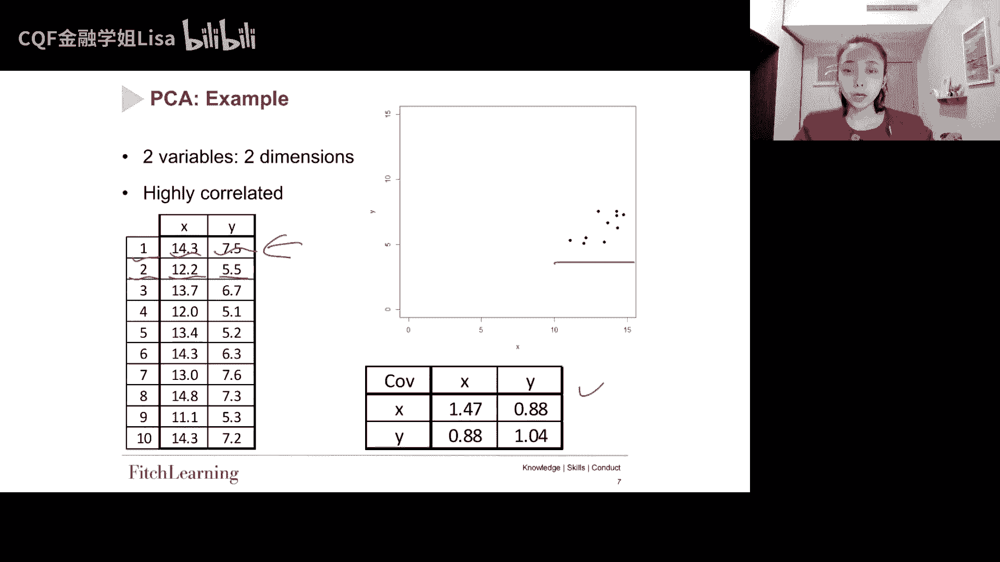

就是呃subject the mean to the center to center，The variable，就是我们要减去平均值来使得这个变量居中，那它的意思呢。

就是说我们要把比如这一列的这个X这一列，每个点先算出它的均值，然后呢再去拿每个点去，就把他们所有点的均值算出来，然后再拿每个点去减这个均值。

然后呢这个动作就叫做centering或者叫demeaning啊，然后呢啊这边这个这个表呢。

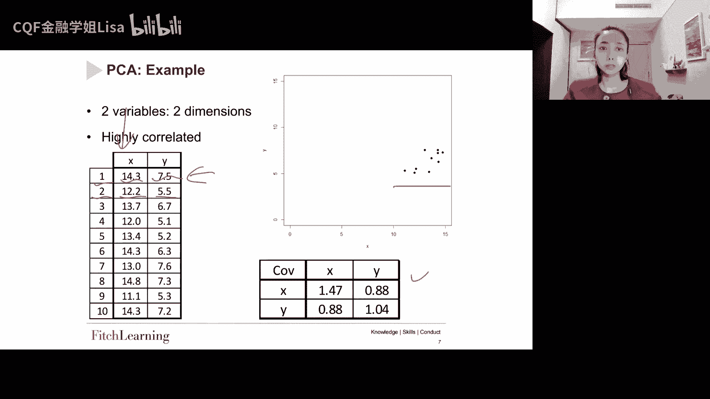

其实就是他居中之后的变量数据，就把X和Y哈，都是拿每个数据点都减掉，它们对应的这个均值之后，然后得到的这个数据就叫做centered，好，这个是居中之后的变量数据，然后呢，我们接下来呢又去计算它的。

这个就是协方差矩阵，好计算这个协方差矩阵。

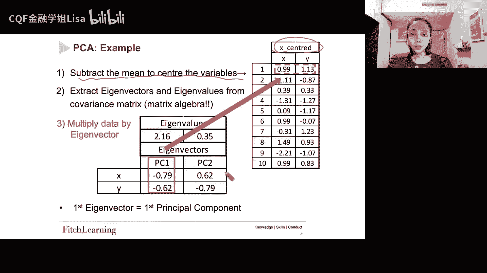

然后从这个就是从这个协方差矩阵当中呢，去提取特征向量和特征值和特征向量和特征值。

这个就是矩阵代数的基本方法了，对吧好，然后呢于是呢我们就会得到两个特征向量，然后两个因为两个变量嘛，所以说就是两个特征向量，Pc 1pc2，然后呢每个特征向量它对应一个特征值。

也就是说这个PC1它有一个特征值，然后PC2它有一个特征值，然后所以呢就是啊，PC1就是我们的第一个主成分，然后它有两个值，你可以看到它的X是-0。79，它的Y是-0。62好，然后嗯第三步的话呢。

就是把我们的这个数据去乘上这个特征向量，也就是说我们会比如说针对第一个点，第一个点呢它的这个X的取值是0。99，那我们会拿0。99去乘以，这个特征向量的第一个值，也就是-0。9，-0。79好，然后呢。

嗯再来去把这个1。13去乘以它的第二个值，-0。62，那么这样的话呢就会给到我们transformed data啊，他是这样去做的，所以这里的一个关键就是特征向量啊。

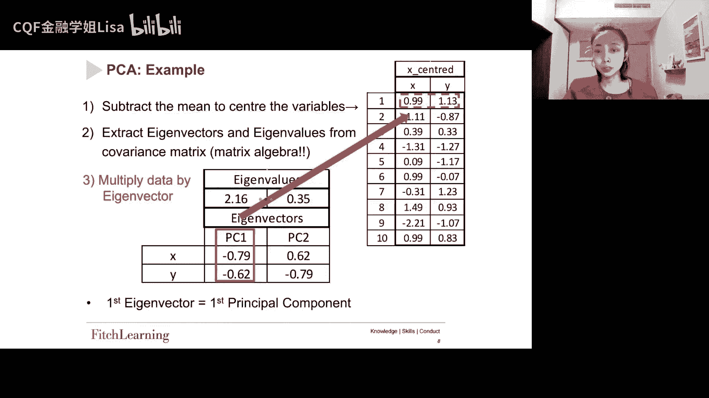

什么是特征向量的特征向量呢，它其实描述的就是这个系统里面的变量，是如何一起波动的啊，就是它会给到你信息啊，哪部分的数据是在一起move，然后特征向量呢也可以叫做future vectors啊。

反正都是特征向量的意思，然后呢在我们计算主成分的时候，就是我们有个loading哈，再和那么loading的话呢，它其实指的就是这个特征向量的elements。

好特征向量的这个元素，所以呢像我们这里的-0。79啊，-0。62啊啊，这些其实就是我们特征向量的loading哈，它的载荷，它的这个分向量的元素，所以呢你可以把它们去理解成，每个原始变量的权重。

这也是为什么我们在这个第三步，就是你要去把这个center data，把这个数据去乘以特征向量元素的原因啊，因为它们是数据的权重，所以我们就是试图去反映这个系统的主要部分。

然后呢把它这个transformed data当中的变量，如何一起moved给它反映出来好。

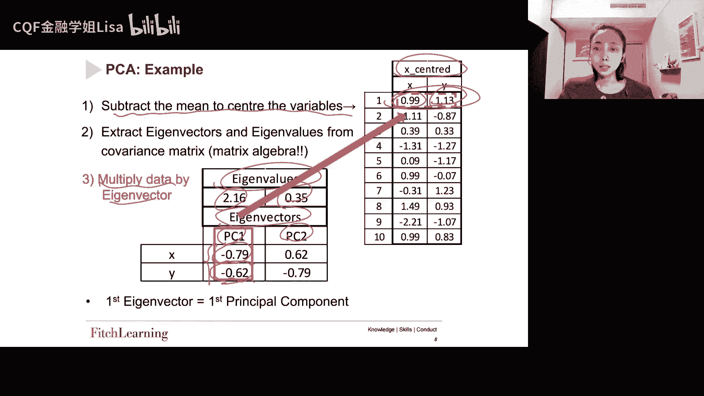

然后呢，比较重要的就是这个特征向量当中的符号，是比较任意的，也就是说啊特征向量这个呃负604，就是它的这个特征值和特征向量，六零负四其实是一样的，然后呢其实就相当于说成了一个，就是也合成了一个常数的。

是一样的啊，所以其实没有唯一解，然后好处呢就是我们可以改变特征向量的符号，来便于解读啊，这个是一个比较好的一个良好的地方好，那么目前呢我们提取了特征向量。

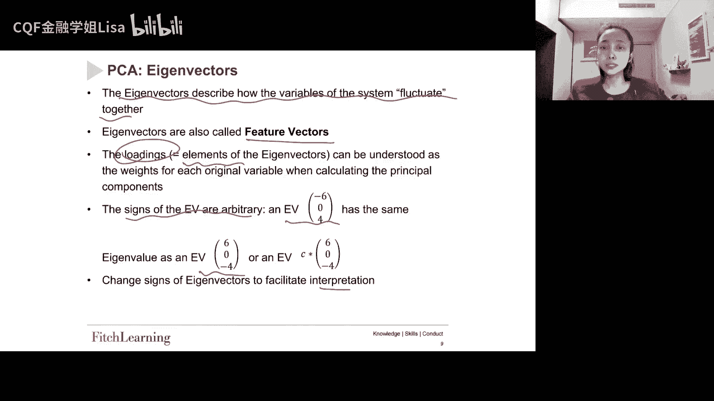

提取了特征值，然后我们使用这个特征向量去转换数据对吧，你把这些把原始数据给它乘以这个特征向量啊。

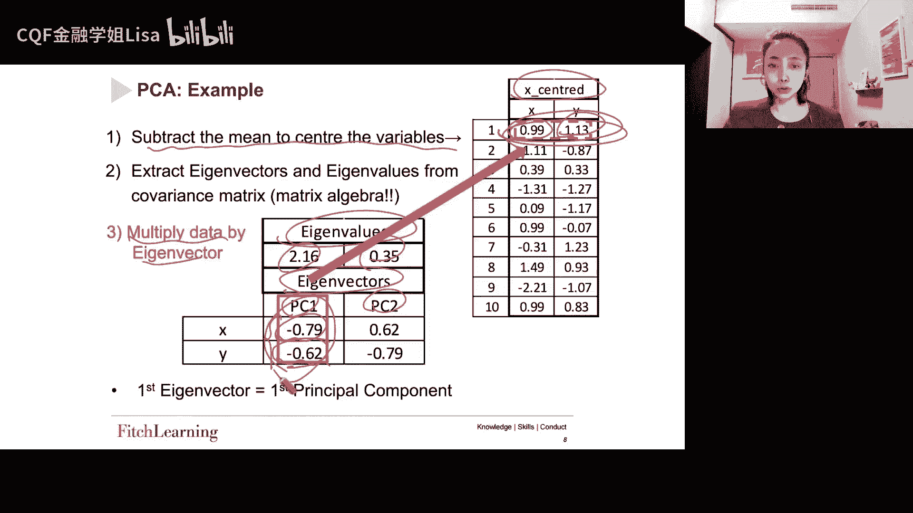

去做一个转换，那你得到的这个转换数据其实就是factor score，那就是我们使用这个特征向量去转换数据，来得到factor school好，然后我们前面我们之前说过嘛。

我们把这个100×10的这个数据对吧，十维的原始数据给它降维到100×3，那么这三三维嘛，这三个维度其实就是factor school，就是三个factor school。

所以我们需要特征向量来把这个原始数据给它，转换为factor score，那这里呢就是它是怎么样去做的哈，这其实就是我们PCA的第一步啊，我们需要去把我们的原始数据，一开始的X和Y对吧。

一开始X和Y给它转换成我们的factor scor好，所以你可以看到这张表，我们原本是XY还都是居中了的，XY让你通过就是跟我们的特征向量相乘，这种方式，那么就可以得到我们的factor school。

那么factor school呢其实就是得到了PC1和PC2好，然后呢针对PCE的第一个factor score，就是我们拿这个，这时候，其实我们就刚刚看过他的那个计算过程了，就是我们拿第一个要素-0。

79嘛，就是我们的factor。

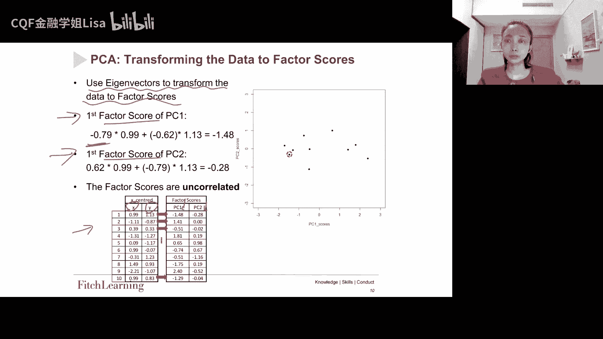

我们的TCE的这个x-0。79好。

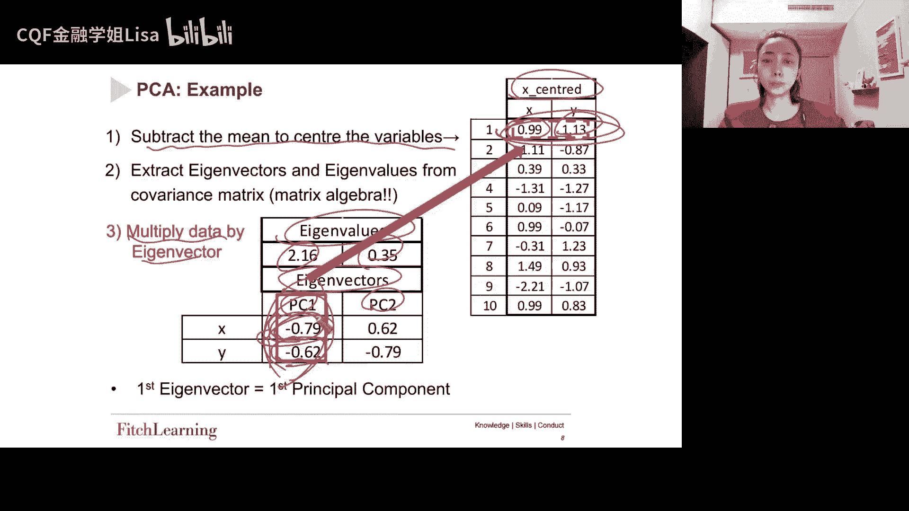

然后呢去乘以这个X0。99好，然后呢再加上我们的这个嗯就是PC2得X哦。

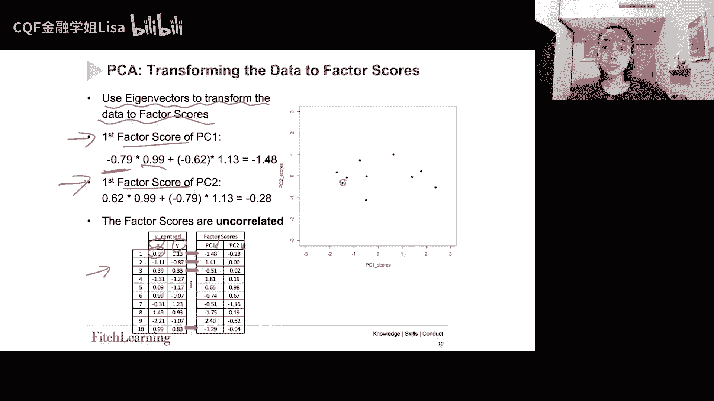

不是对0。99乘以，让我看一下哈，重新来一次，对，我们拿PCE的第一个要素，-0。79去乘以第一个center x0。99，然后加上PC1的第二个要素就是-0。62啊，刚刚是拿-0。79去乘以0。99。

然后再加上-0。62去乘以，这里的就是我们的Y这里的1。13century，然后呢你就可以得到一个-1。48的这个值。

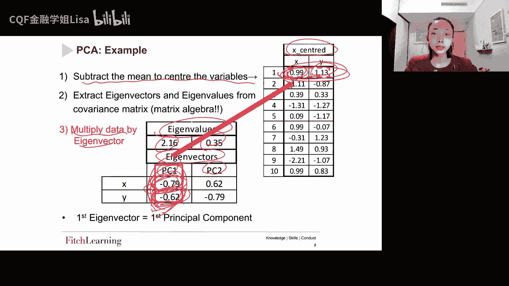

对-1。48，其实就是我们PCE这里的-1。48，所以这个是我们factor school的第一个坐标好，然后呢，对PC2的第一个factor school也是做同样的事情啊，就是我们的这个X0。99。

然后乘以我们的PC2的这个X对吧。

然后再加上我们的这个啊，这个1。13去乘以我们的这个PC2的。

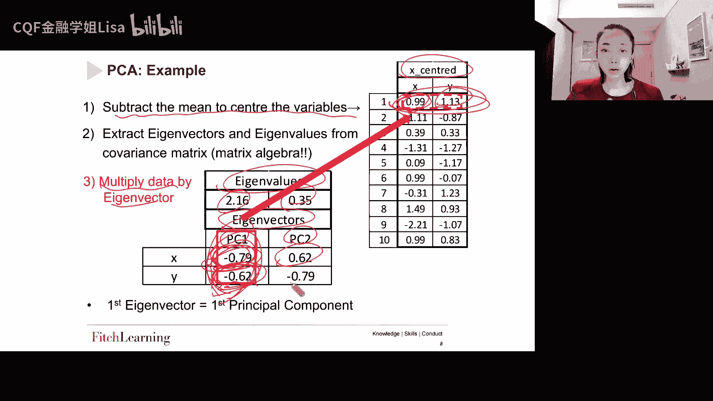

第二个就是Y这个-0。79，好得到一个-0。28，然后就-0。28呢，其实就是我们这里的这个PC2的这个坐标好，所以呢就是这个点它就是这样去对应的啊，就是这一个你转换之后的这个数据。

这个factor score，它其实就对应的是这个这个点对吧。

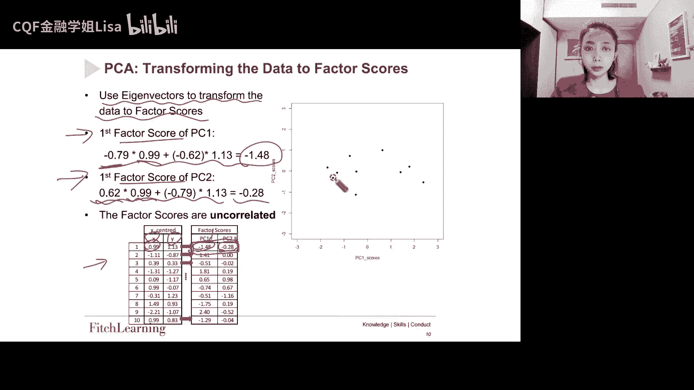

也就是说我们在前面不是看过吗，这是你的原始，这是你的原始数据，然后呢可能从其中的某一个点，某一个XY，你把它正交化之后，你可能就是某一个这个点。

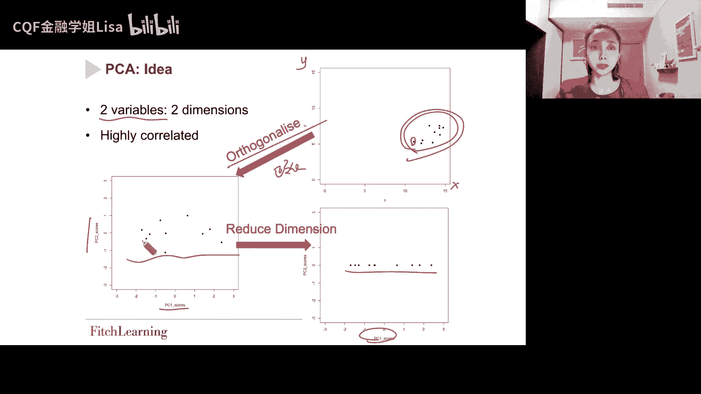

就通过这种方式去得到的好，他的这个factor school是怎么样就得到的，我们就知道了好所以啊就是用同样的方法，你可以对所有的数据点哈，所有的XY嘛，就所有的这个原始数据，然后都好。

就是乘它的对应的PCE的XY，然后呢这个Y是乘以PC2XY对吧，然后呢去这个得到我们所有的factor scor，对得到我们这里的所有的点好，那这样的话我们就完成了正交化。

所以factor score呢，也就是这里的这里的这个点我们就得到了，所以你会发现我们的factor score它是不相关的啊，factor score pc1和PC2是不相关的。

它是剔除掉了这个相关性之后的，那如果说你计算factor school这两列的相关系数，你就会得到零，这就是正交化的过程啊，所以这边就是他怎么样啊，这个表就给我们描述了，他这个每个点是怎么样去做正交化。

然后转换成这个factor school的，好，那么啊这个是你把原始数据给它，转换成factor scor，那同样其实你有了factor score之后，你也可以再返回到原始数据。

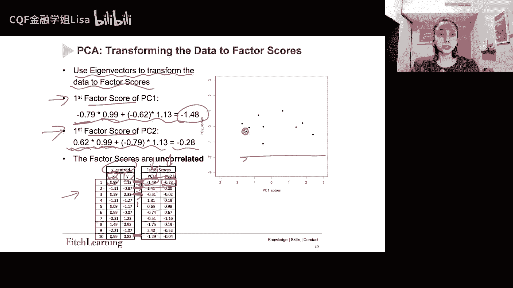

也是可以的，他们之间可以互相转换，所以呢这边就是我们重构我们的原始数据，我们有了factor score去重构原始数据，所以我们之前呢是从原始数据转换到factor school，然后呢。

现在呢我们就又可以从vector school呢，给他转回到这个原始变量数据，所以你刚刚是怎么转的对吧，就反过来再回去就好了，所以呢这些是我们的这个factor score。

然后呢用简单的矩阵乘法去计算，然后把这个特征向量给它转置嘛，然后和这个x center的对吧，这个我们刚刚做过的这个事情相乘，然后去得到我们的factor score好，然后呢这里呢就是你转换回来对。

你转换回来，就是通过把这个特征向量啊乘以factor score好，然后呢在整个转置对，就可以得回我们的这个x center，这个居中的就是居中之后的这个原始数据，它就可以回到原始变量哈。

所以啊这个原始数据跟factor score，是可以互相转换的好。

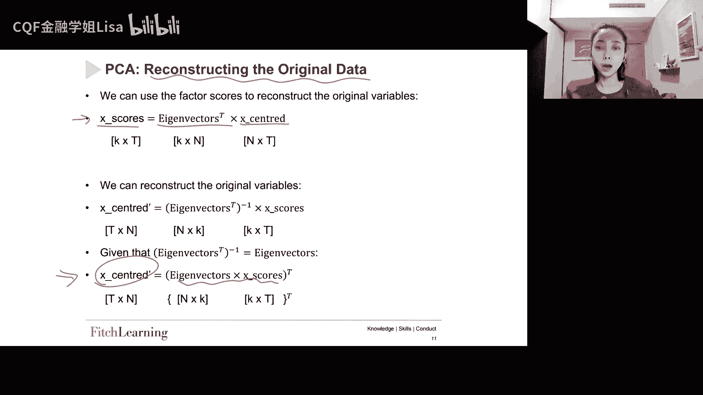

然后呢我们这里也看一下这个example，它是如何去重构这个原始数据的啊，这里呢我们也是使用的是PC1和PC2好，所以呢这个X撇是原始数据啊，就是我们嗯这里这个步骤啊。

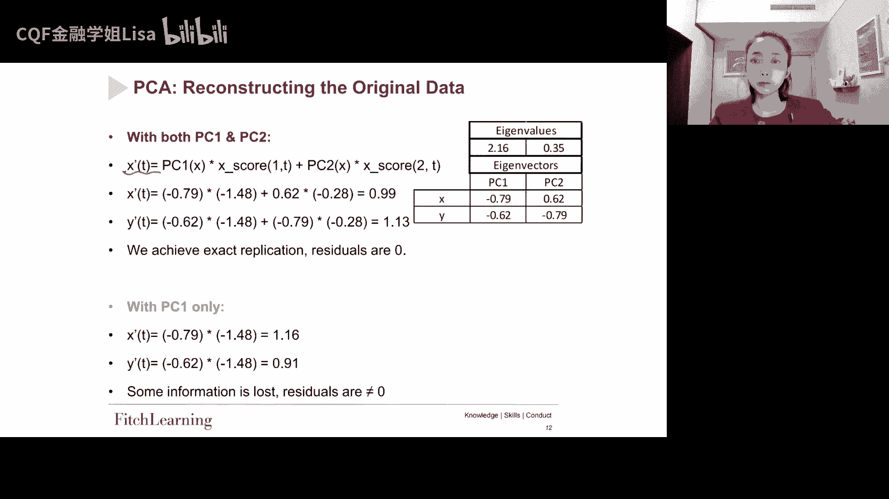

我们从这个fast school到原始数据的这个步骤好。

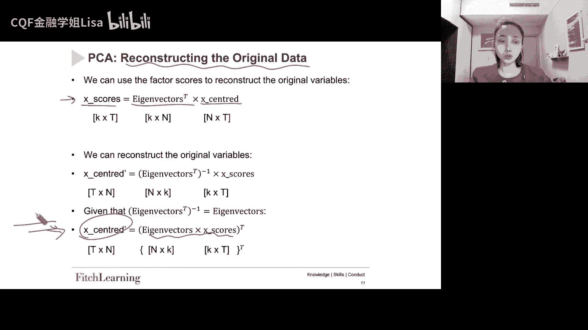

所以他就是拿PC1去乘以第一个factor school，然后加上PC2乘以第二个factor scor好，然后所以你代入数据，代入数字对，你会发现M的X又回到了，0。99和1。13对吧。

所以他又回去了哈，又回去了对，这个是我们刚刚的PC1X，这个是我们刚刚的这个ex factor，Factor，factor school的一个，然后这个是呃这个，这个是我们刚刚的PC2。

这个是我们的这个factor score2，好好，所以呢就是呃，我们这样就可以得到我们的这个第一对，原始数据对吧，就这样去重构我们的数据，那因为我们使用了两个PC，也就是使用了整个变量系统。

是因为我们一开始也就只有两个变量嘛，一开始就只有两个维度嘛，好，所以呢我们现在呢呃两个维度，还是两个维度对吧，从两个从XY到PCEPC2，就是两个维度到两个维度，维度是没有发生变化的。

我们依然是使用了整个变量系统，所以其实我们是使用了，叫做就是exact replication哈，叫做精确的复制，所以呢就算就是因为是精确复制嘛，所以我们的残差是零，我们使用两个变量。

两个变量转化为两个主成分，所以呢其实还没有降维啊，一开始两个原始变量，然后呢这个这个弄完之后，还是两个主成分没有降维，那么现在的话呢我们就想诶，那我们就降维吧对吧，我们就只使用第一个PC。

那第一个主成分，然后呢也是做了同样的计算啊，拿这个PC1去乘以我们的第一个factor score好，得到1。16好，然后呢，把这个就相当于我们把第二部分给删掉对吧。

因为我们现在是我们要从二维给它降到一维，然后所以呢这个X撇呢，它不再是上面的这个0。99了，而是1。16，然后呢残差呢也不是零了，所以这个呢就是重构原始数据的思想好，所以这里我们可以看一下。

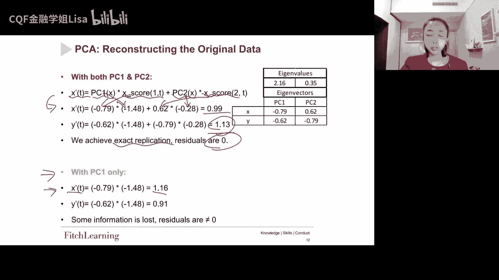

它的这个残差是如何计算的，就是我们刚刚已经知道使用两个PC残差为零，也是完也是完全的一个复制，然后呢，呃中间这张表呢，就给了我们详细的一个计算结果，这就是你用PC1PC2对吧，两个维度，两到两个PC。

那么它的所有残差都是零啊，就是利用两个PC去算X撇Y撇，其实你就是完全回到之前的原始数据，所得到的结果和真实的XY是一样的，所以残差都是零好，但是现在如果你只用PC，你就只用一个主成分的话。

你会发现它重构的时候呢，它的这个变量其实发生了变化对吧，就是你把这个数据再重构回，这个XY和X撇Y撇，你会发现跟真实的XY就不一样了，所以呢就会有一个残差对吧，所以我们的这个残差呢就不再为零了。

好这就是它的一个它的一个过程，所以到这里呢我们认识了正交化，认识了降维，认识了重构数据好。

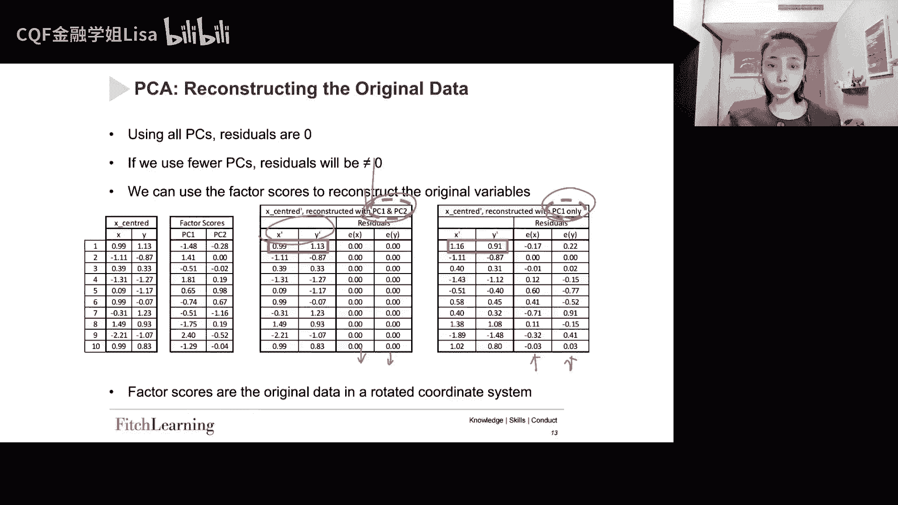

然后我们之前提过呃，就是我们说为什么要在运用PC之前，为什么要去d mini，就是为什么要居中化对吧，那我们之前提过就是嗯在应用PC之前，应该先定命数据，先去中化，问题是为什么我们需要去做这个。

为什么它有道理，那其实我们就可以来看一下这两幅图啊，这两幅图呢就是都是同样两个维度，好，然后呢你可以看到，比如说这幅图里面它有很多点对吧，然后呢从原点出发呢，它有一个PC，就是第一个PC。

第一个主成分它穿过这些数据点，然后呢这些数据是没有居中化的啊，这些原始数据它没有居中化，然后呢如果我们先把原始数据去做DEMIN哈，先去做自动化的话呢，那么它们整体会移向原点。

然后这个时候呢你再去取第一个PC，那么它的方向看起来就不一样了，所以呢右边这个图呢，其实就是你做了这个DEMIN之后的这个结果啊，所以你看你做了DEMIN之后，我们的这个原始数据。

全部都是就是围绕着这个原点对吧，就是啊整体移向圆点，然后这个时候呢你再去取这个第一个PC，那你会发现它的方向是这个样子的对吧，它他这个时候他穿过这个数据点，去穿过的一个就是相当于拟合的程度。

其实是更好的，所以呢这两幅图差距很大的，原因就是在于有没有居中数据好，所以像左边这个图就是如果你没有去抵命，没有去集中集中数据的话啊，那么PC呢他可能是找不到正确的，这个PC的方向的啊。

找不到正确的方向，而右边这个图呢它是做了DEMIN的，所以呢它的这个PC是有正确的方向的，那么这就是为什么它很重要的原因好，然后如果我们在协方差哈，如果说我们在这个是协方差矩阵。

就是这个coverance matrix，好，如果说我们在协方差矩阵上去执行PCA的话，就是你有没有定命，其实没有很大的区别，就是你可以抵命，你也可以不抵命啊，其实没有什么区别啊，为什么呢。

就是比如说就就是我们应用的，之前应用的这个example啊，为什么你直接对协方差矩阵去做PCA，他这个居中化没有任何的影响，其实就是因为当我们去计算协方差的时候，协方差的公式它其实已经减掉了均值。

对不对，这个是协方差的均值嘛，呃公式嘛，所以它其实都是已经减掉了均值的，所以呢就是协方差的，它的计算当中其实已经潜在包含了地面，因此的话呢其实你对协方差矩阵去做PCA，你做不做地名都无所谓啊。

都是差不多的好，然后呢还有就是PCA呢，它还有一些执行的方法，比如说你可以去使用奇异值分解啊，其实之分解啊一个比较流行的方法，如果说就是如果通过奇异值分解，去对非居中数据进行这个PCA的话呢。

那么这个呃这个center跟on center，就是有没有去做自动化的，这个数据的结果会有很大的区别，就是如果说你不做地面，那其实你也是会遇到左边这个图的一个效果，然后呢会使得你的这个结果是无效的啊。

所以呢就是总而言之吧，就是为了保险起见，还是建议你啊，就是在任何一种情况下啊，保险起见都是在应用PCA之前先定命数据啊，就是比如说如果你面对西方差矩阵，你知道对面可能没有什么用，但是你养成一个习惯嘛。

他也不会有任何的坏处对吧，所以保险保险起见，我们还是在做PC之前先去做DM，先去做居中化会好一些好，然后呢我们的PO上呢有这样的一个代码，这个代码呢就是嗯展示了，怎么样在协方差矩阵上去执行PCA啊。

以及这个奇异值取证啊，取值奇异值分解还是有的好。

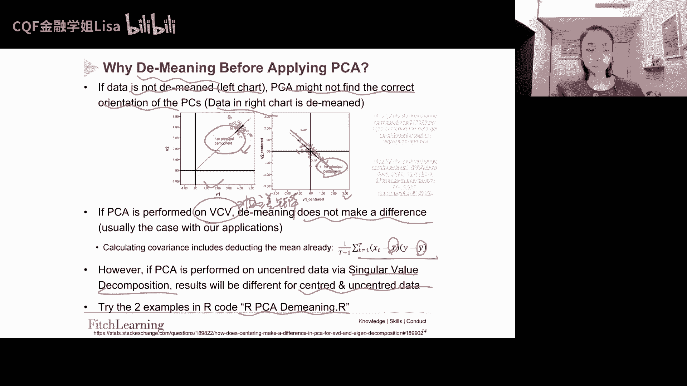

然后我们来看一个example，就是也是一个非常受欢迎的例子，就是把PCA应用于利率，那么利率的数据，这个是从啊美联储的这个嗯官网上下载的，然后呢它这个数据当中有美国的美国利率，有470一个。

daily d七百四百七十一个这个热度的数据点，然后呢，时间是从2016年2月16号到，2017年的12月9号啊，471天，然后呢在右边这个图呢，呃它只展示了四个maturity哈。

就是这边四个颜色就是四个maturity，所以三三个月期限的利率，然后两年期间的利率，55年的利率，10年的利率，然后横坐标就是0~471好，这是我们的四个期限的这个利率，然后呢，但是呢这个实际上呢。

其实我们的数据呢是有11个期限的，就是他只展示了四个啊，他这边其实有11个答，原本的数据其实应该是471×11啊，所以我们的input矩阵有471行11列，所以这个是我们未给PCA的数据好。

然后呢同样就是这边呢我们可以去用R的啊，p r com和bring com或者pr com来运行PCA，嗯2Y和5Y5Y还是要高一些嘛，对吧好，然后呢，我们也可以手动去提取这个特征向量和特征值。

然后呢如果说你要看更多的应用细节的话，那就还是去看这篇论文啊，就是看这两篇论文，关于PCA在利率上的应用啊，这里面有很多很多的细节，我们这边呢只是大家去把这些比较重要的点，抠出来，给大家看一看。

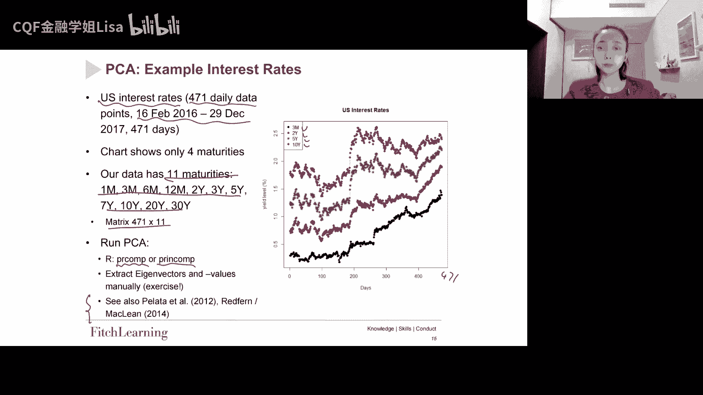

好，然后我们计算特征向量提取了PC，然后呢我们想用多少个主成分呢，还有一些标准就是这里呢我们有一个叫screen port，也之前也见过叫陡坡图嘛，那陡坡图的话呢，其实它就是按降序去绘制这个特征值啊。

所以你可以看到右边这个图啊，它的第一个PC啊，它的特征值，然后呢第二个PC对，所以还得给到我们的不同的PC，它的一个啊这个特征值的一个啊，这个直方图给我们画出来好，所以这个特征值呢其实就是我们之前在。

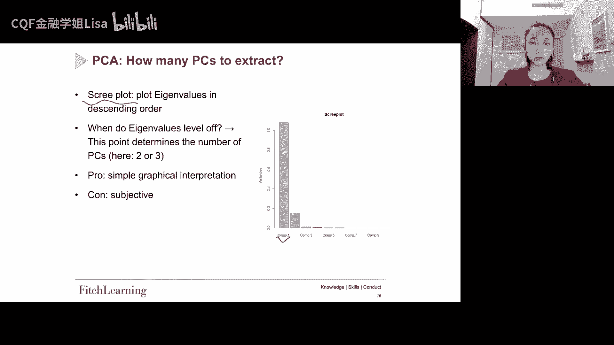

在这里你在这里在这里看到的这两个数字啊，2016啊，这个0。35这个特征值是在这里。

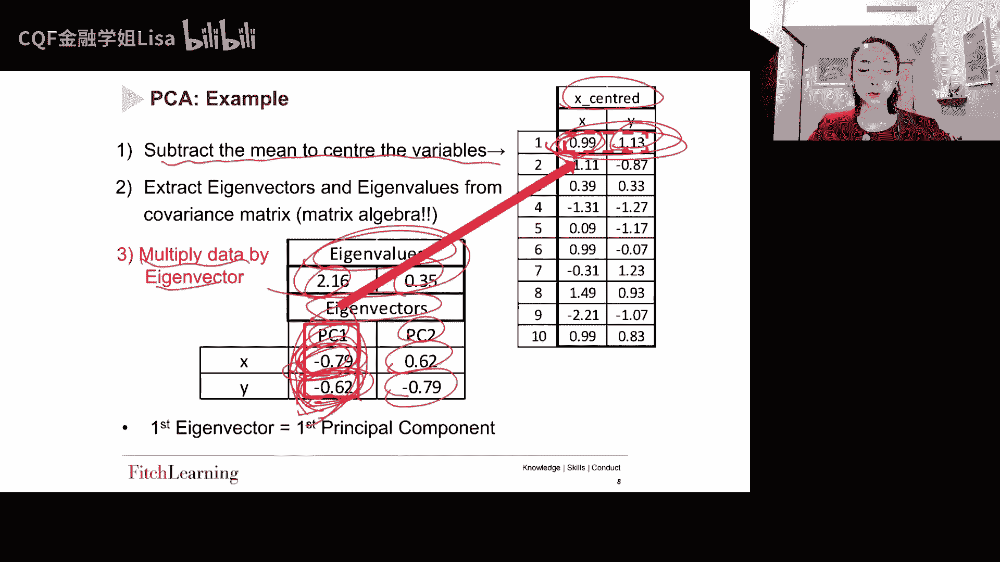

好然后这个对每个主成分呢我们有一个特征值，然后这个陡坡图呢，它就是以这个降序的方式去呈现了这些特征值，那么现在的问题就是，那我们应该使用几个主成分的问题对吧，我们要看这些特征值的差异。

那我们在这个特征值水平最显著的地方，可以去切一刀对吧，比如说这里是比较显著的，就是这里我们在这个二这里切一下，那么或者你也可以在三后面切一下对啊，所以呢其实啊我们也可以决定说。

我们到底使用两个主成分还是三个主成分对吧，因为你后面的这个主成分的，你后面的那些PC的特征值都太小太小了对吧，可以忽略不计了啊，但是基本上可能比较常见的方法呢，比较常见的选择还是就是用两个啊。

因为PC3其实也它的特征值也不也不是很大，也是比较小的啊，就是我们我们想的是，反正第三个往后呃，一般不会带来很大的改善了啊，所以其实实际工作当中，我们大概率还是会在第二个主成分之后，去切一刀。

就是只用前面两个好，所以这个这个陡坡图它的一个优缺点，就是它的优点，就是它是比较简单的一个图形解释啊，你看你只要画出这个图，你就可以非常容易的去做出决策，不需要画好，需要花很长时间。

然后它的缺点就是比较主观，反到底取两个还是取三个，就是比较主观的，反正就是见仁见智好，然后呢接下来就是除了陡坡图之外，我们还可以有没有一些其他的方法，那那这边的话还有一些其他的。

比如说你可以去使用catha criterion，就是这个嗯cans准则，那他就说仅保留特征值大于一的PC，那么特征值大于一的，那就只有只有PCU短，如果按照这样的一个标准的话。

那么他的一个理由是什么呢，他的理由是我们的这个scale变量啊，它的均值为零，标准差为一，就是平均方差就是一哈，平均方差是一，那么也就意味着，我们只考虑那些对总方差的解释贡献，高于平均水平的PC对吧。

既然我的平均方差都是一了，那么我的这个PC，它的特征值是不是应该要超过我的平均方差，才才有存在的必要对吧，所以这还是他的一个利用好，然后还有一个方差解释标准，当他解释标准呢，他是说根据你的需要。

然后呢你去保留尽可能多的PC来解释方差的，这个尽可能多的去解释这个方差嘛，比如说达到90%的一个方差的解释啊，选择多个PC，一直到你的方差解释达到90%，那么在我们这个利率的例子当中呢，就是PCE呢。

它其实解释了87%的一个房产，然后呢PC1到PC2，他们俩一共接受了99%的房产，然后PC1到PC3，已经接受了百分之百的房产，然后其余的成分啊，4~11对解释系统的反，这个方差是没有任何贡献的好。

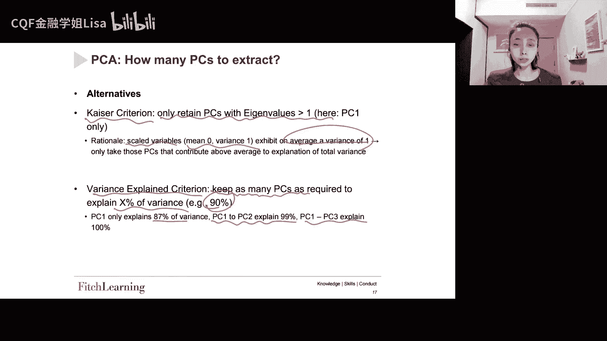

然后还有就是我们怎么样去可视化，我们的这个结果，就是我们这里比如说决定啊，就使用前三个特征向量哈，决定使用前三个特征向量，就基于我们的陡坡图，我们选了三个，然后呢每个特征向量它有11个要素。

就是11个maturity，然后呢，它的这个图表，其实就给我们显示了这三个特征向量的loading，就是这个负载，就是这个特征向量的element，它的要素，它的元素，然后呢这个黑色点呢是PC1。

第一个PC第一个主成分，然后第2PC2是红色，然后PC3是绿色好，所以在第一个特征向量当中呢有11个要素，可以看到黑色其实都有11个要素啊，然后呢是一个maturity，所以呢黑色的点。

它其实就是第一个PC的11个要素，然后同样红色呢就代表第二个PC的是一个要素，然后绿色呢就是第三个这个特征向量的，是一个要素，然后这个图呢就显示了这些LOADINGS，然后怎么去解读这些图，怎么去解读。

那么首先呢像黑色这个线，黑色的话呢，你看Y轴，Y轴是change in ield，那么我们记得因为我们的input变量是利率对吧，那么利率的change in yield，那其实我们看利率的变化啊。

就是你可以解读可以是当利率上升，所有期限PC1也往上移动，然后反之亦然，所以呢我们其实可以把PC1，给它解读为九七嘛，对不对，九七是不是，就是当我们的利率发生一个单位的变化的时候。

比如说债券的价格发生了变化对吧，所以这个九七它其实就是告诉我们，对于这个固收产品哈利率上升，我们持有这个债券它会亏多少啊，好所以这个PC1它就可以这样去解读，然后呢再来看PC2。

PC2的话是怎么样去解读红色的这条线，那么你可以看到啊，这里这个是零，这个是零，也就是这里的change in yield是零，所以你可以看到这个PC2它前半部分，它这一半部分它的loading是负的。

然后呢后半部分的loading是正的，那意味着什么呢，就是如果说利率上升嘛对吧，如果利率上升，那么负的要素会预期这个year curve，前半部分往下移动，而期限更长的yield往上去抖。

那这其实就应该是一个变陡的一个扭转效应好，所以呢我们就可以说PC2，它其实反映的就是ECRAFT的斜率好，然后接下来的话呢就是这个PC3绿色的点啊，绿色点的话你可以看到这个呃year curve。

它前端的loading为正，然后呢后端的loading也为正，但是中间为负对吧，所以它有点像一个蝴蝶好，所以PC3呢它就被描述成是曲度converter好去读，那么这个呢就是当你的这个数据是利率的时候。

那么他得到这PC1PC2PC三，那么你这三个主成分是怎么去解读的哈，就是这样去解读的好。

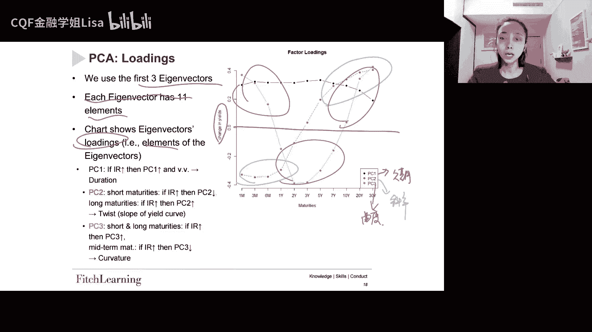

然后我们看一下，随着这个时间的变化，Factor school，它的变化好，我们的原始数据是471×11，然后通过应用PCA，我们把它转换成471×3，好，左边这个图。

它的横坐标就是这个470一个时间点，然后纵坐标呢就是这个change in yield，然后黑色呢是PC1啊，红色是PC2，research是PCS，所以你可以看到，比如你看黑黑色PC1。

随着时间的推移，这个yield它是如何迅速上升的，就跟开始相比，这个观测期末其实要高很多啊，Factor score，它是如何跟我们的这个原始利率联系起来的呢，那么你就可以看我们右边这个图啊。

右边这个图啊，比如说像黑色的是三个月的利率，然后呢他大概开始于可能0。20。3的样子，然后最后落在大概就是，可能1。5的一个水平好，然后蓝色的是10年期的利率，然后呢10年期的利率呢。

它有更明显的一个波动对吧，更明显的movement就是它的它增长的更强，然后呢这个呢其实就反映的是左边的第一个PC，也就是duration，这个部分就在整个471天。

所有的maturity利率全部在level上水平上，有一个向上的move啊，所以这个就是它的一个就是这个从是怎么样，从跟它原始数据跟这个PC去挂钩，还怎么去联系起来好，然后呢再来看这个PC2。

就是左边的红色这个图，那么左边红色这个图呢，它在刚开始的时候是比较稳定的对吧，刚开始比较稳定好，然后呢开始然后开始变频，然后呢在嗯然后又变抖对吧，然后又变平，它是这样的一个样子，然后他最后呢。

他最后这里呢，可能要比刚开始呢要稍微低一点点，然后它对应着右图的话呢，你可以看到像10Y和三个月之间的距离，可能刚开始呢是比较大的，然后中间的话呢就有变小，还有变大变小变大的变化。

然后呢在观测期末稍微较小对吧，所以呢就是这个也是它反映的我们的这个PC2，就是我们的这个斜率嘛，就是不同期限结构，不同期限利率之差的一个一个情况好，然后再来就是PC3，PC3的话呢。

它其实就是描述的我们的这个converter，我们的这个曲度，所以你可以看到左边这个绿色的，是基本上没有怎么变的，然后呢其实你在右边，右图呢也看不太出来对吧好。

那这个呢其实就是factor school，它如何解读到利率上的方式。

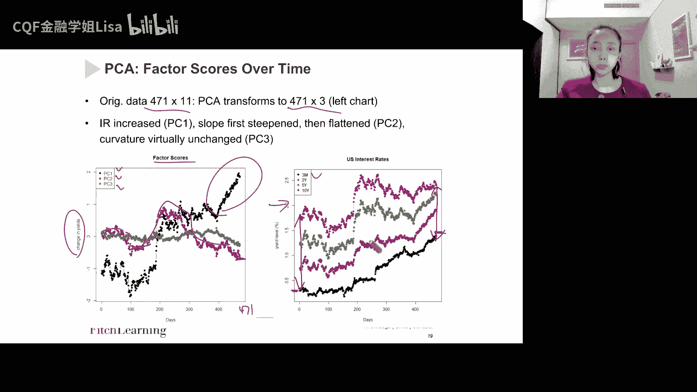

然后还有一幅图啊，这幅图呢这个黑点啊，它展示了ECUP的抖动，就是10年取减一年的10年期的国债利率，去减一年期的国债利率，然后红色这个点呢它就是展示的是PC2对吧。

所以你可以看到它们之间的形态非常的类似啊，所以我们可以说PCR，它实际上反映了ECRAFT的抖动啊，其实关于这个year cf，因为利率是我们MOJO6的主题哈，MOJO6有大很大的篇幅在讲利率。

所以呢其实我们毛周六呢有啊，就是有专门的一个lecture会讲这个利率的模型，就会到时候就会给大家去再次去讲到PC好。

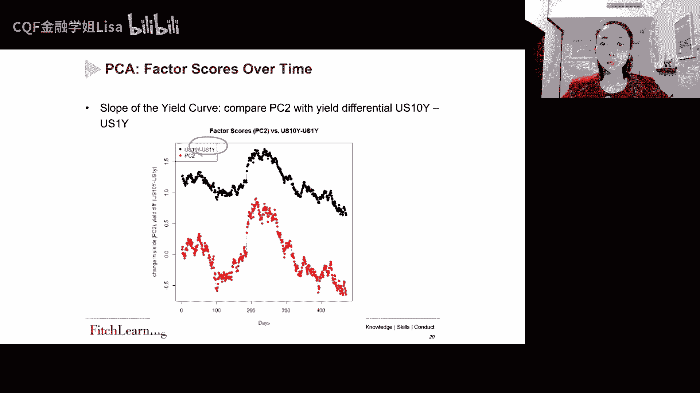

然后呢，怎么样去使用PCA来做相对价值交易呢，那在这里呢我们可以用残差，怎么去使用，我们可以看左边这个图好，左边这个图横坐标还是470一个时间点，然后纵纵坐标呢是yield。

然后呢它是一个呃两年期的CURR，两年期的关键利率就是就是两年期的利率，然后呢红色线就是这个残差为零的地方，所以你可以看到像这一块这一块的话呢，就是残差比零大，残差比零大。

就意味着利率高于被PCA解释的水平对吧，那就说明什么利率高的话，因为我们知道利率跟固收的价格是呈反相关的，对吧，如果利率高的话，那就说明你这个在这里的时候，你的两年期的这个利率产品是比较便宜的。

那这个时候我们就应该买入对啊，就该买入好，然后呢呃因为我们是赌这个均值复归的嘛，就是我们赌这个利率它是会向均衡去收敛的好，然后还有像这里这里的话呢，因为它的残差是小于零的，也就意味着我们的利率。

是低于被PCA解释的水平，那么我们就应该卖出对吧，低于的话就意味着固收的价格太高，那么就应该卖出，所以这个就是如何利用残差分析去做利率，相对价值交易的这个思想啊，当然你不仅可以去看两年期的利率。

你也可以看20年级，10年级等等啊，都可以。

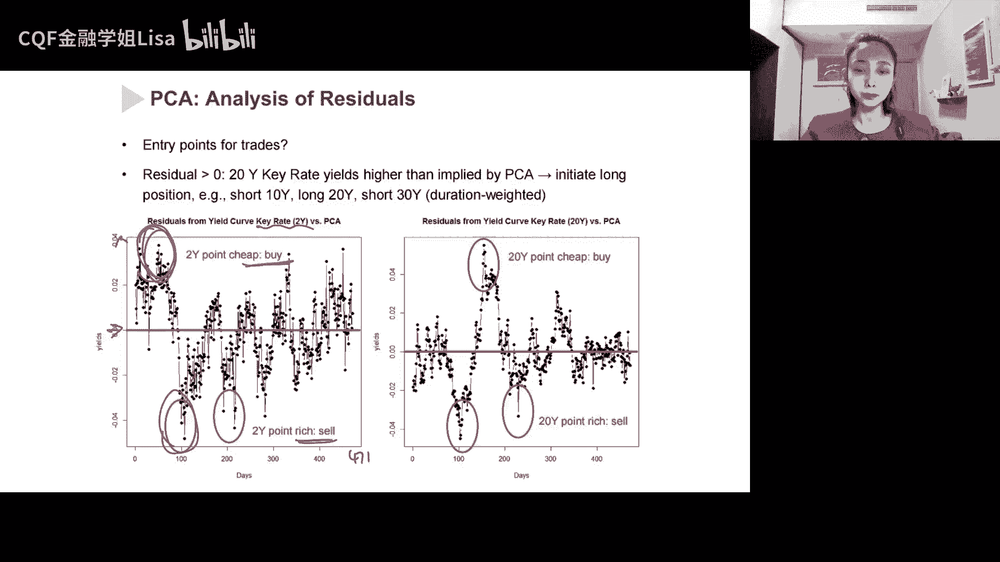

好然后呢一些更多的关于PCA的应用，就是我们说factor school呢，其实就是对这个原始变量系统的一个L代表，就是瘦的代表对吧，变瘦了，然后它里面的噪音呢也更少，因为他提出来的都是一些关键的要素。

然后像我们回到刚刚的这个利率的例子啊，最开始我们有11个maturity对吧，然后后来呢我们只拿出三个主成分，然后呢其中的差就是11个减三个是吧，11维到三维，那其实它的这个多的那些维度其实就是噪音。

所以你可以把其他的成分给它丢掉，那我们在transform的这个变量结构当中，并没有失去太多原始结构，对啊，我们的那些关键的东西我们都抓住了，但是它的噪音更少好，然后呢我们可以使用这个呃。

就是factor score呢去做预测，比如说我们可以应用AR模型，还记得我们之前运用AR模型，或者是机器学习模型来预测时间序列，那我们其实这里也可以做同样的事情，只是呢就不是建模原始时间序列。

我们就移除掉这个噪音，然后聚焦在啊建模，用AR模型或者是这个机器学习模型，去提取出的这个时间序列性质好，然后嗯就是我们之前我们上节课有见到过，那个king and swanson。

2018年的那个论文嘛，就是那篇论文，其实他没有发现，运用机器学习模型来做时间序列预测数据，如果用降噪提取出来的，这个就是这个时间序列，时间序列性质，还是你用降噪方法先提前去做这个预处理的话。

比如说用PCA去做降噪的话，那么其实你把这个transform data，喂给机器学习模型，他的这个机器学习模型的预测，质量会显著提升啊，那个是那篇论文，还有提到过的好，然后还有同样的思想。

就是宏观经济预测，就是你不使用几十个变量，你只使用比如说六个因子，或者是这个六个主成分对吧，那就可以看这篇论文，然后还有像这个啊这个在线价值刘邦啊，使用PC我们可以去对风险因子去进行建模。

就是你不用直接去对组合当中，所有的工具去估计吧，而是我们先把这个组合当中的工具呢，把它映射到啊五个或者十个风险因子好，然后呢去建模这个风险因子啊，再去推出这个组合的吧，那么这个呢也是一种寻找大型组合。

VR的更稳健的方法，然后呢还有就是对这个loading的运用，我们可以使用loading来计算这个对冲比率，然后使得这个投资组合呢它免受啊，就是这些因素的影响啊，利率平行移动啊。

或者是利率平行斜率变化呀，那后面有一个reference，它也是关于这个的。

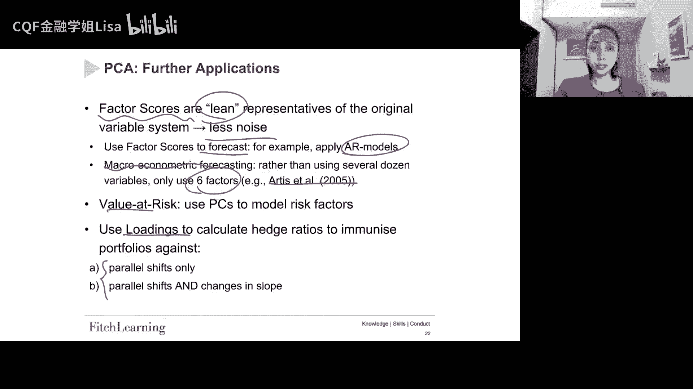

好，然后另外一个应用呢是在于这个VIIVX的，这个就是这个future tom structure，是它的一个期货期限结构，然后vex呢是标普500的隐含波动率嘛，那么这里呢它的横坐标是七个不同到期日。

就是这个index one，它是first month，然后index to是这个second months，然后一直到这个就是seven months，好然后这里呢有两个点，就是你可以看到有两条线哈。

蓝色的是08年4月，然后红色呢是20年3月，然后通常正常情况之下，通常正常情况之下，这个VIX期限结构，它应该是他应该是略微斜向上的，就这个才是正常的weeks，它的一个这个期限结构。

但是呢在压力环境之下呢，它的这个机械结构是会发生反转的，所以你可以看到，在在20年的这个新冠疫情爆发之后，危机很严重，所以它的first month的这个点位达到了60，然后呢现在哈就是七个月之后。

大概就是到了20这个点位左右啊，所以嗯这个呢你是可以就是检验PC，是否可以用于这个week's future tom structure，然后这个数据呢它是下载于blue greg。

然后有636×7的一个数据点啊，七列，然后636个weeks的周度数据，他做了这样的一个研究，然后这边呢是给他这个颜值给到的一个，这个是陡坡图，所以他展示了也是类似，我们刚刚在利率那里看到的结果对吧。

就是大概就是两个PC比较相关嘛，那么他这边的这个图就是黑色的PC1，然后红色的PC2，绿色PC3，然后呢比较有趣的是，这里的数据是mix mix future，那么和利率的数据其实很不一样。

但是呢你会发现他做出来的这个PC的结构，却非常类似，对啊，同样其实你可以去对比大宗商品的价格，去做PC啊，其实你会得到这种类似的一个图，对这个期限结构呢，它好像也是被这前两个PC或者前三个PC。

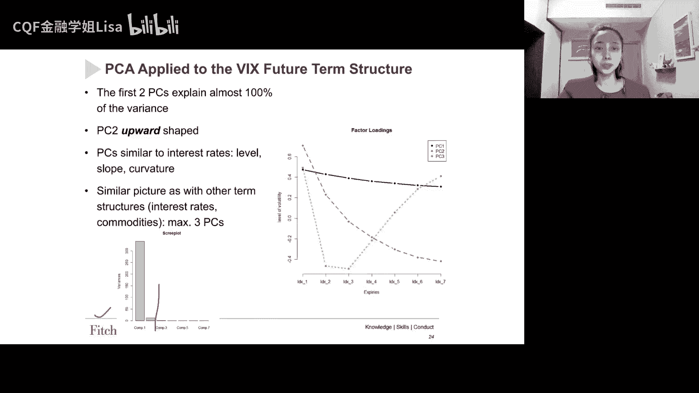