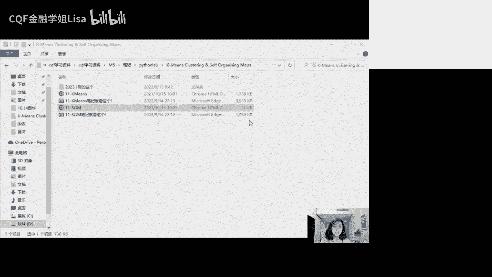
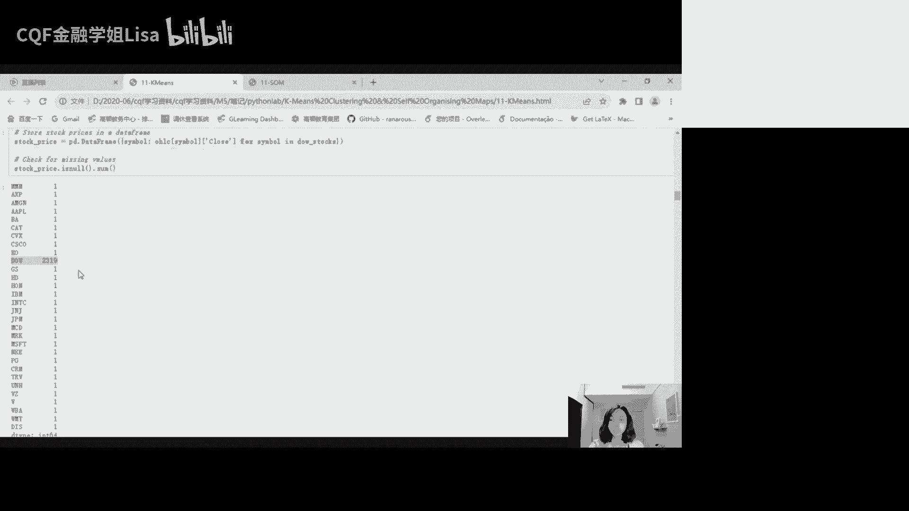
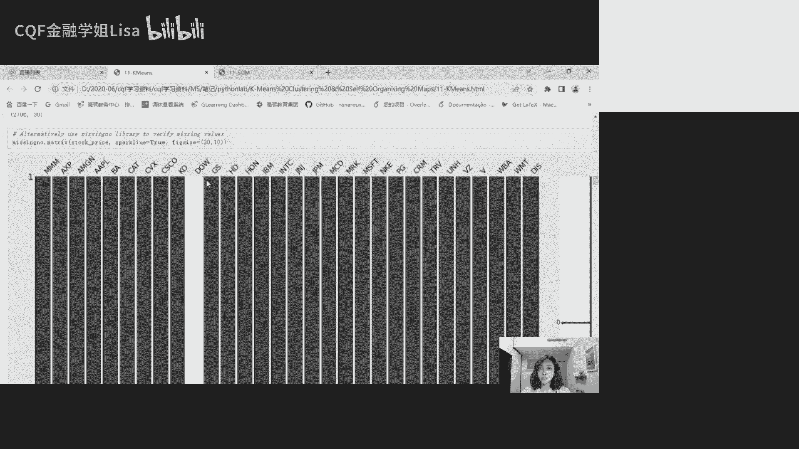
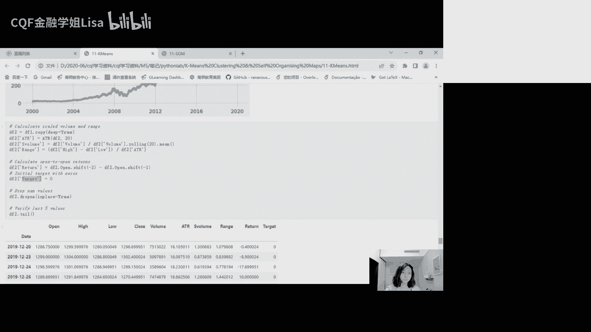

# 2024最值得学习的金融量化交易课程-第三讲：【Python Lab】K-Means Clustering & Self Organizing Maps - P1 - CQF金融学姐Lisa - BV1ox421D7ES

K70和SAM的这个Python map，晚上好，然后我们直接来分享这个屏幕。

嗯大家可以看到这个评论吗。

分享的是这个。

好我们可以看到这里的这个，这个notebook，好我们就先来看这个啊，不是KNK均值聚类哈，我们先来看这个嗯，我们这节课主要是讲这个k means和这个送，然后都是非监督学习的这个算法，然后呢。

跟监督式学习框架是有很大的一个区别了，我们说监督式的话呢，其实就是我们有XY，然后我们试着去呃，比如说预测这个label对吧，然后但是呢在非监督学习的框架当中呢，我们是没有Y的，我们没有label。

我们只有这个数据集，然后我们去尝试着去理解数据，然后这个数据的分布啊，特点啊啊特征矩阵之间的关系啊，然后呢我们今天晚上topic呢，它其实也是分成两个部分，第一部分呢就是k means clu啊。

这一部分呢是主要的一个部分，我们会去看这个K均值聚类，它在金融时间序列上的应用，然后第二步呢就是看SOSO的话呢，我们只是一小部分哈，就是我们会去看它是如何帮助去降维，或者是帮助我们去选择特征。

然后我们也提到过，我们说PC它跟啊k mes之间的主要区别，就在于，这个k mes呢，是可以去解释数据当中的非线性关系，而PC呢它只能去解释线性关系嘛，然后我们知道k means呢它属于非监督。

然后他尝试从这个数据属属性当中去学习，然后呢基于某些特征来去做聚类，然后呢这个跟我们之前看的分类算法，就是监督式的这个分类算法框架不同对吧，聚类它不同于分类，因为呢聚类呢它是试图去基于特征去识别一组。

相似的数据点，然后并且把这个结果去呃，就是嗯把这个结果给它，结合到不同的这个cluster里面啊，那由于这个可用选择的数量，选择合适的聚类算法，其实通常是比较就是比较困难的。

所以这呢我们有一些就是具体的一些啊，参考内容哈，参考材料大家可以去点啊去看一看，然后里面有不同的距离度量，来去计算这个聚类方法，然后最流行的三类聚类算法就是这三类，就是一个是这个PARTITIONAL。

就是分区聚类，也就是把数据对象划分为不重叠的组，那其实k means聚类就是这个partitional clustering，当中的一个例子，然后还有像这个分层聚类，这个我们也是在课件当中来。

在lecture当中是有看到过的嘛，就是分层聚类就是通过构建层次去进行分类，然后还有就是这个基于密度的聚类，就是基于区域中数据点密度的一个分配，那么这个呢就是最流行的三种聚类算法，然后我们今天晚上呢。

就是聚焦在这个partitional clustering，也就是可以miss这个框架，然后呢数据任意的属性就用来去做这个聚类，好所以这个k means算法呢，它在没有标记的这个数据集中。

去搜索预定数量的这个cluster，然后并且基于最优聚类去把具有这个聚类中心，是属于这个聚类的所有点的平均值，就是每个点比其他聚类中心，更接近他自己的一个聚类中心的一个假设对吧。

这个是k means的一个假设，比如说举个例子，我们想要去聚类标普500的股票，然后呢现在有两个cluster a和B，然后呢基于比如说我们基于这个呃，就是weekly return。

基于周回报率的特征，然后呢去把这个股票，把这个标普500只股票去看，给他去做，就是聚类A还是B，然后我们可以去计算，比如说微软的啊，IBM的周度的回报率，然后呢我们去比较一下这个A的质心。

它和微软的这回报率啊，以及它跟这个IBM的正回报率哪个更近，对不对，如果说微软的这个回报率，离这个cluster a的执行更近，我们就把微软归于这个A，然后如果IBM的这回报率离club的执行更近。

我们就把IBM归于B，然后我们其实一会儿就是要去做这个事情，所以我们检索我们会去检索公司的信息，然后计算特征，包括周回报率啊，还有什么是我们会看到就是ATR哈，就是average true range。

它是一个技术指标，然后我们会基于这两个特征来去做cluster，就是给标补给这些股票去做cluster，然后呢有了这个label的cluster之后呢，我们再用同样的股票去做送啊，这是我们第二部分。

So，然后它就是我们会看一下，你用k means这个算法做出来的cluster，跟你用so做出来的这个就是自组织，自组织映射做出来的这个class有什么样的区别好，然后这边提到说我们传统的km算法。

只需要几个步骤，然后他遵循的其实就是这样的一个expectation，maximization的一个方法，就是希望最大化方法的两个过程对吧，那我们说expectation呢，就是我们通过取期望。

取平均来去计算这个cluster center去计算这个质心，然后最大化呢，就是最大化归属一个特定cluster的，数据点的这个数量，所以它的一个具体的步骤就是，首先我们先去随机的去选择啊。

K歌这个质心对吧，然后呢啊我们repeat until converge，就是一直重复直到收敛，也就是这里的两个步骤，首先啊先去把这些数据点给它，分配到最近的这个之星对吧，这个聚类中心好。

然后呢再来m maximization的step，就是将这个聚类中心再去设置为，就是更新我们的聚类中心，然后呢把它设置为我们的一个平均值啊，所以呢这个e step和m step。

他会把每个数据数据点分配给这个知心，然后呢m step呢我就是最大化步骤呢，就会计算每个聚类所有点的平均值，并且去设置新的执行，就更新至新，就一直这样重复，一直重复。

一直到我们的这个执行没有什么大的区别对吧，所以呢k means算法，它就是寻求在数据集中去找到聚类，然后这个是呃这个数据点和质心的距离，就是使用的是这个啊欧几里得的这个距离。

然后这个是他的一个质心的计算，其实就是去取一个平均好，所以这个聚类分配呢，就是基于这个OG里的距离去进行的，然后它的算法就是试图去最小化这个目标函数，那么这个过程就是反复进行嘛。

直到我们的距离之和最小化，那么这个呢就是我们的理论基础，然后接下来我们来看一下，这个Python是怎么样去执行的好，首先的话呢还是就是嗯导入需要用到的，第三方库pandas呀，弄牌啊。

这个Missing number我们之前有见到过吗，就就是这里唯一的一个新的库，就是这个Missing number库，就是我们在嗯我们其实在CKF的第一个Python lab。

在M1的第一个Python lab，当时是给大家列了一个列表的对吧，当时有一个pal的一个文件是text文件，然后那个文件呢其实给大家列了一个列表，就是上面列了需要大家下载的第三方库。

然后呢它每一个这个第三方库的版本哈，在那个text上面其实都是有的，所以大家应该按照那个版本去，把那些第三方库都下载下来，所以呢其中就有这个Missing number。

所以它它是用来去做缺失数据的可视化分析的，不过呢它是嗯就是optional，它是可选的，就如果说你对你的数据集的数据质量，很满意的话，你可以忽略它，不过呢就是我们说缺失值分析。

它本来就是我们建模那七个步骤当中的一步，如何去解决缺失值，主要是删掉呢，还是forward feel啊，还是BFR，还是拿零去填充等等对吧，不过呢就是你也可以不做可视化，直接处理。

就是你不需要去做这个缺失值的可视化嘛，所以你就是你忽略这个Missing number其实也没问题好，然后同样的，就是我们这里还是它还是用WIFAN去下载的，这个金融数据好，然后一些设置啊。

然后这里呢就是我们要做的事情，就是我们会去运用k means聚类，去对金融时间序列数据去做聚类分析，所以呢我们要做的第一步就是创建特征矩阵，我们有两个特征。

一个呢就是ATR就是average true range，然后我们一会儿来看它是什么，然后第二个呢就是周回报率，所以我们会基于这个，我们去做这个数据点的映射，好基于这两个特征。

然后我们来去做这个cluster好，所以呢我们使用30只股票的这个回报率，然后呢去做建模七步，拿到数据之后呢，去看看有没有缺失值，然后怎么去解决，所以我们的数据当中，首先呢就是有这个嗯。

OHLC就是open high low closing price对吧，开盘最高最低收盘价，然后还有一列就是我们要去创建的这个ATR，所以这ATR呢它的中文叫做平均真实范围，Average。

True range，然后它是衡量波动性的一种指标哈，对它衡量波动性的，然后呢它被计算为就是这个真实范围的平均值，所以它其实是一个非常受欢迎的技术指标啊，我们想计算一个金融工具的价格的。

离散程度或者波动率啊，那么一个方法呢，就是我们可以去计算，当天的最高价和最低价之差，也就是high捡漏吧，这是最大最高价减最低价之差，这个是当天价格的一个极差，极差大的话呢。

这个股票的一个呃这个波动率可能是大的好，然后如果说我们想抓住向上和向下的这个缺口，叫gap up和gap down，那我们就可以去比较，今天的最高价和昨天的收盘价，以及今天的最低价和昨天的收盘价真的差。

所以另外呢我们就有一个啊，这个最高价跟昨天的收盘价啊绝对绝对值，然后呢最低价和昨天的收盘价绝对值，然后呢我们这个TR哈，就这个true range，其实就是在这三个里面去挑一个最大的，取一个最大。

那么这个max呢就是它的这个t r true true range，然后一个数据点它总是noisy的，所以我们就取平均来去做平滑啊，那么这个呢这是我们的ATR啊。

你把所有的TR加总除以N就是我们的ATR，然后通常平滑窗口比较常见的是14天，然后我们这里用的是21天，就是有专门的库啊，我们其实是有专门的库去生成技术指标的，比如说TLIP。

他的这个库是可以直接去生成这个技术指标的，然后包括像ATR，也是可以直接用这个TLIB这个库，去生成这个技术指标的，但是有的时候呢可能不是特别准确啊，所以呢，其实我们有的时候还是倾向于。

去创建自定义函数，来自己去计算这个技术指标，对其实它也非常简单，拍得很麻烦吗，还好吧，我感觉我装的时候跟普通的库没有什么区别，好，然后我们可以看一下这里的一个，自定义的一个函数哈，就是他这边其实很简单。

就是首先我们计算这个high简陋对吧，这个DF就是我们的这个数据集，然后呢i high减low，那么得到当天的这个级差好，然后呢计算当天的这个最高最高价，去减去昨天的收盘价好。

然后呢再去算这个今天的最低价，去减昨天的收盘价啊，这个其实就是我们要得到的这三个，这三个要素好，然后呢，我们就直接在这三个里面的去取一个max啊，去取一个max，这其实就是我们的TR，然后呢。

再把这个tr呢给他去求一个混动平均对吧，就是在计算这21天的移动平均好，那么就这个hr就出来了，所以其实非常的简单，然后我们的这个自定义函数呢，最终就只保留这个ATR。

然后这个函数定义好之后就可以去调用了，然后呢接下来呢我们想要去检索这个啊，这里没有检索标普500，他检索的是道琼斯工业指数的成分股的信息哈，所以因为道琼，道琼斯工业指数里面就只有30个成分股嘛。

这就是我们可以通过维基百科去进行检索，然后呢这个网址的话呢，然后呢如果大家打开这个网址的话呢，你会看到它其实里面这个网站，这个网网页上面其实就有几张表，然后呢其中有一张表哈，就是嗯就是顶上顶上。

大家自己下来，如果你翻墙可以自己去看它顶上有一张小表，然后呢下面呢一张有一张表就叫做DJ，I a component companies，就是成分股。

然后后面什么shooting training exchange，Take her symbols and index，所以啊有这样的一张表哈，它的名字比较长，然后呢这张表里面呢就包含了公司名称。

交易所名称，然后symbol symbol的话就是公司简称，然后这些都是我们想要的，还有他所在的英大，所以它的行业啊在指数当中的权重啊啊，所以这个表就是相当于他的第二个表，就是我们想要的那张表。

然后呢在这个嗯你的鼠标如果再往下移哈，咋看这个网站，你的鼠标再往下移的话，它还有一张表是指数每年的平均回报率，但是其实我们想要的，其实就是它中间第二张表好，所以呢它其实就是索引为一对吧，012索引为一。

就是第二张表，所以呢你运行这一行代码，就是你就可以得到这个网站上的信息，对你运行这个代码，就可以得到这个网站上的那几张表，然后呢你在啊这个就是检索一，你检索一的话呢，呃其实我们就可以得到他的第二张表了。

好，所以他他这个他那三张表呢，在DPA的框架内是以pandas，data frame的格式来呈现的好，然后这个表呢就长成这个样子哈，所以呢这个是公司名称，还有就是他的交易所，这个是他的公司简称。

然后就是他的一个行业，然后它上市的日期，然后一些备注，然后还有就是他在这个指数中的权重就都有了，好然后一共30+30只股票，好，我们现在就想要去对这30只股票去做cluster。

然后呢我们去把这30家公司的symbol，就是他们的这个简称，以列表的方式给他提出来，然后呢再给他存给这个dodos这个占占位符，也就是这个DOSTOCK，就是这几这30家公司的啊。

然后呢嗯可以展示一下它的前五家，前五家就是MMM，然后x p m g n apple b a，所以呢我们也可以使用字典，就是列表推导式哈，就是我们也可以去使用字典推导式，去在这个啊。

这个y finance上去获取多个字段的数据，就是他这里的话呢，它的这个键就是symbol，就是简称公子简称，然后它的值就是这些这些公司的OHL，CV的数据啊，就是开盘最高最低收盘交易量的数据。

所以针对啊，我们可以用这个字典推导式的方式啊，就用这行代码，我们可以去针对每个symbol去下载，2010~2020年的OHLC的这个数据啊，你也可以自己去改变这个时间范围。

然后它这里的progress为force，其实就是就是不显示它中间的那个那个，下载的过程，然后还有auto adjust为true，auto adjust为true，因为我们在提10年的数据。

然后我们想要这个价格自动的去调整，比如说发放股利之后，股票价格会做调整啊之类的对吧，我们想要这个数据它会自动调整，然后呢把这个检索出来的数据呢去给他，付给这个动OHLC的这个占位符。

并且把它保存到这个文件夹，那把它保存到这个文件，因为读取写入磁盘是很花时间的，我们使用CPU去保存文件，比你在这个驱动器读写文件会更加有效，所以就直接把它保存到这个本地的这个文件。

然后它只能是这种格式吗，当然不是哈，你可以把它保存，你承认你的文件格式都是可以的好，然后保存好之后呢，接下来呢你就可以再给它加载加载出来，然后这个file呢。

这个file就是放在我们data的那个文件夹里面的，大家可以自己去看，然后呢我们可以看一下，比如说MMM3M它的前几行长什么样子啊，他前几行其实就长成这个样子啊，开盘最高最低收盘交易量。

每一天的一个数据都有的好，然后或者你也可以去看其他的公司的数据啊，所以使用这样的框架呢，我们把这个字典把它转换为data frame的这个格式，然后我们得到所有这30只股票，这10年的OHLCV数据。

那我说10年大概就接近2700多天嘛对吧，2700多个交易日，所以你可以想象这个数据的一个规模，30×5列，再乘以2700行，这个规模应该是很大的，所以这么多数据，只通过上面这一行的这个字典推导式。

就可以得到，所以这个就是列表推导式的好处啊，然后一旦我们有了这个数据呢，我们就可以去提取每个symbol，然后就可以用panda，theta frame来储存每个symbol的数据，好。

然后我们在这个每个symbol的这个表，上去加一列，就是加一个AT哈，这一列也就是我们会啊，调用这个我们刚刚自定义的这个ATR的，这个函数来得到每个symbol的TR，然后呢。

再把这个symbol的ATR，传递给这个symbol的data frame，那我们每一个的每一个symbol的表，就都会有hr好，然后呢我们的目标是创建两个data frame。

就是一个是这个股票价格data frame，来去来去提取周回报率，然后一个呢就是我们手上，这个就是我们的这个有ATR的这个，然后我们要把这两个表格去进行合并。

所以我们首先呢先去创建这个daily stock price，因为我们的目标是计算周回报率，所以我们需要热度数据，那我们通常是利用更高频的数据来计算，更低频的数据啊。

比如说你可以利用日价格来计算周回报率，或者你可以利用日价格来计算日月回报率，但是你不能反过来对吧好，然后这里呢我们从字典当中呢，已经获取了每日收盘价，然后我们先去检查一下有没有缺失值哈。

所以我们这里先用这个啊S6点送啊，先去检查一下有没有缺失值，因为在我们计算回报率之前，记得我们的建模七步骤，我们需要先去识别并去并且去解决这个缺失值，然后这里呢。

我们看每个symbol的一个缺失值的数量，那么可以看到嗯，几乎所有的几乎所有30只股票，他们都有至少一个缺失值对吧，就大部分都只有一个不多，然后其中有一个这个股票叫do chemistry。

Chemical，chemical就是do chemical这个公司，它有2319个缺失值，我们说10年的数据，一共差不多是2700个数据点，其中它就有2319个缺失值，所以你可以说它几乎就是空白的。

那我们该如何去解决它呢，就是我们在考虑删掉它之前，我们先要来，就是先要探索一下，它为什么会有这么多的缺失值，对吧，你才能够说到底怎么去解决它，那因为这个数据呢嗯它是来自于雅虎finance。

然后雅虎finance呢是一个就是公开的API，所以它不是完全可信赖的，那有的时候他会有一些问题嘛，所以当时就看就是教授他上这个课的时候，就说他说当时他去联系了WIFI的这个创。

就是啊这个creator就是这个创创造者叫RYANHARRIS，来去修复这个数据，然后当时呢就这个数据很快就更新了，就是更新了版本1。63，但是很肯定很明显，它里面是有些数据是有问题的。

然后你也可以利用一些private的API，就是数据供应商提供的数据，比如说路透啊，然后呢，他们在宏观水平的数据的质量也是不错的，但是你可能仍然会面对有缺失值，需要解决的时候，所以呢我们可以就是我们说。

与其直接把控制全部删除删掉，那我们可以其实可以定一个阈值，比如说10%，如果说缺失值超过10%，那我们就全部删掉，如果说低于10%，那我们就去做填充，那noon派呢它有一个很好的功能。

就叫做noon派点interpolate，其实这个interplay就是填充嘛，就可以非常轻松的去完成填充啊，去forward feel啊，but feel啊，或者是用均值填充啊。

或者是用中位数填充啊等等，还有很多选项啊，就并不是只有一种统一的解决方法，有很多种都是可以用loop的那个interpret，非常轻松的去解决的，然后嗯就是我们需要深入去看缺失值。

看它缺失的原因是遇到节假日呢还是什么啊，怎么然后怎么处理也是需要去思考的，这个是DOKMC，然后呢我们来看一下。

这里，就是我们去使用这个miss number这个库去做可视化，然后横坐标呢就是每个symbol哈，你可以看到它的横坐标就是每个symbol，然后呢他的黑色的这个柱状，黑色的这个柱状图。

就显示了这个symbol有多少个数据，所以黑色的呢就是它拥有的数据量，然后白色的球就是它缺失的一个数据量，所以你可以见到就是这个痘，其实大部分的数据都是缺失的，然后接下来的话我们就想要去获取。

这个就是呃烂值哈。

就是我们的空缺值，缺失值的一个索引，我们想知道到底是哪些数据缺失，然后呢我们来看这个结果，然后你可以看到比较有趣的，就是所有对所有的symbol，他在2016年1月8号，这一天的数据都是缺失的。

对每一个symbol，他们的缺失值都是发生在，2016年1月18号，然后嗯查一下日历，你会发现这一天哈他是马丁路德金日，是一个holiday，虽然是星期一，但它是一个holiday。

所以呢才会有缺失的一个情况，那该怎么办呢，该怎么去处理呢，啊到底是用BACKFILL，用BACKFILL的话呢，也就是用19号的纸来填充18号，还是说用forward few呢，用forward f呢。

就是用上周55号的纸来填充18号，还是说把18号直接drop掉，因为它是holiday，那么教授的处理方法是用feel，因为他想尽可能的去保留这个index的完整，但是你也可以完全可以选择drop啊。

就是这个是你自己的自由啊，你的主观去决定，然后另外的话呢就是这个这个do chemical的话呢，它的缺失值就很多了，基本上从2009年12月31号，到2019年的3月19号，他都是缺失纸。

所以显然的话呢，其实我们可以把DOKEMO，从我们的这个list当中去剔除掉，它缺失了9年的数据，所以不管我们用哪种feel的方法，都会带来很大的偏误的，所以呢我们就直接把DOKO给它删掉。

然后呢嗯接下来的话呢，我们要做的其实就是，我们只会针对29只股票去做分析了，好所以呢我们嗯这里的话呢，他是选择的是用forward fill去填充这个马丁路德，今日，然后剔除掉痘。

得到新的stock price的这样一个这个数据，好然后这个时候我们再来去检查一下缺失值好，你会发现我们总的缺失值的数量就为零好，那么缺失值搞定好，然后呢，我们再通过这个RESAMPLE的这种方法。

去把时间期间给它改成周度的对吧，这个我们在module one是见过的，我们把这个时间期间卡改成weekly，然后因为我们想要去计算周回报率嘛，然后stock price呢它是这个data frame。

然后我们去data frame这个suppress点RESAMPLE，然后这个括号里面的就写，你想要去再抽样的日子，所以呢这个w gun friday的意思，就是保留每周周五的数据。

然后你也可以写成W点WW杠WEDNESDAY呀，W杠SUNDAY啊，因为在中东的话呢周五休息，然后周六周天工作，所以中东市场，它可能想要以每周周天来去抽样啊，你也可以以月度来抽样啊，啊。

所以这里呢我们在这里呢，就是用的是每周五来去再抽样，然后他的一个嗯呃就是last，其实就是得到他的每日收盘价，然后再计算它的一个这个百分比变化，然后结果就是它的一个周回报率好，然后你给它转置一下。

就是它把它把它横变成列列，变成横行啊，行变成列列变成行，然后转接一下就得到这样的一个表，所以每一行就是一个symbol的时间序列数据，然后每一列呢就变成一个横截面数据，好，然后接下来的话呢。

我们要去创建这个daily stock a t r，这就是我们之前做的，我们同样检查每个symbol atr的缺失值，然后你会发现每个symbol都有，而且不止一个有好些个，你看像3MXP啊。

这些他们都是22个缺失值，为什么他的确实是从之前的一，变成了这里的22呢，啊同样我们的之前是23198，还是多少，应该也是增加22个，所以其实是因为我们计算ATR，我们使用的是21天的移动窗口。

所以呢我们的回望期间是21天，所以前21天的AT2，应该都是都是NN的对吧，都是这个空缺的，然后再加上马丁路德金日，所以呢就有22天的一个缺失期，然后痘呢也是同样的，他之前是2319，然后加上20一个。

就得到二线340个缺失值啊，所以同样的我们选择剔除掉DOKEMO，然后对啊，这些22个缺失值和22个ATR缺失值，我们用的是BACKFI对，因为前22个数值都是缺失的，我们只能用back f，好。

然后我们同样以每周五的这个时间点来做，再抽样，因为我们需要weekly的TR好，那这样的话我们就有了weekly return，有了weekly的TR，然后这里呢我们画出了这个啊。

3M这个股票的weekly a7R，然后我们可以看到就是过去10年，就是过去10年前，前7年，它其实都是在一个比较小的这个范围去波动的，大概就是零到3%的样子，然后呢后3年呢处在一个大波动范围。

基本上就是在3%到6%，甚至更高的一个范围，它甚至最高可以达到9%，所以我们可以做这种分析来看什么时间，什么时间段这个股票的波动大，然后什么时间段股票波动小，所以平均来看的话呢。

3M的weekly a t r，他应该是在4%的样子，然后另外呢，你也可以直接去看它的年化的波动啊，如果说年化的TR可能是20%，但如果说你的交易频率是比较高频的啊，是热度的或者是周度的。

那么你把年化20%转化成周度日度的，是不太容易的好，然后呢除了3M的话，你也可以去看看其他股票的情况，比如说看一下苹果呀，好像苹果它的一个周度的ATR，大概就是在百分之，就是在0。1897%的一个。

他在他在2010年，包括2020年，它的一个ATR其实都差不多是在一个范围，它的周ATR在0。189%左右，就是比较平，然后你也可以画出这个图来看，具体是什么情况啊，就是这个可以给到你这个波动水平的。

一个时间段，那我们可以基于这个波动范围去涉及交易策略，我们有低波动期，中等波动期，高波动期，然后去看哪个时期最适合去做交易对吧，最适合啊，这个进去进入enter是吧，什么时候这个exit什么时候出去。

所以我们一会儿其实就要去看，就是要去看什么时候进去是最合适的好，然后，好然后呢我们说这个聚类数量，这个K它就是这个作业模型的超参数对吧，我们要选择最优的这个聚类数量，它对模型其实非常重要的。

所以在这个case呢，K应该是多大呢，K到底是三个聚类呢，还是五个聚类呢，还是十个聚类，15个还是最多29个，因为一共29只股票嘛，我们删了一个，所以最多K就是29，就我们之前呢在KN在K近邻那里。

我们是认识过elbow bow，elbow pd就这个轴图嘛，那这个elbow pro它可以是，它可以帮助我们去选择最佳的这个class的数量，那我们使用这个欧几里得距离。

来映射数据点到cluster质心，然后这个距离呢叫做这个initial，好所以我们画出这样的一个elbow pd，它的横坐标就是cluster的数量，然后纵坐标呢就是这个initial，Inertia。

Inertia，然后呢，它其实就是数据点到我们的质心之间的一个，平均的一个距离，大概这样去理解，所以你可以把它理解成是误差好，所以呢嗯我们需要确定一个拐点，也就是这个集群数量的增加。

不再导致这个INNSHA的一个，就是惯性的一个显著下降啊，因为我们drop掉了do，所以横坐标就是到29，所以我们可以设定29个cluster吗，答案是不行，如果说每个点都是自己的cluster。

那么它的inner sher它的惯性就为零，那么我们的error rate就是零，那这明显是一个有偏的假设，因此呢我们选择产生最低结果的，这个class的数量是不合适的。

然后另一方面呢我们也不能只有一个cluster，因为你说只有一个cluster，它也不叫cluster，我们至少要有两个嘛，所以当我们从两个cluster开始，然后呃去看加入第三个的时候。

他的VANCESPYERS都要发生改变，然后同样加入第四个的时候啊，vance bier store也要发生改变，所以呢cluster少的时候，buyers大VID。

然后呢当这个cluster多的时候呢，它的buyer是小哈vs高，这个就存在一个这个VANCE跟bias的一个trade off，对吧，就我们在之前讲过nature讲过的。

所以我们在这里也是要去找到这个trade off好，所以我们可以设定一个阈值好，在这里的话呢，我们一般来说，10%的相对于inertia和5%的相对，inertia就是比如说这里我们使用5%，5%。

那么它的就意味着，我们会把这29只股票给他，聚类到15个cluster，然后呢，再去把每个数据点去映射到这十，五个cluster当中，或者是说啊，我用也可以用10%的这个INNOTION。

用10%的阈值，那这样他就所对应的classroom大概就是12个，那么你就把这29只股票，映射到这12个cluster，它的根本逻辑是一样的，然后我们上节课有见到那个salute对吧。

这个啊这个salute系数，它是另一个受欢迎的，去衡量这个cluster密度和分离程度的指标，然后呢这个呃slut系数，它的取值范围是在-1~1之间，然后较大的数字就表明样本比其他集群。

更接近他们的集群，然后呢这个啊salute系数的实现是直接的，其中所有样本的平均，solute salute的这个系数被总结为一个分数，然后呢这个solute score函数至少需要两个集群。

否则就会引这个引发异常，所以我们是在lecture当中有提到过，所以这个salute系数呢，它也可以用来去选择cluster的数量啊，就是只不过呢还是说就是AP还是更直观一些。

所以这里呢我们我们就把这个cluster的数量，给它定为15，就给它定为15，然后我们想要把这29只，道琼斯工业指数成份股票，给它映射到这15个cluster，然后这个其实就是个降维的过程对吧。

你在这类其实就是在降温之前的29位，降到15位，然后通常我们在第三次考试对吧，大家再看第三次考试，应该就会涉及到降维的要求，包括说我们在final project的时候啊。

如果你选dl deep learning这个topic的话呢，也会遇到降维的要求，所以降维其实就是特征选择的一部分，我们有很多方法可以降维，你可以选择k means，可以选择送，还有很多很多。

因为k miss sm他们处理非线性关系是比较好的，你也可以选择PCA，但PC的话呢它只能解决线性关系，所以之后呢，如果说你想预测股票价格或者是什么的，你需要用到很多features啊，各种基本面指标。

比如说p BP p s hyper，share profit margin等等，然后各种技术指标，各种情绪指标，然后你需要先使用，比如说k means或者是送来降维去做特征选择。

那么这个呢就是我们会在XM3，或者是final project当中可能会遇到的，因为如果说你的数据集很大，你的维度很高，你可能会有维度灾难，就是多重贡献性什么的问题。

就是我们需要去解决复杂性过拟合这些问题，所以这些我们都是在lecture当中已经讲过的好，然后现在呢我们将要去拟合这个集群模型，就是我们要考虑到这个时间序列的这个特征，需要对数据集去进行正则化。

来让这个模型正常的工作啊，所以还是transform，所以可以使用circular，然后他的这个NORMALIZER去完成这个政策化，那么在这个pipeline当中呢。

我们首先使用这个main max scale来去做政治化好，因为每只股票它的价格水平不同，我们需要把它们去统一到同一个量级好，然后使用这个k means他去完成这个聚类，所以在这里的话呢。

因为k means它的默认cluster数量是八，所以我们要调整这个超参数，我们这里呢就设置这个n cluster等于15啊，设为15个cluster好。

然后接下来呢就去你和我们的weekly return这个数据，然后去做预测，然后把预测的这个结果呢给他付给这个labels啊啊，这里的话呢，就是，大家不要不要被这个政占位符的名字给搞混了。

我们这里不是在做监督式学习，我们这里的label呢，其实就是这个cluster的标签啊，就是这个cluster的一个相关分类的一个结果，不是这哎29只股票被聚类到哪些cluster。

聚类结果是放在这个labels这个价位服里面的，那它跟这个监督式学习有关系好，然后呢他这里的一个你把lab打印出来，他就告诉你，我们这里嗯告诉你每只股票属于哪一个cluster。

然后这些数字就是cluster的索引好，所以呢就告诉你啊哪些哪些是股票是啊，比如3M可能是第八个cluster，然后某一只股票是第11个cluster，然后第13个就告诉你。

每支股票属于哪个cluster的索引给到你，然后我们把所有的这些东西给它，整理到一个data frame当中去，然后基于这个cluster去做排序，就是你可以看到嗯他cluster就是从零。

然后一直到这个cluster，十四零到14嘛，有15个cluster，然后呢你可以看到第零，这个cluster它里面就包含了啊，像保洁呀，耐克呀，默克，然后沃尔沃尔玛对吧。

这些公司就在啊这个cluster0，然后一然后class2class3，然后每个cluster里面有哪些股票，这边就给我们罗列清楚了，所以我们记得还记得我们在机器学习那里讲过，我们可以复制指数。

对我们不需要这29只股票去复制指数，我们其实只要在每个class当中去挑一个股票出来，然后组成一个组合，就可以去复制道琼斯工业指数了，然后你还可以在构建这个组合的时候，去考虑我们的马科维茨模型对吧。

去考虑bance optimization，这个也是可以的，啊这个就是我们用k means聚类的一个结果，让你可以画出这样一个可视可视化的图，然后这个图Y轴就是它的cluster的这个label。

然后X轴呢就是这个股票哈，到底是股票，所以呢同一个class的股票它在同一行，所以你可以看到哈，像这四只股票是一个cluster，然后这两只股票在一个cluster这两只。

然后这五只股票在一个cluster，好然后另外呢我还是想看一下就是超参数，我们想看看有哪些超参数以及下面的金，那我们其实已经在嗯前面的Python当中讲过，怎么样去利用网格搜索啊，随机搜索啊，去调参嘛。

那这里的话呢我们就不再讲了，再讲这个超参数的问题，然后这边可以告诉我们，这个cluster centers的一个shape好，然后接下来呢，我们把这个cluster给它保存到这个文件当中。

就是我们之后比如说我们用送去得到聚类结果，我们还是可以去跟这个这个结果去进行比较吗，去看看差异大不大好，那么我们的cluster做好了好，做好之后呢，我们就来看一下我们的这个交易策略。

就是嗯你的这个数据是高度波动的，有低波动时期，有中度波动时期，有高波动时期，然后不同的cluster，不同的cluster它的策略的表现不同，所以在这个当中呢，我们用的是这个htfc bank。

是印度第四大私营银行，它过去20年的数据，然后根据他的一个scale，value和这个价格变动范围啊，这个range去识别三个集群啊，并且去测量这些集群的表现啊，对这边也同样先检索数据。

然后得到这个银行它每天的一个OHLCV，然后把他的这个图给它画出来，股票价格好，然后定义它的这个这几个特征，比如说ATR我们已经见过了对吧，还是用调用ATR的这个自定义函数。

然后这个是scale value，Scale value，就是拿当下的交易量去除，以过去20天的平均交易量，来去做这样的一个skill，然后他的这个range。

它的这个range呢其实就是拿最高价去减最低价，但是因为是scale range，所以呢他还除了这个TR啊，所以就是拿这两个特征，然后呢再去计算回报率，因为我们是在今天得到买入的交易信号。

就是在今天收盘的时候，我们得到今天的一个买入交易信号，但是我们不能再买入了，我们拿到这个收盘价的时候，市场已经关闭了好，所以呢我们就只能在下一个交易日，在下一个交易日开盘的时候去买入。

然后同样如果说是你拿到的是卖出交易信号，你也是在下一个交易日开盘的时候去卖出对吧，所以呢他这里呢它的一个return呢其实就是拿open哈，就是这个-2shift-2的这样的一个open。

去减这个shift-1的open去算他的一个return，然后target初始为零，然后这里同样就是不要搞混了，这里的这个target也跟监督式学习没有关系，它只是一个占位符啊。

