# 2024最值得学习的金融量化交易课程-第二讲：An Introduction to Machine Learning II - P1 - CQF金融学姐Lisa - BV1cr421t7xw

M4的第二个lecture，我们会啊，晚上好，我们会接着我们上节课没有学完的内容哈，就是这个K均值聚类，我们上一节课还没有讲完。

我们会把它讲完，然后接着我们还有很多很多啊，另外几种这个就是机器学习的这个技术，都会跟大家去做一些呃比较简单的一些介绍哈。

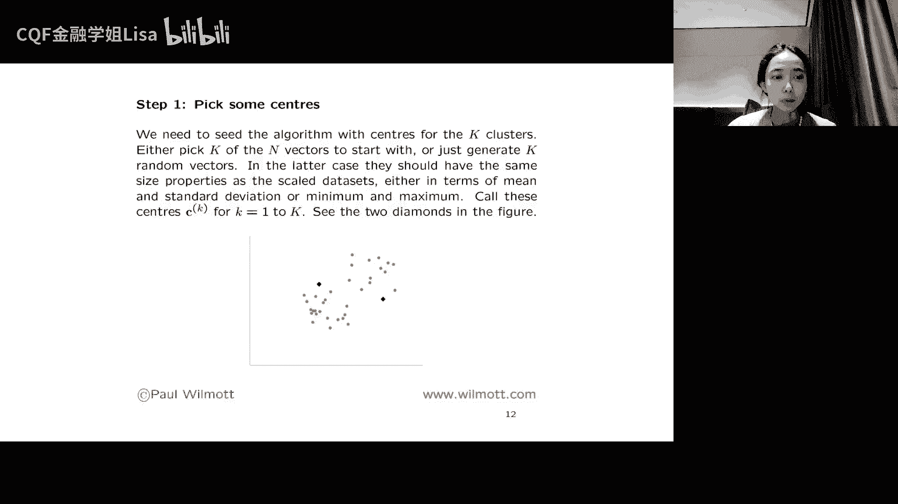

好那我们这边就接着我们上节课结束的地方，就是k means算法，我们来看一下它的这个算法到底是怎么样的，好，那这边呢他就说，首先啊我们比如说像xx其实就是它的一个feature。

一个feature one，一个特征特征一，然后Y呢是它的future to future to它的这个特征二，然后呢我们要做的呢，首先就是先猜这个聚类的数量，就是比如说呃两个聚类呀。

还是三个呀还是怎么样，然后呢你随便挑，比如说我们这里先猜K等于二，就是我们有两个聚类，然后呢你随便挑两个点去作为这个聚类中心，比如这里面随便挑两个点，就作为这个聚类中心，然后呢，呃算法记下。

它会计量每个这个点离这两个中心点的距离啊，比如说他先针对啊某一个，比如说我们针针对某一个这个数据点，然后他们就会先去计算，它离这两个中心点的一个距离，它离哪一个点更近，它哪个中心点更近。

它就会被归到哪一个聚类当中好，然后按照这个方法呢去把所有点，就是去计算他们离这两个质心的距离，然后呢去啊，反正就按照距离更近的这种方式，去给他去进行这样的一个初步的一个分类，初步的一个聚类啊。

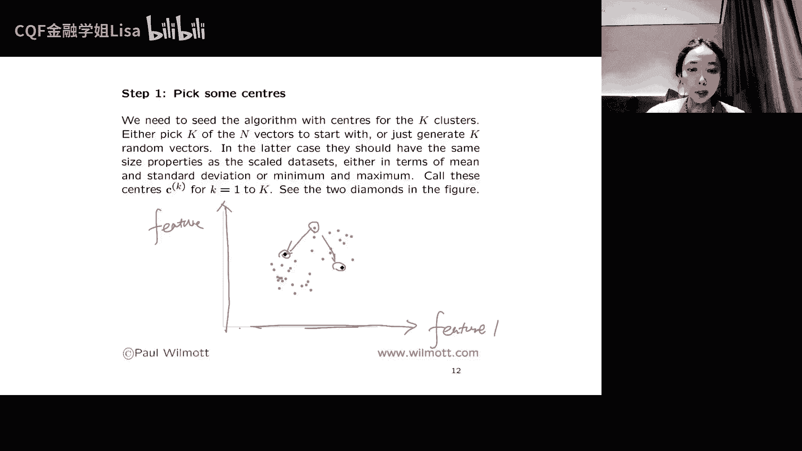

这个是初步的一个聚类，然后呢我们做了这个初步的分类之后，然后呢我们会针对其中的每一个聚类，我们会重新去找它的中心点，比如说呢，我们已经把这个就是按照刚刚的这两个字心。

我们把所有的数据点呢去分成了这两个聚类好，然后呢这两个句子做好之后呢，我们就会重新再去找这个聚类当中的啊，这个质心现在又是哪一个，还有重新去找它的中心点，然后呢找到这个中心点之后呢。

我们又去把每一个数据点去计算，离这两个中心点的一个距离，然后又去做这个聚类，然后就是再次把每个数据啊拿来去做判断分类，然后分类好之后呢，又得到了这个新的这两个聚类嘛，然后又去找他的新的这个中心点。

然后找到新的中心点，又继续去找，就是每个数据点离两个知心的距离，然后去做这样的距离，所以不断不断重复，一直到收敛好。

所以呢，这就是说这个就是它最终的一个收敛的结果，所以他这个收敛的速度还是很快的，就是我们会，然后我们会再回去试试，比如说三个聚类呀，找三个知心，然后呢把每个数据，比如说把它分成红蓝绿三个颜色啊。

然后同样的步骤去得到最后收敛的结果，所以啊就是我们就知道它的一个就是聚类的，一个算法倒是怎么样的哈，就是先随便的初始化两个知心，然后按照这两个知心，先把我们的数据点先去进行，比如两个聚类好。

然后呢聚类好之后呢，又去重新找知心，重新找了，执行之后又去把每个数据点啊，去根据这两个知心的一个距离，然后重新聚类，它就不断不断的重复，这样的话，那就把这两个聚类最终收敛的结果就得到了好。

然后呢我们现在其实要思考的问题就是，那我到底要选几个聚类比较好，到底是选两个聚类呢，还是三个聚类呢。

还是几个聚类呢，然后我们这里呢其实就有一个叫screen pts啊，叫做嗯就是我们也会把它叫做走图，然后呢，我们会去把所有离质心的这个，距离的平方去相加，就是我们会得到总距离或者是总误差的度量对。

就是所有的这些数据离质心的距离的平方相加，平方和，然后呢去得到总距离或者是总误差的，这样一个度量，然后这个误差呢就是聚类数量，K的一个递减函数，对它是一个聚类数量K的一个递减函数。

就是就是当这个K等于N的时候哈，就是N就是我们的这个数据点的数量，当我们的聚类数量就等于数据点的数量，数量其实就是每个数据点就有一个聚类嘛，那这个时候呢它的误差就会变到，就是这会就是零。

如果说你把这个误差去跟K去进行对比，就去比较，比如说就是横坐标是我们的啊这个聚类的数量，然后纵坐标呢就是我们的这个error，所以其实你是可以得到这样的一个screen pts啊。

这个叫这应该怎么翻译哈，Screen clods，然后呢，它其实就是我们可以看到这里它有两根线，有一条蓝色的线，有一条黄色的线，然后呢我们先看蓝色，你可以看到随着K就是聚类数量的增加。

我们的error呢是在逐渐下降的话，他这个有点不清楚，他大概是这样子，就是有大概是这样的一个形状，就是这个error它是逐渐下降，而且他刚开始呢是迅速下降，然后过了这个大概是三，剧烈是三。

然后过了三之后，他的error开始缓慢下降，然后呢，我们一般会把这个地方就把它叫做一个elbow，就是一个轴那个轴所在的位置嘛，然后呢，就意味着当这个聚类数量小于等于三的时候。

你增加聚类的数量是可以显著的降低error的，然后呢那等到你的这个聚类数量大于三的时候，我们的error下降就不再显著了，所以其实这样来看的话呢，最佳的聚类的数量就应该是三好，然后呢你可以再看橙色的啊。

橙色的话呢它就没有这么明显的一个轴了，它是这样子的，他没有一个ELBO，所以呢如果是如果你得到是橙色的，这样一个图的话，你就是没有办法去告诉你，选择多少个聚类是最佳的，所以如果有个ab的话呢。

是一个比较清晰，可以做决策的一个这种方式好。

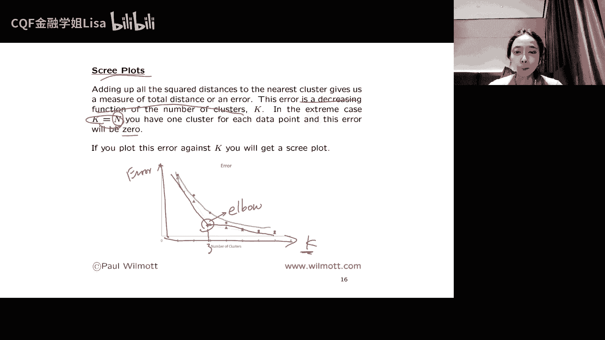

然后我们来看一下我们的一个，这里有一个example，这里是一个呃真实的一个例子哈，就是呃收集的是英国的犯罪数据，然后呢使用了342个城市的这个数据，然后就是每一个城市它都有13种。

大概有13种类型的犯罪，然后呢以及包括也收集了这个城市的人口，人口密度这些数据，然后就是使用人口数据来标准化，这些犯罪的数据，然后呢现在就是想要去利用这些犯罪的数据，去把英国这些城市去做分类。

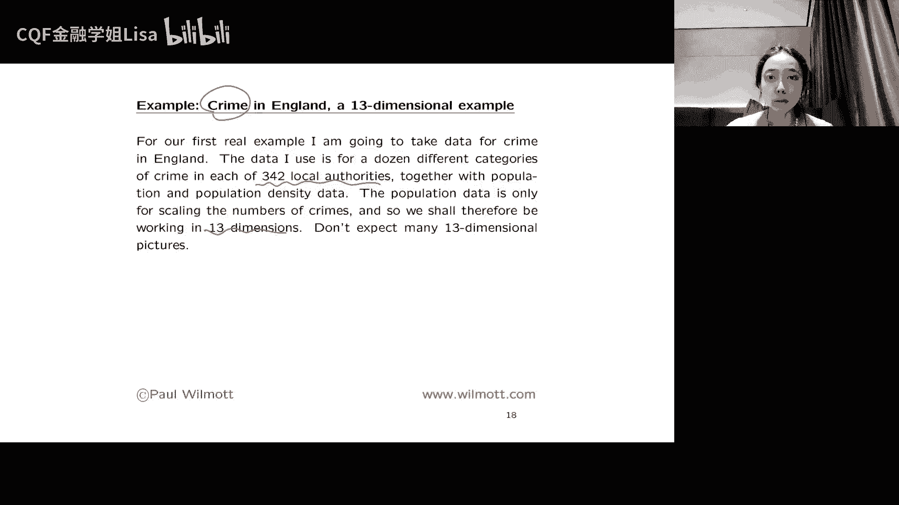

去做聚类，所以他大概的啊犯罪，就是有这些各种各样的不同类型的犯罪，什么啊，或者是什么抢劫啊。

或者什么啊各种哈，然后呢他这边收集到的数据就长成这个样子，就是呃比如说这边就是城市的名字啊，比如说这有什么啊，UBERVALLE也不是城市哈，就是反正就是这个单位嘛。

就是这种有ti什么也也算是一个地方单位，然后呢他这边我们可以看到，比如说像uber value这个这个地方，它的这个呃像burger这个burglary，就是这个叫入室盗窃注释，盗窃是有498宗的。

然后呢去把它呢去除，以这边是它的一个population去除，以它的这个人口数据，就可以得到一个人均的一个盗窃率，然后同样的话呢，它可以把每一个就是每个维度的数据都去除，以这个人口数据。

就反正就是都是人均的一个犯罪的情况嘛，好然后呢做完这些之后呢，其实就可以把人口这列就可以给它，就可以给它删掉了，然后这些feature呢就都变成了标准化之后的数据，对吧，都是人均的一个犯罪的情况。

所以呢最后还有一个就是，最后它就有12个特征，然后再加上一个人口密度也是一个特征，然后就利用这些特征去做聚类，去把这些地方去做聚类。

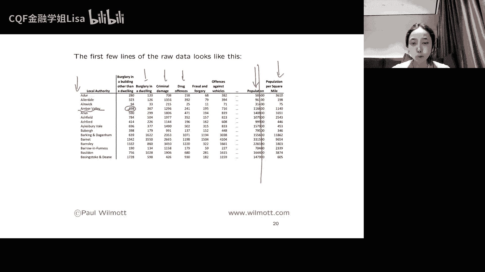

然后这个是它聚类的一个呃error的图，所以你可以看到也是当他的K为三的时候啊，他这里也是有一个elbow，所以的话呢就是当聚类小于小，聚类的数量小于等于三的时候，它的error下降是非常迅速的。

然后之后的话呢它的error下降就非常缓慢了，所以最佳的聚类数量就是三，也就是就把这么多的这些城市嘛，或者地方嘛，把他们聚类到三个cluster是比较好的。

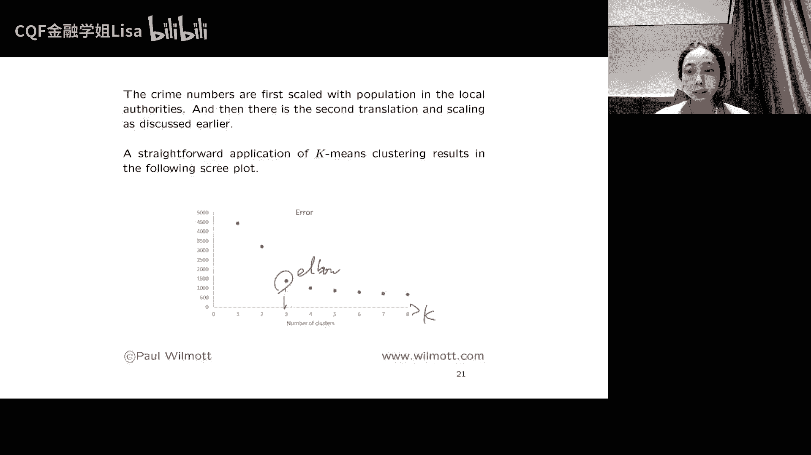

然后我们可以看到它这个数据，它就是聚集了三个cluster，然后呢你可以看到就是这三个cluster啊，第6caster只有一个地方，就只有一个城市嘛，然后第二个cluster to有68个。

然后cluster有273个，那我们可以来看一下具体数据，就是我们知道这些数据，都是处于人口做过标准化的，然后cluster一比如说这个burgary in building other than。

对你这个带它的这个意思，大概就是住宅以外的建筑物内的入室盗窃，那么这个犯罪的话呢，它cluster one它是cluster two和cluster的十倍。

然后还有包括这个啊这个backgry in a dreaming，这就是入室盗窃的话，它其实呃就是跟cluster true差不多，但是要比cluster要高好，然后还有像嗯包括像什么犯罪损失呀。

就是你可以自己去看看他每一项的一个情况哈，基本上就是像他的犯罪损失，基本都是要比这个啊，就是cluster two cluster要高一些，然后包括像他的这个drug，就是这个。

其实它的这个也是要高很多的，大概是他们classroom跟classy的三倍，然后欺诈欺诈的话呢也很高，然后欺诈的话class three几乎没有，然后最后的这个人口密度，人口密度的话呢。

就是嗯这个一的人口密度它其实没有二高，然后这边的话就公布公布一下，这个这个就是在cluster1这个唯一的一个城市，其实就是伦敦，就这个其实就是伦敦，然后二的话呢其实就是tom就是城市。

然后啊三就是这个乡村乡村village，所以你可以看到它的就基本上来看它的，就因为伦敦比较特别嘛，然后他的乡村其实基本上比他的城市哈，唱其实城镇要安全的安全很多，所以这是他通过这种K均值聚类。

把这些地方分成三个cluster，然后发现有这样的一些这些特点，那这个这个聚类就是由机器来帮他去做的好，然后我们再来看一个嗯。

就是金融的例子，就是我们看一下，就是用k means clustering去分析利率波动率，然后呢它这个例子呢有一点点的cheating，因为我们后面会说，我们说其实如果你要去处理时间序列数据的话。

其实你最好用的模型，比如说是什么secret model什么的，因为你要考虑考虑到这个时间序列，它的时间顺序的这个问题，然后呢嗯因为在这儿呢，我们它只是一个脱sample嘛，一个这种玩具的一个例子。

所以呢我们也不用那么认真哈，不用那么较真，然后这边的话呢就是在这个k means当中，我们要忽略时间，就是我们要把时间轴抛弃掉，然后我们来先来看一个一维的例子。

然后这个是啊30天的嗯，这个找ring spx，对30天的SPX波动率的数据，然后波动率建模很有趣，就是我们嗯我们在M3的时候，我们其实已经见过了这个波动率建模对吧，我们看过确定性波动率。

不确定的波动率，然后当中可以去做随机微分方程，然后我们见过一个模型，然后这个模型呢是由这个ITO碎碎，这个公司去做出来的，然后他们说这个波动率，它可以从一个水平跳到另外一个水平。

然后我们这里呢就用的是这个模型，然后假定这个利率有三个关键水平，就是分别是10%，25%，40%，这三个利率水平，并且呢我们假定K等于三，就是我们会把所有的波动率，去归到三个聚类里面。

所以呢就是有些日子，这个波动率是在10%的水平，然后你可以大概看到，就是这边它的一个它其实也是一个水平对，然后大概持续一段时间，然后呢又调到25%，然后后面又跳又跳到10%，就是如果按照这三个水平来画。

它的一个利率的情况的话，就是大概就是这个样子，给这三个水平，然后真实利率呢和这三个水平之间的差，其实就是抽样误，就是这个error哈，就是error，所以呢就是这个波动率转换成水平。

它其实就是可以化成这个样子，就是分成的这些cluster这三个水平。

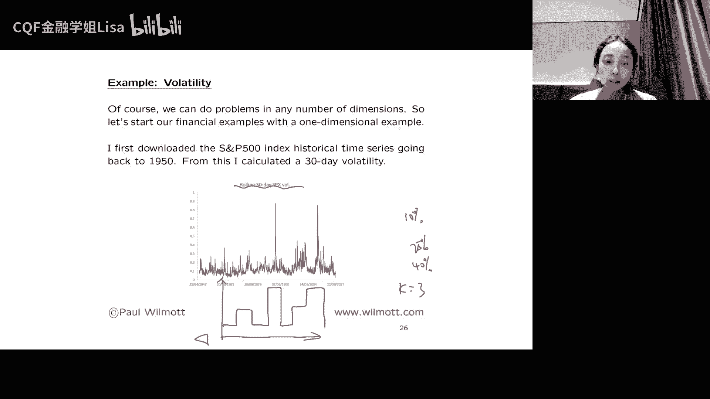

然后呃算法呢他找到了这三个cluster的知心。

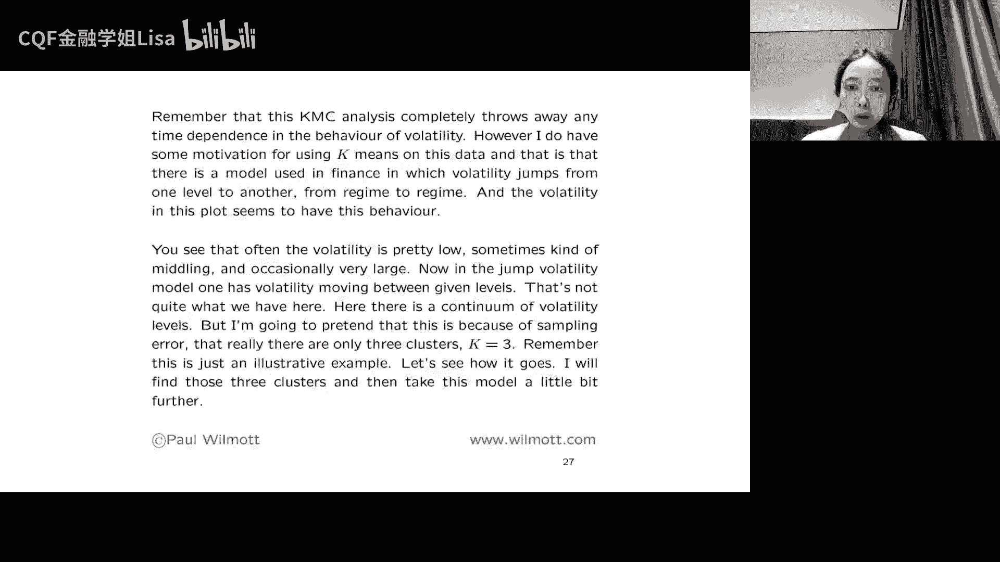

所以这边是class one，Class three，Class three，Two three，然后呢他们三个的这个就是质心，分别就是9。5%是cluster one的执行，然后18。

8%cluster to的执行，43%，44。3是plus three的一个执行，所以这些数字其实看起来都还是很合理的，因为我刚刚那三个水平嘛，也差不多是在这儿附近，然后呢。

他们每一个volatility就归属于其中的一个，Volativity cluster，然后呢我们还得到了一个概率，就是在一天之内。

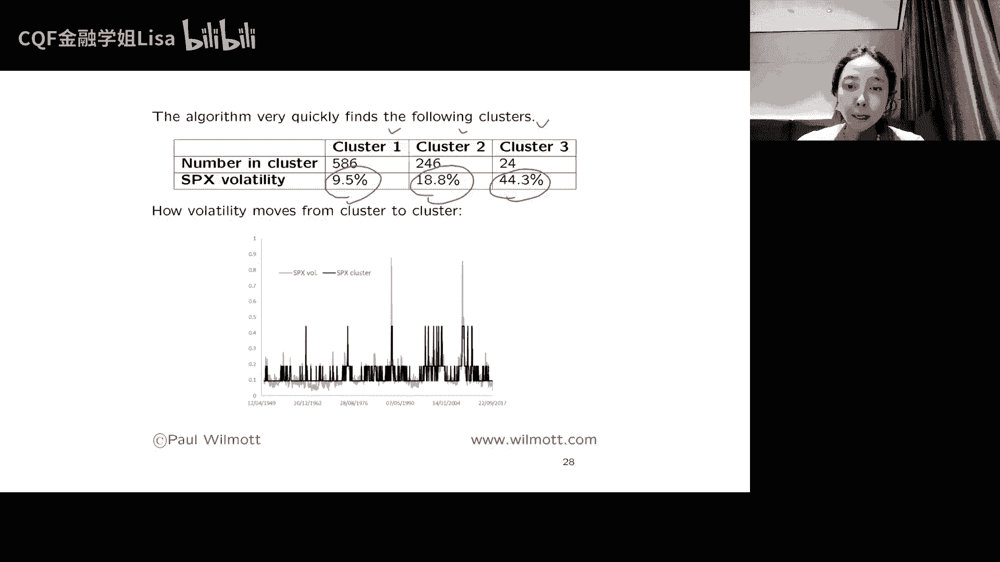

有一个cluster跳到另外一个cluster的一个概率，就得到了这样的一个就是概率矩阵啊，所以你可以看到从嗯cluster one就一天之内哈。

从cluster one到cluster one的概率就保持不变吗，84%，然后从class one，一天之内跳到class two的概率是16%哈，然后以此以此类推，有些不同的概率。

所以呢这个其实对波动率建模是非常有用的，那我们知道从低波动率到高波动率的概率对吧，这个是一个非常有用的一些信息，那么这个也是一个一个example，它是单纯的把volatility来做了聚类好。

然后还有一个example，这里的话呢它也是一个比较类似的example，它是针对的是利率和通胀这两个维度的数据，好，所以这边嗯，他用的数据就是英国的利率和通胀的数据，然后一直到1751年的这个数据。

然后得到这样一幅图。

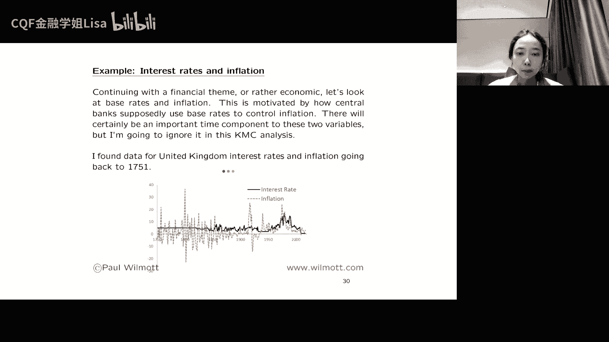

横坐标是interest，纵坐标是inflation，然后其中每个点嗯，应该就是一年的一年内的一个数据，然后把它们用虚线连在一起去表示不同年份，就是顺序的年份好。

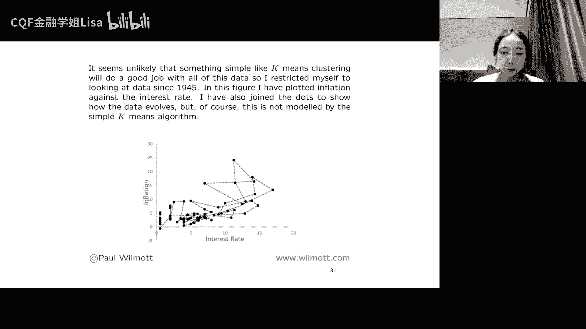

然后这边的话呢，他是他们是做出来了四个cluster，有同样的算法，然后分出来四个聚类，然后呢你可以看到最多的年份是发生在class tru，然后cluster to的话呢。

应该就是一个normal economy的一个情况好，然后他在这个情况之下，的利率水平是6。15%，然后通胀是3。94%，然后还有比如说有一个cluster，而不是就是25个在cluster one。

然后他们大概是在就是low by street，normal inflation的一个范围，然后interest rate水平和inflation水平好，这是把它们分到了四个cluster。

然后这张图的话呢是把这些数据按照均值为零。

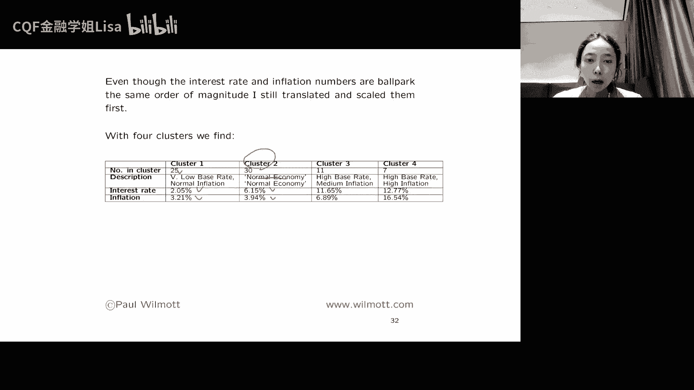

标准差为一去做了scale的，去做了这个缩放的，然后这里面的话呢嗯黑色的点就是数据数据点，然后红色点呢就是这个知心，所以这里有12344个cluster，然后也给到我们这四个cluster的质心。

分别在哪里，对横坐标是interest rate，字母标识inflation，所以你可以看到，比如说像第二个cluster normal economy，它的知心大概就在这个位置。

它interest rate要在要在零比零要小一点吧，然后inflation也是要比零小一点。

好，然后还有就是它的这个cluster，是如何随着时间去演变的，就有这样一幅图，然后呢你可以看到它的有些年份是class one，就是有些年份是在class one，然后有些年份呢在class two。

然后有些年份在cluster，有些年份在class cluster four，他是这样去看他的年份。

然后也同样也得到了这个cluster跳跃的概率啊，从class one到class two的概率是多少啊，然后也是有这样的一个结果，好这个也是一根一根呃，然后我们再来看下一个下一个example的话。

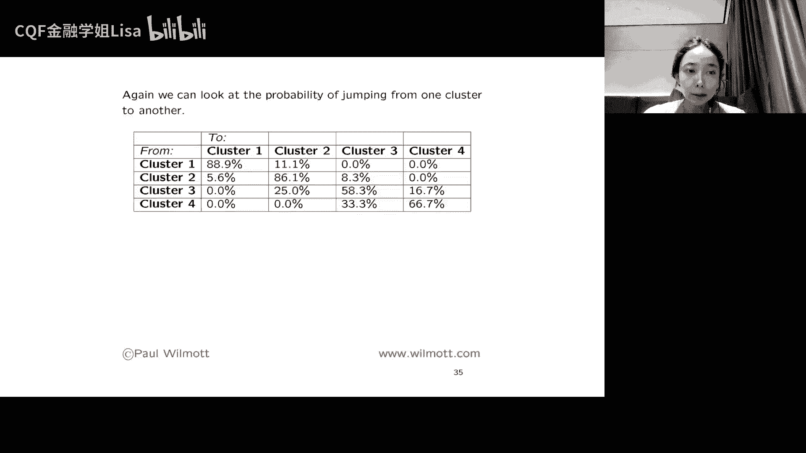

它是再加入一个维度，再加入一个GDP，就是同时考虑interest，RINFLATION和GDP这三个维度的数据。

然后他这个cluster做做出来之后，就是他应该这个图当中应该会多一个轴，应该在这里多一个轴，应该就是GDP，这个是利率，就是通胀，然后这个轴是GDP，所以跟前面那个图相比的话。

你会发现就是它这里还是有几个聚类啊，但是呢就是你会发现其实它的嗯，它主要的区别于前面是四个cluster，然后现在变成了1234566个，然后它主要的一个差别是发生在这里。

就是你如果跟前面的图进行比较的话。

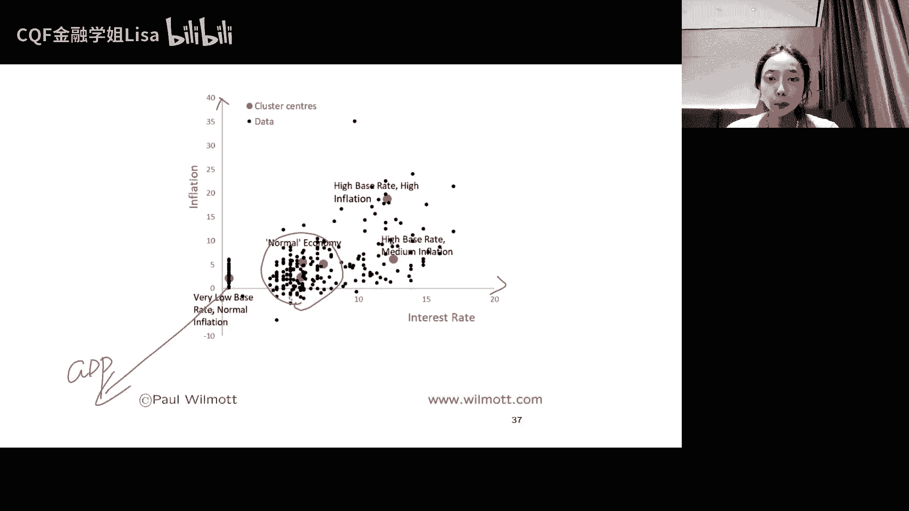

对，你会发现它主要的这个区别发生在。

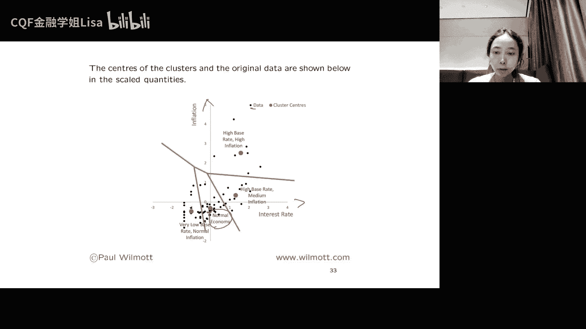

他把就是normal economy的原本是一个cluster，它分成了三个cluster，对，就是把这个normal economy，给它分割成了三个不同的cluster，但是其他的。

其实基本上都还是没有特别大的变化的。

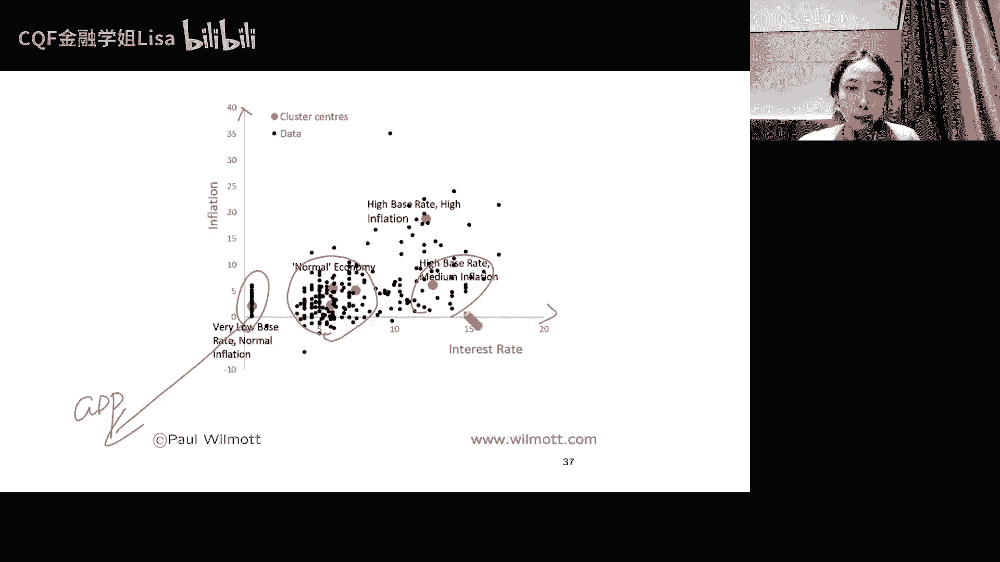

然后嗯这个应该是用到了更多的数据的，可能是用到了阅读数据对，所以你可以看到还是cluster to，它有107个数据点，然后他们的这个利率通胀水平，GDP的就是它的质心的位置是在这些好。

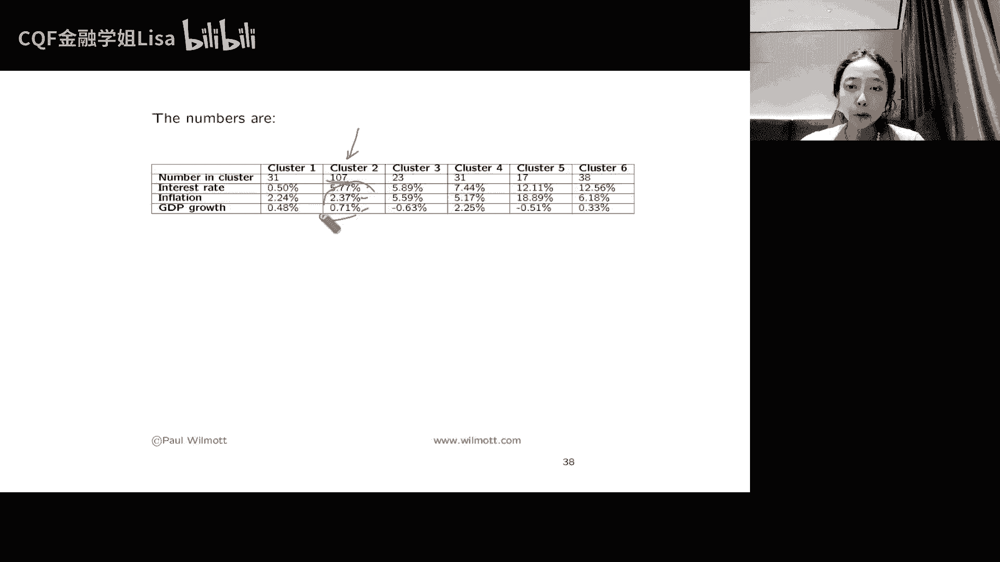

那么这些呢其实就是我们要给大家介绍的，k means k均值聚类啊，给大家介绍的，所以我们大概知道了，K均值聚类它是非监督学习对吧，他们我们的这个数据是没有Y的，只有X。

所以你是让机器它自己去探索数据规律啊，数据的特征，然后去做聚类，所以你也不知道这个机器它会做出来什么结果，所以会比较比较有趣哈，可能会给你一些惊喜，就比如说像给利率波动率聚类。

那么这个其实对于构建利率模型，对于构建波动率模型其实都是很有帮助的好，然后他是啊要去实施是很简单的，然后它的质心是通过迭代的方式吧，最后收敛得到好，这就是我们上节课没有讲完的K均值聚类。

然后接下来的话呢我们再进入到下一个算法，下一个算法。

在下一个PPT上叫做朴素贝叶斯好，那我们这个就是同样的，就是我们接下来这几种技术的话呢，都不会去详细的去看，就在今天都不会详细的去看，只是给大家稍微的去介绍一下他们背后的思想，然后细节的话呢。

都是在我们之后的每一个lecture当中，去给大家去介绍的，然后呢我们先来回顾一下这个朴素贝叶斯，就是呃首先回顾一下它的一个定贝贝叶斯定理，然后呢，再把这个贝斯定理呢给它运用到自然语言处理。

然后我们会看到一个example，就是去分析这个就是政策演讲嘛。

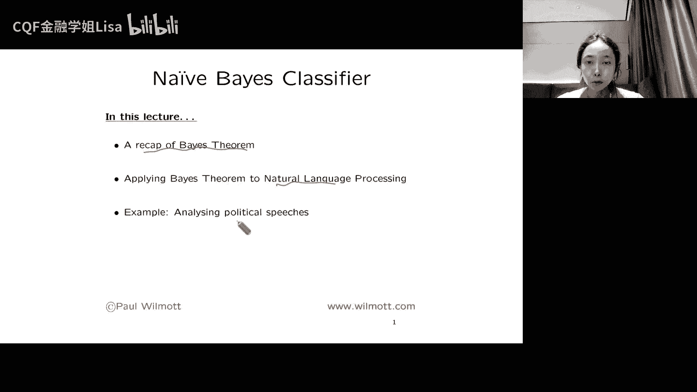

就政治演讲好它的一个introduction，就是说朴素贝叶斯分类器，它是一种监督学习技术，然后呢我们有代表不同类别的数据样本，然后呢使用嗯贝叶斯定理去计算，这个就是新数据。

它出现在每一类当中的这个概率，就比如说呃基于政治家的性别，他们演讲当中使用的词汇等等，然后我们可以去把它们分为左翼右翼啊，所以说监督学习就是在一开始的数据当中，我们就有input和output啊。

就是有feature，有label，然后呢我们会给这个算法一个新的，一个新的speech，一个新的演讲，然后让他再去通过这个新的演讲，去判断这个人是左翼还是右翼，所以呢我们的一开始的数据。

就是我们首先就有一些不同段落的，不同段落的演讲，然后每个演讲他到底是左翼还是右翼啊，我们数据都是会给到的，然后让这个机器它自己去总结，然后呢总结完建模完之后呢，我们就会再给他一个新的speech。

让他去判断他到底是左翼还是右翼好，然后呢这边的一个嗯朴素贝叶斯，朴素其实它指的就是各个维度相互独立，我们会看一看，然后朴素贝叶斯用于什么时候啊。

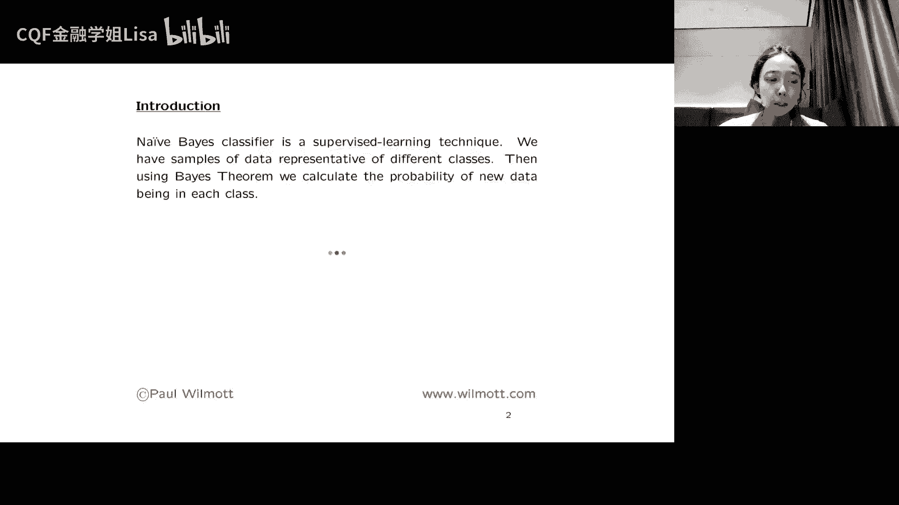

它的用处其实是非常多的，比如它可以用来去分类数据啊，尤其是对啊，比如说像文本数据啊去进行分类，然后去分析它的一个情绪哈，好然后还有就是它的一些example，比如说自然语言处理，就是让机器能够理解人类。

还有就是可以去分析一条新闻，到底是好的新闻还是坏的新闻，还有包括说啊，可以去啊预测这个twitter上他发的这个推文，会不会影响选举或者是公投的方向，还有就是确定啊。

这个推文他是不是来自russian boot啊，这些都是可以用朴素贝叶斯去判断的。

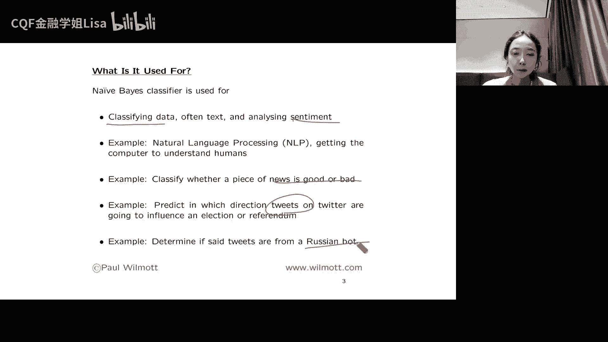

然后还有包括说你也可以通过书的评论，来预测书的销量啊，啊所以这个朴素贝叶斯分类，它通常呢就是可能用的比较多的一个例子，就是去看这个书评的这个例子来解释，就是通过分析书评的统计数据。

并且跟其他评论进行比较，就是这个算法他可以去学习啊，哪些词出现在好评当中，然后哪些词呢是在差评当中，所以首先的话呢就是我们需要，首先先需要大量的大量的好评，差评去给到这个机器。

然后呢我们会去统计一下这些类别当中出现的，某些单词发生的频率啊，所以的话每个单词出现在每个类别当中的，这个概率嘛是很重要的，然后呢如果说我们在就是之后呢，再给到机器一个新的评论。

那么就直接去使用这个贝叶斯定理，去把我们的这个新的评论，就是到底是好的还是坏的概率去给到我们，这是他的一个大概的一个思想。

然后呢这个方法它之所以叫做NIF啊，之所以叫做朴素，就是因为这些假设通常是非常不现实的对吧，拿衣服嘛，所以他这里的主要的假设就是independent，就是单词之间是彼此独立的。

但是通常来说事实并不是这样啊，但是呢就是就是这个可能在实践当中哈，可能也并不是那么重要哈，我们有我们稍后会提到一些可能的改进，所以这边就是朴素这个词到底是怎么来的，就是就是在于它的假设是不现实的。

而他的假设是什么，它的假设就是单词和单词之间是独立的好。

所以我们要知道朴素这个词来自于什么地方，然后呢我们稍微复习一下贝叶斯公式。

就是，我们的BS公式吗，如果你要写的话，就大概是这样去写。

对吧，这个是我们的BS公式，所以如果我们把这个贝叶斯公式呢，给它套到这边的一个政治演讲，就是说如果这个人他在演讲的时候，他用到comrade，就是同志这个词的话，那么这个人他是左翼的概率是多少。

那么这个概率呢其实就可以用BS公式套一套，就可以写成说啊，分子就是呃这个人是左翼的概率对吧，乘以这个人是左翼的情况之下，他用comrade同志这个词再去除以啊，大家用cover这个词的概率对吧。

就是套这个BS公式，好所以就是说对他说同志这句话，那么他是左翼的概率，就可以给它写成这个样子了，好所以呢如果说我们听到一个政治家，他使用同志这个词，那我们就可以通过去研究左翼政治家的演讲。

去了解政治家通常使用这个词的频率，是怎么样的，以及任何一个随机的政治家，他是左翼的概率对吧，然后来计算它成为左翼的可能性，所以就是说你要去计算这样的一个概率，那么你需要用到的就是这几个概率。

都是需要用到的，就是左翼的概率，然后呢左翼的情况之下，说统治的概率，以及说统治的概率啊，这几个概率是需要用到的好。

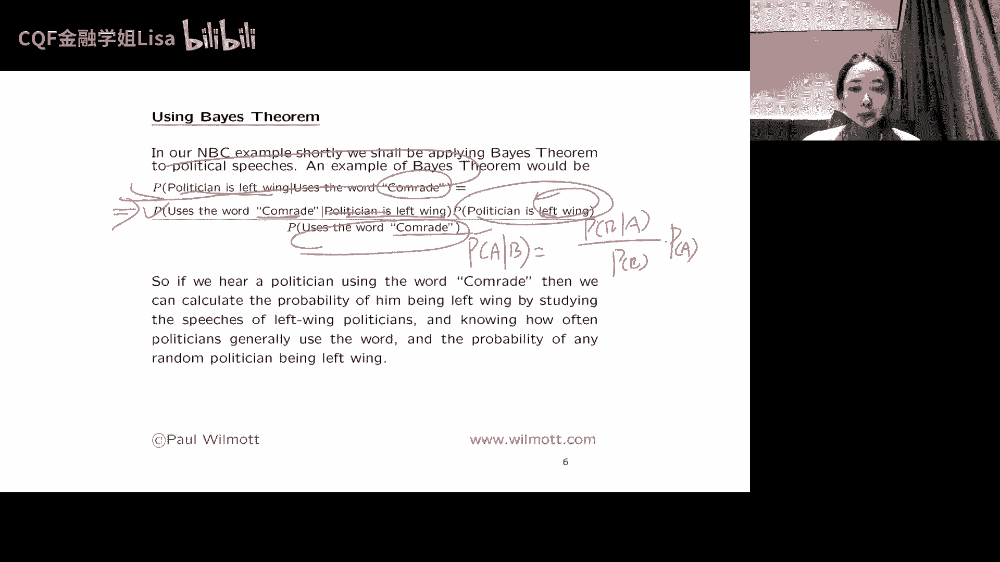

但是呢就是我们把这个朴素贝叶斯呢，其实不仅仅应用于一个单词，就是我们是把它应用于整个短语，然后最终去应用于整个演讲，而且呢我们也没有计算出这个一个政治家，他成为左翼的一个确切的概率，然后相反的话呢。

其实我们主要是比较一下，我们想要比较一下成为左翼和右翼的这个概率，然后呢一会儿我们详细介绍了，你就可以明白了，就是这里他也举了另外一个举另外一个例子，就是说假设我们听到一个政客说，这个啊财产是盗窃吧。

property theft comrade对吧，如果你听到一个政客说财产是这个盗窃同志，那么你并并且想知道他是左翼还是右翼，但是就是我们说，因为词语它通常都是在一句话里面，当他说这句话的时候。

他是左翼的概率，也就是说他这句话里面，其实是包含了好几个单词的，所以我们就需要去把这个单词呢，融在一起去考虑，就是现在我们想要去知道，当他说这句话的时候，他是左翼的概率是多少。

所以呢就是他现在不并没有仅仅说一个单词，他说了12344个单词，所以我们需要我们需要去知道，他说说这句话的情况下，他是左翼的概率好。

所以这边嗯就是我们刚刚说嘛，这个朴素贝叶斯的假设，就是单词和单词之间相互独立嘛对吧，所以他这里呢就是它是要去假设，这四个单词之间相互独立的，然后呢这里的就是两个分类，要么左翼，要么右翼。

然后呢就是其实你去计算它是右翼的概率，其实也是这样的对吧，也是很类似的一个式子，但是其实我们并不需要计算出来左翼，右翼具体的概率，我们只是想要去比较一下，左翼的概率跟右翼的概率哪个更高，就可以了对吧。

只要我们知道哪个概率更高，我们就知道，我们就大概知道这个政治家的一个摇摆的方向，是哪个方向，所以其实我们并不需要，就是其实我们并不需要计算这个分母，因为其实你是左翼也好，你是右翼也好。

你的分母都是一样的，就是你的分母都是这句话的概率对吧，就是左翼右翼它的分母是一样的，就是这个分母它并不取决于这个人，左翼还是右翼，就不管他是左翼还是右翼，分母都是一样的。

所以呢我们其实需要做的就是去计算，这个它是左翼的概率的分子，以及右翼的这个概率的分子就可以了，然后去比较他们俩就是分子哪个更大就可以了，对吧，我们其实不用去管它的这个分母，因为反正分母都一样好。

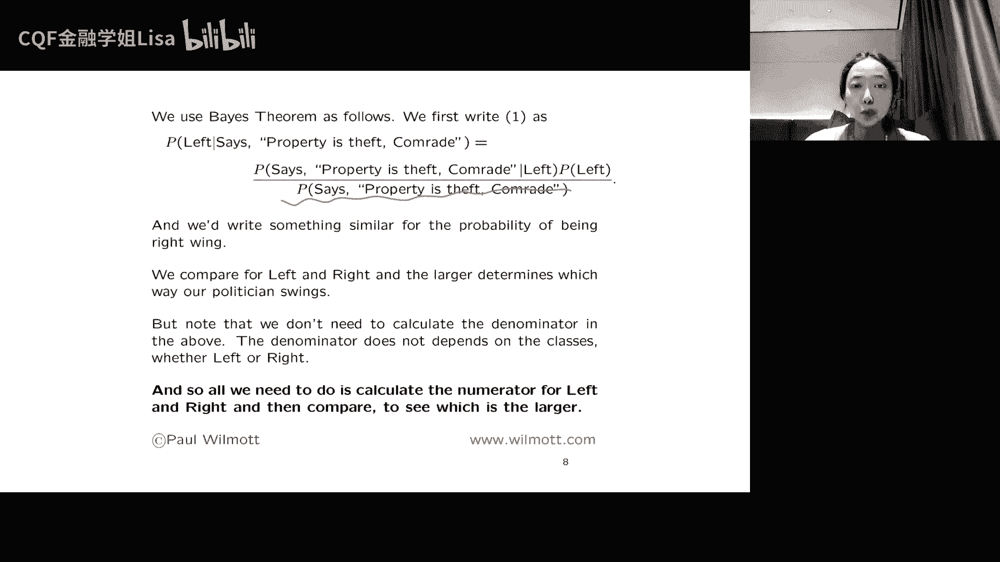

所以我们其实需要去比较的就是分子对，就是他是左翼的话，就是左翼的概率乘以它左翼的情况之下，说这句话，然后右翼的话呢就是他又一个概率乘上，它是又一个情况之下，他说这句话的概率，所以我们就是想要去比较。

这两个分子到底谁更大，那么这个政客他就应该是偏向哪一个方向了。

好，然后接下来我们就要用到这个，naif的这个定义了，就是单词是独立的，所以呢它的一个公式，就是它这个就是比如说这个left，就是left的情况之下，他说这句话的概率就应该是他left的情况之下。

他说property这个词的概率乘以left的情况之下，他说意思的概率乘以left，情况之下，说CEPT概率乘以left的情况之下，说comrade的概率，就是因为每个单词都是相互独立的。

然后呢呃从哪里来得到这些数据呢，就是你每一个单词的概率，从哪去得到这些数据呢，就是我们可以从大量的左翼，右翼政治家的演讲当中去收集，然后去看一看A就是左翼的政客，他们说property的概率有多少对吧。

说east的概率有多少，说shift说comrade的概率有多少，所以呢就这些概率其实我们都是可以得到的，我们都可以去收集大量的就是历史的数据，然后去得到，然后其实另外呢我们也可以把意思给它删掉。

因为像意思这种词很多嘛，意思呀，the呀，and呀A啊对吧，像这些that什么的这些词，他们其实跟我们的，我们研究的问题没有任何关系，这其实就是我们所谓的stop wor，所以其实是你是可以去把这些。

没有任何意义的词给它删掉的好，所以这边非常重要的就是所有的单词是独立的。

这个假设非常的关键，所以我刚刚说的把这个意思给它删掉，因为它stop wor，好然后这个就是我们刚刚的这个例子当中，我们看的这个东西，你怎么样去通过朴素贝叶斯的这个定理去啊，做预测哈。

他到底是左翼还是右翼。

然后呢我们就来去看看它的一个符号化啊，朴素贝叶斯的符号化，就是把这些概率表达成符号，所以的话呢这个X就是一个条件文本，也就是比如说他说这句话的情况之下，他是左翼还是右翼的概率嘛对吧。

就这个是我们最终想要去得到的，所以这个X就是个条件文本，然后把这句话写成一个向量X，它里面里面的每一个单词，都是这个向量的一个特征，然后呢这个CK就是类别，就是它到底是左翼还是右翼好。

所以就是左翼还是右翼，到底哪个概率更高对吧，就会给到我们一个方向。

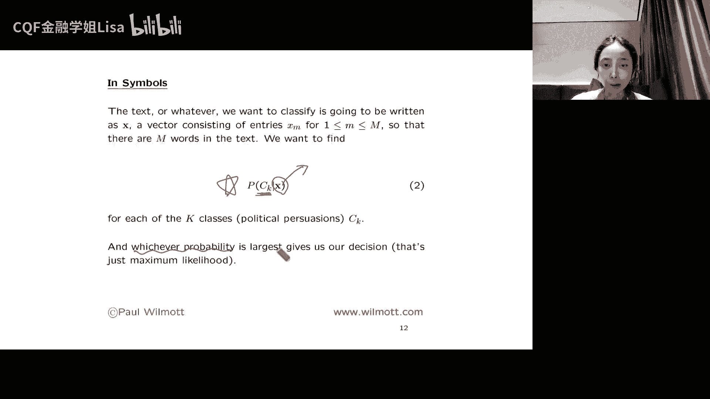

然后呢我们就可以利用贝叶斯定理，去把刚刚的那个概率就是P啊，这个CK杠X哈去给他写成这个样子，然后呢分母可以删掉，因为分母左翼还是右翼都一样，你不用看分母，所以我们就直接比较分子即可，然后分子的话呢。

又因为就是你这个X本身是个向量，它里面有很多单词嘛，所以其实你就可以把这个就是因为单词和单词，单词之间又是独立的，所以你就可以把他们的这个条件那是相乘，就可以写成这个样子，因为特征相互独立。

我们就可以把分子写成这样一个连乘的形式，这个XM就是我们这个X向量当中哈，这句话当中的每个要素，每个单词，所以这些概率呢，其实这些概率都是可以，从我们的历史数据当中去得到的，然后因为因为概率和概率相乘。

结果会比较小，所以呢我们最好还是取个log。

取个logo的话就会变成这样子，输load话呢连连成就会变成连加，就变成这个样子好。

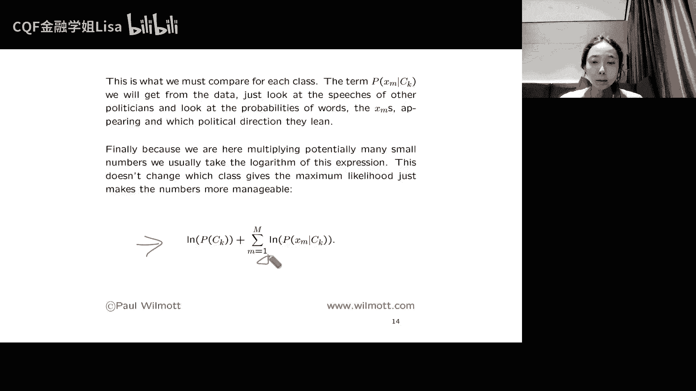

所以这是它的一个符号的写法，然后我们来就是具体的来看看他的这个example，这边呢选取了一些著名的政治家的演讲，或者是一些著作，然后呢我们就会去使用，就是我们去使用这个训练集。

就这些这里他其实就是他他的训练集不是很多，大概就只选了几个政治家的个别的片段，然后呢，使用这个训练集去对这个模型进行拟合了之后，然后我们会去再选一个新的speech，让这个机器让这个算法他去做一个分类。

然后呢这个训练集里面呢有就是八个speeches，然后呢嗯我们可以看到哈，就是它有八个啊，Speeches，然后这边有一个例子，比如说简单读一下吧，就大概翻译过来，然后就欧洲的所有大国。

都结成了一个神圣的啊联盟来驱除这个幽灵啊，包括什么教皇啊，包括这个沙皇啊，包括德国的什么警察间谍呀啊，都结成了这样一个神圣的联盟，还是讽刺嘛，神圣的联盟来驱除这个啊，然后这个其实就是马克思。

这个是一个段落。

然后另外的几个段落，就是各个政治家的一些段落，比如说像这个是children，他曾经的一个一个一个演讲，然后是这个是肯尼迪的就职演说，然后还有像BEN，然后还有像撒切尔夫人的呃。

还有像这个对这个叙亚罢工的妹子，然后还有像什么扩冰货币脱欧之后的公投演讲，然后还有trump对吧，这个美国的国情咨文，就是有些speech它是比较长的，然后呢我们要把这些就是就是已经哈。

就是我们教授哈已经把他们去分了，左翼和右翼了，好然后呢这里面呢有一些单词。

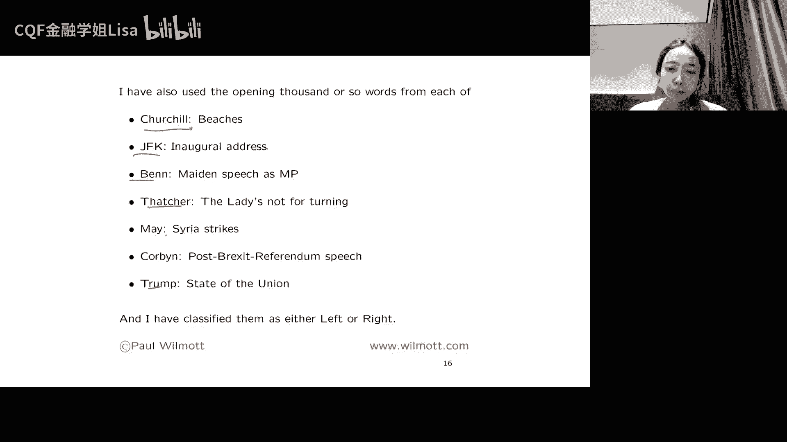

就是这些speech当中出现了一些单词，这些单词出现的概率以及把这个概率取对数啊，这边都是这个整理起来了，所以你可以大概看看，像比如说像abolish，abolish这种词，因为它是废除嘛。

像abolish这种词呢，它其实就是这几个都是OLISH，它其实就是左翼的非常典型的词语对吧。

然后还有像嗯像右翼的话呢，是比较喜欢说advantage的啊，这些词语都是很有特点的，然后这边做了一些操作。

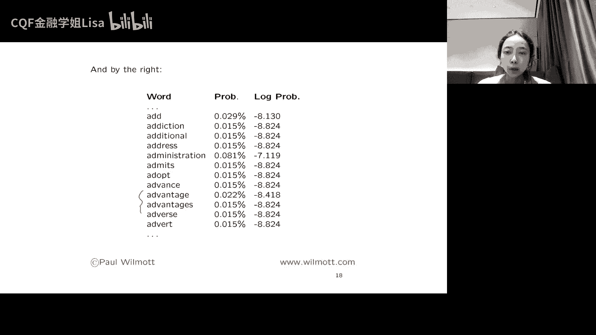

比如说首先呢是把这些stop全部删掉，把什么A啊，the啊，off呀，这些全部删掉好，然后呢还有就是有一些如果说这个新的speech，它有些词是没有出现在我们的训练集里面的。

然后为了避免取log之后变成呃这个负无穷，所以呢就默认给他们取零，就默认给他们对数概率取零。

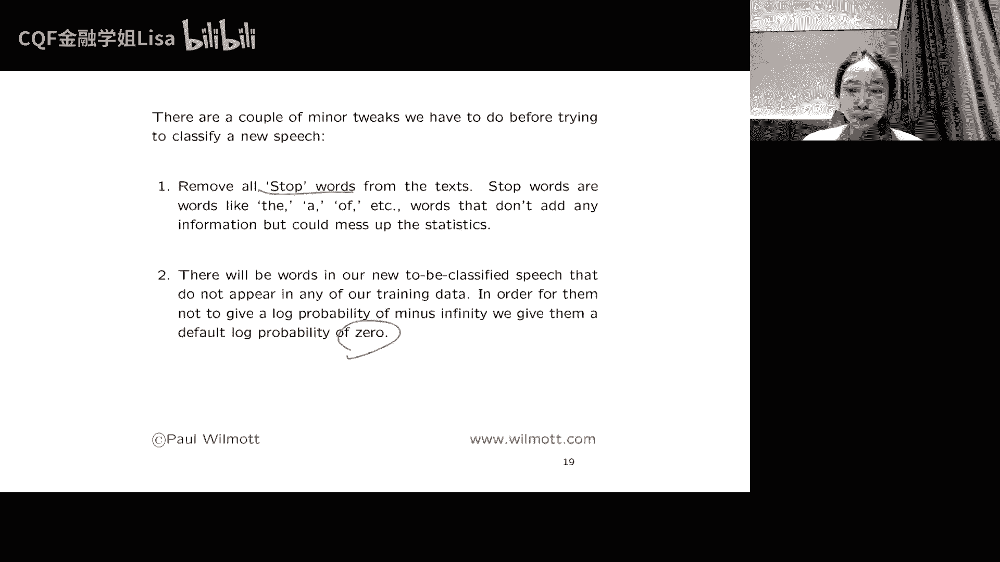

好然后接下来呢就来了一个新的speech，一个新的相当于新的数据点嘛，然后呢这个speech呢有大概有100多个字，然后呢其实也是一个很著名的speech，他已经把那些该删的东西都删掉了对吧。

你stop words全部都删掉了，然后嗯这里的话呢就是为了好玩儿，呃其实是对这个演讲进行了一个实时分析的，就像你可能会听一个公司CEO的报告，然后呢你在啊在下就是在下，比如股票买卖订单之前。

你要试着从他的演讲当中去读出来，他的消息是好的还是坏的，就是你需要实时的去做分析，大家每说多出一个单词，都会去更新你的一个分析的结论，就随着每多出来一个单词就会包括这里。

也是每多出现一个单词就会去就是更新一下，你判断这个政治家是左翼还是右翼的这个情况，所以这边呢他是把所有的那些啊，就是那些东西要删都删了，所以你可能看不出来他到底是哪一篇的speech。

但其实是个非常著名的speech，然后这是一个分析的结果，就是这个是他是右翼的概率，就纵坐标就是它是右翼的概率，所以你可以看到它刚开始，就比如单词比较少的时候，他刚开始使的概率是50%哈。

然后呢随着第一个单词的出现，它的右翼的概率开始上升好，然后呢后来又慢慢下降好，然后呢，差不多，大概是在差不多出现了15个单词的时候，它的15个重要词语出现的时候，它的右翼的概率就已经很高了。

所以他基本上就已经定调了哈，就是一个右翼的一个这个政治家嘛。

那他到底是一个这个演讲，到底是一个左翼还是右翼的呢，就是啊，其实这个人他其实也并不是因为右翼而出名的，他并不是一个真正的政治家，就是其实这个片段你可能看不太出来。

但是这个片段就是就是马丁路德金的。

I have a dream，就是他的对他的完整的speech，就是那那一段演讲，然后嗯就是也许哈也许他是他是右翼，就是也许真的如这个机器分析还真是右翼，但也许这个分析就是胡说八说胡说八道。

因为数据太少了嘛对吧，或者是说呢，就是可能这个机器发现了一些，我们没有看到的东西，就可能这个机器可能从他的修辞能力啊，啊从这些方面啊看出来。

他可能跟roger such such a frame比较像啊，所以这边的话呢，因为嗯确实因为这边的数据太少了，然后这边教授他其实用这个就是这个example，其实只是给大家展示一下到底在做什么哈。

但确实因为数据太少，所以呢也没这个结论，也完全不可信。

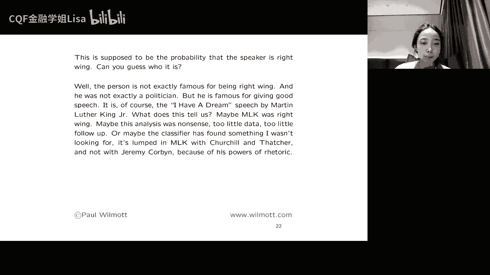

好这个就是呃朴素贝叶斯他在做的事情，所以在这儿呢我们说朴素贝叶斯呢，其实是非常好用来去做文本分析的，然后当然你在做它的具体的文本分析，之前的有一些预处理是非常必要的，比如我们刚刚看过的。

比如你要去嗯删除一些stop word呀对吧，包括我们在前面讲到之前讲到这，你要去提取自干呐对吧，这些都是一些非常重要的预处理，然后还有就是你需要大量的数据。

你不能像这里指用八个speech去作为训练数据，然后就来去这个预测，新的去给新的一个speech做做分类了，这个肯定是不行的，所以包括说我们在啊投资这一块的时候呢。

其实你也可以用这个朴素贝叶斯去对财务报表，去分析他的情绪哈，这些都是都是一些比较好用的一些就是情况吧，好这个是要给大家介绍的朴素贝叶斯，然后我们再来看下一个好。

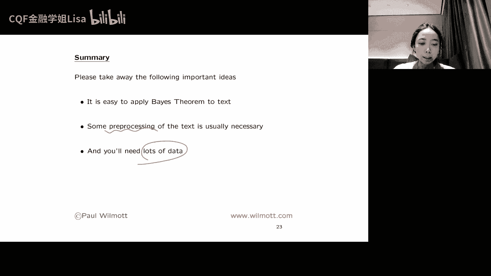

下一个是我们的第六个lecture，而不第六第六个slides，然后这个技术呢是回归啊，回归其实我们还是很熟悉的啊，只不过呢我们在这儿呢，不仅要给大家介绍线性回归，我们也会给大家介绍逻辑回归。

就是一个是用来做回归的，但一个虽然叫回归，但它是用来去做分类的，然后我们会嗯看一下他们的一个，合适的成本函数，然后还有就是利用梯度下降，去找到他们的一个参数。

好先来去做一个介绍，这是回归方法，它是非常典型的监督式学习技术，因为你既有X又有Y嘛，嗯就是他们试图用自变量去解释因变量，就是自变量是数值的对吧，你肯定你要回归嘛，你的肯定都是数值数值数值数据。

然后我们可以去拟合，比如说线性的呀，比如线性的线性回归呀，或者是多项式回归呀，或者是其他函数的回归来去预测因变量，然后呢当这个因变量就是我们的因变量哈，通常如果说你是在做分类的时候。

就是你如果做回归的话，你的因变量应该也是数值吗，但如果说你是在做分类的时候，那么你的因变量就要么就是零，要么就是一去做分类，零是一类，一是一类，那就你既可以做回归，也可以做分类。

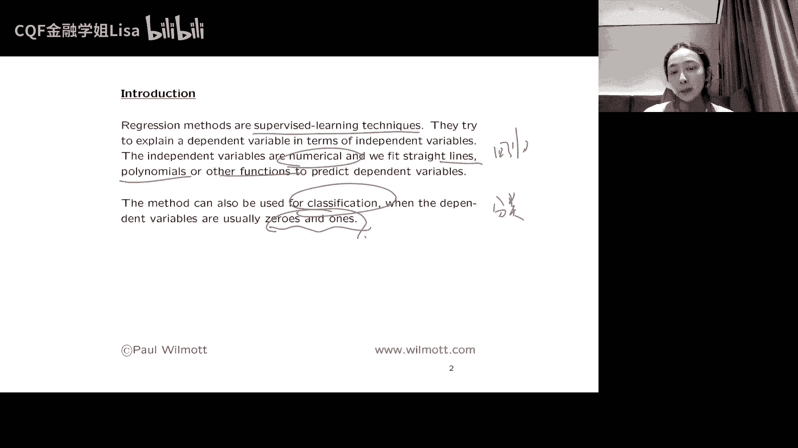

然后我们来看一下它的一个用处，就是我们其实就是基于数据去寻找，因变量和自变量之间的数值关系，所以啊根据一组数值特征取的数据进行啊，分类也是可以的啊，就是我们的分类数据也是可以的，对这边的example。

比如说你可以找到这个植物上番茄的数量，然后呢你可以看看植物上番茄的数量，它跟环境的温度跟浇了多少水之间的一个关系，就浇水量之间的关系好，还有包括说呃，你可以根据一个人生活方式的选择。

比如说他每天的饮酒量啊，他每天的吸烟量啊，去确定这个人得癌症的可能性啊，这些都是都是可以用回归去做的。

那我们就先来看一下这个线性回归，这边的话就是说我们其实呃有看简单线性回归，就是一维的嘛，跟多元线性回归，多元的多维的，那其实多元线性回归，它并不比一元线性回归困难多少，就只不过就是X的数量多一点对吧。

然后呢就是我们有M个独立的解释变量，独立解释变量，然后呢也可以叫特征嘛，就是X1到XM，然后他们就是我们把所有的X其实就写成向量，就是我们整个X就是X1到XM的向量，然后呢对于呃N个数据点。

他们当中的每一个数据点，我们就会有这个因变量和，就自变量和因变量的一个一对嘛，对每一个数据都是XY的成对数据，对包括说嗯就是如果说你的Y是财产价值，那你的X可能就是房屋的平方英尺便捷。

以及你的比如说车库的数量啊，那么这个都是一对一对的，就是有X1X2，然后这个就是Y，所以这是一相当于是一个数据点，好，所以就是XXN它是第N个数据点的特征向量，然后YN就是第N个数据点的因变量值好。

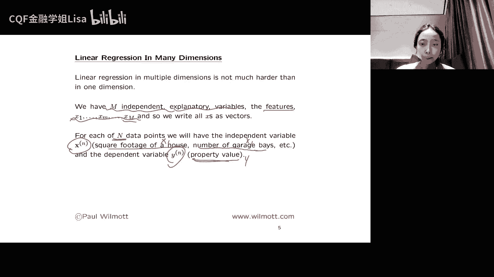

然后我们以向量的方式去写这条拟合曲线，就是写成这个样子，就是这个H就是这条曲线的函数符号，就是这个这个曲线函数的符号啊，它可以是线性的，它也可以是非线性的，然后你把这个theta t给它打开的话。

其实你把它写开，就是我们非常熟悉的样子，就是HCTX就等于theta0加上theta1X一，加上theta2X二，然后一直加加加加加到CANX嗯，大概就是这样子，就是我们非常熟悉的。

所以我们需要有有一个常数，比如这个theta里是我们的constant，所以呢这样的话呢，我们的X向量当中，我们X向量当中其实应该就有M加一个维度，就是M，就是你有M个X。

你有M跟theta同样也还有一个theta里，所以呢我们的X向量应该是有M加一个维度的，好然后如果说是线性的，那么成本函数就是残差平方和，就是我们的最小二乘法的这个残差平衡和，有通过找到。

使得这个成本函数最小的这个参数对吧，theta参数，然后来获得我们的最佳的theta的估计。

所以呢我们就把这个成本函数去对每一个theta，去进行微分对吧，然后让这个微分结果为零，然后去求解这个C它就可以了，所以这个是非常容易的，但是呢就是嗯虽然说在技术上仍然存在，向量theta的解析表达式。

但是呢因为它涉及到矩阵求逆，所以呢其实在我们实践当中的话呢，最好还是要用数值方法，就是你用解析解的话还是很麻烦的，所以最好是数值方法，然后这个数值方法呢就是我们比较常用的，就是梯度下降。

通过梯度下降这个数值方法，去找到我们的最佳参数。

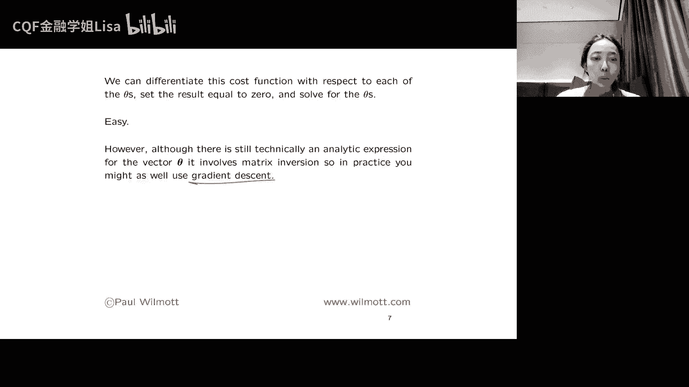

西塔好，所以我们可以看一下它是怎么样用数值方法，梯度下降去找到我们的这个theta的，那么这边的话呢就是它的一个有微分嘛，把我们的成本函数对随它去微分对，要使用梯度下降的话。

你就需要去看随着theta发生变化，我们的成本函数的值它是怎么去发发生变化的，就这个怎么算，其实很简单，其实就是成本函数正在针对theta去求导。

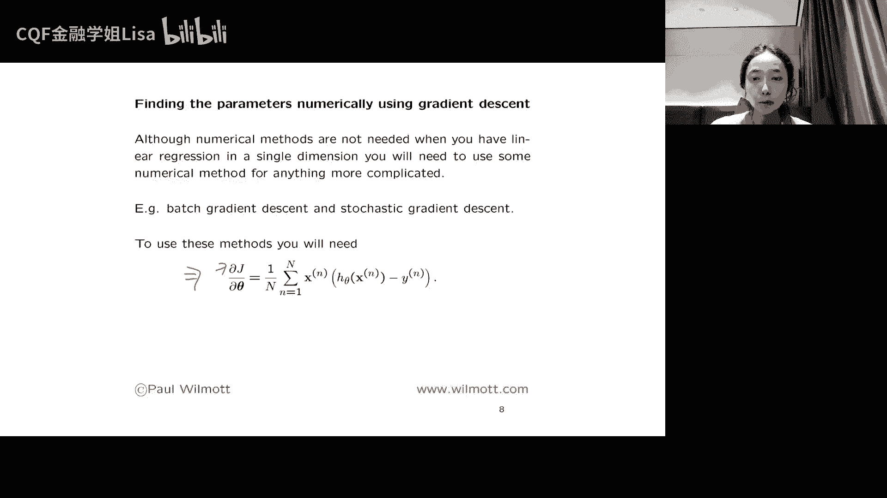

就是这个，然后这个是我们上节课见到过的，就是如果你要去找这个new sa，它就等于o theta，比如你初始一个猜测，然后去减贝塔DJ对对DSA的一个微分对，就把这个OC塔，把这个你一开始的这个猜测。

跟DJ对DC塔合在一块，得到新的theta，然后呢不断的去迭代，所以你也可以写成这一行，就是你其实就是把它的成本函数给它写开，把这个J给他写开，就是这个样子，所以我们之前说过。

你可以用所有的数据点来做这个事情，那这个时候它就叫做批量梯度下降，如果说你的N有几百万个数据的话，你也需要用几百万个数据同时去做这个披露，批量梯度下降，但是实操当中呢。

我们其实还是更倾向于用随机梯度下降，就是你先随机抽，比如说十个数据点，然后呢用这十个数据点，你去得到这个new sa，然后呢再随机抽十个数据点，然后又去得到一个新的推塔，然后一直一直不断的重复。

一直到收敛为止好。

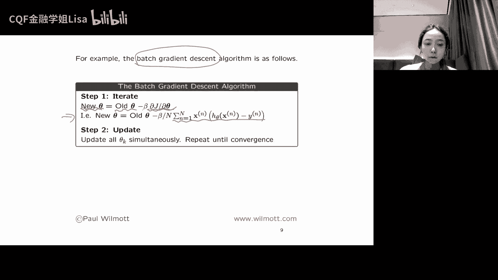

所以这个线性回归呢是一种非常常见的技术，所以呢我们就不看他的事例了，因为我们已经非常熟悉了，我们主要是看一下它用于分类的回归。

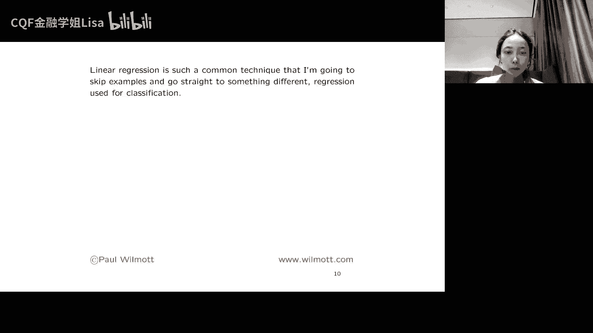

也就是逻辑回归，那么逻辑回归的话呢，就是比如说，比如说我们想要去把这个电子邮件去分为，就是垃圾邮件还是非垃圾邮件去做这样分类，然后呢它的自变量X呢就可能就是各种特征嘛，就是我们上去可以看到过。

比如说你的啊电子邮件当中的拼写数量啊，然后你的Y呢就是要么是零，如果是零的话，那就是不是垃圾邮件，那如果是一的话，就是垃圾键对吧，所以呢X有很多有很多个维度拼写错误数，或者感叹感叹号的数量。

或者什么什么什么好，所以呢在这种情况之下呢，我们说线性回归是不能够很好的拟合的，就这个我们其实上节课也讲过，就是你就是这几个点零和一，那么你用线性回归的话呢，你是有可能得到负的或者大于一的这个Y的。

所以就并不是并不适用线性回归，线性回归不能很好的去拟合，所以呢就是我们说这个时候，其实我们就更倾向于用一个函数，叫做SIGMOID的函数，S型的这个函数来做拟合吗，对吧。

所以这个为什么不能用线性的，我们上节课已经讲过了。

然后这个就是S型函数的表达式，对这个是S型函数的表达式，所以我们就是想找到用这个去找到它的，这个theta的最佳的取值，然后我们把这个函数拟合到数据当中，然后给定一个新的数据点啊。

我们就会根据这个h theta的阈值，去判断它到底是垃圾邮件还是非垃圾邮件，所以可能我们因为有的时候。

我们的阈值可能是0。5，因为你整个的就是零，要么是零，要么是1900~1之间嘛，你的这个啊西格蒙语的函数，就是0~1之间的一个值，所以呢我们一般会定一个阈值，比如说是0。5，只要你的这个呃。

SIGMOID的函数值是大于0。5的，我们可能会把它认为是垃圾邮件，如果小于0。5的话，那就是非垃圾邮件，对我们是通过这样的一个方式去这个呃，这个去去分类的，但如果说因为这个0。5。

它并不并不是说我们只能取这样一个阈值，就这个阈值我们是可以自己调整的，就如果说你担心一分就是一封正常的电子邮件，它被放到我们的垃圾邮件箱里面的话呢，你就可以把它的阈值再拉高1。8到0。8，那这样的话呢。

其实放到拉九键的概率就会小一些嘛。

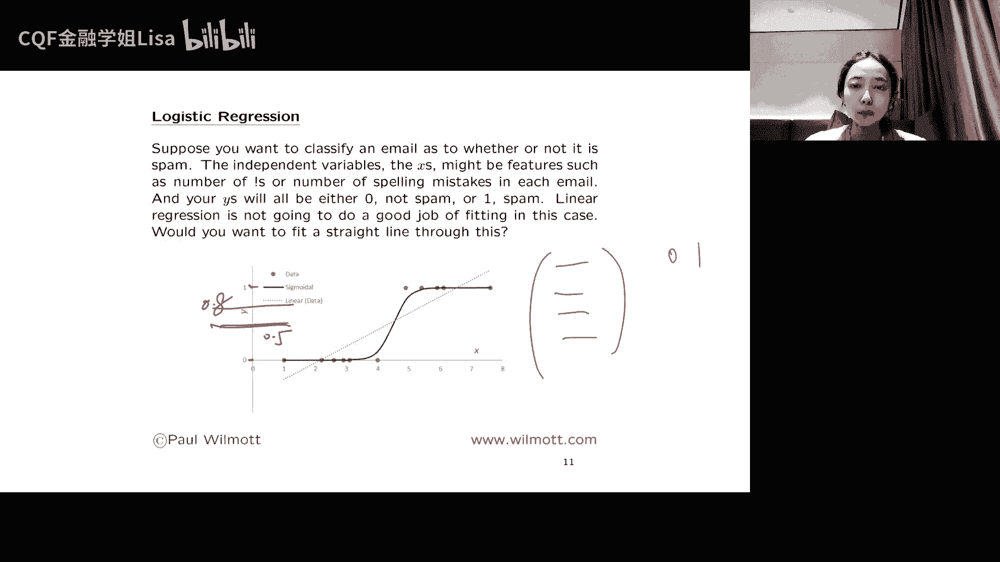

对这个是它怎么样去分类，垃圾跟非垃圾邮件的方式。

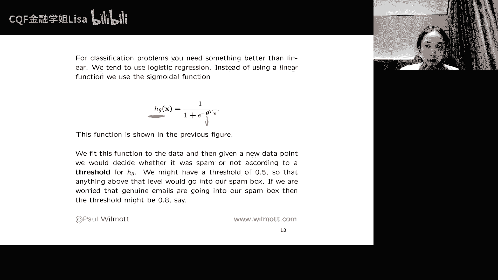

然后还有这个成本函数，就是当我们想要进行逻辑回归，而不是线性回归的时候，它的一个非常重要的区别，就在于这个成本函数的选择，所以啊成本函数它有一些明显的特征，就是首先它应该是正的，对他一般都是正的。

就是除非说你真的有得到了一个完美的拟合，它应该是零，但大部分的时候你是无法去得到完美拟合的，它所以它还是正的，然后呢他应该有一个单一的这个最小值，就是我们以前就是我们看到那个限定回归的，O l s。

它的成本函数就是这个财产他的平方和吗，那它其实就是满足的是这个，这第一个的一个特征，但是呢当当这个h theta它是逻辑函数的时候，它不一定有一个单一的最小值，这个可以稍微看一看。

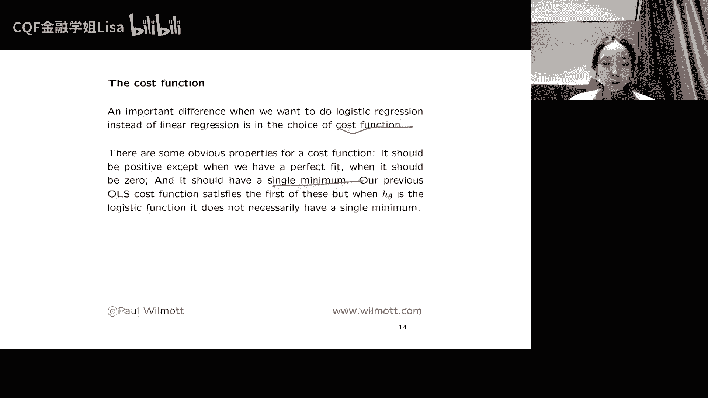

它的成本函数长成什么样子，就长成这个样子，对所以嗯就是你可以去看，因为我们有一本教材是那本红的封面的，就教授把它叫做啊小红书啊，就是把它叫小红书啊，他说小红书里面呢有这个成本函数的来源。

然后以及就是可以去证明这个成本函数，它是正的，但是就是有点繁琐，如果说你有兴趣的话，你可以去翻一下那本书好，但是呢就是我们不再有成本函数，最小值的解析解，因为当你的成本函数这么复杂的时候。

你再去把它微分对西塔微分，然后去求微分为零的那个西塔。

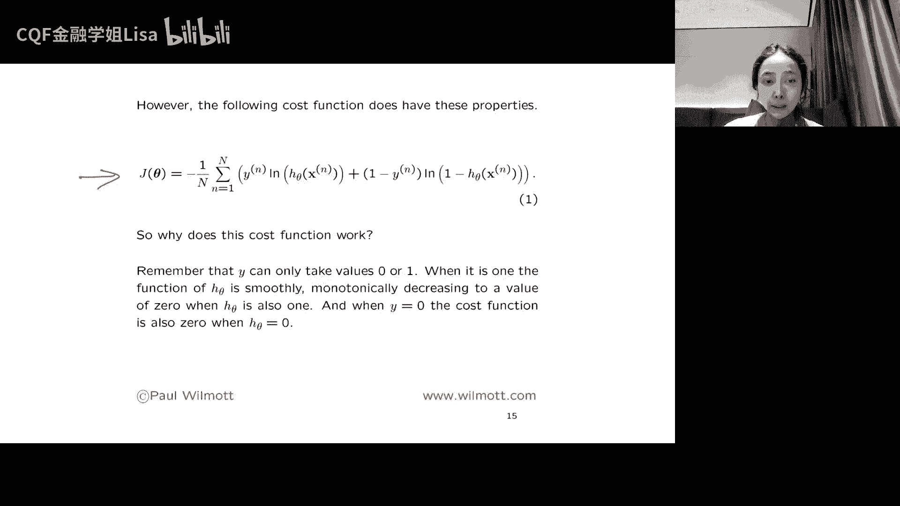

那个解析其实是很很难去解析出来的，所以呢我们就必须要用数值方法去求求解，但是还是同样的一个逻辑，对同样的逻辑就是他对他微分之后，所以你会看到他们的DJ对对DC，它的这个微分是一样的。

就虽然说它们的成本函数J不一样，但是你微分之后的这个结果，其实仍然是这个样子的，所以呢就是说我们还是可以去做梯度下降，对还是可以去做。

