# 2024最值得学习的金融量化交易课程-第五讲：Portfolio Management - P1 - CQF金融学姐Lisa - BV1vD421W7d7

我们M2的这个学习哈，那大家应该刚结束了，M1M1的话呢，嗯这个晚上好应该还是比较痛苦的对吧，尤其是有的同学这个数学基础比较差的哈，学这个M1还是比较痛苦的，然后我们M2的话呢。

哈应该说是对大多数的同学来说，M2应该是所有模块里面最简单的，因为我们不会用到很复杂的啊，这些随机过程的数学啊，我们顶多呢就是呃涉及到一下，这个高等代数的内容哈，所以呢如果大家是呃学M1非常痛苦的话。

那么MM2可以稍微的喘口气哈，稍微喘口气，但是还是要提醒大家，我们M2完了以后就是M3M3的话呢，又会来到很难的这个数学部分，所以大家在M2这一块呢，就是你在上M2的时候可以稍微轻松一点。

那你可以花更多的时间去复习一下M1，因为如果M1的话呃，M1没学好，没有把这个基础打扎实的话，你学M3包括学到后面M6都会非常痛苦的哈，所以大家这个啊先给大家稍微说一下，我们的这个基调哈。

然后大家应该都呃应该都认识我对吧，如果大家之前学了Python前导课的话，应该都有见见过我啊，我是CCF的教研负责人，然后我这学这学期会给大家去讲M2，M4和M6啊这三个模块。

然后今天呢是我们的第呃模块二的第一个lecture，然后这个lecture呢其实主要是讲啊，你们好啊啊，主要是去讲我们的这个现代组合理论，其实就是大家可能，如果说是学金融相关专业的话，应该会比较熟悉的。

就是我们的马科维茨模型，它就是马克维茨模模型好，然后我们这个课的教授呢，是一个非常可爱的法国教授，他是法国高金的一个教授，然后呢他的邮箱如果大家有这个课程，就是比较复杂的问题，搞不明白的话可以去问他。

那么这是他的一个机瞄的一个邮箱啊，它是一个非常嗯有耐心的人啊，基本上你问他一个问题，他可以给你回很多很多字啊，所以大家可以完全可以啊放心的去提问啊，当然我们也有我们的答疑文档哈。

大家如果说想用中文啊去提问的话，就可以在我们的答疑文档上去提好，然后呢这节课呃就是我们M2的话，总的来说主要是围绕组合管理，还有就是围绕一部分呢跟信用有关，要跟信用有关系的这个内容哈。

然后今天这节课呢就是我们的这个MPT哈，现代组合理论嗯，然后我们的教授SEBASTIAN呢，他是第一批呃，他是第一批的CKF学员，所以现在还是在03年的时候，拿到了CCKF的证书。

然后现在呢也开始去做这个CKF的讲师，然后今天呢我们讲的这个现代组合理论，其实主要是围绕着基本概念的介绍，还是还是比较简单的，就是没有怎么去涉及到数学推导，然后我们下节课又是明天晚上。

我们会去讲这个组合最优化的数学推导，就是明天晚上会涉及到一些这个高等代数的，一些内容，然后我们来看一下这个这节课的一个。

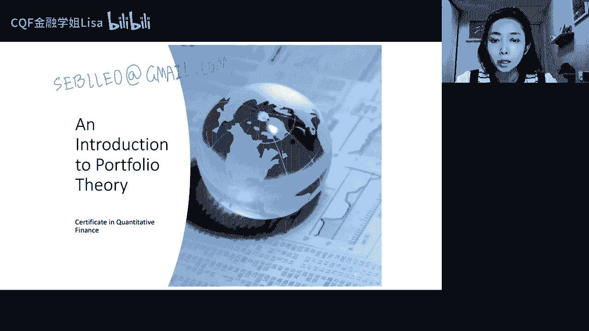

introduction啊，这个目录哈，就是我们这节课的课件其实还蛮多的，差不多有100多页对吧，像将近120页的课件，然后呢其实有一部分内容是不会讲的啊，就是有部分内容是需要大家自己啊下来去看。

如果你感兴趣的话，那么主要就是这一部分啊，这部分是没有讲的啊，就是大家有兴趣自己下来看，然后呢我们嗯会涉及到这个组合，构建它的一个整个框架，所以会涉及到我们的risky，Risky assets。

然后我们的这个ENVIRONOPTIMIZATION，就是均值方差优化的一个逻辑，然后怎么去找到最佳的组合，怎么去啊，我们分散分散化的一些内容，包括我们的有效前沿呢。

然后我们的tension cy portfolio也是market portfolio，还有就是这个理论会给我们带来的SHERIAL和market，Price of race，那么这些我们都会讲。

但还是那句话就只会去讲一些啊，就是介绍或者是结论中间的推导过程，很多都是这个忽略掉的哈，但是有些重要的推导还是会给大家去写一写，然后还有就是关于mp t这个，现代组合理论的一些缺点哈。

这个我们也是会去讲的，然后这个课件最后呢有一些reference，有些参考资料啊，这个参考资料呢是可以供大家去学习的啊，那么我们要知道，其实MPT就是我们的组合构建哈。

pfolio construction啊，它一方面呢是我们这个M2结束之后会有考试，然后考试的话会涉及到这个，就是mp相关的一些内容，还有就是我们的final project里面肯定有一个topic。

是跟pfolio construction有关的，所以如果说你对portal construction有兴趣的话呢，那么你可以哈现在开始早一点开始谋划，因为你final一定一般来说哈。

就一定有一个topic是关于组合构建的好，然后这部分没有讲，就是我们的单因子campaign和多因子APT模型哈，这边是没有讲，然后它主要就是集中在最原始的这个，现代组合理论的概念。

就是马克维茨的那些啊那些那个模型，然后嗯也就是这部分呢不讲，跟考试呢也没有什么，也没有特别几个强的关系，但是实操还是很有用的，然后为什么我们会以这个MPT去作为，这个M2的一个开端呢。

就是我们在啊大家如果学金融的话哈，很多这个投资学的教材当中，其实都有讲到MPT就是现代组合理论，And modern pfolio theory，然后为什么它那么重要呢。

其实它是一个非常有开创性的一个研究，这个mp它是在1952年的时候推出，然后虽然说他的名字里面啊，虽然名字里面看到有一个modern，有一个现代，但其实它是非常传统的，非常古典的一个模型。

而且它是一个静态模型，就它不会去考虑动态过程，它最大的意义就是开创了量化的一个时代，就是在MPT之前，应该是没有量化投资这个概念的，然后啊比如说我们的风险和收益啊，怎么去量化他们之间的关系。

怎么去精确的去量化，怎么去处理他们的关系啊，这个在MPT之前其实都是没有办法去做到的，所以我们可以说MPT，它其实是引领了一个时代啊，它有很多的这个追随者啊，所以这也是为什么我们M2会以它为开端的。

原因哈去讲它啊，不过呢因为它也有一些缺陷哈，他的一些假设非常的严苛，所以其实呢啊在这个我们的实际运用当中，其实之后也会有，就是现在有经有越来越多的一些嗯，改善或者革新的模型哈。

就是在MPT的基础之上去做了一些改进的，那么这个呢是我们现在学术里面有很多，相关的一些研究。

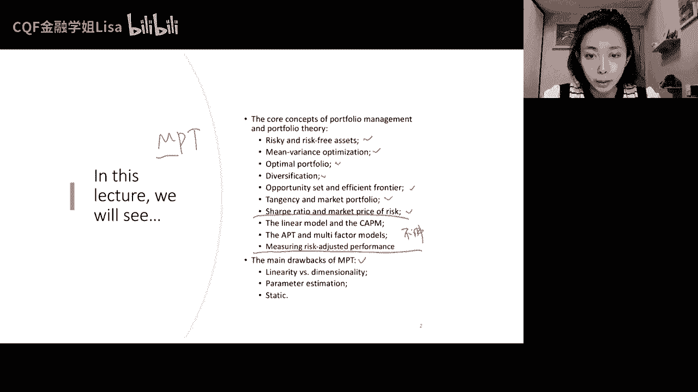

大家如果有兴趣也可以去找一找好，我们来看一下它的一个historical note，这个马克维茨是在1952年推出这个模型的，然后呢这个模型也是他的一个博士毕业论文，是在他26岁的时候写的博士毕业论文。

然后他当时赶这个论文呢，其实感的是非常粗糙的，包括说他在毕业答辩的时候，可能很多人没有听懂，然后呢真正就是大众开始去接受这个模型，其实是在他毕业之后的啊，大概56年之后。

然后这个理论才慢慢的被大家所认识，然后呢在1929年这个全球金融危机之后，就是大家就认识到了，就是不要把所有的鸡蛋放在一个篮子里面对吧，就是大家在做投资的时候就要去做分散化，但是呢在那个时候。

大家对这个分散化的理解还是非常粗浅的，可能就是有个印象啊，我们要做投资叫做分散化对吧，不能啊去这个啊，这是什么啊，投嘛就全部钱梭哈到一个资产上对吧，但是呢那个时候的人们对于分散化怎么做啊。

就是分散化到什么程度啊，其实都是没有一个深入的研究的，没有一个量化模型帮助他们去做出决策的啊，一直到马克维茨发布发表这篇论文之后，然后呢。

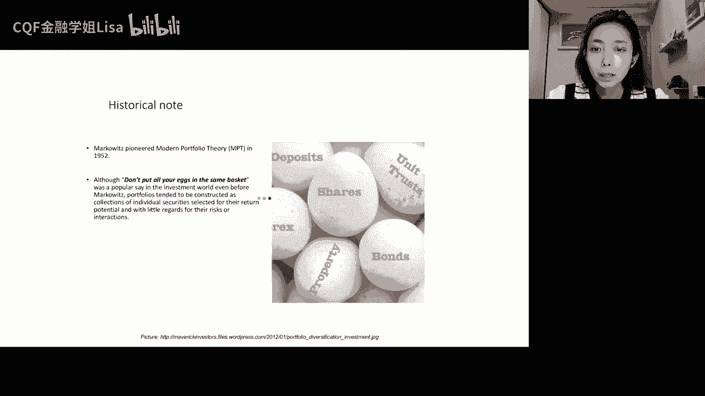

他在这个理论当中最大的贡献，就是他提出了一个分析的框架，这个框架是之前从来都没有出现过的，就是我们现在我们都知道，高收益对应着高回报对吧，这个rise return一个trade off。

这个我们都知道的就是啊，因为我们可能普通人都是风险厌恶的对吧，我们在承担了更高的风险之下，我们会去索取更高的一个回报，但是怎么样有效的去承担风险呢对吧，承担了一点风险就能得到一点回报吗。

也就是说啊该怎么样去去得到这个trade off啊，怎么去在给定风险的情况之下，去尽可能多的去获得这个高收益，或者是说在给定的这个啊回报的情况之下，尽可能的去把风险降下来对吧，怎么去做。

这其实都是没有任何的这个定论的，那么对于回报，可能大家很早就有了共识来回报return啊，用这个呃这个return去衡量我们的这个收益率啊，去衡量我们的回报，但是呢对于这个呃就是对于风险哈。

其实嗯就是大家的这个定义哈，大家的这个认识其实是嗯不太一致的，就是可能有的人会想啊，风险就是方差标准差对吧，但是有的人会认为啊，风险我们到后面还会学在险价值发呀啊。

expected short for啊对吧，还会学到什么偏度风度啊，就是我们对于风险的定义，可能每个人那心目中都是不太一样的，那么这个马克维茨呢在他的这个理论当中，他就首次就把这个风险，而不是首次啊。

就首先把这个风险给它定义成了就是方程，就是virus，然后这个月方差和波动率和标准差不同，短方差它是二阶局，然后波动率和标准差其实是一样的吗，波动率标准差是一阶局，所以方差呢它是一个线性运算符。

它是线性可加的，那马克维茨呢他把这个风险呢定义成方差，然后呢通过相关系数来看，分散化是怎么样去降低组合风险的，然后呢在在他这个研究之前，投资界其实对于风险都是没有明确的，这个定义没有明确的意识的话。

该怎么去量化风险。

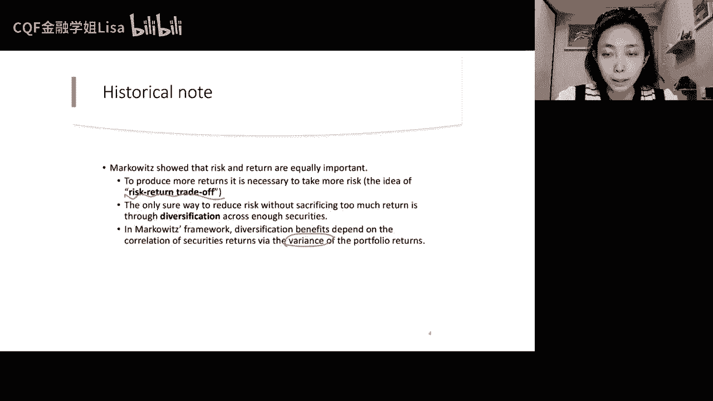

就大家都是没有定论的，然后马克维茨其实有很多的追随者，然后最著名的一个追随者就是威廉夏普，然后威廉夏普呢也是跟马克维茨一起，获得了这个诺贝尔经济学奖的，对吧啊，这个马威廉萨普呢。

它是基于马克维茨理论推出了这个cap模型，就是资本资产定价模型，然后几乎所有的金融书啊，所有的这个什么公司金融啊，各个可能很多科目都会去讲这个开盘模型，然后这个模型呢给到我们定价的方式。

帮助我们去做资产选择，然后看帕呢它是引入了贝塔的，就是我们所谓的这个市场风险的，然后还有就是嗯这个特雷诺，那么特雷洛呢它是引入了阿尔法，那么像很多像一些主动管理的基金啊，尤其是对冲基金。

他们其实都是在追求高阿尔法，就这个超额回报的，然后还有像这个future black，好，fisher black其实也是啊，也是马克维茨的一个追随者，就是大家可能有听过啊。

black tea model对吧，这个啊black model哈，BSM这其实里面的B就是black，所以我们后面的课程当中会不断的去遇到它，包括布莱克塔，现在也是啊，也是这个嗯，也还在试哈。

也还在试啊，经常我们这个CKF的这个量化金融峰会，都会请到这个就是black来去参加做一些分享，所以呢他是马科维奇的一个非常啊，一个主要的一个粉丝啊，然后像black pitman，我们今天晚上就会讲。

而不是名片，明天晚上就会讲，Black tea，这个black tea模型呢，其实就是基于马克维茨体系去做最优化的，这个方法，然后还有包括像推导这个black shots formula啊。

它的一个最原始的方法，也是通过构建组合来去做对冲，然后呢，这个构建组合的思想也是来自于马克维茨，然后马克维茨和威廉夏普呢，是在1990年的时候，然后获得了这个诺贝尔经济学奖。

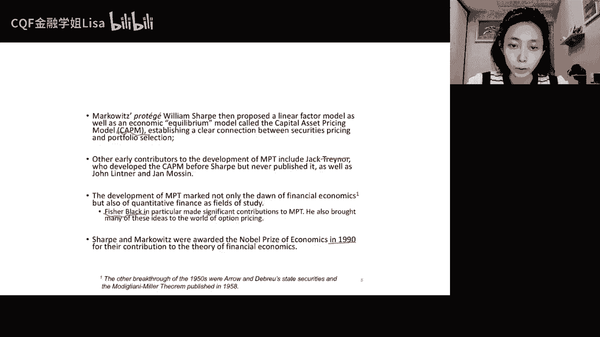

好然后这个就是啊左边这个是马克维茨，然后右边这个是威廉夏普，然后马克维茨嗯，那就是非常可惜，还是在应该是上个月，然后就去世了，那么在他去世之前，其实也经常有来参加我们的这个量化峰会啊。

但是啊这个以后就没有机会了啊。

然后接下来呢，我们来看一下这个模型的sitting哈，其实就是这个模型的假设，因为我们说大部分金融模型都是有假设的，然后一般来说越精简的模型，它的假设就越多，所以其实马克维茨模型。

也是一个非常经典的模型，因此它的假设也是非常非常多的，我们来看一下这边的假设，首先就是它是我们在一个经济啊，一个经济体，然后呢这个经济里面呢，我们我们的这个资产数量是大于等于二的，就是我们可以交易的。

这个资产数量是大于等于二的啊，这个这个假设是必须要有的，不然的话就没有办法去做分散化好，然后第二个就是说啊，我们在一开始的这个财富就是W这么多钱，也是你的，你有初始资金，比如说一个million对吧。

然后你投了之后哈，你这个这笔财富你投了之后就不动了，比如说你要投一个啊，20年对吧，从零到20年，然后呢这20年把你的这一部分财富，就是你这个投好的这个PFOLIO啊，这里面有可能N个资产。

那么你这个PFOLIO投好之后呢，你这20年就by and hold，就是不会再动了，不会卖，一直持有到到一直持有到20年好，所以就是20年之内不会做任何的操作，然后这个是你对这个投资行为的假设。

所以我们为什么说马克维茨，他是以马克维茨模型是一个静态的模型，这就是因为它是band hold，然后还有就是我们的目标呢，其实就是去做一个最好的投资啊，做个最好的投资，那怎么样去实现这个最好呢。

其实就是去构建一个PERFORMAL，把所有资产都考虑进来，然后你可以long也可以short好，然后这边就是如果你要去实现这个目标，那么就需要去构建一个PROFOLIO。

然后通过long和short这些N个资产好，然后呢这个我们刚刚说的bin hot band hold呢，就是中间的过程就是不会管的对吧，你要投了之后，要到20年之后才会去回顾一下投资效果。

然后我们啊后面有一些，就是之后呢是有很多的一些修改的版本的哈，就是一些比如动态的版本啊啊，但是就是这个动态版本及教授都没有讲，他讲的就是最古典的，这个最古典的静态的这个版本。

所以我们的pal上呢其实有上传一些extra，Materials，一些呃参考教材参考资料，然后这些参考资料里面呢有涉及到动态的，但是我们上课时，我们课上只会去讲这个静态的，所以大家如果对动态感兴趣。

你也需要自己下来看一看，好，让我们来看一下，我们有哪些资产可以去进行交易，那么这个资产是不是只限制在金融资产呢，哈并不是哈，它是包含了这个地球上所有的可交易的资产的，它所有可交易的资产。

所以叫做investment universe，还有一个这个投资的范围，啊投资的宇宙，然后包括金融资产，包括实物资产，包括无形资产啊，当然了啊，在这个实际运用当中啊。

就是我们其实是没有办法去做到这个on ars的，对吧，我们在实际运用当中，很多资产我们是买不了，没法去交易的啊，就比如说啊拿我们中国投资者来说啊，比如你要去买美股啊，你要去买欧洲的资产啊。

都是还有很多限制的对吧。

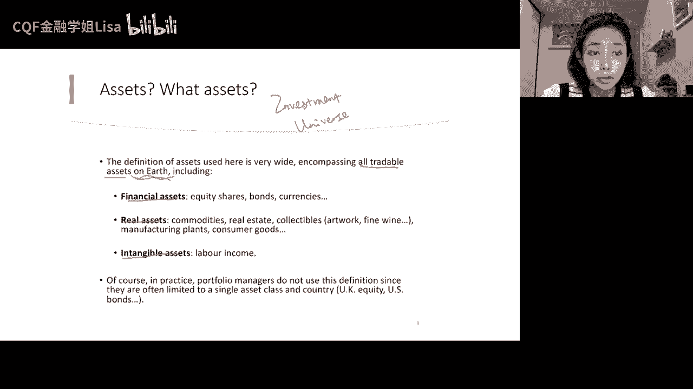

但是这个模型当中它是没有限制的，好然后是我们这个组合的权重的设置，怎么样去构建组合，构建组合其实就是分配权重对吧，就是你到底要投哪些资产，然后每个资产大概投多少好，所以呢我们有两种方法去衡量。

你的这个就是投资的一个分配，所以一个呢就是你到底投了多少钱，然后还有一种呢就是你投了多少比重好，那么我们在这个模型当中呢，我们使用的就是用这个权重啊，用比重的这种方式来去描述。

你到底在这个资产当中投入多少钱，所以呢我们就用w i weight，pfoa weight啊，去表示你在每个资产上的一个权重，所以它的一个公式就是你这个资产I，它的市场价值来除以你整个组合的市场价值。

就是你资产A的资产I的一个权重，然后模型的要求就是，你必须要把所有的资金全部都要投资进去，好这就是你的total wealth，你必须要把所有的钱全部投进去。

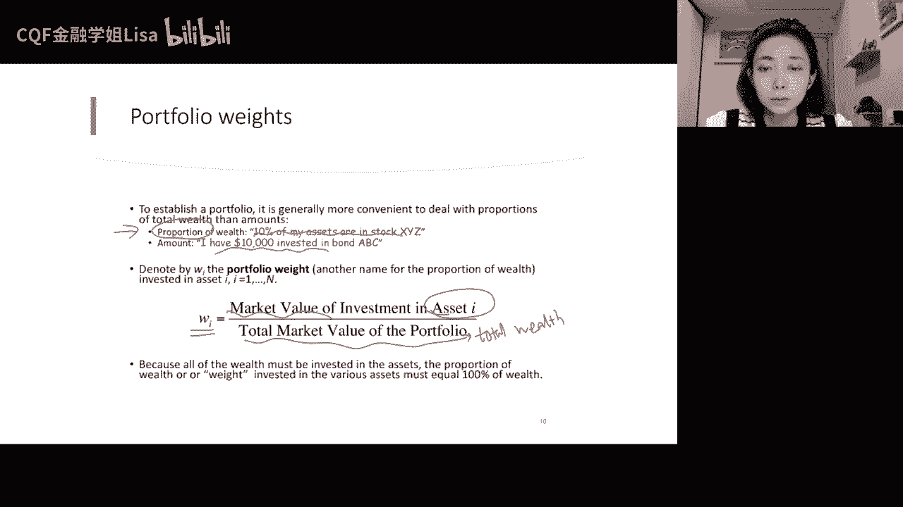

好然后还有我们的核心的假设，好核心的假设我们来看一下，首先第一个就是我们的expect return，我们用什么样的指标去衡量，你的每一个组合的表现呢。

那其实第一个就是要去看他的EXPECTATOR对吧，我们的回报用的就是未来的expected return，然后这个expected return我们用UI来表示。

然后第二个呢是sa division of their returns，回报率的标准差，那么这个是用sigma采用sigma去表示，然后第三个是correlation，就是你资产和资产之间的相关系数。

所以呢我们用ROIJ来表示，资产和资产之间的相关系数，然后呢，这里他还要求就是我们的资产的回报的分布，必须要满足椭圆分布好，椭圆分布其实就是等待率曲线为椭圆的，这个分布都叫做椭圆分布，比如说正态分布。

比如说T分布对吧，所以比如说像我们画一个正态分布，然后正态分布的话呢，你要想象你是从从从上往下去俯视，去俯视去看它，那么它的啊相同的这个概率对吧，它的等概率的线给它画出来，它其实就是这样椭圆的啊。

所以你把它想象成立体的，就有点像是一个帽子好，所以正态分布T分布其实都是椭圆的，这有的书上啊，他会说回报率必须要服从正态分布啊，但是严格上来说应该是服从椭圆分布，就是T也可以的，好然后我们再来看这个啊。

MPT现在组合理论，它其实就是一个均值方差最优化的一个问题，所以MPT到底是一个什么样的模型呢，他就是把风险和回报给它放到了一个框架当中，那么MPT，它其实就是在做这样的一个优化的过程。

那么什么优化过程就是他需要去实现，一个是在给定风险的情况之下，他需要实现最高的回报，然后一个是他在给定回报目标的情况之下，他需要拥有最小的风险，这个就是MPT它的一个实现优化的一个框架。

和它的一个目标啊，这个他这是他的一个假设哈，他模型的假设啊，就是说如果你的回报率，没有服从这个椭圆分布的话，那么这个模型它的表现应该就会比较差好，然后我们说其实像啊对冲基金对吧。

对冲基金呢其实一般来说呢，就是啊做的就是这个事情，就是你在给定的风险预算的情况之下，他的这个最高的去实现尽可能高的回报，这些就对冲基金啊，或者是一些主动管理基金，他们在做这个事情好。

然后我们这节课呢不会去涉及到过多的数学，我们的这个最优化的过程会在下一节课，就明天晚上来讲好，然后通过这个方法，我们可以把一个投资的问题给它，变成数学上求极值的问题，所以这个最优化数学它是有标准的。

这个求解方法的，我们会在明天晚上来去看好。

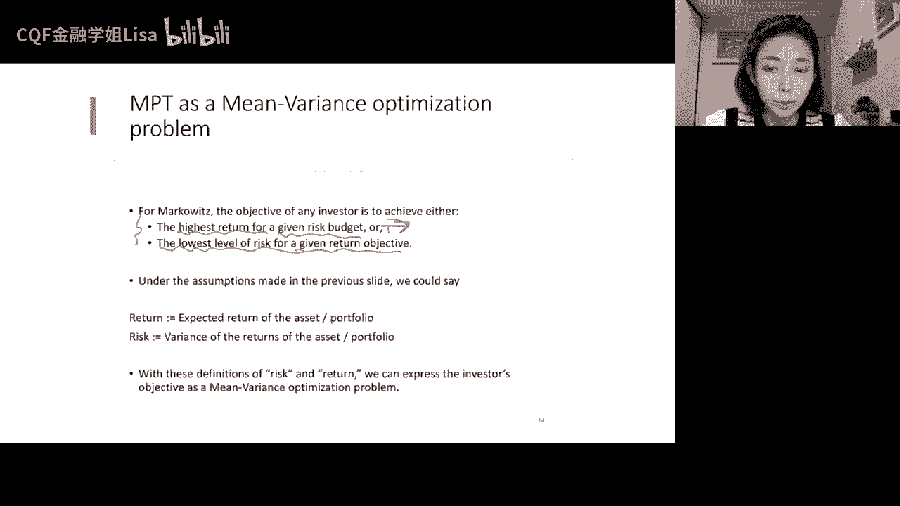

所以呢我们要用数学方法，那么在用数学方法之前，很重要的，就是你需要先嗯把这个函数给它画出来，也就是我们要有一个坐标啊，有一个坐标系，有了坐标系，我们才会有函数，才会有方程。

才会有最大值最小值的这种概念好，所以呢现在呢我们就有一个这样的坐标，它是一个risk retard的一个平面，好然后呢我们常见的话呢，一般呢其实就是把风险放在X轴，然后呢回报率呢给它放在Y轴。

然后在这个1952年的这个论文版本当中呢，其实啊，当时为马克维茨是并没有，去构建这个坐标轴的啊，所以当时很多人都没有看懂那篇论文，然后后来呢，就是有人把这个坐标轴给它画出来之后。

然后才开始大家才慢慢开始熟悉，才开始理解好，那么嗯既然我们常规的把这个三个deviation，把它叫做把它定为X轴，然后把这个return给它定为Y轴，那么在投资当中呢。

这个risk它其实就是一个input，然后这个return呢就是一个output，那么这个就跟我们承担了多少风险，然后就去索取多少回报的这个想法是一致的，然后呢呃每个资产它都可以定义。

就是可以定义成是这个坐标上的一个，坐标轴上的一个点对吧，比如说你这个资产I，那么这个资产I它的风险就是西格玛I，然后他的回报率呢就是mi，所以你任何一个资产，都会在这个坐标轴上有一个点啊。

它都有对应的一个风险以及一个回报，所以呢这个资产其实都是可以在这个坐标上去，进行标注的啊，它的这个坐标上应该有很多很多的点，那么这样的话呢最有效的资产组合啊，最有效的资产组合，他一定是在就是左上角这边。

这个这一块区域的对吧，因为左下角的话，左上角的话就是风险会更小，并且回报会更高一些，所以呢这个其实就是我们对这些哈，就是risky assets的一些表达，就是他们就是这个坐标轴上的一些点好。

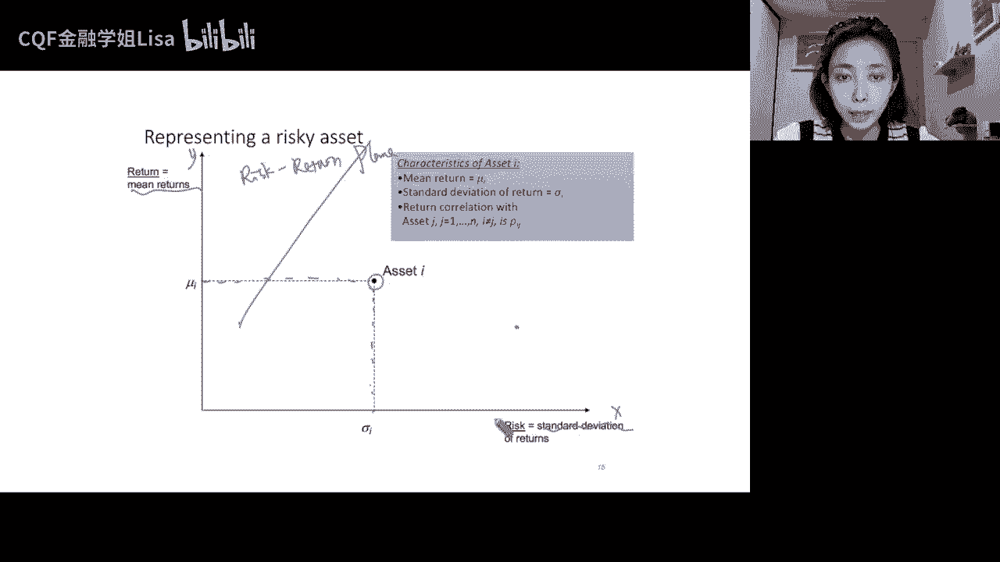

然后我们来看一下这个，它对resplay asset的这个定义，因为我们这个模型框架当中是有resper asset，那么首先就是呃，如果说你不想把所有的钱都投到risky asset，那怎么办呢。

我说你也可以把你的钱存到银行里面，然后这个银行有一个fix rate，有个固定的利率，那么这个存款呢，它其实就被定义为是一个无风险资产了，好，所以呢他这个无风险主要指的是没有违约风险。

所以呢他就是一个refree assets，用RFA来表示无风险资产好，然后他的一个结果就是啊这个无风险资产呢，它的expected return就是R哈无风险利率，然后它的波动率是零。

因为无风险资产嘛它没有波动率，然后还有就是我们的correlation，就是我们的无风险资产，跟任何一个其他的资产之间的相关系数都是零，因为它不会跟随其他资产的变化而变化好。

这个是无风险资产的一些这个规定，那么在MPT当中呢啊，因为定义的这个投资期限比较长，所以呢其实使用的无风险利率呢，也是长期的银行存款利率，固定的长期的银行存款利率，然后呢，我们把这个无风险资产呢。

给它表达到我们的坐标轴上。

那么其实只有这个点，所以它的标准差对应的就是零，然后它的对应的这个Y轴就是rise free return啊，用R表示无风险利率，所以他就是在Y轴上。

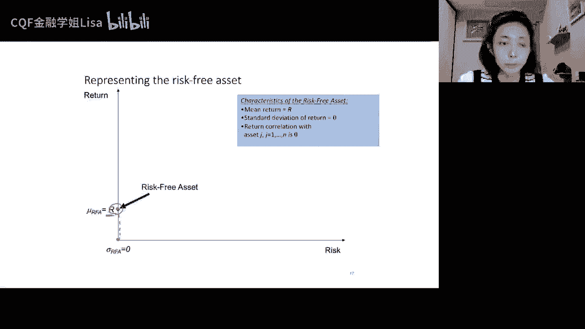

好然后还有还有一些假设哈，其他的其他的一些假设呢都是为了这个简化啊，让这个模型更简单去设计的一些假设，那么首先啊，他说的所有的这个啊统计都是基于全部回报的，就是你去投一个资产啊。

它包含不仅是这个资产的资本利得，它还包含它的dividence interest，包括在投资收益啊，所有这些全部都包括进他的一个return，好。

这是他的一个在计算return的时候是一个total return，然后还有就是fractional investing啊，就是这种叫做部分投资哈，部分投资，也就是说你可以投这个资产的，0。01%啊啊。

比如说你可以买0。5只股票啊，啊也就是说我们的资产是无限可分的好，然后第三个就是投资者他是可以啊，存或者是借以无风险利率去这个实现的，你以无风险利率去存钱，以及你要以无风险利率去借钱啊。

但这个的话那很明显就是不太现实的好，然后第四个就是啊，如果说你要去做空的话啊，也是没有限制的啊，这个也不现实对吧好，还有第这个第五个是FRICTIONIST，就是没有摩擦哈，无摩擦。

那么无摩擦的话就是没有任何的税，没有任何的交易费用，然后也不需要提供抵押物啊，保证金什么的哈，所以其实这三条假设，都使得这个模型它不是特别的现实，好让我们来看一下啊。

这个是我们的investment universe，我们的投资宇宙，然后我们的risky assets就在这边，所以他们是有风险的，然后这个是我们的risk free assets。

在这里我们有N个risky assets，好然后呢我们接下来呢我们先来考虑啊，简单一点的情况，还有一个比较简单的问题，就是我们有两个assets以及rise free assets。

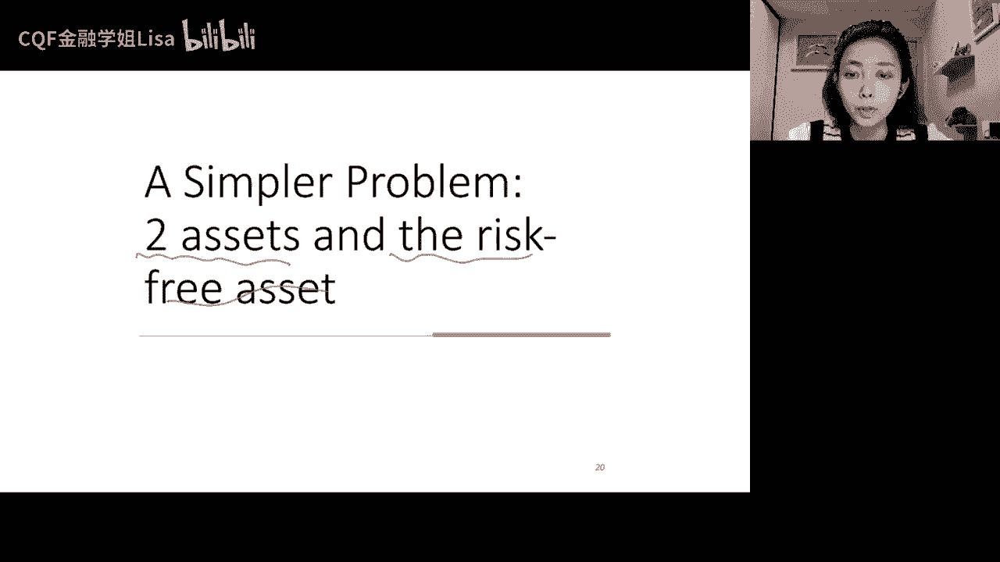

也就是说我们现在在整个世界我们只有三个点，我们只有三个资产，比如这个是A这个是B，他们俩都是risky的，然后还有就是我们的无风险资产好，现在就是我们整个世界就只有这三个资产可投，那么这个时候呢。

我们应该怎么样去选择最佳的投资组合对吧，怎么样去做最好最佳的一个分配配置呢，好那这边的话呢，就比如说我们设定A呢就投WA，然后B呢就投WB，好那我们现在要做的，我们就先去把一个无风险资产。

跟一个风险资产啊，比如说先把这个R就是这个RFA嘛，无风险资产跟A这两个资产去进行一个结合，去看一看该怎么样去做这个资产配置好，所以呢我们说啊当你去构建组合，你要把R跟A合在一块构建组合的话呢。

这个组合的预期回报，其实就是这两个资产的加权平均吧，这两个资产回报的加权平均。

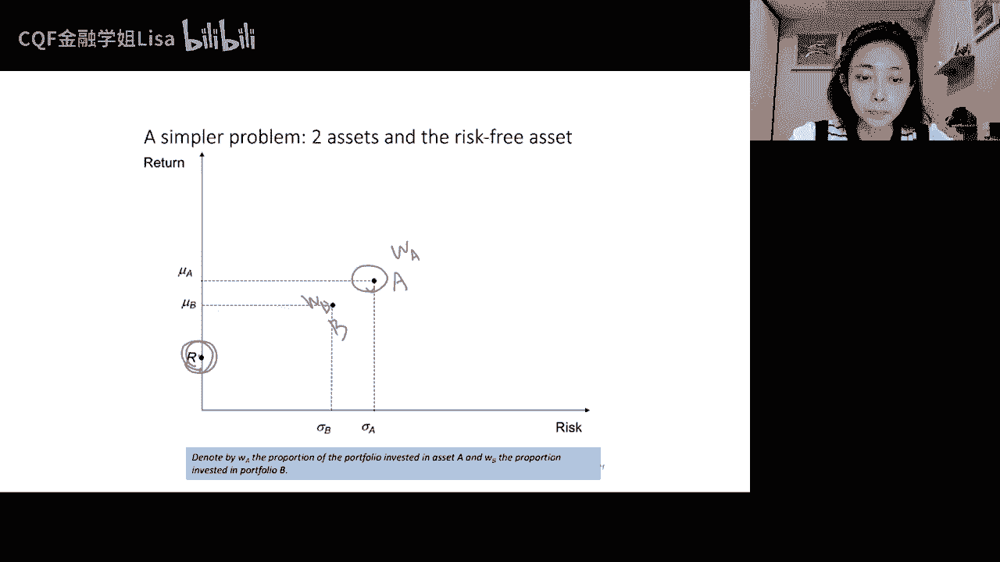

我们可以稍微的先看一下他的这个，那为什么他是两个资产回报率的加权平均，我们先来做一个简单的数学推导，比如现在我们要做的事情，就是，我们要把一个risk a和一个无风险的R，去进行结合。

然后A的标准差是西格玛A这个是ma，然后R就是R，然后这个时候呢我们就想要去啊，把他们俩进行结合去构建一个组合，那么我们就比如说投vest w a into a，然后invest w1减WA。

啊into rise free，asset好，然后我们就来看一下这个组合，我们就拿这个派去表示，我们用P来表示这个组合这个portfolio，所以我们的这个，MUPI啊。

组合的回报就应该是应该是取期望值吗，这个组合的一个回报的，应该就是把它们取个期望值，那么就是WA去乘以RA，然后再加上一减WA再乘以RF，好然后呢因为我们的期望值是线性的，所以呢我们可以把它们分开。

也就是一的WA乘以RA，然后加上E的E减WARS，然后这里的话因为W在这里还是常数哈，WA是常数，所以呢你把可以把它拎出来，拿出这个期望值的符号，所以它其实就是WA乘以E的，RAA的这个回报的期望值。

再加上那么一减WA也是常数，然后RF其实也是常数，所以呢他这个RF的这个E其实也是可以擦掉的，好，那这样的话呢，嗯因为我们RA的期望值就是MUA嘛，啊这个是他的一个预期回报嘛对吧。

这个是EXPECTOR，好，所以就是MWA乘以ma，加上E减WA乘以RF好，让我们可以稍微的去整理一下，就是我们的new派，我把这个RF给他，就把这个框框把这个给它打开。

加上RF减去WA乘以RF就把RF它单独拎出来，然后另外的WA去合并他们的同类项，MUA减去RF好，这样给它稍微整理一下，那么这样整理一下的话呢，这个ma减去F这其实就是一个超回报，对啊这就是一个忏悔吧。

好，所以你可以看到，现在你这个组合的回报到底是多少呢，其实就取决于这个WA了对吧，这个A的一个权重，所以当你WA为零的时候呢，其实我们的组合的回报就等于RF，然后当你的WA等于12的时候。

那么我们的啊mp就等于12，RF加上12的ma，然后还有比如说当WA等于一的时候，就是你所有的钱都投在这个资产A上的话，那么没派就应该这边就为这应该是就是MUA了，好还有就是你也可以去杠杆投资嘛。

WA等于二的话，那么mu派就应该是等于二倍的ma减去RF好，这就是不同的权重的情况之下，你的组合的回报还是会受影响的好，这个excel return也可以叫做风险溢价，Risk reer。

好这个是它的回报率的情况哈，就组合回报率就是他们俩各自的一个加权平均，我这个就这个会比较直接是加权平均，好这个是回报率，然后我们再来看一下组合的方差，那么同样的我们的西格玛派。

它的方差其实就是要去算我们这个组合的方差，我们用VN啊，这个VR表示方差，所以又是WA乘以2A就回报的方差嘛，去加上，我们就可以啊，开始一减WA乘以RF，好然后因为呢我们的这个啊无风险资产呢。

它是相差为零嘛，并且呢跟这个risky a相关系数也为零好，所以呢其实你这样你这边是可以擦掉的，它剩下的其实就只有VNWA乘以2A，然后呢因为W是常数，所以给它拎出来变成WA的平方。

然后乘以这个VNRA，好，所以其实就等于WA的平方，乘以西格玛A的平方，所以你再开个跟我们的西格玛派就有了，好这就是这个组合的标准差，就是你把RIST跟一个rise free结合在一起。

这个组合的标准差，所以同样这个WWA的这个不同的取值，它是会影响这个组合的标准差的，WA等于零，西格玛派就等于零，WA等于12，西格玛派就等于12西格玛AWA等于一，sigma派就等于sigma。

然后WA等于二，西格玛派就等于二倍的西格玛好，这就是这个组合的风险的一个情况啊，所以呢我们这个也得到了，那么有了组合的风险，也有了组合的回报率，那其实我们就可以看到这个课件上的。

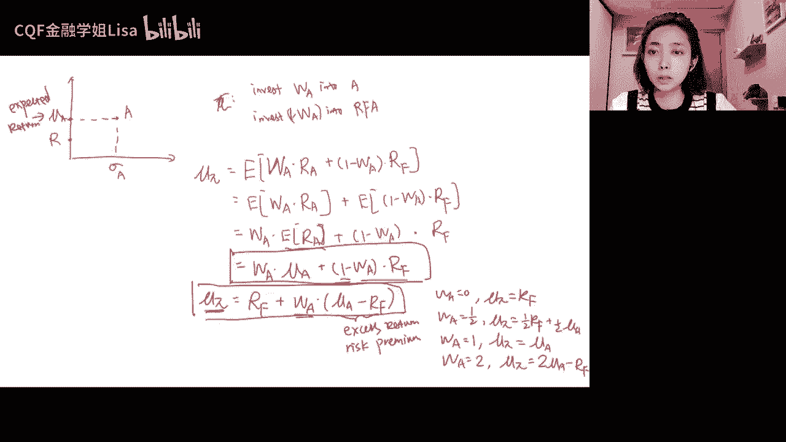

这个公式的一个表达式的一个来源了，好那你得到了mu pie，得到了sigma pie，那么你可以这里稍微给它一个像，就是我们的就是WA，就等于西格玛派除以西格玛A好。

所以呢你把这个WA呢给它带到这里面去，带到这里面去，其实你就可以得到一条直线啊，就可以得到这样的一条直线的表达式，所以这个呢就是把一个无风险资产，跟一个有风险的资产结合在一起，带来的所有可能的组合。

他们的风险和回报率的结果好，所以也就是说你把所有的钱都投在A上，那么你可以得到这样的一个组合，你把所有钱都投在RF上，你可以得到这样的组合，然后呢，中间的这些点就是你在A和R之间去分配权重，不同的组合。

他们可能的对应的一个回报和风险的一个情况，好然后呢比如说在这一块对吧，这一块的话，那就说明你A和R2是一样投了一部分对吧，la lr哈，也就是可能百分之呃，30投A70%投二啊，或者怎么样去分配对吧。

然后呢，这外面的呢就肯定就要说明，你要你要去做杠杆投资了，对就是你需要去ER去借钱，就是你需要borrow at r，然后把所有的这些钱去全部投资到这个A里面，啊就是这边你可以构建组合的原因啊。

他是要去做杠杆投资，才可以去实现外面的这个组合的，好所以就当我们做的，然后中间呢就是一样头一些，然后这个外面的就是你要去做杠杆投资，所以说，如果说你要把这个A的权重放的越来越大，你要放更多的杠杆。

就是借钱去投资A的话，那么你这个点就会不断不断的去往右边去走，但无限的延伸出去啊，当然前提还是你能够以无风险利率去借钱，好那么这个是我们要考虑的第一种情况，就是把一个risk free。

跟一个risky去结合在一起，然后呢我们现在再来看，把两个risky结合在一起啊，又有什么样的区别，就现在我们有两个risky，一个是A，一个是B，然后呢，同样我们来算一下他们俩构成的这个组合啊。

这个组合的回报率和风险是怎么样的，好所以现在是我们是把A和B结合在一起，A和B，所以一个是西格玛A西格玛B，然后一个是预期回报率MUA，一个是预期回报率new b好，然后现在我们要投一个派。

这个派呢就是同样我们是投WA在A上a is a，然后呢WB的话呢就是E减WANACB好，同样我们去算我们的这个MUPMP的话呢，又是啊取这个期望值，WA乘以RA加上WB乘以RB。

好然后这个常数可以拎出去，所以WA乘以E的RA加上这个是一减，WA乘以E的RB好，所以就是ma和MB，所以WA乘以ma加上E减WA乘以UB，然后同样你可以把它稍微的去整理一下。

就是MB加上WA乘以ma减MB，还有相同的一种方式去给他整理一下，好这个是这个方这个组合的回报率，然后再来看一下这个组合的方差，西格玛方，Young the virus，然后这个时候呢。

因为啊RB它不是无风险资产了，它它的方差不为零，它也有相关系数，A和B之间是有相关系数的，所以呢你把它展开的话呢，就是首先是这个常数还是可以拎出来，乘以RA的方差，然后加上一减WA的平方乘以RB的方差。

然后还不考虑他们之间的相关系数是吧，加上二倍的WAE减WA乘以，A和B之间的协方差，好这个用的是方差的一个定理好，然后呢再把它写出来，就是WA的平方乘以这个就是西格玛A的平方。

加上E减WA的平方乘以sigma b的平方好，再加上二倍WAE减WA，这个协方差就可以写成相关系数，乘以各自的标准差，6AB乘以西格玛A西格玛B好，这个就是我们的西格玛派的平方。

所以如果说你想得到的是西格玛派，就开个灯就好了，对吧好，那么这个就是我们把A和B这两个risky asset，去结合在一起，他们的一个预期回报率组合，预期回报率你也可以写成这样子。

然后还有就是这个组合的风险。

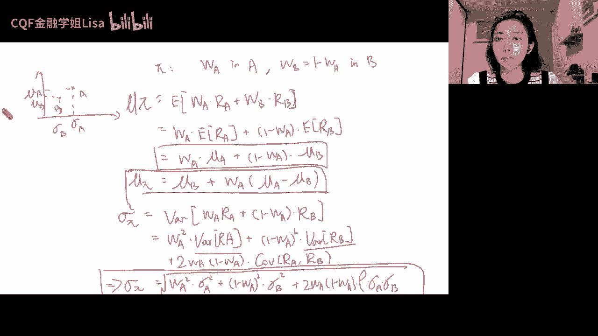

好他在这个课件上好也是有的，好所以呢这个是缪派跟sigma pie，所以这个很明显是个非线性的关系好，所以非线性的关系呢，它画在这个坐标上作为呈现这个样子啊，这样一幅图就是曲线。

所以同样就是A这个是B啊，如果说你要所有钱投都投A那就是这个组合啊，所有钱都投B就实现的是这个组合，如果说你是一部分A1部分B，那么就是这里啊中间的某个组合，然后呢最外面的对吧。

最外面的这肯定就是说你要去short b，然后让A，就相当于是你要以B的这个利率去借钱啊，做空B嘛，然后做空它你会得到一笔钱，然后你把所有的钱都拿来去投A，所以你这边是short b，然后la。

然后同样，那这边的话呢，那就是反过来就是你要去啊，short a long bee也可以去实现啊，下面的那些组合，好所以他往下面的话呢，整个组合的回报就越来越低啊，所以他是这个sha lb哈。

他的回报有可能是会为负的好，那么这条线呢它的名字就叫做，其实不是名字，其实就是我们的机会几opportunity set，也就是所有你可以构建的组合啊，就在这条线上了，那么这就是由资产A和资产B。

这两个资产构建的所有的组合啊，全部都在这个这个机会集上这条曲线上好，但是呢我们说这条线上呢，我们肯定还是可以去做筛选的对吧，你就可以比如说你给定风险，你肯定要挑回报最大的对吧。

所以比如说你画这么一条直线，然后呢这两个组合其实就是在相同的风险之下，但回报不同，所以你肯定要跳回报更大的，所以其实你就可以把下面这个给它删除掉对吧，你可以保留的是上面的，所以你可以画很多很多条竖线。

那么其实都可以相应的把下面的给它删除掉，然后保留上面的好，所以我们要理智的高效的去承担风险好，因此呢就是这一条机会集里面，其实只有上半部分才是有效的机会记对吧，所以之所以我们这个组合的风险。

在这个范围内变化，就是来源于这个roll这个RO，然后这个肉呢啊相关系数啊，它可能每月肉本身的取值范围是从-1~1，所以你的roll的取值不同，那么你最后得到的这个机会集的曲线，也是不同的。

大于西格玛A的部分，大于sigma的部分就是should be la，对这个是sigma，好，所以我们说这个地方就是它只给到了我们，我们一个相关系数的情况，当然我们也不知道这个相关系数具体是多少。

但是我们肯定知道，当你的相关系数不太一样的时候，对相关系数从1~-1，你的相关系数有很多种可能性，那么相关系数不同的时候，你的机会及的这条曲线，肯定它也会呈现不同的一个形状的。

下面那一半也是可能收益期望结果啊，看不懂这句话，可以再再描述一下这个问题啊，好然后呢，我们接下来就要去研究这个相关系数。

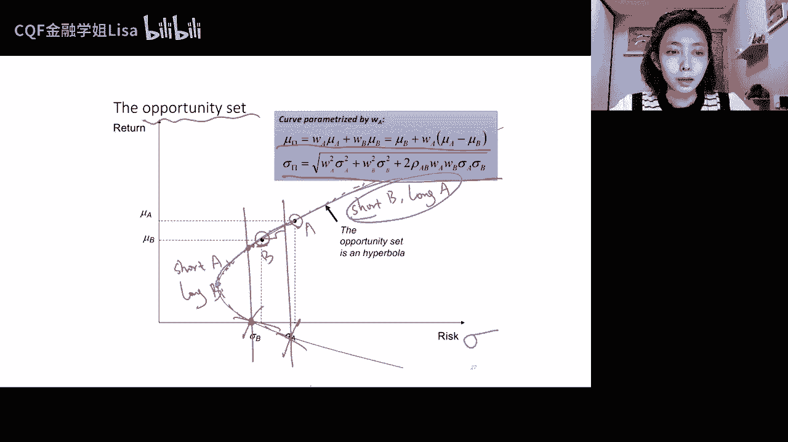

我们先休息一下吧，我们先休息一下，我们再来看这个相关系数的取值范围，我们休息10分钟，然后在7。58的时候过来。

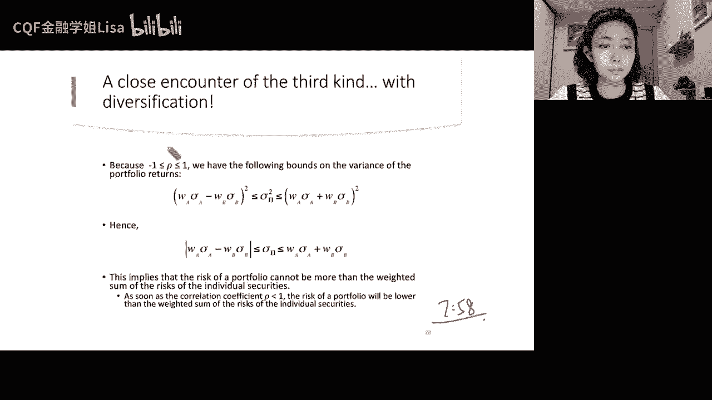

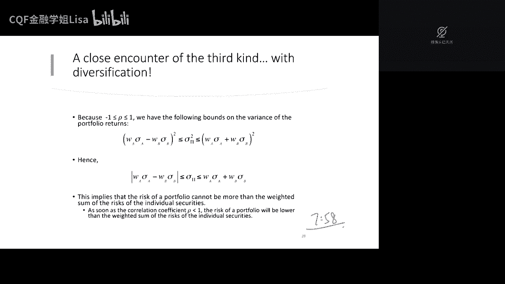

好那我们继续回来，我们来看一下，因为相关系数它有取值范围，所以呢我们的这个组合的风险，应该也是有对应的这个一些范围的，我们首先来看一下，因为相关系数它的取值范围是在-1~1之间，好。

所以呢我们的这个我们，我们就首先要先来看这个roll，小于等于一这部分，所以我们的西格玛派的平方啊，我们的这个组合的方差，首先的话他肯定是大于零的，方差一定是大于等于零的好，然后呢我们的组合的方差。

我们刚刚写过，是WA平方乘以RA乘以西格玛A平方，然后加上WB平方，西格玛B平方，加上二倍的WAWB，然后roll西格玛A，好那既然我们的肉馅是小于等于一的，现在小于等于一的话。

那我们这一坨就应该是小于等于，就它取一嘛是吧，那就再写一遍，加上WB平方，西格玛B平方，再加上二倍的WAWB西格玛，西格玛B，好像这个的话其实就是一个二次WA西格玛A，加上WB西格玛B的频道。

好这个是它的当肉小于等于一的时候，我们的西格玛派平方就应该小于等于他们俩对，相加的一个平方好，然后再来考虑这个roll小大于等于一的情况，U大于等于一好，那么我们的这个西格玛派，我这边先第一个先走。

得出一个结论，就是西格玛派是大于等于零，小于等于WA西格玛A加上WB西格玛B的好，那接下来呢roll大于等于一的话呢，我们的这个西格玛派的平方啊，同样对吧，我们就直接把这个row等于一带进去了。

就是WA平方c ma平方加上WB平方，sigma b平方，然后减2WAWB西格玛sigma b啊，那它其实就是WA西格玛A减去WB，西格玛B的平方好，所以它是小于等于这部分，但是它是大于等于这一部分吧。

因为它又大于等于一嘛，好同样开个梗好，你就可以得到我们的西格玛派，应该是大于等于WA西格玛A减去WB，西格玛B的好，那么我们这样我们课件上的这个范围就有了，好，所以我们这个组合的风险。

它是在这个范围之内啊，大于等于这一坨，小于等于这一坨，所以呢我们其实可以看到就是分散化，其实也是有限制的，就是啊对于光有risky asset的这个组合，一般来说它是不可能分散到零的对吧。

它的下边界就是在这里好，还有就是另外呢这个风险也是不可，就没有办法去凭空去创造出来的，所以呢这个组合最大的风险，就是他们两个资产风险的一个加权平均是吧，所以它既不可能分散化到零。

也不可能风险被凭空的去这个创造出来，所以我们的这个组合的风险，就在这个范围之内啊，所以他就说啊，这个就揭示了说我们组合的风险呢，就不可能比这个他们俩的一个加权平均，还要来得大好。

所以嗯只要我们的肉是小于一的，那我们其实就会有分散化的一个效果，我们的这个组合的风险，就应该是小于这两个资产风险的加权平均啊，所以为什么要做分分散化啊，就是因为分散化它是可以去降低我们的风险。

就是它至少它不会增加风险对吧。

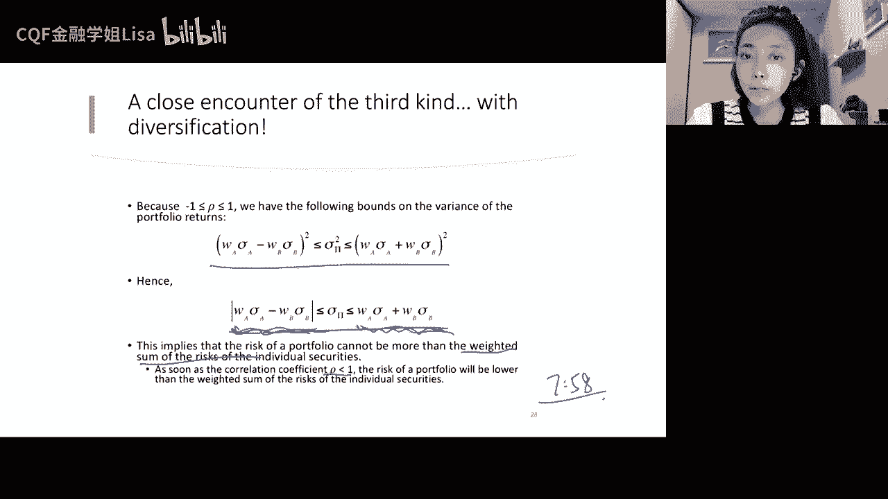

好，然后我们刚刚说我们说这个机会集，上半部分才是有效的对吧，下半部分是无效的，好那么在这个这个边界点啊，就这个上半部分和下半部分的这个边界点，也就是这个组合啊，这个组合就是我们这条曲线上的最左边的点。

这个组合的名字叫做global minimum virus portfolio，叫做全球最小方差组合，然后简称就是GMVP啊，GMVP这是它的一个简称，然后呢，这个gm VP的权重的表达式是这样子的啊。

但是嗯在这节课我们没有去推推，为什么它长成这个样子，但是我们在下节课，去讲那个最优化的过程的时候，我们会把它就我们会看到它的一个矩阵形式啊，可能不是这样的一个形式。

但我们会看一个矩阵形式的这个它的一个权重，好，然后呃这个机会集在我们的GMVP这个组合，上半部分的，就这半部分它有一个特别的名字叫做有效前沿，Efficient frontier，有效前沿。

这也就是他上本次，那么这是一条非常非常著名的曲线哈，比如说我也会把它叫EF还有效前沿，那么同样呢就是这个是A点，这个是B点啊，所以还是对吧，他们之间哈G中间的组合long a long b啊。

这边的组合就是short b la对吧，然后这边的组合就是啊sha lb啊，好，所以呢这条线，这条线它反映的其实也是我们的这个权重啊，不同于在A和B之间去做不同的权重分配。

那么就可以得到我们这条有效前沿上的，不同的点啊，不同的组合，然后另外就是这条线，它其实也只画了一个roll的情况啊，我们也不知道这个肉是多少，但是啊还是我们说一定随着肉的改变，我们这条有效前沿的形状。

一定是会发生改变的好，所以我们可以看一下它的一些典型的情况，比如说如果你的肉等于一，如果A和B之间的相关系数为一，也就是这种同步变化了，对吧嗯，那么这条线就这条有效前沿啊。

A和B之间的有效前沿就是这样一条直线，好就这样一条直线，所以这个时候你会发现就是呃，当ROAB为一的时候，我们的这个mp西格玛派，他们里面的这个RARB啊，就是A和B的回报率以及这个标准差。

其实都是线性的，他都有线性的，所以这个是肉等于一的时候啊，肉等于一两个资产完全相关的时候，完全正相关的时候好，所以当你的肉等于一一的时候，那么你要去构建组合对吧，这个是A这个是B，所以你能够构建的组合。

如果long a long b的话，就在这里，然后long a说B就在这边，然后说a long b就在这边啊，所以你能够构建组合就在这条直线上好，然后另外如果说另外一个极端，当我们的肉等于一的时候。

好一的话，那我们这条线就会呈现这样一条折线，这个是A这是B啊，这个时候他们俩构造的这个有效前沿，就是这样一条折线好，所以你看这个折线的话呢，那就会告诉我们说，AA和B这个时候它们结合在一起的这个组合。

它是可以去达到方差为零的，对就可以实现一个零风险的组合啊，这个推导我们也忽略啊，啊并且呢我们说这个他们俩之间哈，如果结合达到的这个风险为零的组合，它的回报率我们可以把它叫缪派啊。

这个mp就应该等于R就是无风险利率啊，因为无套利的原则嘛，如果说你可以通过A和B，去构建一个无风险资产，那么它就应该是赚取的是无风险利率，否则就会有套利空间好，所以就是啊你要浪A浪B的话。

那你实现的就是这几个这些组合，然后你要说b la就实现这些好，你要这个啊说A浪B对吧，你就实现这些嘛，好这个是两种极端，那如果说你这个，如果U等于零呢对吧，如果A和B之间的相关系数为零好。

那么这个时候呢你得到的这个有效前沿啊，它就长成这个样子啊，所以你看看啊，可以看到就是RO取不同的值的时候，你的A和B这两个资产构建的组合啊，它们的有效前沿会呈现不同的形状哈，好所以呢我们就可以去啊。

把那些所有的哈，就是不同的相关系数，所对应的这个有效经验都给它画出来，然后来看一看到底有什么样的一个变化好。

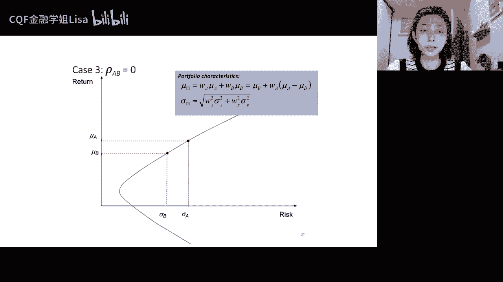

所以这边呢就给我们提了啊，这边也不是所有哈，就是给我们画了相关系数为零的，然后相关系数为0。5的，相关系数为0。8的啊，所以为零的就是呃这个蓝色紫色的这一条，然后为0。5的就是红色这一条，然后为0。

8的就是绿色这一条，然后你也可以自己去补充一下，肉等于一和一的情况对吧，如果说肉等于一的话，那么就是他们俩之间的直线吗，对吧，这个是Z等于一的，然后肉等于一的话呢，那就要折一折对吧。

你可以随便在那折一折，啊这个是U等于一的情况好，所以好这边的话我们就看到了不同的RO，我们的有效前沿的形状是不一样的，所以你可以大概感觉一下哈，你可以感觉一下，当肉越大的话，这条线它是越靠右的对吧。

肉等于一，然后肉等于零，U等于0。56等于一，所以当周越大的话，我们这条线呢会越靠越靠右，所以呢我们的这个就是在A和B之间的，这个区域，就是你一部分钱投A，一部分钱全投B哈。

就long a long b的这种情况，那很显然三关系数越小越好对吧，你要浪A浪B的话，那你肯定在相同的回报率之下，肯定是相关系数越小的，风险越小好，但是如果你不是在这个区域内，你不是浪一浪B。

而是你会让一个shot，一个就是你有可能会在这边，或者你会在这边，那么这个时候你会发现诶，是不是相关系数越大越好对吧，你会发现在这边的话呢，那相关系数是不是越大的，你在相同的回报率之下。

它的风险越小对啊，同样在这边也是一样的啊，这个相关系数越大的，你在相同的回报之下风险越小好，所以呢其实我们平常所说的哈，这个越翻越分散越好对吧，这个相关系数越小越好，这个警示就是针对的是你纯做多的时候。

但是但凡你要去做空啊，但凡你要做空，那么就更适合去选择更集中一点的，就是相关系数更大的，比如说你针对同一个行业的股票，你去shot你不看好的，然后去让你看好的，那么这就说明他们这两个资产肯定相对。

就比较大啊，你让一个shot一个你的表现啊，你这个组合的表现才会比较好的好，这个就是在不同的相关系数之下，我们的这个组合的一个表现好，然后接下来我们说研究完了两个资产对吧。

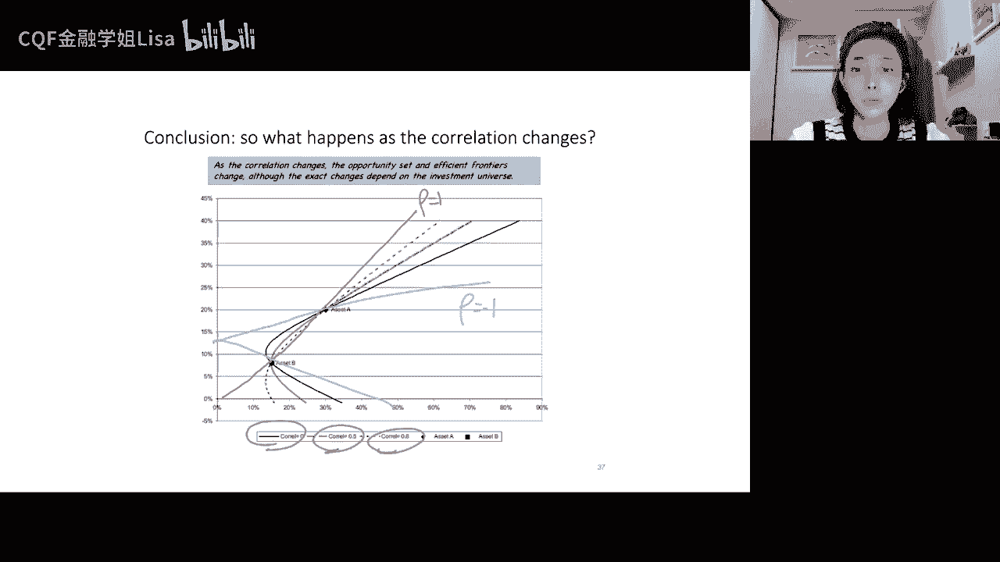

我们研究了一个risky跟risk free，然后还有一种就是两个risky，然后接下来的话，我们就要去把这两种情况给它结合在一起，好就是我们啊要考虑三个资产了。

就是我们要重新把这个rise free再给它引入进来，所以这个时候呢就是我们有两个risky，一个A1个B，然后呢还要把risk free呢给他拉进来，就我们就还是要分步来完成。

那首先呢先把A和B结合在一起啊，把这个A和B结合成一个risky，所以首先因为A和B都是risky，好我们就先把两个risky结合在一起，那么A它的权重是W，AB的权重是WB啊。

所以呢我们这里得到的一个portfolio，它其实就是个risky portfolio，如果把它写成P，还有一个risky for folio好，然后呢我们得到这个risk folio之后呢。

我们再去把这个risk folio呢，跟risk free assets去集合在一起，对，把他们俩在结合在一起，那么这个时候呢risky performer算W，然后呢risk assets占一减W。

然后这个呢就是我们最终的这个派，这是我们最终的这个组合好，所以啊这样的话呢，其实我们就可以画一个表，去呈现一下，他们之间的这个每个资产的权重的情况，那就是INSE，还有这个是weight。

好所以我们有a b break free assets，好整个就是我们的portfolio，他们俩加在一块，他们三个加在一块，就是我们的这个portfolio pie，然后这个是我们的weight。

那么A的weight其实应该是WA乘以W，然后B的weight就应该是WB乘以W，然后呢这个呃，因为WB其实就是E减AE减WA对吧，等于W乘以E减WA，所以就等于W减去W乘以WA。

好然后rise free asset其实就是一减W好，这就是每个资产的一个权重，所以他们三个资产权重甲相加，这个应该是等于一的，好这就是每个资产的权重的情况，好让我们来看一下，我们现在就是三个资产。

那么这三个资产这条有效前沿，他画的就是A和B构成的有效前沿，那A和B构成有效前沿，然后呢基于这条有效前沿，我们在找出一个risky folio对吧，有基于这个有效前沿，我们可以找出一个risk。

就是在这条线上啊，肯定在这个VP上面嘛对吧，有效显示这上半段，我们在这上半段呢去找出一个PFOLIO，一个risk portfolio，然后呢，我们再拿这个risk folio。

去跟我们的risk free无风险资产去结合，然后再来构建一个新的组合，然后这个时候我们前面就见过了对吧，你把一个risk free跟一个risky去结合，其实就是会形成一条直线嘛。

好所以呢如果说比如说现在我们就随便找一个，我们随便找一个点，就在这个有效前沿上，就随便就找一个点，找这个点，我们把这个点叫做P，然后我们把这个risk folio，它可能就是sha lb得到的，对不对。

这个是sa long b得到的，然后我们把这个performer呢去跟R2去结合，那你结合的话就会画出这样一条在这个点好，反正就是对吧，结合就会啊，这就是有这样一条直线好。

所以呢就是如果说你选择了这个P点，这个P组合也就是在short a，这个P是通过说a long b得到的，然后呢你再把这个P组合跟raise free去结合，那么新的这条直线它其实就是叫做。

其实就是新的有效前沿啊，新的有效前沿，然后呢在这条线上，我们又可以去随意的去选择一个点来投资，就在这条线上，比如说你现在又选择了A我想投这个对吧，因为这条线上的每一个点，其实又是在P和R之间去分配权重。

所以现在我就想投一个P1撇，那P1撇呢其实就很明显他是在通过short r，然后LP来完成的对不对，或者说那我想选一个这个点，这个P就是P两撇，撇两撇，这个它其实就是在long r，然后LP来完成了。

对不对，所以说你这条直线上面的每一个组合，都是你可以去再去构建的，就看你怎么在R和P之间再去分配权重了，好所以这个还是比较清晰的，但问题就是，我为什么要选择P这个组合，来去跟R2进行结合对吧。

我这条啊红色的这个有效前沿，efficient frontier上有这么多组合，我为什么要选这个点，我为什么不选其他的对吧，那上面的会不会更好啊，好所以呢其实你也可以选其他的，你也可以选这个点啊。

这个P去跟R去进行结合啊，你也可以继续换继续换啊，所以呢其实你会发现啊，到底哪一个是更好的对吧，那到底哪个是更好的，其实很简单，你比如说你就竖着，画一条直线，竖着画一条直线，那么这两这两条新的有效前沿。

他们会就是相同的这个风险之下哈，啊上面的这条线，它所对应的这个组合肯定预期回报是更高的，所以呢对吧，我们都是在相同风险之下，我们是要去追求更高回报的组合的，那我肯定要想尽办法去让我的这条直线。

越越往上越好啊对吧，越往上越好好，所以呢其实啊越往上越好，斜率也是就是越大越好对吧，就是你的这条直线斜率越大越好，这个是我们肯定是在筛选的时候，肯定要考虑的一个原则啊，所以你可以看到这边。

你可以选择这个P去跟R2结合，你也可以选择这个P去跟R2结合好，然后你会发现我们越往上它的斜率越高，斜率越高，其实也是他的这个increase efficiency，它的有效性也是越高的。

所以呢我们最佳的那个P，显然就应该是在我们的这条有效前沿，跟R的切线上对吧，就应该在我们的有效前沿，跟R从R出发一条直线，它跟我们的有向前沿是一条切线，这个是我们能够达到的斜率最大的一条直线了。

反正我尽力了哈，就你知道我是想画一条斜线就好好，所以最佳的P你说这个啊，他一定是在有效前沿和R的切线上，就这条切线它能够实现斜率最大，因为如果说你这条线你再往上面去画啊，再往上面去画的话。

就跟我们的有效前就没有交点了，没有焦点的，就意味着这个上面的组合都是你无法投资的，你无法构建道德组合，也无法接触到的啊，所以就是在我们的这个investment universe当中。

你是无法去实现这些组合的，然后呢这些组合呢又是无效的对吧，你这些组合都是都是无效的啊，所以呢其实我们的这个啊切点，它才是最佳的一个P，就是我们在有效前沿上，最佳的那个risky portfolio。

所以呢这个P点它看起来，就是这个是A这个是B吗，对你这个切线，就比如说我们这个切线在这里，这个是我们的P好，这个最佳的这个P应该就是通过short b，让A去得到的好。

然后呢再去通过分配在R和P之间的一个权重，你就可以去实现我们这条线上的任意，一个组合了好，所以这条线上的任意一个组合都是有效的，话都是有效的，就是你可以去构建比较好的组合好，所以到底选哪个呢。

其实就好看你或者是你的客户的一个偏好了好，那么这个P点它其实有它的名字，叫做tangent cy folio，在这里也是有的，啊这个P，它的名字就叫做TGCPERFORMAL，就是切线组合。

就是其实就是所谓的最佳的risky portal，就是optimal，Risky for foil，最佳的有风险的组合，那么这个最佳的有风险组合，它其实就是通过使得这两条线一条有效前沿。

然后一条啊这条线其实它也有一个名字哈，这条直线它有一个名字叫做CAL，就是资本配置线，那么你让这两条线斜率相等，你就可以推出我们这个tension cy folio，它所对应的西格玛更牛了啊。

这个西格玛T这个T就是tan cy，所以SIGMMATIC和mt就是这个tension，CY和four6，它所对应的风险跟预期回报率，所以它的一个得到的方式，就是通过你让这两条线斜率相等。

然后就算出来了好，所以呢其实我们这里红色的这条线，就是把我们的无风险资产，跟我们的这个optimal risk follow去结合，分配权重的这条线，它其实也它也可以叫做有效前沿。

只不过呢它是一条新的有效前沿，它是考虑了无风险资产之后的有效前沿啊，所以就是红色这个他是考虑了，RF后的流向前沿，而这个这个是什么颜色，这个是黑色吧，黑色的这条线它是考虑RF之前的有向前沿。

因为都是有效的，就是它们它们的区别就是一个有考虑raise free，一个没有考虑rise free，好所以这上面的这个红色，这上面的几个点是怎么样去实现的呢，比如说啊如果你要去实现P这个点对吧。

P这个组合，那你就是啊复利invested in这个optimal risk，follow哈，就这个就是你完全投资于，这个optimal risk for you，然后呢。

这个呢当然就是fully invest in risk free了对吧，好然后中间的话呢比如说这一段，那就是long are，然后long这个optimal risk p folio，我就NP了哈。

Long optimal rik folio，然后外面的就是这个红色这条线，一直延伸出去的，那么它就是short r，相当于以无风险利率去借钱，然后long这个optimal risk for you。

所以呢你想构建的这个组合，到底是在这条线的哪一个点，就要看你或者是看你的客户啊，如果你是一个投资经理的话，你的客户的一个偏好对吧，又主要是风险偏好情况哈，就是一般来说风险越厌恶的话，越厌恶风险的。

他肯定就越想投这边的组合对吧，越想多投一些钱，在R2上，但是呢风险越偏好的，就是风险厌恶程度比较弱的那些人，他们就肯定比较喜欢投这边的组合，就可能杠杆投资啊对吧，去义无风险去借钱。

然后把所有钱都投在投在这个啊，这个optimal risk po上，好这个就是我们的tents for folio，它的一个权重还是它的推导，我们在这节课先不讲，然后我们下节课会讲它的矩阵形式。

然后我们说这条新的有效前沿，它有一个名字叫做CML哈，那我刚刚说的那个是CAL，我再给大家简单的去区分一下，CML跟CAL的区别，这个其实是属于cc的内容哈，因为CCF其实并没有去做这个区分。

因为他没有讲到C也有cl，它的全称叫做capital，Line，然后CML的全称就是这个capital market line，所以中文的话呢就是cl就是资本配置线，然后CML就是资本市场线。

然后他们有什么区别哈，其实啊CML就是一条特殊的cl，然后cl就是所有把risky跟rise free，结合在一起的这个直线都叫做sale，也就是说我不管你是把这个R跟他结合，还是跟他结合。

还是跟随便你跟谁结合啊，反正你只要是把R跟你一个risky结合的，你都叫做CAL啊，都叫做cl，但是这么多条线里面只有一条叫做CML啊，那条CML其实就是这条切线啊，就是最佳的那条cl，就是CML。

还有一条特殊的cl，也就是最佳的cl啊，所以大家以后看到CAL，看到CML你可以大概有个印象啊，他们到底有什么区别好，所以在这儿呢我们c cf里面，其实只他只介绍了CML，也就是这条切线。

就是跟我们的这个tension cy foli啊，相切的这条切线他其实就叫做CML，就是资本市场线，所以这条资本市场线。

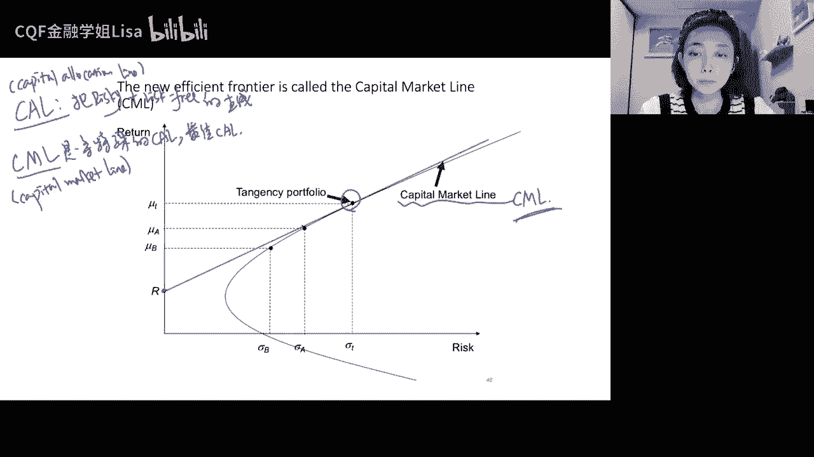

它其实就是一条改善的有效前沿，所以因此其实这里啊。

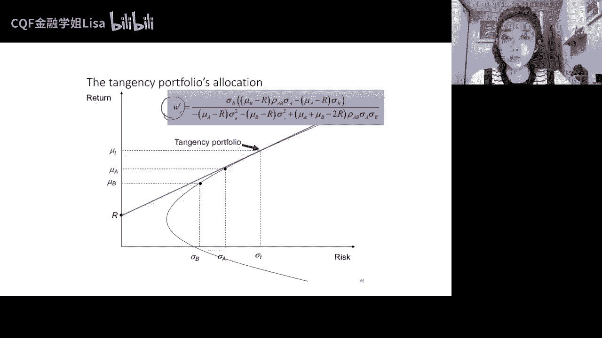

对我这里的红色的就是CML，然后黑色的就是传统的EFFICI双体。

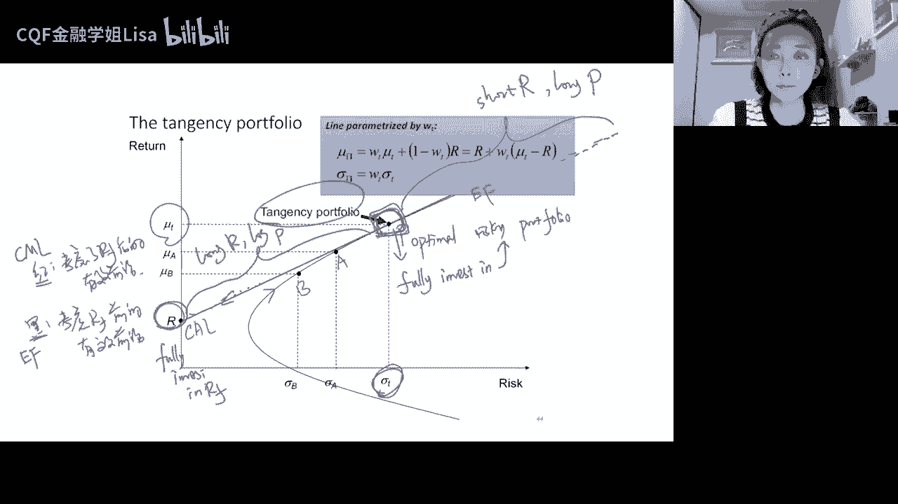

好所以你可以把CML就叫做新的改善的啊，New and improved，efficient frontier啊，新的一条新的改善了的efficient，Efficient frontier。

就是CML，好我们可以稍微看一下这个这个tension support follow，已有的教材会把它叫做market pfolio，市场组合，我们可以来看一下这个market folio。

它的SIGMMT和mt，就是知道他的sigmt mt之后，我们怎么样去得到，就是用R和P去结合啊，这个新的组合，他的这个回报和这个风险的情况好，也就是说现在我们有一个组合派，我写在这里哈。

然后这个派呢它是嗯W的权重投资，投资于这个TINGENCYPERFOR，那么就是一减W投资于这个rise free assets，那就是在他们俩之间去做权重的分配好，所以呢我们的mu p就是加权平均嘛。

那我就直接用刚刚的那个我们见过的那个嗯，移项之后的那个公式就是RF加上W乘以六，因为它对应的是mt好mt所以mt减去R吧，这个是他的excess return或者是premium风险溢价好。

然后呢西格玛西格玛派，因为他这个R是无风险的，所以西格玛派呢其实就是拿W去乘以，这个西格玛T就好了好，那么这个就是我们把R跟这个P结合在一起，这个组合的一个预期回报，跟预期标准差之间的一个这个关系好。

然后呢我们就可以去啊，这边还是给他一个项，W等于西格玛派除以西格玛T，然后我们就把这个W呢给他带到这里去好吧，带到这个W里面，所以我们就可以得到说没派，就等于RF加上西格玛派除以西格玛T。

然后乘以mt减二，然后再给它一个像我们把这个嗯，把这个R给他，再给他移一下，new派，就等于RF去加上这个是mt减去R，就是我们把这个给他放到分子放到这里来，然后除以西格玛T。

然后把这个西格玛派移到右边来，好那么这个呢其实就是这条线的一个表达式，就是这个CML它的表达式，所以你可以看到这个CML对吧，横坐标就是西格玛派这个组合的标准差。

然后呢纵坐标呢就是这个mp就相当于这个是X，这是Y好，那么截距就是这个RF对吧，这个就是它的截距好，那么它的斜率是不是就只剩这一段啊，所以这条线的斜率就是我们P这个tendency，For folio。

它的回报，预期回报减去无风险利率，再除以这个P的标准差，那就是tan po6标准差对吧好，那么这条这条线这个这个斜率对吧，如果大家有印象的话，应该第一时间就会想到夏普比率嘛，对不对。

它的斜率就是夏普比率好。

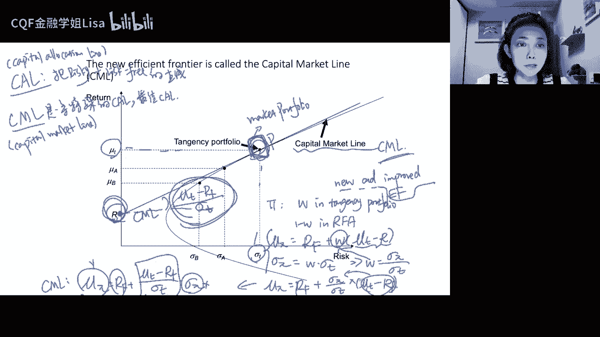

所以我们可以看到这个就是他的表达，然后我们就可以把这个就是大名鼎鼎的SHERCIAL，我们就可以用S4啊，用T来表示，这个st就是下par，好，所以我们这个CML的斜率就是下PARATION。

是夏普比率，我们知道夏普比率其实就是拿超额回报，来除以风险，所以他肯定是越大越好的，所以这也是为什么，我们说刚刚我们在选这个不同的CAL的时候，我们肯定要选斜率最大的对吧。

所以斜率最大的其实就对应的是下部比略大，所以这个其实也是一致的好，所以呢啊这个就是我们看到的啊，这个跟CACML有关的东西啊。

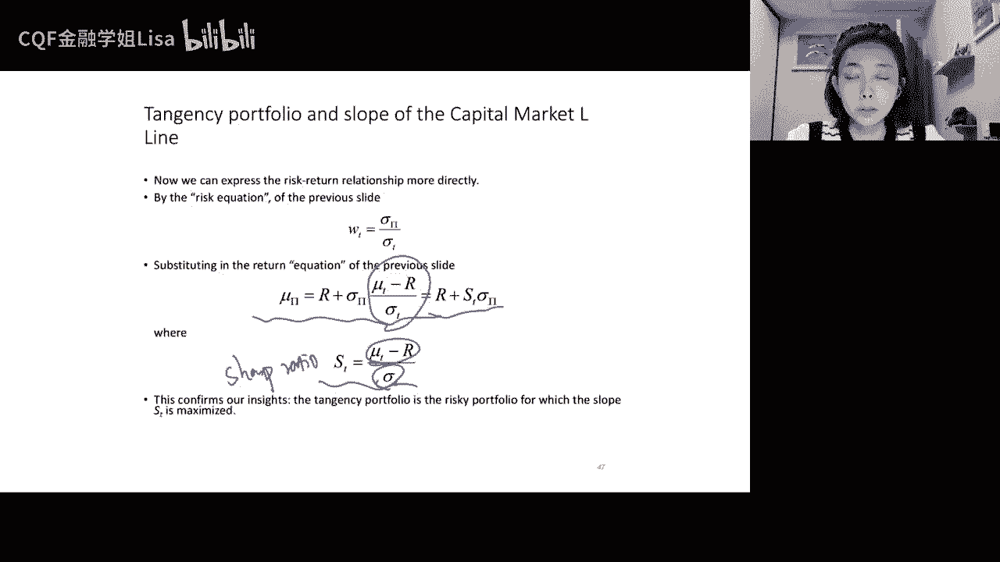

所以它的斜率是什么，它的结局是什么好，所以这个斜率越大，夏普比率越大，就说明它的组合是越有效的啊，所以这就是我们的sharp。

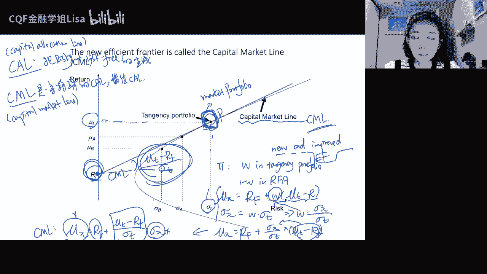

所以separation就是对于任意一个资产下，PARATION就是拿他的回报去减去无风险资产的回报，然后再来除以这个资产的一个标准差，那么就可以得到他的一个SUPRECIAL了。

所以就是他单位风险之下的超额回报啊，就是用用这个下坡手来去衡量的好，所以对于这个super是我们可以看到哈，就是首先从图形上来看，它就是把这个risky asset，跟rise free结合起来的时候。

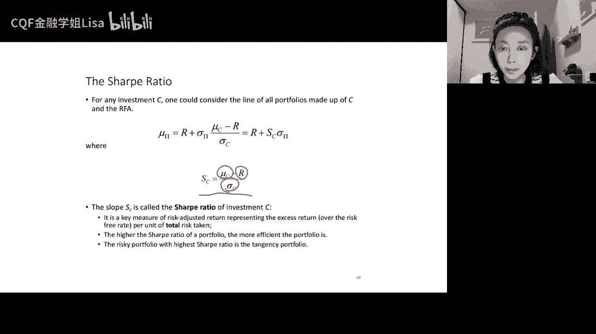

得到的这个直线的斜率，然后呢协力越大组合越有效啊，所以等价过来，当我们说separation越大，其实就是说我们的这个组合越有效好，还有就是这个sharp呢。

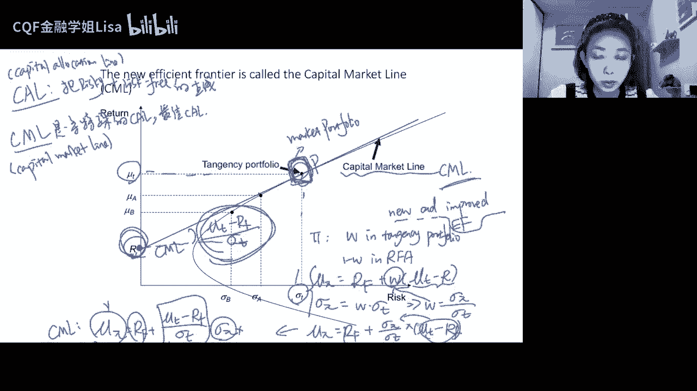

它是这个风险调整的回报率对吧，它调整的风险就是C嘛，它是风险调整后的回报率，所以从公式上来看，它就是单位风险所对应的风险溢价，它其实就是一个性价比，然后承担一单位的风险，你会给我多少的一个补偿好。

还有就这边有几句话，他说啊，这就是adjust return是吧，这个我们刚刚说了，然后下课数越高，组合就越越有效啊，然后呢，这个最有效的就是我们的high，下creation的下一个比例。

最高的那个risk folio，就是我们的TINGENCYFOLI，好这就是我们的CML哈，它当中的要素非常重要的，下一步比喻，好然后这边这一块没有讲，那就是说当热为一的时候对吧，我刚刚有画过这个图。

当热为一的时候，你把A和B去做一个权重分配，它会得到这样的一条有效前沿，那它的一个比如说当你的风险，这个组合的风险为零的时候，它的回报率必须是R，否则就有套利啊，这就是他这边想要说到的。

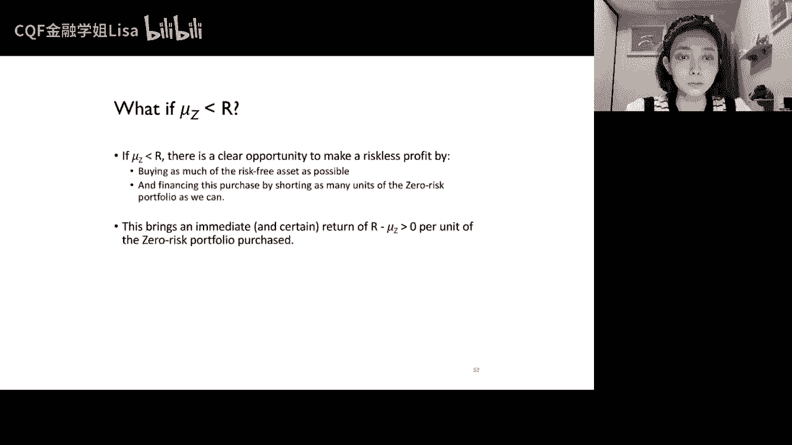

所以就这，啊这就还。

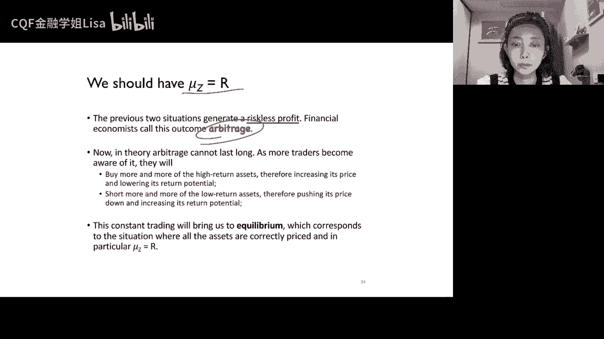