# 2024最值得学习的金融量化交易课程-第八讲：Value at Risk & Expected Shortfall - P1 - CQF金融学姐Lisa - BV17K421Y7BD

晚上好哈，然后这节课的教授叫做STUARTJACKERMAN，然后他给到大家他的邮箱答案，如果有问题的话，可以问他，Stuart check，Arma，然后也是G6。

嗯然后这位教授他是CCCIAFM的执政人，然后他今天就是他讲到的这个课的，有些内容呢其实是有去嗯，就是引用cc的这个部分的材料的，然后我们今天晚上讲的这个外来risk，就是在线价值。

expect you for的话，可能翻译成预期缺口啊，那么这个在险价值和预期缺口呢，就是他们的数学推导不多啊，这节课的数学推导不多，就只有一小部分，然后嗯这节课还是对风险管理的概念有很多的。

就是概念上的一些讲解，然后这位教授呢，他是从07年开始做这个量对冲基金的，这个量化方面的工作，然后从2017年开始去做这个market trading，相关的一些这个工作，然后我们首先要看的话。

就首先引入的第一个问题就是什么是risk，那就大家可能对风险的理解都是不一样的，那么在很多年前哈，就是有一个叫做frank night，就nation吧，这个nation。

然后当时这位学者提出说风险是不确定性，然后呃也不知道他所处理的这个分布是什么，然后这个呢就跟我们说的，有一个词叫deterministic对吧，跟这个确定性的都是相反的哈，相对的。

那么deterministic呢就是我们我们不知道啊，什么会发生，但是慢慢的呢，就是我们发现，其实风险它并不是一个简单的数字呃，他不是简单的拿什么标准差呀啊，就能够去描述的。

那么风险呢他应该就是它的定义啊，从它的定义来看，它应该是这个一个负面结果发生的不确定性，然后这个负面结果通常就是损失嘛，所以他们的一般来说这个risk，它可能有一个就是probability。

然后一个就是negative，好负面影响的不确定性，也就是它应该包括negative Impact，以及它发生的概率，那么对于这个风险管理呢，啊教授说非常重要的一个，就大家需要理解的一个东西。

就是你要知道风险管理，它应该是一个动态的过程，就是它不是静态的，我们去面对不就是不断变化的情况哈，就是而不断变化的市场，我们需要不断的去做反应，然后能够去做出风险预警。

所以呢这个风险管理不是说啊你拿模型算出来，这个损失发生的概率就结束了哈，就是啊，它它是一个你需要去时刻关注的一个过程，然后它里面会涉及到啊数学啊，然后也会涉及到心理学相关的一些东西哈。

比如说人们对损失的厌恶啊之类的啊，所以这个是首先对risk有大概的了解，然后这个是对RX的，这个是啊，这个是牛津字典，它可以啊risk的一个解释哈，他说risk就是exposure to danger。

就是对危险的敞口，然后下面也是引用了这个道格拉斯的啊，这一篇这个文献啊，提到了关于风险管理的这个概念，那么还有说啊，风险管理其实就是对啊风险的识别，然后测量评估嘛，以及对风险的一个这个优先排序。

然后呢去啊协调的经济的啊，去应用资源啊，目的呢就是去最小化或者是去监监的监控，而且控制这个不幸这个不幸事件的呃，概率和它的影响，或者是最大限度的去实现机会，这个是他对风险管理的一个定义好，那我们说嗯。

它这里面呢其实就涉及到三个步骤哈，三个主要的步骤就是识别风险，然后测量风险，还有就是就是排序风险，那么识别风险呢有很多种风险对吧，其实我们也会看到什么市场风险，信用风险，流动性风险等等，还有不同的风险。

然后呢评估风险，我们再去测量这个风险有多大的时候，就是不同的风险种类，你的这个评估的方式也是不一样的，比如说啊你可能对于市场风险对吧，你可能有什么挖呀，expect for呀对吧，一些什么样的指标。

然后你对信用风险哈，你也有什么什么信用评级啊，信用违约概率啊等等的一些这个指标哈，所以不同的风险它的指标是不一样的，然后还有就是排序风险，就是哪些风险是最致命，最急于被管理的好，那么这个呢。

就是我们风险管理的三个非常关键的词，然后总之的话呢就是这里的核心还是在强调，就是风险管理，它它是一个过程，就是它不是一个你做了就不管的事情啊，它是一个你需要不断的去啊这个呃更正，不断的去盯他。

不断的去更正的一个事情，然后呢，就是教授说你不能去沦为这个模型的啊奴隶，因为这个也是啊，这个也是给大家一个提醒，就是你不要觉得自己好像用数学啊，用模型算出来的结果就完事儿了，所以有的时候呢就是风控。

它不在于你的建模能力有多强，而在在于一种叫做直觉哈，叫做一门艺术，因为教授说，很多做风法的人其实都是悲观主义者好，这是风险和风险管理的概念，然后我们来看一下啊。

这边其实就是引用了cc的practical，get to remind这本书，这本书也是在我们的这个补充材料里面好，这就是我们说对于风对于金融风险，那么教授呢他推荐了这本啊，cc的这本呃说明书吧。

然后这本书呢啊有60%的内容在讲定性，然后40%的内容在讲定量啊，再讲模型，然后呢这个也是教授推崇的，就是你在做风险管理的时候，应该60%的这个精力啊，可能应该是放在定性上，40%放在这个定量上。

然后这边有提到是我们的risk measurement，我们的风险评估，风险测量有三个目标，那么呃这个第一个目标呢，就是这个揭示已知的风险好，那么这边的话，我们要给大家介绍一个叫做风险象限。

就是风险的四象限，那么这边的话呢它的纵坐标呢，就是你这个知道还是不知道，是动词，然后横横坐标呢，就是这个风险到底是已知的还是未知的，所以只有这样的四象限啊，这就是啊已经知道已知的风险啊。

这个是不知道已知的风险，这个是不知道未知的风险，然后这个是知道未知的风险啊，所以啊这个已知的风险，已知的风险呢，其实他的意思就是你通过学习啊分析，可以去确认和理解的风险。

因为这些风险呢在过去已经可能被自己，或是被其他公司体验过了，那么这些风险呢不是特别明显的原因，可能是因为比如说组合的规模，或者是组合的多样性啊，但是呢他们都是可以由我们的勤奋，去被揭示出来的好。

所以这是noon risk，然后这个这个风险四象限啊，其实是嗯，这个就提出这个四象限的人叫做donald Rush bd，Do not，没有人I，就是他提出来这个风险认知的思想性。

所以NO one就是已知风险，意思就是通过学习和分析，可以去确认和理解的风险，然后嗯他就是过去已经啊经历过的风险，然后unknown呢就是过去没有经历过的啊，就是应该是对未来的未知重写，没有被经历过。

那我们的目标呢其实就是要去扩大这个领域，就这一块NO unknown risk的这个领域，然后想办法想办法去理解更多的未知风险，然后呢去减少啊，减少这个领域，就减少你不知道的未知风险的这个领域。

然后这个是我们的第一个目标，就是揭示已知的风险，然后第二风险呢就是呃让这个哈making the known，Risk，Easy to see，就是让已知的风险能够更容易的被看到，被理解和被比较。

也就是去有效地去展示风险，所以要做这个呢就需要去去做沟通，也就是需要一些指标，比如说我们的日常生活当中对吧，你我们其实有很多的一些风险预警的指标，比如说我们啊这个开车的时候，路上就红绿灯是红灯的话呢。

就会告诉你啊，你现在开车开车过去，你发生车祸的概率就会比绿灯要来得更高，所以呢这个红绿灯，它其实就是我们日常生活当中的一个，风险预警的指标，然后呢。

我们今天会学到的这个why就是value at risk啊，它也是一种典型的风险指标啊，其实还有很多，包括像这些啊这个啊回撤呀啊，包括我们今天要学的expecting loss呀。

这些其实都是一些啊去沟通风险的一些东西啊，让这个风险能够被更轻易的被人们去发现啊，被更轻易的去沟通好，这个是第二个目标，然后第二第三个目标呢就是try to understand。

And uncover the unloans，就是要去试着去理解和揭示一些，未知或者是无法预测的风险，比如说黑天鹅事件，那因为他们曾经没有被体验过，所以呢就很难理解和预测，所以随着时间推移呢。

就是过去未知的风险会慢慢的被我们认识，但是同时呢也有越来越多新的未知风险会出现，好这个就是啊他这个对测量风险的三个目标，然后接下来的话呢我们在啊。

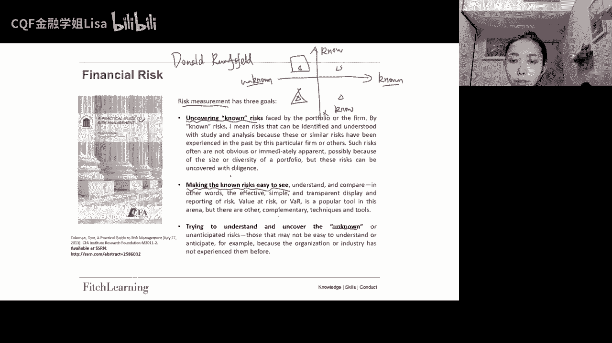

就是前面的我们其实都是站在啊实践的角度，告诉大家一个非常重要的观点啊，就是风控它不是单纯的模型，它是一门艺术，还需要不断的去总结，去这借鉴经验对吧，一个动态的过程。

然后呢这里呢我们就要来到学术的一个角度哈，我们来看看这个风险的公理，啊风险的公理，那么公理呢其实就是呃无法证明，就感觉像是无法证明你的常识，比如说像三角形对吧，三个角的这个度数加起来等于180度哈。

这个其实就是也就就是一个公理，那么在这儿我们来看一下哈，就是风险的功率有哪些，就是如果说他这边说，如果这个风险度量R用R来表示一个风险度量，不管你是标准差还是什么哈，你是一种风险度量。

然后他说如果这个风险度量而满足以下的性质，那么它就是coherence，他就是一致的，那么它有哪些性质呢，首先第一个就是单调性，第一个是单调性，也就是说他说如果组合Y啊永远大于等于X。

那这个主要是指的是价值或者是收益啊，啊如果组合Y的价值或者收益永远大于等于X，那我们就可以说Y的风险度量，是要小于等于X的风险度量，所以就是稳你稳定的赚的越多，那么你的风险就越小好这个是第一个单调性。

然后第二个是这个次可加性啊，也是这个里面我们尤其要强调的，因为我们一会儿会发现啊，Value at risk，它是没有满足这个词可加性的啊，所以啊可加性的话其实就是等号，然后呢次可加性就是小于等于好。

那这边就是说呃这个就是X和Y构成的组合，X和Y构成的组合的风险，小于等于X和Y各自风险的加总，那小于等于就表示绝对绝对不可能大于，所以这个呢就跟分散化是一样的一个逻辑对吧，我们之前说过。

如果两个资产的相关系数等于一的话，那么这个组合的风险就是两个风险的加重，但是只要相关系数是小于一的，那么这个组合的风险就应该是小于两个资产，风险的加重的，所以是小于等于好，但是这里就是我们需要注意的。

就是这个袜它是不满足这个刺客夹心的好，这个是第二个，然后第三个叫做正齐次性啊，正齐次性，标准差为什么没有满足第一点呢，如果说你真的找到一个资产，比如说一个Y它是没有什么风险的。

然后它的收益又可以永远的超过X的话，那Y的标准差也是小于X的呀，好那我们再来看第三个哈，正极自信，他说我们对于一个常数H，然后这个H大于等于零，然后我们把这个就是相当于是。

我们把这个资产X去乘以这个H乘以H，其实就给它放大嘛，放大H倍，然后放大H倍之后，它的这个风险度量，就是把X的风险度量去乘以H，这相当于就是一个呃加杠杆的效果对吧，就是比如说你一开始是10万块钱的本金。

让你可能损失1万块钱，那你加杠杆对吧，你现在加杠杆加杠杆变成50万的本金，那么你的损失可能也有啊，5万块钱对吧，所以这就是哈这个H就相当于是在加杠杆，这是正齐次性。

然后第四个是嗯translation envirance啊，就是转移不变性，那么转移不变性的话，他的意思是对于无风险金额N，这个N是一个无风险的一个金额，然后把这个金额啊。

就是把资产X去加上这个无风险的金额，N加上这个无风险资产的这个损失哈，就是他的这个组合加上这个N的这个风险哈，它的风险度量，就等于拿X本来的这个风险去减N，所以你可以把小孩是损失也可以啊。

X加N合在一起的损失，就应该等于X的损失去减N，因为N是没有风险的好，所以呢这里的话呢就是因为认为N是无风险，不会承受损失的，所以N可以用来去抵扣X的损失啊，所以这个啊这个公理哈就是有点儿这种蛋生鸡。

鸡生蛋的这种感觉哈，他是拿风险的描述来定义风险，就是你满足这些性质的风险，就是coherent，就是你对这个性质有个印象就可以了，就是有些有些风险指标它是一致的，有些不适。

好让我们再来看一下这个风险的识别，这到底有什么样的一些风险好，那么这边也是参考的是这一本essentials of this management，这本书。

然后呢这本书它是把风险分成了financial和non financial哈，就是金融和非金融或者财务和非财务，那么首先来看一下这个金融风险，那么金融风险的话呢。

我们最熟悉的应该就是market risk跟queries，对吧啊，当然我们嗯还有一些这些还有一些教材，它是把liquidity risk，也是放在financial risk里面的。

好那这边的话market risk，market risk呢其实又可以把它叫做price risk啊，价格风险就是它是由于这个供求关系的变化，导致价格变化的风险，所以比如说当你这个资产是股票的时候。

把股票价格发生变化的风险啊，当你这个资产是嗯货币的时候，对货币的价格就是利率，所以利率发生变化的风险，然后当你这个资产是外汇，外汇的价格就是汇率对汇率发生变化的风险，以及当你这个资产是大宗商品的时候哈。

大宗商品的价格发生变化所带来的风险，这些都是我们的market risk，所以呢我们的market race，它其实就是由供求关系的变化，导致价格变化的风险。

所以market race呢它对应的模型呢相对来说更简单，就它一般都还是有去遵循这个随机过程，然后构建随机模型，所以呢我们在market risk这一块呢，因为大家那就是人们对market rex。

研究的历史是最悠久的，就我们在market race里面呢也也能看到啊，最多的一些量化模型就相对比相对QUERRISK，相对liquidity，Risk，相对operational啊。

相对操作风险这些风险来说哈，就是market race是被研究的更透彻一些的一个风险，所以我们有更多的一些理论，可以在这去展开学习，然后我们今天要学到的one和expected short for。

其实都是属于这个market risk的啊，他们的这个market risk的指标好，然后呢这边我们的市场风险啊，还有分这两种，就是一个叫做training risk，叫get risk好。

那么一般来说呢，这个嗯就是trading risk里面哈交易风险，它里面又分了一个是generic market risk，一个是specific risk，就是这个其实就是系统性。

然后下面的就是非系统性，好所以呢系统性风险其实就是市场风险对吧，我们用一般用beta来表示系统性风险，就是会影响几乎所有个体的这个风险，比如说利率下降啊，宏观经济的影响对吧，这都是系统性风险。

然后呢非系统性风险呢，其实就是啊这个公司特有的风险对吧，只会影响这些公司，或者只会影响这个行业的风险，那么非系统性通信我们一般都是用的是EPS，还用ESIM去表示的，然后呢嗯我们的还有一个叫总风险对吧。

我们的这个有个总风险，用标准差西格玛来表示总风险，它既包含系统性，又包含非系统性，所以我们的波动率标准差，其实就是衡量的是总风险好，然后还有一种就是我们的市场风险，还有一种叫做gag risk缺口。

那么这个主要是对一些就是需要做资产，负债管理的机构比较重要的，比如说银行，保险公司啊，资产管理公司啊，这些是比较常见的，就是他们的资产和负债之间有缺口，看这个主要是指asset跟LIBRITY。

比如说银行的资产一般都是一些，就是贷款期限会比较长，30年20年，但是负债负债的话就是主要是存款啊，存款的话呢之前就是就比如3年两年，一年对吧好，所以它中间就会有这样的期限错配。

然后期限错配呢就会导致利率波动，对资产和负债的影响是不同的，那么这个就叫做gap risk好，然后接下来是亏了risk信用风险，那么信用风险的，你也可以把它当成是违约风险对吧。

就是违约风险是当中最典型的就是违约风险，那么违约风险呢一般都是用expected嗯，Loss，就是预期损失去衡量，这个公司或这个主体的信用风险到底有多大，所以我们的expect your loss。

通常就是等于它的违约概率对吧，Probability of default，然后乘以它违约之后的损失乘以lost given default，对一般还会成一个exposure啊什么的对吧。

就是你把违约概率在乘以你违约之后的损失，再乘以你的敞口，那么这个就是你的预期损失啊，预期损失越大的，那信用风险很久可能就越大好，那么这个信用风险里面包含了，比如说像交易风险，那么交易风险呢。

其实就是比如对方还着还着就不想还了对吧，这就是交易风险，然后还有一个就是组合集中度过高的风险，比如你比如你作为一家银行，你放贷都贷给同样一个行业的一些实体的话，那么你这个就叫做组合过于集中。

那么也会给你带来一些啊，如果他们这个行业出问题的话，就会给你带来很严重的信用风险敞口，不太理解，敞口就是暴露在风险管理之外的头寸，你可以这样去理解，比如说你买了1000块钱的股票。

对你买了1000块钱股票，然后呢这个时候你为了对冲风险，你说了，比如说你啊收投了800啊，就是你本金800的一个期货，那这样的话呢你受的期货对吧，股票价格下跌，你受的期货你是可以赚钱的。

所以呢也就是说这800块钱股票价格跌是没有，对你来说是没有什么影响的，所以呢你对冲完之后，其实就只剩下200块钱，这个敞口是没有去做风险管理的，那么这200块钱其实就是你的敞口好。

所以敞口哈就是这个意思，当然这个敞口就要看看你到底是long还是short，如果你是浪的话，就是你买的这个资产的金额，然后你如果你是short，那就是你借的这个钱的金额，就是你的敞口哈，对就这个意思。

funny其实都是交易风险，但是反正一个这个交易，它是针对的是市场价格变化，然后这个交易呢它针对的是你跟对手方之间，就是对手方不给你还钱对，所以这个这个trading它更多的是买卖。

然后这个这个transaction，更多的是履行合约的那种感觉哈，但其实不用抠的这么细啊，好然后我们再来看下一个就是issual risk，然后issue risk就是债项风险。

然后他跟issual risk呢是相关的哈，issue risk就是发行人风险，所以一般来说发行人一个发行人，他可能会发行多种债券，比如说会发行什么3A级的，发行两币级的哈。

他的这个偿还的优先顺序不一样，所以他会发行多个债项，那么你单个宰相的风险就是医学risk，所以发行人他发发行的某个债项违约的话呢，这个就叫做艺术risk，然后呢，发行人风险就是这个发行人。

他发行的所有债项都会出现一些问题哈，就是你站在发行人的一个这个，整体的这个角度去看，那就叫issual risk好，然后还有就是这个counterparty queries，就是交易对手方风险。

这个主要针对的是OTC的衍生品，Derivative，对场外的一些衍生品就非常比较明显的，交易对手方风险好，那么这些都是一些financial risk。

然后还有一些non financial risk就很多了对吧，比如说像操作风险operational啊，操作风险呢它的范围其实很广的对吧，如果大家学过FM2级的话啊，肯定就知道知道哈。

这个操作风险的范围非常广啊，只要是人和系统以及外部事件导致的，这个风险都是操作风险，比如说啊什么啊内控的问题啊是吧，贪污受贿呀，或者说你这个黑客黑了呀，或者是你系统啊这个宕机了呀对吧，这些包括地震啊。

这些全部都是操作风险，然后还有一些像名誉风险对吧，Repureputational，就是你们公司的名誉受损，然后带来的一些损失，然后还有像一些legal对吧，比如违法的风险，法律风险啊，被对手方告了呀。

还有些像监管风险对吧，regulatory监管风险就是啊违违法违规了，就是主要是主要是违规了啊，就是你被政府被政府这个找麻烦的风险，就是regulatory，然后还有就是像啊liquidity对吧。

liquidity其实很多时候是放在market wk里面的，liquidity的话，流动性风险就又要分你到底是呃资产的流动性，还是你的方便的流动性对吧，资产能不能快速的以公允价格变现。

或者是说如果方便的话，那就是你能不能快速地以啊，合理的融资成本去借到钱啊，这就是我们的funding，我们的liquidity risk，然后还有像什么business呃，strategy对吧。

那什么战略风险呢，还有什么model risk呀，很多很多哈，就这都是属于这个NF的，是risk好，那我们今天的主角呢就是market risk对吧好，所以market就是我们刚刚说过哈。

就是因为这一块的模型研究的更加透彻，然后基本上不会跳出我们熟悉的学习过程，这些数学，那我们来看一下这个市场风险啊，它的一个大概的一个解释，他说啊这个是来自美联储的定义啊，美联储对于市场风险的定义。

那么市场风险就是啊，这个市场价格波动带来的一些金融风险，金融损失，然后他有几个要素简单看一看，比如说第一个要素，第一个要素就是金融机构的收益哈，金融机构的这个损益的一个敏感性。

就是金融机构的收益或者金融机构的资产的啊，资本的经济价值，对利率呀，对汇率呀，对大宗商品价格呀，对股票价格的一个敏感性啊，就是他们的不利变化的敏感性，这是他的第一个第一种第一个要素。

然后第二个要素呢是这个ability of my management啊，就是啊鉴于这个来不同的机构的规模啊，机构的复杂性，机构的这个风险的一个情况，那么这个管理层它能不能识别出能不能去测量。

能不能去监控，能不能去控制这个市场风险敞口的能力，这是他的第二个要素，然后第三个要素是这个啊，这个主要是来自于non trading position哈，就是一些非交易头寸产生的利率。

风险敞口的性质和复杂性，那么这个这个就是哈他这边提到的，就是美联储提到的这三个市场风险的要素，那么如果大家对这个文件有兴趣啊，对这个对美联储的市场风险管理，监管策略和指导，有兴趣的话可以去看一看，好。

那我们今天的while和呃这个expect for哈，都是针对的是这个market risk好，所以呢嗯就这两个都是使得我们的风险，能够更容易被看见的指标，所以首先呢就是value at risk。

它的中文叫做在线价值，那么在选价值呢是在啊，就是1996年的时候哈，这个巴塞尔一，当时巴塞尔一在1996年的时候，把万能纳入了他的监管指标，然后之后呢就普遍使用了，但是one呢本身还是有一些问题的。

我们来看一下这个袜最早是在哪里出现的啊。

这个袜呢其实他的发明的历史啊，最早是被JPMORGAN发明的，就是JPMORGAN呢，是被认为帮是帮助瓦成为一种广泛使用的，衡量指标的一个银行，董事长啊，就是丹尼斯威瑟斯嗯。

他是对他每天收到的非常长的风险报告，感到非常不满，就是他可能每天这个可能下班之前，他的桌子上都会摆了各种各样的风险报告啊，非常非常多，可能每个部门都会给他发一份，然后很厚的。

然后他根本没有时间看的风险报告，然后他认为这个风险报告啊，对他没有任何的帮主，就是他说这个啊，这个报告里面包含了大量的细节啊，尤其是就包含了大量关于不同场口，不同风险敞口的啊。

这个这个希腊字母GREEK的详细信息啊，希腊字母希腊字母就是敏感度，比如说像我们的贝塔对市场风险的贝塔啊，比如说债券的啊，duration对吧，债券的九七也是一个敏感度，然后包括像期权的德尔塔呀。

伽马呀对吧，这些都是希腊字母，所以这些其实都是啊去描述风险的一个敏感度，他说这个这个风险报告哈，其实对他们来说其实没有什么可以，就几乎没有什么用，然后所以呢，他就要求他的员工去采取一个更简单的措施。

还需要他的员工去重点关注，接下来24小时之内的，整个公司的总的风险敞口，而不是说你单个部门单个的给我报一个，就是你需要整个公司全部报一个，然后给到我接下来这24小时，我们公司这个风险情况到底是怎么样的。

然后让这个就是用一个指标去衡量这个银行，接下来这24小时，所有的交易组合的这个风险情况，然后呢刚开始的时候，他的下属表示哈这个是完全不可能的啊，并且呢，呃但是最终哈。

最终他们还是通过采用马克维茨投资组合理论，然后呢发明出来了这个VR的这个报告，编制外的这个报告，然后这份报告呢被叫做4。15的report啊，四点15report啊，其实就是因为他在每天交易结束之后的。

然后嗯就是那么既然这个袜呢，它采用的是马克维茨组合理论，那么就需要使用一些相同的底层的假设，比如说他要用西格玛去衡量风险，然后用平均回报率来作为预期回报，然后认为这个回报是服从正态分布哈。

这些都是马克维茨的假设，那么也是瓦的假设，那么这些呢其实是有可能有模型风险的，好这个就是Y最开始出现的一个背景。

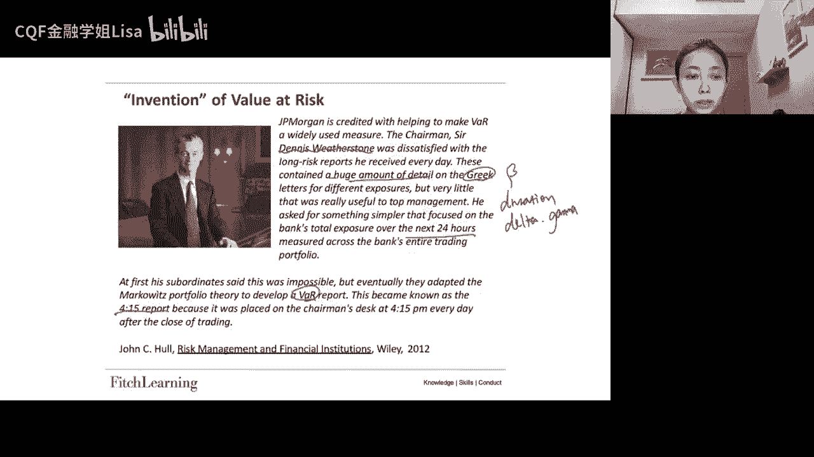

然后我们来具体来介绍一下，到底这个Y是个什么样的指标，好，那么while呢，它的定义里面还是有三个关键词的，就是首先它是有一个specified level of competence。

它有一个自信程度啊，一个自信程度其实就是个概率，然后还有一个他要给定一个period of time，他有一个时间段啊，一般来说哈就是监管的要求，监管资本报告的这个目的哈，一般是要求十天。

然后还有一个关键词是worst close，最差的损失好，所以呢把这三个关键词合在一起，就是Y的定义，它的定义是在给定的智性水平下，就是在给定的概率之下，在给定的时间段内，持有证券或者持有投资组合。

可能产生的最差的损失，这个就是V的一个定义，所以呢嗯我们这边，还有就是他认为回报率服从正态分布，然后自信程度我们可以看一下哈，他这边这幅图，比如说如果这个是一个回报率的啊，return的分布。

然后呢它的质性程度哈，我们用C来表示自信程度，比如说就为定为99 99%，那么这个一减C就是1%，好，那么它的1%，就相当于是显著显著性水平了对吧，这个这个是自信程度，大小的概率。

然后小的概率就是显著性水平，好所以呢在这种情况之下，这个VR就是这个边界点哇，就是这个边界点，所以呢它的解读就是说我们意味着这个啊，如果说哈如果这个Y取的值是比如-0。03，就这个边界点是-0。

03的话，那么它的解读就是我们有1%的概率，一天的最小损失是0。03，这是他的一种解读，你也你也可以解读成99%，就是我们有99%的概率，一天的最大损失是0。03，就-0。03，它总而言就是1%的概率。

一天的损失会超过-0。03这个边界值啊，这个就是我们VR的一个定义啊，所以他就是在告诉你，你到到底有百分之多少概率，你今天或者你多少天之内的损失，还是超过或者不超过这个边界点的。

所以这个就是我们霸的一个定义，所以他这边就有一个example，他说现在有个头寸啊，一个daily v，然后呢dd va是十个million，然后在99%的一个执行程度之下，所以你给它翻译过来。

就是我们有1%的概率，一天的损失会超过十个米，或者你可以翻译成我们有99%的概率，一天的损失不会超过十个million好，那么如果说整个报告期是100天的话，如果你整个报告期是100天。

那就说明在这100天之内，只有一天的损失是超过十个迷人的对吧，然后如果说你整个报告期是一年，比如365天，那么它就意思就是你这365天对吧，乘以1%，那应该就是大概，但一般我们我们算是交易日哈。

一年大概二百五，252个交易日，总而言之就是你一年就是两到三天，你的损失是会超过十个million的啊，这个就是他的这个万能够给到你的这个信息，好所以呢它的一个数学表达就是这样子。

就是这个就是我们的return或者是我们的损失，所以我们的return小于等于吧，就是横坐标嘛，我们的X小于等于这个边界值，Y的概率是一减C也就这里的1%好，这就是它的一个这个定义它的数学表达。

然后呢在这边我们可以稍微注意一下哈，就是大家有的时候会看诶，我们的这个Y好像在左边，有的时候又在右边，其实是一样的，就有的时候你会看到A8好像写在这，然后有的时候你会看到A8行写这对。

这其实就是当你面对不同的分布的时候，如果说如果说你面对的分布是return，那么你的这个袜子应该是在左边，如果你面对的这个分布是loss，是损失的话，那你的这个边界值应该是在右边好。

所以就说因为我们很多时候挖它的定义哈，其实可能是正的，很多时候用的是右边这种就是瓦是正的，其实就是他性质，它的性质它本质上就是一个损失吧，如果说损失5万的话，那么你的实际就是return应该是-5万好。

所以我们就需要去区分一下，就是你描述对象到底是return呢还是loss呢，对吧，如果是return，那么你1%的概率，这一天的回报率小于-2。33，是因为我们根据正态分布的这个累积嗯。

概率密度函数的逆函数对吧，你的这个比如我们用翻译这个阿尔法，1%就等于-2。33，那你这里的累积概率在1%的情况下，你的横坐标对应的就是-2。33，那你这边就是2。34，就是F99%等于2。33好。

所以你如果是return，你这里就是-2。33，如果是loss，你这里就是2。33啊，当然这个是我们的依赖因子哈，这是我们的关键值依赖因子，好所以就是你要么就是1%的概率，你今天的return小于-2。

33，要么就是你今天有1%的概率，今天的loss会超过2。33啊，所以就是你看到底是左还是在右，好所以一会儿我们的课件上也是哈，一会儿会出现左边的，一会儿会出现右边的哈。

所以大家看到不会觉得不要觉得很奇怪哈，你要稍微适应适应好，那么这个呢就是我们的one，那我们顺带就把expected short for呢，一起给他介绍一下，因为他们其实是定义是连在一起的。

好我们说我们了解了Y的定义，但其实你知道Y呢，它只能给到我们一个边界点对吧，你只能有一个概率说我们今天哈多少，概率是不可能超过这个边界点的，但是你其实根本就不知道超过这个边界点之后。

那你的这个公司到底会发生什么好，所以呢你会发现一个问题，比如说现在我们有两个有两个相同化的分布，比如说一个是长成这样子，它的疤在这，然后还有一个可能是长成这样子，然后它的Y也在这儿。

他们的Y都在一个点上，one是一样的，但是呢就是他们的袜和概率是一样的，都是这1%的概率啊，这个最小损失是十个million，但是呢你不能得到的是，如果这一天的损失真的超过了这一个million，对吧。

如果说真的超过了这个一个million之后，那么就是也就是说你的这个损失，它落在了这个区域之后，它具体会给你带来多大的一个预期损失，这个是没有办法给到你的对吧，所以呢我们就需要给大家介绍一个新的概念。

叫做expected short for，Expect is short for，它就是指的是，当你的损失已经确定是超过哈，这个边界点之后了，就明确是落在这个区域去了，那么你的这个预期损失是多少。

好这个就是expected shortful，所以EXPEFUL是一个条件期望，啊这个你落到了袜子这个尾巴之后，它的期望值啊，期望损失是多少，好，所以它的一个数学表达一般都是这样的，就是一减C分之一。

就这边是一减C吗，然后希望嘛就是拿我们的这个PDF乘以这个变量，然后呢再去取积分对吧，这是我们对希望的一个定义，所以呢我们这里去乘以1-4分之一，它主要是把它界定在这个范围之内，取一个条件，期望啊。

他的这个条件，它的这个范围，条件范围就是1-4分之11减C，OK那么这个是我们对expect short for哈，稍微先给他提一提，用后面讲后面还会提到它，所以why呢只能给到你这个边界点。

而expected for会给到你，他进入这个区域之后，他的一个预期损失是多少啊，对对对对，这里应该是，对付无穷到吧，好然后这边对袜的解读对吧，他说袜呢他不是在回答这个问题啊，如果说啊我这个对。

他不是在问我在一个给定的时间点，一个是给定的时间段，我能损失多少对吧，他不是在回答这个问题，他只是在给你一个边界点，所以如果要回答这个问题的话，其实应该是expect for来给你回答这个问题。

然后相反的话呢，one呢他就是给我们提供了一种关于特定时期内，市场因素变化导致的，投资组合价值潜在变化的一个概率，说明他强调的是概率，然后呢它的因子值通常都是标准化的对吧，就是我们刚刚看到-2。33呢。

2。33呢这是它的依赖因子，它的依赖因子同样都是标准化的，那么在正态分布的这个假设假设性之下，那我们99%的这个依赖因子，就是-2。32635对，-2。33嘛就精确点-2。32635好。

所以也就是我们刚刚画过的，比如这个是你的均值，那么你的袜，就应该是，拿缪去减2。33个西格玛，对不对，因为你这里的依赖因子是2。33嘛，就是没有根瓦之间有2。33个西格玛那么远。

所以这个是袜它的一个表达，然后呢如果你给它标准化一下啊，就你这样去写的话，Y应该是等于6-2。33个西格玛，你把标准化标准化成均值为零，标准差为一的正态分布，那么这个时候你这个点就是Y呢。

他也要去做标准化对吧，所以Y就是它需要减均值除以标准差，就这个点就变成了瓦解除以sigma，那么他们应该是-2。33对吧，所以这个就是要稍微去取个标准化，那么你这个点就变成了依赖因子，好。

所以你可以看到这边它的一个呃，就是正式的数学表达，他就说啊我们把one去做一个标准化对吧，把这个挖去做个标准化，就是这个点，然后他说我们的自然标准化嘛，那我们的这个分布就是一个标准正态分布。

用FI来表示标准正态分布，所以我们这个啊这个FI这个变量，它小于等于这个边界点，也就是这一坨的面积就等于一减C对，这就是它的一个这个准确的数学表达，所以这个概率对吧，既然是个小于等于。

它表示这个CDF它表示的是个累积概率函数，所以就是我们标准正态分布Z的CDF，一个服从Z的变量Y小于等于某个值，就是这个Y的标准化的这个值的累积概率，所以这个因子值就是标准化的。

好那么这个就是V的一个数学表达，所以我们刚刚其实已经说过了，就是累积概率函数，你如果取3。2。33的累积概率，那么它的累计概率是99%对吧，你取five-2。33，那么它的累计概率是1%。

然后你取翻译对吧，那就是翻译99%，这个累积钙的翻译是2。33，然后F11%的发音就是-2。33对吧，所以这个就是一些基本的正态分布的这个，概率和范围所对应的一些东西啊，所以挖呢他没有说明实际损失。

超过这个挖这个边界点之后的程度，所以这就是我们说你需要用expected，说for，去表达，它超过这个边界点之后，的一个预期损失的一个程度，所以Y呢它只是你超过这个关边界值，就超过这个阈值的一个概率。

然后呢，我们的监管哈，通常都是喜欢用的是99%，这个执行程度，好这个是对外的一个定义哈，它的解读，然后我们还是要休息一下，我们休息一下，然后再继续休息10分钟，然后八点钟回来。

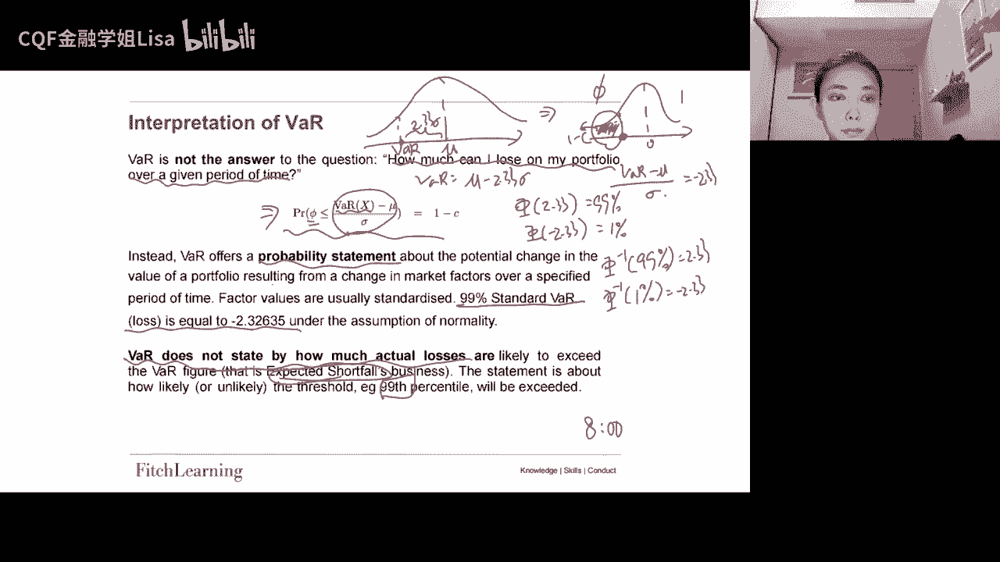

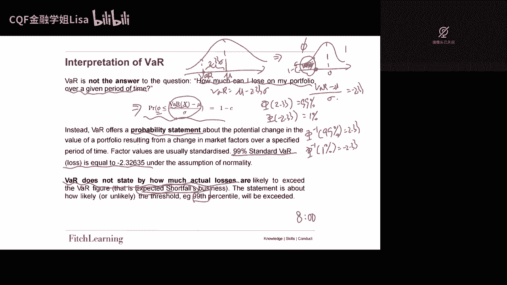

好那我们继续来看这个。

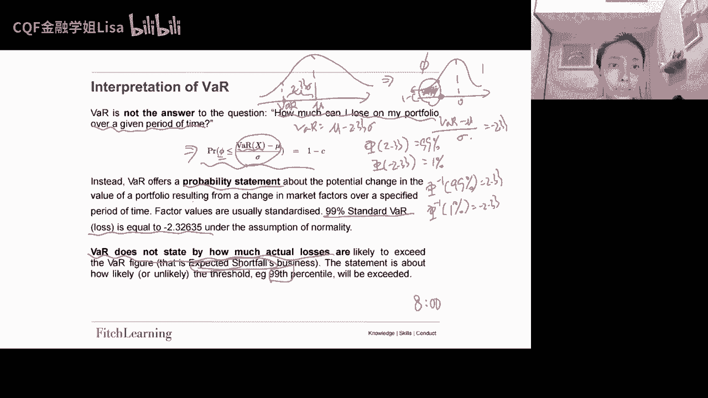

继续来看这个bu，我们知道了Y有三个要素，概率，时间期限，还有一个loss，那在这里的话呢，我们就来看一下它的这个time horizon哈，这个时间期限我们知道呢吧，他在这个分布当中就是一个分界点。

对吧，就是这样一个分界点，那我们可以把它就写成，就是mu加上z sigma对吧，这个Z呢，就是看你这边的这个依赖因子到底是多少，依赖因子是-2。33还是2。33还是多少。

所以我们可以把Y写成六加上z sigma好，所以当99%的时候呢吧，它就是没有减2。33sigma，如果你这个是个return分布的话，那么one呢，它通常是用来去管理一天的时间范围内的。

这个市场风险啊，所以呢就有必要从这个投资组合收益的，这个日分布当中去得出这个one，就如果说你要算的是一天的吧，那么你的这个分布就应该是一个啊，就是daily return好。

或者是daily loss，然后还有就是根据我们的这个经验嘛对吧，我们之前在M1的时候也有说过，我们说daily return一般就是零，所以如果说你的daily return就这么做，一天的V。

他其实就是拿的是一天的new，去加上Z乘以一天的sigma，但是因为你一天的缪通常都是零，所以呢你一天的话，其实一般来说就是Z去乘以一天的sigma，一天的这个标准差好，它通常都是要求十天的挖的啊。

要求你提供十天之内最大损失是怎么样的好，所以嗯就是我们理论上的十天的话呢，就是从十天的这个期限内的啊，RICHARD的分布啊，或是lost的分布来得到嘛，但是呢就是这个就意味着你用来去分析的。

这个数据的时间序列应该很长，应该更长对吧，就需要更长期限的这个分布才行好，所以呢其实我们有一个比较简单的一种方式，就是平方根法则，就是如果说你要得到十天的话，你就去把一天的话去乘以根号十就可以了啊。

这个叫做根号平方根法则，所以呢我们的这个嗯就是为什么可以，其实关键就是你必须要这个mu等于零对吧，你的因为我们的方差是线性可加的嘛，你想得到十天的对吧，那其实就应该是拿我们的依赖因子去乘以。

十天的sigma，然后十天的sigma因为标准差没法去相加，但是你方差是可以的对吧，你十天的方差就是十去乘以你一天的方差，所以呢你十天的标准差就应该等于根号十，再乘以一天的标准差，所以这样的话呢。

我们的这个十天的话，是不是可以写成Z去乘以根号十，再乘以一天的这个sigma，所以这是它的一个平方根法则，所以必须要六等于零才行，如果等于零的话，就没有没有那么简单对，所以用到没有等于零。

用到方差的线性可加性好，然后呢我们用这个平方根法则，就是必须要有两个假设，第一个假设就是我们刚刚提到的，我们的日回报率之间，还有我们我们日回报率之间必须是ID的，必须是这个同分布的。

就daily richard必须是r id，不然你也没有办法去用方差线性可加，然后并且我们刚才说到的new必须要等于零，就是一天的缪必须要等于零，这是第一个假设，然后第二个假设。

我先把这个平方根平方根法则稍微写写，平方根法则，就是你的N天的八，就等于根号N去乘以一天的吧，好，第二个假设就是你的这个复利方式，必须是连续复，我们可以看到这一幅图。

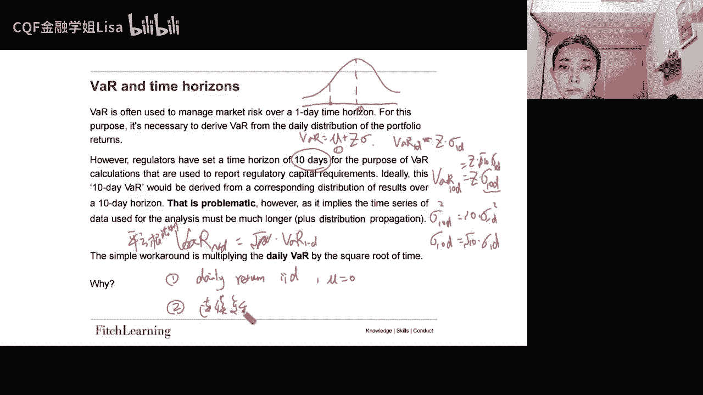

如果说是连续复利的话，你可以看一下，十天的这个连续复利的一个收益啊，return是怎么样的，如果十天，那么你第一天是一的R1，然后第二天是一的R2对吧，乘以第二，第三天一的R3哈，一直乘乘到一的R10。

那其实就是一的R1加R2，一直加加加加到20，这就是你十天的一个return，如果说你每天的R都相等对吧，如果你每天的R都相等，那就是一的10R，但如果说不相等的话，反正就每天相加嘛。

那么这个是连续复利的情况，那如果说是离散复利呢，离散复利呢其实就要麻烦一点对吧，第一天一加R1，第二题一加R2，然后就乘乘到1+20，所以你不可能说哦，你就等于一加这个十的R的十次方了。

就是你的这个不像这个连续赋予的这个形式，那么好看对吧，就是你不存在十天回报率，就等于每天回报率相加的情况，因此呢你得看右边这两个图，这个是连续复利的情况，然后这个是离散复利的情况，所以你看了连续复利。

不管你的这个啊就是总的期限是多长，它的return的回报都是就是没有，它是没有变的对吧，他的这个回报的分布是保持的是一致的，而当你是离散复利的时候，你看当你的期限变得越来越长。

你的这个就是对它的回报的形状，在慢慢的发生变化，所以这就是离散福利跟连续复利的区别好，所以啊就是我们可以看到不同的期限的回报率，如果是连续复利，它都是呈现的是正态分布，而离散福利就不行。

长期的回报率就不再是正态分布了，所以我们说只有当回报率呈现正态分布的时候，我们才能使用这个方差的线性可加，然后才能去使用这个Y的平方等法则好，所以呢你可以看到他这个这个Y的平方根法则。

它的假设其实还是挺多的，还是很强的，但是我们说理论和实际还是不太一样对吧，就是在我们的实际生活当中，可能大部分都是离散分离，但是通过这样的假设呢，至少能够帮我们去得到一个非常简单的方法，去得到啊。

很多天的这个网，那因为这个模型，其实最终我们不是为了去得到那个数字，我们其实最终其实是想要去拿来比较，就是你可以，比如说针对拿到一个时间序列的数据，你可以每天可以看到他的V的一个变化。

那么这样的话呢可以就是使用相同方法，得到不同的情况之下，Y的值不同就可以了，就可以去做比较了，所以呢你具体损失多少，其实他没有那么大的一个参考意义啊，关键就是你要能够去拿来比较就可以了。

所以有的时候没有办法，没有办法，这个符合假设，其实问题也不大好，这个是我们的袜，然后我们再来看这个，就是我们刚刚说过的expected for，所以special for呢它就是主要指的是一个。

它也可以被叫做conditional吧，然后也可以被叫做conditional tail expectation，也可以叫做expected tail notes啊，这都是expect for的名字。

所以呢嗯他说当while呢在问啊，我们这个事情能变得多差，那么expected soso，他在问他能够回答的就是啊，如果我们已经在尾部了，我们的预期损失是多少好，然后同样我们的special for哈。

它跟Y1样，它也是两个参数的函数，一个是时间期限，一个是这个执行程度，所以它是时间期限T内，的一个预期损失，它是个条件预期，然后条件就是损失已经大于了，这个损失分布的第99%个分位点啊。

就是到了到了尾部，所以这也是他的一个数学表达，当我们的损失，已经超过VR的情况之下，它的一个平均值，然后这边有提到说啊，special是coherent的，但是while呢不是。

主要就是那个刺客加信他没有服从啊，所以这个我们的es哈刚刚也写过，我们es的那个积分的表达方式了，如果你把它叫做一减阿尔法，那么就一减阿尔法分之一，就他也可以哈，如果写到这边来，写到右边来。

这个表达式叫左膀，就其实跟我们刚刚那个表达式是一样的，结果还写到右边来好，那么这个是预期损失的表达式，然后我们再来看一下，为什么说Y是这个没有满足次可加性能，我们可以来举个例子。

比如说现在我们手上有两个债券，然后这两个债券债券呢是相互独立的，然后每一只债券的名义本金都是1000块钱，并且每一只债券的违约违约概率都是3%，然后他们的recovery rate。

也就是如果如果违约的话，他能捞回来多少钱，都是0%，就是如果违约的话，就损失所有钱，然后我们现在想要去找他的，比如5%的外，那我们来看一下哈，我们先来看一下，若是这个portfolio。

就是你把他站在这个角组合的角度，去看它的一个这个损失的情况，那么我们就来看他的default，那么它可能是两个都违约对吧，有这种情况就是两个都违约，那么两个都违约的话呢。

它的loss那就是2000块钱啊，全部损失掉，然后呢他两个都有这个概率，两个都有一的概率，那其实就是0。3的平方了对吧，就是你如果写写写的正规一点，就是C20。3的平方，再乘以0。97的零次方。

那么这个得到的结果是0。09%，好然后它的c BF它的累积概率，那肯定就是点零九，好这个是两个都违约，然后接下来就是一个违约，如果说一个违约0。3的平方啊，0。09嘛，但是它是3%嘛，就0。09%吗。

好然后如果说是一个违约，那么就是损失1000块钱吧，损失一块1000块钱，然后那就是C21，你要挑一个伟人，然后乘以0。3，然后再乘以0。97，那么他得到的是5。82%，所以你的累计概率就相加。

累计概率应该是5。9亿好，然后如果是两个都没有违约，那么你的损失就是零，那你的概率其实就是，C200。3的零次方，再乘以0。97的平方好，所以得到的就是94。09%，好所以累计概率就是百分之百好。

那我们就得到了它不同的这个点对吧，不同的边界点上对应的这个CDF，我们就可以把它画出来，前面哦0。03，对不对，这里是0。03，所以如果说损失为零的话，它的概率是94。09%，然后损失为1000的话。

它的概率是5。91啊，5。82，这个是94。09%，这个是5。82，然后损失2000块钱的话是0。09%，所以我们要找到他5%嘛对吧，5%所对应的那就是应该在这里，累积的5%。

那么这个边界点就是1000块钱，所以就是我们站在这个组合的这个角度哈，5%的这个组合的吧，应该就是1000块钱，好这个是正在组合，然后我们接下来再来看，如果你正在单个债券，比如说就看BA，这个是A和B。

on a好，那么它的default，Close probability and ocdf，所以首先的话呢就是要么就是违约吗，违约的话呢，那么他的损失就是1000块钱，然后它的概率就是3%好。

所以它的累计概率也是3%，然后要么就是不违约，不违约的话呢，啊他的这个损失就是零，那么它的概率是97%，那么累计概率是100好，所以呢还是把它的这个给他画一画，这边是97%，损失为零。

然后3%损失为1000好，所以你同样找到那个5%对应的位置，那5%对应的位置肯定是在零这里好，所以5%的发BA就一个BD就是零好，所以呢如果说你要对吧，次可加性是什么意思。

次可加性是不是就是我们的A加B的Y，这个风险度量是小于等于YA加上vb的，但很显然这个是不成立的对吧，所以呢他是不满足这个词可加性，所以这边就是给大家用一个例子，来给大家解释一下。

为什么说它是不满足次可加性，所以它不是coherent的这样的一个风险度量好，那么这个是Y和especial for哈，他们的这个定义的介绍，让我们接下来看它的具体的计算，好就是估计Y的方法。

那么估计的方法呢有三个啊，就是这边计算三个，第一个呢就是参数法好，参数法呢其实就是我们刚刚做的事情，就是你假设正态分布好，然后呢去找那个比如1%或者5%，对应的边界点，然后你用的就是它的公式对吧。

我们的Y等于什么mu加上Z乘以西格玛啊，你的mu和sigma都要自己去假定对吧，你这个参数是多少啊，假定你的正态分布，那你就利用这种就是带公式的方式，去把这个V给他算出来，这就是参数法。

所以你需要去估计参数好，然后呢第二个呢叫做历史模拟法啊，历史就是其实第二个第三个都是模拟法，那历史模拟法呢它就是用的是历史数据好，他用的是历史数据啊，这个蒙特卡罗模拟呢。

他可能就用的是计算机来利用我们的随机数，利用随机过程去做模拟好，所以历史数据呢他就是拿这个历史数据，然后呢你就把这个历史数据，比如说过去一段时间的历史数据，然后去把它们去做做好排序对吧。

把这个分布给它画好，然后呢去找到那个边界点，这是历史模拟在做的一个事情，然后呢这个摩托卡的模拟呢，它就是要基于你自己假定的分布去生成随机数，然后呢利用随机数生成很多路径。

然后这个路径到终点的时候会形成一个分布，然后找到对吧，这个分布它所对应的某一个边界点，就是蒙特卡洛模拟，那么这两个方法呢，一般来说哈就是啊这三个方法像参数法的话呢，它是比较简单，然后呢比较快。

但是不准确，所以呢参数法呢是比较适合当市场发生变化，你想要迅速得到答案，你不会特别去纠结这个答案的准确性的时候，那么你可以用参数法，但是现在呢基本上成熟的风管都在计算一个，挖的时候。

基本上都是将这个历史模拟跟蒙特卡洛模拟，相结合的方式，就是利用历史模拟去得到这个数据的参数对吧，然后呢就是你要去蒙特卡洛模拟，你要生成路径随机数的参数，你可以利用历史模拟去给他把这个参数得到。

然后把这个参数得到之后，就放入到这个蒙特卡洛模拟当中去，生成随机数啊，去形成这个随机路径，然后最终通过这个随机路径，最终产生的这个分布去找那个分界点，所以现在很多大型机构，比如说在做压力测试啊。

其实都是使用蒙特卡罗来去做情景分析的，那我们就来看一下这三个方法啊，第一个第一个方法就是参数法啊，就是我们刚刚已经这个做过的对吧，它也可以叫做这个解析的方差协方差方法。

那么它就是这个也可以叫德尔塔努姆哈，就是假设它的风险因子对他的投资组合值，是对数正态分布的价格啊，服从对数正态分布，然后呢它的回报率啊会落实服从正态分布，然后它的数学表达就是我们刚刚写过的对吧。

mu加上Z乘以sigma，然后呢，这个Z呢就是这个标准正态分布的累积函数，累积概率函数求逆，然后它的计算式就非常简单，因为正态分布就是它就只有两个参数嘛对吧，现在分布就是一个没有一个西格玛啊。

就可以把它的这个整个分布就描述清楚了，然后我们需要的我们需要的这个均值和方差呢，其实就是从这里，这是我们的这个组合回报分布的均值和方差，就是来自于这里，一个就是啊风险因子的多元分布。

一个是投资组合的一个构成，啊这是它的一个这个就是它的Z，好就是这个参数法，然后再来就是这个历史模拟法。

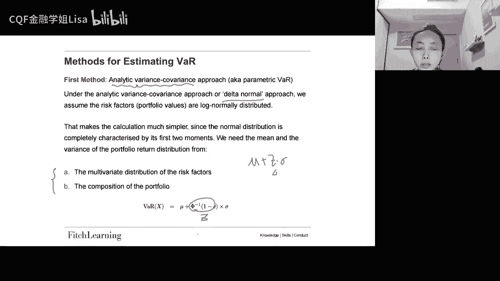

我们一会会看一个excel，那么这个历史模拟法呢又叫做非参数吧，就是它根本就不需要你去做任何的，关于参数的假设，那它的它的概念上是很简单的，不要求我们对分布去做任何的假设啊，不要求正态分布。

也不要求啊new sigma的假设啊，但是呢就是你至少需要两到3年的历史数据来，就是才能产生有意义的结果，比如说好像两年的两年的话，交易日就是500天啊，你需要500天的这个daily数据。

然后呢嗯就是你他做的时候，就是你首先选择一个给定时间段，就是你这个历史数据，是一个给定时间段的历史数据，然后呢，去拿到他每天的一个风险因子变化的样本，比如就是500天的每一天的return啊。

然后呢你把这些呃每天变化就是daily return给它，应用到这个风险因子的当前值，就相当于说你把历史数据的这个特征，用到你当下的特征，然后对你当前的这个投资组合进行重估。

然后重复次数跟历史样本当中的天数是相同的，然后对所有头寸的这些变化去做统计，然后保持这个天数同步啊，就听起来比较抽象的话，我们来看excel就知道了，非常简单，然后同样你把这个就相当于说。

你认为历史数据会重演啊，你认为历史的这个return，我们接下来这个return也是这个样子的好，所以呢你就利用历史数据，然后去把他的这个什么啊这个啊这个黑罐哈，他的这个嗯就是分布图给它画出来。

然后去找到第几个百分位点对吧，那个分界点那个就是我们的wow，所以这个也是很简单的。

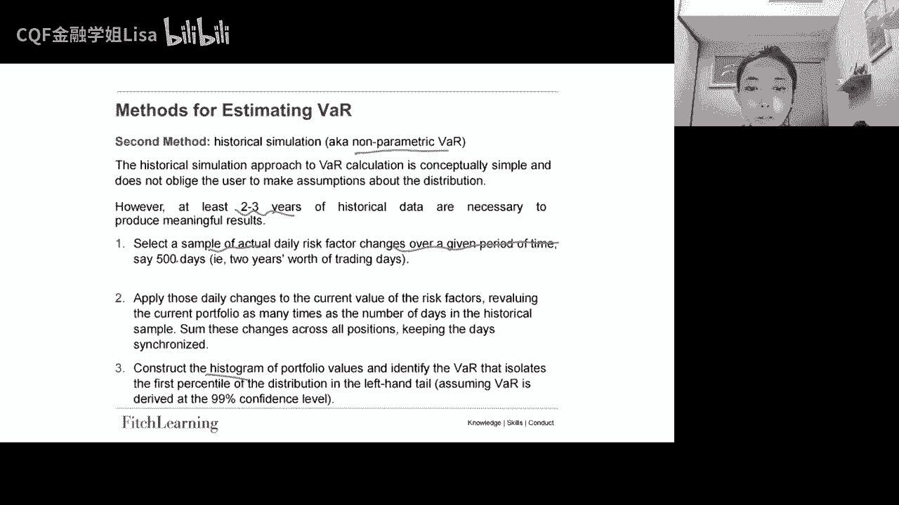

然后它的优缺点就是历史模拟的优点，就是它是非参数的，你不需要去担心设置参数，然后也不依赖于关于这个风险因子分布的，任何假设，就是不依赖于什么正态分布的假设呀，然后呢它的这个非参数性质呢也避免了。

就是要去估计波动率啊，估计相关系数的这些啊需要，然后呢我们的就是我们的历史波动率，历史的相关系数，其实已经反映在我们的历史数据当中了，所以呢我们只需要计算的，就只是给定这个历史期间的同步的。

这个风险因子的这个回报就可以了，然后历史模拟也没有问题，去适应这个分布当中的后卫，因为历史数据啊，它已经反映了市场当中的所有风险因子的，这个实际的同步变化，所以肥尾的问题你也不用担心，然后它的缺点就是。

它依赖于一组特定的历史数据，就是你的假设就是历史数据集中记录的过去，是未来的可靠的代表，也就是你认为历史会重演好，这就是对历史模拟的一个介绍。

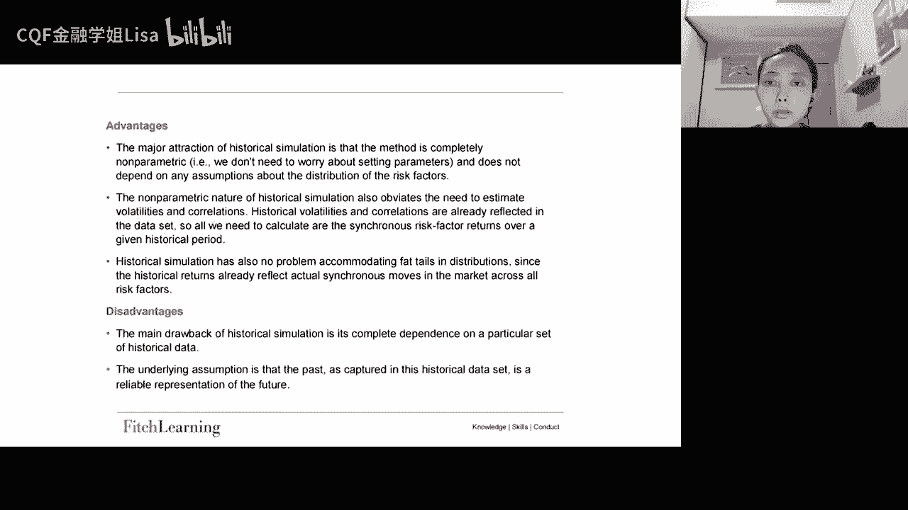

然后再来看第三个，第三个呢就是这个蒙特卡罗模拟好，所以那蒙特卡罗模拟呢就是你需要去重复模拟，控制市场价格和利率的随机过程，就是每一个模拟每一个场景嘛，它都会在目标期限，比如说十天啊。

然后呢为投资组合去生成一个可能的价值，比如说你在，然后这里就是你的起点，然后呢你通过努特卡尔模拟去生成一个路径好，然后到了这个终点，这有一个点，然后再来对吧，又来一个路径，然后又来，就你生成很多路径。

然后最后这些点他们其实都会去，它们会形成分布，然后你也不用去管这个，就是你直接找到他的这个边界点，就好比如说1%，你这个边界点就是它所对应的位置嘛，好所以这边你需要指定所有相关的风险因子。

然后它的随机过程参数估计，然后这个随机过程服从什么分布，可以是你自己假定的，所以这个过程当中模型风险还是很大的，就很有可能会出现garbage，in garbage out的一个情况，还有就是那第二个。

就是你要去构建这个价格路径对吧，价格路径就是使用这个随机数去构造，然后随机数一次对你抽出来一个随机数，他就推进一步对吧，然后再抽出来一个又推进一步，然后就是大家应该比较熟悉了，哈蒙德卡罗模拟，我卡了。

模拟是对M1是讲过的对吧，所以呢你就会为每一个路径，每一个场景都会有，它最终的一个投资组合的估值，然后这个过程重复了很多很多次，比如说啊1万4对吧，那么你就可以形成一个分布哈。

就是在这个风险范围内生成投资组合，回报的分布，然后呢，你就把这个，比如99%的执行水平之下的袜，那就简单的就是导出成你这个分布，比如第一个第一个百分位点的那个位置，好这就是自己对自己去定了哈。

我们就刚刚说了，这其实就是什么都卡过，最大的一个挑战，就是你的这个你在做路径模拟的时候，你的参数怎么去定，这其实是一个啊很难准确的一个问题，所以其实蒙特卡罗，经常都是用来去做情景分析的，那我就说了嘛。

你可以去把他的，你可以把它去跟历史模拟去结合在一起，就是历史模拟会给到你一点关于drift，跟嗯diffusion的一些信息，那么这个信息是你可以去参考的对吧，你可以利用这个信息，然后再去界定几个情景。

然后去做好几个分布，然后去看不同的情景之下，他的袜子在哪里对吧，所以我们的蒙多卡罗，它通常都是去做情景分析的好，让我们来看一看嗯。

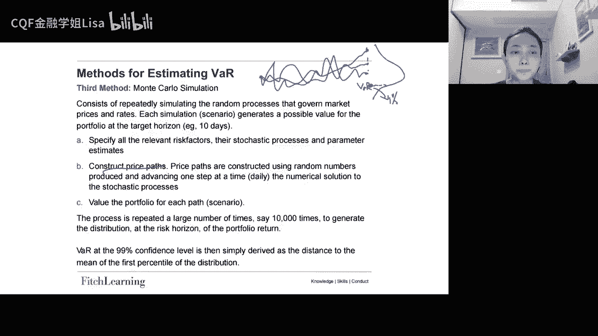

挖的example哈，这边就是首先第一个就是用第一个方法去求吧，那么这边的话呢呃这个就很简单了哈，就是代公式嘛，所以有个头寸10万块钱在这个QQQ，然后它的标准差它的这个呃置信程度对吧。

就是我们的依赖因子的这个点，然后让你去做三个题目，第一个就是请你去求出这个一天的吧，然后执行程度是99%，然后第二个是求出十天的吧啊，第三个就是嗯就是列举三个这个限制啊。

当你去使用one去衡量市场风险的时候，三个限制好，那这个应该很简单对吧，第一个问题就是带公式嘛对吧，第一个问题就是带公式，标准差乘以根号T乘以我们的这个依赖因子，所以就是sigma乘以根号T乘以Z。

再乘以你的名义本金就可以了，所以西格玛2。21根号根号呃，第一道题就根号一，然后第二道题呃，这个第二道题是根号十，然后这个是2。33，然后这个是10万对吧，所以这个比较简单哈，算出来这第一道题就这么多。

第二道题就成了根号十，之后就有这么多，然后呢第三个就是让你去列举三个why，就是用这种方式哈去得到，去做出它的风险测量的一个缺陷，那我们说这边，首先第一个就是我们说历史。

并不是对未来的一个很好的一个指标，敢用我们我们使用的sigma来源于历史数据嘛，但是你未来你接下来你要做风险控制，你是对未来去做，那你未来的这个未来会发生的，西格玛真的就是这么多嘛。

所以这个也是还要打个问号的，然后第二个就是他们没有办法去cover，一些异常的市场情况，比如说然后像我们的新冠疫情啊，雷曼的倒闭啊，对吧啊，所以呢这些异常情况，比如说你你拿的就是过去两年的。

正常的历史数据，过去两年没有发生任何的事情，没有发生任何的金融崩溃啊，市场是很正常的，你拿过去两年的数据去对未来去做风险，这个啊预警，那肯定也是不现实的对吧，你过去的这个市场情况。

给到你未来的一个Y应该也不会很不会很低，所以就嗯你就根本没有办法，就是如果未来要发生金融崩溃的话，你根本就没有办法去预警到这，教授就说就是有点像是一把伞，在天气好的时候好用，在天气不好的时候就不好用了。

所以这个伞有什么用，对吧好，还有就是一些市场风险，是没有办法去被挖捕获的，因为他的假设就是这种方法，他的假设太简单了，它正态分布，然后正态分布呢也只能够用于，就适用于线性的模型，但是非线性的回报。

比如说像期权，那债券呢其实都是不适合去用挖来去抓取它的，这个市场风险的，还有一些manage rates，就是一些操纵的利率，然后还有相关性对吧，相关性其实吧也没有考虑进去。

因为这种方法它与它的平方根法则，它就假设了ID嘛，好还有就是假设连续小幅度的小幅度的移动啊，无间断啊，啊这些都是对这个方法的一些一些limitation，好。

然后第二个第二个呢就是historical simulation。

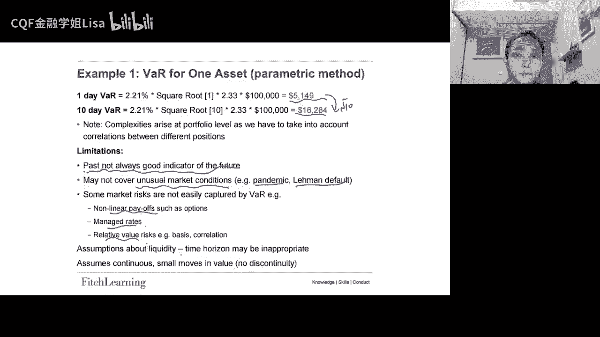

我们来看一个。

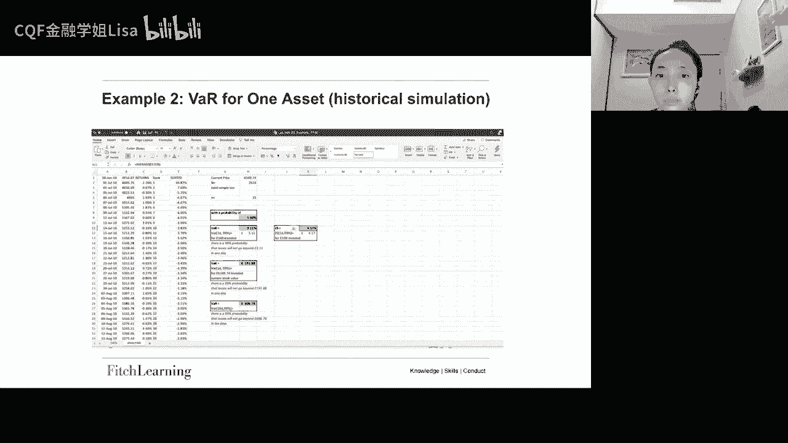

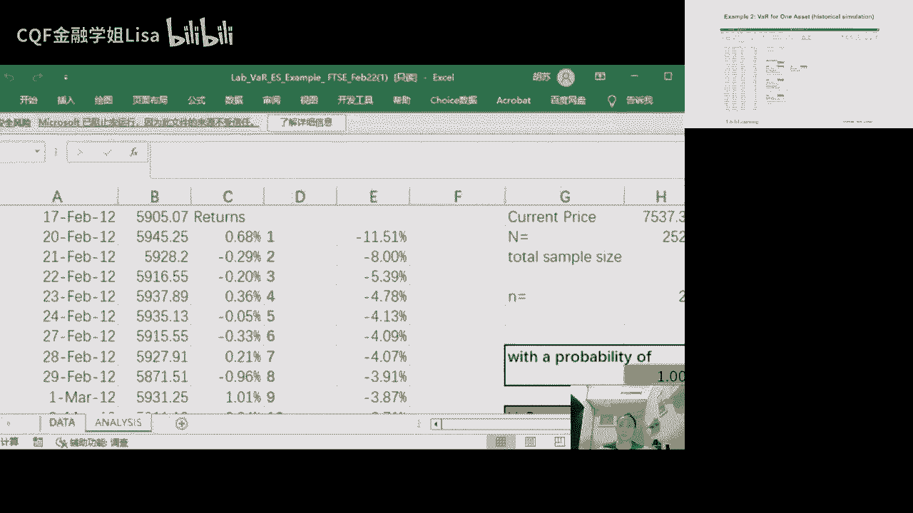

好这个excel就是关于历史模拟的啊。

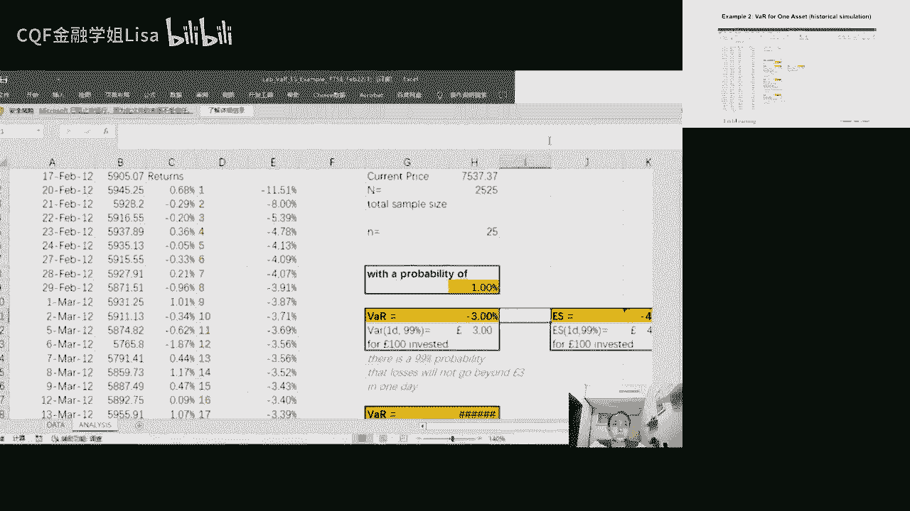

你可以看到首先的话呢，它前两列就是我们的历史数据啊，这个可能是可能是标普500吧，然后嗯他在做的时候呢，他就其实就是把这个历史数据，把这先把他的return先算出来，他算的是用的是这个。

就是连续复利的这种方式log，当然他其实用离散的啊，一天的这其实差别不大，然后把每天的return算出来啊，算出来之后呢，你就可以把这个return呢把它复制到这边，然后去做一个就是排序，就是很简单。

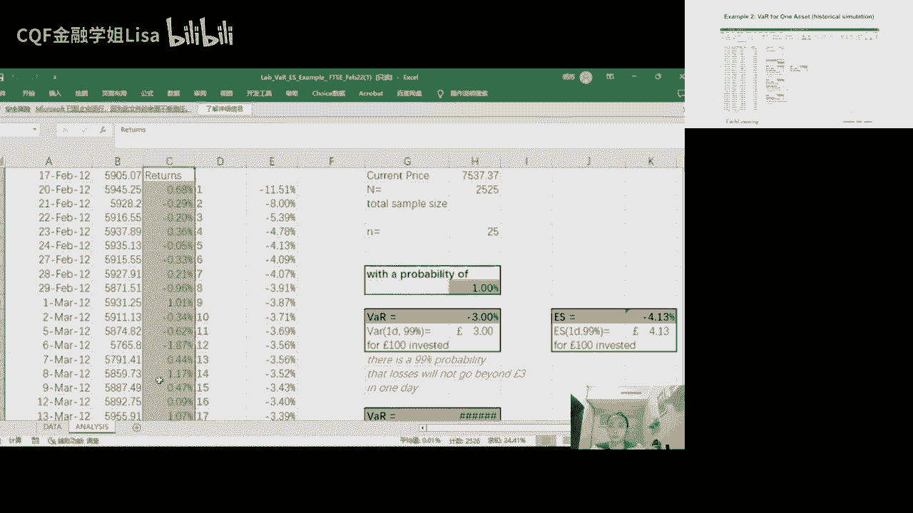

你把它复制过来的时候，也就选择只复制值，然后呢你把它稍微筛选一下，就你可以这个排序就是升序，从小到大，从小到大的去给他排个序，然后这就是你这位过去这么多天最小的daily return啊。

这样这个第二小的data return，然后你可以每一个都给他加个这个序列号码，然后用这个，序列去填充，所以这是第一个第二第三第四个好，所以这就是就是这两年是怎么得到的，是怎么得到的好。

然后呢接下来就是你要去找对吧，你这个找吧，找这个边界点嘛，所以他这边用的就是一个就是we look up，的一个函数啊，比如说现在啊你总得总的天数是2525，就是你一共有2525个daily rex。

然后呢你要在这2525格daily RT当中，比如找到1%的这个while的话，其实就乘个1%，其实就可以了对吧，因为你相当于说嗯其实就是找的是这个百分点。

对D1%这个百分点所在的这个return是多少，那其实就是个袜子，对啊，这边的比如说你在算这个嗯，发的时候，他用的就是we look up，他就要在这个这两个列当中，去找到你这个25啊。

这个25其实就是把2525乘以1%，得到的2525去乘以1%，就告诉你你在这所有数据当中，第25个数据就是你的袜子好，所以呢这边他就找的是对第25个数，然后呢保留四位小数点。

所以第25个数其实就是负3%，因此你这里的Y就是负3%，如果你是三块钱的本金的话，那你的V就是三块钱，就是你的损失吗，损失是三块钱，然后如果你是因为当下这个它的价格，是75357537。

所以如果说你是7537块钱的本金的话，那就7537再乘以3%就好了，对7537的话，你就损失226。12，就是一天的最大损失是226。12好，然后如果说你想算的是十天的，那么它其实就是乘一个根号十。

对这些坑成都更好使就好了，好还有就是如果你想算expected short for啊，这边就他就直接就求一个average，就是你把25以上的全部去求一个average，就好了。

你看它就是average啊，从这个到你这个25这里哈，因为小于等于小于等于Y的，全部去求一个平均数就好了，出来就是非常简单，Average，所以你的这个如果投100块钱的话。

你就expect for就是4。13，就是你超出了这个边界点之后，你的预期损失就是4。13这么多啊，这是一天之内好，这就是历史模拟的这个方法了哈，就非常简单，然后我们再回顾我们的时刻见。

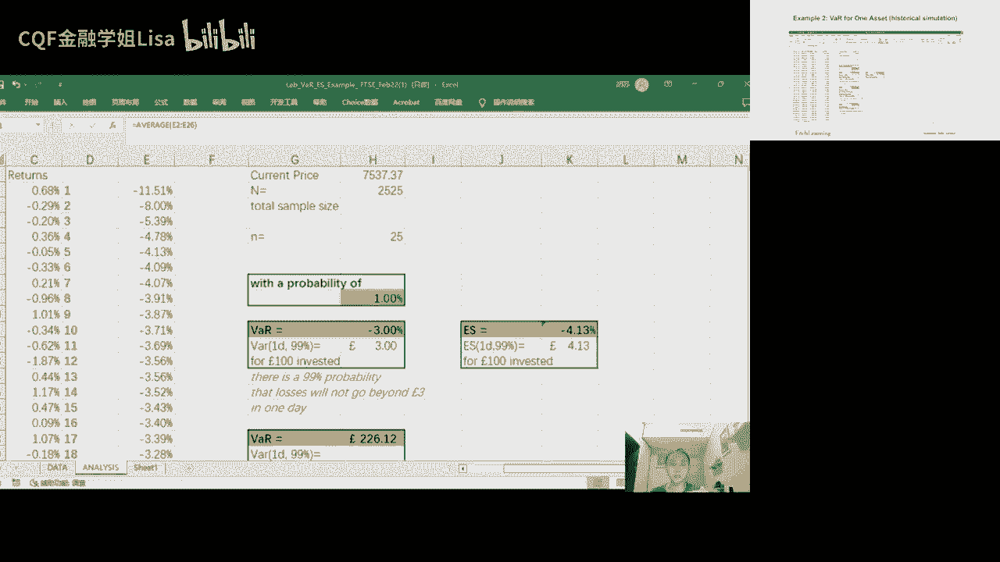

好所以这个就是我们刚刚给大家展示的这个excel，好。

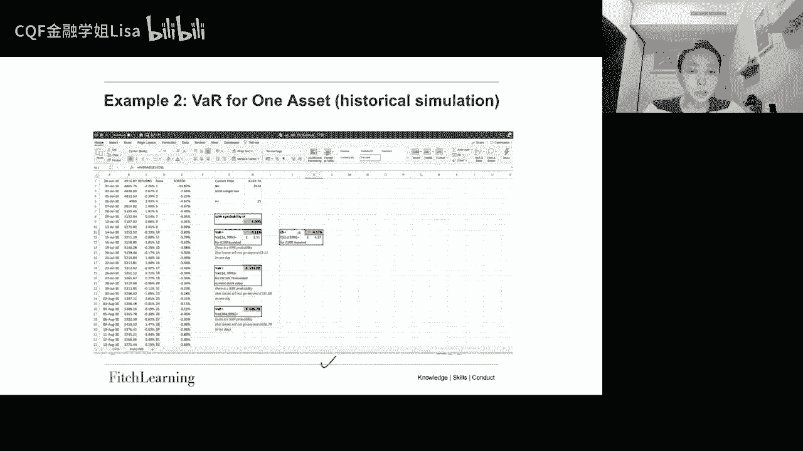