# 2024最值得学习的金融量化交易课程-第四讲：Fundamentals of Optimization - P1 - CQF金融学姐Lisa - BV1qt421n73z

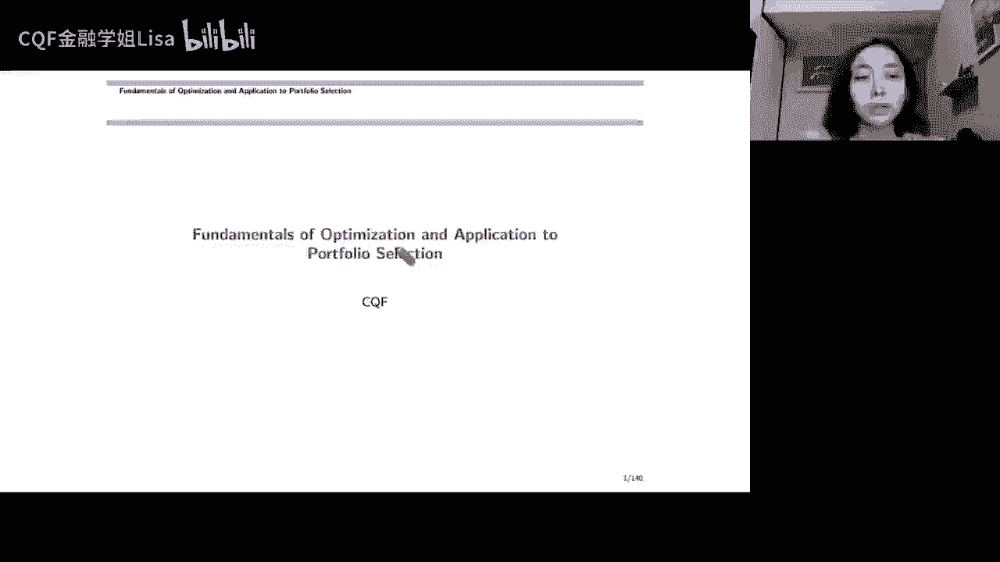

大家来到我们的这个M2的第二个lecture，那么这个lecture呢就是关于晚上好哈，关于我们的这个fundamentals of optimization。

And application to portfolio selection。

也就是说我们在啊，昨天我们去了解了MPT理论。

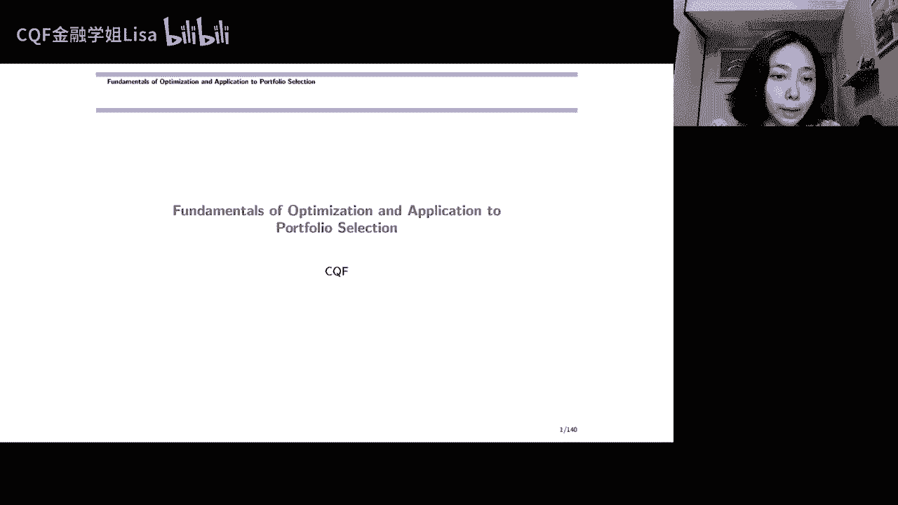

然后呢就是从概念上了解了这个理论，然后今天的话我们就要去学习，怎么样去用数学的方法，来得到这个组合的最优化，那么用的呢就是最简单的啊，最基础的微积分，那么还有一点就是会结合这个。

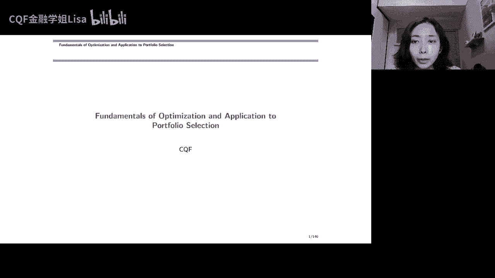

线性代数的矩阵运算，所以我们今天的关键呢就是要搞清楚它的方法。

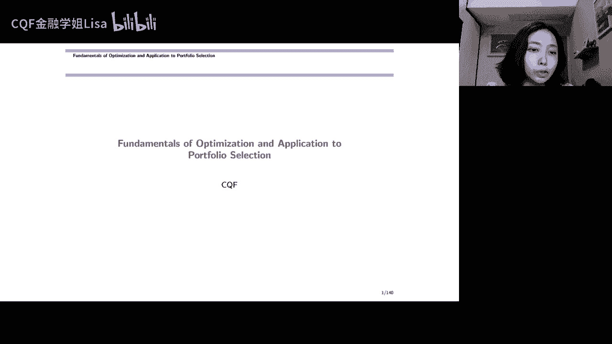

和它背后的一些运用。

我们来看一下这个lecture的目录啊，有这五个部分。

然后第一个部分呢就是关于optimization的介绍，就是这个最优化的最优化的过程哈，怎么样去把投资组合的问题，给它翻译成数学问题，然后还有就是一些一些规则，一些数学规则，比如说像max函数啊。

什么特性啊，好，然后第二部分呢，就是我们的这个呃没有约束条件的，这个要优化的问题，就是去解最优化问题的，这个我们解最优化问题的过程，是有分两两种情况的好，第一种情况就是UNCONSTRAINT。

就是没有约束条件，不受限制的，没有没有任何的这个限制条件，就是用简单的微积分的技术去解决，然后我们会去看一个例子，怎么样去做这个mamvance optimization啊，他这个思路是很重要的。

然后呢这个线性回归的应用没有讲啊，这个这个是有讲了，然后呢第三部分呢就是这个我们的呃，一种比较特殊的约束条件哈，就是这个equality也就是我们有限制条件的情况。

限制条件它其实也分两种，一种就是等于，然后一种呢就是大于或小于，那我们在这里呢只讲equality，只讲等于的情况。

然后解这种带限制条件的，这个最优最优化方法也很多，那么最典型的就是拉格朗日方法，就是拉格朗日的核心就是把带约束条件的，把它变成不带约束条件的，然后我们会去看一下它怎么样在啊，组合选择当中去做运动。

那我们会去看到哈，这个比如说我们的GMVP对吧，全球最小方差组合，以及这个tan simple folio，他们的这个权重是怎么去找到的，好，然后还有就是这个非常重要的诶。

这里没有写非常重要的blanket and model。

这个也是我们会在今天晚上去讲的好，就是如果大家去翻最后面的那个reference，那个参考教材参考文献的话，其实大部分的参考文献都是关于black man model好。

还有就是来一个short note，就是这个当你的限制条件是inequality，当你的限制条件是不等的，这个最优化的方法好，那么这种情况呢，大部分的这个都是没有解析解的，就只有通过数值解去进行计算。

然后这个lecture其实也没有讲，所以呢就大家自己有兴趣去看这个，extra materials好，那么这个就是我们今天晚上的这个目录。

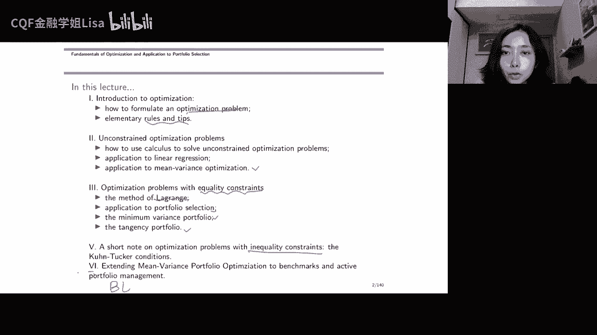

然后我们就来从第一部分开始哈，part one就是关于我们的optimization的一个介绍。

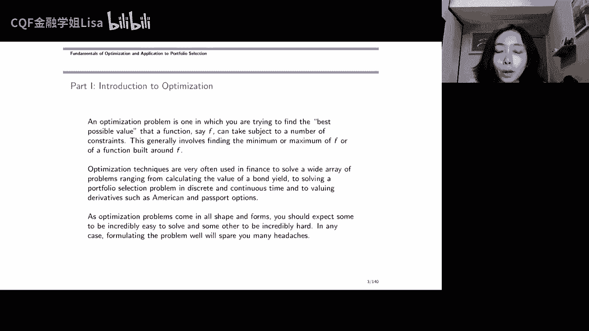

关于最优化过程的介绍，那么最优化的话呢，其实就是去找这个找到最优解，来一个best possible value去找到最优解，然后呢是在一定的限制条件之下，那么这个过程呢，通常就是在求最小化。

或者是求最大化的一个过程哈，就是一个要求minimum或者是求maxim的一个过程，比如说啊投资我们去找这个最佳投资组合，也就可以把它翻译成是，我们在一定条件之下去找到回报率最大的，那个啊。

就是你要找回回到回报率最大的。

那其实就是在做最大化对吧，或者是说你去找到风险最小的。

那就是在做最小化，然后呢，金融领域当中最优解通常就是利润最大化，效用最大化啊，成本最小化之类的，所以呢其实不仅仅是在组合啊，这个组合构建当中会用到哈，其实很多领域都会用到的好，所以他这边就他说啊。

这个最优化的这个技术呢，其实在我们的金融领域是经常去使用的话，会去解决各种各样的问题，比如说当你想要去求解啊。

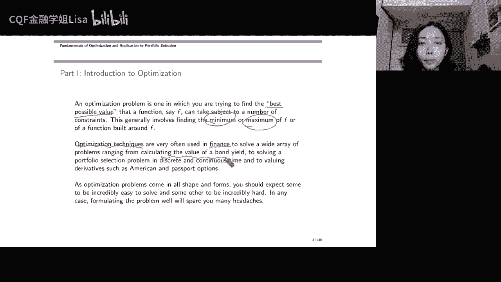

BYIELD对吧，这个债券的收益率，然后你想去解我们这里的这个组合选择的问题，不管是在离散的时间还是连续的时间，还有当你想去给一些衍生品去定价的时候哈，比如说像美式期权啊。

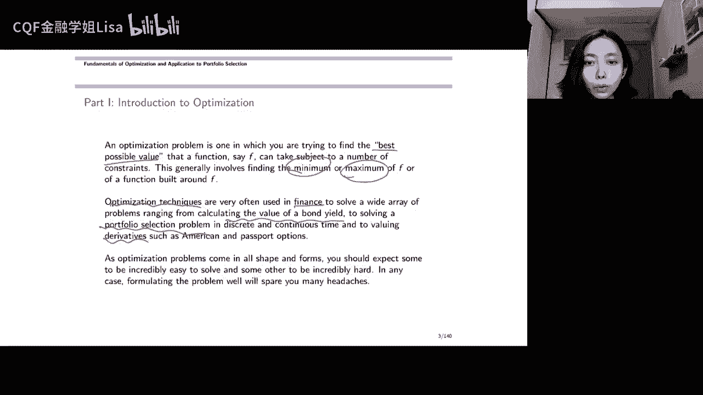

或者是这个passport option啊，这个护照期权，那么passport option呢，它其实啊它的标的是一个投资组合，然后他大概就是说它会限制你交易的次数啊，啊你的交易金额哈什么的哈。

就反正就是啊还可以，也是可以用这种最优化的技术，去给他们去做定价的，然后呢随着这个优化问题啊，开始以各种各样的形式去出现，那么你应该会希望一些问题非常容易解决，但是另外一些问题可能就没有那么容易解决。

但是不管怎么样呢，就是很好的去解决这个问题，可能会让你去省去很多的麻烦。

好，我们来看一下，对于我们这个最优化的问题的一个formulating哈，它的一个公式数学表达，那么最优化的问题呢，它有几个要素才能够表达清楚，第一个就是目标函数。

就是我们的objective function，那objective function目标函数，那么这个其实就是我们要优化的目标函数。

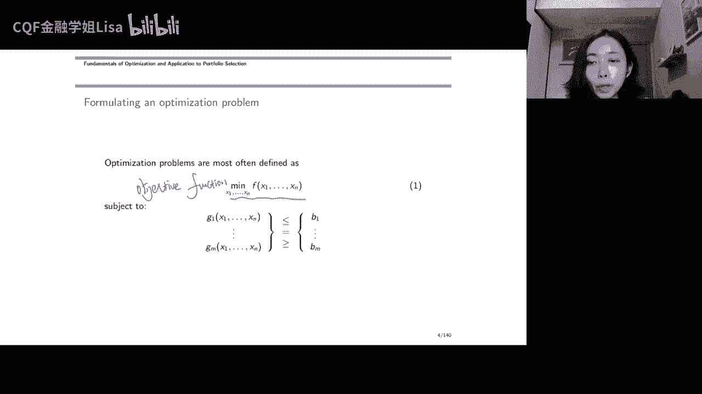

然后呢X1到XN就是变量，然后叫做决定变量，就是decision variable。

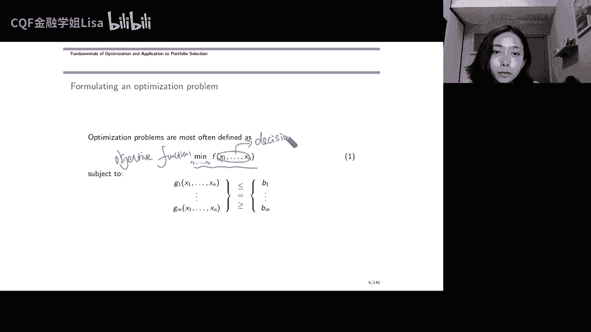

所以我们就是通过调整这些决定变量的取值，然后呢可以去实现，我们这里是想要去做命嘛，想要去找到这个目标函数的最小化，所以呢它的一个subject to哈，它的约束条件，那么它的限制条件呢就是这些。

所以这就是它的一个constant，啊它的约束条件，也就是说这些变量的取值不是随便取的啊，我们的这个定义域可能不是从负无穷到正无穷，我们有啊，这个可能一个或者M个哈，这个我们有M哥这个限制条件。

然后呢这些限制可能是等于或是不等，所以这边有啊小于等于的情况，有等于的，有大于等于的情况哈，不同的这种约束条件，那我们这节课的重点其实就是放在这个等于上，比如说我们在组合优化当中，我们自然有一个条件。

就是所有资产的权重都应该就相加，应该等于一对吧，那这肯定就是一个等于的约束条件，那么通过这三个要素，我们就可以去formulate一个最优化的问题了，然后其实嗯就是in还是max。

其实我们一般用minimize，其实用的是更多一些的啊。

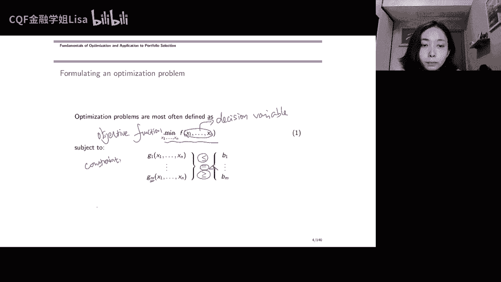

所以就是我们这种刚提到的目标函数，决策变量以及我们的约束条件啊，这三个要素是非常那是必须的。

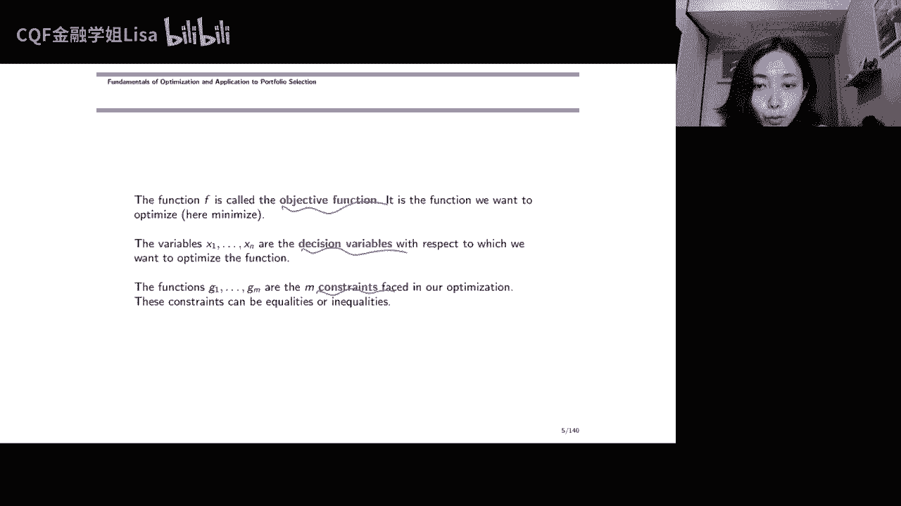

然后我们来看它的一个这个这个规则，就是如果说我们要最大化组合回报，就是你要去max养育最大化组合回报，怎么如果你说你想去把它变成命啊，因为命是用的最多的，包括我们再去用Python去做执行的时候啊。

这个命一般都是有些现成的第三方库，去帮你实现的，那么你怎么样去把这个max给它变成mean呢，那其实非常简单的，就直接你在这个FX啊前面去加一个负号啊，然后呢你给他求了命之后呢，再给它加个负号就可以。

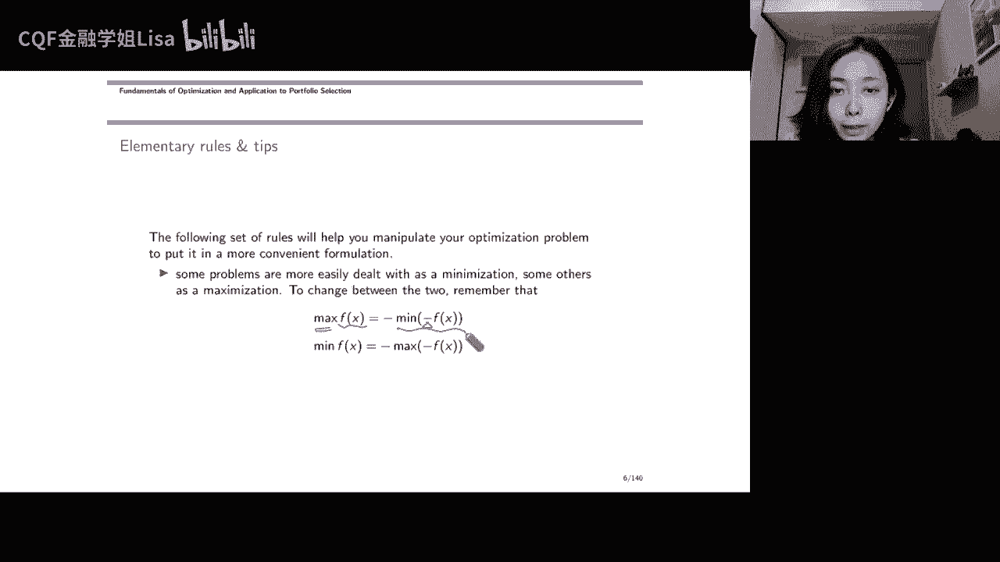

就是就是你想要得到的那个最大的这个函数值。

所以比如说我们可以画一个我们举个例子。

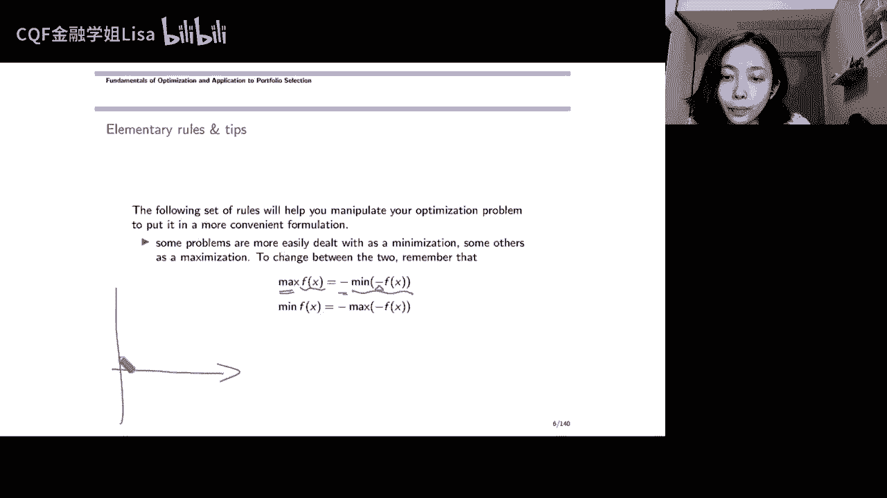

比如说你想去求这个FFX的最大化，比如说我们现在这个是我们的FX，你想去求那个最大的X。

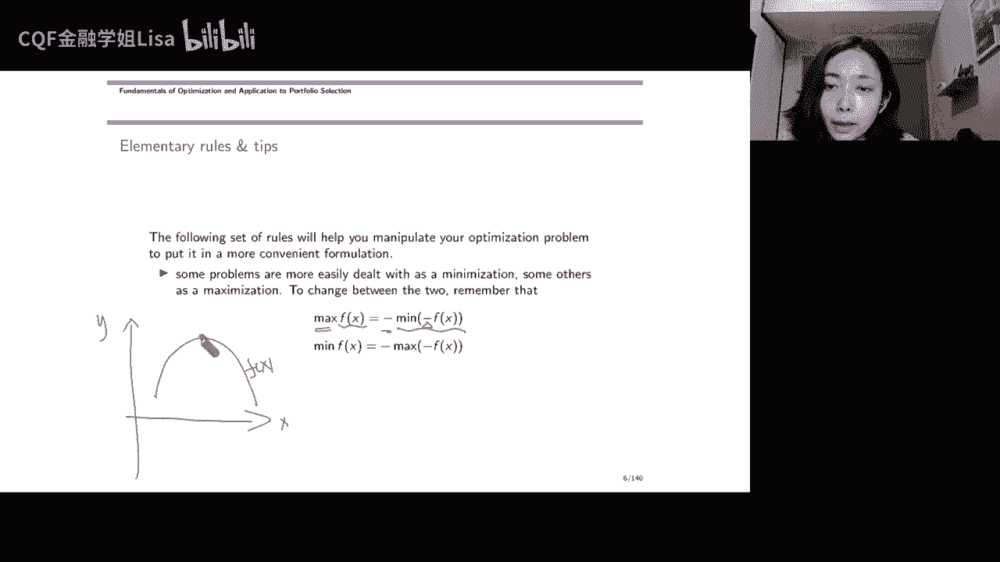

能够使得我们的这个FX最大化，然后呢。

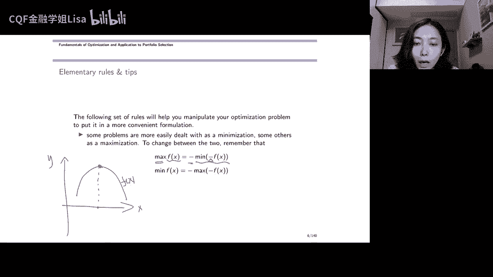

这个时候你其实就可以把FX呢给它去加个负号，加个负号呢，它就变成了这个样子对吧。

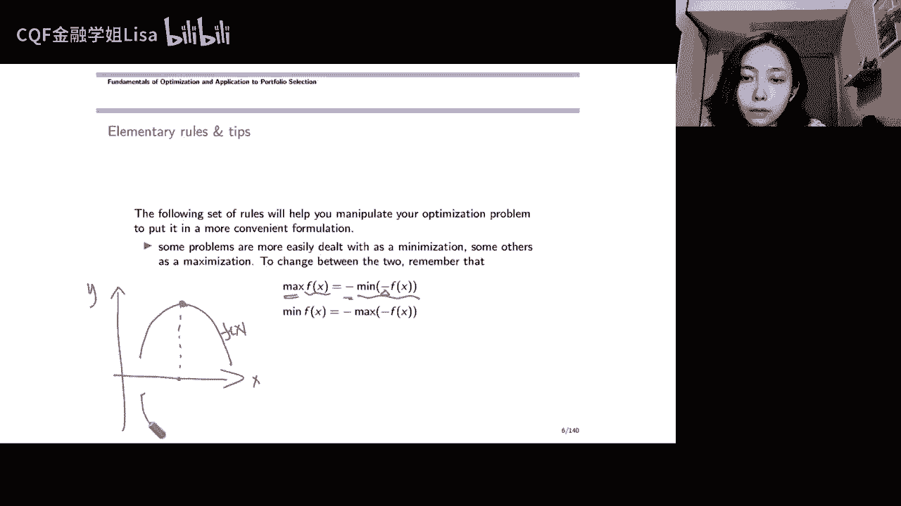

这就是我们的负FX，所以加上负号之后呢，你要去找FX的最大值。

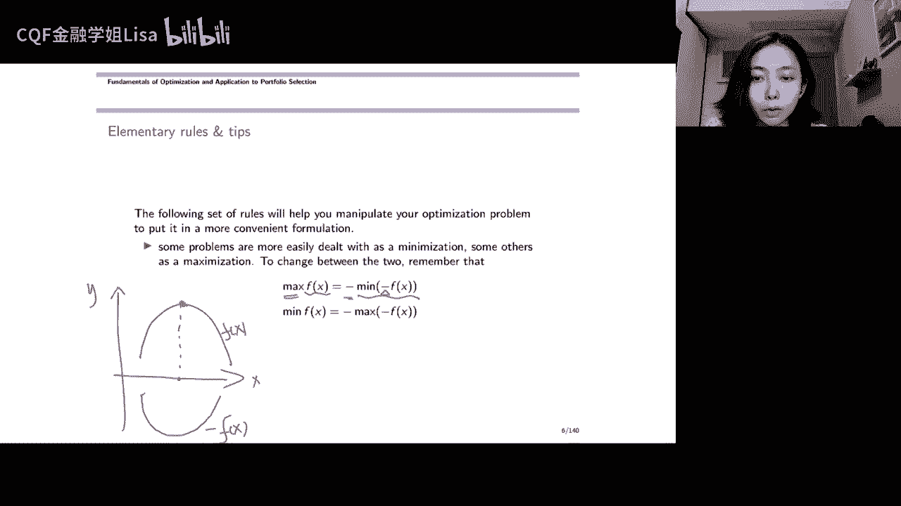

其实就变成了要去找负FX的最小值好，然后你找到了这个能够使得负FX。

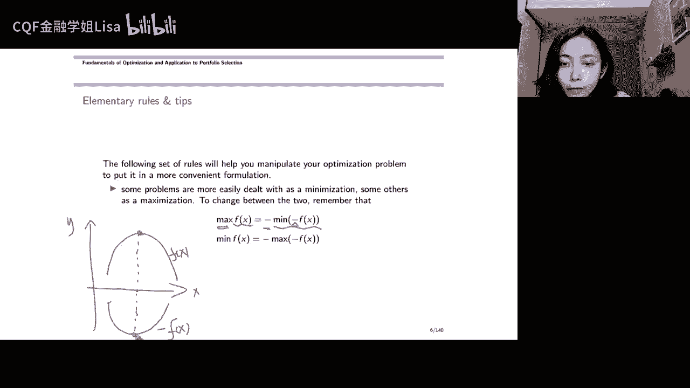

最小的那个X对吧，然后你得到负FX之后，你再去加一个负号对吧，再给它再给它对称过来，然后再给它加个负号，就可以变成我们FX的最大值了，所以我们这就是为什么，我们说你通过在这里的话，先把FX加个符号。

然后最后得到结果再去加一个符号，那么其实就是得到的是max FX好，这样的话，我们就可以把一个求max的问题给它，改成求mean的问题了啊，当然同样如果说你不想求min，你想求max啊。

你也可以去同样的这个道理，你把命给它改成max也行。

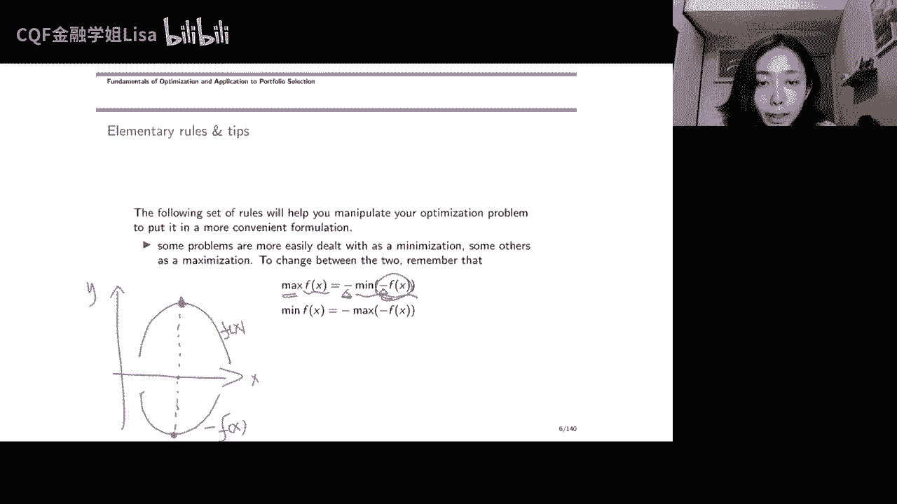

也是可以的，好，那有的时候我们的目标函数可能不是简单的FX，对吧，可能不是简单的FX啊，他可能是比如像这里A加BFX的一种情况啊，就是它有常数，还有系数，就这里的A和B其实都是常数。

这里的A和B都是常数，然后呢啊我们就可以啊，当你想要去求它的最大化的时候，你就可以去做一些变换，那么这里的这个哈A加BX。

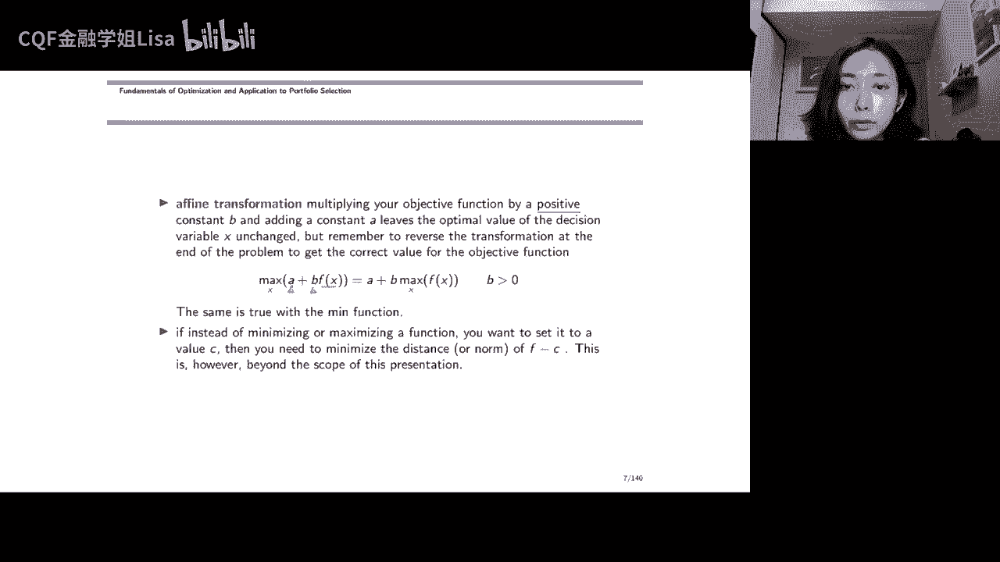

这个变化呢叫做a fine transformation，就是仿射变换哈，仿射变换呢也可以理解成就是内线性变换，我们经常听到反射的时候，你可以啊，就是一瞬间你可以想到线性好，因为我们A是一个常数。

所以呢在这个求max的这个过程当中呢，这个A是不不影响的，所以你可以直接把这个A给他拎出来啊，直接给他拎出来，然后呢对于B如果说B大于零啊，如果B大于零，那么就相当于说就是这个B其实就是起到一个。

把FX扩大的作用，那么在max这个函数当中，它也是不受影响的，你也可以把这个B直接给它拎出来，所以呢啊这边如果B大于零，那么你要去求这个函数的最大值，其实也就是求这个的最大值对吧。

其实就是FX的max好，然后但是如果说B为负的话，如果B为负的话，那你就需要把一个max给它改成M，就是因为啊然后因为对称嘛，你再给它加一个符号，所以呢如果A和B都是常数，且B为正的。

你可以直接去把A和B从max函数当中拎出来，但是如果说B是负的，那么你就你还是可以直接拿出来，但是你需要把它写成负的啊，就相当于说你是给他这个意思啊。

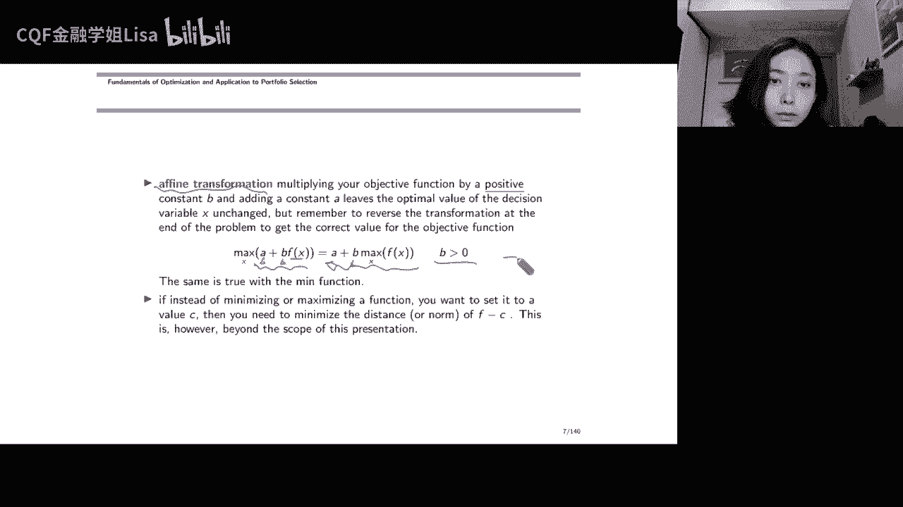

这个样子一下，所以不管函数长什么样子，你都可以去想办法。

把这个最优化变成一个求最小化的过程，那么有些金融问题呢，他是在做最大化或者最小化的问题，但是呢还有一些金融问题是需要你啊，去把它的目标函数呢恰好设置成一个解，比如说我们再去我们在这个期权定价里面。

我们要去求这个隐含波动率的时候对吧，我们说这个隐含波动率，其实就是你让期权的就是用black shoes formula，算出来的，这个期权的理论价格和期权的市场价格相等，然后你倒推出来的那个波动率。

那么在这呢它其实就是在做这样一个事情，就是你需要去设置好你的这个期权的理论价格，跟市场价格相等，然后到推出这个隐含波动率。

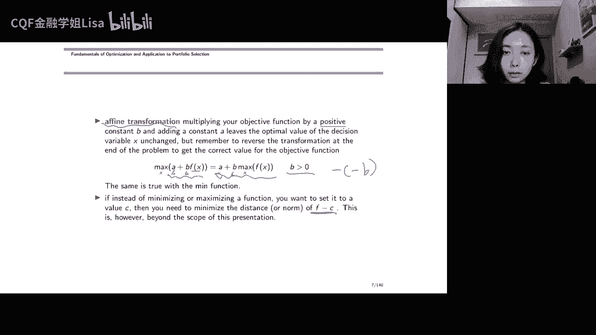

所以你其实就是在设置目标函数的一个，就是取值，就是它知道刚好等于市场价格好，那这个时候我们说那是不是同样可以去改成什，minimize的这个问题呢，还是可以的。

就是当你想让这个FX想让它等于C的时候对吧，那其实你就是想让FX减C，这个它们之间的距离最小化对吧。

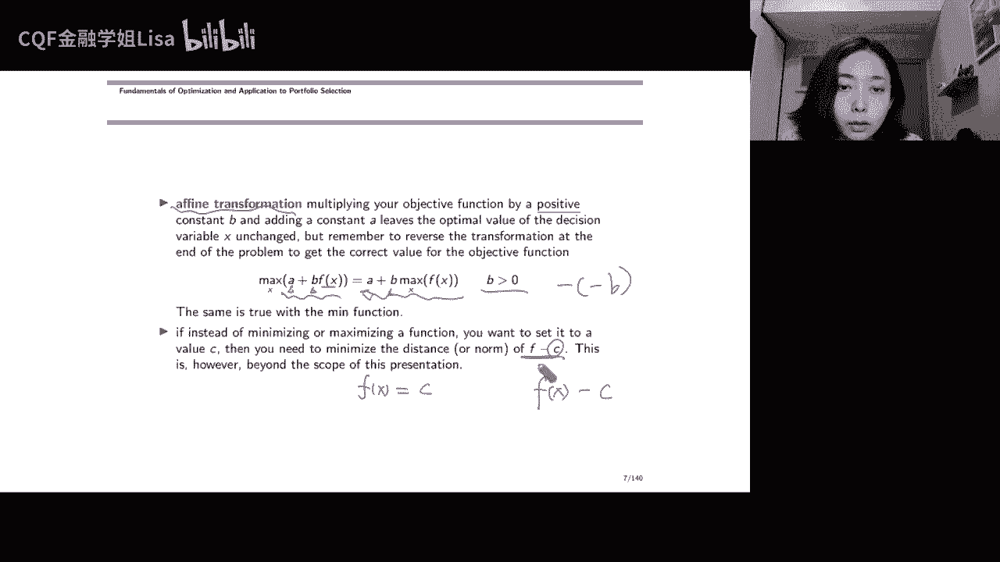

所以我们其实就还是可以把它转换成这样一个，最优化最小化的这个问题哈，就是目标函数这个时候就是FX等于C，所以我们通过最小化F和C之间的这个距离啊，来找到对应的这个变量取值，所以我们再去我们到M3。

我们会去求这个隐含波动率的时候，其实就是在做这个事情啊，你要另期权的理论价格跟它的市场价格相同啊，就他们俩真的距离最小，然后去找到对应的那个倒推出它的隐含波动率，好这个是它的一个最大化。

最想画的一个规则。

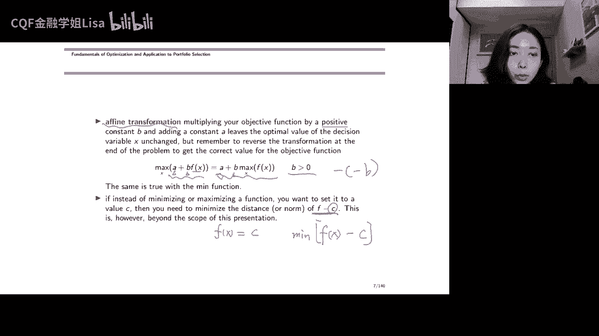

然后我们再来看没有约束条件的最优化，就说如果如果没有约束条件，那么我们的系统就没有subject to，那后面的东西了啊，所以呢我们就其实就只有这样的一个，目标函数啊，这样啊包括他的这个决定变量好。

所以呢这个时候呢，它其实就是一个标准的微积分好，所以我们知道这个你要去求F的minimum value，其实就是去求这个函数的极端值嘛对吧，所以呢你怎么样去找到这个最优的这个X星，就是最佳的啊。

这个决定变量来使得F能够去到达，他的global minimum好，那么这样的话，其实我们就需要用到向量的微分对吧，向量的微分我们可以稍微写一下好。

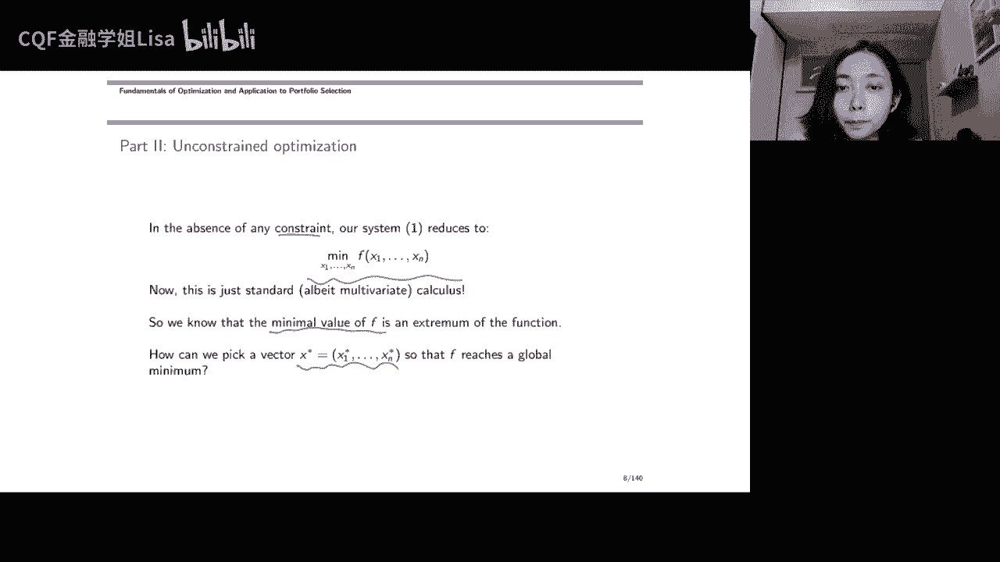

首先比如说我们有一个FX。

然后呢这个FX呢就是它的目标函数，它这个X是属于这个R2，就是实数M个实数，也就是说我们的X是有M和X的，就是X1X2。

一直到XM啊，这些是我们的决定变量，我们现在就是想要去调整决定变量。

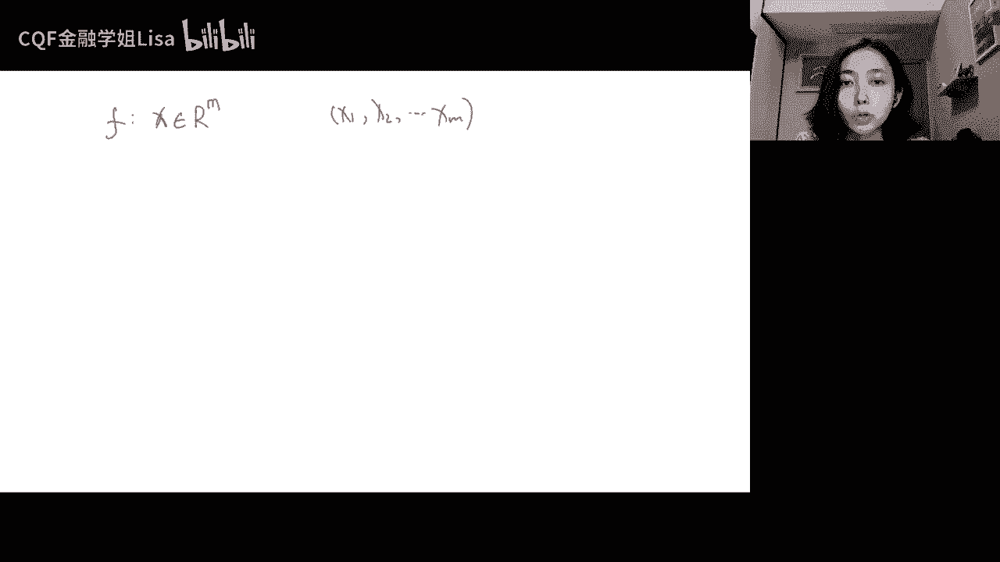

来使得FX达到最小化好，那这个时候呢我们就肯定就想是，那肯定要先要去求一阶导对吧。

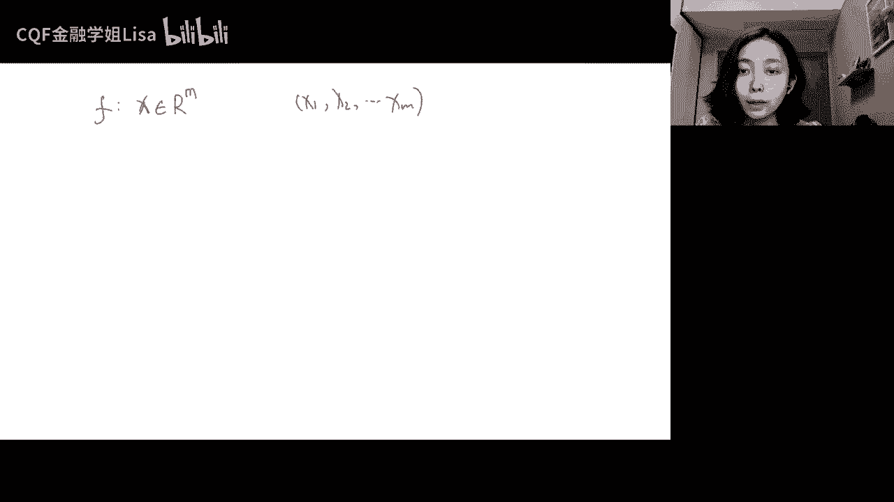

我们需要去首先是一阶导，一阶导的话呢，你也可以把它啊就是叫做梯度gradient。

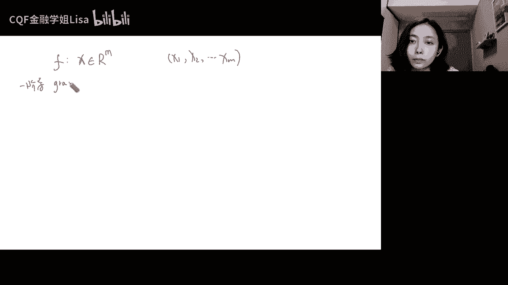

好梯度，然后我们用符号去写的话，我们可以把它写成这种倒三角的一个符号，倒三角FX，或者你也可以用大D大D就是derivative，也是微分的意思，Sx，然后呢其实也就是说你要把这个FX。

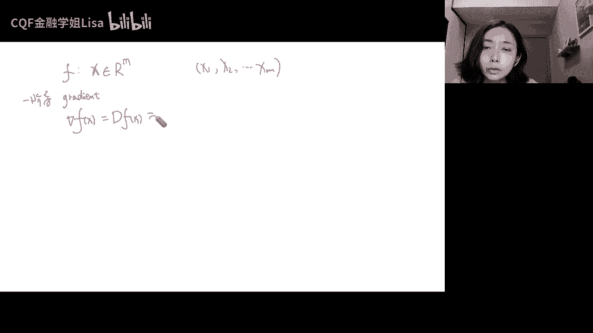

因为你有M个决策变量，所以你要对每一个都要去求微分。

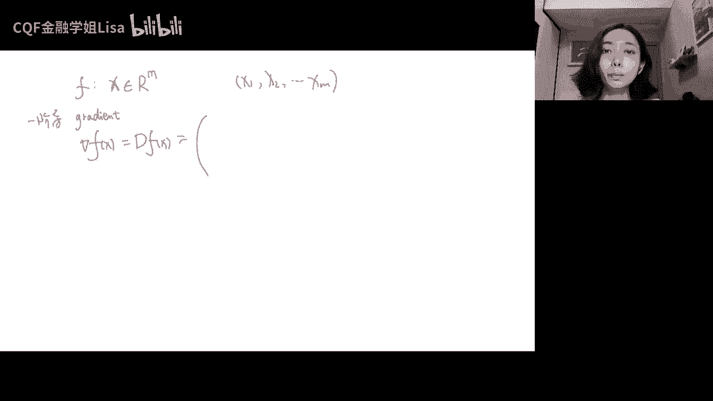

所以就是F对X1好，然后F对X2好，一直到F对XN2M好。

所以我们就得到这样一个向量，所以这是一个M维度的向量。

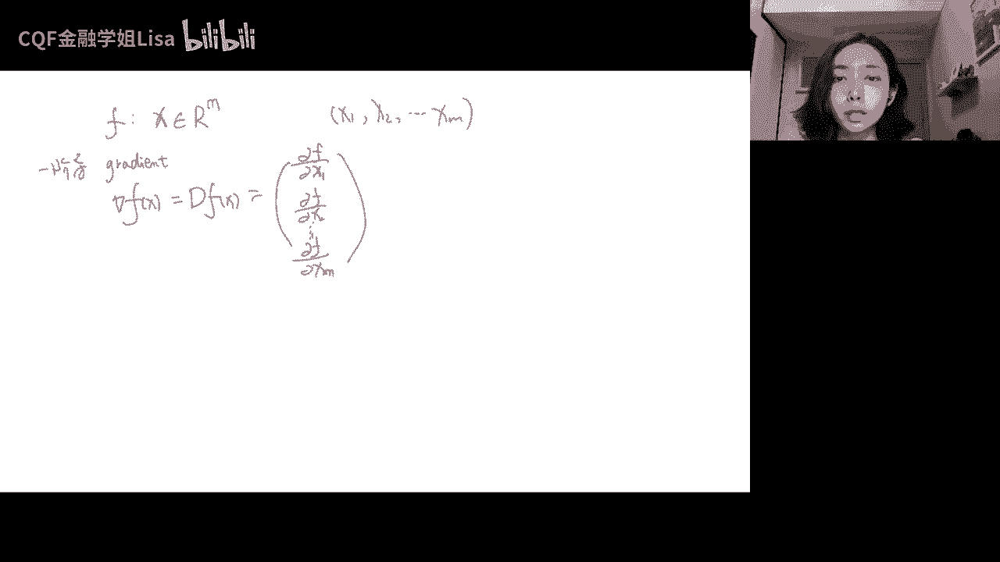

好这就是我们的一阶导DF对DX的一阶导，好然后我们再来同样哈，先来介绍一下二阶导，因为二阶导也是我们要用的好，二阶导的话呢，我们把它叫做hassen handsome函数好。

所以呢我们的二阶导可以用H这个符号，大HFX就等于D的平方哈，就是二阶导FX，所以它其实就是F对X的二阶导，所以呢你要对每一个都二阶导的话呢，就是那就是一个矩阵了对吧，就是首先F对X1需求二阶导。

好然后呢对角矩阵就是F对X2，好然后以此类推，F对X4M得A级了，这是它的对角矩阵对角，然后呢接下来就是这边横的话呢，就是F对X1，然后对X2，然后F对X3X1好，一直到F对XMX1。

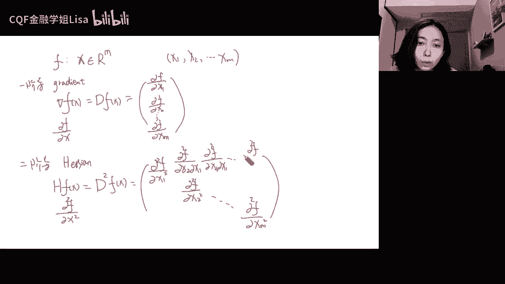

好然后这边就是，F对X1X2，F对X1X3哈，我就直接中间用省略好吧。

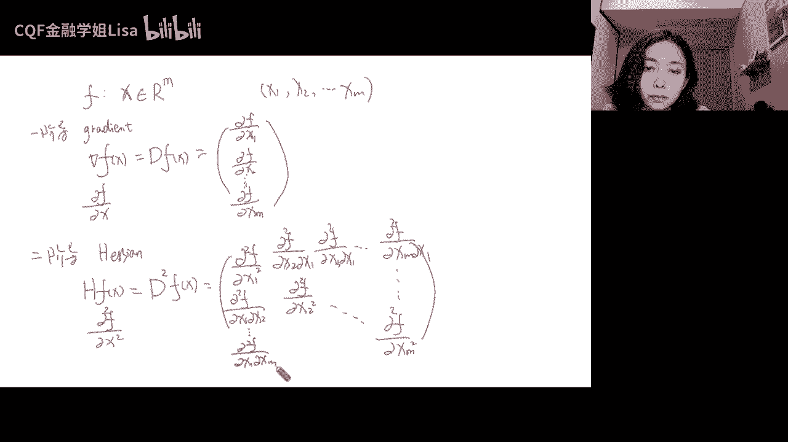

好那么这个呢就是我们的F对X的二阶导。

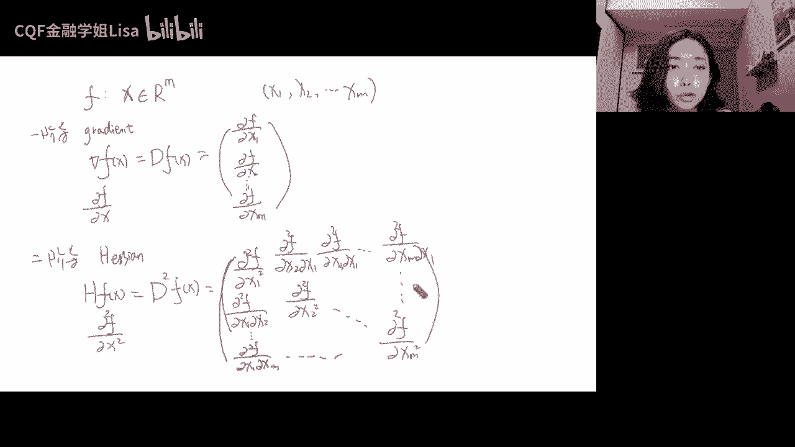

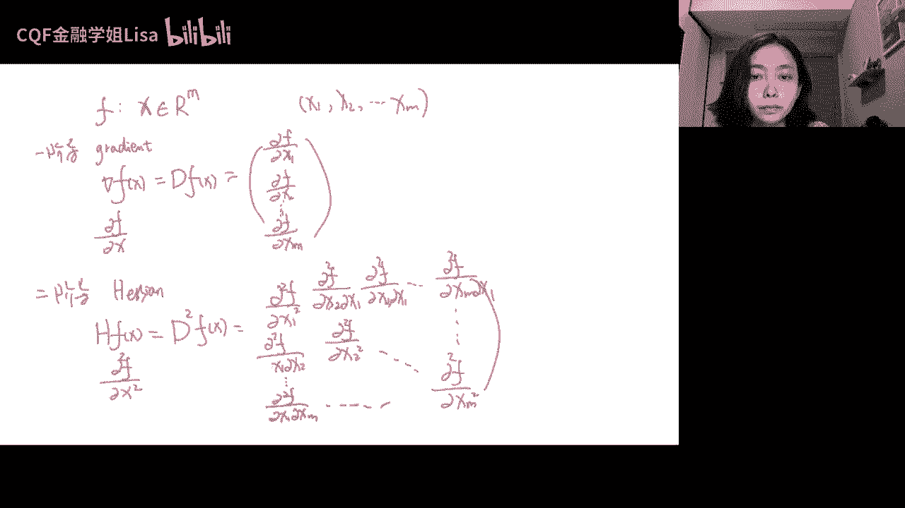

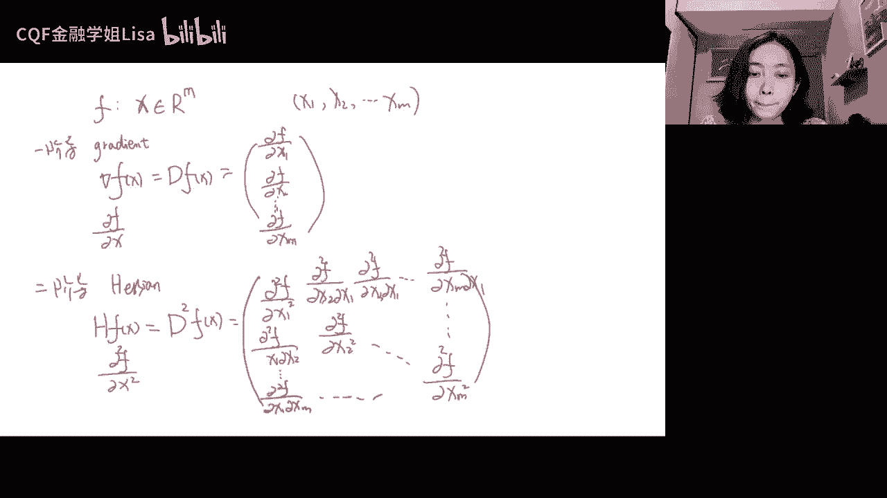

好，然后还有就是如果说还有，就是我们的这个二阶导应该是对称矩阵，对不对，二阶导应该是对称的，因为你，对XIXJ跟你对XJXI应该是一样，好那么这个就是我们啊这个向量的一阶导，二阶导它的一个符号的表达好。

那我们怎么样去找这个这个函数的最小值，或者是最大值呢，我们可以去考虑三种情况好。

第一种情况。

就比如说这个函数长成这个样子。

这个函数长成这个样子的话，那你要求的可能就是它的命了，对啊就是从它的这个命，所以呢如果你要去求他的命的话，那首先他的条件就是它的一阶导等于零的。

然后并且呢你要保证它是这个最小值。

那么它的二阶段应该是大于零的，这个是我们的X型好去求出它的最小值好，这是第一种情况，然后第二种情况就是我们的这个函数，它可能是长成这个样子啊，长成这个样子，那么你可能就是要求最大值。

好那么要求最大值的话，它的条件就还是把我们的，或者把它叫做GX这个函数GX，那么它的条件首先还是一阶导，等于零，但第二条线就应该是它的二阶导。

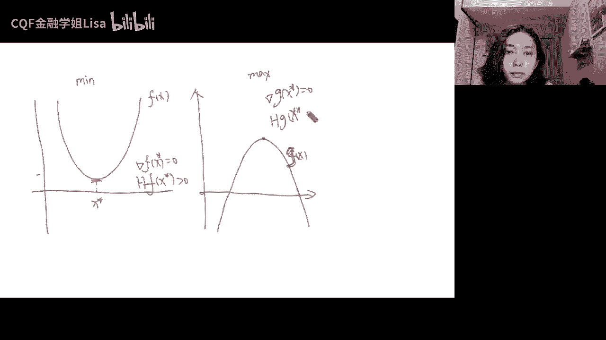

要小于零，好然后我们再来看第三种情况，第三种情况是，如果这个函数长成这个样子，我们用RX来表示这个函数，那么这个时候呢，嗯他的这个就是，你其实并不是在求最小值和最大值了哈，这叫做neither。

也就是说这个时候你得到的一个情况，就是我们的RX这一阶导是等于零的，并且它的二阶导也是等于零的，好所以这三种情况呢只有前面两种，你才能够得到它的最大值或最小值，第三种情况，如果它的一阶导和二阶导。

二阶导都是零的话，那你是没有办法去，得到它的最大值或最小值的好，所以呢我们去寻找这个最大值或者最小值的。

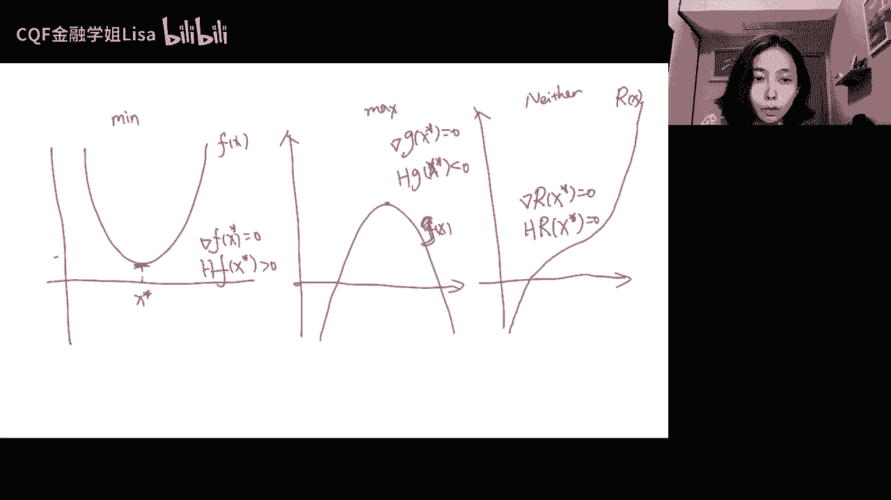

方法，就是它有充分必要条件，它的必要条件其实就是一阶导，就first order，那么这种情况呢其实是属于他的一个必要条件，好必要条件就是我们的一阶导，应该等于零。

好然后第二的话就是他的second order，这个属于他的充分条件，那么这种的话呢就是它的二阶导，要么是大于零的，要么是小于零的。

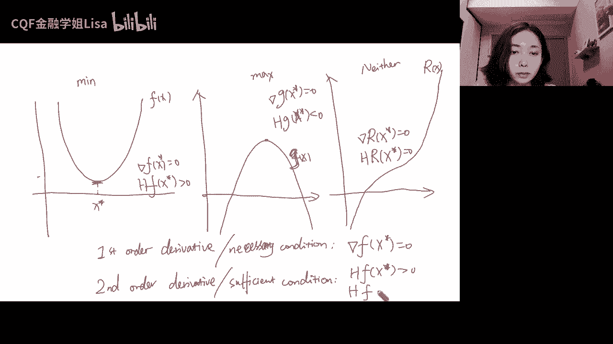

就不能为一，不能等于零好，然后一般来说呢我们这个我们会认为，如果说它的二阶导是大于零的，就是我们有一个这个概念叫做正定矩阵，我们给大家稍微的就是讲一下。

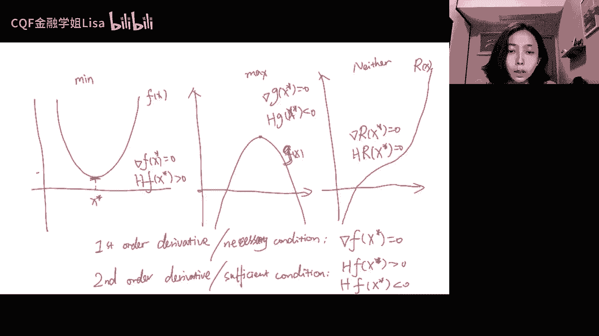

这个正定矩阵的一个概念。

这个正定矩阵。

其实就是说如果我们现在有一个A1个A矩阵，然后这个A矩阵呢它是一个N乘N的一个矩阵，然后现在我们有一个X对于任何一个X，但X不能为零啊，X它是属于N维的一个实数，然后存在这样一个这个情况。

就是我们把X转置乘以A再乘以这个T哈，哦再乘以这个X，好那么它是大于零的，那我们就称为这个A是正定矩阵。

也就是说呃，这个正品只能有一些比较特殊的一些情况，比如说如果所有的元素都大于零，那么他也一定是一个正定的，就是还有所有特征值都大于零，它也是正定的啊，所以为什么我们要去给大家去强调，这个正定矩阵呢。

因为我们马上要见到我们的斜方差，我们的协方差矩阵，它就是一个啊就是对称的正定矩阵，所以我们一会儿会看到sigma，我们的协方差其实是我们昨天也看到过了，西格玛一平方，西格玛尔平方，一直到西格玛N的平方。

然后这边是肉啊，二一西格玛二西格玛一是吧，这边是roe r c a e西格玛二，反正就是这个协方差矩阵，它是正定的，所以我们一会儿也会用这个性质啊，先给大家稍微补充一下。

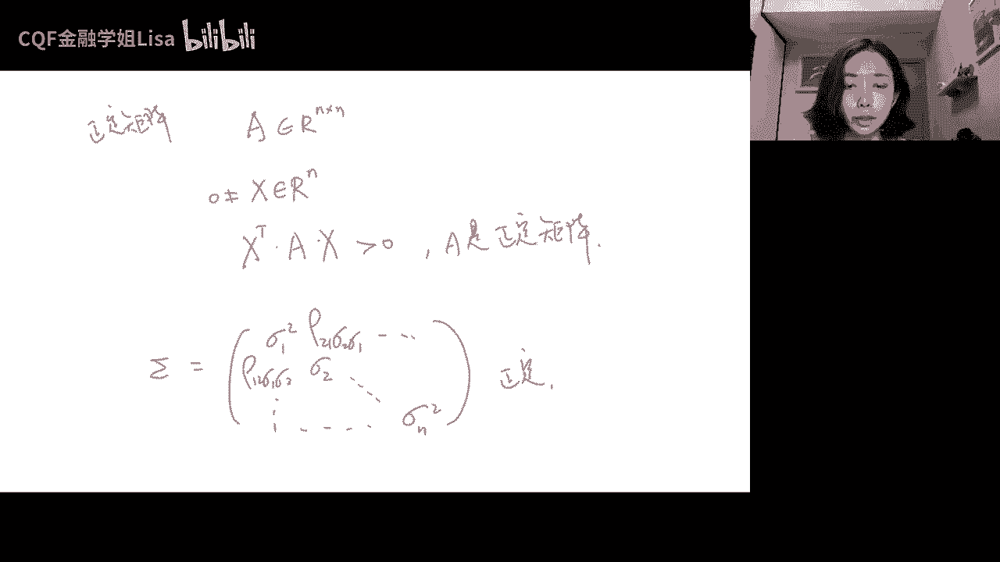

好，那么这个就是我们去找最大值，最小值的一个充分必要条件，那当你的啊这个二阶矩是呃，当你的二阶导是大于零的时候，那么其实就求的是最小值，然后当你的这个二二阶导数小于零的时候，那你求的就是最大值对吧好。

这个是我们怎么样去找最大值最小值的情况，然后呢还有就是另外除了这两个条件之外，其实我们还需要考虑的一个条件。

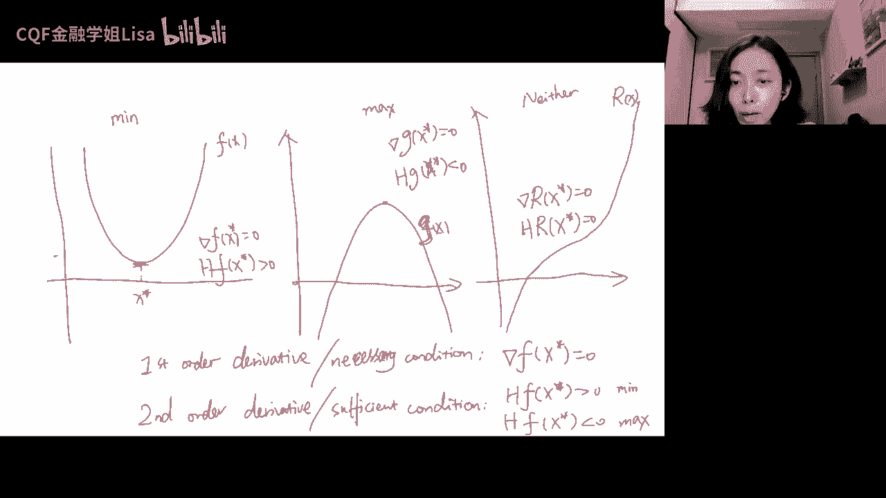

就是边界条件好，所以我们这边还需要啊完整来看。

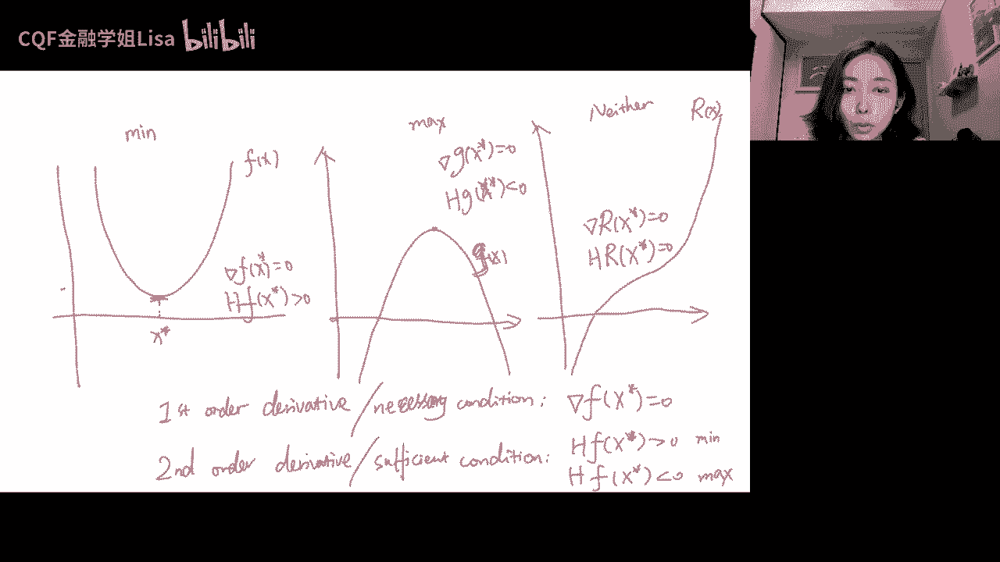

还有一个边界条件需要考虑。

比如说我们是有这样一个函数，这个函数长成这个样子好，这个函数FX，然后呢我们现在要去找它的最大值，但是我们说我们要找他在一个区域内的最大值，比如说我们想找他在A到B之间，然后A在这里，然后B在这里。

我们想找他在A到B之间的最大值。

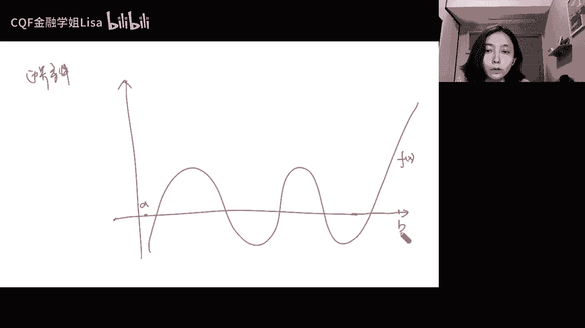

好然后中间的话呢它就是有好几个X对吧，这边有个X1，这边有个X2，这有个X3，这边有个X4，好，所以通过一阶导为零，就是我们要去找最大值嘛，就是需要一阶导等于零，然后算二阶导，小于零对吧好。

那么这个时候，我们其实就可能找到这两个可能的结果。

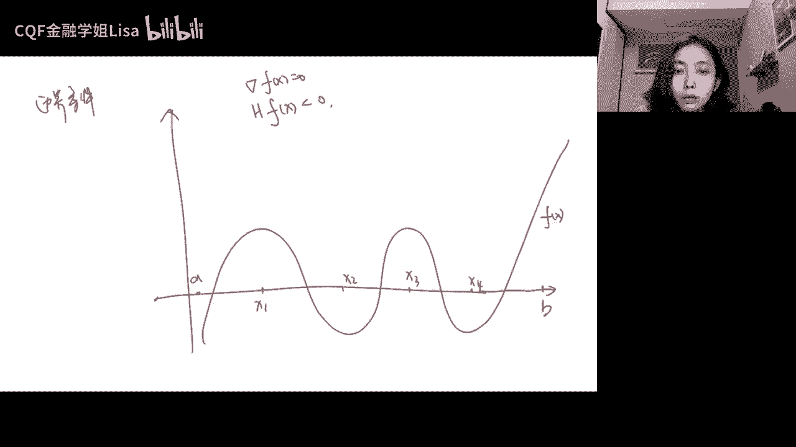

一个在这一个在这儿，就是你通过这两个条件，你去找到这两个max，找到这两个这个可能的结果，但是呢你不要先着急得出结论，我们还是要去把这两个啊，这个我们还是要把这个函数。

它在A和B这两个这两个X点所对应的函数值，拿出来去比较一下对吧，所以呢你会发现说啊这个是我们的FX1，这个是我们的FX3，然后这个是我们的FA。

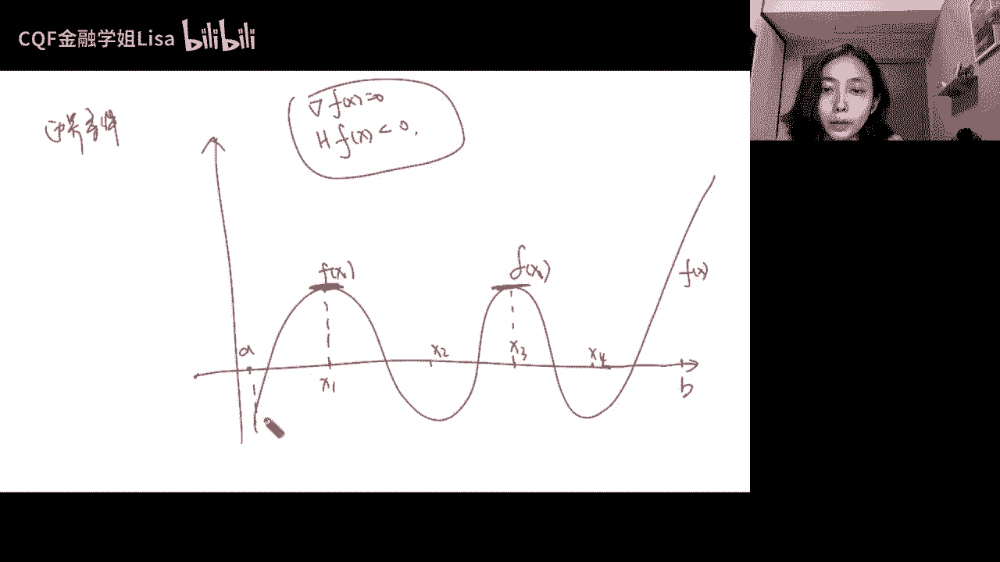

这也是我们的FB对吧，所以呢你要去把他们四个都要比较之后。

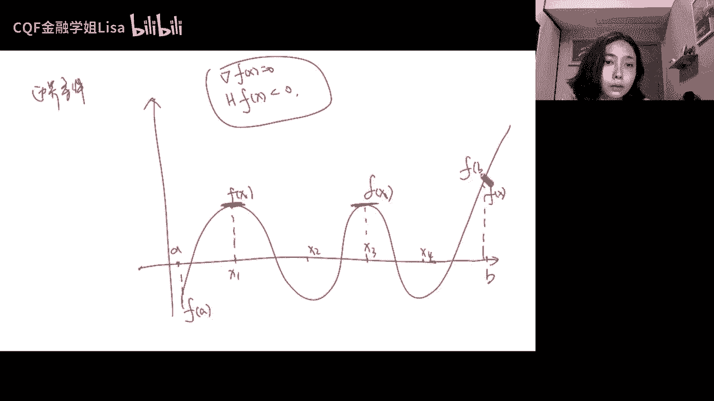

你才能去得到结论，所以这样的话你来看一看哈。

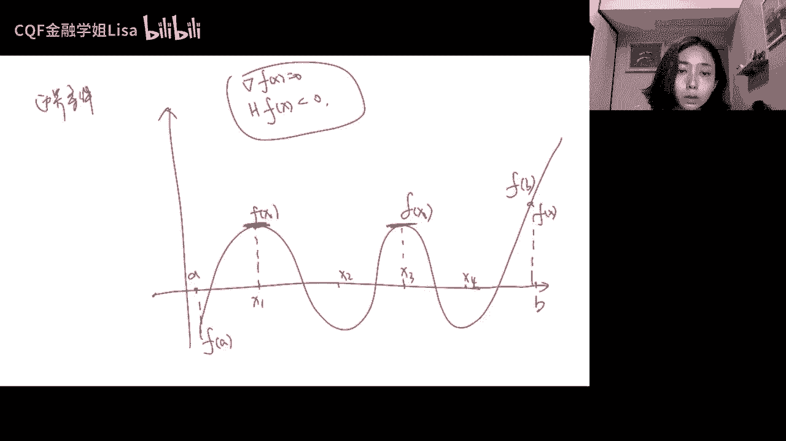

应该最大的值应该是在FB这里对吧，所以这就是想跟大家说一下，就是你不能只看充分必要条件，你还要看边界条件，好那么这个就是我们要先给他去啊。

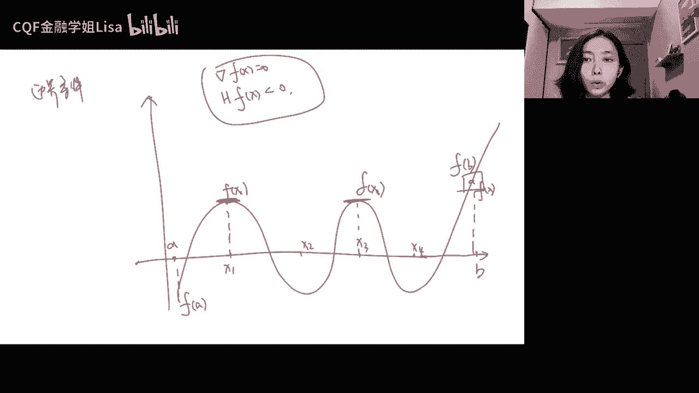

这个讲到的关于他怎么样去找这个mean和max。


那他一个基本解法，它的必要条件是什么，它的充分条件是什么。


好在我们就来看它的一个应用，就是我们的mavance optimization，好，这边的话我们首先还是先formulate好，他说我们在这个一个经济当中，我们这个经济当中有N个不同的资产。

然后每一个资产I呢它都是被他的expected return，跟他的expected standard deviation去描述的，然后另外呢，他们AI和J之间的相关系数是ROIJ，然后并且呢。

你投在I这个资产上的权重是WI好，所以呢我们这个啊这个资产，它的预期回报的向量就可以写成这个样子对吧，每一个都有一个缪，所以没有遇到MN就是它的预期回报好，然后呢，我们还有就是呃。

可以去得到它的协方差矩阵对吧。

我们的协方差矩阵就长成这个样子，所以这个对角就是我们的方差好，然后我们的权重也是W1到WN，这是它的权重的一个向量。


那么这些都是基本的定义，然后接下来的话呢，我们就要去找这个组合的回报，跟组合的风险对吧，还是我们昨天的这个理论。


所以首先呢我们要找啊，组合的回报其实就是这样子的对吧，就是mp去乘就等于U的转置，去乘以权重的向量啊，它这个一撇表示就是转置的意思，所以这个缪派就是等于mu1mu二一直到MN，然后乘以W1W2。

不知道WN，所以得到的就是这样一个加权平均缪1W1，加上缪2W2啊，一直在这样子好，这是我们的组合的这个预期回报率，就我们昨天是这样去写的，来我们用昨天说的大T去表示这个转置好，然后呢。

另外就是我们的组合的方差对吧，这个也是我们昨天看过的，所以这边我们昨天写的是WT乘以sigma。


再乘以W差，权重乘以协方差矩阵。


再乘以权重好，所以其实如果是两个向量的话，就是W1W2乘以西格玛一平方，西格玛二平方，roll西格玛一，西格玛2roll西格玛一西格玛，然后再来W1W2，所以你乘出来之后，他的这个方差对吧。

就是这边我们昨天看过的什么W1平方，西格玛一平方加上W2平方，西格玛二平方加上二倍W1W2，ROSAECA好。


这就是我们昨天看过的这个组合方差的公式好，所以我们可以看到组合的回报，组合的方差都是标量啊，都是一个数，所以呢我们做最大化，最小化都是在针对这个标量啊。


都会在针对针对这个标量好，所以我们来看一下好。

这边有一个aside，有一个题外话，他说如果你有相关系数矩阵。


然后有标准差向量，那么你就可以得到哈，你可以用两个步骤就可以得到它的协方差矩阵，也就是我们在啊这个实际操作当中，你怎么样去得到它的协方差距值，首先呢我们有每一个资产的标准差啊，西格玛节奏慢一点是吗啊。

好好好，尽量慢一点哈，西格玛等于西格玛一，一直到西格玛N，那就大家如果说中间那一块需要我停一下，然后你们需要去截个图啊，或者是需要去写一些笔记都可以告诉我好，所以我们现在有一个标准差向量。

西格玛一到西格玛N，然后呢我们现在需要去建立一个，就是我们需要去构建我们的协方差矩阵的话，那我们需要呢首先先建立一个对角阵。


对角矩阵，这个对角矩阵其实就是我们西格玛的对角矩阵，也就是说，我们需要建立这样的一个标准差的对角矩阵，你把标准差西格玛一到，西格玛N就放在它的对角上，然后其他的位置都是零。

那么这个呢就是我们的diagonal sigma。


就是西格玛的对角矩阵，那为什么要去构建这个，就是为了给我们的斜方大矩阵去做铺垫好，那么你有了标准差的对角矩阵之后，你就可以，那我们还需要一个相关系数矩阵，然后这个相关系数矩阵就是这样的。


就是两两之间有相关系数，然后呢它的对角就是自己对自己对吧，他自己就是自己对自己，所以对角线都是一，所以这就是我们的相关系数矩阵，好然后最后你想得到协方差矩阵。


那么你就是通过这种拼凑啊去得到，就是拿我们的标准差的对角矩阵，乘以相关系数矩阵，再乘以标准差的对角矩阵，那么你就可以得到我们的协方差矩阵了，好这就是我们协方差矩阵是怎么来的哈。

所以不管是用excel还是用Python，你的操作都是先把西格玛去给它，写成这样的一个对角矩阵好，然后呢，再把这个对角矩阵跟相关系数矩阵，再乘这个西格玛对角矩阵哈，他们三个存在一块。

那么就可以得到你的协方差矩阵了，好，所以嗯如果说我们比如说我们第一次考试，可能会考这个，他说如果说题目给你的就是相关系数矩阵，那么你就知道该怎么去得到协方差取证了对吧，好。

所以他这边其实准确来说应该是标准差，矩阵的转置乘以R乘以S，不过无所谓，因为它是对角阵，S转置就会等于S，好那么这里的设置都是针对risky的，然后我们接下来再来看一下rise free。


好就是我们的rise free，它的回报率就是R，然后它的方差是零，他跟其他有资产，有风险的资产的相关系数也是零，好然后呢，无风险资产的权重是W0，因此这个W0就是拿一去减这一坨。

这一坨就是我们risky的权重对吧，就是我们risky的权重的转置再乘以一，这其实就是risky的这个权重，这个一也是个向量，W也是个向量，所以相乘就是一个标量，就拿一去减。

这个标量得到的就是我们本无风险资产的权重，好所以我们的W0加上，这个可能就是百分之百，所以他这个的意思。


也就是说，我们的无风险资产的权重就是拿一去减，risky的权重是W1W2，一直到WN，然后再来乘它的这个E的列向量，对吧，所以呢你最后得到的其实就是一减W1加上W，二加上加加加到WN，好。

所以我们的无风险资产的权重就是拿一去减。


所有risky权重相加的那个和，好那么这个设置好了之后，我们还是来看你把risk free跟RISKIE，合在一起，这个组合它的回报率是多少对吧好，那我们来看一下他的这个新的回报率。


其实就是长成这个样子了，这个其实我们昨天也是看到过的对吧，那么这个就是啊risky的weight去乘以risky的，然后这个就是啊rise free return。

然后去乘以i refer weight，对啊，就还是在加权平均嘛，然后这个就是你再给他整理一下，这个我们昨天是是整理过的对吧。


整理一下就变成这个样子好。


那么这个就是我们的excess return，或者是我们的risk premium。

好同样就是这个新的组合，你把rise free跟risky合在一起的这个组合，它的风险有没有变化呢，没有变化对吧，因为我们说了无风险资产，它的风它的风险为零，它跟其他资产的相关系数也为零。

所以呢把它加进来，是不会影响我们之前这个组合组合的。

这个风险的，所以呢我们的这个西格玛派的平方，还是W西格玛W好。

那么这就是把无风险跟risky结合在一起的，这个新的组合，它的回报率，预期回报率跟它的方差的一个情况好，那么现在我们就可以去做formulate了哈。


我们就可以去做最优化了，我们就来看一下这个main variance optimization。


所以这边呢我们把这个MVANCE。


optimization的问题给他写成这个数学问题，就是我们其实就是要最大化这一坨，那么这一坨呢这就是我们这个组合的预期回报，这个是我们这个组合的预期方差，然后呢。

我们说这个其实就相当于我们的惩罚项对吧。


也就是我们的这个把缪的回报率，然后呢去减就是我们的方差作为乘法项，乘以二分之拉姆达，拉姆达就是风险厌恶程度，所以这个你要最大化的这个东西，它其实就是我们的效用函数，就是经济学理论当中它叫做效用函数。

所以我们其实就是想要效用函数最大化，想要去找到W那个W性，能够使得相关函数最大化好，那么接下来呢其实就该去解方程了。


好我们就要去解这个方程的话，你就把这边的mp sigma p p5平方。


就用这里的这个去做替代对吧，这就是我们的mu p。


然后这个呢就是我们的西格玛平方对吧，用它们去代入好代入。


然后再来去做微分等于零啊。


这些相关的一些操作，所以我们就来看一下。


比如说我们就把这个目标函数也就算用函数，我们用V来表示它是关于W的函数。

那么就等于mp去减二分之拉姆达，西格玛P的平方，然后我们先把mp跟西格玛P都给他带进去，所以mp就是我们这里的。

R加上W乘以六减R1，然后西格玛平方就是W乘以西格玛乘以W哈。


再熟悉一下草，所以带进去的话，这就是R，加上W乘以M减R21，好然后呢再减二分之那么大，然后这边是W西格玛W对吧好。


然后这边这个很明显是一个二次的，就是W方嘛对吧，W乘以W它明显是二次的好。


因此我们现在呢要去求它的最大化的话，就首先先一阶导是吧，先一阶导，好一阶导的话呢，就是我们想要去DV对DW就对W去求一阶导，我们想要去找到那个一个W能够使得它等于零，所以说我们要找到一个W星。


然后这个W星能够使得这一阶导等于零好。


因此呢我们就来去求一阶导，一阶导的话，DV对DW这边的话呢就只有这一坨对吧，就是mu减去R1好，然后这边啊这个右边这一坨。


因为他这边是个二次的对吧，W方，所以W方啊求导的话就变成2W啊。


所以他得到的就是二分之拉姆达，然后乘以2sigma w好，那么这个时候呢，我们的这个二和二是可以抵消的好，因此呢我们就可以因为这个这个是列向量，然后这个也是列向量好。

因此我们就可以把它写成new减去R1，然后减去拉姆达西格玛W。


好然后呢我们说既然我们要让它等于零嘛对吧。


我们要找到那个W星，使得它等于零，好那这样的话我们就其实就可以去移项，因为我们想要去求的是这个W星对吧，就是这里的是W星，能够让它等于零，所以呢我们就给他上一个项，这就是缪减去R1。

就等于拉姆达西格玛W型，那你想把这个W星给它单独拎出来的话，那你就需要首先把拉姆达存到那边去，然后呢西格玛是矩阵，又同时左乘西格玛的这个逆矩阵对吧，所以呢你就可以得到说我们的W星就是那么大。

分之一乘以sigma的逆矩阵又要做成，然后乘以六减R1就等于W型好，那么这个W型其实就出来了好，所以根据一阶导，你得到说当我们的W型等于这么多的时候，我们的这个效用函数目标函数能够最大化啊。

这个是一阶导。


然后我们再去做二阶导。


好二阶导的话，我们就是继续去对这个W再求一次导好，所以也就是DV对DW的二阶导好，二阶导的话呢，那这边的W的话其实就只有只有这里有了啊，所以呢你给他就相当于说我们再来一次，这里面都没有W只有他有。

所以得到的就是负nana sigma，好负那么大，Sta，然后这边的话呢因为sigma是正定的，我们刚刚看过吗，我们说协方差矩阵是正定矩阵，然后那么大呢又是大于零的常数对吧，那么答案是风险厌恶水平。

它是大于零的常数，所以呢你这个加个负号，那就肯定是小于零了对吧，所以我们的二阶导一定是小于零的，那所以我们这边就是在求max没问题嘛，好，所以呢我们就得到了唯一一个。

能够使得这个目标函数最大化的这个WW型，就是这一坨好，那我们的这个最佳权重其实就得到了，好因此的话我们就可以看到我们的课件。


其实它其实就是在描述这样一个过程啊，这我刚刚看的，那你记得等于零，把W星求出来，然后二阶导小于零，所以我们找到了我们的maxim，好这就是我们要解决的UNCONSTRAINT，没有约束条件的问题。

没有任何限制，直接去最优化上用函数就可以了。


好然后呢第二个application没有讲哈，这个线性函数线性回归哈，这个没有讲，反正就是啊我们如果大家学过计量经济，学过统计的话哈，就是如果你学过线性回归的话，我们说你要去找线性回归的参数对吧。

它的贝塔零贝塔一，你去找这个回归系数的时候，其实用的就是最小二乘法，那么最少按二乘法，其实就是要让它的残差和残差平方和最小对吧，那其实就是又在去做一个最小化的问题嘛对吧，所以我们这边啊使用最小二乘法。

就是要让残差平方和最小，所以呢你的目标函数就应该是残差平方和，然后你要去找到那个贝塔系数，使得我们的财产比平方和最小，那么这个最优化过程就可以搞定对吧，你的贝塔系数就可以估出来了好。

所以这边具体的过程没有讲。


所以呢大家如果感兴趣可以自己去看一看。


好所以这就是我们要，这就是我们要最小化的目标函数，就是我们的残差平方和。


好所以OLS的建模的逻辑就是这样子。


所以这是它的一阶导等于零。

所以你就可以把这个贝塔给他找到了。


然后它的二阶导大于零，所以你求的是最小值。

好这边就不多说了。


我们要不休息一下，我们休息一下，再来看这个generalizing，对参加平衡和我们休息10分钟，八点钟回来哈。

残差平方和的概念不懂呃。

这个其实就哈这个要讲的话，可能又要扯到另外一边去了哈，所以这个嗯就是你可以比如说找一找cc的数量，量化金融，就cc1级的数量金融，稍微看一看他的那个线性回归，就是一集的最后一张可以看一看。

因为他这个如果你完全不懂的话，是需要从根本去补的。

那就是采样平和，简单来说，其实就是说你会基于比如说有很多观测纸，然后呢你要用调线性函数去拟合这些观测值。

但是呢你在拟合的时候，你对这条直线是没有办法去准确的，去描述每个观测值的啊。


每个观测值跟你的这个你拟合的这条直线之间。

是有一个距离的，那么这个距离就叫残差，所以呢你再去找到底是拿这条线去做拟合，还是拿这条线去做拟合，还是拿这条线去做拟合啊，就是你因为你可以用不同的函数去做拟合，但是哪一条是最好的，哪个函数是最好的。

其实就是你去通过把你每一个观测值，离这条直线的距离，就是每一个观测值跟这个函数的残差都算出来，然后呢去全部平方就把方向给它，全部呃这个呃就是不管不管方向啊，全部平方，然后再全部加总。

你能够去找到哪条线使得你的残差平方和最小，那么哪条线就是你的最佳拟合函数啊，这大概是这样的一个逻辑哈，但是如果说你之前没有学过统计的话呢，还是哈建议你再来补一补，因为其实我们到后面也会用。

也会用到统计的计量，经济学的一些基本的知识的。


好所以就是你就去网上搜一搜相关的线性线性，线性回归，简单线性回归的一个这个这个文献。

