# 2024最新【推荐系统基础+实战】knnTF-IDF词频统计 向量化表示 非结构化数据文本自然语言处理 附带课件 - P1 - 华仔讲编程 - BV1Jt421w7Jx

老师，哎在的同学可以听到吗，可以那好，我们来回答一下你说的问题哈，呃这个老师我把我把我做的给你看一下，看看是不是对的，我微信上发你嗯，看你发你给老师发了两张图片了，是吧啊对那个是题目嘛。

然后我看一下我这样这样cut对不对，我微信上发你的第一个第一个是第一个是题目，第二个是你的歌对吧，切割啊，这是怎么了，其实我们这个讲的快啊，知识点密度大，这没办法的事，然后呢你看对这个概念的理解。

看你理解的对不对，呃，我们先来老师先把这个课件给你打开，稍等一下啊，老师老师，你现在知道答案了，我看一下哈，你稍等一下啊，我看一下你的答案，1635635，2626，你这个歌的应该是没问题的。

割的是没问题的，1635啊，然后还有个1414的答案，你做了吗，一次是下面那个图，我发了新的两张图嗯，我觉得一开始发的那个图应该应该不可以吧，一六你只有一个三五吗，那前面的你没画出来呀。

他不是只能割你搁一个吗，不是啊，你要把所有每个进程不是只能割一次吗，我看一下哈，诶有这个我我再发一下定义啊，好像没有这个要求啊，嗯哦这是这是我问那个GPT的，我问他他能不能重复歌，他说不可以。

会造成混乱还是什么，嗯稍等一下哈，呃这个是concurrency这个课件啊，当时老师来了一个投机屏，啊我们回顾一下这几个概念，嗯能看到老师的课件吗，嗯啊你看我们有这几个概念，一个是一致性切割。

一致性切割保证的是，这个歌里面是一个因果关系，有一个因果先序的一个关系，就是因在呃音在前面裹在后边啊，你这是你的切割，然后一致性切割指的是什么，是一种实力，在你的这种并行计算的框架下。

在你的分布式计算的框架下，它是一个实例，这个实例里面，这个实例里面，要满足你的因果的先后顺序关系啊，一致性切割，也就是说你这样割出来的the total ordering of events啊。

你这个切割割出来这些事件啊，他们满足了因果的偏序关系，什么叫偏序关系，比如说啊事件A决定了事件，B事件C决定了事件D啊，那AC的关系是无所谓的，我们只关心偏序，就说ABA一定在B的前面，A决定C。

C决定A决定BBC决定D，也就是说你的ab和CD先后关系，这就叫偏序，而AC谁在前面就没关系啊，这是偏序关系啊。

然后他说the carol history of event is the smallest consist，cut of the process group including event e啊。

我们课件里的定义他倒是没说啊，倒是没说这个是否一定要这个呃，是否一定要这个不同的不同的进程，但是你看这里面我们当时有这个例子，152633，他确实是每个进程会留一个，每个进程会留一个是一致性切割。

满足的是你看一五在二六前面，在三四当时写错了，是在三四前面，老师我后来看了一下，就算是133也没有问题，你说什么152633是吗，对三三他也也没有问题，A26，你三三不是在这个二六的前面吗。

哦对那如果你这是三三的话，他不是不可以吗，就是三三应该在二六的前面，老师你的意思是这个括号里面的东西，它是有序对，它是有顺序的吗，是的，那也就是说要改成115，然后133，然后126嘛，嗯不是一五呃。

你说的一三在哪啊，不是一五，然后2634，这是一致性，说他最后一个改成三三，是不是也没问题，最后如果改成三三，他就不至于不是一个一致性切割了，因为他因果是满足的，就是呃呃三三决定了R6啊，是啊。

那你三三你在二六的后面呢，偏序，你就是我的意思是这个空这个括号里面，这三个一一级一级的这些事件，它只是列出来告诉我怎么切割，然后他可能并没有包含顺序吧，你说这里面啊有顺序啊，我我说不是。

我说的是那个C2，等于括号11561266133，我说这个括号里面这三个列出来的事件，他们只是列出来而已，没有没有顺序哦，他这里它是有顺序的，就是哦老师刚才没听懂你的意思，是你一直在说一。

原来你说的是英文字母EABCDEF啊，OK那我明白了，那它们之间是有相对顺序的，嗯我我我意思就是括号里面这三个事件，他列出来是告诉我们我是这样认为的，他列出来是告诉我们沿着哪些事件去切割。

然后切完之后呢，就这三个事件切完之后呢，它的因果是能够保证的，它是封闭的，就是说比如说拿这个举例，这个133是在这个切割的这个里面，在切片的里面，然后133他啊发送了M3的信息给124。

然后可以成功触发126，然后所以我觉得它是一致的，可以触发126，我看一下哈，No ko in，126，126发送了消息，M4到，1R6发送一个消息，M4没有影响他一般三四，看一下啊嗯。

然后我想他后面说的126发出的M4，没有影响，也就是说他发出去的信息，不影响这个切割机的一个啊，封闭也不影响它的那个因果一致性，我再看一下啊，你说的当时我在想是不是我想错了啊。

一致性切割在因果的先序关系中，保证第二个，The total ordering of events imposed by the run is consist with，保证了先序关系，呃同学。

你的意思是说呃这么一切，1425132这么一切，这是一种这种的时候是不一致的，因为我看一下124，因为E24，124124是由M3触发的啊，但是没有包含133啊，对我想说的就是他这个列出来的这个cut。

括号里面的这些英文，这些事件它没有一个特定的顺序，他只是告诉你怎么切，沿哪里切，OK就是说切之后要保证因果相同的，在一边就不能跨，不能跨这个切割是吧，你的意思是前面的定义。

它前面的定义有你的consistent，car里面不能有未知事件，未知事件他的说法是未知事件，就是某个事件要触发你这个切片，但你没有把那个触发的那个音给囊括进去，那就是未知事件，你说的是哪个。

你说的是这个吗，我说的是那个consistent cut，就是第一个就嗯或许再看看上面，我记得哪里是说了，就是说嗯我看下一个run。

A total audience of all the events in the global history of a distribution，Computation。

Consist with the local history of each partition，那你的全局的顺序和你的啊，一个一个的local history是一致的。

Ran implies a six of events，As well，As a six of global state，是一种run，是一个事件的一个排序啊。

cut是local history的一个子集，对frontier front of the card啊，这个cut的手是你的全局的状态，一个N元的包含了，包含了每个月的最后一个事件。

Cut provide the general blue，基于消啊，你看基于消息交互卡着，Between a monitor of a group of process，然后跟哦可能他没有讲的很详细。

这里后面我自己查的是，他那个关于看是否一致性，需要考虑包含的事件是否满足因果关系，事件的顺序是否满足因果关系，然后还有未知事件，就是没有发生，但是对这个cut有影响的事件。

就是那种触发的那种会发出信息的那种事件，那比如说我们这个C1是这么一个切割对吧，133就没有包括进去，这个就是未知事件，OK你说133没有包括进去，是因为有一个M3的消息对吧，对他他对这个事件有影响。

但是他的那个因果在里面，但是因却没有就不满足因果关系，OK嗯C2嗯，然后C2它是它这个因果都在里面，都包括进去了，所以他的他的因果是完整的，也是5126啊，就是这个消息跨没关系啊。

他的音在里面就可以是吧，对因为134不是接收它不是股，他不算未知事件啊，那老师你说的是对的，那就是老师之前我看的看错了啊，那你这么说是对的，所以那对于我们这个116这个切割，一六的切割啊。

你包含了E35都包住了，116全都包了呃，那那我们不是说要包含三个吗，那你的那个PP2的话，OK他这个是固定一定要有三个，那你看我们这个老师这个第二个C2的例子，你看它确实是有三个用三个来限制。

就是说啊哎不是有可能对，如果你写歌的话，就你这么画没问题，那你写歌的时候，你是不是得写那116126135确实是吧，然后你的11414的这个history，一四的是呃，我看一下你画的是没问题的哈。

就是你写114呃，EE2的腰啊，然后然后你那边就是131就行了对吧，就是你往下划131的话，就包括进去了，我画的那个图是不包括，就整个第三个进程都不要了，嗯那我们那个我想下。

你有查出我们必须包含三个进程吗，嗯我没查这个问题，因为我没没，我没意识到他一定要三个，但是你看这两个例子哈，它确实是三个，不是把三个进程都包过去，但是第三个和前两个没有联系，这个同学你可以再确认一下。

我觉得是不是要包含每个进程啊，如果没有关系的话，那当然比如说就P3本身没有和P1，P2这个发生关系嘛，对吧，他根本没有联系，那就不包含，如果为了必须凑三个进程的话，那就得包含。

但我觉得我倾向于答案是前者，这同学可以再确认一下，或者再找助教问一下啊，我觉得可以确认一下嗯，Ok，好嗯，老师来看一下哈，我们先来解决你的这云计算还有其他的问题吗，啊不是之前不是还有个git那个流程图。

OK嗯好的，我们把这个老师找一下这个图片啊，data这个流程，你现在对git了解有多少，你之前也用过对吧，对，我就只知道它的一个基本流程，就是要啊poo poo，然后code，然后test，然后再铺。

再铺一下，然后就ADD，然后commit，然后push，OK啊，我是来给你一，嗯K老师来带你看一下哈，我先给你普及点基本的知识啊，就是关于git的使用呃，我来投一些平。

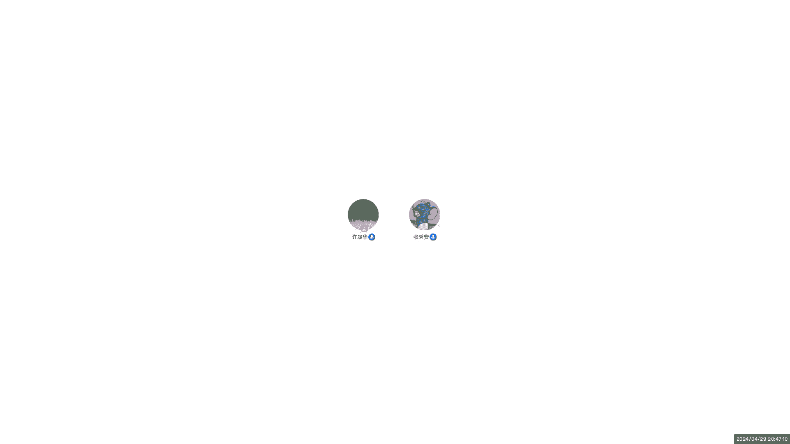

关于get的使用，我觉得同学要搞清楚几个概念啊，概念是什么呢，我来用白板可以看到老师这个黑板吗，可以啊，有几个概念，你要掌握的第一个叫做local，Work directory，本地目录啊。

还有一个叫什么，你的local repository，本地仓库，还有个叫远端的远端的仓库，Remote repository，有这么三个概念，你同时在你的本地目录下，就看你的文件夹。

比如说你新建了一个啊一点PY的这个文件，这是在你的工作目录里，你会通过GI的啊，加到一个暂存区，加一个暂存区，上城区1commit啊，先爱的，they commit会到你的本地仓库。

ADD是到那个暂存区stage是吗，对到stage是的啊，然后commit对，是把所有的暂存区的数据到你的本地仓库里哦，这个本地仓库和本地work directory有什么区别呃，你可以这样想。

就是你的work directory只有一份，但是你的low local reporter可能有很多分支，你一切换分支，比如说你有分支branch1，branch2branch three啊。

一切换分支，你的目录会只展示这个分支的内容，你就可以理解为仓库存了好多个版本，然后你的work local的work directory，只是显示了其中的某个版本，取决于你当时切到了哪个分支哦，啊对吧。

这个是这几个概念，同学先先搞懂啊，然后你这道题呢他给了一个按时间线啊，因为你的gate就是大家协作去使用的bob查理啊，啊有同学你说的对哈，一个是拉拉取，就什么从远端的就是远端有没有做修整。

你把它的复制到你的本地就破拉下来啊，把你的修改推到原来就叫push啊，你看在10。25的时候，三个人都做了put操作，也就是说这个时候三者保持了和远端一致，和远端一致对吧，然后接下来在你的10。30。

10。30啊，爱丽丝修改了A点TXT啊，bob修改了B点TXTC点TXT，是因为大家是协作的吗，大家是协作的啊，然后呃，你看看下面的问题啊，问你到。

the push at十点35by b makes NO changes，As no，local changes are committed啊，看一下他这是在给你解释哈，嗯问你有哪些错误。

嗯OK我们来看哈，在10。30的时候，大家都编辑了，都完成了编辑对吧，完成编辑之后呢，你在10。35这块就已经开始出问题了，你看正常来讲呢，你要先啊，你要把你的修改提交，修改提交啊。

他这个A点TC是把这个at和commit加一起了啊，呃就是他改了A点TXT，那这个能交到了ALICE的本地仓库，然后你的bob bob是什么，直接pull了我们的过程必须是pull是什么。

pull是拉取泥，诶，我看错了，他是push，Get push，我们说push指的是给你的local repository推到远端，local repository推到远端。

你现在这里面还没有任何的内容，因为你都你都修改还没有提交呢，你的修改都是在本地目录的修改啊，所以你想去push的话，你想去push的话，啥都没交上去，对吧就是我们的正常流程是先艾特到缓存区。

艾特缓存区commit到本地仓库，本地仓库再push到远端，而你bob在10。35这个push操作啊，你啥都没改啊，你的local repository里边没有新东西啊，所以没有产生任何。

它是也有A的功能吗，啊，他这个杠铃应该是把那个ADD和commit写成一步了，好的嗯，然后如果直接直接push，如果不在暂存暂存区和本地仓库提交的话，直接push就是什么都没有变啊。

因为故事的作用是把local repository的东西，添加到远端，而你现在你bob的话只改了这个B点TXT对吧，bob只改了B点TXT，你的其他东西你远端仓库没有变呢，对吧对。

就是同学一定要搞清楚这三个就知道了啊，那你你这个push就相当于是你啥修改都没做，就开始push了啊，所以就是啥都没改，啥都没改，然后在10。40，啊你这个鲍勃又开始破了，鲍勃开始破了啊。

噗你pull的时候是没有任何问题的，因为什么，因为我们会说你的版本远端版本是V1，你这个版本是V2，你把它拉下来之后，它会自动的识别，就说啊V2没事，我的V2已经比你比你的修改还要领先了。

就是我是你的高版本，所以你pull的时候其实没有产生任何的操作，啊同学能明白吗，老师你再说一下啊，固有的作用是把你远端的代码，是把你远端的代码拉下来哦，拉下来，然后你的本地就相当于什么，你你写论文。

你的远端存了个版本，一你的本地啊从V1改了一些东西变成V2了，你再从远端拿下来的时候，我应该保留什么，保留你新的你V2更新呢，所以鲍勃这两个push和pull操作，没有产生任何作用，没有发生任何改变。

因为gay是一个版本管理工具，版本控制工具，我的我现在的版本比你的远端的版本还要新，我的文件还要新，所以我不会做任何改动，对吧啊，对同学对get的认识是他是来回合并文件的，多人协作的对吧。

OK所以他那个A的git push force是把在此之前，所有B和C做出的改变全都归零了，然后更新为A他自己的文件了是吗，你说哪个10。35的boss，10：50分的时候。

二点还有个git push force，对他会把ALICE的操作，把ALICE的操作给加上去，他那个git push force是只改变ALICE改变的部分吗，对你每个人。

push都是把自己的修改的内容就添加到远端，但是他那个答案说这一个操作他重写，重载了所有关于C的改变，他答案的第三个关于C的改编，我看一下哈，呃你关于C的改变，你的爱丽丝提交你的，这个时候你的C。

我看看C在10。40的时候，也提交到本地仓库了，C的时候在C提交到本地仓库，然后你也提交了，你也提交了，然后你的这个ALICE在提交的时候啊，明显这两个分支是不同的对吧。

就是呃你相当于是什么ALICE啊，爱丽丝改的和CHARLES改的，他俩是不一样的，是一个版本的两个分支，所以会合并是吗啊对就是正常你去push会报错的，就是你在10。50的时候啊，你在10。50的时候。

你ALICE在网上提交的时候是会报错的，因为他现在有两个分叉了，就是啊呃我们这个分支原来是这样的啊，A改了啊，ALICE改了一下，查理改了一下，这两个版本已经不一样了对吧，对比你正常。

你往上交是交不上去，因为你不一样啊，你应该先破，先把那个查理的修改先拉下来，然后你再去提交，但是我们用了一个杠杠false false是强制执行，强制执行就会什么强行交成功，但是会把他的修改给抹掉了。

好嗯，然后我们接着往时间线捋哈，你看查理斯的改动是能交上去的，然后你在10。45，那个鲍勃又开始编辑了，又开始编辑，然后呢10。50的时候，10。50的时候啊，就这个A会强行抹掉其其他人的修改。

所以这块只多了一个A点TXT，这个是改动的，然后这个时候你的鲍勃又把这个D给编辑完，所以你在第10。55的时候，鲍勃会把BD都会什么都会都会，这个添加到本地仓库就10。55的时候，10。55的时候。

BD的修改都会加到本地仓库，然后你再push在11点的时候，你的鲍勃进行push，那那会重写重写什么，重写你A的修改，好啊，没问题没问题，OK对，所以他你看他后面他会告诉你哈，就是你在每次push之前。

你不能false，不能强制push，你应该先拉取最新的啊，就是你不能用故事false这种操作，因为你push不上去，就证明你有冲突，你应该去解这个冲突啊，所以你应该在push之前先铺一下。

嗯OKOK然后嗯你想想还有什么没了是吧，嗯OK这个同学理解了它的用法是吧，理解好的，然后我们现在就是，呃推荐算法对吧对嗯，老师看了一下，那我觉得可能有一些计算题，我们需要需要讲一下啊，看一下。

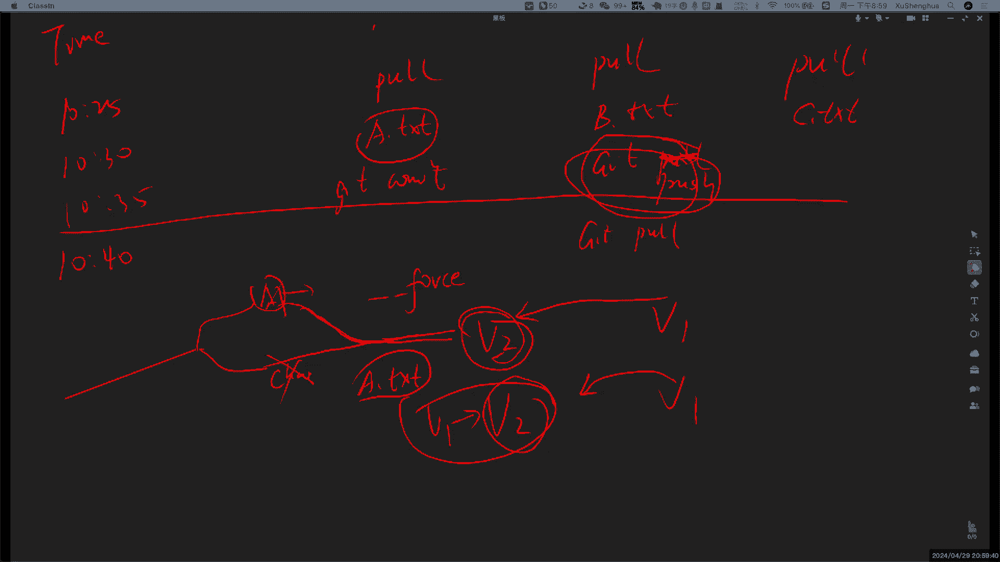

这个协同过滤，然后呢嗯这些内容啥的咱就不说了哈，你怎么去算，你怎么去算，一些理论性的东西，看一下协同过滤，OK啊，我们看一下这个计算题呃，关于这块同学还记得有多少推荐系统呢，有两个主体，一个是user。

一个是item，然后我们会有一些训练的数据啊，这个这个我自己付了，这个我根据第一个作业，我自己付它下面的那个TDF，还有war banding，我是没有付，然后想看看下面那个呃，这个你现在都OK吗。

这些算了，这个我对着作业看了一遍，就知道怎么算的，OK好，那我们来看一下这个呃，我看看是哪一页，你是说的是TFIDF是吧，对啊，看一下啊，这这呃我们说在推荐系统中，我们一般处理的是文本的数据。

而我们最终会转化成数学计算啊，那怎么把这个过程，把你的文本转化成你的数学计算啊，我们会用一些方式啊，最简单的方式呢是one hot，这个同学还有印象吗，就是我不管你有多少个变化，就是你的词汇表有多大。

我用一来表达那个位置，比如说啊这个电影它有这个呃有这么几种特性，比如说喜剧特性，adventure特性，superhero特性，而存在与不存在，用零一来表达，所以每一个电影。

我可以用一个向量来表征它的意义，啊还有就是如果你是一篇文章啊，或者用文字去描述，比如说他的这个title啊，作者类型啊，keyword也可以，也可以去把这些单词用one hot来表示啊。

这是我们的one hot编码，OK它有什么用呢，呃首先每个人我们说有历史数据是能打分的，对吧，这个这个用户对这个电影打分，然后下面是这个单词的特征矩阵，就是我们用one hot来表达这个这个电影的特点。

这个这个这个也也是在那个作业里面对啊，你说这个你也你也是会的，对这个waited unwaited，这个也是会的，OK啊我看看这个呢，呃这里是吧，这里是需要讲一下老师看下大纲。

老师翻一下上面上面也是这个吗，啊对对对，就是这就是这这三个对吧对啊，TF指的是term frequent啊，词频啊，IDF指的是逆文档频率呃，还是最根本的问题，我们输入一个文本。

你怎么把它转化成对应的向量表示，这是我们要做的啊，尤其是这个文本是非结构化的数据，非结构化就是它没有一个清晰的结构啊，有多少单词，每个句子多长，这都是不固定的，这叫非结构化数据。

那我们会从自然语言的角度，一篇文档是有很多个单词表示，单词呢用一个向量问一个文档，就是向量的集合啊，就是我的TFIDF啊，而你的这个文档中就是什么是重要的呢，我们说这篇文章中出现的词最多。

那说明这个文档是某一个特性，比如说啊他出现的都是什么湖人啊，詹姆斯这些词的词频很高，说明他就是一个聊体育，聊篮球的一个文档，一个主题对吧，嗯啊我们用词频在某种程度上能够访问它的，能够体现它的主题。

对吧啊，然后逆文档频率是什么意思呢，有一些词，比如说我们说了的D，就这种助词或者语气词的出现频率也很高对吧，那你光看词频，其实它不能表现它的特点，有些语语气词助动词频率也很高，所以我们还考虑什么。

就这个词LDD出现频率很高，但每篇文档中出现频率都高，那就没有区分性对吧嗯，所以我们会提出一个新的指标叫逆文档频率，这个逆指的是什么意思，如果你你在所有文档中只出现了一次，就说明你这个词很独特。

很容易表征这篇文档的特点，就是你出现的次数越少，你对应的起到的作用越大，就是这个数值越低，说明你越重要，所以就逆文档频率是某一篇特定的文章中，它出现的少，还是说普遍文章中都出现的少啊，我们说说的是什么。

是这个单词出现在哪些文档中，我一共有1万个文档，你这个单词出现在其中的两个，那这个单词的计数啊，就是二出现的文档的个数就是二，那个tf term frequency呢，那个是在那个是在单篇文档中。

这个词出现了多少次啊，你语文档频率是你出现了多少篇文档，这个是1万1000字的文档中，这个单词出现了500次，那是词频是500啊，如果归一化就是500÷1000就是0。5。

所以我们会综合考虑词频和逆文档频率，来保证它的特点啊，词平台肯定是这个是要规划的啊，逆文档频率怎么来表达，逆老师，你看把这个出现的这个文档的个数，用NI来表达，把它放在分母，你出现的次数越少。

这个分母越小值越大，代表它越重要，所以我们会综合考量TF乘以DF，综合考量的方式有很多乘加乘方都可以啊，只是我们这里说用一个乘来表达啊，当然也可以归一化，就除以所有的值的总和，它就是0~1的一个范围。

老师他那个上面这个TFIJ，他那个好像不是归一化吧，他的那个分母是most frequent term is，不是上面上面第一个对这个公司不是规划了呃，我看看这个是，词频啊，你看一下这个I接哈。

这是在文档接中这个单词I出现的词频，以及在文档哦才是最大啊，我们怎么说呢，规划有很多种方式，你和最大值做比较做比，或者是对总数做比都可以啊，但你的目标一定是归一化，就是你这个值最大就是一对吧，对对吧。

你这个单词I就是Z那就是一，但是呢也有可能，你你可能是0。2或者是0。1，这都是有可能它是一种规划的手段，规划手段有除以最大或者是除以和，这都是归一化的手段，好的嗯。

来规划的手段其实就是为了消除量纲的影响，你这篇文档你你你的文档次数就是10万，你随随便便一个小词儿可能就2万次了，但对于我一篇文档，我通篇都是这个词，我才2000，所以这就不公平，量纲上不公平。

所以我们规划啊，所以你看最后这个TFADF，它也会做一个规划，这规划就求和了，那这里给你一个具体的例子啊，比如说这个单词在三篇诗，诗歌里面出现的次数啊，视频啊，视频啊，在这个这里面啊。

一个vector的维度是三啊，vector的维度是三，然后词频除以最大值，词频是嗯，这个单词是十十除以十，这是0÷10，0÷10除以最大，得到一个归一化的次品优化，然后这篇里面全是这个单词嘛。

所以它的概率就是一，那等于它超过一了呢，你说你说求和是超过一，这是正常的，因为我归一化的时候是用这个232比上二三，二，57÷232，得到这个结果，就是这是我的手段，我的我在这个最大值规划中。

我的和就不是一好的好的嗯，如果你用232+57做分母，那那就是归一了，但他没有这样做啊，然后你将来其实在学的时候，其实你就可以是规划的手段不一样，对结果有没有影响，可能会有影响。

OK然后我们用TF乘以IDF，就能得到这个结果，IDF就是N除以NI啊，就是这个单词啊，这单词出现了几篇文章，一篇两篇两篇，这单词出现了一篇，这单词出现了一篇，所以就是N除以n i log以二为主。

这个嗯，嗯所以第一个单词它的那个IDF是22，除以上面那些加起来NN是三吗，你现在不是三篇，三篇是光N等于三，你出你出现在了pom a和pom c里面，你出现的次数是两边。

所以就log以二为底的32就是0。58，每一个单词都这么算，能算出一个IDF啊，然后用TF乘以IDF就得到了每个词，就是嗯因为你这个IDF是跟单词有关的，但你词频可是跟每篇文档有关的对吧。

所以你这个就是一个这个单词，跟这篇文档里的TFIDF啊，得到这样的一个值，然后啊我用这个嗯用这种归一化的方式，就是这个词等于啊，这是这个里面的所有词的文档，接里面所有单词的这个TFID值的平方。

比如说A文档一个是0。58，一个是0。39，那这个TDF就是跟就是0。58，0。58除以根号下0。58的平方，加上0。39的平方，开根号等于0。83，等于0。55，啊这里我有点没看懂嗯。

你说规划的方式就是从这一个表到这个表，没看懂是吧，对啊啊。

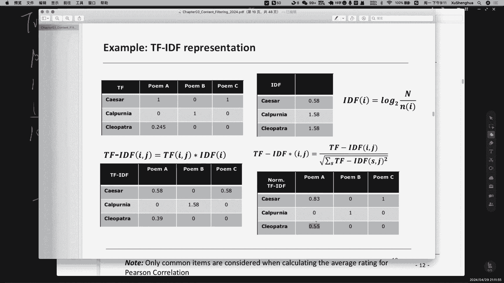

他是怎么算的，就是你现在这个词频啊，TFDF一定是，什么声音，这是洗衣机的声音啊，tom和你这个文档pom a他的这个值是什么，比如说你这个值是0。58，那你规划应该用的是什么，0。58除以根号下0。

58的平方。

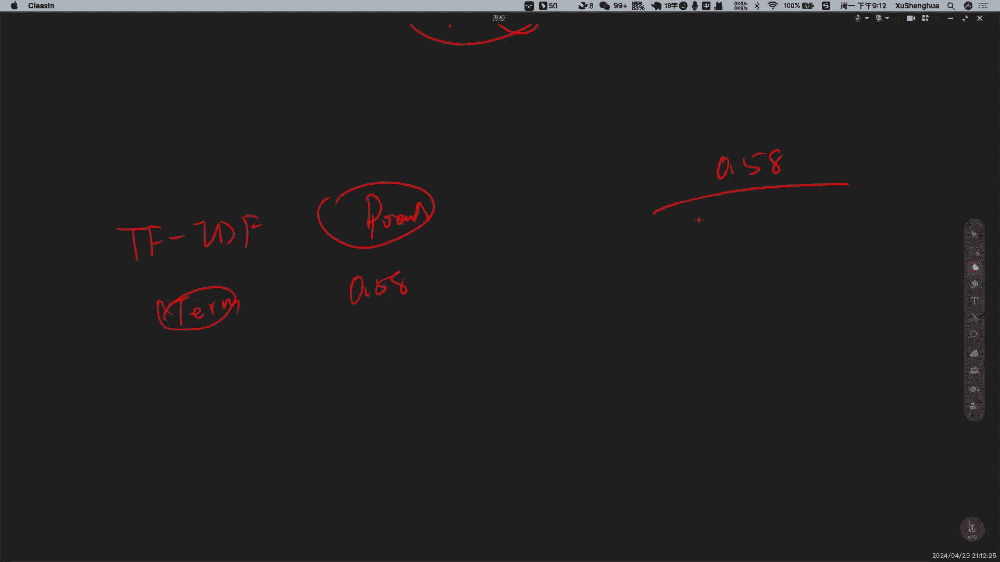

加上。

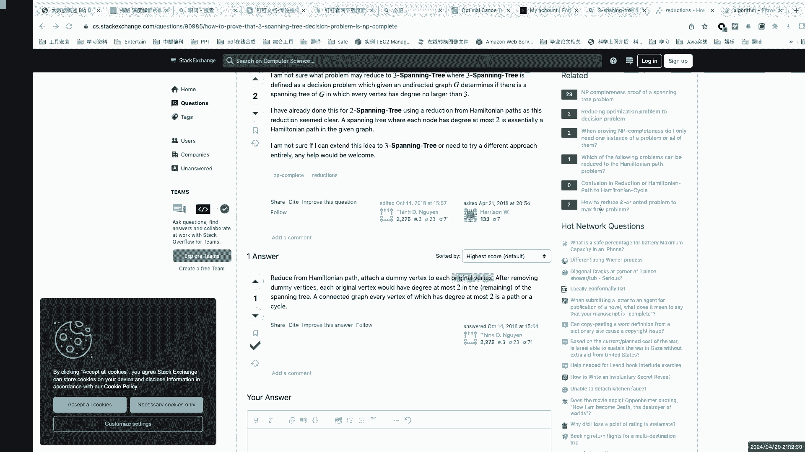

0。58平方加上0。39的平方。

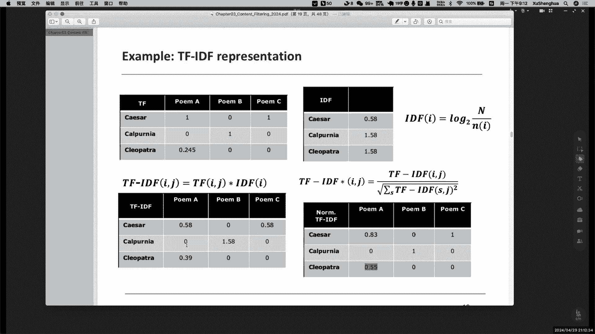

对吧，但他那里是分子和分母都是减，分子是加分子是减哪个呃。

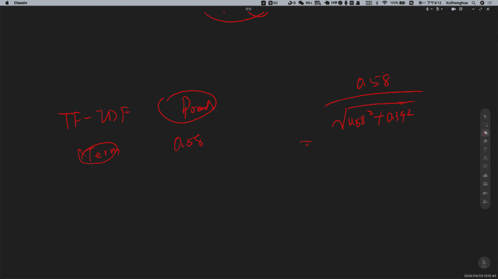

它的公式。

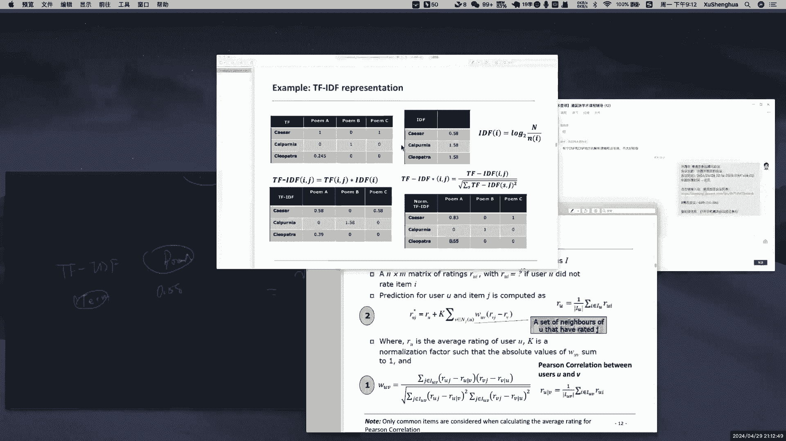

而不是减是TF杠IDF，我们的特征就叫TF杠IDF哦，我以为钱啊对他俩乘起来，那这样的话对，所以就把规划它结果还不是求和为一，因为它分它不是，如果你是0。58÷0。58加0。39，那是那是求和为一。

所以所以pom a他要求这个特征的话，就是0。58，0。58÷0。58平方开根吗，嗯0。58除以根号下0。58的平方，加上0。39的平方，是这里有个求和，就是平方和0。58的平方，加上0。39的平方。

所以得到归一化的结果呃，那为什么要是为了保证正数吗，还是为了什么，你说为什么要为什么要归一化是吗，它它就它归一化的方式，为什么不是简单的相加呃，这个就是涉及到一门学问了。

就是我们现在没法说哪一种规范化的方式最好，其实取决于数据的对吧，那具体那肯定是将来你如果从事机器学习，那肯定是要去调的，哪种方式最好啊，我没法一概而论说哪种好，这就是OK啊，TFIDF啊。

然后一般的过程哈去停用词，or the an这些词没什么意思啊，单词词干化是为了减少你的词汇表，就是你这个表格如果越大的话，你算起来计算复杂度越高，所以我们认为go的过去式和勾引，这都是一个单词。

是一个go啊，然后呢我们说数单词的分布是一个长尾分布啊，后面都是噪声，所以我们会限定你的词汇表达小，就top100top1000啊，刚才我们说的单词都是一元的，一元就是只有一个单词。

我可以研究单词短语是词组，比如说movie movie，Scary love，这两个单词放一起也可以算一个TFIDF，算法呢跟你你就把它视为一个单词就好了对吧，你把这两个单词视为一个单词，对不对。

啊那这个咱就不细讲了，是一样的原理，OK嗯这个是余弦啊，你有了向量就能算两个向量之间的相似性，用余弦距离是一种方式，啊怎么算，你看就是说一般在我们推进系统中，你想算两个，你想算两个呃。

两个文档之间的相似性，这两个文档像不像你怎么你怎么判别呢，呃你先把文文档转成向量对吧，用你的TFIDF就能够把它转成向量，你看这里它就是每一篇文档啊，0123是诶，你可以是一个句子或者是一个文档啊。

那这里就是每个句子，每个句子可以用一个TFIDF的值来表达对吧，每个单词TFIDF，每个单词TFIDF那一个句子，就是很多个TFIDF就是一个向量对吧，这是我们的表达啊，到这同学看看有没有啥问题。

老师我想问一下，上一上一页求出来的那个cos similarity，是用来干嘛的啊，啊比如说我给你推荐，我基于这个协同过滤你，你看了时隔一，我接下来给你推荐哪个诗歌呢，我诗歌一和诗歌B去比较一下相似性。

A和C比较一下，如果发现ab的相似性是0。88比较大，那我就会给你推荐poem b，哦啊换，那你买买衣服，你今天买了一件衬衫，我把其余的所有衣服计算一下，和这个衬衫的相似度。

相似度大的我就会推荐到你的那个淘宝上啊，我认为你更需要这个，这是我们要做这个向量化表示，你才能去量化它的相似度，而你向量表示的好与坏就决定了，就决定了你的这个啊推荐的效果，好的嗯OK吧，啊那这一块。

从这个每个句子表达成这样一个向量，同学现在能接受吗，可以啊，可以好，表达完之后呢，诶嗯嗯就可以去构建用户画像了，构建用户画像了啊，他说三个例子哈，第一个这用户看了一个电影，但是没有打分啊，怎么办啊。

我计算一个TFIDF的向量，就是你这个电影这个电影有哪些特征啊，有这么多特征，这个特征呢就是一个特征向量对吧，就是很多个数值嘛，那我就把这个电影当成这个用户的特点，第二个例子啊，这个用户看了很多电影。

看了很多电影好，那我每一个电影都是一个TFIDF向量，我很多电影就是很多个向量，那就构成了一个矩阵对吧，然后呢我把这三个取平均，这曲平均就是很简单，认为每一个电影都是相同的权重对吧，这一句去平均诶。

就得到了这样的一个特征，我用这个数值就是我把一个用户的特点，用一个向量来表达，那都是后面会有用，后面能够有用去去算啊，嗯这是一种，当然这里面简单平均就认为每一次电影啊。

他们对用户的在心中的重要程度是一样的，但实际上我们知道这是不一样对吧，你认认真真看了一个文艺片，看了一个什么IBM那个什么当年的什么电影奖，和你随便打发时间看了一个烂片，这不一样吧。

所以我可能会给他一个权重，权重是什么意思呢，你当时给哪个打分高，那我就可以认为这个权重大，你更看重这个对吧，比如说这个教父啊，教父这个评分五啊，那他这个电影的权重，更能够代表这个用户的喜好。

用加权去平均这个向量好啊，然后接下来你有了用户的偏好，有了电影的特点啊，那你就可以去用户了，就这个用户需要看哪个电影，你就可以做推荐了对吧，怎么推算呢，你现在都能拿到向量表示，就计算余弦。

但是这种方式很简单啊，就是哎你这个用户，你这用户是这样的一个向量表达你的电影，你的电影是这样的一个向量表达，好，算一下余弦，他俩有多像，越像越推荐越像越推荐，OK吗，好啊好，那这个是TFIDF。

你说TFIDF有问题吗，有问题，他的问题在在于太简单了啊，就是你是完期间，你这个是一个统计信息，统计特征，这个同学能能能接受吗，可以你统计信息就取决于你语料的好与坏，如果你的语料就那么十篇文档啊。

那你这个效果很难好吧，我们知道你的样本数据集越多，你的这个特点的效果才越好，对吧啊，所以我们会说啊，我们不想依赖于数据量的大小，第二个是，我们希望你的单词表示有些语义的信息。

在语言学家中会提出这样一个观点。

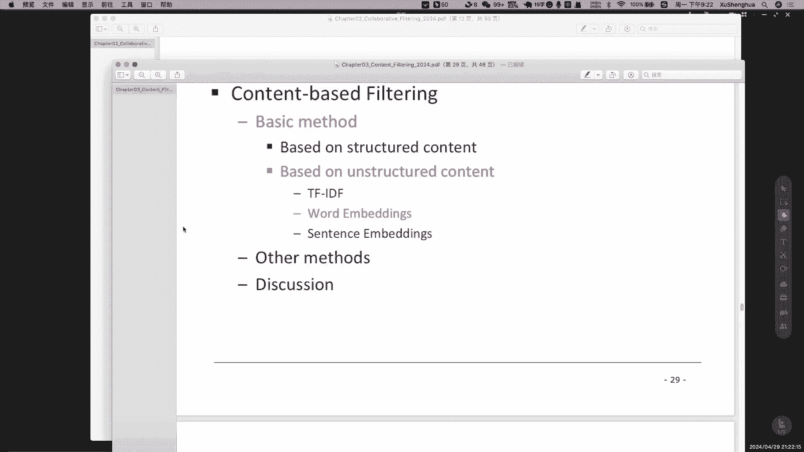

单词的单词的语义隐藏在它的上下文中，啊就好比是老师给你讲课啊，我不能拿，就是我如果拿术语去给你解释，其实你是听不懂的对吧，我用我用一个术语我给你解释，我用了七八个专业术语去给你解释，越解释越乱对吧。

所以我们说举个这样的例子，The cat lie in the，Bed the dog lie in the，哎啊我们知道啊，这里这个单词有完全相同的上下文，就说明他们出现的语言的环境是一样的。

也就是这两个单词本身它对应着两个语言实体，这两个实体在某种程度上是有一定的相似性的，对吧嗯啊是有一定的相似性的，也就是说，我希望用单词的上下文来表征这个单词本身啊，那怎么做到这件事，怎么做到这件事来看。

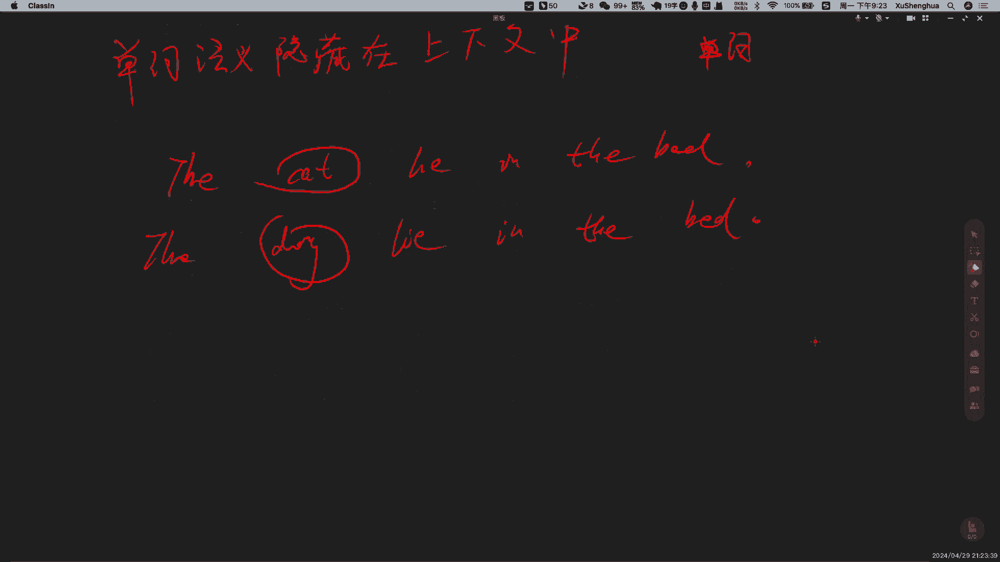

啊用词向量的方法，用词嵌入翻译成词向量词嵌入都可以，那就是说他的问题啊，你看第一个没有语义信息，你完全是基于统计的特点对吧，对于你这个里面的向量表达，你说猫和狗啊，你没有一个具体的语义的一个表达对吧。

而且这个矩阵会很稀疏，为什么你的无论你是one hot还是TFIDF啊，你有很多地方其实都是无解的零的对吧，一稀疏了就会有一个现实问题，就是你会浪费更多的内存，你你你这些存储全存的零没什么意义。

第二个是你的矩阵越大，你的计算效率越低，所以我们引入word in bending啊，world in bin的特点是一个什么呢，你先别管为啥我先说这个结论，就是一个N维的稠密的向量啊。

N维的稠密的向量，啊，那它会把有相同上下文的，它的向量表达就会很像，你算余弦值也会比较比较接近，余弦相似性也会比较接近，而word to vector就是其中的一个方法。

word to vector是其中的一个方法啊，那这个方法是什么意思呢，其实呃我看一下word to vector是这样的一个原理。

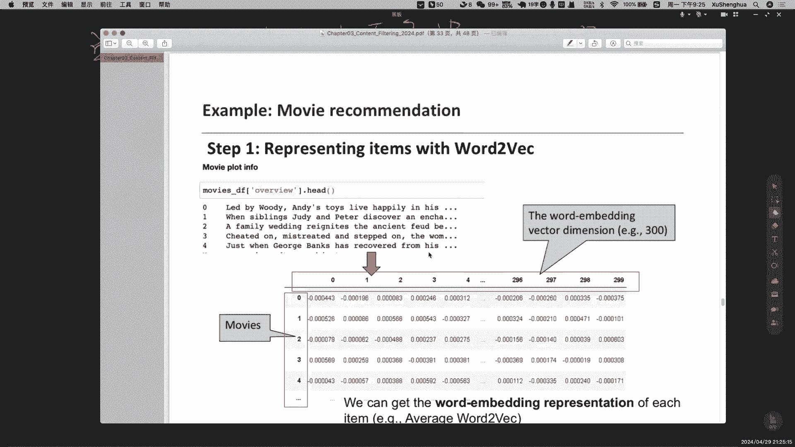

就是我认为啊给我一个单词的上下文，啊比如说我这个单词上文有两个单词，下文有两个单词，我用上上文的这些特点啊，拼到一起啊，做一个数学计算啊，比如说W，可以啊，Vector。

你的拼接的词向量加上偏置值等于一个向量，等于一个向量对吧，这个向量啊，这个向量代表是什么意思呢，就是我根据一个向量的一个做一个函数变换，能得出，比如说你有100个词汇表。

老师得到一个什么呢啊100维的一个概率分布，比如这里面是0。98，就说明我认为这样的上下文，能够产生一个第三个单词，它对应的第三个单词，这个同学能接受吗，我的数学模型就是说输入所有的上文和下文。

这是向量啊，输到一起之后做一个函数映射啊，得到一个什么，你的词汇表，你有1万个单词，我就有1万维的一个输出求和为一表达式，1万个单词中，每一个单词应该出现这里的概率，比如说第三个是0。98。

就说明这个单词，The cat，这个单词应该很大概率出现在the cat lie in the white，这个上下文中啊，就这个概率应该越来越大越好，那我就需要调F的这些参数来让它最大。

等这个参数调好了之后，这每个单词的向量表征都认认为啊表征的很好，能让它完美的算出他应该是哪个单词啊，我们这个术语叫语言模型，这个过程叫语言模型，语言模型好与坏，语言模型训练的越好，就你这个词越的越精准。

说明你这些向量表征也很不错啊，就我们说一个人啊，一个人这个呃他那个什么拿了奥运金牌，那他这个他的身体素质肯定是不错的对吧，他能拿到这个成绩啊，身体素质肯定不错啊，可能智商也很高对吧，有这个运动智商。

我们这与之类似，你的结果准了，说明你的中间的表征方式也是好的，这个同学能接受吗啊，其实我们还有一个与之类似的机器学习哈，就说叫自动编码机，我一个输入我不知道怎么去表达，我先给它转换成一个向量。

再把这个向量还原回去，就是你这个输入和输出的差异越小，说明我还原的越精准，还原的越精准，说明这个向量表征越到位，越抓住了精髓，与之类似，与之类似啊，同学这个能接受不可以啊。

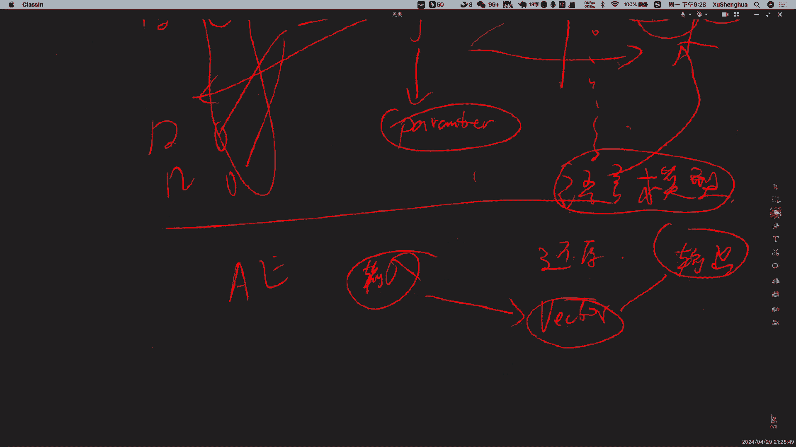

好如果是这个你能接受的话啊，看一下，这个啊我们怎么用它，我们怎么用它，还是一个单词单词的结合，是你的文档啊，我们现在呢我们不会用TF，IDF去表示一句话了，我们用什么，我们用词向量。

我用一个300倍的词向量，是一个连续的稠密的词向量，它不稀疏，就是每一个文档，每一个文档有这么多啊，有这么多的一个向量的表示，这是我们跟TFITF的区别，就是我的向量表征不一样了，我这个向量表征更好。

我包含了语义的信息，我没有那么稀疏，啊，好那我们还是用它来表达用户的偏好，对吧啊，一个用户啊评价了26个电影，你就会得到26个向量，放到一起就是一个26行的一个向量矩阵，我用他的打分去对它进行加权平均。

就会得到一个用户的一个300维的特征向量，啊OK吗，亏啊啊老师我有个问题，他这个他在乘以那个权重之前，他这几行他是打分的，这几行其他的attribute都是一样的，是吧哦。

他他就是你现在的每个movie啊，他就一个300维的向量，因为你的向量表征是300维的，就是你训练好的，用咱们刚才的那个模板训练，那对训练一个300维的向量，那你每个电影前面是你的特点，对吧啊。

那这个打分后边是他的表征，我老师只是把它放到一起，把它拼到一起，好是拼到一起，然后加起来啊，带加权的平均得到这个用户的特征向量，他这个是呃，他是除了除了那个weight那一列，其它所有的属性加一起。

然后乘以这个weight，是这样吗，我没有，有些只是要这300维，只是要这些向量，前面那些不要了，时间戳呀，USD啊不要了，只要这300枚，就是他他有他有这么多列嘛。

然后他最后算出来它只有一列这个user profile嗯，你的你的用户，你是一个1×300的一个向量了对吧，你现在比如说是二二十六乘以300对，然后你加上平均之后会变成1×300，老师把它竖着写。

不就是300×1吗，他只是竖着写了，实际上是一个300维的向量，好的啊，这也是达到了用户级别的表征，用户有了你的电影也有了啊，或者你推荐的item也有了，那就计算相似性呗，啊100个电影。

根据用户分别计算出100个相似度，选一个最大的十个，最最相似的十个，嗯OK吗，A啊好啊，那句子级我们现在是单词级别的词向量，那你句子级别的其实就简单了，你看你的句子，你的句子就是一个单词的集合。

那你完全可以说把单词的向量拼起来，求和或者加权平均都可以，对吧，因为你你sentence就是单词的组合嘛，单词有特征表示了，那你的句子其实也有，这是一种方式啊，那句子是什么啊，句子是很多个单词啊。

它表达一种上下文，那我们现在有成熟老师说，那个是一个很简单的方案哈，就是句子里包含了很多单词，你把单词拼到一起啊，你把单词拼到一起，那这就是一种方式，当然我们还有更复杂的模型，比如说board啊。

同学现在应该听说过GBT对吧，你在用GBGBT的前身就是语言模型啊，比如GBT123，GBT是一个单向的，你理解就是GBT是一个，你现在说的GPT是一个成熟的产品对吧，它有个模型也叫GBT。

GBT和bird是相当于在同一个level上的，大规模语言模型，用了transformer啊，有注意力机制啊，bird是双向的，shift g是单向的啊，他俩是同一个时代，在19年左右，19年左右。

他们现在好快啊，你看从19年你博尔特提出来到现在，ChatGPT现在已经直接商业化应用，这个过程你看真的是很快，就这么5年的时间发展到当时，波特在学术界也是引起很大的轰动的。

尤其是很多人从CV转行到自然语言处理，跟他就有关系的不啊，它能直接生成一个句子的表征啊，它会更复杂，原理呢那肯定这门课上会不会考了啊，啊同学有兴趣可以研究一下啊。

比如说你这个每一个sentence直接打到了一个，比如说几百维的向量，这个模型就直接输出来，他这是768位模型直接输出的啊，然后哎同样你把sentence做加权，也会得到一个768维的一个特征。

那这一定是的，你是26×768，经过加权平均之后是1×768，这就是你的user，所以你看最后都是大同小异，拿到每个用户的向量表征，只是拿到的方式不一样，有用TFDF的，有用词向量的啊。

有用sentence的，最后效算余弦啊，这是我们的这几种方式，然后呢呃他还介绍了一些其他的方法，比如说你的概率模型啊，概率模型呢，其实我们应用最多的一个叫朴素贝叶斯，贝叶斯理论啊，你看我们的标签啊。

这里是一个喜欢或者不喜欢啊，零一分类啊，在X的条件下，在这样的条件下，label为一的，他做了一个很强的假设，其实这是一个联合概率乘积，就是p label等于一，和label等于一的条件下。

X这就是这是条件概率的定义，对吧嗯，然后这个这个式子啊，label等于一，label等于1X的，他做了一个很强的假设，说X中这些属性是独立的，所以可以连成这个假设很强。

他因为你这些属性之间不一定是独立的，比较蠢的，比较朴素的做了一个很强的假设，而这些值都是你根据表里面的一个统计信息，我们看一个在label等于一的情况下，有几个一，有三个一。

label1的情况下有三个一，而你的RECOMMENDER等于一的，有几行123，这三行都是，所以是3/3，就是一个频率去除得到概率的一个方式，那OK吧OK啊好，然后你的这个啊分类还有一种分类模式。

用线性分类器，比如说你在线性空间中啊，首先我们要把我们的所有数据点，表达在你的向量形式表达，在数据空间中，用一条线把它们分开啊，首先前提是这个问题是线性可分的啊，你问题是线性可分的才有意义。

而这个线性表示其实就是现在是二维的，WX1加上W2X2等于B啊，这是一种线性的表达形式，就这条线写成这种形式，嗯啊然后再往下再往下，就是你会找到这样一条线，你把W1W2的参数算出来就可以了啊。

就是你的这个目标啊，然后啊决策树，决策树也是一种模型，但是我们那题里考的时候，你用哪一种对吧，决策树就是要么选左，要么选右啊，第一个就是我有很多特征，就第一个叶子节点选这个，这个还是这个有有技巧对吧。

我们会基于信息理论去算，用哪个特征带来的信息增益最大，老师之前给你讲过，信息增益，就是说选这个特征，它能够减小你的不确定性，哪个不确定性减小的最多就选哪个，因为我们建模的问题本质上就是消除不确定度。

为了才能准确的预测，这就是你决策树的过程啊，OK啊这块同学看看理解没嗯，差不多，你的作业一里面是不是有一个决策树的嗯，他那个是决策树，线性分线性代数，还有那个决策树三个选一个，我选的那个那意思也是啊。

那也行啊，都行都行，线性回归呢又贝斯或者决策树都行啊，决策树那块可能怎么选，可能是一个啊，怎么选，特征是一个点，OK那这块同学是不是没啥问题了啊，对K然后课件呢课件还有啥问题，然后还想嗯就按一下。

就是特别讲一下那个，看一下我们需要看看这个题吗，嗯啊可以啊。

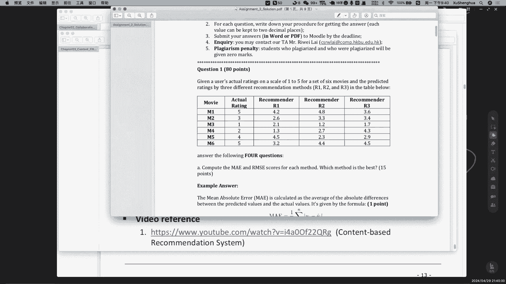

那先看第二个作业吧，啊对，然后你看看那个课件需要哪个奖哈。

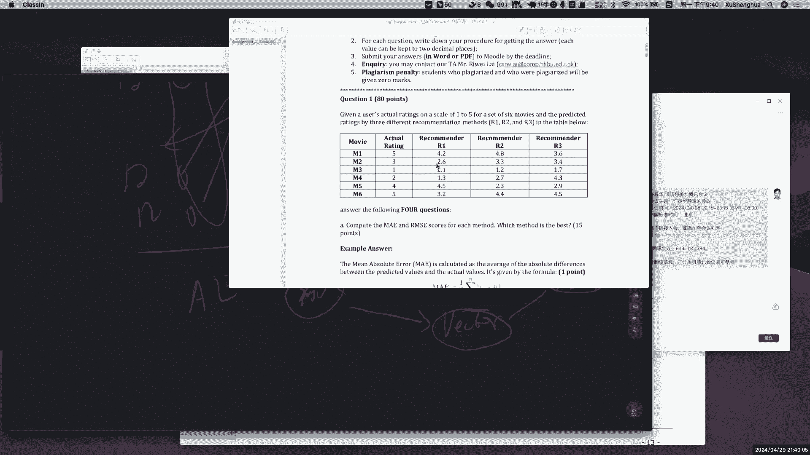

啊OK我们先来看第一题，第一题啊，这个是给你个优质的打分啊，我们推荐系统一定是有数据的啊，这个是1234566个电影，然后这是呃这是几个，这是电影的打分，然后呢。

1233个用户让用户给出了你的具体打分值，然后他问你四个问题，第一个计算MAE和r m s e score，For each method，Which method is the best，呃。

我看一下哈，哦他记就是123，他计算这三个哪一个推荐的好，那X1的好指标是ME，同学还记得MAE是什么，这个考试可不会给你哈，这个指标学明白是怎么来的吗，不知道啊，M顾名思义，平均的绝对误差。

绝对误差指的是5-4。2的误差，就是0。8，5-5。8的误差也是0。8，我用这两个这个叫真实值，这叫预测值，真实值和预测值之间的误差啊，真实值和预测值之间的误差。

加个绝对值符号就是一种m e m e means que，平方，5-4。2的平方就是平方误差，你说哪种好呢，这不好说，如果你想对错误的惩罚，就是你预测大了，预测的差差距大了，我对你的惩罚重。

那你就是用这个MSE，因为他会用平方放大你的误差啊，如果你不希望这种，那就用MAE，OK好这里就是说那平均是什么意思，就是你预测了六个，每一个都能算一个误差啊，每一个都能算一个误差。

然后误差的这个累积只求和除以N，就是你的平均MA15-4。2，3-2。6，怎么算，RMSER只是开放root开根m s e main square error啊，算的就是就是5-4。2的平方，加3-2。

6的平方，每一行记录都有一个平方误差，有平方误差之后，我把它累加之后再开根号，就是我的RMSIMC，所以你你你把这三个值分别去算两个指标，就3×2得六个指标能算出来啊，比如MAE是什么，一共六个1/6。

5-4。2，3-2。6，1-2。1，2-1。3啊，求平均，开根号这个同学是不是没啥问题啊，同理R1R2R三都这么算就OK了啊，然后他说呃，Give the formatted calculation。

Requirecommander，recommander r two has the lowest m和RMSE啊，所以他预测的最好，那肯定谁的误差越小，谁的这个预测的越准对吧，你上面不是算完了吗。

上面这个数一算完结结果就出来了啊，他最低，啊OK下一问，Calculate the precision，Recall f1 score。

Consider only the top for recommended item with the actual thrising，Reading threshold of four。

Which method is best，是这三种方法，哪个更好，那你要解释精准率，president和record之间的均衡，啊我们来看一下呃，我们这个嗯这三个指标同学现在还有印象吗。

这是我想对你想一想。

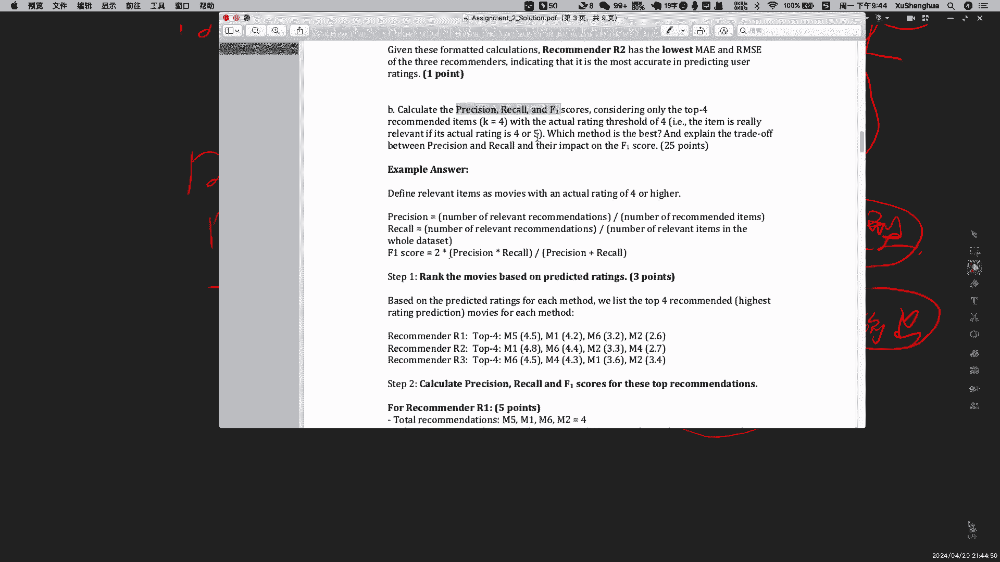

就是准确率，那就是在所有为真的，就是那个啊true positive除以true positive，加上false positive啊，我们会从两个角度，一个是正类，一个是父类对吧。

np negative和positive啊，你也可能是真的TP啊，假的FP也可能是真的N和假的N，那精准率是识别有多准，首先就是说你认为是正类的，有多少真实证类就是精准率对吧，啊还有一个那召回率呢。

就是TP除以TP加tn，就你识别的有多全是呃，就是真正的正类，有多少被你找出来了，TP肯定是正类，你认为是negative的，但你认为错了哦，也是真的正类对吧，就是真正的实施，比如这里是十个。

这里是五个，你认为是父类，但你说错了，不就五个是正类吗，就是你15个里边只找到了十个，不是很全，100个里边找99个，就是很全，跳回避，识别的有多全，好的啊，F 1score。

f score是二者的均衡啊，应该是二倍的，P乘二除以P加R，你可以这么算，F分之一等于12，P分之12分之一啊，等于1/2，pr分之P加二就等于什么啊，F1score等于二，pr除以P加，啊OK吗。

好的，那就这个，找嗯这三个指标啊。

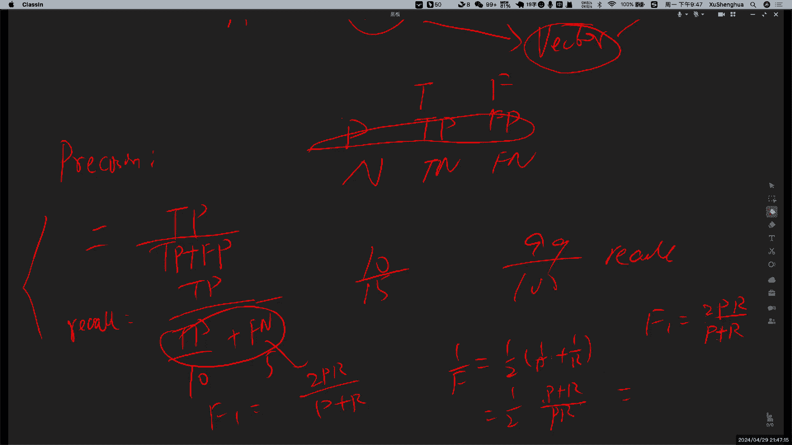

好，我们来看一下，呃他说要算这三个指标，然后只考虑什么，top4是你推荐的前四个诶，你推荐的前四个啊，我们这个推荐的时候啊，怎么选前四个呀，按这个值啊，4。24。5，3。2，2。6，这四个对吧。

每一个根据这个值能选出top4，能选出top4，也就是说R1的top4是这几个，R2的是这几个啊，R3的是这几个啊，这是我们这四个值啊，然后第二步你不是要分别算，就是你推荐的对不对啊是吧，推荐对不对。

比如说对于这个R1来讲，你是推荐这四个从高到低排的啊，你的你推荐这四个的个数是四啊，我想你好，我看一下你的这不有阈值吗，呃玉石跑哪去，阈值是四，就是你这里面真正能推荐的是谁，545。

这三个是你真正就是你这么推荐没问题，就相当于TP推荐这三个没问题啊，好那你的准确率，你的准确率就是啊你推荐了四个出来，但实际上是M5M1和M6，这三个的阈值大于四，他们是真正值得推荐的。

所以就相当于是3/4是你推荐的，你应该推荐你推荐了四个，但是有三个是真正值得推荐的，3/4是召回率，是识别有多全，是你应该推荐这三个，你实际上有没有推荐出来的，有的对吧。

嗯就是这三个里边你你这三个全推出来了，但是他那个FN它的分母应该还有个FN，在我们这个场景里就没有FN了，就是你看你关注的就是你真正要推推的有多全，我希望你推的就是三个，这跟我们刚才那个不太一样哈。

就是我们没有从KP加F那个角度去算。

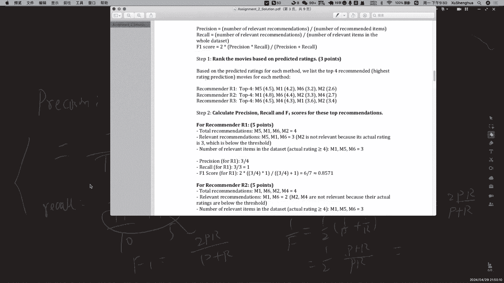

我们是从意义的理解上，从意义的理解上去说，就你召回率不是识别有多全吗，你推荐这三个里边嗯嗯你一共推荐了四个，里边就没有FN，就没有N，你这四个就没有N都是p positive TP的。

有三个FN都等于零的，F1score是二指的，就是老师说的是那个二倍的，四分之3×1除以四分之3+1等于这个数，嗯嗯这个同学能接受吗，可以啊，那比如说这个二。

你来算一下这个R2on2的precision recall，和这个F1score，啊我们可以练一下。

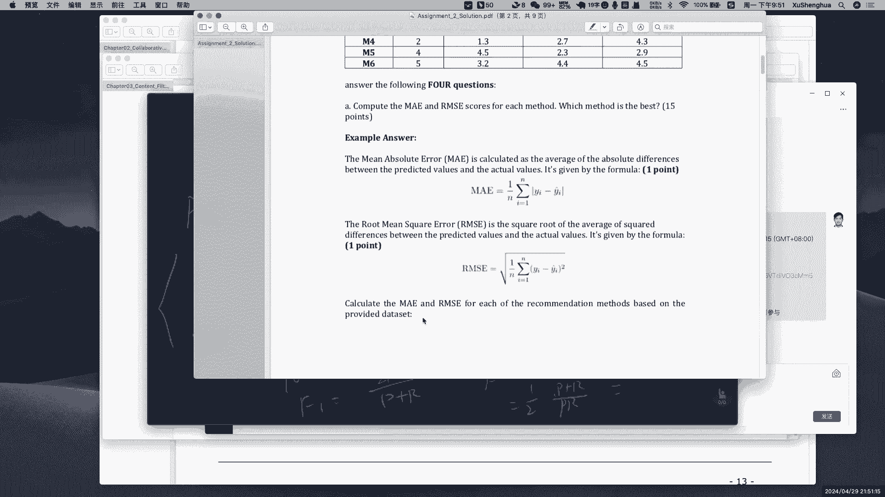

你看R2的哈，呃首先你R2你要能算出来，他推荐的是前四个对吧，就是M14。8啊，还有谁，还有M6404啊，还有谁，还有M2303，还有个M4，就是你推你推荐这四个是吧，你推荐这四个。

然后呢嗯你推荐这四个，然后你真正说哎你应该推荐，因为阈值是四吗，因为阈值是四吗，所以你要推荐谁啊，M1你可以推荐M5，可以推荐M6，你可以推荐，就是这些是你应该推荐的，嗯啊或者在你这个表格里。

我们说构建那个posit条，你认为posy头有四个是吧，TP那他这个题目里面哪里说那个评分四以上，是真是是那个true positive，他说他有个阈值，他这里说的，哦好的好的阈值为四。

就是说你是应该去推荐的啊，那比如说你这里你的P1共有四个啊，你这里就没有N对吧，你这四个全是你认为是正类的，你这里就没有N，有没有你在你的里面就没有negative，对啊。

TP有几个TP有几个两个一六对吧，有两个FP呢，02424是F对吧，N没有好，接下来其实就能算这个precision14显示0。5，0。5是说你的2/4对吧对啊，record是23。

recall record是23是什么，你把你所有应该找出来的，应该找出来的有三个，你找出来的几个找出来了，2/3啊，那F1呢，嗯就是2P2啊，P加R除以2P2，2p2，啊如果你记不住。

就是F分之一等于P分之12分之一，记住这个线推也行，这个也好记嗯，少写个1/2，取平均F1score是什么，它会倾向于prison和record里面较小的，就是它更严格，OK吗好啊。

这个就是我们的计算啊，不过我们那我们今天就是可以，大概先讲到这儿啊，因为老师那个或者还有那个还有一节课，我就稍微休息几分钟，嗓子喝口水啊，然后你看这个过程啊，同学你看呃，老师有时候经常会给你多讲一点。

说为什么，比如说我们讲词向量啊，为什么是说你真正理解了，你才能掌握它为什么这么做啊，后期等后面的时候，老师可能要帮你梳理一下推荐系统，这几种方法啊，就是你要理解他，为什么你考试的时候才不至于说一蒙住。

比如说你突然说F1score precision recall，这怎么算来着，你可能一下就蒙住了，蒙住了之后你就完全算不对了，所以你要从理解的角度，精准率召回率是怎么来的好啊。

然后同学看看这块有没有啥问题啊，没有老师是今天就讲到这儿是吗，对我们今天先讲到这儿吧，然后呃你看明天你看你是怎么考虑的，就是这个复习的这个计划，明天我考试可能要考到晚上11点啊。

那就明天我们先你明天那什么，你明天白天还是像今天这样，把你要那个什么的点，把你要那个的看的点，我们课上讲的点，你先发给老师，然后呢，那明天我们就后天吧，后天后天国内这边是啊，五一放假你就白天也行了。

就是我们时间上就可以商量好的，那你先去考那个云计算，云计算的有没有啥问题啊，它主要的计算的部分我都比较清楚了，然后可能会考大题的那个git，然后我也弄清楚了，就是前面那个课件老师没带你复习对吧。

就是对你说，但是但是对，但是那个我自己也有富有总结嗯，OK应该差不多要及格，应该没有问题，对行行，那你就后续再给这给老师整理一下你的这个啊，推荐算法的这个行吧，好的好的嗯，然后那就后天对吧。

明明天明天得考试嗯行那咱们就先这样，今天好的好的嗯，好认真啊，拜拜同学好。

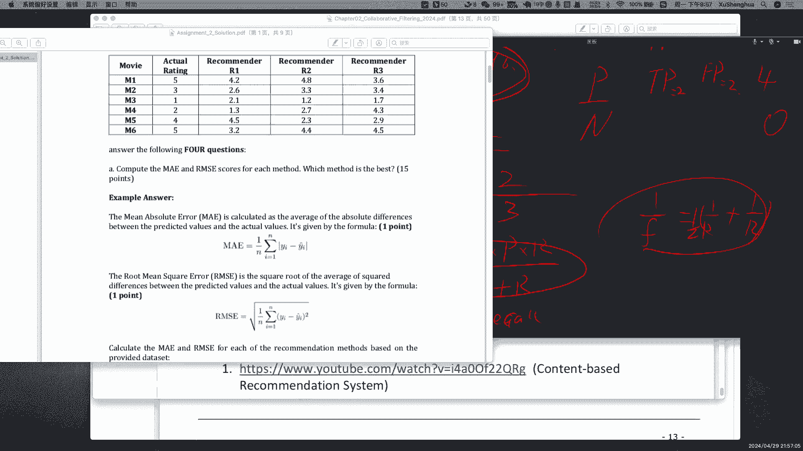