# 2025最新AI量化交易实战教程，三小时入门到进阶！清华计算机博士讲解，零基础也学会了（AI人工智能丨数据分析丨数据挖掘丨机器学习实战丨深度学习丨编程） - P12：第一十三章： 期权定价模型 - 机器学习教程 - BV1ujk4YKEw9

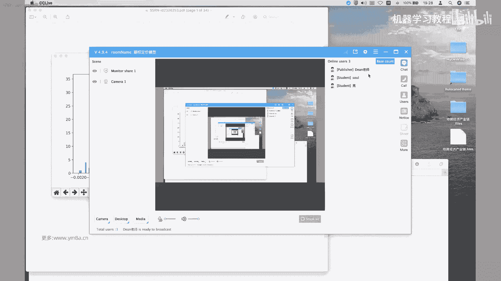

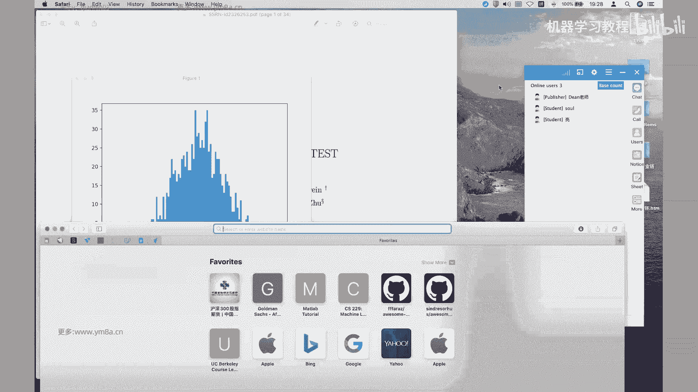

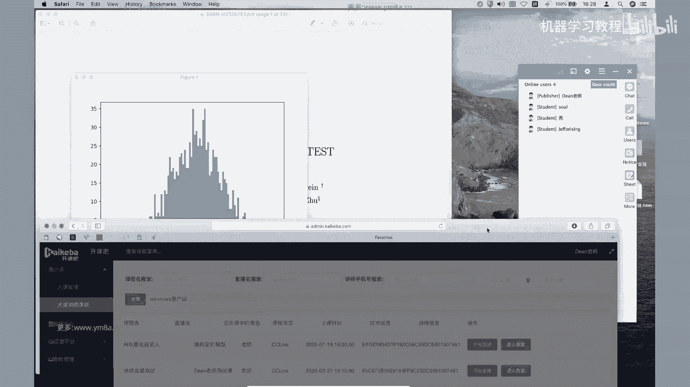

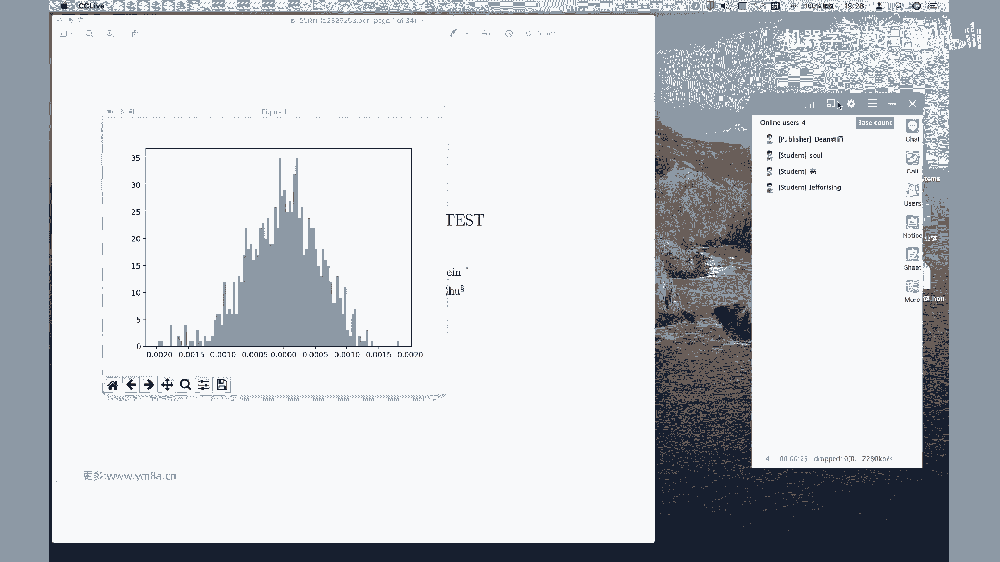

OK哎各位同学，我们稍等一下啊，呃今天主要课程是给大家讲一讲，就是嗯主要是讲怎么去，避免回测当中的过拟合现象，然后大概会有两个框架去来去描述这个事情，我们稍微等一下其他同学。

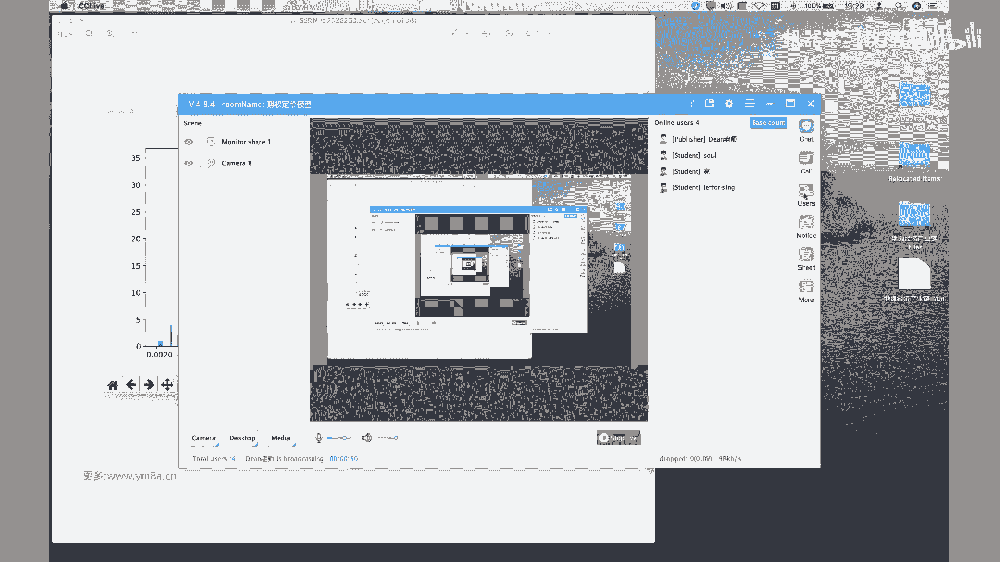

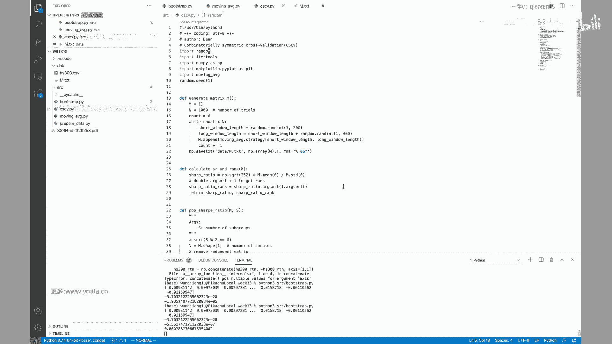

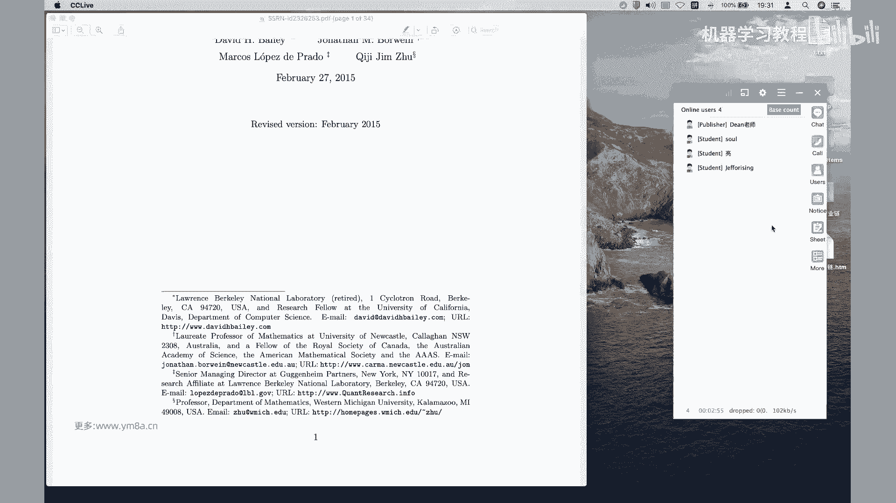

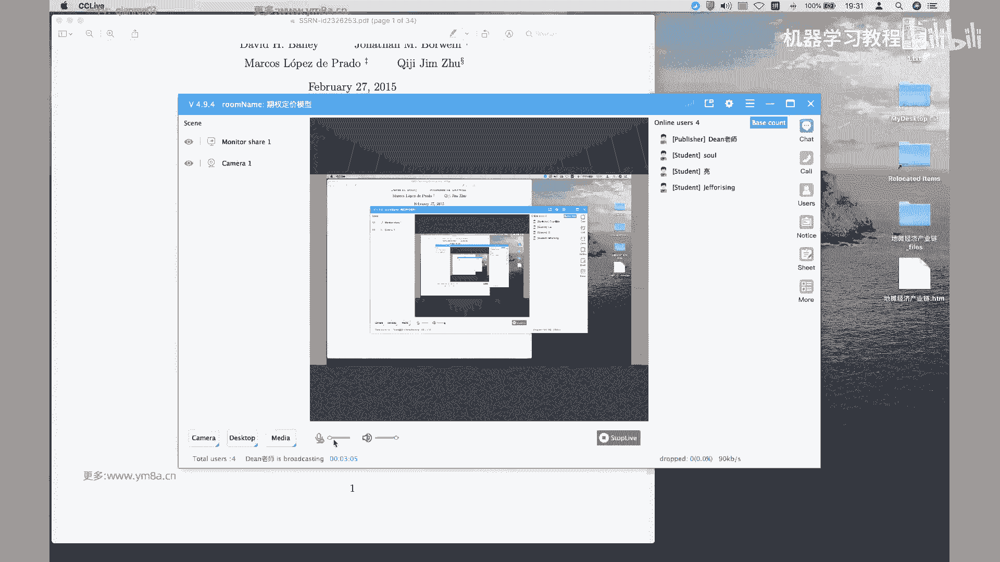

嗯好的，那我们就开始吧，我刚刚把这篇paper发到了呃，发到了微信群里，也不知道大家有没有收到，OK所以呃在刚开始之前会先讲一下，就是说我们在策略开发过程当中，常见的就是会有一些就是问题。

这第一个我们其实在这刚开始也讲到过，就说是呃大家可以听到吧，二能听到给我打个一，对我们在刚开始的时候有讲到，就是说呃所谓的就是survivor，Survivor ship bias，叫幸存者偏差。

然后呃最典型的一个例子就是说我们在统计，比如说我构建一个呃对冲基金的投资组合，比如说做一个fond of hatch fund的这样一个组合，我选取的是到目前为止仍然存活的对冲基金。

把他们的绩效回报去进行组合，那么显然这个时候呃我已经淘汰掉了，在历史上由于经营不善或者等等其他原因，已经关闭掉了对冲基金，这就是典型的survivor bias，对。

然后另外一个就是说呃呃今天我们也会涉及到，就是啊所谓的long shot bias叫多空偏差，多空偏差，如果说就是说在市场环境下，是一个属于单边上涨的行情，我们不管怎样去优化策略。

我们的倾我们的策略倾向总呃，总会是总会是说是倾向于去做多，那么就是说由于这样一个呃，我DATASET这样本身的收益也是不平衡的，会导致我测了优化之后呃，会出现一个呃多空方向上的偏差。

对那之后我们再来再来看怎么去解决，然后比较典型的就是说我们在呃，在另外一个就是说比较典型的是所谓的，就是引入future额，就是未来函数的问题，就在策略中引入一个呃未来的信息对呃。

最典型的例子就是说我们交易的过程当中，额想要知道当前bar的最高价，但事实上就是说在实盘交易的过程当中，在一个八二没有走完之前，我们是不知道它的最高价，但是在回撤的时候，如果是说嗯。

我比如说这一个小时或者5分钟半没有走完，我走到走到其中第3分钟的时候，已经开始用了这个B的最高价，那么就是说我显然是会引入这样一个未来数据，对嗯，嗯所以就是说呃所以说这个在回车的时候。

就是说我们为什么要用事件驱动，或者说是用队列的方式，就是说我们希望把我们的呃产生信号的瓣儿，跟我们去撮合的，这样的瓣儿是进行完全的分开，免得就是说成交在这根瓣上面对。

然后另外一个就是说有点类似于未来函数额，但是会会有一些不一样，就是说比如说我们呃，我不知道大家有没有试过试做呃，小波分析，或者说是做那个empirical mode decomposition。

就是在在engineering上面，有可能就是说很多人去做降噪的方法，然后嗯它们存在一个所谓的端点效应，就是说这些方法就是说呃，就是说呃当我引入最新的市场数据的时候。

会导致整个模型的历史的状态就发生变化，然后本质上来说它会有点像未来函数，因为他是说我使用的是一个，属于全局优化的这样一个技巧，当我在进行全局优化的时候，实际上是把呃就是最近的信息已经引入过去了。

从而改变了历史的这样一种个人历，历史的一种状态，对然后呃我们今天介绍的这篇paper呢，呃是讲了一个呃今天这样一篇paper，就是说是我们来讲的是怎样去嗯，就是根据我们的回测数据怎么来去看嗯。

嗯就是说呃，就是说我们基于我们的策略参数选择，然后怎么来去说，是嗯去计算我们回测过度拟合的这样一个概率，对啊，所以嗯就是说这篇paper的话，我觉得是我觉得还是挺有意思的，嗯到现在也不是它也不是特别新。

也不是特别旧对，但是这就是这篇推文里面是提出了，我觉得是计算回测过过程过程当中，这样一个过渡拟合概率的一个框架，然后我们今天就看，就是第嗯，前两节课时间是先去把整个的paper的，它的呃原理去了解一下。

然后接下来，然后我们去看怎么去实现它这样一个概率对，OK呃，首先就是说有一个是嗯，大家可以也可以自己自己看paper，不一定跟着我的节奏来看，但是嗯就是他会讲到就是说呃一个它重要，两个重要的两个概念。

一个是in sample，还有一个是呃out of sample呃，他会把就是说，嗯数据就是说我们在回测过程当中呃，过度如果说过度拟合发生了，然后一般来说我们会在in sample之内，就是样本内。

然后产生这样的一个最优性能的，最佳的这样一个策略，它可能说是在on，就是说under perform，就是在out of sample的时候，under perform什么意思。

就是说我在样本内优化的很好的性能，但是在out of sample的时候就是发生了劣化，对这种原因一般来说就是说说是是一，就是说在in sample of optimal strategy。

就是说可能引入了过多的这样一个一个噪音，对，然后嗯所以呢这篇这篇这篇文章，他就是说是我们建立，他说建立一个就是general framework。

然后来评估就是back test overfitting，这个事件的这样的一个概率对嗯，然后就是他说的话是就是说呃，就是说其实这这这样一个就是框架。

也就是说它的就是now now hhypothesis，或者叫原假设，他说的是就是说是呃，如果是确实发生了回测过度拟合，这个是我们H0，然后对，然后说然后说我们要去计算一个。

就是说probability of back test overfitting，就是说是即将回测过度拟合这样一个概率，然后太呃这句话看着看着有点绕啊，呃待会我们再具体去看一下。

他到底描述的是什么样的一个事情，OK可以说他其实构造了就是说这样一个呃呃，Ok，那我们直接来看他构造了一个怎样的概率空间，你说他构造这样一个就是概率空空间是，然后是就是tall。

然后F和嗯probability，然后这个掏这个T或者TW它是表示说是呃，A sample，space of pairs of in sample和out of sample。

Uh out of space sample，所以说就是说是就是样本内跟样本外，然后这样一个样本对形成这样一个样本空间，就是说我每每每一对是什么呢，就是我每一个pair里面。

一一部分是一部分是样本内的数据，一部分呃一部分是样本类的回测结果，另外一部分是样本外，样本外的这样一个回测结果，然后他接下来做的事情是说可以说是我们，比如说我们是有了呃，比如说呃。

我们是有了N个N个这样的一个一个策略，然后我们会假定一个就是given performance，比如说我们常见的衡量策略优劣的一个性能呃，最典型的是separation，我们今天也会拿它去做例子。

所以说我们把呃，就是说我们生成了N个这样的一个策略，然后把N个策略这样的嗯，两，然后就说我们个策略都能计算出这样的，Shratio，然后接下来的时候他会用呃，它会用两个，就是说随机向量来表示样本策略的。

样本内跟样本外的这样一个表现呃，这样的嗯，大家注意同学说这个呃这个R和r bar都是都是，比如说都是长度为N，也就是说N个策略就是说呃R1是策略一的呃，样本内的表现。

R1bar是策略一样本外的这样一个表现对，所以说嗯然后OK，然后就是说这接下来就是说他是要就是说嗯，他这个文章其实最核心的就是说是，我要去比较呃R就是说RC跟控制RRBC，然后就是说他们在呃。

主要他们其实关键的就是说是，我比较这N个策略，在in sample跟out sample这样的一个排名，就是说其实说我对于他的数值不是特别关心，但是我关心他在我我这个策略N个策略。

在in sample跟out sample的这样一个一个排名，就是the key observation here，OK额那具体它是它是怎么来做呢，就是说他看他这边给的是一个，就是简单的这样一个例子啊。

呃比如说是N等于三啊，就是说我是有三个策略，然后然后performance measure，就是说是SHAPARATIO，然后对于一个呃特定的这样一个，就是一个一个一个sample。

比如说就是说特定对于我特定这样一个样本，然后我知道就是说在RC呃，它的夏普率是0。51。10。7，然后呃然后RC82的话是0。60。7，1。3是什么意思呢，就是说呃策略一样本内的夏普夏普率是0。5。

策略一下普呃样本外的shop率是0。6，然后策略二对是分别是一点一跟0。7，然后策略三是0。7跟1。3，然后然后这个RC那小的就是little，little rc是什么意思。

表表示的是他们的就是一个ranking对吧，这个就是在我组内这样一个排名，就是呃但注意它是从小到大的，排2C最小是一，然后呃然后一点一最大，所以他rank13，然后2C然后就是按照这个顺序来排序123。

然后所以他说这个小little l r的意思，就是说是我把额，我就是把我的，就是把我的这样的一个capital r，然后映射到我的这样的一个lade2对吧，就是映映射到就是我这个概率空间内，所以啊。

其实其实其实其实这个原因就是你不需要，就是说你对于它概率空间不是很熟悉，没有关系，你只要去明白他到底做的是什么什么事情，他本质上做的事情是把我衡量一个策略的，这样一个呃我选的这样一个维度。

比如说是你你这边可以用sharp ratio，你也可以用CERTAINERRATIO，你也可以用common issuo，你也可以用max draw down，对吧嗯对，就是说他是把策略的一个很呃。

平平策略的表现转化为策略表现的排序，OK然后接下来有了这样一个就是概率空间之后，我们就可以去定义我们back test over fitting，就是回测呃过拟合的这样一个概率。

人家说他说是呃回测过拟合的概率是，也就是说其实是说呃其实他描述就是说，因为我样本内可能是存在过度拟合，所以说我样本内的最优参数，不一定对应的样本外的最优参数，那么他他所说的这种这样的一个事情。

就是说是他就是说呃probability，就是说先说这个吧，就是说是呃首先这边有一个二分之N，二分之N，什么意思，说我有N个样本，那么二分之N就是说是我这样的一个中位数，那中位数是说我样本内的。

就是如果说什么样的什么什么情况下说啊，我过年我认为过拟合发生了，就是说我样本内最有参数的SHA普比率，但是我等于是说样本内的最优参数，样本样本内的最优参数的下铺比率。

小于我这N组参数在样本外下普比率的中位数，对他其实说的就是那这样probability，就是说我把我呃，呃就是说我把我这样的一个样本，一个是样本类，一个样本类的样本内的一个额最优参数。

然后是N组参数在样本外，夏普比率中位数其实是这样的这两个东西，然后就是说呃，如果说我所选参数的样本内的表现，然后是高于全体参数参数组样本外的正等表现，那么就是说我认为说，我在我参数选择的过程当中。

可能就包含了过度拟合，所以大大要注意的说，是说在这这样一个定义当中，其实我们关注的是什么，我们关注的是说是在策略选择过程当中，相关的就是就是选择过程当中，然后与这个有关的过度拟合。

而不是就是说我没有去考虑，说我怎么去校准我这样的一个策略参数对，然后他就是说为了要去衡量这样一个框架的话，比如说有我要为了估计就是probability of btest，Overfitting。

他就是用了一种框架，所谓的就是呃就是uh combinatorical symmetric，Cross validation，或者叫就叫组合对称交叉验证，那那组合组合验证加上额。

就这部分可能大家看的就是不是特别明白，那没有关系，就是我们接下来就是如果不是特别明白的话，呃我们接下来把它的整个的就是cs CD，整个这个procedure走完，走完之后可能大家就会明白。

就是说他做的是什么事情，OK对于就是后面进来的同学，我再再讲一下，就是说今天我们讲的是，就是怎么是衡量我们策略的，就是OVERFITTING，就是这这一部分讲的是回，就是回测过程当中。

过度拟合风险的这样一个怎么这样一个框架，我们怎么去衡量对OK嗯，嗯OK就是大家先看对他对这两个公式就是说对，尤其对就是对这个公式有一点稍微有点影响，就是大概明白我们在做什么样的事情。

对还记得这个RIN是就是out of sample的表现对吧，就是我们之前已经选了一个呃，就是我选了一个，就是说在样本内是optimal的这样一个，就是样本内它已经是optimal的这样一个R。

然后我再看他在样本外，是不是比我样本外的二分之N，就是比我一半的表现要好，对如果说比表现要好，我认为OK它没有发生过拟合，但是如果说我在样本内额已经选了最好，但确的居然是比样本外50%的要差的话。

那么就是说认为这个可能是发生，就是过拟合对呃，那接下来怎么去衡量来做，这样来做这样一个事情呢，Okay uh，OK那他就是用的说是说是组合对称呃，交叉验证对CSCV这样一个框架。

OK首先是说看到有人说suppose to the researcher，就是说这个如果我们在开发策略过程当中，然后它我们考虑的就是a family of呃，一系列的参数。

然后就是我的我的规则或者是参数，然后接下来就说是呃，就是说他这边用的是transforming moving，Average strategy，然后我们待会也是拿就是沪深300的一个。

移动平均去来去测试对吧，就是因为我们知道就是说在测移动平均的时候，肯定是引入就是两个参数啊，一个是long，一个呃，一个是long window，一个是short window，就是长短的两个窗口。

两个窗口，然后接下来就是说是，也是说我们，比如说在这样一个策略开发过程当中，我们引入了N组的这样一个参数，比如说我有N个pair的长短对吧，两个窗口两个参数，那么接下来我们怎么来去衡量。

就是说怎么来做这个事情呢，说first就说我们要呃就是from a matrix m对吧，然后matrix m是什么呢，就是说我每一列是代表啊，A vector of pl。

就是说每一列代表是一个完整的回测，我使用一组参数进行完整的回测回测，那么我有它T就是capital t个周期的，就是呃return对吧，那么我如果有N组的话，那我就有一个额，首先用用手每一列嘛。

当你每一行其实也OK，就是接下来我们可能会就是可能是由行变成列，也有可能是列变成行，但是我们需要明白的是呃我的周期是T对吧，我总共有T个周期，然后我有N组参数，那么我们先follow他的这样记号。

就是说T乘N对吧，就是说我有T呃，我有T行，然后我有N列，所以这样这样这样一个矩阵就是OK我们来看。

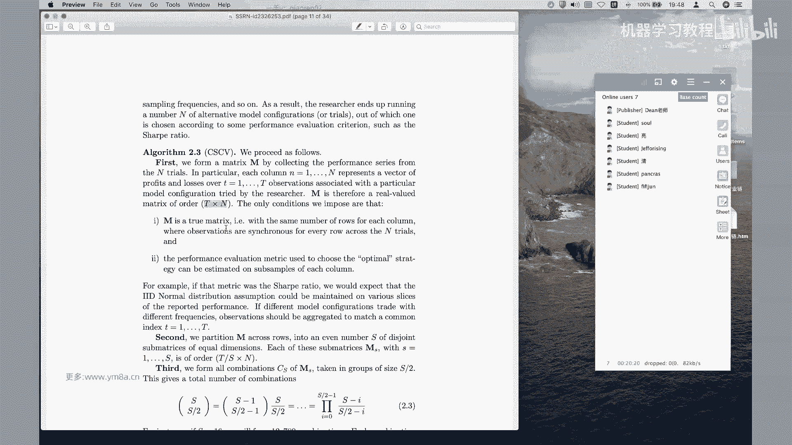

呃这边就是我生成的这样一个，这样一个它的呃back testing，然后它的长度是2997，2997，是我每一列这边的时候，是我每一列跟我这边是follow他的记号，我每一列是代表一个完整的回测。

然后对每一列是代表同一个参数，那这个是怎么怎么生成的嘞，就是最简单就是我们这边首先是，沪深300的这样一个从06年到，应该是到1515年，对呃对，差不多是呃十多年的，十多年的这样一个数据。

十多年的一个数据，就是从指数差不多是从1000点开始，然后对，然后一直到，从就是中间有到过4000。5000点，然后就然后又回到3000点，回到3000点这样一个呃这样一个sad story对。

然后呃bg testing是简单来说，就是就就那么几行对吧，就是说我这边parameter是shop window，然后long window，然后还记得就是a moving average怎么做来着。

就是说当我的短均线，短均短均线就是超过长均线的时候，我就有一个浪的这样一个仓仓位，然后当长均线超过短均线的时候，就是说我们是一个short仓位，但是因为A股是不能做空的。

所以你只要把他的position设为零就可以了，所以说我default position，就是我所有的手是仓位是零，然后当我sht ma大于等于long的ma时候，我的position是一。

那其实就我有了仓位之后，我就可以去算他的DARETURN，然后就可以得到这样一个简单的back testing，然后OK嗯在这边要注意，就是说我们这边没有用，就是说比如说我没有说我一手是多少钱。

就是我们assume是每天都是满仓，就是说我这个我我现在就说我的我的net capital，就是我禁止从一开始，如果我的仓位是多的话，那我就跟着就就完全就根据指数的这样一个。

就是根据指数的index value，就能够得到它的这样一个DARETURN对吧，所以我这边其实用的就是一个是position的shift，然后乘以一个指数的这样一个DIOR对吧。

但其实这边还不是就daily return，我都没有去把它乘以一，但是对对，因为我这边有一个position的shift，对，所以就是说如果说就是这么这个意思，就是如果第一天如果在第二天，你在这边。

第一天我买入对吧，这边position如果是一，那么到第二天我的收益率是什么的，或者说我到第二天我净值变成什么呢，我的净值就是1089。37，除以1079。32，就是说我始终是一个满仓的状态。

如果如果说第三天我禁止如第，然后我我到了第二天的时候，就是我position变成零，那么我的净值就保持不变对吧，那如果是净值是一的话，我只要去就是说如position是一。

我第二天的净值其实就是说把净值去，我现有的nt value乘以一个额，就是沪深300的这样一个比值对吧，第二天除以第一天，所以这个是这么来的对那么简单的测算，测算一下之后。

我们就可以得到的我所有的这样一个呃，对uh daily return，我们这边这边因为用的是一个就是LORETURN，对，Ok，然后OK然后我们再回到这边来。

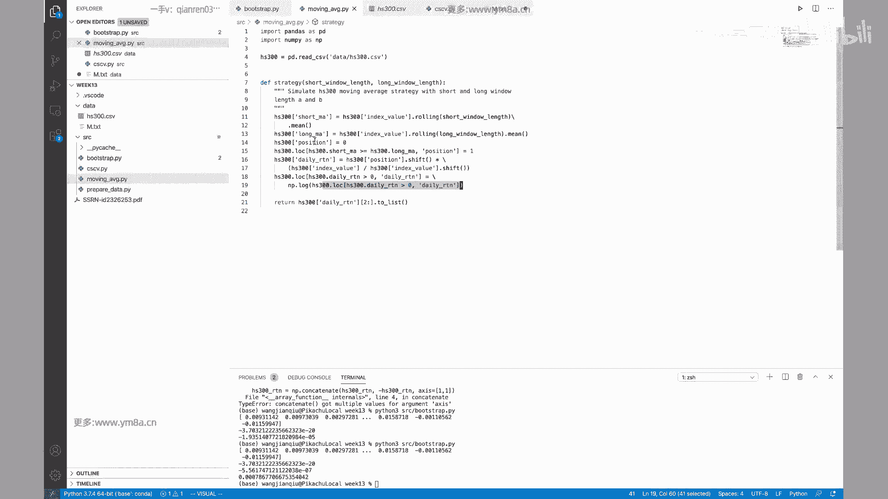

就是说那呃回到这边来说。

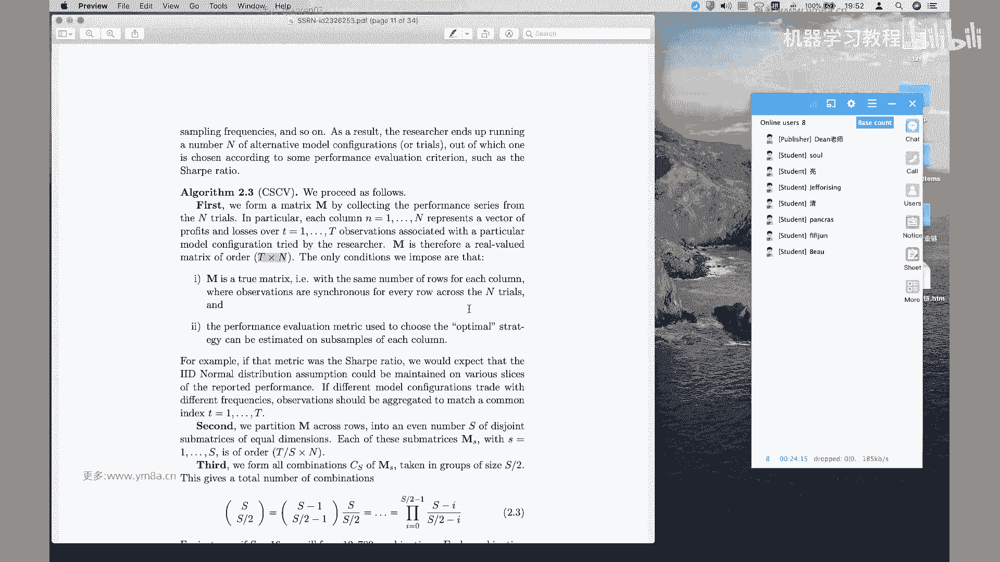

我们我们每一列是我们一个一组参数测下来的，测下来的performance对。

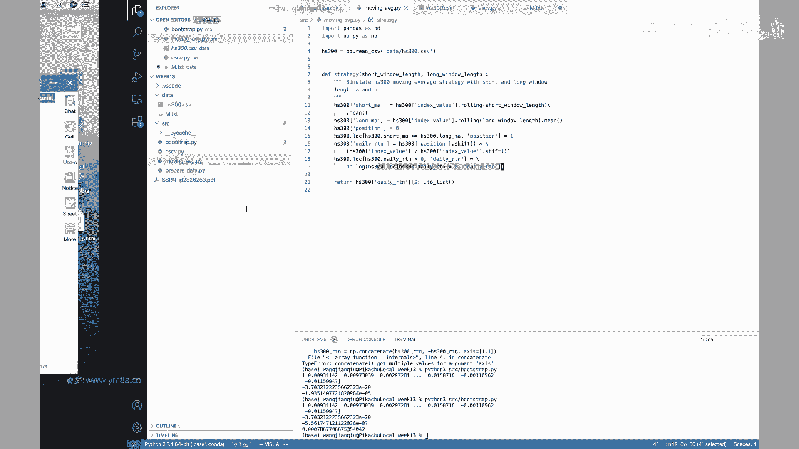

呃，然后在这边的话是我们怎么去general，也就是说我们这边用的是1000个1000组，就是number of trials，然后我shot window的是属于是呃，一到200之间的一个随机数。

然后我的long window是怎么选的，是shop window加上1~400这样一个随机数对，所以也就是说我就是去生成1000组这样的一个，呃组额一千一千组这样的一个组合。

然后就生成他的这样一个daily return对，OK然后把它save text就是保存到我们这边来了，保存到M这边来了，然后为了可以复现的话，大家可以就是也可以去验证一下。

我把他的random seed都设为一，这样的话，我每次就是测下来都是都是这样一个，都是这样相同的结果对吧。

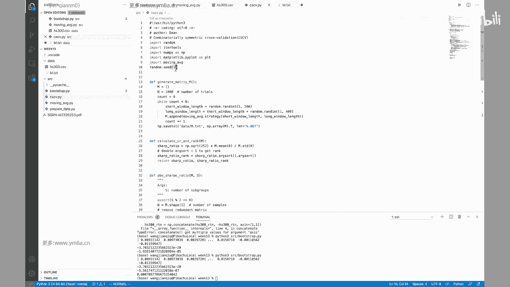

OK啊第一步就是这部分大家明白了，就是我们先生成就是matrix m m，然后嗯呃然后接下来就是说如果是他这这句话，什么意思，就是说我要去，比如说我要去测我的sharp ratio，那么我有1000组。

那我每一列都可以对应的去计算出。

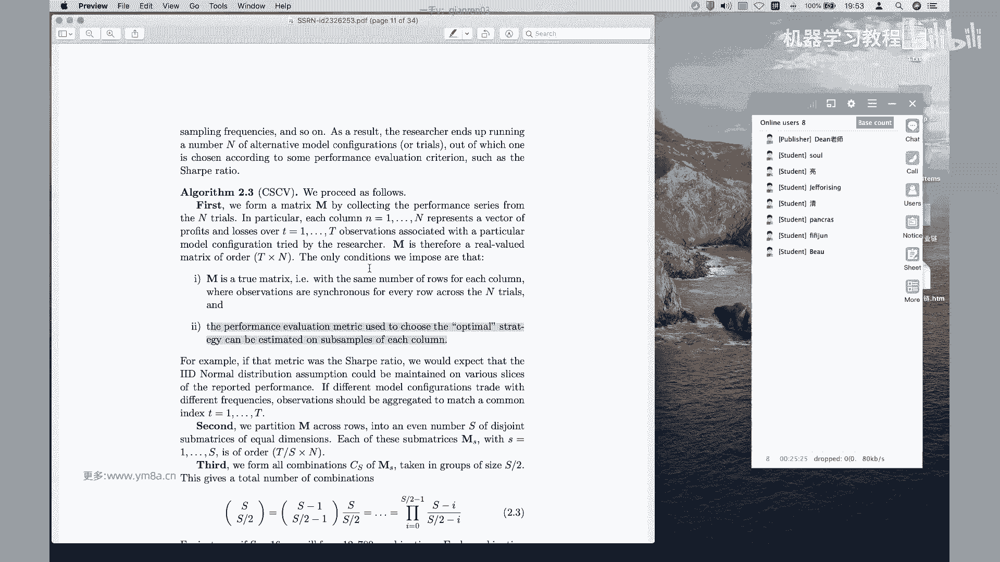

一个sharp ratio对吧，然后嗯OK嗯，因为他这边有一个就是说呃，他这边他这边有一个SUMPTION，是说是如果说是说呃，呃就是说如果这个指标是夏普比例的话。

然后其实说我们预期的就是说策略的额收益，是就是策略的收益的，他不是有这样一个独立同分布的性质吗，那我们在各个列上都应该是保持的，就是保持有就是相同的这样一个表现对，然后OK嗯啊大家注意一个问题。

就是说嗯他这边也强调，就说我们这边当然现在没有这个问题，就是呃我如果说我回测的，就是嗯有交易的频率不一样的话，我需要把我的observation，全部统一到相同的频率上去对，就比如一个一分钟。

一个5分钟，那么显然这样的就是说我的规则，或者是我在回测的时候，显然是不能，就是我不能用一分钟跟5分钟都生成，首先首先他们的就是时间序列，长度是肯定不一样，那你要去就是说不管是你应该是把哼。

就是说一分钟down3跑道，5分钟对吧，变成5分钟，然后再去比较，就是构造就是相同的这样一个matrix m，OK就到这一步就没问题了，第一步就是说不管就说这个这个。

我们在实际去回测去交易的时候怎么去用的，就是说我这样一个rule，然后我去把它我有我测试了很多组参数，对或对，然后我要考虑说我去衡量一下，我选择的这样一个选择，接下来看就是说我选择的呃。

这样一个测试参数组，是不是，就是说是不是存在过拟合的这样一种可能，OK然后然后那到这步到这步，接下来之后还要做的事情是说嗯，We petition m across roads。

所以说我们是把整个的matrix m按照行去分，OK那现在我先问大家一个问题，就是我们刚刚生成的1000组参数的这样一个呃，跟约签子参数生成了一个matrix m。

它的dimension就是它的维度是多少，或者shift是多少。

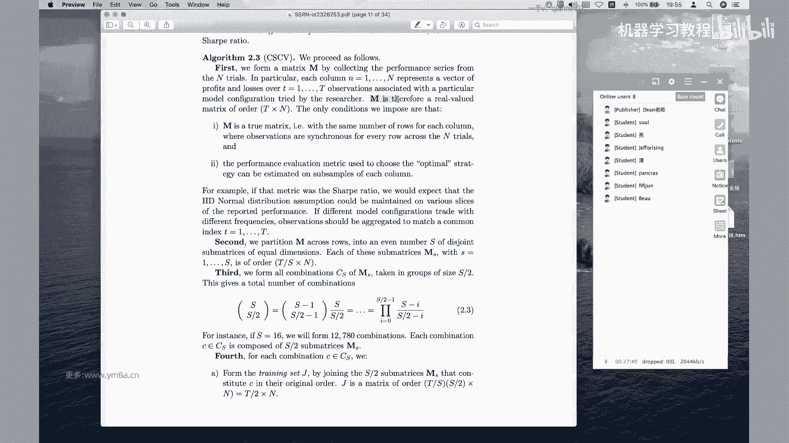

对对就是大家我要先去让大家去理解一下对吧，对，总共我剩那沪深300的数据对吧，这边是2999行，然后我这边生成的应该是return的话是呃，3号是少了两行，Ok or whatever。

但就是说中间前面我肯定就说前面刚开始，第一天，我可能把前面前面两行要去掉，对。

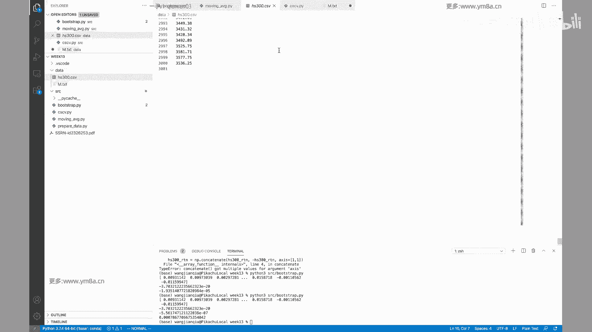

所以先问一下大家，对大家跟着我一起思考啊，就是这样一个matrix，他的dimension是多少，就是我们刚刚的就是2998填的数据，然后拿了1000组，嗯有人回答吗，那我点名了啊，呃邵同学，OK嗯。

就是DEMM的维度，首先是那其实刚刚已经说了啊，就是2998，然后乘1000，OK就我们先follow一下这个。

然后接下来就是说uh we petition and across rose into a，OK没有没有关系，我们说刚刚是说我们关注的是矩阵的维度，因为接下来就说，大家现在脑子里有这样一个概念。

我们的M是一个呃T周期，回撤率是天数，也可能是周期数，然后乘以N这N是我们的策略组数，或者你参参就是parameter的组数，OK那现在是petition m across rose。

然后into a event number as of destroying submatrix，呃这个这个什么意思呢，就是说我们需要把我们的M分成，S个互不相交的sub matrix。

记住我们是按行来分，比如说我们是横着切麦克呃，我们这儿切一刀切了一道对吧，那那一个简单的问题，假设我们要分成S组，我们要划分多少下，那就注意就是说应该是equal n。

就是说equal dimensions对吧，那也就是说呃我要把它画成S组，那我们应该去相当于7X减一下，然后这个时候的就是sub matrix ms，就变成了T1除以S然后乘以N这样一个维度。

那再问大家一个问题啊，就是说嗯，我们肯定接下来会肯定会做一些处理啊，就是说比如说因为2998，你是不能被十给整除的对吧，那我们就肯定会把就是尾边的那个bug给去掉，变成2990，那那这时候问一下。

就是说我们的SUBMATRIX，M的这样一个维度是多少，要要不还是嗯SL同学你来回答吧，就我觉得大家把整个算法先follow一下，然后再去看input的，就会觉得OK他是怎么回事。

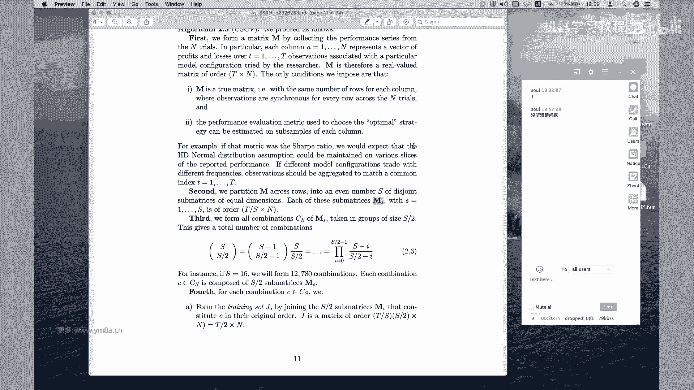

不然的话，就是其实其实就是说这边看起来还会有点复杂，但是我们整个实践下来呃，对其实也就这么多行对。

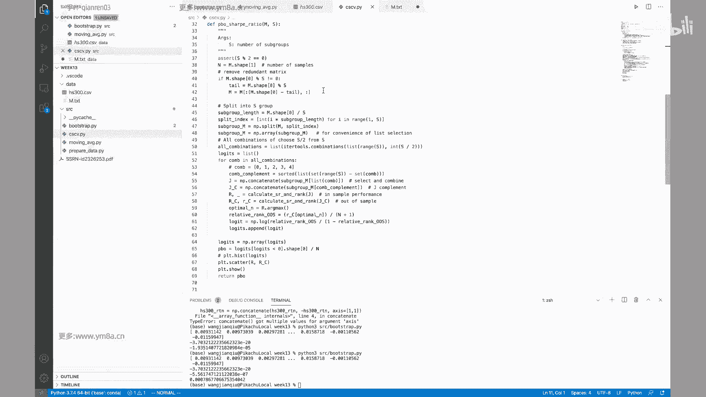

所以就是大家先去就是先去理解，就是说我们现在做的是什么事情，就到现在第一步我们先回测，我们测了N组，然后我们做的事情是把这N组切分切分成S组，对哦sorry，是把这对这这样一个矩阵。

这样一个矩阵切分成S组，我们是按就是说按行来分，就是说横着切，横着切是什么意思，我可能会把它时间顺序给呃，就是就是说啊会去把它给切开来，呃比如说我们这边是292990，那我肯定会把它2990。

我会把它切成，假设我们是这边，接下来我们用的是S是十，我把它切成十组呃，那为什么要用哎，就是这边要强调是是一个even number，那为什么是even number，接下来大家就会明白呃。

那我这边切成十组，相当于说我每299个一组，然后啊对，那我怎么切成十组呢，那那那其实就是299，然后598，然后是697对吧，这样去切就可以了，那么那这样的一个就是combination是呃多少个呢。

就是说就是说接下来他会说we from all combinations，就是说我要把，接下来说的是是taking group size of s s two，就是说我刚刚不是分S组吗。

那我现在去S1S的一半，那大家明白就是说为什么要为，就是我一定要是偶数，我才能去取一半对吧，不然我会总归会多一个出来，那接下来我要问大家一个问题了，就是说我在这十组当中随机的去选五组。

总共有多少个combination，大家可以回答一下，他这边说的是S等于16，那这个是12780，这个是怎么来的，谁能解释一下吗，或者说问当我就是我要把整整个会分成十，Yeah，cool就是C15。

就是ten choose five，就是从十个里面选五个，OK那OK然后接下来说就是前面三步，其实我做的事情很简单，就是呃我先回测，就是假定我有一些策略参数，我根据我去我去。

不管是像就像我刚刚这边做的是暴力寻优嘛。

对吧，我这边做的事情是这样，我这边是用一种随机的方法，我还没有去去网格选用，因为因为我参数空间选的非常大，对就是说短窗短窗口可能是1~200天，任意一个，然后长窗口的话就是短窗口，再加一到一百四四百天。

所以这里面差别就是组合还是比较多的。

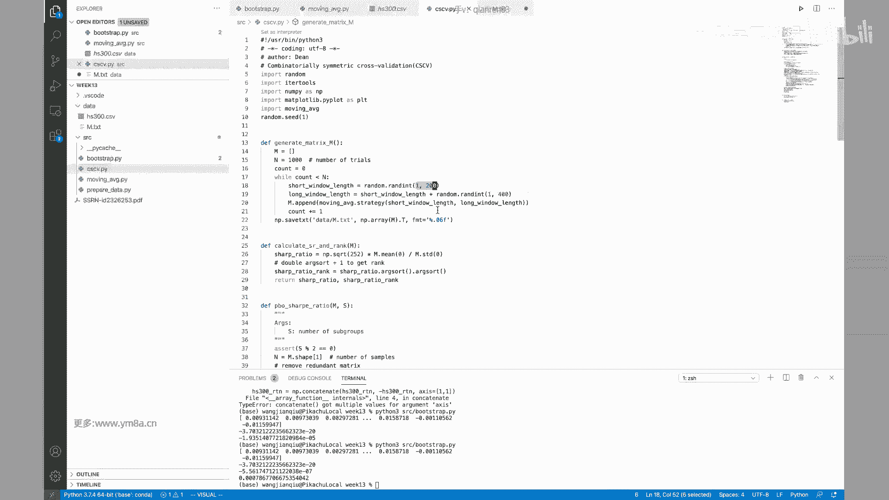

对对，然后就是说然后做完这样的策略，回测完之后，我就把它切分，切分之后我随机的去选呃，S除以二的，OKOK然后接下来的话呃，接下来的事情就是说是我不是选了一半吗，那很简单，我刚刚选了这个。

选了选了就是十个里面我选了五个，那么我把这一部分当做我的training set对吧，By joining，the as divide by two submitrices对吧。

Constitutes cy in their original order，注意这边是original order，什么意思，就是说我们刚刚选了一个组合是呃，就是说比如说12345。

最简单的就是说总共十个，我选了12345，那要注意我再把它合成一个新的矩阵的时候，不能是12435，我一定要按照原来顺序，其实你正常的做呃，做PERMI就是做combination的时候。

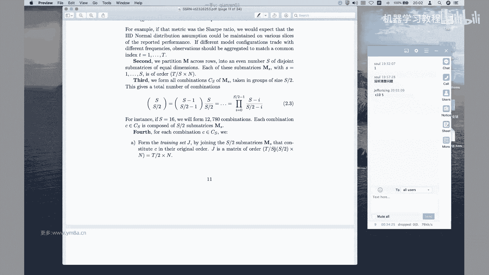

你其实是不会去打乱它的顺序的对吧。

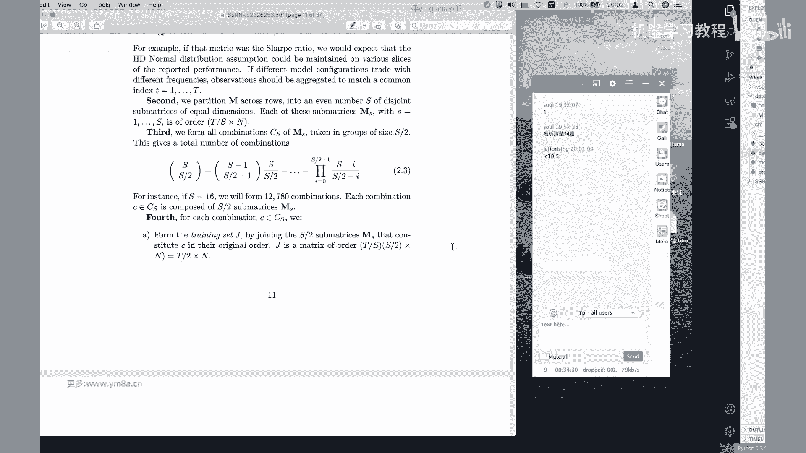

对大家都注意我们是就是是combination，就我们是呃就是我们这里面不涉及排额，就是就是说排列组合，我们这边是组合，就是没有排列，没有顺序的问题，就是12345跟43215是一样的。

因为注意我们用的是C啊，不是用的是P不是PERMITATION对吧，所以就是十个里面额十个里面选五个，我们总共有这额是C15是多少，whatever大概大概是几百个，对应该是几百个这样一个范围对。

OK然后接下来说是那我选完了十个，选完了这五个，然后比如说应该说我我还保留原来的顺序，那我把这这五这选来了五个，作为我的training set j，那剩下来的就是j bar，就是额就是加了一横。

就是说代表是剩下的，这呃，剩下的是就是剩下的就是当做我们的，就是testing set，OK那其实就是说我只是想了一种方式。

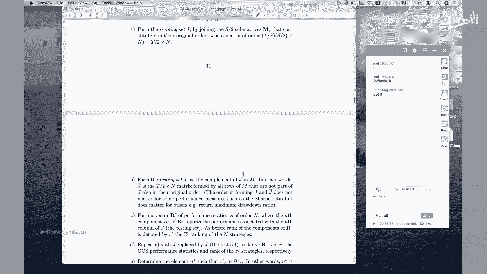

把我刚刚才的这样一种矩阵。

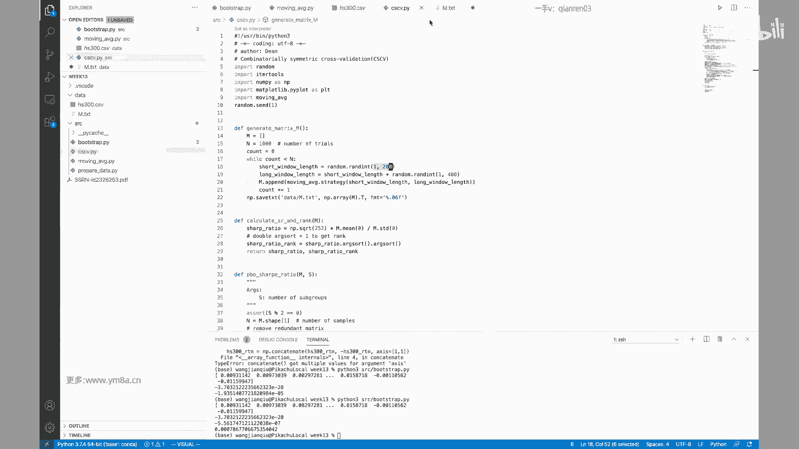

是相当于说把它去拆成了两组，但是我不是连续的拆，我是随机的去呃，随机的吧，先把它分成N组，先把它分成S组，然后从S组当中随机选一半，把它组成一个J，然后另外一个是testing的J对吧。

所以到这一步都OK，然后接下来事情是说，那这个是你说forming a vector of ourselves of，Performance statistics，那这个这个这个这个是什么意思呢。

就是就是说其实说我们刚刚，比如说我要去算SHRATIO对吧，那我就把我现在的钱就是这个J去算一下，Shap ratio，这就是我的performance statistics。

就是如果大家再回到我们前面的话，就大家可以慢慢去理解，就是对吧，诶这边这边这边N是多少呢，N当然就是三了，因为我只测了三组对吧，那这是我的shopper ratio，然后这个是r bar的话。

就是代表我剩下的另一半值，另一半的就是我选完就是我testing set的separation，所以大家慢慢的就前后你可以慢慢去对应，建立联系起来，OK我做完事情。

是把我的额下半部分的这样一个short ratio，给计算出来对吧，所以就是然后然后要注意的是，呃就注意的事就是说我下pressure，我不是横着算还是竖着算啊，就仍然是我每一组都要去算。

记住我任何的一个指标始终都是有N组对吧，因为我没有去改变我的，我的我总而是测试了两个组合，那么我每个组合不管是在测试集还是在呃，呃就是就是在testing还是training，在还是在训练期。

我都要去去算他的呃，performance statistics对吧，OK然后其实C和D是要做的是额是呃一样的，OK然后然后as before嗯，就是OK其实这边还还忘了讲一个，就是说就是说我再去算额。

你当然就这两个，这两步你可以理解为你先我们先看一半吧，就是说在嗯就在training set里面，我算完了这个performance之后，然后就是说我要去算他的little rc。

LILRC是什么意思呢，就是说是in sample的这样一个ranking，还记得我们在前面说是怎么来算呢，就是嗯嗯类记住所有的little r是ranking。

capital r是我们的performance statistics，所以这边是他的performance是sharp ratio，然后对应的是他的ranking，0。5最小，所以排一。

然后一点一最大，所以排三对吧，然后这个时候later r c的话就是一样的，雷达RC对应的是testing set的performance ranking。

而这边是performance statistics，这边是SHRATIO，这边是ranking，所以其实C和D做了两步，是，我分测试集和验证集去分别计算我的performance，Statistic。

然后去对应的去排名，OK那得到了这样一个之后，C和D我得到了这样的之后，我会去做什么事情呢，我要选的是在样本内，我要去选the elements and star that uh。

我是属于the best，他是说any star，我代表的是the best performing strategy in sample，那什么意思呢，就是说我在样本空间之内。

我选我选夏普比例最高的这一组策略，Right，这部分大家明白吗，是什么意思，你说我或者说我这样的，哎注意啊，选就先强调一个前提，就是说我这边是for each combination。

刚刚忘了强调这一点，就说我们刚刚呢得到的，不是说是我们还记得我们前面得到的是，Ten choose five，十个里面选五个，那我在十个五选选中五个的话，我要去便利每一个combination。

那么在对应的这样一个combination的时候，我每个combination事实上都决定了一组我的，testing set跟training set。

training set跟testing set就已经决定好了，我决定好了之后，我事实上都可以针对每一组去算in sample，跟out of sample的这样一个sharp ratio。

跟它对应的ranking对吧，要注意的时候，这个时候我们的in sample，就是说我不再是像我们以前做，比如说做优化的时候，我们说呃七比二比一对吧，我没有说拿70%的做in sample。

去做optimal，然后在呃20%去做样本外，然后最后10%做验证对，然后对我们这边做的整个事情，是我把我所有的整个数据都拿来去测了，去测这样的一个呃能去做back testing去做呃。

呃去寻找它的最优参数，然后但是呢我把我整个的tedk testing的结果，进行了一定的划分，OK所以到这一部分的话，呃大家明白就是说我们做的是什么意思，是什么事情了吗，我们现在已经说已经划分完之后。

我分别去找到了呃，我这样的一种啊，我根据我这样的一个划分嗯，我有他的optimal的这样一个column对吧，呃大家要注意的是为什么，就是说为什么就是说每一列就是每一种comb。

不是每一列是每每一种combination，我们都要去重新计算的，因为很简单，就是说sharp ratio的话，呃，我每次从这2900多个，我选了1400呃，1445个对吧，1445个的呃。

它是1445行，那么我把它随机组合之，我把它1445行，按照原来顺序去算shap ratio啊，那么显然他是会去变化的，因为嗯就最简单的，比如说我们选的是12345，前半段的sharp ratio。

那前半段这sharp ratio，这1000组里面最大的一个，跟后半段1000也是1000，445个的SHAPARATIO，哪一列最大，那显然这两个是不一样的，对不对。

所以这这也是为什么我们要去做combination，就是说我要把所有的这种排列组合方式，都要去考虑到对，那么我说我假设我说我们，我们就现在我们combination是12345。

是作为我们的training setting，然后786789十是我们的testing component，对，那么接下来要做的事情说，我要去定义就是relative rank。

relative rank是什么意思嘞，那这个是什么，这个是，呃，这个是反正我们这个加加一横加bar的，就是都是是这样的，就是啊呃就是是嗯是是属于testing set。

那这个n star是我们是刚刚怎么选的，是选的是in sample的那一列对吧，就是说我已经知道了，就是in sample那一列的，就是说哪一列它的performance最大。

那就是separation，就它那么我们要去看它对应的out of sample的，Sharp，ratio的ranking，大家再去理解一下，我们首先在in sample之内做到了。

我们挑到了sharp recial，sharp ratio最大的那一列，那么这时候我们看out of sample，它对应的sharp ratio的ranking。

记住我们这边不是拿shap ratio，是拿sharp ratio的ranking，我们我们刚刚说过，所有的capital r就是大写的R都是sharp ratio，小写的R都是对应shop下。

shap ratio的这样一个排序，所以我们刚那这边就是说那这个值就是说呃，是0~1，那就很直观了，因为我排名最好的时候说我out form，我，我样本外也是最，我样本外也打败了所有的。

就是其他的样本外的参数组，那么这个时候RNC他应该就是1000呃，其实我这边就是没有太搞清楚，他为什么要加一啊，但是当时就是说加不加一无所谓，因为1000÷1001跟1000差不多，它都是一对。

也有同学想到了可以空告诉我一下，也有可能他是我猜他故意加一，是不是为了就接下来算log的时候，就这边算log的时候，就是应该是算log，防止他到E吧，对因为就这样就是不对，其实这个值衡量的是什么。

就是说衡量的是我in sample比的最强的那一个，我在out of sample到底打败了百分之多少对吧，就是衡量它的一个显卡就是相对，所以叫rate rank，这这部分大家有问题吗。

就把这个先理解清楚，就它整个的核心就是说在算啊，就我一队的permutation，就是随机的这样一个组合组合之后，我in sample选到最佳的。

那我要去看我的out of sample到底beat了多少对吧，所以这部分如果明白了之后，那么他接下来就定义了一个是logic，那logic是什么意思，就是说呃那如果这个值是，但这个值是个0~1之间。

那我通过了这样一个就是说呃，那显然就是说如果我是个值大于0。5，就是说我打败了我50%的，那么如果这个值呃小于0。5的话，嗯如果这个值是不是就是欧米伽C82，欧米伽巴尔C大于0。5的话。

那这个值就是会取大于一对吧，反之的话这个值是小于一，然后我取了log之后，那这个值就是说如果说是他out perform，就打败了百分之样本，让我也打败了50%，那这个值就会大于零，反正它会小于零对吧。

所以他说嗯high large value imply implies呃，就是a consistent a consistency between in sample。

And out of sample，Performance，就是说如果这个值越大，拉姆达c lodge越大的话，那么说我样本内对样本外表现越一致啊，是这样的，就显然没有什么问题。

就是极端情况下这个东西是零，那这个值就n sir，极端情况下这个值这个值接近于一，那这个值就会趋于无穷大对吧，OK所以大家对这部分这样有一个概念了吗。

首先就是说呃我们做的是for h combination，我都会去计算一个我每我这样的一个看看，就是每一个combination，我都不会去算他的样本内到底有多少的比例，去打败了这样样本外。

我们用这样一个large值来衡量，然后最后的话我们再去算，就是我们得到了损，就是每一个combination，我们有个拉姆达C，那么我最后就可以去算一个拉姆达西的，这样一个呃。

他这边有relrelative frequency，你其实对这个式子的话，你可以把它理解为就是一个呃lambda的，就是probably probability。

Distribute density function，就是我最终其实就是要去看，就是我们拉姆达CP这样的一个分布，所以到这部分大家也OK吗，就是其实整个的CNCV这样一个框架。

就是为了去算我们LANAC的distribution，因为这个值它衡量，就是我经过我这样一种随机的排名，就是经过特定的顺序的，就是去组合，然后我衡量了我样本内跟样本外这一个表现，Okay。

U带大家也可以去读一下paper，然后有什么问呃，有什么问题吗，现在好，我们先休息15分钟，然后呃，我把问题就是大家花15分钟时间，把整个的就paper发给大家，把整个流程再去理一下，然后对。

然后下节课我过来有什么问题，我们把它解决掉，然后让我们再来去看怎么去implement，Ok。

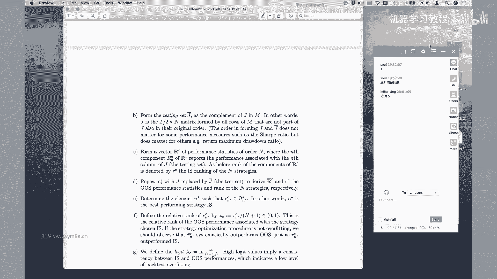

好我们先休息15分钟，然后陪对，然后paper已经发给大家了，没得在微信群里看一下。

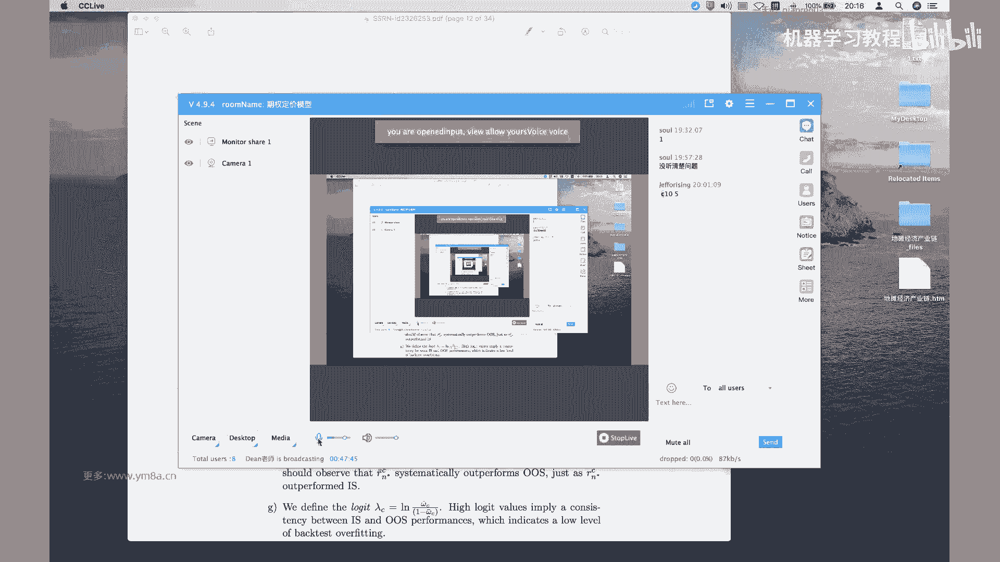

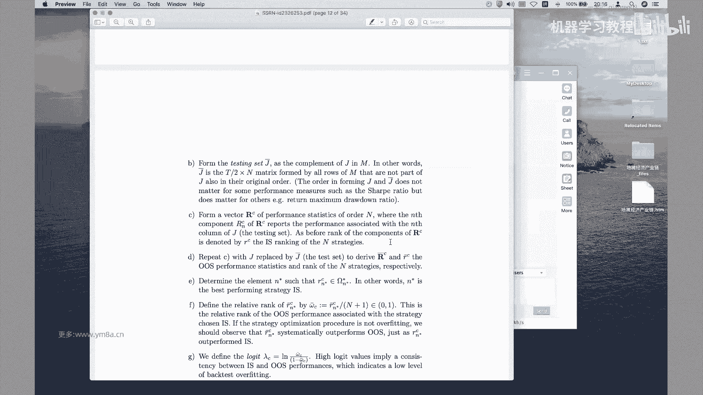

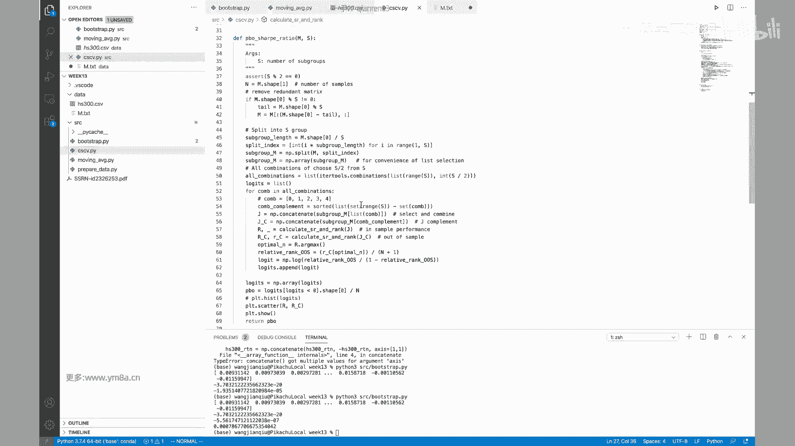

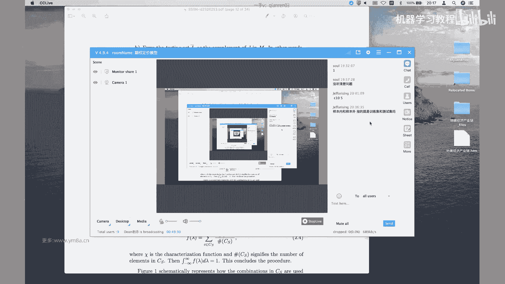

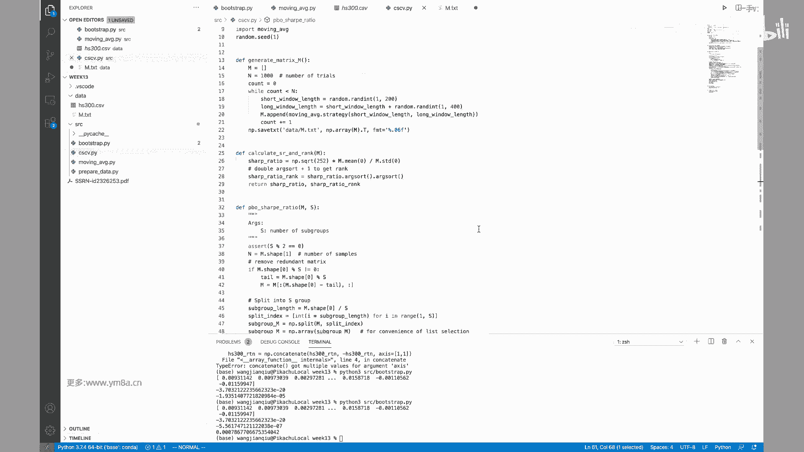

呃K呃我来解释一下，就是嗯解释一下这个问题，就是首先第一个问题，样本内跟样本外，这边他说在CSCV这个框架里面，它指的就是training和testing，SOK就这个是没有问题。

然后so同学这边说的是，那这边是肯定是说他是呃，本质上来说是把我所有的呃策略回测的结果对，要记住记住这边是拿这边样本计算表现，这边我不知道你说的计算表现是什么意思。

那我们这边所说的呃计算表现就是说你可以呃，可就是说是呃，其实说我们这边没有去计算sharp ratio，我没有拿直接的全部样本去计算它的sharp，ratio或者是max周导。

我只是回测下来得到的是daily return，如果你买说计算样本去得到data return，我觉得这个没有问题对嗯，然后就说他是说是把呃DARETURN，结果随机分成两组对。

那这边trick就在于说它随机分，并不是说我1000里的1000呃，就是我这2990个随机选两组，就是随是随机分，它是嗯就他分的时候会有一点trick，我会先把它分成一小段一小段。

因为嗯你如果是完全的去随机分的话，甚至说顺序有可能去颠倒的话，那其实没有特别大意义，你当然说是就是他当然可以说是有人，就是用就是蒙特卡罗，去把我的收益率序列去打乱，然后再去算对，那也是一种方式。

但是不是不是CSCV这个框架里面，想要做的事情，对他说在这边做的事情，是还是说强调一下，他是先把它分成SUBMATRIX，Subgroups，你把它分成N组，然后从N组里面再随机的选一半出来。

对这个时候我分别的对样本，哪个样本样本外去计算，是二去，就是说是去计算呃，Shap ratio，然后这个时候这个时候我再去说，然后再去算每一组的这样一个ranking的排名。

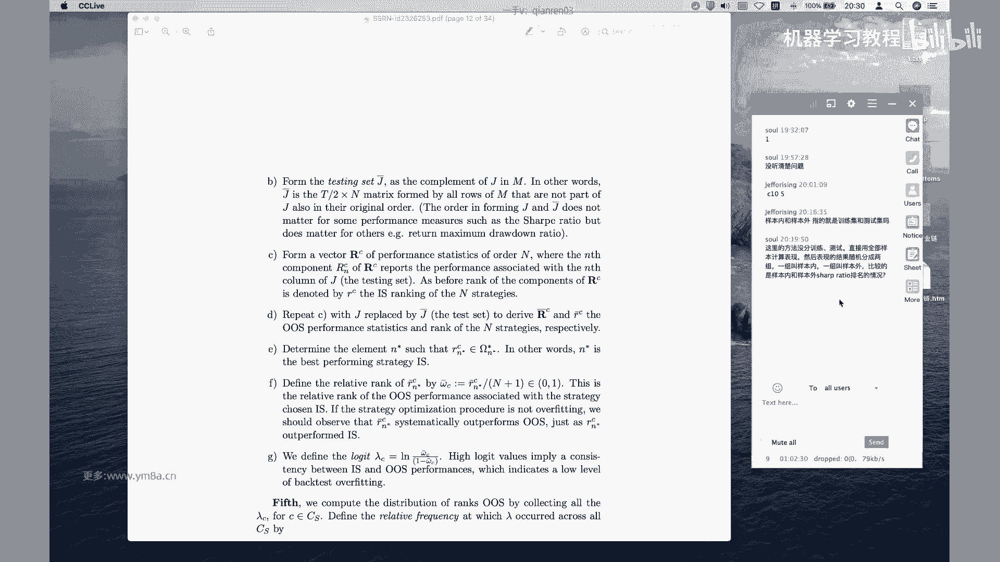

对吧，这记住是记住时候说呃这边是有两个。

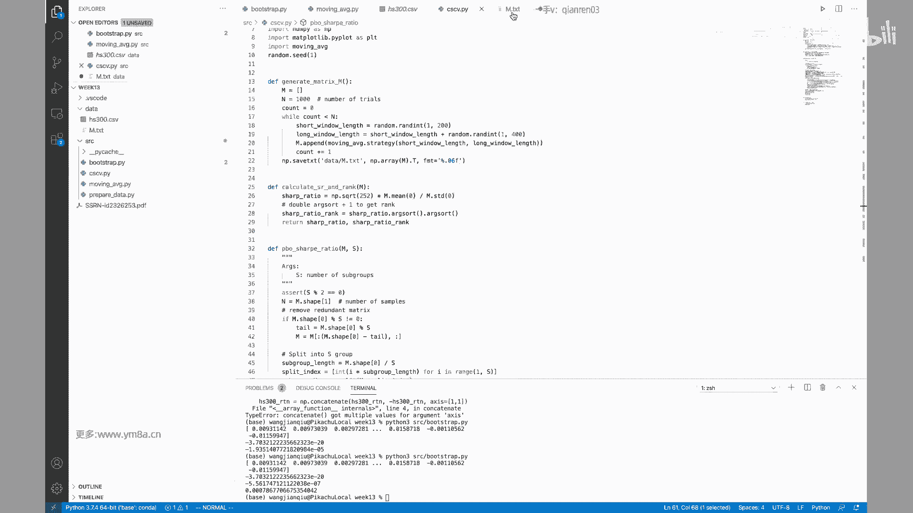

就是一个是分组，分组的时候，我们是横着分对，就是说我把他是就是按天数区分对吧，哪些天数是哪些天，OK但是我去比较计算呃，去算ranking的时候，因为我总共是总共是1000组数据。

那我其实是我是横向去比较，不是纵向去比较对吧，因为我我我每一个只能算出两个sharp ratio，一个样本内，一个样本外，对前一半样本内，后一半是样本外，然后然后再去，然后再这。

然后我再去对每一行去分对，OK然后呃。

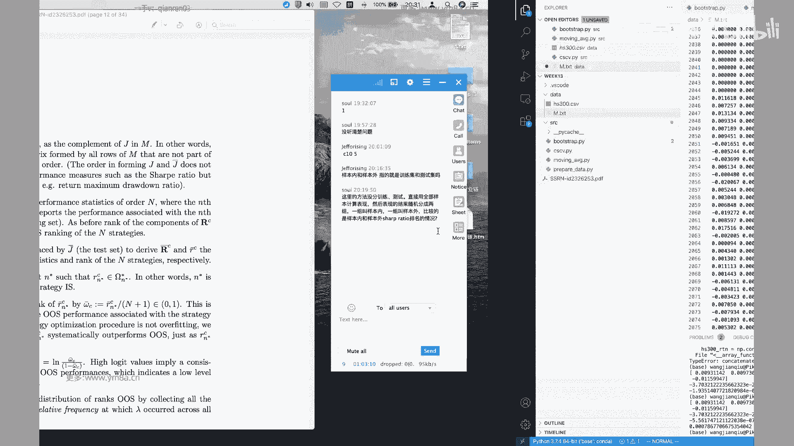

这个时候我们再来回过头来去看一下，前面这两个公式，我觉得大家可能现在会应该会清楚一点，就是说他所他所说这个是什么意思，就是说我们首先是样本内，我选取了额这样一个呃，比如说我样本内我是说第N组呃。

就是说我样本内它是probability，就是说它是最优的，那这个时候我看到我对应的这一组，然后我看他样本Y的这样一个排名，它是不是小于二分之N对吧，就是说我如果比50%的差，我认为它就是过拟合。

所以然后这个时候我他是他是相当于说是嗯，我要把在样本外，就是说我是所有这个时候他说的是，我要把最优参数NNN新在样本外的夏普比率，然后如果小于所有N组参数，在样本外下部比例中位数的这样一个概率对吧。

我们刚刚说小的小的R是排名，然后capital r是具体的数值对，所以再次强调一下，就是说是我是先分组，分完组之后分别去计算SHRATIO呃，对如果说整个过程，而我想问一下，就是整个过程。

现在大家都明白是怎么回事情了吗，对反正paper也给了大家，然后好，今天其实要记住结论，就是说你看这个图形是比较有意思的事情，就是说如果只有呃，就是S等于four，就是怎么就呃分成四小组，然后怎么去。

然后C42的话呃，总共只有六种六种方式对吧，然后a b in sample ab，然后out of sample CD，然后ACBDADBC哎，大家注意，其实它是两两对应的，所以说用这个框架一个优势。

就是说首先是说大家关注，就是说他训练集跟测试集，它是具有相同的大小对吧，因为我每次都只用了一半，那么这个时候我就说我样本内外的这下浮比例，可能就会具有就就具有可比性了，因为我们在正常机器学习当中。

比如说我七比三的下部比例，你去算的时候其实会有些问题，因为你一个是呃，你要不你一个是样本内，你长度是七，你是70%的长度，然后另外一个是30%的长度，你拿这两段，然后相同的参数或者是不同相同参数。

分别去计算SHACREATION，但其实我我觉得就是可比性还不是特别多，不是不是特别好比，当然嗯，因为我如果你说我只用50%去做策略，开发，50%去做验证，那也是那也是OK的对，但是但是这样的话。

你其实嗯你在就是要测试开发过程当中，我可能50%的数据，其实会我就会少了很多的数据去进行开发，对吧咳嗯然后当然还要注意一个特性，是说我们这边所有的in sample跟呃out of sample的话。

它它是完全对称的，我会在in sample出现，我那么它对应的一定会在out of sample出现对吧，呃这是为什么呢，因为因为我就是我就是这么划分的呀，我就是说我十个里面选五组。

剩下的都会放在out of sample，那么我因为我游戏做的事就是combination，我是相当于说是全部把它排列了一遍，那么我对应的一定会说是全部去出现对吧，然后是嗯。

然后还有一个就是说我们就是说，也就是说我们就在这边，为什么没有说是去随机的选取，而是把它去分组对吧，因为我如果太随机的话，其实我就打断打断了它，相对来说实就是实际上的这样一种相关性，那么我在这个里面说。

我仍然把它分成S个这样一个sub group，我其实我时序上的相关性，仍然是就是说是保证了的对吧，然后另外一个，我觉得这个整这个一个框架的特点是呃，其实我是一个model free的这样一个过程。

我没有E黑，也是一个non parametric，就是我是一个非参数，然后也是一个无模型的这样一个过程，然后我其实没有依赖于任何的这样一个，assumption对吧，我们我就是我没有，我没有说是。

这边一定要说是有这样怎样的一个模型，也没有说引入相同的参数，你可以把S呃就是divided by any group，you want对吧，就说其实我最终得到的是一个，拉姆达的这样一个经验分布。

然后这个时候说凡事发生过拟合，就是说我把我呃朗姆达应该是小于零的，这部分就是呃我把它从负无穷到零去积分，那么这个这部分，然后接下来的这样一个比例，percentage就是我的OVERFIT。

这样一个p b o probability of bantastic overfit，对吧，OK所以对这个总结其实说总总一看，他就有四个特点嘛，一个是说我训练集和测试集相同大小，然后另外一个是呃。

我训练集和测试集是是对称的，任何一个测试集都被当做了训练集，任何一个训练集同时也会把它当做了测试集对，然后另外一个是我保证了，第三点是我保证了这样一个时序相关性。

然后第四点它是一个number metric，也是一个model free的这样一个过程，OK呃所以到现在大家还有什么问题吗。

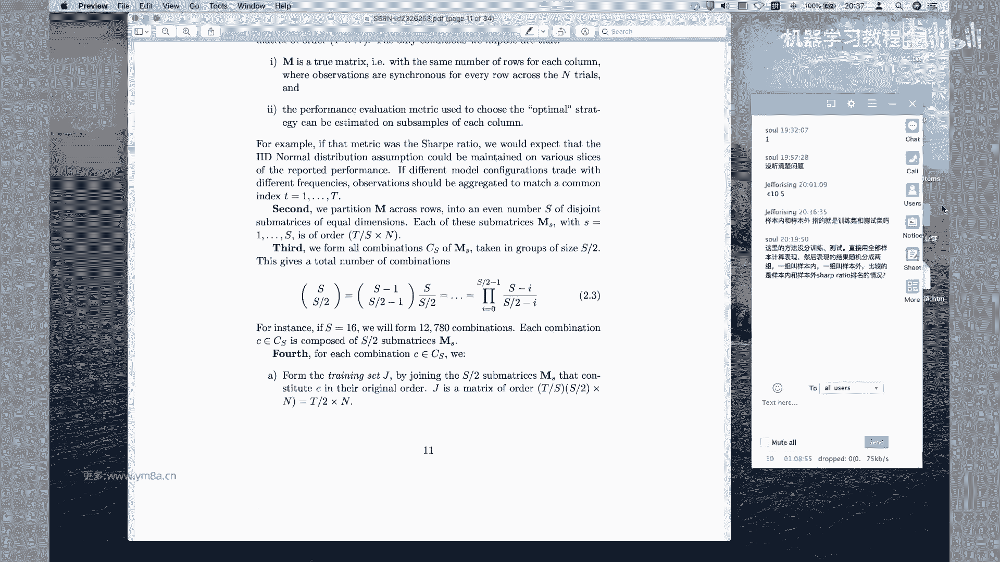

嗯OK然后我们就来看怎么去implement，其实你如果把整个过程理解下来的话，呃实践起来应该会比较简单嗯，额程序是呃这边是generate，generate这样一个return的matrix。

然后我刚刚说我是seed是一这样，大家去做的话可以对比一下，因为结果是完全一致的，然后呃calculate shap paratio和rank，这个里面有一些小trick呃。

sharp rati我觉得很简单，就是我们这边model free interest，我们认为是零，然后我直接去main，然后divide by s t d sturbation。

但是这样一种方式是说嗯嗯全是，因为因为我是沿着axis0，我去沿着每一列去算命的话，就是说沿着这一列，而这注意这我们这边实际上去算的时候，我给的不是M啊，我给的应该是M的额一半对吧，我就是随机选了一半。

但这边是为了方便嘛，它这边是300M，所以这样我就得到了是他的sharp ratio，就是return，This to a mere，Return divide by，嗯嗯对呃，我这边可能我在想的话。

我这边用的是log return，而不是return，可能会有一些问题，但对于结果影响应该不是特别大，然后然后注意要把它去，我们是日级别，然后还要把它转化成年画对吧，所以乘一个。

不然这个值算量会很小对吧，就是日级别的SHA手其实还挺难的那个，然后把它把它就是s qr t o，然后呃接下来有一个就是有个骚操作，就是用了两次ARSORT得到这样一个排名。

就是这个这个这个事情是为什么嘞，这是我们看一个，就是我给大家写一个例子，大家都明白了，我们生成一个，I'm sorry，就这样吧，Ok，我们生成一个就是这样一个random，这样一个序列。

然后就是假设它是sharp ratio对吧，那么我们要去排序的话，我们最终design就是理想的结果，它是一，它是二，然后他是345，所以是呃13254对吧，你应该得到类似于这样一个结果。

或者你加1-1都无所谓了，那么我如果第一次做的话，做arc sort得到的是呃02143，然后再去做一次ASHORT呃，呃是不是只要只要用一个就OK了，好这边不好意思，这边可能还没有必要呃。

让我想想我之前为什么要做这么多，Ok，第二次之后应该是没有变化的，Ok，好所以这边是冗余的，然后这样就得到它的排序对吧，然后他是为了我们，接下来就是算整个的过程去服务的，OK然后我们再回到sorry。

回到整个过程，首先是呃我们去算PPOSHAPARATION的时候，或传进去，其实就一个是我的收益率序列，然后我要把它分成几组，然后assert它是能够它是even number。

然后number of samples，然后就是我有多少列里边是N就是1000了，然后注意做的事情是就是啊我把他这个给去掉，就是我我们把它就是就是它的余数对吧，如我们2990，我们希望它正好被S给整除。

那么不能被S整除的tell就把它去掉，其实应该用后面好一点哈，我正好试一下有没有什么区别，那我就从，tell到and对，从tell到and就也是一样的，我们这样选下来，也就是总共是，如果我们这边是一件。

应该是2990对吧，OK这部分做的是什么，就是说我们需要把我们的l matrix，把前面的给cut掉，只留下我们能够被S整除的部分，那么接下来要做的事情是split into s group。

那么sped into a group怎么去，那么首先知道我每一个每一个subgroup有多长，那就是有这个时候M我已经update过了对吧，所以我只要是shape0，我有多少行，有多少天，那我除以S。

那我就得到每一个S有多长，然后我去生成这样一个spit index，spring index是什么呢，就是从一到S我总共有S减一组对吧，我我我需要在哪切呢，那就是在呃一乘S1。

这就在1S2S一直到S减一乘S对吧，就是比如说我们这边是299598哒哒哒哒，一直往后，所以我得到了就是呃spt index，然后我去把我的sub group m，我就得到了南派去split对吧。

而且split之后呃，注意这个这个这个时候是我这边得到的是呃，一系列的list，就是这边推出来应该是是一个list，你比如说A，number派，He can spread u，As index，对吧。

我们就这么去分，然后，我们去split a，嗯ok spit a的话，Spirit a，这边dimension，大家看到，首先是，你或者再去把它，我把它变成一个array，这时候看起来清楚多了吧对吧。

这个时候就是每它是一个相当于是three dimensional，那么呃就是三维的这样一个呃，10×299，然后乘以1000对吧，就是如果是BD0个的话，就是299×1000，那么接下来要做的事情是。

我们用了一个是itor tools里面的combination，这个事情这个包就是，我们先看一下combinations，他做的事情，比如说是我们把1234，然后四个里面选两个，看它生成什么结果。

它是一个生成list combination这样一个object，然后再去把它list一下，OK这样就是他的排列组合全部对吧，那么这边用的是list of ranjs。

然后我要去SS里面选as debude by two，然后这边把它变成int，那么就得到all combination对吧，就得到了这样一个list对吧，那么如果这边是我们这边是mirange ten。

嗯算了，少一个princess uh list ranch，Sorry，这边，对吧，大家看到就是每一个都是我们的组合，先按顺序来，但是这个也有好处，就是你不用去担心它的顺序。

我们我们的index就是说我们的subgroup，um m就是M零M一M23，他都按顺序去排好的，所以不用去担心，然后看一下它有多少个哦，这样不知道可不可以，嗯好吧，252个对吧，这是十选五。

OK那么那我们得到这样一个all combination之后，我要去做的就是我们每一个combination，是一个它的element对吧，那我得到了就是这样combination之后。

我用一个呃set的方法，去把他的combination的compliment，就他的补给给求出来了，就比如说这个呗对吧，呃就是首先是set range ten，就是这个是什么。

这个是这样0~9这样一个集合，然后我再去减去这个set，对啊，然后再去把它变成一个sorted，把蓝按顺序去排列，所以12678的补集就是零三，求求相当于是求补集，OK然后接下来我们得到了这样的。

应该就是M的划分之后。

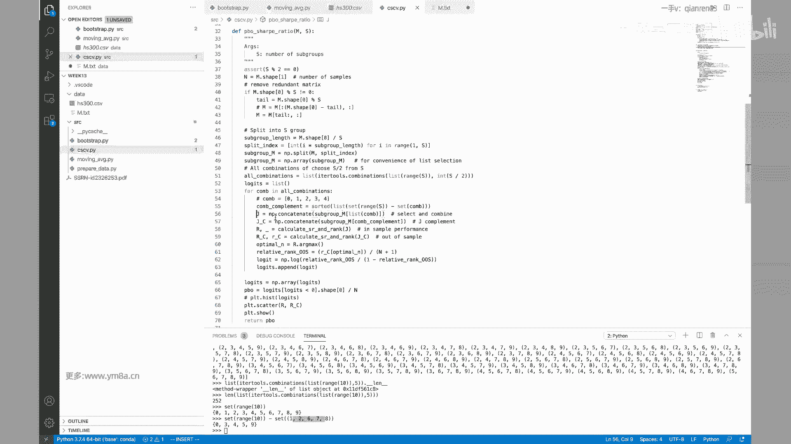

我们去就是这个是我们的step集了，我们得到了他就说我们先做这边。

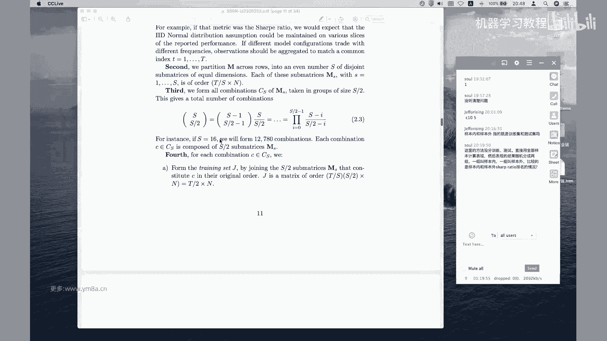

我们得到它的划分，然后我们现在是loop for each combination，对吧，我们是for h combination，for each combination之后，然后你要去join。

那我们这边join用的是concatenate，南派的concatenate，所以刚刚我们说sub group m是多少来着，B的size shape是十二九九幺一千到1000。

然后这个时候我选的就是说那subgroup m，subgroup m的话就是B，比如说LIN1234，你得到的是这样，他的ship是什么，应该是五乘以，299×1000对吧。

就说我是五个2991000的这样一个呃matrix，然后再去把它CONCAMATE，你就知道了，应该是告诉大家dimension是多少，应该就是1795乘以千二，1495，Sorry，不好意思。

算数算错了对吧，就把五个SUBMATRIX合到一起，而记住，这个时候就是说我相当于说是把里面分十组，按行啊，就是横着来切，然后从里面选了五组，拼完拼完一个对吧，OK我这样就得到了J。

然后j compliment一样的方法，然后这这个时候我分别对这两个去算他的，Sharp ratio capital r，然后他的ranking lil r。

哎注意说我们真正matter就是what matters，是他的ranking对吧，要注意说是，我们就是说为什么要把在前面那个ranking排，排出来的，其实我们我不需要全部的排名，对不对。

我只需要是optimal，就是arg max，就是在前面这一组里面哪个最大对吧，额我们也可以这么去做一样的操作，嗯carry啊，我们不需要了，这边不需要对，我们当然就还要import它这个函数。

没有必要了，我们去算它的R对吧，我们算出optimal r，然后嗯我们的omega relative rank os out of sample，怎么算呢，是我找到对应的，首先是optimal r对吧。

然后我找的是他的complement set，就是在他的out of sample的那一部分，他的ranking是多少，理论来说，如果最理想的情形，我in sample测出来最优的。

在out of sample也是最优，那这个值就应该是N对，那么这个值就应该无限接近于一，这个是千一千零一分之一对吧，那么logic就是我刚刚说的是ranking，这个值如果大于零的话。

我认为是没有发生，out of sample就是没有发生，偶尔feat，如果是小于零的话，它发生oral feat，因为我们刚刚说过，这个值如果正好是0。5的话，代表是那这个两个都会无限接近于0。5。

所以这个除下来正好是log1就正好是零，所以如果它大于0。5，那么他得到的就是大于零的这样一个数对吧，log下来也是，那就得到的是大于一的这样一个数，log下来也是大于零。

然后我们对所有的LOGI去把它，我所所谓的probability呃，这样的话你其实呃让我想一想这边啊，OK我这边算的有点问题，我不应该是去count它有多少个对这地方有问题。

它它不是就是你还要乘以它的概率密度，不能仅仅简简单单算了多少个样本是小于N的，我要应该去算它的概率密度，这部分是有问题对，但大家明白我的意思，就是说我把每一个的就是large value都算出来了。

我就能得到一个他的histogram对吧，我们把它INSTAGRAM去看一下就好了，对，All right，Python，Three cs，First cs，他会循环的算对，有哪位同学可以试试看。

就是能不能不循环的去算我的好呃，让我想想这里面出什么问题了，Number of things test，Video，Test pavo，And ten，这边是HOSWORMSCE，Key large。

这没什么问题，啧OK他不是finally，唉，我想一想，说明这边有哪个值是出现了infinite，也就是说这个值啊，这个值出现了零，Um rite rank，我要把它，我想把微电的内阻给找出来。

Sorry，我不确定是前面改了哪一步出了问题，192，我OK我给他加一吧，OK这样应该make sense，嗯OK这样应该不会出现问题，所以因为呃大家注意看到paper里面就是。

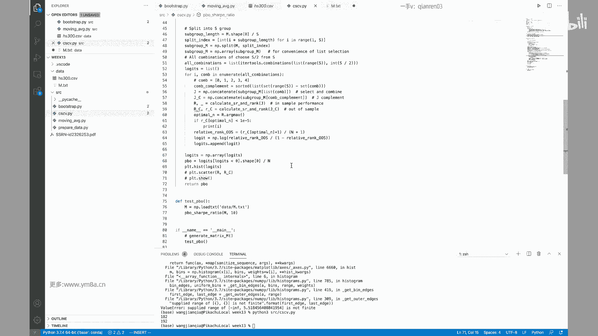

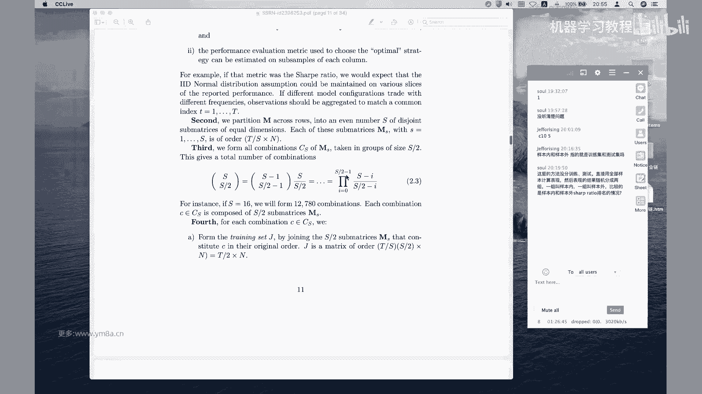

他rank从一开始，而我们这边的2sort会从零开始，所以我们把它加一之后，应该就能够避免它这个值会出现哦，应该会出现避免为零的这样一个情形，其实也不能避免，额这块没有想清楚，可能应该是，哦没有错。

对呃对，因为要注意，就是说刚开始没有加一，会出现什么情形，就是如果他真的是the worst scenario，就是他正好是最差的一个情况，那这个是零，对不对，那个是零的话呃。

relative这个值就会是一额，就是一减这个的呃，所以前面这个分子就会分子就会设为零，那么这个log时就是额就是无穷小，OK那么我把它加一之后的话，就会避免这样一个问题，那么分母为什么要去加一呢。

因为如果他是加一，那么我ranking可能由999变成加一，就变成1000，那么1000如果除以N的话，还是可能会出现一，所以它分母加一是为了避免乘1000的问题，当然那肯定取一个非常小的数字。

我觉得可能也是OK的，我来试一下啊，应该是OK的，然后我们这样能画出，就是呃LOGIST的这样一个INSTAGRAM是吧。

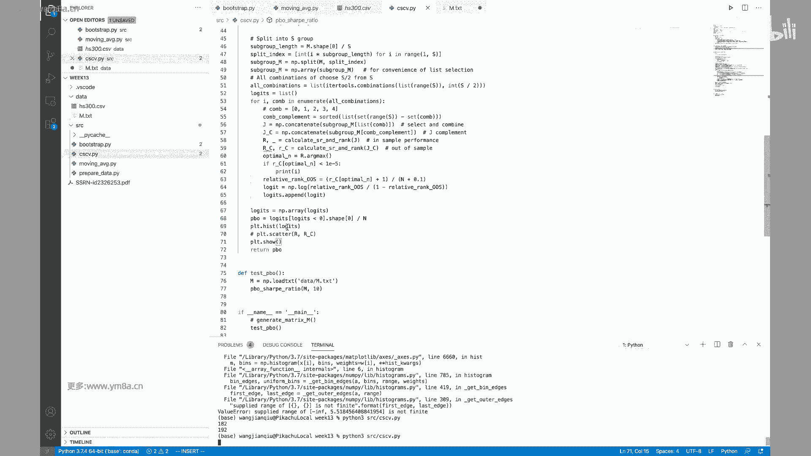

就是想近似于去把他的proper ability dec function画出来，Right，好OK所以对这边是会说什么意思，就是说，额这边就是说我的LOGI话是呃。

记记住我们每一个就是那那那什么是probability of，那个呃呃就是这是我们的，就相当于是LANA这样一个empirical样一个distribution，那么那么你显然去看我们刚刚说什么是。

probability of呃，Back testing，Back，Test overfit，我们讲的说是说是说是是什么是呃f la小于零，从就是从负无穷到零这样一个distribution。

那么我可以说啊，如果因为我这边没有归一化，但显然就是说如果他是一个没有去or overfit的话，word distribution应该是都是在零右边的，但是现现在有人说我们什么问题。

我们有一半的概率差不多是对，或者说接近一半，这样一个概率啊应该不到一半，因为这边会大一点对，可以说是说这样的这部分面积，占总部的面积是接近于1/2的，那说我们这样的一个back test。

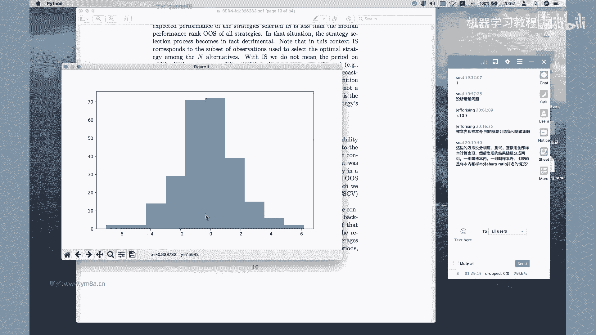

我们可以说这样的一个strategy，整个的应用过程有50%的概率，可能会是去咳，就是会额or fit，我看下这个有多少吧，这这这边啊让我想一下哈，对这边不能不能简单的就是说是去count它对。

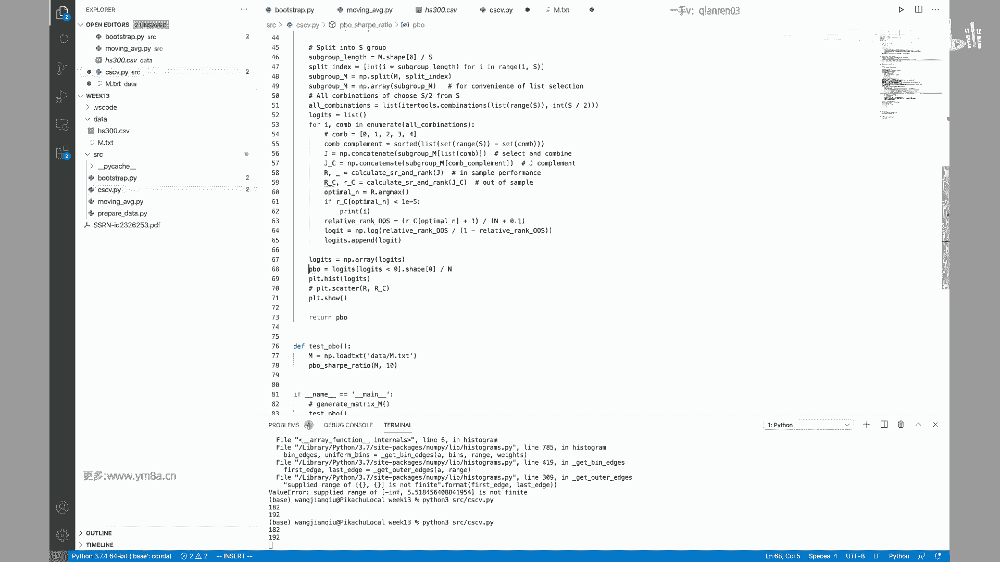

还是要去把它，就是因为我们这边得，我们说是他是我们得到的是一个HIAGRAM。

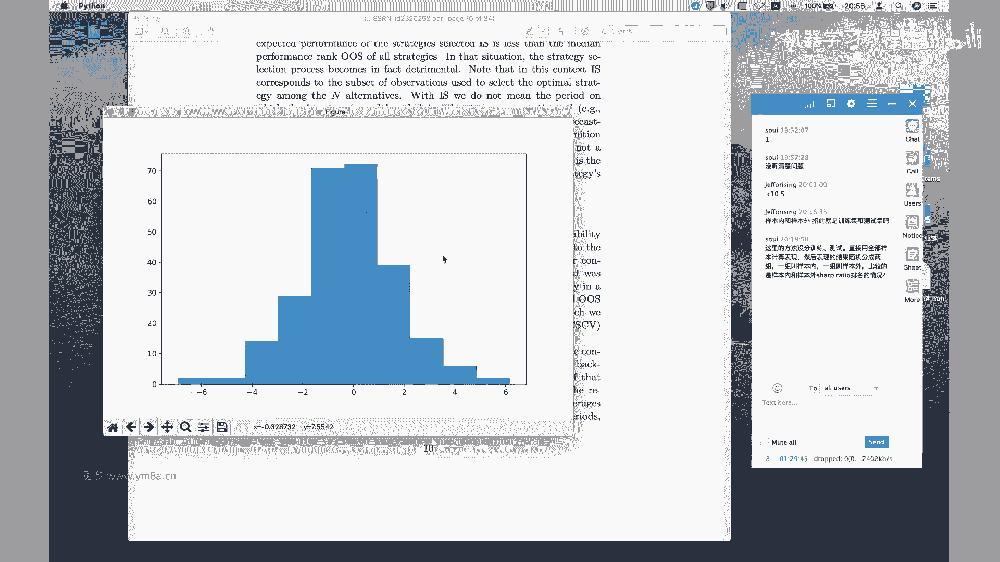

然后我们要去做的事情，是我们得到了一系列的LANA，然后我们要去把它虚拟，就是把它去呃去拟合对吧，因为它只是一个就是概率密度函数，但是你要去把它积分之后，你才能去得到这样一个呃。

得到一个它的就是概率密度，那就得到它的概率对吧，就是说我们得到的是实际上是呃，我们得到的是F朗姆达对，嗯OK然后嗯所以呃就是只靠联想一想。

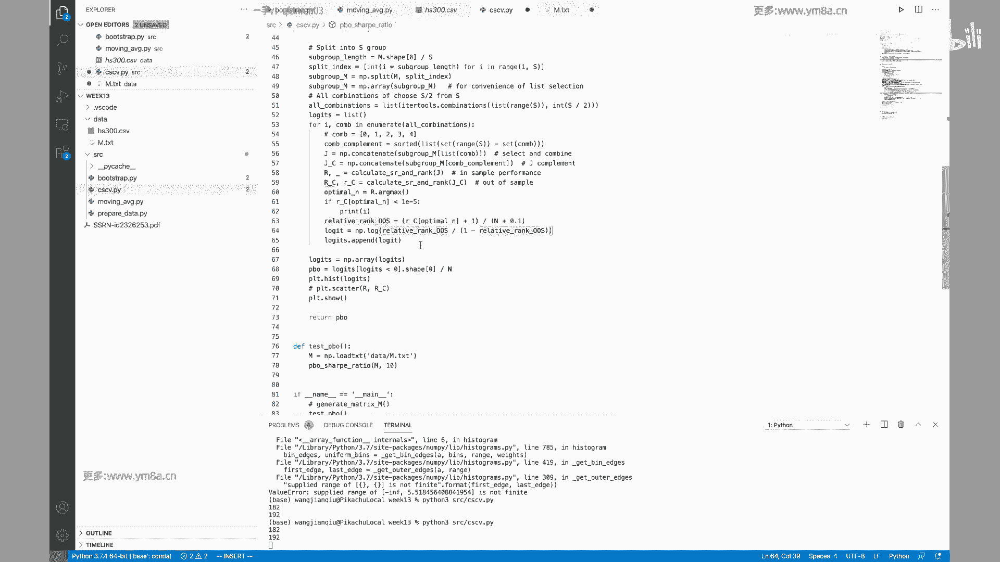

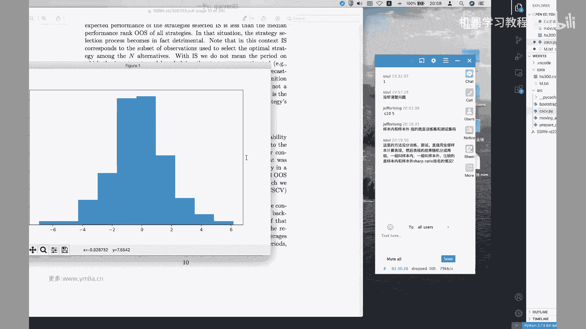

为什么这个策略会出现比较大频率，就是比较大概率一个过拟合，就是呃很很很很现实的问题，就是他就是我们OVERFIT，我们强行去构造出这样一个呃这样一个过程，对吧，我就是它本质上就说这个策略。

就是非常简单的去moving average，我们本质上是拿一个统一组参呃，就是同一种同一种策略，然后只是再去设置这样一种不同的参数，对就是我们构造的过程当中，就是加了很多这样一个参数，对嗯啊。

当然你可以说，如果说你我直觉是，就是如果你随着嗯越来越大的话，那么，嗯我刚刚是1000对吧，Let's say，红米1万，那显然的话order费概率会更大了，然后我们再。

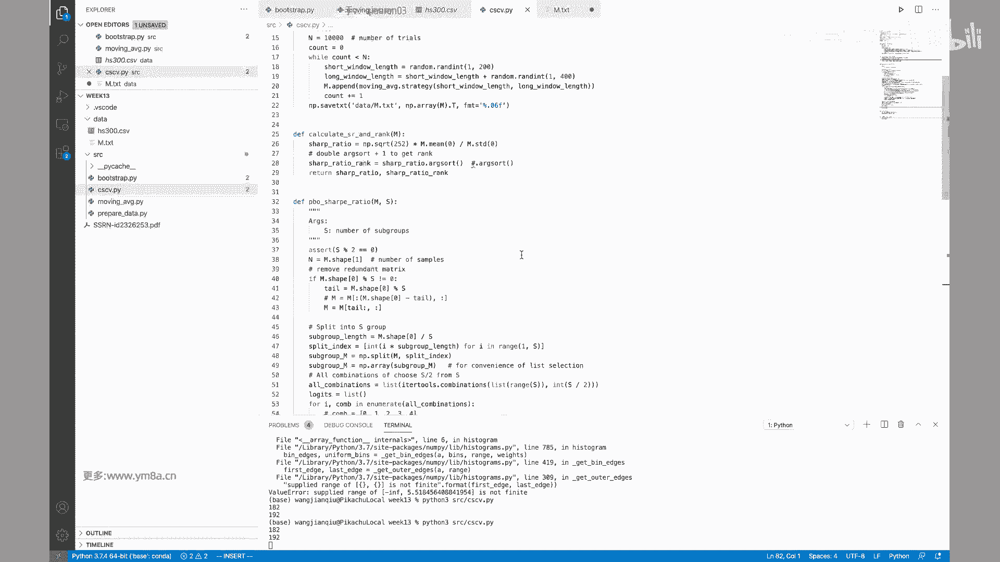

对再试一下，这样可能会慢一点，对记住这个概率分布。

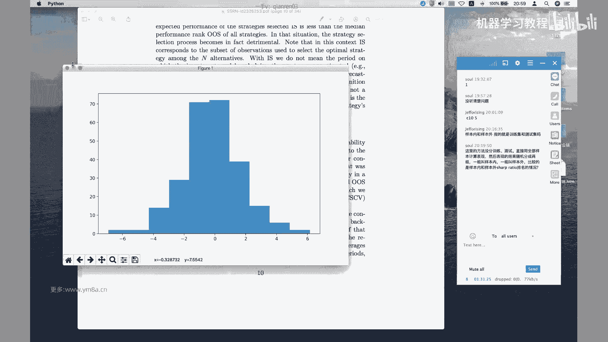

然后我们再看下一个对，就如果是1万组参数，那大概率的话，就大家可以去明白他的这样一个意思，是什么了吧，所以说，它本质上是看呃，如果我正常是说我去测试，比如说我去测试了like嗯，我觉得大家可以测试的。

可以做的事情是什么，比如说我同样一个策略，我放在不同品种上，是不是可以去我生成嗯，我生成多个这样一个呃M的matrix，那么我是不是也可以就去就是去做呃，我比如说我有类似我基于同一个指标。

但是我有不同的呃cut off的，根据不同的它的值有一个进出场值，你可能也会去做相同策略，那么这样一种框架，就是说他给了你一种去定量评估你的策略，可能会发生过年后的概率对，OK那真的是有点慢。

呃就是大家可以想一下，就是如果实际验证的话，我觉得当然有个好处，是，我们一般不会真的是去生成1000组，这样1万组这样的策略参数认证，这样的过拟合的概率是比较大的，对，额可能我们自己去回测的时候。

比如说我们可能也就测了20组，50组，那么那可以也可以用套路轴那套，用这个框架的时候，就是在做flop的时候，可能就没有那么麻烦，对吧啊，哦算一下，1万×3000。

OK3000万3000万的这样一个矩阵，所以算下来可能还是会会有点慢，对就是其实尽量能避免followed，还是去避免follow，但是呃我不知道这边有没有，就是可以去向量化的方法对。

嗯对应该可能上的话会逻辑，我觉得可能会过于复杂一点，因为呃相当于说，我要把所有的combination都给加过来。

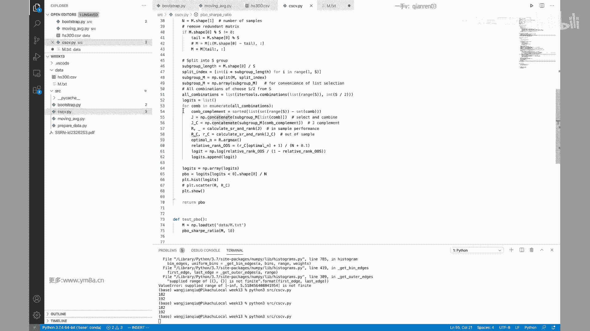

OK这是算好了吗。

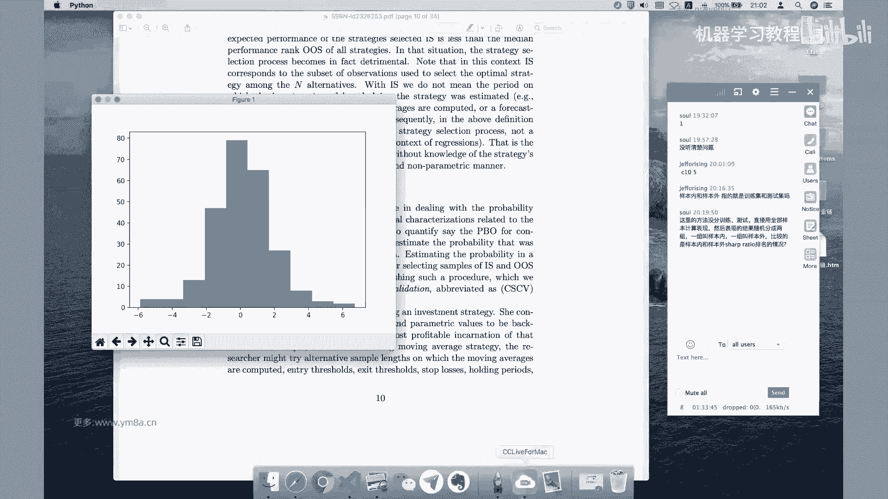

呃我看一下M的size。

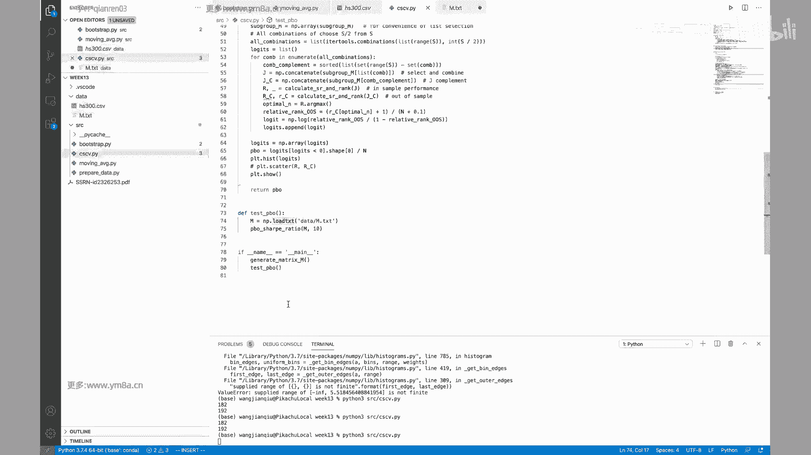

怎么跟刚刚的图，OK就这个时候刚刚还记得，就是说我们那个风是属于这边是比较多的，但这边显然已经是在零左边。

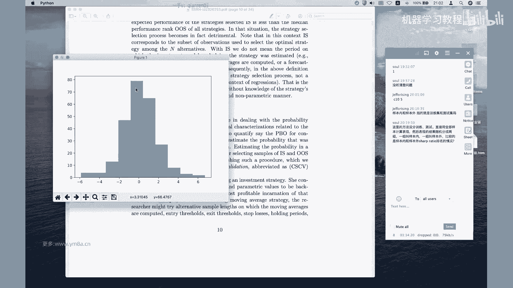

已经是高于在零右边了，OK所以嗯我们再试一个小一点的wake，把它，我们是一个如果是100的话会怎样，PBOSHIRITUAL同样都是把它分十组，唯一的区别是在于，嗯OK，平平的是不是我。

啊不能小于100，因为好想想，十五十乘，再说是index ten out bounds，为什么100不可以呢，OK试试，OK那什么问题，我说，再试一下。

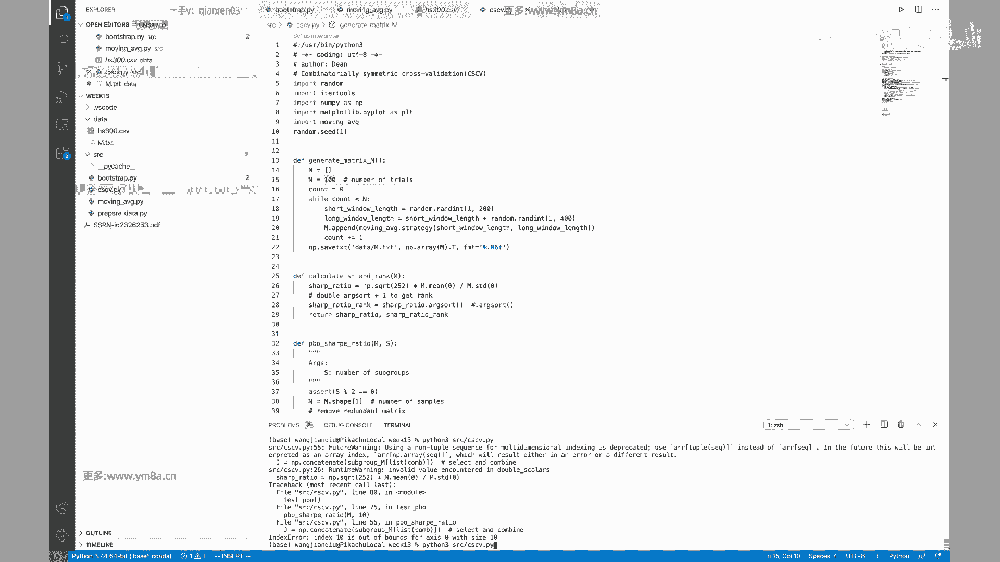

Okay uh，但还是不是特别明显。

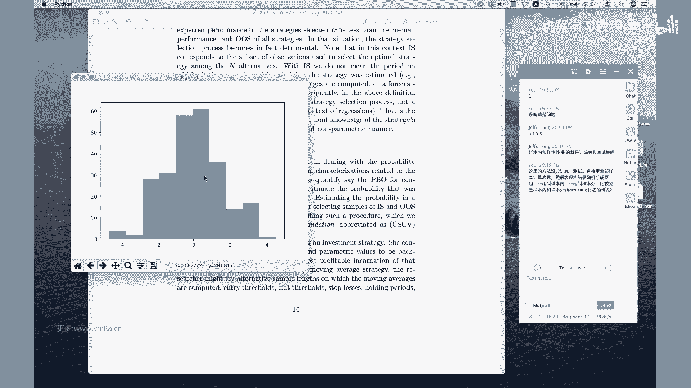

OK但是还是会有一些区别啊，如果再极端1。10。

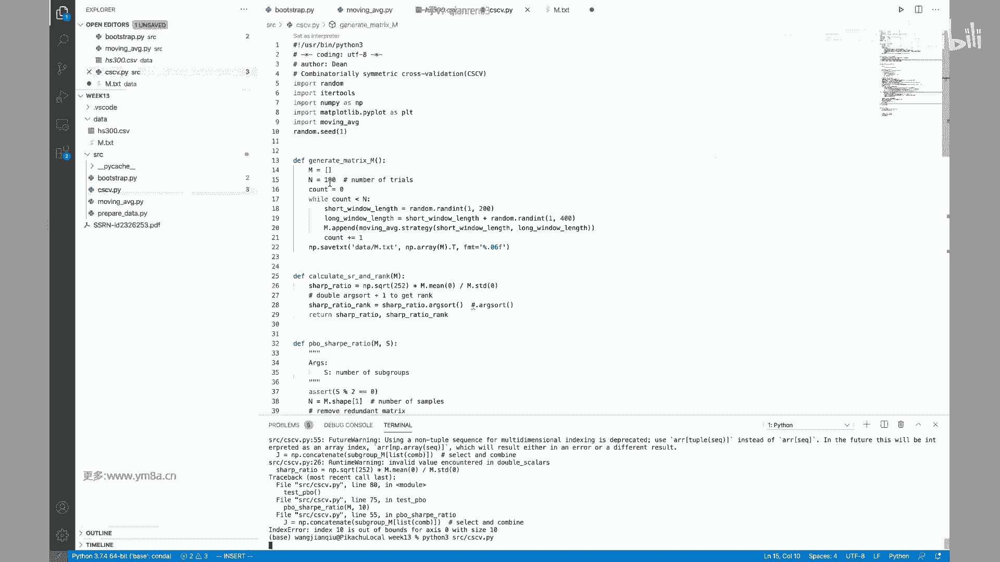

100k k。

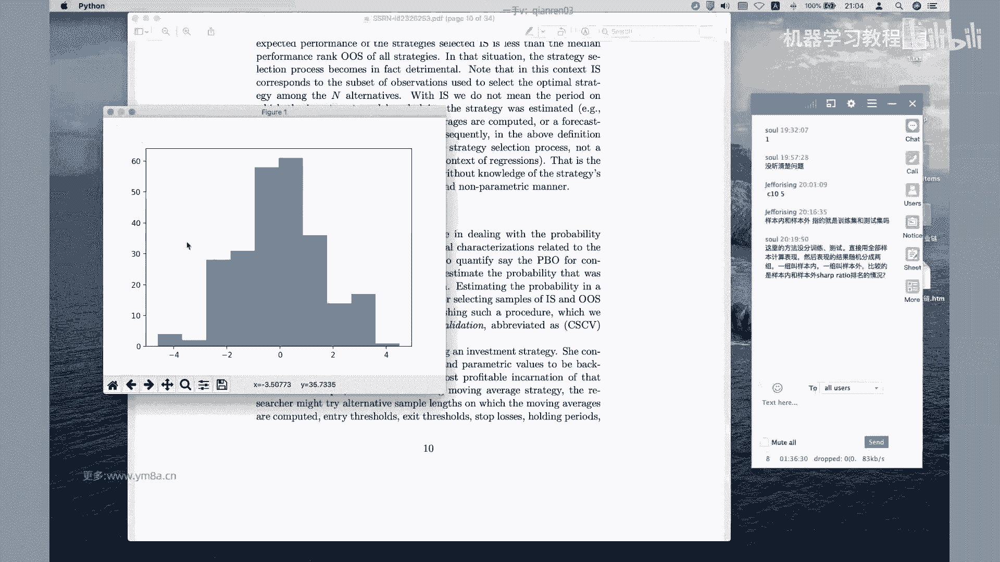

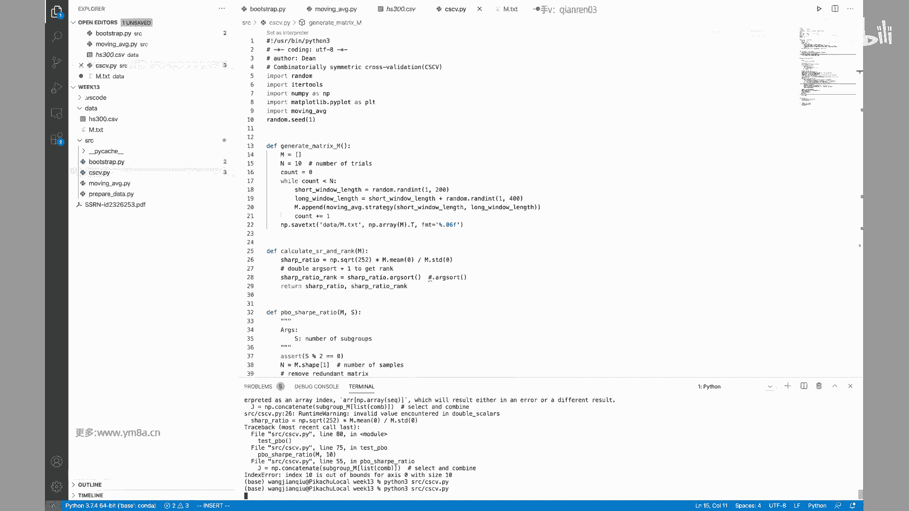

嗯哼这个时候大家看着还是会有区别了是吧。

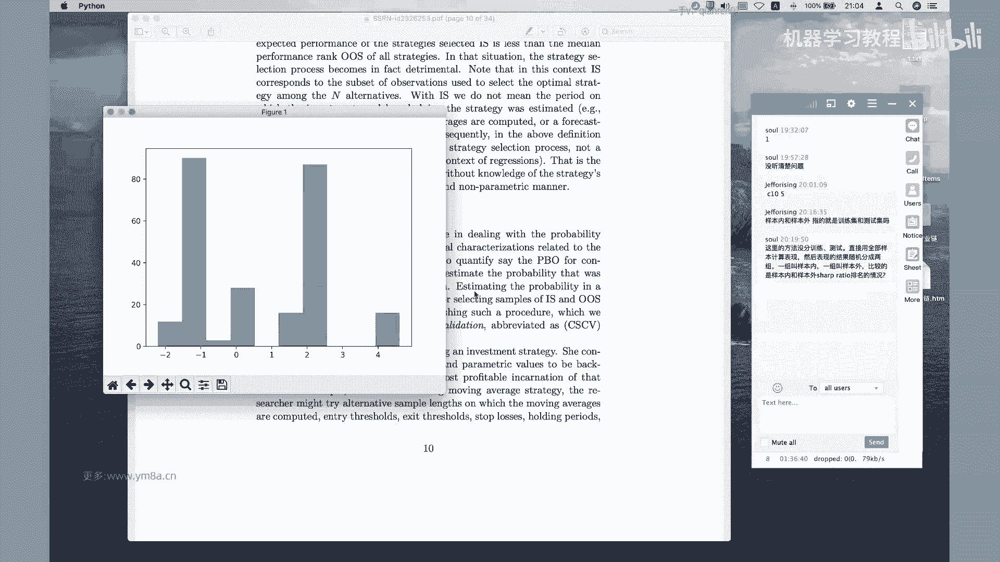

因为这个时候其实我总共就生成了对，我总共就生成了呃100的这样一个样本，然后然后这个时候其实呃其实是A这M是还是，对这样就对了，那这个时候就是显然呢就是说他衡量的时候，因为我只有十个。

我只有十个样本的时候，12345对，如果有十个样本的时候，那么我同样的在前半部分随机去选取，得到的optimal的这样一个概率额，那么它是会嗯在相对来说，它在就是说我们有比较高的执行度。

在后期它在out of sample期间也是一个嗯，嗯就是会是相对比较一个最优的概率，然后我们刚极端的情况说呃放到1万的时候，OK呃我有1万个数据，确实是从前这1万组里面选出了呃，这1万列里面。

选出了前半段最优的这样一个strategy，但是在后半段能不能是ZO。

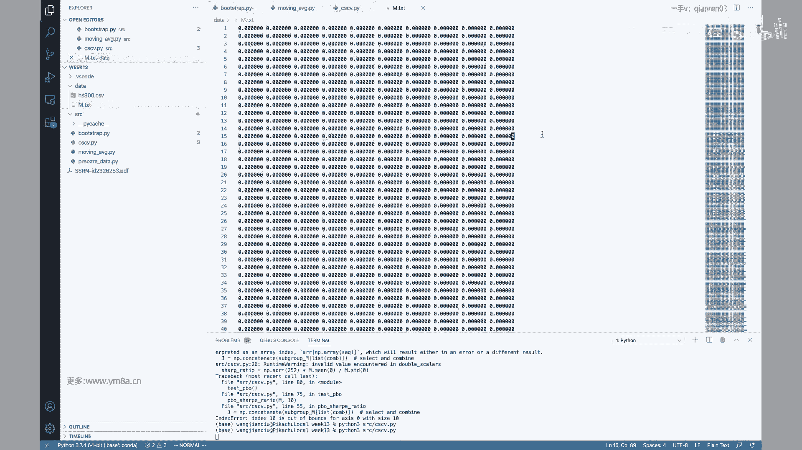

这个时候就显然就是不一定了，可能是一半一半的概率对，那这个时候那很显然，因为我测了有1万组参数对，所以这样直观上，我不知道大家能不能够对，整个就是框架会理解的清楚一点。

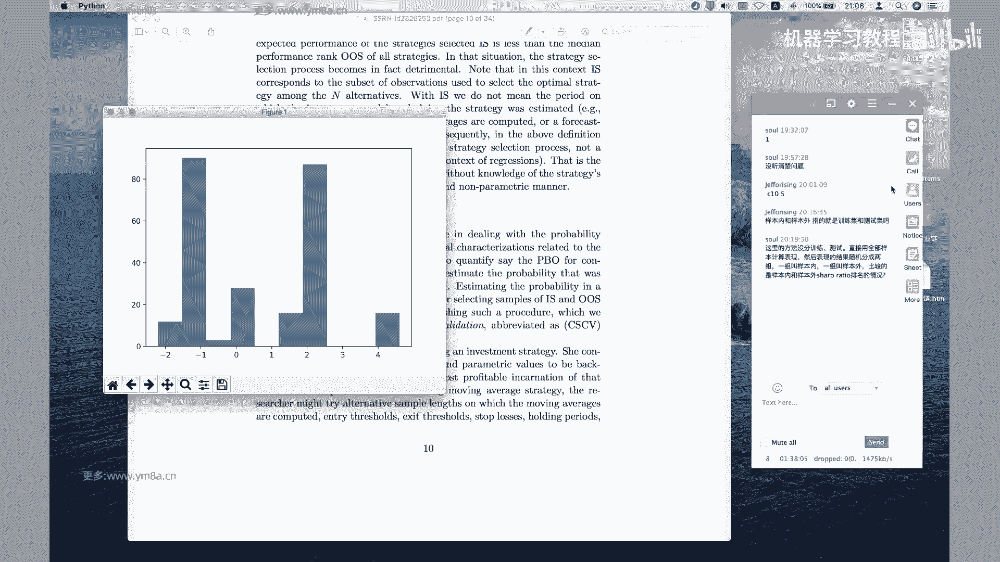

OK大家现在还有什么问题吗，所以我觉得就是说你把整个过程理清楚了之后，其实我觉得相对还是比较好去理解的对，嗯然后其实还可以做一个事情，是你看一下他的scatter策略的。

就是in sample跟out of sample，他的shop ratio到底是有什么样的关系，对吧，呃我们这边还是用1000，我这边可能会有一个问题，就是在计算sharp ratio的时候。

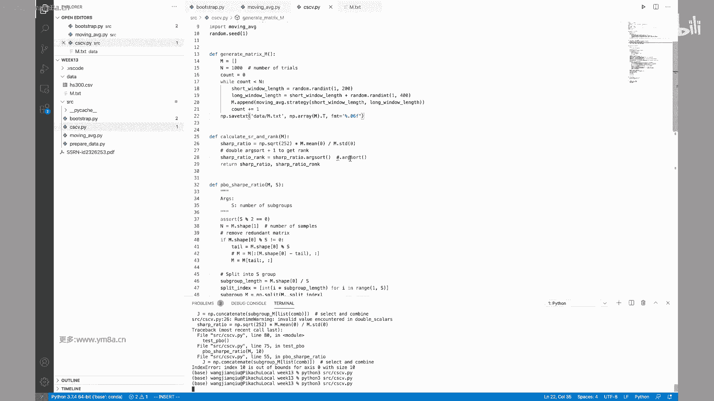

我们刚刚说LORETURN，但是呃让我想想，所以计算sharp ratio的时候。

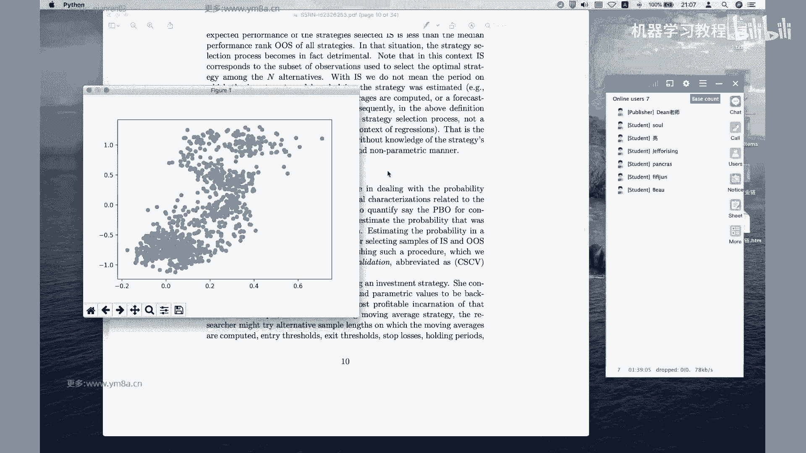

呃我需不需要把它换成daily return，就是take exponential，额这块没有想清楚，或者，Daily retur，或者我不用这个呗，用我不用log return。

我用这个return再去，嗯减去，呃沪深300的DELEOR减去。

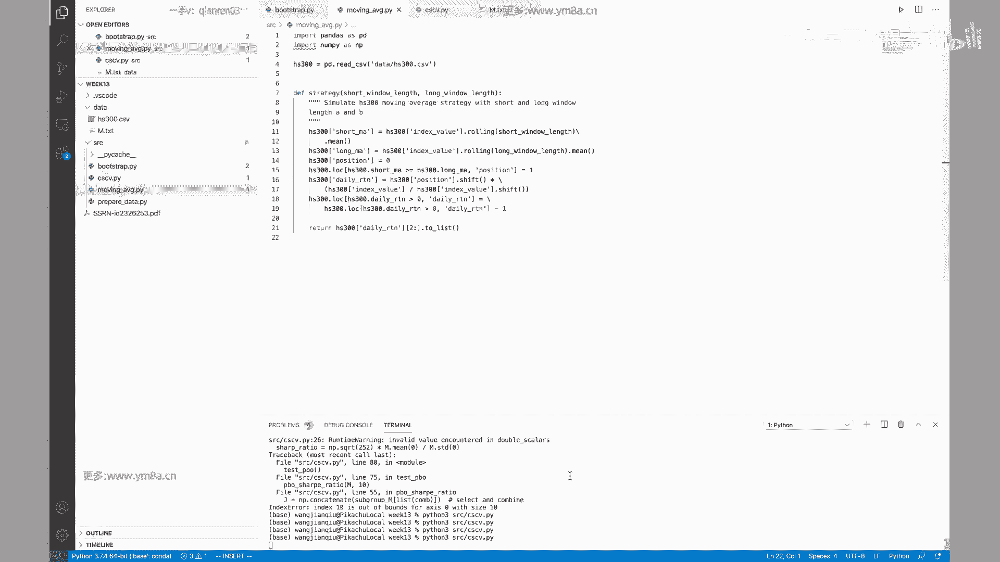

OK区别不大，而这边衡量就是说是，我横轴是in sample的sharp ratio，然后负的是呃out of sample的SHAPARATION，然后这里面会有一些就是比较奇怪。

比如说是呃我在横的时候sharp ratio，大家可以看到就是说呃整体的一个倾向是呃，呃就要注意一下坐标轴哈，就是我在in sample shap paration比较呃，本身比较低的时候。

在out of sample，很有可能就是社PARATI都已经会可能会变成，有一部分会变成负值对吧，但是说你说in sample separation有一些是零点呃，在0。2的时候。

甚至最高能够达到out of sample是1。5对，所以，其实说如果是严格的，我看到in sample跟out of sample的这样一种呃，呃in sample跟ato sample的关系。

你应该看到的是，如果是没有发生过拟合，我应该是看到的是显著的，是有一条就是从零过了这样一条直线，或者说你会会有一些shift，但是整体来说你的distribution会比较清晰，而不是像现在这样对。

就是原来说我in sample separation越高，我out of sample separation也是越高，这边这块会有一些问题对，OK啊，现在大家嗯对。

整个就是cs CV这样一个procedure，还有什么问题吗，那这个东西是可以去把它应用到我们的，BACKTASTING过程当中，不管我们是自己做股票回测，或者是也是额期权或者期货，因为看到我们这边。

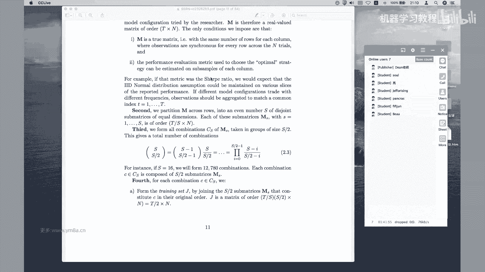

我需要的仅仅是就是我每一组策略，每一组参数算出来的这样一个呃。

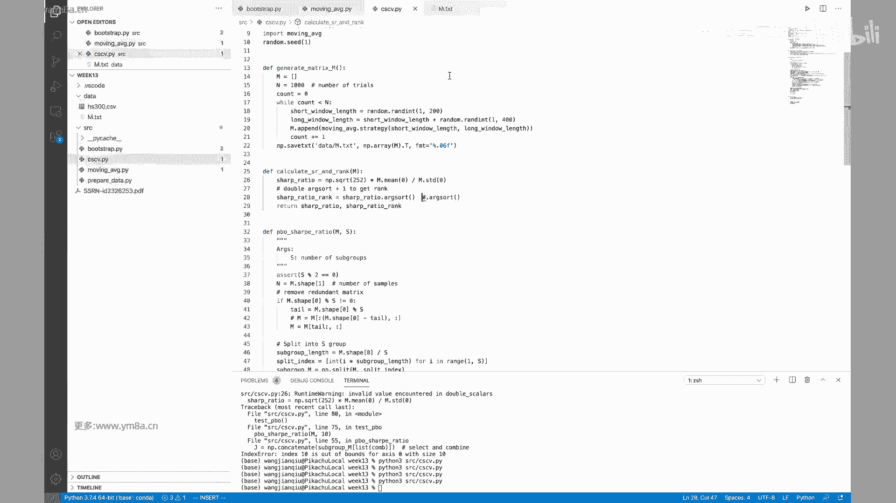

return的这样一个序列对，因为这当然这个沪深300就是有一个呃，这个相对还是比较简单，因为我只是单标题对不对，所以我我我收益率很多会是零对，所以你再算standard deviation的时候。

会觉得可能会有些差别，但是如果你是真实的拿额，就是不同的策略去算的收益率的话，那我觉得可能算出来的效果会更有说服力一些，对吧，因为我们这边其实有很多的零，它它会它会有一点像系数矩阵对，OK然后的话呃。

对这篇paper我觉得还是还是比较经典的，就是大家可以去读一读对呃，Probability of okay，然后这里没说就是it's interesting to prove the。

Pairs to realize，How strong is such performance，Degradation，对吧，啊他这边就做的比较快，比较比较合理一点，就是嗯它a h sample的话。

有的还真的是SHPARRATIO是比较高，首先这是一个系统的观察，是呃in sample，shopper shap ratio是高于out of sample shap parati呃。

我觉得是相对来说是会符合额对，也就说这是过拟合一下，相对来说你会会比较符合这样的一个逻辑，然后然后看到说这里面有一个就是强烈的，是一个negative correlation的关系。

就是说我在in temple sheration越高，很有可能是out of sample shop paration会越低，对这个图倾向还是挺明显的，然后这边的时候呃。

大家看到就是这个spike他的就是呃峰值，就是说我们看看整个的那distribution的话，他这个是0。74，就是说它是有74%的概率是OVERFIT，呃。

对这时候因为他distribution logist，它的值主要分布是在呃0~-2之间对吧，那logic分布什么意思，是我们刚刚前面讲到，就是说呃你去算log那个上的一个值呃，就是说他那个值是小于一。

就是分子小于分母，比如说我在分子的呃，outperform的话是呃，我在这就是我在分布式有很多是呃，没有out to perform，就是out of sample。

就是我在out of sample的ranking，相对来说会比较低一些，对，Um okay，OK这个就是一个典型的就是说嗯，probate overfit是呃logic，大部分都是大于零的对吧。

虽然就是说呃perform degregation里面，你可能还是会看到有这样一些倾向，但是呃首先是一个是斜率的问题吧，这两个斜率还是挺不一样的，这个是-0。75对吧，这是-0。75。

然后但这个斜率是-0。35，然后呃这部分其实我也没有去看，就是对就是下感兴趣的话，大家这部分是可以自己再去把整个paper去读完的，然后我觉得我更加关注的就是我，我觉得更有意思的是。

他整个框架这样一个提出的建立，还是挺有意思的，然后呃之前我没有提到，就是呃advances in financial machine learning，就是呃这个哥们儿，然后还有针对CORNEL。

有他在CORNEL开了有一门课的，那就是有关金融机器学习的应用，然后有一些课程相对来说会偏理论一些对嗯，但是我觉得呃从中还是会，偶尔就还是会有一些比较好好的一些想法，对对所以然就是他可以去看一看。

当然就是他他是相对来说会偏一些学院派一点，就是就包括其实这边这边paper也是，但我觉得就是这个框架，是我们自己是可以考虑到去纳入到我们的，还有back testing整个这样一个过程当中去的。

他并不是单纯的说我提出这个框架就OK就over，但事实上就是说完呃，如果是呃，就是我们做到现在应该是我测完之后，我的我的不断的策略，就是我应该是嗯我的策略的performance。

都应该是记录到数据库里了，然后我我对这一个类型的策略，我比如说我测了这么久呃，测试了这么久，然后为什么选了这一组，那其实是有必要去算一下，就是说我这个时候呃，我也没有去，也没有说潜在的发生过拟合。

因为呃即使说是就是在策略开发过程当中，即使说我知道自己说不能去过拟合，但是往往会有信心，当你对这个数据太熟悉的时候，你不自然的，你甚至说你只要是看过就是out of sample的表现。

你可能脑子中能够记得那个图像，你大概知道这段时间可能是低波动率，或者说呃或者是高波动力，或者说是一个单边趋势，那么自己在设计策略当中，无形可能就会把这样的因子去引入，去纳入去测试。

那么导致无形当中会出现这样一种过拟合，所以呃这这样一种方式，我觉得是呃就是我觉得还是挺有意思的，就是这个框架对嗯，他要注意的就是呃还是要强调一下，就是说呃他算的是一种，就是它是呃。

它是测算某一个策略过度拟合的可能性对吧，就是说但是他没有告诉我们，说是我具体的这一次回测结果，发生过拟合的可能性，这两个概念是不一样的，那时候我测的是这一个策略过度拟合的可能性。

但是没有说我针对我这一列具体的回测结果，说OK你这个回测结果有多少呃，有有多少发生了，有多少的概率发生了过拟合，这两个概念是不一样的，要解决，我要去怎么看我这一次回测是不是发生过，你以后。

那么其实就是有两种方式，一种是用BOOSTRAP检验，然后还有一种是用MONTECAROPERMITATION，用蒙特卡罗置换的方式来去做，然后下节课我们再看一下，就是用BOOSTRAP怎么来去做。

OK然后呃这个paper还有相关的代码。

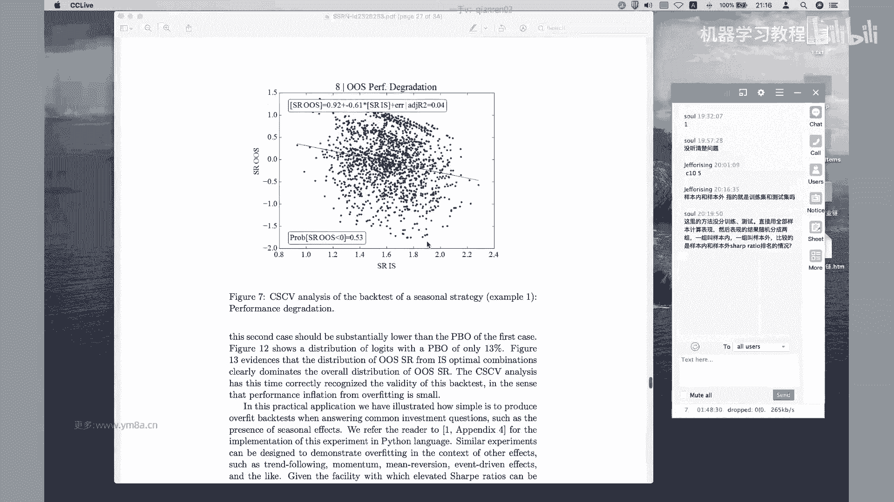

有什么问题的话呃，大家可以再来问我，然后我们先再休息10分钟。

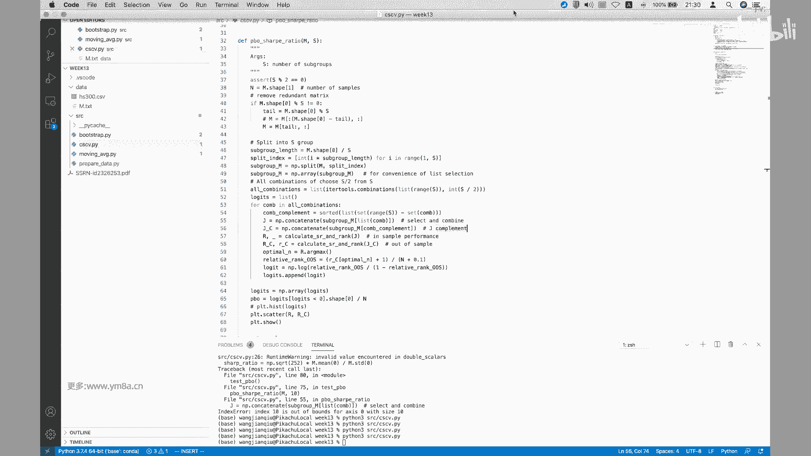

嗯OK嗯，同学们，然后呃。

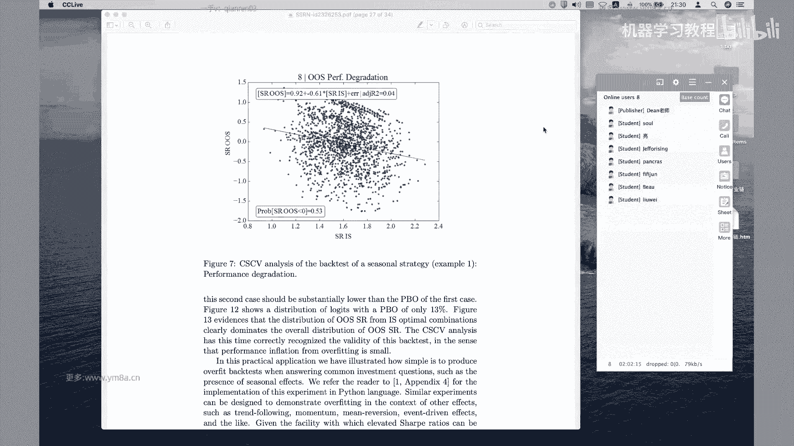

第三个是接下来第三节课讲的是，就是用bootstrap方法呃，就是说如何把boost strap方法，应用到策略回测的过渡，你呃检测过度呃，过度拟合的这样一个可能性。

然后我先是选了一个一组参数是一和42，然后我来去pop它一下，就是看一下他的表现。

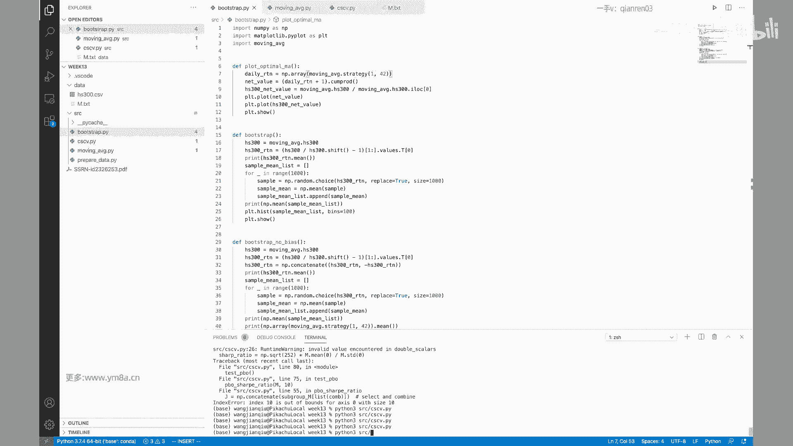

对这个这个是对额，绿色的是沪深300的指数，然后蓝色的是呃，根据一个简单的这样一个呃择时的策略，就是一天跟42天这样一个参数对啊，至于这个参数是怎么来的，大家可以试一试，看看能不能找到比这更好的参数。

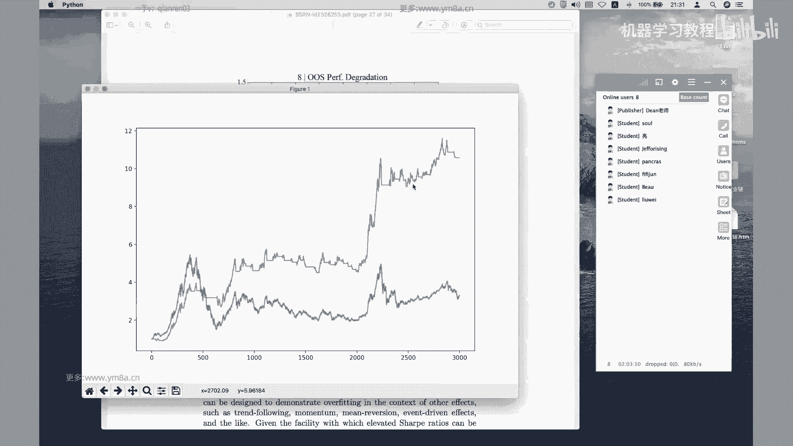

额提示一下，这个是用的是differential evolution的这样一种方法，得到这样一组参数对啊。

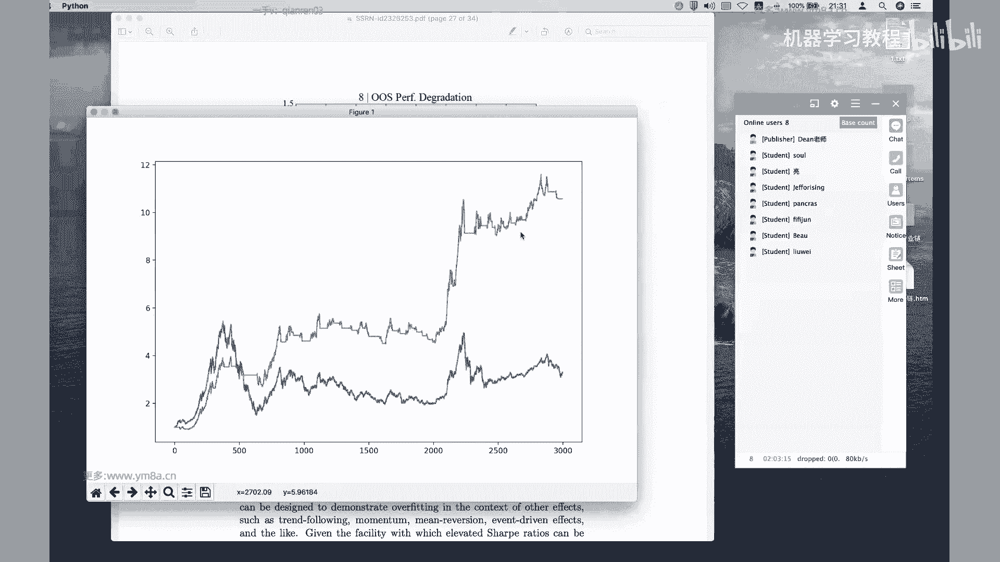

那显然不一定是global最优，就是显然如果是global最优的话，我应该是把我这里面的200×400。

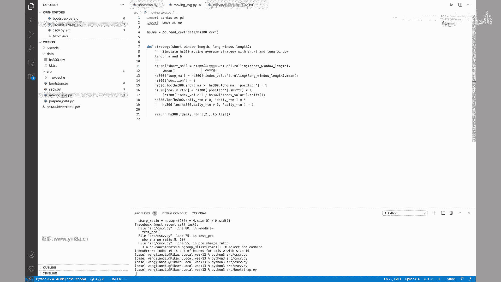

对应该4万组参数去全部回测一遍，应该能找到比这更好的对，但是我觉得这个已经是比较夸张的，就是就是说在过去呃十十几年内，我只要是遵循一倍到就是一天跟42天的，就是一均线去。

cross是说只要是突破42天均线我就买，然后低于42天均线我就卖，基于这样一种策略，我们可以在过去10年内，大概是得到11倍的这样一个收益，对听起来非常的promising。

但是这里面会就是会去看一看。

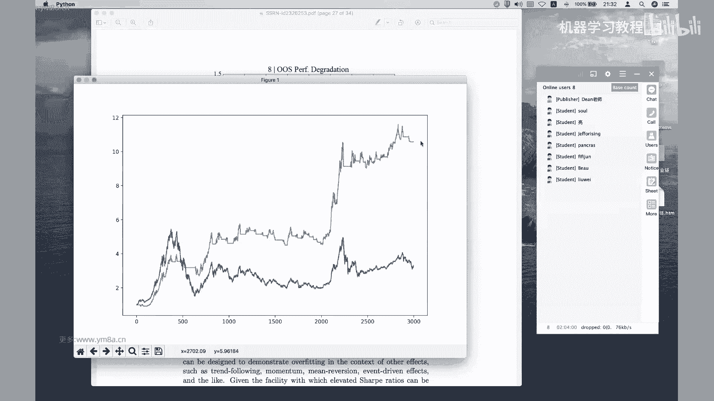

就是说有没有有我们去看看，就是怎么看这种策略是有没有问题，对额。

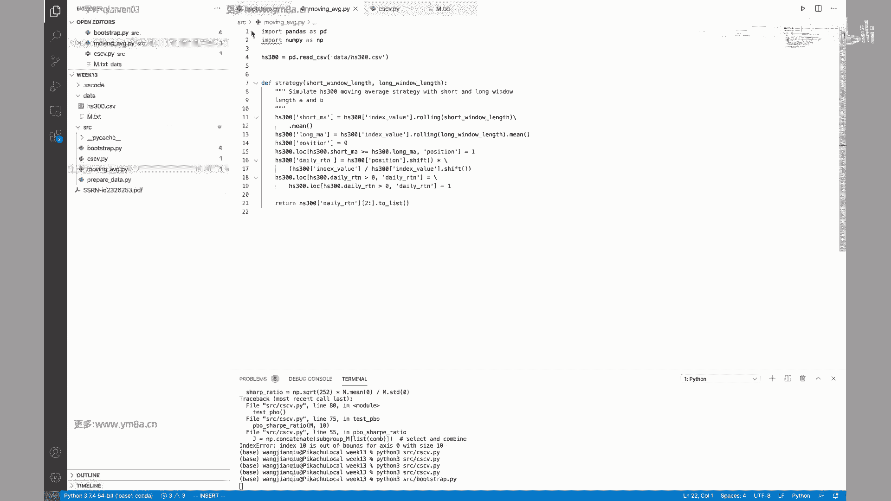

这显然是有问题的，就是对不显然是不能拿，就是当当时是说就是说其实其实会说，就是说别人给到我们这样一组参数，然后给了这样一个策略，那我怎么去判断他这个回测呃，有没有可能是去OVERFITTING呢对吧。

然后呃就是说，然后这再就是说在假设检验的这样一个背景下，就是说BOOSTRAP它做的是什么事情呢，boost drive是说我是用使用假设检验来验证，检验统计量，比如说我们是呃我们在这边的统计量。

我们是定义为回测的平均回呃，就是平均回报，我们来就是boost strap是用假设检验来检测，来验证检验统计量是否具有统计学的意义，那么呃历史回测呢，就是说我生成的结果仅仅是代表一个sample。

它没有提供有关于样本统计量的这种呃，就我有不同的样本统计量的差异性，和它采样分布的任何信息，那么这个时候bootstrap我们就可以去发挥作用了，就是说我可以通过多次在历史中，系统的随机重新采样近似。

去得到采样分布的形状，然后由此我们就可以计算检验统计量的这p value，P值对吧，然后对，因为因为我们就注意说我们生成的是，我们只能得到一个样本的回报，但是我们不知道这个样本。

它的distribution就是它的分布是一种，然是有什么样的差异，所以OK这就是bootstrap要去做的事情，那么在bootstrap呃，我们看zero就是它零假设是什么。

就是说我的这个策略没有任何预测能力，那么比如说我策略的收益分布的期望，应该是为零或者是更小，更小就是负的了，对那么BOOSTRAP哦，它检验的就是说，我使用的是说是使用原始资产的收益率。

额收益率的这样一个序列，然后再去替换进行重采样。

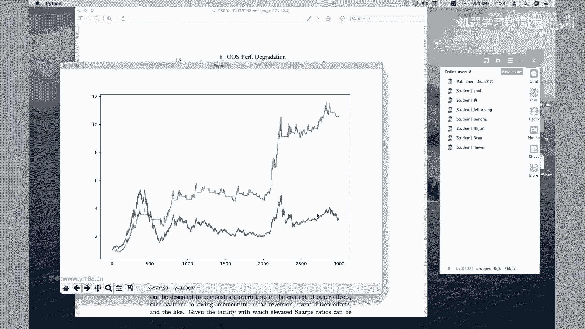

所以我要去进行做，这样我要做整个bootstrap这样的一个流程，就是说啊我会首先去算额呃，去算就是策略收益率的这样一个呃，我会去算策略收益率的这样一个，平均的这样一个呃，每日的收益率。

对你就是mean dareturn，然后我还去算呃，原始资产的价格呃，就算原始资产的价格的收益率，然后接下来我说我要做的事情是对，原始资产就是沪深300的return。

我要去做一个bootstrap采样，那么去随机选取N个这样的一个收益率，然后我再去计算它的平均值，然后我执行我对于这样一个步骤，我去执行多次，那么就可以生成呃。

生成大量的这样一个bootstrap的这样一个均值，然后我把我每一步算出来的这样一个值，我都去保存下来，那么我再去对，那这个时候我就可以去把我整个的这样一个distribution，就给他就画出来了。

它其实简单的意思就是说呃对，其实呃bootstrap如果大家有过了解，就是说他就是说我不知道他的，我不知我只有这一次回则，我不知道它的分布，但是我可以通过仅从历史当中，就是说我多次去从中。

我对于这样的一个收益率序列，我多次的去随机采样，那么我多次随机采样之后，基于大数定律，我就可以去得到我这样的收益率的这样一个distribution，所以它其实逻辑还是比较简单的对，呃我们看一看呃。

booth stp先看就是。

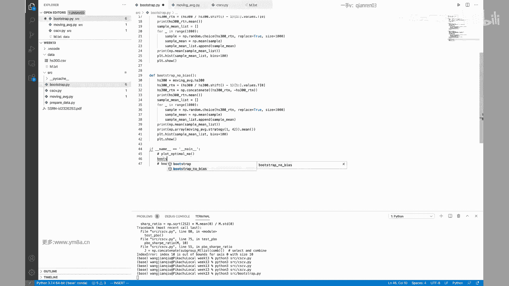

OK好，我先把呃对。

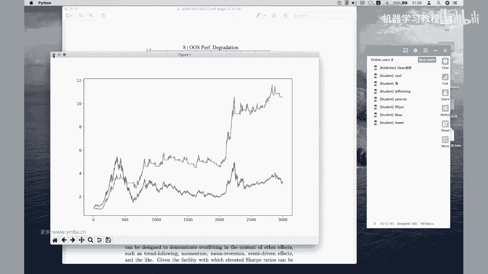

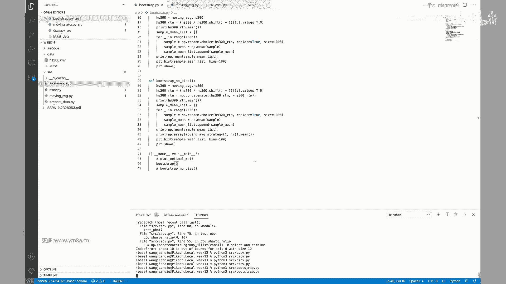

呃这边可以看一下，Ok，呃我们我们就是我们会得到了这样一个，就是收益率的这样一个呃。

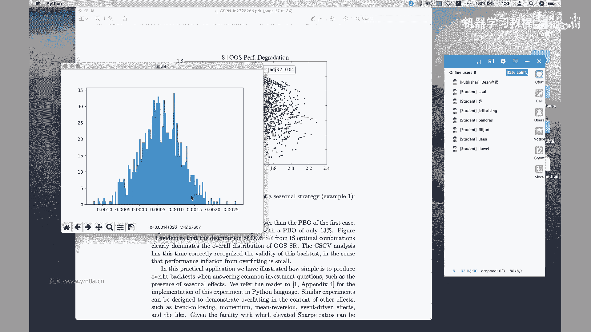

呃DISTRIBUN就是main return这样一个distribution，总共是1000个对吧。

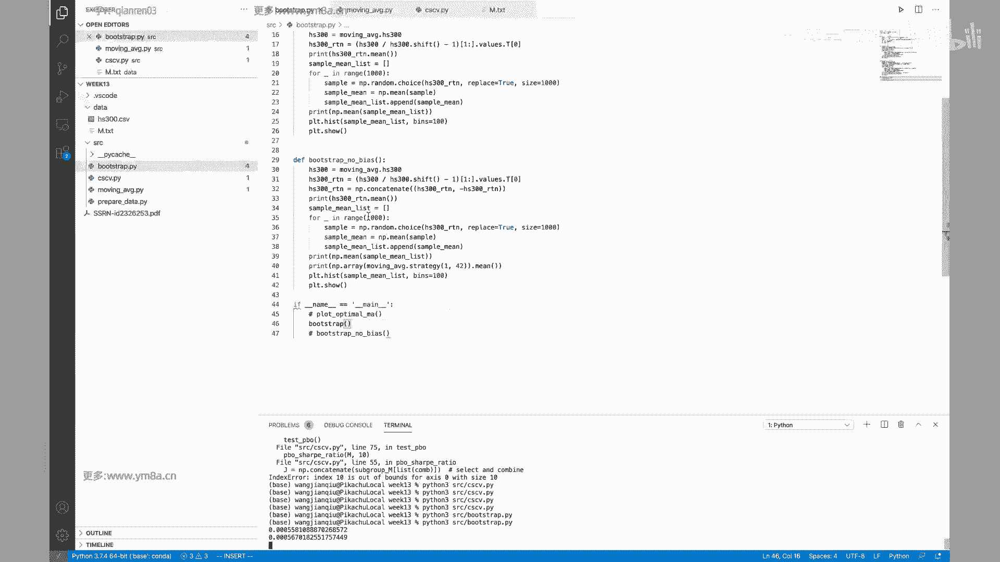

然后然后这时候我会看到就是说呃，我进行了bootstrap之后，显然我是可以看到它的均值是我在哪。

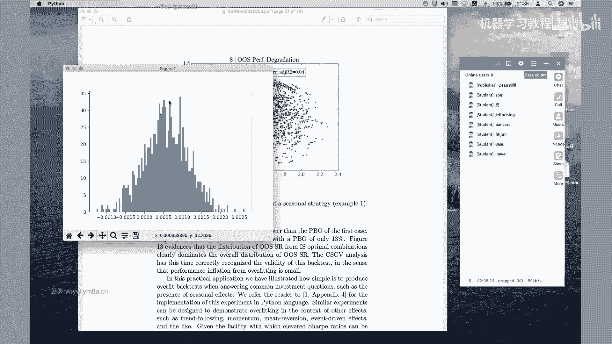

print它的均值是的第一个呃，OK它的均值是呃0。058，然后我们策略的均值是0。0567。

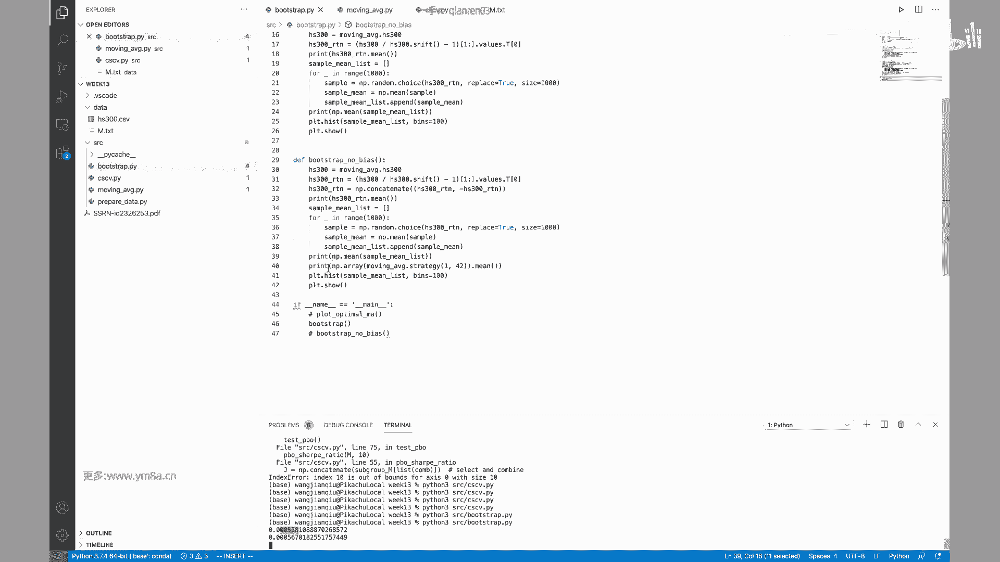

两个是非常接近的对吧，那这个时候呃想说的时候说。

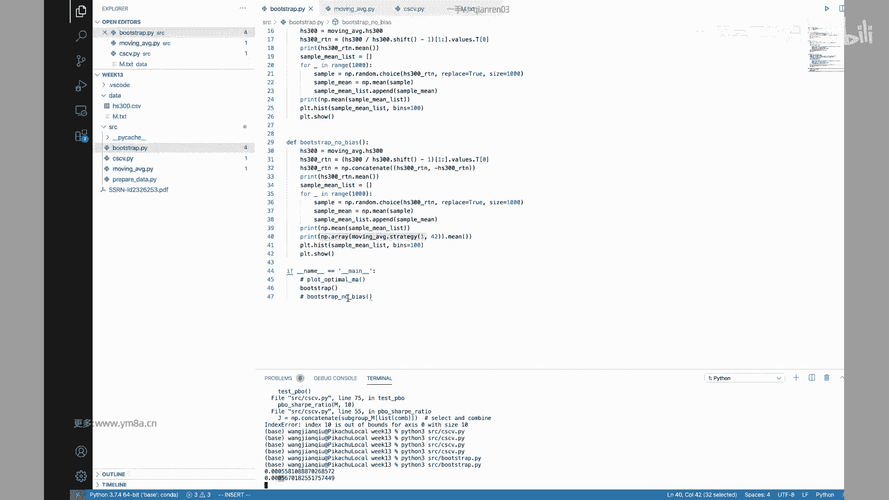

这个时候你可能看不出什么，但是嗯有个问题是说我们的这个里面，我们得到的是沪深300的这样哦。

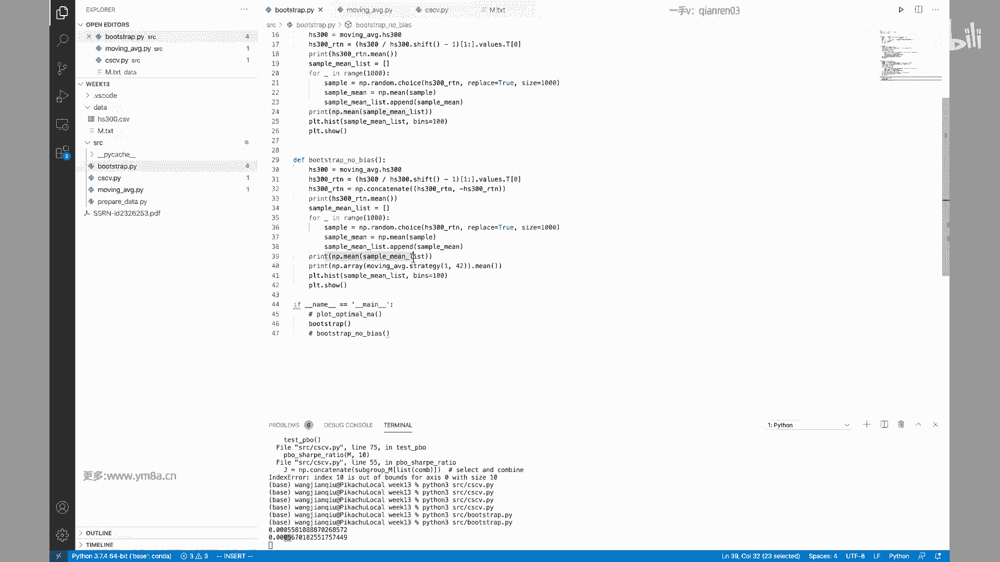

Sorry，在这边我们得到的是沪深300的这样一个，Sample m，就是说也就是说我们在整个这段过程当中。

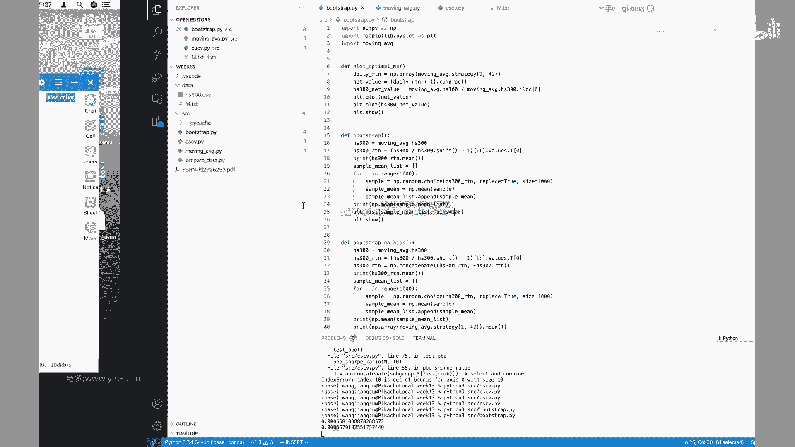

沪深300其实它是BIOS的，它的收益率是它的均值，大概是它的均值是0。055吧，也就说沪深300本身就会是一个，在过去十几年当中，他有一个大于零的这样一个收益率，所以这个里面其实就暗含了一个BIOS。

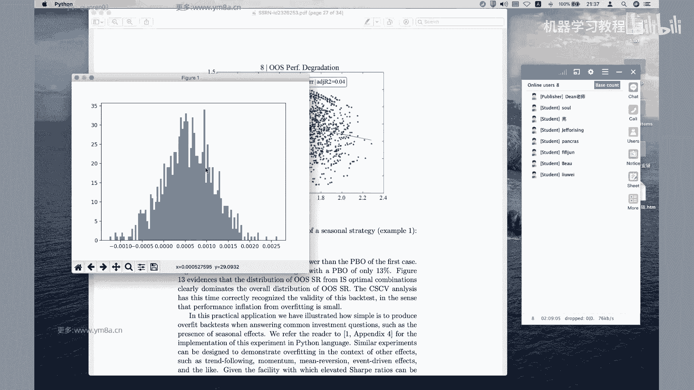

那我这个时候呃我领了，那么我得到的我的sample mean呃。

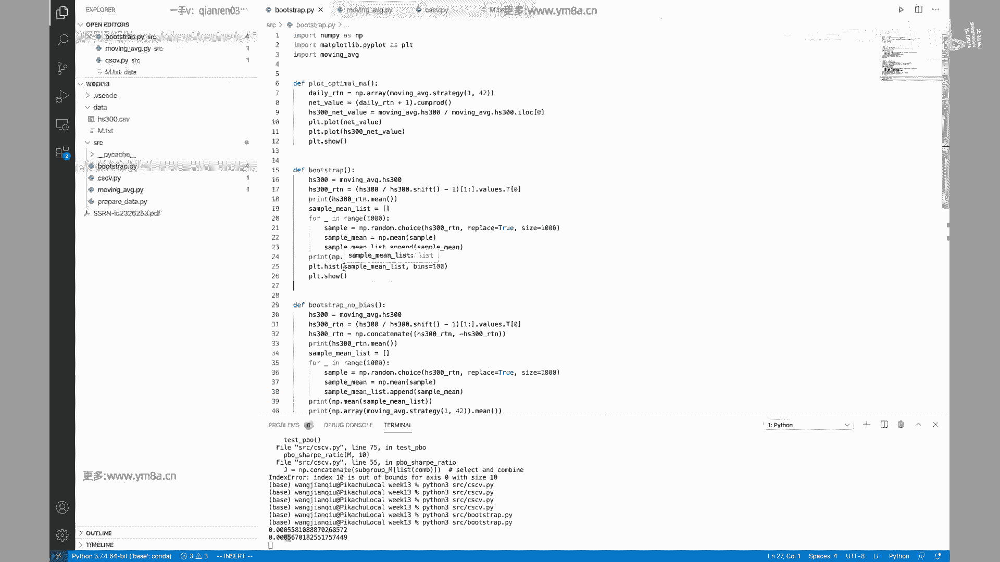

然后我得到了我的呃，我的boss stop之后的这样一个收益率，0。0556的话。

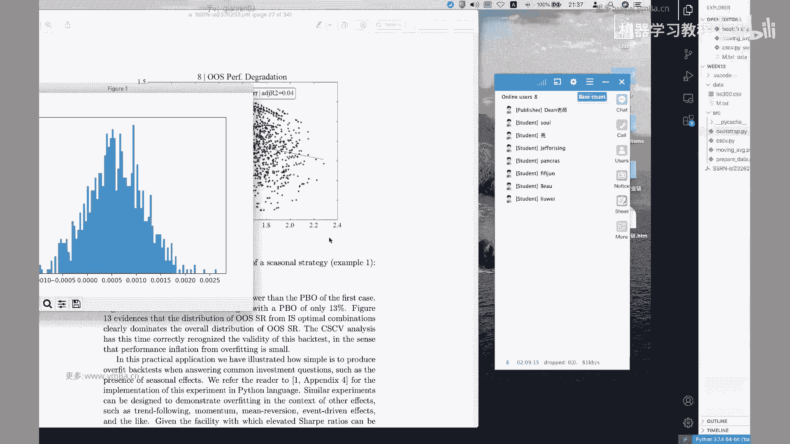

其实放在就近似于呃，近似于是在我这个时候是在零轴的右边，这个其实你看起来可能还还好，他没有特别也特别眼特别小的这样一个值，但是嗯所以说我是说我们刚刚提到，说我们这个沪深300的这样一个收益率序列。

实际上是包含了一个long shot bias，因为我整个的呃portfolio，整个的沪深300在过去过去十几年当中，实际上平均收益率是正的。

那么为了去排除这样一种可能性，我要做的一个事情是，我把他的呃收益率我会去加一个呃negative，那这样的话是说我在我整个的收益率序列当中，完全加入了完全为相反数的这样一组序列。

这个时候我可以去确认它的，这个时候他这个命显然就是零了对吧，因为完全是相反数。

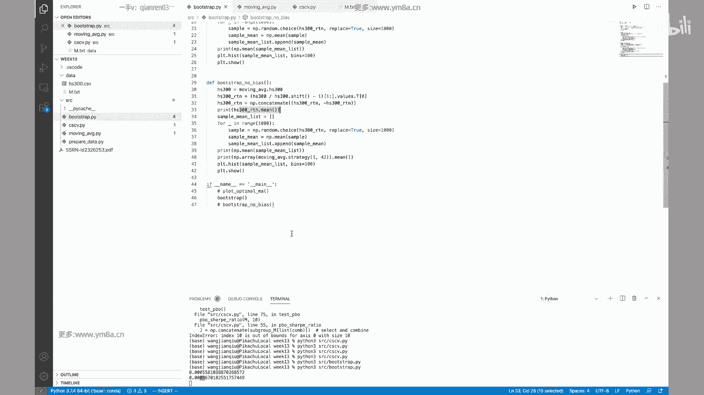

那么我这个时候再去做同样的操作。

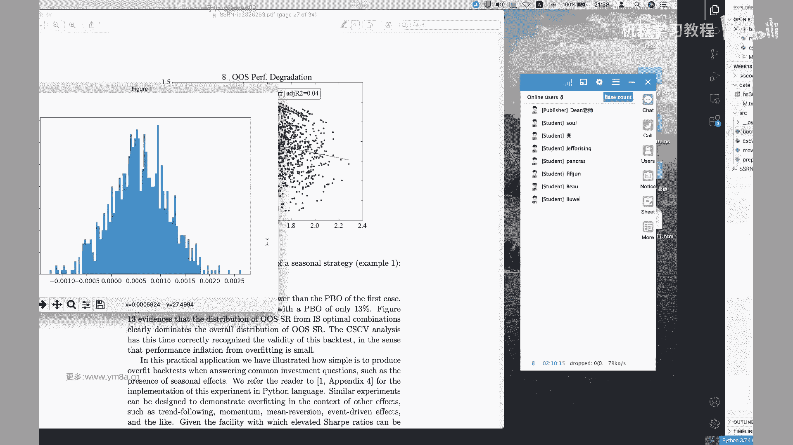

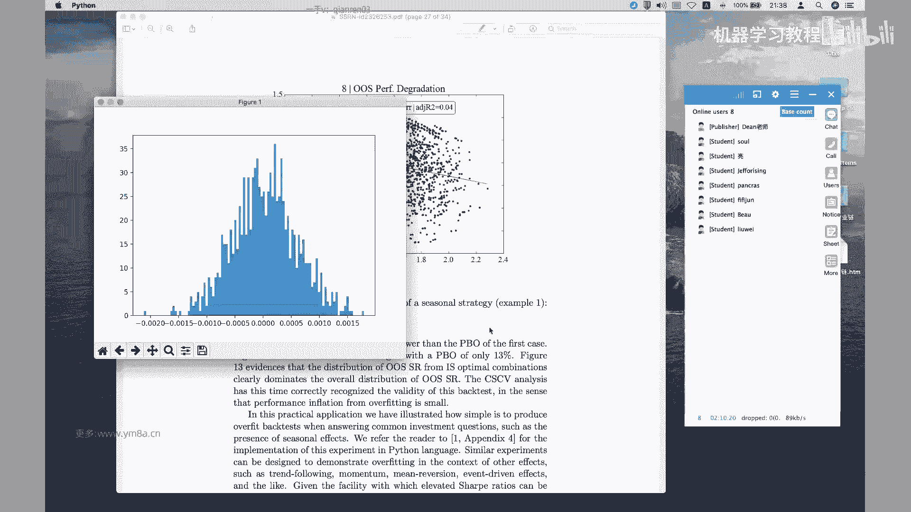

OK然后这个时候我们看就是说这个值是呃，Sorry print，在这边，historical呃，沪深300的return的均值是五，就是零了，对，然后这边然后这边还做了一个是额。

这个时候我策略的这样一个均值是0。0额，0。0008。

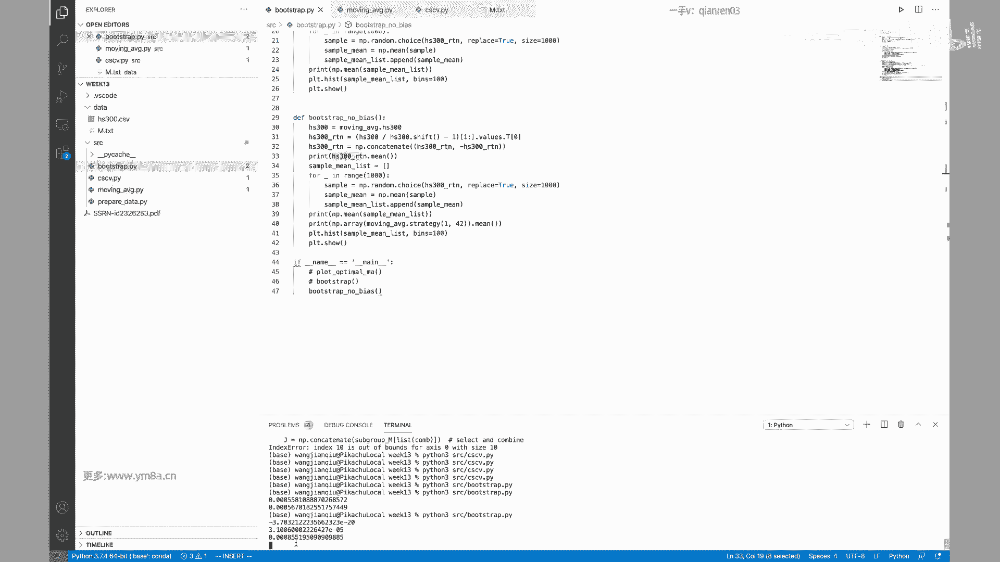

0。0008，OK那这个是说明什么意思，也就是说当我策略了这样一个return的均值，是处于这样一个bootstrap之后，distribution的这样一个右端，那这个时候就是说。

这暗示着策略有很大的可能是去过拟合，因为我们看的是一个P值对，所以，额这部分大家再去理解一下，对我们做的是对沪深300的呃，这样的一个收益率序列进行bootstrap。

然后再去看我们策略收益率的这样一个呃，处于的这样一个distribution，就是看我们策略得下来的就是DARETURN，也就是average，就是main return这样一个处于这样一个位置。

应该注意说我们的原假设是说我们的策略呃，我们的原假设是说我们的策略呃，就是没有任何的预测能力，该策略的收益分布期望值是零对吧，但是我们现在测出来说他的期望值不是零，所以我们需要去对。

就是会去有这样的一个呃，我们就是说看到他distribution，我们会说我们的这样一个策略，是有一种过拟合的可能性，对，事实上我说过这样的一组参数是拿他的额。

比如说是拿他的额defal evolution的算法去算出来的，所以这个里面呢本身就是，也是符合我们的这样一个认知，嗯OK这个这就是说那么我们以后再去做，就是算呃就是做bootstrap。

就是去如何去衡量我这样一组参数的呃，每一组参数的回测结果，你可以考虑用bootstrap的方式来去做。

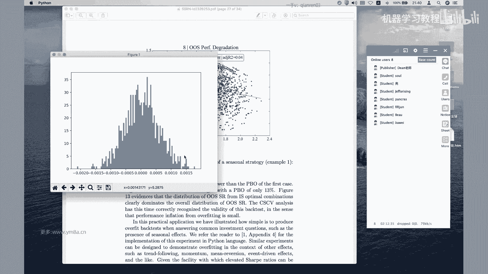

然后呃还有一种方法的话是呃，是说MONTECARO置换检验，monte color置换检验会跟BOOSTRAP会有点像，但是其实是不一样，因为就是说他说这个时候我们是得到的一个嗯。

我们得到了这样一个回测的，这样一个收益率序列，但是呢我这个时候要做的事情，不是对我原来的沪深300的收益率序列去进行，Bootstrap，我接下来要做的事情是，我把我单个回测得到这样收益率序列。

去生成多个的随机输出，然后我要去把我单个的收益率的序列去进行嗯，去进行重排，然后跟回测的结果进行比较，来评价它的显显著性，对呃哦，我还需要再新建一个文件，Sorry，Carlo where uh，所。

所以这边要做的事情就是说是呃我们会先漏的，我随机漏的，我就会呃我会漏的，我会load其中一个收益率序列，然后拿它作为example，然后在这边是，要注意说我们这边说注意它的区别是。

我们说bootstrap区别是和BOOSTRAP区别，是我们做的不是，不是说对原来原始的收益率序列，而是说对于我策略的这样一个收益率序列，进行presentation，so看一下我们得到的应该是。

OK然后print这样是对的，我们得到的是一个收益率序列，然后再把转置一下吧，这样啊好没有区别，我们就是一个嗯，得到这样一个收益率序列之后呃，其实就是他是怎么说呢，就是说我们在呃，我要我要知道我要排。

我要排序的是什么呢，就是说，就是我在原始的这样一个收益率序列的时候，我会对应说啊，我们的position，比如说是long，然后那么就是说如果我策略仓位是浪的话，然后我的market return呃。

这market retur也就是沪深300这样一个收益率，如果沪深300收益率是0。6%，那么我们这时候我们策略的回报，也就是0。6%，但如果说是我们是NO position的话。

嗯即使说market return是0。6%，但是我们的策略回报就是0%，因为这个时候我们没有持仓，然后我们记，然后我们就根据这样的就是一个是策略仓位，就是一个position。

然后还有一个就是说是market这样一个return，有这两个东西，我们是可以计算出我们策略DAIOR对吧，也就得到了我们所生成的我们策略的每日回报，然后我们就可以计算它平均收益。

那么monte color permitation，他做的事情是什么呢，我是重新随机匹配市场回报和策略仓位，这什么意思呢，说我之前我我可以说，就比如说我假定我策略的仓位不变。

就是说我仍然是比如说long shot，Long shot，我仍然是保持这样的序列，但是我的市场回报变了，比如说我比如说原来第一天是0。6，第二天0。5，那我可可能变成第一天是0。5，第二天是0。6。

但我对应的long和short是没有变的，就是蒙特卡罗的置换，他做的是重新匹配，我们的就market return和策略的这样一个仓位，然后我们就可以根据，那那我知道就是说如果说这个呃。

如果说我们assume是position没有变，但是我们的策略的呃，就是我们我我们的return变了，market return变了，那么是不是就可以得到一组新的DAVIRETURN，这样一个序列。

然后然后我再去说呃，我我这样，我那我用mod color置换，我就可以产生大量的这样一种随机的输出，那我们来看看怎么去做，OK嗯但是我这样去做的话，我还需要的是position的仓位呃。

OK因为零我们是已经确定了的，但是我还需要知道的是呃，C等于零的话，seed等于零，我需要知道的是呃，Seed and reli，Short window length，OK哦不如这样子。

我们直接把你就拿之前的一和42去做一个，还是拿前面这样一个例子好了，sht window x等于一，run window bh等于42，然后我再去um strategy。

Import moving average and home，Moving average，strategy的short跟long，我返回的是它的收益率的序列对吧。

注意我们要做的事情是把我的daily return的呃给重排，OK我再加一个吧，我还是希望得到，因为我需要它的position对吧，我还是把我原始我还把它原始序列给import出来，这样可能好一点。

Daily return a data frame，OK这样子的话，这样子的话就有了他的额position，对我就有了他的position，这样我才可以这样。

我才可以接下来对它进行的做permutation，Um hall right，所以Mark color，就是说我要去计算特特定参数下，策略回测的P值，那么首先要做的事情就是说是呃，针对N组这样参略的呃。

参数的这样一个策略回测，收集我的呃，策略仓位跟市场回报的这样一个时间序列，然后我要去将市场回市场回报的时间序列，与策略仓位当中的呃，每一个我进行随机配对，然后就得到新的每日策略回报的时间序列对吧。

So okay，所以但这里还有个问题，我们需要的是，so画写一下吧，自己不然搞得会有点乱，是一个是我们在整个的process是第一步是，所以其实我在做mont color的时候，我这是一组参数。

我实际上对N组参数我都要去收集收集他的呃，Return，return和position，然后接下来要做的事情是额随机配对，因为随机配对本质上来说，我把我的return跟我的position。

就是说我不是前面有测了1000组吗，我把这两组，我把这1000组进行随机配对的时候，我就会生成新的这样一个嗯，生很生成额新的这样一个呃时间回报序列，但这里面要注意的是说，我要对每一个策略参数组。

每一个参数组使用相同的，就是就是说我不能说我第一列，比如说是第152天，跟172天进行调换，然后第二列就变成153，跟173天不行，如果我第一列对152天，跟172天兑换的话，那么我在第二列。

我也同样的是需要进行相同的操作，我这样做的目的是，我要保持我整个1000组策策略回测的参数当中，我哦我保我保保留每个参数组都具有相似的，就具有相似的这样一个潜在的这样一个结构。

所以这边就是生成一个PERMITATION，生成随机的preparation，就注意是相同对，然后然后我得到了新的这样一个呃，得到了新的就是PERMITATION。

之后我要去计算mean dareturn，大家要注意，mean derreturn肯定会是去变化的，为什么会去变化呢，大家不是说为什么我我不是说简单的把呃，仅仅说是把我的就是return。

是就是去换了个，就是说是换了个位置吗，为什么会去变化，大家注意的是，问题是我不是说我不是说是对我的收益率，收益率的这样一个序列期去进行变化，我刚刚说我们变化的是呃，在strategy是这一部分。

就是是原始收益是沪深300的，它的收益率序列去进行变化，我仍然是相同的位置，我仍然就我信号仍然是long和普，long和short都没有变，但是由于我underlying。

就是我沪深300的收益率区列变化了，那么我原来原来是浪的地方，地方可能现在是零，那么呃我原来是是呃原来是零的地方，我现在可能是有一个long position。

那么呃但是我long position对应的daily return，事实上已经变化了，因为被我重新排了，所以这个时候我们可以说我们的strategy。

他的daily return以及它的main dareturn，一定是会发生变化的，所以我这个时候需要去计算我的每嗯每一组呃，计算啊，For an group，我每一组都要去计算这个值对吧。

都要去计算MADARETURN，然后嗯第四步要做的事情是repeat a step two and three，Two and three，那这个事情是all right，我记下minute for。

然后然后然后我记得是呃，我要去选择keep uh largest，RITOR就是MIROR，我要把最最大的这一组，咳我不是N组得到了，我得到了N组的DARETURN，我要把最大这组给KP下来。

保留这个数据，然后我要去把我二和三去重复，以上这样一个步骤，那么我得到我repeat2和三之后，我会得到什么，我会得到了，就是说我重复很多次，我会得到很多次的这样一个呃，最佳的这样一个return。

然后然后这个时候呃我就会然后去嗯get，然后我这样就得到的是什么，是optimal strategy的distribution，呃注意这边跟我们前面bootstrap。

bootstrap的区别在于我们这边做的方式是呃，我们是对沪深300的这样一个daily return去进行重排，但是我们重排完之后，我们仍然要去算的是。

我们重排完day沪深300data return，我会得到我新的呃，新的策略的这样一个daily return的序列，然后我再去得到它值，而在我们bootstrap这边做的事情是，只是说是我不呃。

我sample完之后我再回去呃，bootstrap这边做的事情是呃，我sample完之后呃，我做的不是说是算我现在的，不是我现在我策略的收益率的均值，我做的事事情是原始资产收益率均值。

并且我在BOOSTRAP过程当中，我做的不是说是全部重排，我做的是bootstrap采样，我随机选取的pick是一一千个里面的收益率，我选取的是1000个收益率，而我不是我做的事情，不是说把我的这么呃。

不是我不是把我这么多，2900个收益率进行交换顺序，我选取booth stp，它的意思是，我只从这一列当中选取了一部分样本，然后我不断的去选，通过这部分样本去进行。

去构造出我的这样一个收益率的distribution，的这样一个状态，虽然我们去选的都是沪深300的，这样一个收益率，但是我对于沪深，一个是沪深300收益率重排，一个是沪深300率三三百。

比如说我三三千个里面每次选100，每次选100，那我重复了这1000次之后，我把这1000次的100进行distribute，进行distribution，这个是booth strap。

但是我在做mart color做的事情是，我是把沪深300收益率去重排，是全重排对，所以这个要注意这个区别对。

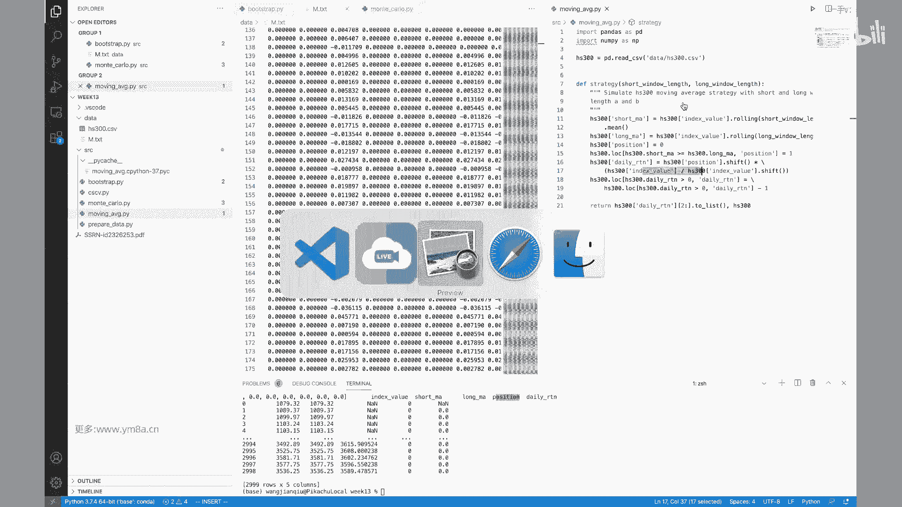

然后对这两个概念不是特别理解的同学呃，可以去就是去呃去查一下，就是一个是bootstrap，一个是mod color，我觉得这两个方法还是就是是。

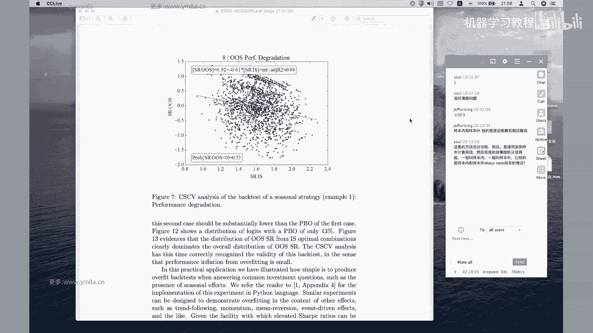

就是在金融过程当中算是比较重要的，就boss stp，可能接触机器学习的同学应该比较熟悉一点，然后MONTECARLO的话对不能看到，其实不管是在金融工程啊，还是在期权定价，还是是在就是啊。

物理物理物理学上面就是做simulation，做particle simulation的时候，都是会应用到比较多的场景，然后尤其是对就是对一个比较奇怪的积分，可能有时候还会用mod color去算。

所以我觉得就掌握这样的方法，还是比较有必要的，那么我们再回到MDCAO上面来说，我们我我注意说这个时候是在强调一遍，他说的是额，是把我之前的沪深300的收益率去进行per呃，去permutation。

但是我要注意我primate一次完之后，我要把1000组都要去重算，是同一个PERMITATION算1000组对，然后然后这个时候我可以生成多个presentation。

那这个时候MONICCOLOR算的时候就是比较耗算力，所以我会不断的去，就我可能会算呃，10万次，100万次都有可能对我算完之后我再去得到啊，得到了我这样的就是说得到我。

这比如说10万次DITRIBUTION，嗯对，得到这100万字的就是他的best这样一个return之后，再去看他的distribution呃，OK所以这个就是一个mod color这样一个过程。

然后的话呃，那这个时候就是呃嗯然后我要去把我呃，就是optimal的这样的一个策略的去嗯，嗯把optimal这样的一个策略，这样的一个值给记下来，然后呃然后我再去到最后的时候。

如果那我得到一个plot这样一个图像，就是说是比如说我是算了我呃，比如说我是去算了MONTECARLO，算了1万次，每一次我都得到RESAMPLE，就全部去重排之后，我得到了一个呃best这样一个呃。

就是得到了一个best，就是best return，然后把这个return加到我的这样一个呃，我把这样这样一个largest mi，称给track也给记下来，然后这个时候我得到了。

我会得到这样一个distribution，得到distribution之后，我要做的事情是去比较我的呃，去啊，去把我的就是把我原生的原来的这样一个return。

是去去跟我的这样得到的best return去比较，看他是处在整个分布的哪一端，和前面一样的道理，当我处在整个distribution的右端的时候，我们认为它是会有比较大的概率是呃过度拟合。

嗯然然这时候我不知道大家有没有想想，如果你想想一个问题的时候，我们在做boost strike的时候，是有一个我们考虑到了long shot bias，所以我们在整个bootstrap过程当中。

我们需要加一个沪深300的这样一个，收益率序列，但是为什么我们在蒙特卡罗的时候，没有去做这样的事情呢，这原因是在于说我们我们比较的benchmark是什么，我们比较的benchmark是其他。

就是在比如说100万次测试过程当中的嗯，策略的最佳的return，我策略本身就是有long shot bias的，所以我的benchmark有呃，Long shot bias。

我得到的我想要去比较的这样一个策略的，return也是有BIOS的，所以其实这个时候两两去抵消，其实我就不care了对，因为我们比较的对象是其他参数组的，这样一个收益，Ok，所以额这部分我是想额。

就是想把这部分是留给大家去作业去测试一下，对理论来说，你应该会得到一个就是呃非常像前面的，但是还是会不一样，因为我们这时候对，首先你我们的就是他的嗯，每一个ban的就是每一个每一个histogram。

我们画了这样一个直方图，每一个bean的它的呃值应该是比较高的，因为我们蒙特卡罗会测很多次对吧，但注意呃，对我不知道大家我有没有给大家讲，我有没有给大家讲清楚，就是蒙特卡罗就是置换检验。

他做的是一个什么样的事情，对，嗯我不知道我给大家讲清楚了没有。

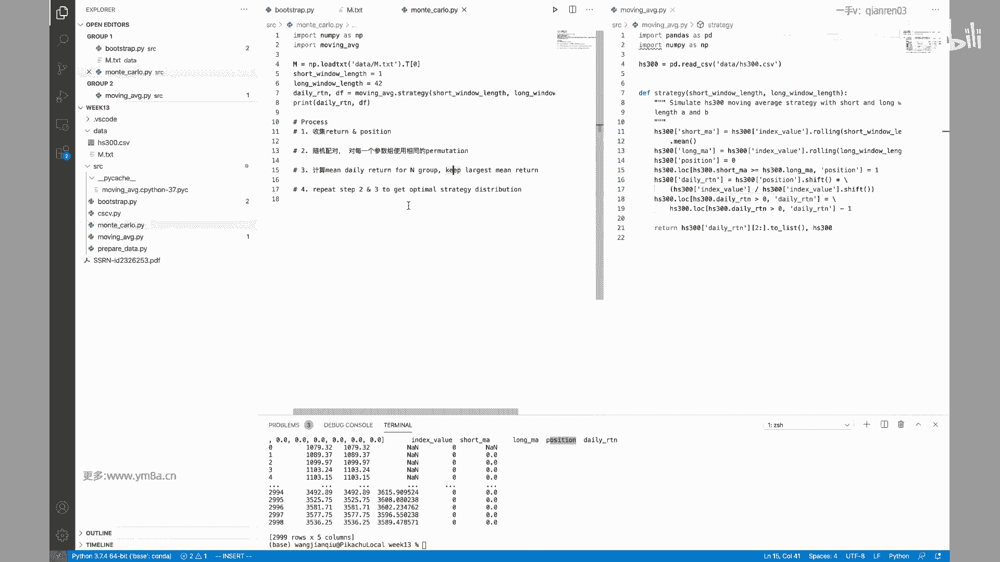

大家有什么问题吗。

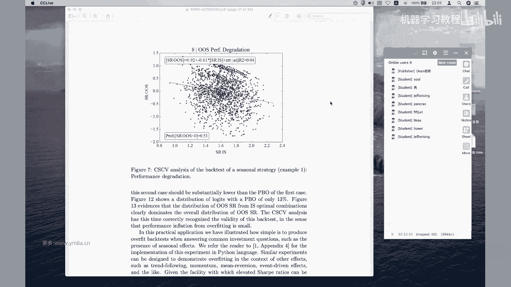

就是他其实相对来说就是他没有那么多，就是你理解一下，就仔细去理解一下整个过程啊，就是说啊就是我已经回测完了，就先做一个事情，是我们还是一样的回测，我不是得到回测这么多，完了。

然后我要做的事情仅仅是把沪深300的，就是我回测完了之后，你可以理解为就是什么叫position呢，就是说我信号已经记录下来，什么时候多，什么时候空，我已经先记录下来了，这个是没有变的。

就是每一组参数是都记记下来了，但但我要做的事情是我在多空的时候，我每天的收益率可能不一样，就是我的本我的我的沪深300收益率不一样，原来我这边是多，然后之前实际的沪深300，比如说是呃XA。

就是说比如说他这边可能，原来原来第二天是4020。89对吧，我在第一这天买了，但是但是我经过重排之后，可能把四零这边可能它会变成呃3。96对，可能只涨了一点点，原来我涨了很多，可能只涨了一点点。

但是注意我这边信号是没有变的，我这边是价格序列没有关系，因为我们最后应试下来是一个，就是你最终还是会把它转化成一个，收益率的序列，对，OK就他我就是说我重新去匹配，我对应的仓位的时候，对应的市场的回报。

仅仅是蒙特卡罗做的是这样一个事情，然后我就可以得到新的策略的这样一个，DAVIRETURN嗯，对然后对，所以它的整个过程就是这样对我去随机匹配，随机匹配新的额市场的嗯。

就等就Mark return这样一个序列，Um h，然后我要去，然后第三步要做的事情就是我要去呃去算，就是我不是我不是有N组吗，有capital n组，有我有1000组。

然后每一组都会去使用相同的PERMITATION，去计算回报，然后选择这个回报作为，然后我要选择其中就是哪个daily，就是MIRETURN，是也是作为最佳值对，那就是你的最大的名return。

作为我整个这样一个这样一次蒙特卡洛，一次simulation当中的这样一个代表采样的，采样的这样一个值对，然后就是我每一次都是算permutation完之后，哪一组的strategy。

哪一组strategy是最优的，那么很显然就是说根据我不同，每次permutation之后，不同的permutation，我计算到计算到最优的这样一列，那可能是会去发生变动的对吧。

这是这也是很正常的一个因素，因为假设说比如STR某一个strategy，Strategy，比如说是因为我是main return，比如说比如说正好是在市场上涨的那几天，他是做多仓了。

那么我permitto permit就是把它去嗯重排之后，那么很有可能分配到他这一天的呃，沪深300的return可能是负的，那在这个时候，那他可能就会去亏钱，所以导致它整个的策略的呃。

明return就会变了，注意我们这边跟最刚开始呃，就是cs CV里面做的不一样的是，我们这边用的cs CV用的是shap ratio，但是我们在MONOCOO里面考虑。

我们考虑的是main return是收益率的day，也就是DARETURN的平均值，OK然后重复以上步骤，就是可以得到就是最佳策略的，这样一个对抽样的一个分布，因为你要知道就是说呃。

如果我们把三两千九百九十天的数据去进行，全重排，就全排列，那这个值是非常庞大的，所以我们不可能是穷尽所有的选择，我们能做的事情只是一个就是说是simulation，我们人有时在基于大数定律而对我们呃。

sim就是模拟的，差不多是1万次，100万次，然后我会得到这样一个收益率的分布，那这个时候如果说呃，我们还如果说就是说我们这边的return呃，这个时候我们要看就是我们的return。

在我经过了这1万次的蒙特卡罗模拟之后，他在这样的一个状态下，它是处于怎么样一个分布，如果说它仍然是处于最右端的话，那其实这个时候你就要去怀疑了，就是说呃，我在历史上经过交易日的这么多次随机的重排。

我得到的这样一个策概率，而得到这样一个策略，仍然它的它的收益率，仍然是相对来说是比较右端，那这个时候你就有可能去怀疑这是一个经过呃，经过嗯，就是经过我OVERFIT之后得到的一个结果。

对那注意说这边为什么是这么说，他会有可能是呃OVERFIT呢，因为就是说呃我蒙特卡罗，但要做的事情说我策略没有变，对不对，但这个时候我经历的就是说我变的是什么，我变的是市场的行情。

就是说我把我市场的行情经过历史的重排，然后把他们的distribution给画下来，就是说理论来说，相当于说我这个策略很有可能要做的事情，说是我对于历史上各种各样的行情，都我得到的最优的策略。

是可能经过历史上各种各样的行情的，过过分的拟合跟优化，然后他才能survive其他这么多策略，才活到了今天，那显然这样的面试相对来说是会有一些的，这这里面是暗含了一些。

就是我们的OVERFIT的可能在里面的，因为正常的策略来说，你不太可呃，如果说我只用到一部分行情，我没有说引入未来数据，没有说去过分的拟合的话，我的策略可能说是到目前为止对历史说是嗯。

就是说对于大部分历史可能是有效，但是对于对于一部分一部分数据，说是可能在一部分行情下是不可能去赚钱，一部分行情小部分行情可能不会赚钱，但是我现在这样子这样模拟下来说，我对于历史所有的行情都赚钱。

那这个时候是会暗含有一些问题的，对这这这里面其实有一个SUMPTION，说是因为我们历史相对于说我们A股，比如说就十几年的数据，那我想要去去构造这样一个策略，其实我把握历史每一段行情都考虑到。

那我是有可能去做出来这样一个策略，做出来一个就拟合过非常完美的这样的策略，然后我在蒙特卡罗，我要做的事情说，我相当于说我基于现有的这样一个历史的，收益率的分布，我去进行重排。

相当于说我去人工构造出了一个，相对来说更加大的这样一个更加长的一个，历史的这样一个行情，然后基于这样复杂的一个历史的行情，我的策略仍然是成功的survive了，打败了99%的历史上。

就是历史这些最优的策略，那么就要有理由去怀疑，我这个策略是不是已经就是是过分拟合了，所以他是这样这样一个意思，OK然后我不知道就是我给大家讲明白了没有。

然后这个monte color这部分我觉额是留给大家做作业，然后呃下节课我也会把答案，就是把我写的跟大家去对比一下对，然后其实这节课主要就是讲的是呃，我觉得是比较重要的一个部分。

就是说我们是怎么样去处理策略，开发过程当中的，就是防止去过分拟合，因为哦哦我觉得尤其是作为新手，刚开始做的时候，可能经常是无意识当中，就陷入了这样一个过拟合的这样一种可能呃，因为我自己也做过。

就是嗯那首先就是看一般来说刚开始写作业，看到一条直线往上那99%点，后面加五个九吧，一般是自己过拟合了，就是或者是用到未来数据，应该说大部分情况下都是使用到未来数据，对啊，这个是提醒大家去注意的。

对呃我尤其是刚开始就开发策略的时候，就是曲线在跌跌停停，然后呃就有上有下，我觉得反而是一种比较健康的状态，对，就是我我我个人还觉得就是有一点，就是说嗯就是在研究研究数据，看做看历史数据。

然后想idea去做回测的时候，往往可能要想清楚一个事情，是说我这个策略赚的是什么样的钱，对，或者是或者说要考虑清楚，我这个策略在什么样的情况下赚钱，在什么样的情况下可能去亏钱。

那么自己才有可能去开发出一定的，就是相对比较有价值的策略，而不是单纯的依靠，就是data mining，对像da money，就是因为讲这个也是应对说我们前面讲了一些，就是Y因子，还是说遗传算法去呃。

去自动去挖因子，然后导致这样一个策略呃，去生去生成这样策略，那么这个框架可能就是这几种方式，可能去帮助大家去避免，就是说我生成的参测生成的策略，有没有存在过拟合的这样一种情况对。

但事实上有机构是会在过去一年当中，会出现一些问题，就是对就是不管是用自动积基于机器学习，暴力挖掘的方法去挖因子，然后可能导致策略出现比较大的回撤，在那这个里面嗯，就就是说可能就是说大家测试的时候。

可能要尽可能严谨一些对，当然当然无论如何，就是归根结底，即使我把这些所有的方法都想到了，那还是会有就是多多多多少少我们基于策略，就是做策略的时候会有一些过，会有一些拟合。

因为本质上我们人就在基于历史的行情去学习，对，所以额只能说是尽可能避免吧，尤其是说是就是做策略做的越多之后，你会发现多多少少自己做的策略，跟之前自己做的策略都会有一定的相关性，因为可能就是跳脱不出。

不能跳脱，跳脱不出，就是相同的思考方式或者是思维的框架，那这也就是说为什么我还蛮鼓励大家，就是做策略的时候，可能多多去借鉴不同方向的论文或者paper，然后去多多接触别人的想法。

然后有可能去跳动出自己的思维限制，对，OK呃好今天我想讲的内容就这么多。

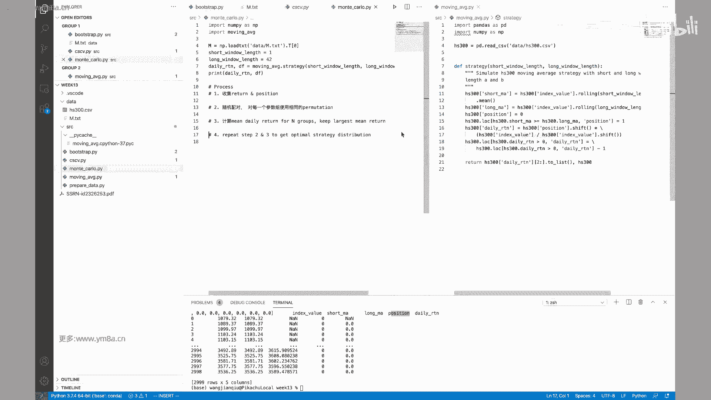

然后呃大家还有什么问题吗。

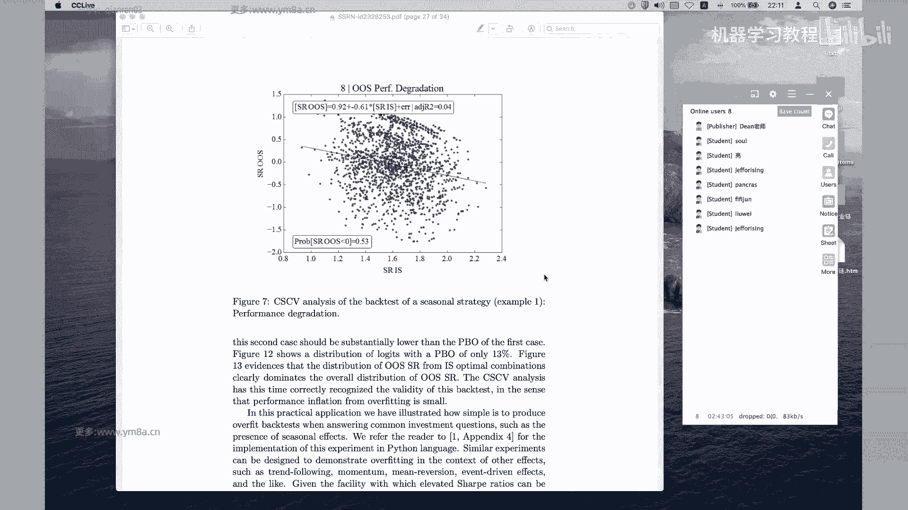

对啊就是啊再多讲一点，就是说呃我不知道之前前几课有没有讲过，就是当然并不是说是我们在做回测的过程当中，就不要去做优化策略嗯，对比如说优化策略是肯定是要去做的，但是呃呃优化策略就是千万不要去滥用。

你滥用的话，那可能就是过拟合对，但是事实上就是说你再去优化策略的时候，你可能是要采取一定的strategy去做的，对，就是就是首，首先我觉得就是说刚刚有同学问到说，是不是说就以后我测试策略就不要分。

样本类跟样本外不，你还是要去分的，所以我们在做C，无论如何，就是在最终上线之前呃，即使即即使说我把我现在所有的拿到，历史数据都去回测了，我还是强烈建议在上线之前先做一段时间，模拟盘。

相当于是做你的样本外测试，但事实上在策略开发过程当中，还是要去留20%到30的数据，作为样本外的测试对，然后呃我个人其实比较建议，就是说你还是说先有想法再去去把它写成鹰嘴，写成教育策略。

而不是说是去靠data mining，对data mining可能第二种方式，data mining这种方式容易造成过拟合，然后我们还觉得我觉得是从观察到的现象，或者是个人的想法去触发。

然后去建立策略去验证，然后策略完你建立完想法去验证，你肯定可以得到初步的这样一个，back test的这样一个结果，然后就接下来要做的事情就是这样，你要去去优化策略。

对嗯嗯然后就是其实说过拟合拟合认是什么，就不是说是你完整的拟合了呃整个历史的行情，而是说你可能拟合的过分过分，去拟合这样一个噪声，因为本身呃金融市场就是一个低信噪比。

Low signal to noise ratio，这样一个这样一个人这样一个环境，为什么它是呃低信噪比的，并且他一定会是持续的是低信噪比，低信噪比，因为整个市场就是一旦是信噪比高了起来。

去暗示着市场有什么事情会发生，那么不仅仅是你是其他的所有市场参与者，都会去套利，把这直到把这个信号给打平，或者打到你没有收益的这样一个程，低的成这样一个程度，所以一般来说就是收益都是短暂的。

就是信号都是短暂的，即使是偶尔的spike有尖峰，那么一定会马上被套利者给发现，所以就是说就是说你在优化交易策略过程当中，是要注意说你我们要做的事情是优化策略，而不是去优化策略，去拟合我们的噪声。

嗯嗯对额，所以，就说优化的时候，你可以说是说我们比如说是像同一个模型，我用不同的参数来回测对，但这个时候呃，呃其实就是说有时候就是说在回测的时候，不一定说是我一定是保留样本类呃，表现最佳的这样一组参数。

在样本外就是最佳，你还要去实际上事实上还是要去考虑，就是参数的问，就是参数的稳定性，就是说当我把这个参数稍微的小小的调一，点范围的时候，我整个测试的表现，都应该是不太会去发生太大的变化的。

就有点类似于一个hit map，假设我们的就是strategy是一个呃，有两个参数X和Y或者A和B对，然后我们对应的performance是ratio，还是什么东西，我们把它作为它的这样一个值。

然后你可以画出一个二维的这样一个hit map，那么你相对来说我比较理想的这样一个情形，是你的hit map有一个比较明显的一个热导，或者一块是属于说是OK这一块的范围。

就是说我参数在这个范围之内都是比较稳定，我的sharp rati都比较高，但这个时候其实相对来说会比较理想对嗯，然后还有一个其实我们要做的事情，就是在做完优化策略之后。

我们叫一个叫step forward analysis，叫推进分析，其实这个还是蛮常见的一种方法，就是我们在呃确定交易策略优化参数的时候，就是说比如说我们拿第一年15年的数据。

测试了一个strategy，那么接下来有了一个新的新的，比如说又来新的一个月，那我们就是从2015年2月，到2016年1月，这样一个时候我们去滚动的窗口进行优化，对这样的时候就是说我始终呃。

比如说我有两年的数据，但是我可以一个月一个月去滚动优化对，而不是说一下子把两个饮料里的数据，都拿来去做样本类，那这种方式的话，其实我个人是比较推荐，然后我们事实上也是这样去做的，然后至于在实拍的时候。

我们已经也是按照这样的方式，我只是始终是用，就是我加到最新的这样一个数据，然后去滚动去这样去优化对，然后事实上我每一次周期的变动，我在滚动优化的时候，每一个周期的变动也是可以去得到额。

就是你也可以得到我这个整个策略表现的，这样的一个时间序列，就是说在这个周期你可能OK在下个周期不OK，那你可以去不断的去track它呃，然后这种方式，市场也是可以去评估一个策略的生命周期，理论来说。

对于一个阿尔法来说，从他的发现到上生产，然后到decay，你应该是能够随着发现，随着他时间的变化，阿尔法的阿尔法的预测能力在不断减小，对那么嗯对，就是如果说就是说我们在测试研发过程当中。

遵循就是从idea，然后到实现implement，然后到去优化，然后再去做推进分析，我觉得这个过程可能会比较OK对，然后至于到实盘的时候，嗯可能是说我觉得把前面的做好了。

其实实盘可能就会相对来说会压力小一点，然后即使说嗯偶尔的亏损，或者说不符合自己的表现，那么如果我经过前面的严格的测试跟分析，我也有比较大的信心去坚持我的策略，而不是说把我的策略给停掉啊。

然后人工的去去改变我的策略，去随机的操作，对然后对，然后在这个过程当中的时候，从实盘的时候，我们还要从实盘得到结果去返回去，看看我的回测是不是做的准确，这一步其实是比较重要的。

尤其是偏日内和偏向高频的时候，就是你要去评估一下你实盘策略得到的结果，跟你回测结果是不是一致，对我们之前在机构做的时候，就是每天呃交易完之后，会把相同的策略再放到回收系统里再走一遍，看看下单的仓位。

成交的价格是不是接近一致，对，Ok，然后我觉得，只有把整个以上的过程都去做完之后，然后并且注意到我们今天提到的几个，可能会出现的咳，Bias，Survivor bias。

然后long shot bias，然后使用未来函数，然后使用滤波的一些问题，我觉得可能然后这样，这样整个一个策略开发才会选。

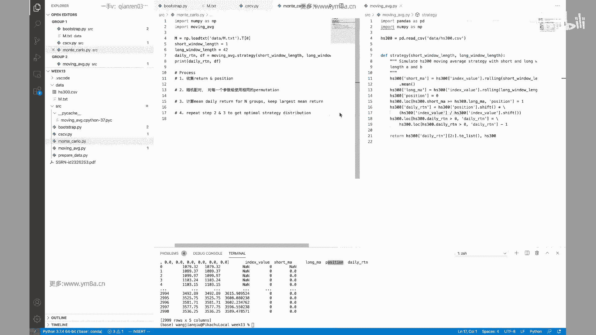

相对来说会比较完整呃，K呃，那今天我想要讲的内容就这么多了，同学们还有什么问题吗，嗯然后再说一下下节课的话，其实想讲的是，在之前有在17年的时候，其实我测试过就是举一个呃。

在线资产组合选择的这样一个交易策略，对下一节课想给大家去去做一下这样一个事情，对，就是其他记它是有一篇paper，就是moving average reversion。

Strategy for online pfolio selection，就是这个时候他不是偏向我们之前的CTA，或者是呃或者是股票多因子，但是我们做的事情是就是呃就是我把我移动平。

移动平均回归这样一个简单的这样一个，就是我们做的是moving average reversion，这样一个策略应用在我们的这样一个online，就是一个pfolio selection，对。

下节课主要会去给大家讲这样一个策略，然后呃对，这个是我是在17年的时候去测了一下这个paper，其实应该我不知道这paper是什么时候的对，但是对17年测的时候，觉得效果还还是就是没有想象中那么好。

但是觉得还是挺有意思的一个方式，对，呃OK然后我们会把它应用在A股，然后我们会拿一些指行业的指数来去测试，OK那如果没有什么问题的话，我们今天课程就到这。

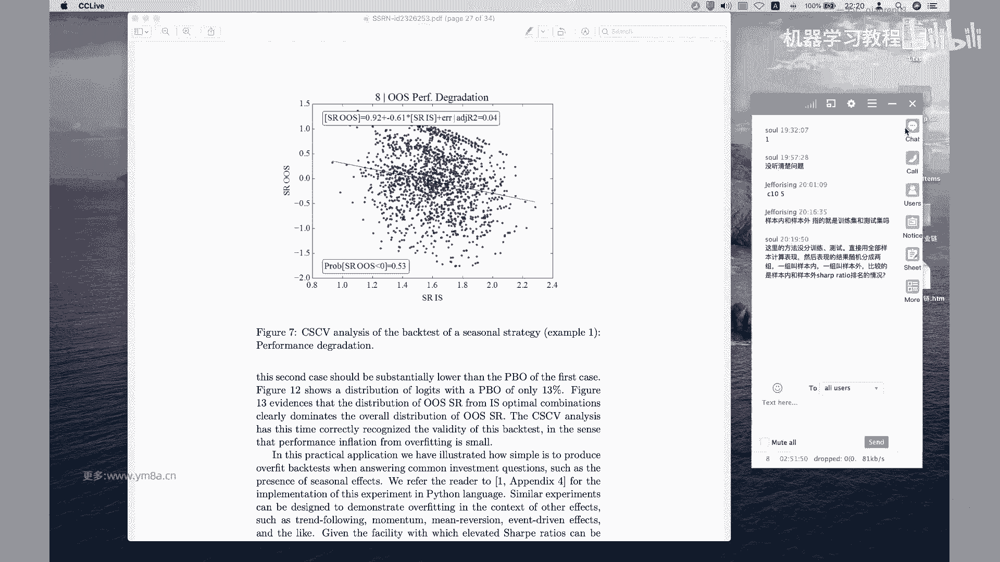

OK然后这次的作业就是呃就看吧，我觉得是首先是这这这个框架是比较重要，大家去最好是把paper然后跟代码自己去理解一遍，然后去实现一下，然后看一下结果怎么样，呃然后还有一个就是呃他原来这个PBO的话。

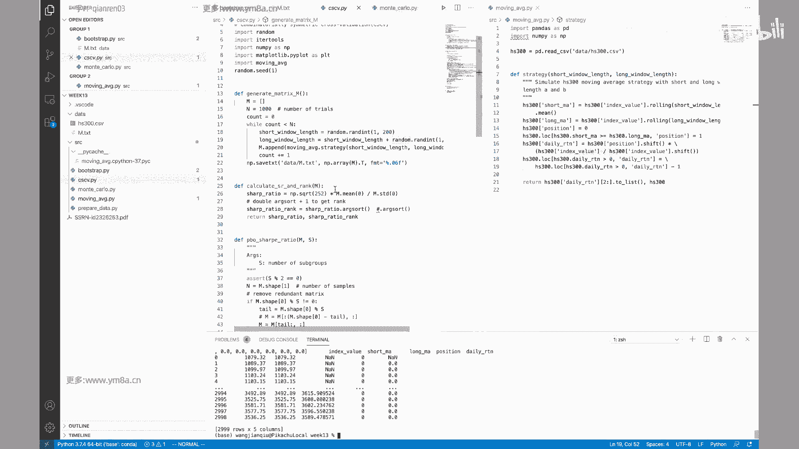

我看到就是开源那个人去实现，我没有去采用，然后还是自己去写了一遍，然后呃PBO，然后知道有R对应该有RR的package。

就是如果用r programming的话，可以去做，然后嗯p b o package in pon对吧，这个也有人去做，这也可以去。

你也可以去参照一下probability of back test over fitting，对，呃KEYPBO，对大家可以看一下CSCV，然后对他这边就会做的考虑会比较完整一点，然后你自己去。

如果是作为一个就是prototype的话，可能有时候不一定这么复杂，对呃呃对，对他这边写的还就是还挺复杂的，可能自己第一次看的时候看的有点懵，但是我觉得应该基本上差不多。

你看尤其看到rank data对吧，然后arg max就跟我们还是应该是差不多的对，然后CONCDATE，嗯我觉得大家可以去看一看别人的视线，然后自己再去理解一下，我觉得可能会比较好一点对，呃。

所以其实就是呃尤其之后就是说现在这节课，可能我们都会基于一些paper，然后再去实现一些策略，然后如果对于相关的背景不熟悉的话，那当然最好如果不是特别熟悉，其实我觉得大家尽管到现在，应该也有一定的能力。

就是呃去看paper，然后去实现策略，而事实上就是在呃工作当中，也会有比较多的内容，会出于就是说有一些idea，然后可能你的leader，你的老板也不是特别清楚怎么去做的话。

那可能需要你是去implement这样一个原型，去看看别人的paper里面先做一下，看看是不是用到你的市场环境，是不是，Ok，然后对去复现一下这个paper能不能得到这个结果，然后再去改进。

这这事实上这工作当中也是会比较常见的，对就是说做框的可能不一定像像读PHD一样，需要你去额去提出原创的，就是去原创的去提出一个崭新的理论框架，然后去对。

但是要做的事情是需要你呢就是非常快的follow up，业界已经有的成熟的研究，对或者是学术界有研究，但因为矿就是一个比较典型的情况，是可能是业界，有时候走的会比学术界会快一点呃，对尤其是比较好的音质。

可能大家应该不会去发paper，可能都会先去交易，如果真的是已经确认他已经DK了，没有用了，可能才会去把它分享出来，对所以就是呃一个是SSRN这上面的网站，还有r cave上面都会有一些就是发言。

说engineering的paper，其实大家是可以定期的去follow的，然后看多了之后，可能就会知道，它里面其实很多东西讲的是什么故事，然后很多东西讲的是只是对哪篇paper，稍微改进一些。

但是往往是这些改进里面，可能就会给你带来新的因子的一些想法，所以我觉得这个价值是在这个里面嗯好的，那如果没有什么问题的话，那我们今天课程就到这里啦。

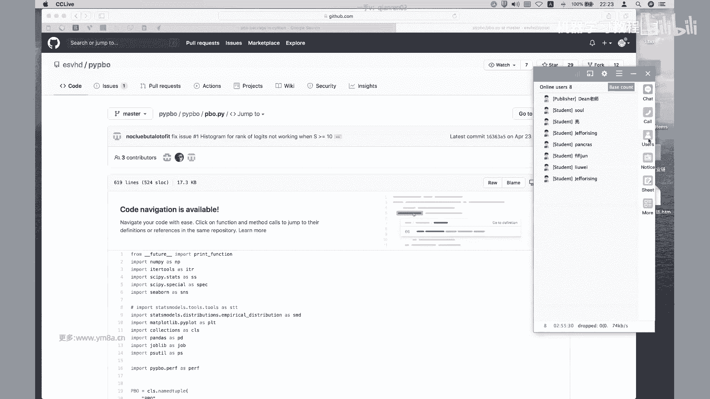

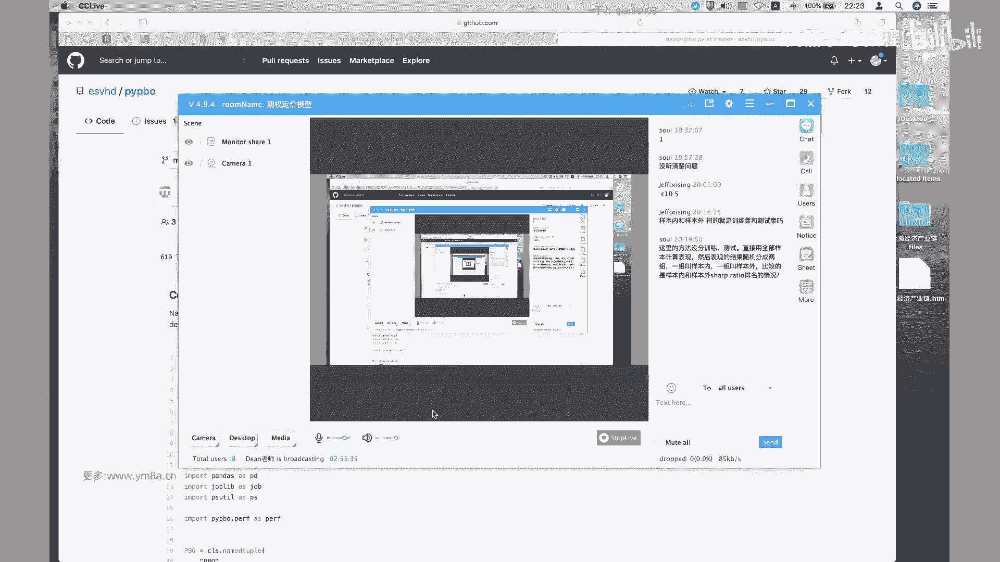