# 2025最新AI量化交易实战教程，三小时入门到进阶！清华计算机博士讲解，零基础也学会了（AI人工智能丨数据分析丨数据挖掘丨机器学习实战丨深度学习丨编程） - P9：第十章： 回测2-根据策略类型建立回测框架 - 机器学习教程 - BV1ujk4YKEw9

诶hello，各位同学能听到吗，好的嗯，我们再等一下，现在现在有五位同学，刚刚给他家那个老师，应该发到群里的是有关遗传算法的两篇研报。

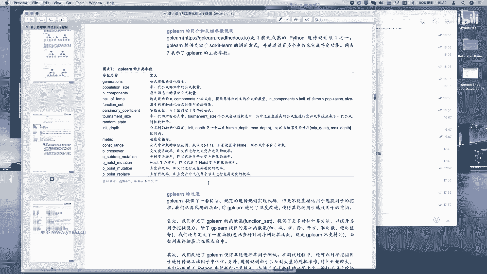

嗯好的，我们再等2分钟，然后35分我们就开始，嗯这两周大家有没有自己去测一些因子呀。

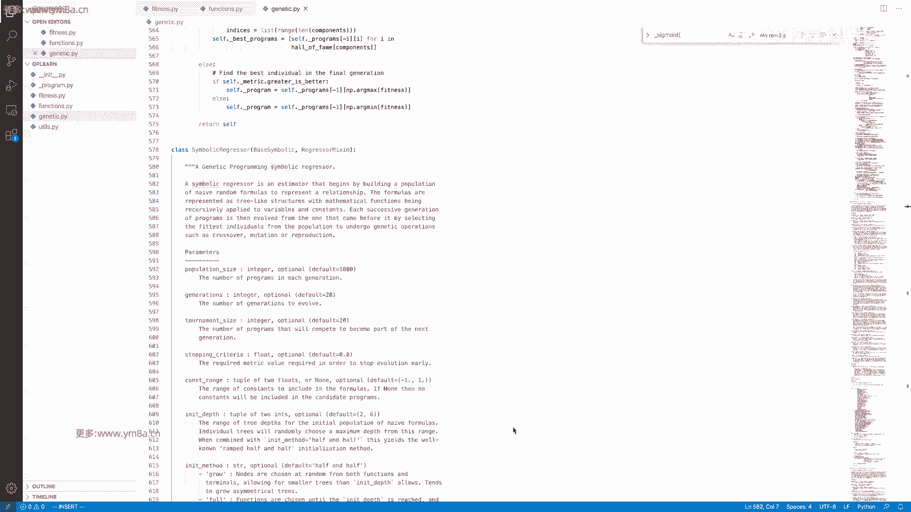

好的我们就开始吧，对之前就是说之前我们的做法，是不是都是从研报或者是从数据当中去呃，人工去测试，去挖掘一些因子，但是嗯之前有讲过说是呃这样的做法来说，优势是优势，是在于说我可以清楚的知道。

我每个因子的构建流程，然后也可如果说哦嗯嗯有能力的情况下，我可以针对每个因子去做进一步细致的研究，去包括去看它到底在经济学上是存在，怎样的含义，对嗯但是相对来说它的弊端就会是嗯这样的呃。

最典型的就是说研究效率会比较低，可能嗯就即使是说是每天在不断的去挖掘因子，但是长期来看可能说是一个月，我不知道是不是能挖出一个相对来说比较稳定，有效的印子，然后然后大概是从18年开始的时候。

大家都会去尝试说我自然而然的一个想法是，如果说我现在因子库当中，已经有一些还不错的因子，那么我是不是可以尝试着去把这些因子，进行一些组合，然后去啊测，然后去生成一些我从来没有去深。

没有没有去探索过的因子进行测试，然后在这个实际上，然后后来大家会逐步的去发现，可能说哎遗传包括就是说使用遗传算法，可能是相对来说是比较好的一种方式，对就是在嗯它本质上来说是借鉴了呃。

也就是说是就是从他名字上是可以看出来，他借借助的是一个模拟自然界当中，遗传进化的这样一个过程对，然后嗯所以就是说这套框架的话，嗯这套框架可能刚开始大家会觉得说有点奇怪。

为什么说我本质上我不就是在做暴力挖掘吗，但是事实上在从实实际的结果当中来来发现，就是说逐逐渐的这种方式，已经成为说是主流机构的一种嗯，就是说在做股票的因子挖掘当中，必不可少的一种方式了。

所以呃这节课也带同学们简单的去看一下，就是说我们怎么来去去理，先去理解一下，说整个整个就是说遗传遗传啊，遗传规划，怎么来去做这样一个选选股的因子挖掘对，然后我们再去看一看能不能去测试一些因子。

然后嗯因为然，然后因为这篇研报当中是使用的是一个，g p learning项目，但是我鼓励他，也就是嗯就事实上就是说简单的调一下他的包，跑一下还是还是速度还是非常快的对，但是但是其实如如果嗯。

建议大家就是有能力的话，可能还是可以需要就是自己去实现，原，因为包括当时我们在机构里，也都是先是去自己去呃实现了一套呃，实现了这样一套框架对呃，因为因为因为其实怎么来说。

就是它的一些功能相对来说是有一些，可能就包括时间序列的，其实那这些函数都是没有，都是自需要自己去实现的，然后说与其说是把啊自己去实现嗯，他呃实现时间序列相关函数，然后去适配到这个项目当中。

可能还不如自己从头去搭建一套，相对来说比较轻量又简单的这样一个规划的，遗传规划，这样一套框架嗯嗯对，然后等因为实际在应用过程当中的时候，你可能还需要去考虑它的运行的效率。

所以单纯的如果只是用他的项目的话，呃，实际当中是不太可行，因为嗯对最简单最简单问题就是效率，我们我们大概运行的机器，可能是就是128G的机器，然后是128G内存，机器可能24小时在不断的去运算等人。

然后这个时候你可能就需要利用多核的特性，但是这个项目据我简单了解，应该是就是说是没有没有采用就是多核，并且也没没有进行代码的一些优化，所以实际跑起来的话，生产的时候不太可行。

但是我觉得就是说作为刚开始的时候，大家去测试去研究，我觉得还是可以的对，呃OK然后的话我们就开始来看一看吧，对所以整整他整个研报的框架我觉得还是OK的，基本上其实跟我们做的不是，这差别不是特别大对。

因为因为嗯就是嗯就是呃还是强调一点，就是说可能很多的框架大家都做的差不多，嗯就是基本的想法也都知道，但是具体再去做的时候发现嗯大家都会去讨论，说到底怎么去做，那这些都可以都都会有差别。

但是最归根结底会和归根结底回到最后的本质，可能还是去每个人要去原创性的去创新，去想挖掘怎么样的因子，因为大家可能发现讨论的时候说，你用了机器学习，他用了深度学习，但具体说哼回归到问题的本质。

看看大家有没有人去讨论你用了什么因子，他用了什么因子，那这个可能大家就会发现这个事情，就是大家不会去谈论这个事情，因为这个是属于每家的看家本领对，甚至就包括这边说啊，就是遗传，因为你即使是做遗传规划。

我们也需要去有一个预测的，或者说是拟合的这样一个目标，那这个目标到底是怎么选取，那其实每一家都会有自己的想法对，所以嗯所以可能这这部分的时候是，这部分是需要同学们自己去主动去探索，就说我可以告诉大家。

就是说大家可以去以哪些东西作为，作为我们的预测目标，但是实际可不可行，以及包括嗯嗯根据不同的预测目标，你的策略需要进行怎样的额变化，那这些肯定都是大家自己要去额外去考虑的，对OK嗯其实嗯他这边也说了。

就是说从本质上来说，就是说呃你希望的就是说呃，我给出一系列的单因子，然后然后希望希望因子通过一系列的加减乘除，开方时间序列的变化，能够去得到一些新得得到一些新的因子对，然后我是因为因为因为大家可以想到。

就是说如果说我每一步假设我初始是十个因子，然后我也我我大概我提供有20个操作，那十个因子，然后假设是两两进行两两进行组合啊，那实际上就是说十个里面呃，十个里面选两个对吧，C12，然后然后再从这12嗯。

C12C12到就是呃40呃，45对，然后45种呃，45种可能性的时候，我再去选，接下来会有20种算符，45×20，那这一步实际上就已经引入了，就是说乘以900，那我如果把以上的这样整个过程去重重复的。

五次甚至十次，那就是说是900的五次方十次方，那那大家就可以看到这里面因子实际上是非常，就是说因子的数量级是极端的去爆炸的对，所以说嗯就是说所以说他的目的是说，我需要是从啊。

就是说从这么多无限的因子当中，能够去找到一些相对来说是可能会有效的，一些因子对，当然说做找到这些因子之后，还是需要去进行测试，他这边可能是就是拿rank i ic去去，要进行去预测。

但事实上事实上就是你找到了因子的话，对不而ICR肯定是要算，算完之后，如果是嗯跟自现有的因子库重合度，相关度比较低的因子，可能还需要拿拿出来进一步去做啊，进一步去做单因子的测试，对好的。

然后我们先我们就来看一看，就是呃就是这部分原理可能大家有兴趣的话，就是说啊这部分原理可以去关注一下对，但是如果你不是特别了解，其实也不会影响说，你去拿这个框架去做一些因子的呃，嗯因子的生成跟预测对。

嗯OK，所以我们今天整个先是按照他的框架来走一遍，对呃，OK所以说这张图他是给了一个遗传规划的，这样一个总体的流程呃，他第一步就是说是随机生成第一代的公式对，然后然后这一部分就是fitness。

接下来会去讲他怎么去怎么去定义，这个每个公式的适应度，fitness对，这个是我们自己要去考虑的对，然后然后接下来就说选出fitness最高的一个公式，作为附带，然后再去不断的进行所谓的进化。

其实你可以理解为，就是如果大家学过那个语法数的话，应该是这样这样一个概念对，就就是就是，或者大家可以来看现在这样一个公式吧，就这个公式就是我们人眼看到的是这样一个，就是二次项的这样一个函数。

但事实上就是说你把它去组合的话，它中间经历了几个步骤，我们看这张图啊，第一步的话，他第一步他就说是首先是那首先是吧嗯，两个X01相乘得到X0的平方，然后这边是三倍跟X1相乘。

然后我把这一步得到了结果之后呃，再取两个，再再拿这两个数去相减，相减完之后就再相加，实际上它是经过三步逐步迭代，得到这样一个公式呃，那大家自然而然就可以去想了，就是说如果我把这边的。

就是说接下来的X0和X1都换成两个因子，那这样的我通过这样的一个公式，本质上来说我就我通过把呃，通过通过这样的一个计算过程，我事实上就可以得到X0平方减三，x 1+0。5。

这样一个新的这样一个这样的一个因子，对然后所以当然嗯对，然后所以说嗯，嗯就是说我们本质上可能就要去找，就是说我们通过呃我们需要，那那这个时候大家就要去想，我们需要哪些哪些东西了。

一个是说我们的一个seed，我们初始的这些一个因子，然后另外一个就是说我要想到说，我额能够想到哪些组合的方式，加减乘除，平方开方，这些大家都会去想到，那么接下来其他的呢是不是可以再去想一想，对。

然后这个里面是说适应度它是什么东西，就是说适应度本质上它是衡量，就是说公式运算结果跟给定目标的相符程度，对啊，然后所以说然后那对于就是说呃，如果是回归问题的话，那其实这个就比较简单对，然后分类问题的话。

你也可以就是这个用机器学习的，就是交叉上cross entropy，你也是可以的对，但选轨因子的时候，这个时候他用的就是一个因子，在回测区间的平均rank i ic，或者是因子的收益率来作为适应度对。

那大家也可以想一想，说除了我就是说啊，我除了这样一个因子的平均的rank i c，或者有没有除了这两个，也没有，是其他的方式来作为更好的一个评价的指标对，然后他里面提到的是说它的核心步骤。

就是说是公式的进化对，那进化的话他这边有几种，你看一个是一咳，一个是交叉，对交叉就是说两个已有公式数之间生成，这样的也行，生成一个子数，大家也可以看到，就是说哎我们是把就是A1部分啊。

AA1部分这一块给相当于说是给去掉了，换成了就是换，那也就是说把额就是A1这一部分灰色去掉，然后换成了BB1，这一部分把这个然后这两部分一进行组合的话，其实就生成了一个新的这样一个计算的公式。

对呃这个就是典型的交叉对呃，所以这个这个这个这个应该是相对来说是比，较直观的对，但因为其实然后，但你我们也可以先看一下这个过程，然后在实际上就是说我们再去编程，去做的时候呃，大家可以去看哪些步骤。

你觉得是比较重要，然后其实哪些因子，哪些组合时，你可能也不是那么重要，对甚至对，其实我们在做的时候，肯定是倾向于是采取要随机的方式，就是每一步的话，我们可能会去选随机的去选，我也不知道我会选中哪些的。

哪些的啊，就是哪些的算符对，OK然后然后第二种方式就是说子数变异，然后指数变异了，就是说嗯咳，然后这个时候说我们之前选择的就是fitness，最高的这样一个附带，然后随机选择这样一个子数。

那这时候他选中的是，就是我把这时候把A1给选中，然后对，然后再插入一个对，OK我觉得这部分就是说原理的话，大家可以去可以看一下，就是说呃对对，看一下这部分到底是怎么来做的。

然后的话就是我们今天要用的是这样一个对，其实这个包之前我也没有特别的去用过，因为我们可能都是自己来去做这样的一个东西。

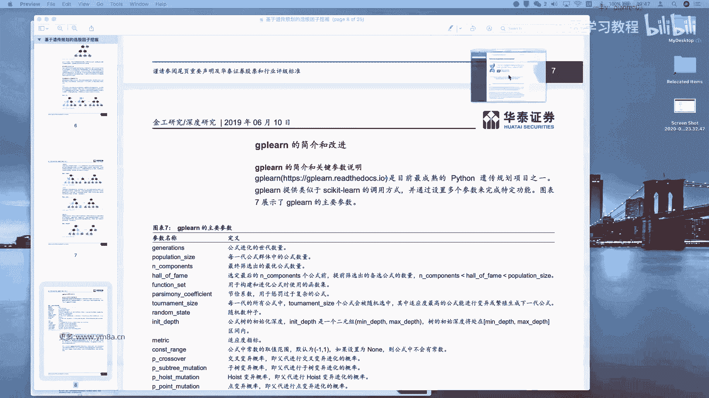

对，就是这个这个，然后大家其实pip安装一下就OK了。

然后简单的跑一下它的example，你可能就知道就是他会怎么去用对，所以说他这边其实这篇文章里面，他提到了一个最关键的问题，是说是说是哦，我们可以看一下。

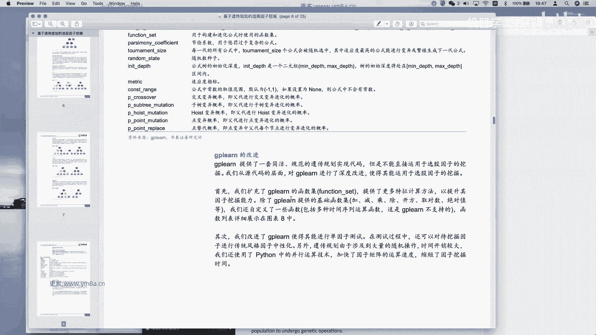

就是gp learn这样一个源代码，因为，就是在function set里面的话呃，就是原声的说他只提供了加减乘除，然后开放log这些这这样这样一个函数，这些函数，但是大家就要在想，就是呃。

因为我事事实上我在做因子去合成的时候，我可能涉及到的是很多时间序列上的一些东西，那如并且并且他实现这个function还是比较简单的，本质上来说就是对，就是说我这边如果是一个NPADD的这样，一个函数。

然后我再我在每次调用我这个function的时候，我本质上做的就是一个NPADD，然后把我的一些把我的参数，比如说看两个值，直接哎直接相加，我就得到了这样一个呃新的这样一个结果，新的就是计算结果。

然后我们自己在做的时候没有用，就是说你可以当然用这种方法，让让Python当中还有一个功能叫，就你就用eval evaluate这样一个函数，你可以把你的公式的名字就是呃把它写，把它就是给写出来。

然后你直接去160得到这个计算的公式，本质上是一样的对，然后大家这个时候就要想一下，就是说华泰他们应该做的比较，就是这篇研报里面他提到的改进，应该是它本质上就是去扩充这样一个function map对。

因为在原生的function map里面，他只是做到了最基本的这样一些一个function，但是大家就要想一下，就是说如果我是一个时间序列对，那这个时候该怎么去该怎么去做对，就是因为呃。

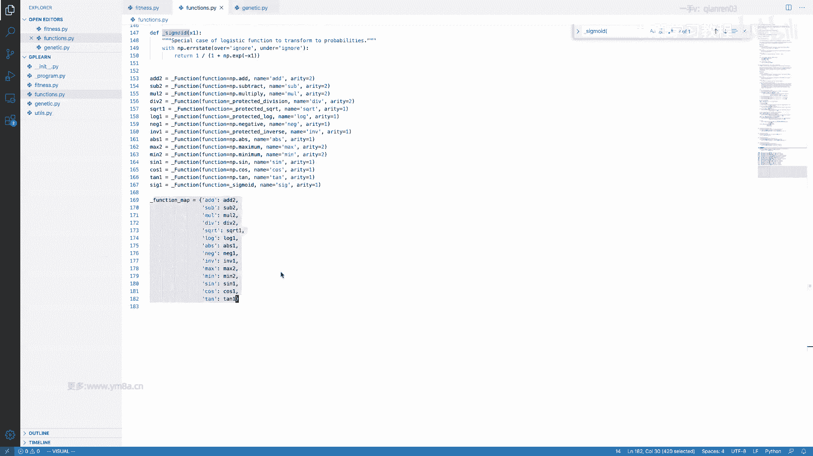

然后对时间序列预算额对，然后是啊单因子的测试啊，其实是说我们之前就是对嗯，单因子的测试的话，其实就是可以把我们之前就是股票做了，单因子测试，把这两步给结合起来，其实就就就是就是说等其实就OK了，对额。

这其实就是做量化，本质上就是嗯可能现在有很多的工具，然后我们要做的事情，就是你要去用胶水把它给组合起来，就形成，就是就是形成，你可以去一个个去用的这样一个模块咳对，然后我们看一下。

就是说除了就说基础的这个它定义的这些，基础的这样一些函数，我们还用了哪些，就是自定义的这样一些函数，就是嗯这样一个呃rank的话，相对来说之前大家有没有发现，就这里面的很多因子跟我们之前所提到的。

国泰君安的研报和啊word框，101阿尔法里面其实有很多是非常相似的，那可以说就是说其实我想说的是，本质上在很多年前，他们已经在尝试了这种遗传规划的想法，去挖掘一些因子，所以这也是为什么大家看到。

就是之前有些因子的表现形式，或者说他计算公式非常的复杂或者很奇怪，但是嗯对，那其其实说嗯大部分来说，可能都是按照这种框架去把它去挖掘出来的，然后嗯主要是大家可以去理解一下。

就是为什么他要用引入这些引入这些函数，因为这个delay，delay其实就是我们在做交易的时候，最直观的一个感觉就是我这个因子预测出来，就是说它不是及时有效的，它可能是过几天之后有效。

因为说比如说这个市场是说嗯最简单的来说，如果说你找到一个能够说预测，就是说有大量去买入的这样一个因子，那么买入之后股价是不是一定会上涨呢，不是立刻上涨，那可能是几天去上涨。

那这部分的时候你可以引入这样一个delay，你可以去观察这个因子，在预测未来几天的收益率这样的一个效果对，那同时这到底预测多少个时间周期，这里面也会引入新的一个就是parameters对，然后包括嗯。

然后你会发现嗯，就发现这个时候如果说是correlation，也是也是在就是量化当中常见的这样一个概念，人如果说我们有两个就是随机变量的话，你可以考虑说两个随机变量之后。

嗯就是两个随机变量的correlation，跟我们跟我们的这样呃，就是你预测的值之间又有什么样的影响，其实所以所以说也就是说他这里面列的，我觉得基本上还算是比较全，就是除了我们简单的数学运算之后。

还引入了一些，就是说我们量化里面会特有的这样一些概念对，然后然后接下来就是嗯对，但是这一步的话，你可以说就是呃行业中心化处理的话，你可以去可以去做，那你也可以就是说我可以在因子计算过程当中，我不去做额。

就是在遗传规划的整个过程当中，我不去引入额中心化的处理，但是是在单因子回测阶段去做这个也是可以的，对，然后这个时候他说是这样一个呃，这个时候是一个时间序列对呃对，因为我们前面的来说。

你前面里面不管是加减乘除的话，你可能只是说我只是说当天的一个值，或者是呃呃就是说我给我给定了，比如说两按给定了，就是close这样一个嗯，给给定了一个close的这样一个序列。

比如说我把开盘价跟收盘价直接一下，直接一加对，然后或者对，但是你这个里面我们是可以就是引入了，引入了更多时间训练上的东西，我们不仅仅是考虑当天的人就不考。

不仅仅考虑说是close price这样一个特征，我可能考虑了这样一个时间序列的，这样的特征对，所以咳这部分的话，就是他这里面给到的这样一些因子，然后你可以先去看一看，然后对你先看一看，他的。

就是可以看下面有一些测试到这样一些结果对，嗯这个是一个就是这样，是一个就是他这里面是做了几步，第一个是就是volume wait average price，就是VWAP这样一个价格，然后然后是地势。

然后是最，然后是最最高价，然后是把这两个就是去进行，这两应该是进行相除对，然后的话我看一下，我看一下他这个divide跟我们那个divide。

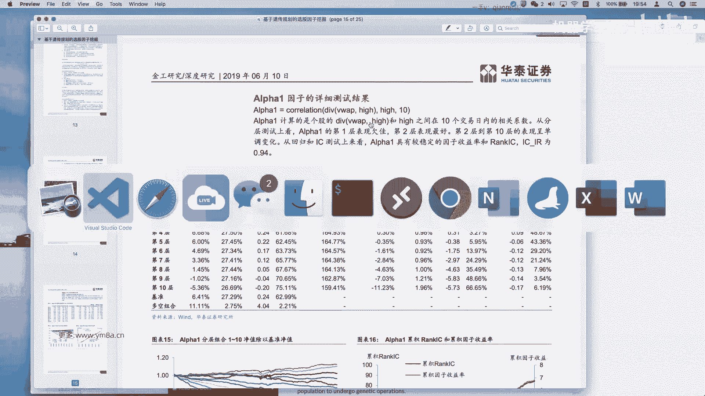

定义不一样，Function protective division，他应该是做的是除法，Protect the division，对他做的是一个这样的一个除法对。

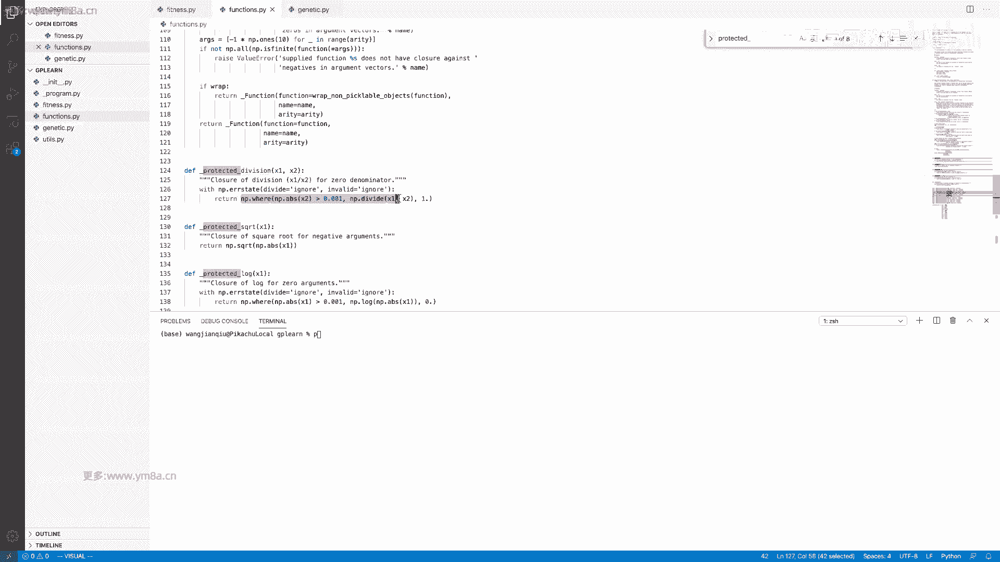

是所以说呃在这个音在这个因子里，他做的是先先是把就是volume，就是view的这样一个额成交量加权的平均价，跟当日的最高价值进行相除，然后去核算，当呃。

算这个十个交易日之内的这样一个correlation对，所以正常来说的话，正常人我们肯定要去想到，就是说用这样的因子的话去计算的话，可能自己都不一定会去想到去这么去做，所以所以说就说遗传算法。

本质上是说我提供了这样一套框架，我可以去呃自由的去测试这些因子，对嗯对，就是说去扩充我的因子库吧，因为一般人来说也就这，其实之前我们也我也我也提到过，说鼓励大家去自己去进行尝试。

进行多种各样的因子的这样一个组合对，然后然后大家可以看到这个这样的一个因子的，这样一个分层测试的结果其实还是蛮不错，他这边是分了十层，对我们呃其实也OK啦，就是大家可以看到。

就是第一层就是跟第十层的话确实还差的，差的还是非常大的，就相对来说这个因子还算是比较，还是算是比较稳定对，但当然这个里面可能第十层，你没有没有办法去做空对，所以所以说呃如果大家自己有去测过的话。

就是即使你是分五层，你也发现，就是说如果是只能做多跟多空都可以去做的话，那其实整个的绩效差的还是比较明显的对，那这部分绩效里面，就是说嗯本质上来说不能做呃，就是因为不能做空，所以这个因子的阿尔法才会有。

就是有这么大的一个净值在里面，对这个这个是事实上是，由于一般来说我们是拿不到这样的一个净值的，但是但是从这个分十层测试结果来看，就是说这个因子的效果，相对来说还是比较比较是稳定的对。

他这边说的当然是他是要考虑，就是说是单调的变化，就这这个里面是哪一层之间会有对，对，然后我们再去回过头来，就是看他是，就是就是我们知道了这样一个原理之后，回过头来他到底是怎么去做这样的一个事情的。

就其实其实说是可以说啊，这个是非常标准的操作对，然后当然注意，他这个量价信息用的还比较简单对，也没有经过特征工程对，那就是大家可以想的，就是说除了说呃，这边它仅仅只用了最基本的量价数据，包括就是回报。

就是只用了我们就是market data，没有用到，我们基本面数据器都能挖到这么多因子，但如果想象一下，如果把我们基本面的一些数据跟上啊，加上就是量价的数据，你再去结合一下去做引，去做因子的挖掘话。

那事实上能够挖掘到的因子数量是非常多的，对呃当然就是说嗯挖掘到因子数量，可能即使说经过测试，还有一些比较蛮不错的，那大家可以，就是就是这里面会存在比较大的问题，也是我自己也在思考怎么去解决。

就是可能是说即使是是样本内，回测下来还蛮不错，但是很多因子可能上去实盘之后，就并不是像回测过程当中那么大的那么稳定，对，很很有可能就是说这个里面是出现了，相对来说是出现了一些过拟合对。

然后对大家也可以想一想，就是说如果真的挖到了，用这种算法，就是用暴力挖掘的算法得到了很多因子，怎么去从嗯怎么去，就是说用一套框架去避免它过拟合吧，对，因为嗯可能每个人就是说有自己的一些小的。

trick去过拟合，但是我一直没有找到，就是说系统化的方法去避免这种因子的过拟合，然后对，其实这个这个这个里面就是触，触及到一些一些核心了，就是我们如何去判断一个因子到底是什，么时候是失效。

就说最近的因子表现不佳，到底是呃，到底到底是说是暂时性的波因子的波动，还是说是他真的就已经失效了，因为呃实盘当中很有可能出现的一个情况，就是说我觉得就是说这个这个这这这两个星期。

三个星期真实就是说这个因子表现不是特别好，我觉得把这个因子给撤掉对，但是过了一个月，发现那些那个就是这个因子，也有可能又创下了净值的新高对，所以这部分是我个人觉得是比较tricky的，一部分对因。

因为就是说因为我们挖掘到因子，数量比较多的时候，存在的一个问题，就是嗯我因子的数量很多，然后然后样本的回测表现也蛮不错，那这个时候我可能不一定有时间，去细细的去研究，研究到。

就是说这个因子啊到底在经济学上有什么意义，然后呃我当然可以说是做multiple test，然后去尽量可以去去找到，就是再去严格的，就是嗯嗯严格的去筛选每一个因子，就是把这个因子量纳入因子库。

还是经过严格的测试，但是最终还是会有一些因子，可以说即使说是上市牌，我也没有办法确定，比如说从逻辑上或者是经济学意义上，或者是说说从市场微观结构上去判断，这个因子到底是怎么失效。

哎到底到底是为什么起作用对，所以因为所以这部分，也是我个人一直在思考的一些事情，然后大家就是啊也可以去想一想，也是说这个问题到底可以怎么去解决，对，还还是说可能这个就是一个没有没有。

就是他就是一个open question，没有一个没有一个是确定性的解，那到底什么时候加入这些因，纳入这些因子，什么时候去除这些因子，也可能就是每个PM或者是交易员自己要去啊，做决定的事情。

所以嗯就是差一点，就是说嗯做量化，并不是说是所有的东西，都是去100%的去量化，对，就是即使说是我模型是量化的，那作为最终作为一个人的因素，在做决策的时候，我什么时候判断这些模型啊，去交易。

还是说我把这个模型给停掉，那其实还是有一些人的成分在，当然当然我不是说是不存在这种，完全是这完全是摆脱人的依赖的任务模型了，当然也可能有一些公司是存在，就是说甚至说我决定呃这些策略什么时候上线。

还是说把这个策略给暂停，甚至没给每个策略，每个因子分配多大的资金容量，可能都有公司是用完全量化的方式去做的，但是我目前还没有做做到这样的方式对，并且我个人对于说是完全不纳入他人的因素，只是单纯依靠模型。

也是是保持持有怀疑的，因为最最基本的一个假设是说，当呃，因为模型是对于历史的这样一个归纳和总结，但如果说是在新的情形下，模型所依赖这些假设都不存在的时候，我们是不是还是要去坚持模型对。

那那那这个这个个人每个人的观点是不一样的，这也是一个open question，对就是就是，然后就是从整个嗯课程刚开始到现在，其实我们一直强调，就是说是不让大家去思去强调，就是说是怎么去用量化的方式。

形成系统化的思维，但是到了这个时候又会说，即使就是说我们把整个框架搭起来之后，你已经能够用相对来说比较严谨的方式，去测试因子的时候，那最终就是额做交易，回归到还是去做交易的本身嗯，一方面是去挖掘价值。

一方面，但同时也是可能是跟市场上其他人去进行博弈，对OK额，所以说嗯这个这部分的话是对，然后呃就提一下，就是说这个预测目标的话是20个日的收益率，那这个我觉得是完全取决于个人的交易频率。

那如果说我做的就是短线，那我肯定要看的是两天，甚至是一天的这样一个交易的收益率，然后如果说我做的不是股票，我做的是比如说我做的试用期货，做的是用5分钟，那我可能算的是比如说是一个小时，是是是就是12。

是12跟80之后的这样一个收益率，可以说就是呃，这里面就是说我们在用机器学习，去预测因子的时候，有一个小的trick，就是说当我可能一方面说是，我如果发现我因子想不到，挖掘不出什么特别有效的因子。

我因子库就这么多了，那大家可以其实最简单的一个事情，就是最简单的一个事情，就是说我不去想新的因子，我去改变我的预测目标，那这个时候你发现一旦我的预测目标改变了，我的整个交易的pattern模式也都变了。

这个时候大家可以再去测试一下，就说我通过改更换我的预测目标，对于整个整体的技巧会有怎么样的影响，对，因为嗯其实其实本质上它本质上来说，你换预测目标，也是在去变相的去改变我的这样一个因子对。

OK然后就是说整个遗传规划因子的流程是啊，根据函数聚集生成这样的一个公式，然后按照图一图一是什么来着，我都没有注意，OK按照图一的这样一个流程，就是我们刚刚提出的去进行，去生成这样一个新的因子。

来生成新的这样一个公式，对大家注意，我们这边公式其实就是因子了，因为我们得对每一个因子都是或者是特征，都是基于这些现有的这样一些量价的特征和，财务的特征进行啊，数学公式上的组合跟变换，对额适应度的计算。

他这个适应度的是嗯，刚刚我们说到他是拿就是rank i ic去做的，然后假设有公式F呃嗯对就是他要去算run i c，他算rank i c，其实跟我们之前提到的，多因子的整个流程是非常相似的。

就是说对截在截面T上对所有的因子向量，然后得到这个因子向量之后，然后去呃取中位数，取极值，那这这这部分就是说不一定是用中位数去极值，就是我们这边可强调的是呃，你用那个MAE或者是其他的方式去做极值。

都是去可以的，然后包括中心化，对大家注意，我们之前可能是只是做了，就是呃只是做了一个行业，对跟市值中情况下，这边还对收20日收益率跟，20日换手率跟波动率进行的中心化，去剔除以上五个因子的影响。

嗯那这部分其实也可以去想的话，就是说嗯你如果说我现在已经有了，假设我已经有了一些除了这几个因子之外，我还有已经有了一些相对比较稳定的因子，那我是不是也可以，就是对我其现有的一些因子去进行呃。

就进行中心化来处理，这当然也是可以去考虑的对，然后第三步是标准化对呃嗯可以啊，这个是对他的标准还没有什么问题，然后然后做异常处理之后，然后计算因子这样一个，就是rank的这样一个IIC对。

然后他第三部也提到了，说对遗传规划因子去挖掘出呃，进行单因子的测试，然后IIC测试跟回归测试跟分层测试对，然后我们刚刚看到就是说把它去分层测试，就是说他这边是分了十组。

然后我个人的就是呃他因为他是对全市场嘛，就是3000多只股票去权权A股去做分层，所以分十组也是OK的，但是如果说我是，我是基于是做一个指数增强策略，我的选选股值是500的话，那可能分分十层会有点多。

就我我我提到我之前提到说是说，如果我们是做500只股票，就是一般来说我们可能是去做去去持仓去交易，这100只可能会比较好一些对，就是我们大概是保持维持一个100只，100的这样一个呃持仓的数量对。

那大概你可能我们去分五组也就OK了，因对因为我们同时也不能做空，对我们可能能做的事情，就是说是选取表现最好的一组，OK呃对，然后这这步是比较重要的，就是说呃我可以去做，就是衰减分析跟相关性分析。

衰减分析主要是考虑说我们提到之前，我问过大家是说呃，我如何能够判断我的因子是不是已经失效，那我其实可以对历史上的因子的，就是对这个因子历史上的IIC值去进行判断呃。

去可得到就是能够说是某种一定程度上去嗯，提前提前就是观察到我们的因子失效，而且因子可能会失效，对事实上在交易的时候，就是每天都要去做的事情，就是等收盘之后，我要把我因子库里面所有的因子都去算一下。

就是更新呃，算一下它的值，然后再去进行IIC的判断，就是对的，OK然后他用了这些，他用了这个参数的话，这个就是对于那个呃，就是这个就是那个函数库里面的，就是我们的GPN这样一个函。

函数库里面这样一些参数对，然后具体的这个东西大家可以去看一下对，OK嗯共识群体的，然后他这边提到的是平均长度，然后平均的适应度，然后整体来说经过三代来说，迭代的话是用了就是还是可以的。

然后它是两个处理器，14个小时嗯，差不多我们差不多做的是对对，我们迭代的差不多是五代，但其实其实大家要是就是算力有限的话，你完全可以去去，就是说不断的去把它去迭代下去，对，然后单因子测试。

其实这前面也就是跟之前讲的是差不多对，就是跟就是收益率进行下回归，我们从呃期货一直到股票其实都在用，都在使用类似的这样一个方式，然后的话对，然后去做一下，就是行业的这样一个嗯咳咳对这个回归测试，Ok。

嗯所以其实整个流程的话，基本上还是就是跟我们之前做的，还是就是差不多，唯一说我们新引入的时候，就是说我们之前在整个的，不管是期货还是股票当中的框架呃，在做研究的时候，我们用的是人工去挖掘因子的。

测试因因子的方式，然后接下来就是说呃我们之后之后就说嗯，就是把这一部分人工挖掘的因子去进行去换乘，人数，用遗传遗传规划进行挖，来进行因子的挖掘，对这个这个是整个框架的这样一个，比较大的改变，然后呃。

我把它官网上要这样一个。

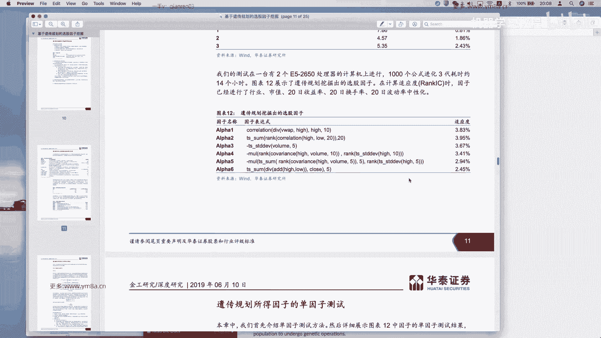

简单的例子给拿过来了，大家可以看一下，就是说这个东西它是怎么来做的。

这个是它的官网上的这样一个例子。

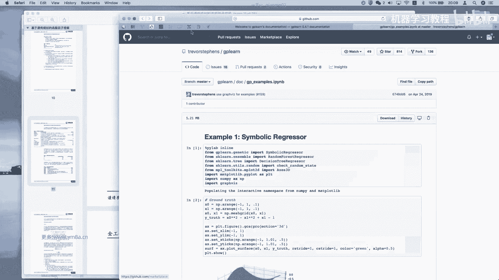

呃，大家注意的是，我们它里面有几个function，其实我们用的哦，我们不要用那个regression，就是嗯。

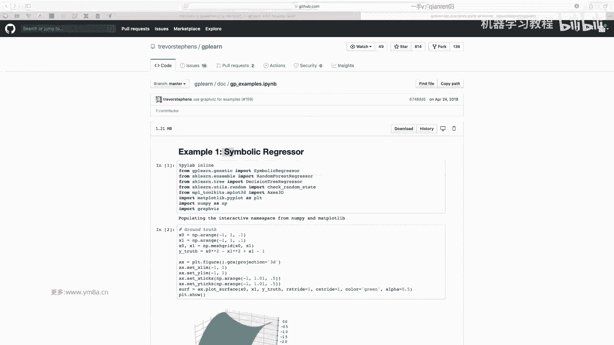

或者稍等一下，对其实我们要用的就是说只要去根据他的，只要用他这个symbolic transformer，就是他这个意思是什么，就是说我给给定的是我的一一系列的这样，一个feature呃。

然后我需要根据他的这样一个feature，是来生成去新的这样一个feature，然后它这个里面依赖到它依赖到是用了一些，就是他用的是SKN这个load bit boston。

应该是BOSTON房价这样一个数据库对，然后其实他然而他这样做了一个对比，他做了一个就是rage regression，就是拿领回归，然后去看了一下这样fit这样一个score。

然后然后然后接下来他做的其实他做的很简单，就是说我用了哪些function set，就是把这些东西加进去了之后，然后然后这个时候因因为BOSTONDATASET，这样的话。

他已经把我们的呃feature，应该是已经给过给我们了，对，然后所以就是我，所以所以说然后他他在做的事情，是说我只是调用这个包去transform，我们进行新的人去生成这样一个新的feature。

其实就是说嗯这这些这些东西可以理解为说，对于我们的量化研究而言，说我们前面的数据处理，然后数据的唉，数据清洗，数据的处理，然后是基础因子的这样一个生成，我们都可以去做完呃，都都可都是一样的去做。

做完之后仅仅是在这一步的时候，我们去生成这样一个新的transform，然后去生成这样一个新的这样一个gp feature，大家可以看到就是说啊，这个时候他已经他已经就是完全是。

就是生成了这样一些新的这样一个feature，然后等的，但是然后大家可以看到，就是说这个时候他的经过遗传算法，然后拿他这样一个数据做了，一，本，质上来说是生成一些预测能力更强的，这样一因子。

然后我同样的是去做零回归，那这个时候他的就是score显然已经得到了，就是现在已经得到了还是提升还是挺明显的，从0。75提升到0。84对，所以所以其实整个的框架来说是比较简单的对。

就是核心就在于说呃大家当然大家也要看，就是说有没有有没有必要去理解，说，我需要知道这个symbolic transformer里面，到底是怎么做的，呃我个人建议说你可以去看一看，然后当然你也可以说嗯。

嗯我不一定像他写那么复杂，完全可以自己写一套，就是说我我也是就是每一每一轮循环，我不断的去迭代，去组合生成这样一些因子，然后呃对我这个时候就说，其其实本质上是类似的，但是我需不需要像他就做那么复杂。

对因因为因为就是这个时候嗯，就是说效率还是比较重要，因为一旦因子数量多了之后，我算起来其实要算很多次，然后每个因子可能都要去算，就是去计算IIC对，所以如果说它这个里面是只是单线程啊。

那可能做起来会比较麻烦，那可能对大家就得就是在实际去应用过程当中，肯定是去想一些呃，想一些办法去去优化，甚至去加速，对，那其实就是整个的就是呃，就是遗传规划的这样一个算法，就是核心是这样的。

只不过说我们在实际应用的过程中，我我们需要的自己要去做的是去implement，这样一些就是新的这样一个DATASET，我怎么去呃，怎么去生成一些新的这样一些function，不仅仅是我们用的啊。

加减乘除对，然后下节课我们一起来看一下嗯，好然后我们先休息15分钟，反正就是对于整个这样的一个过程，大家有什么问题吗，因为因为我觉得就是整个遗传规划算法，相对来说还是比较清晰的对，大家有什么问题吗。

啊啊刚刚刚刚这位同学有一个同学提到，问题是市场市场中性是怎么理解对。

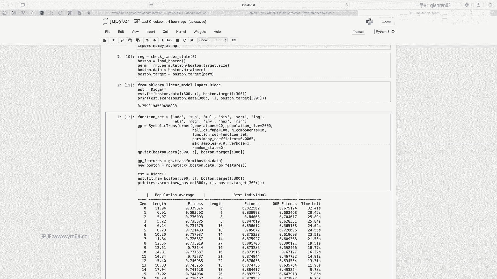

然后就是是就这这这这这个问，这个问题跟跟我们这个还不太一样，就是说就是说我我们这边是说是没有，就是说在大市值，小市值上的偏好，但市场中心是本质是这样，就说我能做多能做空的时候。

我需要保证我的同时的多头跟空投的投呃，空头的头寸都有，而这个时候就可以去对冲哎，这个这个时候可以进行对冲市场的风险，就是说不管是市场涨和跌，我希望的是我赚了钱或者是亏的钱，都来源于我的因子。

而不是说是随着市场的涨跌，然在当然在A股现在还不能做空的情况下，我可以是通过空投的，就是做空股指期货的方式，去对冲我的这样一个风险，对，那现现在来说也是相对来说是比较主流的，这样一种策略，就是说嗯对。

就是就是我在投资过程当中，我只有也就是说，我不希望有时跟随着指数去波动，我只希望你去赚取，说投资人这样直接的阿尔法的这样一些额收益，不去考虑对冲的量，而不去考虑市场上涨或下跌。

对呃这部分简单来说就是市场中心策略对，然后其实这个问题又回到了，那我们刚开始的这样一个问题，就是说就是量化量化里面纳入人的因素，那最简单的一个是，我也可以说我不去做空股指期货啊，我就叠加市场。

就这个时候就变成了嗯就是指数增强，那这个时候其实就要判断了，我什么时候，什么样的情况下去配置市场中性策略，什么时候什么样的情况下，我去配置一个所谓的指数增强策略。

那这个时候是取决于呃大家对于市场预判的对，因为嗯最简单来说是你能预判，而市场今年整体的是上涨还是下跌，然后还有一个是我做空股指期货所需要的成本，也是需要去考虑的对，然后然后市场就是在美股。

我知道有人说一般大家做的比较多，就是所谓的是统计道理，或者其实就是说我选一对股票进行多空对，这个时候是相对来说是可以去考虑，做到呃市场中心呃，但是这个里面有一个问题，就是说。

也就是为什么大家看到说不是说市场中性吗，按理来说在呃市场大跌的时候，我应该是去能够去规避掉市场下跌的风险，那为什么呃，在就是今年大家美股看到的时候，可能很多量化基金或者对还有呃不是零八。

是11年什么时候对，比如说为什么量化基金怎么就突然开始，就也集体下跌了，就都是市场中性策略，但是这个这个里面核心就是说，那可能说我之前找到那些关系，或者说是相关性特殊或者是极端的情形下。

这样的关系不再存在，那你以为的市场中心其实在特殊的情况下，就出现了一些暴露，那这个时候的对整个是整体的时候，就会对我的策略的盈亏造成比较大的影响，对这部分也是大家要去去考虑的，不是说整个量化投资过程。

我把因子找到了，然后模型搭起来了，跑起来了就OK了，但事实上就是作为不管是个人还是机构投资者，最终你要看的是整体的，就是我实际跑下来的，收益跟风险的这样一个衡量，对可能回撤表现很好。

但实际交易过程当中能不能达到这么好的表现，那这个才是大家不断去去追问，去优化的这样一个方向跟目标，我不知道就是这个关于市场中心这个问题，对嗯市场中心的问题，对额有没有解答，好我们先休息一下咳咳。

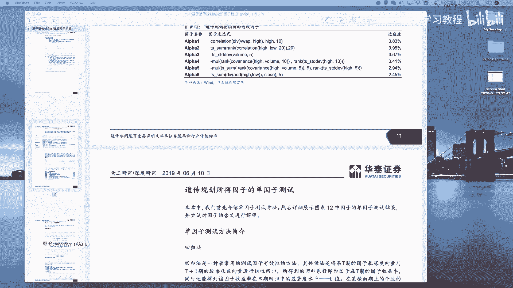

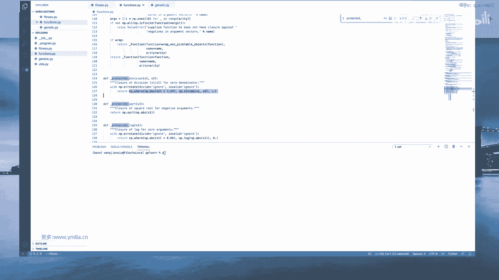

哎hello，对啊刚刚有同学提到，就是说我们那个因子评价指标对，其实我还是说就是我之前嗯，我因为我对股票这块其实不是特别熟悉，然后我自己去研究股票的话，我主要看的还是IIC跟IR。

然后一般我自己的经验来说是呃，如果是算IC的话，可能0。05以上的IIC，就是呃我会去人把这个因子纳入去考虑了，然后对，然后IR的话，因为是衡量，其实是衡量是IC的这样一个稳定性。

对主要我还是去衡量IIC跟IR，因为嗯对，就是包括其实我们刚才提到说一个是看IC，然后还有一个看i c decay，就是说我以我得到了一个IIC之后，然后我观察这个整人因。

整个IIC就是他的呃因子的IIC，在历史上的这样一个表现对。

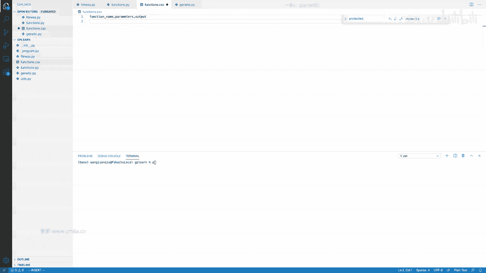

然后因为这边这个研报里面提到的是，就是说他这是20天对，但我们刚刚提到说上一节课帮我们讲的是，我们讲的是短周期的这样一个策略，那其实是说我们每天都可以得到一个，因子的这样一个S值，然后我然后我可以去啊。

把历史上的这样一个IC值给prod出来对，然后这样子的话，你应该就能得到一个就是呃，因子的这样一个爱情的这样一个表现，然后但是然后其实然后然后这边他这边做的是，他把他是把啊累积的。

就是cumulative这样一个IC值给把它给画出来，然后你可以看出IC值什么时候，就是说是在哪一段时间又平缓，然后在哪段时间是啊有向上嗯，一般来说我们期望看到的是S1，相对来说是一直是比较稳定。

但是说比如说但是I7，在如果是真正实际交易过程当中，你看从12年到15年，差不多有S14年吧，至少有两年的平台期，那这部分的时候，可能不同人就会有不同的选择了，对因为很有可能说这个因子一直不挣钱的话。

就IC1就是对最近的就说明最近的AC都是零，那这个因子可能这这对我来说是完全没有用的，那那那我在这段时间你就要考虑，是不是呃我就要把这个因子给停掉，事实上就是说嗯，自己得有一个机制去每天动态的。

不管是用机器去筛选，还是说是我隔一段时间去重新评估，我现有的这些因子的ISERR值对，总归是得定期的去有一套方法去评估这些因子，然后去决定我接下来的模型，每天是纳入什么样的因子对。

所以之前我们是说从选股，我把从选股转化成了去选因子对，就是说我们接下来，也就是说主要的问题是说是去一个，一个是去挖掘因子，第二个就是说我是去怎么去评估这个因子，那简单来说就是这张图。

就是像这样的一个IIC的图，我事实上是所有的因子我每天都应该去做的，就我们之前在交易的过程当中是看，就是呃除了说是说我每天要发每天交易报告，那事实上我同时收盘之后是需要去做回测。

把最新的这些因子的IIC的值，都要全部去破出来，一天一天的不断去累积数据，相应的数据也要去录到数据库里，对这样子来说的话，从长期来说就说你就会有了这样一个呃，有了这样一个例呃。

就是IIC值的真实的这样一个表现，对嗯，可能就是说，一般来说是说真实在业界里面拿到的时候，我可能说是比如说我们从16年一五年开始，16年开始交易股票，那前面这些数据是前半段是我的回撤。

然后后面后半段如果是开始交易的话，你就要是真实的就是去拿每天的数据去定，定定期的去啊去增加对，然后还有一个trick，就是说呃对，就是我们之前在算换手的时候，算是用close price来做嗯。

当然股票你也可以考虑用close price来做嗯，那因为是日级别的话，其实是可以考虑就是用我们之前说到的VIEWP，就是用呃volume rated average price这样去做。

可能可能这样效果可能会有不一样对，因为收盘的时候可能比较讨厌那种，白天一直走的还挺好，然后到下午02：30，突然一个就是快速放量下跌，对，所以可能用view来说，可能会比就是简单的用close会好一些。

对对嗯对，然后呃刚刚不是发了是一篇嘛，然后嗯第二篇研报上哎哎抱歉嗯，就是说第二篇研报里面，其实刚刚我们就是提到了，说是就是说一个就是说呃适应的指标是什么，他这边刚他刚刚用的是rank i c。

然后他这边说你可以提到了啊，这两个哦，这两个这个我还不知道是什么东西对，那这这个是就是说你一个是预测方向，这样一个改变对，然后还有一个就是我们提到就是过拟合，然后就是cross validation。

这个事实上是非常标准的操作对，也应该是去是去做这样的事情，对呃然后呃非线性非线性因子的话，嗯可以对他这边提到是用呃积极学习模型，对xx boots对也可以，然后包括说有人是不是说用神经网络。

就是把神经网络，我如果是用多层的深度神经网络，我是把最后的几层给stack起来对，而不是单呃，这也可以说用神经网络预测值来去做，对这些都就是说我我我的意思是说，其实这些大家都可以就是去尝试。

然后我们提到的只是说从这样一个最简单的，这样一个框架，包括就是说像这两种方法，我自己是嗯没有去使用，就是用多项式就是拟合根三次方回回归差法，这也是我在研报里面第一次看到对。

然后咳嗯主要是就说是这些效果好不好，那可能就是我现在如果同学们问，我肯定也不是特别知道对，那可能真的得是自己去就是自己去做实验，然后才能才能去知道这样子是不是可行的对，因为就单纯来看就这样一个呃对啊。

我不知道这样子，怎么怎么就不知道他为什么要去work，为什么播对吧，然后对这个大家可以就是自己去看，我只是把这个研报就是分享给大家去看，然后这这这个是一般来说，我觉得还是是可以去采用的，对嗯嗯。

然后的话呃，那大家现在就是对这块没什么问题呢。

然后呃我们来简单的看一下，就是我们自己如果要去做这样的系统的话，就是除了说用他的这样一些框架之后，我们可以自己去简单的搭设，搭起来这样一个系统，就是其实其实刚刚就是给大家看到。

就是他的我把他那个包拿下来看了，总共就是四个核心的文件，一个是计算呃，呃就是你计算就是这样一个fitness对，然然后刚刚说的就是你的function，然后我也不知道规律，Is better。

就是这个这个东西，应该是不是算出来的值会更好吧，对然后然后他其实对一个，然后这里面有一些就是person跟SPIRMAN，这两个相关系数，然后它最主要的应该是在我记得是在这个里面。

对这个里面就是我们调用这个SPOTICPROGREER，到底怎么去把它。

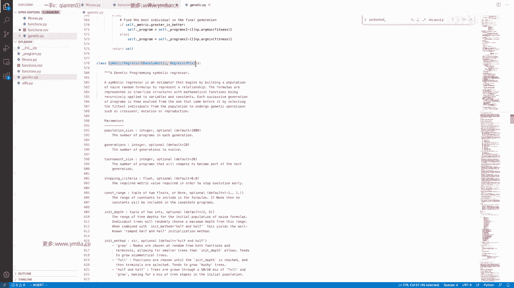

就是去根据我们的就是这边的，input值去做这样一个东西对，就这边给了一些参数，然后其实然后我给到了我们要用的那些呃，function set对，也就是说我们要用的哪些集合。

然后输入我们的就是我们这边的，这边是boston data的这feature值，我们这边输进去的可能就是那个我们的因子值，那当然我没，我没有看到这个data到底是多少维度的啊，但是我们我是想说。

就是说我们自己才去做的时候，那可能呃呃你可以去这么做了，你可以就是直接用他的包对，然后哦把我们的一些因子就打包一起算进去，然后让按照这个按照他的function set里面去做。

然后你也可以就是说你如果说呃想要知道，就是说我因子到底是怎么来的话，你也可以说是呃。

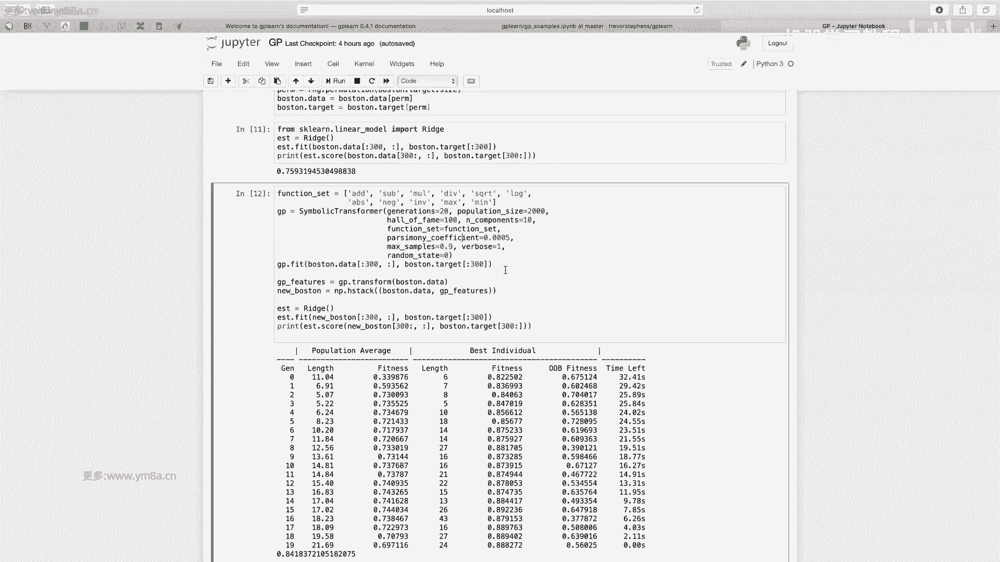

我需要清楚的去track，我每一步因子做到了什么样的事情，呃，就像我们之前他这边提到的，比如说我希望额，我在合成的时候知道我因子的这样一些公式，对就是刚刚提到的是对，我希望知道我每一步是用什么样的算符。

那我们其实也可以自己简单的去搭这样一个，就这样一个小小的这样一个框架，对我不确定他这个GP，就因为这个这个包我们没有用过，就是g p learn这个包呃。

里面能不能就是能够去导出我的因子，每一步是用到了哪些operator。

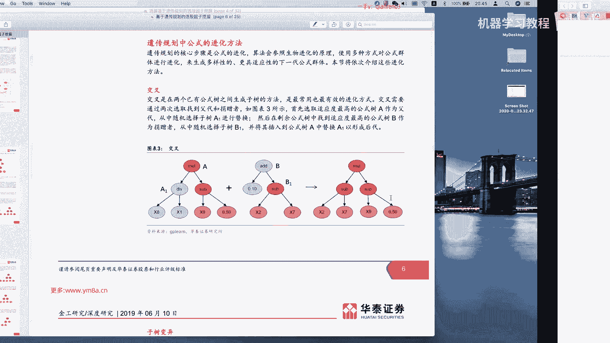

我我个人直觉应该是可以的，但是我没有细看，然后如果哪位同学课后可以看完之后，可以告诉我，就是说我希望就是说除了我算出我的feature，我还希望知道他是啊每一步是用到了哪些feature，就是哪些算符。

对咳对我行，这个这个就是哪位同学，如果就是也看完这个代码，可以跟我说说一下对，因为我们自己，我自我们之前自己写的这样一个框架里面，其实就是嗯没有它这样就是这么系统，或者说是复杂吧。

但是也会有相对一些比较优势对，然后呃可以告诉就是跟同学们来看一看，就说我们自己如果要这么写的话，到底该怎么去做，然后大家看到这个里面是一个这个，我给了一个CSV文件，然后的话嗯。

然后这个里面其实就要考虑是说我们自己再去，就是嗯再去做的时候到底要去做什么样的事情，那其实大家想一下，就是说，其实我们再去自己去设计一个因子的时候，那么其实说我需要知道的是这个因子呃，它叫什么名字。

那肯定比如说第一个是呃absolute绝对值，这就是就是我们这个那顾名思义它是绝对值，那我们需要知道这个因子的这个parameter，你可以理解为是input或者是对，就是我需要的一些参数。

比如说我这边输入的是一个data frame，嗯其实是一个嗯，比如说是3000只股票，然后对就是一个他所有的就是呃，如果我是一天的数据，就是一个vector，如果是我多日的这样一个数据的话。

那是一个那个呃matrix，因为我这边我统一假设，我输入的都是一个data frame，那我这边那输出的也应该是一个data frame，然后比如说我这边用的是log。

那这边也可以是data frame和data frame，然后那比如说我这边要考虑的就是说呃，time series mean time serime的时候，那这个时候就要考虑，就是说sorry。

就我们这个意思是说，我希望取的是每一只股票在过去N天之内的呃，这样一个时间序列上的就是一个最低点啊啊sorry，这个这个时候我我应该说是说，我的输入是一个data frame。

我这个data frame可能是说是我的一些，比如说是我的close price特征，那我也有可能是经过其他一些算符，得到一些新的因子值，我不知道，可能是比如说是log log close。

或者是说是view up除以我们的daily high，得到这样一个，比如这这样得到这样一个data frame，然后我要再去取他的，就是一个看其他的这样一个值。

那这个时候其实就这个这个时候就要去考虑的，就是说我呃这边说，我除了需要的是我的这样一个data frame，就是我我需要的是是一个data frame，我还需要知道我的第二个parameter。

是我到底取向前取多少个周期，那在这股票里面，我这边学的是天，所以我这边说我会加第二个parameter是呃是N，然后那我这个时候输入的是什么，输出的是什么呢，显然说我输出的是每只股票呃。

给我了一个新的feature，然后算出TS命，那还是一个data frame呀，然后对这个的话就是呃咳咳，比如说我还有一个就是简单的，我们刚刚说的delay，就是说我希望把我的呃这样一个因子的话。

是过了，比如说我就对我预测的值，不是不是不是今天，就是不是今天就是立刻去交易，而是过几天去交易，那这个时候我就要考虑的是呃，我输入了我还是要加一个parameter，我到底是delay多少。

delay多少个周期去进行交易，我输出的还是一个data frame，那你可以理解为就是把它简单理解为一个shift对，就是我们在pandas里面做了一个shift，然后这边只是举了很多很多这样一个呃。

只是举了这样几个例子，那事实上就是你这个基础的这样库，你可以加很多，然后呃呃除了这个我们刚刚就是percent change对吧，percent change我需要的是呃咳data frame对。

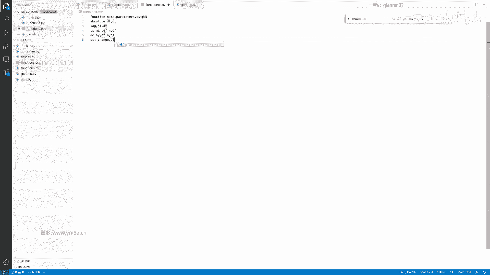

就是那这个时候就要就是回到paper里面看一下，就是比如我看下他用的是什么吧，sorry不是这边。

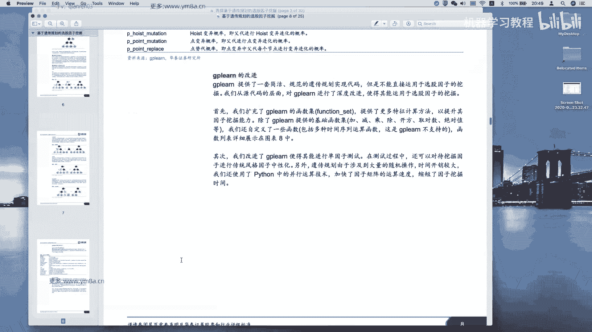

嗯它没有percent change啊，Whatever，这个是，这里可以我们再加一个吧，比如是，嗯如果是我刚刚看了看的是correlation对吧，呃D天不不不不，这个是D天xi值和Y值构成的。

那这个时候我们就要考虑的是correlation，然后这边是input，主语是什么，是两个data frame或者是两个time series对吧，然后那这个时候我们可能要区分一下。

df one和df two，然后这个时候还有一个，就是你的这样一个D到底参数是多少对吧，然后那我输出是什么，是一个correlation对，所以说我首先需要有这样的一个这样一个table。

或者CSU软件，就告诉我说我每一个funk要去做什么样的事情，对吧，呃这步大家能够去明白吗，就是说我我我我，因为我接下来要做的操作是事实，是我要去读取我这个table。

我接下来要做的操操作是我假设我这边有啊，找f one啊，f two我自己认为的定义了，然后一直到到到到一直到来看f one hundred，我有100个这样的一个呃operator。

然后我也知道就是说它是什么东西，那接下来要做的事情，就是说我每次要去从这个里面去random的，去随机去选取，然后选取完之后，然后我要再去去evaluate对，就是去evaluate我这样的一个呃。

新得到它这样一个新的值对吧，就是把上一步的输入，然后去按照这个operator去evaluate对，那接下来要做的事情，就是说我对应的每这样一个方程，我实际上都要去呃，我都要去写一个class。

然后也就是把一个class里面容纳这么多function，去告诉他，就是呃，嗯去告诉他就是怎么去诶怎么去怎么去做对，就这个我先把它放在右边，然后我们来看就是。

然后这个时候嗯他这边已经有function y了，那我就叫那个叫operator，那我这个时候还是可以把它去，我把这叫class function，然后然后这个时候如果说我要去调用absolute。

对吧，然后这要是参考他的input是什么，它的input是一个data frame，然后这个时候我return是什么，return是也是一个data frame的absolute value对吧。

我直接就是比如说这个里面就说我写成data frame，我全部用data frame在内存中调用，显然一个优势是我写起来会比较方便，但另外一个问题就是说内存会比较大。

所以这里面是有一个trade off，我开发起来可能很快，但是我运行起来的时候，里面都是data frame在传来传去，显然是没有原声的，呃我甚至不是，我甚至夸张一点，我不用number派对。

我直接用list，用Python的list来去做，那这样子的话呃，内存占用肯定是小的，但是那那那那就算这个absolute value的话，我们可能都需要自己去。

就是我这边如果input就是传传传进去了呃，整个在memory过程当中不是一个data frame，而是一个vector的话，那我可能都需要就是自己去实现absolute，这样一个函数对吧。

那我可能需要一个就你需要去return list遍历每个list，然后让list每个元素取，如果大于零是N，然后取它的就是绝对值对嗯嗯这个是trade off，就是大家可以自己去看，然后如果说咳咳。

然后甚至就是说我这个还算好的，这是最简单的，那如果说是这边有一个呃correlation的话，那这个这部分可能那就是大家要想的话，就是到底怎么去怎么来去做这样correlation，如果说是呃。

如果是他是一个，然后你还有一个N的这样一个parameter，那如果是不是data frame的话，而是两个vector，那可能大家就得自己去实现，算这个呃块类型的这样一个算法，嗯然后的话就是呃嘶。

主要这个里面是就是说要注意的是，我们这个N不一定是整数哈，就是因为我就是事实上我们再回去做的时候，就是呃会写一些helped the function，就是说，额我看忘记了南派的这个是多少。

好我这里的跳入了吧，我们不用这，Ok，OK咳咳，比如说他这样的数，它是一个额应该是一个正态分布的数对，然后然后如果说想要把它去scale一下的话，我直接把它乘以一个十对，OK然后大家注意的时候。

因为我这个N可能是我得到的时候是一个呃，是一个随机数，不一定是整数，所以你在这边，就是我传进去的参数是一个随机数，那你这边肯定要去先去处理一下，先是得到一个是呃absolute n，然后要注意的是。

我要去把他去取一个呃，取个整对嗯，最后呃最好是再把它去变成int吧，对，你这样去嗯，然后你得到的是一个，比如我到底要取前面多少个D天对吧，然后要注意的是嗯。

然后这个里面嗯就是算correlation的时候，D天如果你是两天算下来没有什么意思，甚至三天也不行，然后你自己这边事实上是可以咳，这里面是有很多的操作空间，比如说当我的D小于五的时候。

我认为说只有五天内向QU瑞恩或者二吧，对如果只有2000算口原神就是只有零和一的话，我显然是就很没有意思了，对这这个就都都没法算了对吧，所以你需要这样对。

然后这个时候你再去算他的额correlation对，Correlation，然后嗯咳，然后我自己是比如说我自己会定义一个啊，rolling correlation这样一个function like。

然后我的x and y咳咳and额，我选D吧，对然后你这边可以自己去，要注意的时候，你传入的X的时候，你向最好是先看一下他的dimension，对，X点shape，嗯然后嗯RESU，number派。

three没有1put number派，这嗯，然后就是for i in range n，然后如果说这个I是小于我的额D减一的话，那你接下来就是，就是我不知道可不可以这么写呀，哦呃你会从RIJ。

这个需要dimension吗，我想一想呃，就是这这就是前面的小于你的，就是在D减一前面的口嗯，嗯就是就这个这个是什么意思，就是我需要至少地天D个数据，来算我的correlation。

那我前面的这些correlation的话，就是数据长度太小，所以我没有办法算，所以是或者直接写循环吧，RIJ这样对，就是，For j in range um，Ok，然后ELSOGONHL，你再去算的话。

然后就是我我要算的是额，我要算的是额，X的从I到，I到D，然后加一，对I减去，这样的话我得到的是时间，那就是过去第一天的这样一个，因为我算的是一个rolling的correlation嘛。

对然后对应的嗯咳咳，对，然后你这边的话就是就是告诉大家，为什么这边会去自己去，如果是自己要去做，因为嗯就是就是我在考虑后面去去优化的时候，可能我很多都不是去调用的，额都不是去调用的。

他的就是呃南派或者是他的代码，你可能会选用number a来去加速，然后这部分的话可能就得大家，就是你可能还要自己去写最底层的，比如说你的correlation到底怎么去算的。

因为因为如果你可能用了太多pandas，或者是就是一部分，中间你就是说在交互的时候，有些人可以用，但是你再去具体的算每个因子的operator值的时候，我建议大家是肯定需要去自己去写，嗯对对对。

然后嗯selected是就是因为你只有你自己，只有是自己写了之后，就是说你不要用，不要依赖到太多的，就是data frame的呃，你比如直接调用data frame correlation。

你可能就是说你再去换用那把，就是去加速的时候，你可能就不一定好去做对，所以我我这边说是就是我给大家写一个例子，大家就是说我们怎么是去自己算对，主要主要其实这个也没有什么难的啦。

就是你可能嗯有时候你可能算A算了一半，怎么算符，算不下去了，对你本质上其实是说你主要要处理一些因子的，有没有N的值，有没有有没有一些对，有没有一些特殊的情况，然后，嗯然后本质上就是去呃。

本质上本质上就是去自己去写一遍这些东西，因为呃就是我不太知道，就是你换了一个就是number板加速的时候，它底层是对Python应该是就是会去做一些加速，额不再是单纯的就是我我们正常用的是con吧。

对然后他底下肯定是底层换掉之后，那可能有一些是会去快一些对，那其实大家看到就是这部分的话，呃，如果有可能我我我个人直觉是就是用C加加写，会比用Python写可能会好一些。

但是但是C加加写的话就是比较麻烦的地方，你可能数据的交互处理起来会比较坑，对嗯要用用Python写的话，就是嗯数据就是不管是我去读啊，CSV数据啊还是什么的，可能会好一些，但是但是这部分的话。

就是我再去拿这些算符去算新的因子的时候，可能接下来就是会有一些麻烦，对，嗯OK嗯这然后对，如果这个是小于一的话，直接返回空的值就好了，然后如果是其他的话，额就是算均值对吧，X uselected。

我给他一个新的值吧，就是大家看到就是说不要忘记，我们到底在做什么事情啊，我们是在算这个correlation，但是这部分的时候就说，可能很多的底层的东西都是自己要去写的，对嗯嗯，等后。

这部分就是我这部分是把数据给过滤掉了，两个当中任意有一个是空值的话，我都不选对，不然口类选项是没法算嗯，然后嗯然后我要算correlation的话，额是怎么去算嘞，额就是，先是算MX对吧。

X这个就是那就算他均值了，max嗯嗯呃x mu x是，其实大家可以之后就明白，为什么我要先去算均值，对，还是有一些考虑的，然后YU我问大家一个问题，就是我把X1和X2，它两个数据比如说同时乘以二。

那他的correlation会怎么变化啊，Sorry，不是N对，大家可以想一想啊，就是说correlation x和Y是等于0。5，那么correlation2X和2Y是多少，然后，奇怪了等于没。

For i in range a，哎sorry，我这个是不是没错对，Range n，然后嗯，XY是，呃就是x mu，Sorry，是不是x mu了，是new x第I个元素，我去减去u l x mu。

然后是假的去，对吧，就是correlation这样一个，6y n h y6，然后然后注意的是，我需要是除以呃，除以N减一啊对这样是我这样是算的，就是，这应该叫COVARI，对，对然后我注意的是。

我要算的是rolling的这样一个呃，Correlation，然后我这边有的话是嗯，然后我这边不是算下来了，算到了这样的，我只要把我的result i j把它复制过来对吧，这样就OK了。

我最后再把我的这样一个，return的result我就能算到，就是呃我的这样，对这样应该没错了哈，哎我这边是不是好像等一下啊，好像好像搞错了，我这边要算的是我这边算的是我要算的是啊。

rolling这样一个correlation，对我要算rolling的correlation，我上面算成了呃correlation，对我这边我这边算的呃，对这边有问题，算的是我先把他取完名之后。

对大家最有什么错，要提醒我哈，我算的是对呃，这我算的这个只是一个，我要算的是嗯，我要算的是correlation，不能只是这边算，这边还要的是rolling correlation。

就不能仅仅是还有那个还得把，这个等于平方，然后同样的sorry，这部分对，然后COVERANCE是有了，然后我要返回的是嗯，返回的是这样，我要算的是correlation，所以就应该是拿它去呃。

number派dot s q RT就是correlation，是呃various x乘以VXY对吧，这不这这样应该是没有问题了吧，OK就是从回到这下面来看。

就是我要去算这样的一个呃correlation的话，我先要把我先给到这样一个呃，然后接下来我要去做的话就比较好做，我直接是return呃，Row in correlation。

咳咳read return rolling correlation，然后DF1DF2，然后D这样就OK了，对然后实际上就是说这样的话你就是去完成了。

就是说我如果输入两个time series或者是data frame，你就可以去把它算出，根据这个operator到底算出是什么样的东西了，但是这里面还是差一步，就是就是如果我慢慢的去算下去之后啊。

呃就是我算完之后，我可能值会不会，就是说我每一步如果不去控制的话，他可能会比较麻，就是比较或会值会变得很大，但是所以所有这边要做的，其实每一步你要做的事情是。

就是呃你需要把你算出来的值去standardize，就把它去变成标准化对，然后这个时候的话嗯嗯你要去做标准化的，还是老套路嗯，获取dimension，然后对，然然后你这边就是做完之后呢。

其实是你再去standard dise这样一个值就OK了，对那standardize的话，你要做的话对sheep，然后还是先把它empty，然后嗯嗯in range只有这一部分，可能没有很多的向量化。

让我想想可不可以向量化，可能可能还没不太行，因为你每一步都要去掉这样一个，还要去判断嗯，然后呃然后还是一样的，就是你这个时候咳，还是要把它叫new x吧，我每次选择这样1K new x，然后你要去。

嗯你要去选取他，sorry不是应该是，还有就是每一步你可能都要去注去处理，把里面的N值给去掉，然后你去再把它override对，然后呃做完这个之后呢，你就是说，额标准化的话还是就是标准化。

标准化的意思就是说我要去算计他的兵均值，然后再去除以它的呃就是标准差对，然后然后拿我这样的一个，就就是我们之前所所说的就是因子呃，标准化的这样一个步骤，然后但是我们在我把这个步骤是融合到了。

就是说呃整个的呃，因子生成的这样一个流程当中，对啊，这部分的话，OK我还是给大家写一个完整的例子吧，对然后还是一样的，要去判断，就是额这样的话好lets，如果这个东西长度小于等于一，你直接，J，灯牌。

我这个的话你就返回N值，因为注意我们我们在每一步计算过程中，可能会去返回NNN值，所以所以就是我们自己在处理的时候，也需要把这部分代码给去处理掉，对，OK然后else这本跟上面是有点像啊。

然后这部分你要返回的是new x divide by，然后就Z27，等于零，然后你要对，I我刚有了I让我换一个吧，In range，这还不能用ranch，因为我下面才是那个不能乱用，这样子嘶。

这个时候不是，这时候range不是M，我还是对呃，对new x当中的每个元素去啊，算他的VARI，然后，XK减去六，然后注意的是，SQRT呃，VARI对吧，然后我除注意这边还要再除以一个。

呃X的长度减一对，这个不要忘了，OK然后你得到了每一行的就是哦，我得到对于new x每一个当中的话，我得到了他的这样一个标准差之后，这一部分是让我想想，这应该是M对每一列你要做的事情是嗯，还是要去判断。

呃让我想一想，这边可能还不能那么做，因为，对我还是得去看，我把这个叫new x2，因为我这个new x之后这边还要用到，对不然就是数据长度就不对了，对这样数据长度就不对了，嗯对。

对我这边时候会用到这样的，这边的X，然后，我要去判断，因为这这个这个这个时候就是说咳new new x当中，每一个就是呃这个数据长度是一样的，对，老规矩把它翻译成none，对，就是这部分代码是需要大家。

就是自己写的时候要去，可能刚开始你不一定能把每一个点都考虑到，但是就是就没有问题啊，就是你在测试的过程当中，你你发现就是哪一步你肯定可能错了，然后有哪些边界条件没有考的，考虑到的话。

那这部分都是可以去去再去进行修改的，对然后这个时候就可以用减去mu对，就因为因为我们上次在学，在上面去算mu和西格玛的时候，是要把N值给考虑到的考虑去除掉，但是你在下面的时候。

就是就是如果对这部分就是提醒大家，就特别注意一下吧，对然后这样子的话呃，这样一个correlation的这样一个类就写完了，然后回顾一下就是它的流程。

就是说呃你需要自己就是去定义好这样的function，里面到底你想要去做什么对，然后的话然后的话你要的，然后你接下来要去去，就是说是去把这样的function去给他去呃。

写好我怎么我接下来就是说我只要call到这个function，我知道怎么去调用额，然后的话就是呃，然后其实接下来的步骤，应该就是说是去怎么把数据给他，去给它整合起来，对咳嗯嗯OK让我想一下。

这边对这这部分大家明白，就是我我是在做什么样的事情吗，对就是说本质上说这边是他这边呃，在gp learn里面，它也会提供了一系列的operator wheror function。

就是我不知道他这边具体的，对他这边是提供了这样一系列方，然后他这他这个讨巧的一个地方，在于他是他全部是用long派的这样一呃，或者大部分是用long派对，然后那个这样可能算起来就比较快。

然后SIG格MOID的话也是呃，也是OK对，然后然后他接下来再去算具体的去调用，比如说我去算这样一个ADD的，这样一个函数的时候，它就会去调呃，就是你你只要是去是ADD。

我就会去call ADD to这样一个东西，然后他就会去调function这样一个呃，生成这样一个function的这样一个呃，那卡那就是这样的一个instance，然后然后你再去看一下方程。

这样一个instance就是这样一个东西，然后你然后你每次去call到这，call到这样一个呃function function的instance，本质上是他这个时候他就会去。

他做了一个比较讨讨巧的地方，他就直接把self点function NO，然后我们刚刚说了，比如说我这边的是ADD的话，那这边他这边就会把self dot function替换成N派ADD。

然后star arguments，你再把你的就是你的你下面的arguments是呃，是什么，是1name是ADD，然后number of parameters应该是两个对。

这个时候就是你这边就是说你需要ADD的话，是需要两个呃呃parameter，然后的话然后哎然后对你这边应该呃arguments，然后你这个时候，如果你这边传入的是两个vector的话。

你就会把你这边实际上就是进行的是群N派点，ADD这样两个，然后把两个vector给传进去，那其实对于我们自己要去写这样的方式啊，其实呃思路是类似的对，就你本质上来说。

我要去靠这样的一个correlation的话，那这个时候你要去把整个的都去给算好，对，然只不过说我们这边是，就是他这边没有没有没有去写，就是时间序列去怎么算，然后我们这边是给了一个。

就是说是怎么去计算时间序列这样一个例子，其实仅仅是说自己大家在处理数据的时候，是需要去细心一点，然后这边的data frame其实就是不管是呃，都是我们之前就是给到的market data。

跟我们的就是基本面的上数据，所以整个是无缝是可以去衔接起来的，咳你到时候只要去把那个data frame给load进来，然后很多接下来就可以去做这样的事情，对，然后呃。

只不过还有一部分就是我自己其实还没有做完，就是说是去去做股票的回测，对这部分的话，之前是在公司直接调别人写好的接口，但是现在自己这部还没有完成，可能就需要大家自己去把股票的回撤，给做起来了。

但是但是但是反正原理是跟之前一样的，就是本质上还是是就是从呃，就是如果我们回到第四课还是第五课吧，就是就是把你的是position跟你的price去进行一个，就是相当于一个shift这样一个操作。

你只要知道股票每天的position，然后知道股票每天的价格，你就可以去算他的绩效，然后唯一一个要变化的是，我们之前用的都是close price嘛，那这个时候你可能就把close换成第二天的呃。

Volume waited，就是view up the price，然后这个价格是事实上也是给大家给到的，就是在数据里面是有的，所以我觉得这部分是不困难的，对对嗯对，然后其实嗯对。

这部分就是我给大家给到的是一个，就是怎么去计算一个时间序列这样一个项诶，Example，看完这个之后，就是说如果说我接下来还要去算其他的嗯，这样的一种不管是你自己新加这些因子的话。

应该大家都有能力去进行，就是自己去实践的去算对呃，当当然就说你可能看我写的觉得还挺简单的，但是肯定自己写下来的时候呃，我估计多多少少还是会遇到一点坑吧，但是我也不可能说是穷尽的。

把每一个遇到的都给大家写出来，但是就是大家可以就是我我我我，我的建议还是说从最简单的自己动手先写一写，然后然后再去慢慢算复杂的correlation，我觉得已经算是相对来说，用到比较复杂的一些东西了。

对然后sorry，这边也要去做，其实其实整个就是我觉得浪汉里面也没有什么，特别说特别难的什么东西，甚至有人会说，就是因为你如果只是是拿它把它作为你的工具，你不需要知道背后特别复杂原理的话。

我个人觉得不是特别难的，但是如果你要涉及到就是去改善工具的话，比如说那可能还是得花一点功夫对，当然我觉得都是都是可以去学的，大家所以嗯就是还是还是说呃有一定的理论性。

但更多的是需要大家在实践当中去总结的，尤其尤其是做跳筛因子这个事情，我个人觉得是个苦力活哈，嗯对人机械机器人是能杀一部分，但可能更多的时候自己还也要去做，这两部分是补充起来的。

对对所以好这部分大家就是还有什么问题吗，因为这个是补充，就是说华泰里面提到的，说如果是时间序列的话，你自己需要怎么去修改，咳咳阿sir，嗓子最近不是很舒服，大家有什么问题吗，嗯没有什么问题的话。

我们休息15分钟之后，然后再继续，嗯就是啊说correlation，为什么要在-1~1之间咳好这个好，这个确实是没有必要哈，额让我想一想啊，呃standardize的话，这个是没有必要。

但是这个是不是可以去掉，想一下嗯，嗯这个问题好问题，我想一下，可能我之前是不是都多考虑的，确实好像是不是特别有必要，Ok，嗯然后可以测一下，就是去不去掉，有没有什么影响呃，因为我就是说是这样的。

就是说即使说是我想了一个问题，就是说嗯即使说是说是-1~1之间，但它并不意味着就是一个呃，就是它的均值不一定是零啊对吧，就是我correlation，我可能比如说我所有的这样一个因子的。

Correlation，假设假设比如说我都是0。5，那我算下来就是都是在0。5附近的话，但是我经过标准化之后，是把它变成在零附近的对，所以我觉得可能还是加这样一部会比较好一点，我个人直觉就是。

我希望我每一步做完因子日之后，就是都把它去呃去把它去，就是呃都把它做就做做成一个标准化的吧，对，嗯我不知道这个这个OK你觉得对，这当然你可以测一下，对我，我想起来。

当时当时还是还是还还是加了这样一个步骤，没没有说直接把它去掉，嗯好那大家先休息一下，我也喝口水。

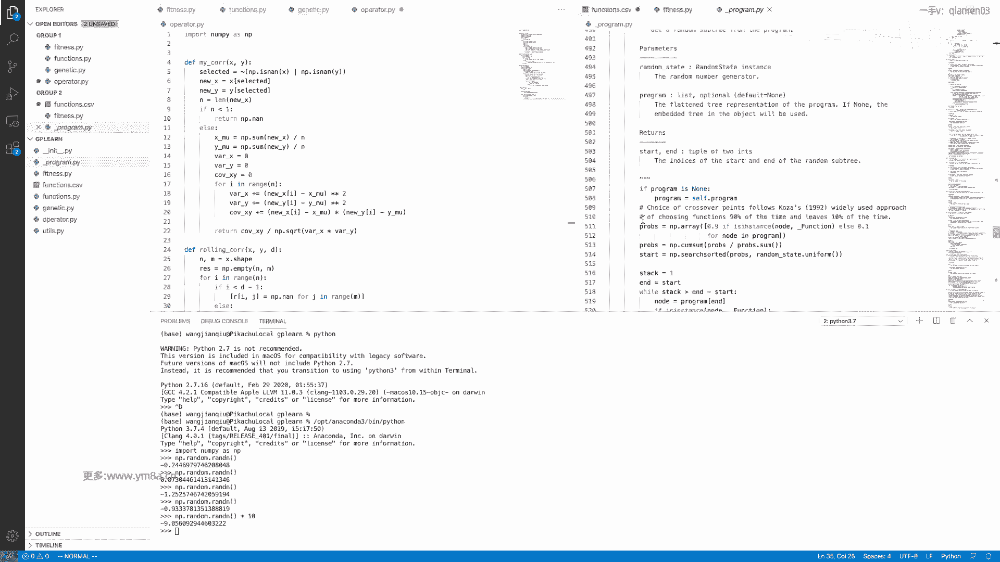

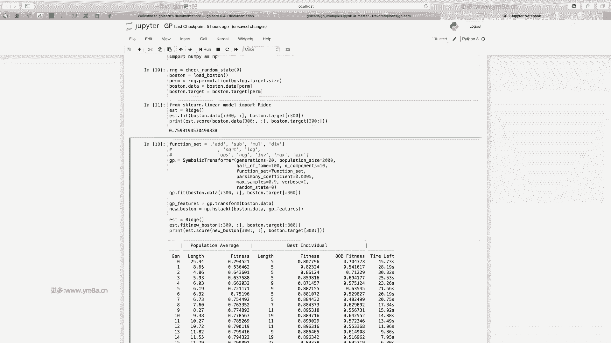

嗯OK诶我们现在回来对，然后刚刚讲的，就是说我们这节课就把整个流程给finish，就是其实整个流程也很简单啊，就是第一步呢就是说哦，就是刚刚给到了一个例子，是说我们怎么去啊。

拿过来就是说是去算呃这样的一个因子，然后之后的话呃其实我可以给到大家一些，就是包括华泰的那些因子，就是大家都应该就是时间序列的，或者什么的因子，都应该是去把它在这个function里面去实现。

然后实现完之后呢，其实我们刚刚做的就是说evaluate这一步，就是说呃在接下来这样一步的话，其实说我们刚开始，我们实际上说在去做的事情的时候，我们假设这边是呃，你假设这边有100个的时候对吧。

那其实每一个你要做的事情就是说是去嗯啊，就是要去随机的去，选取我这里面的任意一个function，作为我的一个初始的这样一个C，就是说我就是说这个这个意思是说，是我在一个循环过程当中要去做的事情嗯。

我会随机的去选取这样这样这样的一个呃，比如说我选完了这个之后，我选完这个之后呢，你需要的就是说我不是有了这样的呃，这样的字典吗，就是有了这样一行吗，那其实你要去要做的事情。

其实是你要有呃写这样一个写一个function，就是这个这个应该是在你要去啊，你要去写一个东西叫generate formula，就这这个事情能做成什么意思呢，就是说如果我这就是我选择了。

比如说我这个index选择的是第五个呃，你你你得到的return是应该是一个，你应该是能够得到的是一个correlation，d f one dot d f two dot n这样一个东西。

你接着说你应该得到的是这样一个公式，你得到的是这样一个字符串，这这个其实其实你要做的事情，就是一个字符串解析嘛，就是啊你每就是it os，你你选的选中这一行，然后你你把这样的一个分隔符。

你我这边是用的是竖线，你可以用空格，或者对或者是任意你想要的分隔符都OK，然后你只是spit by，这样你的你自己的分隔符把它分割完之后，然后你再用逗号把它给drawing起来。

其实你就可以得到我们这样的一个公式了对吧，这个时候你可以得到这样一个公式对，其实你你得到的是一个这样一个字符串，然后你再去把它evaluate一下就行了，就是或者这样讲有点抽象的话。

let's say嗯，我不知道这个可不可以啊，对吧，其实其实你要做的事情就是evaluate，这样一个，就是把你就是你你需要去调用这样一个function。

你需要去计算correlation df一点DF2，然后这个N然后当然你传进去的时候，就说这个这里面所有的参数都是你，你要是就是你要预先先准备好对吧，DF1是什么，DF2是什么，然后你的N是什么。

对呃这个就是你得到了之后，就说你要去靠你的相应的function，去把它就是evaluate对，然后然后我刚刚还忘记了讲一个是啊，我刚刚这边这边这边我看到有有一个是either。

either是什么意思嘞，就说我这边可能是一个data frame，也有可能是一个number，那这个时候怎么办呢，你需要去呃，就是说我这个是都可以的话，那这个时候你相当于说。

你你扔一个binary的随机变量，二元的随机变量如果是零的话，你选的是DF，如果是一的话，你选的是一个number，对呃，这个这个是相当于说，你我在因子生成过程当中呃。

就是从第一步生成这样function过程当中，我又又引入了这样一个随机的这样一个值，对这个是一个小的trick，你也可以说是嗯，你你相当于说比如说你是呃F11的话，你你也可以说把这个东西拆成两个。

但是要注意的时候呃，这样子的概率分布是不一样的对吧，因为你一个是在这个里面是随机选，然后随机选之后，整个大类是就是是这样一个概率，然后你再除以二，但是如果你把两个并列的话。

相当于说你会增加到选择到这个funk，这样一个权重呃，你自己可以试一下，就是这两这两种方式，在随机选的时候有什么区别，然后然后然后你不是算完了这样一个evaluate。

我们我们就可以去evaluate这样一个formula，Evaluate，这样formula之后啊，就是这个是相当于说是相当于说是call我们的，functions of funk对吧，各种各样的函数。

然后咳然后然后就要要做的事情，就是说你要去判断，说我这个因子到底要不要去选的时候，这个时候一般来说是首先是啊，就简单的检查一下他是不是那算出来值对不对，有没有none还是全是零，全是空。

这种情况下把它去掉去掉，然后第二个是啊，这个因子是不是如果如果说一不小心算完之后，比如说A加B算盘，就跟我们现有的因子库其实已经重合了，而这这个时候你需要的是就是去，当然这边就这里面就工作比较多了。

你需要是呃，你需要用一个dict或者是什么样的数据结构，来去啊啊来去就是保存你现有这样一些因子对，然后咳就这个这个事情，其实你就是在整个事情刚开始的时候，过程当中啊，你就已经可以去去做了对吧。

就是然后这个时候你要做的事情是啊，第一个是，check是不是effetors are ready in，如果这个已经就是我不小心算到，因子已经在里面了，那实际上我就不要保留。

第二个也是check correlation，对吧，呃这这部分就是要大家自己去判断，就是你觉得是跟现有的因子相关度是多少，比较合适，那这个取决于说呃你刚开始的时候，如果说我因子比较少。

那我这个时候有一个correlation的cut off咳，就是如果说我现在的correlation，是不是跟我的这样的一个呃，如果说是小于咳，小于小于的话，小于0。5的话，我觉得是我觉得可以保留。

然后如果是大于0。5的话，我把直接就去除这部分，这个是一个自己引入这样一个参数，在因子库比较少的时候，你可以把这个值放低呃，就是放咳，就是额哦，Sorry，不是放低一点，就是咳咳。

就是如果如果说因子很少的话，那你也就是说只有极度相关的因子，你才会排除对吧，那你create上面可以说就是cut off，你可以放大一点，但是如果说你呃，就是如果你因子已经比较多的时候。

你可以把correlation稍微去降一降，你觉得就说只有是相关度比较小的时候，你才会去把它纳入考虑，对这个是自己引入了这样一个参数，我觉得这个不是特别重要了，对呃，因为因为因为这个本质上做的事情。

只是说我筛选就是我得到这么多因子里面，我筛选我留下的这样一部分，对，其实这整个就是对整个就是这样一个流程，但是我觉得这个里面就是还缺了比较多细节，然后可能得同学们就是自己去来就是去做。

然后包括就是你得到了因子之后，就是你要去呃，calculate i c i r对，这部分可能还要然后甚至对，然后你还要就是plot。

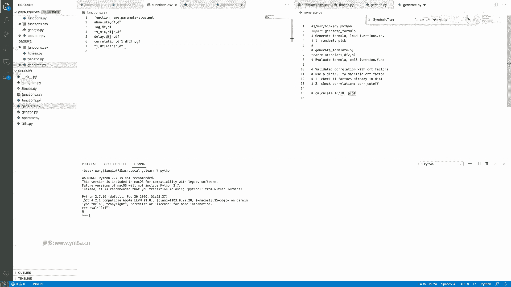

如果你可视化，你想要得到额这样的一个图像的话，是需要就是还是要去稍微要去做一些事，就是做一些代工程上的一些代码，对咳，对其实整体的流程是跟这个是差不多的，然后只不过说是他这边用的是现成的，这样一个包儿。

但是我们自己可能是就是说是去随机的，就是去pick对，然后他那边用三轮，我肯定自己做多轮，对，仅此是而已，整个整个的整个的流程就是这样对，那大家还有什么问题吗，嘟嘟对，然后呃回测，如果大家先试试看吧。

我觉得以大家能力应该是可以写出来，如果觉得有困难的话，可以我再给大家写一个示例，就下节课我们再可以补充一下这个细节，但是我觉得这个应该不难，因为因为股票相对来说有日数据，无非他就是标题会多一点嘛。

但是但相对来说就是他算起来是比较简单的对，就这套框架，其实就是说应该是现在主流，大家都会去用这样的事情，用这样的一个框架对应该用的还比较多，然后这个paper是呃什么时候的呃，119年19年对。

但事实上在这个时候，可能大家都用了已经有一段时间了，但是但还是就是我觉得还可以，就是我我我没没想到，就是说他们paper已经已经有了，对对当然这是我们自己在做的时候嗯，都可能都没有想到这么多。

理论上这样一些东西对，因为我们还是说是说我们更加关注的是，就是整个因子的质量对，嗯所以这个包我觉得还是还要对，一个是这个包了，然后还有一个是因为这个代码，就是我包括跟大家讨论，可能其他人也会发现。

就说你肯定要去。

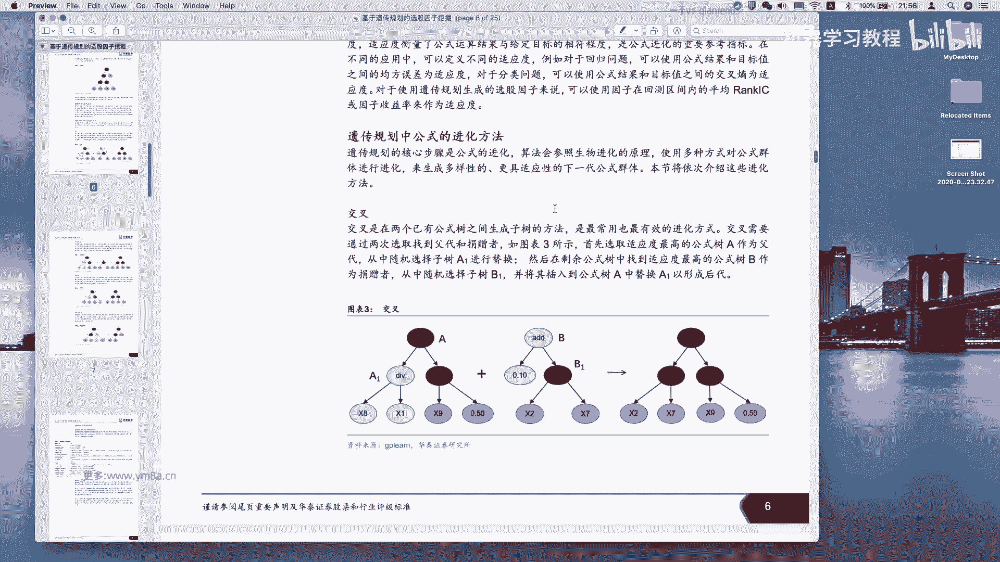

如果你要用这个包的话，你得就是去改进这个代码，然后还有一个是嗯，还有一个是叫，要是这个distributed evolutionary algo对，这是另外一个，就是咳咳，你选下来这样一个框架。

然后呃好像说有人说是这个会好一点，但是我们也也没有去都去用这个人，然后我觉得大家可以去探索一下，是不是就是这个这个是OK的对，嗯代码看起来还挺好懂的对吧，Offspring，然后mate然后变异对吧。

然后evaluate，然后呃OK然后fitness，然offspring可以看起来还是挺清楚的，然后，对这个好像是其实我们主要用它的，然后如果是genetic programming的话。

Lose retape genetiprogramming，对这个包我声明一下，就是这个包我没有用过，对它的代码会没有看对，所以呃，然后但但但是就是说有一些朋友告诉我说，这个可能比那个GPN会好一点。

所以大家可以自己去探索一下对，然后，对，反正就是就是说呃，这节课主要讲的是说是多因子选股，里面，就是大家用的业绩比较主流的这样一个，额遗传算法这样一个框架，然后大家肯定就是你可能自己去算的时候。

你因子多了之后，你可能会发现就是算力可能还是比较重要的，对自己的笔记本电脑不一定能带得动，对嗯然后包括就是但就是也可以想到，就说我是不是可以把它去换成底层的C加加，还是怎样，但当我觉得写C加加的话。

还你看这个工作量还不小，对主要是一些对，因为你涉及到时间序列的东西，再用C加加确实是会有一些麻烦吧，对，对，然后当当我觉得就是计算机背景比较好的同学，应该可能不是特别对，对于你们而言。

可能应该没有什么特别麻烦的事情对，因为我就觉得原理还是挺简单的，对呃其实本质上就是一个暴力的去挖掘，然后去评估的这样一个过程，啊然后有同学说是写rank的correlation对吧。

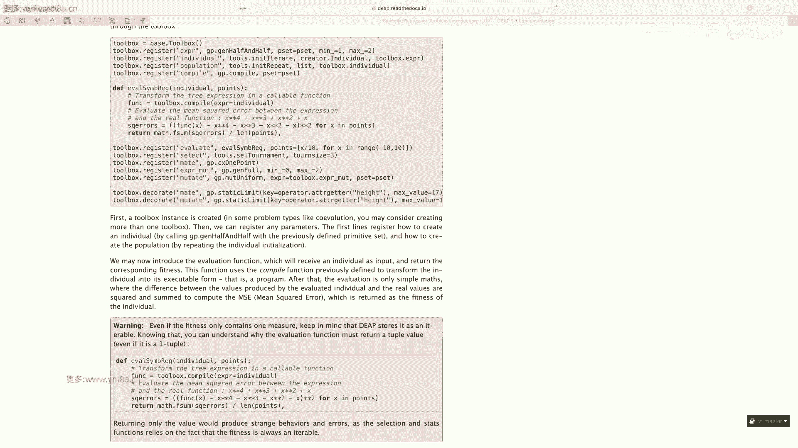

呃也是呀，就是那个我可以看看我之前怎么是写那个rank，对这些这些都是我，那我可以给大家再写一个，还有时间我给大家再写一个rank的例子吧，就是嗯，对就是，我们可能还都是都是都是，基本上都是自己去写的。

对其实写因为因为我们看一下那个rank的定义。

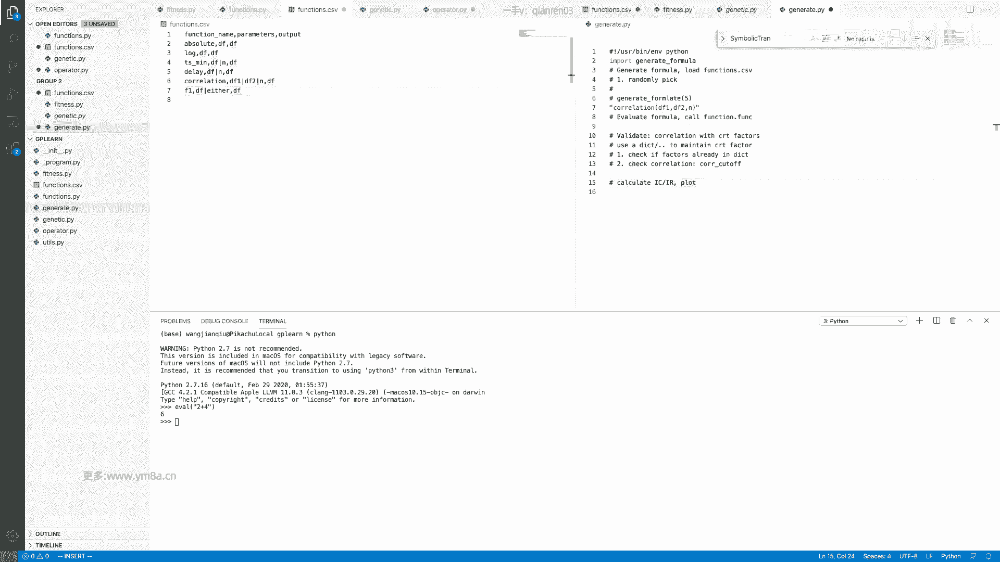

就是其实我觉得没有什么本质的区别，也rank只仅仅说是说，就是我把我的因子值换成了排序值嘛，对吧呃他这边是啊，他这边换成了他这边用的是分位数，你你你也可以就是说你就换成排序值跟分位数。

其实本质上没有特别大区别对，呃然后的话嗯嗯rank的话，比如说，对因为rank其实没有，应该不是没有什么特别大的区别哈，就是你我我直接用rank的话。

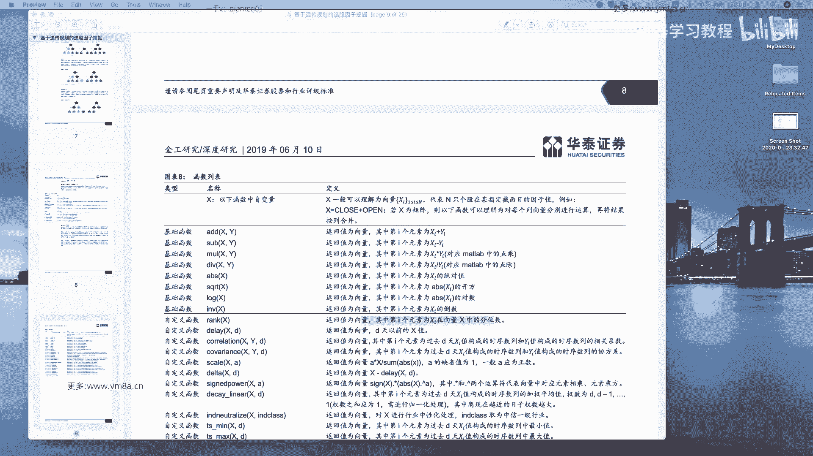

就是呃就是其其实如果我这边要用rank的话。

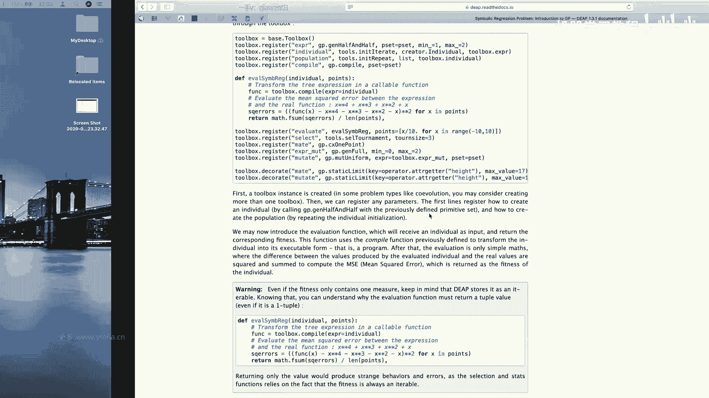

Sorry，不是这个，就是因为我要注意的是，这仅仅要注意一点，比如我这边functions呃，下一个，wk的话啊，Ok，其实你只要返回的是嗯，D f dot a rank。

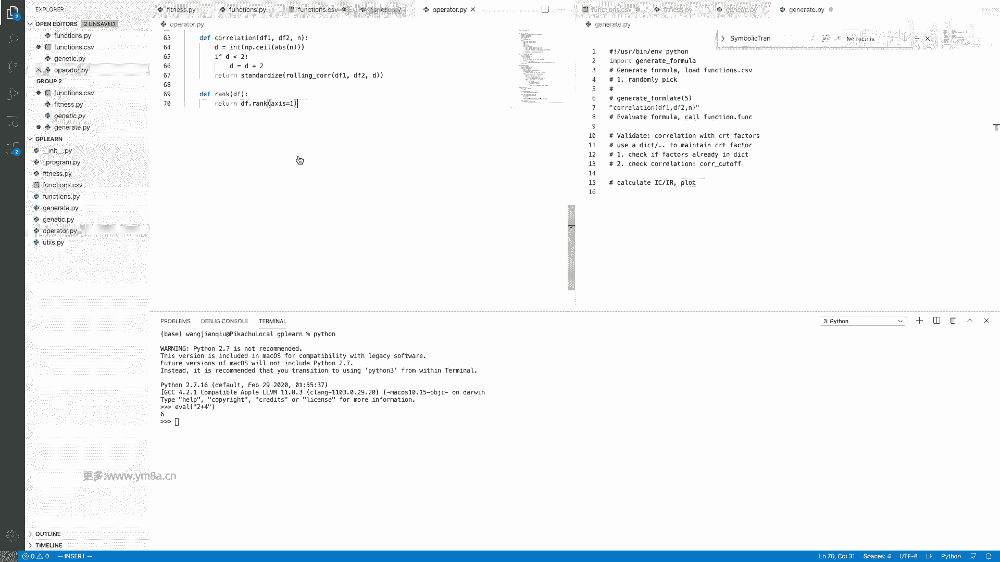

在那个横截面的这样一个排名就可以了，我看一下对不对啊。

嗯number排rank，我看下dimension到底是哪个哪个哪个哪，WA咳咳。

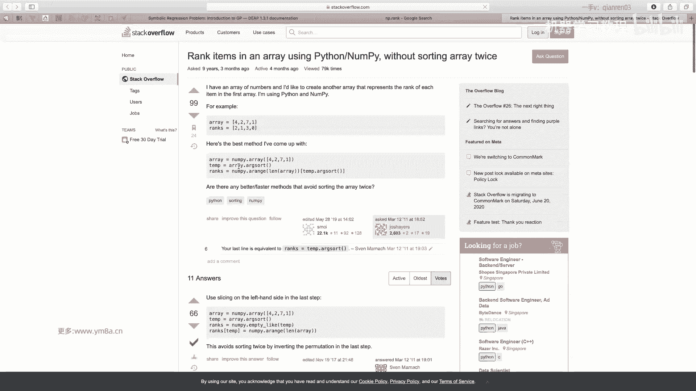

你这个测试一下好吗。

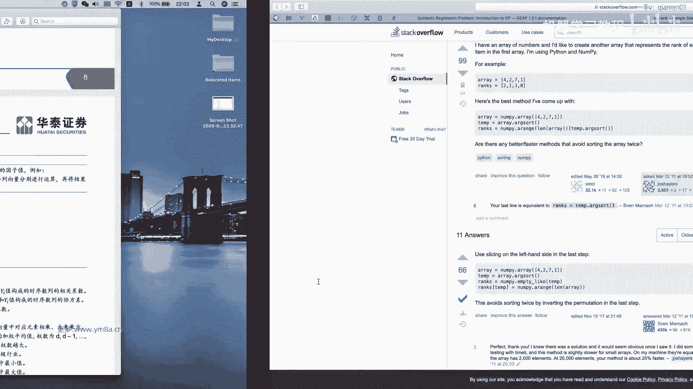

这名字我看一下，嗯还没有吗，对。

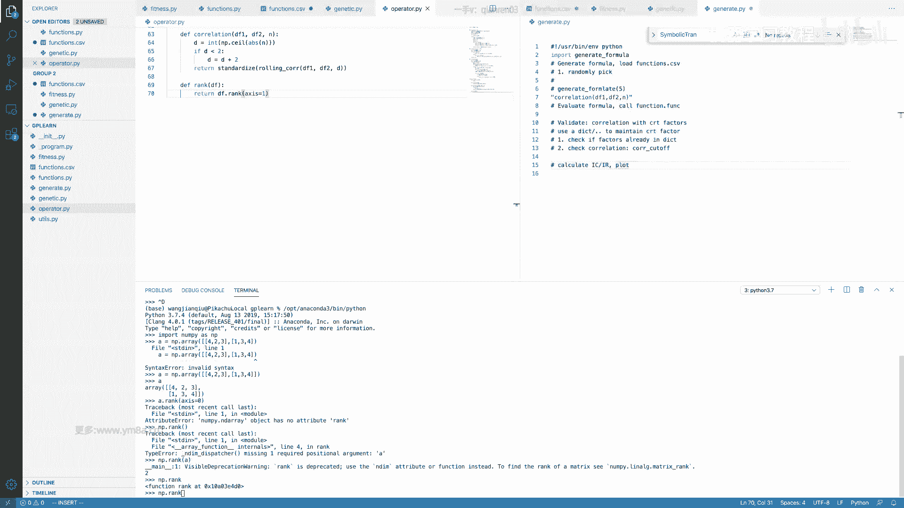

嗯我看一下，我用的是。

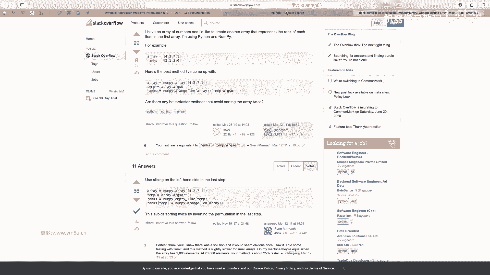

诶诶诶诶没有这个，那我这个DF是什么呢，嘶可能之前用的版本不太一样了，Ok，没用的，当然你可以就是你换成3T也没有关系了对吧，嗯因为其实做rank correlation，本质上就是说我只是在呃嗯。

你可以把它当成一个就是呃就是当成一个function，你也可以说是把rank跟correlation两部分开算，然后你期待在未来某一步之之中，两个会发生作用，当然也有可能呃。

就是这个里面就是你你可以写一些基础的，就是你可能就是你会觉得说是会比较重要的，一些呃这样一些的基本的funk，然后我们之前用到的就是就是加减乘除，就不说了，然后log啊。

Time series main，然后呃time series argument，然后uh time series，Uh max，然后二个max。

然后time series的some time series，The standard deviation，然后还有time series的呃呃，然后包括就是还有一个linear。

还有还有你可以把它scale，Scale，然后coverance encore嗯，然后还有，A person change，然后其实其实这部分是可以。

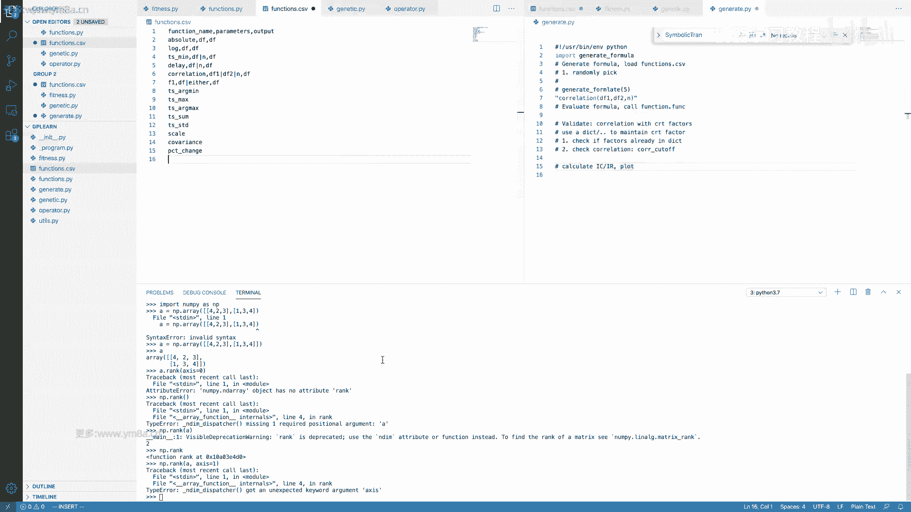

参照我们之前的说的那个，对这个里面我们用到我们都用到DOTA，还包括sign power这些大家都可以自己去做，有的基本上是差不多，然后rank的话的咳，然后这个是time series的rank。

就是对不不是说是那个不是说是很简便的rank，所以所以这个要仅仅是要区别一下，其其他应该都没有什么对，无非就是这些会稍微会麻烦一些，然后但是整体的流程不会有大的区别，对。

然后然后还提到是他这边用的因子是比较少的，对呃嗯当然也要考虑的就是说嗯嗯对，除了就是说我们在用他这些基础的因子的时候，呃，还有一些你可以考虑到的东西是嗯，你因为你这个音，因为我们是用日级别的嘛。

其实你在日内的一些，比如说你集合竞价的呃，呃集合竞价的价格，然后或者说是你可以自己定义呃，呃开盘15分钟的成交，占今日成交的一些比例呃，占今日总总体成交了这样一个percentage对。

所以其实这个里面的时候，其实如果你能用到日内数据的话，其实你可以加入很多很多的新的因子，就是说那这样的话就是大家可以想一下，就是从这个角度来讲，就说因子是不是问题的，但是嗯对你要用日内数据的话。

其实你算起来可能还会麻烦一点，因为我们现在3000只股票，你得把每只股票日内的，就是每一笔的分时的成交的这样一个数据，都把他拉下来，对所以这个时候挑战可能也不是，不是说是在算法上。

可能就是你你的基础设施设计架构也没有什么，也没有很好的工具，能够让你快速的去算这些东西，对对，但是个人就是说就是我们从这个里面能看到的，说这种方式是还是比较好的，然后对我个人反正还是一直强调。

说是去多多去找印子，因为如果说现在大家日日级别的因子，都挖的差不多的话，那其实是可以考虑，就是你在用日内的或者更高频的数据去来做对，包括你呃简单的就是大家如果是做过交易。

应该有看到大单成交这样的一些概念，你可以统计大单成交的比例，对这这完全可以作为因子，这这个是日内的数据了对，然后包括呃，然后你包括还有就是主买量，主主买跟主卖这样一些因子也都是可以去算的。

那那我我不知道，就是说现在就是到现在的话，大家私募基金就是做到了哪一步上了，但是呃可以预料的到是说啊这些因子呃，就是在这因子的挖掘，应该是大家可能竞争到一定程度了，对。

然后包括我说的就是说是因子的非线性的组合，用神经网络，我估计在座的肯定也不少，嗯嗯然后然后再提到就是还要提一下，就是这种这种策略比较严重的一个问题，是强烈依赖于市场的这样一个波动性。

然后以及相对的市场容量会比较有限，也就是我个人感觉就是直接直接观察到，可能19年的时候是好像1月到4月的时候，好像做的还挺好的，然后但是后面就是一下子波动，如果小来了，就是交易量小了。

然后波动又小的时候，那其实加上市场进入的人比较多，那这种偏向于日内的就是高频，就偏向于高频率内因子挖掘的这样一些额策略，可能做起来也比较难了，可能即使说我用遗传规划，挖掘到了很多很多的因子。

但是嗯实际上你会发现，可能教育起来就不是那么回事了，对，因为因为因为就是同样的说，我同样的大家都会都会去在交易这样的因子，你可能能够直接就是观察到是随着交易者进入，数量变多，那因子的预测的效率就是I。

它的IIC是逐步去下降的，对这个可能会比较嗯就比较会tricky一点，然后还有关于就是IIC的，就是可能会有一些呃，就是说他是不是特别稳定，然后有一些抗，就是它它是一个非线性的这样因子。

然后第二篇研报里面提到的一些处理方法。

大家可以去看一下，然后这个之前我还没有去处理过，我没有遇到过这种这样的情况。

对呃对，然后的话嗯，然后还有提到就是说嗯，还有其实还有一种就是嗯，还有一种就是我再去做T加零的时候，那其实这套框架我觉得可能会更有用途一点，因为我做T加零的时候，本质上说我持有底仓。

我在日内的每一个时刻都可以去卖出，那这个时候我就不仅仅局限于是用，就是日级别的数据了，我这个时候肯定更加倾向于，适用日内的这样一些数据，日内600，比如说我捐5分钟，没有5分钟，我就考虑一次做一次。

就是要不要去做我的交易，那我个人觉得说我引入了5分钟的这些收盘的，这些5分钟的close，然后5分钟内的高开低收，然后这样来做的话，可能能够预测出来的因子，还我觉得可能还会有新的不少一些因子对。

这时候就是期货，就是我们在CCTA里面研究的那些东西，其实都是可以拿下来去用对，所以其实就是找因子的话，无非就是呃我有觉得就是得开动脑筋吧，思路得想一想不一样，然后嗯对遗传因子也是一种。

就是遗传规划也是一种方式，因为确实有一些因子的组合，可能你发现效果还挺好的，然后你可以拿过来看一看，这到底就是它为什么会组合成这样的一个因子，对我我觉得还是挺有意思的，能够帮助我们拓展一些思路吧。

对但是当时说嗯，我觉得还有一个就是想跟大家强调问题，说是呃其实其实我建议就是如果是做股票的话，建议还是去多多去了解一下不同行业吧，就是基本面的东西，我觉得可能不管是财务的。

还是一些整个行业的产业的基础基础知识，可能会好一些，因为呃最简单的事就是每个每个行业的玩法，就是它的根本的逻辑是不一样的，你你我们直观我们看到的因子是呃，你看到的因子我们说分行业处理，然后他会有不一样。

但这只是说这是行业逻辑在，因此这个维度上的一个体现，对额其实是我建议是大家可以去了解一下，就是各个行业里面的玩法，因为比如说有的是重资产的行业，那他的现金流跟其他的，跟其他资产利跟利润的一些比例。

跟其他行业肯定就会不一样，那其实从基本面的角度去出发，能够构造因子的话，我觉得可能相对来说会比较robust，然后然后其实有一个比较，就是在期货里面也有一些基本面因子啊。

就是最最简单就是就是做做做多或者是做空的，钢厂利润这样一个东西，然后大家可以去自己去搜索一下，对对这，这这个事情，我觉得还是我第一次听到这个概念的时候，还是觉得挺有意思的，然后对本质上来说。

就是你需要明白钢厂的利润是咳，他到底是怎么来对吧，然后对，因为钢厂本质上来说，我output是一个钢材，那我我我我的input是什么，我我有我的原料对吧，那那那比如说我做钢厂利润，比如说你我做的是RB。

是螺纹钢跟热卷的这样一个价格对吧，唉我出产的是这样一个东西，但我我的原料是什么，是铁矿石和焦炭，对，那本质上说如果说是去啊做多钢厂利润，我就是说是去做多螺纹钢嗯，做空交泰，做空铁矿。

然后但是这个里面配比到底是怎么样的，那我觉得这个是需要一些产业的支持，可能会更好一点，然后产业配比里面比如说是呃一吨的螺纹钢，要用到0。4444545吨的焦炭，然后1。6吨的铁矿石对吧。

然后那你这样一配比的时候，你可以就是说你把它去扩扩扩展到整数倍，然后你看到底是几手焦炭，几首几首铁矿，然后又是几首螺纹钢，你把这样一配比，你其实得到这样一个因子，然后你可以去测一测。

这个因子的稳定性是怎么样，可能会比我们用量价挖掘的会更好一点，那同样的就是在想，其实产业里面是不是也会有存在这样的，上下游的这样一些关系，然后额，你可以就是说，如果是把你用人为的先验的一些知识。

把不同的公司进行嗯进行clustering，然后你知道这样一些产业里面会有存在这样的，上下游的关系，那哪些产业的哪些公司的利润增加或者是减少，会对我上下游的企业利润增加减少，产生什么样的影响。

这些是不是都是可以去量化，去作为一些因子，对我觉得这个这个可能是长期来说，是就是做深度研究，然后结合量化，可能会是一种比较好的一种方式哈，因为单纯的我我个人觉得就是因子挖掘。

这这套玩法感觉是有点玩过头了，就如果大家都是这么玩的话，其实不是，这也不是说没有意义啊，就是说会飞快的把市场的竞争水平，提升到一定的地步，对那如果说我我我那都是比拼算力，我们算一都足够。

反正都是都是无限预算，算下因子，你算你有这些因子，我也有这些因子对，那这个时候哼如果只是靠暴力挖掘因子，可能会走下去会比较难对，所以所以所以说就是就多多说一句，如果是偏股票的话。

觉得可能还是懂一些基本面回去比较好一点，包括系统的去学习一下财报，我这也是我个人就是业余在做的一些事情，对嗯然后今天今天课程内容基本上就是这么多，大家还有什么问题吗，嗯这这套框架的话对。

如果如果大家自己要动起先用起来的话，我觉得你可以，就是就是先从G评论这样的一个方式去来着手，然后我觉得先最好最好是把他代码去摸摸清，然后然后再去动手去做自己的，就是自己的框架，如果你觉得他比较臃肿。

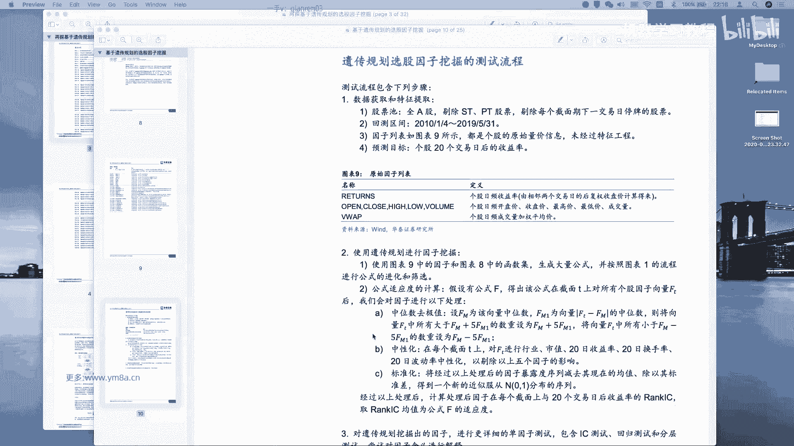

然后没有时间序列等等对，然后你其实刚刚给到这样一个大的例子，其实大家已经能够去做咳。

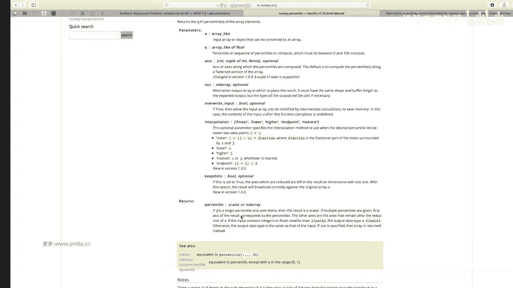

就是你可以把我这个例子跟就是GP论里面的，去结合起来对，然后我们之前是自己写的代码，然后效率也还可以对，因为相对来说用的比较稳定了，就不不太会容易去轻易去改变，对所以OK就是到现在的话。

这一块应该是差不多了，对哦哇他这个相关性还可以啊，嗯OK大家还有什么问题吗，如果没有什么问题的话，今晚就先到这了，好OK69年呃，19年6月10日呃，差不多整整一年前嗯。

对然后然后提到就是说这个研报的话呃，我是可以从万德或者是从其他什么地方下载，然后最简单的是关注他们的微信公众号吧，应该相相对来说会定期去推送，就各个券商内有日对少研报的话，对有有研报的话。

想要看研报的小伙伴可以自己去拿过来做，对我觉得他复以后要是完整复现下来，我估计还是要一段时间的对，但这门课程可能就是现在，这如果是真的带大家手把手去完整的复现的话，我可可能都不不是特别够用对。

但是就是告诉大家有这样一个方向，我觉得让大家自己去探索，应该是比较好的一种方式，对呃OK，对然后包括就是呃correlation，你用的是什么，有人还有用experiment这种质相关技术。

对吧嗯好那如果没有什么问题的话，大家就早点休息吧。

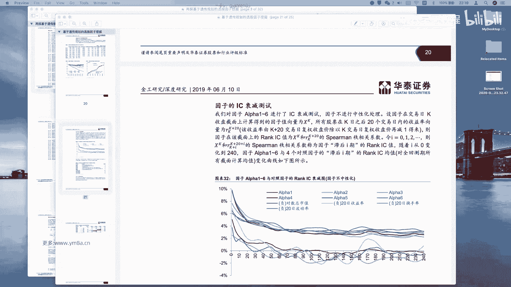