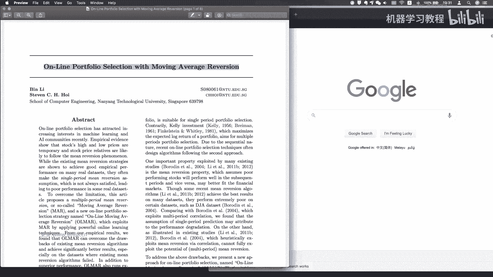
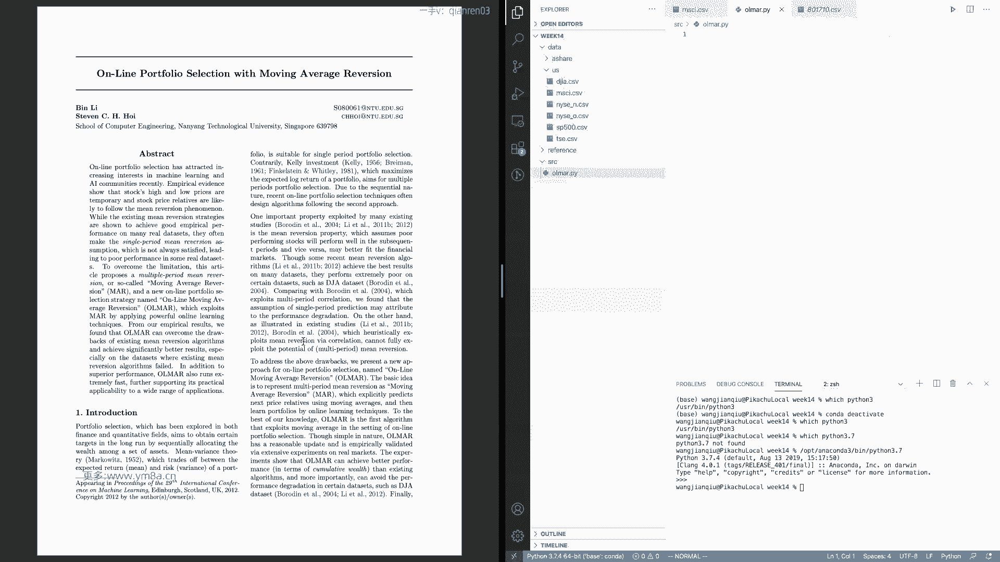
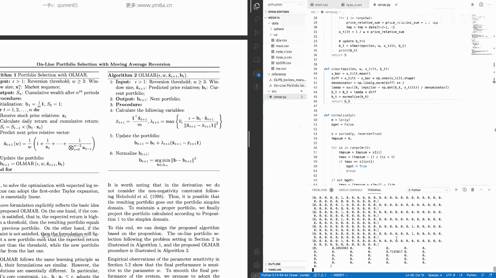
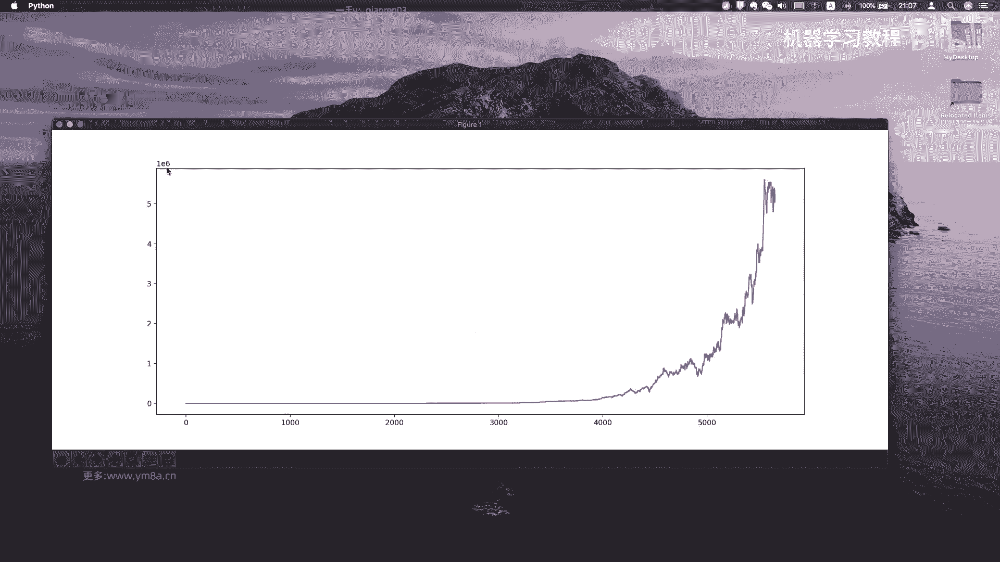
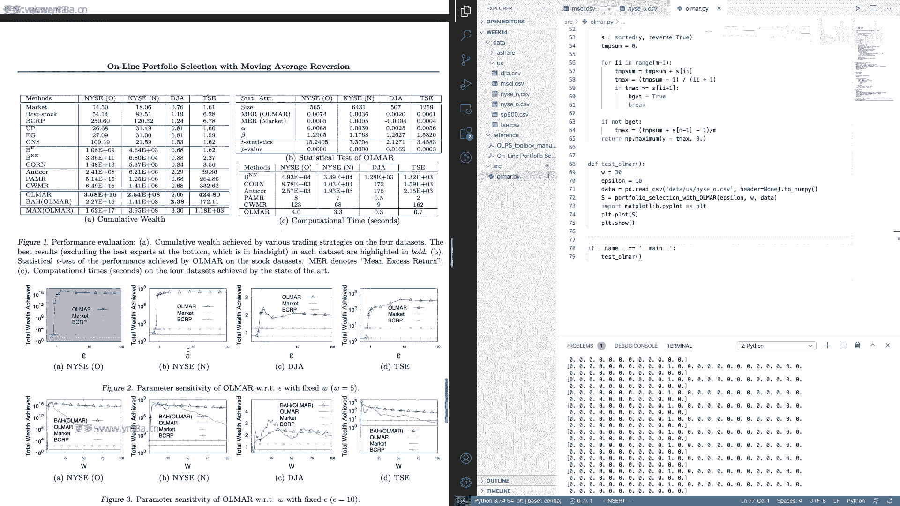
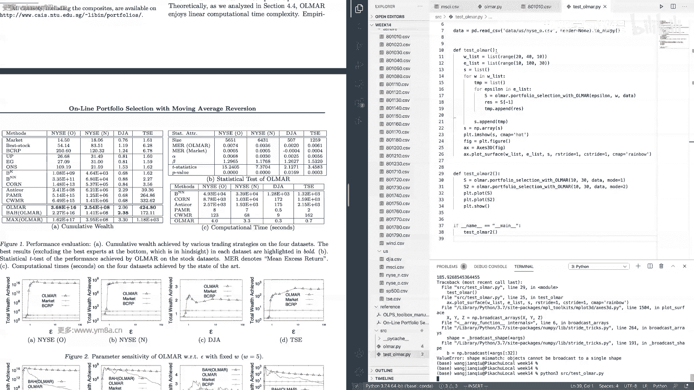
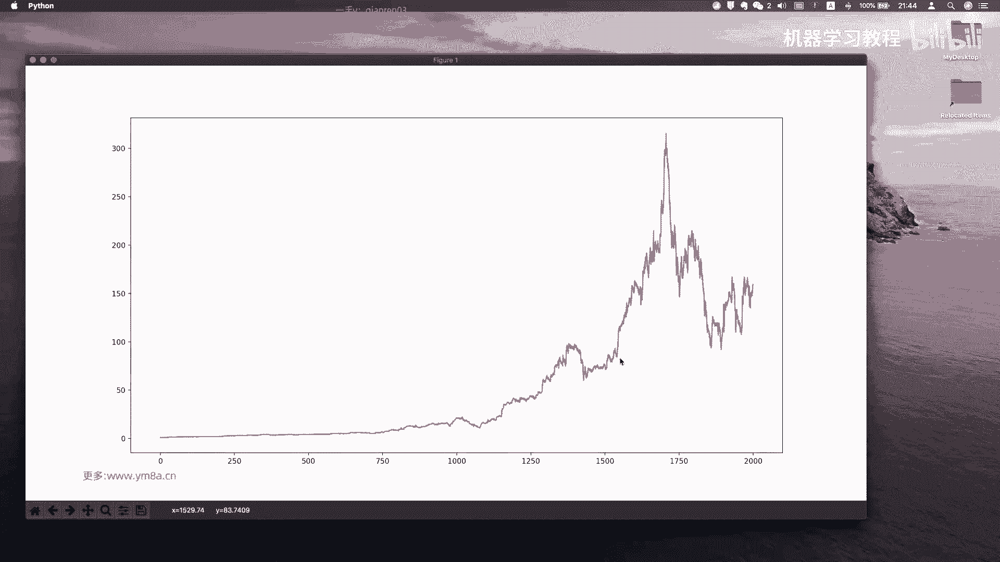
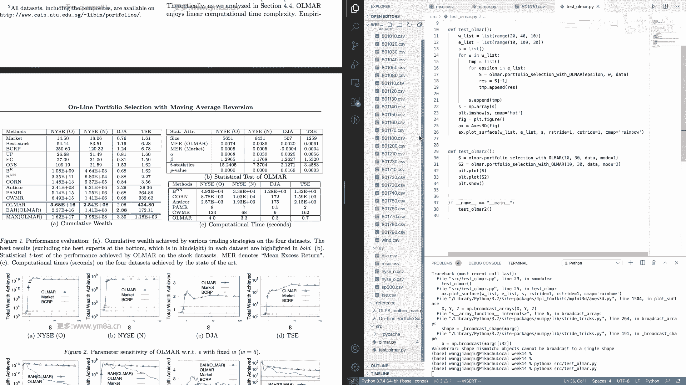
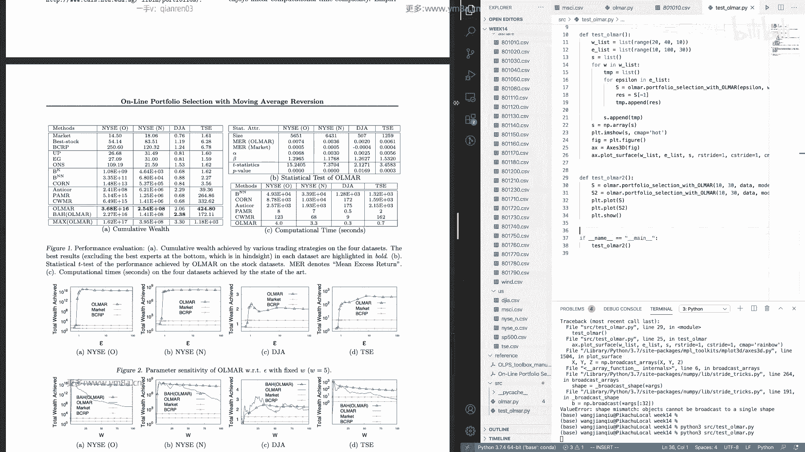
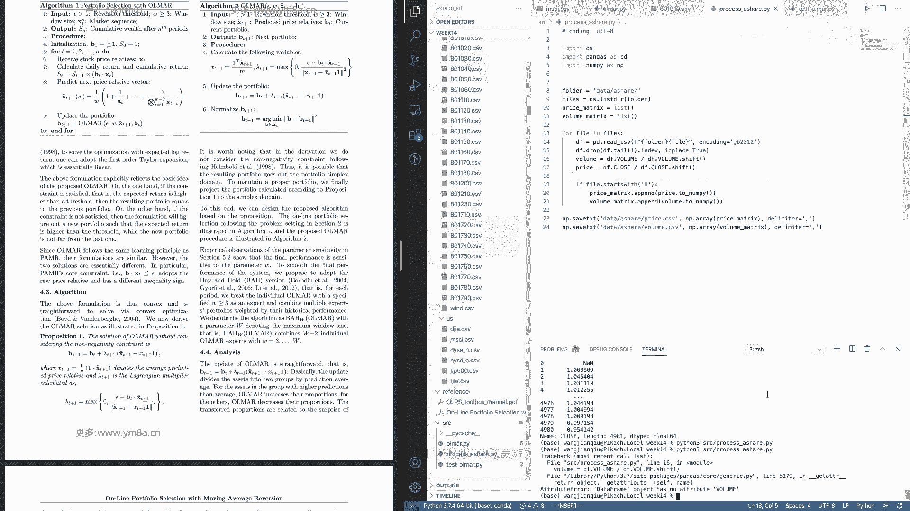

# 2025最新AI量化交易实战教程，三小时入门到进阶！清华计算机博士讲解，零基础也学会了（AI人工智能丨数据分析丨数据挖掘丨机器学习实战丨深度学习丨编程） - P13：第一十四章： 期权波动率交易 - 机器学习教程 - BV1ujk4YKEw9

哎哎抱歉，现在可以听到声音吗，喂喂，OK诶，不好意思，刚刚刚刚没有注意，可能对呃，CC我们刚刚讲到讲到哪里了，对我刚刚就是okay，So um，呃那我再就是从头再去讲一下。

比如说呃比如说这个online pfolio selection，我们讲的这个问题是什么，就是说呃，讲的是一种是去做投资组合的一个方法，那么呃投资组合的方法也是说嗯，相对于说为什么要去讲这篇论文。

是因为是他首先把我们的就是moving average reverse，这样一个因子，或者说这样一种方式，这样一种策略去引入我们在线学习，那么为什么说是呃这块领域，其实最近几年还是研究还是蛮火的，对。

那为什么要用在线学习呢，其实就是说交易是一个，非常适合在线学习的场景，因为我因为本身来说，就是说我们每天都会有最新的这样一个，交易数据，那么我如如何把我的每天，就是当有最新的交易数据去纳入我们的模型。

我们的模型随之去更新我们的参数，那么呃这就是说嗯，这个是非常符合我们交易的一个场景的，所以说这篇这篇文章来说，相对来说会是比较经典的一篇论文，OK然后然后我们再去看一下，就是说他会跟传统的就是说啊。

Mean variance，这样的一个投资组合理论会有一些区别，就是说之前的话呃对，所以我们来就是来具体看一下，这个problem的setting，就是说这个问题是怎么来去研究的，OK首先就是说呃。

我们的我们的我们的任我们的目标，或者说我们的目标是什么事，首先是我们有我们有一个我们有M个asset，然后有我们有N7的数据对啊，或者然后我们在这边来说，这个m asset你可以理解为说是我有M个股票。

你也可以理解为说这mi赛里面有股票，有期货，有基金额，或者有其他的任何一种，任，就是任何一种SM都可以去做这样的投资组合，那么今天我们研究的可能是说是啊，都是都是是股票，然后包括A股的话。

我们选的是申万宏源的不同的index，然后就是不同的行业指数对，然后啊我们要来去做，怎么来去做呃，嗯就是去做我们的这样一个online的呃，Mean in online learning。

然后是一个mi呃，就是movie average的reverse，OK然后要注意的说，这边大家看到的时候，这边的价格它都是一是什么意思呢，就是说都是都是一点几，一点几没有看到这价格。

也就是说首先我们把第一天他他要做的事情，就是说我们做的是一个叫relative price vector呃，就是price reality vector，是拿今天的价格去除以昨天的价格，Ok。

那么所有我们把所有的这样的价格，都会去转化成一个大于零的这样一个向量，那么在第T期的时候，我们具有的是我们得到的就是一个呃ma的，一个正的啊，ma的这样一个正向量，因为我们有MIS。

每个AI都有这样一个数值，OK然后嗯那所有人说是，然后我们我们我们的XN是什么，Xn，就是说是我们从第一天到第N天的这样一个呃，这样的一个就是我们有N7的这样一个。

price的relative vector，那么我们看到的也就是这边的这样一个，CSV文件，或者是我们可以把它处理成一个二维的数组，那么这边的时候是每1sorry，OK嗯这边每一行代表的是嗯一天的数据。

这边是第零天或者是第一天，然后嗯对，然后这样总共是差不多是6000多天的，这样一个数据，OK然后嗯然后就说我们在投资的时候，其实做的事情是什么，我们要做的事情是在每一天第七天的时候。

我们需要给出一个portfolio vector，这也是这篇文章要去研究的东西，东西什么是portfolio vector，就说pfolio vector是对应的，说是我每一个i set。

我到底要给他多少的这样一个份额，OK所以是就是proportion of wealth，然后investing as AI，那么嗯那么显然就是说嗯在这篇文章里，我们的setup是所有的投资组合是一。

那要求和加起来11就意味着什么，我们不可以用leverage，我们不可以用杠杆，然后另外一个是我们不可以去做空，我们选的都是一个positive的呃，Vector，就是说我们所有投资组合。

投资的比例都是大于等于零，我当然可以不投，但我也可以说是我给他投入更多的额，就是但是我的限制是有这样的一个限制，就是我们我所有的PFOLIVECTOR，都都要在这个DOTM的这样一个集合里面。

OK然后嗯他说所谓的一个photo strategy是呃，是什么意思呢，就是说嗯所谓的pfoo strategy，就是在在初始化的时候，我我们的setup是所有的投资组合都是是均分的。

like这边是20几个资产的话，23个资产的话，就是我每一个比例都是1/23，然后在接下来的时候是嗯啊，Following the sequence of mapping，是什么意思。

就是说在接下来的每一期的时候，我的我的我的BT都是要去复合，都是要在呃这样的一个DAM的这样一个里面，OK然后的话嗯嗯哼，然后这个时候就是说嗯嗯，然后就是说BT这个是DT7的这样一个投资组合。

然后我我我能够拿到的数据，是在历史上的这样一个market market price sequence，那么这个注意这边都是RATI的price，就是说这也就是说，其实就是说你可以理解为在第七天的时候。

我有第一天到第T减一天的这样一个market data，然后我要去怎么来determine我的呃，BT对，就是决定我今天的投资组合，然后OK，然后的话我把我们把这样的所有的这样BN。

就从B1到第一天到第N天，就是就是说我们认为这是N天的，我们叫叫做N7的这样一个策略，OK然后的话要注意说，这边是我们要去计算我们的portfolio return嗯。

记我们这个portfolio return呃，大家可以看看一下，他用的是两个vector的一个dot product，那那么我们再去看一下为什么是dot product，我们这边没有。

因为XT本身就是今天的价格，去除以昨天的价格，那么BT的话是今天的这样一个投资组合，那么我有了这样两个一个东西相乘的话，本质上来说我得到的就是一个今天的呃，今天的呃wealth的increase呃。

呃简单理解一下，如果说简单一点，如果两个都是一维对吧，呃就是我都只有一个asset，然后我今天的BT那BT肯定就是一了，然后XT的话，如果我是啊，我今天的成今天的是呃，就是比如说是0。9927。

是这个值的话，那意味着说我的财富从一变成了0。9，92277，OK所以所以所以所以说就是用嗯，所以就是用呃，sorry是在OK呃，所其实就是说直接我们用bt dot product的话。

就是说我们把每一个资产和今天的这样一个，relative的price去相乘，然后再去把求和呃，也就是我们的dot product，我就得到了是我投资组合今天的财富的变化值，也就是我们的PL对吧。

呃这块没有什么问题吧，就说这边跟我们之前不一样的，是我们之前要去算return对吧，其实其实就是说我们用这样一个price vector，它的好处就在于说，其实我们把我们的价格都进行了。

就相当于说是跟昨天去进行相除，我再去算的时候就不用去再去加return了，然后呃我把我所有的这样一个s st去呃，去把它去乘起来对吧，那是不是就得到了我整个投资组合的这样一个，这样的一个return。

OK呃所以这边我们就可以说是呃在N7之后，我的portfolio的话会产生一个portfolio cumulative，Routh office on，那那这个时候就是说啊。

也就是说把我们的每一天得到的这样一个，ST去连成，所以是从第一期到第N期，然后得到的是我们的这样一个SN，OK然后S0的话我们就我们为了方便的话，把初始化设成1OK嗯所以到这一块的时候。

这边基本的notation大家都没有问题吧，就是首先知道这个X是我们要强调的是，它是一个price的relative vector，然后这边的B相当于是，就是你你可以理解为就是权重就是weight对吧。

然后OK然后的话接下来就是说是online portfolio，Selection problem，这个呃selection problem是什么意思呢，就是说我们的目标是嗯。

嗯我们的目标是produce a portfolio strategy bn，那这个呃就是说我们要去就记住，必然是这个，就是说我要我要去，从第一期到第N期，都要去产生这样一个，都要去产生这样一个pf6。

这样一个呃呃sequence对吧，就是说我每天都要去做我的投资决策，然后我的目标是maximize accumulate，Wealth essence，比如说我们的目标函数是最大化。

这样一个就是累积的这样一个财富的增长值，然后然后他就说这个是我只能按照时间，我只能按照时间就是去顺序的去做，那其实这个跟我们回测一样，就是说我们在第T期的时候，我只能去拿到前面XT减一的数据。

比如说我在第160天的时候，我只能拿到从嗯，嗯就是前面159天的数据，然后我要去决定我第160天的投资组合，Ok，然后就比如说我拿到前面，DT减一天的数据的时候。

我要去计算DT天的这样一个PFOO的组合对吧，然后嗯然后这个时候这个是，然后这个时候嗯嗯然后就是说嗯，那那这个BT它是怎么算，他说是scode based on the pfolio p return。

就是说呃你BT是啊，你因为你有了BT之后，你实际上就可以去计算ST对，然后就是说我们不断的就是重复的，这样一个过程，直到最终我们去得到这样一个SOK嗯，然后嗯他强调的是说这个里面是zero。

Transaction cost，然后perfume market liquidity，然后这对然后是zero Impact cost，对嗯哼所以他提的就是说是呃not trible呃，Efforts。

OK所以就是之后的话就是说对，因为嗯本质上如果是你，尤其是在做投资组合的时候，嗯如果是做投资组合，一般来说我们的setup是说，或者说我们的assumption，说是你的资金量是比较大的，然后对。

那么你会也要说是哦，我要在不同不同的资产种类，或者说是在不同的股票当中去进行投资，对那其实这里面条件是给到有一些强，但是嗯但是呃就是说我们做这些assumption，反正是是为了就是观察。

就是说我到底是我这个，我的模型的效果是怎么样，对那当然这也是就是学术学术论文的一些，比如说是通用的这种比较常见的这种做法，对它可能是理想的，它是比较一个理想的模型，当然我们要把它就是实际去应用到A股。

投资的时候，是需要去呃对这些的条件进行一些修改，今天我们也会提到，就是说我们怎么去把这些条件去纳入到，就是说去纳入到我们的模型当中，那OK呃那这边然后这边前面是。

然后呃所以这个problem setting，嗯嗯我不知道大家现在理解了吗，就是说这个简单来说，就是说我要去去去做投资组合，不再像之前说是我们去额我们之前的时候啊，其实你可以理解为做回测也是做投资组合。

但是嗯他更加偏向于说是做股票的回撤，就是说要去决定我的仓位是多少，但是我们这边今天是没有任何复杂的因子，我们所拥有的只是一个价格的数据，然后我们就要看怎么利用价格的数据。

来去做这样一个portfolio return，那做一个PFOLIO的哎，得到我们的这样profoo selection对，OK然后的话嗯OK呃这部分应该没有什么问题吧，对吧嗯。

你也就是说notation，我们大概就是说现在有一个印象就好了，因为待会我们再去intimate的时候，我们还还会回过头来去对照，然后有什么大家有什么问题的话，随时随时去提问，对。

因为我下面的屏幕看得到大家的就是问题，OK然后前面他会有提到，就是呃这这个KELLYVOR就是凯瑞的准则，其实大家还蛮多的，就简单来说就是呃就是嗯对，就是说你要去他的目标是maximize。

就是你的呃呃就是一嗯expected loreturn对吧，然后这里面的话，其实他提到了很多的这样一个策略，然后配文章的嗯，就是这个作者其实也是对这些策略，去进行了对比。

然后呃包括有一些proof会证明说，这个是相对来说是相对来说是比较optimal的，一个strategy，然后感兴趣的同学，我觉得就是如果对，就是投资组合这块比较感兴趣的同学。

可以去把这些paper都去拿过来看一下，或者其实呃，当然我觉得就是说如果今天把这个模型搞懂了，再去看其他的，我觉得是非常类似的，就是因为因为这些模型本质上都不会去，特别复杂。

但是我觉得是有一些精巧的构建的思路，是在里面对呃，OK然后对，所以这里面的话感兴趣的同学是会比较去看，然后这里面他给了一个就是简单的这样一个嗯，嗯就是简单的对上面模型的一个总结对。

就是说他其实这里面提到的是说是嗯，嗯就是我们再回过头来看，就是BT加一，就是说DT加117的PFOLIO的这样一个呃，我们就是目标对吧，然后他要做的事情是什么，是呃，就是说这个这个模型做的事情是。

他是做的是一个LOGATOR对，然后然后不然后就是说不同的模型也有看到，是对于基于不同的形式，你可以去修改的对，所以嗯，然后然后因为因为就是说，你其实如果我们做的是一个online的这样一个呃。

online的这样一个模型的话，你你就是说你都要去输出的预测是什么，就是说无非你是输出额预测的是呃，预测的就是说你我们说预测XTALE对吧，你就是你预测的是你呃，我在做投资组合的时候。

其实本质上都是要去基于，都是要去预测我第二天的价格会是怎么变化，对，所以我无非是说嗯，所以有的预测的是是price relative，然后有的是预测的是这样一个倒数对，OK所以咳这一块的话。

就是我们不会今天课程不会去涉及到，就是这里面这么多的模型对，但是感兴趣的同学，其实你可以去看一下，因为因为其实差别都不是特别大，就是你只要明白，就是每一个模型相对于其他模型，它的改进点是在哪里。

然后他加入了哪些新的假设对，OK然后的话嗯OK嗯我们再来看，就是说他这边要提到，就是说嗯为什么要去做这样一个motivation。

为什么要去做online这样一个movie average reversion对吧，所以说是呃，因为因为其实就是说啊，回转的这样一个策略的话，就是说其实或者说是回转运，回转的这样一个因子。

其实在交易策略当中，是非常普遍应用的一个东西对，尤其是在A股的话，呃，A股的日内交易是有，其实是有不少的反转因子是在其中的，OK然后的话嗯然后他里面提到说主要的改进，说是它是基于就是说啊这两个模型嗯。

他们的这样一个assumption是什么，就是说嗯，他就是说他说我第二天的这样一个价格，会就是说我预测出来的这样一个价格哈，就是说它会它会反比呃，它会反比于昨天的这样一个价格，那么呃这个模型。

它的它的assumption是什什么意思，就是说如果说我昨天的我昨天的盈利非常好，我昨天赚了很多钱，那么我今天在这个SI上面我会相应的去减仓，那么如果说我昨天这个asset赚的钱比较少。

那我最简单的就是我的三成是我要去加仓，其实这个里面已经有一点，就是所谓的就是说reversion这样一个概念叫，比如说我之前赚的钱多的，那我去逐步减仓，然后我现在赚的钱少的呃。

然后我就是说这个asset我可能说，但按下就是说价格越来越跌，你可以理解为说越涨我就越卖越跌，我就越买对吧，但这样有这样一个CEASSUMPTION，但是这里面问题是，他只用了一个昨天的这样一个数据。

那么如果用到昨天这样一个数据，就会有什么一个问题呢，就是说我预测的是x tie t加一，它是等于一除以XT，就是说我是只用了前一天的这样一个数据，那么要注意的是说嗯XTTE呃。

这个就是说这是一个是price的一个，relative的这样一个vector，所以说是我提前一天，我预测出来的这样一个价格除以这样一个PT，那么XT的话就是PT减一除以PT，然后把这个分母给消掉。

你会发现其实我本质上做的事情，就是比如说我预测的价格就是前一天的价格，就是是是是是昨天的昨天，which is就是前天的价格对，所以所以这个模型本质上该做的事情也是说，如果我第一天的价格是一。

第二天的价格是二，那么按照这样的模型，我我就会出现额，就是我预测下来就是始终是1212这种对，那么嗯当然因为你预测下来，价格跟实际价格不一样，但实际上本质来说你这个模型化简下来，我用的只是说啊。

比如说我今天呃这个是T7的话，是0。97955，然后嗯然后T加1C的话是十，这个是一，但是在在T减T加一的时候，我不知道我会我会怎么样，但事实上我我的预测就是说是0。9，8209对。

OK那么这个这样一个问题，说是其实我只用了一个single period，这样一个assumption，就是我只用了一天的数据，那么嗯那如就是最简单的一个问题是说，当市场。

就是说我每天就是极端的震荡的情况下的时候，那其实我本质上来说，我预测的就是很多的这样一个噪音对吧，比如说猜测说是呃frequency of fluctuating，raw price对吧，然后嗯。

尤尤其是在如果是在A股的这种情形的话，你其实用用用这种想法，是其实是会比较会会吃亏，因为本质上我只是在不断的去交易，我的噪音上下去震荡，那么嗯嗯嗯嗯OK所以那么那么这篇文章的时候，就是要想那他想要改进。

就是说他是他是什么样的，就是对他举了一个极端的这样一个例子，我们这边来看，就是说我们的就是portfolio这样的一个就是，Market sequence，Market sequence，什么意思。

就是第一栏是我们的cash对吧，然后所以它始终是一，所以每这个每一个小的这pr小的括号的话，就是说它是是每一天的这样一个price的这样一个，Relative。

Relative price sequence，就是说我取了这样一个极端情形，然后我投资组合有两个，一个是cash，然后一个是like stock，然后这一天是翻倍，然后第二天跌50%，第三天再翻倍。

第四天再跌50%，所以这就是取了这样一个非常夸张的，这样一个scenario，然后他又对比说是按照，那么按照这样的一个呃这两个模型的话，这样的一个模型的话，我我预期的这样一个return是什么对。

所以那么因为因为其实这个还是比较好算的，就是说如果我第一天呃，就是说我这边是哦，我这边是T7，然后这是T减一，就是T加一，那T加一的时候预测就是T减一，就是二对，然后他的大概得到就是说是呃。

就是就是你你你的财富，这growth大概是什么样的这样一个数量级，OK然后的话呃他是想到就是说是所以他这边呃，就是第一种具体的就是这两个细节的话，大家paper可以就是自己去看一下。

或者说是去自己去尝试推一下对，然后他主要是来，就是比较在不同的这样scenario情况下，这三种算法的这样一种，比如说我财富的这样一个增长的速度，Ok，uh所以U所以这一段就是刚刚选讲到的。

就是说是就是不同算法这样一个，就是嗯grove的这样一个速度，然后，嗯然后的话就是说嗯，所以说在这篇文章它的主要的创新点，他他的意思是说是我的assumption，不再是说我的价格。

next price不再是说是会回到前一天，就是我next price，不会是是是昨天的昨天的这样一个价格，而我的next price会是说是呃是我的moving average对吧，我取的是W天。

我取的是最近W天的这样一个price的movie average，那其实这个是比较，我觉得是比较典型的这样一种assumption吧，就是呃就是你你可以理解为。

就是说我这边用的是moving average，这样一个train对吧，那么呃我DT加一天的价格，其实取决于是，我预测是前面N天的这样一个平均，那么其实这个这个SUMPTION的话。

我我觉得是是比较reasonable，因为典型来说这是我们最早使用的一个china following，或者说是一个对，所以嗯，其实就是说OK所以这样子的话，就说我们的价格他认为会revert to。

就是说我最终是会回到这样一个呃movie average，OK其实就是这样一个简单的SUMPTION，但是相比于之前的SUMPTION式来说，它已经我我们我们看到变化，是我考虑的不仅仅是一天的数据。

我已经我已经纳入了，就是从零到额，从零到W减一，总共W天的这样一个数据对吧，嗯那么就是说哎呀提到就是说去改进的话，我可以怎么去改呢，你当然可以说是我不用ma，但是呃未必说是复杂的模型，效果就会去更好对。

然后然后这里面其实也会引入一些参数，就是你的window的length，就是你这个window size到底要取多少，所以这个里面是呃对，这里面是也是会引入一些参数的对吧。

其实他说这个是在他说是在时间序列当中，就是你move marriage，本质通常是用来就说是smooth short，Term price factuation，因为他提到说我们前面的模型一个缺点是。

我如果不断的选前一天的数据，本质上就有可能会有很多的LOIS去引入，那么我引入这样引入这样一个ma，我可以去平滑我短期的这样一个价格的波动啊，OK所以的话他说我们认为，就是说这个方法是可以解决。

我们前面提到的就是mi version的，就是现有的mireversion strategy这样一个呃缺点，OK然后的话所以然后就是说proposal嗯，嗯relative vector。

所以他提到的就是说是啊，记住我们之前说我们都要用的是price relative vector，所以你要把我得到的莫名average的reversion的话，你再去除以一个PT，那么这个这个也就是说呃。

所以这个这样这样的话应该就没有问题了对吧，就是这边是PT除以PT，然后是PT减一去除以PT，然后是PT减二除以PT，所以这边的话就是一除以XT，然后这边是一除以呃XT再去除以XT减一。

然后所以你这边就会得到了D，然后我们得到DW填的话就是PT减W去加呃，PT减W加一，再去除以PT，然后这个时候就是从呃XT减零，一直到XT减W加二对，去把它去连乘起来，对他这边说。

这是呃adelement twice的这样一个notation，咳OK所以咳呃，这部分就是说大概知道，就是说我们要去做什么样的事情了吧，然后然后就是说是，然后OK那这边是刚刚说到。

就是说我有了这样一个setup之后，我可以得到就大概的这样一个呃price，如果按照这样的price这样得到一个结果，然后就是呃，Okay，okay嗯。

然后他这边提到就说是用的是online的这样的一个，online learning很algorithm，他说你可以理解为，就是其实其实就是因为交易当中很多的策略，大部分都是按按你这么说。

就是其实所有的教育用到最新的这样数据，其实都是一个所谓的online learning的algorithm，因为呃简单理解说我不管用movie average。

因为move average里面本身蕴含的就是moving，我的窗口是不断的在向后去滚动的，然后同时也会纳入最新的这样一个数据，OK所以到这部分的话，呃，大家知道就是说这个算法，就是他要做的事情是什么。

就是说我本质上来说，我做投资组合预测，这样一个PRING的这样一个vector呃，就这样一个rty press vector，我选用的标准是跟前面是去不一样了，那么那么在接下来的时候。

就是说我要去怎么来去formula，这个这样一个problem呢，要怎么样去解决这样一个问题，就是说还要还我们还要还要回去回到其，回到就是前面的时候，我们的目标是最大化。

我们到第N期的这样一个偷偷的return，对这这这个不要不要不要不要忘掉，就是我们的我们的目标是始终是去啊，maximize这样一个啊这样一个cumulative，这样一个return对。

那么其实就是在做这样一个问题的时候，就是说嗯formula这样一个problem，就是啊这一块的，还是说怎么得到这个公式的话，可能大家得去过这篇paper，那这个问题的时候。

就是说是那时候我们是maximize expected，这样一个呃就是return，然后呃，所以他最终本质上我要去做的是解决这样一个，去本质上是去解决这样一个优化问题，我要去得到。

就是说额得到了这样一个投资组合的这样一个，DT加一一期的这样一个B，然后嗯我要去找到使我的嗯，使我的这样一个笔根，嗯咳咳就是跟我们的BT这样，然后然后去做这样一个均方均哎，不是均方误差。

你是相当于说是求它的一个norm，就是你或者理解为就是呃，欧几里德的这样一个距离，你这理解也是一个距离对，然后然后同时你你你需要去你需要去保证的是，这边又有一个新的参数叫abs。

对你需要保证你的这样一个呃，这样一个就是expected return，你是需要大于这样的，大于action这样一个值，OK然后他这边提到是说是我们用的是呃，Expected return。

不是expected logator n ok啊，然后就是说OK额，那么要注意就是说这一块待会我们再去看一下，就说这两块，就其实这这这两部分就是讲的是online这样一个呃。

mean in average reversion的这样一个strategy，它他的就是算法，basic算法是什什么样的，对，其实刚刚我们前面也有也有去呃，就是提到一部分，但是接下来我们会去重点关注。

就是说他怎么来去怎么来去，implement它对，OK嗯嗯嗯OK所以的话，对嗯这部分的话可能会需要额，大家可能需要去对去先去消化一下，就是说这个这个问题，我们本质上是在做什么事情，呃。

我相信就是比较好理解的，就是说是前面的这样一部分就是problem setup，我们要去求解的是这样一个呃，Pfolio optimization，呃，这是我们要去maximize。

最终的这样一个呃累积的累积的财富，对累积的p and l，然后的话就是说这边的PFOLIO就说呃，这个算法就是嗯嗯OLMAR，他所做的创新点是在于说我引入的是moving。

Average reversion，对，然后拿它去作为我呃未来的这样一个呃，呃price relative vector的这样一个预测对，然后他会我们会去把这样一个问题去转化为。

解决求这样的一个优化问题，okay u啊，那个paper已经就是发到群里了，然后大家可以去呃，可以去自行去看一下对，OK然后的话OK我给大家留10分钟去看一下，然后10分钟之后我们再来去。

我们再去implement，这这个算法对是对，我我相信就是可能现在大家会呃，我有我估计这部分大家可能是OK的对，然后就是这部分，然后我们来去解释一下对，其实我们刚刚提提到的。

就是我们这样一个整体的这样一个流程，我每天在去做什么事情对，然后我本质上就要用这个东西来去去update，我们的portfolio对，OK无非是说是在做update的时候，他引入了这样一个。

就是引入了这样一个呃optimization，这样一个问题，OK嗯好的，那大家先就是先去看一下paper，OK同学们对我再讲一下，其实嗯就是他其实讲的是一个什么问题，就是说他是把我们呃资产配置。

这样一个最优化的问题，转化成DT加一日的交易日的收益，最大化的问题对，然后的话嗯其实是这个算法，本质上它在做什么事情，这边就是说其实我们最终的决策的结果是BT，是DT7的这样一个PFOO的vector。

那么他要做的事情是说我超出额，我对于T加我预测出来的均值，T加一天的这样一个ma算出来的这样一个值，当大于嗯，T加一的这样一个T加一天的均值的时候，我给他一定的超配对。

就是说预测值只要是高于平均水平均水平的话，那么我这个算法就会增加其比例，那么对于其他的而言的话，我会拒绝其他其他我预测出来的其他资产，预测出来的值，如果是小于均值的话，我就会去减少它这样一个比例。

所以如果如果不考虑所有的数学推导，本质上就是说哪个哪个资产我预测下来，短线会搞会更好，我就去增加它的投入，对，这就是我们我们正常所会去做这样一个投资，组合的选择流程，OK就是说是把我们的财富去转移到。

具有更好增长前景的这样一个资产上去，那么它本质上嗯，那么就是说我到底要去怎么去转移呢，它取决于是我们这样一个拉格朗日的，这样一个常数，OK然后拉格朗日他这样一个常数它是啊，OK他是这两者的一个更大值。

然后我们这边提到，这个是我们的T加一天我预测出来的，然后这个是额，这个是前一天的这样一个投资组合，OK所以呃到这部分大家有哦，大家觉得OK吗，或者刚刚大家看了，就是看了这篇paper还有什么问题。

或者这里面的notation有哪些地方不是很清楚的，嗯对，就是对于呃，如果说这里面涉及到的优化问题的话，那可能呃稍微我觉得可能稍微看一点，就是图优化的东西可能会呃好理解一些，但是其实不懂的话也不是特别。

就我觉得其实没有必要去搞懂，甚至对，因为呃正常来说你去求解优化问题的时候，你都会去调求解器，对或者说是300已经很成熟，可以去METAB或者是去网上都可以找得到，所以这个其实不是特别去担心。

因为目前解决的问题，还不至于说是没有办法去求解，或者说是需需要经过比较复杂的处理，OK额，那如果没有什么问题的话，我们就来开始去implement这个模型对，其实我们整个的框架是跟着这个来。

所以其实我们只需要做两个函数，一个是pfoo selection with oll m a r，然后第二个是implement，这个函数其实就OK了，呃大家有嗯对，然后的话哦那行我看看可不可以把我。

我可以把数据先发给大家，然后嗯对，然后大家可以跟我一起去试一试，然后就是我们这样可以cross validation，就是看一下做的事情对不对，然后我们随机挑一个吧，呃标普500会有点多。

这个我们选MSCI好了，对我们选MSCI的数据，然后，OK然后刚刚把数据发到了群里，然后的话我们就要来看怎么去做这个事情，还是一样对嗯，首先需要就是我们在就是implement，就是呃就接下来几期啊。

可能就是还有几节课，我们都会是属于就是说是看paper，然后一起去实现模型对，都会是这样的一个流程，就是从上一次课开始对，然后的话就是其实我们在写，就是写这些模型的时候，就是包括看paper的时候。

其实我们要做的事情就是说是先去搞懂，就是说这一步的输入跟输出，然后你知道他每一个NOTATOR，notation是在做什么样的事情，然后显然就是说我们要做的事情，是说我们回到最刚开最刚开。

最刚开始我要输出的是like对吧，这是一个我们要输出的是，我们每一每一个T7的这样一个，folio的一个vector，All right，然后那么它的它的input是什么呢。

因为刚刚我们说的是reversion的一个special，就是在，OK那就是reversion的search al，就是我们是在哪边引入来着，是在哎就是我们再去把这样一个嗯。

把这样一个就是说投资组合目标最大化的，收益最大化的一个问题，转化为这样一个optimization的这样一个problem，然后这边我们会引入一个呃，引入我们的第一个参数对是呃，App s。

OK然后第二个参数是嗯啊window size like，就是我们要取多少G的额，我们要取多少期的欧米伽，我这边用W号，我们要取多少期的这样一个窗口去回看，然后还有一个是market sequence。

我这边就用data来好了，然后对这个是market sequence，OK然后但注意说他这边啊，就是这边他用的是嗯对是x e n sorry，我这个notation也有点忘记，对。

我们刚刚看到说X1N的话，嗯他这个我不知道他是不是弄错了，还是因为本质来说是嗯，对应该应该我们要input进去，是整个的这样一个performer，这样一个data应该是X。

但不管我们接下来可以具体再去看对，然后他的呃他有三个argument，然后SN这边回ax，然后是absent，Absent，然后他的是reversion trial，然后是大于一，然后是。

Uw window size，然后data是market sequence，呃我们先呃，然后他的output是cumulative的这样一个，不行，Relative rouse。

或者我们可以把所有N7的这样一个return，都给它放，都给他去返回对吧，因为我们想要看到一个取向，而不是最终的这样一个值，Okay，So，然后uh let's say。

Define test o l m a r l i a r，然后这边先pass，然后他这后面有提到，就是呃在这面里面他用的default这样一个嗯，嗯就我这没有，因为有参数，实际上只要是引入参数。

我们都可以去考虑去优化对吧，那么额我们这边先用嗯，我们这边先用的话，就还是用用论文里的吧，对嗯啊W是，下点W是等于30，然后嗯然absent，Absent，我记得是十或者九点对，因为这这实际上是参数。

我们都可以，就是说是把这这些东西作为一个参数组，然后我们可以去批量的去进行我们的测试，Ok2，然后data我们先，load数据对呃，Data u s，然后是MSCI，然后我们这边用到的是呃pandas。

肯定还会，用到南派，然后的话，The only times and three force，OK然后OK这没有问题，就是因为我们的所有的输入的数据都是没有head，就是我们知道是market data。

所以我们应该用的是header uh is now，然后我们要做的事情是把它给转成一个npa ray，对吧，这NP对，然后我再看下它ship，总共是1043天的数据，然后是24。

或者或者我们用一个MSE好了，对这样子的话，对我们这样，这有有reference l i CEO，对我们用LYCEO，N y c e，呃5651，然后36个SK，然后对。

那么我们就用default这样一个参数对吧，然后是absent传入我们的absalosorry absent，然后W和我们的data，OK然后我显然是我们要回到我们的阿狗部分。

就是我们的procedure对吧，我们是首先要呃b one是什么，S0是什么，我们再回到之前，就是b one是我们第一天的初始的投资组合，初始的投资组合，初始投资组合是所有的都是呃都是去均分。

那么我们需要知道我们的有多少个投资组合，首先我们有多少有多少天呢，那肯定是N天，然后是有M个投资组合，那这个数据是怎么得到的，是data点shape，嗯sorry这这个为什么，But on use。

Ok fine，然后然后的话我就要得到的是呃b one，或者嗯OK我们先写b one，b one是往呃number派点ones，然后它的长度是M，然后再divided by m对吧。

Print b one，嗯空，OK这是符合我们预期的，OK就是说我们在第八个过程当中是要保证的，就是说我们要做的事情是然后好，OK然后我们刚刚这边说他是我们，他要最后返回是S对吧，但是我比较建议的是。

我们把所有的整个过程的S都返回，我希望知道每一步S是怎么去变化的，那么我这个时候如果append1的话对吧，那么我在print test，那么这时候S0就是第零个元素的话。

就是我们的这是我们第一天的初始投资组合，第零天的投资组合对吧，然后下面是一个B1K，然后的话呃接下来他会有一个huge loop对吧，一个大look for t in range。

就这边7号可可能会有点麻烦，因为他是第一天对吧，然后我们是第呃第N天啊，Whatever，那我们就先我们还是按它用它的记号好了对吧，然后这个时候注意要N加一，也是从第一天到第N天对。

然后我们要receive的，我们的price relatives，我们price relative x t咳咳，那么这边要可能要稍微注意一下，然后这个是DA是呃，这边是T减一啊。

这注意这个T减一不是T不是DT减一天，而就是DT1天，因为我们这边是把相当于说shift向y shift1了对吧，嗯我们先试试看，打一个第一天出来看他对不对，1。015，然后m s c i sorry。

1。01511。0276，哎，所以这个数据是对的，然后然后做的事情是什么呢，说是我们要去calculate daily return and accumulated return。

那么我在第一天的daily return是什么呢，daily return本质上他说是这两个句相乘，记住呃，记住相乘的话，这边我不能是直接拿我们的BT去相乘，所以所以我这边会我会直接把B写成BT。

那我直接把B写成BT，这样子的话，因为它相当于说是我就循环时，BT就是一个变量对，然后呃注意这边可能不是BT乘以XT，因为BT乘以XT是什么，就是呃第一天的话是呃，我把这个打出来就知道了。

因为BTXT有其实就是XT是一样的，对不对，但是我们要的是一个performer return，所以这边不可以不可以直接去呃，就是不可以直接去相乘对吧，我我要做的事情，实实际上是把这个PFU去去求和。

但其实我这边要做的事情是点乘，然后，对吧，这样子就得到我们第一天的这样一个括for6，这样一个return，那么我们会把它做的这样一个事情是，呃ST，等于s st减一，那么s st减一是什么呢。

其实我们可以，我们正好用我们前面的这样一个s list来去表达，所以我们可以就用s st1-1对吧，也相当于说是我把我每次算出来的，这样一个东西去放到这样一个list当中。

那么同样我这边也不能忘记我的ST呃，S需要append end s t对吧，然后接下来是predictive part，这个是这个是calculate deleor。

Calculate daily return and cumulated return，然后第一部分是receive uh stock price writers，我们或者直接咳，X t okay。

因为因为这是第一天的时候对XT是没有问题，然后的话对呃BT乘XT啊，因为其实我们接下来要做的事情是我们回到说，我们要去做的事情，本质上是去update我们的XT，对不对啊啊sorry。

update的BT，比如说predict或者叫update例题，那么我们先看一下，就是说如果不update，我始终都是每天的这样一个每天都是REBALANCE，就是每天呃嗯都是均分的这样一个PFOO。

就相当于是作为一个benchmark，你可以看一下我们的呃s st会是什么样对吧，Uh sorry，S t，最终哦还可以啊，变成27，那可能这段时间确实是牛市翻了20，27还是有点夸张的。

就是我只是一个均分的这样一个组合，那么额我把S化打出来吧，或者let's sc，我们要把s screturn return s，然后，我们去，我们去把S给pro出来好了，Duo import。

对我们这时候可以看一下，就是我们的benchmark组合，我就是说我们每天不去做任何的prediction，我只是说REBALANCE，每天把我们投资组合都去换成，就是均匀的去配置。

OK那确实是一个牛市，so啊就是这sorry，不是不是啊，不是那个不是啊，他不是1000多天，这个是5600个交易日，我们来看一下这是什么时间，这应该是如果是87年之后的话，Sorry，这还是八岁。

所以是美股，1962年到1984年这样一个时间，那么这个是benchmark这样一个组合，我只是一个均匀分贝，它当然它还不是对，你可以理解为嗯嗯他当然也不是说是市场指数，因为他没有去加权对。

但是呃这样的他是一个嗯，就是说我们是一个等权重这样一个组合，每天都去等权重，但这里面可能会去说是有一些呃，嗯就会有一些嗯，你说持仓的成本我们是没有考虑到的对，但显然我们就是可以从这张图当中看出。

这是一个额牛，整体来说是去牛市，以及到后期非常疯狂的这样一个状态，OK那么那我们要去做的事情是什么呢，说我们要去对比我们这样的online的这样一个，M a r，它的做出来的效果。

是不是会比其他的会去好一些，对会比benchmark的组合会去好一些，那么在这个里面要做的事情说是什么，嗯所以说我们现在先不看，就是说这个算法是什么，我们我们还要做一步的事情，是叫呃predict呃。

next price relative vector对吧，呃那这个要去怎么做呢，这个要去做一个嗯嗯像moving average对吧，这moving average的话。

我们的做法不是是我们的做法没有去做呃，嗯嗯我们的做法不是说是去做，去把我们的数据去向前取多少天，然后自己怎么做，因为因为其实大家可以去观察一下这个事情，就是说我们在这里面去每一项的话。

嗯哼就是说每一项的话都会去呃，因为这边其实涉及到是一个price的连乘对吧，因为我们这边是price连城，其实呃比较理想，或者说INTUITI的方式，我直接用一个循环去，一个个的把分母去计算出来。

其实就好了对吧，当然这里面肯定要注意的是要下标，所以我这边得注意一下额，我们前面因为注意这边是从一开始，但是在这边的话，我想想咳咳咳，我们先用W吧，就从window size开始对吧。

然后嗯我可以先是说price reality，Relative，我是设成，Zero，对我我我们需要的是，就是说我把这一项一项一项的给累加起来对，所以我先把它设成zero对，然后是m asset。

然后要做的事情是price relative呃，Sorry，怎么写成RELATI，Price relative，我要去不断的，就是说把这里边的每一项给它加起来，那么price relative呃。

其实应该是ARTIS对XT是price reality，那么我要去加起来加什么呢，是one over tap，我们先不考虑外面的除以W这个好做，那这个tab就是说我们这边的每一项，分母上的每一项对吧。

呃OK然后那么初始的这样一个tap是什么呢，啊注意这边的每一个time它都是一个呃，就这边他为什么要用这个符号，首先就是说time它不是一个数值，它是一个vector，那它的vector的维度是呃。

所以这不是zeros，这是ones，就是因为我们要垒成不可以，不不能去引入一个零，引入一个零之后就分母都是零，那显示嗯就是是不可行的，那么那么那这个时候，我们是不是符合第一天的这样一个要求呢。

就注意说我们最终返回的X它也是一个，就是是一个vector，它每一项也是vector，所以这边是element wise，就是说我是每一个元素去每个元素去除对吧，所以这边的话大家注意。

就是这个这个肯定是要去强调一点，它是element wise，对它不是它不是一个那个呃，他不是一个，就是他不是一个就是说是数值上的东西，那么呃第一个time就是做完了，这个是没有问题的。

那么之后要去怎么更新呢，啊time基本上就是我的XT去相乘对吧，那么就是去乘以XT那么对，那这个就是要去乘XT，这就是什么意思，它是我相当于说这个一和这个1。0245，去相乘，0。976229和这个1。

0066相乘，所以但是这边要去小心一点啊，这边小心一点，我们要到底是取什么index嗯，嗯所以我们assume的话说这边是DT填，然后我们要去算T加一，要注意我们这边因为是T从对。

因为这边T是从一开始我们的，然后但是我们这边XT实际上是取到了T减一，就XT是T减一，这个我们要记住，那么如果XT是T减一的话，那我下一天的话，我这边其实也是XT呃，我这边也要是嗯肯定有一个T减一在对。

那然后这里面还有一个问题，就是我要去W对吧，那这边就要去sorry，这边应该是I对，因为相当于说我这边是要有XT，然后是说XT一直乘以XT减一，XT减二，一直乘以到XT减W加二。

那么来就是我们就确认一下，就是说呃到最后一项的时候，他是不是一个X就是T减W加二，的这样一个状态，那么怎么去验证呢，当I是呃，I变成了是最大值，是W减1W减一，那这边就变成T减W减二呃。

但这边是T减W加二，那差的是在哪呢，T减W加二的话，然后因为我们这边是有一个shift减一，所以我这边会再去做这样一个呃shift减一，所以这边已经差了一，那我这边相当于说还差一个一。

那我再把一个下标减二，这样应该是对大家可以去确认一下，对就是这里面index会有一点麻烦，但是对，对就就这这边肯定要特别注意，因因因为他是从第一天开始，但我们是对我们这边也是从第一天第一天开始。

但是我们的data不是从第一天开始，所以这边下边真的是要特别注意，对呃对吧，这样这样，这样就间接实现了我们的这样一个XT，那还差一个呃，price relative sm的话。

就是其实这个我们叫XTITE好了，DT加一天的XTUTE呃，等于，one1除以W那就注意这边全部是vector对，然后再乘以price，这样我们就得到了，我们要的模型的这样一个输入。

我们接下来把去做的事情是update bt，next或者PT加一，那我就bt next，等于我要一个非得进去这个函数ABSOLO，然后WXX掉，然后BT对吧，我这边有BT吗，呃我这边有BT吗。

嗯嗯我这边是不是没有根有，OK我们是有的，对我没有的，我们是有BT，Sorry，你其实这个就不要去，就不是bt next，就是BT，就我本质上是一个不断去迭代，循环的这样一个过程，然后我们接下来就要去。

做我们这样一个sorry，对就要去实现这个函数了，呃所以这部分流程上面有这部分流程，大家知道就是OK吗，所以这这就是algorithm one。

就是profoto selection with o l m a r，对这部这部分大家现在可以理解吗，OK或者让大家再想一想，对，嗯你再验证一下这边吧，对，这是第N天的时候哦，T1-2加二会不会出现。

这主要是担心数组越界或者是对，或者是超限的这样一个问题，对当然这里面会有一个问题，就是嗯如果我的天数就是呃都达不到，这个十天的时候会怎么办，对所以这样好了，就是我们把这边你可以不要从第一天开始。

因为第一天你要往前去取W天对吧，你其实可以就是直接从第呃W加一天开始，那无非就是损失前面的数据点对，XT对，这样的话其实是没有特别大的问题，OK这部分大家OK吗，就是说呃回顾整个过程。

就说是这个其实部分这边在做的事，就是一个problem set up，就是说呃我要做的事情，是还是说我拿到前面的数据，然后我去算一下，就是就是根据最新的就是PFO6的这样一个呃。

根据最新的这样一个价格数据，然后根据我现有的这样一个投资组合的情况，我去算一下我的return对，然后接下来做的事情是根据新的数据去计算出，我的新的XT，那么新的XT我要我要的，我要输入什么呢。

我要输入我的price relative sub，就是在这边就是我要我，我要先去预测我下一个的price relative director，对吧。

你就这边他用的是price price rativector，你你当然其实可以理解为它就是一个呃，就是其实就是也是就是一个price嘛，因为XT本质上就是是PT除以PT减一对吧，呃那么XT分之一。

那你其其实这边你都把PT提出来，可能就就就OK了，对，嗯这部分有什么问题吗，大家，呃OK然后的话，然后就到了OL嗯这边的想法，那这边的想法是，对这部分算法其实也还OK对，这个首先他做的事情是什么，是。

首先他做的事情是呃，我们是next port for6对吧，那这个就我就忽略了，我就不写了，首先是calculate following variable，那计算下面的变量就没有什么问题。

第一个是X82，X82是什么，是T加一七的八二呃，看T加一七的bar，这个事情大家看到one就是拿一个呃单位向量啊，sir他不是咱就是一向量去啊，去做一个inner product。

然后再除以M其实其实它是什么，它就是均值，所以不用那么麻烦，就XTTE打M返回一个值就好了对吧，然后的话呃这个式子会看起来有点麻烦，但其实也还好，我知道拉姆达他就是一个，它就是一个两个东西更大值对吧。

一个是零，然后另一个是我们的，Whatever，Whatever，我们先就是要去算的嘛对吧，先算咳，哪个好算一点呢，呃，哪个好像一点好像都还行哈，So let's say，我们先看分母好了。

Denominator，一纳米哪，这分母是什么呃，分母它是一个就是UCLIDIAN的这样一个，就是就是就是一个距离嘛，距离的平方，距离平方有这个long time linear EG，然后有一个。

norm对吧，default应该是to norm，我可以测试一下嘛，所以我们要做的事情就是把这个norm的算出来，然后咳咳对，要注意的是，我们刚刚说到x bar是一个value。

所以你要去再去乘一个一向量，把它变成一个vector，这样你才能两个向量去相减对吧，然后是XTTE，然后这个是减去X8，它是一个数值，然后你再去乘以number派once，那这个shape是什么呢。

那就，execute点shape对吧，这样应该没问题，然后，然后denominator分母有了，嗯其分子我就不用单独写了，因为这个已经这个时候已经比较显然了，abs是常数，然后呃BT是我们传进来的。

然后呃BT传进来的话，呃注意这边还是一个是一个内积，这点不要搞错，因为肯定是数减数，XY是一个数，所以BT乘以XT2T减T加一二也是一个数，那么这个这边其实你就是对，这个是我们的分子。

然后你再去DENOMINARY呃，我要想一下嗯，这样应该没有什么问题，对额sorry，这边还有一个平方，不要忘了，这边有个平方，分母上有个平方，所以这样的话我们就得到我们的兰姆达，OK然后的话。

然后的话update我们的这样一个portfolio bt next好了，或者就你就用BT也没有问题呃，对BT等于bt pass lambda，然后乘以，execute减去X82。

就是在这个式子up after the portfolio，嗯嗯portfolio，然后是，X8X8乘以NPONCE，TID20就相当于这个值，相当于这个这个值，其实我们用了我们用了两遍，对呃。

对就只用两遍，我直接把它拿出来好了，我就叫他交diff好了，然后是Deft，后续然后这边还有一个拉姆达乘以def，OK呃我们先不看这一步，我们先不弄不normalize，然后看一下他是什么样的结果。

对就是对，然后在想为什么要去normalize，嗯所以这样BT就是我们每一期的投资组合对吧，理论来说就是到现在，除了这个最后一个normalize，我们都已经完成了，Let's say。

对希望能够跑起来，啊sorry，你需要把这个关掉，记住这个图，然后，啊ST减一，这里面有什么问题吗，啊好吧还是不行对，因为我们访问到ST在这，前面肯定出现问题了，对，首先就像上上算法算出来的。

就是oh wait，大家还记得我们前面有限制是什么，就是说B它需要是每一个从0~1，并且是一个positive的这样一个正数，那么如果是直接按照这样的一个模型，它返回出来是这样一个误差。

并且这种误差的话会不断的累积去放大，所以导致后面的数据就完全失去了意义，额那我们应该怎么做呢，其实这边你需要去把它，呃normalize，BT等于normalize，嗯对而我要说一下。

就是这个算法是看如如果就是说觉得自己写的，不知道对不对的话，呃他是有这个paper是比较良心的，一点在于它把它的算法给开源了，虽然是my tyb写的对，但但是大家可以去参考一下，对你可以照着那个写出来。

应该不会就是区别特别大，对呃好，然后这部分呢这部分呢我没有自己实现，我是直接是参考的，就是其实本来就是去解这样一个优化问题，然后其实也就几行代码，但是如果没有学过数值分析的小伙伴，可能看起来会有点懵。

我就先把解法放在这，然后大家可以自己有兴趣的也可以去参考一下，这个为什么这么做，对呃这个reference是在嗯，因为因为就是我记得GITHUB上有个挺好的项目，就是universal pfolio。

他把所有的这种在线选择算法，都把它纳入到其中去了，那这个时候我们再看一下print bt，是不是应该区别会不一样啊，Sorry，还需要再关闭一下，哎大家看到啊。

这个是显然不一样了，co呃，怎么样，这个结果还是可以的吧，那大家记住我们这个的range是多少倍，是uh five hundred million。

500万倍，uh对，按照这种极端的算法，就其实你可以看一下，就是说算法要求解下结果会是什么样，就是这么多组合，他就是我只根据ma去分配，并且其实它会有相对来说会蛮极端的一些例子。

就是说比如说如果一直上涨的话，我可能就死命令就买这个对，死命令就买对，然后加上我的优化的问就是对，所以，跟之前还是挺不一样的，呃我都不知道他笑的是，我们可以验证一下结果是不是这么夸张。

这个我觉得有点太夸张了，OK他说的是什么，他说是16次方，我没有看错吧，嗯笑一下，这里面还是会有一些问题，所以我不知道这里面的区别是会在哪里对，呃大家可以去验证一下对，然后我我现在有点有点怀疑。

他这个是怎么做出来的，对，这并且并且就是他的就在这一段增长，是有点过分，所以我不知道这这这部分，这里面是引入什么数据对，呃呃sorry，这个是这个是按照这个不是。

这个是这个是parameter sensitivity，对parameter sensitivity，它是根据不同的ABOON来去调整，我们的total wealth。

然后我们刚刚提到说我们的abode默认的是十，应该在这个范围，但是量级好像也不是很对，呃。

这人可能还要去，但是对，并且他没有画出他的PERFORMU，整个变化的过程是什么样的，所以我不太好去校正，但是呃从就是intuitive来讲，就说我觉得这样的曲线是比较。

相对来说是make sense对，或者这样就是因为前面期会被压缩。

我们可以看前200的前2000天对，对对，但至少就是说，就这里面有一个就是留给大家去解决的问题，就是说呃，一一个是就是想要就去搞懂他为什么这么做，一个是就是呃拉格朗日乘数法对。

然后另外一个是怎么把这个得去呃，怎么把这个优化问题去求解，就是是在这一段的normalize这一段的代码，所以说我们不是得到了一系列的，一系列的这样一个，我们现之前得到了很多有正有负的这样一个值。

那么其实他做的事情其实也还行，就是说它本质上来说，你是我们是把我们这样一个值区，从大大小去排序，然后的话，他其实做的事情，相当于说是我选取了那些perform，六组合为正的这些值对。

对所以就是说一部分是这个代码，然后我建议大家可以去看看MATLAB，它是怎么去实现的，当然就是这个问题不要担心，就是因为呃，因为我这边是直接是把这个解法写下，你事实也是可以去掉包去呃。

去optimize，三拍里面有包是可以去做这样的事情的，对因为你有了目标函数，然后也有有有相应的constrain，其实是可以去求解的，所以OK呃就是到这儿的话，OK我们正好把它给还是pd一下吧。

呃我是不是，Python three source，U，前2000天，但这里面还是观察到有些问题它并不是那么稳，就是你回撤其实还是蛮大的。

就是transforming这种pfolio selection，就是你即使看到后面说翻了很多倍，但是这这种回撤还是挺可怕的，这个跌到了2/3对，所以就是这种想法。

来去去做这样的performer selection，其实是会有一些问题的，对呃那OK尤其是美股，就是并且我们会assumption是说是充分的流动性，但是事实上最近一大的时候。

是不是真的能在这两个股票去买进去的话，我觉得还是it's hard to say对吧，并且尤其是像他调仓，其实还蛮猛烈的，那其实每年长年累月这样一个成本，其实是要去纳入去考虑的，你就按欠。

但是美股可能会好一些，并对还还有一点就是说要注意的是这个效果，它我觉得作者选取的时候，数据会有选取的是很，因为选的比较早，就是在这个时间段，就是在196几年的时候。

简单的MOVIII其实真的是可以去打败市场，因为它相对来说市场还没有那么活跃，对呃但是你说我下节课我们看看吧，在A股上的表现会怎么样，对这个这个是要提醒大家注意，不要觉得说按照join一个简单的算法。

就是我做了一下优化，然后就可以取得费，就是like这这这才几年对吧，不到78年，然后翻了翻了几百倍，呃我觉得暂时还是不是特别可能对，但是说还是可以去从中去选取，去得到一些思路。

就是说他说我我在选取投资组合的时候，去解解决一个什么样的问题，我把我一个投资组合呃，就是long term return最大化转化为我一个每天的剧。

求解一个最优的portfolio的select pfolio，这样vector这样一个问题，我觉得这个这个创新性是比较有意思，然后是，当然他这个他也不是一一步到头，就想出这样一个主意，他也是基于说嗯。

我用的用到历史的这样一个数据对，还有就是我基于前任的成果，我之前从一天，然后引入到多天的数据呃，当然这里面就是action和W就是30天十天，这是一个两个的参数组，那么actually。

事实上就是说你可以去额要做的事情是呃，你应该是把每一个的，比如说，Or for w in，But in range like，你要从20天到200天，然后step是ten，然后for。

active action on是大于一，对不对，action我们看他用in arrange，咳咳就这面参数是有蛮多要去去调的，要像一十一百，OK那我们就从1~100，然后也是range10好了。

所以我就从十开始，step试试，然后，这样参数是不是有点多，十八十九十八组乘以十一百八十个，然后你可以去plot看一下s mt就是，As should list co。

我要做的事情是把一个二维的这样一个矩阵，就是给它画出来，OK嗯嗯嗯，然后再去画一个hit map，我不知道是这个是怎么画点heat map，我先先把S给print出来吧，Print matt。

你可以看一下不同参数组的选择，然后对我再去查一下那个怎么做呃，我需要把所有的print都comment掉，不然打出来，对这边其实简单就是做一下，就是说我的参数的optimization，我怎么去做。

我这边只是引入了两个参数，一个W1个action，OK然后可能要跑一会，然后我再去对大家可以上网休息一下，然后去理解一下这个算法，然后我再去把那个scatter hit map那个给画出来，好吧。

嗯OK嗯，就是关于这个寻呃，寻求自由参数的这个过程的话，可能呃得那个同学们自己自己去探索一下，就是说这个到底是怎样去额，选到最佳这样一个参数，但basic它就是说它最基本的一个思想是。

其实我们不一定要去寻求最优解，而是寻求在一定范围内这样一个结构，就是我是希望能够画出一个3D这样一个图，然后你应该是会显然能看到，在一个一块ABSOLENT和和omega的这样一个区间之内。

我们能够找到相对来说，就是说我的啊long term return是最大的这样一个范围，对啊，最大的这样一个范围参数组，那这个时候其实说它可能不是全局最优，但是相对来说它会在这有啊。

随着参数就是说W和呃，和和EPISOON稍呃轻微的变动，它的值不会去区别太大对，所以这部分是我OK，大家可以去自己去客后再去探索一下，然后接下来要讲的是说是lucky。

我们要用的是就是大家没也注意到一个问题，应该就是我们之前在测试的时候，就其实它的波动是非常大的对，那么那么就是这这这个数，显示说我们不太能把这个东西直接去运用，运用到交易当中，但是我们要想一想。

就是说呃其实我觉得还是能够去做的吧，能应用到一部分去，那主要这个里面问题是在于之前我们刚刚看的，也看到他的投资组合的内容，就是说呃为什么他就说是W会，就是说它会变得这么快，其实本质上来说。

就是说我们的在计算的过程当中，他的拉达就是比较大，就是步子步子步子其实是比较激进的，相对来说会对，所以导致我们的BT会算的比较多，那么嗯就是说嗯嗯，那那其实说这部分他是怎么引入的呢，说呃一个是因为说。

我们在想让他说是说能不能用什么办法去解决，这样的一个问题，就是说我们不希望波能这么大，对呃其实是还是有一些办法的对，然后另外一个就是说是，那我们先考虑说在这个方面的时候呃，如果说是LANA引入。

导致我们的BT变化比较大的话，那么我们是不是可以说是相当于说，如果大家额用神经网络比较熟的话，我们用一个TCH的函数就直接就把它去呃，加一个这样一个tension这样一个函数。

那么我是不是可以相当于把我们的这个嗯，把我们的把我们的这样一个拉姆达去进行，相对来说是进行一部分的处理对，就是我们可以使它的取值限定在一定的范围内，对嗯，或者呢就是说嗯。

或者呃这是一个我们要去考虑的方面，然后另外一个就是说嗯，如果说是大家看到就是说对于美股，如果是长期一个牛市的这样一个行情，我的这个策略的表现其实是非常好的，但是我相信如果是把从额选一个。

那个如果选互联网泡沫的97年到01年吧，对或者说是选001到08年这段时间，那么这个时候肯定说同样的，我用这样一个online online learning这样一种方式，选择的效果未必会好。

那么这个说明什么呢，其实它会极度的依赖于说，我们初始点的这样一个选择，那么我们怎么去排除，说排除这样一个初始点的选择呢，嗯这是最简单的一个方式说，大家看到我给了一个数据零。

我们除了对我们的price去进行处理的话，我想我们想的是，是不是也可以对volume，也去做相同的这样一个处理，那么那我再去算权重的时候，我不仅仅是要去算price，那我还要去考虑把volume的权重。

也作为另外一个独立的权重去算算入，就说我们在算这样一个weight的时候，我们除了说是呃，除了就是说是把我们这样一个嗯，除了就像我们的BT的时候，我们除了说BT里面包含价格。

那么我们是不是考虑BT里面也包含，我们的成交量呢，对然后我得到了这样，就是说我我可以简单的说把呃价格我算一个BT，那么成交量也算一个BT，那我在得到这两个BT之后，我不是说是直接去NALIZE。

我会把这BT相当于说我有个BT1和BT2，我把BT1和BT2再按照一定的权重去进行组合，那么我再去嗯，我再去把它带入到我们的模型当中试试看，这样是不是会有一个更好的这样一个表现。

相当于说我原先只是一个online的MAR，但是现在说我同事的变形有两个MAR对，那么相应来说这个时候模型可能复杂度会高的，因为我原来只有一个app m m1，就是说是一个相对价格的。

那就absent一直是一个价格的这样一个阈值，那那这个时候如果我引入了一个成交量，那么相应的我还要一个absent2的这样一个阈值，那么同样的刚刚有一个那个window size1。

那么呃我可以说是价格和成交量都选取相同的，比如说都是30天，那么嗯都选取30天的这样一个量，那也可以说我价格和成交量选取不同的范围，因为这里面assumption就是说是咳成交量的变化。

可能相对来说是会缓慢一些，那么如果就是说价格可以变得很快，但是成交量的热情其实不会变得很快，大家如果有关注到最近A股的行情，是说其实是量，最近一直上海虽然价格有大的波动。

对就是价格我可能说涨跌会非常剧烈，但是我成交量其实并没有这样的变化，那么这两个如果用不同的参数，是不是可以去考虑呃，就是能够去抓住一部分市场的特征呢，所以OK其实这部分就是说呃，如果我们要去改的话。

其实改的也不会有特别多，主要一个就是说是嗯改动点在于，一个是说是对于我们的拉姆达这样一个限制，另外一部分就是说是嗯，嗯其实还可以一个尝试改进，我们这边不是用的是一个呃，是一个mean的这样一个过程嘛。

是一个均值，那我是不是可以考虑like，用一个我不是用我不是把X8，就是说我们的比较基准，不再是所有的所有这样一个呃价格，price rier vector的均值，我可以考虑用它的中位数。

那么这个时候我是不是可以，就是过滤掉一部分极端的值了，对所以来看我加到二吧，嗯其实，就是说呃，就说我们提到是说我们作原文当中的paper，原始的paper当中给了一个我们很好的想法起点。

但是我们实际会去根据说实际观察到，市场是可以不断的去对模型进行进行迭代的，对，那么这个里面的人说，可能会就是，其实需要是让每一个量化研究员去花时间，去研究的，就是研究的地方了。

呃我不太确定是不是可以迷迭，嗯测试一下，啊我看看没有这个函数咳，让排名一点，哎这这边要改成对，那我们可以先简单的，还是先在美股上去做一个benchmark对吧，然后我们这边应该返回的都是2000。

没问题，OK所以对，就是我们刚刚说之前他的问题是like，他的回收会比较大，然后，我们看的是如果换一种方式，我把我把我的均值啊，把那个均值换成呃，把均值换成呃中位数是不是会好一些，Right。

So you。

啊真的是还是看不出什么区别，这是美股，然后我建议大家去可以看一下A股的情况对，就是嗯当然是因为两个市场的本质特征，就是我不太确定。

这样或者买口肯需要更长一点的，是range，哦l media ok，还是咳咳，还是当这两个区别还不是特别大，OK呃fine，然后的话嗯，对然后因为这个没有量价数据，所以我们接下来肯定要去在A股的时候。

需要去呃，就是在在A就是在A股要做的事情。

说他有基本的思想是说呃，可能大家得多做一点数据预处理，就是这个里面是我先来讲讲一下，这里是每一个知识，这里面都是生万行原申万宏源一级行业的数据，那么这是一个指数，那么我们要去怎么去得到。

我们之前类似这样一个matrix呢，呃首先我们要去把每一个指数的，它的cost price都去提出来，然后要做的事情是呃，那就相当于shift去相除一下，这样我们才可以得到的是一个这样一个price。

这样一个数据，但当然因为我们这边是一天天的数据，我们还需要去把这一天天的数据去合成，这样的一个类似的这样一个matrix，对这部分的话，我看这段时间看还来得及，你可以去试一下，对嗯嗯，对。

然后然后同样的是把价格数据去做这样的，一个处理，然后然后还有一部分要去做的事情，就是对呃，就是我们assume说我们已经得到一个是price matrix，然后还有一个是volume matrix。

那么还有接下来要去做的事情是可能，嗯就是，这是我们在算每天的weight的时候，在这里面可能模型会越来越复杂，我们soon还是那个，如果我们这边还是assume使用，默认都是mode1呃对。

如果是mode1的话，这边要传进去的话，还有就是volume等于now，就是我默认的话是会传，就是说我如果是有选择的话，我是要去考虑volume这个东西对，那么如果volume is not now对。

那这边你还要考虑的是BT2，那这边的话你还会有新的app c龙，然后w two action two，然后你还有呃，当然也注意说，这个时候你其实那确实是你的XTT是没有变的。

我仍然是因为我每天只会给出一个，就是我每天最终还是会给出一个权重，是不是，只不过说我这边用的数据是呃，是是两个X是price是我们的price rativector，然后BT是我们的权重。

权重是指示中是只有一个，但是我我的意思是说这边是，然后，然后这边这边这边其实要我们要去改进的事情，可能就是要去这边还要去引入一个参数对，就是这个里面会，呃ok like这个嗯对，就是BT乘以一个。

你还要去另用一个，比如说是price对乘一个price，然后加上bt two去乘以一个一减price w price，那这这这个参呃，这个参数呢我我就是说我们这边还会引入额，我是不是可以用。

keyword arguments这种方式来传入对，那就是在这边要去做的时候，可能就是呃对，就是可能这边要去要去想一些比较多的东西，就是说要调比较多的参数呃，呃一一种策略是我认为我认为比较好的方式是。

可能说刚开始如果说我们作为一个起点的话，我我就w price的话，你肯定是需要给一个固定，比如说我现在啊w price我就是给0。5，对我这样，我这样可能会说，我作为一个作为我的一个初始的起点。

可能会好一些，然后呃对作为我的一个初始，这样一起点可能会好一些，然后但至于后续的话，嗯那其实要考虑的就是呃对嗯，就是作为后续的话，你肯定要考虑这边b t two，是不是像是说是一个随着时序去变。

那就是w price是不是一个随着时序去变化的，或者说我可以衡量就是呃我可以考虑，就是说我纳入的时候，当比如说我最近觉得，最近价格是比较有效的时候，那我会给w prize给价格更多的权重。

那么如果说是咳呃价格不是的，就是说是volume比较有效的时候，呃我可能会给volume更多的这样一个权重对，所以这个里面是有比较多，可以去调整这样一个空间，但是它基本的基本的方式是这样对。

然absent，所以还有w two，我们还要给一个sorry，这个W的话，呃反正是bt two改不了，然后是bt two这样没有问题，然后bt two的话还是默认是一样的权重。

A d t t this sign that i used bt，Sorry，就是说是我们提到的，就是说是如果要是用在A股市场的话，是要去进行怎样的一个改进，但其实你看的是说。

我们的机整体的框架仍然是基于，仍然是基于我们这样的online的呃，online你知LVA2这样的一个框架，只不过说是呃我是说是可以，就是说我意思是大家可以去多多去想一想。

就说除了paper里面给到这样一个想法，我们自己在去做投资组合的时候，有没有去考虑其他的因素对，因为这边事实上就是说我引入了这样一个呃，除了价格，我还引入了一个成交量的这样一个维度。

那么是不是除了量和价，还有其他的维度吗，那也是大家可以自己去进行探索的，对呃对我觉得就是说到基本上这一块框架以后，如果把这部分代码给到大家的话，大家应该是可以去把呃，Like。

把就是盛万宏源的分行业的这样一个指数，去进行一个投资组合，然后去fit到我们的这样的一个算法里面去，然后看他最终能这样一个结果是什么样，对嗯这部分大家觉得有问题吗，或者有难度对。

因为我觉得呃就是如果我们先刚开始先了解了，就是呃最basic的这样一个算法之后再去调整的话，其实我觉得是OK的对啊，我可能还是要把它给拆分成两个扣子，不然大家之后不太好去做第一个对。

这我给大家还是留一个原始的，OKOK然后，Ok w w price，嗯嗯OK对，这部分的话就是我觉得是OK了，然后呃就是接下来其实剩下要做的事情很简单，就是把这些数据去处理一下，对呃对呃，数据处理一下。

然后去整理成我们相应的就是说这边是price matrix，那我们也要相应把所有的price，feed到这样一个matrix当中去，然后把volume也提取到这样的matrix当中去。

然后再去嗯你要做的当然要做的事情，你要去去去相处啊，你不能用绝对的量，你要用相对的这样一个量对，然后还有一个要提到的是，我们除了说呃很自然的一个想法，就是说我们现在用的是分行业这样一个指数。

那么我在做资产配置的时候，尤其是应用在A股当中的时候，呃，大家会自然而然想到是大小盘，那么那么其实这个里面就引入了一个东西，就是说我们可以做的配置是什么，就是呃除了说我们可以按照分行业。

我对于不同的行业有偏好，我仍然可以考虑说基于因子的指数，这样这样一个大配置，那么我可以我可以选择什么，我可以选沪深300，然后我可以选沪深300的价值，然后我可以选中证100，中证500，中证1000。

中证红利，就是说我回测的时候，这个时候就说我投资组合，已经不再是单纯的行业，而我选的是一系列的一系列，就是说基于因子的这样一系列指数对，那么在这样的话，我我我我的建议是大家可以去再去尝试一下。

就是说不同的因子这样一个指数，然后用同样的这样一个最基本的这样一个算法，可以得到什么样的结果对，当然我们说追求的时候不一定说是收益最高，你可能说用了这样一个算法之后，我最大回撤变小。

或者说相对于说我的额对，或者说是我的sharp ratio有有提高，那我觉得其实就已经是非常好的，这样一个performance了，对，对剩下一点时间我可以对应该implement的很快。

因为我最近可能我不知道，大家就是没有强制要求大家交作业之后，额，有多少人是会在课后，还是自己去再去把代码给复现出来的，对，就我这边要做的事情，其实pre process要做的事情就是。

就是把他们的价格去进行归一化，然后不sir不是规划，是进行，就是router，我们要得到的是是一个rative price的matrix，那当然呃你如果不想这么做的话，你想跟之前的去。

之前我们所做的工作去统一的话，那还有一种方式，就是说我们要把在线的算法从用relative price matrix，转化成我们所用的就extra price，对，那这样我不知道工作量是不是会大一点。

因为因为所有的文章都是基于，所有的文章都是基于额呃，都是基于这样的rare to price的框架去做的，所以对嗯嗯对话提示是这篇paper是有MATLAB的代码，然后如果说呃对MATT比较熟悉的话。

建议可以把它代码拿下来跑一跑，对，对，然后为什么要看一下数据，就是万德拉下来数据可能啊哈果然有这种东西，我们需要把，基本上都去掉对，Df h，哦我查一下，Data frame，Remove tale。

嗯嗯嗯OK，所以然后要做的事情是，知道了，然后，嗯因为因为有一个就是我们作为benchmark是，那个所以我们只要处理那个只要处理后元指数，然后最后要去跟万万德的这样一个指数，去进行对比对，然后对。

所以我们要的是一个是price matrix right，然后就list好了，然后volume matrix，还是Rest，然后对，它的column是我们只要cos，那我直接就是去shift除一下。

应该就OK了对吧，So，妈的，Volume divide by df，Volume shift，哪个在前，哪个在后，我看一下嗯，Print，shift的话是把它从前移到后咳咳。

然后使用volume去volume shift，OK这个是OK的，然后price price，Captain price and then shift。

Um no object or or are sorry，Close，Volume capital，对额然后然后这个里面数据可能会有一些脏，就是like是个N值和非N值，可能都要大家还要去处理一下对。

当然我不确定呃，OLMAR这个算法，对于nun值是否是否robust呃，直接来说应该会呃对会嗯，不是我不太确定对，所以所以可能还是要把价格去处理一下，因为拿到的数据质量还是可以的对吧，他没有。

这时肯定都会补齐的数据，如果没有的话，你把它补成一就好了，OK然后，Co，然后我要做的事情的事，My name in tricks，In a c，嗯turn on time，Turnpi。

然后从第一个开始，我们要把long值给去掉呃，或者去这边不去也没问题，之后再统一去，然后八零，OK嗯，然后在这边怎么写呢，我看一下i am a rto csv，Ok we we can。

我们可以用down time点save text，然后price matrix，Price，然后用的是data，然后是price a a sh，price点cc。

然后是price matrix dilimeter，是用，逗号，Price volume，OK嗯看看他dimension，对不对嗯，嗯这里面有一个什么问题，好像是所有的东西都变成一列了，是不是。

那肯定不能这么做，肯定肯定不能这么做，呃哦并且我会啊在这边，save text不能把它放在循环里，然后price，对数据处理部分大家可能自己去做一下，应该就OK了，对嗯。

呃先，可这样的话可能要把囊排到保存格式，要我保存格式需要变一下，对额，OK然后的话不OK，其实今天主要内容就是差不多这么多，然后这个数据可能就给大家自己去处理一下吧，然后我觉得应该没有什么特别大的难度。

对之后把数据发给大家，其实我觉得还是去关注一个，就是核心的思想里面，就是说再去做呃，在现在这样一个资产组合的时候，他是怎么是去考虑到我们能够把呃，投资组合的这样一个问呃。

投资就是long term的一个pl转化，一个投资组合的优化的一个问题，所以我觉得这里面的思路还是还是挺有意思的，然后有兴趣的同学的话，嗯其实应该是相关的paper，我觉得可以把来龙去脉都去理解一下。

那如果其他不OK啊，我觉得把这个算法去理解透彻，我觉得其实已经已经很好了，对嗯，OK当然是说可能就是说，如果说之前就是说做量化研究，可能如果有的同学说不习惯看paper，或者只是靠想拿头自己想的话。

我个人的建议是嗯在有可能的情况下，尽量还是去多读一读期刊上的paper，然后即使说你不一定能够觉得觉得完全看得懂，但是如果里面有一些好的想法，是可以把它纳入到自己的影子库当中去测试的。

然后其实做量化研究也需要的，就是这样一种能力，就是快速的去从各个领域当中去，得到这样的相关的知识，然后去我们家里去验证这种想法是不是可行对，因为我个人的理解是单纯的去拍脑袋想创新。

其实还是挺困难的一件事情，但是如果说是站在前人的这样一个肩膀上来说，我觉得可能会相对来说是会，就是会容易容易许多，这是我个人的一点小小的想法对，然后然后也希望大家就是接下来就是，不管是怎样。

就是看paper和挖因子呃，可以顺顺利利的去多读paper，多挖因子嗯，那如果这没有什么问题的话，呃我们这节课就先到这边，然后现在我把数据去发给大家对，然后大家可以去早点休息，好大家休息吧。

