# 2025最新AI量化交易实战教程，三小时入门到进阶！清华计算机博士讲解，零基础也学会了（AI人工智能丨数据分析丨数据挖掘丨机器学习实战丨深度学习丨编程） - P14：第一十五章： 基本面量化 - 机器学习教程 - BV1ujk4YKEw9

uh okay呃，现在大家可以吗，不好意思，我刚刚忘了对，OK嗯行好的，那我们今天正式开始我们今天的课程，然后对之前我们讲了那么多的就是策略和框架，或者说是就是包括有一些挖因子的方法，其实今天会讲一些。

就是呃，我觉得可能是这就是大家在去正式交易的时候，其实是会比较重要的一个内容，就是是关于风险，风险控制，对其实从本质意义上来说，我们所做的事情，就是说，大家我不知道大家有没有思考过一个问题。

就是呃一个我一个策略的潜在收益，到底是由什么来决定的，对就是其实本质上来说，大家常常说一点，就是说是风险和收益是同源，所以其实是我们策略所潜在所承担的，这样一个潜在的风险。

是决定了且策略的这样一个潜在的收益，然后其实举一个简单的例子，如果我们是买保险的话，就是说我们买的保险是需要购买，保险时是需要支付保险费，但是然后按照平均的出险率去计算的话，那么保险公司是可以获得盈利。

但是嗯另外一方面的时候，作为保险的买家，我们付出的是保费在回报做，而那他的回报就是说在重大的突发事件的时候，我们可以获得额相应的弥补和损失，对那么回回到我们金融市场上来说。

嗯其实两我们会有两种类似的收益的风格，一种是说是嗯，如果我们是想要去啊购买保险的人，我们都会，那那么我们想要去购买这样一个保险，也就是说我们希望在突发事件，就市场比如说剧烈波动或者下跌的时候。

我们希望获得额外的收益，那么那么我们平时那么作为这一部分人，我们需要接受的这样一个事实，就是说，我们可能的回报率会低于市场的一个平均回报，那么另外跟我们做对手盘的人，就是说我愿意出售这样保险的人。

那么我就会通过赚取额外的风险溢价，来获得更高的回报，就是说从某种意义上来说，并不是说他的投资水平，会针对说比额收益率高的，会比收益率低的而言是差，而是说他赚取了我对应收益率，所承担的额外的风险溢价。

所以嗯，嗯所以就是说，类似于就像类似于保险公司的这样一个利润，然后说如果某些资产容易受到这些风险的影响，那么如果我去购买了这些资产，我就可以通过这些购买这些资产获得，获得额外的回报，Okay，um咳。

其实嗯其实说了这么多，其实我们只是想强调一点，就是说是风险敞口是决定了我们这样一个收益，然后嗯风险敞口，然后其实其然后其实还有一个是想说的是，嗯为什么大家会去投资股票。

而不是说是去投资债券等等更安全的资产，因为相对来说我债券的话，我可以就是我carry，然后就有这样的收益，那股票，那么显然其实投资者其实嗯期待的是说我失望，希望是从股票当中去获得额外的这样一个回报。

那其实我说我所说的这些回报，它是来自于一系列的风险因素，比如说我们常见的说是，比如额曾曾经有一段时间是小市值的公司啊，可以稳定的跑赢大市值的公司，这其实后来被认证它它不是一个阿尔法。

它其实是一个风险因子，但事实上来说是一嗯，这个是反的，但因为在后期你可能发现大市值的公司，其实是会跑了，跑过跑赢小小市值的公司，OK其实那么这个我们强调的就是说，这是一个就是说是市值的这样一个。

或者说是公司规模这样一个因子，然后呃那么其实在债券当中，我们也会有类似的情况，会发现就说较长，较长期的债券的收益率是高于短期的债券，因为嗯因为本质上来说，我借给你更长时间的钱，我们是需要承担更长的。

也就是说会有承担更更更大的这样一个风险，更较长较长期限的借贷，就会对应较较大的这样一个风险，因此那么我也可可以获得对应风险更多的一个，风险补偿，OK这所以就是说呃，所以说就说这个我们其实说的是持续的。

这样一个风险溢价，会导致不同的资产之间的收益率会有会有区别，比如说股票和债券，然后长期债呃呃然后长期债券跟短期债券，然后另外一个就是说嗯大家考虑的一点，就是说风险的偏好。

人们对于风险的偏好是保持不变的吗，显然不是，这是一个随着时间去变化，随着时间去变化的一个量嗯，那么那么这样的话来说嗯，那么这样这如果说风险是随着时间变化，如果我们去能够去抓住人们风险，对时间的偏好的话。

那么事实上，事实上我们就存在着，说低买高卖的这样一种交易的方式，我们我们我们赌的是人们的风险偏好会回归，回归，回归一个会出现均值回归，比如说当前说我们认为当前存在溢价，那么我可以说是卖出对应的资产。

我们认为等资产等回到一定时期，人们的风险偏好呃会回到正常，那么资产的价格也会相应回到正常的水平，OK嗯对，当然这一点的话就需要说呃，因为投资者的交易心理是会变化，市场是由投资者的心理心呃。

投资者的交易出来的，那么嗯其实这样就不存在一个非常完全正确的，这样一个解答，然后就是说到底什么才是正确的估值，什么才是正确的一个呃市场的状态，这个就需要每个人会有自己的另外一个判断。

然后另外还想强调的一点，就是说我们我们待会来看一下，就是说就是说作为呃作为一个理性的投资者，其实我们关心的是呃，市场的这样一个或关心的是资产的下浮比例下，Shap ratio，然后就是说嗯。

但事实上嗯这样一个理性的假设呃，是否是正确的呢，就是说我对于这是不是说，同样的一个夏普比率的两个资产，我们在选择的时候是没有偏好的呢，但事实上我会我我会觉得，这个理性的假设可能并不是那么正确。

因为具有相同的夏普比率这样一个资产，我们可能会存在不同的收益分布，那么就一种一种就是说是我们作为保险，类似于说我们是去买保险，偶尔会出现大额分布，小部分时候是亏钱，但另外一方面呢。

就是说是说另外一方面就是说呃，可能说是我平时会稳定的赚钱，但是作为保险的卖方，在突发事件的时候，我们可能会继续亏钱，然后的话那这个其实体现的是什么，体现的，其实是就是说是一个偏度skill的一个问题。

然后我们在我们接下来看一下，就是说去看一下具有两个不同偏度，但是具有相同下普比率的资产的话，额他们画出来就是说他们的分布，包括他们的收益是怎么样的，我们可以来去一起去看一下，对呃。

这部分一点会涉及到一些编程，Twenty four。

Okay，So um，On call，好的，就是我们想要去做的事，比如说呃我现在想要去呃，我不知道大家对于偏度这个概念是不是熟悉，skill哎，大家还记得我们之前在期权的时候。

讲过一个偏度指数的一个问题，就是我们我们用期权来合成一个，我们用不同的期权价格，然后去合合合成一个额，或者就是计算一个偏度指数，反映当前市场的一个预期，对其实看这个图啊。

比如说这个是负平台negative school，然后然后是然后是这个是positive skill，对那简简单来说就是说嗯负偏多的话，就是说就是我们刚刚呃刚就是刚刚所说的。

就是说呃我的收益我我我我的收益值的呃，就是比如说我的收益其实是啊，其实是就是说是处于是是大于零对，但是但是说呃，但是说我可能就是说我会有偶尔的，在极端情况下，我可能会回去亏比较多的钱。

那么正片的话是说是我平时都会去亏小钱，但是在偶尔的时候会去赚一大笔钱，这两个就是说我们可我们可以去哦，我们可以通过一段代码，就是说去合成我具有相同的夏普比例，就是说本质上来说呃。

我都可以获得在相同的波动下，都可以获得预期的相同的预期回报，但是这两种资产就说我的return这种distribution是不一样的，OK然后我们来试一下，对就是说怎么去来去计算这样一个嗯。

计算一个这样一个skill，OK嗯，OK然后的话，额或者对我不知道，这就是这部分的话，就是教给大家自己去写代码，还是说我们要在课上去就简单的就是写一下对，就是说我们比如说给定我们的ANUID的。

就是年化的这样一个下铺比例是一，然后我们的target school我们默认是我们要给定一个，就是说target usc，呃sq的计算公式，OK就是说是样本的三阶标准句，Ok。

然后我们嗯就是就是说这个其实想给，就是展示一下，就是说我们怎么去根据这样一个给定的app，ratio和target skill，然后去对去来把他这个把他的distribution给。

然后同样的我们要给一个目标的这样一个波动，波动率，因为因为事实上就是说我给定了，给定了我的目标的这样一个嗯波动率的话，然后我给定了一个呃下部比例，那我的return实际上就等于是确定后。

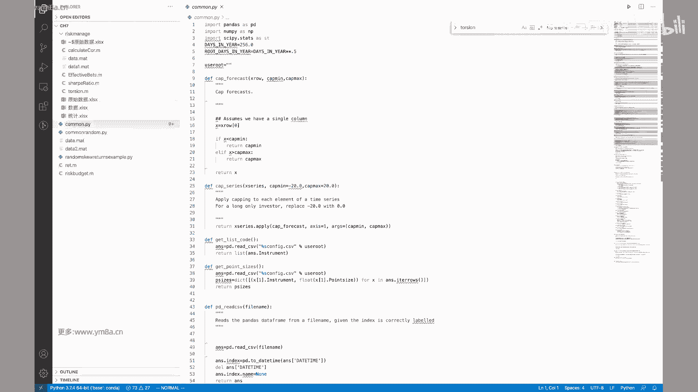

OK然后我把这个，sorry哦，这样子，是应该是这样对呃，然后OK，不好意思，刚刚界面可能大家不好意思，刚刚界面可能弄错了，放放放错了代码对，然后OK。

就是说我们需要去给定这样的一个target shratio，然后给给一个就是说target skill，然后包括它包括TILITY，然后OK然后首先呃annual return。

它就是说是annual的sharp ratio，然后去乘以一个呃TLEBALL对吧，这个呃这不就是我们的那个，这不是就是夏普，夏普比例的这样一个计算的这样一个公式，然后，嗯Y我把这个，OK然后。

OK然后然后就是说是我的，那么我就要去算我的一个是daily return，那么在算dadaily return的时候，就是要考虑是说我怎么把，就是呃要考虑就是啊。

从年画的夏普比率转化成这样一个daily的return。

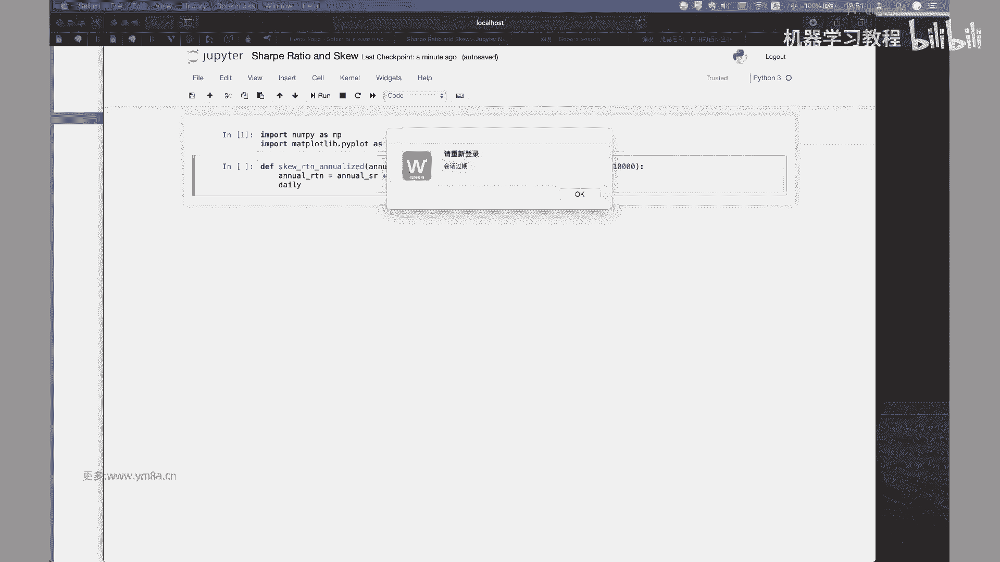

Sorry sure，对于return的话，事实上就是annual return，然后是除以，就是呃我一年有有多少天，然后我们这边就用200，或者把它作为constant好了，我们把它作为一个常数额。

嗯对，然后的话就是那么daily vall的话就是说是呃target ball，然后是除以root days in year。

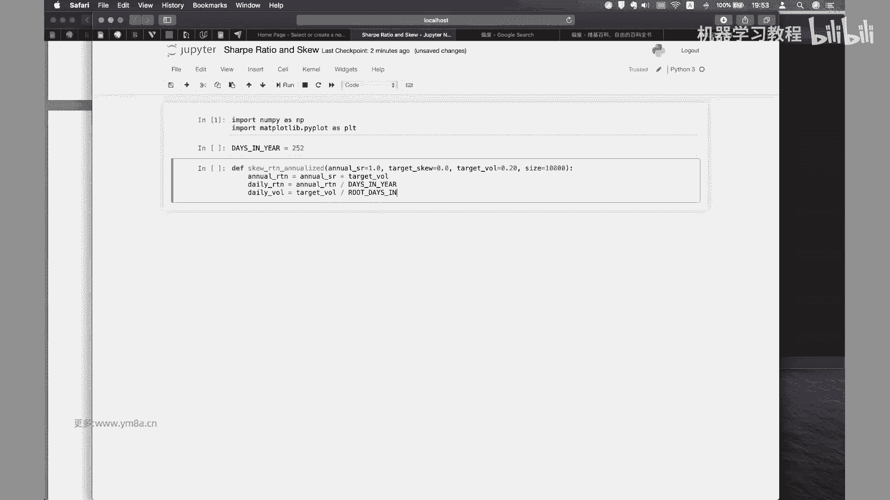

因为这里面涉及到一个开根号的问题，就是波动率对，然后。

嗯OK，root days in year等于就是days in，Year，然后乘以额零就是开根号对吧，OK那么然后这个时候我这这边，我这个时常想写的是一个呃。

这样我我是把它写成一个就是interface，然后skill return，然后我需要的是我希望是in target name，target return是我的，这里return。

然后uh target，uh呃，WW是哦，这边我用应该是target呃，daily v的话就应该是我的daily vall，然后我target呃，我这边这个也是这个就是target呃，对TISSK。

然后size是，size等于size，就说我们前面做的事情是把它去标准化，然后接下来再去input的这样一个，就是说我们把它全部转化成呃，我们日化的波动率跟日化的这样一个收益，记住这边已经全部是。

Square，然后size ok，然后的话，这样做的事情就是说呃我们要去，就是说是生成一个，Non pi gamma diste，Bution。

就说我们要从就是呃ga distribution里面去采去采样对，然后的话对伽马分布队，就是说它的probability density是这样的一个形式，然后接下来我们再来去。

OK所以就是说是嗯我们要生成的，就是说是生成呃，因为伽马有两个参数嘛，一个是就是是一个是shape，然后是一个scale，然后就是说啊这然后ship是not negative。

然后skill是说是啊也是拿negative，然后的话我们在这边的话，Okay，呃我们把shape uh parameter，shape用用什么来做呢，我们用的是呃，二用我们用用这样的方式来处理。

就是用二来除以我们的一个target，我们用TARDISCARE，但是但是就是说呃为什么要让要让，就说我们因为可能会有正片度或者是负偏度，所以我们这边是要用absolute，就是用绝对值。

然后但是要注意的事情，就是说如果我们需要一个偏度为零的呢，所以我们还要去不能用2÷0，那我们再加一个，XE1六极小值好了，对所以完整的形式就是我们parameter。

就是我们的这parameter这样的参数，就是用我们的二除以target school sktarget skill，然后加上一个EPISSUE，这样的话，然后我们再去把它去平方一下。

这样我们就得到了一个就是parameter这样一个式，就是呃shift这样一个parameter，然后然后我们的scale采用的是呃，这个要用的就是我们用target，Target davivo。

然后再去呃除以嗯，Target ball，我想一想，Target b target daviable，然后除以OK，他用的是，Okay，用parameter sh，然后这边我们要去，刚刚是OK。

然后然后接下来的话我们就会去生成samples，就是根据我们的呃，根据我们的garment distribution的这两个参数，random到gm，To prime shape。

Parameter scale，然后size等于size，然后我们需要生成的是，一个list ok嗯，然后我们再去算呃，Ok，然后其实我们就是说要把这样的一个sample给他，去算出来samples。

然后然后如果说我们的就是target q小于零，然后我们的adjust signal，然后把它设成呃-1。0，然后我默认的话是这个有什么用，我们在下面看D等于OK，然后然后我们要做的事情是呃就是OK嗯。

然后就要做的事情，就是说是，我要去把我的这样一个均值去调整到我的，daily return上面去，因为我现在生成的这样一个distribution，显然它的daily呃就是target return。

跟我们的target return是呃是不一样的，那么我们要去调整一下我的嗯嗯嗯，sample main是等于，呃这个是怎么来的，是这个是ga distribution m。

OK所以是k with your ship parameter，K and main parameter mill，所以是uh，Sorry，Parameter mew，对呃，我想找他的是。

现在这个网页可能有点慢，这是为什么我们要用ga distribution，因为我们知道的是伽马distribution，指就是说我们是知道有这伽马distribution的，这样一个skill。

然后我们是用它来去构造，我们想要的这样一个分布，OK会好一点吧，就是说我的想我的mean的话是可以拿ship，就是parameter ship和我们的skill，这样一个PARMETER。

再去乘以我们一个额调整的这样一个，OK我用这个名望是等于，Shape，然后去乘以我们的呃parameter，parameter的呃scale，然后就说我们是希望把他的呃。

然后再乘一个adjusted se格吧，OK然后adjustment main adjustment，我们要对我们的，那时候是我们的target me target呃。

return和我们的命之间的这样一个差距，然后这个时候我的新的samples就可以写成，我对于每一个for x in sample，我要去把它X去乘以呃，Adjusted signal。

然后再去加上我的main呃，Just let，然后我才去把我这样的一个same pose get return，Ok，然后的话先pose，然后我们再去，比如说我们想要去给一个年画下普比例为一。

然后偏度为一，然后给2500个的这样一个样本，那我们就直接调这样一个skit or analyze，这样一个函数试一下FS，然后比如说你就是1。01。0，嗯skill嗯。

然后的话target more的话，比如说是0。20，然后2500，OK这没啥问题，This in year，OK这样，Or primary skill，Primeter skill。

Sample for x in samples，OK这样我们就得到了这样一个skill analyze，return的这样一个呃，我们得到的是它的sample。

就是是我们的这样一个呃return的distribution，然后我们来把它画一个INSTAGRAM对吧，这样我们就能看出他是不是真的是呃，这样的一个targeted。

就是一个是正偏度的这样一个形态对吧，其实可以验证我们的代码，那么我们要做的是sorry，占的是samples list，这本身就是list samples，然后，number b是把它100嗯。

OK看看KPLTP嗯，Matt t y，Ok p l t，这样子的话我们看到的就是说是呃，呃OKPLT点grade等于等于sorry grade true，然后PLT点show ok嗯。

然后我们这边看到的，这就是一个我们想要给定的，说是呃ANALYSE的SHREAL唯一，然后我们的daily daily的这样一个VOTION呃，呃sorry这个是啊，这个是但是年化20%波动率。

然后对2500个样本，这个时候你可以看到这是一个是属于，这是属于一个非常典型的呃，是属于一个正片度这个状态，因为所就是要记住，这正片都是说，你可能说大部分时候都会是每天都会是去亏额，亏一点钱。

亏一点小钱对，但是但是但是这偶尔时候会去赚一些大钱，对这这是一种分，这是一种收益分布的形态，那么同样的我仍然也可以，我也可以去，我们给一个负偏读的这样一个形态，like哦，同样是下部比例为一。

然后但是我的skill是负的，然后我的return仍然是这样，然后，OK对这个时候大家可以去看一下，就是说嗯，对对这刚呃提到就是说是我们没有考虑，就是那个a risk free interest。

你当然可以去加了对，但但我是我这边是主要是想强调的是说呃，对于同样的夏普比率，我们的收益的分布是可以，可能是产生完全不同的形态，那么这两种是孰好孰坏嗯，我个人觉得是看个人的风格对就呃简单第二种。

这这个是是什么样的情况呢，就是说嗯呃怎样我可以做成这样的一种形态，因为比如说我个人去，比如说散户，我去交易的时候，只要一有盈利，我就去落贷，那么显然而说我会限制我的DARETURN。

我每天最多赚个2%嘛，对吧嗯，但是但是但是往往有些情况是说是亏的比较多，嗯嗯就是反而越亏越多，那么我再去反向反向加仓，或者是说死不止损，那么会导致这样一种情来说，我可能会有极端的这些天数。

like1天可能亏了700%分之二，比如说那天市场开盘就跌了3%，但是按照3%，我没有去止损，所以然后然后接着从3%再一路下跌，下跌到7%，这也是一种心情对，那么上面这种情形是什么情况。

比如说今天开盘跌了2%，OK我只要我我投资组合有一个比如说是止损，钱是2。1%啊，负的2。12。2，那么到了这个限制时候，我立刻就止损，那么那么我保证我每天的投资组合，都不会去亏个亏了，超过这样的情形。

那么偶尔说市场比较好的时候呃，我们就采取让利润去奔跑这样一种形式，然后说OK我不设止盈，我可以去这么去做，那么我同样的也可以得到这样一个分布，那么那这两种情况的话，显然就是说第一种是嗯。

理论来说是理性的交易者，我们都希望说我们的策略具有一个正片度，这样一个形态，因为这样的话就是这样来说，我可以说是硬的，我的整个系统是对于黑天鹅有比较强的，这样一个抗冲击力。

但是呃事实上再去第一种交易的时候，觉得是属于一种比较反人类的这样一种情形，嗯这也是说在量化交易的时候，我们如果采取这种量化交易的形式，是在策略里面通过限制我们的最大的亏损。

是可以达到实现正片录的这样一种状况，对可能说你是每天交易起来，可能大部分时候我可能都会去亏损，因为会付出了手续费或者是品牌交易怎样，但是我保证我每天到达最大的亏损的时候，会去清盘。

或者说我今天就停止交易，那么那么比如说我同样的起步资金是100万，那么我即使说是2%的话，那我其实可以抗抗很多个连续下跌的情景，对呃所以这两种的话不能说是孰优孰劣，我我只是我我们这边强调的例子是说。

是给定相同的年化波动率跟年化收益率，我们可以造成不同的收益形态，那么这两种的取舍我觉得是取决于个人嗯，当然我们是希望是说我们的投资组合是具有负，我们是希望我们的投资组合，是具有一定的抗黑天鹅的能力。

也就是说是具有一个正正太的这样一个偏度，OK呃，所以这部分的话是，就是说大家在实际去交易的时候，自己要是去考虑的，我的策略是K是往什么样的走，那么什么样的策略，具有正片度的这样一种状况呢。

我刚刚提到买期权，我平时都是买小期权，我都我都买out of the money，就是我都是买深度虚值这样一个呃，两边去买，那么我赌的是市场有大波动，平时大部分情况下我都是到期归零。

我都会去每天损失一些时间价值，但是偶尔有些情况我会去赚钱，对像这种要第二种的时候，比较典型的例子是market making，可能是说说OK我大概率的时候都会去挣钱，每天都会去挣一点小钱。

但是市场不太好的时候，可能会去亏一些钱，所以对呃在这个领域的时候，就是大家要去就是去自行去思考，就是包括说嗯，对我们想要去或者去赚取什么样的钱，一般来说就是作为一个机构投资者的话。

如果是一个final fund，其实我们更加倾向于会有一个，比如说我们的最大亏损是可控的，因为投资者作为机构投资者，其实是不希望自己的投资，会一天可能出现五个百分点以上的亏损，这是非常夸张的一个事情。

对，也就是说在个人投资跟机构投资的时候，可能这两点会有比较本质上的区别，然后对这一点是想强调大家的时候，就是呃在风险，就是说呃其实这个里面是暗含，就是说我们是嗯。

我们看起来是具有相同年化收益率和波动率的，这样一个资产，其实它可能里面暗含的一个偏度风险，所对应的一个风险溢价，对这个是大家一定要去特别特别注意的对呃，然后另外一点的话就是说嗯，如果你仓位比较大的时候。

其实你还要去考呃，就是说我们讲了今天讲的风险，这是第三点，因为前面第一第一点讲到的是说是呃，我们我们强调的是说是股票呃，就是资产本身可能存在长期的持续的风险，溢价呃，股票和债券，长期债券相对于短期债券。

另外一点就是说强调的是呃，呃风险偏好可能会随着时间变化，但是风险偏好随着时间变化，意思是说这点可能大家呃要去考虑的时候，其实有一篇经典的文章是，就是呃美林银行写的呃。

美林的时钟时钟模型，那么其实这个是一个非常简单的一个啊，也不是说这不是简单，就是一个我觉得是写的。

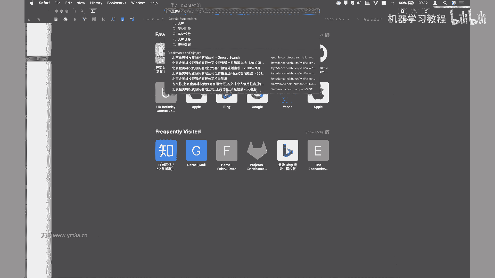

写的是比较经典的一个就是关于资产配置，然后随着不同人在不同的周期里，这不在不同的周期情况下，我们可能要去配置什么样的资产，那么其实这个这个里面就是说，这个里面就是说是嗯那风险其实是类似的。

就是说在不同的时期风险，那么呃是风人们的风险偏好去偏去会会去变化，那么作为一个投资者的时候，你我们应该是要去考虑到，在对应时期的风险偏好，那么要去考虑我的策略去往什么地方方向配置。

比如当最近就是说比如说资金呃漫灌的时候，那其实大家都知道，你说你可能这个时候不能持有啊，大量的现金，你可能要去抗通胀的话，你不管是去买美元啊，不是sorry，不是买美元买黄金，然后是去。

然后或者是去说你去投房地产，或者因为在中国，你可能知道资金嗯，如果不去往股市，只能去往楼市，也只有这两个蓄水池对对，所以要么是股市，要么是楼市嘛，对啊这一点是就是大家是要去就是考虑的，就是说并不是说。

因为风险可能随着时间去偏好去变化，那么我在任何时候都是保持一个低风险，我我都是始终是啊很低的仓位去投资，很高的比例，去处于说是持有现金的这样一个情况，那么这个是要是要是要是是要去考虑对。

因为呃在通胀时期，就是呃就是如果我都只有持有现金，那么其实我跑赢我就已经跑赢了，这个跑输了，这样整个一个无风险的收益率对，所以这个是第二点，然后第三点就是我们刚刚强调的说是呃。

看起来return和dist呃，就是看看起来就是呃SHARRATIO一样的资产，其实可能会有不同的distribution，这个里面可能会呃对，可能会出现不一样的问题，就是说你可能可你说你策略如果赚钱。

是属于第一种呃，是属于这种的话，嗯就要就要去思考一下，就是说我们可能在极端情况下，我们比如说看不到0。02，负的0。02左边的这样一个情况，比如说我们大概大概率的时候都是去，都是这样的，我我投资的时候。

你看到我最近资产收益都是正的，那么其实你要去想一想我这个策略，或者说我这种投资方式里面是不是含有一个对，还有一个偏多的这样一个风险溢价藏在里面，这个是这个是说大家要去思考，尤其是在策略。

可能说我已经跑了跑了观察一段时间，跑了一段周期，发现在赚钱，但是这个时候大家要去注意哦，有没有有没有有没有，可能当市场突发事件的时候，我的策略可可能会产生比较大的亏损，因为嗯尤其是在机构投资者的时候。

嗯就是你小亏其实还无所谓，或者说你不赚钱少赚钱都还OK，但是一旦出现一天7%，8%的亏损的时候，但是大家想就说我很小的一个基金，那也有一个亿的一个亿的这样一个规模，那么那其实亏78%。

那一天七八百万对于投资人是非常巨大的损失，所以这个时候对，这个是大家在做测试的时候要去思考的，那么怎样我要去判断我的这样一个策略，你肯定需要去对应的做一些，就是说是做一些压力测试呃。

对你可能要去考虑一下嗯，极端情形下，比如说你我是，我是说是单纯的就是VO期权的VOTRADING，我要去cell ball时候，对你要去考虑一下，当市场发生巨大的波动的时候。

我是不是可能会承担相应的损失，OK然后第四点的时候说，当我的资金规模达到一定程度的时候，我们就要去考虑资产的流动性了，呃简单的例子来说，就是说比如说我在一个小盘股里面投了很多钱。

然后发现我已经是流通股里面，占的比例比较大了，那这个时候你即使说我通过坐庄的什么方式，把它拉高，我想要去出货，其实也没有没有那么容易能够把呃，能够把相应的就是呃，相应的就是我的股票去清仓，对。

然后另外就是说嗯对，然后对，然后的话就是说，其实机构投资者在投资的时候会去考虑的，就是说我要看啊，我要去配置什么样的策略，他我就要关注我对应的管理人，我背后的底层资产是什么。

那么机构这些投资者肯定是希望说是呃，是投资于流动性比较好的资产，这也是大家为什么观察到，在国内二级市场的私募基金里面呃，主要投资的是比如说是股票，是期货，因为这样因为相对来说流动性会比较好对。

因为呃机构投资者有个需求是我可能会有平呃，不不一定是平台，我可能会有大量的申购或者是赎回，那么我希望我就是说我在申购和赎回的时候，不要去过分的影响资产的价格，对这样可能会给我造成额外的损失。

另外一点流动性的意思就是流动性，典型大家身边例子就是要考虑房地产，对同样的房地产呃，作为一个价值，总价值比较高的这样一个房地产的时候，那么他在去交易的时候，是不是可以很好的去交易。

当我需要去把房子去快速的变现的时候，是不是能按照市场价格去快速的变现，对嗯对嗯，而这里面其实就有一个，就是说是流动性比较低的资产的话，嗯其实说额流动对于流动性比较低的资产，那么它具有流动。

我们会对流动性风险作为一个做一个补偿，那它的价格可能会偏高一点，其实这个也就解释了，就是说为什么是小市值的公司，可能会出现比较高的这样一个收益，OK然后同样的我刚刚说到房地产，就是土地。

然后还有一个是风险投资，因为大家知道就是风险投资的时候，对风险投资额流动性，就是大家知道我是投私募股权基金，我投了很多的创业公司，然后那么其实这个时候我风险投资的一部分说，为什么说可能会出现几倍。

几十甚至几十倍的超额收益，但其实还有一部分是，因为哦我们是有一个流动性的补偿在里面，一般来说我去私募去刚开始去投的话，可能要锁定三到5年对，所以嗯就是说这个时候投资者可能我们就会说。

我们倾向于持有比较长，时长时间去持有这样一个低流动性的资产，比如说房地产，我们不会去频繁的去交易，因为这个时候他可能会具有更高的回报，OK呃然后还要再提到，就是说风险的话。

就是说是看就是说嗯我看到了这个市场有利润，但是我不一定有办法能够去做进去，这可能是因为交易壁垒，比如说大家都知道A股，A股有些标的值得投，但是只有作为中国人，就是说我我才可以去投资。

那么外国的个人想要去投资的话，那可能只能去通过呃特定的渠道来进入，对那么这个是有壁垒对，然后不管你说是港股通啊，还是还是B股的方式对，嗯然后另外一点说是我想要去做高频交易，OK那可以。

但是做高频交易的时候，你需要去租用交易所的服务器，然后你需要你甚至可能要去拉专线，如果说你要去比如继续做商品期货，我利用芝加哥智商所的信号，来去跟国内去做联动的话，那我肯定要去拉一条赚钱。

对或者要去租用这样的赚钱，那这样的价格和成本都是要去考虑的对，然后或者说呃私募股权投资的时候，我知道这家公司很好，但是我要去做投资之前，我是要去做尽职调查，那么我也需要就是聘请相应的法律顾问呃。

聘请相应的律师事呃，律师事务所，然后会计事务所，那这个时候也是需要很大的投入成本，所以在交易的时候是这一部分也是要去考虑，就是交易壁垒，还有收益的，就是要考虑权衡我的成本跟收益呃，另外一点就是说呃。

还有我觉得个人觉得比较有意思的一个领域，就是behavior finance，行为金融领域其实是有很多的一些，比较有意思的解释，就是能够去解释，我们现有的传统的经典的金融学，不能解释的这样一个东西。

比如我刚刚提到的说，人们总是希望于去止盈，为什么要去止盈呢，因为我每次交易的时候，OK我都去做对了，然后我盈利落袋了，那么我我去止盈的时候就可以，我又做对了一次。

那其实大脑会认为OK我自己又做对了一件事情，那么为什么不愿意止损，因为止损就认为就其实是要去让自己去承认，我自己做错了这个决策，那其实是比较困难的这样一个事情对，OK所以那么其实基于这一点的话。

行为金融学其实是能够做出一些比较有意思的，这样一些策略嗯，OK然后我们刚刚总结一下呃，就是说嗯就是说拥有正偏度收益的，这样一个策略会有哪些，就是说呃就就像这种的话，其实这个我不知道大家如果做过期货。

应该会想到典型的就是趋势跟踪的策略，其实它的收益分布会非常像，每天可能会会有点小亏，但是会抓住一些机会，会我会去赚的比较多，对这是CTA就是期货这一块趋势跟踪，然后还有一个就是说是买期权对吧。

然后这个是正常的，然后负偏多的话，其实一个是这FX carry，就是我去做外汇的这样一个逃离，然后还有我是short fall做空波动率，然后还有market making。

然后还有一个典型的例子就是long term capital management对吧，就是长期资本做债券的套利，那么其实也是有负片读的，OK所以今天第一节课是给大家。

就是希望大家就是说在结束这门课程之前啊，千万要树立，就是风险跟收益同源的这样一个概念，然后我们要你需要去清楚的知道，我们在交易过程当中可能会存在什么样的风险，另外一点就是就是operation。

就是呃操作的风险对啊，因为有同应该有同学是这方面的专家对，然后就是典型的就是超额是骑士资本吧，应该是400个million，就是4亿美金对，是应该是一个小时内全部亏光，就是高频交易服务器的出错。

OK这个是运营的风险，这个是大家要去注意的，所以呃还是强调的说嗯，这门课程我们讲的是量化投资，没有鼓励大家，说是去实际的自己去拿自己的资金去做，因为我觉得就是呃对自己的钱，还是要去非常的慎重。

不管是去做股票还是做期货，尤其期货加上杠杆，就是或者说他的杠杆比较容易去获取，大家千万要注意对，所以OK呃第一节课的内容就是跟大家讲的，就是说是呃主要是要去强调各种各样的风险对。

OK希望大家就是在未来的时候投资，是希望大家投资顺利，OK然后咳我们先休息一下，然后下节课的话就是刚刚这篇paper讲到的是呃，sorry不是是刚刚在群里发给大家的一篇paper。

讲的是说我们怎么去optimize呃，我们现在这样一个就是minimum torture，的这样一个一个方法，就是risk budgeting和呃diversification。

就是用一种新的线性变化的方法，然后我们去消除我们的呃，变量之间的这样一个相关性，OK然后下节课我们再来一起去看一下，好那大家先休息一下。

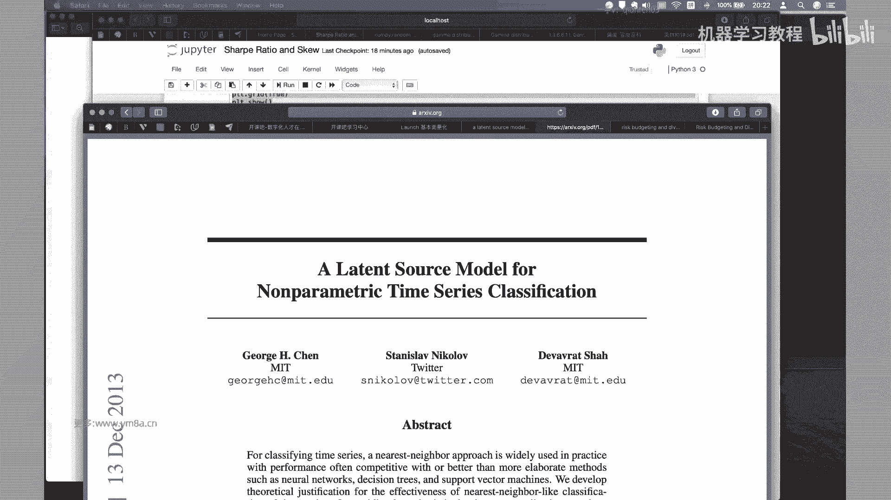

诶hello，同学们呃，我们开始第二节课，然后呃这篇paper他原来是就是自带，是这个作者在他个人的blog上面写的一篇文章，然后嗯对，然后就是说呃他其实他是，他是想说。

就是说他会类似于呃我们之前有提到过的PC，然后把原来变量之间的相关性去消除，把高度相关的这样一个变量去转化成呃，完全不相关的一个正交的因子，但是呃主要是它跟PCA的区别是PCA，我们得到的新的呃向量。

其实它的内在的含义是不确定或者说是模糊的，嗯那么我们在这篇文章里，他提示提出的就是说是一种嗯，更具有直观性跟可解释性的一种方式，呃其实简单的来说是，OK我们先简单的就是对比一下这样一个图。

就说我们原来比如说我们有三个的因子向量，那么作为一个PC来说，我们得到的是三个互相去垂直的这样一个向量，但是呃跟原来的区别是比较大的，那么我们用他所说的这样一种。

minimum torsion的这样一种方式的话，是得到的仍然是三个新的呃，呃互相是正交的这样一个向量，但是它跟原来的向量的偏差是最小的。

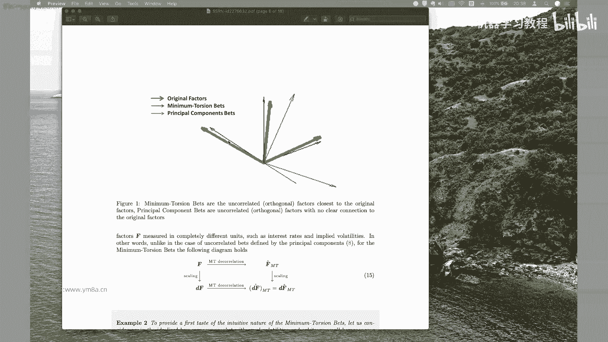

所以他其实解决了他提出的是这样一种概念，那么他为什么就是他的呃，OK就是为什么要去采用这样一种方式呢，就是呃可以简单的来跟大家呃，这篇paper应该是有提供扣的，所以我们可能这节课不用带大家去。

是我我没有看过他，我自己去写，稍微用那个Python写了一下，然后其实本质上可能里面就是到最后，也就是去掉一个包，去解一个这样一个图优化的问题，对，然后对应该是它是对，用用用围绕的方法去解一个图呃。

去解一个优化的问题，所以呃后面就是说如果要涉及到解法的话，可能需要大家有一定的，就是数值分析的这样一些基础对，然后可能做起来会会去会比较方便对，然后的话OK我们先来带大家简单的勾勒一下。

就是为什么他要有这种方法对，呃其实他这里面也好对比，就是说是呃呃我不知道大家有没有理解，我就是risk parity，就是说嗯，这不是就是就是桥水资产比较典型的一种策略，就是说我们配的是。

我们希望我们的target这样的一种呃，我们不同的资产把它配置到相同的，我们不是说是去均匀的分配，而是说我们把每种资产的啊，波动率配置到我们相同的这样一个呃，或者说我们目标的这样一个比例。

所以说我们把配资产变成了去配风险，OK然后的话对据说是嗯就是说他这边嗯，他提到的说是他这边在这种档里，我们用的是呃呃，我们是基于一种effect number of bts，的这样一种方式。

然后就是原来的话是说，我们是算的是correlated factors，那接下来的话就是说我们用这种方式的话，能够去能够去有，能够去更好的去衡量我们的风险，因为因为我们的风。

我们的不同的因子之间完全是正交化的，那么我们就可以去计算出我们的因子，对于我们这个因子的风险，对于整个组合风险的这样一个贡献，OK呃，然后就是说这个的话就是说是我们如果有额，如果有N个投资组合。

然后每一个投资组合占的比例是的是weight的话，W n，那么我们整个然后R是每个每个的是每个呃，每个SI这样一个return，那我们的total return就是他们的加权平均，这个没有问题。

然后那么对于呃，然后对于典型的因子投资而言，我们之我们之前有提过，因子投资，本质上是把我们从asset资产上的收益率，转化成一个因子的收益率，所以我们把这边的FK的话。

就是说是嗯嗯还有就是把它变成就是呃factory，Return combination，仍然是我们的投资组合，那这两句他的下面是表的是呃是的呃，但sir这个bk他不是说是那个weight了。

其实是就是exposure，就是投资组合在这个因子上的这样一个暴露，暴露的程度，然后的话OKOK然后，然后就是这边的话，我看看这个notation有没有必要去告诉大家呃，然后呢。

然后这边其实他提到就是说是呃呃相对的，True relative contribution to the total risk，就是说我第K个资产或者说是D呃，K个K个因子的话，就是说是嗯嗯K个因子。

然后我他对于组合这样一个投资组合，风险的这样一个贡献度是什么，而是说是说是这样是一个就是BK，然后乘以这样一个FK，然后这是它的一个波动率，也就是说是，也就是说是我整个投资组合，在K跟上面的暴露度。

然后乘以投资组合的收益率，那么我就得到了投资组合的呃，然后我算这这个这一部分的这样一个VANCE，然后再除以整个的收益率的序列，这样一个VANCE我就得到了是我这样一个贡献度。

然后那么显然是说我所有的贡献度加起来是一，同时每一部分都是大于等于零，OK嗯OK然后的话呃，然后就是说然后我们想的就是说是呃咳咳，然后什么叫是所谓的风险评价，就是说是我每一部分投资组合的贡献。

都是一样的，股股票债券或者是其他的对吧，然后OK嗯然后在接下来的时候，它引入了他引入的是一个就是effective number of best，概念，其实指如果是学过有信息学背景的同学。

应该知道他是来自于就是一个呃，它是它是它是衡量是我这样一个分布的，就是相当于说是一个混乱度对，Ok，那么那么他就是用的是一个就是就是一个是撇，就是求和，然后再用exponential的这样一个形式。

OK呃学过信息论的同学应该对这个比较熟悉，对呃对，有点类似于最大商算法里面这样一个概念，OK嗯对啊，然后的话OK然后他就是要说的是嗯，Okay uh，OK然后然后现在提到的是。

就是说呃这部分其实就是说我们强调这部分，就是说我们原来比如说有了一系列的资产，然后我们要通过就是说啊，PCA的方式去把它转化成一呃，转化成就是新的principal component beats。

它其实要做的事情，就是呃，就是说我们我们，我们我们这边把所有的因子跟我们的呃，或者说跟我们的或者说是原原始的呃，不同的资产，我们就把它嗯进行等价的去呃等价，我们后面就是把它认为是等价。

就说我这边F可以说我可以是不同的factor，Factor，也可以是我认为是不同的asset对吧，那么我要去算我不同的这些factor，这样直接的就是COVERANCE，然后我去做PC对吧。

其实做了也就是做了一个就是i d value的，就是嗯去做一个decomposition，然后得到了，然后就是说比如说我们得到了就是嗯，然后我们得到就是，OK然后得到就是拉姆达是singular呃。

打个diagonal matrix of singular values，然后就是square root of icon value，然后就是一的话就是我们的icon vectors，然后再把它去。

OK然后已经normalize了，所以然后他就说的是，这边再定义一个叫principal component，Component bus，它这个是什么意思。

其实就是把我新得到的这样一个呃icon vector去啊，去乘以我原来的乘，乘以我原来的factor，那么我就得到了，就相当于说做了这样一个线性变换，OK然后的话我就可以说是然后就可以得到。

就是说我的return的话，其实就等于我新的这样一个，还有就是就是得得到新的这样B乘以呃，新的B然后去乘以我呃原来这样一个factor，然后也就等价于现在这样一个形式，OK呃。

然后的话OK然后所以它我通过上面的这样一种，我先去把它去呃，呃去做PC，然后我就可以去得到我新的呃，就是PC的，在这在PC的情况下叫principal component。

Double sification distribution，然后就可以呃得到这样的形式，对额这部分是怎么来的呢，是OK他说这个是啊，你也得看一下，Sorry，这部分的话感兴趣的同学可以自行去看推导。

对这部分不是对应该这这部分不是特别难理解，然后然后主要想强调的就是，接下来他这个我们想要强调的就是说对，为什么他要用这个minimum torsion的bets，那就是说我们之前用PC，其实呃直观来说。

我已经把各个的呃资产或者说因子，已经去做了分散化，就是说我已经得到了是不正交的这样一个因子，但是呃呃这个来说按理来说性质是比较理想，但是它有一个什么样的一个问题呢。

就是说是嗯他说的是statistical，Statistically unstable，然后就是说呃就是说他说是对呃，就是说是不是特，就是说我得到的这样一个新的components，不是特别稳定。

而especially to to都是relative to lose agement，就是说如果我特征值其实比较小，就是说我如果把我的那个答案对角的那个矩阵，从大到小排列的话，就越往后的话。

其实说是越来越不稳定的，OK然后第二个人说是说它呃不具有一个，就是说他不是说是，如果我去进行scale的transformation的话，那么但是我得到的新的这样一个新的，得到了新的这样一个东西。

它不具有一个良好的这样一个特性，就是说我同样都去scaling的话，两个scaling得到的结果是不一样，按理来说，如果我我希望的性质是说是我嗯我原来的factor，我去scale一下之后。

我再去做PC，我得到的呃，我得到的东西应该是，相当于说把我PC之后的结果再直接去做scale，两个得到的结果是一样的，但事实上是不一样的，那么他举了这样一个例子，他举了这样一个例子是怎么来说呢。

就是说反直觉的这样一个例子，就是说他举的是一个近似于呃，就是说我每嗯，就是我比如说他考虑这样一个PFOLIO的呃，我有我有我有N个，我有对我有N个p foo，然后的话呃就我每一个weight的话。

在资产当中我都是占N分之一，然后嗯然后他强调的是这样一个信息，就说我所有的因子都是具有相同的波动率，然后并且是呃，然后然后他的然后就是说如果是，然后并且相同的波动，并且是说的话如果两个不相等的话。

两个两个因子不一样，不两个因子不一样啊，他是说他们的，就是他们的correlation其实是完全一致，这个其实是非常极端的例子，就是说嗯OK然后但但是然后他这边强调说是。

我虽然说我不同的因子之间会有会会是相同的，就是CORCORRELATION，但是我的correlation的这样一个系数，其实是非常小的入，而这个roll是非常的非常的小，所以呢嗯你你可以这样。

他就说是说是嗯，所以他把这个认为是叫HOMOGENIUS这样一个market，在这种情况下，他认为是说我说我这样分散化的资产的话来说，是我不管怎样去分配的话，我其实呃大家直观的可以去想一想。

我不同的资产之间嗯就是说我们的相关性很小，对或者说近似于零，那么我再去分配的时候，其实我应该是考虑到把所有的资产，就是我会非常的去分散化的去配额，去配置这些资产，这是我们的直觉，对不对。

因为嗯对这两个资产之间没有什么相关性，那么呃就举简单例子来说，如果两个资产是完全相关的，就完全是相关的，那其实就说我配两个资产，配哪个都一样对吧，那么如果两个资产是完全不相关的话。

那我说其实有比较好的配置，说是我可能一人一半，那么按照我们的这样的一种思考的话，我们我们近似认为，如果N个资产之间是有非常弱的相关性，那么我N个资产配下来，应该也是说。

也是说是近似于均匀分配的这样一种结果，但是事实上呢说我这样的，但是我事实上就是说用上面这种方法做下来，说是呃equal the portfolio，他总是呃就是说总是说我会去。

总会去bet同一个这样1bet，bet唯一的这样一个资产啊，sorry不是唯一就bet这样一个资产，但是事实上就是说是OK，就是说这种情况下，是，就是说是认为PC，我们用这种方式是去解决不了的。

因为其实他他其实构造的是什么样的一个意思，就是说我再去算不同资产之间的相关性的时候，就说我事实上就是说我这个矩阵，我要去算他的咳，我要去相当于说是去做我算它的特征值的时候，其实是比较难截。

然后可能说我的特征值都比较小，因为我整个矩阵对，大家可以去自行去验证一下，就是把它举证找到这样一个，就是说就是对角线为一，然后嗯然后我们去找到一个就是非对角线的，correlation的话都是非常小。

比如说0。01，然后我们把这样的一个矩阵，大家去算一下它的特征值，然后再去看一下，就大家就能明白他所说的是什么意思，也也就是说他们提提在前面提到，就是说对于嗯lowest egon value。

当特征值比较小的时候，就算出来结果不是特别稳定，OK这部分的话对，如果不是特别熟悉，大家可以去呃，回顾一下线性代数里面的一些相关的知识对，然后应该就能够去明白，我刚刚所说的这些东西是什么了。

对那么那么对于以上的这些问题，作者就是提出了这样一种新的，这样一种解决的框架，叫minimum torsion beats，它本质上来说是minimum torn，是转换嘛，那去转。

然后或者说是我是希望的，是，说把我原来的这样一个factor，去旋转一定的程度嗯，呃旋转一定的角度，然后说使得说我的这样新的factors是互相正交，但是我跟我原来的factors其实偏差不会特别大。

OK那这个我觉得其实是比较有意思的一个想法，因为大家在做特征工程的时候，我可能挖了一堆因子，然后我也可能也去用PCA降维了，但降维下来有什么东西我可能不是特别清楚，那么用这种方式的话，我可能说嗯。

可能来说是把我这些新的因子去进行一个，打包的处理，但同时得到的因子跟原来因子偏差不会特别大，但同时又有效的降低了我组，我的因子之间的相关性，那其实这个是，也就是说我们是非常想要的这样一个结果。

我个人觉得这个这种想法提出来，还是比较有意思的，OK呃咳OK就是说是他其实他要做的事情是什么，就是说我本质上是说，我去构造一个最小的扭转矩阵，然后把我原来的这样一个向量，转化成正交的一样一个因子向量呃。

那么首先呢就是okay uh，但是提到就说是之前的巴拉巴拉巴拉巴拉，然后rapt sub optimal，Ok，然后fortunate就是说除了原来的就是说呃。

zero correlation的transformation就是PC是一种，那么我们还可以说是呃，就是说我现在的呃呃original factors allows to express。

就是把我现在的投资组合啊，转化成新的一种decomposition，转换成新的投资组合的方式额，所以他这边强调的说是，我们其实要引入的是一个TORTIONS对吧。

就是说反正其实本章就是factor rotation，就是把我的因子去旋转，大家要是看到的话，就说下面这个图，它的根就是说我的起点是没有变，我直接把它进去，把它进行一个旋转，然后的话OK。

然后这个这个矩阵的这样一个dimension，就是说是呃K乘以K，因为我有K个因子，然后的话，OK啊然后这部分CHOLOSKEDECOMPOSITION，学过一点数值分析，应该知道这个是啥。

但是我们不用看这个，然后我们需要我们主要关注的是，它是怎么去定义我们这样的啊，Tortional transformation，他说我们的torsion transformation是这样的一个。

就是说是嗯它是我们的呃咳他是这样一个矩阵，他要去满足，说是我要能够去呃去求这样一个公式的最小值，但同时它也是说是哦，sorry这部分是就是说是就是同时你要满足，就是说这个东西就是说是我额。

那我这边的话就相当于说是我TF把我们的，就是我的TF算下来，就是说呃TF的话，然后你sorry tf的话，就是如果你把这边的LL换成l inverse，或者是呃T的话，其实无所谓。

就是t inverse，然后是然后是sorry，就t inverse T1，然后T转置，然后T的inverse的转置，然后你乘起来要是I要满足这样一个条件，然后他说的是你知道NTE叫什么。

我也不知道他为什么叫NTE，然后但是他说的是呃，Multi entry，Normalized tracking error，这个track它本质上来说是tracking error。

tracking error的意思是，我需要去跟我原来的向量之间的，那就是说是叫它叫TRACERRY，也就是说是跟踪误差，然后就说我们在这个里面，这个公式里面就是说是呃他这个K的话是。

比如说FK就是原来factor的第K个元素，或者是第K个factor，然后这个ZOK，然后嗯然后这个Z的话就是说是我新的sorry，这边，因为这个Z的话就是我是是新的这样一个呃，Factor。

因为TF我转就是说我转旋转token之后，转完之后就是我新的这样一个factor，那么我Z的话是decake factor，然后这边呢嗯然后这个SD的话是标准，这个SD就是标准差，然后刚刚这边说的。

其实这个的话是应该C1CR的话，是相关系数的还是相关系相关系数矩阵对嗯，就这个是什么意思，就是说啊这刚刚这个，但这个这个其实你就是我们刚刚说过，说我们需要去分散化，对不对。

但同时我要去满足我新得到的因子，也是说是尽可能的是，当然这边是等号，也就是说我希望我的就是不同的因子，是完全是独立的，所以说他是，我说我的相关系数矩阵是一个identity。

是一个就对角线为一的这样一个矩阵，这部分大家可以理解吧，然后um okay，然后的话就是所以说他要去相当于说是去下面，我要去minimize，是我这样的一个track error。

但同时我要去满足我的呃，满足我的这样一个仍然是呃因子之间，独立的关系，其实我觉得也是非常符合直觉，只不过说是在这部分定义的时候，我们可以去思考一下，作者为什么当初要采用这样的一个定义。

所以还是回到我们的就是刚开始的出发点，就是说我希望找到一套新的框架，能够去使我的因子仍然保持正交化，但同时我希望我的因子具有可解释性，那么怎么去衡量可解释性，在这篇文章当中，作者采用的方式说。

我是去跟原来的因子的向量的偏差去最小化，OK然后的话咳咳OK额，所以说嗯你可以这么想着，说是我通过旋转的这种方式，我把我原来的这样原始的收益率的向量，或者是原始的因子的向量转化成一个嗯，转化成一个嗯。

稍微就是说我转化成一个新的向量，但同时仍然保，仍然保留原来样本中很多的这样一个信息，OK所以的话，这个是我觉得是这篇文章里面，最为重要的一个创新点，然后的话咳OK额，我不知道。

就是刚刚这一部分我给大家讲明白了没有，大家就对这部分有什么问题吗，就是呃接下来就是说求解的部分，你可以不用去了解，其实其实他求解部分自己写一下也没有，很很麻烦，大概十几行代码也可以写完对。

但是我希望就是大家去理解这个概念，就是说我们怎么去，所以就从刚开始我们去去挖因子，然后去很用呃，去衡量因不同因子之间的相关性，然后我们有用去PCA的方式去实现因子的降维，去找到新的组合之后嗯。

更具有解释性呃，更就是更独立的这样一些因子，但是同时在PCA的过程当中，我们可能丧失了因子跟原来的具有可解释性的，我们人工构造出来的这些因子之间的相呃，可解释性。

那么我们希望说是嗯仍然保留PC不同因子之间，相互独立的特性，但同呃就是correlation为零，但是同时我们希望我们的新得到因子，具有可解释性，所以这是我也是觉得是比较重要的一个思路。

就是我们怎么是去一步一步的去逐步，解决相应的问题，那么嗯对这部分我不知道，我给大家讲明白了没有，就知道整个问题的就是motivation，我们是怎么来的，呃是这样就是呃相关性的。

就是举刚刚有同学提到相关性矩阵对角线为一，就是这样，就是说嗯我们相关性矩阵就是呃let's see，就是这样，就是说我们为什么比如说我们是十个因子，或者是十个呃，十个asset。

其实我们希望说是分散化的时候，是做到什么样的地步，就是说哦因为每一行就是说，比如说每一行从这边是12345，6789十十个资产或者十个因子，这边竖也是个因子，那么每一行每一列代表的是两个因子。

或者两个S之间的correlation，那我们希望这个correlation matrix对角线为一，什么意思，就是说除了我自己跟自己是完全相关，我希望我自己跟其他的资产都不去相关，都是没有相关关系。

那么这一部分，也就是说是整个这样一个相关性的，这样一个对角，就是这样一个对角，这是一个大一个呢，就是唯一的这样一个矩阵，我不知道我解释清楚了没有，那这个意思是说什么呢，我这就是说我想要达到分散化。

什么是分散化，那我们说我们的correlation matrix，就是是这样一个对角矩阵，就是就是一个啊就是一个sorry，这个叫identity matrix。

就是这样一个对对角线全为一的这样一个矩阵，恒等矩阵对吧，就是说我怎么去衡量，说是分散化嘛对吧，你当然也可以说是OK我找到next呃，就是说嗯对，因为因为因为随便去，大家画一个任何的收益率的话，就是各个。

但我我们举一个简单例子吧，或者对我们呃对举一个简单的例子，我们去实际看一下，就是说呃，你看一下几个SR之间的，Okay，Um，这个是应该是，这应该是我拿的是几只股票的这样一个，八只股票。

然后一百一十一千一百一十五天的这样一个呃，价格的数据，然后我们去算一下它的correlation，这样怎么去算一下它的correlation的这样一个呃，matrix应该是可以的，OK嗯。

首先呢就是return matrix对吧，是什么呢，就是，我用log好了，Log return，呃sorry，不是初见，OK这样我就得到了是额1113天的，一百一一千一百一十四天的这样一个return。

然后的话我再去算一下他的correlation的，correlation的matrix，那我其实直接就呃浪派是哪个来着，所以我查一下南派coration matrix，对啊okay。

然后或者画它coverance matrix，其实是一样的，好像correlation好了就，可能需要可能需要一定的转制，但是应该还，On pon correlation，啊这个维度好像不太对，对不对。

应该是8×8，那么转个置好了，Ok，对额这部分就得到了我们的correlation matrix，然后显然对角线为一对吧，然后这个是不是画的不是特别清楚呀，好吧就选第一个，选三个字上好了，这样可能。

对吧，就是说我们对角线为一，然后看到就是说呃这几只股票是什么来着，OK对，可以看到就是还是有一定的就是相关性的对吧，然后第二支的话是光明乳业，然后大家看到刚刚我们看到的就是232个。

correlation比较大，因为都是证券，海通跟中信，所以，呃2332对，这两个没错，所以所以所以所以说这篇文章就是说是对，然后具体说要去我怎么去求解这样一个问题。

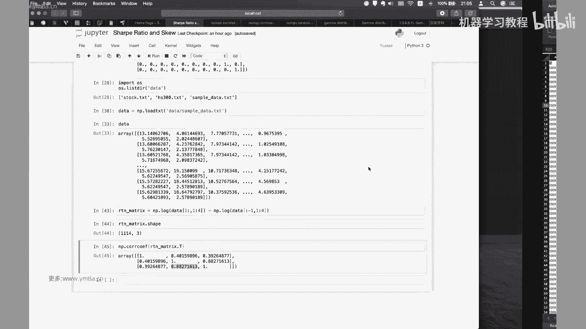

其实论文当中已经也给出来了，所以说是我一般来说就是说，一般是这样一个优化问题的话，你都会去想办法去把它转换，呃，如果就说我们直观想到说能够有解析解释最好，然后如果不能有解析解的话。

一般会用数值解的方式去做，那么他要去做的方式其实只是说是，哦就是把原来的先算一个，就是呃原来的COVERANCE这样一个matrix cf，然后接下来他要做的是这个这这这一块的话对。

其实它的算法就给到这，然后呃照着这个其实就已经可以去实现，你本质上就是说给一个D，然后然后啊matt tab是有直接它直接的这样一个function，我也不知道这这个是什么，但本质上就是这个应该还行。

OK他就是，OK这个应该是这个，这个应该ok Python可以去解这个事情，然后其实大部分来说，你本质做的都是一些矩阵的乘法，或者是universe对吧，universe你就是拿DC去反斜杠。

N去除它就OK了，然后对这部分这部分就是说可能，然后就是刚开始，如果大家说我觉得就是说不用去关注，说我如何的想到这个解决方案，你我我们就做量化的时候，你可能更加需要关注的是。

OK我需要看明白它每一个里面写的是什么东西，然后我如何要去求解，然后这里面给了一个case，然后我不知道大家有没有兴趣，就是如果大家有必要的话，我就呃可以可以可以就是演示一下，我们怎么去做这个事情。

但是呃我我我的建议是说呃，不是你这边paper应该可能给了源代码，对应该呃即使说是PMATLAB写的话，那我们肯定用Python转一下，其实也不会是特别的花时间对，就是说我我希望大家就是说要注重的能力。

是通过paper里面，然后看了能够去快速的看得懂paper，然后把里面相关的一些呃方法去实现对，然后的话对，因为上节课其实有同学问我，就是说说他遇到了一些可能说paper的话，可能说不是看的特别懂。

然后问我有什么办法呃，我的意思肯定说是慢慢的耐下心来看，然后看自己缺的是哪一块，因为其实看了这篇篇文里面还涉及到一些这，这里面涉及到一些比较多的东西，可能是呃可能应该是数值分析里面的一些东西。

然后希望大家就是说，可能线性代数的基础会好一点，会好一些，然后如果上过线性呃数值分析的课程，包括刚刚前面讲了CHLOSY呃，Decomposition，然后包括说其实PC的话。

其实之前我们课上也写过吧对吧，不是直接去掉包，而是说是我们去去通过求特征值的方法，然后我们去看特征值到底要去切到哪来去做PC，那么在这边对，那么大家可能就是那基本线性代数基础，肯定要去掌握的。

然后如果可能你缺了一些基础，可能就会觉得有些东西不太看得懂，然后如果是上过数值分析的话，对于他这套就是说围绕的就是方法，其实是应该是会比较熟悉的，就是我给定一个初始的解，然后给大家，然后我去不断的去。

就是说iterative，就是不断迭代的方法去逼近最终这样一个解对，然后学得好的同学或者技术扎实的同学，应该也要知，也能够知道这个算法的，就是稳定性对，以及说它的效率怎么样，因为在实际交易过程当中说。

如果我算因子就很很简单，就是说比如说我是算分钟的因子，然后但是我有3000多只股票啊，3000多只股票，然后假设我几百个因子，然后我每分钟都去算的话，如果我这个数值解的解法需要花很多时间。

那么在实际交易当中就是不可行的，并且我要去考虑我这个数值解，在交易当中稳不稳定，所以这部分的话是可能大家要去要是去关注的，就是说除了看得懂paper，还有就是说不管是用METB还是用C加加。

还是用Python呃，要能够去写出稳定的解决方案，但是一般来说去交易的话，可能直接咳数值解的方法可能都要去呃，用C加加来实现，包括如果有交易债券的同学，也知道就是linear programming。

就是在加群当中应该用的是比较多的对呃，然后这部分的话，我看一下作者应该是有那个有code的话，然后这节课的话，我们应该不会就带大家再去去去，把这个核心的算法去实现了，但其实就是整个流程其实已经写在里面。

这边还是挺应该不是特别好，就是MATLAB的代码之后可以给到大家对呃，对其实核心的就这几行，对作者的话sorry。

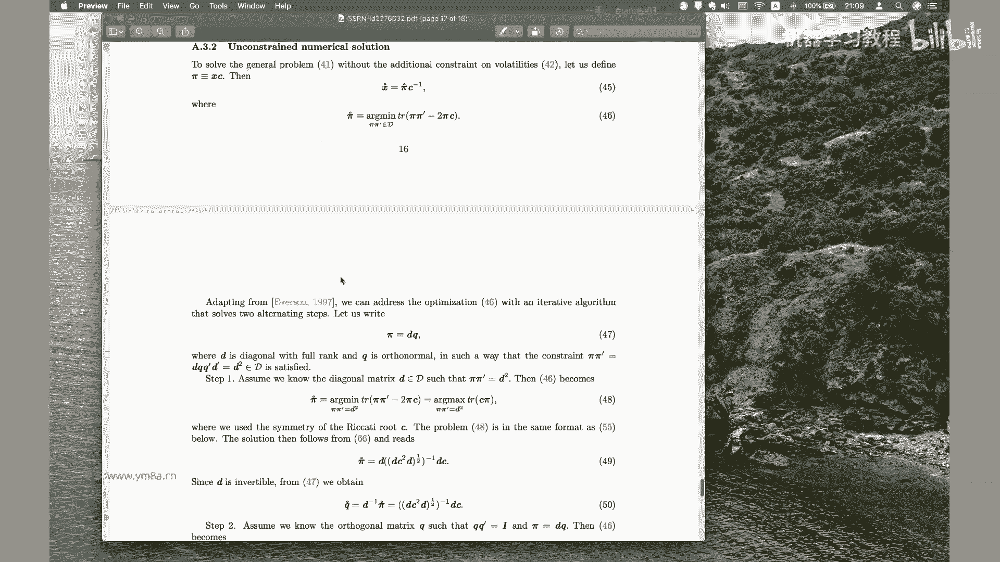

作者的话应该我看一下，作者应该是给了code的。

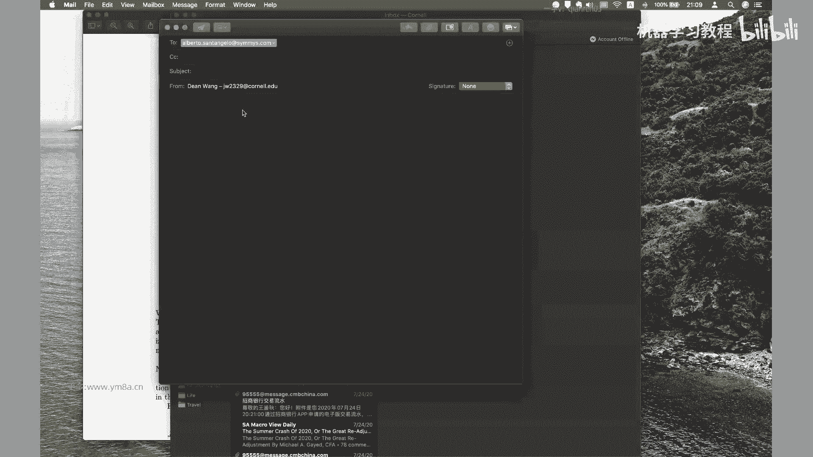

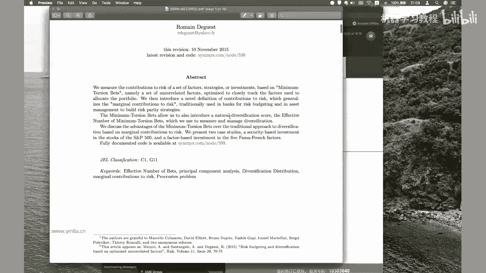

Sorry，我应该把邮件退掉。

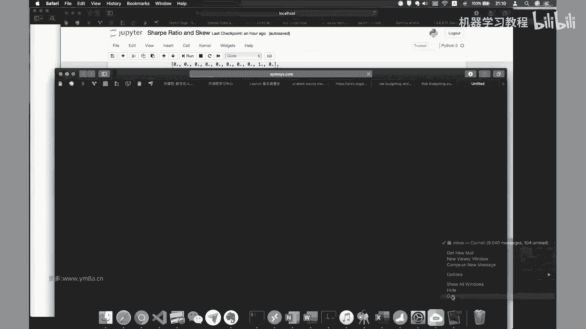

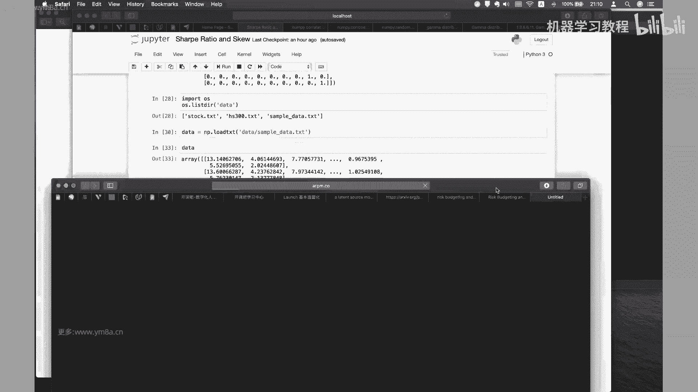

对然后课后大家可以去自己把那个代码去下呃，下载一下，OK然后的话，所以对于这篇论文的话，呃大家有什么问题吗，对我觉得就是他比较比较有意思的一个点，就是嗯对，就是用，用一种新的方式能够去定量的衡量。

我们asset或者是因子之间的一个相关性，对额，这个我觉得是比较嗯，比较有意思的这样一个地方，Full documented code r，嗯page好吧，这个肯定是register member。

可能需要大家自己去注册一下对，然后拍对MATLAB的code可能会好写一些对。

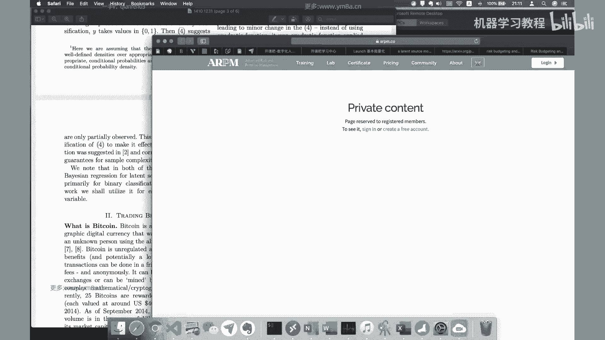

因为可能就是有一个嗯，我唯一还卡，目前我还卡了一个卡的地方，就是他上面提到就是，嗯对，这个这个我不知道就是Python里面有没有什么解决，解决解决办法去走，或者因为因为因为呃METAB是可以直接去掉。

这样一个呃掉就是掉一个掉一个包就对对，所以可能Python这一块的话，可能大家去看一下，但这个好像也不是特别麻烦，OK可能把对，就是把这个式子求完之后直接去开根号。

但是我就是说呃因为中间肯定涉及到很多的，就是呃中间的变量，其实我们不用说把所有的每一步都去完整的，就是说算完数值额，就是说把DC平方D3个乘起来再去开根号，这样这样这样这样去做。

肯定是就是会比较比较慢嘛，对吧哎那肯定就是说如果中间有变量，我能够知道，有说上一步能够利用上一步的一些变量，那可能就是说算起来可能会优化一些，对，所以OK额这部分的话。

然后它下面有一个就是对比的这样一个结果了，就是它里面就提到就是说是用呃，用他这种方式的话，能够嗯能够去产生怎么样的这样一个呃，能能够产生什么样的变化，对我我给大家就是我给大家建议。

就是说是呃最好是呃把这个算法实现出来，然后你我们可以去对比一下，就是说嗯把PC的方式应用于，刚刚我们说的那个就是股票N支股票，然后去算一下他的呃，呃然后去看一下它的相关性矩阵，相关性矩阵肯定没问题啊。

一般来说经过呃就是样本去处理之后，就是呃我的correlation应该会近似于一个看，近似于一个就是呃对角矩阵，然后但是然后也可以让说再用一个，就是我们现在用的minimum token这样一种方式。

再然后再去看它收益率相关性的，这样一个矩阵呃，OK然后的话怎么去测试，说怎么去测试我的MINIMUTN的方式，跟我原来的呃，跟我原来的PC的方式的组合的优劣呢，我们可以选取一个简单的benchmark。

就是说我们把我们的asset去做一个投资组合，怎么去做投资组合呢，我们呃一一个是说是呃也就我的benchmark组合，你可以用就是risk parity，比如说我有八只股票。

那么我通过比如说我是每个月调仓，或者是每个季度调仓呃，让我的每一只股票所占的，占投组合的风险是完全一样，都是12。5%，然后我可以去，那么我通过这样的方式的话，我是不是就可以哎呀。

那让我们用通过这样的方式的话，就可以去呃，得到我就是说我的portfolio的各种组合，然后我们把他的是，把他不同时间的这样一个表现去pro出来，事实上就能够去对比，然后我去测了一下。

就是这个是呃这部分，还是就是嗯就是MINIMUTAN的话是比risk parity，还是会稍微去略胜一些的，对这部分，我我是觉得大家可以去自己去测试一下，对一部分是就是说除了是用在风险测试。

这的话其实就是包括在前面的因子选择部分，大家也可以尝试一下，用minimum tn这样一种方式对嗯，OK然后咳嗯这部分大家有什么问题吗，然后下节课我还想给大家讲一个，就是我觉得比较有意思的是。

用一个贝叶斯的引援的这样一个模型的，这样一个策略，OK额如果没有什么问题的话，我们先休息15分钟，然后呃第三课的话我们是讲就是uh sorry，不是这边实力。

这篇对据说是贝叶森的这样一个regression，然后对作者是把用来去交易数字货币，但是事实上我们是可以去把它拿来去嗯，做其他的交易品种，OK然后这个REPAPER大家可以先去看一下，对。

其实呃也是对我们之前所说的，就是做线性回归的，线性线性回归的一些模型的这样一些review，对其实里面讲的很多东西是类似的，只不过是从贝叶斯的角度，会有一些新新的新的新的思考，OK那好我们先休息一下。

然后待会再见，噢噢噢不好意思，刚刚我看到这边有同学问他和PC相比有啥缺点，我觉得可能PC算法是比较简单啊，对，就是这这部分就是说你可能要去实现出来的话，就是说我们刚刚提到的说呃一个缺点。

就是说我实现起来会复杂一些，然后它是一个迭代的方法，虽然就是说测试一下，它迭代就是收敛的速度是比较快的，就达到我想要的精度其实是比较快的，但是毕竟不像PC，我可能就是我我因为本质上我就就就一部嘛。

我都我是有解析解的，我是有解析解，但是但是这个是没有解细节的，那你事实上如果我做的频率越高，我的因子数量越多，那你要去考虑我整部分的开销，或者是打给我的整个系统带来的延迟是多大。

就是我我个人其实觉得做到现在，量化其实有一个核心，就是说他其实量化核心并不在于说是找阿尔法，或者找预测做预测，其实我我觉得核心其实本质上是在做，Optimization，在优化。

我需要知道我整个系统我的瓶颈是在哪里，并不意味着说我的因子挖的最好，然后我我我我整个我我就能赚最多钱，但事实上不是这样的，这就是我个人觉得可能还是要去找出，是说我系统哪一部分最弱。

然后我把这部分投入的精力去改善之后，对于我整个系统的收益是有多少呃，就是说因为因为量化，本质上还是一个系统工程嘛，我需要从从前到后每一步其实都要去注意，那么作为一个框，就是说如果是偏策略的话。

那你是要去考虑说啊，一个是挖因子了，这个自然不用提，还有一个就考虑说我因子的，就是我我整个的这样一个策略的框架对，除了说能挖到因子，那么我因子之间怎么去组合，那么其实今天的这种方式。

是给大家带来一种新的体验，就是除了大家都用PC，说除了大家都用深度学习去挖因子，我是不是还有新的方式，然后我怎么去组合因子，怎么去利用因子，其实这里面是有很多很多可以去优化的地方，就就甚至来说是。

我都即使说我都用同样的方式去挖因子，那么我数据呃，同样的方式去合成因子去处理因子，那也有可能说由于我原嗯得到的数据不一样，可能会导致我因子的值会不一样，对甚至说由于我的我计算的对呃。

我计算的算力可能不如别人，或者说我的计算机算法写的不是很高，我没有很好的数据库，我没有很好的分析平台，去统计历史上的这些因子值，那么也会导致研究效率会不如别人，所以我我一直觉得就是整个量化的核心。

可能是在优化这一部分，比如说我需要知道我系统的瓶颈是在哪，然后我需要知道我用什么样的方式可以去改进，大海，对好的，那我们待会再见，OK哎同学们，我们才开始第三节课，然后呃这篇文章他其实讲的是基于一个。

就是贝叶斯的回归方法，然后来它拿它来去预测比特币的价格，然后贝叶斯回归的话，就是说是，就是说我利用数据来进行贝叶斯的推断，然后他他们将贝叶斯回归，所谓用一个叫叫一个叫呃latent啊。

latent source model叫引援模型，OK然后呃大家可以看一下，就是他的performance的这样一个表现对，然后差不多是对，那60天的时间基本上是对。

5月6号到这个是6月17号不到60天，然后资金的话基本上是差不多是翻了倍对，Ok，然后的话就是说他其实说他的assumption是什么，就是说我们之前我们提到的说是线性回归啊，在线性回归里面。

我们做的事情本质上是去求解呃，求解一系列参数，然后使得就是这样一个均方误差啊，不是均方误差，就是说是这样的误差，那使用我们的就是说啊误差是最小化，就是所谓的呃呃LINUX就是LINUXSKT对。

这是说我们经典的这样一个呃，这是这是我们经典的这样一个对模型，然后就是非参数的这样一个统计的模型，然后就是说，当然他这里面就是有一个强烈的assumption，就是说是就是说我们希望说我们的这样的一个。

呃呃呃独立随机噪声，它是符合一个额均值为零，方差为一的一个呃，这标准的高斯分布或者是正态分布，呃，然后然后包括说所谓的拉so的话，其实说是加了一个，就是说我正则项对嗯。

对这部分是跟机器学习里面没有什么区别，但是呃在这这这个里面是说，就是说嗯，嗯其实说我们就说经典的这样这一个，最小二乘法来估计这样一个西塔的参数，它的assumption是什么呢。

就是说我们其实说在经典的算法当中，我们输入的参数的这样dimension，比如说X的dimension呃，呃咳咳，应该是固定的，比如说他不会说是一个高维的数据，而不是说是一个很高的维，然后样本很少。

但事实上我们的金融时间序列，其实就是符合这样一个特点，就是说我们事实上我们观察到的是呃，嗯我们的数据的维度，事实上是远远大于我们的样本量N，那么这个时候呃，这个时候可能就是说所以说是嗯。

就包括说我们想要去尝试呃，为什么说之前有强调说哼我们想要去尝试啊，深度学习模型我可以说是很多很多的参数，然后几百个几千个，甚至而甚至包括最新的不知道大概多少，然后甚至几亿个参数，这都有可能对。

但在这种情况下的时候，呃，已经就不符合我们人说样本量远大于维度，这样一个呃这样一种这样的assumption了，那这是说我之前强调的说，我们可能用过分的用深度学习，未必是一个正确的这样一个方向。

所以嗯哼对，当然说我们已经用在实际的时候，我们可能说除了嗯一般是用朗诵嘛，就是说加了一个正则项，然后就说去尽量的去排除，这样就是说去排除一些过拟合的这样一些问题，那么呃在引援引引援模型的时候，就是说嗯。

因为我们现在的数据其实是具有非常高的维度，那么这样其实说我们就很难去找到一个，合适的这样一个参数的空间，对，因为呃因为参数空间可能就是说，如果我维度很高，那我参数空间可能就会非常的复杂。

那往往就不具有实际的这样一个意义，那么在这篇文章的时候，他们嗯作者采用了一个方式，是说说，我们是假设是有K个不同的这样一个引援，然后这个引援的话呃，然后这个这个引援就是说他在一到K之间。

是有一个对应的概率的呃，就是对应的一个概率，然后我们把在D哦，然后我们把就是说，然后就是说我们把这样的一个呃，就是说我们就是说在地位上的，RD上的这样的一个K各的这样一个潜在分布。

我们就把它说是呃标注成这样，P1到PK那么呃，然后他是怎么去生成对应那对应的，这样一个额标记的，这样样本点呢，就是说嗯，然后他说的是就是说呃，然后我说就是假设这就是sample的index。

就是样本的索引是T然后对应的潜在的分布的，对应的对应的潜在的分布概率，然后P也就是说是PT等于K的时候是等于MK，然后然后我说构造的时候X是等于呃，X是等于ST，加上一个随机的这样一个地位的。

这样一个随机噪声，那么然后他是一个符合高斯分布，然后我们的数据标签的就是这个Y的话，就是呃是从我们的这样的一个嗯，应该是从我们的呃，我们就是RD上的，我们从R上面去进行采样。

然后嗯然后用这样的一个嗯用这样一个模型，然后为了预测说给定我们相关的一个呃，观测值X，然后我们要去呃，就是说我们预测，就是说我们给定了一个观测值X，我们要给Y打上什么样的标签。

那这个时候他就是说是用了一个，就是条件概率的公式，首先说是我们观察到是说在X的，在X以及说他就是我们前面不是说了，我们有K个K个引援吗，那么就要去观察啊，观呃sorry，是因为是T个T呃啊。

样本的索引对它是有TT个T个引源，sorry是K个引援，然后是样本的索引，然后如果说你是落在第K个引援，第K个上面的时候，我观察到X的时，我观察到X呃，我观呃就是我观察到X，那么我得到了呃。

相关的相关的预测值的这样一个标签Y的概率，然后再乘以对应的这样一个概率分布，这部分，这个OK，这本质上就是一个条件概率的这样一个公式，那么那么它是正比，就是说它是正比于说嗯，OK这部这部分也没有问题。

只是把这部分再去pt t的，也可以，这部分再去展开，那么他就是说嗯就是说在这样一个引援模型，我们就是说它本质上就是说把一个回归模型，去转化成一个贝叶斯推断的问题。

他说under the latent source model，就是原来就是说我们的一个回归问题，我把它转化成一个贝叶斯推断问题，就形成形成这样一个形式，那么但是说这个这样的一个问题，他是在于什么呢。

它缺缺乏是说我对于这样的一个数据源呃，我K哥这样一个引援，我不知道它对应的就是呃对应的呃分布概率，以及说他的他的他的概率，就是它的损一个具体概率是多少，然后它的概率的分布是什么样，我是不知道的。

那么我们怎么去解决这样一个问题呢，就是说嗯就是说我们是用，我们是就是说是用经验的数据，然后来去估计我们这样的可来去来去，作为我们真实分布的这样一个代理，然后我们就要去来计算这个里面的一些出现的。

条件概率嗯，OK那么这个条件概率它是它是怎么来去做的呢，就是说嗯就是说我们给定了这样一个，我们给定是说N个N个数据点之后，我们经验的条件概率就把它转化成嗯，呃就把它转化成这样的一个形式。

那么在这个里面就是说呃其实他想说的是，就是在Y等于一的sorry，这边有没有，OKY等于一的这样一个正样本的情况下，就是说比如说我在二分类的这样一个任务当中，然后我们假定。

然后我们假定就是Y是零和一当中的一个，那么在第四第四个式子本质上来说，我在这个第四个式子其实是在计算这两个，是在是在计算这两个的这样一个比例，这个比例就分别是对，就是这边的这样一个形式。

我只是在计算呃这两个一个比例，那么如果说是呃，如果说这个比例大于一的话，我们认为Y就是Y就是一，然后否六，否则的话我们就是说呃Y就是一个零，然后为了说是去估计这样一个Y的，这样一个条件期望的话。

然后我们咳如果我们给得到一个观测值，那么我们就可以得到额对，然后这个时候我们就可以说呃把这样的一个呃，把这样一个式子，相当于说进行一个呃等等效的，去视为一个线性的这样一个估计。

然后他就说是我们哦我们就是有一列向量的，我们有一列向量是符合这样的一个额，是符合这样的一个关系，那么额咳那么我们可以就是用y hat，然后是来去就是用来y hat代表来表示。

就是呃哎也就是经验的这样一个分布，所以说嗯，Ok，所以他就是说把原来的这样一个线性，回归的问题转化成一个贝叶斯推断的一个问题，那么呃其实它的规则是相对来说是比较简单的，它仅仅是然后用这个东西来预测来。

来作为我们的这样一个预测，我就是说我得到了我前面的这样一个X，前面的观测，到了X用它来进行作作为我价格的预测，那么嗯OK那么在具体具体的就是文章当中，在这个策略当中，作者到底是到底是怎么去做的呢。

呃他的他用的是k cor，你这样一个数据对，然后他做的事情是说我们是去，我们是去预测十秒钟价格的呃，predict是价格的十秒钟之内价格的平均的变化，然后我们用前面的就是说呃用然后就是说是。

咳咳然后我们就是用它来去说，如果说它大于额T的话，然后你肯定就是去买入，然后呃然后如果是他如果是他小于负T，然后如果他就去卖空，OK然后的话呃，但是这个里面就是肯定会有一个问题，因为这个文章当中。

作者用的数据是14年2月到14年7月啊，原始数据点其实是超过2亿个的，那么嗯并且他是有那个订单部的这样一个数据，然后是订单部的话，它是就是best bid和offer是前60个，然后数据点间隔是两秒钟。

但是它是为了我们去降低这样的呃，降低计算的方式的话，我可能是去，就是我把构造成间隔为十秒的时间序列，但它是怎么做的，就是我把原来的数据点都去映射到，就是最接近的，未来的这样一个十秒的这样一个时间点。

比如说是比如说我是现在是在第一分钟二秒，那么我就把它去映射到一分钟十秒上，得到这个信息，然后一分钟呃，11秒，那就要放到一分钟20秒对，那就这样的一个方式嗯，那个所以说他是说在吧，这这篇文章当中。

我们用的是十秒钟的预测，十秒钟间隔的平均变化，OK那么OK然后在这篇文章中，我记得作者是他用的是三个不同长度的子集，然后一个是时间长度30分钟，然后一个时间长度是六呃，60分钟，另外一个是120分钟。

然后的话呃，然后的话就是说是，然后我们就是说呃我要去做贝叶斯回归的话，那我要去进行训练嘛，那么就是说我肯定就是说是把啊，X就是第第一个样本，按第一个X1对吧，然后他这边是表示成。

我看下他是怎么表示X1X2X三，OK然后他要去呃，他要去进行就是贝叶斯回归来计算平均价差，那么当呃，它它当然它这个里面他还用了一个变量，它就是说是就是嗯就是说是BD的这样一个呃咳，他是拿了对。

他是拿了这个东西，就说是就是最优的这样一个订单，最优的最优的60个订单的这样一个量，那这个里面其实这这个应该叫，这个是比较常见的叫呃tick in balance。

它衡量的是买卖之间不平衡的这样一个程度，这这是一个比较典型的一个因子，所以说它的还会把这个里面去嗯，把去还会他会去计算这个值，然后他把这DAP的估计值，用这样的一个形式来表达，就是说我引我引入了呃。

他其实这个里面就出现了就是三四个参数了，就是一个是呃一一个是说是价格的平均的变化，然后他这用的是是呃就是三个时间长度，然后另外一个就是说是当前的这样一个ticket，imbalance嗯。

OK但是刚刚我们强前面就是强调的就是说是，嗯当然这个这个文章里面，他强调的是分为三阶段了，他是说第一个阶段我是要用时用用，就是说用第一个时间段的时间数据，来找到模式SJ，然后然后找到了我SJJ之后。

我再去学习我对应的这四个呃四个参数W，然后最后一个最后一个时间段，我会把这个是把这个数据用来，去评估我整个策略这样一个性能，OK嗯，然后至于就是说SJ的，就是说在第一个SJ的SJ的，这样一个选择的时候。

他是呃他是把呃呃就是说他是把适当长度上，所有可能时间序列我都会去进行尝试，然后呃咳这部分呢应该是比较花时间，因为你相当于说是进行便利嘛，然后他在这边呢是用的是呃180，360和720。

然后的话这部分他算的是用，128G内存和32个核，然后OK然后这个时候咳，然后他这个时候就是说我选他最后就选择了，说是选择20个，这里面他还用了一个k means的方法，对他用了k means方法是算。

就是在100个cluster当中，我首先是首先是把我这样的懂呃，把我这样的特征去进行放在呃，去cluster成100个，然后我再从里面选择20个最有效的，然后就这个意思是在说做什么呢。

其实会类似于我们人工再去找策略，找这个市场当中的一个pd什么头肩顶什么什么，或者是之类的这样一个方式，对嗯，对这个，然后这个里面他有一个注意力，就是说是就是说向量的相似度。

他要注意他用的是这样的一个方式，对它是衡量就是两个，就是就是就是呃，就是就是一个L2范数的这样一个平诶，就本来说我要去计算，就算相似相似度的话，它也是一个skt l two norm，就是L2范数平方。

但这个是比较呃，它就是就是说是花时间比较多，然后他的优化的话用这样一个方式，因为这个时候本质上额对，这个时候我只有M个相乘相减，就是这个复杂度的话是，对这个复杂度就是相对我来说对会降下来。

这个是呃这个是o on的这样一个复杂度，对线性的也要复杂度，然后的话嗯，然后他这里面其实做了一些就是测试啊，就是说嗯它有一个就是阈值的这样一个，我因为我们刚刚前面提到，就说你要要去交易的时候。

你要去delta p要超过一定的阈值，这个T那么其实直直觉上大家也会知道，就是说当我的T的阈值T的值比较大的时候，我交易的频率肯定会去减小，因为呃显然是说我价格的，我预测的波动幅度比较小嘛。

呃比相对来说对预测的波动幅度比较小，呃那么我替大的话，我就会降低我的交易的频率，那么嗯对咳，那那这这篇文章的简单的一个结论就是说，随着我这样一个阈值T的增加，那我交易次数减少，但是同时我平均啊。

就我平时同时我这个平均持仓的时间会增加，这个是非常符合直觉的，然后我们得到的结果是说，这个每笔交易的平均利润是会去增加的，呃，OK然后的话这边有一个这个图，就是在这个是。

就是说在我们不同阈值下的这样一个，策略的表现，这个纵轴是这样PNL，然后介绍后，然后是不同的，我选不同的T对吧，那么大家直接观察到的是，就是说是这个布莱克是偷头pl，然后蓝色的是呃pl。

然后说随着我梯的增加，我的pl是去是去增加的，然后然后在这边的话啊，随着我T的增加，我的holding time也是去增加，可以理解，然后我的呃我的就是sample size呃。

sample size是去降低的，OK嗯然后就是说他其实说我们刚刚前面提到，就是说用clustering呃，或者是呃，然后就是KM用K用k means方法，就说是找到类似的这样一种pattern。

他找到的pattern呃，OK这个是十秒钟，这个其实他是他找到一个典型的这样一个moment，这样一个pattern，这个就有点类似于呃我们是比如说是头肩顶啊，或者是对这样的一种pattern。

这这个这个这个我觉得比较有意思的，一个地方是嗯，就是我们再去交易的时候，我们人可能常常是去观察到，能够去人工去观察一些Python，然后再去把它写成策略，那但是在这篇文章框架当中，是我是用贝叶斯的方式。

然后我不是呃，我是我是通过定义，就是说之间的定定义向量的这样一个相似度，然后我是去让机器去用算法去去找到。

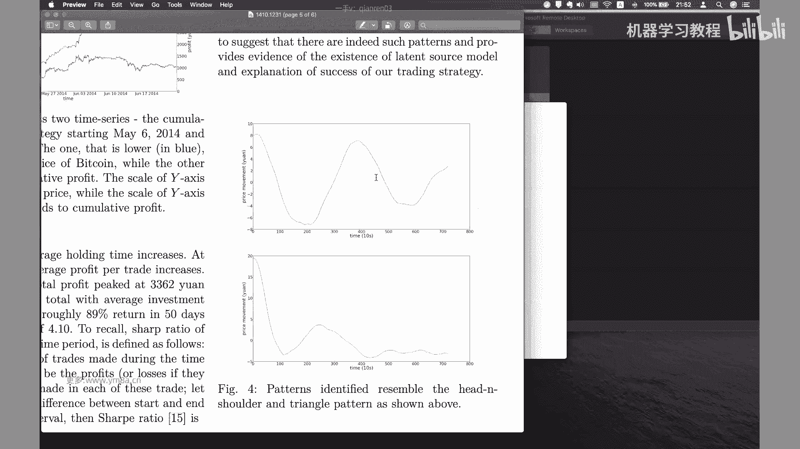

常常见这样一个pattern，那么嗯对这个这个是因为是比特币市场，它可能说是说我把它分成20个聚类，可能就会有比较好的效果，那么如果是对于股票市场的话，那么可能就会需要我更有更多的。

我cluster的时候，可能就要去尝试到去嗯，把它可能会呃分到更多的Python，可能20个不一定够，可能甚至需要100个甚至是200个，这个我觉得是比较有意思的一个地方，这篇文章本对。

就是我觉得是比较典型的一个创新点，对um okay，嗯对呃，当然要注意的时候，肯定是说如果说我聚类分成20个的话，如果说找到20个的圆形的向量，就区分度比较小的话，呃就是说如果说我万一也是分20个。

然后我拿到股票上去应用，然后找到发现唉，几个Python之间可能差别不是特别大，那这个时候我我觉得可能就要去考虑一下，就是说呃，嗯甚至是说如果说我clustering就找到的pattern，不是像这种。

那肯定说就是一条比如说一条斜线单独向上，然后有一点小小的波折，或者是一条斜线向下，然后又稍微长了一点，就是说这个Python不是特别明显的话，那说明就是clustering效果不是很好。

所以就在这部分还说，就是你你可能需要做一些的可视化，把我clustering得到的Python的结果去画出来，对那这个时候的话啊对，那如果是效果比较差的话，那么我们就要去考虑一下嗯。

就是把原来的聚类数从20，你可能要进行扩展，然后的话呃had变，我觉得可以考虑一点，就是说是嗯，你可以去衡量我们时间序列复杂度的一个，样本上对，然后你把聚类的结果，按照这样一个样本上去进行排列的话。

可能能够去找到一些新的，比较有意思的一些pattern对，因为这篇文章里他这边对，就是说我是在提到，强调，是说，如果我们要去应用到股票或者是期货市场的话，我们可能要对这个算法是做的一些改进。

然后呃另外一点就是说是嗯，嗯对嗯，然后就是说他在最后算回归的话，呃就是我因为我们在学算回归的话，我们可能还是要去考虑，就是一个就是我们的误差项的话，嗯如果说是得到误差的话。

这一块我可能还没有想到特别好的办法，因为本质上他是在做线性回归嘛，那如果说不是用线性回归的话，可能得去想一些其他的办法，因为就是说，因为本质上你是在去解这样一个优化，解解一个优化问题对嗯。

对我觉得就是这篇文章创新点，一个就是说是我怎么通过，就是把我的额，把我的这样一个典型的线性回归问题，转化成一个新的一个通过引援的，然后转化成一个贝叶斯的问题，然后另外一个创新点。

就是说是我怎么去找这个引援，我是通过聚类的方式去找，我们的这样一个pattern呃，我觉得这个这个可能去适合一些同学，就说OK我觉得这部分市场呃，觉得说我想要去额。

我不太清楚的知道A股可能有什么样的特征，那我可以先去尝试用聚类的方式去看一看，或者说是我有了一个先验的，我先有先问我，我我现在有这样一个观点，说这两个股票之间在在一定一定情况下。

它会有相应的比较类似的表现，那我是不是可以去呃去去验证一下，就是说他们的class turing下来的结果，是不是符合我的预期，OK啊，我我觉得就是对这个这个这个这个就是说呃。

这个是相对于我们传统的就是说一个非参数的，你比如说回归的一个方法，它是引入了一种呃，引入了一种新的新的思考的模式，因为我们传统的找因子，不管是用任何方式找因子，还是说做预测。

其实我们都是在尝试拿低维的数据去解释，高维的数据，我们能够看到的都只是整个市场当中的一部分，那么对呃，然而通过就是说这种clustering的方式的话，我们我们说是，我们虽然说我们不知道市场有什么特征。

但是我可以看到市场在这种特定的情况下，可以去把它进行分类，那么对这种情况下，可能说我们会保留有，原来市场比较多的这样一个信息，嗯嗯这个是大家可以去思考的，因为我觉得这两种方式其实是对应着。

就是不同的一种不同的一种思考的方式，或者说一种投资的框架，然后这种方式的话，其实我还没有去把他这个算法去在A股上，或者是CCTA上去测试，对感兴趣的同学是可以去试一下对嗯。

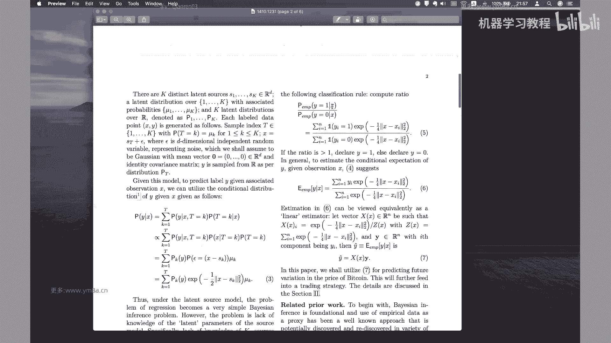

因为我觉得还有就是关于就是贝叶斯，就是优化这一块的话，其实我觉得还是可能在未来会有，会有比较大的应用，因为其实这就是尤其到最近的话，可能大家的如果策略会有比较同质化的话。

那想要跟别人做出一些不一样的策略，可能是需要去想一想一些新的东西，对嗯，对，大家其实也可以就是看到就是从刚开始到现在，我们能接触到的模型，其实会就是会有各种各样的思路，然后对，然后嗯，嗯然后的话肯定说。

就是说包括就是说在工作当中呃，就是最近几期一些讲的内容，大家会发现我们可能都会从paper为主，然后去去讲他的idea，然后事实上就是说在量化研究的工作当中，有，就是到了后期。

你会慢慢的就会去从刚开始的处理数据，去慢慢的转向，就是说我要去找新的想法，新的想法怎么来拍脑袋也是可以，然后其实更多的是建议大家是，多多去关注各方面的论文对，然后去及时的去跟踪最新的论文。

看看别人有什么好的想法，因为往往一篇论文当中，可能不只是不只是一个因子，它有可能还会带来新的思考的方式，然后甚至说我把它因子基因改变的话，对有都会给我们的就是投资会带来一些新的，比较有意思的东西。

这也是就是鼓励大家，还是说是呃在就是说随着前面的，就是说111事先是扎实相应的数学，数理的这样一个基础，然后第二个是增强编程能力，我能够根据对应的paper对应的数数学模型，把它转化成代码。

然后第三个就是说有了前面两点的话，这样的基本能力我要有，我要有更强的这个动力去follow，去观察市场提取性的特征，然后我要去能够跟最新的paper，从咳从别人发表的paper上面去得出结果。

当然有一种趋势，就是说一般发表下来的paper的结果，那可能大家都就是都我可以说是发表出来，因此一般都是已经失效的，有人会这么说，但是我会觉得还是去看一看，别人怎么去思考和处理问题的呃。

即使说这个因子已经失效，但是他这种构造，而这种思考的方式，我觉得还是会给大家带来一些，会带来一些新的理解对吧，因为我一直会觉得，就是一个人闭门造车的时候呃，想到了。

因此或者说你做事情的方式其实会比较类似，那么也只有在不断的和别人交流的过程当中呃，保持对自己投资这样一种框架的改进，可能长远来说我觉得会比自己单独做会好一点，就是说如果你想要就是说你想要走得快。

一个人走就可以了，但是如果想要走得远，我建议还是说能够找到身边的同伴去，有这样互相的支持，可能会好一些，OK然后今天的内容就讲了这么多哦，另外我还我还想强调一点，就是因为我在GITHUB上面有看到。

同学们把自己的作业和代码传上去呃，我我建议就是不是不是建议啊，就是说我可能还是希望大家就是把，因为涉及到版权的问题，就是因为呃包括作业是属于呃，老师个人和开课吧，这边课程的合作。

那么我希望大家把自己的代码设成隐私，就是设成private，不要去设为公开对，因为这这个我觉得还是会比较严肃，因为这也涉及到就是知识产权的一些问题对，所以希望大家引起注意。

就是代码上传到GITHUB的时候，就是呃千万不要设成公开，因为理论上来说，你一旦设为公开GITHUB的话，就会去有机器人，会把你对应的代码一相当于已经克隆过来了，对，可能就是这个代码就是永久性的。

在互联网上公公开了，我我觉得就是说从这个角度来讲，还是希望就是大家要注意对，就是之前已经设为公开，同学希望就是尽可能把那个目录给设成隐私，对，呃，我还是不希望，就是说呃。

现在一些代码就是说出现在就是在互联网上，对这这点是强调，希望大家注意的，呃然后的话对这篇paper的话，可能讲今天就是简单的讲了一下他的思想，然后嗯要去把它应用到我，我我自己感受感觉一下。

这个代码的代码量还是比较大的，就是如果要把整个框架去应用到你A股上，我觉得可能要做的工作，比前面几篇配文要多得多，所以不会强求大家去做，但是就是就是想告诉大家，就说除了我们传统的因子投资。

还可以基于就是说我们贝叶斯的这种方式，去探索来新的模型，就说我不知道有什么样的呃，有什么样的pattern，但是我可以去尝试做clustering，能够去找到类似的这样一些pattern。

Okay uh，然后的话OK对，对因为这这这部分人说其实这个这个paper啊，其实说因为我们之前是做因子嘛对吧，然后没有涉及到特别多的，就是对这部分其实说是本质上来说。

也是说基基于预测值去构建一个交易策略，因为呃有很多人是说我是不去做预测的对，就是我根据市场的pattern，市场的变化去随机的去，可不是随机，就根据市场的pattern去考虑，我应该所做的这样一个决策。

呃，那么然后的话我希望就是最后一节课的话，应该会给大家去介绍一下，就是说我基于随机最优控制，我怎么去做一个套利交易对，然后对其实就是最优的optimal control的话，其实是呃。

是比较适合去解决一个投资问题的框架，然后下节课我们还会去解释，用这个东西去嗯，去尝试着去呃，包括简单的会去介绍一下，就是PEETRADING，就是去做逃离对，可能会嗯有些东西可能会偏对。

可能会偏一些随机过程的一些东西，然后我建议大家对随机过程，可能稍微去了解一下，我觉得可能会比较好一点对呃包括呃对哦，伊藤引理，当然这些东西可能花的会，如果没有学过随机数学，可能会花的有点久。

但是应该没问题，就是不是特别懂的话，就是数学推导可以跳过，但是就是代码至少要看得懂对吧，嗯嗯OK然后的话那今天的课程就先这样，然后呃还是说大家有什么问题，对对之前就白天有位同学问我问题。

我我不是没看北北，没看到白天还在忙其他事情，然后待会之后之后我还是会会会去会去回复的，嗯然后再次强调一下，就是代码的问题，希望大家就是把之前上传到GITHUB上的代码，去设为private。

不要不要不要对外公开，嗯好的，那今天就课程就先这样。