# 2025最新AI量化交易实战教程，三小时入门到进阶！清华计算机博士讲解，零基础也学会了（AI人工智能丨数据分析丨数据挖掘丨机器学习实战丨深度学习丨编程） - P2：第三章： 交易数据形成的价格 - 机器学习教程 - BV1ujk4YKEw9

hello，同学们好，可以听到吗？嗯，稍等一下，我马上就开始哈。哎，那好的，同学们，我们今天就开始呃量化交易人工智能的第三节课程。然后今天今天我画了一个新的工具哈。

就是之前用作用PPT可能然后有些东西呃不是方便特别展示。那今天我试了一下，看看这个在线版书的这个功能怎么样。对，我划入巨款买买了一个ipad。然后，然后再用了一个这样的一个在线的白板的工具。然后嗯那好。

那话不多说，因为我们今天任务还是比较重的。我就是我们就先赶快开始我们今天的内容吧。呃今天主要是分为以下几个部分。其实我们这一周包括下一周的课程会主要来跟大家一起协作。

把量化里面呃做研究最核心的一个研究平台，也就是我们的回测平台给搭起来。然后今天如果还有时间的话，呃，就是作业的问题，我知道大家会呃会比较大的问题。因为到现在为止有差不多三个人交了作业。

然后我看了也就对交了交了作业同学其实质量还蛮不错。然后课后会把我的。以及呃那位so有同学的呃灵魂同学的呃作业发给大家参考一下。对，然后会把他的账号给给抹掉。然后呃然后有什么问题。

我们待会儿课中也会一起再去呃过一下。好的，嗯，那今天就是讲一讲就是我们要做的一个叫回测back test。就是我们为什么要做这样一个工具？就是呃简单来说呃，有量化跟主观交易一个最大最大的区别。

就是我们希望我们的交易模式可以是。是呃历史的可以是说是叫可复现的。或者说至少我们要知道在一个呃模型去交易之前，我们需要知道它到底可不可行。对。

然后那今天我们就先从最简单的用excel来开始搭一个呃back test的回测工具。呃，字体是不是要放大一点，大家回复一下。对。好，就是呃首先就是这个数据是怎么来的。呃。

还记得我们第一课作业让大家去合成一分钟的bar吗？然后我这边用的是几天的一分钟的bar，然后它的呃就是daate time跟co。然后要注意一点，就是说呃我这边用的dta time。21。

00代表的是从21。00到21。01之前那一t就是这这一分钟之内的所有时间。我是呃当然你也可以按照习惯来说，你从21点01分开始记。啊，注意这个时候是有夜盘的。呃。

所以是所以所以说说这个交易日应该是12，我记得是12月3号。对，12月3日的交易日。但是他注意就是说交易日是从前一天晚上的夜盘开始计算。这是一般约定来说是这样子。呃。

就是包括交易所结算单也是这么来统计的。从前一天的夜盘开始计算。所以这个大家要注意一点。然后因为从下周开始应该是呃就是呃期货的夜盘交易要开始恢复正常了。前一段时间是由于疫情的原因，期货公司没有人在晚上去。

没有人去维护，所以是说年后就是呃夜盘交易给暂停了。好的，然后然后就是。呃，这呃大家放心，这个excel课后会去发给大家。然后呃我这边画的就是一个呃这应该是罗文刚。呃，在18年11月30号的时候。

他的一个close price的分钟价格序列。然后我们简单看一下这张图。对，这个就是拿excel把它画出来的，是从呃呃18年呃就是18年的11月，这是我随机挑的啊，我随机挑了几天的数据。

一直到12月7号。然后然后我们这我们这个excel简单来说做一个什么事情呢？就是。我呃然后呃先介给大家介绍一下什么是moving average。对，moving average。

我们可以看一下这个是怎么计算出来的。他其实用的是我们看了就是说在第六天，他用的是第二天到第四天呃的一个平均值，这个是5天。我们就是说这对于每一格我们都去取，包括当当前这个 bar为止。

向前五根 bar的平均值。所以由由于它是average，并且它是不断的在移动。所以我们就简单的把它叫做ming average。我这边缩写为MA。然后其实用excel来说。

我们就可以用呃直接用公式填充的方式计算出所有的MA5。那当然要注意的是，从第一分钟到第四分钟是MA是没有MA5的。因为我们的数据长度不够。对，那同理呃MA20，也就是说我们计算20个。20个倍的平均值。

那接下来就这样一个简单的交易策略是什么的呢？就是说我们说当MA5大于等于MA20的时候，我们会开多一手，就是方向上去做多。当MA5小于MA20的时候，我们简单来说去做空。这样本呃我们或者说看这样一个图。

这三根线的话。哦，看一看哪个是MA5和MA20，就是其实它简单的含义就是说。简单的含义就是说呃它利用的是一个动量效应。啊，当然这个词大家现在不太理解是什不太理解，没有什么关系。

我们先只是简单来拿这个来去做一个测试。就是说呃首先我们我再次强调一下，就是交易原则是当MA5大于等于MA20的时候，我们会去做多。然后反之我们会去做空。那就是说我们有了这样一个简单的交易想法之后。

怎么去把交易策略去转化成。嗯，我们可以看到的下面这样一个呃。对，所谓的一个净值曲线呢，就是把我们的收益。呃，在我们按照这样的逻辑去进行交易。在历史上经经经过数据的回溯。

我们能够得到这样一条我们的资金变化的一个曲线。对，然后我们这节课其实就是要带大家用各种工具来去实现，或者说是理解整个过程。对。那那其实呃我们刚刚说了，有我们只需要判断MA5是不是大于等于MA20。

然后如果MA5大于等于MA20的时候，我们会去做多，反正我们就是做空。所以我们从第一条有效数据开始看。这个时候是呃MAMA5是大于MA2呃，是小于MA20，它是fse。

所以这时候我们仓呃我们仓委会去把它做空做空。这时候我们就是空仓一手是负1。然后然后我们看到在它会再由在MA5大于。M没20的时候，我们就手也会翻多了。这时候我们仓位由-一变成一。对。

那接下来有两栏比较重要，就是一个叫trarede PL，一个叫position P andL呃，这边P andL的它是perfect and lost的缩写。

那那么就是我们先来看稍微简单一点的position P andLposition PNL是什么意思呢？就是说当我的持仓保持不变的时候，由于价格的变化，所以导致我的净值有了变化，或者说我的有了损益。

那这个事情怎么理解？我们看到在21点19分的时候，价格是3233。我们这个时候有了一手有了一手持仓为-一，就是说我们做空一手。那到了21点20的时候。价格变成了3228。那这个时候呃大家可以口算一下。

就是这个时候我们做空一手的损盈损是多少？对呃，在大家可以在聊天在这个群里回复一下。对在问题重述一遍，21点19分到21点20分，我们做空一手价格由3233变成3280。这时候我们的盈利或者损失是多少？

对我看一下啊，现在有19位同学，我们要等到要拿到18个答案才可以继续。对。

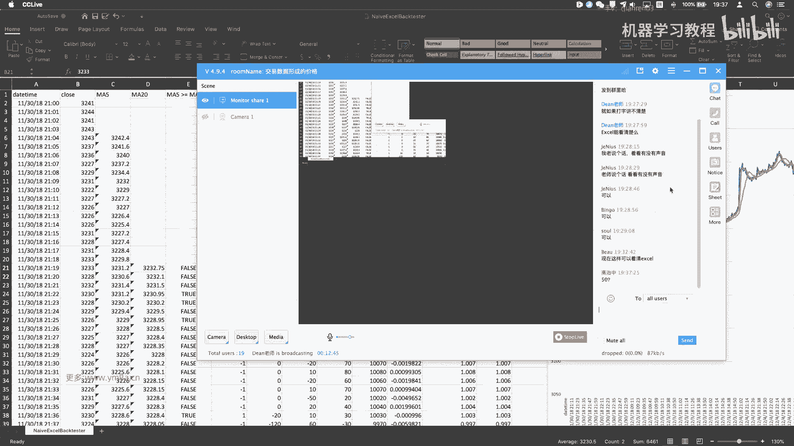

或者呃大家这个概念是我们在第一课时候提到的，怎么去计算期货的盈损？对，大家只要注意是正50还是负50就好了。对嗯。

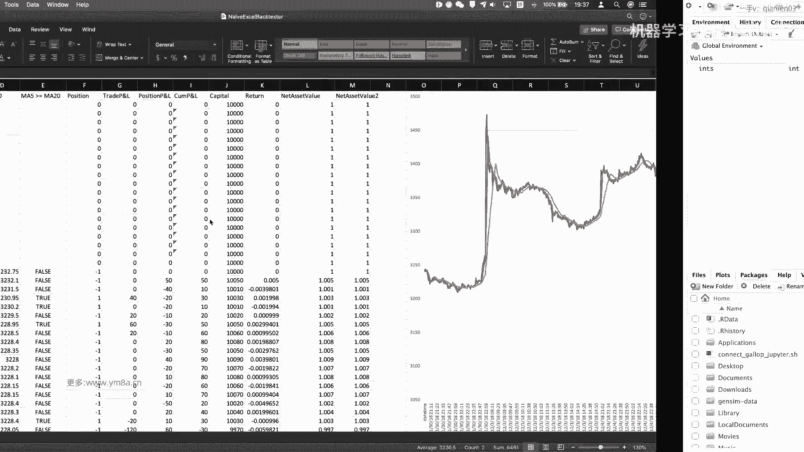

就是我们做多一手价格上涨，我们就赚钱。如果做亏做空一手，价格上涨，我们就亏钱。那现在的情况就是说价格下跌，但是我们做多了一手，我们做空了一手。

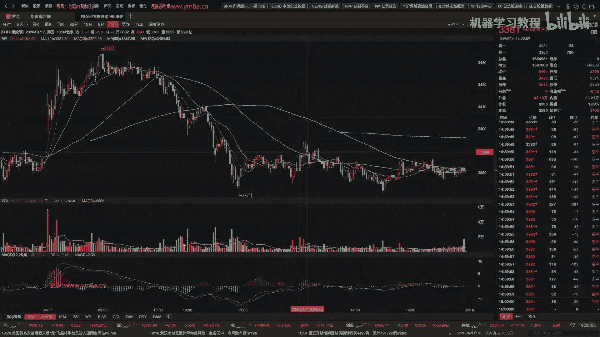

呃，OK那要注意的是罗文刚的合约乘数是10。那其实说正确答案是50。就是说我们这个时这个时候注意position PNL是拿。下一根把。

就是说呃是呢就是说是拿当是拿就是说这一分钟半的收盘价减去上一分钟半的收盘价乘以一个合约手数乘以一个持仓来得到，这叫position片量。大家要注意的事情说是position片量不涉及任何交易变化。

我只看当前的持仓。那么这个时候就会有一个问题了，就是。说我如果说我们只我们不看trade偏L，只看position偏L，是不是就是能得到我们呃就是想要的这条净值曲线呢？但事实上这个是有问题的。

我给大家举一个简单的例子，为什么说我们要引入tra pL的PNL的概念？嗯，ok我们注意一下这个持仓。我们看21点21分到21点22分之间发生的事情。我们的持仓由负一手到一变成了一。呃，-1到1的概念。

呃，我们先看当前的持仓是一。然后。如果说我们按照我们这时候是做多一手，从3232到3230这一分钟之内，我们的价格变动了20呃价格变动了2，因此我们产生了-20的损失。

但是这个时候大还要想一想会有个什么问题，我明明是这一分钟才买进去的，为什么会产生-20的损失呢？所以这里面肯定显然是有问题的。比是说当我们计算持仓的position PNL的时候。

其实我们只考虑了当前的仓位。但是我们在计算整个整个的PNL曲线的时候，还需要考虑我们的tradePLtraPNL是指由于我们由于交易所产生的净产生的净值变化。

那么这个时候我们再看trarede PL从-一，我们还是先回到前面简单的这个例子。呃，从负从0到-1这个过程当中发生了什么？注意我们在这边的假设是我们按照当前半的close价格成交之后。

我们再来之后我们再去看，我们会去看按照不同的价格去成交。我们我们这时候注意说我们在21点19分结束的时候，其实就是21点20分之前，21点19分结束的时候，我们按照3233的价格开空一手。

那这个时候吹的PL是什么嘞？呃，哦这okK因为这个价格。比较特殊，tra的偏L跟上一分钟没有变化。所以这这这这一分钟其实是没有产生所谓的trarede PLO嗯。那我们这样来看吧。

就是说我在3232到3230这个过程当中，这个发生了什么？我们首先是持仓负一手变成了0。同时又从零变成了一，这里面我做了两个操作，第一个叫平空仓，第二个叫开多仓。那这个时候要注意的是。

实际上说我是在这分钟结束的时候。这个交易才完成的。因此实际上我在这一分钟结束之结束之前，我还持有-一的仓位，那-一的仓位由价格由3232变成3230。实际上我这个时候是有20块钱的盈利了。

但是这一部分我没有这一部分实际上我是没有把它包括在里面。然后另外一部分是什么呢？另外一部分是嗯另外一部分就是说我从0到1这个过程的时候。从0到1，我实际上也可以说是从3232呃就是。

从323呃从3232到3230，实际上这个里面也是有20块钱的那这个是我们吹的片L的公式是怎么来算呢？我们注意是说是拿当前的仓位减去上一分钟的仓位，然后注意的价格，这时候是上呃是上一分钟的价，而是。

ok反正就是嗯不管是你是拿这一分钟价格减去上一分钟价格，还是这一分钟仓位减下一分钟仓位。我们要注意的事情就是说这两个符号是相反的，一个是23减24，一个是24减23。这这个是什么意思呢？

当我把trade PL和position PL加起来的时候，我才能得到我真实的。真呃才能得到我真实的这一分钟的损失。呃，这一分钟的盈利或者是损失。那这个事情嗯。嗯，我不知道现在讲完了之后。

大家有没有首行冻结okK。好的，嗯。我看看很久没有用这个功能了。系。Freestop role。ok。就是说traade PL是由交易所产生的盈损，position PNL是由持仓所产生的盈损。

交易所产生的盈损是本质上就是说我仓位变化。对仓位变化。我这个时候我可以记带入这个公式是我从。我从-一变成了一，这里面差了两手，但我的同时价格变成了呃价格差了差了20块钱。

所以这样子我这边就有差不多是40块钱的盈利。但同时position PMLposition PML是我这个时候我这个时候我假定我持仓一我这边时候持仓一手，按照价格变动，我会有20块钱的损失。

我会有20块钱损失。大家有没有注意到这个20块钱的损失本来是我没有的。因为这个时候我是这一分钟结束才会有这样一个所谓的持仓。我在这分钟结束的时候有这个持仓。事实上，我以3230的价格去开多一手。

我不应该有20块钱的损失。那么在tra pL里面的时候，我们就会有实际上相当于说我们做了这样一个额外的补偿。由3232变成3230这个过程。我们实际上有一个有一个对于这样的持仓变动，有一个补偿。

当我把这两部分。相加的时候呃，这当我把这两部分相加的时候，我也就得到了我真实的这一分这一分钟的损失是40加-20是等于呃是等于20。

但是这边我们算的是一个cumulativePNL就是我们把每一分钟的PNL都加起来累加起来。那这那或者说刚刚这个解释的就是说比较抽象一点。那或者我们可以想这样一个情形，把它拆成两部分。

当我们我们的第一部分是，我先假定我还是持仓负一手，我从持仓负一手，我从3232变成3230，我这时候是赚20块钱，那我这个时候我再开一手多仓，以3230的价格进入。这个时候我没有赚任何钱。

因此我的盈利就是由3232变成3230，做空一手赚的钱，就是20块钱，which is40减20，也是20。所以通过这一部分是希望帮助同学们去理解，就trade片L跟position PL是怎么回事。

因为嗯为什么说我们当然也可以说是我们一个个循环的去做去算每一个每一个每一个交易变动，我到底是赚了多少钱。但是这样子的话说我们就不可以就不可不会说显然的用一个excel的公式去把它填充。对，嗯。

所以这一部分我不知道我讲清楚了没有？同学们可以在群里回复一下，就是关于trade PNL和position PL的概念。对，然后或者。嗯。嗯。我看看有没有回复OK。是。稍等一下。

就这部分概念还是呃我觉得大家还是要理解透彻。因为。就是我们在回收计算PIL的时候，当然你也可以说是我开一手平一手开一手平一手去计算。但是这样的速度相对会可能会慢一点。并且呃如果说我们能够掌握。

就是说用下量化的方式去操作，呃，去计算我们的整个PLL相对来说会呃我觉得会好很多。嗯。Okay， let's see orange。呃，好吧，第一次生这软件现在好像不是很稳定。嗯。ok。

就是我们来看这个PR的计算过程，再给大家讲一遍，这个是怎么来做的。就是说。就是说我们要计算他的。其实把它可以看成两部分，实战上它的position。是从。负一。变成负议。然后然后再从负一变成一那。

负1到负一这个过程。这个时候PML是。20。那一这个过程PNL是。0，所以我们总的就是 totalal的PML是20。那还有一种方式是说。2、我分别来计算trade和position的偏量。

positionition PML我们刚刚讲过，相对来说会。我们只考虑当前的仓位是-一，然后我们只考虑仓位乘以价格变动，我们的仓位是一，价格变动是3230减32。32乘以10合约手术时。这部分是-20。

然后traadePNL是。就刚刚记录我所说的tra偏L，就是注意两个方向是一好就OK了。就是。-1减1，我接着从前-一减1，然后再乘以。323我这个时候因为由为我是负1减1。

所以我这个时候就应该是3230减去3232。所以3230减去3232，也就是-20。那这部分就是说是40。那当然我们也就看到了，20是等于40减，就是加上-20。对。所以这部分是。

position PL跟tra偏L。所以就是接下来有一个就是比较重要的故事，就是说我们的total PML。是等于position。PL加上。Trade。骗来啊。对。

然后position PNL的是公式，就是说。Current position。train。Position change。然后traade平L。这是指是用的是。Oh sorryorry。

这不是 position change，是 price change。😔，然后注意前面要加一个符号，就是说两个方向相在。呃，这这个到时候手写的这个我可以把它做成PDF，然后呃最后做成PDF交给大家。

为什么这个符号还没有同步出来？要注意前面是有个符号哈。好的，那这部分既然大家看明白的话，我们来接着就是继续来做完这个部分呃，就是。好的。那既然有了position偏L和trade偏要。

就是说为什要为什么要做这个事情，我要算出我真实的这笔交易带来的损益是多少。对。那有了cumulative有了有了单个的positionPNL之后，我再把它所有的我把每一份呃我把所有的PL给加起来。

所以给大家看到呃，这边是一个cmulative sum，就是把两列的我每一个半的发成的PL加起来，我们又得到了一个整体的这样一个颜色。然后如果我假设我初始资金是1万1万元，然后我再加上我这时候的呃。

我再加上我的盈损，我就得到了我整个的一个资金曲线。那得到了一个资金取线之后，呃，大家要注意这边呃这边有两种就是说我们要得到就是说计算净值的方式，一种是很直接的来看说。我们现在有多少钱除以刚开始的钱。

这样我们就把它化成了，就是从一个从一刚开始增长的序列。这是用这个方，这个就是说对，这个是应该是嗯除以初始资金。1万块做出来的那还有一种方式是我们可以计算我每一个半的收益率，收益率是。当前的半的净值呃。

当前半的capital减去上一个半的capital除以上呃除以上一个半cap，这样我们就能得到一个每呃这样我们能得到一个每一个半的收益率。然后我们这时候净值在计算的时候。

其实只要就是说把前一刻的净前一刻的净值乘以当前呃乘以一加上当前的收益率，我们就能得到下一刻的净值。然后如果大家可以看一下，就这样的整个过程。呃，所以大家看到左右两边是完全一样的。

然后我们经过这样的一个处理，我们就能得到我们所谓的这样一个net asset value净止曲线。对，那其实呃大家说回测有多难呢，其实没有很难。这就是一个简单的一个我们测试的这样一个交易策略嗯。对。

然后呃呃我要强调的几点是嗯这首先就是说这用这样一个简单的例子去告诉大家。其实说所做所谓的回测也并没有很难。呃，一个是我们需要理解，就是说我们的仓位怎么到怎么由仓位到我们的交易的PL的净值曲线。

整个过程发生了什么。其实所有的回测，我们都是在做这样的事情，在给定任意时间，我们给定一个仓位。那有了这样的仓位，我们就能得到最终的净值曲线。大家可以把它想象成一个函数。对。

那然家要注意的是我们这边信号跟策略的。呃，跟仓位的是实时计算，都是都是按照这一分钟同步开始。证里实际上是有很多不严谨的地方。但是为了方便的，就是说因为我们是分钟策略，相对来说不会有特别大的差别。

这是第一点。就是说我们按照就是说我们按这个分钟及时来成交。另外一点重要的是我这边没有加手续费。对，所以这样就是我们简单的一个所谓的均线的模型，大概是4个交易日呃，我们从1万块钱，我看一下变了多少钱。对。

诶。嗯。呃，1万块钱变成了100011100呃，530，所以3天三四0三四个交易日差不多就是15%的回报，这个是相当夸张的嗯。所以嗯那为什么就是说如果说大家再想一下。

如果把这边的capital换成了2万，那其实收益率收益率就降低，换成换成10万。那收益率只有1。5%。对，其实就可以说是本质上来说。我的收益率是可以由我的资金来控制的，我可以控制我的杠杆。

当然如果大家来说呃换一个方式，我们把这边所有仓位全部乘以2，那这个收益也是两两倍。但是相对来说呃那回撤就会大了很多。这样这只是一个简单的交易策略。然后大家还是不要用拿这个策略去尝试。

因为这个只是为了验证一下，就是说呃做我们的这样的呃交易的回撤到底是怎么一回事。OK所以到现在就是说一个简单的excel的back testing。呃，大家有没有理解。

或者在这个时候大家有什么问题可以在群里提一下。对。然后如果说。之后我们要做的之后我们要做的事情是说大家可以试一试。如果说我换成不同的指标，嗯，我不用均线，我用exponential。

就是我用价我用就是 weighted weighted moving average。然后或者说我不用均线，我用其他的布宁贷或者等等。其实大家也都可以进行简单的这样尝试。

那其实如果有的小伙伴觉得自己觉得自己的那个呃。觉得自己的有特别好的指标，然后想要去尝试交易，那不妨在交易之前可以自己做简单的这样一个回溯。那其实用excel就可以完成这样一个基本的功能。嗯，嗯。

如果说想要去加手续费的话，也很简单。每一次交易的时候，只要有交易的变有一个交易的变动，我们其实在这边给它减去一个手续费，加到然后加到我们的return里面其实就O了。对，其实如果想要去做这样的事情。

小伙伴们完全可以就是同学们可以自己去尝试。对，那当然我们做量化交易就是说嗯不太可能说用excel来做这样的方式。就是说我现在这个文件就几百行。

应该还是相对来说是比较好处理的那如如如果说是几十万行的数据呢。那excel可能打开就会已经有点崩了。对当然说如果你懒得写代码，想要说以后就觉得嗯我就想用这样的方式去研究策略。

那其实也O的那其实这门课那整个的课程上下这边，我觉得其实那那那可以说就是已经到了一个阶段，就是嗯觉得自己ok了那都完全可以拿。这个模板去自己去简单做一个回测，然后得到所谓的交易曲线，然后自己去分析啊。

什么时候赚钱，什么时候亏钱。呃，刚刚有OK这边同学们有一个问题是说呃，为什么要考虑到trade偏量和position偏料？其实是这样，就是。traade平养和position平。

我不一定是不是说我考虑到，我本质上我还是说我们最重要的目的是是去为了计算我真实的交易曲线是怎么样，就是说我真实的盈利还是是损失。那为什么用trade和position平量，只是为了方便我的计算。

因为我不想把呃我我想知道就是说。呃，我想知道就是说这笔交这个这个赚钱到底是由交易的价格变动产生的，还是说我由于做了一笔交易产生的对，那由由于就是还还一个最直观的因素。呃。

因为我们现在的close price跟我们的成交价格是一样的那大家可以设想一个情形。如果我在这一分钟的成交价格不是3230。那不是3230，比如说是3233，但最后这分钟收盘价是3230。

那这个时候我就少掉了我按我交易入场的价格跟到这分钟收盘的价格这样的一个价差。那考虑吹的PL和positionPL是为了之后我们再考虑就是在设计交易策略以及回测的时候，用不同的入场价格挂单。

能够去呃用能够用就是说能够去测出我们用不同的策略去挂单的时候，那真实的交易损失是多少。因为我们希望我们希望我每一分钟的计算的损益都是准确的，而不是说只有我只有只有说只有说由于价格变动产生的。产生的偏L。

而没有说由于我的交易好坏产生的这样一个偏L。嗯，因为事实上呃直观来说，如果我以不同的价格去在这一分钟入场，如果是3233，那是事实上呃我做多西手本质上到这一分钟收盘的时候，我已经亏了30块钱。

已经亏了30块钱。但是这个30块钱是不会在position偏量要体现的。因为我只计算这分钟收盘的时候价格。但如果有一个人交就是我交易也可能比较好，就是我执行的比较好，我用3229的价格去进去。

但事实上我这分钟就有了额外的1010块钱的收益。对，那吹的偏L实际上是衡量你在这一分钟内说你的。你你的交易是不是你的交易就是说实际上给你赚了多少钱。对，是是由交易带来的PL。

而不是说有价格变动带来的PL。然后呃net asset value有没有范围，就是okK那那那可能就是说这个概念我没有讲清楚。所谓的net asset value本质上来说，在我们交给客户的时候。

作为一个资管产品，无论是私募基金，或者是大家看到净值曲线。呃，本质上来说反映说我当前账户有多少钱。其实就是反映了当当前账户有多少钱。

那么呃net asset value这位同学提到就是嗯net asset value有没有范围。那大家可以告诉我一下，就是你们觉得net asset value范围是多少？对。

就是他它可能就是可能的范围是多少？就是大家注意我描述的是当前所持有的钱。对。对，理论上来说是负无穷到正无穷，就是对。嗯，对他肯定是对高志中同学说是随时间变化的而不同。就是说0到正无穷。

OK正常情况来说是我们是如果是股票资产，我们不可能说把股票亏到负数。但是呃作为期货是有可能就是说你可能说到最后全爆仓了，可能还欠交易所一笔钱，但是这个况况是有可能出现负数。但这个就概率是比较小。

一般来说我们只要考虑。只要考虑说是为正的情形。对，然后我们的目标就是说我们希望做出来策略曲线呃，都不要向后面一段，而是像前面一段，就是说我们不断的往上增长就okK了。对，其实做出这样的回测的曲线。

就是就是为了看就说我这个策略在历史上按照这样的按照这样的数据是不是可行。对，就是说如果说这个策略在历史上嗯不同的品种都有非常好的交易曲线。那我就会考虑按照这样的逻辑。

这个逻辑我认为就是说O按照相同这个逻辑是可能是赚钱，那我可能就会实际的按照这个逻辑去交易了。对，交所谓的回测，也只是说帮助我们去做研究，去找到历史当历史数据当中可能的。好的。

那第一部分就到这边就是excel的一个简单的回测。然后课后然后希望大家可以自己去试一试，怎么来把它嗯。做出那就是把就把它去跑一跑。对，然后然后我这边数据是用的是18年的数据。嗯，对。

然后可以这数据我也给大家提供。但是我还是建议大家呃我们用第一节课不是大家合成了很多的数据吗？我希望大家数据量可以大一点。对，然后嗯然后自己去完整的把整个excel过程去实现一遍。

我觉得这样可能感受会更深一点。对。然后嗯然后接下来第二部分就是说呃要做的一个事情。呃，其实是。我希望尽可能的去自动化我的工作，而不是说去由我每次用手工去填excel呃，去来去计算。

虽然相对来说这个这个已经比呃我我人盯着盘，然后去看哎呀，就是实际去交易，来看这个钱是赚的还是亏的，已经好好很多了。因为我我已经不需要去真的去人工去交易，我也不需要去看图了，我已经有了这样的一个曲线。

但事实上来说，这样的，我觉得工作效率还是比较低的。其实我们可以想一下，整个的流程，如果用python写起来其实应该是非常快。那我们接下来就来看一看，怎么用python来做这个事情。

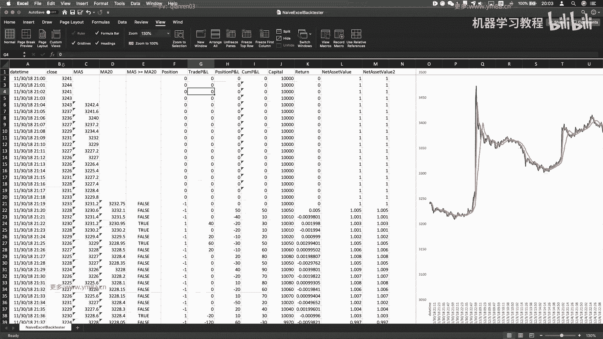

嗯。可以关掉。对的。就其实这这部分是这部分我会简单就跳过了，这个应该是留给大家来作业，正好留给大家的作业，就是让样大家去测试一下就是。我整个数据应该是怎样。

就是我给大家漏的是呃11月30号到12月7号1035条数据，然后它的close price。然后我希望大家就是去把这个functionction给实现起来，实现完起来之后，然后呃这边有一个测试脚本。

然后就是把原来的excel计算出来的数据呃，跟你跟我们自己算出来的这样一个data frame，然后两个去比一下。呃，现现在可能就是。O现在是不是d frame什么区别。但是我再看一下。

就是说希望希望的就是说呃你们你们看到两个dta frame应该是完全相等的对，呃这个时候希望大家就是就这个应该很快吧，我觉得应该十几分钟就能就能计算完成了。对，就是无非是把我刚刚课程讲的内容。

让大家用thon来实现一遍。嗯，对，就是一个是MA5怎么计算MA20怎么计算。然后这个这一部分我省是省略掉了呃就是呃MA5和呃是否大于MA20这一行。

因为这个用on写起来直接就是两个con是大于等于这一个逻辑判断非常方便，然后由逻辑判断再转化成仓位。

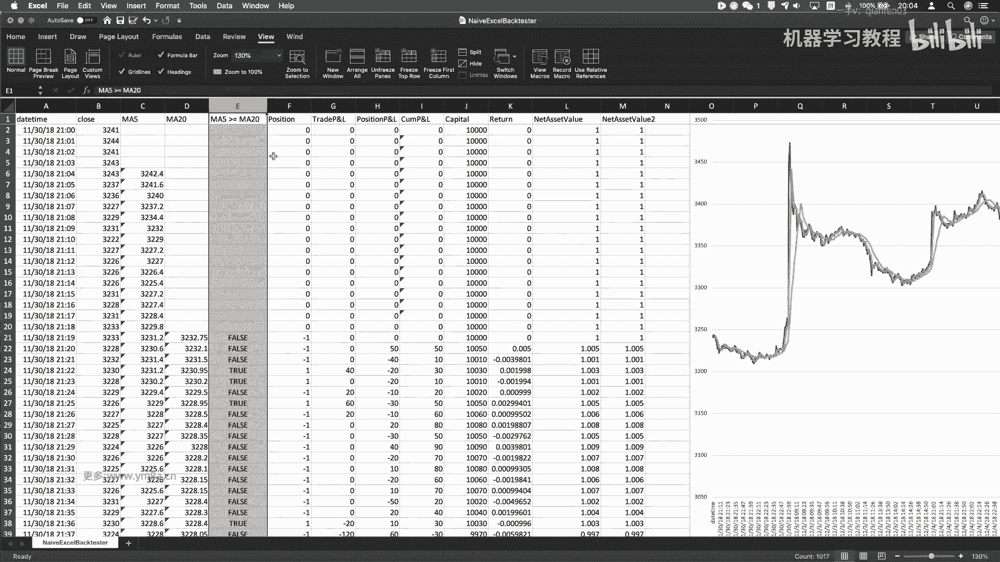

对。逻辑判断转化成仓位之后，我们就可以啊。

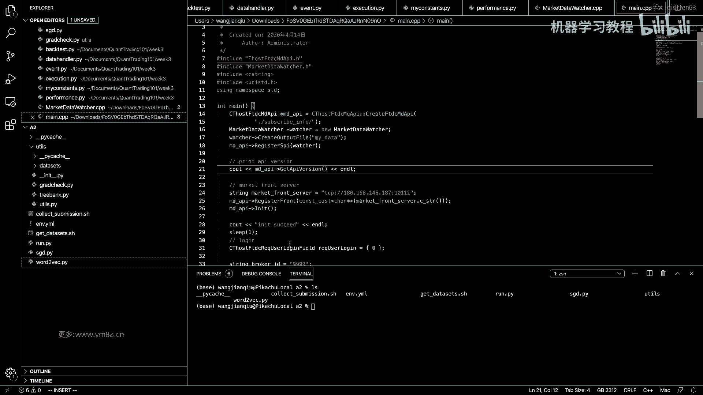

，逻辑判断转换成仓位之后，大家再复习一下traade PL position PL是怎么计算。然后commulative PL是怎么算。然后我们给大家规定呃给的初始资金是1万块钱。

然后大家再算一下capital是什么，然后再复习一下return的定义是什么，return是怎么来计算的。嗯，嗯然后两种计算净值的方式，一个是我根据return的里成。

还有一个是我根据最初最刚开始的初始资金来计算。对，然后呃注意一下，这边理论来说是不需要用到任何循环，基本上都是一行可以去完成。对，就是说这个是一个ve，就是完全是向量化的向量化的操作。对。

这这个应该是相对比较来简比较简单的。然后如果呃这这个希望大家就尽快完成。然后有什么问题的话。嗯，及时在群里跟助教跟我去沟通。对呃，这部分做完之后，这个只是一个作业的一个热忱，不会耽误大家太多时间。

然后接下来我们要看的就是说。怎么怎么就是说我这边有我这边有这样1个MA5的测略和MA20。那我之后如果想刚刚提到的说，我想测试其他的因子，以及我想测试不同的周期，那这个时候要怎么做？

我觉得相对来说就是把它分成一个个类。那接下来要给大家完成的就是说。我们怎么去实现这样的一个back test？嗯，然后我呃我不知道就是大家呃呃就是面向对象的编程有没有学过，可以在在那个群里呃回复一下。

对。收过来大衣那对ok。嗯，好的。对，因为这门课程就是发现挑战就是说呃我之前以为说是所有的同学就是基本编程也还是很过关的。可能。后来后来老师跟我说，中间可能沟通的时候有一些问题。有一些同学可能编程功底。

呃，没有特别好。然后然后说刚开始前面两次作业有一些困难。那那我觉得就是说如果嗯这这这个这个事情就是说这个课可能不太能帮你去解决编程的问题。但是说希望同学们就是课后花一点时间自己去赶紧写代码。

然后如果说代码课程上的代码有什么问题，那我只能尽量去解释一下。那简单的就给大家解释，就是所谓的所谓的一个class，那就是一个类，我们叫做class，它本质上就是封装了一系列的呃数据跟对象。

然后他有一些功能。那这边的abtract methods是什么意思？就是说我之后的之后每一个。我之后每一个东西我我我我之后每一个策略类都要去继承这样的一个呃都要去继承这样的一个back test积累。

同时它必须要实现generate signal这样一个函数。然后我们这节课就是说这个vectorized back test，就是本质上希望大家就是说呃把之前的这一块的代码写成封装成这样的一个函数。

然后就是说那这样有一个什么好处嘞？那我以后每次去测试的时候，我只要去直接去调用这样一个函数，然后计计算一个packcker performance。然后我们再把它的静值权线画出来。

那如果你有很多的CPU，你完全可以并行，然后你可以测测试不同的策略，你可以测试不同的参数。那每一次来操作的时候，事实上我们都不需要再去去修改这样excel了。本质上来说。

这个就是刚刚excel的简化版本。然后我现在需要带大家去过一下这个里面的东西。首先就是一个。那data handle就是说呃就da handle是希望是就是说呃大家把最好把数据我个人的习惯是把数据给封装好哈。

就是不用每次说回测就是回测。回测当中我不需要考虑数据是怎么来输入的。我我只需要考虑说我每次拿到了。我每次传入的都是一个完整的data frame，就是我拿到的就是excel当中的这样一个数据。

就是呃这两列我们假设是这两列数据。对，这这所以说就是呃用这种方式来说，我们就可以忽略掉很多的细节，对，就就是说所有的细节都在data handle这一块，这部分是同学们在完成需要完成的。

因为这部分有多种其实这部分要做的事情，就是说我不是有我们不是有多个CSB文件嘛，其实把它end到一起就可以了。对。然后你最后返回的是一个data frame。对，这部分是要大家自己去完成的。呃。

然后嗯然后在这部分我们每一个back test要做的什么事情呢？我们首先是把这个数据是copy了一份。然后因为我们考虑的是说我们一个data handle。

事实上就是说可以给不同的back test提供。因为所有不同的pack test提供相同的数据。因为我都是在对这一份数据做不同的测试。然后并没然后其实对这一块的嗯如果我在第一课有有说过。

就是建议他如果对数据库熟悉的话，是自己把处理好的数据放到数据库里。然后你不一定然后data handle的时候，嗯，那有的人是用从CSE文件去读，那也有人就是其实是从数据库去读。对嗯。好。

那这部分就是说我作为所有的back test我都需要有一个初始化初始化的初始化其实就是说把我的数据给加载过来。然后把然后这个data frame这个这个DF是保存什么意思呢？

其实就是我们刚刚那个连们我们我们的信号是什么？然后我们仓位是什么？然我们的close是什么？这个是为了方便我们后面的就是 performance也就是在完成我们的呃excel的这部分。对。

其实就是这一部分内容就是为了方便。其实有了我我大家要注意到，就是我们有仅仅是从close position这两个东西给算出来的对。所以这部分就是我们先初始化了，我们有了数据。

然后我们有了de frame，然后。然后这部分是什么意思？abstract method我们是希望每我们是希望我们每一个策略类都要有实现这样一个函数。

这个函数这个函数是让大家就是说我们需要我们需要把我们的self点DF这个里面的signal给填充下来。对。然后大家注意的说我这边还有一个函数叫genenuary position，这个是什么意思呢？

就是说我们刚刚说我们刚刚说是直接就是说由信号变成仓位。那如果说我这边是说我信号到仓位不是一手，而是两手了。那我这边可能就要去把大家也就是这边这边实际上是说是比较自定义。

你可以把它就是说你做成两手无手都ok考虑你自己的实际情况。然后嗯当然当然说这是一种比较简单的比比较简单的策略，就是说我信号呃就是非多要么是多，要么是空，反正我仓位一直持有。

那事实上我大家注意到我这边common的一行，就是说如果没有信号的话，我这个仓位也可以试应，就是说我我没有必要一直在交易，我也可以就是保持空仓，什么都没有。

那如果说你选择了uncom这行你把这行注不注视的话，那你就要考虑一下，就是你在传入你在写这个函数的时候，nuary的时候，你就要考虑一下你什么时候不交易。对那其实其实整个交易策略就是说你我们回想一下。

整个交易策略要做的事情就是市场行情过来。然后我们根据市场行情去写我们的决策，我们到底要产生什么样的多空信号。然后根据多空信号去决定仓位。那我把这两个函数拆开，是因为这样的以后扩展空间会更大。

那大家可以就是说可以去测试，我根据相同的信号，我是不是可以有不同的仓位的方式，就是我我我下单的话，就是我不一定是多空。那我是不是可以考虑说我去追踪追踪每一次MA5跟MA20的差值。

然后或者说我计算MA5减MA20，然后再除以MA20计算这样一个比例。然后只有当我这个信号大于一定阈值的时候，我才会去做多或者去做空。那这部分实际上就是说是留给大家探索的。

然后默认是给大家说飞多飞多就是不是多就是空。然后还要注意一个是。get commission rate get commission rate是计算一个我们这是这边要计算一个交易手续费。

然后我这边是简单来说是计算一个万分之1的手续费。就是说我每成交一笔，刚刚我们说是3300块钱。然后但注意是300，因为有10块钱，有mplier这个mplier是什么意思？合约乘数。

我每交每每交易一单就是至少是1每交易手就是是单位是10以大家要注意的时候，计算手续费，包括你计算净值都是要把这个合约乘数给考虑上的。呃。

然后然后如果大家有看课前的那个那个back test里面实际上常数的项里面，我们把我把已经把常见的呃各个合约的手续费都放在里面了。那。

然后接下来就是要做的就是一个calculate performance。然后大家其实我们我们看到我们每次回萃一个策略。其实我们只做了一个事情叫calculate performance。

因为我们所有的逻辑都已经写好了。那就是说就是我们要做的事情就是说你自己去产生一个交易信号，然后根据信号产生这样一个仓位，然后我这边仓位目前是固定下来的，实际上这个也都是可以修改的。

然后我们在这边看到做的事情就是说把这两个东西给拿出来。嗯，就是说呃写写代码的时候，就是说包括写复杂项目，就是大家注意是尽可能去拆分。然后你尽可能用不同的函数把它给拆开，免得就是呃就代码写的很乱。

其实然后保证你核心的逻辑去，就相当于说是就是解耦，你每一个逻辑去做一个事情。然后呃然后大家也看到就是交易是怎么回事，trade对，trade就是指当前的仓位减去上一分仓位。

然后这个注意一个shift函数，我们只减就是用一个。当前减去上一个，这样得到我们一个交易。然后呃大家要注意的是我这边用的是。Bd跟ask price就不仅仅是close price。

这个时候这个是这个是相比于上面要注意一点。所以先建议大家是先把上面的这个简单的函数，就是简单的这部分给做出来。然后大家看一下得到的净值曲线是不是跟excel当中一样的。

等完全了这一部分就是你确认都已经通过了之后，我们再去考虑做下面这样一部分。就是这个时候我们会考虑挂单跟。我们会考虑就是我这时候下的单，不是说按照呃收盘价了，我要去考虑盘口了。

这这个这个good bar是什么意思呢？就是说我们会考虑到嗯，大家有没想到之前有一个问题啊。如果excel当呃就是在excel当中，如果我收盘价。我收盘价我是涨停状态。

就是如果我一直都是32993299，然后我这边还发出了信号是一就是是一，然后假设是一手我就买进去了。但事实上在这个时候我是根本买不进去的，因为是涨停。对，所以这个时候在程序当中，我们有这样一个优势。

就是说我可以先去过滤一下哪些哪些的 bar是可以真实交易的 bar。这这就是说随有吧也不叫也不一定说是真实交育，就是说非涨跌停价格，我们是把是把它过滤掉的。OK然后这个时候我们在我们这个时候再去会考虑。

就是说我们哪些交易，哪些交易是OK的。我们需要去取两个的一个交集，这样的交易才是有效的。因为如果这样的bar是非是涨停的话，那这个时候即使有交易，我也我也只能就是把它过滤掉。对，然后。

然后这这个然后看一下bad by yourself，这个是呃。然后这个里面是什么意思？就是说当然这个说如果说我真的说强行即使是涨跌停，我也想去交易。

那这个时候那这个时候就是说有时候它的bitat和pri就是有时候肯定会是0。那这个时候我只能就是说拿一个cos price去代替这部分嗯其实个人不是特别这么建议去做。

但是就为了方便大家就是说刚开始去生成这样一个呃完整的资金曲线。然后。嗯，还是就是先用这样一个相对于是一个妥协的方案。

因为因为这样的back test本质上只是一个呃只是刚刚一个excel的一个pyython的版本。对，然后只无非说呃无非说这时候大家要注意的，就是说我们这个时候不是当前 bar去成交。

我们所有的下单是放到下一分钟的开盘价去成交。这个要注意，因为我们刚刚说到说你这分钟可以想象一下，我这一分钟刚刚收到市场行情，又要这一分钟结束了成交，这显然是不现实的。因为没有时间。嗯。

我只我只能就是说我这一分钟收到了信号，那我以下我以尽快的速度完成策略逻辑的集场去发。在下一分钟开盘的时候去成交。那那大家要注意的两个事情，一个是开盘成交。还有一个注意的是，当我是买的时候。

我要用ask price去撮合。这个是什么意思？就是说嗯我买我买的时候我买的价格是更高的，就是买的是对方的卖价，对方想要卖我卖的时候买的用的价格是对方买的价格，相当于我这样卖的价格更低。通过这种方式。

我可以尽量的去避免去偷这的价格。因为会不会说就是说嗯。我如如果特所谓的偷价格就是说其实说我们希望在我们测试交易策略的时候，尽可能去贴近真实的情况。那这样的来说，实际上我们这边是会有点吃亏的。

因为肯定close price是嗯是呃 closese price是说是小于等于open ask price one。那这样这样的话来说，就是我们买入的成本会比较高，对于我们的净值是会有一定的损失。

同样来说，在这边我们卖出去的时候，它的成本会比较也是会比较高，我们卖的价格会更低，也是会亏一些钱。通过这种方式，我们可以尽可能去控制使我们的这是交易策略去贴近真实的情况。对。然后这部分还是大家来完成。

就是trade偏L和position偏L怎么计算？其实如果上面能做出来了，那这个应该是很快的那有了这样一个之后。那我有了这样的一个事情之后。

我们整个的一个呃简单的vectorize的一个向量化的back test就完成了。注意我这边一直在强调，就是说。用向量话就是这次作业要求是不允许出现for循环。对，不可以有任何的for循环。

就是嗯因为只有用向量话的时候，我可以把我才可以就是说避免去从头。因为大家知道就去循环数据的，速度是非缓慢。我通过这的方式我才可能去批量的去测试我的ide。那事实上如果有有可能的话，我这边有1万个因子。

那我完全用这样的用这样的数据去ve去测那事实上也是非常快的。我可以通过这样的方式去批量测试我的交易因子哪些然后把这些因子挑出来之后，我们才可以去做下一步的研究。对，所以我们整个的简单的一个回测来说。

我们就是要去产生这样一个交易信号交易信号产生仓位，然后我们得到这样的一个perform。然后如果没有接触过画图的话，其实也就很简单，只要然后它的就以。后我这边简单给大家示了一下。

然后大家可以自己把这部分之看一看得到的。交易曲线跟excel当中得到的是不是一样的？好的，呃，那我们第一节课就是给大家简单介绍了excel跟。呃。

跟python的一个vectorizebackcaster。对，然后我们现在去课间休息，然后有什么问题的话，大家可以在群里再提问。哎，好的，呃，同学们呃，我们开始第二节课。那现在就是到目前为止。

excel跟简单的这样一个pyython的back tester大家有什么问题吗？对，这部分其实就我个人觉得就是做量化可能有很多就是细节的部分吧。然后。呃，包括对，就是代码怎么写。

可能我觉得可能只有自己动手做才能写出来，才能就是有一些体会吧。对，并且就是还要强调一点，就是为什么不要不用市面上现成的back test。但事实上就是第一个是呃首先复杂的策略是不太支持回测。呃。

第二点是可能很多的回测都是错的。不管是数据的问题问题，还是说由于中间在撮合的时候各种交易的问题。对，所以包括说定制化。呃，比如说我想要去改一个改一个呃划点，我想要去改一个呃手续费。

那这些东西可能相对来说就是会没有那么麻烦，就是我还是建议就是大家有能力的话是。需要自己去完成这样的事情。对，呃，包括在公司当中，其实也是因为呃事实上不同类型的策略。

你可能会针对性的对回测模块当中的某一些部分进行修改。那掌握这样的，你需要去理解整个系统它是到底是怎么运作的对。呃，那同学们有什么问题吗？现在没有问题的话，我们就开始下一部分学习。Ok。嗯。It。O。

Yeah。刚才是不是关掉。对，那这部分呢就是说我们刚刚呢只是说刚刚的那个back tester适合是一个。快速去验证我们想法的方式。但事实上说呃，我们在真实的业绩交易当中是不会用用那样的。

就是说把一个测略简单的呃经过那样一个拍送的简单的一个脚本测试完之后就去上线。那显然是不现实的。呃，为什么为什么这么说呢？呃，我们刚刚说这边只是1个MA5跟MA20。那如果说我不提其他复杂策略。

我只是说我想要说。在呃交易过程当中加一个止盈止损的功能。所谓止盈止损的功能就是说嗯。比如说我当我有一笔交易的时候，我有了10个点的盈利，我这个时候立刻就平仓。而我有了10个点的。

或者说我有了10个点亏损的时候，立即去平仓。那我如果说要把在python当中，就是用这样的excel当中时间，我觉得相对来说会去会去比较困难的。或或者说其实大家我们可以看一下整个交易策略，嗯。

这部分盈利实际上是由于那天是市场应该是开盘涨停开盘。我看一下121。对。一般儿。Yeah。涨停开盘，我们一下子有了1850的盈利。对那是实上我这样的就是说如果说我在策略当中想要做一个事情。

当我出现这种情况的时候，我立刻把现有的盈利全部去平仓。那excel可能就会相对来说，包括刚刚的on脚本相对来说会可能就是会呃会麻烦一些，就是或者说是根本没有办法去做到。

还呃呃如果说止盈止损还ok的那我们是不是还可以想一就叫叫呃叫移动止盈止损，移动止盈止损什么意思？就是说我价格可能说是我盈利可能是从从100变成200再变成300。但是我当我的盈利只要我任何的时候。

我只要盈利回撤100的时候，我立刻就去平仓，什么意思呢？当我从100呃接着赚钱，赚到200，我不平仓，赚到300，我也不平仓。当我的盈利从300再回到200的时候，我需要去平仓。

那这个时候呃可能excel或者或者以及刚才刚才的th的。简单脚本就不太能支持我们实现这样的功能。对，然后还有一种方式是我现在只是一个合约。如果我说我想要去交易两个合约的价差。

同时我还要去看他们的盘口是不是能够成交。那可能这样的回撤也不是特别能够适合大家的需求。那所以接下来我们就会有说我们怎么样去设计一个。设计一个就是相对来说会比较复杂的复回测引擎。

能够去更加真实的贴近我们的交易交易场景。呃，这部分可能会刚开始大家会理解，可能会有点抽象。我只能我尽量会讲的具体一些。对，然后。就是说嗯大家还要注意一个问题。

就是说我这边其实是有一点类似于说是利用了未来数据，为什么呢？因为当我收盘的时候，我就拿收盘价去成交了。那拍档版本呢可能好一些。我收盘了之后，我拿下一分钟开盘去成交。

但事实上我们想要做的复杂的复杂的交易策略的时候，可能会去考虑我希望我挂单的价格在下一分钟是真的挂是希望是被挂单成交，我希望在它一分钟之内成交，我不知道它是一分钟哪一刻成交。

但是那这个是这样的复杂的判断可能就是说呃简单的拍档脚本也不能搞定。那我们就需要去考虑一种重新的这样一个架构。去此去来实现这样一个的交易策略的回撤。嗯，那其实在回测的过程当中，嗯。

我其实我们在回过回过头来看，我们需要的是什么东西，一个是市场的行情。然后我们需要一个策略去判断我们我们的。我去是需要一个策略去判断我们的信号。然后有了信号之后。

我们实实际上相当于是需要一个portfoo去组合的去生成我们的position。但我们刚刚在pyython当中也看到，我实际上是有多种多样的方式去生成我的仓位。

然后同时我也有然后这个时候我这边可能体现不出来。但事实上我要去判断一下。我在这一分钟我下的这个仓位，在下的这个单是不是能够成交。对。

然后以及我需要有一个有一个东西去来维护我整个的整个交易过程当中的盈利跟损失。对，包括我的回撤，包括我的资金。那这个时候我们就要考虑一个就是嗯。

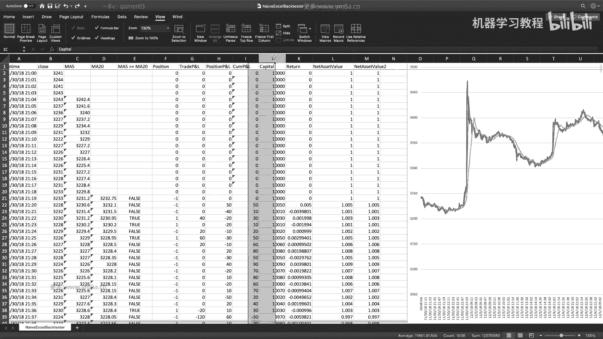

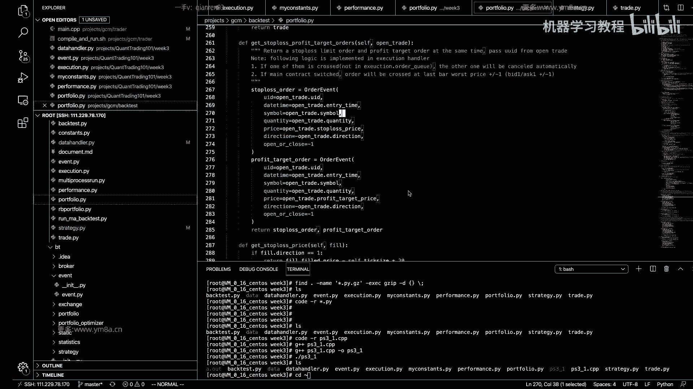

考虑考虑一个呃用就是用一个所谓的event driven叫事件驱动的这样一个回溯引擎。那这样的一个所谓的事件驱动的回溯引擎，它是什么东西呢？就是呃首先给大家介绍一个概念叫Q。这是或者叫中文名。

应该是叫队列。那这个这个它有一个是特性叫first in first out。firsting first out什么意思呢？就是说我们想象一个在超市排队的过程。就是第一个人进去了，他会第一个出来。

就是我始终是从这个方向是从是从这边是从这边进入，然后是从这边退退出。把这个稍微放大一点。对。那firsting firstrs out就是说比如说我假设有这样一个的。我这边有一个。数字的array。

然后我依次把它放到这个Q当中去。首先是一。然后接下来会变成什么嘞？我再放一个2。再放一个二的时候。注意二始终是在2始终是在一后面。然后我们经过一系列这样的过程，这个队列就被填满了。

然后这个时候我要从这个队列里面去取东西。我始终是从最先进的最先出。所以我取出东西的顺序也是12345。那这样有有一个什么样的用处呢？就是我们在考虑交易的时候，实上交易是一个典型的时间先后顺序的场景。

那我有了fit in first out这个概念，我可以把我的交易抽象成一系列概念的一系列事件的组合。所谓的我们所谓的event。我们可以动定义一系列的event，然后把它去扔到的这样一个。

一个队列当中去。然后我们按照队列依次排出来的东西，我们依次从队列当中去提取这样的一个东西，再去判断是整个队列是去怎么来来去模拟交易所跟我策略引擎的成交。

那么我们先来简单看一看队列这个东西在计算机当中是什么？我们用的是python，我们我们用的是pyython当中的一个Q。说只需要去python自带的一个数据结构。

然后我这边会随机生成一个呃1到10之间的随机处，总共生成5个。然后接下来我们做的事情是把这样的数放到这样一个队列当中去。然后我们再观察每一次我们放的什么数以及以及队列是怎么来变化的。

大我们我们看到先放的是6，然后这个时候队列的长度变成了一。然后再放的是二，队列长度变成2，一直到放到4，队列长度变成5。那如果说我们要从队列当中去数取数字呢，那我们就用呃Q的一个get method。

然后这个时候我们再去观察它的对队列的size。我们依次看到我们取出来是62434，保留了刚刚这样一个序列。用这样一个队列是可以保证我们的输入跟输出始终是有一个先后顺序，就不会出现说我们在回测过程当中。

到底是这个单子先成交还是那个单子先成交这样的问题。然后直到我们的这个直到我们的队列完完全为空的时候去回测回测去截止。那这个时候其实我们就要想我们的测我们的回测的时候，到底需要怎么来做。

你说我们刚刚想的我们需要一个所谓的eventQ。去来维护我们所有可能发生的事件。然后我们大家想整个市场在交易过程当中到底发生了什么？首先是有一个行情。我们这边所谓的market data engine。

他所要做的事情是。我要发送行情。航行事件。发到这个evenventQ当中。那接下来要做的事情是什么呢？我的策略本质上是根据行情来做决策的。所以我策略是需要从队列当中去取这样的一个行情。这个是我的策略类。

那策略渠道这样行情，我输出是什么？我们刚刚说我们根据了行情定义了一系列决策的因子。然后计算出我的信号，所以我要给他的事情是我需要输出这样一个信号，再回到这个队列当中。

所以策略本质上他做的事情就是calculation，我只要去计算我的模型的部分都是在这部分完成的。这时候我把这个signal就推到这样一个evenvalq当中。那有了信号之后。

我们这时候注意我们这边会引入一个新的类。加portfoo。portsfolio的输入是什么呢？portfoo的输入是signal。注意这个时候我们计算的是portfoo的输入是signal。

为什么我们要把。我们然然后这个时候我们输出是什么？是order。为什么我们要把order跟signal去分开呢？就说可能很多人简单的主观交易，我有了个信号直接开头去开空了。但事实上，在现代蓝华交易当中。

我们的profolio是需要对信号进行组合。事实上我们可能的是我有多个的策略类，有多有多个的策略类嗯。有多个策略类会往当中呃产生不同的信号，是我这边我这边用虚线表示是说有可能是呃有有第二个信号。

第三个信号，那我是不是一旦有信号就开仓呢？那我显然不是这样。我策略我我的profoo类是需要根据这些信号去进行组合，然后生成这样的order，再放到一半的Q当中去。

那接下来就是有如果说市场上有了这样的一个订单，有了这样一个order，我发到event我发到eventQ当中去，我要去撮合这些订单。所谓的撮合就是说我要去拿当前的数据去判断这样的订单能否被成交。

那这样的事情是交给。我们的直径引擎来做的。所以执行引擎的输入是什么？它的输入是一个order呃对。那它输出是什么？如果说这个单子成交了，交易所会给我们一个成交回报。

所以我这边会给这会给evenQ再推入这样一个feel event成交回报。对。那整个这样的一个过程就完整实现了说从market data到trategy，再到portfolio。

再到execution engine。这样的一个过程。大家注意说呃，有这样一个问题了。这是一个最简化的版本。但事实上说，我拿到了成就是。我的portfo输入是不是只有信号呢？呃。

事实上是肯定不是这样子的。为什么当我当我有了一个成交。我Pfolio会维持维护什么东西呢？会维护当前的仓位。当我有了这样一个feel event成交之后。我的position是需要去变化的。

无论是上升还是下降，我要去维护当前我的position。同时，portfolio还要维护什么事情，维护我当前账户的。账户的资金。同时破for，还有可能呢。我的order。我是不是需要撤改？然后以及说呃。

如果我的发单失败了，我是不是还要再呃重新再去发单？所以Pfolio这一块会比较复杂。那呃简单来说，我们eventq核心的部分就是这几个部分。

market data strategy portfoliofoo跟ex engine那我们接下来要做的事情就是要分别去实现这样的事情。呃，那这个时候大家会去想着说，我们到底回测是怎么样一个做。

怎么样做呢？事实上嗯回测的麻烦的地方在于我的市场数据都是不断的去输入的。大家可以想象一下，我们刚刚有1034个分钟呃，有34个分钟数据。那相当于市场会不断的去往这个里面往往这个市队列里面去推东西。

那同时我我一旦这个队列里面有了新的market data，我的策略也会不断的去更新我的信号，同导致我的我的投资组合也会不断的更新。交易所同时也在忙着不断的去撮合。那因此这个时候我们可能就需要有一个。

所谓的用一个循环来去来处理这样的一个复杂的事件流。好的，呃，那现在在这一部分，同学们有没有理解这几个类分别是在做什么样的事情，以及我们为什么要有evenventQ。对，大家这一部分有什么问题吗？可以。

对，其实这部分做的事情也只是把我们之前所做的呃回测的过程当中，每一步给它拆开，而尽可能去解耦。我们希望每一个模块只做每一个过模模块的功能。OK有点懵是正常的。好的，那没关系，我们再来一遍。😊，嗯。

OK这部分也是难点，预料之中。嗯，好的。有点懵。诶。呃，首先呃evenq这个概念大家有没有理解，就是我们要保证是first in firstrst out先进的先出。

或者我们再来把上面这个流程给一步步拆开拆解。我们给出几个定义。S是s event。然后。应该应该实际上是market data是第一个了。O是order event。谁。嗯，拆分模块。

然后有同学问说拆分模块是不是一定要类。呃，不用类的话，我还真不知道怎么去拆分。我们用这样的用类的方式来去做的话，就是为了去简化我们在。回测过程当中各种各样的逻辑。

因为事实上呃我课前给大家发的代码就是包括了这几个类的趋是实现，包括就是每个功能要做什么事情，也是让大家来去。去接下来这两周去完成的整个代码完成之后之后应该差不多1000多行。

然后有了相对就有了一个相对比较完善的一个回测模块。那首先这四个概念大家先理解清楚，分别是做一什做什么事，做什么事情的对，然后就我们要区分的一个是一个是event。

然后还有一个是对应处理event事件的类。对。就我这边可以写一个一一对镜对应。对。这个是trategy class。这个是策略类要去处理信号的就是。策略类是候负责发出信号啊。然后。然后。

market data engine是用来。发布市场信息。Portfolio类。是用来产生订单。其实这个就是我们的交易所。或者叫测合引擎。对。就是我们要注意就是说。这个东西左边的都是他们的输出。

然后输入我们到时候再来看。对，因为有的东西涉及到多个输入。然后我我我我们想的是嗯回到整个开始。我们画出整个过程当中的evencu。让我们用横的啊从左。大肉。就刚开始的时候。整个市场是一个空的状态。

我们整个我们evenQ就是来处理各种各样的事件引擎。呃，我们刚开始是空的状态，然后直到我们开盘开盘发生了什么？开开的时候。一般来说，如果说我们有的这个时候开盘的时候发生了成交，市场有了最新的成交价格。

然后我们的策略这个时候假设我们还没有启动，我们这时候或者说刚刚启动，还收集了数据信号。嗯，事实上说整个流程是无时无刻，这几个东西是不断的在发生的。但是我们为了简单体见，我们假设对刚开始的时候。

或者说我们回测的时候发生什么market open。这个时候我们的market data engine。他所做的事情是。Publish market data。那这个时候我们的一般Q变成了什么样呢？

我们需要做的事情是把这个market data放到这个eventQ当中。好。然后注意我们要做的操作是哦，我要在右边再写一下，我们要做的操作是。整个回测其实简单的逻辑就是来说。W。Evenq。

Is not。Empty。当整个队列当中布空的时候。我们要做一个什么事情？把eventq当中的事件。东西给拿出来。我们把这个东西叫。Event。😡，我们我们会从只要这个队列不空，我们就会从当中去拿东西。

然后我们接下来要做要做的事情，就是说去handle event。这样一个函数。各种各样的一般去判断我要去怎么来去处理这样的东西。那我们现在还回到我们的整个流程当中。市场刚开始发生了什么？

market data engine发布了第一条第一分钟的市场数据，作为一个market data event。注意我们这个里面所有东西都是event。

我们发布了第一条market data event，那我们就要看到回到右边的流程。我这个时候需要来做的事情叫handle event。就呃因为这这个不是handle里面。

就是这个时候我们我们来我们来判断右边的w loop。这个时候evenventq飞空。我们要做的事情叫get这个even。我们要做的事情是get。那我们get就把这个东西给从这个当中取出来了。

我们就得到了这样一个markety data的 objectject。同时这个Q又变成了空。那我得到这个market data要做什么事情呢？他是哪个的输入？他应该把market data。

应该把这个东西输给什么？呃，大家可以想一下，在群里回答一下他应该是哪一个类，负责输入market data。就是说我们讲刚刚开盘了，第一分钟数据发布了。

然后我们然后这个event engine呃里面被输入了一条嗯。呃，market data event，然后我要把这个market data event给拿出来。

OK有两个同学说是 strategyrategy。😊，Goodod还有呢。大家可以想一想，就是这个这trategy是对的。但是我们这边可能上面简化了没有讲，因为我怕讲完之后是要把大家给绕晕了。对。

所是说大家可以想想，我market data是不是仅仅只有trategy会用到。事实上，我的portfoo，我 execution engine都会去用到。想象一下。

交易所没有我我没有market最新的market data，我怎么知道我也没有被撮合成交，我portfolio没有最新的市场数据，我怎么知道我当前投资组合的净值的变化？OK所以有同学已经开始理解了。

就是说我们这个时候我们要把它做的事情是。嗯。这样吧，我之后所有的object我都用圈用圆圈来表示。然后我所有的class我都会用方框来表示。这样就能表示说，因为就在pyython当中去实现的话。

你可以去理解为每一个都是一个class。然后所有的SM和OF都是一个呃都是一个呃sorry。都是都是一个具体的一个event。对。那这个时候我要做的事情就是说我把这个market data。

Joking strategy。Cass。那trategy class要做什么事情呢？我经过一系列的市场数据，我产生了一个交易信号。那有了交易信号，我要怎么办？我要把它放到这个。队列当中去。

于是我们这时候对就变成了有了这样一个signal交易信号。OK这部分大家都理解吧。😊，我们从市场数据产生了一个交易信号。那又要回到我们右边的这个逻辑了。我发现这时候evenvantq又是飞空了。

那我要做的事情就是说把这个evenQ当中给取出来，取出来再去处理这个事件。然后我这边又是一次get。我得到了一个signal信号。这时候再问大家了，s能信号是交给哪部分来处理呢？我产生一个交易信号。

对我经过一系列艰苦哲绝的计算，产生了交易信号啊，这个信号是多的，我们要去做多，那我们要怎么办呢？yes， portfolio。我需要告诉我的投资组合的管理器，我已经产生了新的交易信号。

你需要根据我最新的信号去产生新去产生订单。好了，我一不小心把接下来答案给说出来了。呃，what那既然这个事情就是。😊，那这个事情我就要把signal去交给我的portfolio去做。

portfolio要做的事情是我根据信号去产生我的order。对。呃，再次强调一下，为什么要把strrategy跟portfolio给分开。因为很可能很多人直接做策略。

就是由信号产生的信号直接就是多空了。但事实上说，包括为了后续的升级跟知识，你需要把你的portfoo跟就是把你的信号的产生，跟你的信号组合，这两部分进行拆开。这样你也可以知道。

如果你想未来想要去优化的时候，到底是我信号不够好呢，还是说我投资组合优化的部分不够好。好，那接下来同学们能告诉我我们要做什么事情吗？我产生了这个orer。接下来我们该做什么？嗯。や、撮合。

那可是我不能直接撮合啊，我我我这是一个事件。对我我得我我接下来要做什么事情。就是说我们要理解整个even driven的事情是是说我们我们把每一个东西都当做抽象的一个事情。这个是正确答案。

返回到evenventQ。我还是要做一件事情，再把它给放回到日边的Q。就是我们有没发现我们在这个过程当中必出现了一个什就是产生了一个什么样的优势，或者说。我的 portfolio class。

我的 strategygy class没有跟任何的其他class去打交道。我只对我我的输入跟输出都只是事件，但我不跟其他类去打交道。通过evenventQ的方式，我可以去实现这种工程上的去解耦。

同时大家有没有发现我这一分钟拿到的数据是不可能被这一分钟的价格是不一可不可能被这分钟的交易所所成交的。因为我这分钟拿到价数据是这分钟产生的信号是在数据之后。如果说把前面两步合一下的话，就是。

我们可能是M是在S的右边。对。就是或者或者说我这样吧，我在之后的时候，我们取出的时候，我们把它把这个事件给划掉。对，比如说我们第一个取出来之后，哎，我们就被划掉了。

然后我们这个把它就是事实上这个Q是不存在的。我只是说只是说方便大家提醒他，这个里面到底发生了什么，就是market data是已经没了。然后包括到这部分的时候，我们有了新的策有了策略的trategy。

有了signal。事实上已经没了啊，这些都没了。就是说我这个时候队列里只有一个order。接下来OK那接下来告诉大家要发生什么事情。😊，刚刚已经说了。

我们把这个order放回到返返回到eventQ当中去了。那接下来要做什么事情呢？呃，还记得我们这边的逻辑吗？无限循环直到队列为空。Yeah。事实上也可以理解说是叫推给exec，我们是推的吗？

事实上是说我也可以理解为是推吧。但是事实上说我只有一个东西叫get，我只有一个方法叫get，对吧？我把这个东西get出来，那get出来之后，我再去判断它到底是什么样的东西，对吧？事实。

handle要做的事情呢。你可以理解为说是。对，刚刚就说刚刚他刚刚同学说是推，但我个人理解呢，实际上是一个if else，对吧？如果就是说。Event。Type。等于。马克对了。对吧。然后这个时候是。

trategy去错了处理这样的一个事情。那如果。Event。如如果一般推出来的是。Sグナ。那我这个时候就是。调我的portfolio去处理。然后。如果我推出来的事情是。Order。那我这个时候。

这是张鬼我的。Execution。就事实上说，每一个object他并不知道在被拿出来的时候，他并不知道。嗯。他会去追他会被推给谁。然后这个时候我们只能通过if else语句去判断。所以我们再回到这部分。

我们把这个东西order给取出来了。不。取出来的之后，这是一个order event。大家说这个是推给哪一个？刚刚我已经说过了。我拿到了一个orer，我当然要去推给execution。

或者叫exchange，what这两个在我眼里是怎样等待的交易所不就是。处理撮合的嘛，对吧？OK那这部分。输出是什么呢？他的输出是什么？大家注意啊，我们上面的1个Q当中已经。order已经没了。

OK大家告诉我这个输出是什么吗？我们总共就这么多东西。ok对，feel event啊，注意啊，它这个时候不是订单。嗯，这样这个就是我我们就要区别一下order叫订单，feel叫成交。对。

这样我们可能就是把它的把它的东西给就是我们清清楚它的定义。可能我知道这位同学订单的意思就是对成交。但是我们这边叫order，我们叫我们自己这边的发单，然后feel才是我们的成交。

我们就是我们在这边统一规规范。Okay。那接下来要做什么事情呢？我有了这个feel之后，我还要做什么事情？其实大家上面我就会发现了，我只要有evenvent，我不可能把它丢掉，对不对？

我只能把它放到我的事件引擎当中，evenventQ当中去去处理。所以要做的事情是我再把它丢回去。大家注意啊，我们在不断的往前推。这个只是为了方便大家去看一下这个顺序是什么？对。

OK那谁能告诉我接下来一步是什么呢？我们已经有了我大家要注意，我们要回到最刚开始的逻辑了。while eventq is not empty。那我们接下来做什么事情？这个队列不空。只要对列不空。

我就把里面的东西给取出来。OK所以我们现在又把所有给取出来了。那接下来问题来了，这个feel交给谁？对。😊，对，这本是一个 get method。这个费用交给谁？我们要跑到哪个里面去？Yes。😊。

Portfoo。那注意这个时候它会产生所谓的event吗？订单成交，我可以说。okK这个时候其实可以说是结束了，但事实上未来也有可能会去产生新的东西。比如说。有了订单之后。

我profolio的一个这这个这个时候啊像这个之后再给大家讲，就是简单来说就是profolio我有了这样一个那这个要做的事情就是说我profoo需要把自己的一些属性去更新。包括 position。

包括我的。就事实上就真实教育当中，它会有哪些东西啊，保证金。然后我的现有的可用资金。对。然后。以及我们可能会出现的。就是。Stop plus。或者是pro止盈止损。这个也是有可能的。

我profoo class任务就是比较艰巨了，我这些东西都要去都要去来去处理。对。OK我们这时候再回到整个流程，再来过一遍，整体过一下。这时候大家应该清楚好多了吧。整个市场开始。

market data产生MD event放到队列当中。meven队列我收到，然后这个时候策略类收到了市场数据。我产生计算，产生我的信号。注意signal这一步不是必须，有可能我不产生信号。

我不产生信号怎么办呢？那我就它让他接着去产生market data就好了。ok我们现在假设是说每一步都是有的哈market data strategy class我要计算我的信号产生了signal signalal发现唉这个队列又不空了。

我把它信号给取出来，交给我的profolio，我foo根据这些信号下了一个订单。于是我在然后这个时候又不空了，队列又不空，再从订单里面取出来，交到excus engineexcus engine呃。

就这个这个单子可能在交易所注意是它可能在交易所持续一段时间，因为我不能保证我每次挂单都成交了。那我可能会在交易所hold交易所hold就是交易所维持着我可能等到某一刻，它突然A成交了。

那我就把这个东西再推到一Q里面去。😊，然后这个evenevenQ就有一个成交事件，成交事件在推运给portfo。对，那事实上就是我这边把portfolio把signal跟feel所有事情都放在一块。

那如果大家想要去化简的话，我也显然我也可以把Pfolio拆成两个类，一个负责处理信号下订单，一个负责处理成交回报。根据这些成交回报来计算我的资金情况。对。

那这样一个就我们通过这样一个流程就完成了整个的一个。整个的一个evenventQ。对。这个时候大家概念应该好了一些吧，对吧？放心这个PPT之后会发给大家。excuse class好的。

那事实上我们这边看到是一个在一个循环当中发生的事情，就是说一个market data发生了这样一个事情，就是从market data，然后到signal到orer到fiel。那事实上真实当中。

如果说我们把这个对列再画长一点。那可能会出现什么嘞因？我们还是从左就是从右到左，就是不断的往右方向是这样子的啊，first in first out。那肯定是说第一个市场型号来了。现在是不是OK。

好像哎哎哎怎么没有更新。No了。我刷新一下啊。嗯，sorry，这个确实这个软件好像用起来有点慢。到底有点乜？喂。嗯，那简单来说就是。嗯。这是。

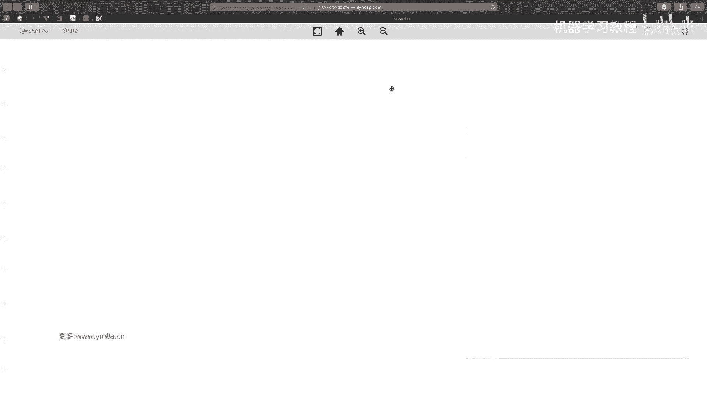

好，那如果是这样，我们先我们直接看代码吧，代码里面其实也是一样的。

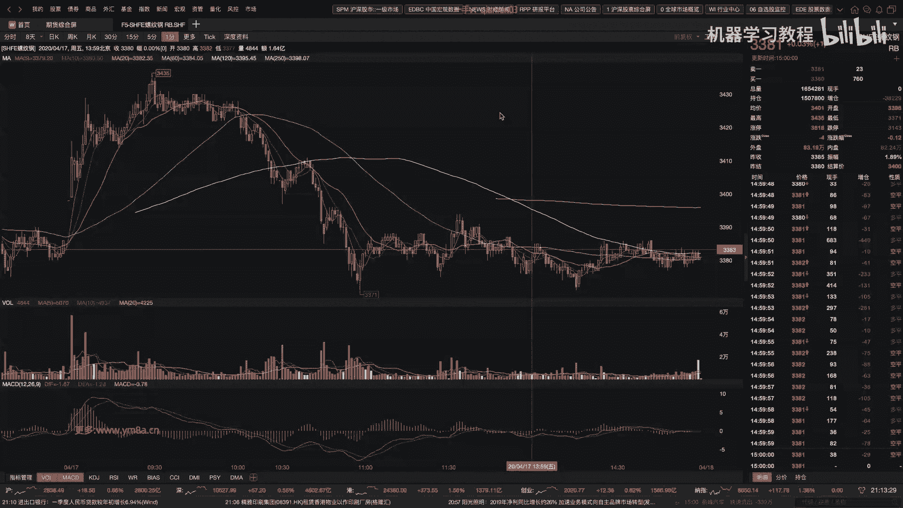

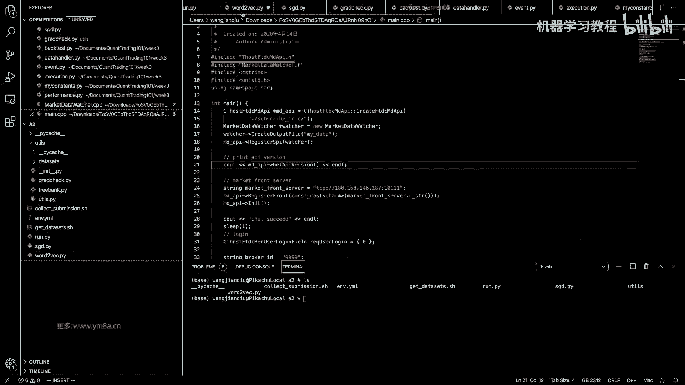

注意我们其实整个的回测就很简单。是不是刚刚熟悉的味道？我们先忽略上面的部分啊，我们就看这个部分。当evenvent type是82的时候，就是我们所谓的market data。

我们的trategy去处理这样的事件。当我们的事件是signal的时候，我们的portfolio去处理这样的事件。当我们数据是order的时候，我们的excusion是去处理这样的事件。

然后当我们的field事件出现的时候，我们profolio再把它给把这个成交回报再推回去。其实这是一个简简单的策略这样一个引擎。OK所以大家现在对这部分掌握的情况怎么样？

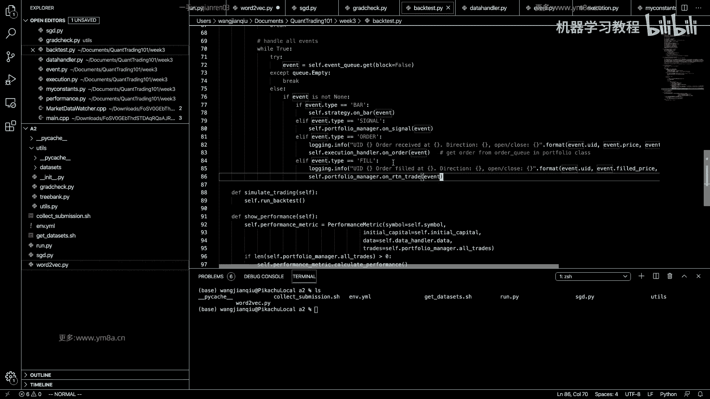

我看看有没有好alright。对啊。怎么回事？先打配我试试。

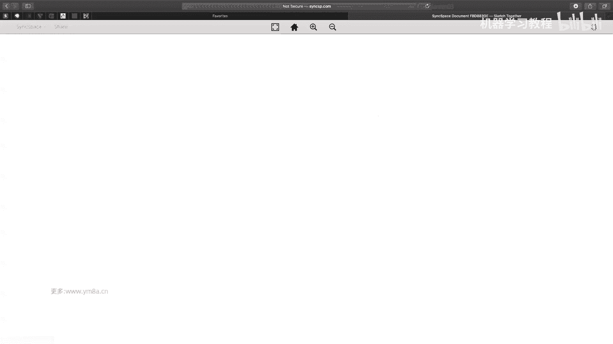

ok嗯。现在大家对这部分有没有有一点理解了？还有或者说现在就这到到当前为止，大家有什么问题吗？就是说我们这样所做的目的其实是把我们简单的拍上的一个。呃，一个向量化的回溯，我们把它拆成这样一个个复杂事件。

方便于我们在未来做策略的时候，可以对每一个模块进行升级。这个代码我应该课前给过大家了。对。这个是在back test文件，就说整个的核心我们在做事情就是一个无线wi loop。

然后我们把所有东西都做完就行了。然后对。然后如果要注意一点的话，就是在刚开始的时候，我们会就是一个market data engine。

然后我们要注意就是说这个continue back test是一个 binaryary variable，它来来它是来判断，就是说我们的数据也没有输送完。我们什么时候停止。

当我们数据就我我们说整个回撤停止是就是Q是 empty的时候，我们看到说当这个Q是 empty的时候，我们会break。这个时候我们break是什么呢？这这个时候是是等等我们的market data。

让它去产生新的数据publish market data。然后然后注意这个时候然后如果说当我们的continue back test是fse，也就是说我们所有数据都走完的时候。

我们自然会走到最后一步去break。那我整个外面的一层的w loop就结束了。实际上它是一个两层 loop。我们刚刚介绍的是整个的核心是一个ner的就是内部的一个我事件处理的引擎。对。

其实整个回测就是这样子，然后这一部分这这这一部分呢，待会儿我们再我们再下一个再会去讲到底是怎么回事。😊，ok现在那个那个做做做个小qui吧。那个我把这份去掉，然后大家用课间休息时间嗯。呃。

就把我刚刚的一个简单的队列这个流程大家自己写一下吧，就是到底是strrategyS交给谁，然后哪个是交给谁？每一个每一个每一个每一种事件分别交给谁。对，然后这个大家课间时间来想一下。

我觉得自己理一遍会比较好。对。

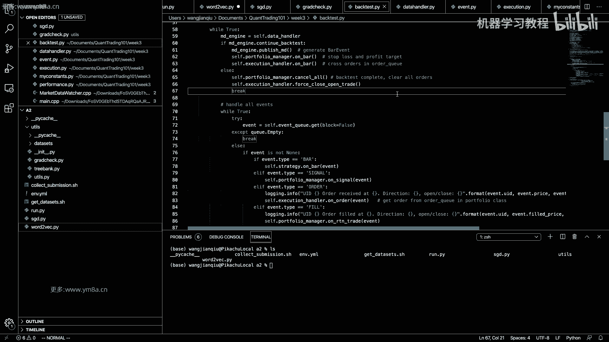

那现在就是OK我们就提前3分钟下课休息。然后大家在这个时间去把刚上一节课回想一下，你到底学到了哪几个事件。然后这几个事件分别是怎么来处理的。我来看一下大家的理解程度，好吧。

其实就是说我我觉得这个事情是自己理一遍，你就能清楚了。就这个理不清楚。我们接下来写这个回程引经会比较大的麻烦。对，然后我看到大部分同学应该都是跟上。然后如果有什么问题没有没有没有听懂的。

可以嗯就是或者说我没有讲清楚了，一定要在群里就是呃写出来哪一部分需要重讲。然后我们在下节课再去再去理解一下。对，因为我需要确保每个同学都理解清楚。不然这两个星期就是1000多行代码是确确实是有点够呛对。

嗯，这一部分其实也就是整个呃在回测过程中回测的设计当中来说，就是一个基本的一个框架。包括我们之后呃，如果说你要做高频，其实也是用类似的框架。然后嗯或者说是你想要做期权的回测。

我们也是我们也会基于这样的现有的这样一个设计去把我们去不断的拓展。对，那接下来的课间时间就麻烦大家就呃不用不用很多啊，就是大家用自己其实简单聊天记录写一下，就是整个流程发生了什么事情，有几个事件。

然后几个事件分别交给哪个哪个哪一个类，然后哪一个类去处理它的输入跟输出是什么，其实就行了。我觉得确保就是我想看一下，大家对这个事情理解到了什么样的程度。嗯。好了，这个又出来了。那我就把。对。

这部分给大家。然后大家可以想一下。就做了什么事情。对。嗯。好的，那我去喝口水，大家来再自己去理一下整个流程当中到底发生了什么事情。我就自己动手在纸上画一画，然后把整个流程统一理一遍。

我觉得可能这部分就掌握的比较清楚了。

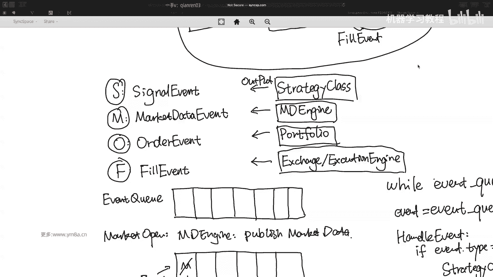

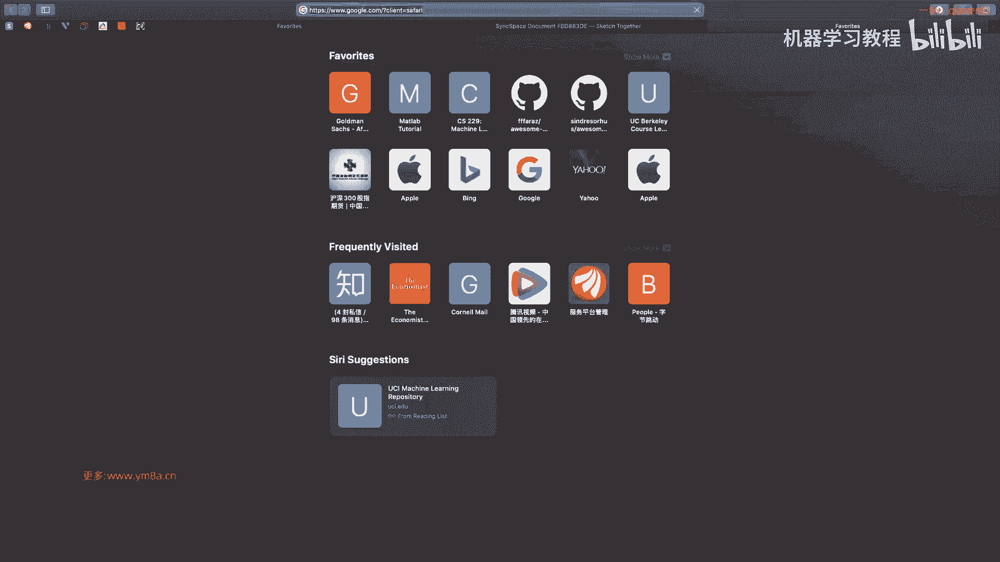

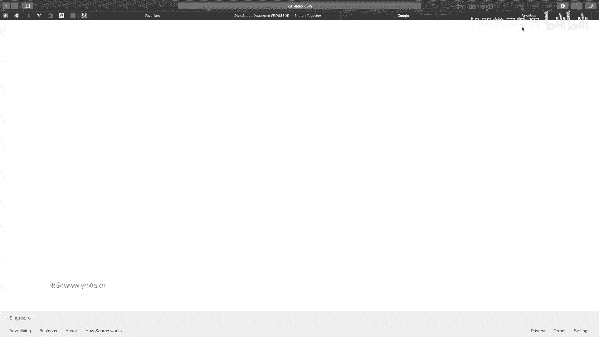

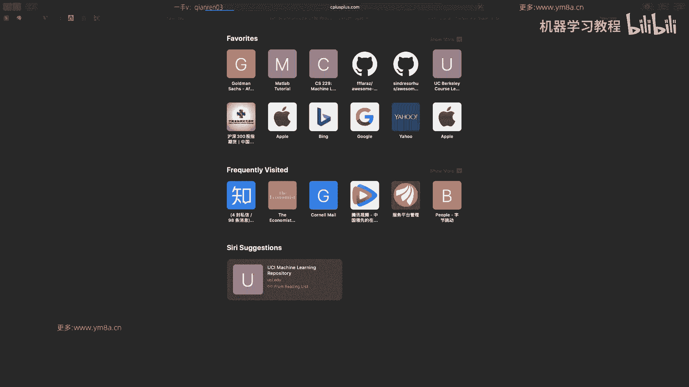

hello，哎，同学们，我们来回到这节课啊。哎，刚刚有同学说是不是为什么要用这个数据结构嗯。呃，你当然也可以用list，你把list封装好之后，但因为你要随时就是从队当中去取事件。

然后以及说你要把在你每一个class也会去产生对应事件，再把它放到对列当中去。嗯，你当然可以用list pen来做。但是当事件多的时候。嗯，那反正就要考虑。嗯其实你如果说完整的实现了。

就说first in first all，那你其实不管你用类似还是用Q数据结构，我觉得本账本价都是一样。只不过说用Q的话，是因为python自带数据结构，我觉得调用起来会比较方便。

我可以对我可以随时去嗯。随时去看就是说这个队列里有多少个元素，然后以及队列为空的时候，我我我可以就是用exception来退出。

反正嗯就是就是说关键关键说是这个就主主要是理解就是说firs in first，我要严格保证多个事件谁在心谁在后这样一个问题。

因为可能会我们可能会出现的一个信形是呃在队列当中就是呃可能是market data，也有可能是order，然后回到中间某些过程，也有可能又有新的事件会去发生。

就是说我们在交易过程当中可能会出现是这样的这样的一个事件。然后但是嗯其实不管你用类似还是用Q，你你要做的事情就是不断的把它排在最前面的给拿出来拿出来。然后去处理就ok了对。

主要是嗯主要是因为可能会出现的情形就是呃。当对，怎么说呢？后面当你可能多个测多个类型的是多个类里面可能会产生新的时间。对呃，新的时间包会比如说我一个orer发出去发到呃发到portfoo。

我 portfoliofoo，然后要去关注止盈止损这个情况。我止盈止损，那可能就是然后嗯然后以及我同时可能我刚刚说的就是说我们策略产生的是一个信号。那也有可能是说我之后portfoo可能要去平仓。

然后平仓的时候，我有可能要开新仓。那我可能同时就是我可能会先优先的会往这个队列里面发就是产生两个产生两个订单，一个是平仓订单，一个是开新仓订单。那这两个谁先谁后，就是有有问题的对，也不是说有问题。

就是这两个谁先谁后是有讲究的对。好的，嗯，那如果。那我那我先看一下，因为这个这个就是因为这部分是包括下周我们还会接着继续讲去怎么讲怎么实现这里面部分。然后我们先把上一节课的作业给过一下吧。

因为好像我们到现在为止，总共只有三个人交了作业。然后嗯我们先看一下，就是针对很多同学就是部分同学不是很理解class的概念。然后这边其实是一个简单的totuio。就是如果刚刚。

刚刚我们在拍on当中也讲到一个class在做什么事情。class本质上是对一系列的呃变量跟函数的一个封装。然后然后然后我如然后我们这边这边是有一个，然后如果没有学过，这这这个是引入引入的所谓的投文件。

因为你接下来会有input跟output see out和呃C你会用到I stream里面的东西，然后这个是叫name space，然后这它用的是一个标准的name space。然后如果说。

你没有这一呃，不用没有这一行的话，就是我可以把我的不同的class放在不同的name space里面。然后我这个时候用se。我因为我前面已经说的是using name space STD。

所以这个时候我前面就不需要再告诉他。我用的是标准命名空间下的C。那然后如果我后面有不同的命名空间。那我就要用调用函数的时候，需要告诉他我用的是哪个哪个命名空间里面的函数。对。

然后我们这边看到就是说这边这个class里面有两个东西，一个叫wa，一个叫ha叫长宽那长长度跟宽度。然后它有两个public函数，public函数是什么意思？

就是说我可以就是说我外面我嗯外面的东西是可以去调它这个函数的，就是说它是对外暴露开的，它就叫public。然后这个外这个第一个叫叫set values function。

它它的意思是set setet values就是它的input是两个整整数，然后它的返回值是一个word，就是说它往我没有返回，它所做的事情本质上就是在下面函数，它会实现这样一个函数。

它所做的事情是把我这个矩形的with设为X，然后把我的呃高度设呃设设为Y，然后它的是input是两个in两个整数。对，然后嗯在man函数里面。

每每每个C每个C加加的一个程序都应该有一个有且只有一个唯一的 main函数，然后它的返回类型是int是0。然后在这边它要做的事情是我先生成了两个。rectangle长方长方形，然后第一个长方形叫re。

第二个叫re B。然后第一个把它的长宽给设好，第二个也把它的长宽给设好。然后接下来做的事情是把它的面积给说出来。它调用的是每一个object的一个函数，大家要注意这边要做的其实class要做的事情。

其实他就是把所有东西都封装好了。我告诉你，我有这两个东西，那这两个东西是什么呢？都在这个class里面，我们就回到这个class里面去看，然后他要做的事情就是把它的 area给计算出来。

然后这个注意的时候，他直接在这个里面就是class里面就写出来了。我 area要做的事情是一个return这样一个呃长乘宽这样一个东西，所以这就是一个简单的C加加的一个class。对。

然后如果C加加不是特别懂但是只要学过编程的同学看这部分代码应该不是一件特别困难的事情。对，然后我们来看那个有有一个同学叫了有有有三个同学交作业。然后我随便挑了一个同学。我看一下。

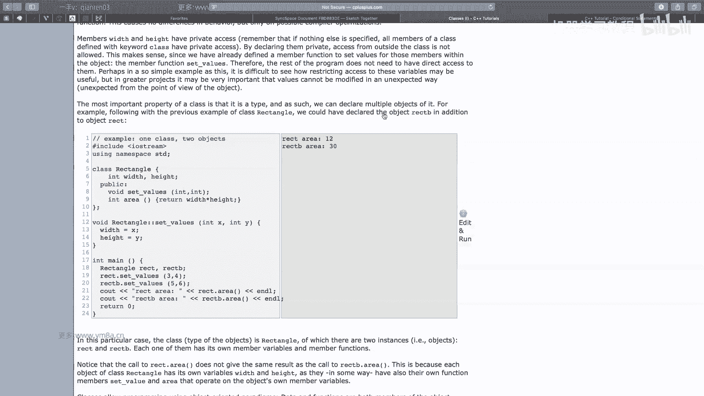

そ。Okay， it's in my mind。

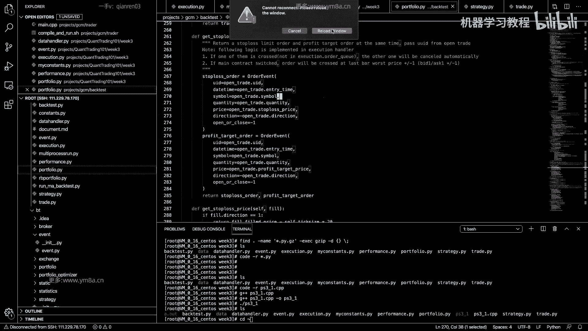

对，就是上节课作业是怎么回的嗯。OK这是。

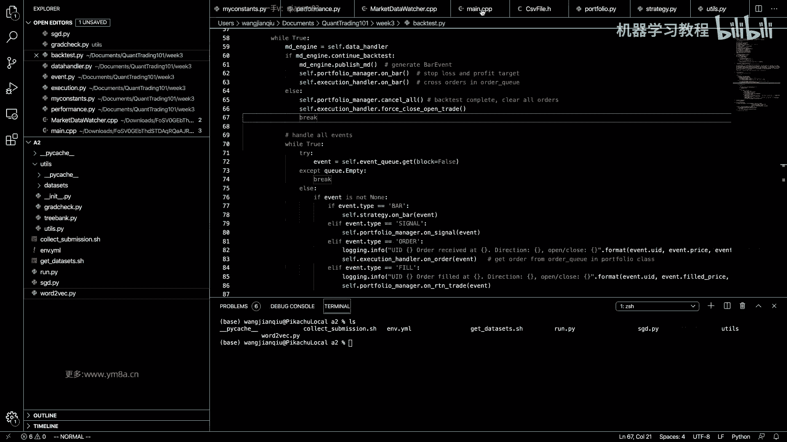

啊，我们还是要需要看一下。对，就这里面可能坑比较就是有一些所谓的trick，或者也其实也不是trick，就是嗯环境的问题吧，我觉得。

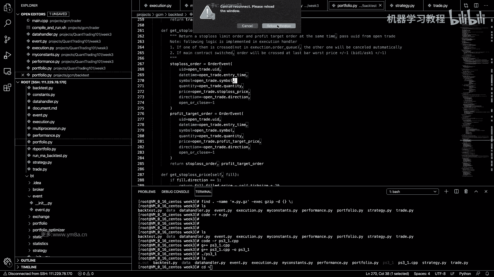

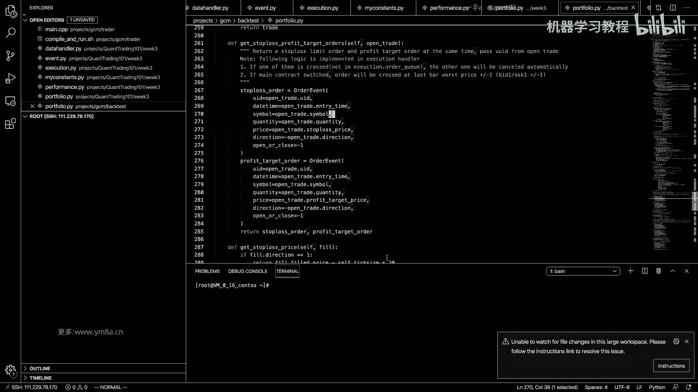

嗯。对，其实我们刚刚我们上节课有讲到说，其实我们要做的事情。就是继承我我们要做的事情就是说把这样的一个呃MDSPI的这样一个东西给实现出来就可以了。

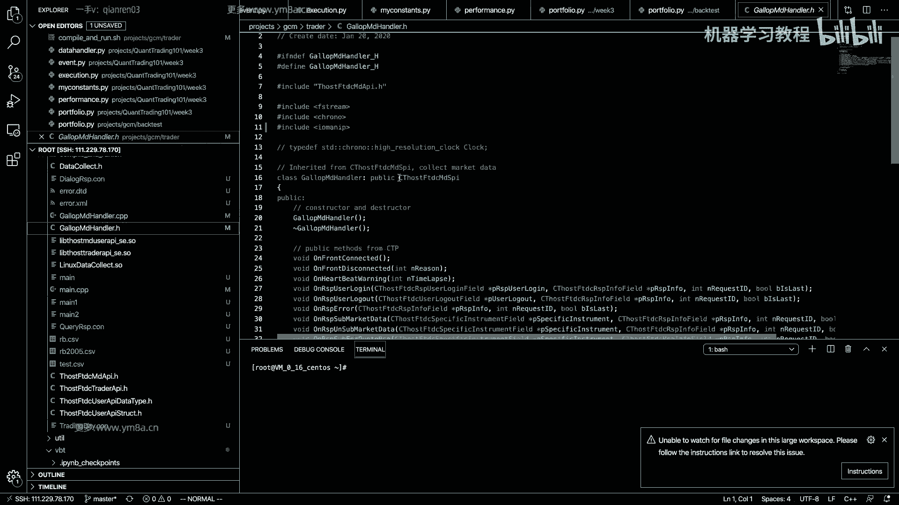

对，那这个东西它来自于哪？我们刚刚说的是它是来自于MDAPI这个文件。MDABIAPI里面定义了我们一系列所需要的标准的一系列方法。我们再来回过头来看一下这个里面到底是什么东西。还，这个Encoing。

ok。然后他是说定义了是客户端的接口，然后前面这个东西这是它的头文件。头文件就是说你可以看一看，我们好吧，那也一起看一下吧。就是文件里面是什么东西？嗯。头文件里面是什么东西呢？

他告诉你就是说我们刚刚说一个class，对吧？在头文件里你可以把它的定义给写出来。就是说你告诉我我要规定一下我这个class里面需要有什么东西，然后但是我不会把我具体的实现去。就写在这个里面。

然后由其由于这是一个就是base class，然后就是说它没有去做这样的事情，它在前面加了virtual。什么意思？是说我接下来所有的类都要去继承，就是我要有一个类去继承，就呃trarSPI。

然后它的 virtualrt意思是这是一个这是一个虚函数。然后虚函数我去说我要去继承它，然后去把它实现。那继承它时间是相当于说我就要去重写这个方法。

然后到底它是怎么就是你要去然后呃就是说你你需要在你的类里面去写一个同样名字的这样方法，然后把它那里面一个函数功能给实现。然后嗯。它其实这里面有几个部分，就是它这个是所有的CTP里面，凡是是on开头。

都是你该是on front connected。就是说当我的前前就客户端与后端连接的时候，我要做些什么？然后这边断开连接的时候，我要做些什么？然后我们现主要关注的是就是说主要是有一一个呃。

现在认证请求在这一部分我们应该暂时设计不到。但是是线上生产的时候是需要做这样的一个事情的。就是说当我我要做的事情是呃，我收到了我收到了呃，且的请求响应的时候，我要做什么，然后。大家注意这里面是两部分啊。

一个是response，一个是on responsese。就是说我收到的是我收到了response，不是说我收到了，我不是说我log in的时候要做什么，login做到什么什么是是服务端要做的事情。

但是我客户端是要是当我收到了服务端收回来的回，就是回应的时候，我要做些什么事情。那其实这些东西有很多很多的呃不拉巴拉东西。那其实我们我们最关注的就是一个呃。是。我。

你看这里面方法就是就是说它实际上是说这个方法是告诉你是说我出现了各种各样的可能情形，我都要去把它去能够去处理。我这边都要哦，sorry，我说说是看的是trader怎么会。那个。我看的是。是trader。

不应该看那个trar。这我看了应该不好意思，刚刚我说看了tra的怎么越看越不对，这个是一个交易客户单没关系，但是MD跟trar是类似的，就是说一个是行情，一个是负的交易。然后行情行情呢相对来说。

这里面就比较简单的说还是一样的。我这边登录登录跟登出有什么。然后其实我们比较比较关注的就是说我收到了行情的。就是说当我订阅之后，就还记得我们上一节课提到了就是pub啊就是pub跟的那个模式嘛。

当我的当我只要我只要订阅了之后，客户端就会向所就是服务端会向所有订阅的客户端去推送这样一个行情。注意这个时候我不需要去主动的就是说是发起一个函数。比如说我们说是要去像刚刚的计算矩行的面积的时候。

我们不需要主动去写呃，就是client calculateculate area。我们不需要主动去写。因为这个时候我们已经注册的把我们的东西注册到服务端。

所以服务端会主动的会给我们推送这样的一个呃会给我们推送这样的一个market data深度深度的行情的market data。那我们客户端要做的事情是当我收到了深度行情通知的时候，我要干什么呢？

我要把它给记下来。那这就说其实我们上一次作业本质上只要去把这个里面的东西给写到就是在这个函数里把我收到的数据写到文件里就行了。对这。其实是整个上一节课核心的一个东西。然后大家可能刚开始不太理解的是。

就是魅函数，我到底应该怎么写，就是整个流程到底是什么样的。大家注意一个个意思是然呃因为这边我们先就是说。先是一个就是它有两个东西啊，一个是market data APII对。

然后我这边是我自己写的一个handler，然后我这个handler是继承了嗯。嗯就是继承继承了这样1个AP，它它就是在我们的。呃，对我们看一下，就是我们自己其实要写的就是三个文件。

一个是我们自己的market data handle头文件，一个是然后是market data handle的CPC加加文件，还有一个是运行的主函数卖文件。这两个文件你是可以合在一起。但是我个人的习惯。

还是说你保持良好的编程习惯。呃，就是我具体的数据结构定义是放在头文件里面，然后具体的实现是写在CPP文件里面。对它本质上来说就是一个呃它是一个回调函数，就是这样一个的，就是呃就是它的一个继承。

大家注意这边是写的是呃冒号，然后public，然后MDSPI其实就是说我们有两个一个是market data APII一个是market dataPI对。那让我们再看看麦函数里面到底是做了什么样的事情。

这首先是我们先初始化一个market data APII。就是说告这个这个里面就是说呃你可能要去嗯。然后你这边也可以看到，就是说你API到底是什么样的版本。对。

然后market data APII它其实做的事情是什么类？是呃是去就是说我要去注册我的呃front，就是然后front front address，就是说我要到底告诉我。

我要去连到那个我要去连接我的API，然后再去把它初始化。然后但是注意这边这边要注意一个就是有一个特别的地方是。当我出始我的我的market data handleler出注做完之后。

我要去把它注册到我的呃呃注我要去把它注册到我的就是MMDAPI里面。就是说告诉他我这边有我自己生成了这样一个的hand。但是对，然后我要告诉告诉我说我MDAPI里面，我有了这样一个handle了。

告诉客户端，我自己已经做好了一个收集行情的一个东西。然后我要先要告诉你，我现要去在market data APII里面去调它的registerSPI函数。大家注意我们这边的时候。

MD handle是一个SPI的集成。我们的应该注注意我们的handler是1个SPI。Inherited from city house MDDSPI对这之所有回调函数。

然后然后要做的事情就是说当我把我的回调函数注册到了market data APII里面的时候，我这时候就可以开始说，然后market APII做下一个事情叫连接前置，然后叫初始化。

这两个函数是就是在我们把它切一下吧。这样对照起来可能会好一点。对。就是他这样做的事情就是。这边是API哈。我们确认一下名字，OKAPI他要做的事情是什么？

刚开始我们先做的事情是初始化这样一个就是create MDDAPI。对。然后。然后createMBIMPI呃就是API之后，然后再去做把我们的register SPIregister APII。

就这个东西把我们作为一个呃把我们作为一个指针传进去。对，反就相当于说这部分就是说告诉服务器说我这边注册了一个我的客户端注册了这样一个回调函数，我已经准备好了。对。

那接下来然后在我做的事情是我要去连我这样的然后我这个market data API我到底去连哪个服务器的行情行情的那个地址呢，这个是front market data address，对吧？

然后他要告诉你IP地址是多少，端口是多少，然后实盘交易的时候，你只要把这个端口换成呃券商呃就是换成机构公司给你的实盘端口，你就可以收到来自实盘的信号了。对，然后这个时候把我把这个reg做完之后。

就可以开始去我的做我的初始化。初始化的时候注意，这这中间可能需要时间，所以我这边做了一个sleep one。对，让他让他先就是休呃，就是让其实这部分我等他等他这部分完成。对，一般来说是很快的。

然后接下来要做的是嗯是这样的，就是我会生成一个。A requestquest user login这样一个 objectject。或者他应该是ex个struct。

这个东西呢就是说我要去让我我要去登录的时候，那我要知道我的用户名跟密码。然后我的bro IDbro ID呃，这个是你 seem now是9999。然后然后中心的实盘是66666呃，5个6对。

然后这这这三个东西我会把它储存到request user logging这个对象里面，这个对这个对象在哪是在就是我们看到就是它应该是在APstruct这个里面。这个先把它放右边。

就是他这个APstr里面告诉你我每个对象里面就是有什么样的东西。嗯，我们先不看那个，我们先接着过这个流程，我们再看一下啊，刚开始是注册前置，哎，就是先注册初始注册我的MDAPI。

然后初始化我的MD handlele，然后把我的就是SPI因为注意MD handle是SPI注册到我的注册到交易的MAPI上面去。然后然后然后初始化前置初始化前置之后，注意这时候我们就可以准备去登录了。

登录的时候我要去有这样一个登录的对象。request user log你要有bro ID有us ID有 password把这样的request呃request user logging告诉MPMDI我去登录了。

那登录的时候就我等待2秒钟，让他去完成登录这个过程。然后登录完这个过程，说实话，我们这个时候前面的就是登录的部分就完成了。那接下来要做的事情叫是什么？叫注册市场数据，我要告我要去订阅。

我要去让那个服务器知道我想要这些数据。那这边这边是生成了一个这样一个二位数组。然后我这边生成了二位数组，我只我这边只订阅了1个RB2010。对呃，当然可能上次就是说。那。

还记得第一课我有提到就是这个合约是什么吗？就是合约。呃，首先是罗文光，然后是20年10月份到期的一个合约。然后如果说嗯。你我们用的是呃，如果是sim的话，可能有些合约不是都有。对。

甚至嗯那这样就是比较会，就是所以大家可能得自己去尝试一下有哪些合约是有，包括有同学说是了，股指是有对，然后一般来那如果就是觉得是股指股指有的话，一般来说你看看大家可能试试看IF2004。

因为现在是4月份，然后你也可以试试2005，就是说注意合约是可能会去过期的，所以大家可能就要去尝试一下。但是如果你前面都走完了，流程应该是没有什么问题。对，然后嗯然后这个是我就说把这个合约。

相当于就是说写到这个PP instrumentment ID里面去。然后接下来要做的事情是我market data APII告诉你呃，我要告诉market data APII我需要去订阅这些数据。

订阅了这些数据之后，然后。然后定阅你定义定义完这个之后，你再把它去撞一下篮去运行。然后事实上整个流程就你你这个程序就已经跑起来了。因为为什么呢？

因为因为相当于说我market data APII跟我的呃MD handle这两个东西，我MD它我我MD handle已经注册到这个market data API上面。一旦我这边收到了新的数据。

那我的MD handle就会在就就会在我就会在我的相应的我们d market data里面去收到相应的数据，它就就是说当一旦有市场数据传回来的时候，我们会做我会会发生什么样的事情呢？

就是说我们我们我们的这个函数会被执行。一旦收到回调，一旦一旦收到相应的信息，一旦收到市场数据，我们这个还是会被执行。那那大家还记得我们刚开始做了什么事情吗？就是说我们刚开始在登录的时候。

那事实上你只要去登录了，然后你收到回复，你这个函数就会被相应执行。所以这边都是叫回都是叫回调函数嘛，你收到了on response你收到了什么样的东西，它都是以头。

所以对来说比较可以可以我觉得可能会理解一下会更直观一点。当我前置被连上的时候，我这个函数会被调用。那我前是断开的时候，这个函数会被调用。所以说CDP本质上就是说它定义了一系列的规范跟动作。

你只需要在对应的动作底下去实现你想要的功能就O了。那上一节课我们做的一个什么样的事情呢？其实说我们就是实现了这样一个class，最主要的就是说 on return market data里面。

你需要去把既来的行情数据全部给写下来写到文件里。那整个流程就完成了。其实就是这么一个简单的事情。那可能大家刚开始比较绕的就是。这一部分没有去做什么。

但事实上就是这一部分完全就是照着CTP的标准文档告诉你1234567哪一步分别做什么，把它每一步，然后照着这样一个写下来，总共也就十几行的这样一个函数。那可能大家如果对大家不是很熟悉的话。

可能会有一些麻烦。不知道这个里面到底是从哪去开学。那之后课后的话，我也把这个代码会发给大家，大家可以自己尝试业余时间去空余时间去跑一下。对，因为嗯呃实盘交易的时候，不管你是用什么样的接口。

其实都是类似的，用那我们为什么不去就是用最原始的一个交易接口呢，就是说呃我们知道最底层的东西是什么。那事实上你程序想要稳定一点，你可以对这样的接口去进行封装。对，然后你可以用pyython去把它封装。

然后你这时候你觉得写pyython比较好的话，我pyython就写成这样一个个接口函数，然后用pyython来去做，就跟C加加就不想跟C加加打交道。这也是可以的。

事实上VN派做的就是最刚开始做的就是这样的一个事情。然后我们要看一下，就是我们这个怎么来实现哈。大家记得我们刚刚说了，这是一个class，然后它继承了MDSPI。

然后这边有一个叫constructor和destructor，呃，应该是叫我不知道叫。这个是叫西构函数。那中文名我还真不知道这个这个这个叫什么。对。

就是说告就相当于说python当中的时候我create了一个就是我创造了一个对象。对，每就是说告这是它一个默认的，就是一个constructor，然后这是默认一个destructor。

然后接下来说我们刚刚看到的说呃MDSPI这里明它前面都是virt，就是虚函数，就是说它没有这个东西。那我们就要去实现它。对我们这边是全部就是把它按照这个这个这个其实就是完全是copy它的。

就完全copy刚刚的那个呃MDAPI的里面的。这样1个SPI的功能，大家没看到就是一样完全是一样的东西。对，那然后然后它每每一个参参数传入的每一个参数就是每一个方，它传入的是什么东西呢？

它传入的东西都是他都告诉你的是什么样的数据结构，数据结构在哪看？在我们这边的APIstr。你可对还有dtastar，这里面你可以去找到每一个里面到底是什么东西。这个前面的star是什么意思嘞？是。嗯。

这这又扯到pointer这个今天就不讲了，这个大家pointer在内存里面是地址，那相当于说是什么意思嘞？嗯，就是python它是pass by object，就是我传递的都是一个个对象。

所以我刚才讲课的时候时，我们有各种各样的sal eventmarket data event，就是他们都是一个个object。但是在C和C加1的世界里面，我们不是传，就是说我不没有传一个对象。

我传的是一个就是告诉他我这个东西在哪，它是一个地址，在内存里是一个什么地址，然后你去把这个地址给解析开来，你就知道自然就是说相当于告诉，我不知道你家在我不知道你家里有什么东西，但我知道你家门牌号。

我找到门牌号，我也就找到你们家，其实就是这样一个意思。因为它地址相对来说。😊，它保存传递的时候，我所在内存当中，我所需要交换的东西很少，我本质上只是一个地址，一个地址的话也就也就几位。

而如果我传递的是一个很大的数据结构的话。那大家可以又可以想象一下，到底要花，那就不是花简单的几个几个这个几个bet就搞定了。因为我们主要实现的是就是我们订阅的是那个。深度的market data。

后深度的market data其实也就是我们在第一节课里面学到的呃，就是我们market data里面到底有什么样的数据结构。嗯，然后那我们其实要做的事情，就是说我们有了这个class。

那我把这个function我就事实上我只实现这个，其他我都不实现都是O的对你就其他方面都是空，我这边只是为了告诉大家的时候，这边就是这个是刚开始给大家作为一个就是说演练的玩具就知道每一步到底发生什么。

当你如果你发on connected，就是你在debug的时候，你加入这样一行，你就知道哎这一步是通过的，这个是被调用的。但如果说这个没有被调用，那你就知道啊，哪一步可能会出了问题了。

事实上这些这些response也是帮助大家去理解整个流程。对那事实上就是包log大家我觉得都可以去尝试，甚至来说你可以在里面写。万一你收到了什么样看看的内容到底是什么。

对那接下来我们就来看一看就是on returnmarket。到底做了什么样的事情？😊，它我们返回注意，我们返回的是一个就是pointer，对吧？那返回的一个是pointer呢。

我们就不能直接用呃就是pointer dot这样的一个呃概念了。对我们我们用的是它这个是呃就相当于说这个是要做的事情。这个这个符号做的事情哈，相当于是我先把这个地址里的内容给取出来，然后再去访问它的。

这样一个trading day这样一个东西呃，这样的一个数据结构。就是说事事实上它可以说是等价于。嗯。就是你把它。你把来就是说取道。它的地址，然后再去用一个点的符号来做成就是当然我觉得大家可能学C加加。

我觉得学完pointer，大家都明白这个是什么意思。对，然后如果说你传递的是一个object，没有这样一个前面star。

你可能直接就用beta点点来做那这部分前面前面要做的事情就这这三行是我自己加了一个local time，我想记录一下，我当前服务器的时间是多少。然后对事实上这个是比较粗略的对，真正的就是说不能这么来做。

就是不能因为就然这样相对来说时间可能不是很准确，就是你处理花了太多时间了。那我们主要关注的是接下来这部分就是我只要把一个个东西都写出来。

然后我写的是CSV格式CSV格式每一行都是拿逗号就是每一行不同的数据是拿逗号分开。所以我只要不断的去写到这个MD这个里面就O了。那。其实要做了一个这样，也就是这样一个简单事情。

上次最核心的代码可能也就是怎么实几行，并没有一个特别麻烦的东西。然后刚开始的时候就是我刚开始说在这个初始化的时候，我做了，就是刚开始我做了一个什么事情，叫create file handle。

就是我这边我会去打开一个新的文件。😊，这欧文叫test CSSB，然后在在他的头里面，我会去写一些东西。这个写里面呢就就是说我CSB没栏是什么，对吧？

这也是我们看到就是完整的这样最后1个CSB这个头怎么写。你只要在程序刚开始收的时候去写一下，就OK了。然后写完之后去，然后然然后接下来就是你的MD对象会不断的去把这些东西都写到这个文件里面去。

其实整个流程就是这样子。对。那如果说你想要收多个行情，多个表多个合约，你只要在我们的卖函数里面呃，这这因为就是一个相对于写的比较简单一点哈。就是如果你想要去加新的合约的话。

那你还要P instrument IDD0123，你都可以去写。然后这一块可能写的复杂，是因为就是它一定要是它是一个二维的act，你不能用C加加11的，就是不能用str直接去写进去。

对你要把它转化成一个C string，就是C类型的str。所以C看大家看出来确实是可能会比较古老一点。但是。对。所以其实上一次作业作业应该不会花太多时间。对，可能就主要是可能大家对于CTP不是很熟悉。

然后包括对于这种回调的方式。嗯，对，可能我讲的也是稍微简单了一点。我我原原本的想法是想让大家自己去探索一下。因为呃把这个东西去因为因为确实我们没有写什么代码，就是上一节课，本质上就是就是靠片 pace。

对我本来本来想法是让大家就是自己去写一下。呃，呃，然后把里面的东西每一步去调研调试的时候去打出来，看看到底是什么东西。对。其实上一节课的作业就是这样。

然后因因为我我我我的理解是呃截屏当中其实相关的东西已经有了，再把就是所有的代码都给了大家相当于那不是说就把饭喂到大家嘴里嘛，那那量化这个这个呃我觉得整体还是要大家去有自己的动手能力的。

就是因为你得动手一下，包括投文件是怎么回事。对，然后为什么要这些，然后包括新的C加家呃17-20的一些时间库的特性，其实大家都可以去尝试一下。对，那刚开始的话那大家不用担心，如果这个作业不用完成。

不完成的话也OK。因为市场数据我是说嘛，我从数据商那都采购了，然后所有的数据其实都有。但是就是还是希望大家就是去理解一下这个流程。对，因为我们整个课程体系就是说我们要从数据数据的收集数据的处理。

然后到建立回测，然后我们要开始去构建我们的交易信号，然后再去根据投资组合里面去优化我们。的组合，然后再把它接上，然后接上我们的交易接口去把它交易。其实是整个一个量化研究的完整的过程。然后嗯。

电外研究过程当中，其实每一步也都是需要去优化的。我们现在现在课程讲述是最基本的，我们应该是怎么做。那现在到目前为止呃，课程作业这部分大家明白了不呃，可以在呃呃老呃login永远失败是什么意思？

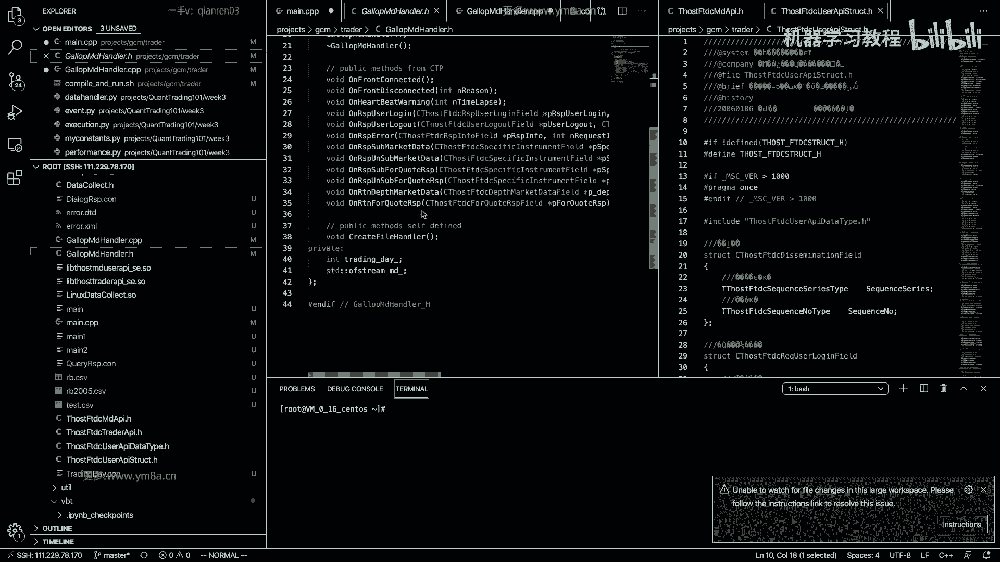

我看有同学说是拉给。sell alwaysway对，永远失败。

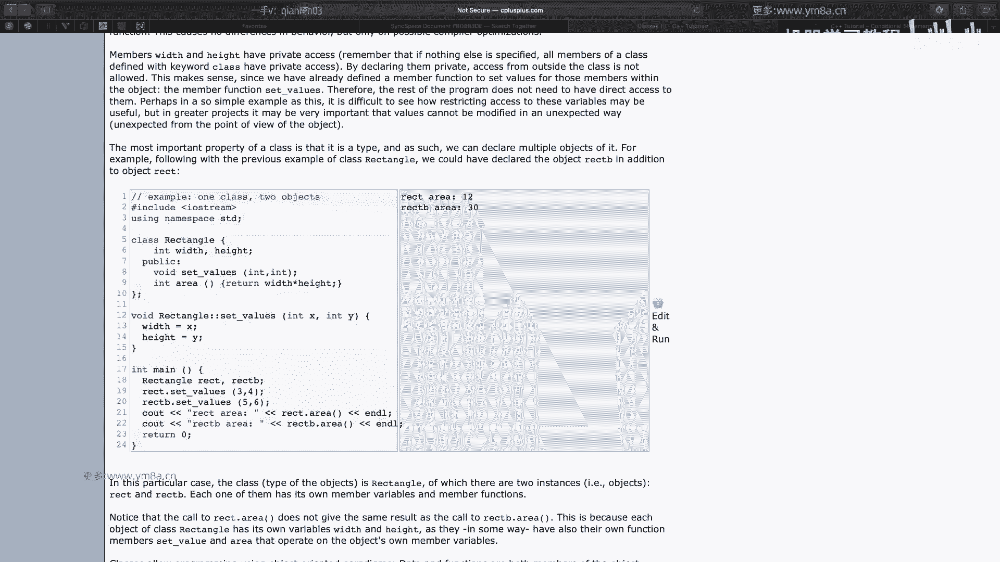

那个那个呃我我觉得就是不管怎么样，就是呃如果说作业的话，大家先就是你如果遇到什么问题，那不管就是把作业可以去交给助教老师，或者是我来看一下到底是什么样的问题。对。

然后我还是建议大家呃其实建议大家去开一个实盘账户吧。对。就是因为为什么为什么要开实盘账户？我用实盘账户券商交易所1，我到现在就遇到过两次吧，交易所出出了一点意外，上交所不推行情，正常情况下。

它都是会推行情的。所以所以用实盘就有一个好处，是首先你的你的数据都是及时的，你都是真实的。然后如果是出了错，一定是你错了，而不是交易所错了。在99。3个9的情况下。对。

所以我建议大家是无脑的去开一个期货的实盘账号，你不需要往里面投一分钱，你只要开个就是手机app上呃，找一个中信或者是国泰券或是what哪个券商的期货公司在上面点击一路注册，开个这样一个账号就OK了。

你不需要往里入任何的资金。但是你收到的行情是非常稳定的。

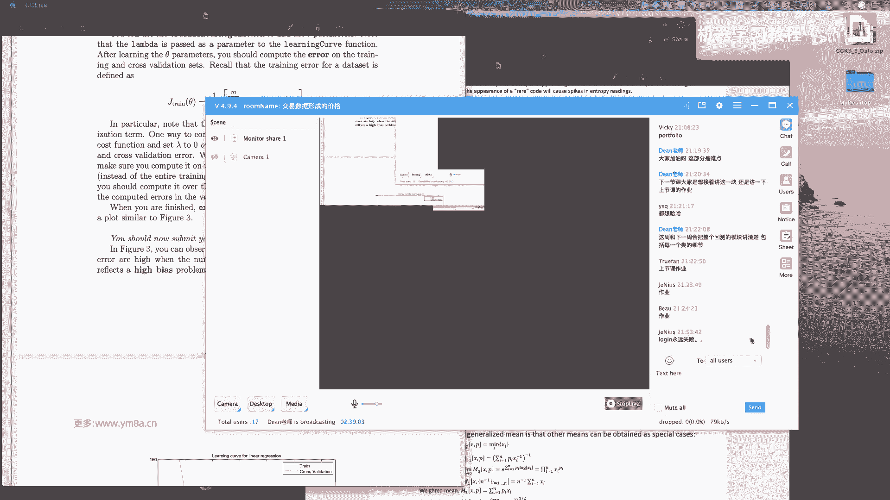

好的，那现在就这一部分作业的问题，我不知道有没有解决大家的疑惑。

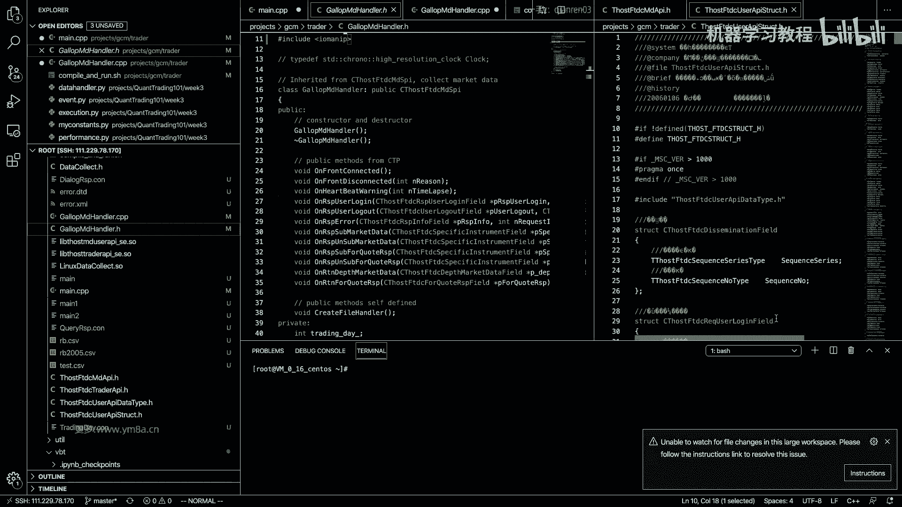

嗯，大家给我个反馈呀，不要让让我一个人在这讲，然后没有任何反馈。有些同学说是loing永远失败。对。那就要看一看，是说你在manCPP的时候，你你到底是loggging，你指的是哪一部。

哪一部分是哪一部分失败了。你要仔细看前面的步骤是不是都完成了。其实整个就是呃我我还是建议大家就是。要去看文档。对，然后课程课程我可能说简单的就是把整个流程看了一下。但是就是大家要想。

就是如果以后你做从事量化研究的工作的时候，那你看到比如说你要开发新的交易接口，你拿到的只是一堆API文档。你要根据API文档去把这个交易接口介入到你们的生产体系当中。对，然后。

那同样的说你在做策略的时候，公司可能内部开发好了是一个回测的非常复杂的回测品平台。有各种各样的功能。那那对方可能也不会说是说把那个呃由于可能说是隔离的问题，对方可能就是内部的隔离。

可能也只会把API跟文档暴露给你。你只知道这个接口怎么去调用。那这个每一部分做什么事情，但内部是怎么实现，你不需要知道，其实你也不需要去关心。

那做策略人员可能就是说我对的是这样的API那我要把我的策略去接上去，这样的能力我觉得其实是是说是非常基础跟必备的。然后在这里面可能就是嗯。

可能如果是嗯大家呃就是写过代码比较多的同学相对来说可能会熟悉一点。因为我觉得这里面还不涉及到任何研究的问题，更多的还是工程的问题。对，然后之后策略就是其实作为策略研发人员。

更多的时间是花在策略研究上面的对。所以我不知道这一部分呃，大家打个分吧，就是觉得自己呃这部分理解的怎么样，0到10分的scale。对，然然后我觉得你其实按照这个我把之后把能跑的代码发给大家吧。

就是然后大家可以看一看，然后再对比一下自己的程序，或者说呃我等到周三再发，我等我等到周三再把这个程序发给大家，大家可以自己再看一看，就是反正都有截屏了。然后你你们自己可以看对照一下。对。😊。

还有一分钟同学是完全会的还是完全不会？😊，对，soso我灵魂同学，我知道你你你是把作业给交上去的对我觉得你写的挺好，就是对事实上就我觉得嗯。就主要是可能不会C加加了。

那就是说如果最后实在不会C加加暂时没有太多精力的话，可以先把这部分放一放。我们还是回到就是因为我们只要有了就是原始数，我说过了，原始的市场数据我会去提供。然后呃对我们python的部分还是要去掌握。对。

家怎么说呢？我觉得呃作为策略研究人员，你可能不需要特别精深这些人，你不需要知道lininux系统里面到底是怎么调调度的。你你的这个数据可不可以就是说你你跳过内存，直接在内核里面去处理。嗯。

对我觉得我们不需要怎么那个不需要了解那么多。但当你知道越多，你能做的事情肯定是越多了。对，那因为可能我们现在简单的回测，就用分钟数据，你也不会遇到什么性能的问题。那如果之后就是都是都是tick的数据。

那一个交易所，比如说有完整的order book一天下来几百个G的数据，用thon，我相信抛下来是非常困难的。

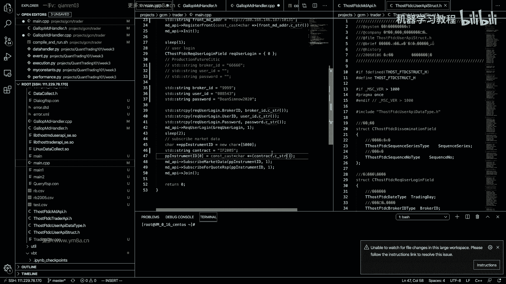

然后我在这边我还下载了一个同学的作业。作为同学的作业。对，也其实就是完整的按照就是这个流程就OK了。然后他自己是写了一个呃，就是写了1个CSB的class，然后来处理。对。

其实其实就是API version。没没有任何区别，可以说对。我把他的usname跟 passwordss给去掉了。Request。老in，然后sleep一下。然后subscribe data。joy。

对，其实其实是挺简单的一个事情。然后我再给大家那个呗。然后如果实在不行的话，还有一个方式是就是那反正也是要去上火去学的。因为呃。

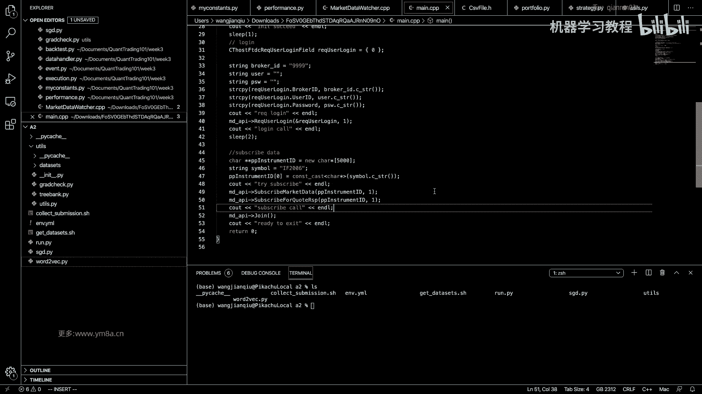

就是这个应该我之前给大家介绍过吧，VM派是比较成熟的一个pyython的版本的融融合了各种各样的。

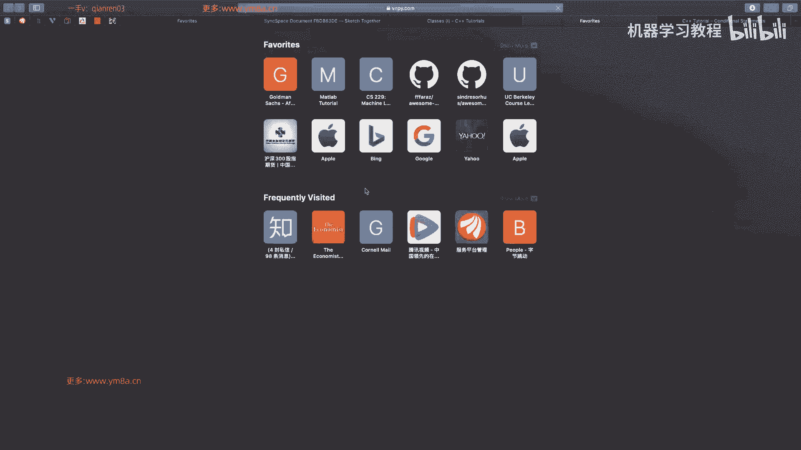

呃，API对，然后然后我们去看他的那个源码呗，就是。

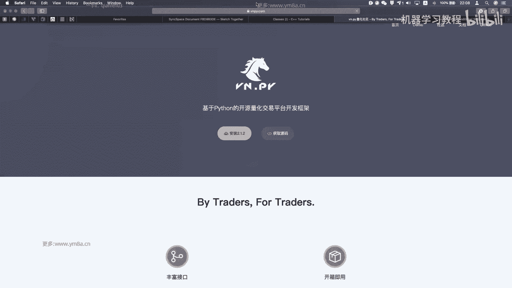

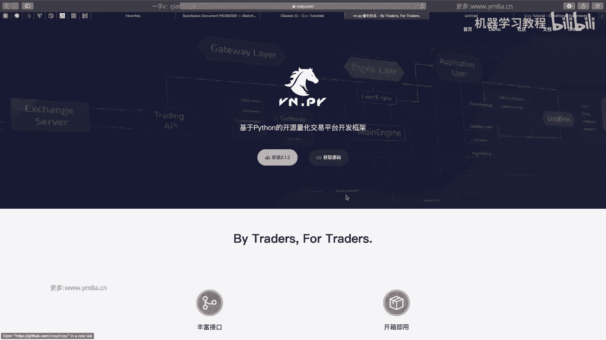

他其实也已经就接了我们的CDP。对，然后它是一个pyython的版本。

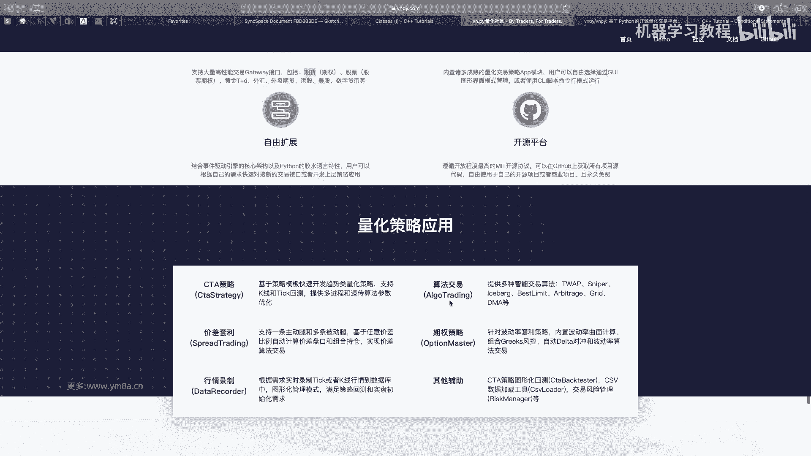

就其实大家想要去自己是去试一试，也是OK的。然后我们看一看他这个python的接口里面，就是到底也在去在在做什么样的事情。就我们刚刚我们做的是CTB对吧？

你看它也会inlude我们的CTP的那两个这几个文件，对吧？这是一样的，他这不他他在这边做了一个封装，然后我们的库文件DLlinux底下的跟windows底下的，它都已经加进去了。

然后他这边是做了一个封装。它生成了1个PUID文件。这PID文件，你可以理解为是拍上一下类似于SO跟DL文件的一个东西。如果我说的不对的话，嗯反麻烦正专业的同学要给我指出来哦。对。

然后你再去看它的接口去去怎么调啊。嗯，让我想想他应该是在哪里。对。诶。这是一个base的gatetway，没有。😔，嗯。嗯，直接来看就是一个期货的交易，到底要怎么怎么去连吧。CA strategy。嗯。

就其实。呃。这个。我把这个不是特别相关，我找一下啊。我以前是就是我们公司是有基于他的版本，然后自己加了很多的封装。对，因为它刚开始它性能会有一些问题。

所以我们拿它的就是因为它它比较好的是它是作为一个开源的一个一个版本。对。所以你可以跟着他的东西去进行很多的修改。对，我们看下他这个MD是怎么做的哈。嗯，你看。哦，可能VP连的不太对，有点慢。嗯。ok。

大也没看到本身上也其实做了一个类似的事情。是不是一样的味道？对吧。只不过他这边是由于他接了其他的系统的后台，就是他自己要做了一些东西。然后他内部所有东西他是封装成一个个事件。

然后把把那个东西都放到里面去。然后我们看看他的。On response。呃 depth market data。你看他做什么事情。

你看它这边现在有一个taskk叫on return depth market data。当我收到返回的市场深度信息的时候，他做了一个什么事情嘞，把他它生成了这样一个tsask data的类。

这个应该是okK这个不是他对。这个然后他把他把这个东西复制给他。然后他有一个任务队列去处理这样的一个事情。对，其实就是一样的。就是你想要用拍场封装的话，也是完全OK的。他应该用的是PY bind对。

相对来说，你只要把接口一个实现好都OK了。然后在这边他写了一个是怎么去处理这个tsask，对吧？processcess task。嗯。

你如果收到了on return market depth market data，你需要去process，就类似于我们的strrategy。那个刚刚的我们讲的回村引擎的时候，我对应一个是什么事件。

我就去处理这样的事件，对吧？它处理这样一个task就OK了。然后你可以看看他是怎么来处理的。对我很久没有看他的代码了，但是画像逻辑还是OK看他做了这样一个什么事情。

process return market data task。他把这样的一个task data，然后确定 day其实也是类似，他都把它保存下来了，对吧？然后他注是他delete这样一个东西，然后。对。

其实都是类似的。就是呃我觉得可能大家刚开始的困难就是说不太熟悉这个API。但事实上就是说之前我做测略的时候也没有管过这些东西，我是差不多19年呃，8月份才开始去看这个东西。对。

但可能之前我用python结口熟悉了一些。在他转过来看C加加可能会好一些。对，呃，没有问题啊。如果就是因为呃我我我觉得就是有两种解决方案。如果想要真的对这个东西比较感兴趣。

想要就是用原生的API不受制于人的话，那是完全可以就是自己去写的对，自己就去把自己的数据处理。然后行情跟你的交易风控所有一套全部可以自己写出来。然后然如果说不想去写的话，想直接去交易。

那我的建议是你从VM派或者是空夫直接开始用CI跟就VM派的话，直接就是一个封好到开箱即用下载下来之后，你就可以去把你的账号登进去，你就可以去直接去写出来去交易了，这是非常快的一件事情。对。

所以呃就是两种选择吧。对。

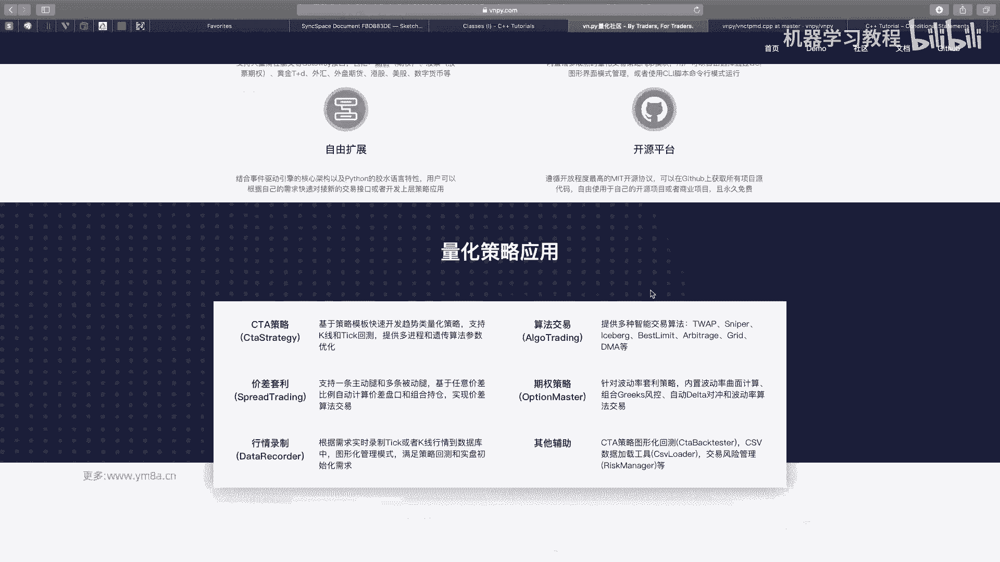

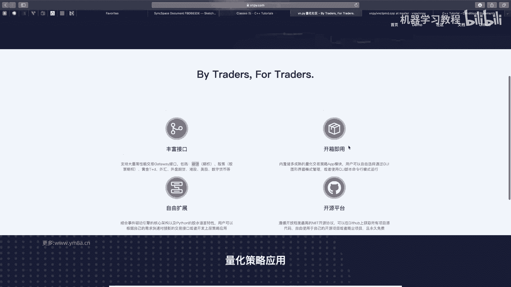

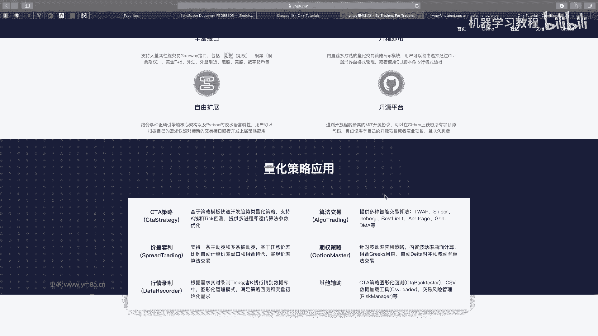

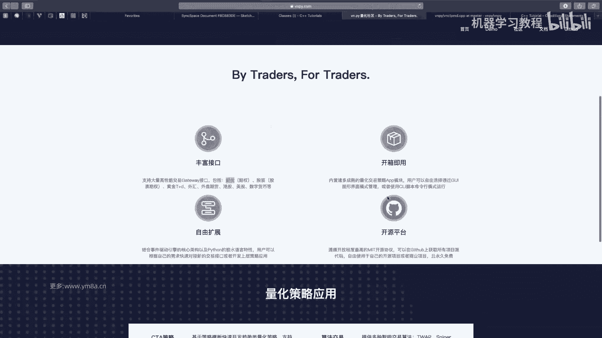

那我觉得就是说因为这是一门课程，不是说呃不能保证大家说一定去交易挣钱。但是我更多的想去让大家去看一下，就是去了解一下整个的行业里面在做什么样的事情。就是第一年的工作，你大概会去接触到什么样的东西。

可能对，然后这个事情是不是大家想要的？好的。

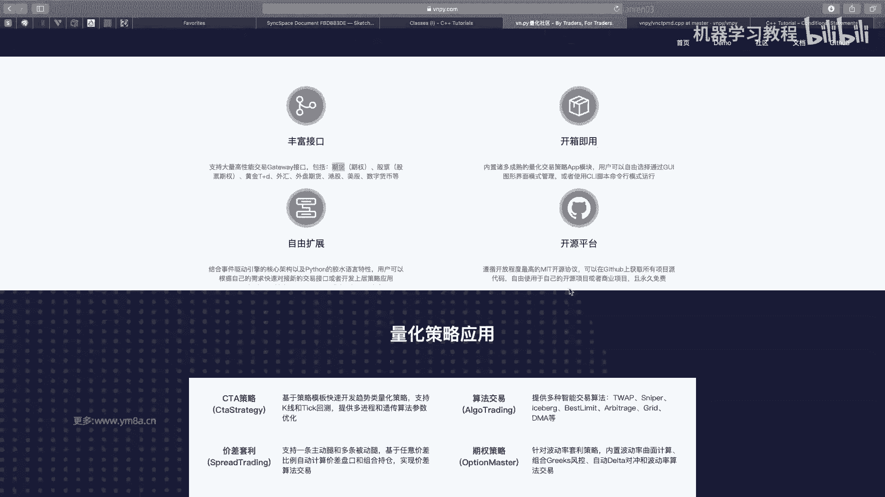

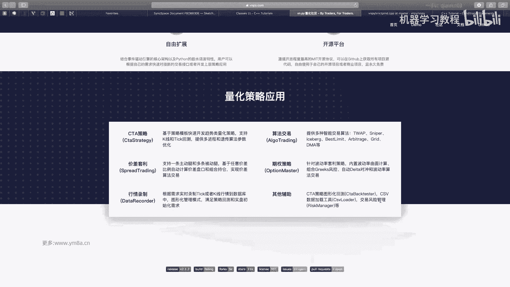

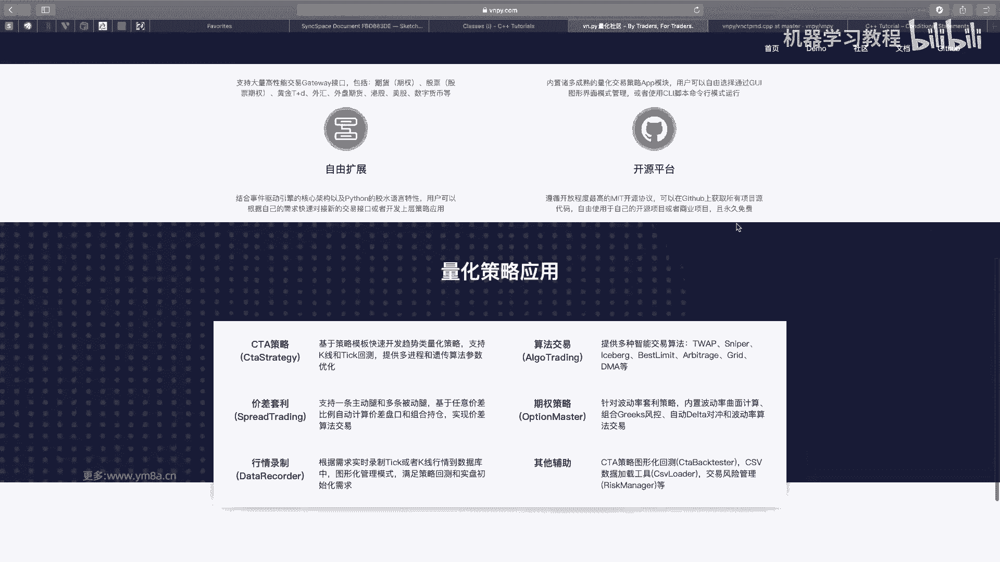

那其实对。作业的部分就到这儿了。然后这个我还是建议不管大家有没有兴趣，就是不管大家想不要用拍on做的，我建议大家下载下来去玩一玩，我觉得还是挺有意思的对，就这相对来说它是一个比较成熟的一个。

工具吧也包括呃我知道也有群里应该是有小伙伴是在做数字货币的，也可以考虑一下，就是拿他去做数字货币的量化交易也是OK的对。

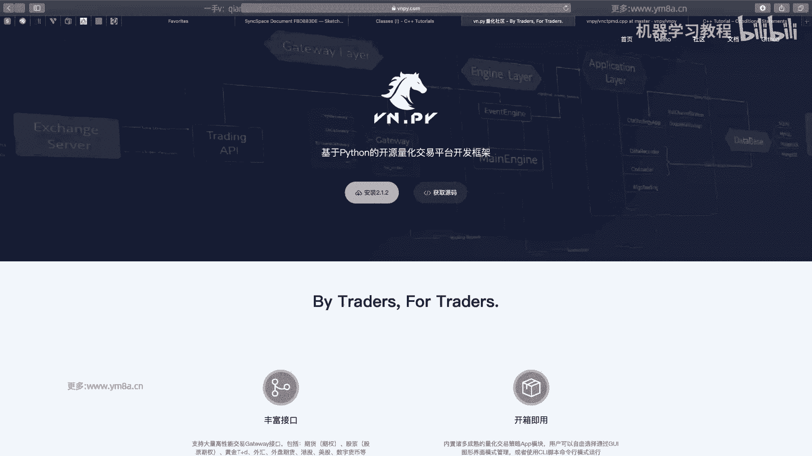

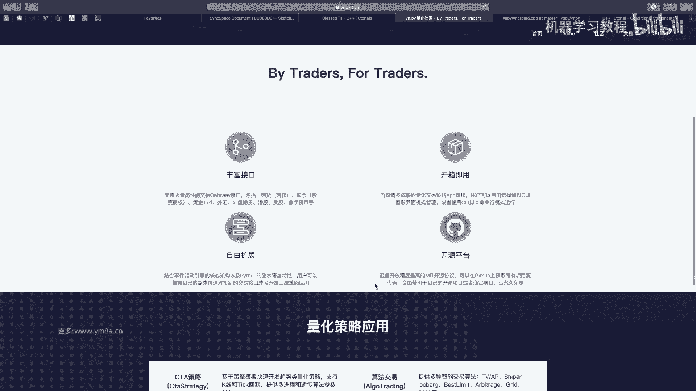

相对来说就是省了你很多功夫。你如果就是说比较熟悉的话，一个策略稍微一致一致，就可以很快的在平台上跑起来。

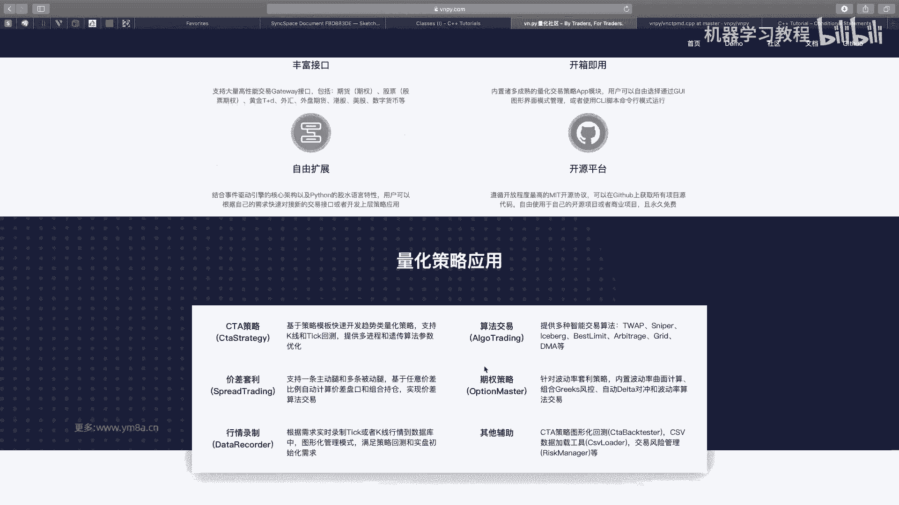

然后包括之后做期权，你也可以去参考它里面的option master模块到底是怎么来做的。因我觉得嗯因为这个程序对它创始人之前是做期权出身的，所以这块刚开始还是挺有意思的。

因为可能期权在嗯呃那就是15年2月份才国内第1个ETF期权上市。所以他应该是最早在国内做期权的人。对，所以这个里面还是给提供了很多的给可能给当时很多人提供了帮助。

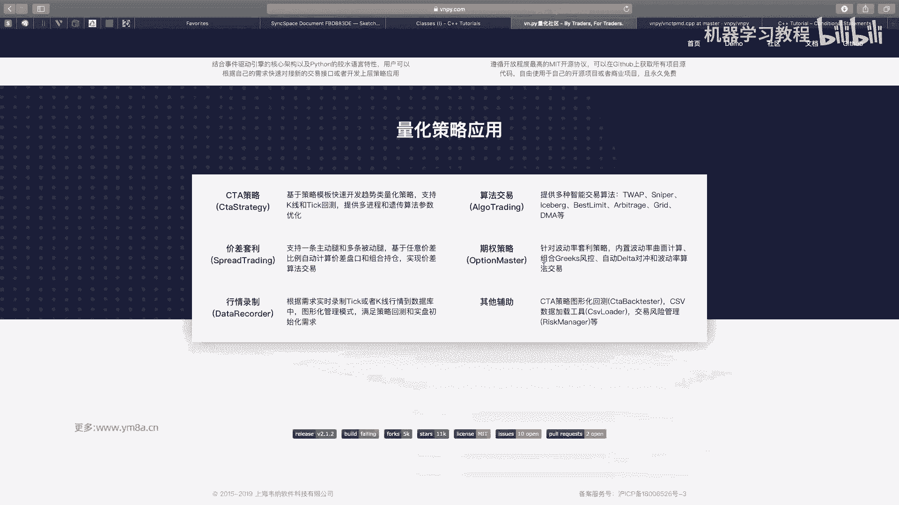

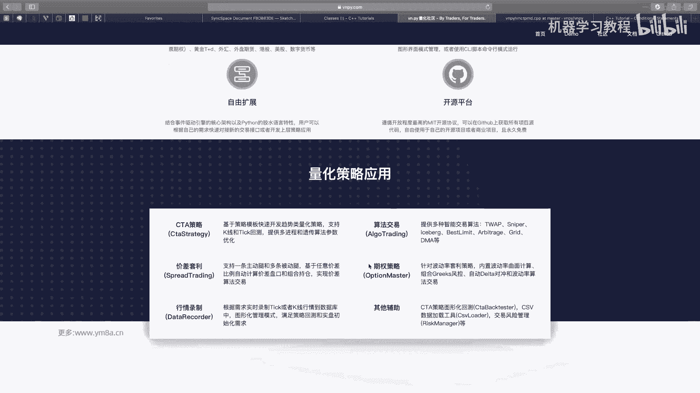

好的，那同学们还有什么问题吗？

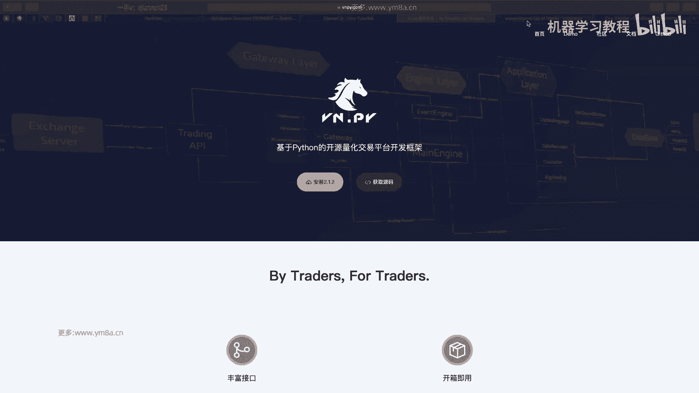

对，就是现在现加加比较好，就是快速入门。我觉得是把整个ttuial你其实先过一遍。对。把里面代码自己动手我写一下。

然后上次提到的那个C plus plus for financial engineering那个课程呃，是我觉得是如果是要申请MFE没有去学过C加加的同学，我觉得还是花点钱和时间去投入一下吧。

那个还是非常有用的一个课程。对。呃，然后对。其他的话到现在应该今天还有最前前最主要的东西，嗯，还有下包括下一次吧，我们要把就是b casting这个模块要讲完。

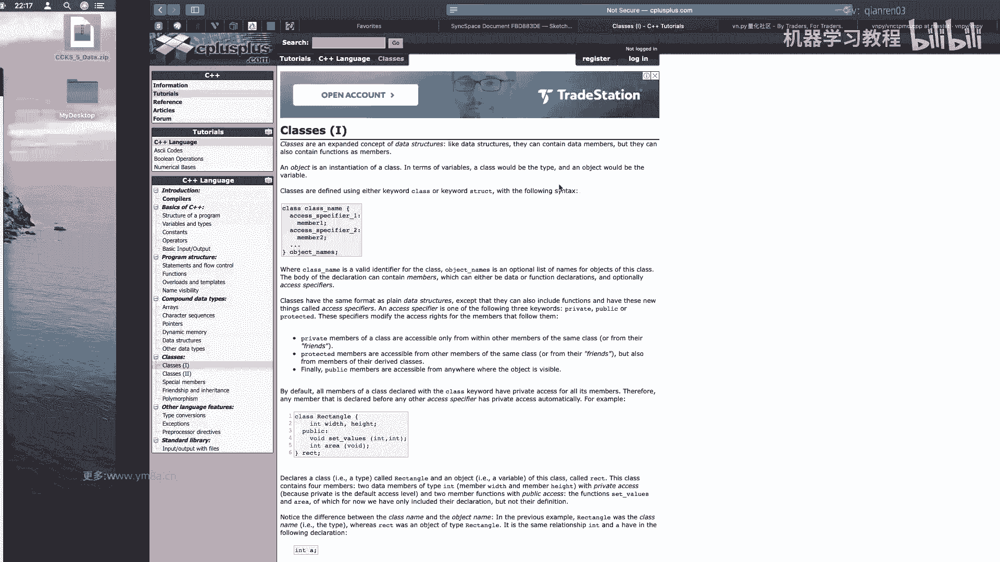

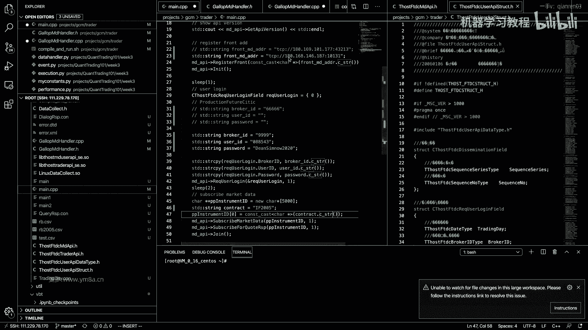

所以任务还是有点艰巨的。

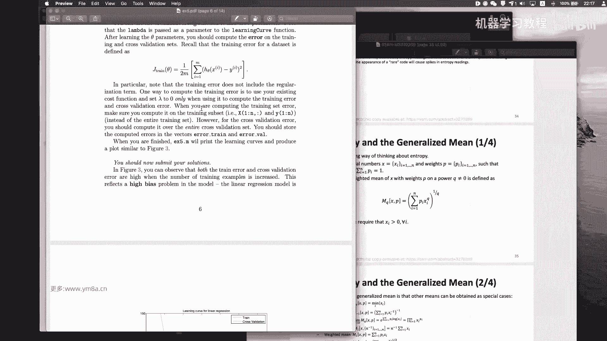

嗯。对，因为任务还是比较艰巨的。因为就这周发给大家的文件，建议就是是一个相对来说就是已已经帮大家填了很多东西了。本来想来说是嗯就是课上讲了idea之后，大家去自己把这些坑填起来。

他们估计可能那就会把大家给打趴下了吧，到时候。对，就是对，那这这个事情我觉得是就是五一五一节，包括到五一节，应该希望大家能够把整个的就是模块都抛起来。那到这个时候就是说即使你不再上后续的课程。

你想要自己去研究策略，我觉得有自己的平台去研究策略，我觉得会好很多，会不受制于人。就是简单来说，你想要研究什么样类型策略，只要有数据都OK，你都可以有能力把它接进去。对。就目前是这个样子的。嗯。

周末肯定不营业了。呃，你说注册账户吧，其实这这个这个注册账注有的同学问注册账户的问题是呃，交易日的时候中间花个10分钟，中午吃饭时间10分钟左右吧，手机上直接就可以开户了，不用去营业厅。

现在都是可以直接在线开户，带好身份证，带好银行卡就可以了。对。然后然后对弄完之后再去找找找你的客户经理去做一个呃备案。对，程序化的交易的平台的备案，你可以直接拿BM派来做，然后也可以自己去来做。

应该不会特别麻好干嘛。对，就是呃他要去呃备案的目的是要保证你会用CD就是会用CTP的交易。我我个人建议是呃为了简单就是备案的话，你可以就是我觉得正好还是用BM用VM派嘛，大家自己把它下下来装一下。

然后按照它里面的流程，按照券商的要求去做一下，就是程序化的备案。程序化备案，这个是什么意思呢？就是呃现在会要求。

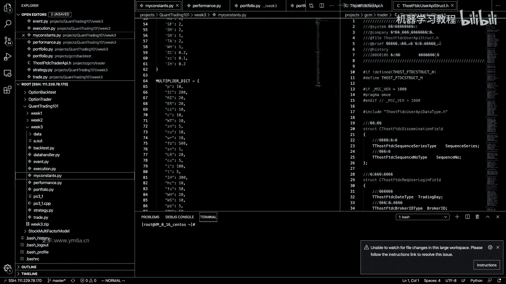

嗯呃每一台机器上有一个就会给你专门一个授权的账号。然后你这样来说，就知道到底是谁来做程序化事情。因为程序化相对来说还是会有一定的风险。对，因为嗯钱嗯就涉及到钱的事情嘛，尤其还是自动化交易，嗯。

在构跟头的人也不是也不是少数。所以就是说如果大家开了户，反正接行情这一块是可以你可以不用往里面打一分钱，所以不会涉及到呃钱的问题。对，只要是你开了户，有一个API对，这样我觉得来说可能会方便大家做测试。

好的，那今天到现在我觉得想要讲的内容就差不多了，也挺晚的。然后大家还有什么问题吗？那个面试呃，那上次的两两两道题还需要讲吗？嗯，或者我把那个题插过来吧，我写了一个solution。

就是第二个那个covariance matrix，那个是纯粹都是呃让大家的去复习的。就我有觉得就是嗯。就是那那那个复习一下性应代数我就不讲了，这个那个真的是那我觉得没有什么好讲的。

然后上另外一个的东西呢是。嗯，我把这个截个屏稍等一下哈。啊，或者这样买，就不耽误大家时间。然后那个题我把那个答案到时候传给大家，跟作为一起传给大家就OK了。哦，对，然后如果看不懂的话，再来找。

因为上上两道题是典型的偏数学偏数学一点的，我觉得。如如果没有学过相关的概念，那那还是去学一下吧。就是如果就是想要去找量化教易工作的同学。对。然后我还是再次强调一下。

就是如果是把当前的这个课程作为求职课程，那其实是我觉得是远远不够的。这这门课程能够帮助你了解对在对冲基金我们要做什么事情。但是呃对冲基金前面的包括嗯数学编程呃，金融的知识是需要大家自己去学习跟补充的。

然后嗯我我个人理解是就是为什么我们要去学那么多的数学方法，可能就是做况的不需要你对某一个方面了解的很深，但是需要你对数学里面说，不管你是概率还是统计，你还是机器学习还是随机过程。

你我们都需要去了解到一定的深度，这个一定的深度大概是相当于我觉得是大学本科的水平吧，还有包括优化，然后嗯。对，然后包括计算机不要求说你我们掌握呃计算机核心课程，什么操作系统，然后网络。

但是最基本的呃你首先要会两门编程语言，一个是做生产，一个是做胶水。然后包括呃然后还要会的是数据结构跟算法。这这数据结构跟算法两门课程。我还是强烈建议大家是自己去弥补技术。

就是衡量的衡量的最基本就是这个网站。

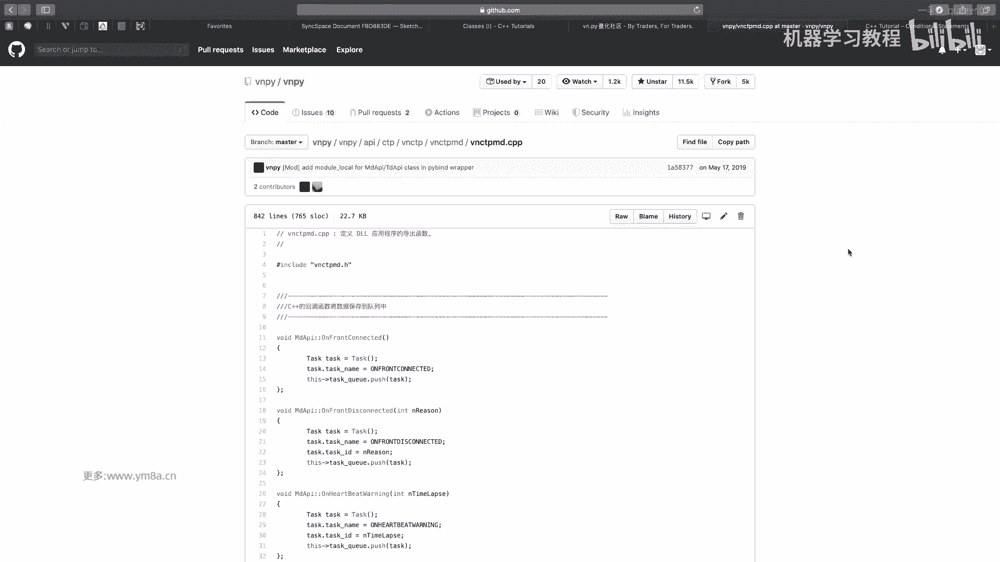

嗯。lateate code对。然后然后这个上面的easy跟med的题目，对于所有的框的同学，我觉得是最基础的是都要去掌握的。就是上面的所有的easy跟med的级别。对。

然后不管是互联网还是说数量化基金，那这种我觉得是非常正常的一个情况。对，然后我我个人的建议是上面的题目建议大家用C加加来完成。对，正好你复习C加加的数据结构。然后嗯对。

然后数数学层面我觉得是就是要花时间的。这个短期是比不上来。但是嗯当然你可能说现在现在就是如果是做买方，可能对于随机过程并不是那么要求的话，我建议大家还是会去嗯。去把机器学习好好去学一下。

毕竟现在大家都要用这个东西。那对于机器学习呢，其实也不要说是说我跑段少模型。那我经常面试问别人的第一道题是来，我们首推一下线性回归。对这个线性回归到底是怎么来做的对。

对对那这这个这个问题可能就把很多人都卡掉了。那事实上我看到供底好的候选人是非常清楚的告诉信性回归怎么来的，包括矩证求道师怎么做的。我觉得这个还是必须的，这就是说是一个基础。因为我觉得。

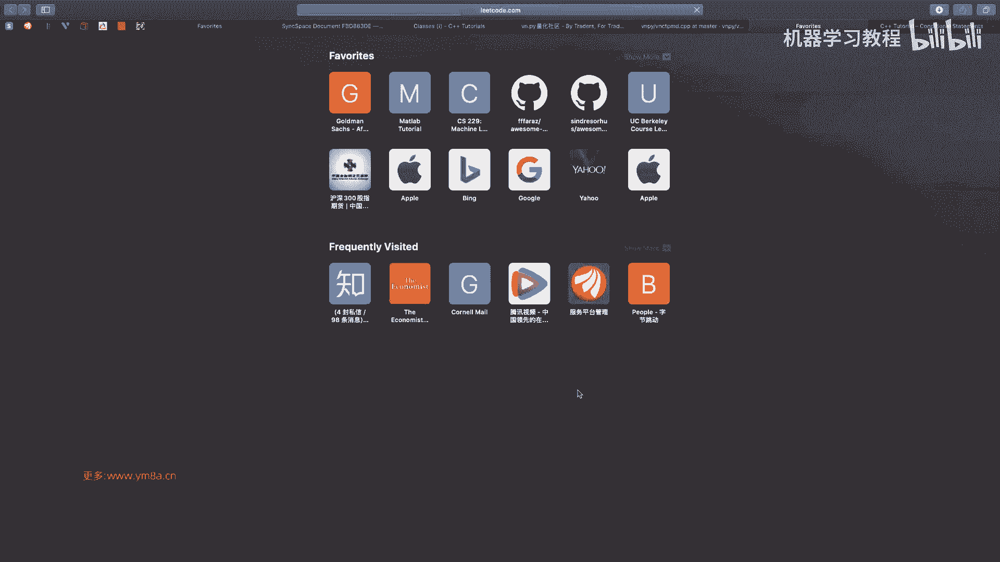

基础工具掌握的越多，事实上是有可能帮你在不同的方向去探索新的策略的对然后对啊，那数学的工具我觉得就是说嗯。对，不管是跟CS229的课程啊，然后那当然可能说不仅仅说是你上完课听了有就有用的。

因为数学这个东西是实要花时间，你推公式是真的的理解他在做什么事情，包括积极学习各个算法是在做什么事情。

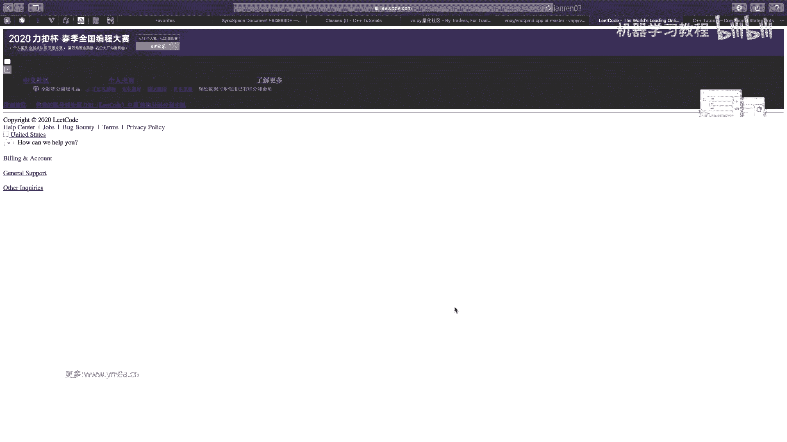

所以诶。那行，今天的课程我们就先到这样子吧。然后之后课之后把那个上节课的那个概率的题目给传抄给大家。嗯，然后这节课还没有布置什么。那个其实以后编程题我就不会再去特意布置了。这次还是留了一道留了一道。对。

就有兴趣的同学啊，就是这是这这这个是偏向一点。

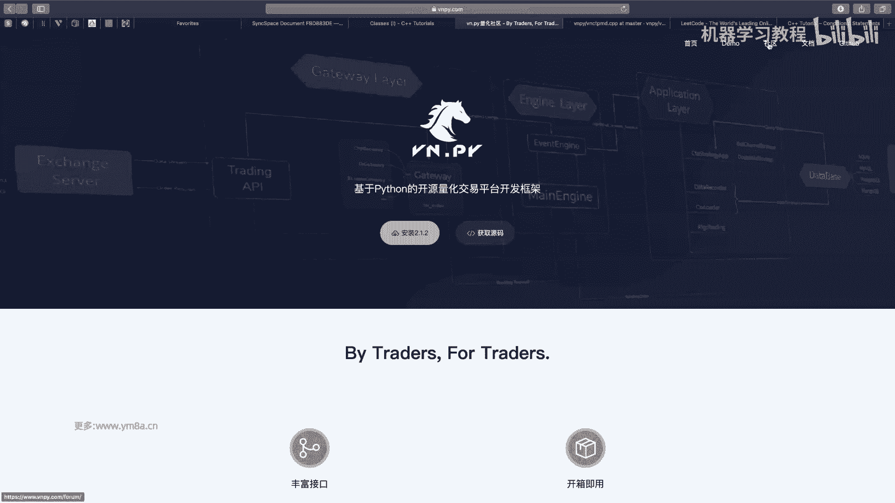

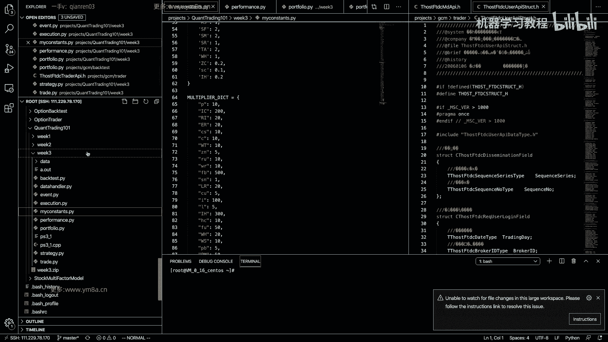

那个呃是C加加跟数学的结合吧，就是说用一个呃这个这个题目是这样，就是我们有给的前1万个数里面的9999个数。然后接下来让你去用一个方法写一个函数去快速找到我到底丢了哪个数，哪个数没有了。对。

你可以用排总也可以用C加加C加加的接口就反正写在这儿。然后这个要注意就是嗯对肯定有多好几种方法嘛。那那就找作为框me里面就是量化基金的面试题，那肯定是要就是考验候选人的就是思维能力的那。嗯。

那就是要去大家就自己去想一想这个问题怎么来做啊，这是一个真实的面试题。然后对对这道题大家可以想一想，之后也会发给大家。嗯，拍上写起来也行啊，就是也也可以吧。对，主要是想一下啊，就我觉得还是挺有意思的。

因为我第一次想也没有想到什么，就是就就是很传统的方案就就就做了。然后后来发现确实标准的solution会更好一些。对的。嗯，那行呃，感谢是下这15位同学陪我一直坚持到现在。那今天我们的课程就先结束了哈。

😊，谢谢大家。那我再多说一句二分法嗯，可以啊，可以都可以试一下。对，二分法，然后再家想想复杂度是多少。对。对，就这一个是二分法嘛，然后你也可以说直接调st，对吧？我排序，我就有Nlog的一个复杂度。对。

那对二分法是对呃，而且我还不知道二分法怎么做。这个同学下次想办可以想一想。对。然后我也可以就顺序的做嘛，就。我就从1到1万对吧？一次次去做。看一下到底少了哪个数都OK。对。好，谢谢大家，大家辛苦了啊。

周末然后休息休息，然后明天有空的话，可以看一看这节课的东西。然后这个这code其实已经发给大家，大家可以去对照理解一下每一个里面到底要在做什么样的事情。对。😊，好的，拜拜，谢谢大家。😊。

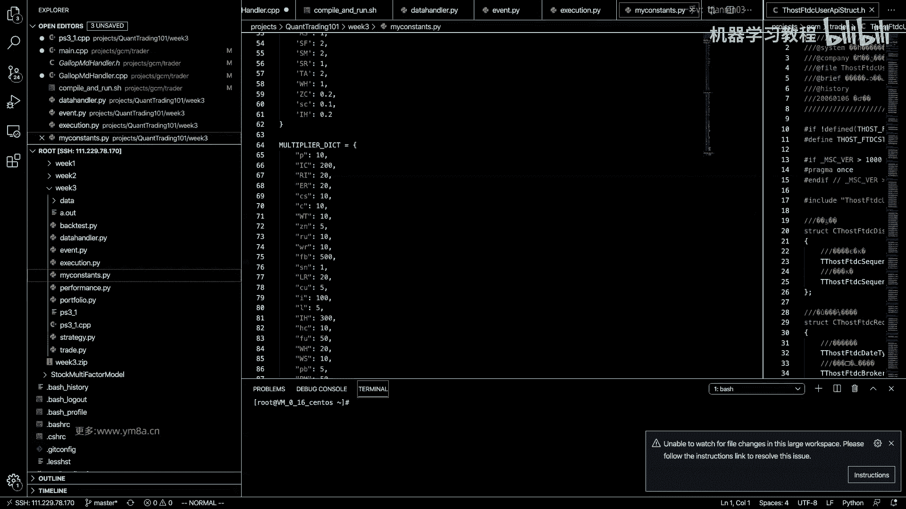