# 2025最新AI量化交易实战教程，三小时入门到进阶！清华计算机博士讲解，零基础也学会了（AI人工智能丨数据分析丨数据挖掘丨机器学习实战丨深度学习丨编程） - P3：第四章： 系统化预测 - 机器学习教程 - BV1ujk4YKEw9

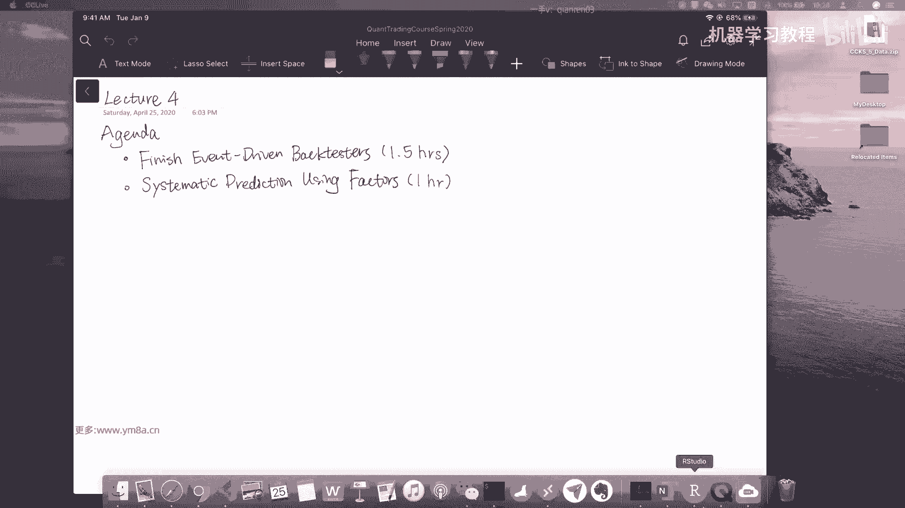

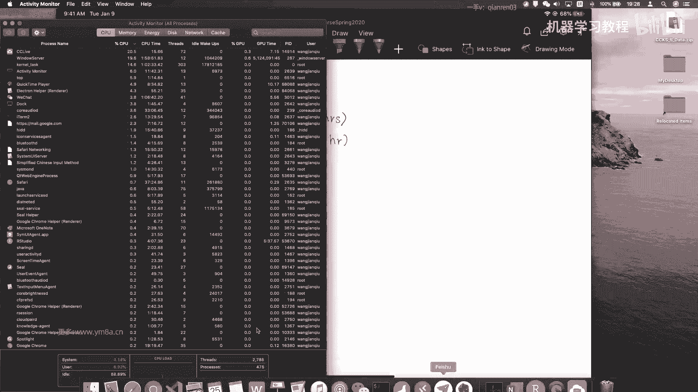

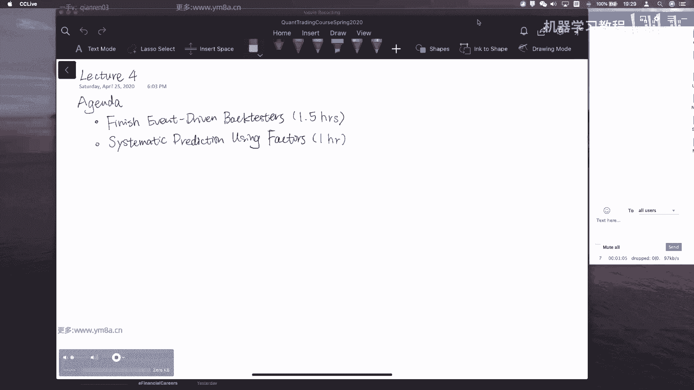

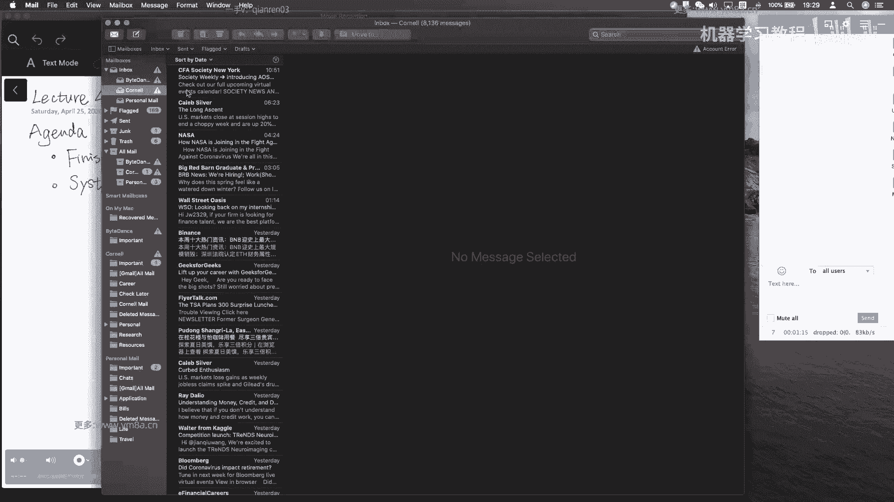

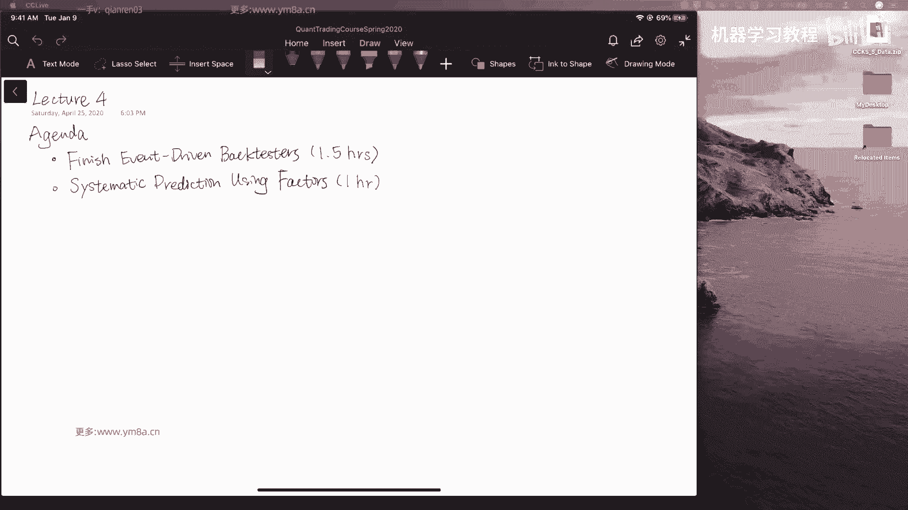

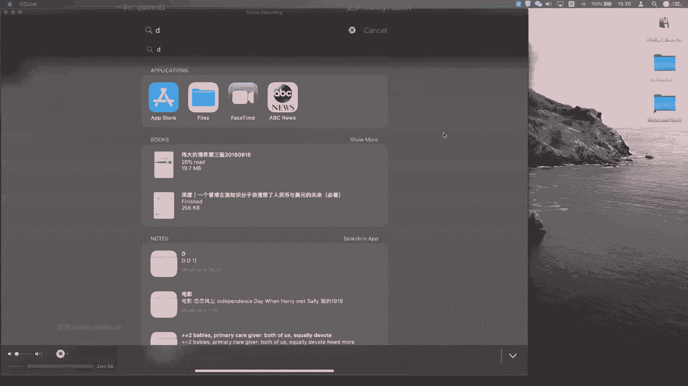

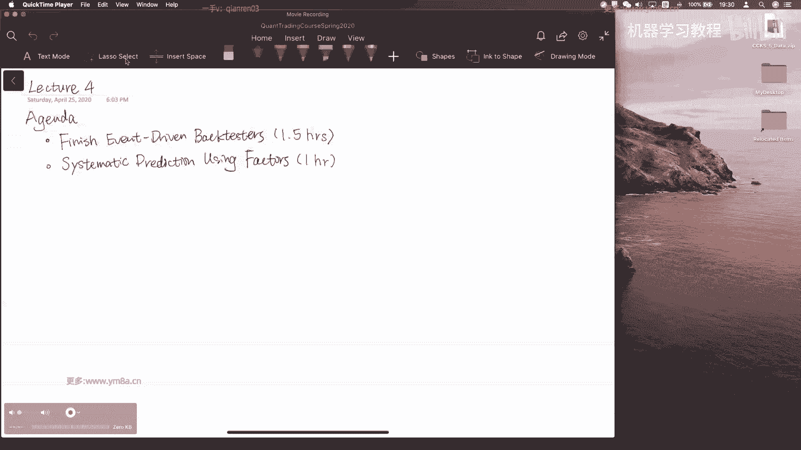

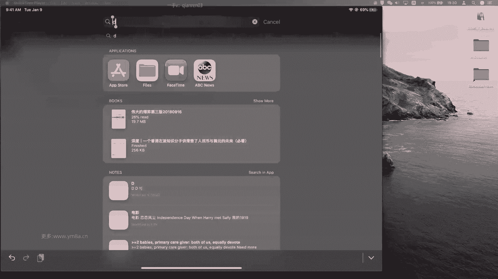

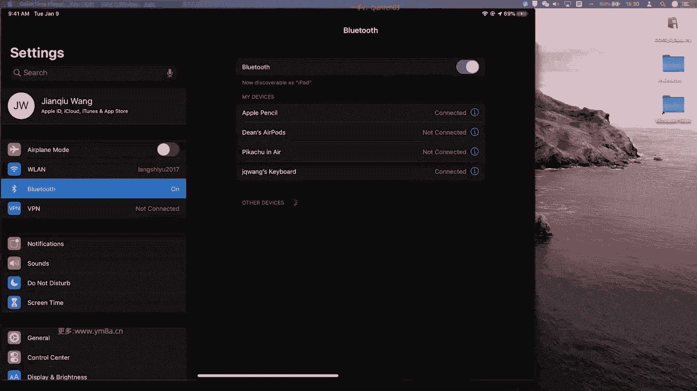

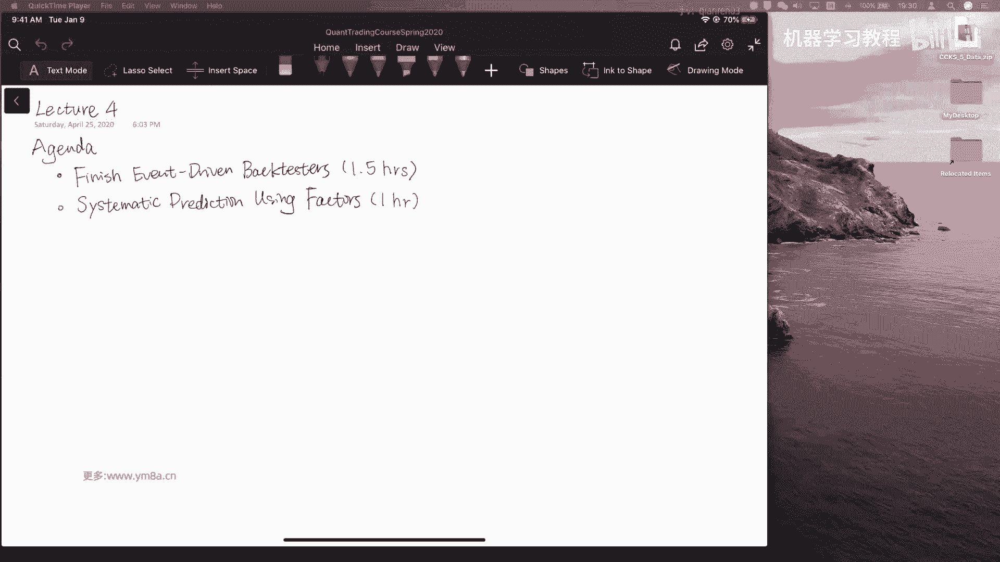

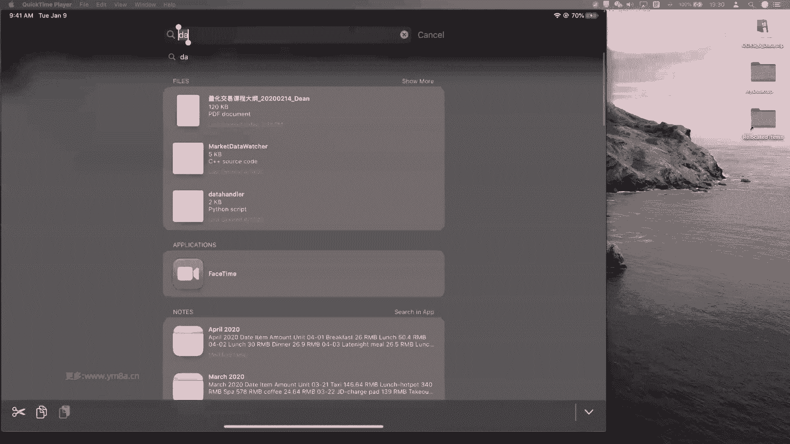

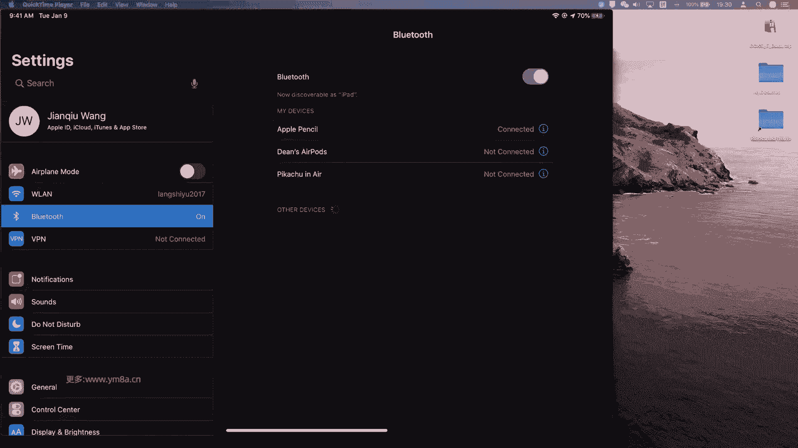

Hello，OK嗯嗯，大家晚上好，然后能听到的话，在聊天记录框里打个一，让我知道大家已经到了哈，嗯OK123，你看看今天晚上有多少朋友过来，呃那好的，然后你是谁。

好的那还是先刚开始我们先看一下上周的作业，然后看今天是嗯对先，我先找找两位同学的作业给大家看一下，啊这边是一个，OK好嗯，12点，等会这边是哪位同学的作业，Okay，A a，嗯稍等一下啊，就往这边走。

诶稍等一下，我这边键盘好像出了一点问题嗯，稍。

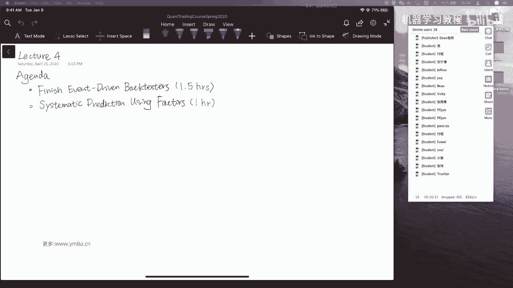

Sorry，好像就是键盘没有电了，对这烧电，Uh okay，Sorry，好的，然后稍等一下啊，我们来看一下这位上位同学呃，这位同学的作业，然后现在true拍摄大家应该用的都是比较熟了吧。

我把这边聊天框里记录放在这，然后大家有什么问题随时给我打啊，然后就是JUPYTER。

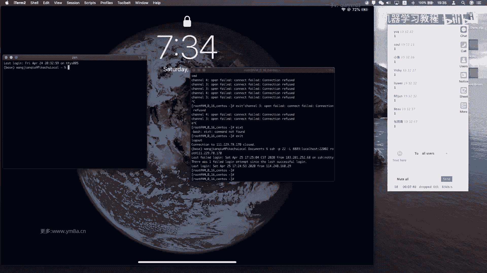

我默认大家应该是用的比较熟了啊，Okay，I'm home sh，我们先看一下jupyter notebook，看一下上位同学的一个作业，我选的是最迟就到目前为止，开课前最后一个同学教的哈，好的。

然后all right，应该是这个对，八个小时之前刚刚完成，然后上次作业就是呃其实是嗯，哎这位同学excel是不是没有交啊，嗯没关系，我看应该大部分同学这次交的作业，比CDP那一次要好很情况。

整体应该是好很多哈，然后主要是看看大家就是对于回测的这一块，有没有了解清楚，嗯嗯嗯嗯这个是这个这个同学这一块还没有做，没有问题，然后看看这一块呢，呃读数据。

然后是a position trade pnl对，其实主要就是呃想想上次的问题呃，一个就是大家问为什么要有trade trade，trade pn l和position p m l啊。

就是呃也可能因为我们在excel当中举的例子，都是说嗯按照分钟bar收盘的结尾去成交，那么在这节课的时候，我们会去看到一下，就是我们挂单的价格跟每个分钟bar指呃，收盘的价格是不一样的。

那这个时候就要去考虑一下，就是为什么就是trade pl跟position pl，到底反映的是什么东西，嗯等会我举一个简单的例子，大家应该就能更加理解这个事情了，对，就可能刚开始position pl。

大家会相对来说比较好理解，就是仓位的变动乘以收盘的价格对，对k position shift，然后以及有同学会去问到，就是为什么会shift两次的问题，嗯嗯shift两次啊。

因为我在微信群里已经有跟大家讲过，那这这边再给大家强调一下，就是就是如果说我们不是采用当前的分钟，B去成交，而是说我这一分钟挂单，用下一分钟开盘来成交，那可能就要去注意一下了。

因为呃如果我不shift的话，我这个时候就是用的是额当前分钟的收盘价格，但事实上我的仓位是到下一分钟才会去体现的，这个里面就会有一些问题，所以就是在量化交易当中有很多细节的问题。

就是大家可能要自己去呃去计算，就是才能去发现的，然后呃不知道大家有没有去试试一下，就是两种计算return的方式，这边写了一种，OK没问题对，还有一个是ta lib呃，可以的对。

这次正好也其实要给大家去介绍一下，就是ta lip这个东西到底是怎么去用，Um okay，OK我觉得上册作业应该看来，大家应该都是感觉是没有什么压力哈，嗯然后再看我再看一个作业哈。

或者或者哪位同学想要想要自己的作业，被大家点评一下的，对我觉得主动一点，这样可以比较好，就是已经上交了，然后告诉我你呃提交作业的昵称是什么，哎大家主动一点，我觉得就是挺好的。

就是因为呃能够让别人看到你的作业，然后然后如果说大家会有什么意见，都可以去评论，我觉得这样可能成长还会会快一些对，所以有没有哪位同学主动愿意，愿意愿你想要去那个看一下自己的作业的。

因为我也我记得就是bingo同学，应该是每次作业都是交的，所以对我都会有去关注他，对嗯，Assignment3，好像大家交作业不是很积极，OK我看一下杨树新同学的作业吧，OK嗯好的，刷新一下水。

这个先看一下啊，Sorry，应该直接打开，嗯好这个没有改啊，就是没有用啊，这这位同学有没有自己尝试一下，就是用新的数据去就除了ma5，可能说我想尝试一下其他的因子，OK然后是，嗯嗯OK，Two one。

Two four or clothes，嗯max label对这位同学，我觉得作业完整度，就肯定相对会比较会高一点对嗯，然后然后这次就是上次有跟大家提到，就是应该提到过好多次。

就除了说现在大家可能用CSV，先短暂的把这个数据给load进去，不知道有没有同学自己尝试，就是说呃建立一个数据库，无论是SQL还是NOSQL的数据库，不知道有没有同学这样去做啊。

然后嗯可能之前作业可能就是一两个CSV的file，然后从这节课就是回测框架搭起来之后，如果大家想要去测试多个品种的话，我我的建议还是，大家就是呃把数据都给加载到数据库里。

然后去学习一下如何如何用Python，去去操作笔记本数据库，然后我个人建议是嗯，不管是C口还是NOC口都可以啊，然后我我自己可能习惯使用MONGO，就是MONGODB数据库会多一点，然后对。

其实我我的建议是还是大家把自己的数据，就是全部到目前为止整理好数据，把它录到数据库里去，然后之后有新的数据可以及时去更新上去，也是方便自己的去做研究嗯，OK然后如呃，大家对于上次的作业还有什么问题吗。

因为我感觉这次作业应该不是特别难，就看下目前上交的不到十份作业里面抽到两份，我觉得基本还是还OK对，嗯好OK如果没有什么问题的话，然后我们就开始今天的就是我们的课程，然后还是嗯。

对然后我们还是先把上一节课的一个内容，就是我我觉得是重点，可能要去帮大家再去回顾一下这个事情，然然后首先请哪位同呃，哪位同学告诉我，就是我们在整个就是这样一个事件驱动的，那回测的系统当中去有哪。

首先是由哪几个类，然后我们有哪几个重要的事件，然后他们分别的顺序是什么，大家还记得有这样的一个事情吗，嗯那首先就是刚开始了，就是嗯回到最刚开始吧，就是说我们看到的东西，到底是是一个什么样的东西。

我们我们怎么去进入这样一个回车引线，就是说我们最刚开始做的事情要去是什么，对我们有了这样的很多的对，所以我们首先还是要回忆一下啊，就是刚开始我们记得说，我们始终是做的是一个呃while loop。

对我们是做的是一个wire looe，然后这这个while loop它是无限进行下去，那到什么时候停止呢，直到我们的数据引擎没有数据，去把所有的数据都跑完的时候，所以其实我们在刚开始做的时候。

就是说要有一个market data塔的engine，our market data和engine，这个你要去初始化，然后我们怎么判断，就是说呃这个东西有没有有没有停止呢。

其实我们要做的事情是给market engine，market data engine加，我们要去加，给它加一个变量，然后我们用dot来去访问，就是说这个东西它是一个binary variable。

如果说我还要去继续回测的话，那我就去做接下来的事情，如果说我不去我所我不去回测的话，那我要去我要去退出我的while loop，就我在这个时候我需要去break，对对这个要注意啊，那那那刚开始的时候。

其实我们最先要考刚开始考试的逻考，考虑的逻辑，就是说如果要继续回测，我数据引擎要去做什么样的事情，我们要去发布我们的市场数据，对然后接下来做什么事情，我们待会来看，然后如果说我们所有的东西都解除的话。

其实啊就是所有数据都跑完了，我们也要去做一些事情，Ok，然后呃这个就是说在我们啊跑到else，这一部分的时候，我们所有的东西数据都已经跑完了，但是其实我们还是要去做一些事情的，对嗯那这个之后我们再去讲。

然后嗯记住我们是两层的while loop，然后接下来接下来就是我们上课着重上一节课，着重花的时间强调一下，强调了一下，就是说第二重while true，里面我们要去做的几个事件。

而不知道是不是大家现在还记得多少呃，每个人现在就呃，现在那个大家在群里给我讲一下吧，有哪哪哪四个事件，就大家至少把这四个事件给凑齐了，快点我在等大家，Come on，Come on，呀signal可以。

Market data order，还有一个呢，Come on come on，Come on，就大家赶快把自己的回忆给给给给召唤起来，OK嗯portfolio是什么啊，CP俊同学告诉我。

PFOO是什么，它是一个事件不还是什么，对，Portfolio，What is a portfolio，OK啊那我们呃我们就由我们哦，我们还是快速的来go over一下，就是几个东西，对什么。

这这个我就嗯，就我还记得我们上次画了两个table吗，就是，啊第一个是market data对吧，Market data engine，我data和engine它对应的事情是呃，MD就是或者说叫bar。

这我们在后面通用，我个人倾向是用bar，然后是portfolio，它产生的是什么，对PROFOO它产生的是这好像有点跳哈，嗯OK那那那谁谁告诉我谁来产生signal，对我们先拆开来填。

我们能知道的是什么，对feel，呃哪哪哪哪个来产生signal，Come on，哪哪个来产生signal，就是大家都想做的strategy，就是我们要去从策略里面产生signal，Pfoo。

是成产生什么是order，然后是exchange，他会去产生一个feel，然后这节课我们就来把每一个类里面，要做的事情，我们要实现哪些功能，一个个给大家去理清楚对。

然后其实说我们看到整个这个while true的时候，就是在记住我们是第二重循环了啊，在while true这边要做什么样的事情，呃就是还记得我们用一个什么样的数据结构，去来维护的吗。

我我们用什么样的数据结构来维护，我们所有这些事件，我们我们上次提到一个数据结构是什么，就是我们怎么去获取我们这样的时间，对吧，大家记住是我们用的是一个所谓的event u。

我这边写的不一定是完全能够运行的代码，但基本上是跟我们的那个代码是差不多的，我们所要做的事情是，每次从这样一个event u当中去get这样一个事件，直到try except，如果说这个event q。

它是空的的话，那我们就退出循环，如果不是的话，我们要做什么，这这个event的Q空的是什么意思，就是说，这这个是什么意思，记住我们是两重，我们现在是第二重循环里面，我们是在第二重循环里，就是这个Q意思。

这个口碑空的意思是，我们从一个bar产生新的market data以来，然后我们后面又产生了一系列的计算，产生了一系列事件，把他推到这个event q里面去，就是里面可能有MD有signal。

有order有F我们都把它处理完了，这个时候他又重新为空了，对这个时候我们退出这重循环，我们回到上一重循环里面去，再去拉一个market data，我们推一个事件，推一个market data对。

然后再来去做好的，那接下来就是呃，我们在如果说我们如果说我们这个里面呃，有有有各种各样的事件的时候，要怎么做呢，就是如果这个东西不是为空，这个这个这个是我个人的习惯，就是如果in case。

就是说我们的系统你可能写到了一些空的时间，他什么都没有都都没有的话，那那那那这部分其实是就你就不需要处理，但事实上就是说大部分情况就是这个情况，理论上来说是不应该存的，如果你写的严谨的话。

是不应该存在这种现象的，那其实这样的事情就是说我们如果这个event type，它是一个bar的话，我们要去做什么样的事情呢，就是说当我们从这个事件队列里面，取到这样一个bar。

然后我这边就是大家不知道这个，self strategy在哪，初始化没问题，我们之后再来看，但是就是说核心的是，就是说我要知道是谁来处理这个bar，是我们所有的策略类去处理，所以他要去own bar。

就是说我们所有的策略，你每写这样一个策略，都要去实现on bar这样一个函数，就相当于我去处理我的bar，然后我传进去是我这个bar event，然后同样的，好我把这个加粗一点吧，我感觉可能会好一些对。

然后如果说，我产生的是signal呃，告诉我这个是谁的输入，对这个是谁的输入，我我应该是用什么东西来去catch住这个signal，这个有点跳啊，但是我希望大家就是在脑子里逐渐去建立，这样的联系呃。

我应该是我上面是是一个strategy，就是我是一个strategy来实现on bar这个function，那么同样的，这个时候，我应该用什么东西去来处理我的signal呢，Yperfoil。

我觉得同学们还是挺清楚的对，就不明白的同学想一想，就是说我收到了策略发出的信号，然后我要去把信号去生成这样一个order，那这个是影是什么来着，Portfolio，然后如果说。

呃接下来一个事件是一个order，我我们要去做什么，是谁来处理，就是说我我事件以前，我这个事件队列里面出现了这样一个order，对，如果是order的话，我要去交给谁，Yeah exchange。

它是一个on order，然后最后的话，如果最后是一个fill，这是我们的F呃，这个时候是谁来处理，我收到了一个成交回报，我收到了这样一个成交回报，谁来处理，OK当我收到一个成交回报记录时。

交易所发出了一个成交回报，我的投资组合类要去，我实现了这样一个function on return trade，对，就是说我返回了一个东西，对好，那其实整个的流程基本上就是这样子，事件来了。

我有一个队列依次去处理，然后我把所有的事件都跑完之后，就是我们看到这块啊，我们都跑完之后，想想我们还有可能会出现做什么样的事情来，其实这边一个叫我把这个放大一点，一个叫。

我把我所有没有成交的单子全部cancel掉，Cancel，我所有发出的订单，我已经市场，我已经就是我回测已经结束了，我的order都已经都应该去把它去cancel掉，不要再去发单了，把发的单全部撤掉。

就cancel掉，第二个事情是，我如果有的单子已经在交易所里了，或者呃我其实下面应该统一一个名字，把它叫做，就这个名字可能会就把它做做一个执行引擎，Execution engine，对。

就是或者叫handle，我如果单子已经发到交易所了，那我有一个东西叫fourth，Close open trade，这个是什么意思嘞，就是我已经当中已经有持仓了，但这个时候我在回测结束的时候。

我把所有的持仓投仓上去清零，到最后有人说我的账户是只能是cash only，就这个open trade是说我持有进的多仓，或者是进了多进的空仓，对，就是说我有一个井多或者是监控，我需要把它去平掉。

我要保证我回测到最后我手上只有钱，这样我才知道我整个里面是怎么回事，当然这个是这两个小的function，是为了就是严严谨一点，就是说呃说我希望我整个回测完整，来去做这样的事情，好的。

那现在再整体看一下，其实整个的回测下来就是两重的while loop对，然后最核心的我觉得就是这样一个事情，现在大家对这个事情有没有有没有一点理解呢，好的，那如果是，然后是这样子的话。

其实刚刚我们看的是什么，是把这个代码给拖过来。

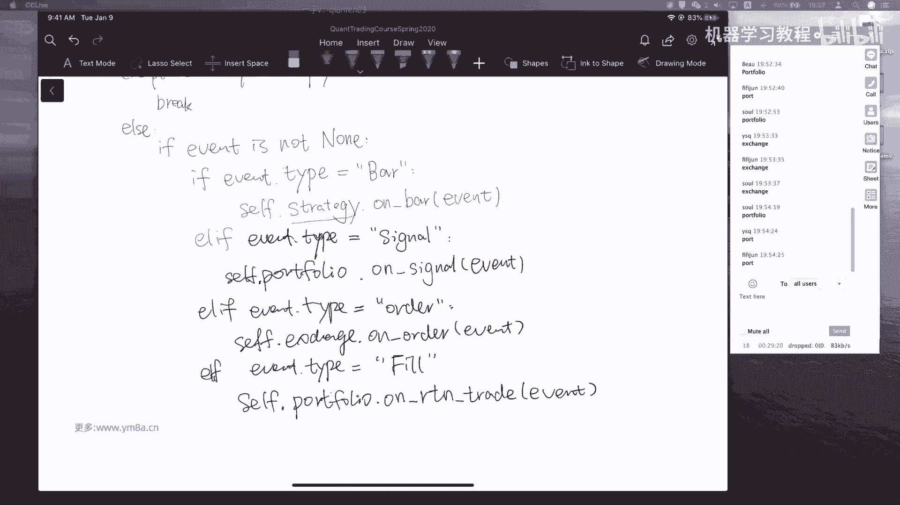

就看的是我们back test这样一个function。

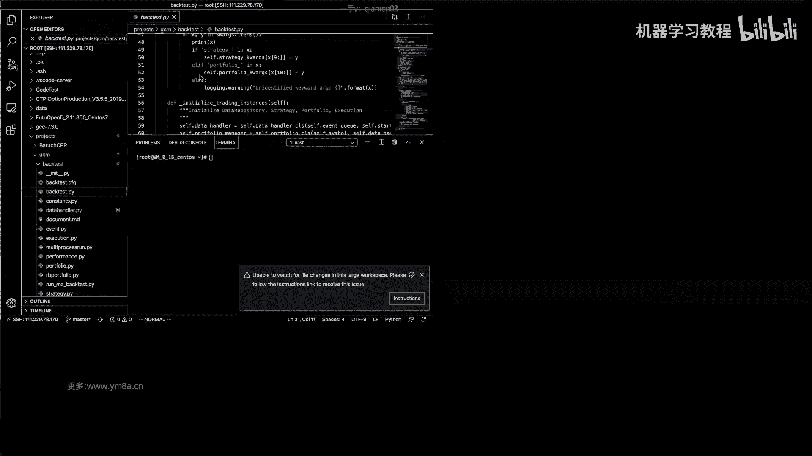

对其实刚刚就是这样一个方式。

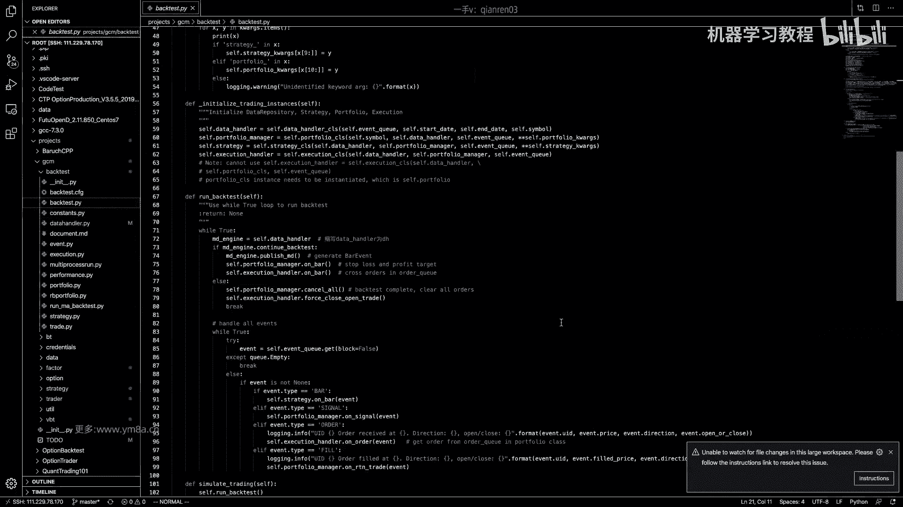

那现在大家看起来应该会感觉熟悉很多吧。

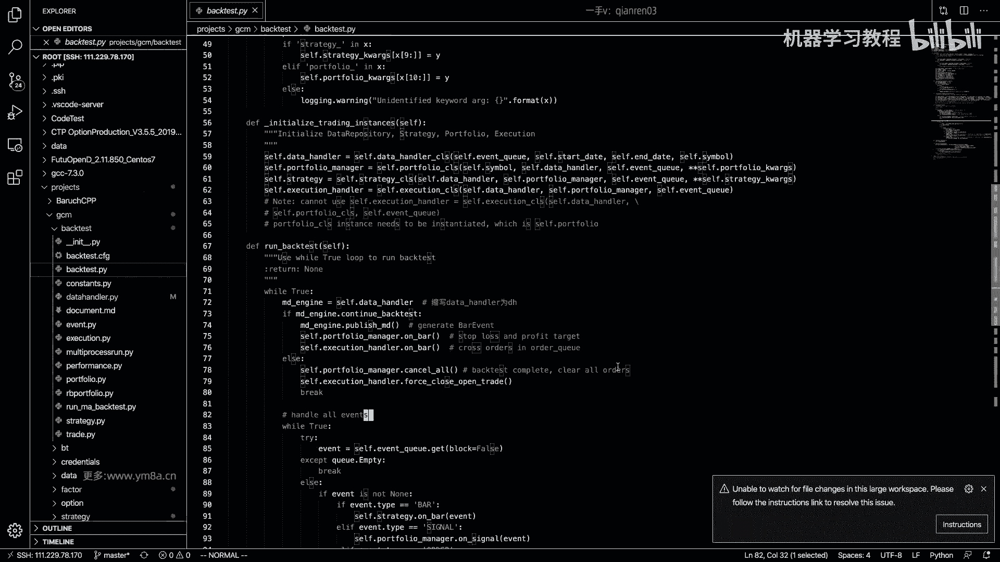

对就是我们的run back test呃。

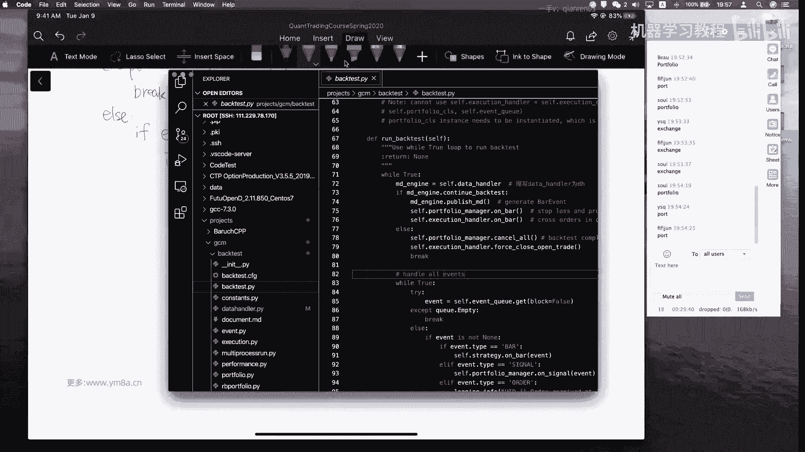

Sorry，From back test，我还是要把。

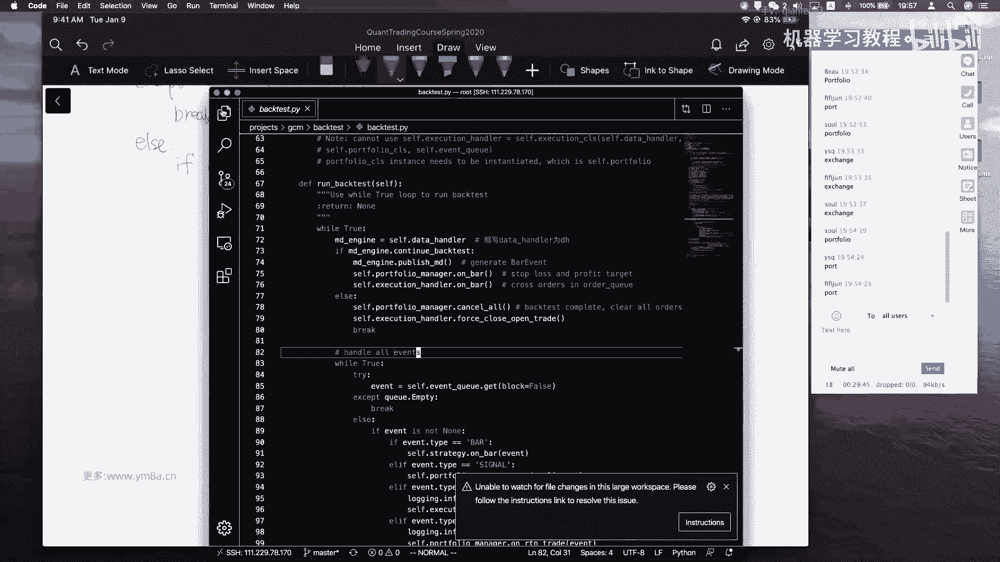

这是我们刚开始注意run back test的时候，我们已经初始化一个data handle了，然后market data engine如果有继续回测的话，做什么事情，然后这是刚开始的一个冷启动，对。

嗯现在大家看这个应该OK了吧，好的，那接下来我们这节课要做的事情，就是说花一个小时时间，把四个东西我们都go over一下，到底里面发生了哪些细节的一个事情，对我们先从我想想呃。

最简单的data handle。

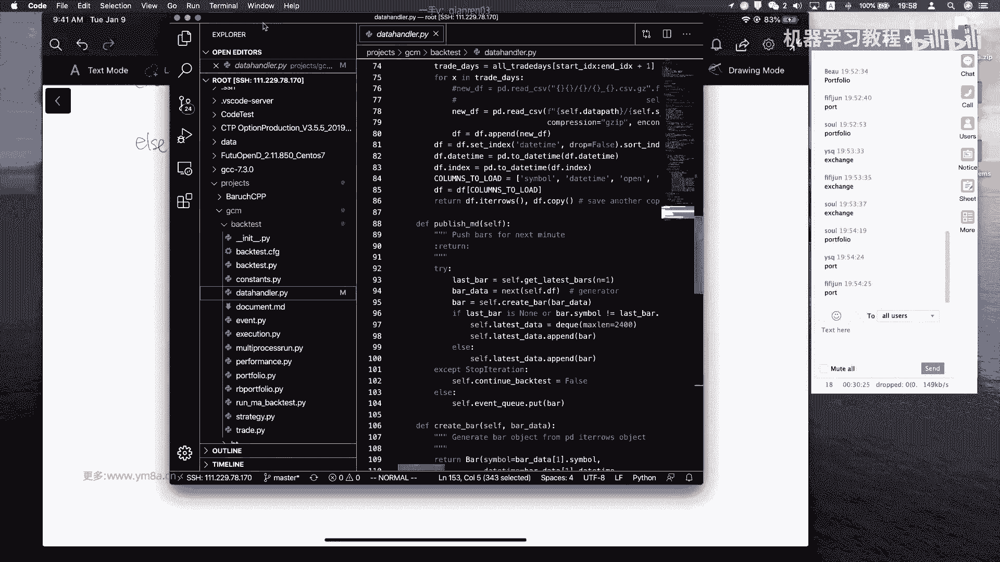

这个就很快对。

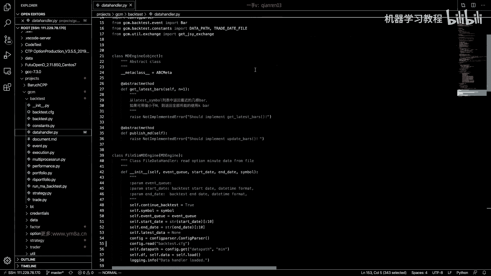

就是我们在设计这样一个data handle的时候，我们需要考虑到是呃，我刚刚有说过，说刚开始我们可以用一个file data handle去做，但如果我之后回测的标的多了，我回撤的品种也多了。

我不仅仅除了期货，我还有期权，我还有股票，那那你可能用这样的方式也OK啦，嗯但是我我个人建议是，最好最好自己去要把数据库全部去连接上去。

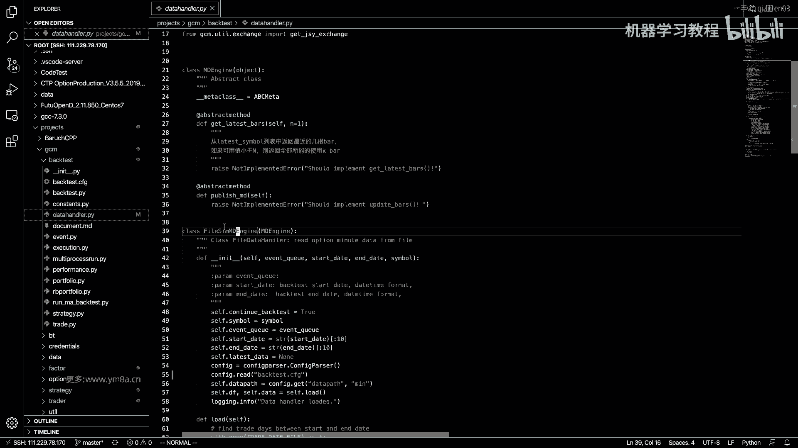

然后你这样你就不用在这个里面去处理一下，就是我要去做各做各种各样的数据，就我怎样去，我就不需要去pass里面，各我的数据路径里面去去load这个数据，然后大家有看到我这边用的是对，其实就这样。

就是hard code，我个人不是特别喜欢，我要去知道，就是把参数传进去，我的data path，我的symbol。

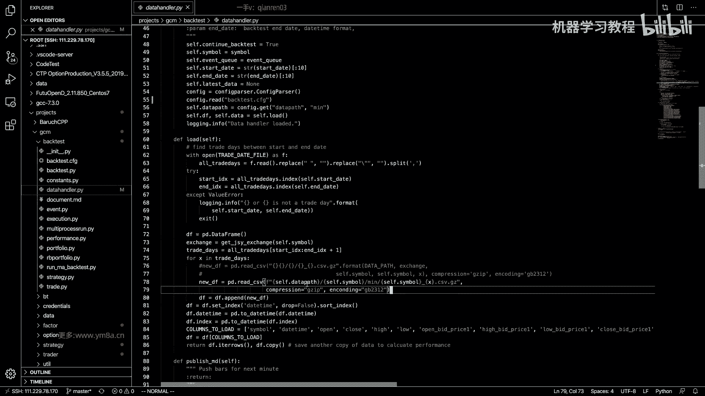

所以大家可以看到我的数据，嗯其实我可以给大家看一下，我的数据是怎么来存放的，就是如果作为一个CSV文，CSV文件，我的数据是存在一个，就是我我没有存在那个固态硬盘上，是存在这样一个机械硬盘上。

然后我是把它分合约去存放，然后然后我分频率这个是分钟，然后对啊，简单的看一下的话，就是，Um okay。

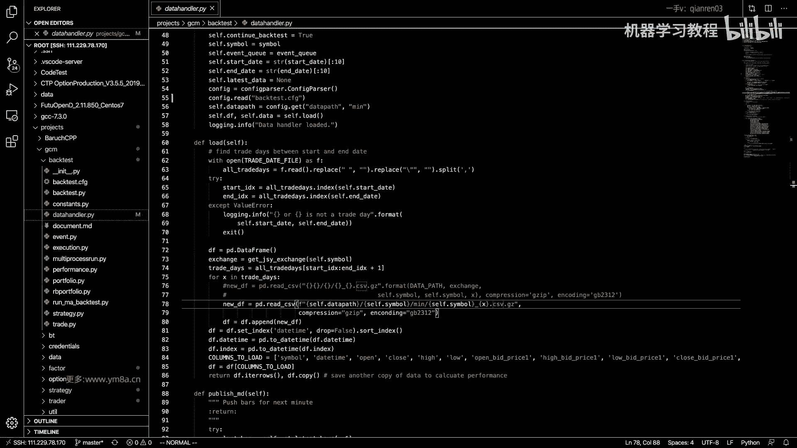

So，简单给大家看一下数据怎么来存的话，额我这边有几台服务器，就是我我平时说就是有一些我要收实时行情，那我肯定不能，就是我平时白天也不在家，对不对，然后呃呃就是我的，我我电脑也没有说是就是24小时开的。

所以我这个这这台是，我是我在上海的一个云服务器，然后然后我把他的做的做法是我自己在家的话，有一个有一个32个CPU的一个服务器，然后呃他硬盘会比较大，2T对，因为我如果说我要去呃，我如果说是说要去呃。

搞一个二T32CPU的云服务器，大家可以看下一年的10万使用费用，我记得应该是不低于1万的对，所以所以就这个是，就是说基于成本和经济性的考量，就是说用用云服务器当然很爽。

但是用2T的云服务器好像有有点奢侈对，呃啊sorry，我怎么打的SCP，OK这个就我就回到了，我在家里的这样一个服务器上，对，然后。

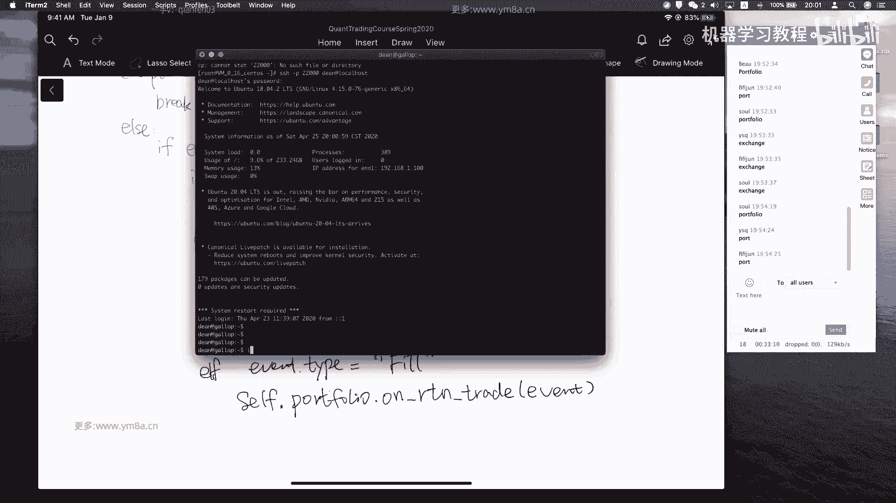

就我把放在这样一个机械硬盘上，Oh you sorry，对，就是这里面就是大家有看到，我把所有的东西就都抽出来，其实还没有完全整理好，就呃之后我会给大家就是从14年到现在的呃，RA2的这样一个压缩包。

就是包含我们CCTP，每一天的每一个tick的原始数据，到18年的数据到19年都会去给大家，然后然后大家如果要去做策略的话，就应该自己去把这些数据全部去处理下来，然后就其实处理起来也没有那么麻烦。

因为我我我们我们其实真的不需要去手动的，去大大去解压这些文件，我完全第一节课有讲过，就是完全大家可以去用LINUX的命令，或者是windows的脚本，我去把这样的文件夹去批量解压缩，然后批量解压缩之后。

再去把它就是从tick数据调我们之前写的程序，把它处理成分成数据，然后再去把它按照文件夹去存储，哦哦sorry，我都有点忘了这个是怎么存储的，所以，sorry我已经想起来了，就是我个人习惯。

就是说我会把主力合约放到一个文件夹里，然后主页文件夹呃，就是因为我们从一个压缩压缩文件夹下面，解压下来的话，其实是有很多的呃，行情的，就是说大家也看到这边是main是主力，然后还有SUBMAN。

实际上我除了主力跟次主力外，还有其他的合约，但一般来说从交易的流动性上考虑，我们在研究的时候，主要是研究主力跟次主力的合约对，所以然后然后我是把，然后目前我做的我目前没有在去做套利的交易。

所以其实是主要是在流动性好的合约上去做，大家也都知道，就是呃就上周原有事，原原有的事件大家也都知道呃，4月20号快就临近快交割的时候，流动性出现了问题，但脸就是我多说一句，就是理论上来说。

我们个人或者说是机构去做呃，CCTA的交易的时候，应该尽量的考虑到到，就是说我们会去做主力合约，那快去快到交割的时候，显然他不是这样一个主力合约，就不是大家在主要去交易的合约，那流动性上会出现问题嗯。

所以当然投资者的教育是，我个人一直认为都是用真金白银的钱，给亏出来的对。

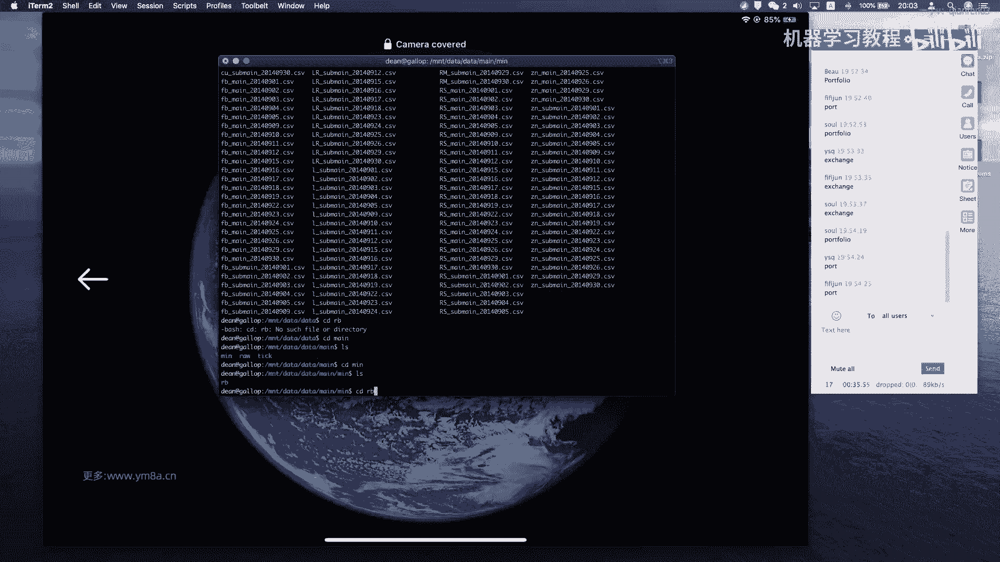

然后把RB放到这个里面，然后这个时候我存有我所有的，就是我我们包括我们今天，就是之后要去用到的这些数据对，所以嗯所以就是说我回测引擎的时候，你刚开始的时候是可以这么做，把所有这些东西去按文件夹去整理。

然后你去load对应的，你的如果你是股票放到不同文件夹，你是分钟又放到不同文件夹对，所以这个这个是第一个要去跟大家说的，然后我们再看嗯，所以刚开始是就是我们在整个回测的时候。

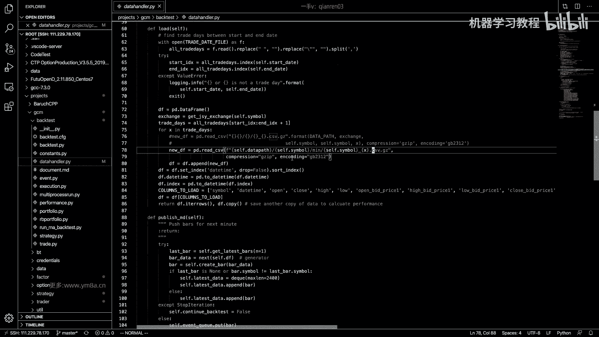

先要去load了，去把这样的数据加载到内存里，然后嗯嗯就注意我是为了节约空间，所以全部是用g zip的方式，把它去去压缩了一下对，然后可能会有的坑，如果你保有中文的话，你要注意去编码格式。

如果不要打不开，报错的话，自己去看一下encoding，对，这是可能会有的坑，然后再回撤，目前我只用到了这些column，所以说我会把其他东西都去job掉，对因为这样子来说的话，我每我不用到。

比如说呃什么exchange，然后或者说是呃market code，它的合约代码，然后或者是他的成交额或是巴拉巴拉，就哪些你不用的东西，你如果都加载下去，你要看一下你因为我们要做的是。

你要去把4年的历史数据，全部去加载到你的内存里，分成数据，还好分成数据简单算一笔账，你可能一天就是几百根，然后你再乘以个1000对几10万行的数据，对我觉得我觉得还是OK的，但如果是tick的话。

你要把这个数据再乘以两个数量，再增大两个数量级，那几千万行的数据，如果那笔记本跑起来可能小的，笔记本内存不够的话，或者CPU不够强劲，会有一些问题，所以对嗯对我，我这个是放在个人的服务器上跑的话。

其实就还OK，然后要注意的事情是，我们返回的时候，就是没没有去把它一次性全部去，就是把它去返回哈，就是我不用说是你真的不用说是去用那个，就是用for循环来去跑loop，然后就注意这个东西。

用一个generator这样一个特性，这样你每次来说就是说当我要去用到它的时候，我才会去产生这样一个，就是才会去产生这样一个呃data，就是我每不你你就不用说，我一次性把都加载到内存里。

那这样跑的话可能会有点问题，这个也是我自己在刚开始做量化研究的时候，发现一个问题，说，为什么我每次就我刚开始的时候，做期权的tick的交易的时候，然后说加载了很多数据，然后数据库一下子就爆炸了。

因为相当于说我每次做的事情，是把整个数据库里面的历史的数据，全部加载到内存里嗯，那这个时候然后你会发现我要回测开始之前，我要预驾，可能要加载个2分钟，那这样可能是有点麻烦的，那那其实比较简单来说。

我们直接就是用generator的方式，我一次去让他去推一个板，对对这，这个是这个，这个是希望大家去注意一下这一点呃，如果不太明白我在讲什么事情，大家可以自己去用Python搜索一下。

这个是个什么样的概念对，然后还记注意的话，这边是这边有个小trick，大家要注意额，我所加载的合约当中的合约名字是不一样的，我刚刚有提到，就是说有一个是主力合约，那主力合约是会切换的。

大家想我们一年螺纹，比如说有三个主力合约，那平均下来，也就是说一个一个合约，会是会会在四个月当中占据主力合约，当主力合约不一样的时候，我们要去注意一下。

就是说你要去把这个呃本来那就是ladies data，肯定要去去重新去处理一下，就清空对，就我用ladies data这个是什么意思呢，我就是保存从当前就是最靠近当前的这几根B。

因为我我这个这个这个是实践当中，我会发现这个东西还是挺有用，因为我经常用，比如说我像过去的moving average twenty里，我要找过去20个班。

那我如果我这样一个ladies data当中有的话，我就不用再去说再去重新去找了，相当于说我把它给存下来，存到内存里，因为我这个一直会用，然后我用的是一个double ended q。

就是我也不知道中文怎么说，double ended q这样一个数据结构，然后就是说我最大最多我是保存2400个，当我的数据达到这2400一个的时候，他会把第一个给推出去，他他他是有点像Q。

它本质上还是一个Q啊，就是还是一个队列，First in first out，所以说你用这样一个数据的话，你就不用去担心说我这个数据什么时候抄了，什么时候什么时候补偿你。

你只要不断的去把里面往里面去append，就更新最新的数据对，就是我有新的数据，然后把它加到这样类dist data里面，这样我可以保证我里面始终有小于等于，2400个这样的数据，那2400呃。

大家可以算一下对吧，除以60万就是40个小时，40个小时数据对于做日内的来说，相对来说还是够的，然后这个要注意的是说，当我的主力合约去切换的时候，那我要把这个东西给清空对，所以然后publish md。

我们要做的事情就是说大家注意啊，放到一边，把一边Q放到这样一个呃，放到哦，Sorry，是把bar放这一段Q里面，大家就这个时候不断去联想一下，我们要去做什么样的事情对，然后要注意的时候。

我放的是一个bar，然后bar的这个数据结构是怎么来做的呢，我们用的是一个create bar这样一个东西。

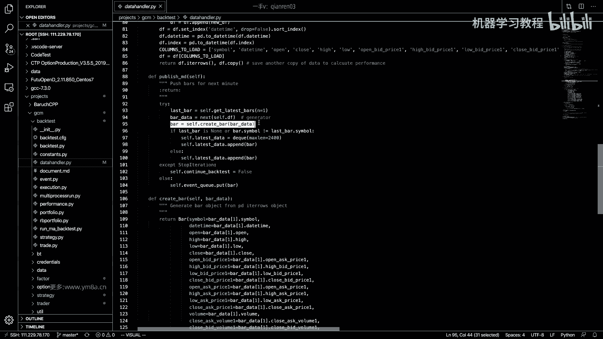

嗯嗯对我们生成的是一个班对象，对那这个东西是怎么来做呢，就是上次我应该发给过大家。

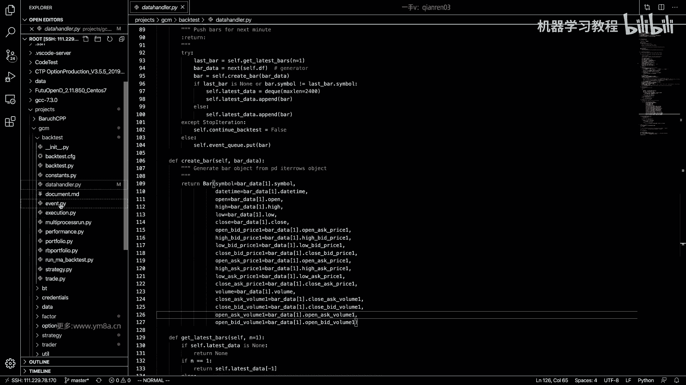

就是我们把所有的东西都放在一半里面，就是这样的一个event，是这样一个数据结构。

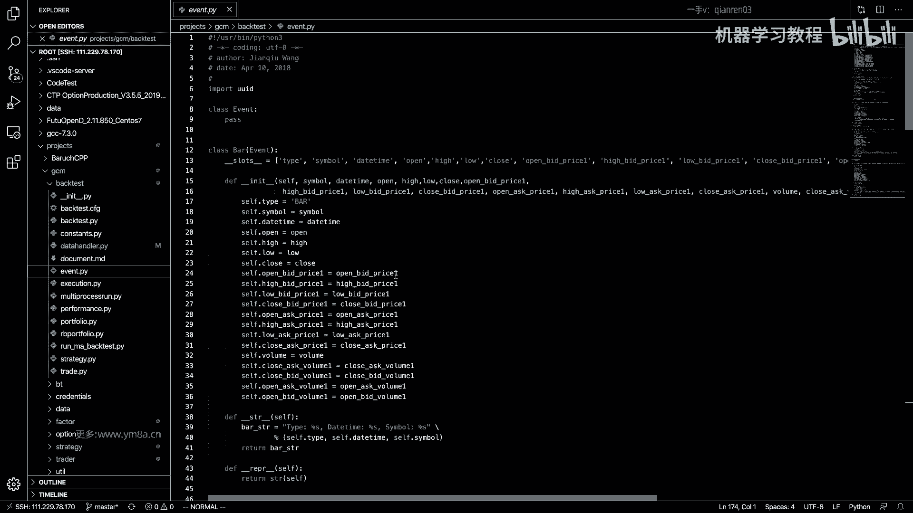

我们有看到的a bar right，就是所有的东西它都是一个event，它需要去继承event，然后因为我们会生成a lot of bars，我们会生成很多很多对象，用slots这样一个东西。

会可以让帮助Python来去优化它的内存的使用，对你比如说我有哪些属性，当我生成很多很多个这样属性的时候，那内存还是比较明显的，大家可以去对比一下，我加不加这一行，我同时生成。

比如说100万个这样的bar的对象，大家可以看一下，它对内存的占用会有什么样的区别对，然后要做的事情就是说把他的东西全部漏得到，额，就是把他的一个个属性全部去生成这样一个object。

然后我接下来要用的时候，我就不用说是去，就是不用说是在data frame里面有一个去用location，或者用index去找他哪个column，我只知道他是一个bar对象。

那我直接用用attribute访问它的一个属性，我就OK了对吧。

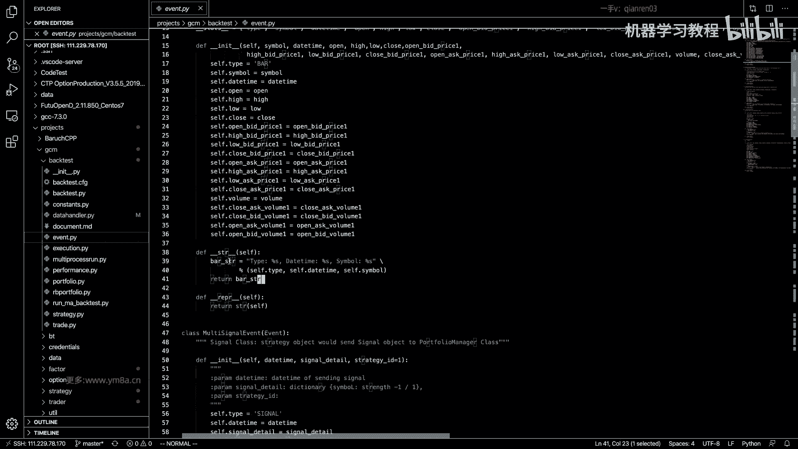

然后这边就是说当我，然后然后说为了方便来说说，我我需要知道bar是什么东西的时候，那我可以直接用print bar，我直接直接就print bar，然后他就会把他的type它是一个bar对象。

然后他是什么时间呢，它只是用什么合约，这样东西就可以打出来了，然后如果你想要知道它的价格也是OK的，你在后面你就你就把他的price，你想要的信息都给打出来，这样的话就比较方便，你就不用一个个的去。

比如说print bar dot volume，Print bar dosymbol。

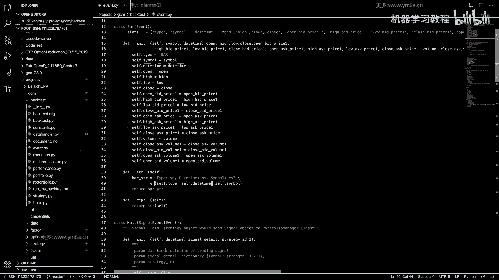

对你就不需要去做这样的事情，呃，然后我们再回到我们的data handler对。

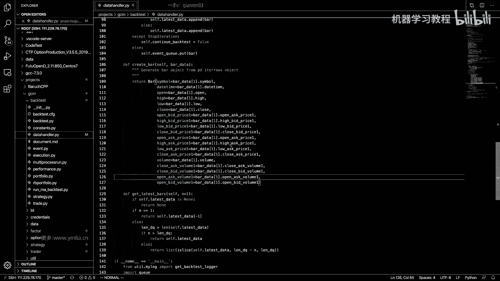

所以data handle要做的事情就是load数据。

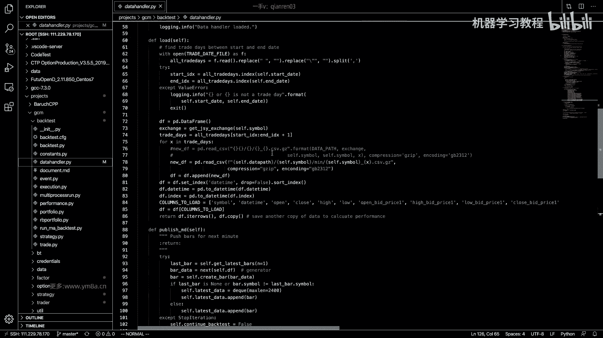

load数据之后，然后publish market data，然后有几有一些小的trick对，然后然后呃大家要注意，就是说我这边是完整的这样一个back testing的engine。

然后但是我还是没有把整个的code都给到大家，我做了一些删减，就是说呃有一些东西是留给大家去实现的，然后如果大家实在实现不了，再回头看视频，你会找到一模一样的东西。

但是我我的建议是大家自己用五一节的时间，把接下来我们提到的一个个class，都去把它去处理掉，对就是都要去自己去写一遍。

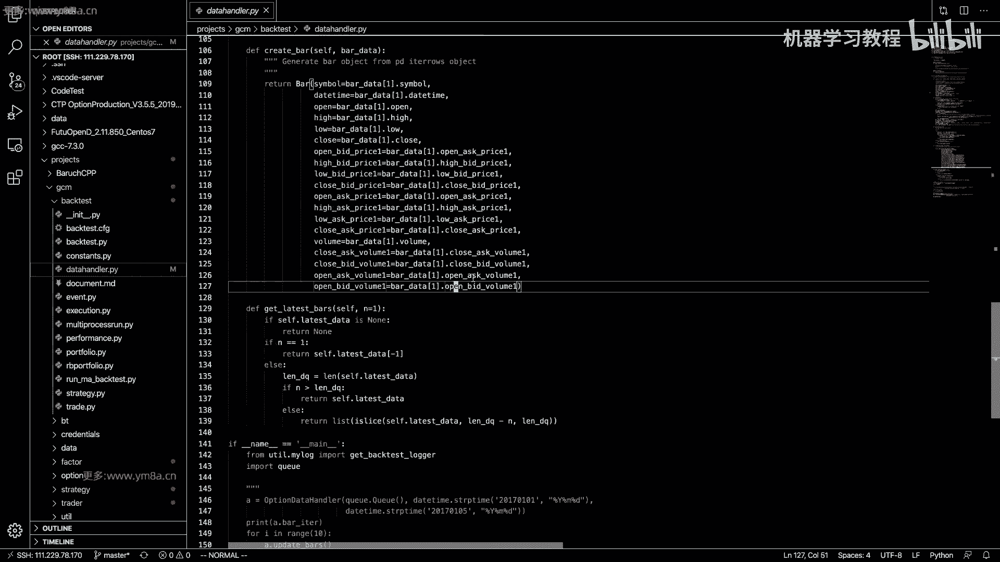

因为我觉得可能真的只有写完之后，才能加深对于整个系统的理解对，然后data hle了之后，然后我们再按照，按我们按照整个的策略流程来产生的数据，然后我们要去一个接下来是谁告诉我是什么。

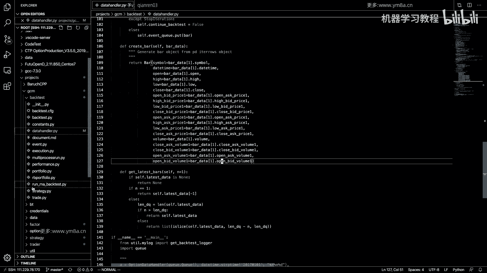

Strategy，right对吧，然后同样的strategy就是说呃，我们strategy刚才提到，每个都要有一个on bar这样一个event，好我我我们传进去的是一个bar。

对那大家要注意的事情是说，为什么我们这边没有说，我既然strategy要直接用bar的话，我干嘛还要用event you，我就我干嘛不就直接说我呃用一个bar传进来。

直直接就是说呃在一个main在一个主函数里面，每一个data handle产生一个对象，然后直接再放到movie average strategy里面，就有点像我们上一节课写的这样的一个。

简单的back test，就是说可能在刚开始的时候，你这样做是OK的，但如果在后期的时候，你策略要处理的事情就比较多的时候，你就会想哎，我这个棒到底用的是上一根的还是下一根的。

那这个时候你可能会把自己给绕进去，所以我我个人呢就是说处理的方式，就是说我们统一全部用，一般一般Q把做成这样一个事件队列，这样我们的核心只要去关注，我在每一个处理类的时候，需要去把它对应的事件。

用完整而严密的方式去处理干净，这样我保证我整个系统都是robust，以及我后面想要去加fancy的功能，那这样也可能会去方便你去实现对。

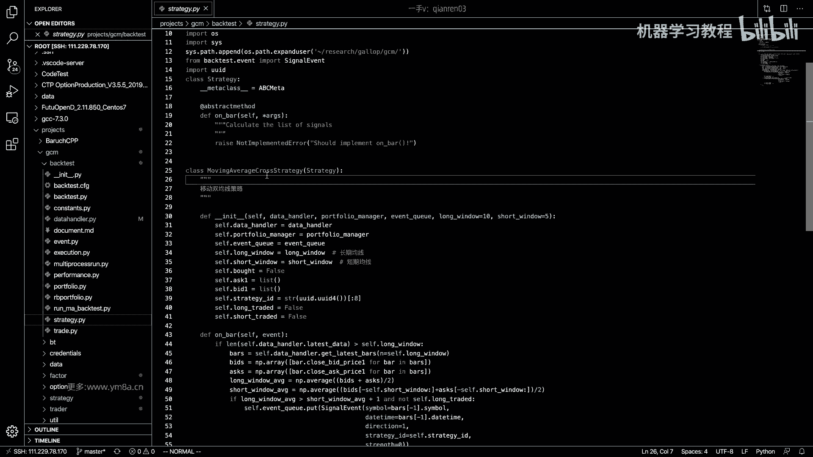

然后然后要注意这个on bar，其实这这部分相对来说可能会简单一点了。

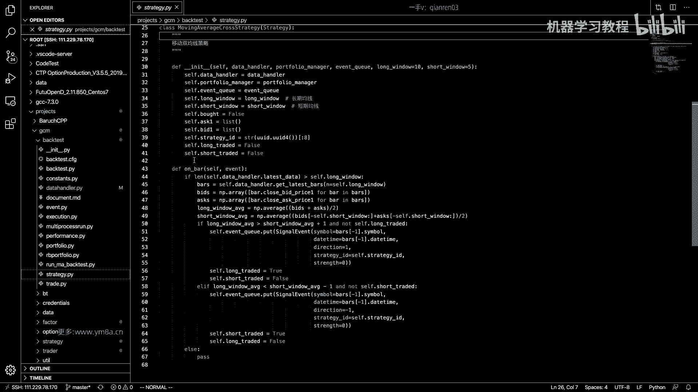

就是嗯就是双均线策略其实没有什么好点，这个这个这个挺简单的一个事情，就是算一下均线，然后根据信号，然后注意我们这边，这边这边要做的事情是发一个信号对。

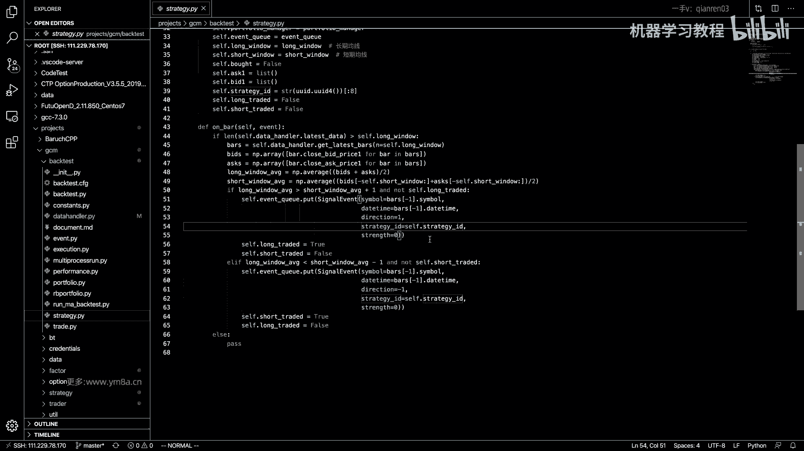

然后我自己的习惯是，每个strategy我会给他一个unique呃id，我会给它生成一个unique id对，然后呃这样这样做的事情是什么呢，以及我们每测试一个策略，其实我都会去给他留很多的log。

然后我这边应该没有log，对我我自己的机器上，应该就是每一个策略回测的结果，包括运行过程中打的日志，我都会去把它保存下来，in case就是说你要去看一下这个东西有没有，如果这个时回测。

比如你好不容易跑了很久的回测，然后结果发现他出错了，然后结果你会发现诶跑完之后就丢了，结果你也不知道在哪，那这个就还是比较麻烦，所以最好的方式是你去把策略定期的呃，就回测的过程尽量都给它保存下来。

然后如果有什么问题的话，你还可以去，你还可以去debug，然后刚开始就对我，我建议刚开始大家再去develop这样的一个back，testing system的时候，是去多多多多的去打一些log。

你可以你当然也可以用print print比较多的时候，你可能你就看不到这个输出结果，你可以用log，然后把它保存到文件当中，然后运行。

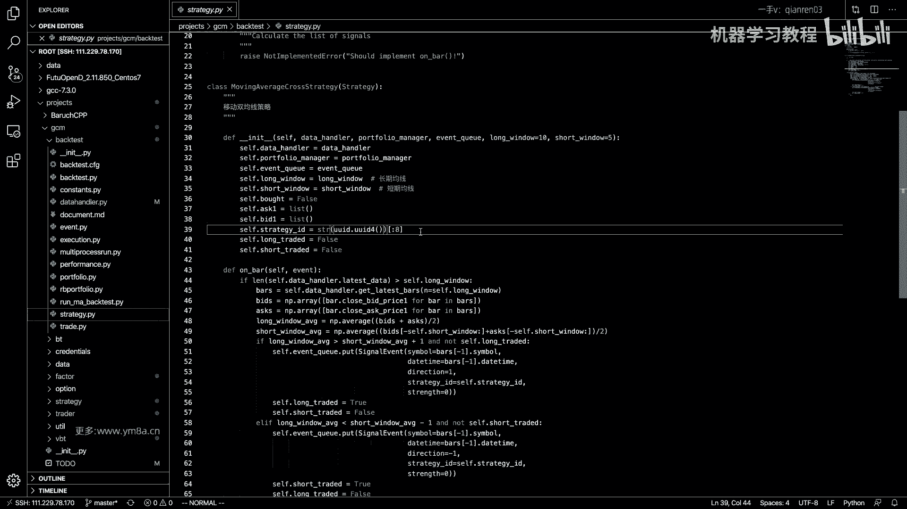

OK的话，你就接着走，如果出错了，你再去看log文件，我觉得这样可能是会更好的一种方式，所以策略类和数据类就这两个是比较简单的，然后我们先跳过portfolio类，对PFOLIO类我怕就是嗯把它给搞晕。

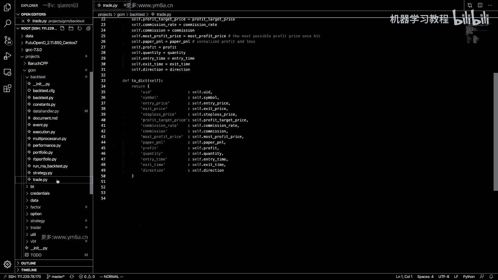

我们先来看trade吧，对是就是就是呃就是，呃trade tra的话，这个其实就嗯对这边还对，我应该是先看execution，这个trade之后再回去给大家讲。

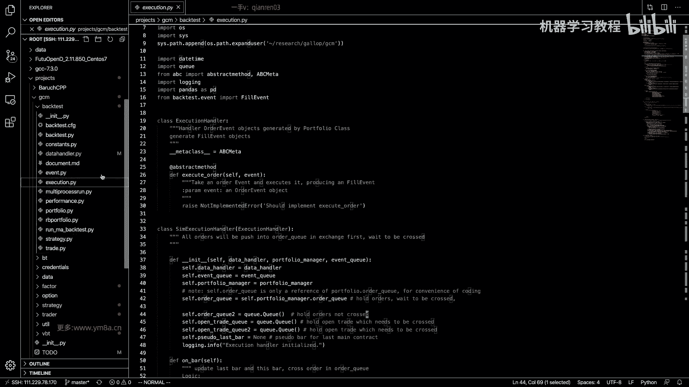

我们先看看execution，就execution这里面其实有一些东西还比较简单，哎就是有有一些大部分是比较简单，但有一些tricky的事情是比较去注意的，呃我我们上一节课到现在为止。

我们至少接触了两种撮合成交的方式，一种是我看到收盘价就成交，然后另外一种是我留到下一分钟的，按照对价去吃，然后我不知道大家实际去做交易的时候没发现，就是事实上去拿对价吃，都是一个非常非常乐观的情形。

就是你很有可能你平时没有问题，一旦说你出现了方向，大家都在去抢单的时候，可能对价都吃不到，你会比对价去加1+2，还会有滑点，对那这一种方式说我在回测的时候就叫加滑点，但是我们今天介绍这样一种方式当中。

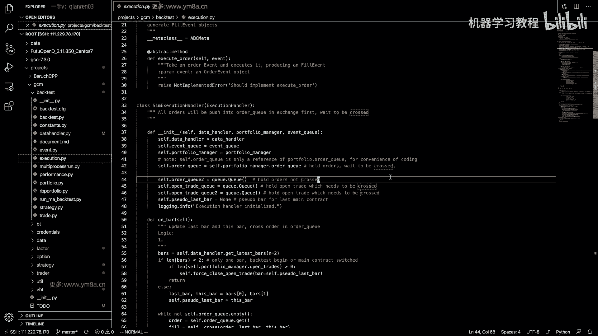

说是我需要保证我的策略按照我的bar去成交，就是说我希望我的策略回测下的结果，某种程度上有可能，他应该大概率情况下比实盘跑的效果会更好，那这个时候我们都我我采取的方式。

就是说我全部用limit order，我都用限价单，然后我要去在我回测的模拟成交过程当中，去想一些办法，能够让他去尽可能的去严格它的成交条件，然后哦我们要做这样的一个事情，是说我们先来看。

就是说当我们的execution收到呃。

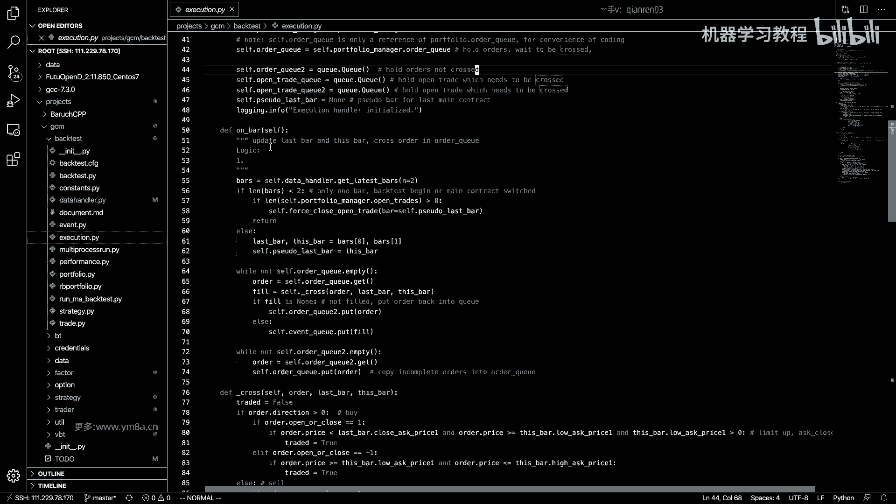

呃大家注意就是execution engine，为什么还会去收到bar嘞，就是因为我们在撮合的时候，需要去用到上一根瓣儿和这一根棒，然后我要去把它，我我现有的这样一个，我现有哪些单子要去把它成交。

大家注意就是说我们刚开始呃，就是我我们先不去管portfolio，怎么去产生这样一个order cute，order cute的意思是什么，就是说我我把我所有单子都发到这样一个，现价单的一个队列里去。

我我们我们我们PFOLIO处理好了signal，发出了order，然后保存在这样一个order q当中，然后我通过这我通过这种方式说，我就知道就是说有哪些单子是等待去被成交的。

然后然后这边对这个里面有一些复杂，有一个是open open trade kill，就是说我现在说有些单子是已经成交的了，那我相当于就是说我前持有多仓，或者是持有空仓，然后然后有些东西。

然后我对于某些trade我可能放止盈和止损，那我就要通过这样的数据结构来去保持，然后去关注我们接下来怎么来去做止盈跟止损，然后就是说OK呃，我还记得我们在刚开始提到的时候，什么时候去。

就是force close对吧，然后就是说呃只有一根bar的时候，只有一根棒会是什么情况，那要么是刚开始呃回测，要么是回测快结束了，所以说如果是回测快结束的时候，我还有没有平掉的。

就是我还有没有平价的仓位，有first close open trade，对，如果没有的话，还是然后对这个这个事，就是跟我们刚开始讲的东西联系在一起，然后如果正常情况下，我应该始终都是有两个伴。

就是呃当前的跟最后，所以这边这边我没有注意到，我们用到的是一个data handle，实现这样一个函数叫get ladies bar，其实就是说把我们这样一个ladies bar。

那样一个double ended q里面这样一个呃。

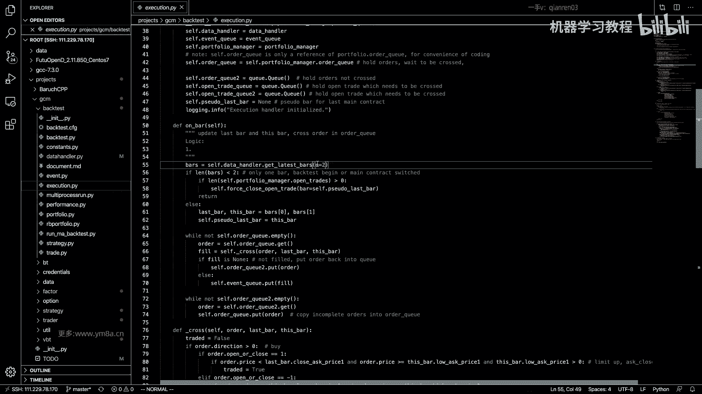

就是最后两个板给推出来，然后对其其实就是这样，很很简单，就是我只要返回，如果只有一个的话，就返回一个，如如果是这样，如果是两个的话，那我就返回嗯，对返回这样的两个两个对，这这个应该是比较好理解。

我返回最近的两个班对。

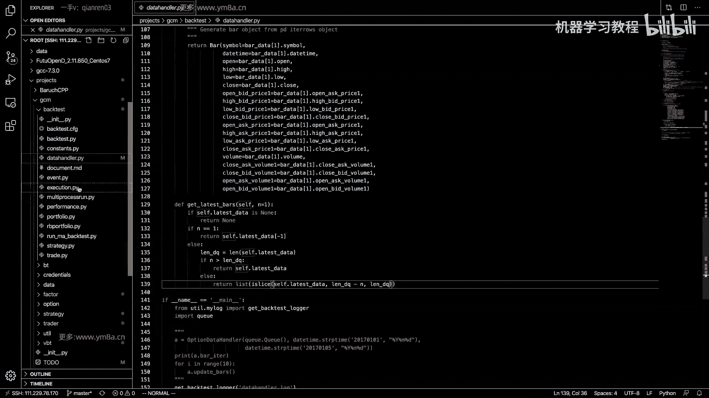

然后是我们接着来看，就是说当我们的那时候，我们order q里面有很多的队列嗯，对就是有有很多的order order是非空的时候，那我要做的事情，一个个就是说我把这样的order去取出来。

取出来之后一个个去cross，然后我们接下来看一看。

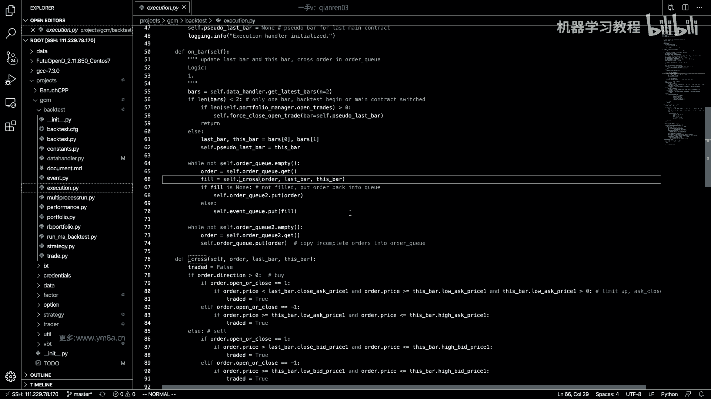

对这个cross这块是怎么来做的，就是就是说首先我们要做的事情，是判断他是我要是去买还是去卖对，所以order有一个这样direction这样一个属性，然后接下来要去判断做的。

就是说我接下来是嗯嗯怎么说呢，就是说我要是去开仓还是去平仓，或者说嗯我这边是怎么想的，就是嗯，我不知道现哎我们我们先来看下面这个条件吧，就是说首先是说如果说你要去买的话，你要满足哪几个条件。

一个是order，我大家想一下我成交的话是什么样的条件，我order就是我order，我去发单的这样一个价格要小于拉上一根BD，在收盘时候close的ask价格。

以及order的价格要大于等于这根bar的最低的，这样一个价格，然后同时要这个半价格大于零，这这个这个是为了处理，就是说当我有涨跌停的时候，这个东西是零的时候，我们会去怎么去处理，对大家注意。

这个这个成交条件是比较严格的，大家可以想一下，就是这个东西是为什么要去这么做，对，首先我要比上一根bar的close ask要去低，然后同时我要比这一根bar的close2，最低的ask要去高。

哦正好课间到了，大家可以想一下，我把屏幕停在里面，大家可以想一下，为什么会是这样的一个事情，对，就是说这个这部分是我当初写的时候，也自己也是想一下，为什么是有点这样这样一个tricky的条件。

但是我会觉得就是说这样做的方式，我会严格的保证，我这个成交的价格，是在我这个BD这个价格去成交的，好的，我们先休息一下。

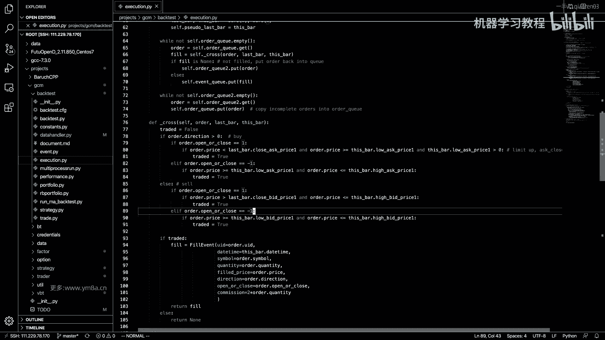

sorry我，You to me。

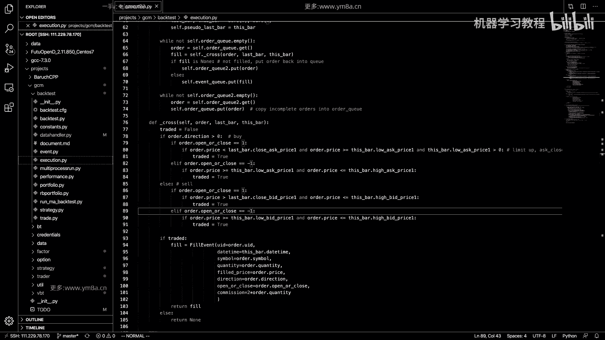

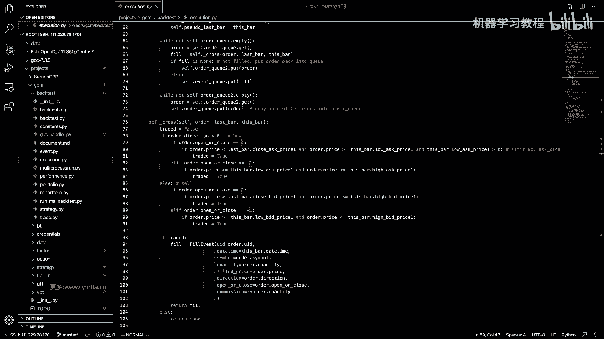

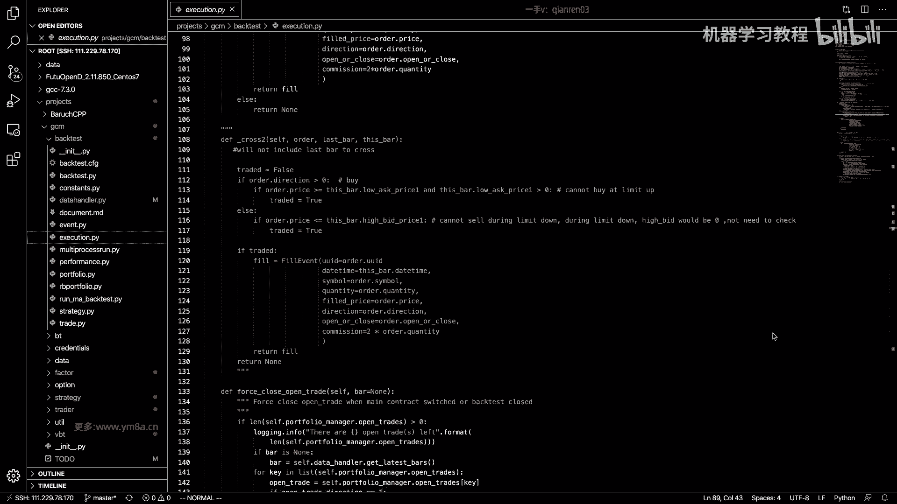

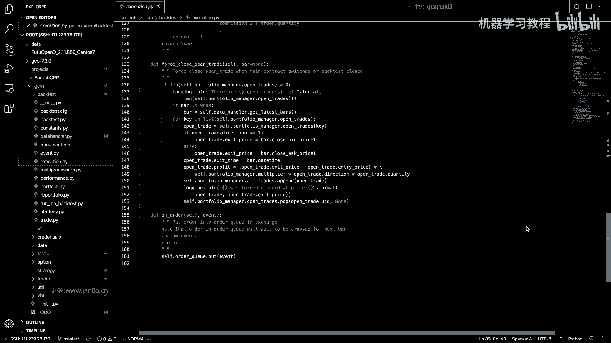

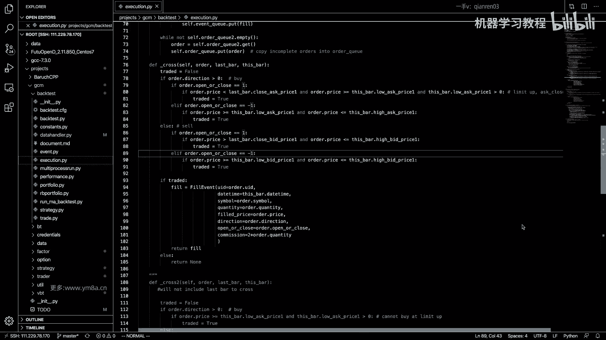

诶好的，我刚刚休息时间给大家画了一个图。

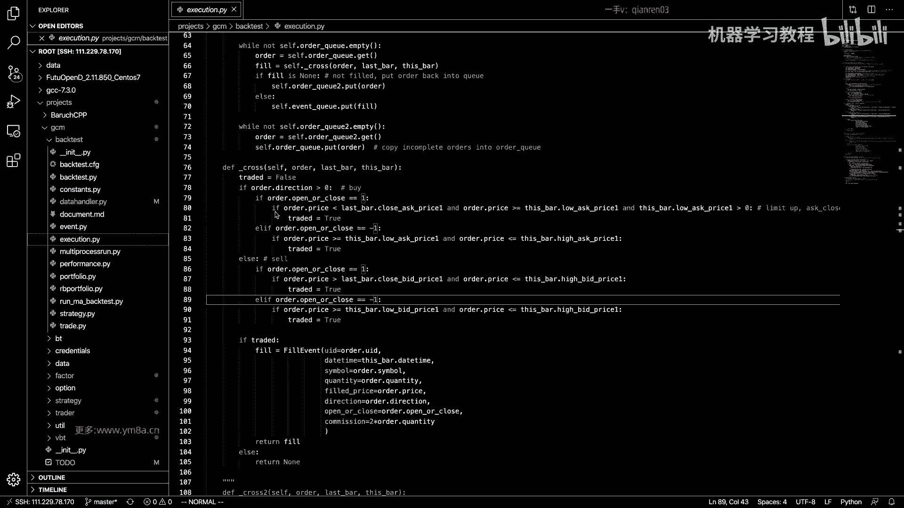

来解释一下这个现象，这首先要注意，我们要做的都是一个ask ask bar，就是这边我们用的bar，跟之前的mini bar不一样的地方是，这里的高开低收都是用ask price来合成的。

所以当我们要去去买的时候，我们都是去拿阿斯克bar去撮合，当然要去卖的时候都去拿别的bar撮合，这个是跟之前不一样的地方，大家也可以自己去对比一下，如果说我只是用mini price。

可以用ask bb和price或者big bar price回停下来，整个绩效有多大，我觉得这个是留给open open problem，就是整个project这个部分，就是说如果你觉得说你的策略。

对于呃挂单的价格没有那么沉，没有那么呃要求没有那么高，我觉得那你也OK，你也可以用这样去做，但是我个人的习惯是说我再去挂单的时候，我如果是去买，我会去拿阿斯巴来去做做成交，而不是用去B的bar。

然后这边有看到有说有这三根线，然后大家来看一下，就是说就是说我们都是从这根瓣儿结束之后，这根瓣儿结束之后去挂单的，然后我想问就是说这三个挂单的价格额，哪几个能成交。

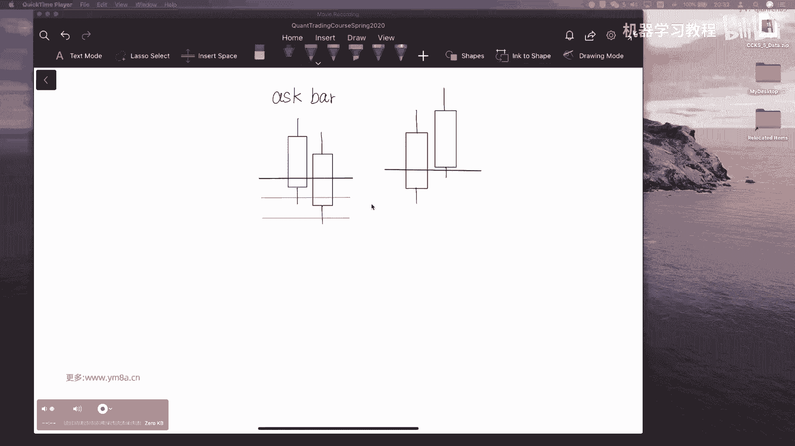

哪几个不能成交，按照我们当前的条件。

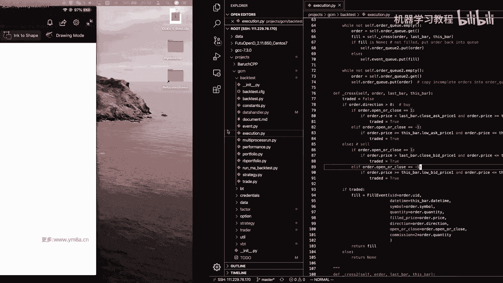

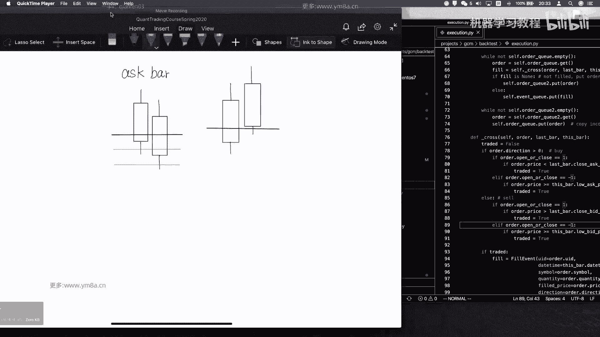

我们现在去买，假设都是买，就在这个条件里面对，按照这个条件，对我想让大家就想一想是为什么呃，orderly price是指我订单发出来的价格，就是这这个时候就是我我我挂单的价格。

对啊就是看我们可以看一下。

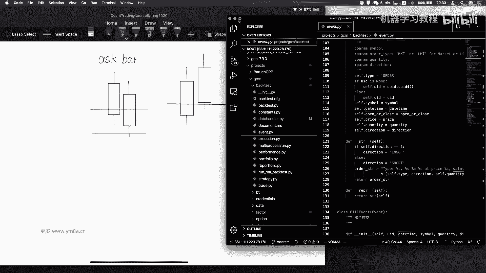

我的order有这样几个属性。

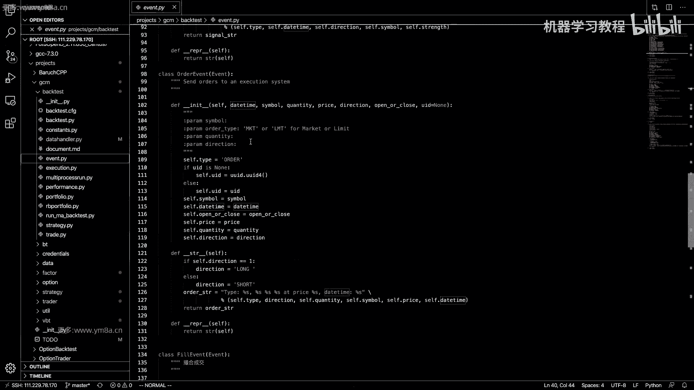

然后就注意这个回收系统，你是留有market还是limit order，就是这样的option的，就是大家你可以自行去设计，如果我想所有的单子都是按照对价，就是按涨停价跟跌停价呃，呃不是对价。

就是说按照market order意思，在正常实际当中说是按照涨停或者跌停的价格，是去挂出去，大家如果去CDP上下的下交易的时候，发现你如果是买的话。

你发所谓的market order就是一个涨停的价格，对以当天可以涨价，最高价格卖出去，learn order就是你可以指定一个价格，然后我们这边price就是说我这边的时候。

我生成order的时候会去去给他这样一个price对，然后open open和呃clothes或者叫offset，就是说你到底是去开还是说是去拼这样一个对，这样一个东西叫offset。

你是去开仓还是去平仓，呃，这个这个概念，在第一节课应该有跟大家解解释过，就再强调一下，就开仓，就是你从手数为零，比如说你开多一手就变成你的，这时候你持仓变成正一，然后如果你是平的话，就把这个正一。

那如果你是买平的话，就你原来手术可能是一，然后我同样也是去呃long或者是去买，对我的方向是一致的，但是这个时候我的持仓有一变成了零对好。

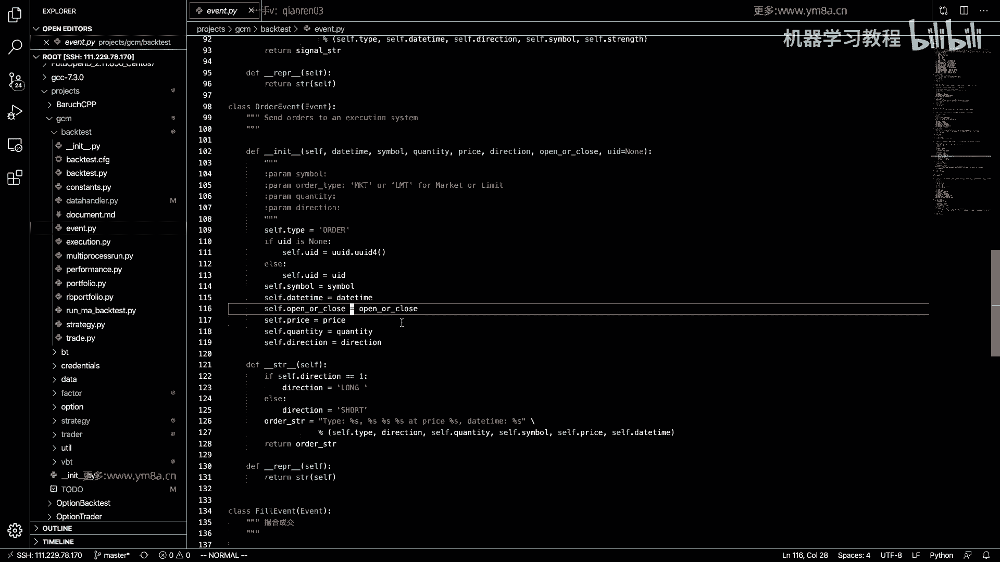

那这这个数据结构大家如果OK了之后，我们再来看这对，就想一下，就是说呃我这里我左边这三个bar里面，这这三个三个成交的价格，这个是last bar，这个是this bar，大家可以告诉我哪几个能成交。

哪几个不能成交。

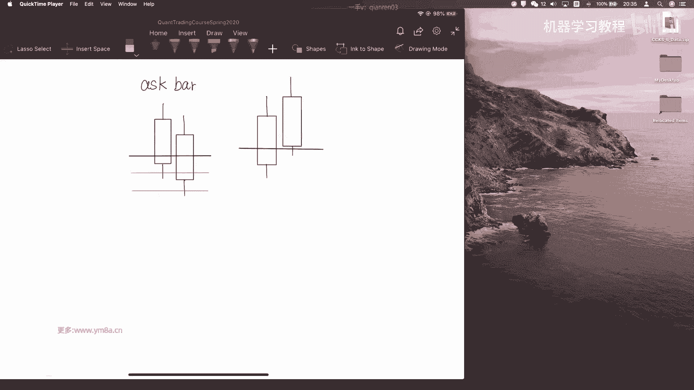

按照刚刚的条件，额条件在对这这这份是，我觉得大家还是要理解清楚。

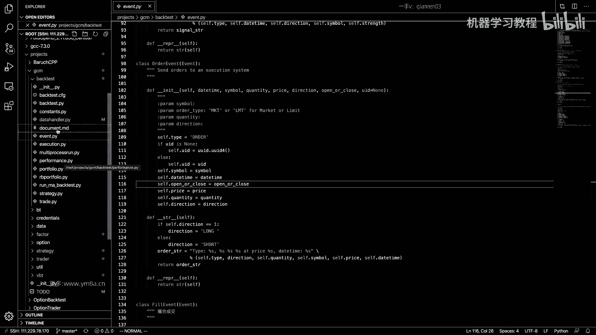

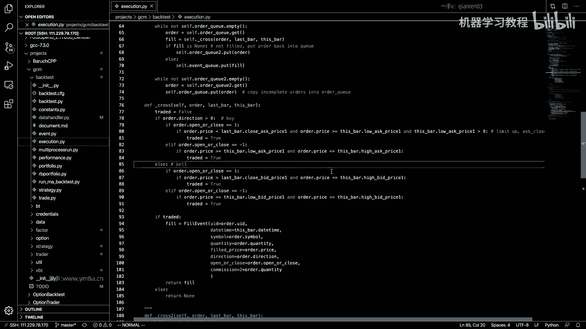

当然你觉得这个不OK的话，对于你的策略类型不OK的话，你也可以去改其他条件，但是我个人这样来做的话，就是说我可以解释一下这样的动机是什么。

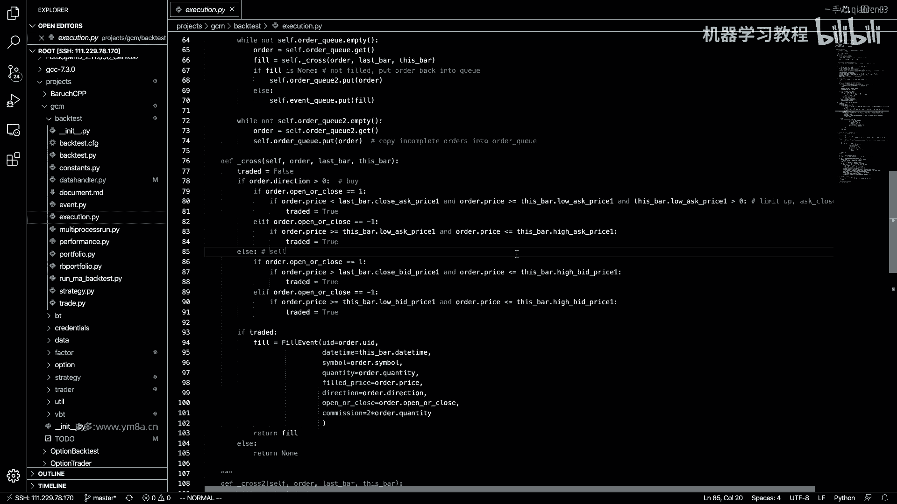

就我这边画黑线的不能成交，两个红线的是可以成交，然后注意的说，这个是从close，就是说我挂单的价格小于上一根bar的clothes，但是大于下一根bar的lois price可以成交。

这个也是小于cos，但是大于最小的就是lowest lowest price，注注意我是买单，所以我都用ASBAR来去做的，我没有用别的，这个时候就说我只看对方的盘口，那为什么要有这样一个的。

这就是说要有这样一个东西呢，我会保证说我在成交的时候，市场是从收盘了，然后如果有突发情况，它呃收收盘的时候，他从收盘，但是说比最低，但是但是比这个最低价要去高，那说明市场有一个下穿的这样一个过程。

当我在下穿的过程当中，我这两个挂单的价格挂的单子就会被吃掉，但是在这样的方向的时候，大家注意，我同样也是一个ask bar，我虽然比LEWISCLEWIS是要举高对，但是比上一个的close要去哎。

但是但是我同时也比上一个bar的克隆效率高，但市场当中收盘到这个分钟发生的事情，很有可能他是上传，而我也是买，那有可能这种情况下是买不到的对，所以说这个时候是注意是一个上传的过程。

就这两个是有一个价差的，所以我在这边通过这样严格的这样一个条件，我保证即使是在特殊的情形市场，哪怕市场当中说只有这个一个盘口，有一个为一的，这样也就只有一手的单子，那我挂一手的单子也是可能去被他吃掉的。

对通过这种严格的保证说我我一定要强调的是，整个市场是下穿的这样一个过程，对我在下穿的时候，就市场有一个向下的波动，但我同时在买，那这个时候这种波动我是可能是吃掉的，但是向上的波动我也是去买。

但这种向上的波动我是可能吃不掉的，就很多人可能在回测的时候，我就直接考虑说哎我是不是比最低价的，这个对这个ask是要高的，是不是要高的话，代表着说对方愿意出的最低价比我要高，那我可能就买进去了。

那我一定能买进去，但事实上交易当中不一定是这样的，所以这部分我是通过严格的增强，这样的一个限制他的条件，我希望我买到的是比市场当中是会去更理想的，这种情形，在当然中，以你说这个单子在市场真实环境下。

有没有可能迟到，我我觉得有可能，但这个价格我觉得呃如果是散货的话，应该是吃不到这样的价格对，因为因为我们的速度没有别人快，那可能这个单子就很少，这样他可能打出了一个大头针，但是我们的价格是吃不掉的。

呃大家注意，就是说这个不不是说那个，不是说是高价的买单不能成，就是因为有这样这样这样这样一个问题，就是说我我是希望来说，就是说嗯怎么说呢，就是说当然这个例子可能还不就是杨书欣，提同学提到这个例子。

就是说说我低价的是能买成交了高价的嗯，我之后可以给你单独举一个例子，我们先往下看，对我我就是说我其实是想强调的是说，我们要有要注重市场当中下穿的这样一个过程，对那这一块的话。

就是说如果说你不想设计这么复杂，你完全可以说是我指定的价格，只要比盘口是要想需要更优一点，你都可以去听讲，你不用去考虑this SPA，但是这就是说我这里面逻辑是，我结合了个人经验在里面的。

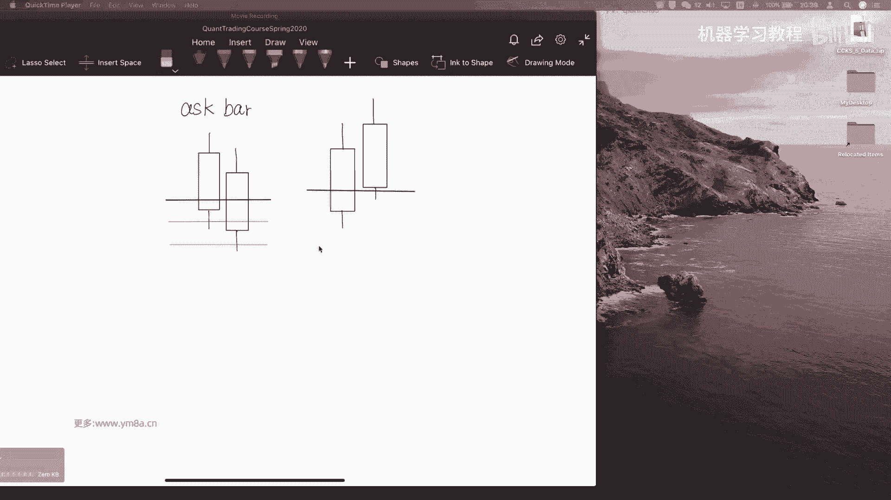

我觉得大家可以自行去选取一下，对，然后然后这边的open和close的话，其实你个人再去做交易的时候，你也可以不用去考虑那么复杂，就是说我直接就用统一一个条件。

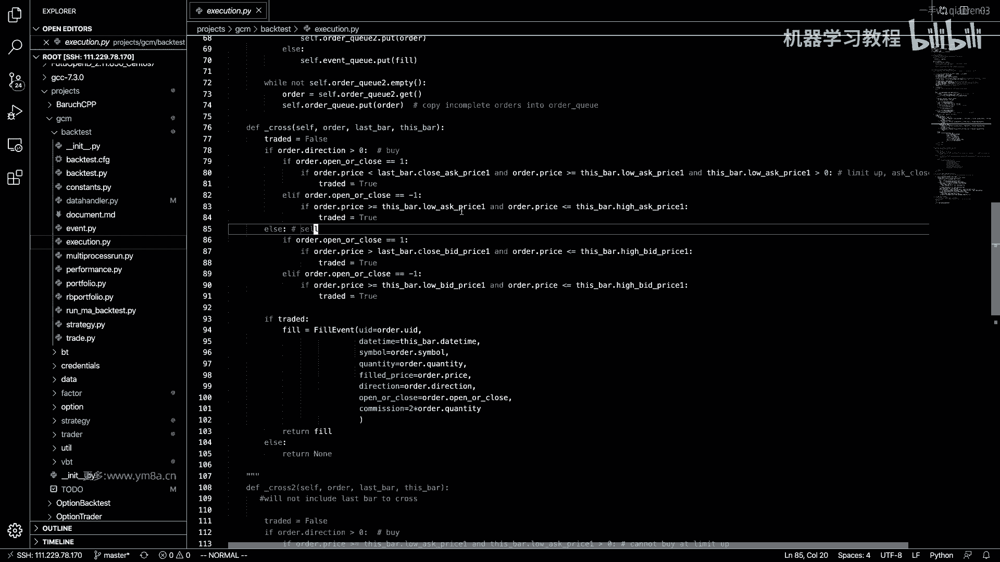

但这个这部分说为什么我们要设计，就是一个这样的一个回测的系统，我是希望就是说每个人，你都可以按照你自己想要的去条件，你可以去撮合，包括我这边其实也尝试过说，我是不是有更简单的一点。

就是直接用两个方式来cross，大家可以自己去对比回测一下来。

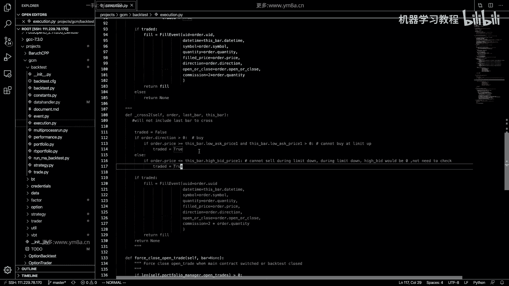

然后根据你自己，甚至根据你自己交易的情况来去看，怎样去调整你这样一个回测的更优的，而形成这样一个更优的一个方式，对就是这这部分我觉得是open的，对你事实上可以根据根据你的测试类型。

采取不同的这样一个方式，然后然后就是说如果你判断你能够成交的话，那你去生成这样一个额凑合的成交事件，然后注意你在这个commission的时候，你可以去额加手续费了，就是你可以自己去。

你这边可以采用自定义的手续费，这样我这边是统一的，就是说我成交一次的话，就是呃两块钱乘以成交的手数，对field price我直接就是按order price去做，你当然想要说说我去加华电的话也OK。

但是说我通过严格的成交设计的保证，我觉得没有华点，那就是没有华点对，所以这部分就是说呃看你的策略类型，以及结合你想要的就是你能接受的这种方式对，然后我们再来去看。

就是其实他整个就是再回顾一下这个execution。

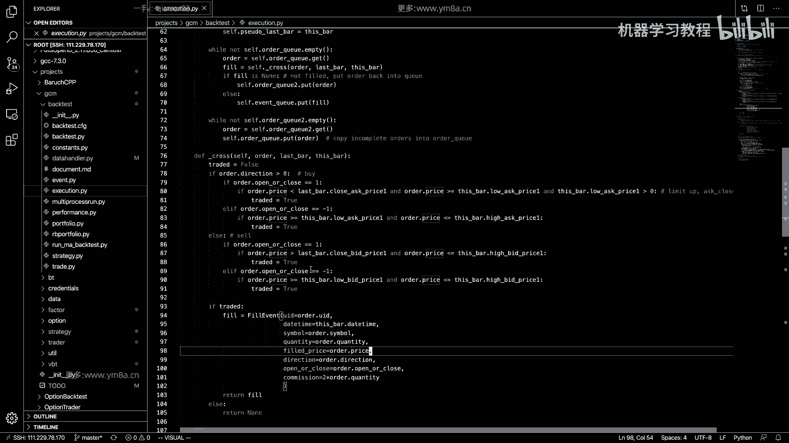

就是说我其实要做的事情就是拿行情，然后去处理去撮合我这样的和未成交的人，就是我收到这样一些order对，然后在最后force open和close，force open close的话。

其实呃就是说我现在我pfolio manager里面，还有open trade的话，我要去来把它给一个个去处理掉，就这么简单，然后呃你有哪些trade，然后一个个去处置，分别处理就行了。

然后这个时候你就可以简单一点，因为我是first close，我就直接用当前这个bar的收盘的价格，close的价格来去处理就好了，对然后对，然后这边的profit我们放到PORTFOLI面一起来讲吧。

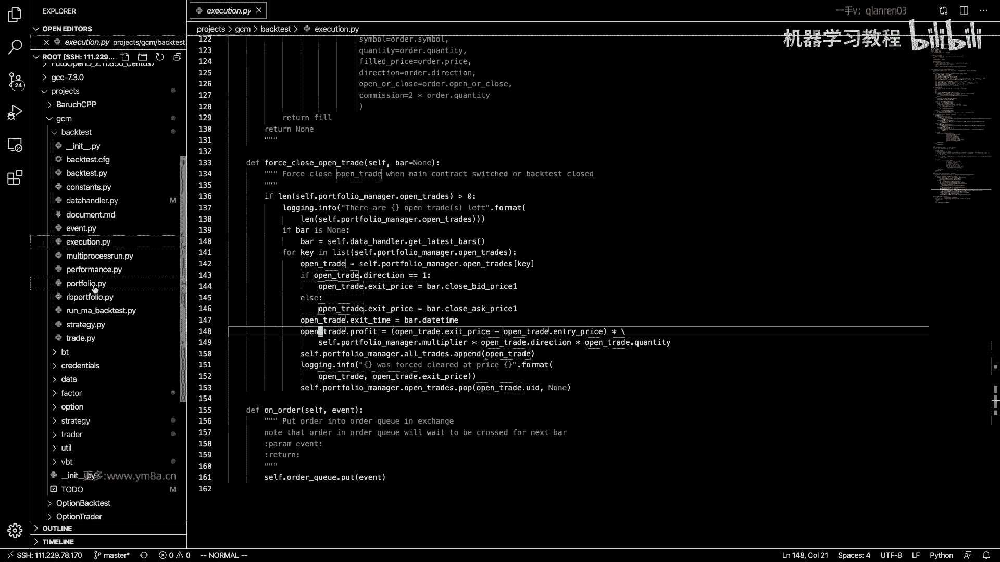

对，然后就是普folio。

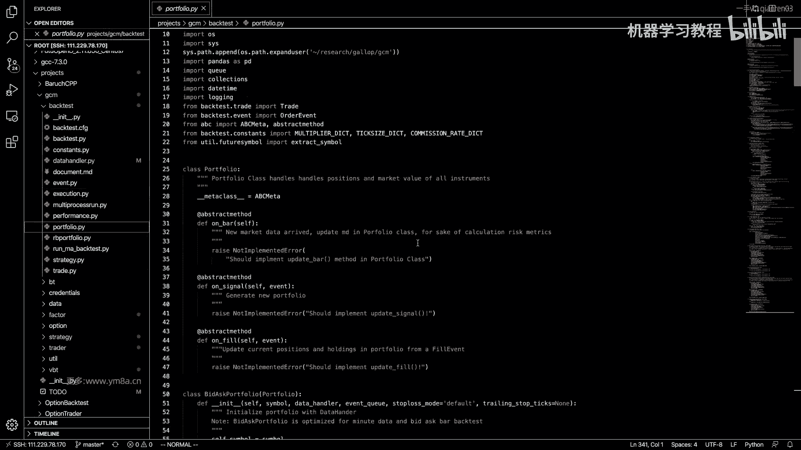

你看就是确实这个策略可能会看起来有点复杂，因为它同时会跟三个东西会去耦合，就是说我需要去更新我的market data，就是大家要注意我们所有的strategy嗯。

portfolio和execution，我们都会有on bar，就是不仅仅是data handle，因为就是说当我希望推到这样一个bar的时候，我其他这些东西也会去处理，对我我也希望我可能会去。

就是说把我的数据都会去更新，然后on signal是呃，最显然的就是说嗯我们先来看on signal吧，就是说我们收到了我们的signal more strategy里面。

怎么去把它去处理成我想要的交易的order。

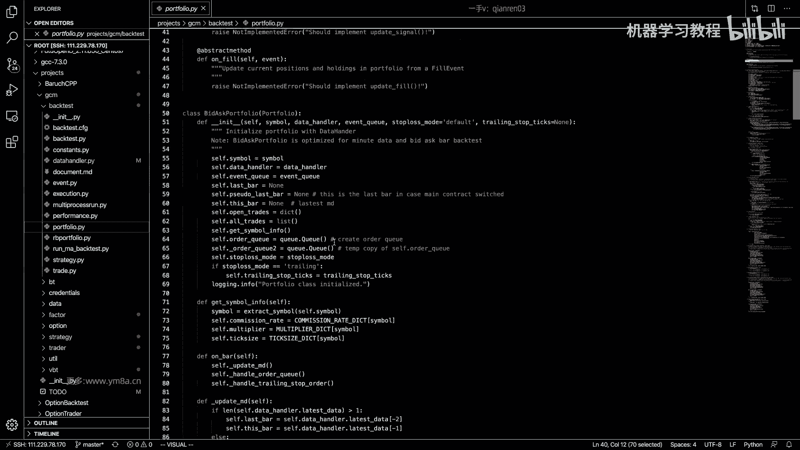

那这个里面我们我们刚开始的时候，可能就是用的呃，用的用的说是最简单的一个一个办法，就是说我去举我，我就直接就是说去生成我的呃，去生成我的order，然后这个price刚刚也有同学提到。

就是说你可以去按照你想要的方式，你用什么样的方式去下单，我觉得都是OK的，但我个人习惯我一般是用bar的这样一个呃，close的这样一个价格来去做对，就是说我我是用的。

我是用的就是close的对手价去做对，然后你去把它生成这样一个order event，然后当然要注意，就是说这个事里面就是说这是最简单的一个，咳咳，portfolio里面我去产生order一个方式。

我只根据signal的方向去来做，但事实上说你你是可以考虑，就是说嗯你去考虑一下，就是说如果你想要去，你比如说我signal是一的时候呃，我下一首我signal强度更大的时候，我是不是考虑下第二首。

那这部分，也就是说我通过这样一个generate order的函数，是给大家就是留下了这样一个open的接口。

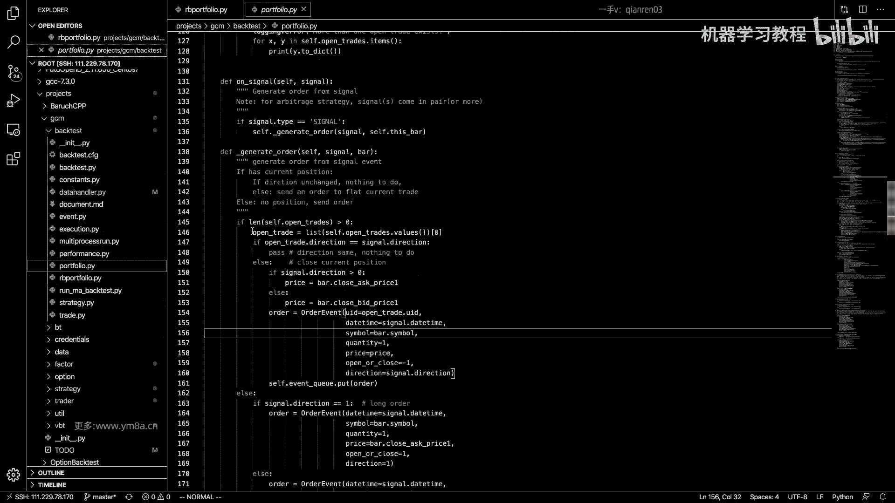

不像是说我在回测的时候，不管什么样的信号强度，我都试下相同的手术，那其实不是特别very rational，那包括你后面也要说，我如果有多个信号的时候，我怎么去来去处理这些信号。

那这部分呃不仅仅说是这这部分，我觉得就是说他是可以跟有人习惯，是把策略里面下多少首都呃，给都放到strategy里面，就放到策略里面去实现，但我就觉得其实更好的方式是说，我们每一个策略里面。

你只管你的生成逻辑，那怎么去，就是我的手术是下多少手，那你应该是放到你的portfolio里面去，去来去来去注意这件事情的对，然后就说on signal其实是说我根据我的signal方向。

我去生成我的order对，然后呃这里面要注意一个，就是说你有open trade的时候，就是说我现在已经有了一个持仓的时候，那要注意，就是说我判断我现在的方向跟持这，我持仓的方向跟信号方向是不是一致。

如果呃默认的目前就是说我方向是一致的时，Ok，那我仍然保持多，因为大家要注意是在strategy，当strategy当中，我的信号是呃，每一个每一个伴儿过来，我都会去产生信号，对。

每每有一个新的市场数据，我就不断的去计算，不断的去计算对呃，那这个时候就是要注意的是，我的data handler传递的数据，我们目前这边用的是分钟，那你如果你是tick，你是tick频率的交易。

那你可能就要去考虑去，就是是tick级别的去产生信号，那这个时候你CPU可能就会赚的赚的稍微慢一点，如果你是呃做更低频一点，5分钟，15分钟算一次，那也OK对，所以就是这个时候大家要区别。

就是说一个是你这个strategy是多少分钟，去刷新一次，但是你事实上你去交易的时候，未必是说我每个tick都去发信号，因为我可很有可能说是我觉得信号太弱，或者说信号没有变化，那我就不去交易对。

然后还要注意的是，就是这边也是也是都是可以大家自己去挑，就是你到底想要以什么样的价格去交交易的，你想要以什么样的价格去交易，然后还有千万不要忘记说你生成这样order，我们我不去直接交给我的嗯。

交易所就execution engine，我要做的事情是通通我产生了新的，我不能处理的东西，我把它扔到1BQ里面去处理，对要注意就是说你有持仓跟没有持仓，没有持仓可能简单一点，我想开多就想开空都OK对。

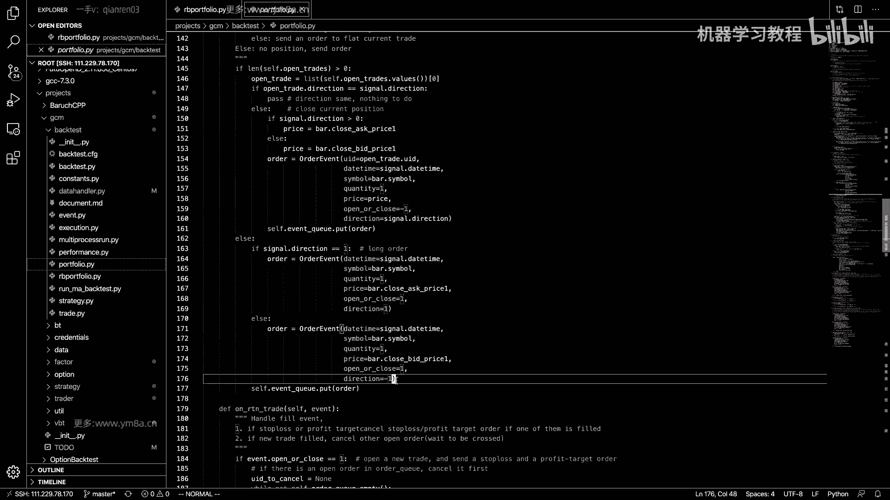

然后然后大家还要注意一个，就是说我们刚刚有提到，我收到了市场的这样一个成交。

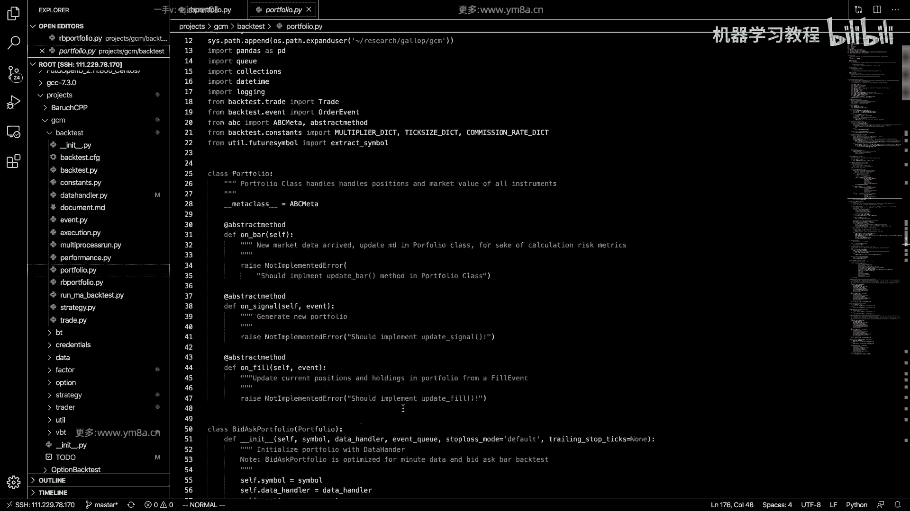

what on fill需要去怎么来处理的时候，大家注意的说，我这个时候会去维护我当前的仓位，跟我的。

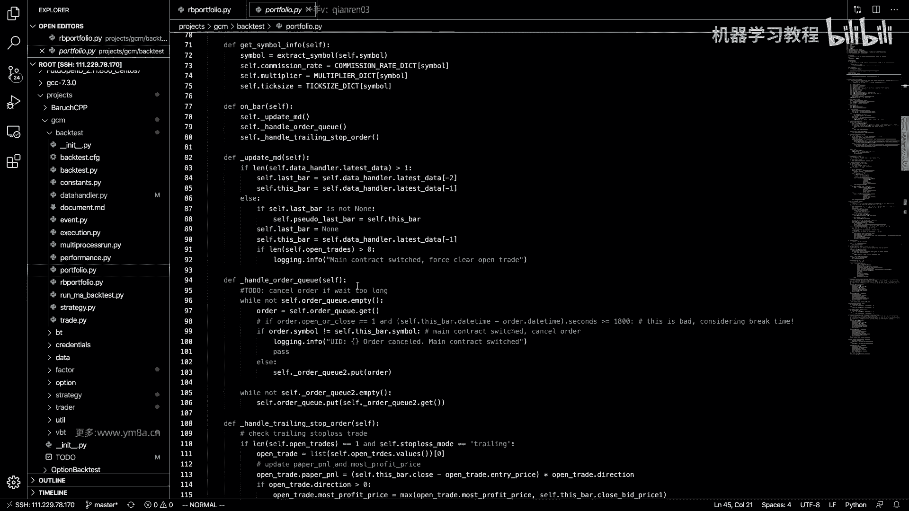

就是我现在就perform里面到底有多少东西。

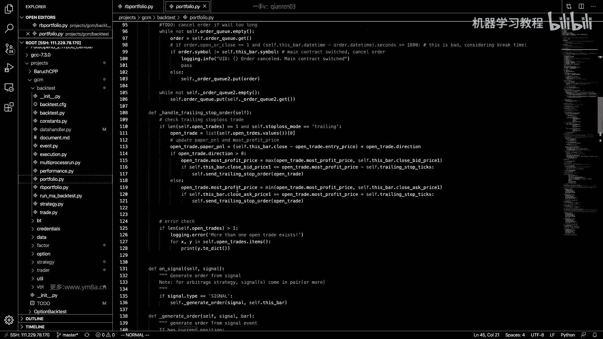

呃我们来看是对on return trade，对on return trade的话，就是嗯就是嗯这个里面就是哦，止盈跟止损的概念，我觉得就是在目前大家可以先去，不要急着去引入这样的处理。

就是我我觉得就五一节之间，那大家先去把呃我整个的流程自己去写代码，跑通了，先不要去考虑止盈跟止损，因为考虑了止盈跟止损的时候会给你的，就在你在处理的时候会多了很多很多的逻辑，你要去一一去追。

去追踪你这个订单对应的是哪一个订单，然后你要去判断呃当前的价格的变动，然后来去判断我是不是该止盈跟止损，甚至你还有叫移动止盈跟移动止损，就是说如果你现在就把这个功能加进去的话，可能会有点麻烦。

那我个人建议就是说，现在大家可能先去不要去做。

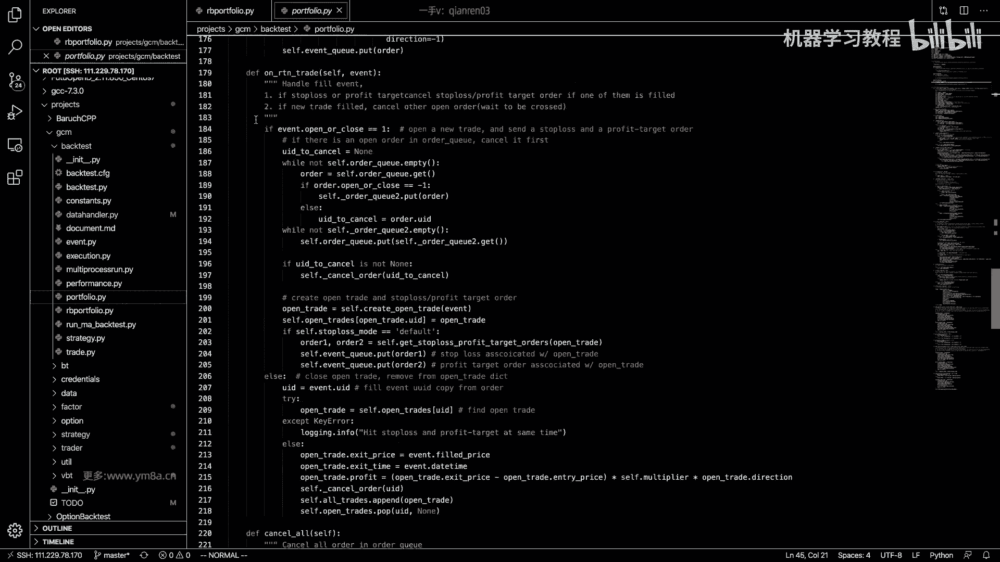

我就是止盈止损这样的事情，对你你要做的事情，就是说嗯呃就是我们其实要简单，就是说呃你你我们先不考虑止盈止损，我们就是说有了这样open呃open trade之后，你你可能就是把它去记录下来就OK了。

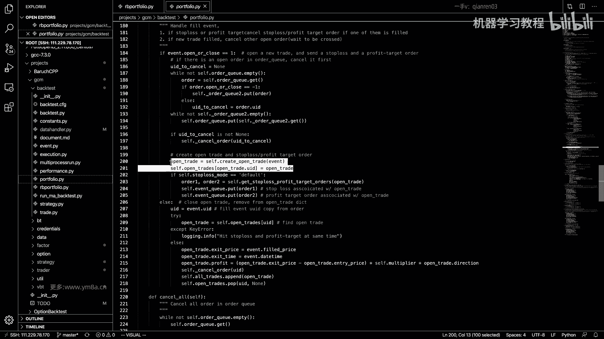

你现在就是说我我收到了这样一个成交回报，然后如果我是开仓的话，我就有一个open trade，对create open trade，然后你把它加到我这样的一个self。

这样的一个dictionary里面，我的dictionary是我给每一个交易产生的，唯一的一个unit诶，就是你一个id对，然后如果我收的，然后我收到成交，但同时我这个时候是平仓的话。

那就说明我之前有一个open trade的话，我需要去把它给需要去给他，把他给呃，去把它给平掉，对那那那注意的事情就是说嗯嗯就是然后啊，那那你在评价的时候，其实我们我们要做的一个事情。

就是说我需要把我这个trade的退出时间，跟推出的价格都给记录下来，然后我这样就才能形成一笔完整的，从开仓到平仓的价格，然后包括我这笔单子产生的利润，也都把它保存下来。

而这个时候你就是可以把它保存到你的ORTRADE，这样的一个这样的一个attribute里面，那这样做的方式是说等我们回测完成了之后，我就有了整个我历史上每一笔的开仓跟平仓，然后我刚刚有提到。

是说在刚开始就是说回撤到最后一个bar，我们为什么要用force close open trade，是因为我们需要所有的trade，就是所有的多空是一一去对应的，那只有这样。

我们才能去分析我们的这样的or trades对。

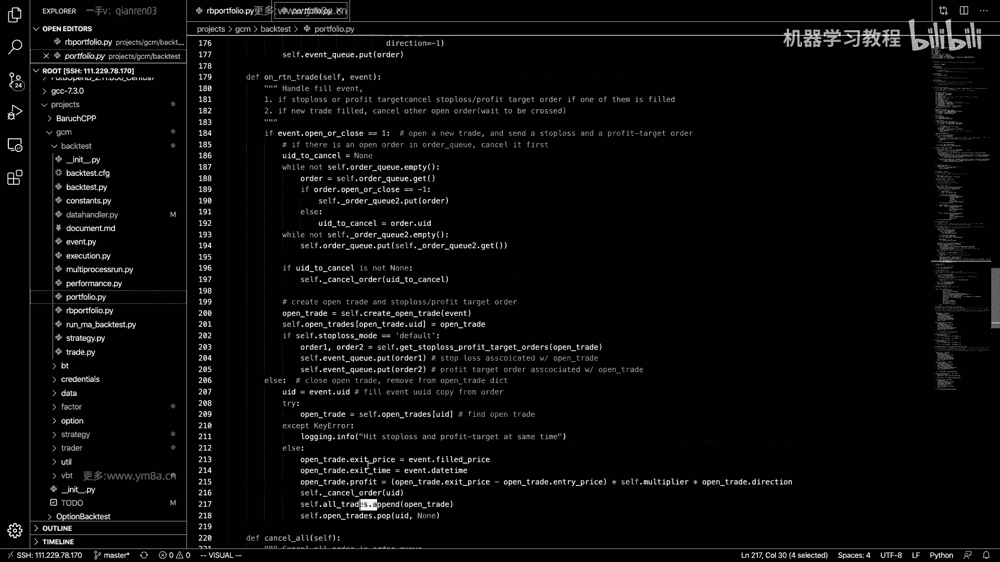

所以他要做的事情就是PERFORMNIO，最核心的功能是两个，一个是根据我们的signal去产生这样的order，然后另外一个是根据我们的这，根据我们的开平仓的这样一个记录，我们去来去呃。

就开平仓收到了这样一个成交的event，我们去来去判断，去来去记录我们的成交的这些点位是什么，对对如果大家想要去嗯。

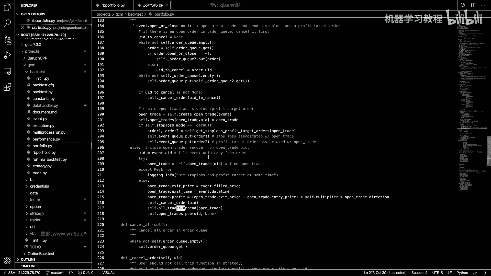

其实说想要去看那个stop loss跟profit简单提一下，其实也没有很麻烦，你唯一要做的事情是，因为我每一个trader里面，其实都已经记录下来了，呃这样的一个呃记录了记录了下来，这样的一个呃。

我进入了价格，然后你可以根据你自己去定义一个止盈，止损的函数，你去挂两个止盈跟止损单对，但其实你把止盈止损单再放到队列里面去，放到我的这个event q里面去，其实也就OK了。

只不过就是说哼会有tricky的一点，就是说嗯当我的止盈单成交的时候，事实上我的止损单应该被cancel掉，因为我不可能止盈跟止损同时去呃，哦那那那个止盈止盈跟止损的单子，不可能同时去成交，对。

那就这里面其实是就是大家处理的时候，我觉得也没有什么特别麻烦，特别就是嗯难以理解的事情。

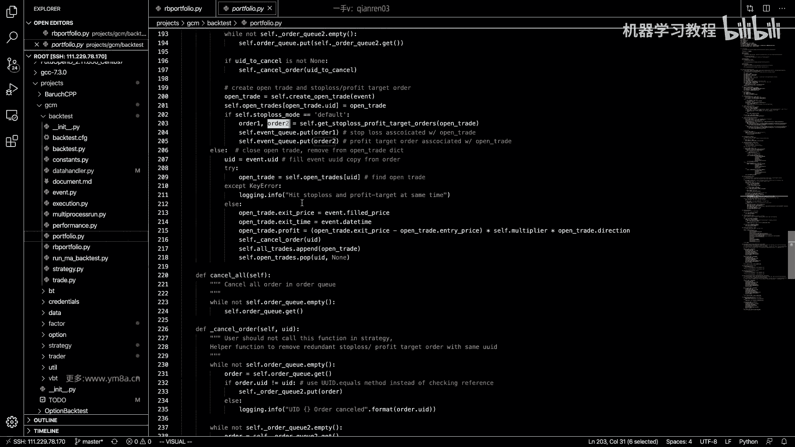

但唯一要做的事情就是说你要去嗯，去小心去处理一下你的这些逻辑对，就是说当我有了止盈止止盈单的时候。

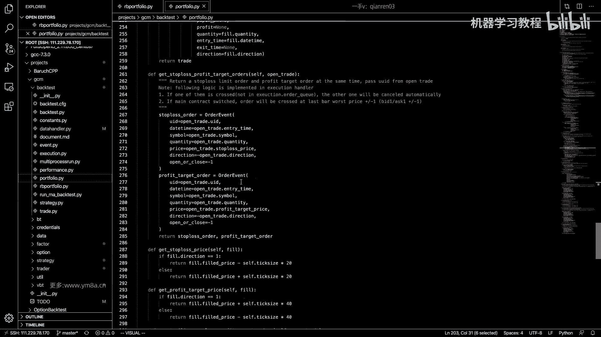

那止盈单被成交的时候，我的止损单需要去怎么处理，然后以及说啊trailing stop loss profit target order，就是说他就是这个简单来说呃，我创下了新高，又回撤了一点。

再创了新高，那那我可能说我我我止呃，或者说我创我止损的时候。

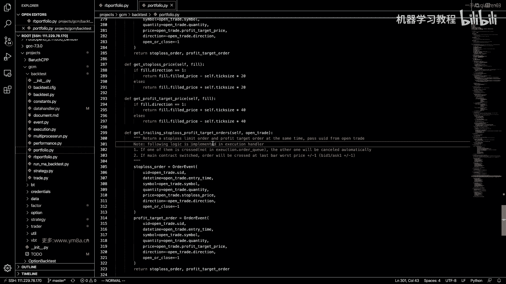

我并不是说，好OK我给大家画一个图，应该就可能好理解一点，就是说比如说我有这样一个呃20个点的，20个点，stop loss这样一个策略，那那这样做的事情，Stop plus，那比如说从零。

那这样这样的，所以这样一个比如说这个是3570，然后打到了3550，在20个点，Stop plus，我在这边是long，就成交了一手多一，那我在这边的时候，我就会被触发我的止损，对这个是OK的。

然后然后移动止损的意思是什么嘞，就说我们真实交易的时候，我可能有一笔trade做的非常好，也是353570进去啊，Sorry，我刚刚应该把这个网这个拖到这边一点，对我也是35700价格进入嗯。

OK放到这儿吧，或者是，我们333530的价格进入，就是我这个时候多一手，然后他很开心的，就是说OK我我同样我这时候没有设止盈啊，我只设了止损，然后他到了3550，然后接下来又有一些小的波动。

他到了3580呃，3580，OK这里面30个点，这样这边总共50个点，那到这个时候，就这个时候可能会出现情节的时候，就是大家去观察罗文刚的数据，很有可能就说我一天涨的都很好，烫了，我一盘哇。

直接跳水几十个点，那然后到了这3510，按照我的止损的机制，OK我终于在这去成交了，就是3510，也就说我按照亏20个点，也就亏200块钱这一手出场，但事实上说我希望做的事情是我从高点。

任意一个高点回撤20个点的时候，我应该在这个地方就把它止损，这个叫trailing stop loss，我从我我从我从3580，当我价格打到3560的时候，我这个时候就应该不计一切代价去退出了。

所以通过training stop loss，就是说，我避免了我从赚钱赚很多钱到还回到亏钱，这样一个过程。

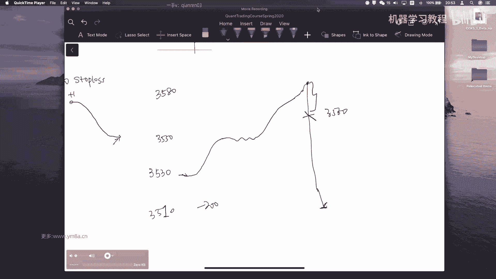

所以简单来说就是那这个时候呃，这个要处理的逻辑呢，其实嗯对这处理其实本质上来说。

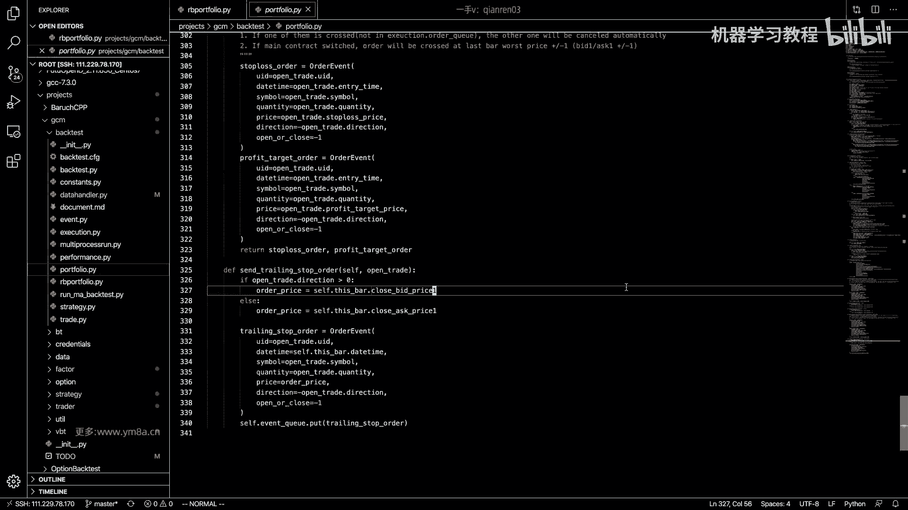

你不管是train stop plus和那个的话，你每次要做的事情，就是说你根据你当前的市场价格，去更新我止盈止损价格的单位，这是这是最核心的东西，对根据当前的你的单子的价格。

根据当时是根据当前市场的价格，你不断去更新你止盈止损单的。

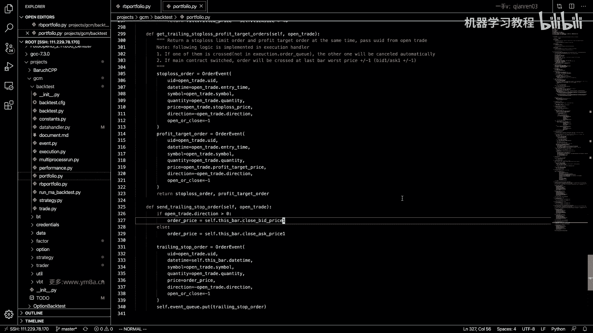

两个单子的挂单价格就OK了，这是所有你止盈止损方式这样一个核心对，无非说是我stop plus跟嗯PROFETARGET，我没有用这种滚动的方式，它只是一个固定的价格，比如说这个是20个点止盈呃。

呃20个点止损，40个点止盈，但是我在training的时候。

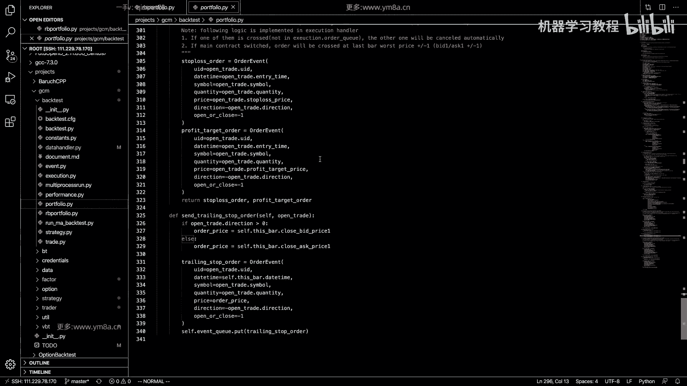

我是要去考虑我这样的一个价格对，所以所以就就是说我要去根据。

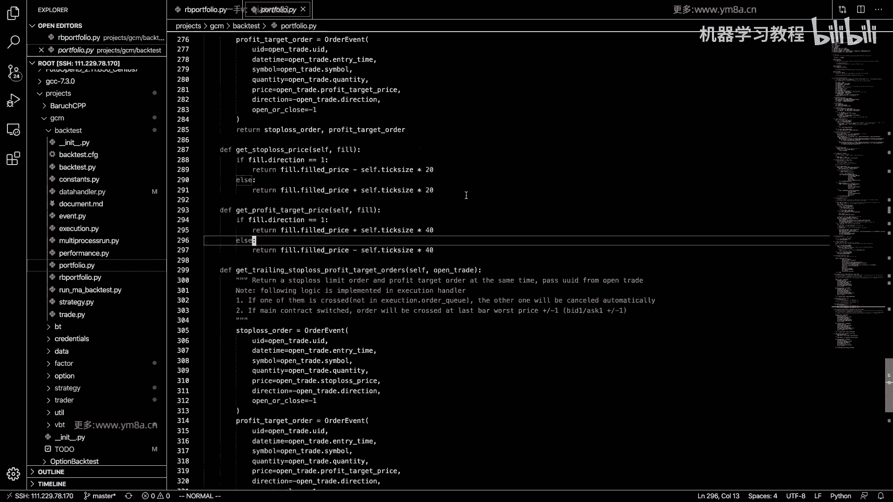

我当前市场价格去考虑，所以回到这儿来还说呃，就是到目前为止，整个portfolio这一块，我不知道大家有没有有一个，相对来说比较基本的这样一个概念，然后以及就是说嗯这个cancel order的话哦。

对我们现在可能暂时不选，你不需要去做这样的事情，就是说我策略里面不会去呃，涉及主动去设计cancel的。

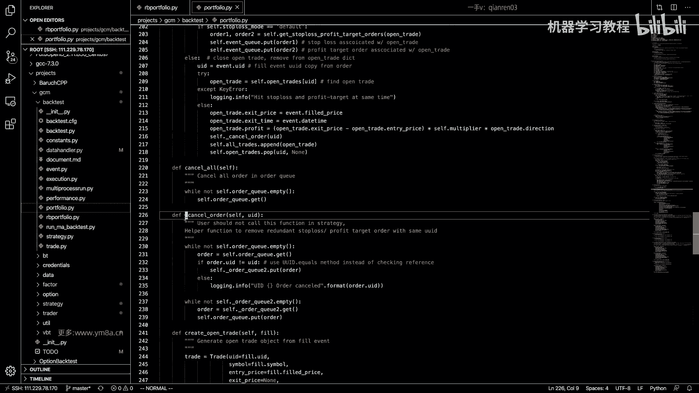

我，我用这个下划线开始的访问函数，表示这个是class name，你不应该去主动去访问的这样一个函数。

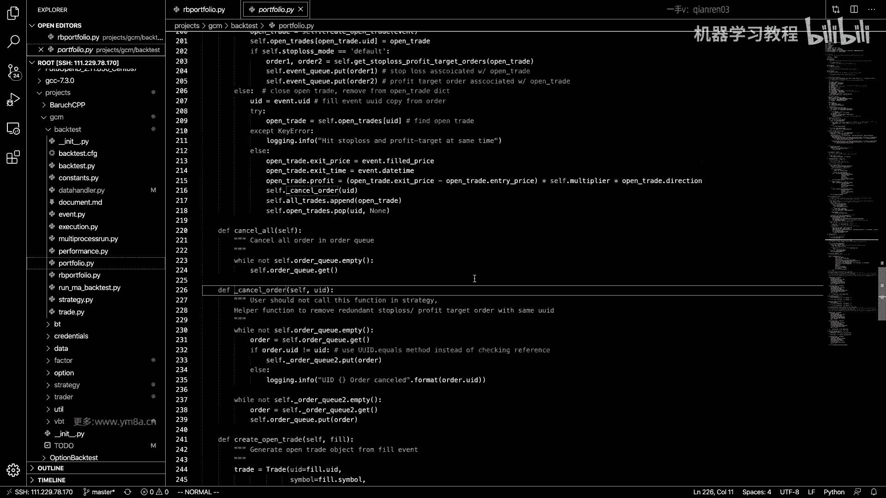

对，就是说我们我们会在其他地方会去去。

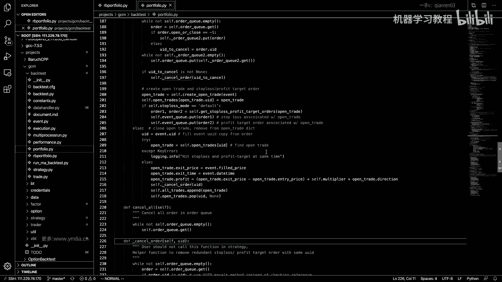

就是其他地方会去处理这样一个事情，对其实要做的事情就是说呃我有了哎，其实我刚刚有提到，就是你止盈止损一个成交的话，你把另外一个要开锁的去删掉就好了。

然后你可能中间你如果你是trading stop plus，你可能不断的再去改的，赶你的这个成交的价格对，OK所以到目前为止，整个PFOLIO这个大家我我我也没有给大家讲，给讲清楚，对呃实现起来的话。

其实对我到最后最后300多行其实也还OK，五一节我觉得大家不少时间的话，可以把整个系统给给给写下来，对对这，这这部分就是说是怎么来去处理这样一个stop呃，就是我滚动的止盈和止损的这样一个重写。

然因为如果我是要把这个代码一行行过过去，细节可能会比较麻烦，然后我建议大家是说是你，我们先把最简单的系统跑起来，然后如果一切都正常的话，然后我们再去不断的给他去加止盈，然后再去加滚动止盈止损的功能对。

然后我建议大家还是先去可以去想一想，这个过程到底怎么回事，其实写起来就没有那么麻烦了，然后如果直接把这个代码跑一遍，可能很多人我估计都不会去看，代码里写的到底是什么对，所以所以我的建议是说。

就比如说这些东西我可能都没有给大家。

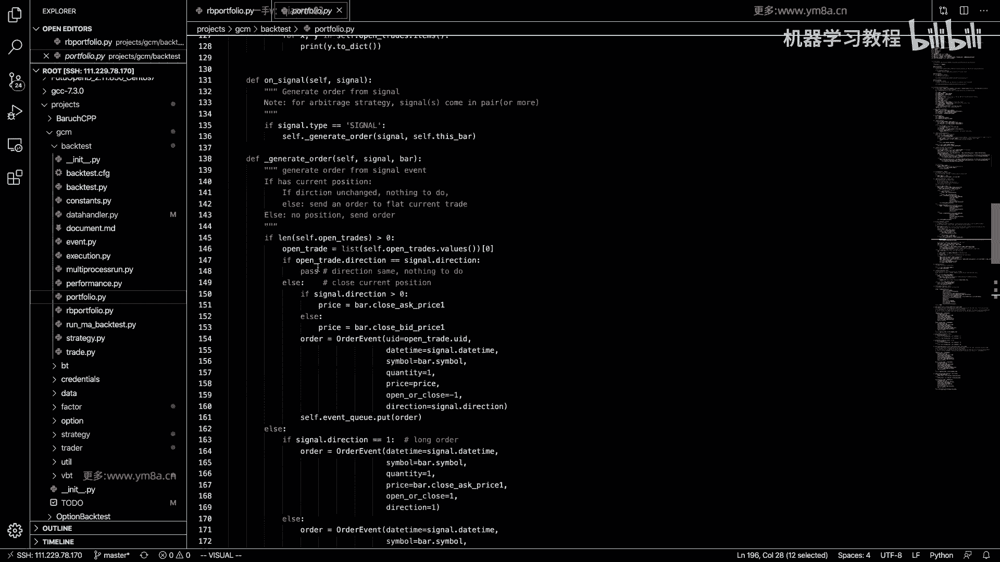

就是怎么这个order是怎么产生产生的，然后这个细节包括这些方向，这些什么东西，我我我都是把接口留给了大家。

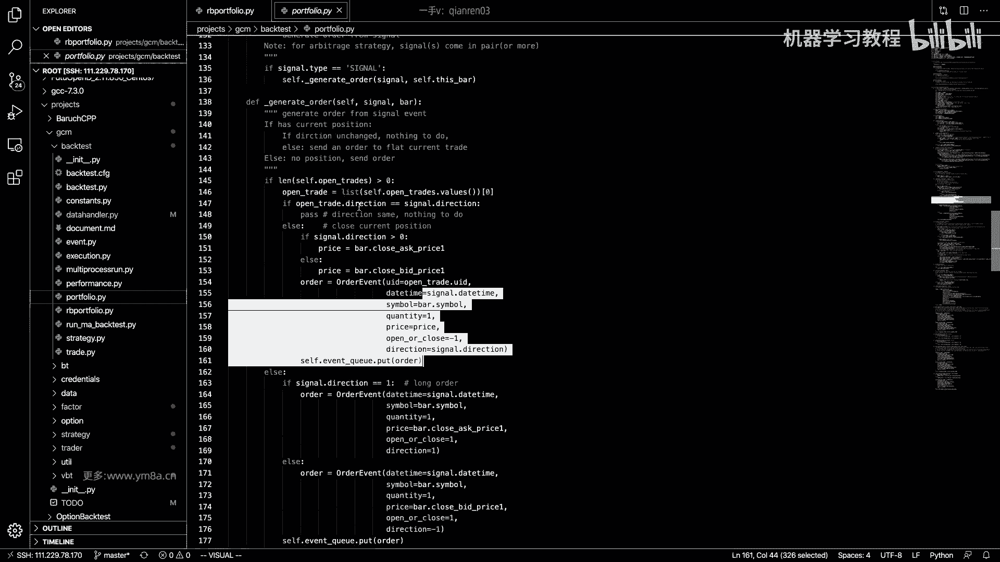

但是希望大家自己去实现的，然后如果是觉得实在有困难，那视频也都可以找到对应的记录对了。

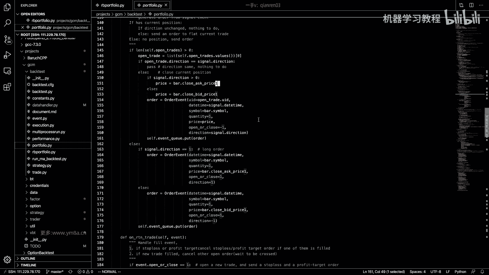

OK所以其实就是说最核心的，我们刚才想想啊，我们再回顾一下整个过程，我们从data handle了。

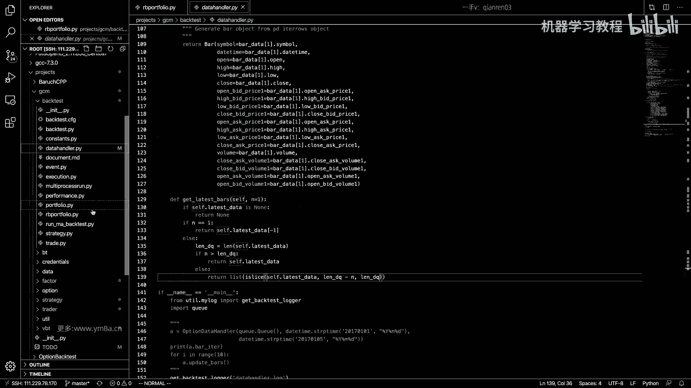

然后讲到strategy，然后讲到我们的execution。

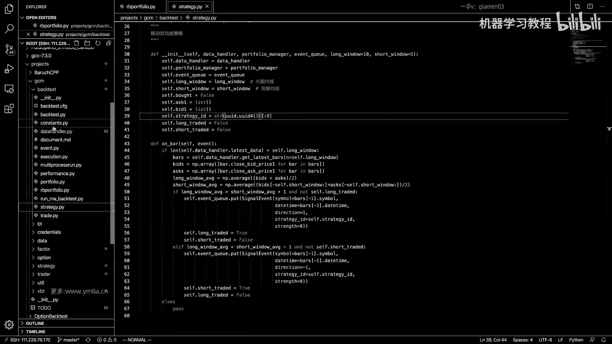

然后再讲到我们的portfolio，其实这就整个这四个核心的类对。

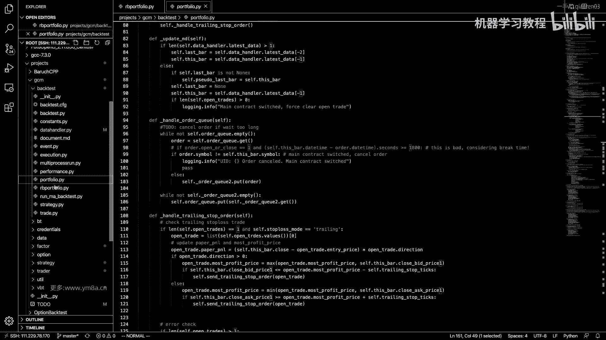

然后你再去，然后其实我跑下来的时候也就OK对，然后然后注意这边就是说我自己的这个，这个简单的这样一个demo的时候。

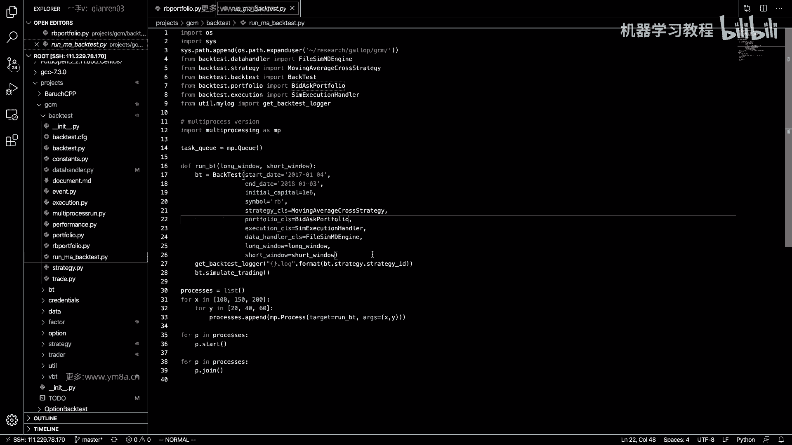

在测的时候，我相当于说我嗯back test，当然刚开始可能还要对。

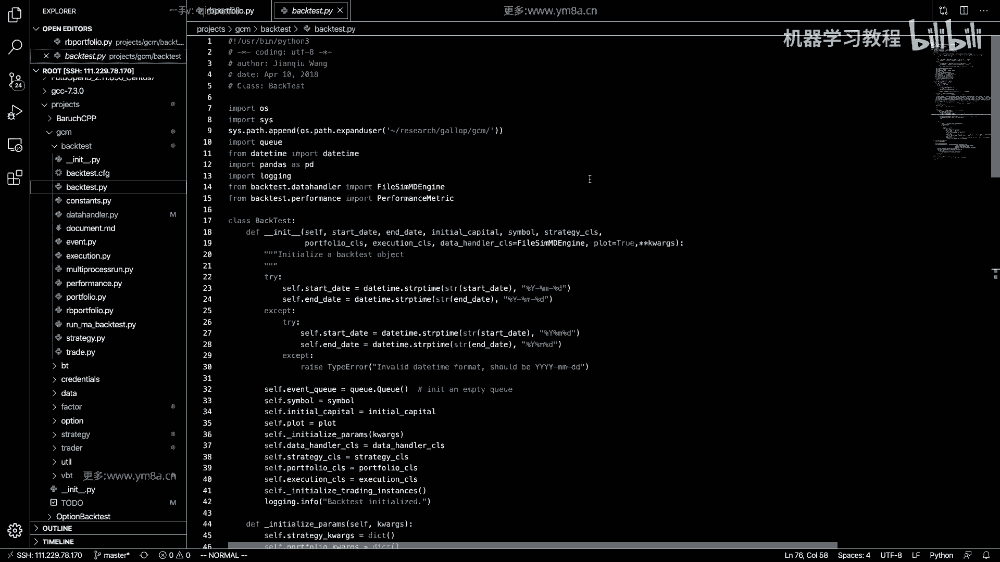

还要讲一下，就是我们现在怎么把这四块给整合到一起，那我要做的事情是一样的，我每我有一个BTEST类，我每次要去给他输入我的策略，起始回测时间，然后你输入你的capital，你想要测什么样的标的。

然后你的strategy class是什么，然后portfolio要注意说，我们刚刚有提到说我可以有不同的成交方式，我也有可以有不同的PROFOO的方式，所以通过这种方式，我可以给他就给我的策略去尝试。

说去给他去不同的组合对，然后你可以，然后就是这个这个是这个，这个这个就是arguments，是可以，我可以keyword arguments，我们是希望可以把策略参数参数给传进去。

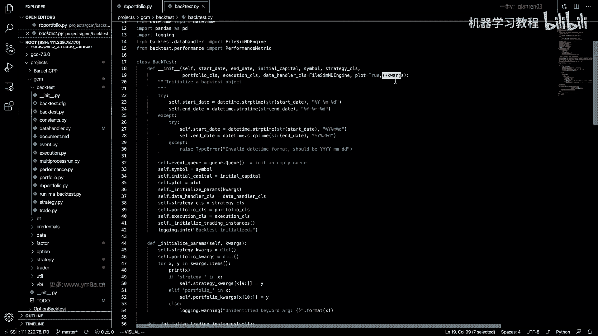

然后要刚开始要做的事情的时候，我们需要把我们initial initialize，这样一个trading instance，就是说我把我的portfolio dead handler。

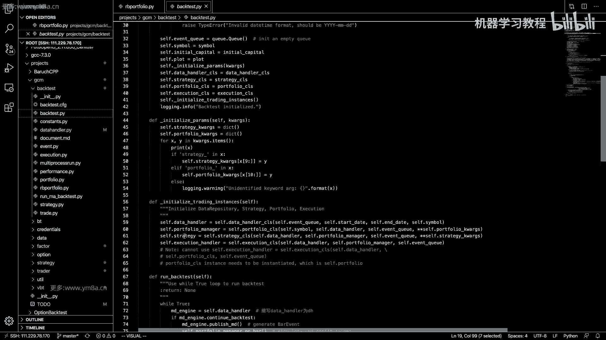

巴拉巴拉这些东西全部去都初始化，而初始化之后我们再去call我们的run back test。

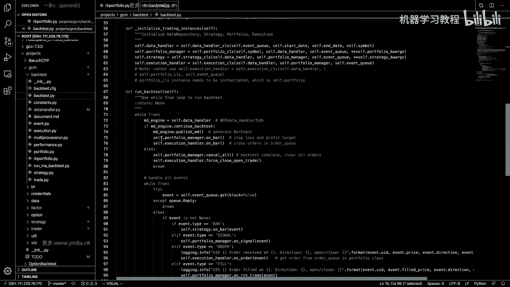

让我们的每一个这样的一个class，都去去处理这样的事情，然后你再去把整个的一个跑完，跑完之后你就可以得到这样一个performance对。

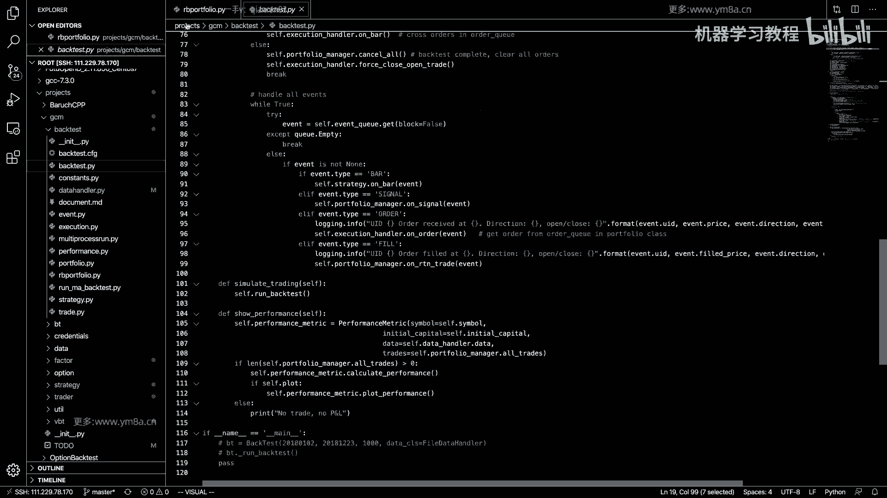

然后如果说我有多个参数的话，这边对的，这这个是什么意思呢，就是说这个这个其实是说我们不是说了，我们计算机有多个CPU吗。

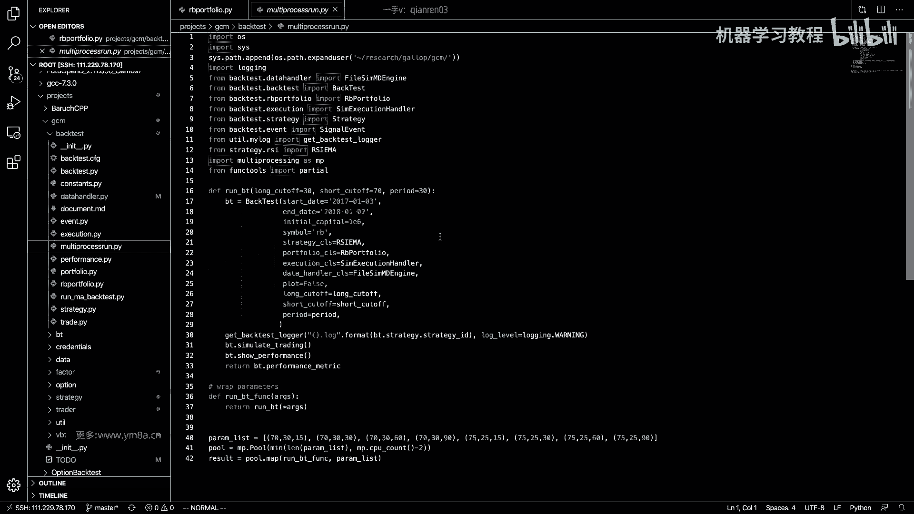

然后我我不想说一次等几个参数，那一一就是一个参数，一组一组测，那我可以用这种方式，就是用用mt就用multiprocessor这种方式，我可以让我的CPU通知12345678对，这是八个八个策略呃。

一个策略八个参数，然后一次性让他就去跑，然后我注意这个是这面对，然后我想的是CPU不要全用，给我留两个CPU做点其他的事情对，然后你就可以让它你的整个back test去跑起来了。

跑完之后你然后你在plot里面，你然后我们又讲到了各种各样的绩效分析，在performance，然后第一节课的话应该也呃。

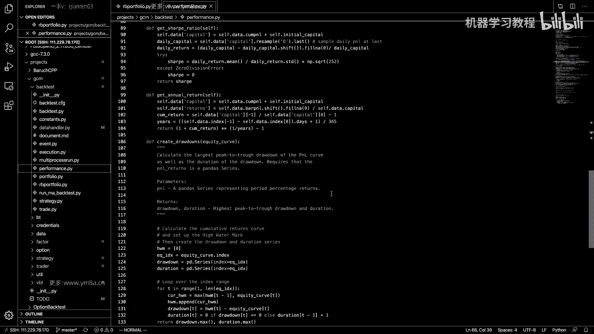

这个之后我们会详细的去讲。

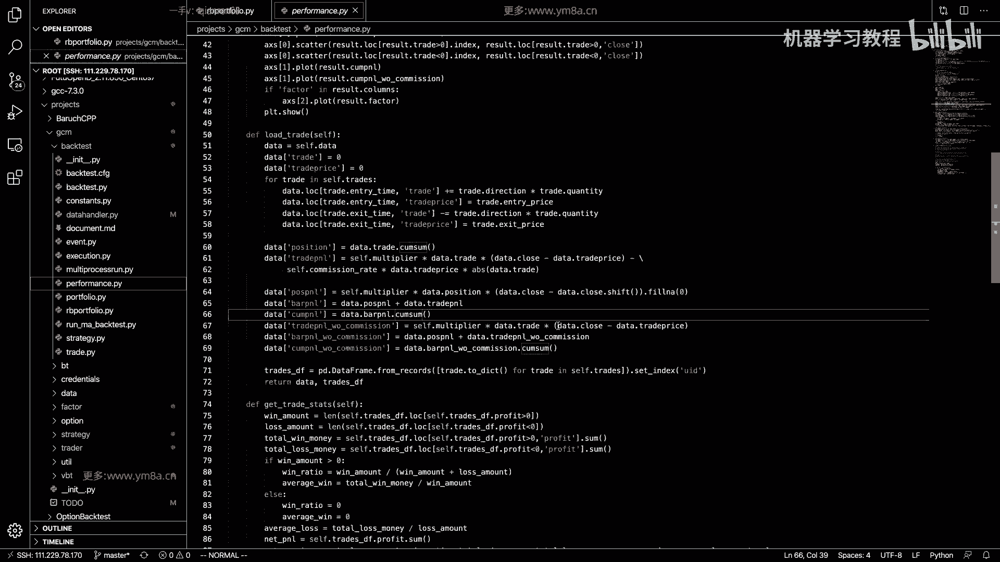

怎么去评估一个策略，然后这块应该是大家都是熟悉的。

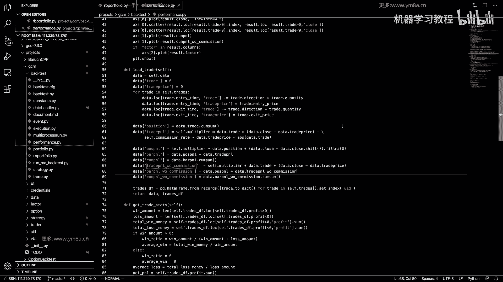

对我们上一节课已经做完了，我们把我们的整个trader load进来，然后怎么去额评估策略的话。

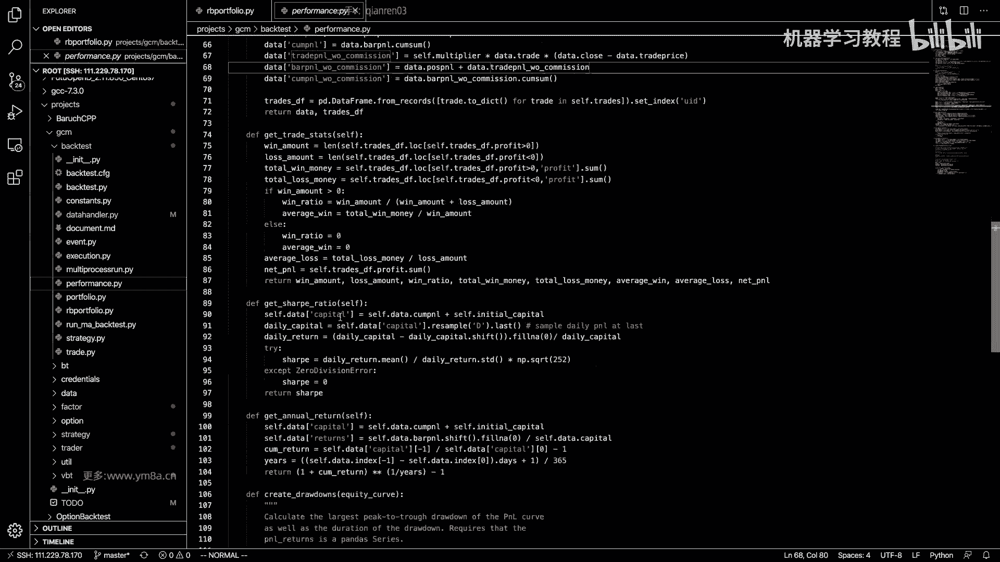

其实这边只用了一些简单的，就是说呃我的胜率啊，就我赢多少次，然后我每一笔的平均平均损失，然后快速盈利，然后我总的PNL对，然后然后我的shap ratio，就sharp paratio这个概念。

大家可以看他就是说其实就是我的收益率，就是年化的这样一个收益率减去我的额，减去我的无风险收益率，再除以这样一个波动率的标准差对，然后年化收益，然后包括计算最大回撤，大家还记得我们第一次咳咳嗯。

作业里面有提到怎么去计算一个就是最大回撤，就是从high watermark，然后回车到这样一个相对低点，我们怎么去计算这样的一个最大值，其实对挺简单的这样一个function，但实际上看到那个题目。

是我自己在面试别人的时候呃，就是扣做code test，其实刚开始的时候都会去问大家，然后可能很多人都不会说，直接用简单的就说呃一个follow p搞定，肯定有人会做几个follow。

做223个follow p对，那那这个时候就能看出大家的水平了，以及就是说如果说你真的是做过矿trading的，实习的时候，那这个东西除了去掉包，有没有自己去想过可以有优化的空间，对的好。

所以到目前为止是说dg test这个模块，我们前前后后花了比较多的时间哈。

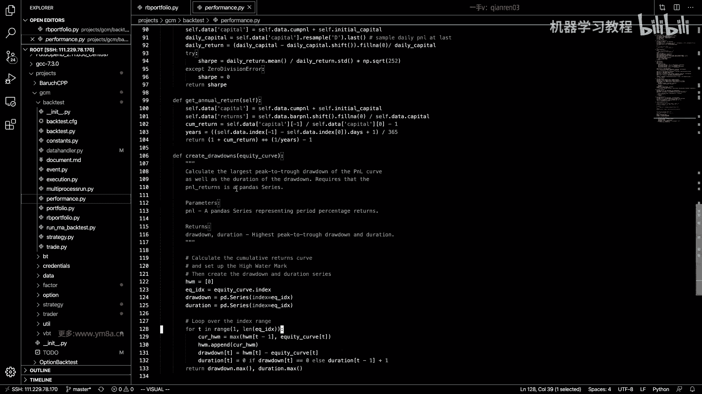

差不多是4。5个小时，就是我给大家初步的介绍就这么多了，现在就是大家对于整个回测这一块，有没有就是有没有什么问题呢。

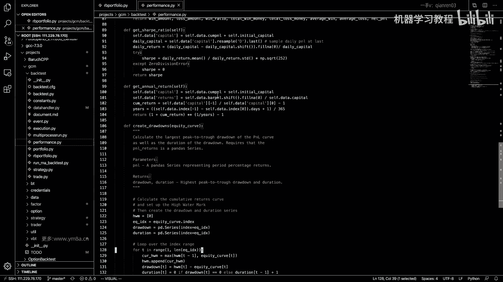

对我给留一点时间给大家。

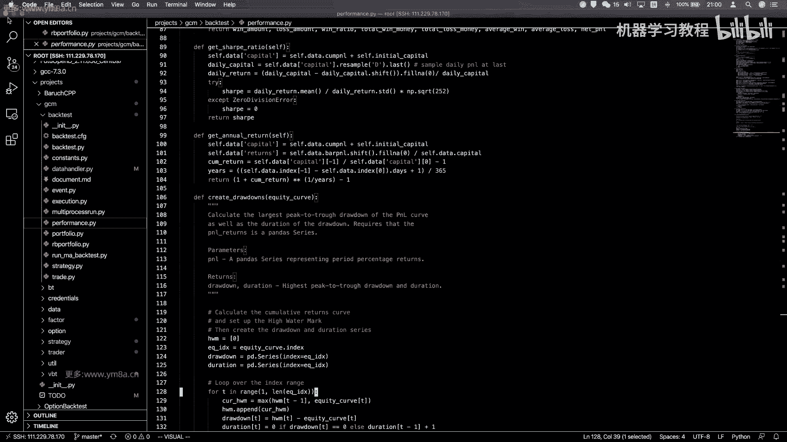

除了刚刚那个撮合的那个部分，对我我的建议是说，你刚开始，一方面我们我就是说给大家的建议是说，我们在实现这个event driven的back testing的时候，因为可能东西比较多嘛。

然后我的建议是我们先参照上一节课，我们先用下一根bar的open或者是close，你自己选择来去来去去撮合一成交先，或者说你你就能够做到，我用event driven回测下来的结果。

跟我上一节课用VECTORIZE下来回测结果是一样的，这是我给大家的建议，因为刚开始你去处理这么多东西了，还要去考虑是不是奥斯卡是不是B的，可能会有点overwhelmed。

所以说先大家先还是按照最简单的逻辑，我先把这个里面回测下的结果，是跟我上一次回测的结果是一致，跟excel当中是一致的，对哦哦不一定能跟excel当中能做到一致，因为excel我们用的是当前的cos对。

那就是说用这种一般追问的方式，其实我们最想做的事情，就是说我去避免look head bias，比如说当我用到了太多的，就我不小心就是说用了未来的价格，去信心就去处理我的策略。

去产生这样的order的话，那可能做下来，就说你看起来这个策略赚了很多钱，但时尚事实上在现实生活当中，是永远不可能去赚到钱，因为你在这一分钟，你永远拿不到下一分钟的价格，对用这种方式。

用event event aq的方式，我们可以去避免这个，我是觉得是这是他的第一个优点，第二个优点就是说我可以在每个部分去，可以自行的去给它加不同各样的各种各样的function。

然后我甚至说未来我想做呃套利类的策略，那我其实也可以基于这样的class去改，包括我们的option trading，我想要在同一个呃data handler，我在同一个时间的时候。

我推的不仅仅是一个板，我想要的是multiple bar，因为我们要知道就是期权。

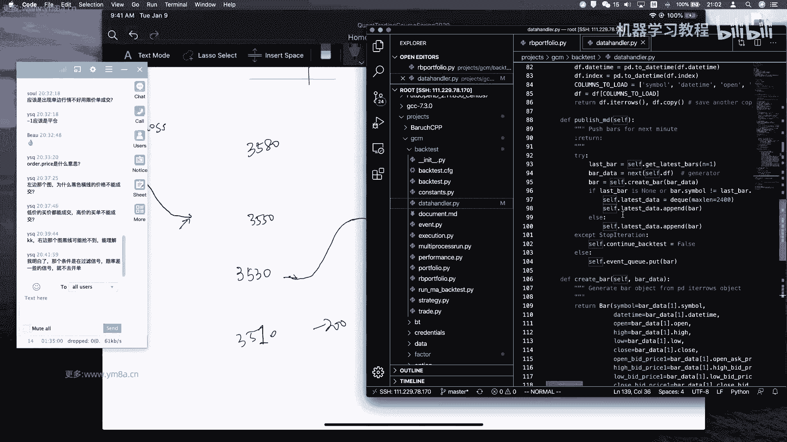

我们做波动率交易的时候是同一个时间内，你市场更新的是100多个合约的信息，那你这边要做的事情就不是推一个板，那你可能推的是multiple，就是很多很多个班，对你把你的班按照时间去分类。

所以说这样一个基本的框架，它是具有可拓展性，这样一个非常明显的这样一个优势，对，然后以及说你然后对，我觉得这个可能是它更重要的一个优点，但可能性能上的时候可能会有问题，所以我最近在做的事情。

其实也是把这套东西在有在用C加加去改之前，用C加加写过一个版本对，然后现在觉得就是说那一块，之前写的代码确实不是很好，最近又在花时间去把它去重构，但是Python这个版本我觉得还是OK的对。

所以呃到这一块的话，大家有没有什么问题呢，就是back tastic模块噢，我还是希望大家就是说嗯，哪怕我首先建议是不要用现成的，因为用现成的话，你可能都不知道，这个就是说包括大家看我的代码。

就觉得看了哎，好像就这样子，但自己我觉得只有自己去写起来，你才知道这一块里面到底是什么样的事情，对就呃看一遍还是挺简单的，但是写起来的话肯定会知道为什么是这个弦，那个弦。

所以建议大家还是要动手自己去写一下，嗯嗯因为大家有上一课，应该我把很多东西都给到大家了，就是就是所有的接口，基本上接口都保留了，然后就是大家要去实现里面的function。

呃这边提到low ask price是ask price，最低价的最小值嗯，对大家注意就是嗯哦我应该有提到，就是说我在合成bar的时候，我没有用单纯的clothes嗯。

就是就是我觉得close是可以用啊，然后就是说这一部分就是说，因为我这个是挂单类型的策略，我挂单的话是希望去拿对接方的盘口去吃，然后low ask price是ask price的最低价的最小值。

它它就是最低价或者是最小值，对，也因为ask price，就是说，我们我们我们只有，就是说我们每个还回到，我们最刚开始这个数据的盘口，我们bit跟ask我们只有ask one ask t哎。

就是我们有五档的盘口，但事实上我们现在你没有就是正常的接口，你只能拿到一档的盘口，你就是ask one和bone对，所以ask ask one的话。

你要做的事情就是那你ask low ask question，你就是说你整个我这一分钟之内出现了，120个low ask，一百一百二十个ask ask，我取一个最小值就是low assone对吧。

或者叫最小值，whatever对嗯，我还是建议大家就是自己去写一下，我给大家发的代码，就是我应就是因为有同学提到就是C加加，那个就是上次作业可能有点有C加加作业，大家觉得有点懵。

然后所以这次呢就是给大家降低了很多的难度，就把所有的东西接口都保留下来了，就但是理论上来说，我我觉得最好的方式去如何去深入理解，这样的事情，就是说抛开我的代码，大家自己从一张白纸开始去把整个过程理下来。

然后自己从0~1去写下这样代码，那毕竟这个代码也是我自己从0~1去写出来，也没有去呃，就是这个这个参照的原型，我可以把那个一系列教程发给大家，是其实是有参照的原型的，对，就是是一个叫框star。

这样一个网站上面给的这样一个框架，我们觉得还OK，但事实上也有很多人把这样的框架做下来了，但我觉得就是说呃，后面想要去实现什么样的功能，完全是就是大家自己要去去实现下来的，你自己写完之后觉得才有感觉对。

包括说之前的设计，别人设计有哪些不合理的地方，你自己想去修改，我也不能说我这个框架是完美的，但是就是说那你们可能写到后面也会发现，觉得我这个里面会有各种各样的问题对，但至少说这套框架是我们自己嗯。

那当然跟公司的可能会有一些区别，因为毕竟又过了这么长时间对，所以嗯但是市场上我们在公司的时候，也是用基于这样的框架去做这样的策略对，并且策略也是在实盘上去跑的，所以所以说他至少来说是经过我们嗯。

真金白银的去检验的，所以说呃对，也希望就是大家不要去把代码去外传。

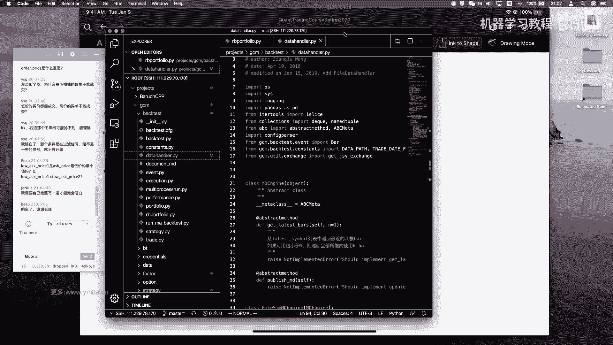

虽然说没有用公式代码，也是我自己重新又写了一套，但是毕竟是会有一些相似对嗯，所以到回测这一块，我们基本上就OK了，其实回测嗯这个东西呢说重要也不重要，可能刚开始做量化投资人。

所以量化投资人觉得刚开始哎呀，这个东西是就说你这个回测怎么做，可能有各种各样的框架都懵了，但我觉得说不要想那么多，先自己做一套跑起来对，就是说你只有自己在跑起来的时候才会，你可能会知道有各种各样的优点。

事实上我我们刚开始的时候也是说哎，我记得是16年吧，在学校的时候看到诶优矿和油铀矿搞起来了，然后什么装一矿的，包括美国那个哼啊那个那个叫呃whatever，完了那个网站很久没有用了，就是其实join框。

优框和rice框刚开始都是参考呃，美国的那一个一个网站网站，然后去把他们的这样的灰色引擎去慢慢去呃，去摘下来去摘抄，然后再去改写，慢慢形成他们现在有的样子，对对狂投ING，谢谢这位同学对。

确实真的是很久没有用，它刚开始的时候我都惊呆了，我说哎怎么狂脱皮，还能这样，但事实上可能说当时是因为学生不知道，就说原来业界，其实事实上就是每呃可以这边多给大家讲一讲，每一个公司里面都会有他自己用的。

这样的一个回测框架，事实上呃有的公司要做的，我的竞争优势是说我可以做高频的tick的回测，对，就是我会保证我的回测跟市场尽可能的去撮合，那如果说嗯就是说我会去根据我的延迟去实时。

还会去改进我的这样一个的回测系统，那这部分就是说我就是，这也是我不建议大家说，直接从市面上选取任何一个框架，直接开始自己动手做起来，就是直接去用它来去帮回测，那这样这是很危险的，因为你不能保证你的回测。

跟实盘用的是同一个东西，对事实上你把你自己的策略托管到第三方。

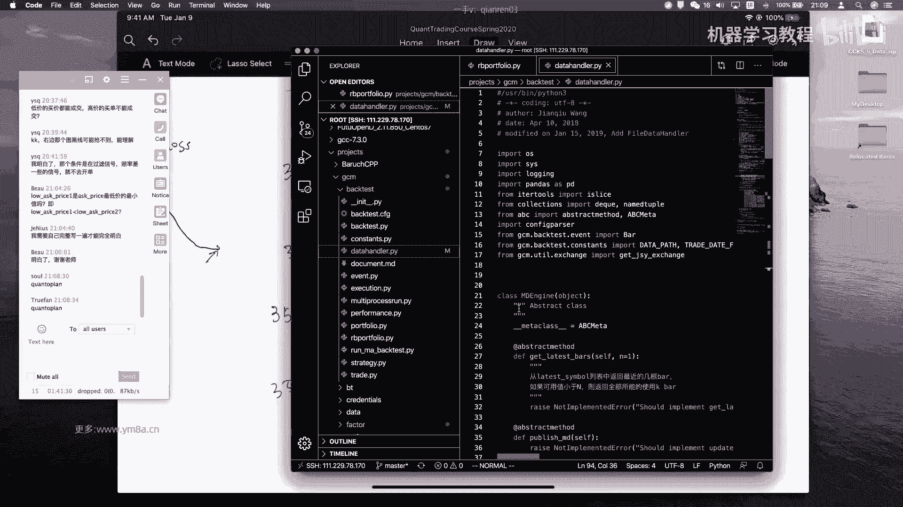

我觉得也是相对来说是比较危险的，这样一个事情，对嗯嗯所以有可能的话，那就如果是大家既然就是花投入这么多时，间跟精力上这门课程的话，我觉得还是呃把back test，这个东西先自己动手做起来。

因为五一节到现在应该有接近十天的时间，好的嗯，那如果没有什么问题的话。

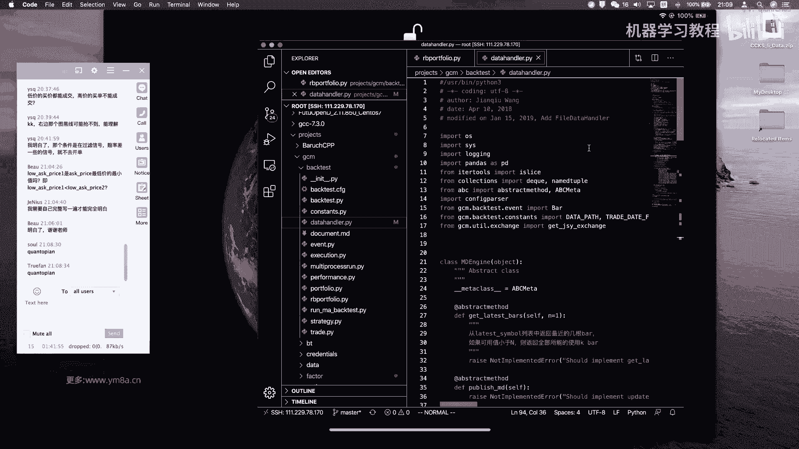

我其实然后今天我们的课程叫systematic，就是prediction，就系统化做预测对，那关于这一块的话，其实嗯就是大家在做预测的时候呃，我们想就是有两种方式啊，就是做策略其实是有两种方式。

一种方式是说我像我们有movie average，我有规则，我从市场上当中观察到很多很多的pattern什么，包括有有玄学，那个叫嗯哦有有有玄学，玄学阐释对吧，缠中说禅不拉不拉这种东西啊。

我又不是说他没用，事实上有厉害的人，我觉得还是他挺有用的，对，那可能我关观察我所谓的形态，这种东西观察我的形态，然后说当他创下了几日新高或者是怎样东西，然后我根据这些规则去确定呃，我决定我什么时候开仓。

然后决定我什么时候加仓，这是一种方式，然后我当然也可以说我完全通过data mining的方式，我去挖掘大量的历史数据，从当中去找到这样的一个Python，然后我们个人倾向来说。

感觉两种你都可以尝试两种哪条路都不好走对，然后我要强调的就是说呃，这门课跟其他的就machine learning和deep learning的课程不一样，是在量化当中模型，某种程度来说。

我个人觉得没有那么重要，更重要的是你的数据的质量，以及你根据你的数据，如何去构造出非常有效的因子，也就是在机器学习当中，所谓的feature，对你当时说你怎么做feature engineering。

然后你到底是用是用boost啊，你是用random forest，你还是用deep learning，但事实上说你只要有好的input的因子，我觉得做出来的策略的效果就不会差，这也就是说呃。

量化投资跟机器学习有比较这样大的一个区别，就机器学习当中，大家会觉得OK我通过我这样的方式，我把我的performance，就是说我的record提升了多少，然后我的f one嗯提升了多少。

然后说我这个模型相比上一个版本呃，呃优化了多少，准确率识别多少，但是在机器学习当中可能都是不存在的，呃不是不是，不好意思，不是机器学习，在量化当中都不是特别这样一个重要，我觉得更多的是我要去理解市场。

深入市场，从市场当中挖掘出一些有效的pattern，那也是我们就接下来，今天要去给大家这样做一个事情，嗯嗯就在我觉得在目前经营情况，还是说我如果我能拿到别人都没有的数据，并且这个数据还是有效的。

那不管什么模型，我就手动交易，我都比你厉害，对就是说你还不知道库存什么样的时候，我已经理解的一清二楚，对或者说你啊对啊，这那那为什么就是原因原油的价格会产生这样，那还不是说大家的预期会不一致。

如果你能知道别人，你知道市场会走向什么样的预期，那那不就是超神对，所以所以在某种程度来讲，就是说在相同的数据情况下，我们当然是要比谁做研究的功率强，从这些数据当中提取出更多有效的印子。

那人还有一种另外一种层面，就是说我的数据我有独门独道的数据，那是独门独道的数据，我就能基于这些数据做出业务的阿尔法，那事实上就是说这两点我觉得都是很重要的，好的公司是既有很好的数据，也有很好的研究员对。

然后我们这些就是说，大家想要从我们这门课当中，就是说我觉得更多的教给大家不是策策略，而是说怎么让大家去想办法，去挖掘到一些新的因子，或者说嗯教给大家基本最基本的东西吧，然后我们就来看一看。

就是说就是正常的，我们刚开始来的时候，我们怎么去找这些factor，对，就说不要，大家也不用觉得，就是说把音子想的有多少特别的神秘。

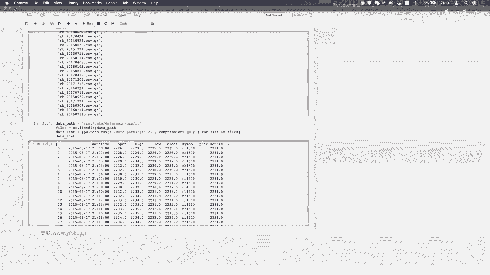

因为你我是想，不会网断了吧。

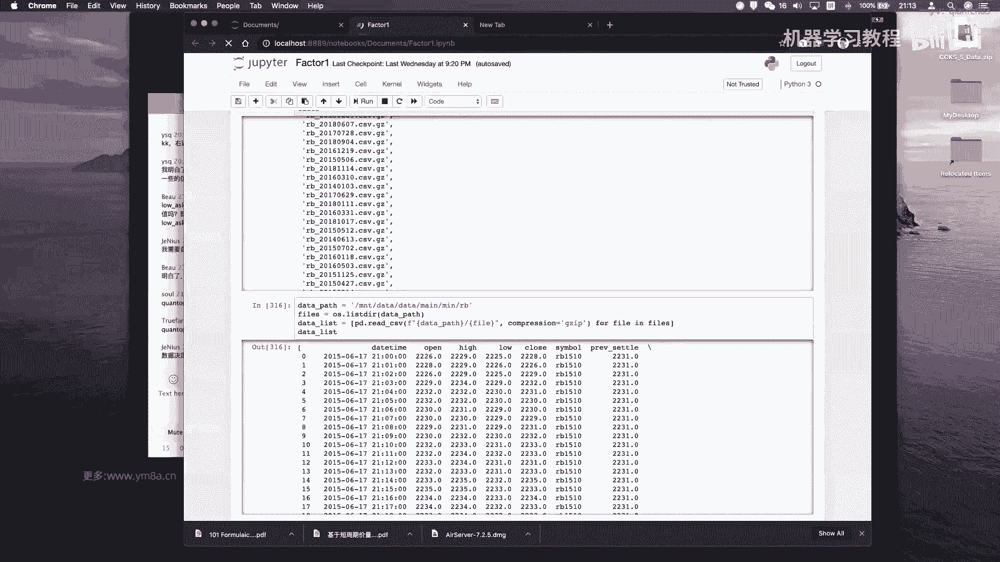

嘶看起。

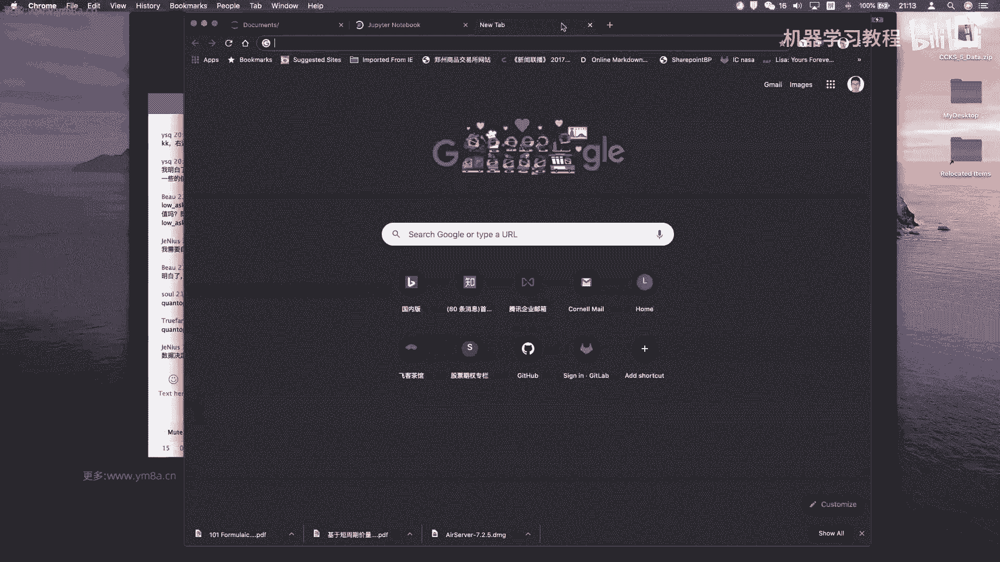

网络有点卡，稍等一下。

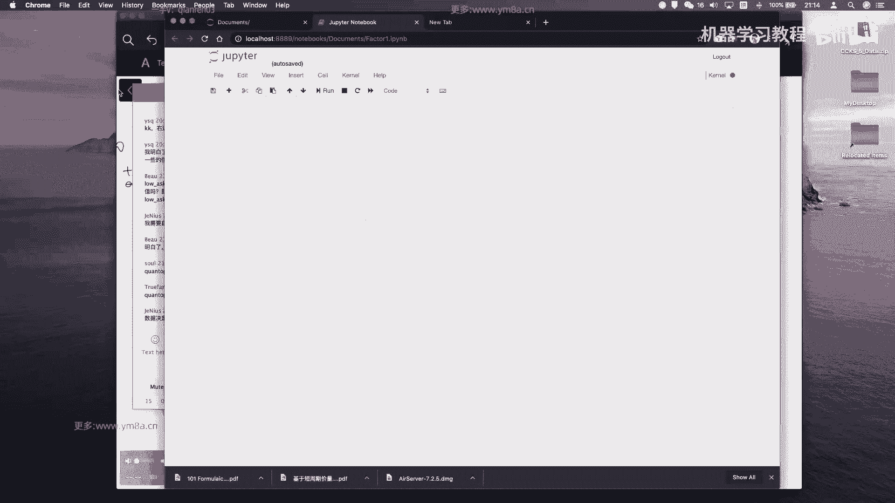

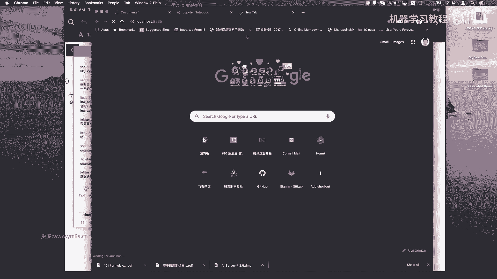

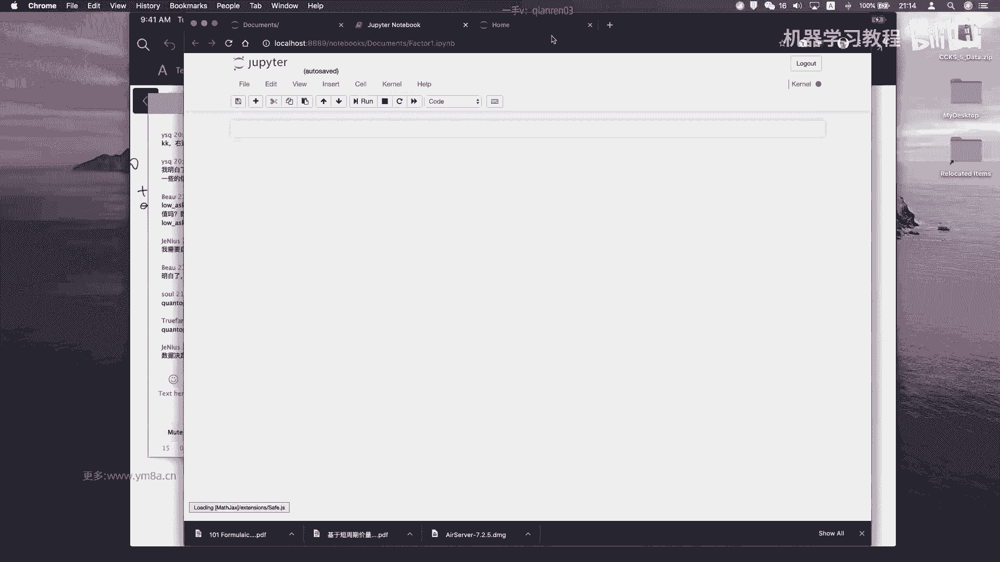

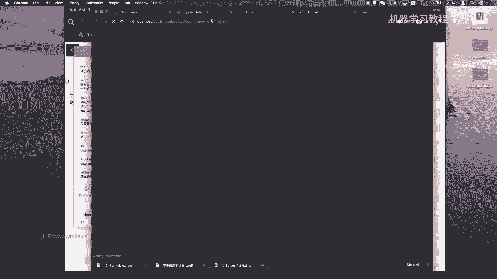

可能有点大，对这个里面，sorry是嗯，那大家先休息一下吧，然后我把这个给调试一下，对大家加载一会嗯。

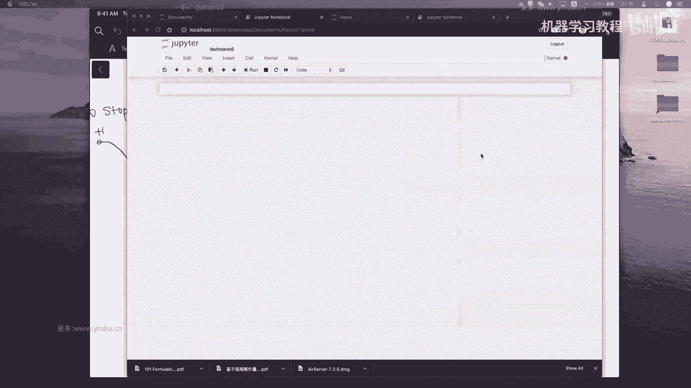

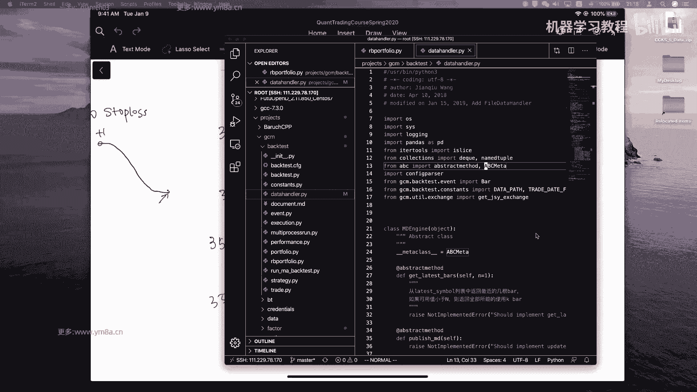

好的唉，同学们，我们今天现在就要开始跟大家去讲一讲，就是说我们怎么来去做系统化的预测，然后这节课其实主要讲的是，我们怎么去构造这些预测的因子，然后然我们在上一节课我们有提到，就是说嗯曾经就是有两种方法。

一种来说是说我们从观察市场当中，然后去找到这样的一系列的pattern，然后就再去说从这些pattern当中去构造因子，另外一种方式就是通过数据挖掘的方式呃，我不敢说这两种方式孰优孰劣。

但是从我个人角度来说，如果说是第一个是从市场市场当中，我观察到的patter，那么这种因子也就是说过，拟合的概率相对来说会小一些，同时它也具有更长的生命周期，但是这样的研究可能是比较难的。

那可能大多数时候我们都会去挖掘石，就是从花比较多的时间，从数据当中去挖掘，看看怎么样能够去找到一些比较合适的因子，然后主要是说嗯，曾经几十年前，如果说market data。

市场数据对于每一个人并不是那样，唾手可及的时候，我可能说用一些简单的均线技术指标，甚至我不一定还有技术指标，我能拿到足够长的历史数据，那么相对于别人都会具有优势，在这种情况下说。

我们就会说呃呃那样的话来说，就是你可能交易会有比较大的概率去盈利，但是到了现在，尤其说我们做的是我们做的不是数字货币啊，我们做的是在嗯是在交易所内，流动性相对比较好的一些期货合约。

那再用呃相同的技术指标，或者说是而仅凭简单的技术分析，那这个时候想要获得稳定的盈利，概率可能会是说是比较小的，那呃在所以说嗯在现代来说，可能大家都会再去考虑说，如何是去找到一些通过预测模型。

去找到一些新的比较呃有效的进行交易的模式，所以这节课我们也就是来去考讨论一下，怎么去讲一些预测的因子，之后，我们再去考虑，怎么去从这些因子去产生一些预测的模型，然后嗯其实因子的来源有很多种。

然后我们今天主要考虑的是，就是我们现在主要考虑的是我们依靠行情，其实我们包括我们设计的回测，也是偏向日内的这样一些策略，所以我们才会考虑是日内的一些因子，因为如果说我们去考虑日级别的因子的话。

第一方面第一个原因是嗯，如果我们只有行情数据，那显示器做下来，模型就是嗯相对来说解释率会比较低，曾经CCTA依靠仅仅依靠日级别，我们就做持仓两到四周甚至一个月的，这样就是一个多月的这样一些策略。

嗯可能会比较嗯就是会有比较好的优势，但是到了当今相对来说中低频的CCTA呃，除了我知道元顺可能一直做的不错，然后也有几家做的还可以，做的挺好的，但是想要在依靠中低频的CCTA，获得非常高的下铺比例。

应该来说现在是比较难，一个趋势说大家都在往越高频率上去做，当然我们现在也做不了高频，所以我们可能考虑说，从日内作为这样一个切入点，然后主要是说为什么我们考虑做日内，因为有几个几个优势。

第一个是说是首先只有行情数据，我们不需要去考虑基本面的数据，考虑基本面数据，我们要看比如说螺纹的社会库存的螺纹的销量，然后现货，然后如果是铁矿的话，如果我们是交易铁矿期货。

我们甚至会考虑嗯最近的好运怎么样，然后到港库存有多少对，所以如果说我们只做，我们只利用日，只做日内数据，我们只做日内交易，我们用的是tick跟分钟的行情，那这样来说，我们我们也既既可以说用。

可把我们的tick数据也用上，也可以把分钟数据去用上，利用编程的优势，那么有可能还会在个人个人去做交易，还有可能去有一些探索的空间对，但是嗯还有一点就是要说还有一点要注意，就是说我们这些数据是相对来说。

质量是可以保证的，因为相对于嗯对，我们知道做机器学习最怕的就是garbage，In garbage out，如果说我们数据质量没有保证，那做出来的很多策略可能都是没有效的对。

所以嗯所以我们主要的切入切入点，就是说用这些tick跟分钟的数据去来去考虑，做一些预测的因子跟模型，然后我们这边看到就是说我把14年到现在，所有的分钟数据都已经load进来了，对load进来之后。

然后我们把它去嗯，去把它就是大家要注意的事情，是我这边只漏得了一个主力合约，因为一个合约呃，可能他的他大概生命周期可能会接近一年，但是他作为主力合约，罗文钢作为主力合约，他可能只有四个月。

为什么我们没有主力合约，我们刚刚讲过了，就是说一个是说我们在做交易的时候，我们希望有很高的流动性，所以这个时候你用主力合约是最为最，为合适的对，然后嗯然后我们其实在这边要做的一些因子。

其实我就一要做的因子也很简单，就是我们本质上想要去找什么，我们本质上是希望找到一些东西，能够跟他未来的收益率是有相关性，但其实在收益率的时候，就是收益率有相关性的时候，这个这个时候就会嗯。

我个人的习惯是一般就是用return，就是用下一下一个班的return或者是log return，当然你也可以考虑说，我预测的不仅仅是下一分钟，我也可以预测是下5分钟，甚至是说过几个瓣。

那其实都是OK的。

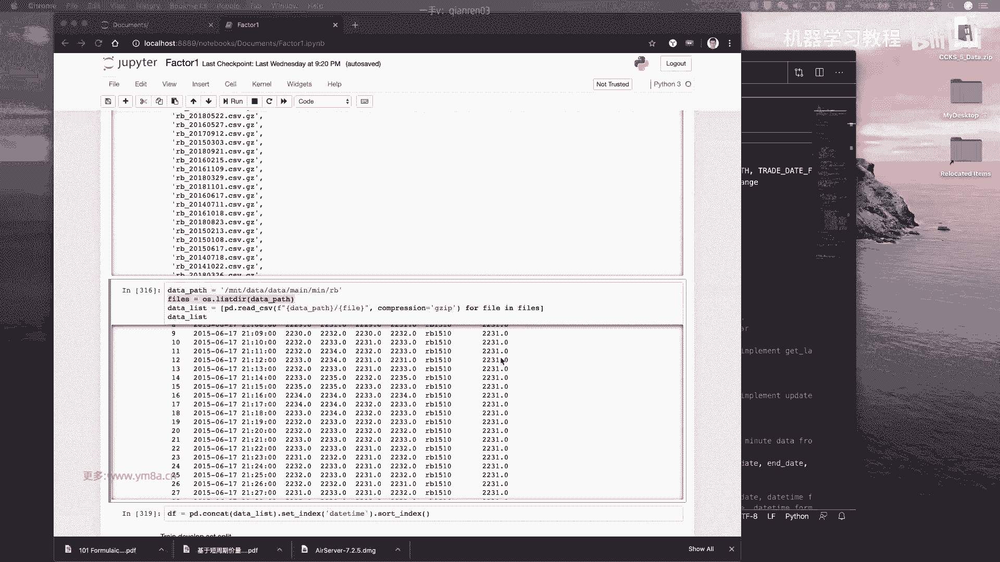

然后然后要从单个因子上来说，大家不要觉得因子这个东西有很很麻烦的，这样一个东西，其实相对因子来说，我这边大概列举了列举了这边呃，列举了几个因子，一个是说成交量，然后说是成交额，然后是前一根瓣儿的成交量。

然后是前五跟班儿的平均的回报，前20根瓣儿，60根瓣儿等等等等，其实这些东西我想说的是，这些东西都可以被叫做因子，那这些因子的解释效率肯定是显，显然来说是比较比比较低的，其实我我说我们个人在做的事。

在做的时候，其实说我们最主要的工作，你就是去找到我们去设计这样一个个的，一个个的一个个的因子，去能够找到，能哪些能够跟未来的回报，具有具有一定的相关性，那刚开始的时候可能大家说我不知道从哪去找。

那其实我给大家推荐的就是说嗯，一个是我们去实际的去观察我的数据，你去看他的，快看到数据的分布分布当中有哪些pattern。

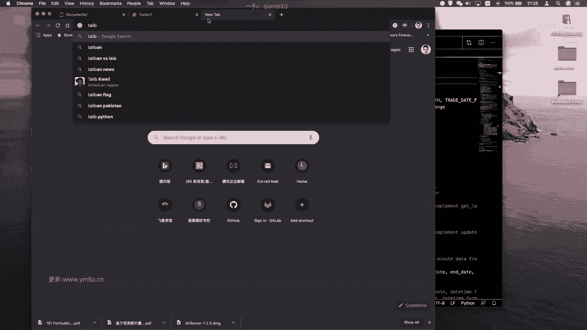

然后从这些pattern当中我们去来去找找，找一些收，是找一些潜在的水因子，然后另一个方式就是说ta live这个里面，其实这个它叫technical analysis。

实际上它这个里面保就是保存了有很多的，我希望大家就是说自己去把它下载下来，然后把每一个因子我们可能都去实践一下，看看他是怎么去构造的，要你需要就知道它每一个因子到底里面，做的是什么样的事情对。

就SMA是什么呢，Simple moviera，日日到它到底是什么样的事情对，所以然后包括就是嗯，就是嗯你你你其实就是说我们找因子，最高开始的时候，可能是先从别人已经研究过的，这些技术指标里面去着手。

然后我们再自己去加以改造，去想一想有没有可能有其他的，那就是说哪些的东西能够去呃，那去挖掘我们这样的一个pattern，所以其实我们要做的事情也就是很简单，在研究过程当中，我们作为初步最初步的研究。

你要做的事情，就是说我们首先去实现这样的一个个因子，然后大家要注意的时候，就是说嗯在研究过程当中，像类似于机器学习，其实说我们做量化研究也是呃，对刚刚其实上一节课也忘讲，就是说我们在回测的时候。

你可能在研究阶段的时候，你不能把你的所有数据都用掉，我们做机器学习也知道，就是说呃数据做机器学习可能说是样本，大部分大概情况下是样本越多越好，但是可能做量化嗯，嗯大部分情况下是对的吧。

对所以说我们在回测的时候，你其实自己也是要去去区分我的training，training set跟DEVELOPSET对，包括你的test set对，所以所以就是说我们不能，我这边用的是75%跟25%。

就是说我把呃我这里面大概有几10万行的数据，然后我看一下当前这个里面有哪些嗯，有哪些主力合约，应该我们按时间来分的话，大家也可以看到这边是RB，刚开始的时候是主力合约是1510，然后后面应该会有其他的。

一直到18101901对，所以有各种各样的数据嗯，呃然后我这里面只用到了其中，75%的tick呃，就是75%的数据，然后大家要注意的一个事情，就是说嗯看起来很简单啊，嗯我不知道大家自己实践下来。

也可能可能就会遇到很多的很多的坑了，因为我数据嗯会有一个合约换月的问题，当我换到新的合约的时候，你你你你不能再用说我的return是，事实上我是不能用，前一个合约的收盘价，和当前这个合约的第一个价格。

你还去算return这里面会有一些会会有问题，所以包括成交量，然后他的等等等等这些，这些其实说看起来是就我这边看起来挺简单，但背后更多的是细节的东西，所以我希望是大家自己去，把每一个东西就写下来。

就自己拿下来去自己去做一遍，然后观察一下这个数据，大家不要看到我这边就写了一行，那事实上就是说这个的这这一行一行，怎么去写出来，也是背后再去，就是说我每一个东西我都自己去检验一下。

保证我严格得到都是我想要的数据，因为一旦你偷了未来的数据，或者是你拿了错误的数据，那对前面的那你后面工作做的再好再好，前面最基础的音色研究的部分，你可能都是做错掉了对，所以这边要做做的事，注意事情是。

我们需要按照每一个主力合约去来，分别去做这样的事情，按照每一个主力合约，我要把每一个当前的主力合约给给筛选出来，大家注意啊，这个如果可以看一下train tickers，它本质上是什么，要注意。

我用到的是这些合约作为主力合约的时候，这些数据，然后，对我拿这些合约去训练，然后拿这些合约去去调整我的模型对，然后以及说你想要用呃，然后包括你可以再留一些数据，你做最后的你实盘跟踪一段时间。

或者你小样小资金去实盘跟踪一段时间对，然后嗯我觉得要注意一点，是跟机器学习不太一样的事情，是我们这边不太能不能够去把样本，你去做简单的shuffle，就是说我前后的数据去交换。

因为这里面涉及到时序的问题，你需要严格的保证你的是你的数据是有时间，是有时间先后顺序，所以在刚开始的时候，我有一个sort index的过程对，千万不能说我按照机器学习，说我一天一行就是一个样本嗯。

然后然后每一行的样本里面嗯，我直接根据这些样本计算特征对，而事实上就是说我们这边看到你用到的是previous，five bar和previous twenty bar。

你这件事事实上用到的是前面的数据，那你如果数据的顺序错的话，那这个数据算的肯定就不准了，对这个只是给大家一个简单的例子，就说我怎么应该去做这样的事情，对我要做的事情，其实就是说我把它分合着去存放。

然后我去一个个的去implement，我想我感兴趣的有有这些这些因子，我把这些因子的值都给去计算出来，计算出来之后，其实你要做的事情就很简单，就是你要算的是嗯，你要算的是本质上来说是跟return。

跟每一个因子的一个correlation，其实我不care正负呃，我算我关我就是我我如果是负号的话，我本质上我仓位反反方向来做就行了，但事实上我们可以简单的来看一下，就是我这边来做的。

用的这些大概十几个这样因子，然后我怎么来去，然后我去看的，我，我我去来分别跟每个合约去计算，它的一个就是我为了correlation coefficient。

那计算完correlation coefficient之后，你再去把他的我我这边简单的做了生命，那事实上你可以做的事情是你把它，你把每一个合约的correlation。

每一个因子的correlation，你都把它prove出来，那不仅仅是不仅仅是这样一个图，你可能是一个二维的图，那你这个时候可以去回去再去去研究，你看哪些因子。

可能说诶给我观察到了特别明显的correlation，那这个时候就要去注意呃，就是说我可能把这些因子给挑出来，作为我储备的一个因子呃，然后我们这节课就是说主要讲的，就是说让大家去尝试来。

说自己去从数据当中去尝试这些因子，如果不知道从什么地方开始的话，我们有包括我们接下来接下来讲了两篇paper，也是大家要去自己去实现跟研究的，然后我要提的一点是呃，大家注意这个值是不是非常小。

就是说大家觉得诶，R平方一般来说都是接近于一，但是在金金融当中，数据噪音实际上是非常大的，信噪比较低，如果真的是我如如果我自己研究的时候，平时看到一个0。1的，我都会觉得很惊讶，这这只是一个。

可能是非常非常明显的一个信号对，所以说相对来说它的嗯，就是说我单个的这些因子跟我最后收益率，其实解释的相关度是非常低的，但是嗯那所以说就说我想要去挖，也可以也从侧面反映，就是说我想要去挖掘出一个。

非常高质量的交易信号，其实是需要花很多很多时间的，所以刚开始的时候可能就是大家能做的事情，就是说我从现有的一些技术指标，跟一些paper去出发，然后我可以去想一想。

我怎么从这些里面去构造出我一些pattern，然后至于结果怎么样，也是要你也只有自己去编程去实现，一个个去测试了这些因子，才能去才能去才能就是呃逐渐去发现的对，然后这边是两个paper对。

首先就是说这个是100一个formulate，formulate阿尔法，这个是那个word count，他们所出的应该是挺经典的一个paper，它这里面提到了按照100一个，提到了100一个一个阿尔法。

然后其实所谓的阿尔法，也就是说我根据我现有的一些东西，我组合出来的一个能够对未来收益解释的，这样计算一个公式，大家看到这个里面是比较奇怪，然后然后尤其有一些，如果说你有了用到rank的话。

他肯定是它是根据它是根据一个排序，那我们这边是没有横截面那么一说，因为我们现在是单和圆，那如果遇到这样的，你可大家可以先去跳过去对，因为rank的话就是对于股票来说，比如说我有3000只股票。

我根据这些音，然后我根据根据这些东西去排序对，那我们现在可能没有的话，你就可以先跳过，然后大家也可以看看，就说我只用到我自己本身，是不是可以去做这样的一些事，情，甚至说把它rank去掉。

这些因子是不是都可以去研究，就其实这个里面就是有给了很多，大家很多的空间，但都可以自己去一个个把这些东西去实现一下，然后去拿这些东西去判断，跟我未来的return这样一个收益率。

大家注意是未来的return，不是当前的return，我我做交易，交易的是未来的预期，所以这个是一个这样的一个paper，然后我觉得比较大，家可以去挑一些部分去实现一下。

然后跟看一看里面能不能找到一些有用的因子，我我个人是看了一下，还是有一些是能够有用的，然后对，然后然后有些因子可能说哎有的时候work，有的时候不work，那这个时候就比较tricky。

之后我们也会有相应的办法来去把它去处理它，所以然后包括当然有些就是说呃，就奇奇怪怪的树就比较扯，这是他们研究出来的，就是这word框能研究出来的，那现在是不是有效呢，我我觉得不好说。

那只能大家自己去研究，甚至然后我们我们不是说有了这些，我们可不是测试了这个因子吗，然后要注意的是，我这只是测试了一个合约，一个合就是我只测了一个标的，一个标的，也说这十几个合约。

我但事实上我们能做的事情是，我不是我不是会给大家，是所有的期货大概是几十个几十个品种嘛，那理论上大家要做的事情，是把这些因子在几十个品种上，然后他历史上又又这5年数据，大概加起来可能有几百上千个合约。

那这个时候应该把大家，大家都去把这些因子测试一下，从中去看一下诶，我这个因子是不是在多个品种上都会有，良好的表现，对这个才是说你要去呃，这个才是说我根据这样一个因子，要去做的一个事情。

而不是说简单的我跑了这样一个因子，然后跑了三个月数据哎，发现不行，那那那这样其实就是说会错过了很多的问题，然后大家也会去比较说，发现这些因子在某些时候work，哪些时候block。

那这个时候大家可能就要去想，为什么这一段时间，对于所所有的合约这个因子work，那一段时间所有的因子不work，如果你能把这个背后的原因找到了，再把这样的你把你能把背后原因找到，并且想到相应的解决办法。

那事实上你就把这个因子加上你这个元音，又组合成一个新的因子，但事实上就是说作为阿尔法研究员，其实每天在做的事情，你就是不断的去挖掘，现在去，无论你是从新的研报，新的经济学论文，还是说从你观察市场中。

你得到了这样一些数据和一些想法，然后你去去研究，去解去，然后去研究，你判断一下这些因子是不是可行的，所以这也是我建议大家就是说从刚开始的话，先去把这100一个，然后以及呃国泰君就有这样一篇paper。

他这样当然也是说基于股票的，然后到五一节之后，我们会开始，就是涉及就是多因子选股这一块东西，我们现在大家如果说对于呃，就是股票的一些东西不是特别熟悉，没有问题，我觉得在这篇文章中。

大家主主要是关注的就是他用了哪些因子，对，就是我，我觉得就是大家去把这些因子都去看一下，然后想一想为什么他会去这么去，然后去想一想，其实我们要做的事情就是去验证这些因子。

哪些因子跟我的未来收益率有相关的关系对，其实这就是呃简单来说就是因子研究的，要做的事情就是这么多，你事实上有很多刚开始毕业生要去做呃，验证研究，其实每天要做的事情，我也就是说你就是去尝试。

然后尝试不同的不同的因子，然后找到哪些因子可能是work对，所以所以这个也是就挖矿嘛，所谓挖矿矿体就是挖矿，挖矿的话要做的就是，就是找到那些有价值的东西，对这个是呃这一部分，然后嗯对啊。

所以这一块的话大家有没有什么问题呢，对就挖因子这个东西嗯，怎么说呢，他确实是比较花时间，然后我觉得就是呃其实其实应该是这样，我觉得比较好的节奏是有兴趣的话，你应该是每天坚持去找一找这个事情。

要做一做这个事情，你无论是你去保持对于一些paper阅读，还是你自己去尝试一些新的想法，对然后你挖出来因子，你可以把它放到我们的回收系统里，你简单的根据因子的信号来看看，当因子信号等因子信号。

他有什么样的pattern，你去做多，什么时候你去做低，那做空，把这样的因子去回测一下，你自己去看一看，然后呃至于股票的话，因为又见到了横截面对，然后他还会去做一些更复杂的处理。

然后之后两周我们会慢慢涉及到，怎么去再去来实现一个股票，最简单的多因子的这样一个模型对，然后其实说一方面是说我们除除了看这些因子，然后大家也要去想，这个因子里面本质上到底它是什么东西。

你是不是可以对它做理论上就moving average，它本质上是个什么东西，对，那那这个时候就要可能要大家花一点时间，去理解一下他交易的是什么东西对，因为现在我们还没有考虑说。

因子之间有各种各样的相关性，怎么去解决，对我们现在可能刚开始，同学们初期的话是先去自己去尝试，去做这样的一些因子对，然后呃这节课的时候，课后作业应该是大家呃数据，我是默认大家都能够去生成这样的分钟数据。

所以我也不会去给大家提供，所有合约的分钟数据，我给大家的是原，我会给大家提供原始的tick数据，还是大家用自己的程序合成分钟数据，对，要自己要保证这个数据是对的，因为如果说我们基于这样一个错误的数据。

做出来的因子或者是策略，那其实是没有任何意义的对，因为因为数据确实是比较大，我自己在硬盘里解压下来接近一个T对，所以不可能就是说把这个数据传给大家，我只会用网从网上用百度网盘。

把最原始的tick数据压缩包给大家，然后大家自己去下载下来解压缩处理好，所以五一节期间任务还是比较重的，一方面我们要去把你的回测平台给完成好，另外一方面，大家开始就是自己去开始去挖一些因子，去做研究了。

那刚开始说可能就作为这门课程，刚开始不一定说去挖多少银子，那你可以去试试看嗯，去把这些因子去现有的因子去实现一下，然后其实嗯古就是说期货当中，也不是说不能有这样的事情。

我事实上也是可以根据我几十个期货合约，去从中找出强弱的这样一些东西的理论来说，我如果只是用螺纹那些数据，那我可能挖的因子比较弱，那我是不是想一想诶，诶我除了我去找跟螺纹相关性比较高的热卷。

铁矿的数据来一起联合挖这个因子呢，那这些那这个事情，可能就是也是大家可以去考虑去做这样的事情，然后呃对，然后就是说预预测因子糖应遇到遇到预测的话，事实上大家可以嗯对，其实是有很多机器学习方法。

然后之后我们会慢慢去讲到吧，然后包括说怎么用，怎么用遗传规划算法去自动去生成组合因子，其实也是可以去尝试做这样事情的，但是然要注意的是，就是可能就是说一般来说我们样本是越多越好。

如果你如果你数据只有一个月，那你再回测一下因子，说实话可能大概率是过拟合，如果说有几年的数据，我用60%的去训练下来写的数据，然后那么有可能还会挖掘到一些比，较有效的因子，所以数据也要保证。

然后就是在数有数据的基础上，我们才去考虑，说是去他去产生更多的因子去研究，对，那我个人其实偏向于说嗯，去从市场当中去找到相应的pattern，我把它实现下来，这个因子可能会更有效更有效一些，对。

当然可能刚开始的时候会觉得，我好像没有任何感觉，我也没有看过盘，我也不知道是怎么回事，呃那没关系，我觉得这个是一步步慢慢来的，我们总我们我们我们事实上是，就是说一方面我们是可以从最简单的因子开始。

然后另外一方面其实我们也可以考虑，就是接下来会跟大家讲，怎么从模型层面去提升这些因子的预测效果对，然后还有一个要提的就是说我们这边预测的话，其实我这边有用两个，就是一个是volume waited呃。

Return，就是说因为我我我想了一想，就是我一分钟的时候，尤其是我频率越高，我一分钟的这个收盘价其实受影响还是蛮大的，因为那时我很有可能就是价格会差一，或者是差二。

那如果我用volume waited return来做预测，是不是结果会不太一样呢，那事实上你简单看一下，并没有特别大的区别，在某些意义上有区别，但大部分情况下是没有区别的，所以如果为了方便的话。

可能大家就是用呃用用这个next return，就是你用下一个bar return，做你的Y做你的Y来去做解释对，然后嗯你除了用这样的一个东西呢，还可以说我除了用这个收益率，那我是不是还可以考虑。

就是说我用呃价格变化的点数呢，比如说我螺纹我价格变化了一个点，对我不是用收益率了，因为呃你要注意螺纹在3000块钱，而螺纹曾经最低应该跌到1600还是多少，1600的时候跟4000块钱的时候。

同样一个点收益率肯定是不一样的，对那这样是不是也是可以的，也也是也是可以呢，就是说也也是可以去作为预测的这样一个东西，那大家也可以去看一看，对就是然后甚至还有一个可行的方案。

就是说我除了说去预测我的收益率，然后我收益率其实是有很多噪音，那我是不是可以用一些保，用一些方法去把这些噪音去降噪，那其实也推荐的是，你可以用Python的WEBAY。

那个包去进行小包函数去进行去进行降噪，对那事实上就是说还有一个问，我就说为什么说我们这时候会考虑去对应变啊，去做处理呢，因为在实盘交易的时候，大家有没有想过，就是说你我并不需要去关注因变量是什么。

因为实盘交易的时候，我只需要关注我的字变量，也就也就是说我找到这些因子，实盘的时候我不需要去看呃，因为你一面要算的太复杂，你可能是会花时间在实盘实盘的时候，我只要考虑自变量A我只要通过这些组合。

我把算出自变量，然后达到一定程度，我就可以去额，就达到一定程度，我就可以去交易了，我只达到C功能达到一定程度，我就可以去交易，我是不care我的因变量是不是需要做小波分析的，对不对。

我只是在研究过程当中，是需要去对因变量去做处理，所以说我这个时候改变我的因变量，并不会对我实盘过程当中造成太大的负担，对的，然后呃现在就是大家，我现在没有给大家去讲那个高频的音子。

然后如果大家感兴趣的话，下一节课我们再挑一些时间，去做一些高频的音子吧，对就是说呃因为我们现在除了一分钟，你想其实一分钟之内发生了很多事情，我们现在都没有去处理对，那其实就是说事实上就是说用高频因子。

很有可能就是说我做出来的因子，效果是会比低频率的一分钟5分钟要好，但有一个问题是，我可能覆盖不了我的手续费，就是说我预测的很准，就一个点的手续费，但事实上大家也都能预测的到。

那那这种时候我即使说我预测的效果很好，但是我不一定能够去交易，所以就是说天下是没有免费的午餐的好的，那其实呃，因子部分刚开始就给大家是介绍这么多，就是其实核心就是说我需要去找到哪些。

跟我未来的价格变化有关的这些因素，那这部分就是因子研究要去做的事情，那这个部分也就是非常的，我只能说有人说是看运气，有人说是持之以恒的努力，我觉得这个都不好说嗯，但我觉得最刚开始的事情是。

大家先从了解了整个框架之后，有了回测框架之后，我可以先去尝试做这些因子，然后如果觉得好的好的因子，我可以不断的去把它扔到回测，刚开始的时候，你可以简单先去分析分析，这些因子的correlation对。

然后我去构造出一系列非常因嗯，一些新的因子对，然后这个因子库可以是非常庞大的，有有的，有的就是我知道有的公司现在有可能，因子库里面有几千个这样的东西，几千个这样的因子，那当然嗯因子怎么用。

那又又是一个问题，对，好的同学们，现在还有什么问题吗，我我就在想，就是说这个课程每次都说我讲其实还挺累的，以后是不是可以考虑让大家也来跟我一起讲，讲话对，主要是因为就是说期货因子是说。

因为我们刚刚有说期货因子是，我们现在由于做的是日内，那最唾手可得的数据就是tick跟分钟的数据，就是我的数据，那交易数据相对来说我也比较稳定，那这个时候我可能说我基于在交易数据，就能做出比较好的因子。

那为什么说，是因为因为我也不是说不能用基本面，我可以考虑把我每天的库存去找官网，或者是布拉布拉哪些网站上把他给拉下来，然后包括给各个期货公司的持仓，我都可以拉下来。

但是这些数据可能我最多只有一天更新一次，让我在盘中的时候，你怎么我盘中的时候，如果其他都是分钟级别因子，那这个日级别因子怎么做，那其实还是有点麻烦的，就是说我这边如果我用分钟数据相对来说。

我数据比较收得到，然后我也有几十个合约，其实我觉得在，还是能够做出一些比较有效的因子的对，但事实上在现有的就是呃，这就是机器学习，主要就是在业界中高频里面，大家还是用的是行情数据会多一点。

呃不排除有一些公司是做基本面，那基本面做的就是他整个的思想框架，跟我们现在做的方式可能都不一样，对的，嗯嗯大家现在还有什么其他问题吗，那今天授课内容其实到这也差不多，那接下来可以留一点时间跟大家闲聊。

大家有什么感兴趣的问题，其实都可以问对，就今天其实一一个是就是我觉得比较重要，就整个课程到目前为止比较重要的一个一个，就是说我们我们去理解理解我们的数据，然后然后然后理解整个回测系统是怎么做来的。

然后因子研究这个东西，就是其实只要知道了我怎么去做这样的事情，那更多的功夫是留给大家自己去去研究因子的，因为如果说等来课上，大家看我一个个因子怎么去实现啊，那其实我觉得意义不太不太大。

对我觉得大家自己动手去写一下才明白，就是这个玩意为什么要这么实现对吧，其实这个里面对我我还是就是强调一下，就是注意要把不同合约的数据给分开对，其实就是做做阿尔法的时候，就是要火脑袋活络一点。

就是要多想一想，就说我基于这些数据，其实我还有哪些组合的方式，哪些新的东西有可能去用，比如说我们就就提到高频里面的，就是说我我我每秒的挂单量，对我是不是可以去用每秒挂单量的变化。

然后你你观察到行情的时候，经常有那种突然上升和突然下降趋势，你这个时候可能会发现哎成交量突然变大，那这个时候你就可以把成交量这种变大，这种模式把它把来去描述出来，那怎么叫成交量变大。

那就是当前的成交量比下减去上一课的成交量，然后你看一看这个pattern可能会持续十秒，那你就看一下，你就把这十秒的十秒之内，就是说每一个额成交量的变化，都把它给平均一下，或者是怎么样对。

那其实就是说因子都是一个个可以去尝试，和被人看出来的，对的，然后尤其尤其我们现在分钟数据，其实我仔细算一下是多少哈，对夜盘现在是开放了，然后我们每天的交易时间是对，如果你想少掉夜盘的话，就少掉了。

螺纹钢少到两个小时嗯，其实我们每天交易时间是从九点到11：30，然后是01：30到两2~3点，那其实这样总共就四个小时，然后加上两个小时的话是六个小时，六个小时我们就是60×6。

然后我们下一年是252个交易日，然后我们有5年的数据对，其实我们要每日就是45万3600，这是一个合约对，那如果说你是考虑tick的话，呃如果你是每分每秒每分呃，就是每秒钟两个tick的话。

那这个时候我有了5000万条样本，这个时候还是有可能会找到，相对来说会比较有效因子，但事实上就是说我用分钟数据的话，45万个样本理论来说，也是能够去用机器学习方式。

是有可能会找到盈利的pattern的对，然后呢刚刚不是提到了，说我除了主力合约，那是不是我可以看一下次主力合约，那这样你是不是就是可以翻倍的对，然后还看到如果我想交易螺纹。

我是不是还可以用到其他合约的数据，对呃，就是不仅仅是螺纹，我用到其他的跟它相关产品的数据，那这些都是可以考虑去做的，就是就是因子这一块，因子挖掘这一块，也还有一个就是我刚刚就是我看到那个finding。

阿尔法这本书，然后之后我也会发给大家，我我觉得那个呃那本书是word count的，就刚开始他们有一个叫WEBSM这样一个平台，就是相当于在线就有输因子，然后回测的平台，现在他们不做了。

但我觉得就上完这门就是上这门课，上到现在，同学们其实完全可以就自己去，我们要做的事情，本质上也是自己去打造这样的平台，我完全可以不需要依赖别人，我们只要有自己会编程，然后对。

然后有数据其实都可以去实现这样的想法，好那同学们还有什么问题吗，我不知道编程，就是现在大家到现在就是怎么样了，就是编程的水平还是不是，还有一些还应该我，我我应该没有什么特别大困难了吧，这就是这本书。

我觉得还是刚开始看的时候还是可以的，就是可以讲一讲它里面怎么去设计，各个呃呃怎么去设计的这样一个个阿尔法对，就是他会讲到就是阿尔法的设计，然后阿尔法的评估，那刚开始的时候我们可以去参考一下。

就是就word矿的研究员，他们怎么去来去做这样的一个事情，对，嗯其实你看到他们也会有去用news跟social media，来去做这样的事情对，然后包括说其实我们提到，有时候你在预测return的时候。

你能不能引到其他数据，其实这个其实这个就股票，用股票期权也是来做的，我们我们也会去做这样的事情，在机构当中，我们会去考虑从期权的持仓上来去判断，当前市场的情绪处于什么样的情况，对的。

然后然后股票你可以从financial statement analysis，就基本面其实从这个数据去做对，然后，所以其实我建议是大家这本书，二是可以好好看一看，应该不是很长。

对就是我想对现在还是有第三版的同学说，是不是有新版的书吗，对，嗯bg test说risk factor对，这是个好问题，bg test阿尔法跟risk factor怎么来区分，哼你看是这样。

就是嗯阿尔法交易多了就变成risk factor，曾经那可能10年前几十年前说，你在阿尔法101没有发布之前，可能就是他的paper里面很多东西还是有点用，但之后可能就变成了risk factor。

那这个时候就要去评估，你的阿尔法是不是还有效，因为应该说你发现一个阿尔法，它是会去不断的decay的，当你觉得到了一定的时候，你基于这个阿尔法做出来的交易策略，它发生大的回撤或者是怎样的时候。

那你就要考虑，这个时候你需要把它作为一个risk factor，而不是作为一个阿尔法去交易了啊，对，这就是说我，我觉得就是说，你要保证你阿尔法处于一个不断的竞争力，唯一能做的事情就是保持持续的研究。

持续去挖新的阿尔法，然后之后我们也会去介绍一些，怎么用一些暴力的方式，是不是去挖，就是通过因子的组合，能够去用遗传算法或者是神经网络的方式，去挖出一些新的因子，对对对，事实是可可行的。

对我我觉得就是说能挖出一些，但是耗费的资源也比较大，这我朋友在做的时候，可能对就是一整个服务器把内存都，内存就是100多个G全部给跑满，然后就是我每每天都是不断的24小时，在那跑对。

然后这位同学说event q当中event有没有差异嗯，大家觉得有没有差异呢，我们刚刚说一般Q它是一个first in first out，这样一个数据结构，他不care我们所有的东西。

我们扔进去的都是一个基于base event，继承下来一个class类，所以本质上来说它没有任何差异，对它都是event，本质都是1event，没有优先级差异，就是我我们唯一有所谓的差异。

就是说我们区别，就是说唯一区别就是他们属性不一样，但事实上扔到Q里面的时候，谁也不知道属性，只有拿出来的时候，大家才会去关注他的属性，另外一个就是进入的时间顺序不一样，我通过进入时间的顺序来保证了。

我不会说把后面的bar推到前面去，对我只要保证我都是按照时间一个个去进去的，用这种方式来避免说，我采用未来的数据去进行交易，对，然后还有一个提到，就是说我这边是用next bar。

就是next return去做预测，那事实上就是说你你是是不是可以考虑一下，就是说你用的是呃，你做一下lag，我不预测下一分钟，而是预测呃，下午就是过5分钟之后，对或者是10分钟之后。

实际上我是可以包括我的因子，也是可以考虑做这样的一个lag，就是去做一些延迟，那因为因为有时候比较tricky的事情，是你发现这个东西pattern，那可能过了几过了一段时间，大家交易才会去起作用。

那这个这个也是一个比较tricky的部分，所以大家发现就是因子研究，其实比较有意思的地方在于它的维度是非常多，你可以从各种各样的角度去构造因子，你然后你实际上你如果去暴力搜索因子的话，你每多一个维度。

你你你的复杂度就会提升一级，对，嗯但我觉得就是有时候也如果有了，还不错的因子，其实没有必要，有时候也没有必要说在因子上花过分多的时间，毕竟你要保证你整个的你做交易，你的时间跟精力都是去有限的。

然后你要保证你整个系统相当于是optimize，不管你你你你的回测，你的策略研究，还是说你你你交易的频率，你的风控等等，我觉得你精力都是有限，你那作为一个公司的好处是说我可以。

如果我有很强的fundamental的，那就是基础的fundamental research的力量，我可以从里面找出很多很多很多的因子，那这样的时候我会比较有优势一点，就是我人多的话。

我每个人负责一部分对，然后然后还要强调，就是你就是不不要把训练数据都用掉了，就是自己就待会儿我会给大家那个数据的时候，千万不要就是把数据都给嗯，就你你你你你都把所有的数据都用来做研究了。

然后你发现你想要去做样本外的研究，你没有数据了，这是一个比较尴尬的事情，对然后呃对我我现在就把这个数据给大家了，然后解压密码，待会发到群里嗯，对还是大家自己去把数据都处理一下哈。

就是现在有多少同学就是说呃，还没有没有自己动手把数据给处理一遍，上上课上到现在了，对，好的，然后这个刚刚发到微信群里的，我发到这边也发一下吧，密码是要发到群里嗯，这边对解压密码是这个对。

然后大家自己去看一下，可能硬盘比较就如如果电脑硬盘比较大的话，那比较小的话比较麻烦，因为就是那那只能就是说，你一年一年的去解压吧，你解压之后就是哦他看到的数据是是这样的，对就是你你每一年他都是每一个月。

他是把所有的合约都在里面，然后你要去哦，你要去解压，然后然后你如果说比较硬盘比较小，你就一个月一个月的解压，解压完之后把你不想要的数据给扔掉，然后想要的数据保留好，就压缩一下对，就刚刚给到是呃1718。

然后还有一九的数据对，就先用14年到19年吧，呃大家尽快下载啊，有效期我只不留了七天，这个19年的是19年对，密码是，可以，好的，那如果大家没有什么问题的话，我们这周上课就先到这儿。

然后预祝大家五一节节日快乐，然后有时间在家多多写写代码，那好的，那没有什么问题，今天晚上就先这样了。

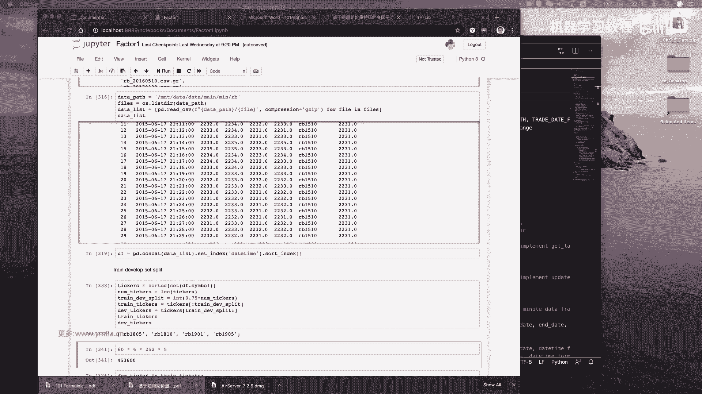