# 2025最新AI量化交易实战教程，三小时入门到进阶！清华计算机博士讲解，零基础也学会了（AI人工智能丨数据分析丨数据挖掘丨机器学习实战丨深度学习丨编程） - P4：第五章： 回测1-测试你的交易策略 - 机器学习教程 - BV1ujk4YKEw9

hello，哎，同学们能看到这个视频吗？今天好像大家来的人比较少哎。那个我今天也是刚刚下班，所以。对我估计也有不少同学如果在工作同学，可能今天刚刚也是呃工作回来。对。

所以嗯今天课不会给就是大家不用担心今天课的强度不会太大。然后嗯呃对我们今天还是先是看一下，就是我们今天其实技术上东西不会很多。就一个是我们把呃先息模型这一块给讲完。

然后还有一个是呃上一节课我们讲到用了基础的数据。基础的数据去呃分钟数据和去做因子。然后我们再看今天再看一看，就是带大家去走一下怎么用tick数据来去尝试做一些因子。嗯。然后呃我看一下。

就是呃那个来的人先行。对，先热一下场吧。来的人先在群里呃的打一下，我确保大家都都能听得到。对，然后我们先看一看就是上次的作业吧。O。对，然后其实就是这这这位同学我不知道是是谁呀，就是我觉得还还是挺好。

他把每次自己的作业都上传到get upub上面。然后呃对我觉得他这次作业完整度还是比较高的。就是整个的呃第四次大家大家就是呃有兴趣的话，其实可以去看一看这位同学的作业平时是怎么做的。对。

第四次的作业的话就是因子跟back test两部分。都都还okK对，然后其实我比较关注的就是呃。我现在就是先在群里统计一下吧，就是呃到现在为止，把14年到18年的tick数据都下载下来的同学有多少？

对我也在微信群里同步一下。就是下载下来的给给我是我我想了解一下。对。对，就是我想了解一下大家到目前整个进度是什么样的情况。嗯，好的，然后我们这边今天。好了，可能可能可能有人刚刚过来哈。

然后再问我就想问一下，就是到目前为止，就是2014到2018年的tick数据就是有没有大家有没有下载下来，然后处理其中任何一个合约的对。就是任何一个合约的。

只要有完整的tick或者是分钟数tick和分钟数据都okK。就是就是嗯其实就是我我是想想说的是就是嗯整个课程到现在就是关于CTA部分的这一块。呃，不管是从刚开始的就是数据的处理。

然后包括就是回测平台的搭建。然后如何去回测因子。其实我想说就是基本的框架是已经有了。就是嗯后面其实是作为一个入门课程，我觉得就是关于CTA到这一块，就是相对来说就是整体的研究框架。

是希望呢更多的是可能同学们要基于此去开始去尝试，就自己用业余时间去尝试更多的呃CTA的策略的开发。对，然后然后如果说到现在为止就是整个嗯就是如果连数据处理还没有做好的话。

我觉得可能是进度上可能会有一些落后的，可能需要同学们稍微加个油。对，然后毕竟这个这个事情就就可能刚开始学编程可能或者说没有接触互联化投资会觉得有点困难。但是我个人觉得就是量投。这是一个系统的工程。

然后如果刚开始是觉得有点困难，没有关系，你可以慢慢来。但是这个坎就是如果遇到这个坎，我觉得还是得咬着牙，就是把它给突破过去。可能刚开始你不知道怎么去批量的去处理数据。那你可能要要去学习很多的东西。

但是没关系，我我觉得还是呃还是就是得去呃对应的知识点，可能。就是呃都得去把它一个个完成吧。就是嗯可能就是有一些同学嗯我我在想可能说有一些同学缺失的就是说嗯就可我我在课上可能讲的都很直接。

或者说是给的都是现成的代码。但是大家可能并不知道这个代码。呃呃现实生活中是不太可能一次性就写出能够完整运行，或者说功能完善的代码了，就大家可能要尝试的就是说嗯。

就是说去学会一个去怎样逐步迭代的去解决问题的这样一个思路。嗯，嗯，我在想，所以今天这个就是今天课程当中就是高频音子这一部分，ok我会带大家就是给大家展示一下，就是说如果要去实现一个新的因子，从零开始。

我怎么去做，而不是像上节可以一样，可能十几个因子都算好了，你摆在那儿。但事实上中间是有不断的是试错跟debug的过程。然后如果大家直观的看到ok也就十几行代码可能觉得还挺简单的。

但自己写起来可能也不是那么回事。所以今天呃待会儿会就是带大家去怎么看一下，就是一个高频音子就是。可能会出现什么样的问题。因为嗯对，因为就简单来说，5年的tick数据，然后去算因子的话。

实际上数据量是不小的对，嗯，那可能会对你计算的性能上面，或者说你在计算的时候就不能简单的用for循环或者是怎样来去做了。对。嗯，然后然后就是我还是想强调的就是说这是一个系统的工程。

然后我希望大家就是每一步都是自己去动手去做起来。然后我觉得这位同学就是比较好，就是呃刚刚问到说是数据可能数据相对来说可能还OK大家应该都经下载的差不多了。然后或者说是知道怎么去做。

然后呃然后就是关于回呃回测这一块的话，呃，大家给自己现在的完成度打个分呗，就是还是就是0呃0到10分，大家给自己回测系统这个完成度打打个分。

我我觉得这位同学基本上是就是我看下他的系统相对就是做的比较完善了。就是应该来说是可以跑了。就是如果如果说是十分的话，就是说你你可以用这套系统就生成你任意策略的回测曲线。对，零分，就是代码还没开始动。

对我我想看一看大家现在目前的进度，给自己的就是回测系统，这个搭建这一块进度打个分呗。好的，嗯，对，然后这呃这个同学的代码我会发到这边，然后大家可以去看一看，就是我觉得还是写的还是挺好的。

然后嗯现在就是说大家就是7分到8分为主的话，就是目前说七分到8分为主啊，同学们就是觉得现在是卡在哪一环节呢？对，因为呃就是说整个代码的框架应该我我相信你就是七分到8分可应该都是了解的。

那现在就是说具体实现上会是有哪些困难呢？对对，其实这个同学代码相对来说就是比较完善，并且它不是完全就是照我的代码。我看过他还是有自己的一些思考的，还是对。对，所以呃我不知道就是现在大家的困难是有在哪里。

那如果现在不方便说的话，那反正就是之后你可以不断的放到群里，然后答疑室就是休息时间的话，我我会一一再去看一下。对。嗯嗯。对，就是那如果说嗯现在就是大家对于上次作业没有什么特别疑问的话，呃。

呃我觉得可能功夫还是要花在嗯就是课后的时间，因为就是让大让大家自己去呃，我觉得还是要去写代码去实现一下，然后里面有什么坑能可能才知道。对。

因为我只就算是就像这位同学可能直接展现出这样一个可以直接运行的代码，那大家自己再去写的话，可能也会必不是这么回事。然后以及这个只是一个最简单的分钟的一个策略。

其实我们我们我们只基于这个这样一个回测系统能做的改进还是非常多的。就是我不知道大家有没有在关注嗯行情的时候啊，就是。

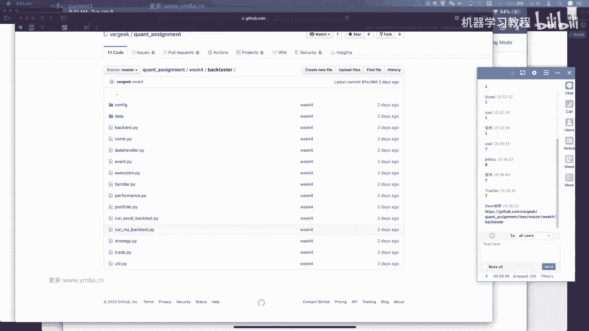

嗯，我随便找一个行情，就是因为我们现在的策略的方运行方式是就是每隔一分钟发一次信号。对，每隔一分钟发一次信号。那这样可能会出现的问题就是说嗯像这种如果说在一分钟之内呃信号就是整个的行情有了大的变动。

但你是一定会等到这一分钟结束才会去发单的那你可能会去错过呃这样一分钟之内的去呃策略去运行的这样一个机会。那其实嗯在实际交易当中，如果说我们要去尝试在一分钟之内去做交易的话。

那我们扫单的频率可能就不是用分钟啊，而是用tick就是说我们的回收系统可能要支持就是说一个tick的一个tick去推送。当然嗯。

这这个这个时候你可以用的方式是在每一个tick为呃刷到每一个tick为止的时候，你可以考虑说嗯我在当前这个tick往前数一分钟120个tick去以当前为这一个tick为当前这个时间为呃。

作为当前的一个时间段，我们向前数120个tick合成一分钟的 bar。然后我们到下一个tick的时候，再以此为止，再合成1个120分钟的120分钟的呃take120个tick合成一个一分钟的 bar。

对，因因此如如果是这样的话，我们就可以实现一个就是每一个tick我们都会去生成一个分钟的 bar。然后基于这样的一个分钟 bar，你略可以去进行计算，然后去发单。那么这呃这个这个时候所做的区别。

我们发现就是说我们可能是在一分钟之内，对，就是我们不是在整的分钟去计算我们的信号去发单。那这样的时候对你的回收系统其实又会有了更高的要求。对你的回收系统必须要去支持啊。tick级别的数据。

然后你还要能够支持在每一个tick的时候去实时去计算最新的一个bar。这这这这是一个改改良的方向。就是说如果说你想要做日内交易的话嗯。你希望在分钟之内去发单。对。

然后另外一个就是嗯就是如果说大家对于就是说做日内交易感兴趣，还可以考虑的是我们刚刚其实也提到就是说嗯。但刚跟第一点其实会有点像，你完全是可以利用tick，就是我们接下来今天要去讲。

我们利用高频的一些信号，用tick的一些信号去来呃去来去计算。当然你可以不一定说是用tick级别去交易。但你可以利用tick级别的信号去呃，比如说我在一分钟之内有120个tick。

我计算120个tick的信号，你可以去把它去啊你可以去采样去生成你一分钟的信号，然后用这个分钟信号去交易。因为如果我们只是单纯的用一分钟的高开低收。其实我们还是去错失了比较多的这样一些信息的对。

这是我个人觉得是比较可行的一个方向。那如果说你要去实现这样的一个就是研究系统的话，那其实相对来说你的回测，可能就是还需要进行进一步的修改，而不是满足于当前的分钟的回测。所以我就是想说就是。对。

就是说回车里面有很多可以优化的方向。对，然后。另外一个可行的方向就是说呃我们现在有了这样的回测，是做单标的的。那么如果说嗯我想考虑的是说做。嗯，做多个合约呢。比如说我们现在看到的嗯我们看期货综合评的话。

我想要做的是呃螺纹跟铁矿的这样一个套利。铁矿石的合约是这样。对，然后你还想去看罗纹的合约。那其实呃万德有一个比较好的功能，它是做了一个嗯叫价差的这样一个曲线。不是。就是说你可以自定义这样一个的品种。

我们之边看到的是这我这这是我之前写的啊，这是这是胶，然后是呃螺纹钢和热卷，然后分别是用一呃1比6比6这样一个关系。然后它这样有一个比较好的功能是它可以根据这样的关系去计算出这样一个K线图。对那。

事实上在计算价差K线的时候，嗯，你不能简单的用分中线直接去高减高低减低。那那那这样显然不是呃这样一个价差的K线的合成方式。就是说我们还是要强调就是说你在合成价叉K线的时候。

你一定要用最原始的tick数据。对。要要用tick数据去对齐三个合约的呃三个合约的tick数据，然后来去寻找这三个合约，形成新的这样一个合约的呃，再tick数据。然后再基于这样的一个tick数据。

你再去合成高开低筹。那同样的来说，如果说你想要去对，那还是说如果你回测去想要去实现基于这样的一个价差，你想要去做一些策略的话，那你的回测系统就要支持多标底了。对，那你就是回测系统，我们现在是做的很简单。

就是我们同一个时间节点只推一个板。那接下来你可能要做的改进，是你在同一个时间节点，你肯定要去推出多个t对。那其实这又是不小的工作量，因不管是涉及到性能，还是说时间戳对齐的问题。

因为有有些时候你可能说同一个时间点呃，不是三个合约都有数据，那你要用怎样的替代方案去做，对吧？一般来说我们常见你就用上一个tick的数据来补齐。对。那我我我我只是举了一些例子。

只是想就是想跟大家说就是嗯。

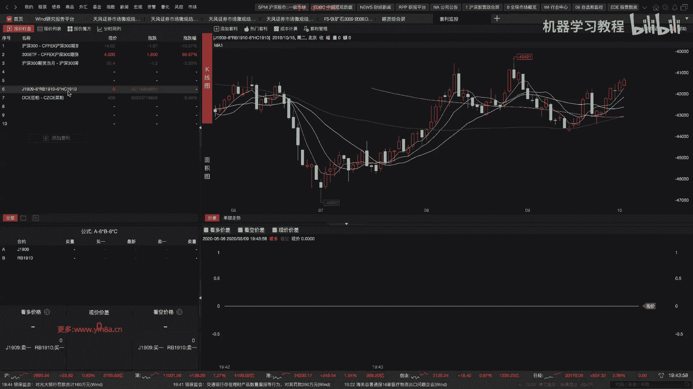

嗯，这个这样的回测系统是相对来说是呃能用，但不是但是是比较粗糙的。就是呃其实个人基于它嗯，包括机构里面大家都会基于这样的回测系统，基于你自己的策略的研究需求不断的去迭代改进。对。

然后我不知道大家有没有自己去回测过，就是不知道大家对于这样的性能，是不是满意。就是嗯就是如果说5年的分钟数据回的下来，大家有没有测过，大概需要多长的时间。对。

那嗯就是如果说你发现这个python速度你可以接受OK没有问题。那那如果你觉得这个里面数据，就是如果你觉得不能接受的话，那可能要去尝生C加加。这这也是后来就是刚开始我也是用thon做。

但后来做了一段时间之后，还是把整个的回测系统改成C加加。对，相对来说因为回测其实相对来说呃我我觉得瓶颈是嗯一个是在刚开始的IO上面，但可能这样还好。如果你不涉及t数据的话，就是。你一般来说。

你只要一次性的把数据读到呃从磁盘读到内存里。然后接下来的瓶颈其实是你的CPU。对，那大家有没有考虑过，就是说呃如果要测测多个策略的话，那我这样的回测引擎是不是要考虑的是并行化，对吧？

那那这样的话可能就是一个工程的问题，你有多少个CPU你可能要把都把它去跑满，对。然后如果说嗯。现在的话我们是读CSV文件。嗯，其实最最简单的呃就是嗯现在是CSV文件。然后如果说要提取你读取的速度的话。

呃，第一个最简单的优化是呃你可能把CSVCSV文件换成一个binary二进制的文件。你不管用什么样的就是方式去把它转化成一个二进制的文件，像那个R也可以转化成二进制文件thon你也可以换成picle。

然后甚至的话也有人用HDF这都是业界比较相对通用的一些方案。就是如果你是做偏高频一些的话嗯嗯，然后嗯数据库的话，其实就提到数据库其实我们到目前为止一直没有怎么讲到，就是用数据库。嗯。嗯。

就是我个人的建议是呃其实sl不是就是SQ并不是特别适合就是时间序列这样一个需求。然后如果为了嗯简洁快速开发的话，其实我有尝试过一段时间的用那个就是noql的数据库，比如go这种这也是O的。那相对来说。

如果说要考虑性能跟速度的话，呃，嗯大家可能还是去考虑内存数据库。然后以及呃之前也给大家提到过最合适的，可能还是KDB嗯，当然学习成本会有点高。基本上是一门新的语言。对，然后你要去上手。

并且现在KDB的话是对于个人是是有免费的试用的。所以license方面也不存在问题。对，其实我鼓励学有余力的同学，就是说真的想尝呃尝试的同学可能就是得考虑一下，就是你整个的系统是不是要逐步的迭代去升级。

嗯后当然当当然大大家也要注意就是就是量化当中每一块可能你现在做的每一块在。当中都是有很多人的去做的。然后就要看你的目标是什么。如果说只是说是去去体验的话，我觉得又又不着急，有时间的话。

那完全可以有时间慢慢去做。如果说是你的目标是尽快让自己的策略去上线的话，那可能就是嗯不一定要在呃也不是说不一定就是说相对来说你的资源是有限的对，那你就要可能规划好你的时间跟精力。对。

那你的目标可能就是只要说我能满足我的策略的研究需求，那我不需要对我的基础架构有大的改动。一旦说我研究的策略对于。我现在的基础设施提出了更高要求，不管是回测系统还是数据有了更高要求。

那我再去把这个瓶颈去改。对，所以所呃所以说这就这样其实我个人比较推荐相对来说是第二种方式，就是你先尽快的把自己的策略给回测之后，然后再接到CDP这去跑起来。那这样来说。

你可能能直观的去感受到就是你的策略的效果怎么样。当然这里面有一个问题，可能大家就是发现哎好像跑起来之后，似乎发现可能主观交易更有意思。然后就发现每天就开始去主观交易了。

然后呃交易起来感觉嗯有盈亏可能或者说是炒股炒上瘾了。那呃那这那这个其实不是我特别期望同学们去尝试的这样一个方案，就是说你主观交易也O你可以去试一试找感觉。但是我觉得就是如果想要做量化交易的话。

最好还是说。把你从市场上观察到了，不管是你主观交易，还是你每天盯盘看到了，还是你从统计的数据当中挖掘出来的东西，最终还是要回到量化的这条路上。因为我觉得可能这样的路可能会是更持久一些。

当然他没有主观交易给你的反馈会那么快。但是呃长远来说，可能我我觉得可能是更适合就是。有助于做量化投资同学们嗯的职业的发展的对。所以嗯就是嗯就是回溯系统，我们课上其实讲的相对来说是比较粗糙的。

就是我总结一下，就是几个改进的方向。一个是也一个是你用更快的更呃更快的程序把它去优化。不管是用C加加，还是说你要去并化。第二个是你需要去支持你多种策略模式的呃，多种策略模式的需求。如果看看你个人方向了。

如果你想要去做逃离，还是说做中高频的短线的CTA对，就是这个是取决于你的策略需求。我还是说就是说嗯你的你你的IT的基础设施是围绕着你的策略的研究需求去发展的。当然嗯一般来说我会觉得就是IT设施的呃高度。

可能就已经会它会限制你策略发展的高度。所以这个可能同学们是需要去注意的。嗯，对于这门课程而言，我觉得如果同学们能把整个的这个给。做出来，然后并且能够把策略回撤抛下来的话。

我觉得是其实我我觉得就是比较满意的这样一个结果。对，然后基于此的话，后续就看同学们自己想要在这方面有什么样的改进了。因为整个课程不仅仅是不单单是介绍CTA其实还有就是股票的量化交易。然后包括还有期权。

其实基本上就是嗯没有涉及到太多，就没有涉及到固定收益这一块。因为就是说嗯是属于在目前中国可能做量化交易做的相对来说三个比较大的方向了。尤其是CTA跟股票，就是目前是量化交易里面就是比较主流的方向。

然后期权其实也在逐渐的发展，也是未来发展的一个趋势。对，然后可能不像海外的话，不管是做ra还是做做什么其他的。啊，这是个好问题。除了CPU，请问GPU能在回测里面做点啥？嗯嗯，坦率的说。

这个问题我还没有试过。因为嗯就是除了GPU在刷升的学习模型，我还真没有用过GPU去做过回测的并行或者是优化。那如果有兴趣的话，我觉得这位同学可以去探索一下。对，这是个很好的问题。嗯。

因为因为我知道有人可能电脑还挺好的，然后有各种各样的显卡，有就有有有挺强悍的GPU对，但是坦率的讲，我没有试过用GPU去做。因为大家也会看到就是说嗯基于这样的一个回测引擎，它的逻辑还是比较复杂的。

我不确定是说而GPU的话，你可能要首先要做的是你要把那些东西去并行话，我不确定GPU能不能去处理这么复杂的一个操作。当然嗯你要说嗯GPU去暴力的算期权定价，我觉得这个还还有可能。对，因为嗯。

或者这样的相对来说，如果算法比较确定的话，可能会比较可能。但是如果在回测当中设涉及到相对比较复杂的逻辑处理。嗯。我不太确定就是GQ奶在这边啊产生什么样的用途。对。所以对我也不是什么问题都都知道的对。

然后只能说呃是说只是说大家有什么感兴趣，我知道的可以告诉大家。如果呃想要去进一步探索的，那我可以跟你跟你一起去探索，对吧？嗯。呃，对，所以其实这位同学我觉得做的还是O的。但是今天好像交作业不是很多吧。

就到现在可能差不多。我看周学老师总共就才5个做一个提交的，可能大家还要赶点紧。然后这门课的收获完全就是说我觉得就是说大家能收获到多少是嗯一方面是取决于说我给大家讲授的基本的感讲解清楚。

就是大家没有了解到整个在做什么事情。另外一方面可能就是呃就是自己在课后敲了多少代码。因为因为我就觉得是by doing。然后我不知道就是第一节课有几个同学说不怎么敲代码的同学，但现在跟的怎么样。

我还我还我还挺担心这部分同这部分同学就是会至于说会写C加加或者代码写这样的同学，我觉得完全不用担心。但是我还挺担心就是第一节课跟我说，就说之前没怎么写过代码的同学。

对因因这个里面可能说这里面出了一些差吧，本来就是。呃， assume以就是要上这门课的同学应该都是具有相当的就是说代码肯定是敲过一些，就是写一些python是不成问题的。对。

那反正如果还有就是如果觉得这一块有比较大的问题的话，嗯，就是我觉得不管是跟我私下去沟通还好，还是在群里去沟通。对我觉得这个坎可能还是得迈过去。对，因为我自己当初任也是呃，刚开始我也是说。

说去从在线的回测的平台狂图平台去做。但你会发现明显一个是性能的问题。还有一个是你想要去稍微研究复杂的策略，这是不支持的。

所以这是鼓励同学们是尤其是在刚开始的入入行的阶段是自己去尝试去了解整个生态系统的对，自己去尝试做做这样的可就是说造轮子。也许说你可能现在轮子不一定造对别人性能好。但是有了这样造轮子的经历。

我相信你到机构里去正式工作的时候，你相对来说应该也是会比较容易上手。然后也会知道呃整个系统到底需要哪就是结合你自己的需求，整个系统需要做哪些改进，然后可以把相应的需求提提高提供给你们的同事。嗯，好的。

那如果就是作业到这一块没有问题的话，那就先这样，大家觉得O。然后我我我是觉得就是大家可以去看一看呃。这位同学怎么做的？然后嗯。你这边他只是给了给了哦，我不知道这个数据是多大啊。对 then嗯对。

然后大家可能要特别注意的就是期货有一个就是主主力合约换约的问题。就是我不知道大家有没有在处理数据的时候有有做过这样的一个。对，有有有做过这样的一个切换。就是主力你就是当一个合约主力合约变的时候。

相当于tker已经变了。可能之前是RB2001现在变成2B2005。对，那那这样的时候，你不管你是平仓，还是就是说首先是合约切换，一定要是把旧仓给平掉。然后嗯现在的话就是说你要计算新的型号。

你可能刚开始嗯。就是你计算新的信号的时候，这个bar可能刚开始你换了合约就又变成零了嘛。其实有更理想的解决方式是当主力合约切换的时候，你应该再去把呃以当前时间为点。比如说你要往前再推呃20天。

那你应该在主力合约切换的时候，把新的主力合约数据再往前漏的20天的数据。那这个这个这个是需要额外去处理了。对，然后这样相当于说你回缩下来就不会出现曲线呃回溯到一半。然后有个十几天的冷冻期。

因为这十几天你新新的数据还没有准备好，然后再然后才会有仓位的变动。那事实上你应该来说你去如果是根据呃根据那个新的主力合约切换的话，你也是根据新的主力合约，过去历史的数据去算出当前应该新的仓位。

就是你在示盘交易的时候，你肯定不能有信号的，就是你不不可能有交易的中断。对，不可能说你十几天几天没有交易，那显然是不行的对。就所以说大家发现就是一个相对来说比较完善的，就是回头系统还是有比较大的空间的。

对，有比较大的改进空间的。然后就最简单的，我们这边是数据接口嘛。对，然后如果你换成内存数据库，那应该要去重新去实现这样的接口，对吧？然后现在这边只是一个合约，那如果要去测多个合约的话。

那其实也要提供相应的支持，对。好的，那回测系统可能我就讲到这边。那如果之后有什么问题，然后大家再跟我沟通。呃，接下来呢就是。就是我先讲这个吧，就是因为上节课我们不是讲了一些因子嘛。对。

然后这一课想带大家看看，就是说就是就是刚开始的时候就是怎么去呃来写这样一个因子吧。因为刚开始可能大家看到直接就是一个公式嘛，但事实上你中间可能还是会就是还是会有一些问题的对。呃。

我想一下我的数据是放在哪里了，ok。就是这个是在我的服务器上，然后服务器上的话。嗯。一般来说对。对，肯定肯定刚开始的话。你需要去inport相关的东西。然后对，然后有一点是我要看一下我的。

我要看一下我的数据。我要看一下我的数据是在哪里。え。嗯， ok。呃我建议有大家就是那个呃这这个是这样的，这个服务器是放在另外一个地方。然后然后我把呃这这个像这这个服务器的话，就是我看一下，它应该是有对。

有32G的内存。然后这样的话可能就是方便你自己去做研究。就是嗯对我我还是习惯就是有一个服务器，就是24小时开着可能会比较方便啊。就是我看一下这个服务器应该开了。对，已经已经一直就开了82天了。对。

然后有条件的话，给他加一个那个UPS的那个就是呃稳压电源，不要因为停电什么的，把数据丢了就不好了。对，然后嗯。然后就是反是说就是希望大家就是有有有条件，如果想严肃的考虑这个事情的话。

就是自己还是搞一个服务器。这个还是比云服务需要划算很多。当然如果说钱多，那当那那另外一回事，你可以去云服务器上，你搞个256G的内存都没有问题。对，我不知道前两天大家有没有注意到。

就是换方说呃咱搞了一个超散。那当然有有一些噱统的就是某家搞了一个超散。但是我觉得就是大家可以关注的事情是说就是整个量化交易行业对于算力的需求其实是永无止境的对，就是显然来说。

现在大家对于算力都是比较有追求。那我觉得个人研究来说，至少相对来说有一个比较靠谱的研究环境跟相对比较高的性能，能够帮助你就是呃帮助你去做呃更高效的做一个事情吧。对，然后话不多说，就是我们来看到就是。

就是就是前在就是说这个因子我也我也没有没有搞过。然后现在说我们要从零开始怎么去搞这样的数据，对吧？搞这样的一个计算这样的一个因子。呃，对啊，首先就是你肯定看一下你数据是放在哪儿了。

这吧呃就是看到其实这边我数据也没有完全整理好。然后但是至少说嗯。我都把它去。就就是就是我还是说这样的，就是数据首先要去处理好，不处理好的话，我就是说我们在整个研究当中。

我是不去care这些数据是有没有清洗干净的。就是我默认你数据都是已经清清理好的对。嗯。对，然后。😔，呃，然后这次要看的是tick数据。吧我把2B的放在里边。然后对。

所以看到这边数据都是按全整理好的那其实我们接下来就是呃要做的事情就是说把这个数据给。呃，呃，漏的过来。哎，首先就是。我们刚刚看到的是。呃， datata pass。就是我这次这次可以就是特意去放慢节奏。

想让大家看一看，就是就是之前上课那些代码是怎么写出来的，不然不然的话就有点像我直接给了一个代码，唉好像能跑，自己写又写不出来。😊，对吧。然后。然后这这然后就是为什么为什么要importOS就是。

我要把它所有的数，就是这样这样子的话。呃，O。出错是正常的事情。嗯，然后想想是什么问题了嗯。man，对了对了，sorry，不应该有一个命。😔，没有对。😔，嗯。我看一下。t w 点。哦，sorry。

应该直接复制，不要凭记一句写。对，就是人脑是不可靠的，还是。对吧是这些数据。然后呢，这接还就很简单，就是。呃。就是我我现在要做的事情，显然是把每一个那个数据都读进来吧。对。然后。

就大家都知道是PDVCSV。然后这边就是一个叫list comprehension，就是我们把。就先这是一个缩写的for循环。然后我要去。嗯，去读这样的数据，然后注意这这个时候你看到fis。

你前面是没有绝对路径的，所以你注意要加一个绝对路径。对。所以。然后这个是三点几之后新有的一个功能，就是我们之前不是喜欢用嗯。用就是。呃，你可能这边得后面，如果你加了一个什么百分百分号S。

然后你后面再去写S是什么？但是这个拍上新的预盘F string的话就比较好用。你这边只要。你把你的变量写进去。对，然后不要忘记slash，然后再file。那应该来说这样子的话呃。

fiile dream这要加个括号。对。这样的话，我们就是。嗯。把所有的数据都读到这里面来了，都读到data list里面来。对，应俩要跑一会儿。Yeah。对，还是。然我跑一会儿来。

这就实际上就是这因为这个课上只是演演示作用啊，那是事实上就是如果是常见漏的数据，大家都应该到现在应该很熟悉这个套路了，就是把它封装成一个个函数。你要的时要用的时候直接读一个函数就O了。就是。

你的策略的品种，你作一个pameter传传进去，然后你直接读就OK了，对吧？那。这边这边是为了展示用，然后然后其实有数据库呢会更方便。就是其实编程在做的事情，也就是嗯真正写算法的东西其实还挺少的。

你大部分是在不断的处理你的input跟output。对，当是你不能说为了短平快，就每次就瞎写，那这是会给未来的维后面的维护去呃带来比较大的困难。就我觉得编程其实不断在做的事情。

就是在obstruction抽象。对。呃，好像这个还真的有点烂。啊。对，因为大家可以算一下嘛，这个数据有多少，就是我们假设是有夜盘的话，一天就算几个小时，6个小时的交易。6个小时的交易。

然后每个小时是3600秒，3600乘以2就是7200。7200个tick，然后一年250个。Train。啊，好吧，他这个还没算，那这个核算一下大概是多，对吧？其实。确实就读下来是比较慢的。

并且我这个数据相对来说。已经是把它都压缩了。呃，我看一下下不在跑。嗯。请。还在百分之。那跑完了。好的。对，然后。😔，OK那跑完这个事情就是说呃。嗯，我随便看一下啊。Data list0。Yeah。

就是这个是就这是我们的tip数据。大家注意好，就是我们这边的数据都是已经处理好的。就是在非交易时间段呢，我们都提掉了。然后这个是有夜盘的对。所以所以我希望大家就是还是把就是自己的数据数据都处理好。

这样相对来说ok的然后这个有这么多行。对一天有4万多哈，所以还是挺大的。对。好的，然后那接下来要做的事情就是我要把。datata list里面数据排个序。呃，就用这个concatenate就是。

你这个时候。把它都扔进去。然后。Set index data time。T short。Index。这是我们最终的数据。就就是大家没发现，就是你在用tick数据的时候，显然就是。

就是跟之前的分钟数据不太一样，就速度已经显然已经慢了很多了。对，所以。嗯，让我看看出现了什么问题。Data啊 data time。快继续。所以就编程。就会出现。啊Okay。对。

所以其实呃我们不希望就是说每次你在回测的时候，是或者说你研究的时候频繁去漏的数据，那最好的方式是把它就是呃你把它就是读完之后读一份，然后不要轻易改动这个数据。

然后你其实是可以用copy的命令把它给做一个备份的，这样其实你不小心就是说把数据搞错了。mysap之后，你还可以再恢复。对，因因为这又是什么错。啊。

memory error我看到我这个其他的什么东西看的太多了把它关掉。好的。知道了？这个的话。我去把其他的给关掉好了。这个。对我想。现在内存有多少？😔，嗯。Memory error嗯。这没有问题。好的。

我可能要把其他执行程序开的太多了。好我就是。再试一次。如果实在不行的话，我们就是可能不能一次性读这么多数据。呃，5对，这个看到是多少是5400万行。因为因为pa断其实不是一个特别高效的一个方式。对。

当然说做研究起来用的比较方便。对。就事事实上就是就是要强调一点，就是如果在回测过程当中，尽量不要用pandas。对，就是你不要把pandas去逐行的循环，这样性能是很低的。

你最好是用原生的list就n派的一些结构可能会好一些。呃，其实这实更简单的方式就是呃要不是因为paas方便，谁谁谁用python是吧？那可能大家都都就是用C加加去C加加去做。

但显就是C加加你开发起来分析显然是没有python那么快的。嗯。你这你可定应该好一些。实在不行，再挂一个。嗯。因为我的内存可能总共就是32G，现在就已经吃的差不多了。

memory usage应该已经百分。97了。对。系，我感觉应该差不多内存。对，然后呃我记得还有一个pyython，就是paas有一个并行的pas，是有一个开源的包，然后。

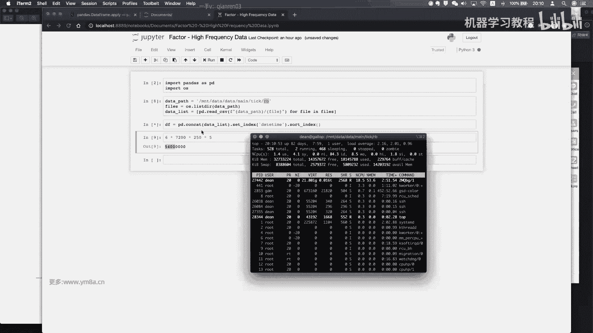

有兴趣的话，同学们也可以去试一下就。Tennis。

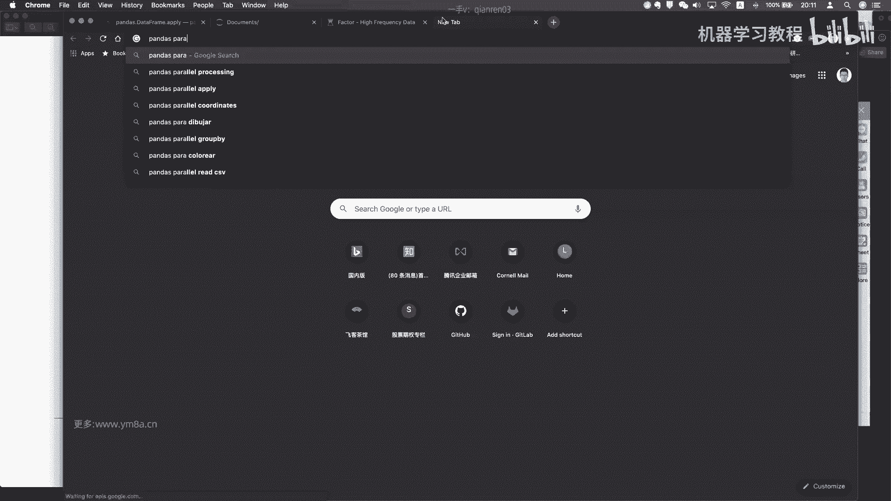

呃。是这个。就只在linux跟mic OS上面支持。对。就。啊为什么还这么慢？只想怕不应该。就就我我觉得大家就是说在做量化过程当中，就是呃遇到什么问题的不断的想解决办法就是了。而不是说这个事情我不会做。

我就不做了。对，那其实在工作当中其实也是一样的对，就是想办法去解决问题。对，因为本身你做的就是探索性的工作。那可能现有的就是很多都没有现成的解决方案。

或者说其实这个行业的呃很多最基础的一些知识的流动性并不是那么好，并不像互联网。可能大家还挺愿意分享的那这个行业可能大家并不是那么愿意去分享那这这样个人就是说在从业过程当中是要自己去注意技术的技术的积累的嗯。

好吧，我是不是应该不用去读这么多数据，可能给大家演示一下读。系。就不应该读那么多数据。但其实之前读过也应该也是OK的。啊，好吧，还是memory error。那我们呃。嗯。

Mmo error32G内存也不够，不应该啊。我看一看。还有什么人称的意见？嗯。嗯，好的，那就。如果是这样子的话。我们先读一部分数据吧，哎。是应该停一下停掉。不能把一次性。等我漏了出来。I home。

我只想看files。对吧，然后。😔，如果说我们想。呃，读到那个比如说我们读2014年的。sorted files看一下，我不知道这个能不能 sort。我是可以的。我们去签两0个好了。

sortrtic files。但是这样我已经读完之后，不知道他的date list里面的。顺序。嗯，我需要怎么来做呢？怎么来做呢？其实我现在只想读2014年的数据。好吧，那再重新读一遍吧。呃，然后再去。

😔，这样应该会好一些吧。哦。然后再去。😔，刚刚的事。嗯。这后再读应该没有问题了。对呀。Pity。Data list。然后我要的是。7。In。Da time。然后是。So。Index。我的是。先把他。

好的，我是不是要把主拍der进去关一下？不应该啊，这个问题。嗯，我看一下。好的，嗯，那大家先休息一下吧，然后我来把这个问题给解决。我们8点半再回来继续。嗯。

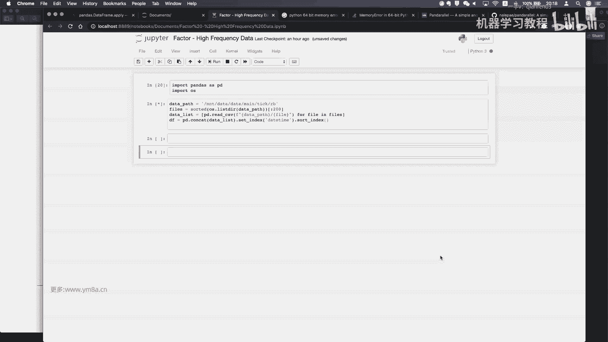

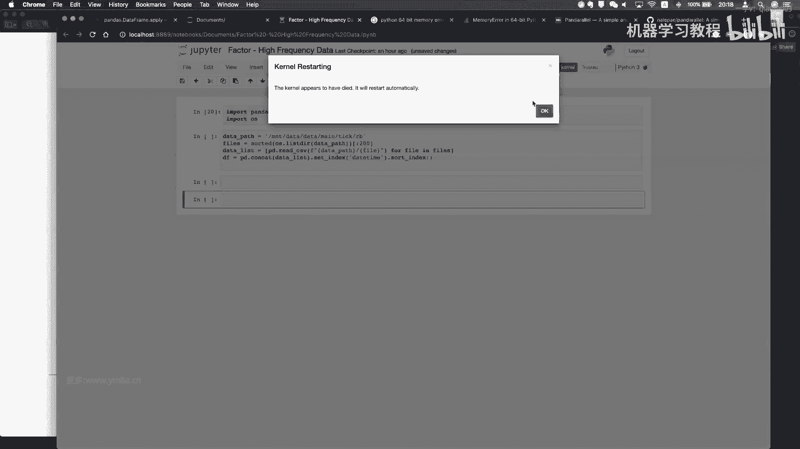

好的，然后我们现在回来。对，其实刚刚那个问题我想了一下，嗯，把它放到excel里去执行的时候，它是可以去load所有的数据文件的那很有可能就是说嗯。

我不知道支patter有没有在就是说对于多个命令去运行的时候，他有没有去做优化。对，可能中间有些步骤是会被优化。那可能这样的话就是说没有保存中间步骤。那这样的来说，内存可能是够的。所以现在是。呃。

如果说我们看一下跳的话。对，一直到2018年的数据都是有了。对，然后对那这样子的话差不多整个我看一下DF的长度。对，总共是4592万毫数据，就是一个品种是4592万行。对。然后这个还只是主义合约。对。

所以所以所以就是说当我要去做配对交易的时候，那涉及到多个会员，那其实对于计算机内存的要求还是呃有挺多的呃需求的。当然嗯你实际上再去做回测的时候，你真的不需要把我们现在d columns是有很多的。

嗯我我们实际在回去回测的话，那可能有些东西是就是不需要那么多。对，那那这样的话来说，我每减去一个栏。那都会得嗯节约很多的内存空间。好的，然后我们现在还是来嗯我我们上次做的跟上次一样。

其实我们要首先要做的是就是。嗯，就是我们要去把我们的train和develop呃给分开。还是去对DF点。什么来着？ symbolbol。然后。30 pairs。Right。悟空吹。😔，我们还是嗯。

用百分位数用75%来参吧。然后看看是第几个。要咪。Traing。Because。好的，然后tryter先看一下。对，应该嗯。OK这面有个问题是。嗯，希望把它去做一个set，我们只需要去重的结果。

但这样可能会有一些问题。嗯，这样是对。然后我们这种的training set，然后。嗯。然后就是。呃，是这样的，就是就是嗯我们先来看一看这次我们要定义的这样一个。我要想定义的其实是。嗯。

我先看一个盘口吧DF。Sureot。其实我们这次想用的是。我们直观直观的信息是来说，嗯，盘口除了就是我们的这个tick的最后的成交价last price，其实盘口也会给我们很多丰富有用的信息。嗯。

bd和ask对，一个是盘口的spread，就是ask跟bd差多少，还有一个是bd和最优的b跟最优的ask之间的volume差距。对，嗯，就是你显然就是说如果说我b呃数量远大于ask的话。

ask volume，那我相当相对来说是说其实是有比较强的一个就是买盘在盘口的对。所以嗯然后其所以其实说我们是可以用呃用这个数据来想办法去设计一些因子。我这边可以简单的先举一个例子，嗯，我我叫他。嗯。

嗯。bd ask im balance就是我想利用bd和ask之间的。呃，不平衡来不平衡的这样一个关系。对。他的 parameter是。嗯。Big and price。

别的 volumeume我们就按这个顺序来吧。然后我要做的事情呢，我要return的是什么？消てるもり。减去。Ask。啲坏带。就是我先把它nmalize一下。No nice by。两个的和。

然后我再去想一想。嗯。我就去做。😔，就是说我想要设计这样一个因子是。嗯。嗯，想要设计这样一个因子，是就是说能不能把。盘口的。我只随便写这样一个印字啊。呃。

ask price减去b price就是一方面价格的就是说量是很重要的。但同时嗯我们认为这个价差也是重要的对。然后团了再把它给。嗯。我设计有这样一个因子。对，然后然后接下来要考虑的事情就是说。

我们怎么去嗯做这样一个事情嘞？就是我怎么去把它。呃，怎么去把每一行就是都算出这样一个因子，对吧？就是嗯我我们先用就是。呃，直观的来说的话，其实呃有一种想法就是说嗯就像我们上一节课一样，呃。

我是可以给我们的我我我我们这次就先支取一个。支取data frame的前一万行吧，就我们先为简便简便处理。然后我们上一次的操作是。我们会直接给他加一个栏，对吧？然后然后我们在做的事情是。And。

相当于说我们就把上面的公式又重写了一遍。这这这是一种可的，我不是说这个不可行，这是一种可行的方式。对，但是如果说我们因子每个都多的话，都很多的话，相当于说我。都要去手动去写这样一个东西。嗯。

可以可以就是说，但事实上我们是想要说。呃，我们去统一我们多个音子，我们统一的input都是一个ro。然后根据我们我只要去指定我的fk，我的functionction是什么，然后它就能计算出我的音子。

这是事事实上我们希望的是比较理想的这样一个途径。那我们先看就是按照上次的。我直接复制吧，就是把这个复制过来，前面加一个subdF。就是我这边都是注意要用它原来的参数。这这这这显然是一种可行的路径啊。对。

就是你相当于说我还是去根据我的合约去look，然后每个合约去单独计算。对，然后然后还是再次强调一下，为什么说我们要去呃针对每个合约去look。

然后就就是说嗯我们我们不能简单的就是把这这样一个data frame默认为是一个连续的单个合约，中间涉及到主力合约切换的问题。这样的细节就是处理还是非常非常有必要的对。就是你不能把如果主力合约切换。

显然你不能把他们的return直接就拿下一个 bar减上上一个除以上一个 bar，然后你来算这个return，这就显然是显然是不对的对。嗯，希望没有写错。还有是。然后我们看一下下点。嗯，有什么问题。

好像。我肯定哪里写错了，肯定哪里写错，不然不应该这样子。OK。我这边没有取到前一万号，只取到了第1万号。对吧。然后。ok this works。这就是我们有这样的一个biask imbalance。

然后然后我们上一次就是接下来要做，就是说我接下来要做的事情就是上一节课我们不是说我们是拿next return去做，对吧？那事实场你t也可以去拿nex return。就是说你拿下一个t去预测。

但显然来说，我觉得就是比较好也也可以尝试的一个思路是，如果我去做分钟策略的话，我其实可以去预测的是。它的correlation跟120个tick，也就是一分钟之后的correlation。对。

然后事实上说我到底预测一分钟还是预测30秒还是预测10个tick，这里面有很多尝试的空间。但事实呃你基于不同的周期去计算，你事实上你就能得到不同的因子的这样一个预测值嗯。就这部分是给大家去尝试的。

然后我这次想强调就是说你我我们在计算就是多个因子的时候，嗯，除了用这种方式来做的话，其实我我觉得更合适的一个方式可能是用一个嗯就是用嗯。有一个fuck的方式。呃，就是呃我不知道大家有没有用过，就是嗯。

pandas apply呃，这这这这个函是有用过的。同学们，因为大家熟悉它怎么用嘛，就是就是说我我我想就是说我每次我不管是针对一行还是一列。然后我给一个传传进去传进去一个放k。

然后就能根据我们这样的东西，呃根据我们的function去算出我们因子。这实际上这这这个apply这个反函数是非常常用，尤其是说用在我们计算因子的时候，我我觉得是相对来说比较呃好用的一个方式，就是。

大家可以注意的，就是说你我们上上节课不是提到有国泰191，还有101的因子。如果说是呃只是只是只如果有一些因子是可以是时常用这种方式来去做的。你可以把你的每一个因子都写成一个functionction。

然后然后把对应的functionction名字传进去，你就可以去计算这样因子，这样相对来说处理起来会更高效一点，高高效一些。对。然后就是那我们来看看这个用fk的方式该怎么写。

就是首先是我们这样的因子计算方式，我们传递的是一个ro，对吧？就是所以在这边的话就axs是肉。嗯。其实。嗯。Big。Ask you。balalance to我希望做的是。Sorry。

 sat the off。然后我的fk是。嗯。fk是什么？是倍 askbalance这个函数。然后我的axs是等于一唉，这样做，我估计axs是等于一什么意思？就是。Co columns access。

呃，no这个ax就是我们想要的是apply function to each呃 indexex to default是0。就是我们应该是要做的是ze，那axs应该是等于。0对，那这个可可以不行。

因为它de。然后我们要做的事情就是说嗯。对，然后你看它传进去的话，如果我传进去是一个ro，那相对来说呃，那同样就是说我要注意的是我这个beta imbalance它的parameter。

就是它它传进去的 parameterameter不再是这四个值了。所以我们可能需要新写一个这样一个。嗯，先写这样一个函数。那我先把它给复制过来，因为。所是说我这时候传进去的是一个row。

对我传进的是每一行，这个要注意。然后。然后要做什么事情？嗯，这边有一个参数是要注意的是r，你用的是dforge force的话，你就是把每一个行传传递成一个s。

然后我个人比较喜欢的是呃就是用这种这种就是dege这种方式，就是我不希望它传进是一个npower。我希望传景传进去就是一个呃是一个roll。那这样的话嗯。嗯，你其实如果你不知道的话。

我觉得很简单的事情就是。哦，我print一下是什么东西就好了，对吧？OK让后我们看一下这样是不是可以work。呃，Data screening balanceance我是不是哪写错了呀？

newbalance。哦，这个东西我都没有。嗯。B的 ask。Garen。嗯 balanceance too。就是你不知道要传什么的话，你先看看它okK你 print出来是一个row。

然后date time的 objectject。然后他又出错了，他说你不能这么传。嗯。嗯，行，哎，我这样是不是。我看一下我传进去的是什么东西。对。你是一个pandas series。ok那。这样就O了。

嗯，然后我看一下，我传进去对那我其实要传的就是找到对应的这个con就OK了，对吧？它是一个int嗯。嗯，那这样还是不对。还是要把刚刚那个。刚刚的就。一个primeter给以加进去。嗯。

如果是把 parametermeter加进去的话，就是说。嗯。还想做 vaccine。嗯。有。😔，应该是axs，就这样的话。这样子的话。OK这样子是看上就是。呃，这样的看上去就对了。

因为我肯定显然就是说我每一行print tried应该是一个相同的值。那接下来我们要做的事情就是。把。🤢，B volume紧。Quu。直接assign给不同的肉，就O，把肉第几个元素就O了，是多少？嗯。

我们刚刚还说来着。嗯，看一下他这边。Cos。嗯。からに違う。我不知道是不是可以这么写啊。Price1。index，那你不既然是个index，我就把你变成一个list。OK14。是第14，所以。

那我们就知道了，就是既然bpri是第14个的话。嗯。那Bd volume也就是相应的就有了。我们就往后写就行了。就是我这节课其实是就想告诉大家，就是如果对program里没有那么呃熟悉的话。

就是我们其实讲的是说怎么去解决问题，对吧？因为谁也不能就是说呃一次性就把问题给解决。但是就是。在engineering的过程当中，就是不断的去迭代，看自己问题在哪，然后想办法去解决问题。

这个能力可能是大家长期要去培养的。那如果是这样的话。对。O。好。哎，这样是算完了哈，让我看一下下。呃，这两个算的okK呃，应该是算的一样的对吧？这样代表我们的计算是没有问题的。好的。

其实这个简单例子就是说计算这样一个tick呃，大家可以之后去客后去测一下，按照之前的方法，你可以去测一下，就是跟我的return的 correlation。

那那那这边要注意的一点是我这边没有close price，对吧嗯。我用的都是那个last price，你你可以用last price去来做嗯做return。然后然后一般来说你用tick数据做的话。

你预测周期嗯不能太短不能太长，不能太短。意思是我预测一个tick，我显然是说我拿近几个tick的数据去预测下一个tick。那胜率可能会那我觉得就是这个correlation会非常高。

但是呃你你可能就是说覆盖不了你的成本。你比如这个tick价格就没有变动，只是盘口有变动，对吧？然后或者说这个tick就是价格变动比较小，那覆盖不了你交易手续费成本。

我我建议大家是你可能稍微预测的时间去查一点。就是比较怎么是合理周期，到底是60个tick还是120个tick还是30个tick。我觉得这个都是你要测试研究之后才知道。然后你甚至不同的因子。就是你看它。

基于多对于多少周期后会有比较大的影响。对。那，这个例子是就是告诉大家，就是说我这样一个high frequency data，我可以用这些tick去。嗯挖哪些数据？对，那嗯这边只是一个简单的利用。

就是be呃b price bit volume这些数据来做。那事实上就基于它你是不是还可以去设计出其他因子呢？比如说嗯你当前则由盘口变化了多少，对吧？就是我们你之前凡是说用分钟的pri变动的因子。

其实我们在这边也都是可以去利用的。我的价格变动了多少？对。然后你你你事实上也可以根据这样一个盘口去算出一个当前盘口的加权的一个平均价格。对，然后你基于这样的平均价格。

你可以再用所谓的technical indicators去计算价格的变动趋势。因为事实上盘口的价格呃，就是在当前这个snapshot这样的价格是比你分钟的价价格。

可能说呃它就是说更能反映出你在一分钟之内变化的一个趋势。你可以计通过计算它加权平均价格反应反计得到这一分钟之内整个的市场的变动这样一个情况。对，然后呃事实上就是说如果你想要去抓那种。

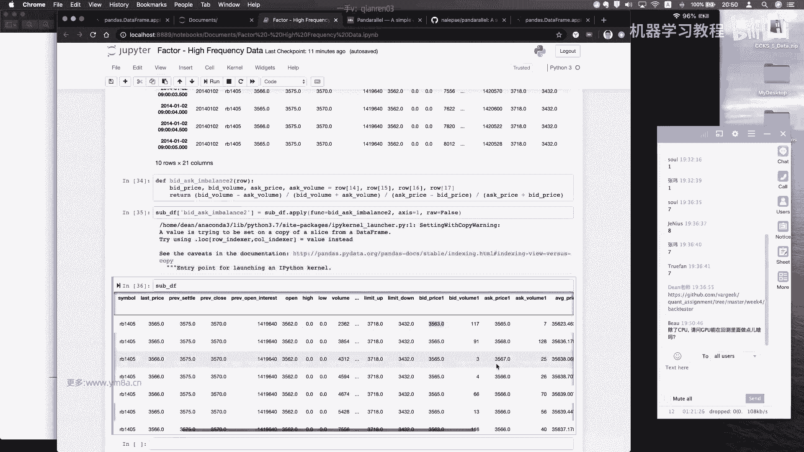

就。对，像这种的话，你市场你是可以考虑用这种tick的策略去把它给抓住的。你要去找这种，你看大部分时候就是说相对来说它变动不会特别大，这是tick的这样一个金融数据的一个。

也是说这是交易的一个比较比较特殊的这样一个情节。你大部分时候你可能只是在不断的去抖动。对，但是如果出现大的波动的时候，我们往往是想去ca。那这样的时候你可能只有只有用tick你才有可能去抓到。对。

因为你发现你你你你比如说你设计一个特征，叫连续三个tick的呃价格都比上一个高。对，那只有那只有这个因子，你你是可以用tick去抓住的。但这个如果是在分钟的话，你可能就是说这个事情已经结束。

做完了这一分钟，你可能才会才会去抓到这种特征。但是用tick你可以考虑去。去抓，当然这个还不是特别典型，因为罗文经常会有那种呃大涨大跌的这种。比如说呃一分钟就是变动了几十个点。那事实上你用tick的话。

我觉得抓起来会就是可能会更更有一些优势。对，就是说我日内交易，我不一定说是每个tick都去发单。但是。我可以辅助的利用这些tick去更快的抓住信号，以及去增加我的因子的这样一个丰富的程度。

因为当大家都在用统质化的分钟的数据去计算的时候，那么呃你们得到因子很有可能也是去同质化的那即使说。嗯，我们不用，嗯，就是说即使我不用tick数据，那是不是也可以考虑说我从tick数据生成新的分钟数据嗯。

来去来去再计算因因子呢？那这个什么意思？就是说比如大家计算分钟数据都是从整分钟，比如说22。00到22。01。那我是不是也可以用22点30呃，22。0000分30秒开始或者22。00分37秒开始。

然后以这样一个以这样一个就是非呃整点的这样一个分钟作为作为切分的一个时间段。呃，去尝试一下这样的是不是有可能做出一些因子。因因因为我自己观察到是以前就是有一段时间就是在就是在3。

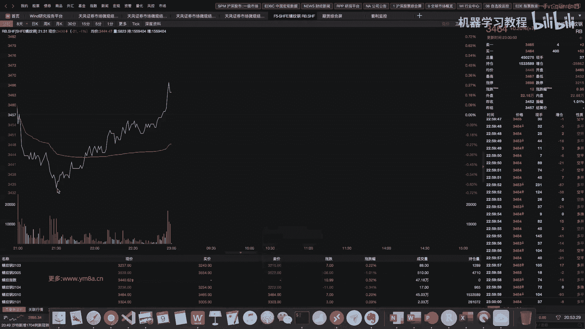

会有这样大的波动。呃，不好意思，刚刚蓝牙蓝牙断掉，现在大家能听得到吗？我看一下，刚刚蓝牙好像断了一下。O。呃，我继续。对。

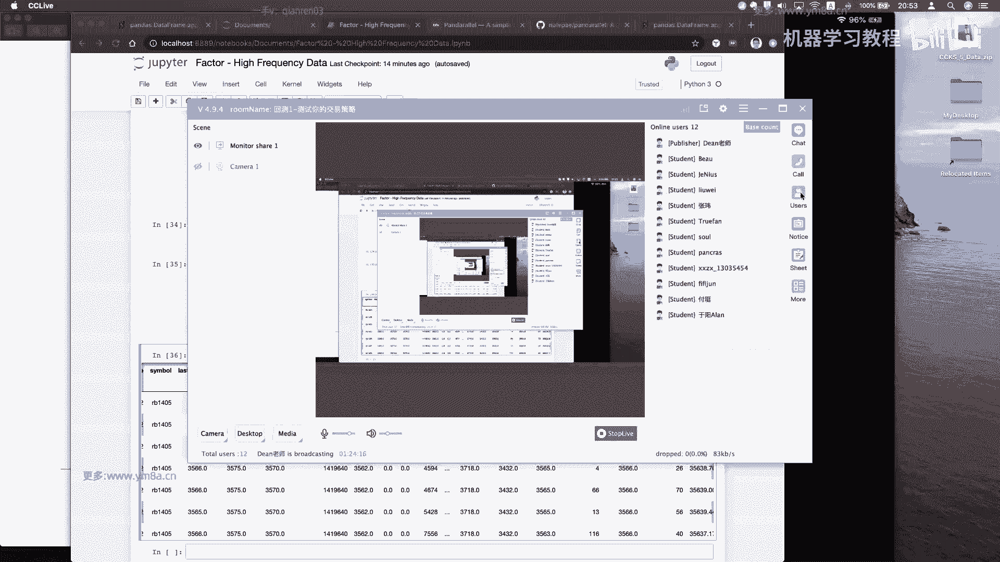

嗯。好的，就是就是说呃我就是说市场是不断的进化的。当你用相同的30分钟或者1分钟数据，你会发现整分钟的时候，可能正好市场就会有这样的波动。那这个说白了可能就是洗牌。

就本来说你故你这边有一个止损单挂在这儿。那很有可能这这个33435价格就把你打掉了。对，对事实上说，如果你你考虑说用不同的分钟，你那你可能就有可能会去避规避到这种波动，或者说你想要去利用这种。

你想要做的就是说我抓的在整点数整整点数的时候，这样一个反转。对。所以就是说嗯我觉得一方面是大家去观察市场，然后根据市场得到的数据去验证自己的假设，然后不断的去迭代。

然后挖的因子可能就是这样的一个这样的一个过程。然后至于说我们现在挖的因子怎么跟之前的回撤给统一起来呢？一旦你觉得ok的时候，就是现在可能初期的时候，大家不用考虑太多。

你直接把你的因子转化成一个仓位就O了。然后你可以简单来说，你要可以要么就是非多即空，要么你可以说你可以把你的因子设一个阈值，然后达到一定程度的时候才会有多优空。

然后甚至你也可以考虑说不同的因子强度对应不同的仓位的呃仓持仓的数量，这也是可行的对，然后呃就是高频的因子对我觉得是然后高频的因子，你不一定说是我计算出高频因子每一个分钟每个tick都要去下单。

你可以去当当 sampling。你把高频的因子转化成一分钟或者2分钟甚至5分钟的这样一个呃这样的一个信号。然后隔一段时间去下单。对那只是说用tick的一个好处的是你可能能比别人更快的去抓住这样一个优势。

那那比如说你等到你如果是5分钟，你可能在这边ok过了5分钟，过了两个5分钟再反转。但你如果用tick的话，你已经。很快的确认了说这样一个反转其势，那你可能就会把你的空单凭道改为太多单。

我只是举这样一个例子。对。所以就是大家在做呃因子挖掘的时候，可能还是要去多多思考。然后另另外方面，其实我个人并不是特别鼓励说用呃复杂的模型呃去。或者说用AI去去挖掘这样的数据。

可能大概率得到的是一个过拟合的。这样一个模型，或者说嗯或者说嗯不倾向于用复杂的模型在低频的数据上。对你可能用tick数据还好一些。如果嗯对主要是因为是在交易的过程当中本身这至于市场的波动很多都是噪音。

就是你我们看到这样的一个级别。在就是说在呃日内的这样一个级别，可能这样小的波动是一个噪音。但很有可能说你在放到更高级别的话，那呃你呃放到日级别月级别，你会发现可能说你这样大的波动也有可能是噪音。所以。

大家就要看了，就是你交易的时候到底是什么？就是很有可能说用复杂的模型拟合出来的是一堆噪音，这个是比较可怕的一件事情。所以其实我个人的风格。

或者说我一直建议的也是说嗯大家还是从用简单有清晰明了的这些含义的一些呃音子开始着手，然后不断丰富自己的音子库，而不是说一刚开始就用简单的音子去。拟合出一个复杂的模型。呃，嗯，就是事实上来看来说，嗯。

量化交易过程当中并不是像其他的行业一样。不管说是你说比如说NLP我不断的呃增加我的模型。可能之前RNCN就够。那现在然后上bt，然后上更复杂的算力。对。

因为嗯就是要注意的一点是就是说深度学习跟机器呃跟量化交易不同的一点是很多我不管是在呃自然语言处理方向或者是其他的一些任务，或者是下五子棋呃下围棋，我们的目标函数可能就是说我们的就是说结果都是确定的。

但是在量化交易过程当中，很多就是说我们预测目标是不确定的。这这样这样就是说用过于复杂的模型可能会给自己的教育带来一些困难。对嗯，我当然也不排除说有人用很复杂的模型来去呃来去赢得就是说很高的胜率或者是怎。

但是嗯我我或者说我见的比较少吧，相对来说对，就是没有说用到那么复杂的模型。可能大家着重的是说嗯，我能考虑说在因子层面上研究出哪些能够具有强相关系的一些信号。那这样来说，意义可能会更大一点。对。

这是我个人的一些观点哈。然后。

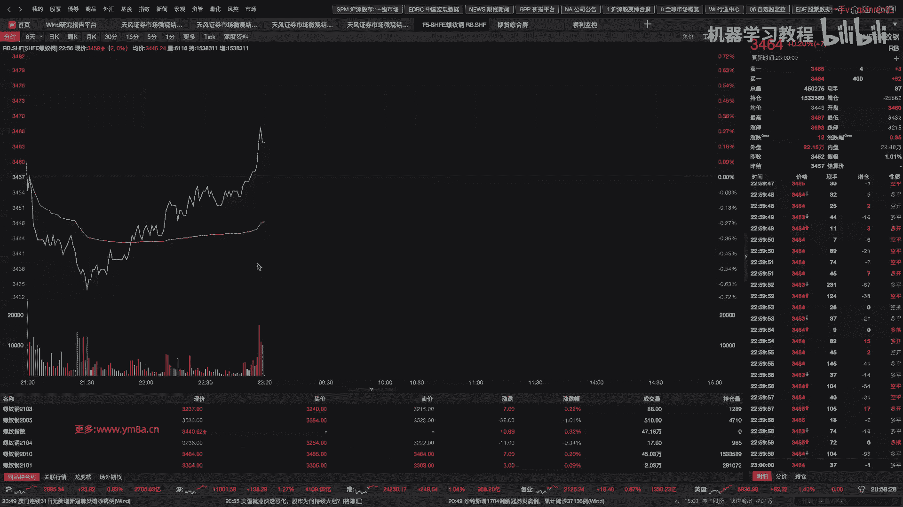

嗯。那反正那呃就是说高频音子这一块，我只是举了这样一个简单的例子，然后之后。然后呃我今天会给大家就是有一个呃我看一下有一个reinforment的这样一个paper。呃。

倒不是说让大家真的用这个呃强化交易的那个强化强化学习的这样种方式去做交易。只是我觉得它里面提到一些因子，还是挺好的，就是有兴趣的话，大家可以去尝试一下。

然后我再次强调就是这门课可能之后并不会给大家布置强制性的作业有那些，就是说说白了就是这这个东西就是大家也是基于兴趣来学的这个事情。就是说哦本身我我个人也是很喜欢做量化。

是因为它它是它是一个就是相当于你可以去无线玩下去的游戏。因为大家都知道游戏分为两种，一种是有线游戏，一种是无线的游戏。我我个人觉得量化是一种无线的游戏，就是你可以去不断的去尝试去探索。

可以做很多有意思的事情。就不管是从你的系统层面，还是说从你的就是。呃，就是从你的交易策略层面。对，这个是这个是对去年的还挺新的一篇论文。

就是他讲了一个他讲了一个就是用deep reinforcement learning，然后再交易就是或就是那个数字货币市场做market making。呃，简单说一下market making的话就是。

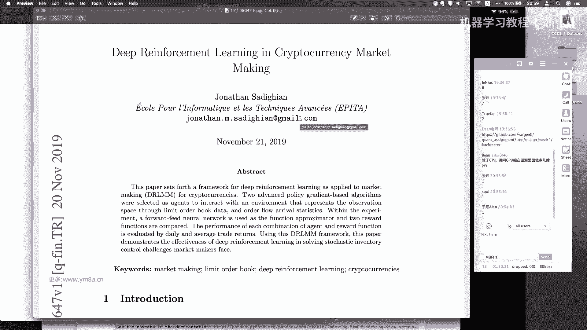

可以说我们在市场，除了我们的呃投机商的话，呃，也会有人就是负责流动性。就是说我自己我自己会在卖易挂实售卖易挂实售。那可能期权市场更多一点，就是说这样的话，别人跟我呃我不是我自己可能呃我不去做呃。

我不去做方向上的判断，或者或者说我只有我需要去对冲我自己我自己的我自己的风险。就是我在这边的盘口买和卖都有成交。我我都是挂在那儿，我不会去主动成交，我都是我都是等着别人来去吃我的单子。

那我赚的钱就是说我一旦满意和卖一都赚掉的话，那我就会去呃，我我就会我就会两边都会去赚这个钱，并且一般交呃做事商的话会跟交交易所是有呃手续费返还的约定。对。

可能并且在就是说他呃因为我本质上来说我给交易所提供流动性。因为对于不活跃的合约，可能盘口都没有什么人主动主动想要去买。那么做市商要做的事情。就是说我在盘口都去挂上我的单子。

这样有人就会这样有人想要去在市场投机主动成交的时候，就可以跟做市商的单子去撮合成交。这样能促进市场流动性的发展。对，呃，所以做市商赚的就是这样一个钱。那做市商其实呃要那那显然来说，他们都是要去搞。

高频率。那当然也有一些人是就说其实你频率没那么高。嗯，你结合一些人的手工做事，事实上也是存在的。就是在尤其在我记我记得是在期权市场，是那中国可能还有一些团队是在用呃手工加机器结合做单的方式那做事的方式。

那做市商的核心可能就是说他要去就是如果是期权做事，那可能要去说你我要去对冲我的风险。因为我持的是持仓的是一篮子的合呃，持仓的是一篮子合约。对，就是。

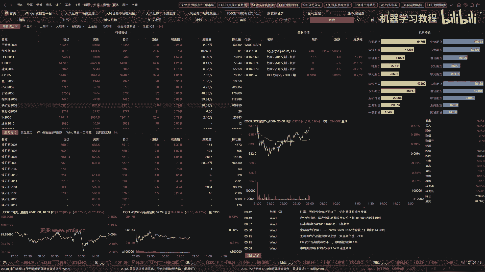

就是我有很多很多的合约，然后我不同的合约，不同的风险，然后要保持我的总的持仓的呃就是投资上面的，再呃不管让各个Gs上的风险都是呃在我合理的risk budget之内。对。所以这是插一句。

就是说做势商在做的这样一个事情。然后这个paper里面就是说他讲的是说高频做势商他会用哪些因子来去做这样事情。对，然后这个他因为他们是完整的order book，我们这边只是一个snapshot。

但是还是可以去参考一些，就是他们他涉及到的一些因子。就怎么用bask去做因子，然后大家可以去测试一下这些因子是不是O的对。好的，然后就是高频音子的话，我肯能就是先给大家讲到这边。

然后这个这个东西我是呃这个paper我是待会可以发给大家。然后大家现在对于这块有什么疑问吗？就就是呃我我觉得课的核心就是研究的核心还是说要重点关注的就是提升自己的研究能力，去想办法去找到影响市场上。呃。

你要去了解这个市场，嗯找到去影响价格走呃变动的这些因素，然后把它就是去研究，去把它去finalize下来。对。然后一旦你的因子库积累到一定程度之后，你再可以去把这些因子去组合去做交易。

那相对来说会呃会容易一些。对。嗯嗯，当然也有说说有人说就是啊对忘了提，就是跟之前的就是说我们的回头系统怎么结合起来。一方面就是说比如说我们第一节课就是前面两节课做到说用mooving average。

就是说用简单的规则。那其其实这本质上也是一个因子了。用简单的规则转化成多和空。那你这边因子的话，你事上就可以根据因子的值，然后来去做cut off。你去根据因子的这个值来去做统计。

然后包括我们呃接下来会讲一下，就是我们最简单的用线性模型怎么来去做这样的一个事情。假设我有了很多个因子之后。对，其实简单来说就是做一个线性回归。对。呃，现在大家有什么问题吗？那个嗯好嗯没没有问题是吧。

然后然后今天我给大家讲一下那个呃大家对那个机器学习熟悉多少哈。哦，或者不一定接选就线性回归吧。因为我们今天这节课其实主要就讲一下那个我我觉得主要讲一下就是线性回归，就是linium model。

我们怎么来怎么来做吧对。嗯。ok。这个是。😔，ok。哦，想了真的是。这是在。哎，稍等一下啊。嗯。为什么这个notebook还能同步过来？OK好的，然后。那个大家对线性模型了了了解吗？嗯。

就是了解就是了解过多少吗。就简单的现性违规。嗯。或者这样我给大家简单go over一下吧，就是。要做的事情是什么？对。嗯。嗯。嗯，O可以嗯。就是其实简单的。理年 regression的话，本质上。嗯。

我们要做的事情就是说。我们先假设就是说我们现在这样一个X。是我们的。因私俱证。然后。他是。啊，让我想想是嗯。M by n。就说。我们有。N个feature就是我们上一节课。

比如说我们测试了很多feature或者是factors，对吧？然后这个M是说我们的。这个我我们每一个时间每一个时间点我们叫每一个样本。对。然后嗯。然后每一行代表的是。因为X都是列下来。

所以用一个transpose代表是一个呃行向量。对。然后就是。这这个X一什么意思？就是在时刻一的时候，它呃我们有有纬度A为N的这样一个因子。对。其实就是说来说的话，就是说我们想要做的事情就是说。

去线行线行回归就是说想要做的事情就是说呃。我要去。找到一组priametersta。然后。然后西塔呢呃我可能加一个0，就是加一个零的话，就是说。我会希望有。有一个X0哦X0可以等于1。对。对，那。

我本质上想去做这样一个事情。对。所以说我想要去找到一组呃C塔。然后然后我的目标是什么呢？其实是我希望是最小化我的真实的这样一个呃，我们我们上一节跟他讲了，就是说有一个。我们的一个Y预测目标，对吧？

我可以是la return。然后我也可以，可能就是呃loer return，我也可能说是就是说比如说是120个t之后的。Lorator。这这这个就是说我们的预测目标可能是要去自己去定的对。

然后然后这个哦Y的话显然也就是是RN。对osorry RM。因为有M个样本。对，就是说我每一个时刻我都预测出都有这样一个的这样一个预测值。然后。然后然后就是说我现性回归的目标本质上来说。

我需要找到这样一组参数去最小化我的呃最小化我的这个这样的一个预测的误差。呃，本质上来说就是用mine learning的话，就是说它有这样一个cost function。然后我要做的事情就是说。这样吧。

我们有。M个样本。然后我要去。哦。capital X。冇。我要去最小化。呃，我预测值跟。哦，真是指。这样的一个误差，这样这人是万一。Y2。对。然后我用的是平方，对，用的是平方。

然后一般mine learning它会在前面加2分之1，这个是为了你在就是求。如果你用那个。呃，gradient stock那个那最右的话，它前面会有个2分之1可能方便你去求解。然后。

然后就是本质上来说，这就是我们现一回不要做的事情。我我我们要做的是manimmise呃这样一个事情。对，然后如果说我们再回到那个。回到我们的code里来，怎么来做这样一个事情？就是我们接着会我们接着。

呃，上一课的。

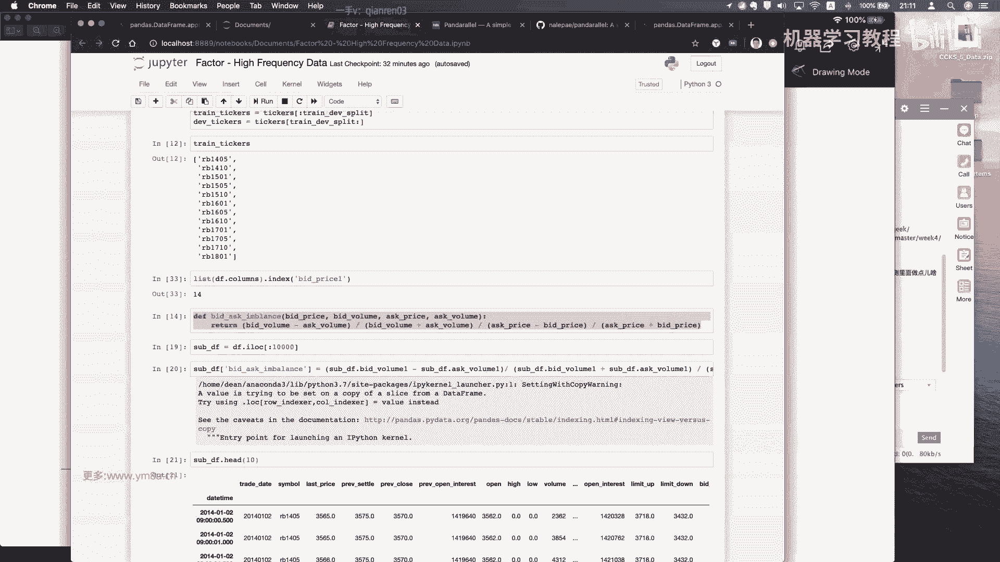

今着上一课的。

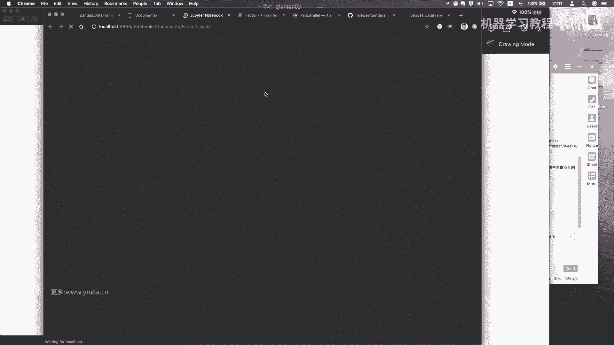

嗯。好吧，我们从头开始low。feature就是我们上次就是拿了这么多特征，我我只是简单来拟合这样一个那个lier regression。就事实上这个因子还都挺粗糙的，并且他们的相关性还会有一些问题。

对，但是就是说我们实验是okK的。然后一样的搂的数据。嗯，就是分钟数据应该会快一些哈。对，就是其其实就是说嗯就是刚开始你可能粗糙一点，我们这么去去写这样音字是O。然后其实我更希望的就是说。

就是呃我们抽象出来，你还是去调一个function就行了。就是你用apply的方式，你每次用一个apply，然后你把你所有的音子。呃，写在一个函数库里，就是你写一个就factor点这样一个文件。

然后每个因子是一个function。你到这边的时候，你只要是嗯DFdot apply就行了。对，就这样相对来说你代码会ele一点，也有有助于你后期的维护。当你就是你要新增新的因子的时候。

你不需要再对这一堆代码去进行逻际处理。你只需要你对你因子的呃那个文件去进行处理就好了。这样这这这也是就是呃在机构里面就是我们之前做交易也是这么做的，就不会去把它写到这样里面。

这样这就行那研究的时候可能是可以，但生产的时候肯定是不行的对。好load完了，然后concatenate，然后teachers，然后把所有因子算一遍，算完之后。对，然后我们先不用先不PC先不用PC。

我们先直接就是。T analysis对吧？然后就是我这边做的事情，就是说呃我这边用了两个return，其实这两个就是你也可以对比一下，就是应该算下来是差不多的。就是我会算一下。

就是呃嗯算一下每个因子的这样一个的呃。我们先说先第一个look是每个每一个factor，对吧？我们对应的每一个factor。第二个是呃对于每一个ter，就是因为我们不是有多个合约嘛，对吧？我们需要对。

就还是说的我们要需要分合一个计算，包括这边也是计算，我们算因子时要分合一个计算。因为。还还是说你不能引入其他factor，就是其他呃其他合约的这样一个数据。

你因为我我们这边的话就是呃你rolllling的话，你如果向前，你rolling了20个，你用其他的肯定是不行。所以这边要先先filter一下，你把它过滤一下。对。然后这边然后这边是我先算一算。

就是算它的嗯。嗯，就是算它的就是correlation coefficient。对，然后我把它对每一个每一个每一个tker去取一个平均值。哦，应该是plot得到这样一个图。就是这这个我是想说明。

就是说你市常用log return跟return的话其实区别不是特别大。对，但是那用log return就是有一个好处是你不同的return之间，你可以相加，这样子算起来可能会方便一点。就是如果。嗯。

现在用不到的话，你就OK但用到的话，你自然就明白我说的是什么意思了对。然后然后然后说线性呃线性模型的话，本质上就是说。线性模型本质就是说我们要去做的。

其实就是说我们刚刚他了就是写写这个呃公式的话调包的是ok的，是显O的。你用lin regression去呃去fit一下就OK了，对吧？你完之后，然后你得到它的 school。

然后然后你也可以得到它的系数。对，其实其实线性模型就是说呃你本质上我要找到这样一组呃参数值塔。那有了这样的一个seta值之后，我就可以去拿新的，然后在develop set里面。

就是我可以拿新的新的这样的数据去算出特征，然后乘以我这样的primeter，然后给出这样一个预测值。这样这样这这样其实简单的来说就是这样一个线性模型是闭环的对。

其实你要做的事情就是说你仅仅是把我刚刚下面算出来的primeter值放到前面来呃，就是放到前面来，然后你再去去然后然后这个时候你如果真实真实交易的时候，我们已经得到了一组。

呃s塔就是s塔值是我经过training set已经得到了，我已经确定下来了。然后真值交易的时候，我拿这个se塔值，然后根据我实施得到的行情的这样一实施得到的行情计算它的特征。

然后根据s塔值乘以这样一个特征，我得到了我的一个Y。如果我说我觉得这个YA嗯，好像这个接下来的我预测下一个分钟的loger return会很高。那我可能就会调整调整我的仓位去买入。

这样其实是这是一个简单的这样一个呃linear regression的这样一个模型。对。嗯，这这部分应该没有什么问题。因为我所以我大家其实都会知道就是呃线性模型是怎么回事。

就是本质上线性模型其实就是你要去呃找在就是去。就是你要找的是你如果你用二维的话来说，就是你要去找这个点呃去拟合这样一条直线。然后你这个点到这个直线的，你这样一个均方，均方的距离差，要是平均下来是要最小。

它本质上几何意上就是这样的。然后你是如果你是多维的话，只是把这条线换成了一个hyperplan换成一个超平面。对，其实本质上找的就是这样一个事情。那嗯信性模型其实嗯大家要看到。

可能就是说我们这样算下来的model的，可能就是结果它就是。就是我们算下来就是它的这个可能不会特别高。对那不会特别高的话，当然就是我觉得不用担心，就是它并不会像我们做化学或者物理实验呃。

严格的都是说我们的能够到0。99几。我们可能算有0。010。02，那我觉得都是O的。因为本身就就是体现金融数据的这样一个呃特性，就是呃就是低性噪比。对。

然后就我们并不care说就是我们真的不care是呃是说要特别高。但是你其实更关注的是你我如果能找到一系列因子。比如说有个0。030。04。那事实上我觉得就已经是非常好的一个效果了。当然也跟你所取的预测。

之前我们讲到跟你取的预测的长度有关。如果说是你用呃高频数据预测出来的那可能自然而然可能会好一些。尤其你预测周期又短的话，那低频数据预测出来可能会比较难。但是相当来说就是。

说如果说你觉得你的就是你的那个ask的话，呃，如果达到一定程度，你可以事实上就是你通过plot，你也能看出就是不同的呃呃不同的就是看出不同的因子，可能说那个那个效果会比较好。

然后你可以逐步的去考虑说去你去测试，找到优化，找到一些比较理想的因子。呃，线性模型可能就到这边去，暂时先到这边，大家还有什么问题？然后接下来其实就是。呃，今天内容没有太多。然后接下来其实就讲一下。

就是说我们有多个呃，就是我如果说我因子很多的时候，我怎么来去嗯就是或者数据很多，我怎么来去做我的diment reduction。其实就是如果大家知道PC的话，应该相对来说会好一些嗯。

那现在我们先休息10分钟。然后大家有什么问题吗？就是有什么问题的话，也可以，我们也可以微信语音，或者是把这个问题发到发到呃聊天记录框里来。反正这样就可以大家问题比较少哈。还是说前话我比较担心。

就是说还是说前面。都听懵了，还是怎么回事？对我没有讲清楚，那这样就比较。不是很好对。对，那大家先休息吧。好的，然后。嗯。logy呃我来看一下，大家还有比较多的问题。OK就是说呃首先是嗯。

logg return嗯，就是其实我在算因子的时候。就是这边我我也有算logve return，就上一节课实际上是有的loer return，你要看一下。

本质上是我先对对嗯你其实其实你看我是有两个log减嘛，对priice直接是相减。对，那呃这这个这个你如果是log的话，本质上就是说呃是下一个close。除以呃上一个close再去log，对吧？呃。

注意一下，它不是那个不是不是对return去log，因为return是return是减一。对，就是说我是对减一前面的东西去log。然后因为log一是0对。所以这样子就有一个比较好的特性。

就是说当我要算return的时候，你可以对两个那你想一下两个两个loger return相加是什么，对吧？两个log return相加的话，本质上来说就是中间的这个呃cos被 cancel out。

你直接算的就是嗯就是两分钟的log return。就你只要相加就得到了这两个，这这是它一个比较好的性质。对。呃，我不知道这个有没有回答，有没有解决这个同学的疑问。对。

就就就是说呃就log return确实是这样算下来会会比较方便一些。对，然后你说的平滑，有就是你可以会不要平滑。但是事实上就是我们在看到回测，就是说看到这个效果时其实差别不是特别大。

因为我们更加关注的就是说是关注它的相对值吧对吧？你我毕的比较是可能不同因子，哪个哪个因子预测效果会好一些。然后说除了用下一个return，其实刚刚我们有提到呃。

我就是说这个是我预测目标本质上是要去也是要去思考的。就是有时候我说我做了一大堆模型的时候预测下一个return比较难。那我是不是考虑一下，就是这个return是不是有g，就是有有推迟的效应。

就是说我拿了这30分钟数据，但我不是预测下一分钟，我预测下5分钟，下预测下10分钟。我觉得这个都是不确定的，就是可能都要自己去尝试出来才知道。对。

然后问linear regression是这样量化用的多吗？我觉得就是说量化更重要的就是说呃你我觉得用的多不多，我觉得多，基本上大家都是线性模型，不会说是呃就是说线性模型。

因为相对来说你我最明确的知道我在做什么样的事情。对。就是如果我用非线性的话，如果我中间加了个sigma，或者是怎样，就是用手经网络加了个非线性的东西。

我可能就是相对来说不太不太清楚知道我因子做了怎么样的变换。对，所以其实简单的线性模型，你可以理解为它作为一个benchmark。对。嗯，然后回测一下，我再问一下。

就是说回测张伟同学说回测一般选取历史长度有什么要求？太早的历史数据。嗯，对。这是一个可行的对，这个是一个我觉得是一个open question。就我我个人想我个人理解是说嗯嗯就这个要提到就是说回测的话。

有有一种方式说，如果说我们做的日内，其实有时候你也不需要用到说太久之前的数据。嗯嗯你我可能比较好的方式是滚动的去做研究。滚动研究是我可能是说就即使说是我有相同的策略，但我要去考虑这个策略的参数的时候。

嗯，那我可能就是说我用的只是近一年或者两年的数据。然后然后又到了下一个月的时候，呃，比如说时间又过了一个月，那我再把新的一个月的数据给加到我的历史的回测区间里，但而把回测区间里第一个月的数据给踢掉。

就是时我相当于是一个ming window的方式不断的去滚动去去来抓取历史呃去做去预测或者是做训练。这个嗯。对，其实我们本质上是希望的就是说嗯呃是希望我们的因子是长期有效。

但事实上你应该做的事情是不断的定期的去review你的因子，它的表现，你可以看一下你因子的预测效果是不是在随着时间不断的筛减。很很很有可能是呃，如果说现在今争比较激约的话，呃，几个月之前有效的因子。

你会发现过了几个月好像不行。然后但然后有的因子说嗯嗯现在有的因子可能说是呃现在不是很好。呃，然后过了几一段时间又很好，过一时段一段时间又不好。那那这个时候我觉得就是说要把这个因子给踢出来。

就是说你不能把它作为一个因子，你应该去研究呃，这个因子为什我在什么样的时间段它work，什么样的时间段不work。就是说影响它呃因子效果的这个因素，你还是把得把它找出来，再结合这样一个因子。

你你得把它进一步处理，这样才可能它才是作为一个稳定的因子，而不是不然的话，因子只是一个你可能只是一个相对来说比。随机的一个东西，它并不是真正去能够解释你的呃未来的价格的变动。对。

所以呃我觉得张伟同学这个提的还挺好的，就是说事实上就是成熟机构当中，它都有嗯应该公开信息看得到，就是可能大家做量化选股的话，可能都是有几千个因子。对，那几千个因子里面可能用各种各样的方式去挖掘到的。

然后大们可能定期如果如果能力够的话，事实上应该是每天去review这些因子来决定第二天的交交易跟仓位，就市场上有同学也说自己去尝试过，用积极学习选股。嗯，嗯不知道就是说选股的话。

就要看就选股是一个很很大的话题啊。对，那事实上就是。用机器学机去挖因子，这个我觉得还是OK的对呃，你对。

因为毕竟相对来说就是你还是可以用一些非线性的组合找到一些很有可能就是说潜在的嗯比较有意思的一些因子。那这个就是呃基于遗传算法的，就是怎么去挖掘组合因子的话，我们我们会在后面有一节会涉及到这个东西。对。

呃，其实其实我还是说你看整个讲到现在，我还是更加强调是说是去找到解释性强的因子。呃，我我我个人的风格一直是重因子轻模型。对，因为说实话呃我找到一个非常有效的因子，我不用特别复杂的模型，我也能把它去做。

就是交易的很好。对。哦，我不知道呃，我刚刚有没有解答清楚大家的问题。或者还有什么需要我进一步去阐述的吗？对。哎，就是还有这个就是包括就嗯哇，这个问题有点长。

可以看这位同学这位同学对我知道以这位程序员同学好像做的还是挺好。对的。多个音子。不要着急，就是股票的框架本来是就是下一周我们是讲的是组合，然后就是就是讲的是呃投投投资组合。

对投资组合这一块的理论跟一些算法。然后接下来两周是股票多因子的OK就是框框架会去讲，但是嗯然后如如果说同学们觉得有必要，我可以把股票的提前，那当然也OK了，就反正就是就是差一周的事情嘛。

就多个因子找到一批交易因子时间序列上检验预测。然后。呃。嗯，对我我觉得如果从如果如果这个同学就个so同学就是如果自己。完全没有有过参考，自己想到这种方式，我觉得基本上是还是挺OK的。

因为呃呃呃有兴趣的话之后，我可以我可以单独发一篇研报。然后之后我们也会去实现就是怎么去实现这样多因子模型，就是嗯除了就是时间序列上的对有时间序列上，然后事实上就是说我的因子也有很简面上的模型。

对就是其实很简就是同样的一个因子的话，嗯就是我们因子分两种嘛，一种是时间序列，就是我自己呃一个一一个股票，我是按照类似于CTA这种方式，我去找到一些因子。对，然后然然然后是怎么来去做交易。

然后另外一个就是说我的同样的这个东西，我是去算king。比如说我算这个公司的这个公司的PEPB然后我是跟同类型的公司去比对，然后你然后事实上也就是你所说的就是说做多头部做空尾部。

但事实上就是在国内不是不能做空尾部，你可能只能去做多头部。然后对，基本的意思我觉得你理解是正确的。但是可能就是说在多音子的时候，你还要去考虑一些行业中心等等，就是是属于股票特有的一些东西。

相对来说会比期货会复杂一些。对。然后。呃，so灵魂同学，我不知道有没有解答清楚这个问题。然后这这个就是说你呃其实不用不用着急，就接下来两周我们都我会有两周是讲股票的，就是多因子模型。

就是我们怎么去构建股票的多因子模型。对。然后的话就是对，然后就是还要讲一个，就是说一个11个PC的东西，就是为什么为什么为什么要用PC？其实很有可能就是说嗯就是就是嗯PC的话。嗯。

O就就本质上来说还是嗯。如果说我真的有4000个银子，对。我有4000个音子，那那我实际上事实上就是说我要去呃我我去。去做这样的一个，其实做线性合可能都要费点劲。对。

那因子之间很有可能也是有一些就是重叠或者是交叉。那呃就是呃其实是如如用PC的话，是可以说是去嗯。这是。我4000个维度，我可能取了有效的就变成了100的这样一个维度。对。

这这样这个是有可能的这这应该说就是说这是PC的一个主要的呃这样的一个用途。就是如果说从原理上来讲，就是说嗯就是PC要做的事情就是叫pep the largest barrier，就是。嗯。

如果说我们是有。X1X two这样一个二位的这样一个呃数据。然后我们PC要做的事情，就是我我还是想强调一下这个事情，他呃这PC要做的事情，就是说我有一个。这样的一个。线以及有这样的一个线。对。

本这样的方向，我们到底应该选就是我要我要把从二维降到一维，我到底应该选红色还是选绿色的？就是本质上来说，我要去找到这样的一个dimenion或者这样一个方向，然后能够。

然后把这样所有的点去投影到这样一个降维后的空间。然后我希望的事情是我所有的这些点仍然是呃keep the largest variance。

就是说它的variance varianceance是最大的那显然这个红色的是这样。然后你对比一下，如果是绿色的话，我把它都投影过来的话。呃，大家显然绿色的点就是按照绿色的方向，大家还是投影在。呃。

这样一个相对比较拥挤或者说挤压的空间，这样显然绿色的variance是小于红色的variance那我们有理由相信红色的这条线就是说新的这样一个d是呃是保是保留了X1和X2里面更多有效的这样一个信息的这也这也是我们就是说我们PC要做的这样一个事情。

然后其实然后然后就是说我PC就要想的是说有一个问题是说我要到底要选择呃，我选择多少个维度呢，对吧？然后这这选择多少个维度呢？就是PC我到底要做多少个维度呢？呃。

其实PC本质上做的就是一个singular value decomposition就SVD对吧？我本质上要要做的事情，就是我找到一个Xtrans就是XX trans乘以X这样一个新的矩阵。

然后我要找到它的根value。然后其实我只要我决定我取多少个维度，我本质上只要看当我这样的。特征值。占总体全部特征值的90%还是95%的时候，我觉得就可以OK了。我觉得占占据了95%的这样一个特征值。

我这个时候就可以停了。就是说我选取的时候，我到底要选多少一个维度，对吧？因为我reduce下来，我一直都可以选，到底但就说我我取我觉得取多少个维度，呃，能够保留我大部分原来的特征的这样的一个信息。对嗯。

这部分就是我是就主要是想跟大家强调的这样一个事情，就是除了除除了掉包之后，大家可能得思考一下，就是对就这部分原理的话呃machine learning就是CS229那个课程里面，或者大家去找一下。

找一下PC的东西，应该就能理解这这样的一个东西。就所以所以说就是说可能呃在应用机器学习的时候，大家可能还是得想一想它的背后到底是什么样的一个事情。对，当然我自己测了一下，好像这两个区别不是特别大。

那为可能因因为像我们这个特征本身就很稀疏。那如果说真的大家就是搞了有个几十个几百个的时候，那那这个时候再测试一下，就是经过PC跟没有经过PC再去抛regress。那，结果可能会有不一样的东西。呃。

关于PC这一块，大家有什么疑问吗？就本质上我要做的是一个dimension reduction。对我现在就是假设就是 assumesume就是大家我们有有了几百个几千个特征。

然后但是我显然这几百个几千个特征不能都用。对。对或者说我处理起来比较慢，因为PC解决是这样一个问题，我处理起来比较慢，我需要去对它去降温。对。呃，要要强调一点。

就是PC它跟呃我们强调的linear regression是不一样。所以就是虽然它都是呃就是虽然它都是。虽然都是说比如说二维的话，都是就找这样一条线，但但但但要注意的就是。你个。

那个那个线性回归是找到找到一条线呃，穿过去的话，它它是它是它是垂直的这么来做。对，就就不是说呃它是竖直来做，不是说垂直于这条线。这个这个大家要区别一下，这两个是不一样，就PC跟那个线性回归是不一样的对。

所这个要强调一下。嗯，大家对于呃。呃，我来看一下这个问题。如果我回测要moving windowow的时候，每个window都要做一次PC降维嘛。哎，这是个好问题，就是理论来说。对，呃。

事实上就是说你为了去嗯如如果说你是就是根据这样一个因子去交易的话，理论来说你要去最后去严格测试，还真的是呃我得到了这样一个我每个如果你真实交易的时候，你希望怎么去得到你的仓位，得到你的预测值。

你回测的时候就应该准确的这样去做那显然是应该是要怎么去做的那事实上你可以想一想，就是呃。对，PC当然因为降做了，应该就是PC如果你不降位的话，你可能算起来，我觉得可能还会更慢一点。

你降完就是做做完dimenal reduction，你可能算起来就是你还用现性回归算起来可能还快一点。所以就是如果你真的是很复杂的模型，其实你回萃下来可能时间还是挺多的。当然嗯有一种有一种方式就是说。

是这样，你你可以完全不一定说你是呃就是给供就是在回测的时候，我们实际上是这样的，就是嗯嗯就是在机构里的，就是如果我这个因子我确定是ok的话，那我。我不是把我的因子跟因子的计算跟回测组合在一起。

而我我可能是有这样一个dabase。对。有这样一个dabbase，然后我有不同的teachker。然后然后我有他的我有他的时间，我有他的。feature我会把它的因子全部都给计算好，预先计算好。

而不是在回测的时候再去计算。对。那我是是这这是这是事实上就是这样，我的这是我的一个因子的数据库。我应该做的这样一个事情，就是说我把我所有计算的因子，我觉得是经过研究有效的因子都保存下来。对。

然后然然后你回测的时候要做的事情可能就那那那就不是说是去再去算因子。我回测要做的事情，说我刚刚不是说了，我们是推market data。那我同样的我在我在我在这样的一个时间点的话。

我不仅要推market data，我还要把预先计算好的feature都给加进去。对，那这个时候你事实上就是你已经你已经有预先算好的feature。对。然后但是PC较维的话可能还是避免不太凉。

但是一般来说就是你可能更多的时候有时候你回测的时候，你不会说真的把所有的因子都去给就是去做大量的呃就是大量的回测，你在研究过程当中，你应该不会这么去做。当然你说你已经确定下来所有的因子了。

你最后肯定还是要去全部去算一遍。对，但你研究过程当中应该不会涉及到大量的就是因子。你研究可定说我这次只是测试单因子的这样几个测试。对，这样可能我我个人觉得会是更常见一点的操作。对。啊。

我不知道有没有解答这位同学的问题，对？嗯，你你如果是甚至会觉得就是说。对，因为你你什么样的因子才会去存到数据库里，你一定是经过验证有效的，而不是在研究过程当中发现呃，这个因子可有1而有效，十而无效。

那那那这个因子是可能暂时不太能用的对。因为就包括你就是实实盘在交易的时候，呃，因子也是就是说如果我前一天的因子，我也是先即使不用数据库，你也要先用一个文件给存好。然后你开盘了数据一来呃。

直接直接拿你算好的，就是呃因子的，就是你你先行回归算好的那些seta，就是你的这些值，你可能直接就拿过来就要去做运算了，而不是等对。好的，呃，这个其实就是PC这样的呃，就是刚刚讲的PC。

然后然后刚才讲的就是线性模型的时候，就是其实其实其实讲的就是一个叫regularization的这样一个东西。就是大家熟悉的话，或者在统计学里面我不知道是不是叫ridge。

对ridge regression叫领回归。然后还有个。啊，其实本质上就是我不记记得，就是我们刚刚不是J of西塔X，然后是有这样的。呃。Y等于美的 sample，对吧？然后是。Y死然后是。

XI等于第I个样本，我有一个预测值跟真实的值这样做一个。平方误差。然后其实说我我在做优化的时候，你再考虑一下就是。嗯，我需要去限制单个的因子的权重西塔就是你不能过大，西塔I不能过大。那我就是我需要去。

呃，有N个 city台。对我我会加这样一个限制。对。就这样这样这样你就说本质上加了一个呃，这是一个L two的这吧normalization，就是说我不希望我单个的feature对我整个模型影响太大。

对，所以我加一个这样的一个限制。呃，那那。对于这样一个lo function，就显然说当sta单个的sta很大的时候，你这个cost function的呃值会很大。通过我加了这样一个系数的话。

我会就可以去呃就可以去调控它的呃就是调控它这个线性模型的这个参数的影响。呃，事实上我建议大家做一个事情，就是大家可以看一下嘛，就是如果如如果la达等于零，本质上就是呃就是说就是我们的线性回归模型。

那如果runda increase的话，这个模型是怎样。我建议大家可以就是说我们你给一组浪达值，然后去分别去测一下，就是看一下，就是这样的呃效果，就是跟我们线性模型对比的效效果会怎么样。

我觉得这样测下来，可能大家才知道，就是理论来说你应该看到的是。可能就是你的R平方，可能刚开始呃应该会有可能会有类似这样的一个曲线。对我不知道大家自己去测一下，可能才会知道。对。然后同样的还有一个就是。

如果我可以我可以用这个L two，那还有一个来说的话，本质上是我可以允许。某些特征。呃为零。对。那本质上我就用一个绝对值就好了。对。所以这就是两个。呃，就是本质上来说。

就是对于现性回归模型的一个基本的改进。对这个。这个的话看个人你觉得要看这两个，因为s塔I的话，我个人觉得马so可能会好一些。就是毕竟嗯。可以可能会出现，就是说某些特征，如果是重复的话，我就不选择它。

而如果是re regression的话，我可能说两个特征一样的话，那我会平均分配。对。当然差别也不是那么大，但是我觉得这个东西还是要自己就是你跑下来看这个结果怎么样，我觉得才知道。呃。

就是关于呃就是regression呃reization的这样一个东西，大家有什么问题吗？就是啊这这这个东西不用不用自己去实现，就是调包那个skey learn的话，就是我记得不错的话，应该是就是。

呃s to learn里面有一个。A linear model。对，li model，然后有个riach。就是做的这样。那你就实如果对它背后的原理，就是怎么优化感兴趣的话，我觉得也OK。

那那当然那个是属于mine learning那一块内容。就是我们本本这个课程不会去设计，怎么去做优化。就是可能大家因为大部分人应该都是熟悉它的工具包会对，比较熟悉它的工具包。但我觉得就是呃就插一句。

就是插一句啊，如果就是想要对这个模型去深深入理解的话，我我建议还是可能就是把它背后的原理去理解清楚。因为这样实际你在使用的时候，你也会知道它的优势跟劣势会在哪里。嗯，就是对因子自相关性高态。

其实本质上来说做的事情就是说，如果我有几个相同因子，我希望是说呃肯定是我觉得这两个肯定是比linux的 version要好的对，但具体采用哪个？我个人觉得肯定是就是实间下来。

我们实间下来肯能也是老so会好一点。对。就是我如果是两极端情况，两个一样的因子，那老so做的事情可能就是把其中一个因子给踢掉。对，这这部分就是一个是从统计的角度。

还有一个就是从Machine learning的角度去看。但其实就是殊途同归嘛。はる嗯。呃，今天我想讲的内容就这么多，然后大家还有什么问题吗？就是还是强调一下，就是呃我我觉得量化还是要就是重因子轻模型。

我我不知道其他人有没有是是做，就是这个对，有没有有没有可能有其他的见解。但是至少我个人理解是这样，就是尤其在中国当前这个环境下。嗯那当然就是可能就是在实际业界工作当中的时候。

大的团队可能每一块都会分的比较细。那就关键看就大家自己想要去做什么了。我我觉得就是去找因子，其实还是挺有意思的一个过程。尤其是刚开始的话，就是呃找因子有几个几个那个有几个方向呢，一个是。

这是我们从呃现有的呃techical indicators开始。然后还有一点就是其实你是可以看依考的那些论文的发等等。这些上面paper有一些就尤其是针对公司的就是针对公司的股股票会有一些研究。

然后你其实去可以去测试一下这边这里面的具有经过经济学实证的这些因子，是不是可能会呃更有意思一点。然后我个人其实不鼓励用那个数据挖掘，包括用遗传算法，暴力挖出来因子。

但然作为刚开始研究初期用它来丰富因子库也是一种可行的路径。对，然后还有一种就是呃你是在实际交易当中，你就是包括现在业盘开了嘛。同学们其实晚上也是可以去看一看盘的，然后包括就是用CM的话。

你是可以直接登录做模拟交易的，你不一定要连CDP，你可以去模拟交易试试看感受一下。然后或者我更建议大家是自己去开实盘去感受一下，就是我觉得交易交交易一些。

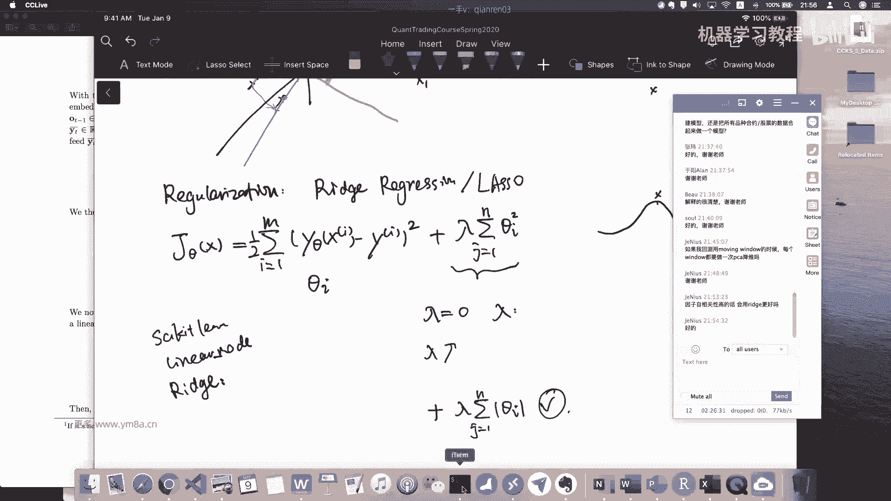

就就会自然而然有一些想法，你就会去想，哎，这样的我就想抓这样的一个趋势，抓这样的一个波动。那事实上对。我我觉得可能慢慢的大家就会有一些想法了。这这这种想法也是嗯这样可能出因子比较慢。

但是如果真的通过观察市场得到的一些因子，那它会具有比较长的生命周期。然后刚刚也提到就是说你需要去定期review你的因子。对。去评估你的因子。就是所以所以说有时候也会去你要去呃就是看因子的效果。

你可能也会用数据库去不断的记录去跟踪。嗯，就是整个量化是一个非常系统的活，就是我其中提到任何一小块可能都要花比较多的时间。那刚开始的时候，可能大家呃就是先建立起整体的框架，看看到底是怎么回事儿。

然后然后再逐步逐步的真的是有兴趣的话，那其实你可以逐步的去迭代改进，对吧？包括我所说的其实也不是最优解。那很有可能也就还有其他的解决方案，对不对？

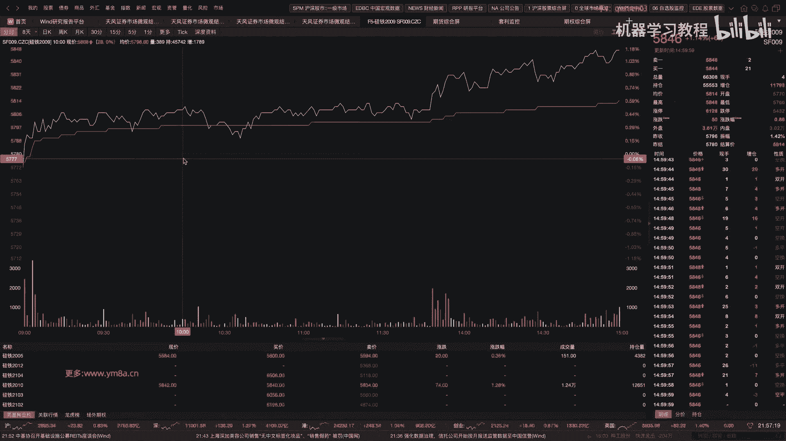

所是说并且现在就是随着就是积器学习这一套，包括你算命提升了之后，十年就是2020年跟2010年，那其实又是完全不一样的时间。就是大家要做好这个准备，就是从这个行业的话。

是不断的要保持对于技术跟最新的呃保对最新技术的这样一个关注。对，然后可能某种程度上也涉及到一些呃军备竞赛。对。嗯，那好，就是大家还有什么问题吗？或者还想听我扯一些什么其他别的。

就是今天太控那头的东西就这么多，因为不想也也不想给大家太多压力。呃，还还是说前面那个回测没搞完的，还包括就是不知道怎么去找因子的，还是得自己动手去做一做。然后包括高频的数据的话。

嗯我觉得最好大家自己也可以试一试。然后其实你做完高频的话，嗯。对的，然后就是刚刚说挖掘因子的时候，主要参考这些指标。嗯，没错，这个这个是肯定要参考。就是我现在还没有提到。

就是说我们怎么去评估这样一个因子的表现。本来是想就是ICL这个是放在就是股票。我们在做股票单因子测试的时候是怎么来来评估的对。对，然后一般来说对，就是做股票来说，相对来说你可能还会有。因为股票来说。

你品种还比较多。CTA的话可能交易率就这么多品种，用为横截面也不是特别好衡量。就这些指标肯定是要去评估的对。呃，那大家还有什么其他的问题吗？就其实嗯我自己看因子的话，我一般是看IC跟RR多一些。

然后就是看就是returnjo down ratio这些的话，我更加就是说我一个策略，就是说我通过几个因子组合出来一个策略。然后我看整个策略的回测的这样一个表现，我可能会更关注一些。

我会关注它每一次入场跟出场这些东西。呃，对，然后因子的回撤其实也是需要的对，这这这这个就是看一个是因子层面，还有一个是我最后策略的层面，对吧？然后包括就是你实际上有了策略之后。

我一个基金做的产品里面是多策略的组合，那我还会去关注整个净值曲线。对，就是所以从不同的维度，你可能都要去对它进行控制。然后下一节课我们会讲一些就是就是呃那个投资投资组合，就从最经典的。呃。

markqui那个模型开始，然后包括riskparity也会简单的介绍一些。然后其实用对于我们个人或者说你想做量化交易的话来说，你其实做的就是说我有了一个策略，有了多个策略之后，我怎么来去组合。对。

那前期可能大家更关注的是我怎么去把单因子单策略给做好。对。这个可能是更有意义的。因为你尽快的上手找到了你找到了一些因子，然后发现哎还真的有预测效果。可能这样给你的feedback会比较快一点。

然后你也可能尽可能可能就是说虽然说sha ratio没有那么高，但是可能我就直接把它交易起来了。那这样来说，然后不断的迭代改进。这样其实也是很好的。

就做量化有时候也不能过分的就是over over optimize就是我还不知道我需求是什么样的，设计了一个特别庞大复杂的系统，然后就一直做下去了。那事实上我也是鼓励同学们说有一个简单可行的系统。

然后以此作为基础，不断的去呃迭代。那这样可能是一个相对来说比较好的路径。那当然机构也有不同的优化，机构的话就是说你可能非常强的基金里面。

它每一个部分都会做的很好那其实这样我觉得个人觉得其实是一个长期的优势，就长期的发展方向应该是每个人专注于把自己的手上的一小块给做好。然后然后通过有经验的PM或者是我公司有优良的体制有了优良的机制。

把所有的模块给耦合在一起。这样来说，既能发挥大家的优势。然后这样整体的效果也会比一个人从头干到尾。好很多，这门课可能你是有点带大家就个从头干到尾了。呃，书籍也要自己洗，回去也要自己答。

然后模型上线生产也要要自己研究，最后还要自己去交易。那这个完我我我想说就是说如果真的完整一套走下来，我估计还是要花不少的时间的。

这门课嗯就真的我但是我感觉到有几个同学还是还有我觉得到现在跟的相是相当不错。我我还是挺佩服你们的对，就是整个整个东西就是跟到现在还是挺不错的。😊，嗯，因为我自己当初就是搭这样的一些东西。

其实还花了不少时间。对，在在机构里啊，是因为有大家的合作，其实会好很多。包括基础的数据库，包括对基础的数据库，然后回测的平台可能都有现成的。你这样做起来做研究可能上手会好一些。

那当然这个我觉得走这样一个过程也是让大家去感受一下，就是说做量化研究是怎样，而不是说拍脑袋呃，就是在量化平台上写一写，然后就就去交易了。对。嗯。好的，那大家还有什么什么什么问题吗？对。

然后就是涉及到一个就是就是我比如比比如说我策略里面有参数的这样一个问题，你怎么去调参？嗯，嗯，就是刚刚一个说到是用滚动的滚动的去我每次都去选最优的一个参数。那事实上就是我还常做的一个事情。

就是说我会去看嗯策略在呃我不是我对于多个我对于这样一个参数。然后我看策略是不是在这个在某一个参数的区间范围内会相对比较稳定，而不是说单单纯的选表现最好的这样一个策略。因为呃单表现最好的这样一个参数。

因为很有可能说你表现特别好的那个参数，有可能是过尼克。而我找到了相对来说参数比较稳定的那个区间，可能对于呃对于这个策略的意义会更大一点。对。诶。然后然后然后还提一下。

就是我们这节课我们这门课程应该不会去提到那个rein reinforceinforment learning。对这块我其实也不是特别熟。但是有兴趣的同学是可以去试一试了。

就是那个就是可以去研究一下这个是怎么回事。然后如果有什么特别好的idea，也可以跟我来分享一下。对。然后对呃对我我们这门课还是可能更加偏向一些就是怎么去最基础的模型吧。

然后你说因为深度学习模型本质上来说，我真的我要是因子都测试的非常好，我用不用深度学习模型。我觉得output output出出来的东西跟linear regressional呃。效果差别不会特别大。

因为我如果input都是非常验证有效的因子leaing regression出来，我觉得也是很好的对。就是这这所以从这个角度来讲，我就觉得上单纯的上深度学习的模型，其实意义不是特别大。对。

这这也是我个人想强调的一个东西。对，因本身就是它性噪比是很低的。怕就怕就是深度深度的模型，就是呃学习能力太强，还学到了噪音，这个就比较尴尬。好的呃。然后对我还想插一句。

就是呃如果如果哪个同学就是有兴趣跟我就是呃，就是想就是把之前的那个python的回测可以改成C加加的话，有兴趣的话可以私下来联系我。因为我最近还还把之前的做的有待升级去改动。对，然后嗯对。

因为我时间也没有特别多，所以就改还挺费劲，也花了不少时间了。然后有有兴趣的同学可以找我，就是我们可以一起来做一点事情。对，然后做完之后你也可以去用这样的呃C加加的回测。

因为C加加回测还是比pyon会快很多。对。然后呃还想提一个就是除了我们自己做回车的话，我还建议大家可以去看几个比较好的。

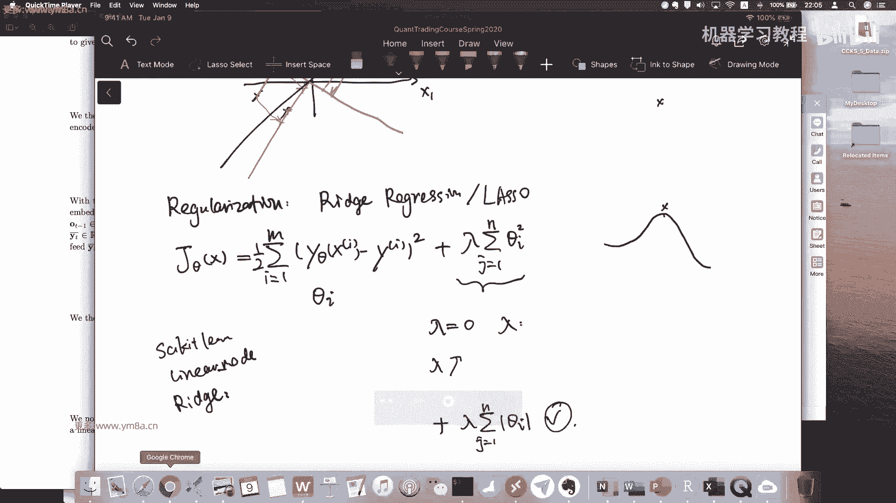

呃，开源的回收系统其实刚开始的时候也不一定要说，就是说我我们这门课是带大家去自己造了一篇文字。那相对来说比较简单的文子嘛。那还可以看到别人是怎么来去造轮子的。

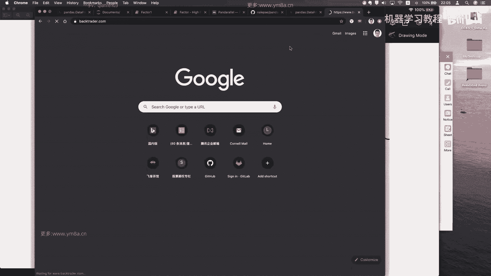

有DN派相对来说，他那个回头比较简单一点，但是就是。可以看看就是别人是怎么来做的。对。这个应该是比较好的一个就是框架了。然后大家可以自己去就是back trader，我发到这里面来。

就是这是这是有一些就是其他的一些框架。我觉觉得有余虑的同学是可以去看一看的。然后甚至自己做完之后，你也可以自己的回测，做完之后再去跟用别人的回测框架来对比一下，看看有什么差异。对。对。

然后其实最好的回测框架就是看就是你目标就是说我要跟实盘回测的是一致。那最好其实为什么说要用C加加呃呃我理想的情形就是说我实实盘跟回测用的是同一套代码，我只需要把我的接口改一下，我觉得可以实盘去交易。

然后通过不断的优化我的回测跟呃回测系统是使得我回测的每一笔信号的发出，每一笔成交是呃这种信号的发出，然后到发单，甚至说成交都尽可能去接近真实交易。那我觉得这个就非常厉害了。

但这个这个是是需要不断的时间去打磨你的回测系统呢就不是那么简单的可以一下子就做完了嗯。好了，那同学们还有什么问题吗？如果没有什么问题的话，我们今天就先到这儿了。嗯，其实这这次没有给大家留作业。

然后还是就是我会把这个这两个notebook再发给大家。然后包括那个呃高频的论文也发给大家。就是我觉得还是大家用时间多去摸摸索一下就是。然后然后然后嗯其其实比较好的就是我我觉得就是要不这样吧。

下次下次作业大家可以挖一挖，就是教一教，就是你提供写10个function。好了，就是自己挖到了比较好的一些因子，然后分别看一下他们的就是就是你的那个R平方是多少。对我觉得这样肯定会更有意思一点。

这样可能push大家去挖，但是你实在没有找到也没有也没有关系，或或者说你可以把那个之前的191个加括work101这300个如果都测完的话，你看看其实里面哪些哪些比较好的，你心里应该有数。

那我可以告诉大家，就是101里面还是有些因子，现在还是能用的对，就是里面是真的是有能赚钱的因子。对。好吧，那那如果没有什么问题的话，那就辛苦大家了。呃，今天就先到这边。好，大家如果今天还有上班的同学。

应该还挺累的嗯。嗯，好好休息，拜拜。😔。

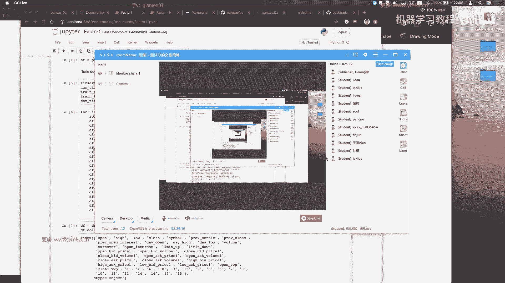