# 2025最新AI量化交易实战教程，三小时入门到进阶！清华计算机博士讲解，零基础也学会了（AI人工智能丨数据分析丨数据挖掘丨机器学习实战丨深度学习丨编程） - P5：第六章： 特征组合 - 机器学习教程 - BV1ujk4YKEw9

哎，好像现在可以了啊。哎，各位同学晚上好，然后能听到的话，在聊天记录框里打一个一。让我看看今天。ok今天可能今天人又比上周少了一些。ok fine对，然后今天就是呃本来今天是要讲一个。

就是上一周跟大家说，今天要讲的是一个就是呃就是我们的策略一个组合。但是我想一想这个东西可能还得再往后再推一推。然后主要是对因为呃可能我觉得就是说把等在股票当中引入了，就是呃因子的组合之后。

我们再顺势的就是说呃完成了股票的组合，然后我们再顺势的引入，就是说我们对于单个策略。然后再进行多策略组合的时候，怎么去借鉴这种方式。对，因为。对，因为策略本身组合的时候是我们可以做空股票。

但是不能去做空策略。对，所以会跟呃会跟股票有一些相似，但是有一些不同。所以我觉得可能调换一下顺序会比较好。然后呢，今天呢我们主要呃可能要讲的就是。

是我个人觉得也是整个金融当中最有呃金融衍生品当中最有意思的一个领域，就是讲期权。对呃，原来我们预计的课程是花呃两次课时，两次课时，它要差不多是6个小时时间来完成这个事情，嗯，可能可能可能会觉得有点困难。

嗯，但是我先尽量看吧，就是看我们6个小时能完成多少内容。对，然后呃主要是因为这个领域也是现在也是这几年是在属于呃在A股市场以及在商品市场都是在蓬勃发展的这样一个领域。

所以我会觉得就是说如果同学们之后有助呃有有志于去投入，就是进入量化投资这个领域。期权其实是比较好的一个切入点。虽然就是说呃现在的市场相对于嗯。相对于股票跟期货来说可能会就小一点。但是长期来说呃。

它的交易量应该会是非常大的对，因为呃就是在成熟的欧美市场，相对来说，期权的成呃期权的成交数量是会比期货还是要多的对。所以呢然后我们今天。对，然后我在想的就是在开始之前给大家安利一门课程。对。

就是如果有同学嗯对于学python或者说学到一定平均线在说，可能只知道说怎么写一些基本程序。但是对于说呃背后的一些原理以及一些数据结构掌握的不是特别好的话。

其实我个人是推荐就是有这样一门就是C呃61A这门课程，其实呃应该来说是比较经典，就是有余力的同学，以及说嗯对想提升自己python水平的同学是可以跟着的，就是把这门课给刷下去的。呃。

相对来说就是不管是视频，然后还是作业还是ttorial之类的，就是相对来说都比较完善。如果能完整的学下来，应该相对于自己的就是就自己的python编程能力，应该会得到一个比较明显的提高。

这是课余给大家的一个建议。对。然后我们就开始切入今天的正题。嗯，首先就是什么是期权。对，然后一般来说。与其说是去搜文章，看各公众号是什么东西。我我个人比较倾向的是说我们是去看官方的东西。

所以我们今天还是从上海证券交易所开始，就是它底下的产品。首先我们来看就是进入到它进入到它股票期权专栏的东西。对。

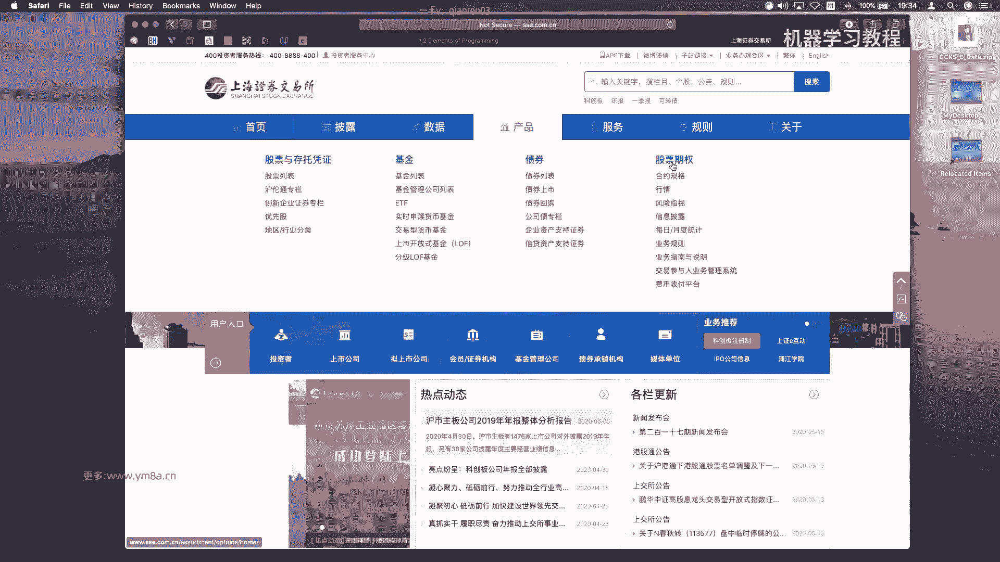

所以呃就是我们先看什么是期权。呃，我先想问一下，就是呃群里的这么多同学里面有接触过期权的同学呃，举个手。嗯，就是OK。好的，差不多是3分之13分之1一半的同学。OK呃。

那么就是说呃然后自己平时有交易过期权的呢。学过没有做过策略。OK。嗯，OK然后好的，很多同学可能大家都都学过或者接触过那个东西。那或者这样就是至少说在课上有自己去完整的写过一个期权的。

不管是用C加加还是拍on去完成一个呃期权的定价这样的一个。呃，这样的这样的程序大家有自己做过吗？不管是用模特卡罗模拟还是什么。对。OK这边所以其实有大家还蛮知道，就是说定价这个东西OK。

那那我那我那我大概明白了，就是。好的，嗯对。对，论定价。可能这位同学是专家。好的，那那我大概明白了。就是我们接下来那我们讲述的重点，可能并不是说是去讲期权的原理或者是什么东西。

对我可能就是那我就是从就是说从呃交易员或者是一个con trader角度讲讲，我们的就是整个呃整个期权的交易，我们该怎么去呃，就是说我们的不管是我们的呃期权的回测。呃，或者说是你数据库的建立。

然后包括你整个的class呃，怎么怎么去构建，就是从你的还是说我们的思路就是说从研究，然后到交易到风控整个流程应该是怎么去做。呃，对呃，然后我找一下我这边的话嗯。对呃，我先看我之前写的一个。呃。

我不知道，就是比如说像类似于这样的一个class，大家有呃之前有，不管是用C加加还是python有自己去完整的写过吗？就是呃从一个就是我我们不需要考虑特别复杂的，就是衍生品的期权。

然后其实就是简单的BS的BSM的模型就行。但是要需要自己去实现，就是呃期权的priing。然后然后greeks的计算。然后包括如果说是呃一栏子的合约，我们怎么去vectorize的去计算它。

这个大家自己有去做过嘛。嗯。OK对，所以这位同学其实就是对于对，如果是做场外的话，这一块的话，应该是相对来说比较熟悉。那我们课就是其实因为我们主要针对的是欧式期权，对，可能就不会涉及到呃。

就不会说涉及到这么复杂了。对，然后那其实想一想的话，就是那ok那我大概明白肯定需要有一些调整。就是呃如果我那我现在就 assume assume说大家对于就是说基本的就是说期权呃，都还是有一定的了解。

呃，那我就直接就是从偏就是框的确定的角度来讲，就是说我们怎么来做。刚开始一些事情。就是其实说呃。那最刚开始一点就是说，如果说你要去先去。呃，去研究我们期权怎么去交易的话，呃。

可能就是第一点肯定是去拿数据。对，拿数据的话，然后其实我们平时在生产的过程当中的数据库是应该是有两个。那首先就是我们需要的一点就是说呃我需要知道所有期权的基本的信息，这里面的基本信息是包括在这对。呃。

简单的过一下吧，就是首先是合约的呃就是security code。然后这个是我从万德上拉下来的数据，就是之前对这就是从万德终端里面拉下来的数据。

然后它的呃到就是它的underlying asset是什么？然后它的然后我们现在主要接触的是europan。对，然后它的行权价。

然后它的呃就是exercise的pri跟那个contractry unit，就是它的合约手术，就是说我每交易一张，那就是一手的话对应的是一万张合约。然后它的呃listed，然后它它的上市日。

然后它的到期日。对，也就是说到期日一般跟行权日会差一天。对。然后好的，那如果你这部分如果就是没有问题，这部分大家有问题吗？就对于这些概念应该不陌生吧。

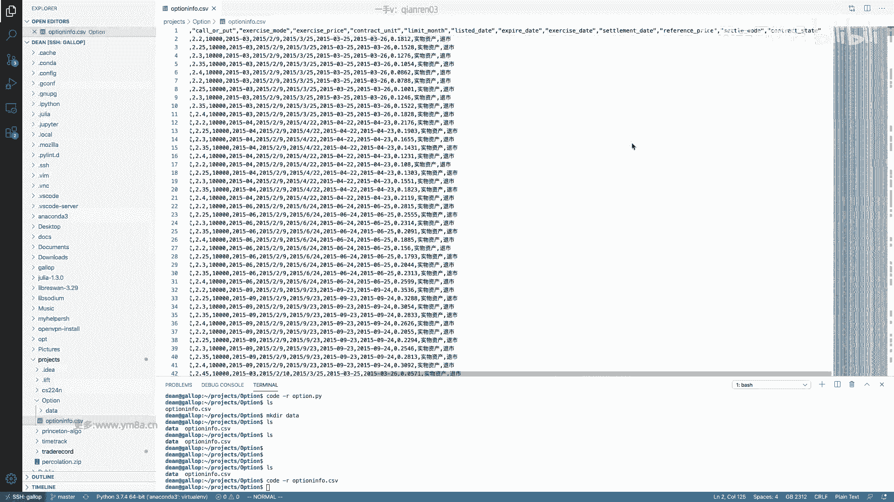

就是上面上面所说到的就是期权的每一个每一个东西。就是我我我sm就是大家都是呃okK的话，那我们就是就是说我们今天进度就可以稍微快一点了。对。呃，OK呃，然后我们再来看一下。就是万德这里面的。

All right。

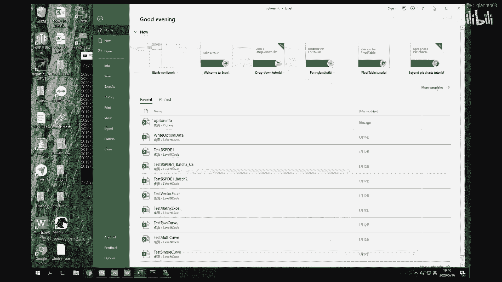

嗯。Okay。sry这个分辨率有一点奇怪，但是对，因为它是在不同的屏分辨率的屏幕下。

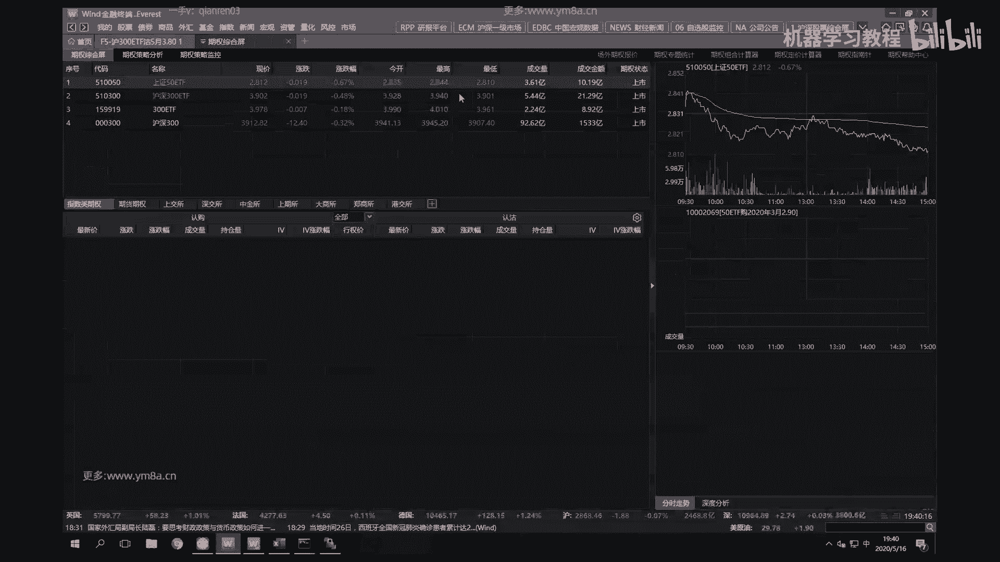

呃，这就是我们常说的一个梯形的梯形的一个报价表。然后嗯。对。提醒现在就是说现在在呃上期所上期所呃，不是上期所是上交所跟深交所，我们交易的ETF期权，实际上现在应该是总共达到了4个了。

就是我最刚开始最早上市的是上交上交所上上市的50ETF期权。然后它的它的标的是5100呃，点5呃510050点SH是这样一个就是50的上证的1个50ETF。然后同样的就是300ETF有两个。

一个是上上嗯。一个是上交所，然后还有一个是深交所，他们对应的一个是一个还是一个是加实的，还还有一个是华泰的。如果我没记错的话，对。然后另外一个是呃是股指期权。对，股指期权的话，嗯。

它它的underline asset就是不是不是我们的呃，它的 underlyingline asset不是ETF，它是一个它是沪深三00指数。然后它是在呃不是也不是在上交所交易，而是在中金所交易。对。

所以会有一些区别。然后我们个人就是机构的话嗯，现在主要交易的，我了解到的还是以ETF为主。因为相对来说。嗯，就因为因为呃股指期间相对来说手术会大一些。对，然后ETF的话，其实手术会小一些。

然后因为我们刚刚看到说所有的合约成数，如果正常情况下是1万的话，呃，单价是0。1乘以1万，其实是说一手差不多是1000块钱。对。嗯。

ok然后我们我们刚刚说到就是说我们需要的一个东西是是这样一个option的。呃，就是每天这样1个CSV就是说嗯一方面我是可以从万德去做这样的数据呃取这样的数据。对，但是如果说呃。

不不过机构里一般都会有这样的终端，不会说让大家自己去写爬虫去那个去呃官网上面每天去找嗯。当日要挂牌的这些信息，就是嗯如果说就是大家自己想要去做，然后每天去补充这样数据的话。

是可以就是呃用爬虫的方式去去交易所里面去爬。然后因为因为这里面涉及到一个问题，就是嗯。一个是呃就是主要是合约分红跟新上市的问题。对，以及就是出现这种情形。

一个是说我的underline asset价格变动会比较剧烈。然后导致我现在在呃盘口就是在交易所当中以平值为上下线不具有就是少于4个合约。那这个时候它就需要补充新的合约。

然后使得就是说我要保持在平止上下四次档都会有相应的合约可以供大家去交易。一个是这种情形。然后还有一个就是说是我的因为是ETFETF是存在分红的这样一个情形。当分红的时候嗯。

那上交所呃所做的调整就是说把合约的陈述去相应的改变。因为我的underline assetad价格会去变化。那这个时候我通过嗯就我通过就是说合约手术的变化。

使得就是说我同样的呃就是我然后就是说我通过这样的调整，使得就是分红前后，我需要保证我的合约合约的就是行权价乘以这样的一个手数呃，行权价乘以这样一个手数，它的值是不变的对。然后okK然后接下来我们就要想。

就是说我要去做这样的一个，就是说我们在做期权研究跟交易的时候，我需要的是什么样的一个东西。对。嗯对。就是首先就是嗯。就是我不知道就是有没有人就是一般来说，就是我还挺少看到，就是说尤其做OTC的期权。

应该就是OTC期权是不需要去做回测。但是如果是场内的话，其实我的个人建议是说，不管你是用呃不管你是说是分析数据的话，还是说你做到类似于回测的东西，可能可能说你还是把所有的历史数据都自己去整理一遍。

然后包括呃包括就是说我们接下来算的就是波动力的指数。对，然后这样的这样的一个东西，可能说自己把所有的历史数据去处理一遍。然后去算一下，可能相对来说然后再去分析去交易来说。

相对于无脑的呃无脑在市场上一股脑的买，或者是就是无脑的慢。我觉得可能是说胜利会大一些。那我们今天其实就来看一看，就是我们怎么来设计我们的。就是option的这样的一个sever。

就是有很多这样的class，我们到底要怎么去做，对吧？呃，首先就是okK。呃呃我不知道就是大家这块对这一块说是呃C加加现在大家用的怎么样。其实其实我后来就是很多东西都慢慢换到C加加上去了。

就是哦就是pyython这一块没有特别太多。但是如果就是说大家觉得还是用pythonO的话，我们就是可能还是说用python写的话会。

那我们就接着就是说之后还是是说用pyython也就是降低大家对于使用呃，就是不太熟悉的语言的难度吧。嗯。哦，对。就是首先我们就是说。我在想你设计这个东呃，设计这个东西的时候。

我要想的是是呃我到底要有什么用？那我们想的是，首先我需要有一个基本的option class。对，然后我这个option class的目的是为了什么呢？肯定是说我要需要就是保存。

就是我每一个期权我也需要知道一个基础的这样一个信息。所以O。然后我们刚刚看到这张option info的table里。就是OK我们这边保存了一个是。系。Onlineing price。

 a whole exercise price。然后time to maturity，然后我们默认的话就是除以365来去做就OK了。然后这边是。Car output。然后还有的是然后我们目前来做的话。

呃，如果先期你不考虑延展性，就是说我们不考虑商品期权，可定是要有就是有美式期权。我们就只是做欧式期权的话，其实这一步你是可以嗯可以先省略，你不用考虑，但是美美式期权还是欧式期权。

但如果你之后想还要去交易呃美式期权的话，那再去对相应的class去做拓展就OK了。Oh。其实contract unit点这个事情。嗯。

就是我我个人习惯是没有在class里面引入contractr unit。因为这个不是期权本身的事情，这个是呃不不是期权本身的信息，然后这个是。

是一个相当于说是由于交易所分红去产生这样一个新的新的一个的处理。对，其实我就是要注意的地方就是说我再去算呃期权的。那就是在算历史上我把所有的数据都去呃处理，算它的gs。

算它算它的implyable的时候，呃，就是要把它分红前跟分红后每年的每年有这样一天要把这样单独的日期给处理下来。从2015到2020，现在总归就是呃也就是2015到19差不多是就是5年的时间，有5天。

就是要把它去单独去处理一下。对，这个是可能就是是大家实际去处理数据的时候，回去要注意的这样一个点。然后我这边呃我给大家提供的是嗯。呃，我给大家提供的是2018年全部的一个tick数据。嗯，对。看看。

OK，我先把它打开吧。谢谢呢。有传过来。OK对了，还没有传过来。😔，嗯，好吧，我现在把 data传一下。对。呃，这样就是一个我们每天拿到的，就是从CTP接口拿到期权的一个数据。啊。

相对来说它呃它会它会好一点的地方是它会有五当的盘口。对。所以不管是呃。你继续比了跟ask对，他会有误蹈。所以这个是相对来说会好一点。但是呃我我觉得有一点不好的是，它不会像。嗯。

就是它的时间精度没有像原生的CTP1样精准到0。5秒，而是以1秒为单位。所以所以当同一秒之内出现两个tick的时候，我是知道哪个是第一个，哪个是第二个。但是如果对于就是不是每一个tick都有交易的时候。

那那中间可能就会说。嗯，对，比如说这边从49秒到56秒，这个还我还可以知道哪个是56。00和56。50。对，但是但是如果说我在这个时刻只有一个数据的时候，呃，可能就比较难判断。

就是呃在当前的这个时间在当前这个时间点是0。5秒还是1秒这样一个单位。然后因为我自己当时做期权其实没有做到我不是做偏 making，所以做的不是那么偏向高频。

我一般自己处理的数据是相当于来说把它用到一分钟，我这种做做日内的话，其实按照一分钟的频率差不多，我就OK了。所以对于我而言不是有特别影响。

但如果如果同学们可能说想去研究比如偏h frequency一点的话，那可能还要想还是要去想办法去拿到就是。带到就是精确到0。5秒时间抽了这样一个t数据。因为目前的数据供应商只给到的我是这样的数据。

这最刚开始我们的就数据是刚开始是都是从万德开始拿，直接拿万德的分钟数据。对，但是后来发现可能多多少少会有一些问题。所以我们我们我们后来就是统一倾向于是我们从交易所拿最原始的数据。

然后所有的greeks所有的IB都会自己去算。我们不会用别人去给我们算好的数据。对，因为多多少少。算的时候都会去有一些偏差，包括就是说无风险利率到底用什么。那其实每个人的偏好都不一样。对。

那嗯就长期上可能会引入一些误差。对，所以一般来说大家自己就是选用自己合适的这样一个呃选用自己固定的数据，然后选用固定的处理方式，呃，可能长期来说，我觉得这样会好一些。对。呃。

现在大家看这个数据应该是比较熟悉了，不会有什么不会有什么问题了吧。啊，就是对于这样的这样这样一个期权的tick数据，大家现在觉得大家觉得OK吗？就这这个其实是跟我们之前的就是CTP的数据是非常类似的对。

呃本质上也是就是说也是从CTP的端口去取数据。只不过说嗯当时是在应该是在嗯就是15年之后，就是因为我们的我们是股做的是股票ETF的期权走的是股票交易的端口。

然后15年之后呃很多的端口就不再对新的成员开放。然后我们也是花了一些办法，然后在18年拿到了一个就是程序化的这样的一个接口。然后当然是从去年10月11月的样子开始。

就是呃在国内就是说想要做50想要做ETF的期权的程序化的备案。呃，比以前的门槛会降低了很多。就是如果大家有兴趣的话，我还呃就是趁着现在这个窗口期，我建议大家是去开户。

然后去向自己的客户经理去申请这样一个程序化的呃程序化的这样一个端口。因为我就比较有意思的事情是可能有人之前拿了嗯就是期权这样一个程序化端口，但是不再去做。交易了。

那呃但是他呃当然就是这样一个存在一个灰色空间，他就是把这样的端口嗯去。嗯，借给那些想要去做诚市化交易人使用。那这样的其实一年也内也会有相应的几十万的这样一个的收入。这是一个额外的这样一个收入。

虽然这个是是这样一个灰色的空间，但是也可以从另外一方面去证明，就是说呃有有有的时候就是说拥有一个良好的。呃，环境还是就是是比较重要的对，不管因为程序化的话，呃，其实呃本质上来说。

就是不谈说是不是是对于整个市场流动性是有益，还是说是有害。但是就是说有总归来说是对于想要做矿的同学有这样一个更好的环境。那对于自己的职业的发展肯定是有呃有正向的这样一个作用。对的。

OK那如嗯我大家都都在群里没有发言，我就得希慕大家就是对于这一块都没有什么问题哈。然后嗯还是就是说这边就不讲，就是说怎么去合成分钟数据了，还是老样子，我会把数据发给大家。然后大家课后去先去合成分钟数据。

对。就是还是就是根据刚才递说。然后如果说遇到。遇到只有一个的话呃，就时间戳，如果说你就是说遇到在某一个点，只有比如说这个41只有一个的话嗯。嗯。我我个人觉得就是说这个时候可能只能把它去当做41。

5来算会好一点。因为你时间就说你拿到这个信息，你只能说我不知道是前半秒钟还是后半秒钟。那么如果说如果来做tick回测的时候，你需要在这前半秒钟的时候，我只能我只能认为前半秒钟我没有拿到这个数据。

因为可能是有延迟。对，因为就是把它放到。把它归为41。5，总是比归为41。0会好一些。嗯，对，因为在实实际交易的时候，如果它真的是41。0，那无非是你的损失是就是说你可能会比别人慢0。5秒拿到这个数据。

但如果是。呃，真实数数据是41。5秒发出，但是你41。0就利用41。5秒的数据。那这个时候就会涉及到就会这就是这是look forward了。那就look呃look ahead bias。对。

就是我用我用到了未来的数据。那这样回的下来可能是不准的。所以如果是做tick级别的回测的话，呃，我个人的就是说针对这种情形，就是把它去归为是41。5的数据，这样可能会好一些。呃，然后我们就来回到就是。

扣垫的部分。对。就是我我这样的一个作用，就是本质上是说我需要有呃这样的一个base option，就是说我需要就是呃。啊，当一个合约就是。过来的时候，我知道他是呃他是他他他有哪些基本信息。

就是说我我希望我这个class是sve的是哪些基本的信息信息。呃。还要加一个。Security code。然后看一下online。嗯，对，如果是刚开始这样的话，我们还是。嗯 ok。

其实我还是存一个expid date就好了。就是时间的处理，不用留在这个我不用算，就是说到到到期日有多少时间，我不放在这个类里面处理。我还是考虑是说是放在就是呃就是放在我去真正的去便利所有的合约去算呃。

当时行情的时候，就是算它的算行情的时候，算它的波动预算，给它定价的时候，我才会去考虑，就是说我距离到期日到底是有多少时间。对的。然后OK那其实如果是对。呃，contract unit其实还是把它加上吧。

因为因为大部分情况下是在呃默认默认会是1万。对。然后如果是分红的时候，我们再给它加入传入一个新的参数，就OK。Okay诶。这部分。嗯。其实对，sorry my bad这个S也其实不需要。

因为我们刚刚说过了呃。这个这就是这个这部分的code是我只是为了说单纯的把我这个excel的表格，就是说我不希望就是说嗯。不希望到时候去再去读这个东西，而是说把所有的在每天开盘之前。

我需要把我所有的期权的就是当前正在交易的这样一个呃当前正在交易的信息放到我的内存里。呃，对。然后要注意的是这边呃，因为我这边是就是说我在立选就的时候，大家看到这个是退市的对，那实际上你每天在漏的时候。

就是说我内存也是不需要就是说把所有的这些合约都给加进去的。我只需要是呃维护当前正在上市的。呃，合约就OK了。Okay。Okay。就是说我呃我有这样一个class，他的目的是。谢谢。我希望的是保存的是。

呃，期权的基本的一些信息。对。然后呃。OK接下来再做一个事情是。就我这这这部分信息是负责来去说呃去维护说呃也不是维护，这时候去负责去。不管是计算我的historical data。

还是说我的live data，我希望有这样一个程序去帮助我去来计算嗯。是我当前的这些。Greeks， her。嗯品。我我会import这样一个base option。对，因为我需要。去继承。啊。

这个时候就是我我会assume大家就是说我们已经呃有我们已经有的是就是说是。Market data in minute frequency。就是说我们不管是在回村，还是说在实际交易的时候。

我拿到的是分钟的这样一个数据。嗯。然后一个是呃在这个时候我们就需要的是一个是。一个是underline price。对，然后大家要注意一点。

就是呃underline的 price跟呃是它是因为是股票的ETF的ETF的价格。然后ETF的价格，它呃就是是3秒钟更新一次，它不是嗯。它不是像期权或者是期货一样，0。5秒更新一次。然后像这里面是。

就是在实际交易的时候，你可能说。如果你觉得3秒1次更新比较呃呃比较慢慢的话，我们是不是可以说是用呃不用ETF的数据，我们可以用呃50指数的数据。对，然后如果是50指数也比较慢的话。

那是不是还可以考虑说我去用50只股票的market price去实时的去计算，然后甚至也是不是也可以考虑说是用嗯。用股指期货IH的数据去算。那事实上这几种方式就是说我们在实际过程当中都会去尝试。

因为的就是说我们是不是能够是实时去更新我们的S的pri S这样一个价格。嗯，然后嗯我我们在这边的话，我们还是统一的就是用就是说用呃用ETF的ETF的本身50ETF本身的价格来看。忘了把这个。聊天记录框。

放到上面来，就是这边有同学在问的是。YeahYeah。这边有同学在问的是呃，上交所是不是有一个类似的API要它是有的嗯。我就拿一个我给我开户的。找一个。我们看一下啊。洗衣机就是。

我是在我是在中信期货有一个。这样的呃有有有有开他的1个5菱F期全的账户。然后。😔，sorry，这不应该是在这儿，或者。😔，嗯嗯。我的扣里这一块是不是？对，这API实际上是有的。うほ。

我看一下我的github，我应该是把这一块东西放到github上面，它是有一个类似的呃CTP的API的。稍等一下，我把这个给克隆过来。O。好，就是他本质上还是说。我其实也不一定要看过来。

就是这个本质上是跟我们的CTP是它就是1个CTP。但是。它它为它是有一些改动的对。因为我们这个时候呃，它它里面的东西不是不是期货，而是是期权的这样一些数据结构。

可能看这这一部分你可能看不出来有什么这这个应该是这个是一样的。但是如果我们在那个。就他的他的就是他的头就是这些库。不可以拿CTP的直接用，然后嗯还是要去就是去呃。要去下期权对应的版本。

然呃应该甚至甚至很很有可能就是说它的头文件我没有我没有仔细比较过。但是很有可能他这些头文件里面都是一样。因为我记得在CTP期货里面也有看到过有期权的字段的出现。对。T。对，所以这个里面应该是一样。

但是嗯有一点就是嗯。想应该是。没有类似于sim的工具，可以给大家去。下载这样的数据。对对，因为期权可能呃我不确定就是说在呃期货公司所开的这样一个模拟账号是不是可以去呃用对去呃就是用这样的AP去下载模拟行情。

对但是对开实盘的话是需要有呃有就是有行应该是50万的资金，就是日均日均50万资金保持20天就ok对，就可以开这样的一个呃就可以开这样的一个账户。然后像对应的客户经理申请权限。

对这边就是我们看到这边的name space是放在就是CTPOP下面就option下面对 option它没有放就跟之前还是有一点小区别。但是整体的框架是非常类似的对。

然后呃市面上除了说CTP的期权也可以就是在飞马或者是其他地方也会有类似的这样个AP但是。他们背后的基本原理是一致的。然后我们的课程当中不会涉及到，就是说教大家怎么去接。因为因为本质上跟前面的接呃。

期货行情本质上是一样的，我觉得就没有必要就是说再去重复的做这样的一个事情。但是呃想想要实盘交易的同学是客户是可以去做这样的事情的对。呃。

所以所以可能是说我们现在只能是说我给大家提供的是一年的tick的一个数据。对，然后，可以给大家去做研究用。然后如果想要去实盘的话，嗯，一个是开户。还有一个是就是去做期货期权。

期货期权似乎开户不需要什么门槛，好像对，还是说门槛相对会比较低一点，然后呃然后拿期货期权去交易的话，其实也是okK只不过嗯嗯嗯对。

那那就是用我们之前原称的CTP的APAPI就可以直接在期货里面去交易期权。对，只不过把合约的名字会变一下对，呃对，但是但是要注意它是美式期权。

然后以及嗯不太适合呃我个人觉得因为流动性比ETF期权会差很多。大家应该可以从成交量这部分也可以看得到。就是我们这边的话这边一天成交量就是一个合约品质合约就二十几万，我觉得。

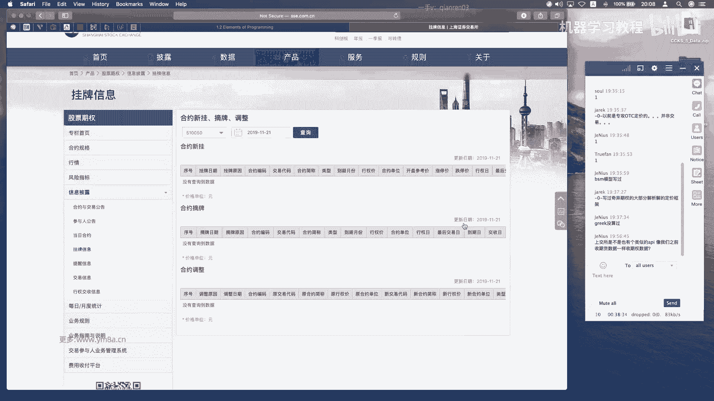

还是就近约了有二十几万，我觉得还是非常活跃的对。对，所以就是每一分钟的话都有几千的，每一分钟都有几千首，相对来说会好很多。但是。但是如果说我们去看。嗯。最早的应该是白糖和斗粕吧，斗粕。

如果我们主力合约是09。对呃，对，我们可以看一下它的成交量。这相对来说呃品质合约的话也没有很多，对吧？就相对来说这样这样的就是流动性其实不是特别好。那么其实如果说做成球化交易的话，他的盘口相对会大一些。

大家也看到就是他就是说这这部分嗯好像不是特别多。然后然后那位就是这位是做呃场外期权交易的同学，其实我呃客户还是想单独想找你聊一聊，就是看看就是我不知道现在就是场外期权。现在大家在做一些什么样的事情。

是不是说呃场外期权去挤走了呃场内期权这样一部分交易。对，因为我自己在做量化交易的时候，是呃我们是有做过两个月的，就是场外期权，我们对，我们是我们是去做两做了两个月的场外期权。然后我们也没有做OT。

我们也没有说。

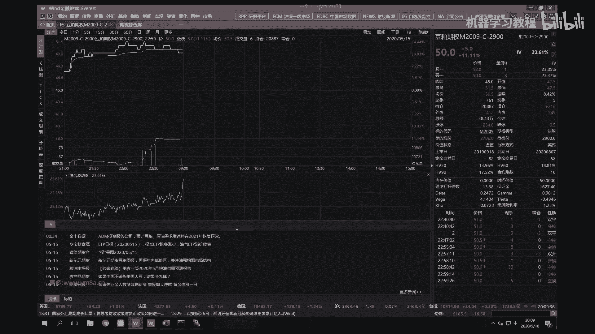

去做基忆期权，只只不过说我们是跟机构去做对手盘。然后嗯还就是我我们做的典型的最简单的就是在多家机构去询价去寻找他们的套利空间。对，虽然场外期权就是盘口，我们这边看到的盘口可能说是。

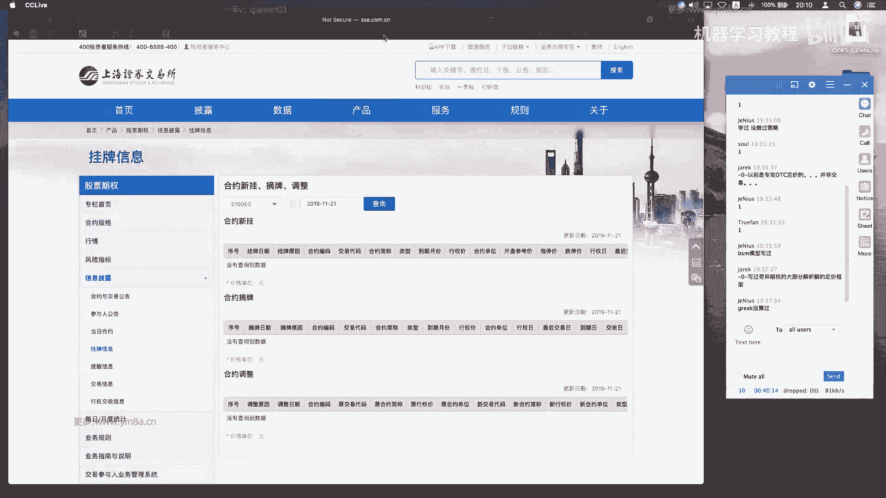

2、那长方形可能就是按照波动率去报价的话，可能差的真的是非常多。反映到价格上面呢，可能夸张一点，可能就是40跟60甚至30跟60这种地步。对。

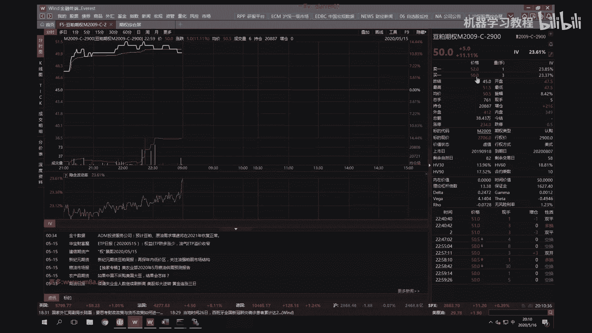

所以所以我我给大家建议就是说呃去想要去做期权的话，可能就是还是说是嗯在目前而言，主流的，包括各个机构在招聘的期权的研究员是以呃ETF的以ETF的期权为主。对，然后主要是做上交所跟深交所。

因为同样的就是说同样是300ETF期权。然后我们看到深交所的话是呃你看这边大概是2万到1万。但是上交所的应该会多很多。对，就目前来说嗯。对，就是合约流动性主要是集中在呃上海上海证券交易所。

然后50ETF是2015年2月9日去上市的。曾经它的流动性那是会最好。但是但是随着2019年沪深300ETF的上市。呃，沪深300ETF去吸走了相对来说比较多的。很齐全呃，就是ETF50ETF的成交量。

对，因为呃毕竟300ETF覆盖的是300只股票，对50ETF覆盖的是50只。然后相对来说目前呃300对冲的话效果会比就是50对冲还是会好一些。那现市场上我了解到的。就是主流的就是做嗯就是股票的指数增强。

可能还是以中证500为主。对，所以如果说中证500的ETF期权上市的话，那可能对于大家来说，就是股票的对冲又会有一个新的手段，除了用股指期货。对。嗯，好的，然后这部分是简单的这样一个介绍。

然后我们还是回到我们的codecode上来。对。我看看。好的，所以这位同学就是这个这个这个问题应该是回答你了。然后。然后就是说我们要去实现。我们要去实现呃，我在想这个东西叫什么，我可以叫P吧。

就或者叫priice。你说。对，然后然后我们这个时候其实要需要的就是说一个是。嗯，就是因为呃。对呃，就是说去计算这个期权相关的一些，我们能拿到的，其实就是说是盘口了，就是能拿到的就是分钟的价格。

然后是ETF的价格。然后我们还有期权的这一些基本信息。然后我们也要去去呃根据这些东西去来去给期权的去做一个pricing。呃，然后还有一个就是时间的话嗯时间的话，如果是呃O。是时间的话。

其实如果我是做日内的话，其实最好还是说我去精确到每1个10分钟去给他家算这样的一个去去给去给他去相应的定价。而不是说呃我每每同一天所有的同一天所有的合约都只有一个时间，就是即使说上午跟下午的话呃，对。

呃，我个人觉得可能还是要精确到分钟，可能会好一些。所以这边是给大家就是精确到分钟。然后呃我之前也去也去测试过，就是我们在做就是PNL的attribution的时候，如果说我同一天都用同一个时间在。

实际上就是最后下归下来结果是有比较大的误差。那这部分误差是可以就是其实是如果精细一点，应该是把它归类到，就是我在C塔上的这些一些盈亏。呃，O。Okayケ。呃。

trading date其实这个东西不会特别太变，好吧，先。好，就是我们先有了这样的啊。sorry，还有一个就是。Super。self，我都忘记这个怎么写了，我查一下语法。嗯。

就是我们不是继承了他的类吗？我们要把他去给。初始化。就是去把期权的一些基本的信息给拿过来。Super小。Okay，明。真的是太久不想，拍嗓都有点。或者我是不是可以不用这么写。😔，好的，嗯。

嗯现在是8点16分，然后我们到8点30分，我们再开始第二课。大家先休息一下，呃，就是第一节课我先确认一点，就是嗯目目前来的10个同学就是对于气权这部分都是有相相对来说是比较熟悉一些吧，对吧？

就是呃不不不熟悉的话，呃不熟悉的同学可能得嗯就那那可能就要自己去快速的。我我记得有一本书叫。2月。

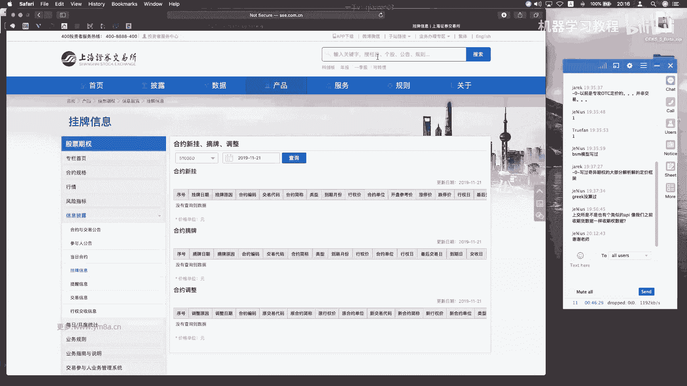

叫那部那本书还写的还可以。三巧时。快速入门期权。对，就是讲期权的。基本概念。这这这本书其实大家可以去看一下。对，虽然我觉得就是说呃。

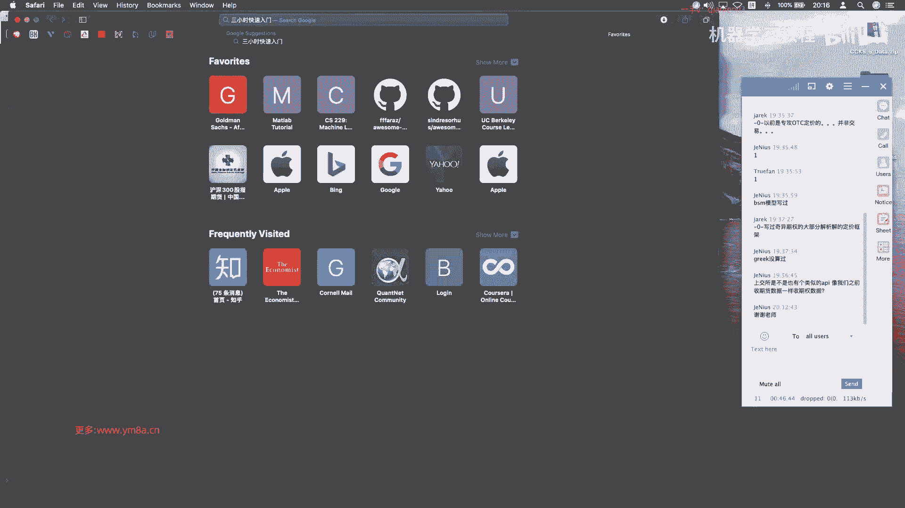

就是。即即使说我学了很很对，学了学了一段时间之后，发现回去再看这本书，其实他写的还是挺不错的对，就是这这本书很很小巧。对。然后或者还有一个方式就是。我们去就是在上交所的期权的投教平台，也是可以去找到呃。

去找到相应的就是期权的一些呃期权的一些的对期权教育之类。股票期权投教专区，这里面是有一些东西的。好的，那我们第一节课先到这边。大家休息一下。哎，喂，好的，呃，我们现在回来。对呃，对。

现呃有一个就是框内如果做我不知道做OTC的同学可能应该有接触过，或者是其他有接触过宽方量小同学。其实这个库可能就是说刚开始开文的时候还是。不管是学术还是工业级，可能都还是有一定的用处。对。

当然有一些大的机构可能会他们如果有自己的库的话，可能就是从头造轮子。嗯那这个就是说呃如果不想自己去造轮子，其实从上面及框类作为基础，然后去改动，或者说直接去调用，也是是比较也是挺好一种方案。

然后刚刚的话对我想一下，就是呃就是刚开始上就是嗯我们还是不要把那个。就是不要去把那个。呃，这就是期权的一些信息跟我们去做priing的这样一个class的类去混在一起。对，因为这样子的话嗯。

就是说呃我我们还是希望就是说这europan这个class，就是说去专门的就是去去负责我们的呃期权的计算。然后至于说怎么把我们收到的market data跟怎么。

然后跟怎么去调用我们这个pri类的话之后我们可以通过其他的程序，就是呃再再通过其他的PI文件，然后把它去封装起来，这样的可能说结果会清楚一点。对。Oh。其实就是说如果大家都比较熟的话，那应该会好一些。

对。嗯。就是是希望就是大家先去实现这样一个类，然后就是说。我可以去计算我的，呃，因为就这是这边是一个single option嘛，我肯定给给给大家一个类似于single option，我怎么去算。

然后之后，因为我们收到的行情，同一个时刻差不多不到呃，应该是不到200个期权。然后就是我们去把它去veize去计算。其实。呃，就可以了。对。

就是说我们我们我们我们要实现的目标就是说当market data或者是。呃，呃，或者是历史数据的时候，我需要在在同一个时刻，对于四个到期月份的呃这样的一个期权去同时去进行计算。

然后用fo loop肯定是会相对来说是会会比较慢的话，可能对最好方式就是说。我们去把它呃整个期权的，不管是计算impliable，还是说是去算greeks，最好是把它去veize。

这样来说可能会可能会好一些。然后我这边先给的，就是我们先来考虑，就是说我们怎么从新购来去做吧。对。就是说我们对于一个合约，我们可能要来怎么去做啊，这边是报什么错。嗯，好的，然后就是我们先就是刚开始先示。

就是说每个期权我们会呃就是说传进去我们的。呃。OK就是有一个S对underline的pri，然后K。是。呃，开始新专价，然后是T，然后是。是scama呃，我也没有漏有什么东西。西igma这是我们的。

就是这样，就是说我们是可就是其实这两种，一个是我根据。一个是我根据呃当前的波动率，我去给期权定一个价格。然后还有一个就是说呃我根据当前期权的价格去反推我们的波动率。呃。

这两种都是都是需要的对那我们先从就是先先是从就是怎么来给期权去定价。再做好一点吧。Okay。嗯。我们现的项目都是。他的类型还是需要的。Pt。OK呃，所以我们要做的第一个事情，本质上是去计算一个就是。

Get option price。然后。如果是靠的话，我们去调用。Car price。Oh。其实就不用了。对，如果我们就是make sure我们输入都只有。C或者是。出土的话。其实我们就不需要。😔。

再去做。对呃一一个是说我们是可以。在这if来去做。然后其实事实上就是说如果是ize的话，我其实比较好的方式是把co和put去分开来分两组去算。然后两我可以让两个CPU一个去算可一个算put对吧？

就让两个线程去算这样的去去做这样的事情。当然不是现程用进程去算吧。对呃，这样这样子来说，可能就是说我反应的这个速度是会快一点。对那我们这边还是先做一个demo。

然后之后我们再去考虑怎么去把它逐渐的去优化。嗯。嗯。Sorry。嗯。self。嗯。这个的话就直接我记得第一和。第二，哪位同学帮我来回忆一下这个公式。大家还记得这个定价公式吗？都不记得。

我得去找一找我之前的事情。OK。呃，有有错误就是有有错误，大家及时跟我说哈。诶。把这个放上面。这又报什么错？没有加回车，没加空号。嗯，我的 hell。😔，还是把这个放下面。

Jin told Q in synt line 6。Pilot syntax error。你攞 states。我来吧，我先忽悠这个提出的东西。OK好吧，果然是代码格式的问题。

可能一行他不希望我把三个双银行放到下面。嗯，这边有什么错呢？没。one six ok这回他是对的。对，所以所以就是呃呃我还是建议大家写课的话，是自己就用ID可能写的还是好好一些，就是不会有带来。

然后包括有什么问题的，他都会去提示，然后最好遵循相应的代码规范。然后因为因为在公司当中写了代码，不是说自己写了就OK了。我们写完代码还是要去跟别人去。share或者说是去跟大家去合作。那个有错的。

大家及时说哈。嗯。我也不确定要。然后我们这边是考虑就是都没有cos of carry这种情形，相对来说会好一些。Okay。然后我们来写个嘛。边条。😔，对的。😔，你让我放前面吧。然后是。可，然后。

Let' see the time。Oho S QRT。hello咁好。😔，嗰号唔错啊。😔，然后再t。小费好。Dtail是。D one minus四吗？然好是。😔，Price。衣裤鞋。😔，Ash。

Times exponential。Native R T。哦。😮，然后。我们要算一个那个。这个就是cumulating呃那个。那个叫什么comity。嗯嗯。Okay。就是啊呃CDF of呃。

gaussian distribution。对。然后这边要算的是。如果我是靠的话。G边是active。啲条。然后 minus。呃S。Times N exponential。Negative R。t。

然好。呃，还要再算一个。Nected啲。呃 sorryor。我这边是sorry，我这边是不是写错了？我这边是应该是D one。然后因这这边这边有错，大家及时提醒我啊，因为这个。对。

这这个算错了就比较尴尬。然后我看我这边是不是要格这样子。然后我们再把他。return就OK了，这个括号也是多余的吧。这个口号也是多余的。winter。Prce。那这样吧，我们再加一个sdompri。

对吧，然后。put留给同学们课后自己写。呃，然后我要做的事情是把这个。Cumulative。嗯，这个是一个。啊，我想想应该不要用到。他可以用一个那个。它是一个 static method。Right。

然后。我们要传进去的。嗯，仅仅是一个。O。CDF的话，sry一会让我看一看。😔，M派还是 sign派 show有CDF。Cdy。所以呃看到就是呃其实就是说写代码的时候不一定说需要记住。完整的全部的细节。

但是得知道就是说。我要用的时候可能去去哪里去找。之前是用C佳佳写的，我还不知道。嗯。这个是什么嗯no么。😔，sine派，那这样还不对。😔。

CDF random variable continues应该是这个了。😔，Comumulity distribution of given random variable na。我需要知道的是。

The shape parameter for the distribution， Qua house。我想知道是那好的一个。😔，找一个例子吧。欲して。Jo。系い。这是一个 static method。

然后 where returned是 return。系。Return some。成一个就是。呃，normal distribution的。然后。那么dibution的，然后到X的这样一个分位值。

Stretch。Okay。是场tender。😔，呃，The main public method for continuousO我们应该用这个就可以了。我试一下。Okay。呃。

那么distribution系列FOK那这样是对的，所以我只需要return。那么CDFD1 one或者是D2就可以。攞冇识啲。2。但是我需要的是from。Sine price stats。Ipro。

就是我还是给大家强调一点，就是呃做量化框的时候，可能不需。有的时候就是说真正说可能相那个同学去真正自己去写衍生品定价来说，那个是可能是比较少。就是呃要看大家是买方跟买方不同的职能。

然后如果是做如果是去做控交易的话，其实有的时候不需要写那么多非常低层的代码，甚至甚至就是包括课上展示的这些东西可能在稍微陈述一点公司。如果他们之前做过期权，应该来说都是呃有相应的就是library。

我们是可以直接去。去调用的，相对来说就是可能会省比较多的时间，这边又不知道什么怎。N派 dialogue。这个也弄错了。呃，难道是平方出错了吗？也不应该。OK我们先这先待会测试着看吧。

return momda c f。😔，嗯。Okay。这样子的话应该是looks good到目前为止是。呃，我们可以试试看做一个简单的测试好。嗯，不用呃，这个同学说。ND不用乘以呃。

n派 exponential是在。我看一下啊。嗯。O是。我看一下哎，sorry，我这边是不是哪里写错了？😔，嗯。呃，同呃这这位同学是是self dot and。呃呃，这位同学说一下是哪边。等一下。

我把这个聊天框拖上来。L type exponential。如果是 call price的话，S。乘以NG1。好。啊。切。对我忘记的是就是cos of carry，如果是零的话。这样这样对了吧。

这位同学。还是。嗯。对，这样应该是OK了。嗯，好的，谢谢这位同学。😊，然后的话。😔，啊。OK我就不在课扰花时间写测试，然后有什么错的，我觉得也好，就是。呃，同学们希望课后去来把这个给完成。对。

然后还是说只是说我这边是给大家就讲basicide，然后具体然后怎么实现的话，其实呃。然后。大家会去来去考虑怎么来去具体的把它去做。对，然后。然后接下来的一部分就是说要去算呃。

这要我们得到了就是嗯call和put这样一个priice之后，然后接下去是要去算greeks，然后我们还是。呃。找他。哦，算两个吧，一个是delta跟那个。还是。对，因我这边。加油条。我是不是好吧。

那还都写一下calculate。下午茶。然后大家可以想一想，就是说我这边是计算一个合跃。对，然后呃如果说我是计算多个合跃的时候。我总不能一个个循环吧，还是回答这个问题，就是说那学校里可能交作业。

我直接循环没有什么问题。但是如果是更夸张一点是，如果我是做tick数据的，我每个tick都要去算150个合约，那每次循环150次。可能第一个回约到最后一个回约，怎么这么算的话，黄花菜都要凉了，对吧？

就说事实上就是我们在交易过程当中是有一些trick。比如说。嗯，我目前持仓的这几个合约，或者说流动性比较好的几个合约。那我是不是可以考虑先优先去算一下。然后至于其他流动性没那么好，或者说我现在没有持仓。

没那么关注的合约。我是不是可以把它放到下一个，就是就就是说我先算完前面那几个。因为即使说我是用veize的话，那我memor copy。我就是说复制内存也是需要时间的那我是呃先算少。

就是说我自己主力交易的这十几个合约，可能先算一次。然后后面你再算一次，这样也是可以考虑。就是说而不是单纯的说我把。这么多合约，按照合约的代码的顺序从上到下去算。

那这样的话速度可能还是嗯就是可没有我那种自己去挑选的，算的可能会快一些。对。然后。然后。好吧。还是。听。你屎噶嘛。sorry，我这边是不是好多都忘了self，我的天。😔，嗯。对。这位同学提醒的话。

这个不是写C加加。嗯。对。最近写测加佳写的有点多，然后。总觉得这些变样都是已经defin好了。好的。还是算sigma，然后。😔，对。我这边是不是要算一次底王，是不是可把底王给保存一下？哦。

对我这边可能又要算一次。Whatever。先这边我们就是做做engineering的时候，先做一个demo，不要去过分的优化。然后之后我们再看是不是可以。有。优化的空间。黄机全啲。然后不用地图了。对。

あほ。Downta， exponential。Native。Are multily by。嗯。t。Native R， exponential后 she。And。几玩。这这个这个选的对的吧。

Wturn找睇。啊，对，然后。然后put还是大家去存，然后伽伽ma的话，伽马的话两个一样的话算一下吧。Okay。干嘛？😔，就事实上就是可嗯。こ？Okay。事实上就是可以大家用一个就是用。

用差分的方法去验证一下这个自己算的伽马是不是正确。う。就继续可以算。嗯。让我想想。val或者是叫test。对我是可以就是。嗯，事实上我是可以就是。呃，生成。Opttion1。

European option。好事。嗯，我看下上面的神器。😔，就是呃它的原理是说我生成。在我相邻的，就在我附近，就是嗯。就是我的S。Plus edge。这个H是要大家自己去做的。这个是是可以自己去定。

就是大家可以实验一下，就是说我选择不同的H对于。我计算的。然后这个时候是当然是这个是等于小点ca。就是说我可以用差分的方式去近似的帮助我研算这样的东西。我怎么又打开拍手，whatever。嗯。

然后这个时候我可以算的上面是option。One点 get watching price。然后就是减去。两对的。What sell yourself and price。然后再加上option two。

我算一下它的价格。然后我就要这个东西。Te。Ach square。对吧。这个是我叫他什么呢？加埋一号啦。或者我先把这我直接把这个值 returnturn回来。对，这是一种伽计算伽板的方式。

就是用差分的方式。对。然后。嗯。Oh。你让了这么多的。嗯，这个大家。好吧，我看。嗯，这个香吗？呃X。因为我不是在init里面。好的，然后然后我们接下来是。然后再是这个是。

然后我们这边在做analytical。算水。The analytical solution。他的纸就应该是。嗯。他应该就是还是。Tamp。Solf。大t西igma。Iish。Mump dot SQRT。

然后是。找步。不是打不。这是啲环。Do I log S divide by K on how shoe。Pot5 cinema Square。唔好。这个应该是OK的。然后加嘛就。啊。要有一个新的东西。

唔 d位。先把这个给。先把这个完成，然后我们再去implement。呢度系。就目目前讲的就是到这一块，大家都可以follow上吧。这这个表示OK的同学打个一打个2。就是如果不知道的话。

那其实就是呃我推荐的是看账号的那个。哦option future and other derivatives。然后其中有两张看完之后应该就ok了。这是对。对。

当然如果说是嗯目标求职方向是做那个呃option trading的同学，就是做框 trading的话，那就如果是做高频，嗯，那好好学一学C加加，然后就看看market making是怎么做。然后。对。

然后如果是偏其他的，就是说偏option trading偏交原方向的话，那可能看看那个charlib那本书，可能就是那那本不是人人手一本的对dynamicmic可能会好一些。对。我。😔，Okay。

然后我们先尽快的勾 over这个过，不行。So。S kara。好吧，就是大家也可以帮我看看，就是我好很久没写这块代码了。大家可以帮我看看，就是到目前为止是不是都OK。你先把这个关掉。对。嗯。

然后我想问问就是大家在就是计算impowerible的时候是怎么来怎么来做的，是用italian的，还是说用二分法还是怎么说？对。那大家就是大家怎么来就是算隐含波动率的。就是比如说我有很多个期权。

然后要同时去定价的算态的隐含波动于大家是怎么怎么来去做的。我我也想听一听，就是大家的就是做法可能跟我的不知道会不会有什么区别。好的，然后然后剩下的几个greeks我就不带了，不用就是再去。啊。大家可以。

自己。留做作业好了。然后test case的话。test case的话是不是test case，我觉得就是大家去我我会给大家留market data，我们就对test case我写一下吧。

就是大家做什么，我们这样可以方便助教老师能够去判断大家做的对不对。T case，Calculate grade。And imp。呢个。off。哦。我看一下啊。哪个合约是平质的合约可能会好一些。嗯。就是。

A天吧。就是品质合约的期权，然后大家把它算一下，然后日期是。20180102，然后我们选择。at10点。就是就是首先就这这就是看起来就一句话。对，就是大家可能要做的第一件事情就是先要把那个。呃。

man data给合成一下。然后。然后再去你得想办法找到。呃。ATM的合约在10点钟那个时刻，然后我们的呃参照的标准还是就是510050的。分钟数据我会把这个发给大家。呃，min price对吧？

这个我把这个数据发给大家，然后然后再去就是calculate breaks和那个对吧？这样这样我觉得可能就是方便助教老师去。就是当然这门课就其实所有作业并没有说强制大家一定要去完成会怎样。

因为本身大家都是花了业余的时间来去上这样的一个课程。对，当然我说可能好一点的做法就是说就是如果熟悉比较熟悉的同学可以不用做。然后如果没有做过这一套同学呢，我的建议是呃动手自己去写一下。对。

然后呃然后然然然后。如果说对期权不感兴趣，然后不想往这块发展，我觉得可能会特以后会错失一大块蛋糕。就即使说我们做量化交易时。就是未来说我只做股票或者是做期货，但是其实懂得同样的说我去做期货，做商品期货。

我到底是用场内的期权，还是用期货，还是说用场外的期权来表达自己的观点。那实际上很有可能说同样的判断，在采用不同的呃就是underlineing asset导致最后的收益是会非常不一样的。

所以还是建议同学们就是去学一下，就是说去动手去做一下这个事情吧。对，然后因为这边呃这边期权，对，包括之后还要答期权的回测。呃，对我现在这时候我再问一下。

就是现在现在大家就是呃就是用一半追本或者是whatever就是能够把呃策略的给跑出来，然后有生成就是所谓的净止曲线，生成净止曲曲线的同学，现在能有多少了。或者我再问一下，还是相相同的问题。

就是0到10分这样的一个sll。大家那个backag testing完成的怎么样了？就不是说那个课程呃，就是讲back test。过了之后我们就不用去care这个事情。

但事实上就是我们后面的研究都会都会去用到我们这样的一个平台。对。然后包括接下来就是说期权回测的话，我们会基于我们之前所做的呃back testing，然后去做相应的一些修改。嗯。

当然当然就是为了回测速度着想的话，就是。为了为了回车速度的呃为了回车速度，我们。不可能在回测过程当中再去调用我们这个包去算呃，greeks跟implyable。对。

因为这样这样的话相对来说是会就是是比较耗时间的对的。就是每每每次都要去每每次来了新的就是历史数据的话，事事实上我们应该做的做的方式是呃我们逐日去循环把一年的每一分钟的呃greeks的da呃都算好。

算好之后把它保存下来。不管是保存到文件还是数据库。啊，查查班同学完完成第三次作业。呃，OK那我还我还是第一次知道这样的一个情形。那没关系，反正就是那慢慢看视频把它改上来了。对。

就是back testing。呃因为因为我相信就是说如果说呃back test前面已经完成的话，再去把它去相对应来说我们要去支持期权的回测，其实相对来说改动不会特别大。

唯一就是要去做的就是我们把呃同一个时刻。我们在同一个时刻推的不是一个板，我们推的不是一个板儿，我们推的是同一个时刻。呃，在市场上交易的期权的就差不多接近200个合约的这样一个板。对。

然后我同样的在做strrategy，就是我们收到嗯呃，我我们去cacker一个我们signal的时候，我们所做的决策依据，不再是一个单品种的这样一个合约。

相当于说我们看到的是在同一个时刻的一个这样的梯形报价表。对。因因为不管你是说你是用波动与建模，还是说是我时间序列上来说，你我们我们要做的事情可能就是说选合约跟交易是两回事，也就是是两两步。对。

就是说我们在我们市场上整个回收系统要做的事情是我们需要把这样的一个整个的这样一个snapshot，在呃整个历史阶段全全部把它给构建出来。就是说我我我希望的是我们在任何一个时刻。

我都能找到这样的提型报价表。我们现在看到提型报价表是在今天是5月16日，我们看到的是5月15日下午3点钟这一个时刻的梯型报价表。那事实上就是说。

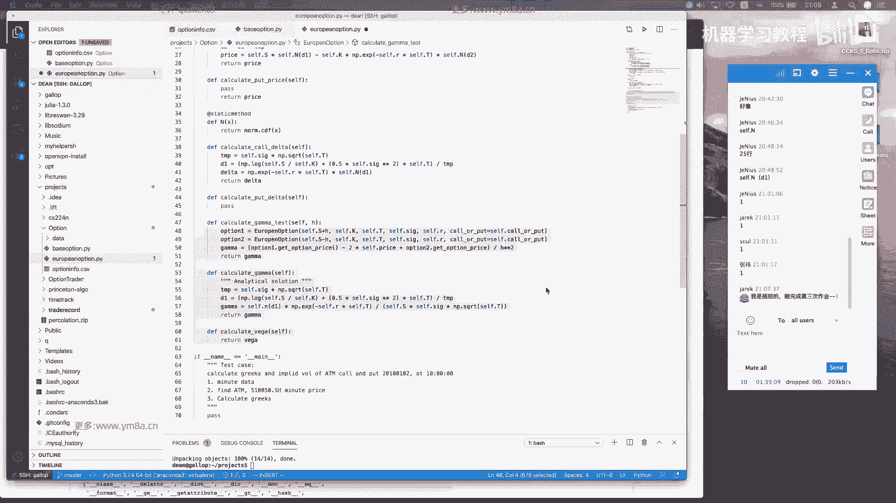

市面上。没有哪一个期权软件能够去帮助你去就据我了解，目前没有哪个期权软件能够帮助你去回回看到历史上任何一个时刻的期权报价表的梯型的报价表。所以包括像万德或者像berg软件。

他只能看到我说我对于单个合约呃，目前是这样，那目前是怎样的，包括它的银行波动率，可能说呃他如果是日级别的话是okK。但是像如果说你我想要去分析已经退市的合约。

就是现在不带交易的不带交易的合约的银行波动率，那目前万德就是说我们只能就是说通过调历史数据的方式，然后历史数据可能我不确定有没有分中品可能只对应我当时用的时候是。

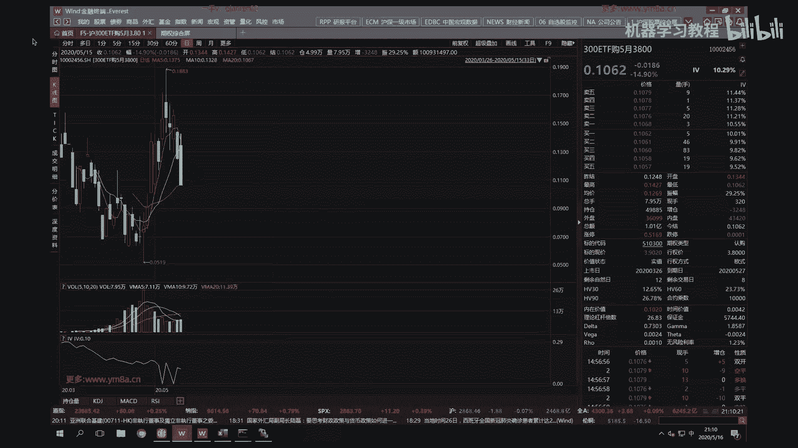

他们是没有分钟频率的啊，就是imppriable，他们只有日频。那事实上你做期权，如果错过错过，就是日内的变动，可能有的时候对你看大家看一天的变动可能百分之几十%。那日内的变动如果完全miss掉，只看。

收盘做日级别的策略的话，我不不我不排除说按照我只做日级别也有可能获得比较好的收益。但是呃如果说想要去就呃其实但是想要说获得更为稳健的收益吧，或者说我有一个期权的投资组合。

不可能说每天只在收盘接近收盘的时候去调一次仓。而是我在日间的时候就是在交易的过程当中，我要实时去盯着我整个portfoo的这样一个ris，就是我们的所谓的各种各样的gs。对。

所以因为因为期权事实上日内的变动还是比较大的对，然后如果说行情发生了比较大的偏差，我们还需要去rebalance我们的portfoo。

所以所以说就是有这样的就是分析工具是希望我们就能够说呃不管是去做历史的研究，还是说在实盘的风控跟交易过程当中，我们都需要有就是相应的库局，实时帮助我们盯住我们的风险。对呃，事实上我想一下呃。

对万德有一个有相对来说对万德的期权已经比以前会好一些了。呃，除了我们的波动力曲面，然后。😔，嗯，对，齐全组合计算器。对但哦对，事事实上就是说我们是应该自己去用go意。

就是我们自己去用python或或者是C加加。嗯，哪怕你是用呃，我不确定excel是不是可以做。我我们当时解决的方案是呃是可我们最开开始的一套解决方案是呃，我们用。我们用就是用一个服务器，用用一个服务器。

就是说我们是做风控做风控的时候，用一个服务器去分别计算所有合约的这样一个gs。然后我们用不管你是用什么样的方式去用messageq或者是还是说你是单机的都O如果你是服务器的话。

你可以用ss在不同服务器之间去传递这样的ek的数据。然后在交易员和PM的终端里边，我们去你可以自己去写一个g，或者是用on或者是C加加写到excel或者写到exel然后你可以获得实时的我目前的foo的。

就是这样的一个呃状况，就是这样的一个g状况。呃，对万德这这个好像应该这个是应该是一个是一个比较静态的东西。但是我们在交交易员需要的是可能是一个是一个动态的动态的这样一个数据。

所以对所以就是说我们知道底层它是怎么做。然后包括呃当然说怎么去调MQ怎么是去写这样的一个呃前端的话。我觉得可能应该课场不用花太多我课场不用去设计讲这些吧。

因为呃可能大家稍微看一看PYQT或者是其他的C加加跟excel的这样一个教程，可能都会都都应该花一段时间都能够去做出这样的一个东西来。对。

就是说最终的目标是我我希望就是大家的最终目标是呃我告诉大家是说可行的路径。那大家可以自己去画业余时间。哪怕是这个课程结束之后。

可以去自己做出一套就相当于说我能够去实施动态监测整个pofoo的这样的一个呃前段，呃，就包括因为这这个就是包括像这样的一个图像。我们当时也是最刚开始的时候是其实参考就是万德的这样一个东西。

然后包括这个这个图，我们都把它做出了一个动态的这样一个图像出来。对。呃，我我觉得就是说这这样的话可能意义会比较大。当然前后就是engineering的东西还是比较多的，还还是还是需要写写一些代码的对。

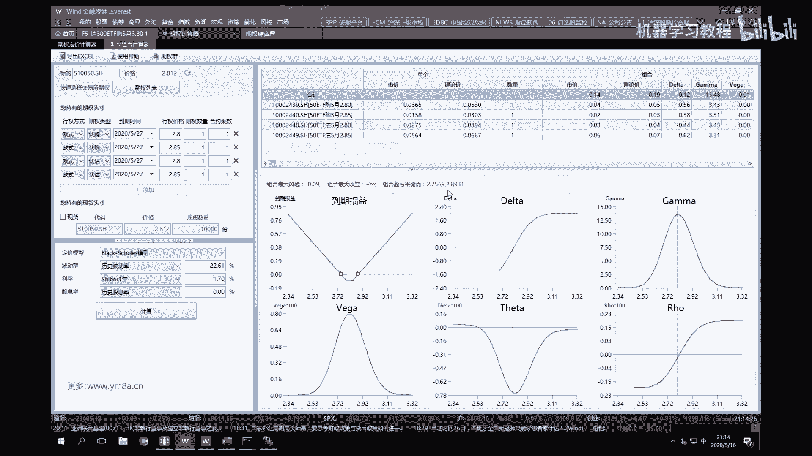

Yeah。好的，然后这部分的话就是这样是一个基本的european option的这样一个class，我觉得就。呃，OK了，基本上是OK了。然后。呃，然后对，然后嗯。Calculate。现的。呃。

大家对于目前到这一块有什么问题吗？这个就留给大家自己去完成。对。然后呃。对，return。😔，Okay。这个不。对呃，大家到目前为止有什么问题吗？哦哦，我们这节课先到这边。

然后下节课我们再想就是怎么把这些东西给组合到一起去。系的。啊，大家没有问题，我们先休息15分钟。哎，hello大家好，呃，我们现在回来哈。呃我还我还是再问一下，就是嗯那个我这个还是得问一下大家。

就是这个back testing呃，有有什么样的问题？对。先呃先先呃我不知道就是有没有同学能能完整的把那个。呃，O呃，已经有同学O moving average啊，经常stless那那那那O啊。

就是你可以可以可以没问题。这star less就是简单的均线策略是会比较那个了，比较简单。那个就是那可能上世纪还能赚钱这个世纪。我不太相信，就是单纯的就是说没有经过优化。

或者说直接用一个bo averageage能够赚能够就就稳定的赚钱，应该不太现实。对，那那那挺好，至少就是这个同学已经能跑起来了。对。然后事实上就是呃就是我们就是我还是说得强调得把这个呃平台现在跑起来。

跑起来之后，我们才能就是说接着把我们去你去不断去测试因子，找correlation比较高的因子。然后我们再去说把因子去做我们的去做我们的回测。对呃。

这部分可能是嗯然后对这部分可能是只有通过这样的过程才能就是形成呃形成这样一个闭环吧。对。

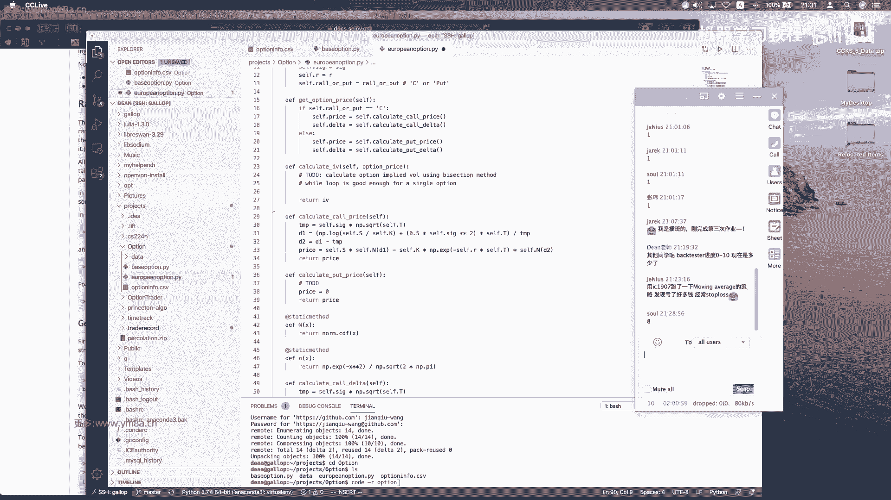

呃，然后就是说我看一下呃。Soorrry。😔。

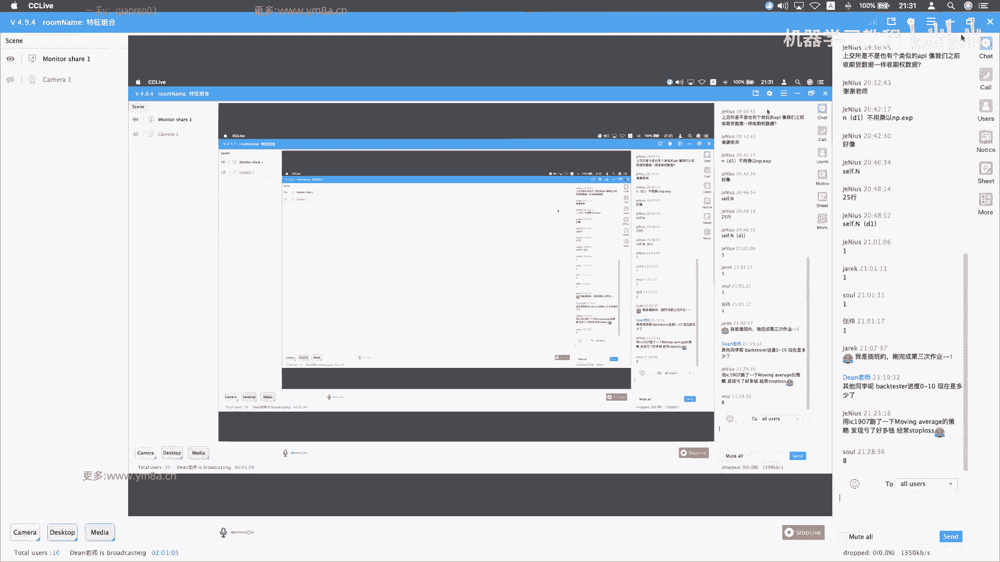

嗯，对。嗯。呃，然后其其他同学呢，其他同学是已经做完，吗还是说遇到了什么困难？对。呃，我在想的话，遇到的。遇到什么困难的话。😔，嗯。对，其其他同学是个什么样的情况？嗯，那没关系。

反正就是如果遇到困难的话，可以就是在私下找我找我交流吧。然后就是对，因为我觉得。对，然后如果觉得时代有困难，那其实嗯先。这行业不能跳过去哈。对，因因为就是这个东西不做完还是不太好。

我们就做接做接下来事情。然后对，然后还有就是说我们先然后我们回到这个课上来的话，就是呃。呃，back tester我记不得是第三次还是第四次，就是大概是讲了讲了差不多有6个小时的时间。

对back test。对，就是对，差不多是第三次或者第四次课做第四次课结束之后，我们应该就是然后留给大家一个五一的时间去做完这个事情。对。然后。然后这边呃我们回到这个op上面来，就是一个是呃就是cap。

然后呃我就是我们先看就是说单个的option是怎么去做这样的事情。呃，然后其实就是说呃你可当然可以用牛顿法，就是我给一个初始的点。呃，然后不断的去寻找。

就是随着我们的derive呃呃就是根据我们导数去寻找我们下降的方向，但是这样可能就是说如果刚开始derive选的不是特别就是刚开始初始点，如果选的不好。

或者说我的呃算的时候步子就是它有有可能会出现有有部分点可能会出现说我不断的在震荡。但是说就是我可能step比较大或者是怎样，就是我不断的去震荡，但是找不到就是我们的就是找了一个opti的点。

所以事实上我们就是常用的话，我自己习惯是还是说是用就是用分塔的方式去来找这样的一个找这样的一个。是期权的implyable。

就本质上说呃就是说我们要去呃就是说要去找根据当前市场给定的这样一个option price，然后我们去带进去去算我们呃，然后然后我们要去反推出我们这样的一个implyable。对。

就是implyable本质上是就是说不是说implyable决定option price是反过来的是当前市场交易的交易形成的价格决定了我们这样的一个implyable。呃，然后其实要做的事情就是。

让我想想这部分需不需要载。呃，对，就是这部像这部分就是。留给大家课后作位吧，我觉得这个这边就是单一的one loop，就是说我用一个对我用一个w loop，只要说我的。呃。

like嗯就是我的那个我的meade跟我的。呃，跟我的漏或者是呃。小于一定的。like我们认为以一付6会是1一付5。比如说1-5的话，大概是0。001%。那实际上这进度已经相对可以的话，呃。

我们就认为就可以了，就我们就认为就可以可以把这个ID给输出过来了。对，然后但是然后我这边就是想要想要就是跟大家提示一点，就是说呃，当我在算很多历史数据的时候，呃。我们现在这边所有的代码都是。

一个op就是我可以用follup去做。后我有很多按照followup把它去做。但事实上这样会是会非常慢，很有可能你说算个几天几。呃，我历史上5年的数据你可能都不一定算得完。

所以这个这个时候给大家建议是一定要去就是真正在ineer生产的时候，我要把所有的代码全去我要把所有的代码都要去然后这边就是给大就一个小吧。觉得就是大家可以想一想就是说我有我有不同的期权合约。

同时再去算imply的时候对就是我期权的到期日或者是what什么什么都有可能不一样。然后我怎么去确定这么多不同的期权合约在同的候，就是我用一个，就是说我这个时候把所有的S甚至是都呃当然我不建议把它分开。

你还是 call或就除这个。其他所有可能都一个个都是n pair。对，然后这个时候我怎么去把calculateIB去把它去veize？对，就是说我单个去计算的时候，呃。

用w loop我不需要知道它什么时候终止就ok对。呃。对，大家是大家有没有什么好的想法。对，就是如果我多个合约的话，我怎么去挖撸，对吧？因为我这个时候所有的mate跟。呃，就是我的low和 high呃。

都是一个个npy，而不是一个个具体的数了。然后我实间过程当中，这个我我一般考虑就是说我可能它最大的implyable是1000，虽然说超过1000，也不是说没有可能，但是事实上概率都比较小啊。

就说如果真的出现出现100%的隐含波东西，可能这个时候不不是盯着我们的风控，可能是要想办法。可以就想办法看看就是我们现有的持仓怎么去把它平掉，或者是或者是怎样去处理了。对，就是比较极端的情形。对。

那大家我可以等我还是回到这个问题来，就是说如果这个时候。我我的optionpri或者是我所有option，我是1个100的，就是我我有100个合约，我同时去计算。那这个w while的时候我怎么改。

我我该怎么去做，或者说不用Y到底怎么去做。因为我这个时候要考虑就是是每一个合约的。每一个合约就是npower，每一个合约它都需要在这个rangech。当我有的合约已经已经收敛了。

有一些合约还没有收敛的时候，我该怎么去把它back toize。呃，大家可以想一想对。你当然可以说就是哪个合约。你算完了，你就把它保存出来，不要去算了，对吧？

嗯那但事实上就是我用vectorize的意义，就是说我就避免循环。我如果说是去，如果我们还是再去用followup去判断哪一个合约算完，哪个合约没算完了，那相对来说可能是比较浪费时间的对。

对就就失去了种veized的。B对。那那我我这边给大就是大家有没有什么好的办法，我想先听听大家的想法。对。就就我1000个合约，我想不要用不要用fo loop，然后但是想同时就把它给计算下来。对。

同时把它的implyable给算下来。因为大家可以观察到，就是说我们接下来我们下面的就是每一个方块。事实上我去把它back to，呃，这个都是OK的，慢牌有很强的这种能力，对吧？

因为我n派直接是不同S divided by different K就是是都OK。但事实上我们S一般是一个，对吧？因为对。就我呃对我我这边就是给大家的，就我个人的建议是。我们用fo loop。

instead of呃就是不是说呃就是。What listen should use for instead of a while，这是什么意思？就是说。我这个时候不是说等到他收敛到。呃，十的负次方。

因为因为我们可以简单的算这样一个东西啊，就是。二的10次方是。1024对吧？比如说。我可以强制性的让每个合约都去跑10个2分法。就是跑10次2分法，sorry不是10个。那这样这样的意思就是说。

当我可以把十去，我就近似的去除以1000的时候，对吧？这样我们约等于就是说大概这样子差不多是我可以达到0。01的进度。那如果说。哦，那如果说我想要达到0。00亿的进度的话。

那我我就不是说我就我就不是强制的运行实测本法，那我可能是考虑12次。12次转是40次吧，那我可以考虑写4次，这样差不多我可以达到0。001的精度。对。

就就就是这个时候说如果说我有多个合合约想要去同时一计算ID，我们用fo loop，而不是用w loop。对呃，这边要注意的是我这个foll loop不是说针对每一个合约去分别计算。

而是说我针对于这样一个呃mtrix or array。对。我这个时候是强制性的让他去跑10次呃，二分法。对，就是我强制性的去给10个，就是说我强制性的会给10次10个不同的imply word值。

然后带到呃 calculateculate call price里面。然后让他去算出我们的option price跟我实际的option price去比较。然后我通过这种方式，我就可以说。

我就可以说去批量的，哪怕说1000个，我们当时自己测试，就是说同时说是呃就是同一个时间节点呃，200个200个合约是呃就简单那个拍on，用 non拍的就是跑下来的话，就是不到0。1秒。

我们是可以把它完全算出来的。就是这这种情况下是满足我们去实时定价的需求。如但对呃，我不知道大家听明白了这个意思没有。对，对就如果说我不用这种方式的话，可能就是大家处理分钟数据。

可能就是用fo loop一个个去算，可能都会花比较多的时间。对。就是我这边给了大家是一个相对来说是就是我们是计算sing option。但是我们先把这个做完之后。

大家会我需要就是大家去把呃这个东西改成就是所有的re。当我传递的SKTma等等，都是一个个呃n array的时候，我我们仍然希望这个class能去 work。对，这个这个是要留给大家去做的事情。

然后然后我觉得就是值得就是去注意的，也就是说在计算这个呃就是用by section的方法去计算imply的时候，呃，对这是一个算是一个小小的t吧。对。

所以就是呃大家注意就是呃在计算就是像框mefinance里面，就是或者说其他 Engine这种东西，其实是能够尽量的向量化就可以去尽量的向量化。然后当然我不知道这块东西是不是可以考虑说用GPU来去计算。

对，就我。对，事实上我看过是有人是用GPU来，就是对就exootic option的话，是用almon color模拟来去做这样的事情。是有人考虑过是用哎，是不是有人考虑过，是有人已经用GPU做出来过。

哦不知道刚刚讲的这一部分，大家有没有去理解，对吧？就是如果是。呃，就是如果是要for嗯，我我如果我们要去向量化去做的话，这部分可能是要大家去注意的。因为这样我就会呃。避免了去计算。对。

避免了去判断我这个某个合约没有算完。因为我可以保证的是。在12次获者更多的by section的方式下，我一定能够保证我的波动率去收敛到一一定的就是我想想要的进度。对。这样相对来说是会比较快一点。呃。

这部分大家有什么问题吗？对，这个也就是我想强调的一点。对，因为之前曾经呃有实习生在去做这个事情的时候，说跟我说这个东西很久都没有算完。然后再其实简单的去把它就是reterize一下，那其实就会很快了。

这是一个要去注意的地方，这是写代码的时候，大家要注意，不能就是一直一呃就是一时写的比较爽。然后后期然后运行效率什么都会有问题嗯。嗯，然后我想一下，就是接下来就是说呃如果所就大家把这个都完成了之后的话。

对，那这次的话其实是需要把。

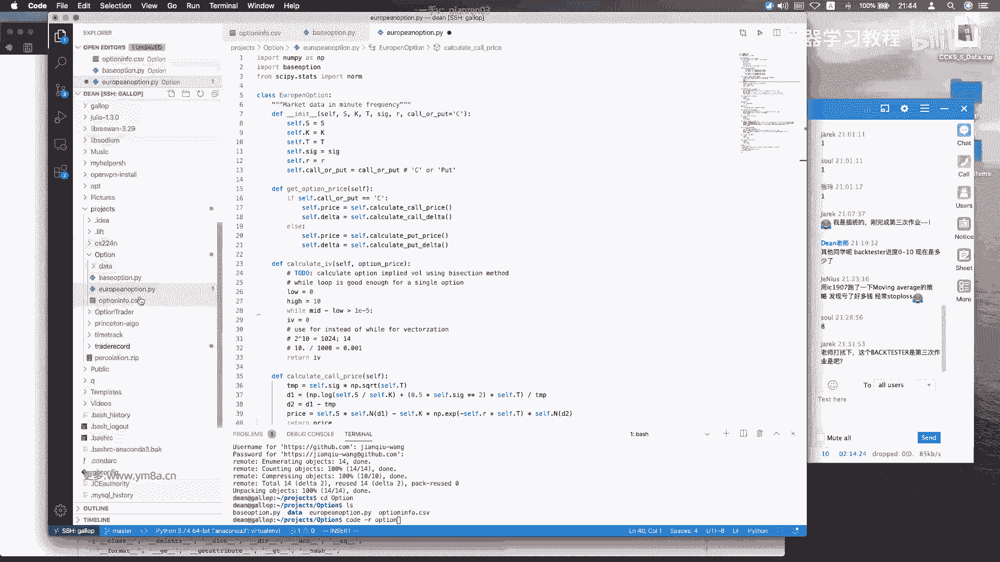

我们的就是一个个的。对。

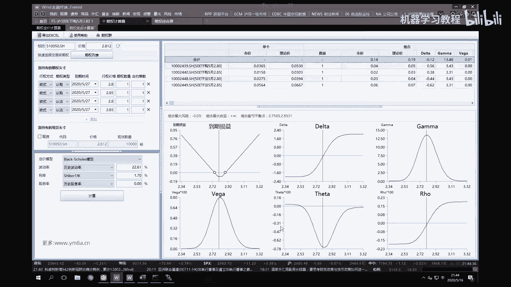

还是还是说一样的流程，我们先去把它的啊mini price给算出来。对。就是我们先先去把期权这样的和原面令pri给算完，算完之后，然后去算出它相应的greeks，把这样的值都给保存下来。

就以最好是每个文件都保存下来。呃，对，因为我们看到的是我们可以给大家看一下这个这样的一个数据结构，或者说这个文件组织方式。这是。我们。取证呃，这个文件夹之后会给大家，就是我们一天。它是有这么多合约。

然后每个合约打开来都是有像我们这样的一个excel文件，就是CSB文件。对，然后然后就是呃一个月里面，然后是按天存放。我们现在有一年差不多250个交易日。对，然后每个交易日都这样的这样的一个合约。呃。

所以数据处理的话，嗯，对期权其实数据量也不算小。但那期货我们肯定之前只要处理一个品种，但是期权我们必须要是把对所有的合约都去去处理。然后。对，然后要完成这次要完成这次作业的话。

就是要找到at money。对，然后我还忘记了是。我就算了，还有不仅仅是。expi。呃，就是。在January in jaary对吧？就是我们我们就看当月的吧。我们要看单月的。

这样不熟悉的同学可以去理解一下就是是什么意思。对。嗯。对，所以所以这次就是说呃是希望先大家先把这些数据给呃t data，就是其实分几步了，还是先去去呃呃处理它交易时间。对交易时间是9点25分集合竞价。

9点30分正式开始交易。它跟股票的交易时间保持一致，所以是9点30分，没有上午没有休息时间到11点30，然后下午1点钟到3点钟。对，只有只有日盘，这样处理起来可能会好一些。

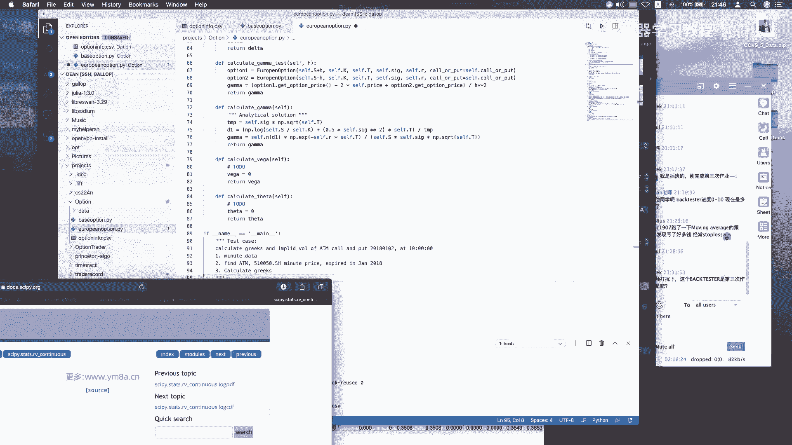

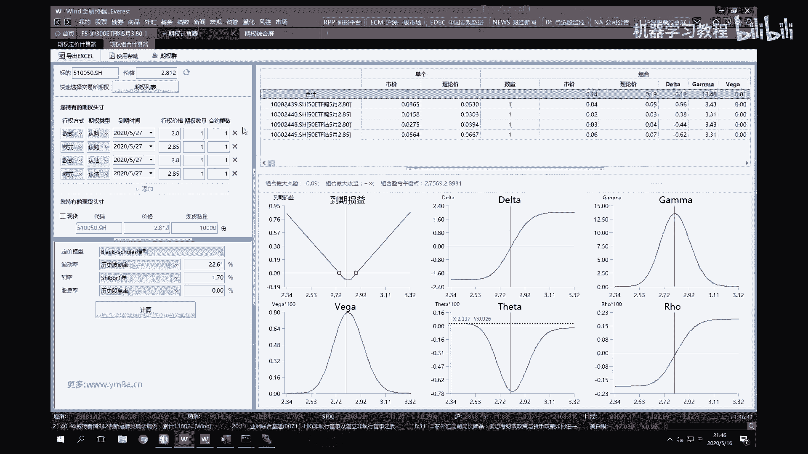

对，然后大家把这个期权的先呃tick数据处理完。然后嗯其实最好的方式是。就是就是以后迟到就是说你要用take数据的话，其实是最好相应take数据可能都要去把它去。存下来存到数据库里面计算。

包括每个每个take就是就是take bit跟ask对应的就是implyable，可能也是也是也也是需要的对。

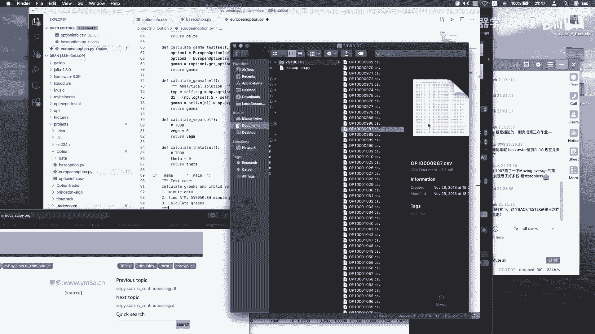

嗯。OK对，就是这是我们这边的in盘，就是我们这边除了。这是我们的BP one和SP one。对他这个叫法有点奇怪，但是呃应该是就是意思是一样的。这个这个是那个对，这个是比较高嘛，这个是比较低。对。

但这个合约目前不是很对，也不流动性不是很好。然后我觉得比较有意义的一点是，大家大家可以就是把它的呃imply给 plot出来。因为嗯2月6日嘛，不是2018年2月2月份吧，我不知道是不是2月几号了。

就是正好是贸易战刚开始那几天，所以大家可以观察到呃那几天市场有多动荡呃，以及就是我刚开始时就是刚开始我去那个时候差不多刚开始做交易。对，然后我记得刚开始交易的时候，好就是就是我作为卖方。

其实profoo是亏了不少钱，就当时整个人都有点吓傻了。对，就是不知道还能这么亏，所以就如果对我觉得有意思，就大家可以把2月份的就是2月份那几天数据给处理处理出来啊，看一下。

就是把然后最好是把每个月的就是平质的期权，它的imply word你或者就imply的走势给p出来。我觉得这样你会比较直接的。观察到嗯整个期权市场它是怎么再去变化的对，就是以及就是因为正好是贸易战。

打贸易贸易战刚开始之前是春节，然后以及经过春节这么长时间，春节之后它会怎么变化，以及。也可以观察到一年就是18年每一次呃双方会有什么样的举措，会对于整个市场的呃波动率会有什么样的影响。

我觉得把那个pro出来还是挺有意思的，应该你观察到是刚开始是implyable就是冲击很大。然后之后每一次事件都会有冲击，但是相应的imply上涨幅度是不会如之前的幅度这样大。对，所以。

implyable就是所以本质上来说就是说应该是有利于大家观察到，就这样一个黑天鹅事件是怎么发生的。就可能平时呃市场波动不会很大。但是一旦一旦黑天鹅事件发生的时候，imply涨起来非常快。

但是它DK的时候又不像说它上涨的速度那么快，它可能反而是需要一段时间，就可能18年有一部分或者说大部分时间它的implyable都是处于这样一个高位。对，然后。事实上呃有了这样的数据之后。

大家再去不管你是是去做投机，还是说我就典型的去呃我不管是做买方还是做卖方吧。你简单的就是说你可以去去测试是一个是我去我的波动率。然后以及我是说我就是单纯的去呃根据时间或者均线我是去赌方向。

大家可以观察到就是在不同的implyable情况下，不同的策略的performance的表现是不一样的。然后这个时候其实就有助于就是初步的你可以看到，就是说当目前的市场行情。

它的呃implyable在历史上处于怎样的一个分位。这个时候你就可以考虑说我这个时候作为一个PM我的策略方向应该是我的策略应该是偏向怎样的。我的我的各个应该保持怎样的暴露。

到底是我应该是保持正位感还是说是感对。呃，对，所以呃今天其实第一课第第一课的内容就是呃本本来我会觉得刚开始准备说第一节课的话，大家大花一些时间跟大家勾一下期权的就是一些基本的一些知识。

但所以大家可能都比较知道，所以就是就相对来说会快一点。对。呃，然后这一次的话对，差不多，然后这部分是呃就是就是要完成这些作业的话，呃，除了说是我们有期权的，就是priice的价格。

然后这张表也是大家去读的。因为本质上来说，你可以把它作为一个key value来去匹配嘛。我们每一个合约你都可以去得到它的这样一个。得到这样他的一个信息。

然后呃我每就是在每一个不同的交易日的在交易日每一天不同时间点，我可以根据呃它的exercise呃exercise date或者是就是呃expire date，然后去计算我计算我的到期时间。对。

然后根据这样的呃目前可能还不涉及到分红。然后分红的话。对我我我我先鼓励大家就是建议大家是遇到分红的时候，大家自己先去想一下，应该是2015年11月吧。2091每年的11月大概是一天5分红。

遇到分红的时候，我这个合约应该怎么去处理。对，然后下节课我也会给大家讲一下，就是应该是怎么处理。其实你理明白了分红的，它的本质就做这样的处理，应该不是特别麻烦。对。

然后呃可能要注意的一点是就是这边不是有一个合约章数。合约张数呃。我找找看有没有其他。对，那事实上这这个合约张数啊，我们呃这个合约张数反映的是在。2020年5月16日，今天这个时间节点。

这个期权合约每一张对呃，就是每一手对应的是多少张，因为这是分红过的。然后包括我也看到它的行权价其实其实已经变化了。但事实上就是说在分我们要做的事情是要在分红之前。我们需要把它就是说在分红之前的时间。

我需要把它的行权价跟conrl unit给把它给recover过来，就返回过来。你事实上就是说事实上就是2。348乘以10220，再除以1万，就可以得到它原来的这样一个价格。然后我们要注意。

就是在分红当天跟分红之前。那就是分红之前跟分红之后，就是它的合约陈数，包括它的行成价都是不一样的。即使它的合约的就是security IDD没有变化。对，这个是值得可能大家要去注意的。

就是处理到11月12月之后的数据的时候，可能会有一些区别。呃，事实上我想一想，15年18年对，18年18年1月的时候，我们已经已经有涉及到就是非标准的合约。然后刚开始如果简便的话。

你其实最简单一点是说我只交易我的标准的合约。对，因为因为市场是为了就是机构为的交割方面，我们不太会去涉及呃，就是非标准的合约。就是说即使说在分红之前，我们持有这些合约，分红之后。

这些合约变成了非标准合约。然后我们都会想办法。呃，这时候交易所的状态就是说。标准跟非标准的合约同时上市交易所会去新挂合约。但是我们还是会尽量想办法把旧的非标准的合约给平掉，然后逐渐移仓到新标准。

那就是新的合约上面去。对，嗯，对，所以所以刚开始你只处理就是手数为一万的这个合约，我觉得是O的。但是如果你要完整的追溯整个历史数据的话，我建议是标准跟非标准的其实都是要去处理的嗯。

然后是事实上就是在合约换就是非标准合约出现的时候，呃，有可能还会存在一些套利机会，大家可以研究一下，就有时候其实还是挺大的对，就即使明明他们就是相同东西。但是就是由于市场的供需不平衡。

导致他们的价差出现比较大的偏离。那完全如果你考虑到你的资金成本是ok的话，完全可以就是呃把这样的就是短期来说去做这样的一个套利。事实上收益是相对来说是比较可观对但但因为天数其实不多。

虽然年化算起来很可观。但其实。实际比例也没有那么大，但是是值得一做的对。呃，我在想这次的数据应该就是这些。对，还是还是根据如果我们有之前的话，就是take数据相对来说处理。

就之前的写好的functionction，你只要相对来说做一些改动。呃，这次作业应该不会太难。就是我们先处理到把处理成期权的，就是呃先处理成把re data。去除掉非交易时间段之外。

然后我们得到标准时交易时间段的数据，然后合成分钟的数据，合成分钟数据之后，再去把它的各种各样的geks给算出来。对，这个大家还是呃这部分大家就是去自己做一下吧，我觉得可可能会好一点。对嗯。

然后对于弃权这样的特性的合约的话，呃，对你可以把存到数据库啊，我之前就用的是mongoDB相对来说是比较好用的。因为mongoDB每一条记录相当于就是一个。

jason string也就你可以理解为一个字典。对，所以其实用起来也比较方便。大家有有有呃我我建议大家是把它都换到那个呃man购换到数据库里去。嗯，这样可能会好一点。对。呃，期权数据本身也不算小吧。

对，然后每次读文件可能还还花挺多时间。因为这个时候就是在做期权的时候，我们甚至因为因为呃做期权的时候，我们不仅仅要的是价格跟时间嘛。对我们还有其他的衍生，那就是衍生的就是呃breaks这些数据。对。

那因为事实上就是为了加快期货的回收速度的时候，你很有可能说我我如果只用到价格跟成交量。对我可能只会加载这两个列。那只加载这两个列的话，你数据量是可以压缩到很大的对。呃，但是期权的话。

我建议大家可以试试看，就是这个这个unow seek的数据来说应该来说相对会比较好一点。然后你可以设计个关键的key。对。数据库还是建议大家就是掌握一下是基本的工具。好的，嗯。

然后大家这节课有什么问题吗？对我再多说一句，就是为什么把就是呃我们的就是嗯盘中交易的时候，当然可以说是呃先就是你不管是把它存到内存里，还是存到怎样。然后盘后的话，我们把我们算到的greeks。

然后呃跟盘盘后算出来的greeks，以及从不管是万德还是其他地方拉下来的这些数据再去会核对一遍，然后再去做每天的PNPML的分析，这可能是我们我们当时就是每天都会去做的这样一个事情。对。

所以就是greeks是可能比单纯的价格更加会去重要一点。这个。这边也要加一个to do就是。好的，嗯，大家还有什么问题吗？Yes。嗯，然后如果没有什么问题的话，那这节课就先这样。然。

还是我今天然今天把数据早一点发给大家吧，上周确实拖了一天，等到周一才发给大家。对，今天我待会就把齐权的数据。呃，发给大家。还是一样的，在那个。百度盘。哦我看还好，这场总共就几百兆。对。

现现在机械硬盘反正也是相对来说比较便宜了一些。所以可以然后有需要的同学咱就可以去加硬盘，对吧？好的，那没有什么问题，就先这样。然后呃如果有同学还有什么其他问题的话，是可以找我，现在可以找我私聊或者是。

就或或或者不用私聊，就是有什么问题可以提出来吧。然后正好给大家公开解答一下，包括前面任何一次作业的都OK。对，然后期权的有一点的话就是呃。对呃。

面框的话或者是MF很多program还会有蛮多人喜欢去问期权的。呃，期权的相关的面试题。然后对如果如果大家有兴趣的话，我也可以再给大家就是再找一些。这个找一些比较经典的题，可以让大家试一试。嗯。

就可能说呃相对于会熟悉一点的同学，就是如果做过期权交易会熟悉一点的话，可能对于这些题目会觉得好一些。就比如有人问说呃比说什么样的期权，就是伽马最大，那事实上做过交易的人可能脱口而出，没有做过交易的人。

可能还要想一想。对，然后包括期权是近月的伽马，还是远月的伽码。然后如果我们我们现在还不仅仅说是看这几个basic，就是greeks。然后如果还有vo码，还有其他的一些更高阶的一些呃geks的话。

那可能就处理起来会更麻烦一点。对，也不一定也不一定就很麻烦。但是对呃事实上就是把它分解的相对来说比较精细一点的话，就是对于你呃去像片了要归因会好一点。对呃，事实上我看一下呃，我们在做归音的时候。

用日内用分钟数据就可以达到比较高的精度。对，当然有T数据，你计算下来可能也更好。然后以及呃就是如果我们有了就是有了tick的数据，事实上就是说我们是可以自己去核实，就是波动率的指数的。

就是说我不做期权的交易，我用不这个波动率指数也可以反映当前市场的情绪。然后兴业证券有用过有一个兴业证券有一个水晶球水晶球的模型。我记得但是通过期权上的呃就是cor ratio等等。

呃就是呃等等一系列的比例。然后大概是四个因子，它合成了这样一个情绪的这样一个择时的指数。然后有兴趣的同学也可以试试看。呃，如果我对应的期货，有对应的呃期权的话。

但是可以考虑用这个东西来辅助帮我期货作为一个呃期货上面进行择时。然后如果做股票ETF股票的股指期货的则时，那事实上也是可以通过呃股指期权以及ETF的期权，这上面一些因子来去考虑的。

呃事实上就是做交易就是我拥有的。信息越多的话，嗯，可以当然是有效信息，不能引入过过分的就是过多的杂音。你觉得就是说那你那你就会比别人的爱知会去稍微会多一点。对。嗯，然后我现在分享一下这个期权的数据。嗯。

对，由于最好这个数据大家就是呃仅限于本课程使用。对，然后毕竟我也是就是花了也不少钱买的。当时对。十二。呃，还是有效期是7天，然后希望大家尽快去下载哈。有效期是7天呃，我也在微信群里发一下好了，待会儿嗯。

那如果没有什么问题的话，我们本节课就先这样。嗯，大家周末愉快。

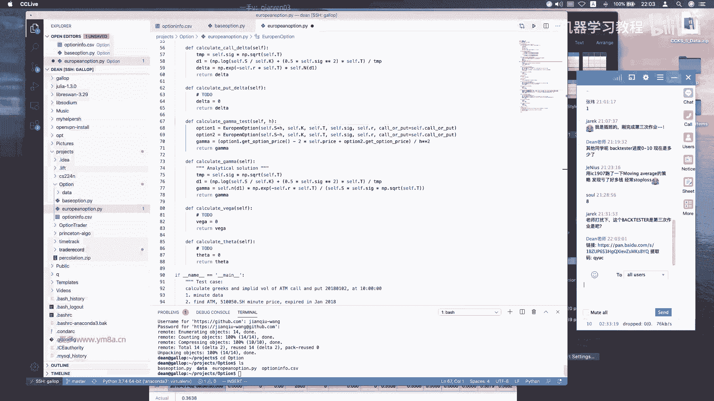