# 2025最新AI量化交易实战教程，三小时入门到进阶！清华计算机博士讲解，零基础也学会了（AI人工智能丨数据分析丨数据挖掘丨机器学习实战丨深度学习丨编程） - P6：第七章： 投资组合理论 - 机器学习教程 - BV1ujk4YKEw9

OK我们再稍微等一等哈。呃，同学现在能听到吗？

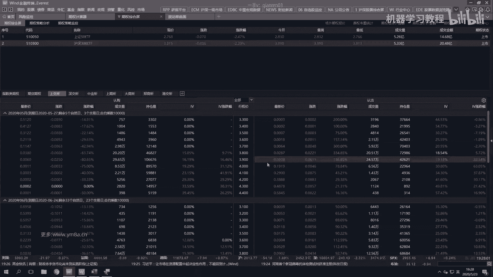

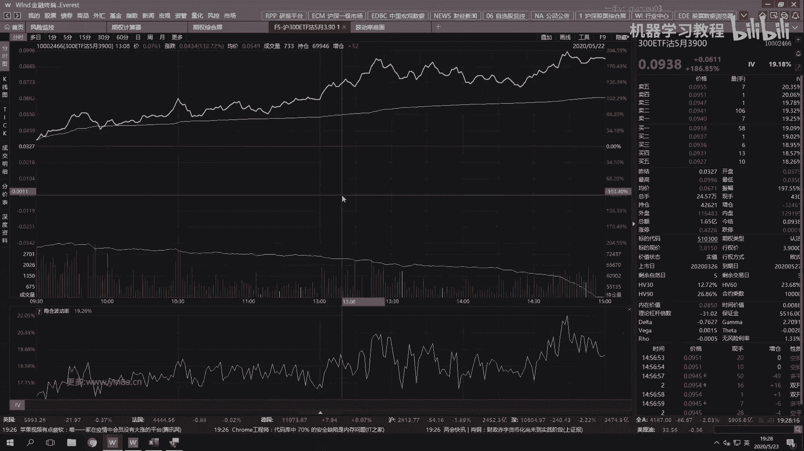

嗯，大家再稍等一下啊，我们等人稍微再多一点再开始。哎，好的啊，各位同学嗯，今天好像嗯我不知道是上周讲的大家嗯没有太高冷，还是说大家最近比较累啊，就是好像最近来听课的人比较少。OK但没有问题。

我我看到就是呃好像交作业的交准总共大概有4个4位同学交的作业，然后基本上今天都要听课的。哦，我很欣慰哈。对，然后刚开始先我们先看一下，就是上周的市场的。就是我大家呃如果大家有关注的话，就是周五的时候。

市场其实是有不小的一个跌幅。然后我们看到这是沪深呃沪深300。然后对和50跌幅都达到了2%以上。然后我们可以看一下，就是对应的期权，其实是非常夸张的。因为嗯5月份到期的期权。

大家看到到期日是下周三、5月27日，还有5个自然日，三个交育日。所以快到期的期权的时候，相对来说它的伽马就是对伽马会比较大一点。比如说也就是说当价格变动相应。

就是underlineing assetad就是我们的标的50或者是300ETF嗯。变动变变动相同的幅度的时候，那么呃快到期的期权，所以它的波动肯定是会大一些的。

所以我们就看到就是说呃这边有达到300的合约。对这个合约我差不多我买了1首，所以周五一天是赚了点小钱。对，然后对，然然后我们再看一下就是。就是说为什么我们要去关注就是期权的greeks。

就是因为我们在期权交易期权的时候，其实我们并不会像CTA像期货一样关注它的方向性的涨跌。因为很多情况下，我们交易期权是希望就是。

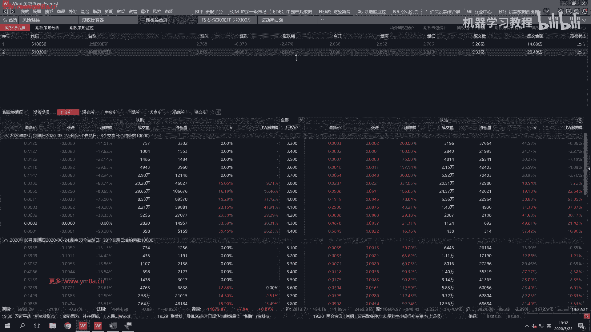

排除掉系统性方向上的风险。我们是希望通过波动力，或者说呃波动力方向来去做一些判断，而不是单纯来说去赌方向。因为赌方向本质上来说，我们可以用股指期货。对，这样本质来说呃就是杠杆会非常大，然后效果也会更好。

因为我们除了波动，除了方向上来说不会有其他的包，就是除了delta不会有其他保。但是作为期权而言，它是一个非线性的合约。所以我们交易的时候，不仅仅是关注它的delta，我们要关注它的其他的其他字母。

然后同样的就是说我们看稍微远远一点的。6月份的这样的一个合约。在在相同的行权价，比如说我们就看3。8块吧，因为它现在平值合约大概是大概是3。8块。对，同样的是3。8，它的它的涨涨幅是92。74%。

但是快到期的时候，它的涨幅是334。85%。所以从这里面是可以观察到，就是越靠近到期的时候，它的伽马对于它的影响是会比较大一点。对。OK这一点大家觉得OK吗？

就是说嗯本质来说就是我们交易期权是希望我们在对我们的投资组合当中。比如说我们只有了一篮子股票，然后我希望说呃对冲我这一篮子股票的风险。但是我也不想说是花很多钱去做股指期货。

因为股指期货其实保证金是比较高，一手肯定要十几万几十万。对，那那我可能就是说我希望拿我投资组合的2%到3%的金额呃，作为一个作为我投资的这样一个保险，当市场发生系统性的下跌的时候。

比如说市场一天跌了2%，但是我很有可能在期权上买put的这样一个部分，可能可能会弥补我的保，弥补我在呃现后段就是股票方向的损失。甚至某种程度上有时候还会出现一些超额收益，就是即使是市场行情下跌。

但我对冲之后，我可能我还是我整体上投资组还会去赚钱。所以期权的非特呃就是非行性的这样一个。嗯，收益是比就是是我觉得是值得大家关注的一个呃一一个特性。对。然后呃群里的这几位同学。

我看一下okK今天现在人又多一点了，我刚刚对。呃，现在人又多一点了，今天差不多是现在是。没。sorry，我把聊天框给我。稍等一下啊，然后现在大家看到就是这个是so同学嗯呃整理一份齐权的分钟数据。

对我觉得还是挺好的，就就是呃可能我上次没有解释清楚，就是说除了是分钟数据的时候，我可能还希望大家把greeks算一下，但没没有问题。就是呃就是之后的话就是反正大家再去做的。

因为我们这节课也会去用到用到这些东西。呃呃，上一就是上一节课的东呃，上一节课的作业，大家觉得难易程度，或者说掌握的上一节课知识掌握程度怎么样，大家可以呃打个分满0到10。

对我想知道呃大家上一节课的掌握的程度。对。我咪去。OK这个是主屏的，没有问题。所以我想我只想把聊天框给你。分OK对，这个就是so有同学的作业。所有同呃，大家可以看一下，就是我觉得还是非常清楚的。呃。

整整个的从。啊option这样一个呃就是它定义的一个 option type。对，然后in类型，然后把相应的方法应该都实现了。对，然后这一块的话，它用的是挖 loop也OK了。

就原来我我我希望就是说上次给大家一个估计，就是说呃就是说其实可以不要用Y loop。如果。后中间嗯出现了一些计算的失误什么之候，那可能会陷在外里面一直出不去。

那其实上次希望呢可能就是就就就是说因为我们估计了一下的，就是十的10次方，我大概是1010次方，其实是说二分法10次基本上就可以去收敛了。然后如果是波动率我最小到0，然后最大到最大到1000。

那差不多我收敛迭代12次也是可以收敛。就是说你是事实上是可以说我不用去考虑呃，这些里面就是说我有没有到达我想要的进度，我就是把所有的值强制性的去二分法12次。对，这样这这这是O。

当然这这种方法也是OK的了。对。然后就是实际在计算的时候，因为我们是嗯就实际在计算的时候，可定得关注一下就是呃效率的问题。对，因为呃期权的数据是是0。5秒更新一次。对，然后他期权有一个特性就是说。

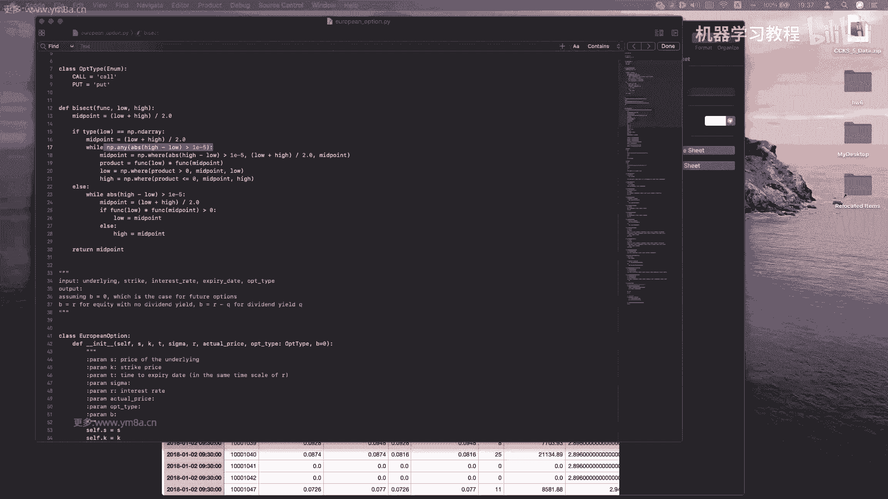

我们不仅仅是呃我们的就是我们看到的这些合约，这些数据是在变。对，然后我们要注意的是就是呃呃underline的数据ETF也是在变。

是事实上你可能是说你你你得不断的去你你用一个messQ或者是或者你就存在内存里，你需要有一个线程市去不断的是去呃收期权的数据。然后另外一个线程不断的是去呃更新股票的数据。

因为两者更新的频率是不一样的对但是然然后说你可定说你需要不断的在内存里去维护这样一个最新的界面。然后当两者当中呃你你可以说是有任意一者去呃发生变化的时候，我就全部去把我整个的波动曲面。

所有的值都全部算一遍。然后你也可以说是如果觉得说我作为风控的时候，我呃要求没有那么高的话，那我可能说说我一秒钟或者甚至说半分钟再去更新一次，当然也是O的对。然后然后事实上就是说我们有了。

就是说你如如果能收到实时的行情，然后加上呃然后加上你的这个option的 class计算，你应该就能去计算出呃，我在当前时刻每一个合约的呃这样的一个波动率以及它的相应的gs。

你说这个是呃万德提供的这样一个实时的行情。对，然后你应该就能画出在日内的时候，每一刻的波动率曲面，每一刻的波动率的这样一个变化。对。就嗯大家可以看到，就是上周五的行情。

就是说市场的市场的就是说下跌的时候，那事实上就是大家呃我们先可以看一下，就是最近的一个波动预趋势吧。对，其实其实一直就是从。3月份就是美股暴跌之后，可能整体的波动上来，然后之后就是缓慢的下跌。对。

然后慢慢去消化这样的情绪。然后到了近期周五的时候，可能近期又有了一些突发事件，所以整个波动率就取面一下子就被抬高了。对。然后。看吧看这个周末，如果看这个周末有什么样的消息，然后到下周一的时候。

市场再去把这样的一个信息去pri in。所以期权其实是比较好的一个非特非线性的这样一个工具。你可能用一点很小的资金就可以去撬呃撬动很大的杠杆。但是相应的来说嗯，小资金呃，也是说你但撬动很大的杠杆的时候。

你其实相应的风险是会比较大的。

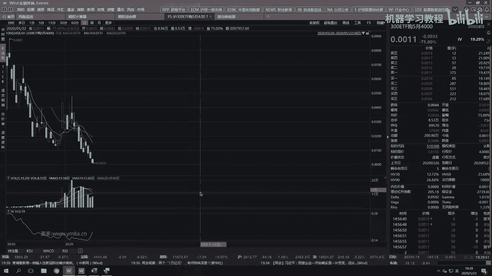

然后好的，嗯，上一节课。嗯，作业的话，然后有同学提到就是有没有那个有没有给就说自己算出来的，跟其他地方算出来的可能有一些差别。那我觉得是okK那可能要去看，就是说。因为可能大家所采用的呃标准。

就是比如说呃隐含波动，哎，不是说隐含波动，比如说无风险收益率到底是用什么嗯，那这样的话可能每一家采用的。都不太一样。然后我我自己可能说之前我们尝试过者说隔一段时间。我们去定一个无风险分收益率。

因为当前的比如说现现在利率很低，那跟18年的就是3%的这样一个风险利率肯定是不一样的那也也有考虑说我们用施保的利率就是对，然后然后去用然后去用利率嗯就是。然后它上面又给了不同到期的这样一个收益率。

然后甚至还有人就是说我不看什么利率取现，我就用余额宝okK那其实也OK了。但也是说可能会有一些差别。但是也就是说相对来说利率上面嗯区别就是说在对于ETF的这样期权，其实定价上面差别不会特别大。

就是我觉得利率差个0%点几。然后所得到的这样波动西可能会呃会有一点点差异，但是不足以说影响到你整个的定价。这是我想说的这样呃说的这样一个东西。对。呃。

然后今天的话我们是想就因为期权只总共只安排了两个课时。然后今天可能先先给大家去介绍，就是大家有了解过就是。

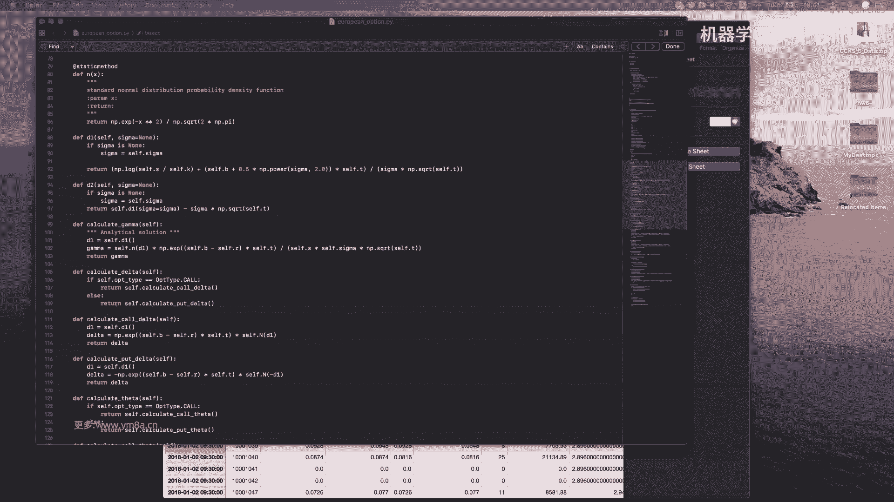

呃，vicix指数就是我们人称的黑天呃黑天鹅指数，对吧？然后还有一个是skill。嗯。然后课前我们也给大家发过了呃CBOE的这样一个白皮书。啊，今天会先带大家就是go over一下。

就是说我们这个呃日内或者说是日级别的这样一个Vix的呃波动率的指数，我们是怎么去构建的。对，因为事实上就是说这这个波动率的这样一个指数是我们在交易的时候会非常关注的一个东西。

就是说当整体的波动率很高的时候，你可能会倾向于说我这个时候对冲。我如果我需要买期权，我可能会想等一点。说这个时候波动率太高。我买入的成本其实是非常高的对，那波动又低的嗯波动率比较低的时候，我可能会去。

现再去考虑说这个时候再去把它买入齐权。然后对，然后事实上的话。嗯。有管理有这样一个网站，就是他。他这里面OPTBB里面，其实他呃里面有给出一些。这日内一个波动指数。

然后如果大家自己没有能力去就是说去我去没有时间去做系统去做出这样一个东西，你事实上就可以参照它的。但我个人建议就是说我们当时也有去对比它，或者是对比一下券商给出来的就是波动与指数。

但事实上我们最终还是去采用自己的模型，我们需要精确的知道呃我们波动力里面，我们做了怎么样的调整，可能跟其他家有一些不一样的地方。然后为了保证我们自己系统的consistent。

就是说呃在机构里头是需要去自己去做这样的一个东西了。对，当然呢我觉得他这个东西相比于之前其实做的已经不错。他已经日内他已经有更新了。但是可能说你自己说。我想要更快的去更新。比如说呃那天市场下跌的时候。

大家明显可以看到，就是过了过了下午一点钟开盘的时候，啊，波动率去呃就是整个的呃波动率指数然后快速的上升，然后快速的回落。那其实这边的时候可能就会有一个比较好的去。如果我想用意短暂的去需要一波波动率。

那其实这个这个点是比较好的一个点。那但是如果你看别人的话，你自动交易系统不一定能能有这么快的呃速度去抓到这样的一个短短的这样一个尖峰。对，所以。

然后包括也是说如果说是偏高频的marketing making之类，那那他们对于整体的定价的或者计算速度其实是有更高的要求。所以今天我们先会带大家去就是根据这边paper，然后看一看。

就是说我们在国内这样的50ETF的波动率指数怎么计算。呃，曾经呃在上交呃上交所的官方。是给出这样一个波动类指数，但是后来又把它给呃some号就把它给关掉了，不再不再去更新这个指数。

然后最近应该如果有关注的话，叫。

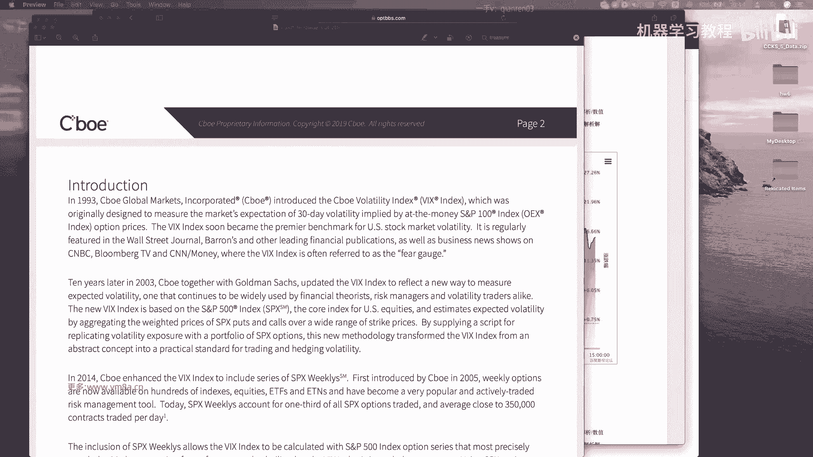

啊，贝对指数。

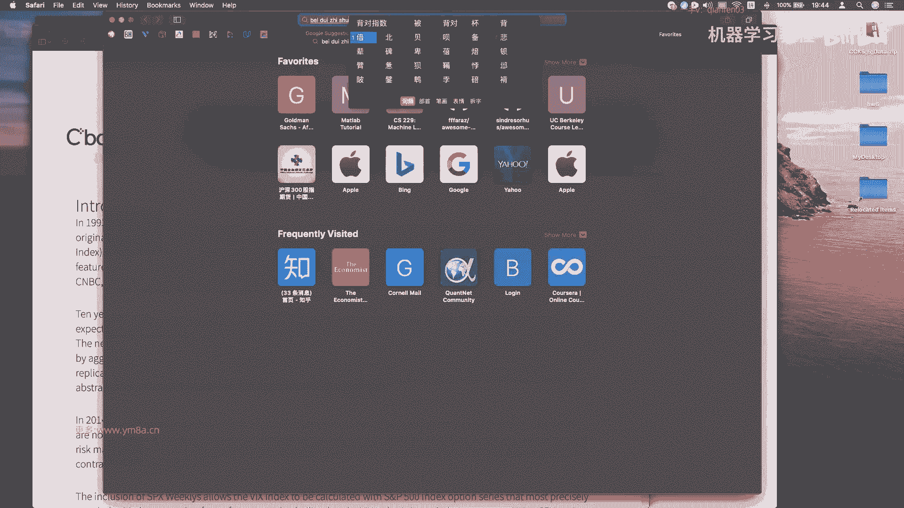

对，就是cover call应该是cover。对，50ETF的倍率指数。然后最近就上交所是我不知道我不知道有没有去。呃，有没有开放O。看一下。嗯，好吧。

可能只是说好像就是说周五的时候有一些消息说是突然就是他又不公开这个数据了。然后其实说我希望的是候大家是说这节课之后自己能够去有能力，根据嗯，不管你是想要什么样的指数。

比如说不管是你是说我我自己推出有一个倍对指数去关注。市场这样一个水平。然后我还是说我比如说我就是一个shop波动率指数。本质上这个指数编制，其实它是都是根据一定的原理。比如说根据一定的交易规则。

然后去衡量我按照这样的呃交易规则去持续化的交易。然后看看我比如说我持续的就是说从一开始我整个基金的净值会走到什么样的曲线。对，那其实这样的话去呃长期的去跟踪这些指数。呃。

包括今天要介绍的就是vicx跟Q呃，就是波动率跟偏度指数。呃，是有助于你帮助你去理解市场处于什么样的一个状态，然后处于一个什么样的行情。然后甚至有人在交易的时候，可能说。我不一定说。

如果我是只是说把期权作为一个配置，那我是会考虑把这些指数进行去叠加。然后我考虑一下，其实说我只需要在这些指数上面去对应的去投入多少资金。然后我根据这些指数构造的原理，再去持有相应的期权合约。

这是一种就是相对来说肯定是偏指数化投资的这样一种一种方式。那我们现在更多的是去关注就是说了解这些指数是怎么算出来的。对，今天所以今天第一部分是先带大家就是去go over一下。

就是viix这样指数我们怎么去做。然后它它本质它是来自于就是CBOE就是支支撑所的这样一个。退出来指数。对，那支商所应呢是现在就是国际上，因为我我记得不错是第一还是第二，对，就是期权交易最多的对。

然后然后第二部分今天要做的内容就是嗯。一个是对我们有了这样的一个呃Vix指数之后。然后还有一个就是说我们之前我有做过的一个SABR，就是一个波动率套利的这样一个模型。对，然后。

这部分模型就是这这这份paper我们是自己有去测过，并且基于它的呃一些呃基于它的那个模型。其实我们也做了挺多的修改。其实最后下来的话，其实还是OK的。基本上就是说它这里面的回测的这样的技巧，呃。

整体上是OK的对，就是说不会有太多水分。但是我建议大家就是说可能还是需要自己去implement了一下，就是整体的这个波动与套利的一个波动力套利模型的这样一个框架。对，然后其实其实某种程度上说。

我个人会认为说你采用什么模型，某种程度并不并不重要。因为我需要的可能是。我需要的其实只是这样一个曲面。对我希望知道就是说我希望的是一个convex，并且是光滑这样一个曲面。

然后然后我其实并不是特别care，就是说。他呃这个曲面到底是用什么模型？我我自己的观点是啥，就不是说我到底是用hasting还是用SABR。对呃。

我关注的是说这些东西它是不是就是说被错误定价的不同的呃期权是不是能够最终回归到相应的曲面上。也说呃这个图大家O了。所以它它显显示是一个呃就是波动率对于。这边价的状态其实你就是拿我的，如果你是ca的话。

就是呃拿你的行程价strike或者ex price，然后去除以我当前的呃去除以我当前的这样一个underline的价格。对呃，然后如果是100%。比如说我现在3。8%的话，那那我就是如果我是ca的话。

这边就是。呃，对，因为要注意call的话，就是我这边是out of呃，就是这边是out of在 money里。对，然后它应该就是小于一，然后上面的是大于一。对，其实。呃，就是其其其实就是这样一个的对。

就是价值指数，而不是说价值指数就是。就价值状态。对，反映的其实你可以把它理解为就是是一个呃行权价。然后这边的话应该是有功能。对，我可以把它换成。新权价，这样可能大家看起来就OK一点。然然后要注意的是。

就这边为什么会有00碎碎的这么多合约，因为它对它引入了是分红，这个这个应该是在就是非整数，是在分红之前去上市的合约。然后在去年的11月的时候，然后50ETF分红。所以我要把它新该再去调整。因此。

在同一个局面嗯就是同一个局面上，你可能出现了多个这样的合约。嗯，然后我们实际操作的时候，嗯，一般机构里就说我如果呃持有这些非整数合约，我会倾向于说把这些合约找到合适，实际去平仓，然后换到。

换到就是呃就是新出新推出的这样整数的合约上来说。呃，可能我这边对这个是在一个云服务器上，所以他看我们看不到这样一个图，但你可以看表是这样应该是OK。对，就是说我们所所谓的波动域曲面。

也就是说我把不同新原价不同到期的这样期权，它的imply给在一张图里面去pl出来。然后我得到的就是一个呃所谓的这样一个波动域曲面。

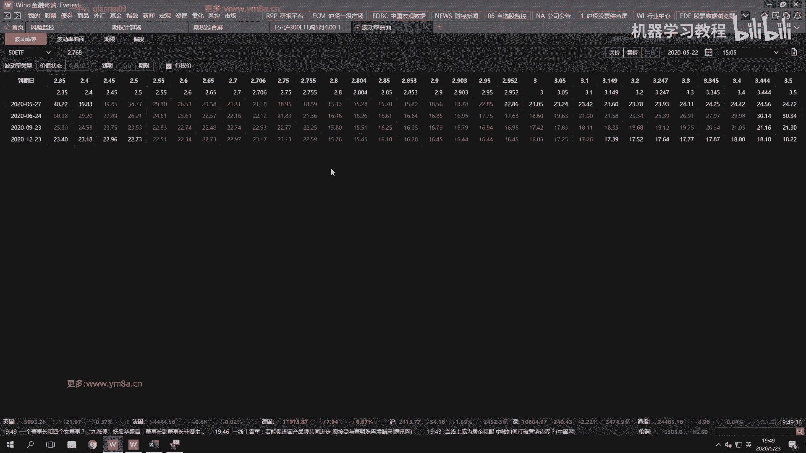

呀就像这个一样，大家看到就是说本质上来说这个曲面，就是说我在对一个同一个时间段的合约来说，我应该是相当于是有一个comvex像这样的一个弧线。对。

但是你可以发现可能这边其实它有的时候它并不是完全的就是是一个凸凸的凸曲面凸面啊。sorry这边是all了，就是conve。对，然后那那这里面的时候如果出现了一些错误的合约，我是可以考虑去把它进呃去去。

比如说哪些合约被高估哪些合约去被低估。那我可以考虑相应的去shott或者浪这浪一些期权的合约，然后再去对冲掉我不想要的风险。这这个是呃这个是就是说我通过这样一个波动率曲面去进行绝对套利的这样一种策略。

然后当然事实上我们还可以说是我对波动率有相应的观点的判断，然后我去做呃realizable跟我算出来的implyable这样的一个价差这样关系。无论是高还是低。

我可以这样的时候我就可以进行去多波动力或者是空波动力。然后还有一个比较有意思的是。呃，就是说我们有一个assumption是。期权的合约呃，期权交易者相对来说会比股市的交易者来说会专业一点。

因为首先就是期权开户面看是50万，但不是每个散户都会掏出50万去去交易股票。对，所以相对来说就是说呃并且他还有三级的考试。对，一般来说通过交易期权来说会交易就是专业交交易者会多一点。

然后那这时候我们是不是可以想通过这些呃专业交易者的一些行为，就是说即反映在期权市场，我们可以找到一些特征或者是因子，然后去来去去交易我们的股票。对。

那这个时候呃这部分我们也测过对当时我们测下来其实效果不是很好。但是后来他后期有更新。然后我是鼓励大家就是说也是之后我们可以去就是我们去go over一下这边per，然后看一看就是里面的这些因子。

我们是怎么来做。然后怎么把期权的因子去运用到去交易ETF或者是股票上。哎，当然我并不是说他说做的策略的话，因么我觉得这是一种思考一种方式，就是我们引入了一些。

另外就是说引入了来自期权数据去辅助我们去进行择试。这这也是非常好的一种交易的方式。对。好的，然后嗯。OK那如果今天现在呃那今天就是会讲主要是讲这些东西。然后现在没有什么问题的话。

我们就开始呃第一部分我们来先去怎么去交易，就是我们看到就是说这个。嗯。我们的viix指数怎么去计算？呃，呃课前有发给过大家这边paper，大家之前有看过吗？嗯哼，大概有看过吗？那我们先看看他的日期吧。

嗯。我可以加。啊，这个。2015年。ok。这样是一个就是从。50ETF期权上市到目前的这样一个状态。对。就就是这里面还是反映了很多很有意思的事情啊。对，就是大家也没有关注，就刚上市之期。

就是说这个期权呃，就是这个波通率只说达到了六七十。这个是非常夸张的一件事情。对，因为当时可能说不管是当然也要注意，就是当时市场背景就15年6月的678，其实股市的波动会非常大。那相应的来说。

我对应的反应就波动率指数也但会我们也有告诉大家，就是波动率指数是从期权的银行波动率上over就是OTM的期权的银行波动率上去合成的对，那相应来说，市场。underline波动比较剧烈的时候。

我们自然也可以推理出，就是说期权期权也会相应的相应的来说是会去波动比较大，并且成熟市场可能期权跟。到底是呃股票市场影响期权市场，还是说期权市场去影响股票市场，其实是两者都会有对都会对对方造成一定的影响。

所以刚才尤其是呃在中国ETF期权刚刚上市这样一段这样一段特殊时期，所这样的波动也是非常夸张的，也可以理解。然后然后到了16年到16年的冲候上，波动慢慢下来，尤其是17年，大家也知道是一个是白马行情。对。

白马行情就是说50ETF就是缓慢的去涨。这个时候最赚型的策略可能可能就是一个所谓的就是波 spread牛牛市的这样一个价差。我就是说持有一个行权价较低的认购期权，然后再卖出一个行成价较高的认购期权。

然后我然后随着underline的不断上涨。我整个的策略指数策略会随着它继去上涨。就事实上就是说我也可以把就是这样波 spread这样的一个策略，作为一个指数去进行长期的跟踪去混量市，就是对。呃。

去衡量整个市场这样一个状态。对，然后17年的时候还比较夸张的事情，就是说这个波动率最低的时候，可能可能我记得应该有达到7%或者8%，这样就是一个平质期权影响波动。然后这个波动指数看最低差不多是7。95。

那这里面有一个背景，就是说。嗯，当时机构会发现okK我不去投机做方向了，我是不是可以系统去卖期权。然后大家发现如果我越卖期权的话，大家都去去shop主动去shop这样期权，也会把它隐含波动率给降低。

因为市场本身上有更多人不想要这个期权。那相应来说呃供大于求，它的隐含波动率肯定会去下降。然后如果隐含波动率下降之后，大家自然会发现呃隐含波动率下降又会带来，我说我shop的这个期权，那我收益又更大。

所以慢慢的整个市场波动率就会会低到这样一个非常夸张的地步。然后一直到18年。对，然后。所以我们在这个时候，我记得我是在18年1月份的shothort。然后呃过年之前这年，然后。就开始了所谓的贸易战。

然后一下子那我记得是应该是50ETF连跌三天。对，然后整个的期权会一下子就就炸了。对，所以这个时候就是反映在Vx指数上，就是这样一个波动力急速去快速上升的这样一种状态。对。呃。对。就是18年从这边开始。

然后其实整个18年市场都不是太平。所以呃我们会看到就是波动率上涨的时候，一般就是它的特特征是波动率是突然的上涨。然后但是它下降的时候，你肯定是需要一段时间不断去缓慢去下降。

然后其实一直到18年整个都不是特别的呃太平。对，然后19年然后才会慢慢的有降下来。对，然后直到了今年就是随着整个疫情的去发酵。这应该是春节之后第一天。对。对，然后事实上就是市场也能看到一些东西。

就是因为包括呃。就是大家在春节结束之前，其实期权市场已经开始反映出来一些东西。因为其实呃我们就看这样一个波动与指数，就是在盘中就是春节前停市前两天收市前两天其实隐含波动已经有开始冲高的这样一些迹象。对。

那如果说你在春节之前，就是说我做了long ball的话，那春节第一天市场会做到非常夸张的这样一个收益。对。所以说有时候我建议大家就说，即使说我不交易期限，但我多多关注期权市场。

其实也可以给在其他方面投资，引入一些新的思考。对，那事实上就是在春节之前你可能就要考虑好出现就是说imply的上升，并且有这样一个突刺的情形，我可能会考虑好在春节之前怎么去把我的股票仓位给对冲掉。对。

事实上就是在春节前的话，我不管是期货还是呃期权上面的回跃，我倾向是留向留一留一个震的伟达的这样一个呃这正的这样戛纳的一个敞口。因为我确实是不知道整个市场会怎么样波动。然后我记得春节第一天的话。

我的那个CF就是棉花的这样一个商品期权，也是呃对，就可能一手就赚了差不多4000块，就是非常夸张的一个数据。对，我本金可能才4000块，就是一手的本金。就春节高开之后就直接就翻倍了。对。

然后也同时是说波动率。出现在高位之后，它并不会像呃波动率快速上涨过程当中一呃一下子说我再回到原来位置，而是它会有一个慢慢dy的这样一个过程。然后到了343月份的时候。

海外疫情的发酵又把整个的波动率水平又给打上去了，然后再慢慢的dK。对，所以这是整个就是50天50ETF期权上市以来的这样一个状况。然后对，然后今天我们就来看看怎么去把这样的一个波动率的指数给做出来。

对呃，我今天会去拿日行情来给大家去就是说去告诉大家怎么去算。其实paper里面都有讲，就带大家去走一遍，了解里面的细节有哪些坑。

然后我们平时其实平时我们在盘中交易的时候跟关注的是日内的这样一个呃viix的指数。对viix的这样一个行情，就voltic index。对。好的，现在大家对于这个东西有了一些直观的这样一个感受了吗？诶。

哦，在想的话就是说呃大家觉得是如果OK的话，我可以就是说把数据文件发给大家，然后大家可以跟我同步的再去做这样的一个事情。这样可能是不是我我在想是不是就比我再给大家演示怎么做会好一点。

就如果大觉得大家OK的话，呃，在群里回复一下，然后我把数据发到。呃，微信群里好了。对，大家可以跟我一起来做这样的事情。还是说觉得就这样OK好的。我还是发一下吧。对，这样这样可能好一些。稍等。

那我登一下微信。对，然后现在给到大家的一个是option day，然后一个是option info，然后。O。And how she makes the white。这样一个白皮数，然后大家应该有看到。

OK然后嗯。CB。然后我们再来看怎么来去imprintment这样的一个。H水。好的。Mip。而是在。就是说它本质上来说，我衡量的是整个市场的这样一个波动率的这样一个水平。对。然后。呃。

这是CBUA的这是他的介绍。93年的时候。所以成熟市场其实齐权也有非常。就的这样一个交易时间了。然后中国的基权市场才是慢慢的去发展。

然后我们也可以看它衡量的是说它衡量的是expect of30 day volatility implied byATM不，对吧？然后只这是说93年，然现在他也他也不是完全的是ATM。然后要注意一点。

他们他们的underline是SNP的这样标普的这样一个指数。而我们这边有区别的是我们做的是呃就是一个期权。所以呃我们做的是50ETF这样1个ETF。这本质上会有一些细微的差别。然后。对。

其实这个公式也就是大家仔细去看下去也没有很难。然后但是今天主要是想介绍一下，就是我们在就是说不管你是在期权回测的时候，或者是呃你去交易的时候，其实涉及到一些就是说基本的操作。

比如说我去决定呃ATM就是平时期权合约，我有怎么去做。然后我怎么去选近月的合约，我怎么去选远月的合约。然后对，其实是主要是引入这些一些基本的操作。然后刚开始的话就是他这边会考虑说。嗯。

就是本质上来说它是指到呃setttle结算那一天上午的9点半呃，到底有多少时间。对，然后然后他这边其实就把分成三部分，就是说我当前的时间到今天5月12点，然后中间到底是然后中间是隔了多少天。

然后以及是呃结算当天呃，然后到9点半，因为正好这个是一样的，我们也是9点半开始交易。对，然后就是结算当天开呃0点到9点半有多少分钟。对。然后就是算这个两个两个合约，然后这边两个T1跟T2什么意思呢？

T一指的是当当月就是new term。然后呃然后T2是指的是圆月。然后我们如果放在这里面看的话，就看到我们呃50TF机选的规则是我们同时在市场上有4个到期的合约，分别是。

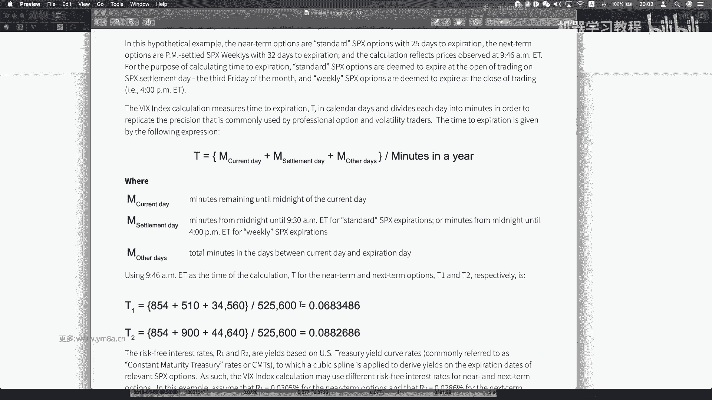

当前当月呃，对对，sorry。对，当月，然后是下月，然后是下季月，然后是在是下夏季月，这个季月是不就是一个season，所以我们是92。就是说我在当前为持的时候，是不会出现7月跟8月期权的。

所以然后我们可能相比于SPX里面的，就是SMP里面的话，就是说他们可能会有每周到期的期权。然后甚至还有mini期权。然后以及他们的对。行成价的话，他们还会比我们细。比如说他们可能有2。4752点对，2。

475。我们这边可能相对来说是0。05还OK对，然后我们注意要关注的是，就是说在三以下的时候，它是0。051个档位。然后其实3呃。哎，现在有3。05吗？我感这应该是那个。为什么会3。05啊？

我我记得3以上的时候应该是0。11个合源啊，我不排当然不排除说它可能是就是分红引入的，正好是计算起来是3。05，就是三以上的话是应该一般是0。11个合约。对，然后因为这边主要是引入了一些分红带小数点。

所以会会比较奇怪一点。但我们在计算的时候，我个人习惯是把这些合约去排除。对，然后如果有感兴趣合学是可以算一下，就是说我这些非标准的合约跟标准合约之间是不是存在一些套利机会。

那事实上就是说有的时候套利机会还是挺大的那要看大家就是教育系团能不能去抓住这样的对，合约。那肯定就是说本质上就是说我同样的都是统本质上都是统一个东西。那为什么价格能够比如说500块钱能够差到100块。

那这个是非常夸张的。

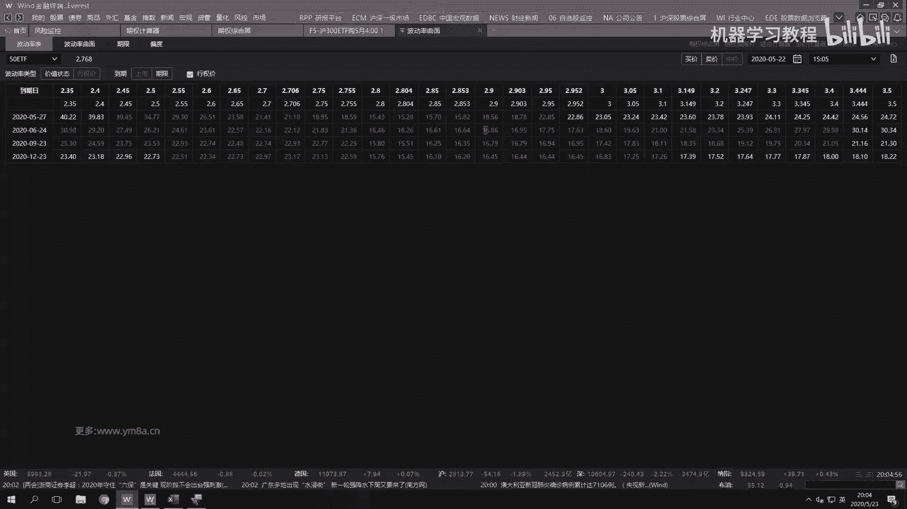

所以。然后好的，然后呃现在大家都拿到了刚刚的那个嗯。那两个。呃，就是那两个文件了吧。如果拿到的话，我们就开学。

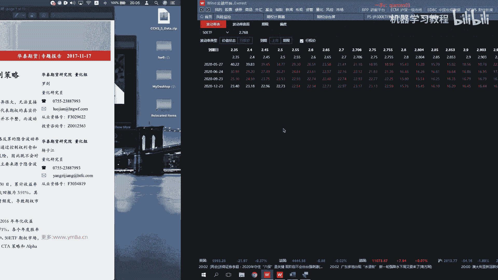

比是说就我们先说先算时间，我们待会再看啊。然后主要主要是就是说有这些一些基本的操作，就是说select option to be used in the mix index calculation。

就是我怎么去选合约的这样一个问题。就他刚开始做的事情就是说嗯，他下面有选什么是品质可以，他没有选这个东西，他其实选的是call和put。就是价格最相差最小的这样一个str price，对吧？

然后就是一个是近月的，就是说我们放在当前就是说是5月，然后下月的话，next term就是6月。对，那其实大家也可以去关注了。就是说因为平质和约靠 put的理论来说。

如果是应该是就是说应该是就是说是接近于相等的对，在正常情况下。呃，我们可以看一下。我们是3。8。对，3。半的话其实差别应该不会特别大。嗯。嗯。或者我们看远月的话，你可能会看的更清楚一点。如果同样是3。

8块的话，这边是838，然后这边是902，其实差别是差不多的。然后然后我们也可以去看一下，就是说。靠 put是不是说在靠近平质的时候，它这样的呃价格差的会比较小。比如380减287差不多是93。对。

然后这个是1147减64，那肯定就差更多了。然后这个是938减60。对，所以显然就是说我们会选中这样一个合约。那OK我们先。呃，弄的。嗯。还是一样的，我们先把。我们要用的东西给。读进来看一下数据。嗯。

安排SMP这我们非常啊，还有时间错。对，今天要涉及到时间的操作。还是先读，就是我这里面的话。我给到的是日的数据，然后但是我希望同学们是去。

我们上一节课不是把分钟数据都拿来拿给他就是上一节课作业把分钟数据都合好了嘛。然后里面的gres上数据事实上是分钟数据会就是你有可能把分钟数据做日内了。对。然后这样这是一个。Sorry。这是一个日行情啊。

我们看一下它这。越行情嗯嗯。这个什么情况？中。哎，里面有中文。You can。Cannotic。那就加一个inco。Encode还是encoding。然后GB2312。

所以我我还是蛮建议这个大家就是把它全部处理成。英问好了。然后。好了，这是我们这样一个看到这是这是一个什么呢？这是我把2018年1月份的日行情。都给他拿了出来了。哎，这时候我看到就是说。诶。对它有日期。

然后交易日，然后结算价，这个是非常这是日行情。大家注意是日行情。然后以及这边有geks，就是呃大家可以valate一下，就是拿自己的函数算出来的，这是跟我是直接拿了万德的日数据。对。

刚开始我们是拿万德日数据，后来发现。呃，拿了这个数据，我们也不知道它背后的一些，就是说我的无风险利率到底用的是什么。对，呃，所以后来我们都是自己去合成这样的一个数据。对呃。

提到这个的话还是要去看一下那个，然后行情数据是这边是有可以去采购的对，这就就相对来说，当然我知道他们不一定是合法的对，然后我们当时也是从上面去买的。但是其实数据质量还是OK的对。

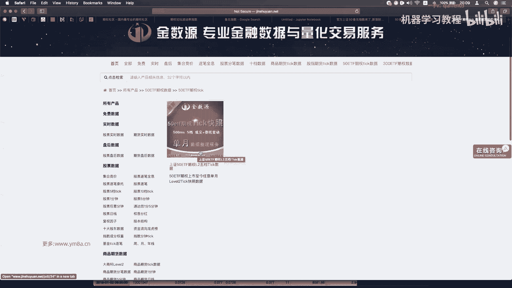

然后我想说的是。

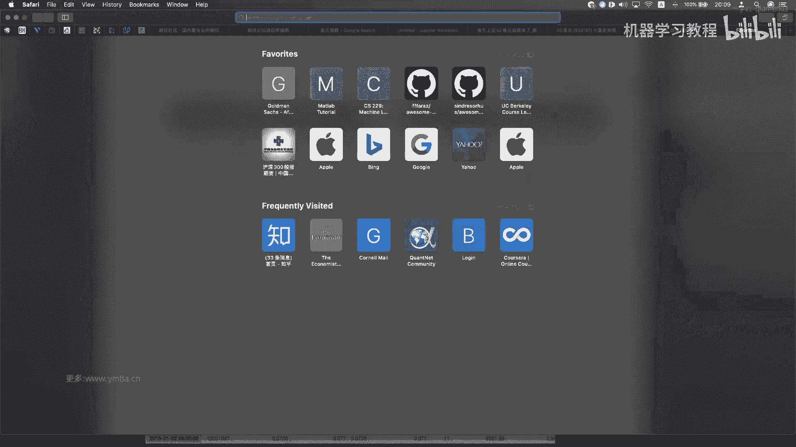

诶。

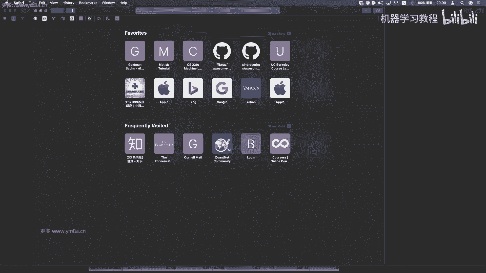

上交所是每日提供这样一个期权行情的，我们你可以拿来计算下来的话，跟上交所的去对比。

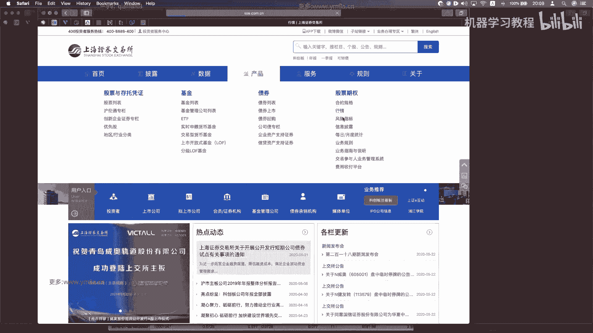

呃，我们以官方的为准，就是剩下来结果。然后。就这里面其实你可以用爬虫板来，每天都去爬下来。官方行情数据相对来说是会比较准一点。然后包括我去计算持仓的话，我也可以去拿它的去算。官方是提供日行情。

然后你们可以选历史上的日期，把它可以下载下来，大家可以自己去做。对。

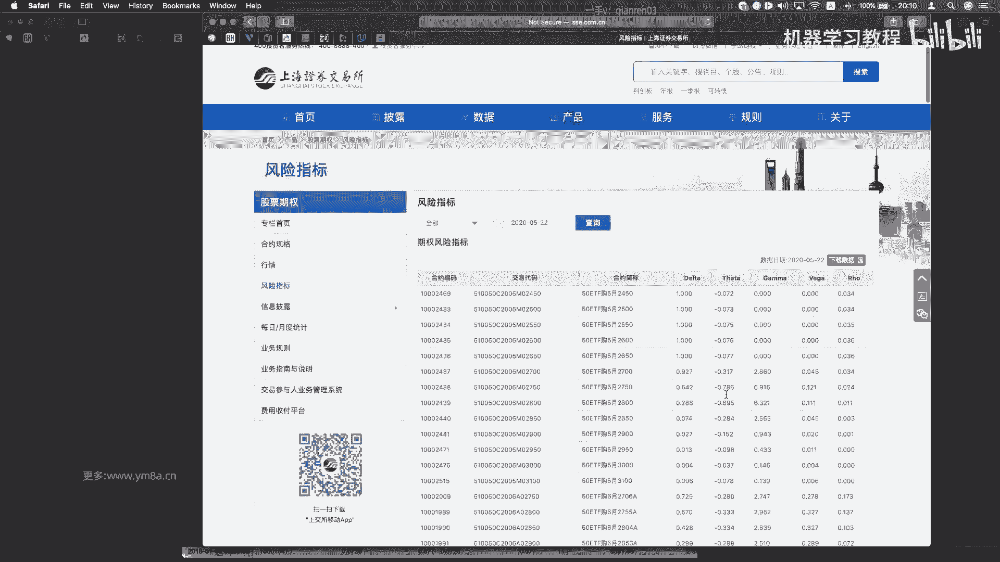

还差一距这个。然后我们就回到这儿来。对，这个是呃我们的。这样就这边是我们的就是一个呃期全日行情的数据。就是我们看一下他有哪些。然后还有一点就是说我要去。对我先把他的。呃，把它时间戳换成那个吧。嗯，换成。

timet对大该日期先完成timetO然后呃好的，然后然后然后还还有一个操作就是。那，大家看到没有？这边行程价是有非标准的合约。然后就是A的话，就是说我是第一次去变动，所以它才会是A。

然后original应该是M。然后如果第二次再去分回右边话，那可能变成BCD就意思往后类推。然后对。嗯，我想做的事情是把非标准的合约去给剔除掉，对吧？呃，非标准合约怎么去剔除呢？比较简便的一个方法的话。

它可能会出现。比如说今天那个3。05，它就可能会出现一些问题。对，但可能因为因为这边的话可能还OK。嗯后，但我建议大家就是去不要像我这边就是不严谨的去做。我这边可能为了短频快的去过滤。我会去考虑呃。

我看一下exercise price对吧？然后我看一下能不能被0。05整除，或者说。我用100来乘。然后。地板在就是能不能背。哦，无整除对吧？无整除的话，你看一下这个东西。

比如说如果是正常的回应应该是0，如果不能被误整除，我可能会有小数点。所以我可以考虑。用这个来过滤。然后再用。我就直接把C标准可以区给过滤掉。那呃。对，因为这面可能还有一些问题。可能。先这样。

我们先往下去做。对，就是时看到我刚刚我说的，就是说它事场上是已经变化了一次。所以就是说2。7的话，它可能。对他可能还是会去变化。那那如果是这样子的话。那可能。这种方式如果不work的话，我可以考虑。

好的。这是我刚刚说到的，如果它没有变化是M，然后有变化是ABCD。那我就要考虑trade code里面有没有M这样一个字符。Sorry， when I go quote。这样应该是对吧。好的。

这个是得到了我想要的这样一个。还钱对。好，所以这个好像式。可能是错的啊，不是可能是错的，就是一定会去出错。对。啊，这个这个是呃对会好一些。所以还是建议大家就是交易所的官网可能要去多去看一看。

就是平时因为他会告诉你很多的规则，就是说为什么这边是M，然后这边是A对。这样的会好一些。嗯，好的，然后我们就是然后。如果说我在。我们刚刚得到了时间嘛，那我们按时间来去。Short values。好。

然后这样的话我们就得到了。就是说我们现在是。呃，整个的这样一个。我们想要的想要去计算voltity index这样一些合约。对，呃，好的，然后第二部分是。呃，上一节课就是有同学问到期选的这些东西。

到期日啊什么怎么读。然后这个这个。是在回测的时候，你是可以用load到那个就是我们用一张表格或者是。每一个新合约上市的时候，我都应该去山七所把它去爬下来，还是说你从外上面把它爬下来，漏到你的数据库里。

然后每天开盘你需要去写一个方式去load的今天有哪些会活跃的合约，把它加载到内存里去维护这样一个optionin的 info这样一个diction或者是table。对。呃，我们这边的话还是一样。

就是但是我们在做回测的时候，做研究的时候。对，会把他。先漏着进来看一看它里面是什么东西。上节课大家应该已经用到了，就做作业的时候，你应该会已经用到这些表格，因为不然没有这些表格，你是没有办法算。

就是它到期日是怎么去算的对吧？好，对，大家看就是万德load下的数据，它有wind codetra code。

然后security name optiontionmarket code它underline都是510050。对，新全价，然后contract用点这个是比要注意，比如说标准的合约应该都是1万。

然后对我们其实要的是他的这个。Exercise day对，就是都到期。因为我们在。Sorry。😔，With white paper。嗯。m paperper里面我们要的是就是啊因为我们待会要去算时间。

就是在这个里面的这个T一跟T2是怎么去算，对吧？然后我们还是先focus在这一部分，就是说我们怎么去找到这个合约呢？

就是找他的那我们要找道我们要就算call and put呃pri difference，对吧？我们回过来就算 price difference。对，然后然后我这边要这边要做的一个事情是。

首先我们是要做的第一件事，不是先去算prose difference。因为事实上就有这个合约很多哎，对吧？我们要算的是呃我们举一个例子吧，比如说。我们就2018年第一天。就是在历史上，比如我做回测。

其实也是这样，我会顺着时间去循环嘛，对吧？比如说我在。这一天的时候。呃，this day我是比如说是这天的时候，我想问的是。Wa。当月要到期的期权。有哪些？我下个月要到窃期权有哪些？

这边事实应该是就是我需要去rite function。然后去获取。当月。以及下月到期的。齐权对吧？然我这边先在har口，然后大家可以想一想，就是说我实际上我应该是用一个函数去把它去来做做的对吧？

我这边可能。我这边直接就hard code。提接把它写出来。其其实这个函数也很简单，就是。本质上来说，在当前时间点，因为我每个期权都有上市跟。listed date跟ex date那我只要去筛选一下。

用两个时间一去一一就是一加。对，我知要知道就是这个时间大于这个时间大于list date，同时要小于等于expire date。那我就能够把所有的提全给。筛出来对吧？然后再去排个序。

因为我取一个se排个序，我应该就能得到呃4个到期日。对，这种我们就能看到5678，得到4个到期日。然后你第然后第第零个跟第一个就是分别我们想要的ne term and nextex term，对吧？

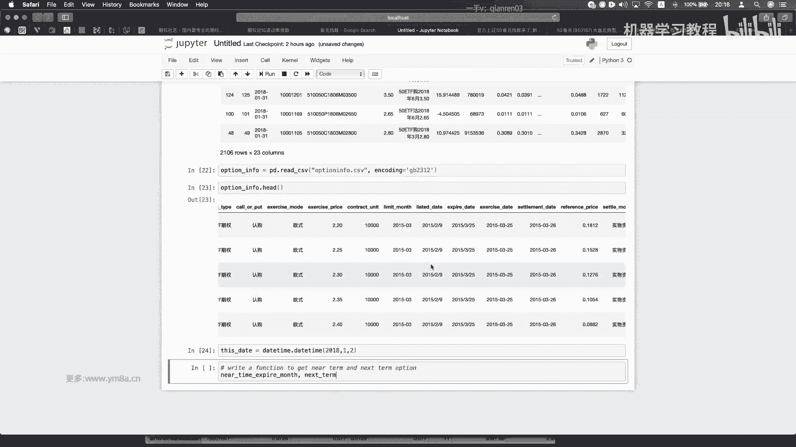

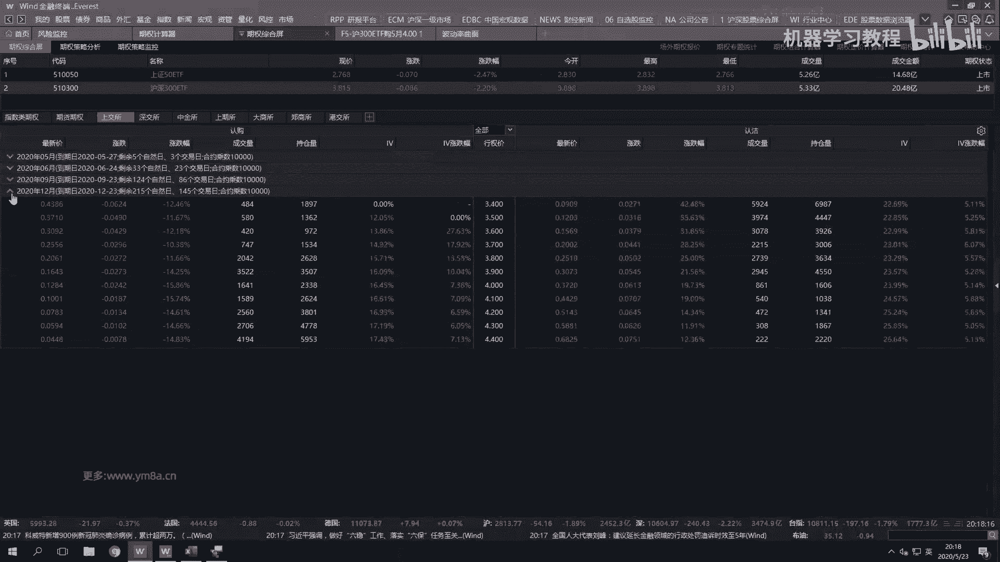

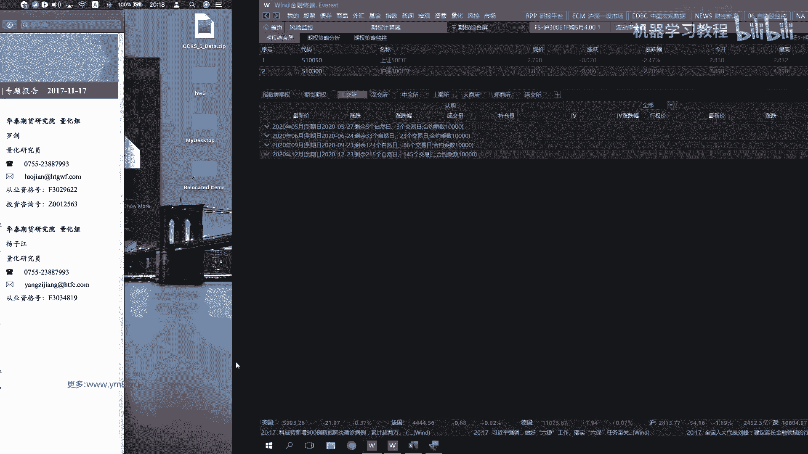

所以这个还是比较简单的，我在这边就不做了。我这边就直接告诉大家。这个是你们。就是大家要去做的事情。我不知道上一节课就是这部分，就是大家上一节课自己的作业有没有去做。如果你做的话，应该会呃。熟悉一点啊。

我知道的是。就事实场我们交易时候会有很多的这种小的工具来帮助你去去每天去 maintain这些基本的东西。对，然后你应该去把它呃做成一个库，然后每天的就是交易机在你交易之前是需要去。去定时启动的。好。

然后。啊，然后那那有了这样的东西，其实我要筛选。就是说比如说ne term的这样一个期权可能就就比较简单了，对吧？我直接。我先要知道哎。Sorry。😔，这边有个typo。你 term。

As我这个时候就记住，不是从我data frame里面去取了，我是从ation info里面去。取取什么呢？这边还记得有一个lim mouse，对吧？

我们直接把这个lim mouse给load进来就OK了。呃，那慢。然后和。Sorry。😔，还这样一个相对。我看一下啊。是吧。就是近期的应该应该都都筛出来了。那。那大家要注意这个里面有就是。非标准合约。

但当然OK了，因为我们不需要说是我们只要就是说去判断。当前的合约当中，有哪些是在？对，哪些是在。嗯。也其是在呃。我们的。就是说我们就是行情数据，每日的行情数据有哪些合约是在这个里面就OK了。或者是。

你其实。我只要我要的东西本质上只是。他的。呃，cod我只要它的code。我只需要知道，就是说我当前有哪些合约是在。Meeartime options。然后这时候再看一下。

然我把 next term一样的去把 copy。考比一下。嗯。然好。或者。S。嗯。我看一下哪有问题啊，office。Next。Said object has no。我想把这个。ok 真系 ok k 啦。

不需要这么多。呃，好的，然后就是说我们有了这样ne term的 options之后。呃，那其实我们还回到我们的data frame来，对吧？我现在要把我第一个就是当月到期的这期权给它挑出来。那这个时候。

Jo。嗯。比较好了。因为呃还这注意的是这个时候我是先根据。我要选今天的啊，我们先以一天为研究目标。第一天，然后以及。我的。是不是对我的活员option code。是应该。嗯。

这个时候就是我只要在这个set里面就行，对吧？只要在。我的这样的期权的合约的set集合里面就OK。那我们看一下D。这样应该是OK的。我们这个里面到当前为止，我们是近阅1月2日期权的行情数据。

然后只有近月的合约，同时是只有标准的合约，对吧？呃，1818行2018行。对嗯对。这部分是OK的吧。然后。然后要注意的是我ca和 put里要分开去算。Oion。嗯。呃，对，其实我有点简单一点吧。

就用option dot name。然好。呃，事实上对，就是因为这边我这边没有用数据库去来维护。事实上就是说你要有一个数据库去matain你的T是你的option code。

然后你attribution里面，你要有知道它的exercisepri，就是它有哪些列，它也可以叫有新全价，要有到期日，然后要有它的名称，然后要有它是不是call还是put。

以及你要有就indiator它是不是是是不是标准合约还是非标准合约，就是应该把这些信息是你放在数据库里面，然后每天去更新这样一个数据库。然后但这个时候你然后你再去跟这个数据库里面再去呃去筛选这样的合约。

可能就会方便。对，就会方便很多。而不是像我这边。呃，我还用stream。docons就非常不优雅，但是是可以忘。嗯，如果要是就包含够呗。哦，看看。对吧这样是work。标准可以。9个我记得刚刚是。

是总共是18个？然后同样的是put。诶令股。比叫看电视去。然后。TF1。然后 put。好嗯，这样就到了，这说我们的数据基本上是准备OK了。然后接下来我们再看怎么来算这about index。呃。

我们先休息一下，嗯，20点40再开始。我改耳机再充一下电。到目前为止，大家OK吗？有什么问题就呃放上来哈。我们先休息一下。然后课件的话，大家也可以把就是看看自己能不能做一下这个事情，对吧？

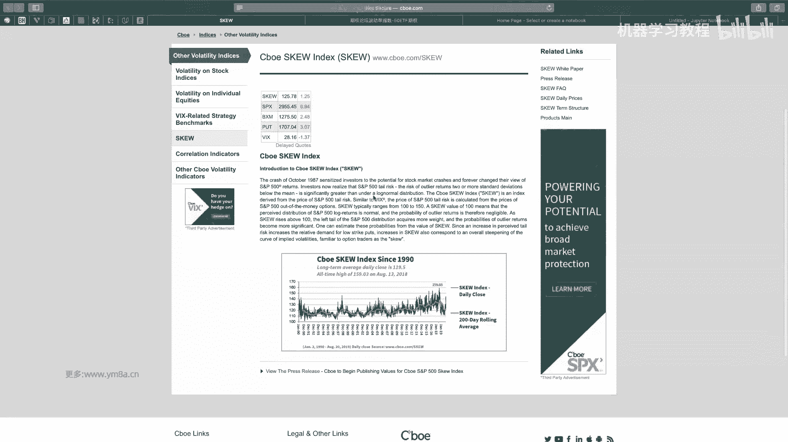

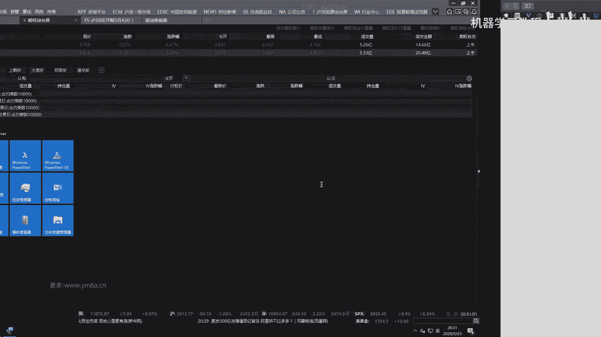

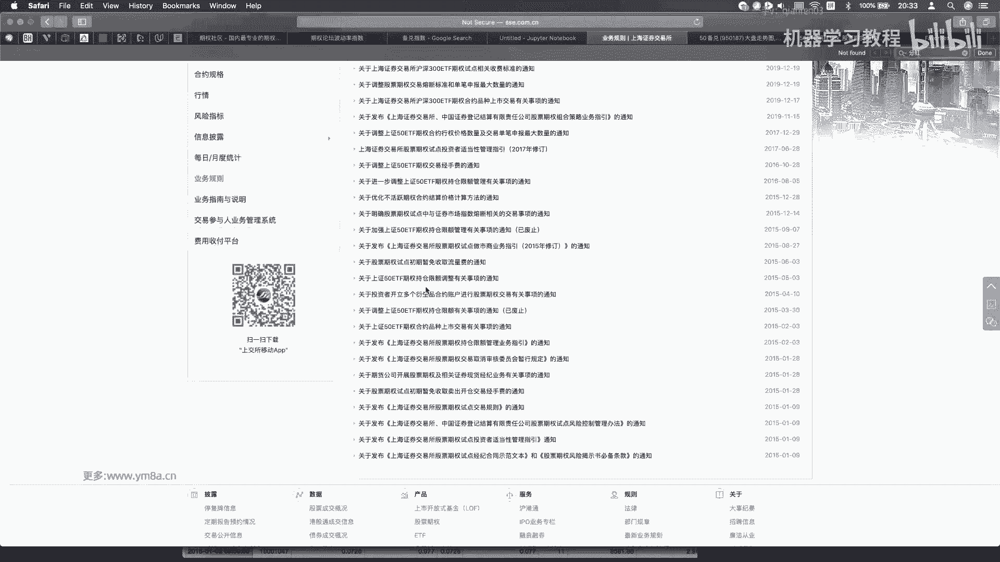

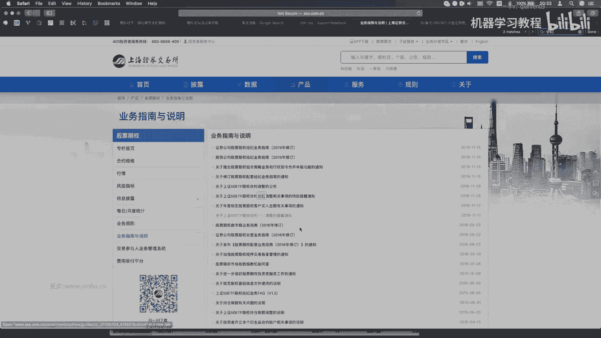

哎，好的，我们现在回过来啊。然后呃第一个问题是。

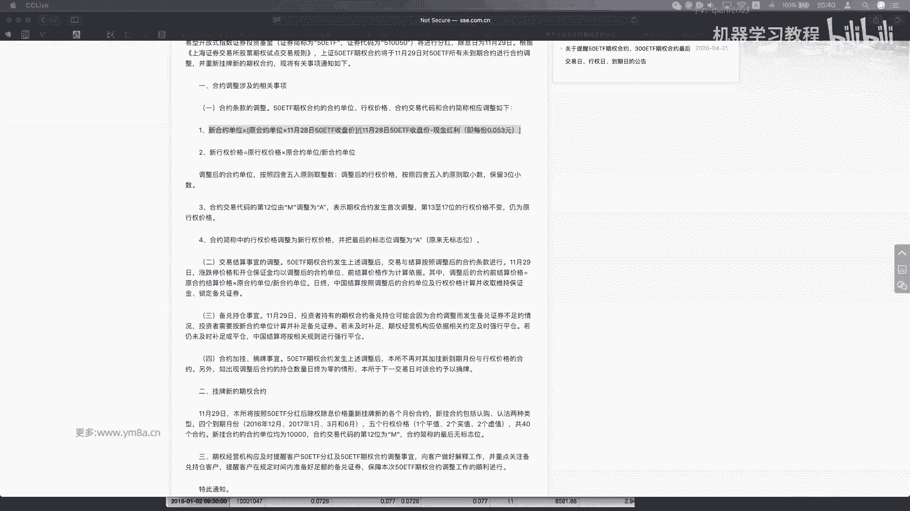

同学提了两个问题。第一个问题是呃paper呃，对，一个是你说的来源不错，一个是就是说这个paper你可以从。就是。2。关咗里面。I'm sorry，不是在这是在。

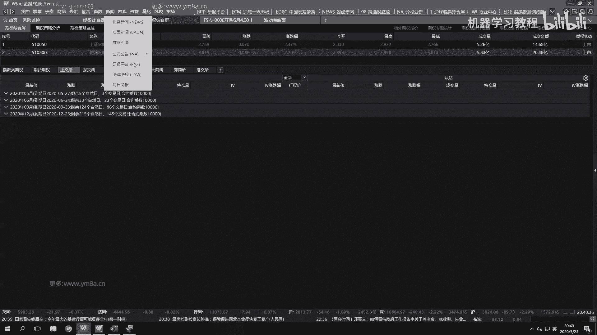

研猫平台里面对，你可以搜到各种各样的眼猫。对，但是这里面最近多了很多那个，比如说你搜进攻的。你可以搜到各种各样的研报。对，然后事实就是要搜研报的话，我不确定是不是。有一个叫会。

我好像是不是有免费提供的研报，然后但事实上就是说你想要去呃找到相关的研报的话，你完全可以就是搜索相应的主题，然后对应券商的公众号。对，然后呃人大经济论坛上有一些。然后以及各个样的。嗯了。一直嗰个样咧。

其他地方应该都能找到吧。对，然后我记得惠博士有一些。然后这个app应该它是有app的对我不是给他打广告啊，对应该是我记得是有的。呃。Let's see。什么。嗯，有日报。对。然后出宝。对。

应该是有一些的，所以大可以去试一试，然后同花顺啊或者是其他的我不确定是不是有，然后。呃，红刚看来是华开的对吧？发太。然后东裁。应该也是有，所以大家多多去找一找吧，我觉得用心的话应该不是特别难。

就是因为你因为本质来说找到相应主题的话，对，包括你说你对机器学习策类型的策略感兴趣的话，事实上有不少团队就一直在做这样的事情。大家要注意，就是说不要一味的去相信眼包，然后很多东西可能得都是得自己去验证。

然后对，好的，然后这个同学问题是分钟数据啊，看他的不是分钟数据啊，刚刚在发的是就是呃ETF的呃，一个是上周引发过的option info。然后另外一个是就是我们的daily price这样的一个数据。

对。呃，还是大家最己去去把整个数据合一遍，我觉得可能会好一些。然后so同学应该是都合了，就是他的。他的作业在这边。对，分钟数据，然后期权数据。然后对。大家还是就是反正上上我们这个课程吧。

也是希望就是你看有时候课上我也不会把所有的就是所有的东西都给给出来，还是要大家自己客户去做。就是你真的自己写过一遍代码才会知道原来是这么回事。对，就是learn by doing。

我还是说像第一节课强调的这样，len by doing。好的，然后我们再回过来接着去。Sorry， Bridge这。对，我们家也回过台来就是。回到这边，然后呃就刚可能上一节课应该也没有提到。

就是关于分红的合约，我们是怎么去处理。对，大家只要记住一点，就是你不管怎么样对期权合约去操作。不能让持有这个期权人吃亏就行。对。那那其实比如说这个是16年的分红，对，它这该是怎么做？比如说每份是分0。

053元，所以我就是拿收盘价的时候，我会去减去0。053元，就变成下一天的这样的一个这样一个新的价格，对吧？那我我可以说是我这个时候期权，因为期权就是分红的时候。

我501天Funderline的价格第二天会变。对，就是我这时候会变的话，那我相应的我原来同样持有1万手期权这样的合约。呃，1万手期权。对。

那对应的就是我对应的个期权实际上就说我原来能1万块钱换到比如说我行权的话，我可以换到比换到3块钱的，呃换到3块钱一份的ETF换1万份对那3万块。但是现在我如果减去0。053的话。

那我相当于说一下子我每一次就少了这么多，我少了1万份的话少了530块钱。那这个是我是显示不公平的。因此这个时候我需要就是我有一个新的这样的一个行权单位，我要把它算出来。然后这样子的话。

我新行权价格乘以新的合约单位，等于原行权价格乘以原合约单位，这样子来说，我同样的我说我换1万份合原来的换1万1万份合约。比如说等于我现在的呃1万除呃100几百的这样一个合约，然后乘以新的行权价。

这样的话就呃就这样这样就是我保证我嗯分红前后，我这样是整个的我的profoo我是不会去亏钱的。然后刚刚提到是说。这个。呃，M换成A表示发生首次调整，对吧？然后行权价格，这个是security code。

不是它的excipri，因此你是不能从这个合约交易代码里面去拿到我的呃行权价格的。Okay。要注意这边你看到它还是260，但是事实上新的新件价已经变成了2。553。嗯，大家可以简单验证一下，就是他的。

嗯。哦，这边你还看不到contract numbers，但你可以去。嗯。我们去去百里代查一下他是不是这样的回事。Sorry。Opttion code是不是等于。Oion。

Sorry to initial wind cold。表个给这个下载下来东西，随以。嗯。诶嘿嘿。Sorry。他不是一个train类型，好吧，这样对了。呃，然后他的。Allright。嗯。

然后想想这个里面会有个什么问题，他这个哦 sorry这个是M，它是。这个时间。不太对呀。嗯，所以就是117，所以应该是。969。然后这个时候大家可以简单去算一下这个东西跟原来的那个。就是。嗯。

就是我应该是。Contracting。编进去，要我直接抄呗。2。53乘以10185，对吧？这是我信的。然后除以原来的原来的行成价是2。600，就是我应该是等于1万，对吧？应该可能会有些runing按。

但是应该是差不多的对吧？所以这这这点大家可以自己去验证一下，就是理解一下呃，分红前后我需要怎样做怎样的处理。对，这个是想提一下的。但是一般还是说我们交易的时候。

我我个人呢是倾向于把呃K标准的合约去过滤掉。因为。如果in case说你真的要70条行权的话。我希望能拿到是整手数的ETF合源，而不是零碎的10185手ETF。好的，然后我们回到这个。这上面来对吧？

然后我们现在记住我们现在就是回到计在上面，我们现在得到的是呃DF一的 callll核DF2呃DF一的put就是说我们做到了哪一步呢？再回过头来看一下那个。

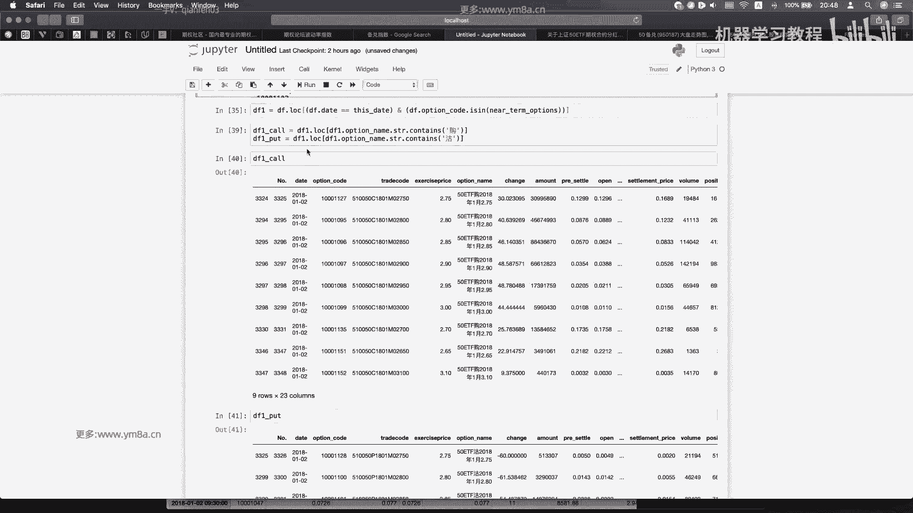

Paper。

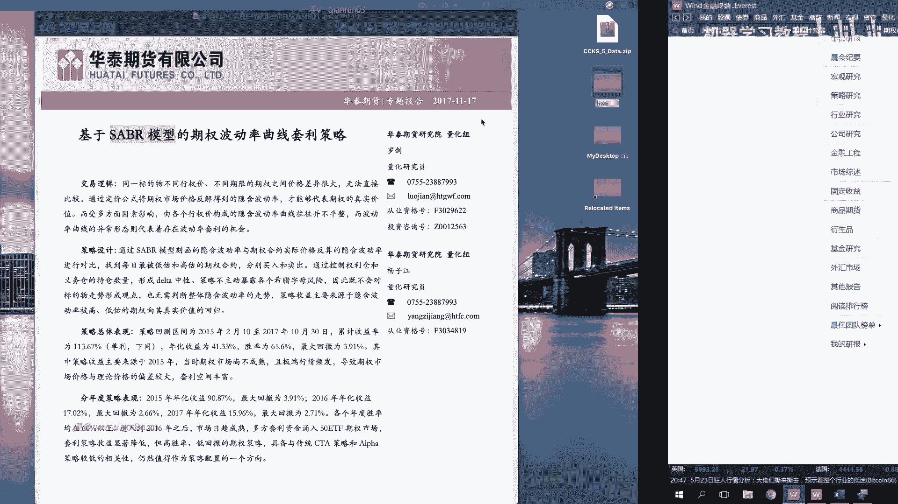

嗯回过头来看paper。对。就是我们先要去就是 step one是 select options to be used in the big index calculation。然后是说我们接下来去算。

就是说我们先去把这个合约算出来之后，然后然后接下来做的事情是找到这样的call和call和put price difference最小的这样一个contract，对吧？那么我们就应该是。

I say我们应该怎么做呢？呃。系。我们先看看啊。呃，首先首先我们这样的合约，它没有按照exercise price去sort有论sort没有，所以我们先去排个序。就是。

把他的call和put都去排过去吧。这样的话我们按照。这种按照行权价去排序。因为我们是这是这个时候我们已选的是呃一个日期，然后一个到期月。

这个时候能够区分他们的就是行权价以及呃并且call和put我已经分开了嘛，对吧？So所以这个时候我们直接按照。Asortt。嗯，好。😔，Put。最好其实这些东西是要把它去。陈一程。O然后。

我看一下他是不是已经拍过去了。对吧呃是吧按照新增价去排序，然后这个时候做的事情就是找到price difference，找到priice difference，就是说我要去找到。呃。

就是这个时候了看DF一的。close price因为记住呃呃要要提要注意一点的是，在vicix当中，我们实时的行情实际上用的是呃B and called mid mid price。

就是我们看的是盘口数据，而不是。

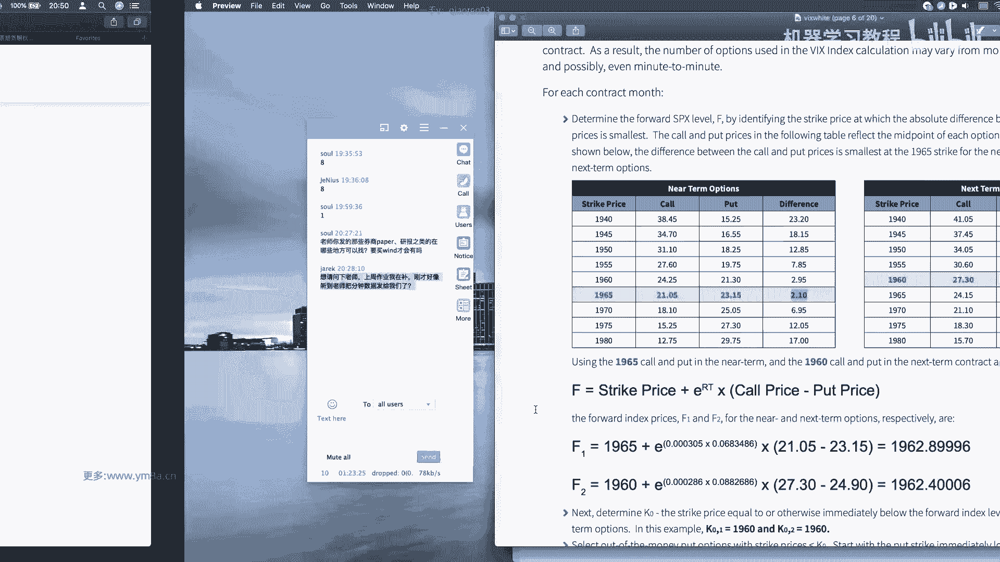

呃，close数据，然后因为我们这边是我现在是考虑在算收盘的这样一个voltity index，对吧？我们现在拿的是一天收盘的数据，所以我们实际上没有看他的那个呃。被 ask就act就是说你看这个时候。

因为这是远期合约，可能就是你看远期合约，尤其是对，所以其其实它的就是盘口差的是比较大的。然后你你如果单纯的拿close来算的话，可能会有一些问题。对，因为差的会大一点。

所以我们一般会用ask bit的中间价去来算。对。哎，然后并且你在我们在盘中的时候，有可能这个时候没有交易，因为我没有last price，但是我买的盘口一般是在的。

当然就是说大家仔细去读那个b paper。然后如果说我出现了。连续两次B的都是零，就是呃对我都是没有人去买的话，就是这些人这边都是零的话。那么也就是说他说的B的都是0。比如说在这个方向上。

比如说连续两个B的都是0，那我就是说从这个价格往上面的所有我都不要去include，都不要去算了啊，put也是同样的道理。所以。

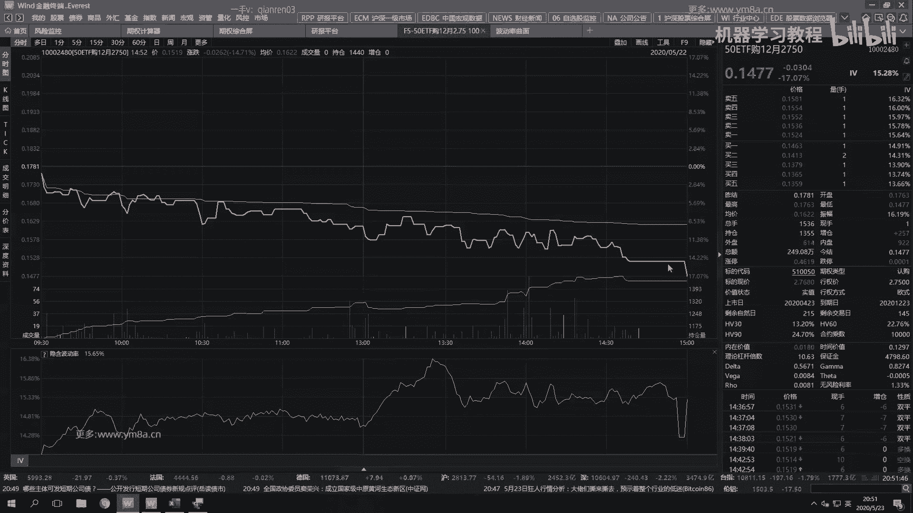

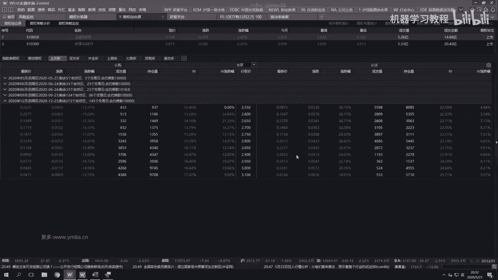

在这边的话，我们先去把。Price difference给算一下 price difference。啊所以pri difference的话，因为我这个时候已经排好序了，对吧？呃。

本质上有一个follow就OK了。Price difference。就是。那个follow，那我直接。For carpet your whole。嗯。是。然后他的cose我们用close来算。

就是说我我在盘中实时算的时候，或者说我日内算的时候，我最好是要用ask的这样一个m price。所以这时我们从第一节课强调到现在，为什么我要用最原始的数据，而不是别人给我的东西？对。

因为你都不知道别人会做怎样的处理。然后只有我自己掌握这些细节，我才能可能去更加关注到呃对。每一步是怎么把它给做出来的？把，这样我就。这样写吧，然后。

然后我要注意的是我算的是它的absolute value绝对值。OK对吧，那我市常要找的就是。Ps。我身上找的是它最小的对应的这个index对吧，是5。我实际上要做的是。Ad me。能不能这么做。

我看一下。呃，list他不是 listOK。南排龙。对，打快去安排。喂，就是这样我得到就是说list是第5个zero one two threee four five呃，应该是put的。

sorry是我用的是什么？呃，对，就是call和 put的都是一样。因为我现在都是那个ne term，就是近元的对吧？这个一记记住是近元啊。那事实上就是说我这样的话，我可以找到。

就是说我在viix paper里面所说的是。这样一个。St price对吧？然后呃我们接下来再去算F，对吧？就说我们先找到这样strike price，然后再算1个ERT和co price。

F price。呃，这个时候就要去注意了，我要算T，然后算T的话，就是说我们还是区分T一跟T2吧。呃。还是先那个。这是。我先替大家查了一下，就是他的到期月，金月的到期月。就是这个东西。

也应该是以写示function的对，就是说我在任何一个时间点就是我都应该是。Right function。Expire。get就是。Near term。Yes。Turn。

expire这个时候注意的是time。就是我这边是应该都要理论来说，我都是要一个方式的，我不可能在这边hi口袋这边我先。先hard code。对。就是期期权相比于就是CTA或者股票来说。

就说它的数据的维度会多一点。嗯，就是说还好好在一一个是我们对应的品种。现在目前而止就是股票期权，其实就是ETF期权不用太多。我们现在就3个ETF期权。然后我们今天研究的是最早上市的。

5元ETF期限2015年的上市。然后我们看的是1月份到期的。要注意就是我们是9点半啊，就是但事实上就是说我们是。应该是当天都可以行权，我还没有行过权。就说实话我没有行过权。对，因为当天都是可以行权。

一直到下午16点之前，如果是这个数字的话，对。呃，把它换一下。对，然后然后的话我当前时间点的话，就是我刚刚选的是。嗯。我刚当刚刚选的是1月2日的。时9。然后然后注意是收盘。

因为我们这边会就是注意它的时间是需要精确到man，对吧？你你对你市场盘中你可以精确到秒了都没问题。因为它相对来说还是算的还是挺精确的这一部分。对。这是。我们收盘是。就是当前时间点是。15。10。

然后啊算T一就是我们这边的TE对吧？他分三部分事情，其实就是我完全不用算那么复杂了，就是我直接把它的他dta给算出来对吧，就是当前这个点到这个呃exercise的这样一个时间点。呃，就可以了。

 near term。对。でした？对，这个时候是21天18小时30分钟。然后事实上你只需要把它按分钟来算的话。或者蓝天算一样的，反正就都是算乘以小数的吧。T 1 dot dash pass。

Second。Bye。3600。然后。1小时。呃，3600秒，然后60分钟，这个就是天数，对吧？然后然后就是他用的是我们没有用交易长，这边是用的是。呃，实际上多少天？365天。对。

因360实际上区别不是特别大。没，然后我们得到这样一个题议，然后注意这边就是呃。这边还有一个就是risk呃。唱一个racio。对，这样的raio的话。哦。

OK然后事实上我这边就先还是要就是你得有一个function去。你你得有function或是数据库。你得有每天我今天用的是什么样的利率，或者说隔一段时间我要去定去调整利率，你应该是有一个表格去维护。对。

然后我这边就suppose。清远是。就。0。025%2。5%的利率。然后。嗯，然后就是strike price加加一个 price difference。哦。

我们刚刚对我们有了prise difference。那事实上就是说。我要做的事情是我要算这边的F1了，对吧？So afternoon just strike price， strike price就是。

啊。我搞这个东西。Index 1 by。就是。哎，这边注意不是实际的，是因为我已经排过去了，DF一有没有排过去？That's why。hello， dear飞一可能还要引去。哦。

其实我不一定用电付D考虑也行。location，然后index one，然后再去得到它的。2。Exercise price就是我们前面的 strike price这两个是一样的。然后。呃。

然后我要做的事情是2RT。就是前面是相对会cherick体一点，就是大概是在做什么。然后你再算一下啊。是哪个那个？Price difference。也算到这样一个东西。

就是这个时候你就是说你应该能够算到F1等FF2。对。然后nex determine K0 is strip price equal to otherwise就是说呃不是1650。

然后我要找到最靠近就是161962。对我要找到就它下面新原价就是。嗯。呃，就是说select就是。这是说below the floor，因为要找到就是新人家最靠近他的这样一个有比他小的这样一个合约。

所以是。62在这个之间然比它小就是60。然后我在这边也是呃，就是远月就是下月的话也是60，所以是选择它两个都是60。然后就是K然后注意这个零就是表示是level是我最靠近JFE的这样一个价格。

然后这个然后第二个这个index一表示的是近元跟远月。啊我相信到了这一步之后。呃，然后我刚刚有提到，就是说如果是两个那个呃那 consider falling to zero bit。

就是两个B的都是零的话，那之后往上的我都不考虑了。但事实上就是我们看到A股是不太一样的。因为我本身就是在每股过程当中看到就是他的那记住就是说他的档位这个档位是5除以1000，我们就简单估一下是呃0。

5%。对，但我们这边的话。

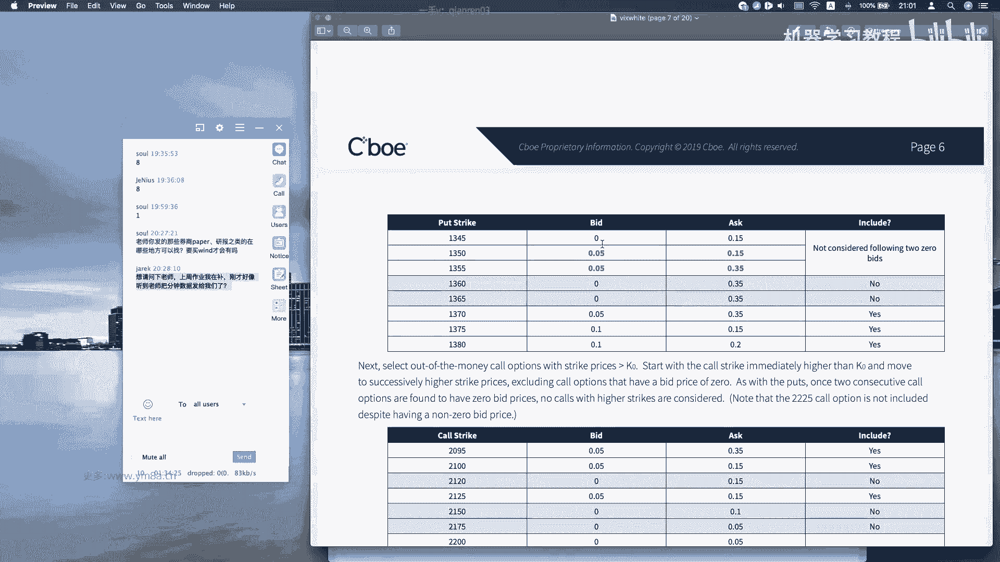

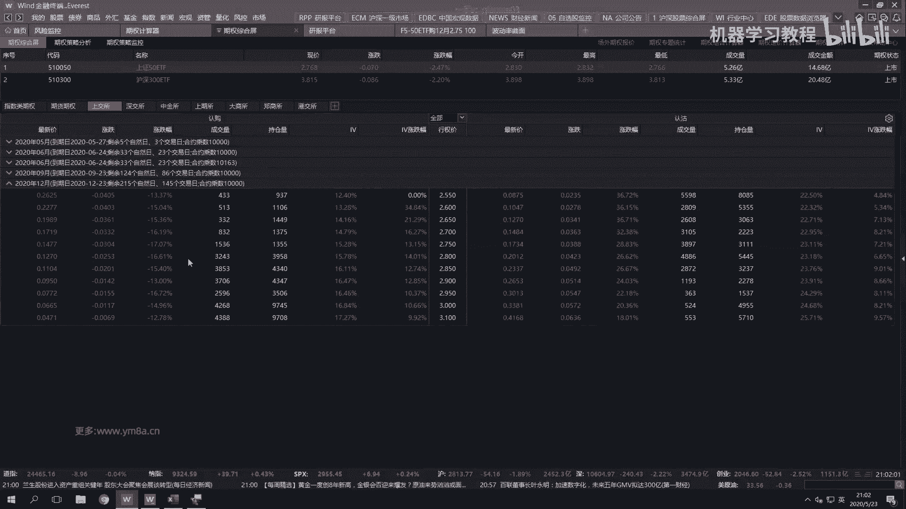

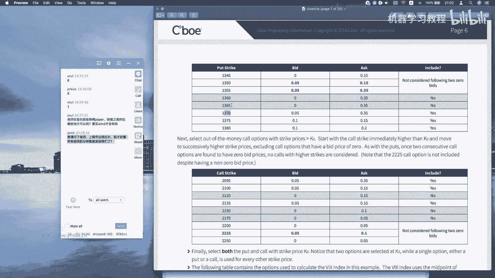

呃。这边如果是0。5，就是5，我们这边除以也不是1000了，我们除以的是30，对吧？最多是2730，那这个差的上是30倍。所以可能就是说我们看到的就是说这边ETF一天成交相对来说还是比较活跃的。

我们看一下就是它的成交量。对实上就是平值附现的可约一天几十万的成交。一般来说我们不太会出现就是B为零的。就是说任何一个它的团口为零的这样一个情形，就是相对来说比较少见一点的。

并且因为我们也有做市场的存在。所以。

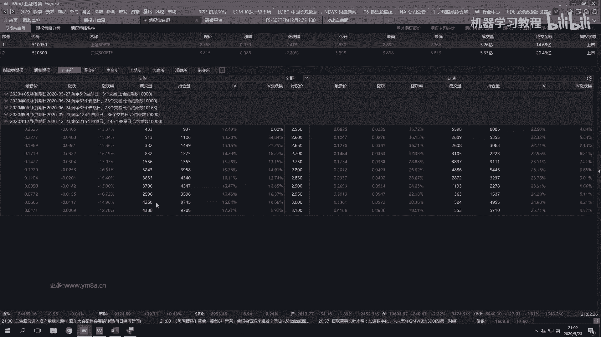

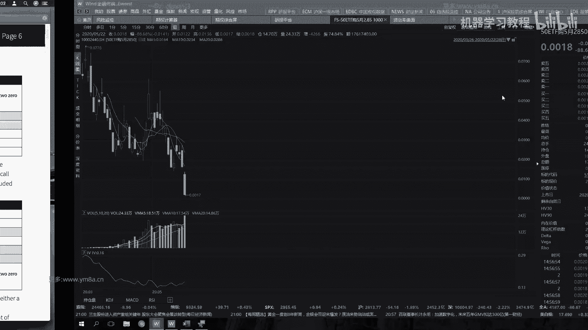

理论来说，就是我们计量保题的in indexdex，就这部分是可以忽略的。就是说你不用去考虑这么复杂的情形。当然你觉得完整follow这个流程也是OK的。然后然后事实就是你有了这样的一个东西之后，对。

然后其实接下来就比较顺其自然。因为我们刚刚不是有了这样一个。index这样一个K了。然后就是。对，事实上就是你算出来了。Aent price。然后你只要把就是out of the money。

然后我算出来这个也是2。9块，那我只要把下面那个算出来，对吧？这是我这边的。是你这边就是算出来F1之后。这边又要有一个方式，对。Wrier function。就是你要去找到2。9块这个值。

这个是怎么做呢？呃，我我觉得两种思路就是一种是呃follow，我直渐逐渐的从这个XSpri去找。然后直到我哪个值是大于它的话，我就break，对吧？然后我把之前的这个值。呃，去找到这是一种想法，对吧？

然后还有一种还有一种方式呢，就是说呃我利用我的 domain脉 knowledgeledge，我知道50ETF的新全价在3块以下的时候是呃0。05档，3块以上的时候是0。11档。

因此当当前的这个F一是小于3的时候，我就可以找到就是说。我指的就是直接去把后面的这个全部给砍掉，对吧？呃，不是不是凯到，如果是968的话，就是说你要去找到。就是。还是还是用刚刚的方法，就是divide。

就是你把它乘100，然后去除以5。呃，然后你找到就是就是去把就看一下它的余看一下它的余数，然后把这个余数减掉，你实际上就得到了呃。得到你前面这样一个数，对你实际上乘以100了，就是你相当于说291。8。

然后我整除5的话，我余数是1。8。然后我去我把后面这个余数290。8减去1。87，不拉不吧，我得到就是是2。9块。你通过这种方式是可以得到2。9块。就是这边我们要做的事情就是。嗯。就是你要去。嗯。

就是determined的这一步，你上际上做的是这一步。对。就这部分是你要去做的对吧？然后。对，那注意我们不是直接拿我们的算出来的pri difference这样的一个exerpri。

就是我们刚刚刚刚第一步不是做了，就是我哪个的，就是说我价格最小的话，我可能算出来index15index15，然后它应该算下来就是2。90，但是呃要注意的是我们这边要先去算，就是你要加上这样的一个。

rRT。这样的一个东西。对，这里是给这是它的时间价值，然后不是时间价值，就是就是就是说考虑到一个就利率的这样一个问题。对。所以然后你我们可以你自己可以就是说拿远位的去算一下，就是你可能算下来就不一定是。

不一定只是2。9块，肯定是3。多。对，然后注意说你如果是靠的话，我选取的是下面列些齐权。然后呃如果是put的话，你选取的我们就注意选取都是平值或者是。那，阿莱我的拉里是铺的话，我就要选网上的这些齐全。

就像这些。然后接下来其实就比较简单，就是我主要是知道他选取了这样逻辑。然后选选接下来这样一个期权之后，因为这些问题可能我们也不会存在。因为b ask其实我们还不不用不用去考虑上。当然你用商品期权的时候。

你可定会去考虑这个东西，商品齐权不是特别活跃。就我们能够得到这样的一个option type时。然后注意这个这边是什么？这边是option price。因为我们刚刚的日行情的话。

我们现在有拿close price来去算。然，记住实盘的时候。或者盘中去算的时候，就我们看到volility index，它都是拿每个合约的b ask，然后取一半去均止去算。然后算完之后。

其实不要看它就是的很复杂。对，其实相来说会还还挺简单的吧，就是。我们刚刚算出来F1，然后除以这个K，然后再去减一。然后我们刚刚还是这样一个T分之1，把所有每一项，就是这个东西都算完。然后算完之后。

然后再去，然后这个dtaK的话，就是taK是什么来着？我记得是减去这个K，然后再除以2，就是减去我们的这个就是我们刚刚的这个K0，然后再去除以2就OK了。所以接下来就是不超过高中数学。

应该是初中数学东西吧，只要会算平方会算根号就OK了。就是我们我们不是把这么多合约都算出来了，然后。就把这些合约的呃值一个个带进去去算出来，算出来之后再去平方。

然后然后平方之后实际上我们就得到了一个sigma一 square等sigmasigma2sre这样这样一个东西。对，然后注意说，因为我们要算的是到期日是30天这样一个期权。所以我们刚刚看到T一的话。

大概是1月2日到1月24日之间差22天。然后T2的话，你再加去再加个30天，就差不多是52天。然后我要算330天的时候怎么办呢？那本质上来说要做的事情，相当于说是一个呃加权平均，或者叫呃或者叫就是说。

啊，或者叫就是一个音呃就是。呃，类似于说我们用一个线性的Y等于KX加B的话，就是说我我用X1跟X2去估计中间的这样一个方式。所以本质上来说就是就是说当前的呃，就是说看T2到30天差多少天。

然后T2到T1差多少天，这个这个算的就是这样一个就是一个他的我对于近近期的这样一个期权，我该去采取怎么样的一个比例。然后同样的对于远期的话，呃，我算的我算西格玛2的话。

我本质上是本质上也是算这样的一个比例。对，因为注意呃西格玛一跟西2，就是说我考虑算近月的话，那我要用远月的这样一个时间。对，这样这样一个反比的这样一个关系。所以你接下来就是非常的小学数学的这样一个。

你知道吧？我们的NT。我们把这个30天换成转换成年也就OK了，对吧？或者是你看它这边是用分钟，呃，你用分钟用年，反正没有关系，最后都是把去把它按比例去算的。然后你算出来这样一个数之后。

你再去乘以sigma一呃，就是我们上上面算出来的这些东西，我们把每一项都给它求合算起来，就OK了。对。然后然后再然后再把去就是他因为他我们要注意。

我们算的是就是30天的 weighted average。然后所以这边还有一个时间上的这样一个呃。呃，就是一个一个是30天的周期，然后然后我们要去把它去演化。对。然后算下来这样子再乘以100。

就我们得到这样一个vol index。所以这部分大家OK吗？我只要讲一下，就是前面的就是说我合约怎么去筛选的这样一个问题。刚开始给大家看其实仔细去看一下paper上应该是非常容易的一个事情。

就是就是说他注意的是我们都考都交易的是都选取的是out of the money的个期权。因为事实上就是说交易的时候，我们看一下为什么要去选这样的一个。

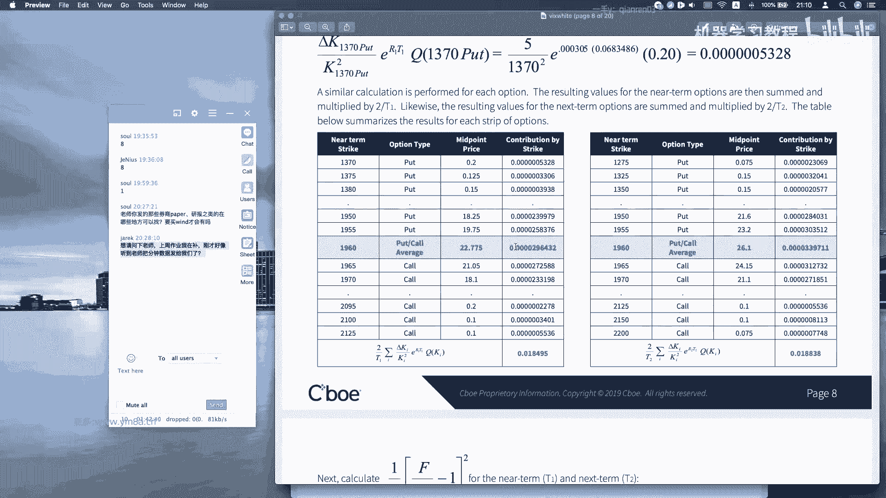

然后我们看到认购的话，呃，比如说现在价格是2。768，所以2。75是平质2。8，然后相对来说会虚值，接下来都是虚值。我们看成交量显然就是说。显然就是说成交量会比实值的会去呃会多很多。

因为本质上就是说我要去交易实值的话，我呃那我为什么不去买股票呢，对不对？然后然后对，然后如果是投机的话，我也希望我的杠杆是越来越高的那我肯定是选择是选相对回说是选虚值的一些期权会好一些。

但事实上就是平值靠近虚值的这些就是虚指靠近平质的这些期权，它的交易是最为活跃的对。然后呃大家看到就是说当然还有一个就是你太过虚指的期权。比如说我觉得3。1块，还有3天吧，我们能涨个20%那。

显然就是说这概率会比较小。所以这个时候交易的人呃，也不是没有，还是有。对嗯，因为期权我最便宜的手续费都要1块多。然后正常是2块的手续费，我乘以1万的话，就是说这个就完全覆盖不了手续费。对。

然后也有人就是说。交黑的时候，有人会喜欢说检烟头。呃，检烟头的话就是说我去把这样的contract去卖。我我记得上周五有人跟我说就是。卖了不少这种2。2。75的期权，因为觉得它快到期了嘛，对吧？

然后快到期了的话，嗯也就是在星期四去买，然大可以看一下，就是说我一手卖是29块钱。然后到收盘的时候184，这个真的就是亏啥了。对。因为当然有保证金，嗯，你不会你不会说是说你真的说你卖个100手的话。

然后。对，你还可。还okK连1手保证金可能都要。100乘以5000的话，肯定要50万了。对。对，然后你算一下50万的话，一0手，然后这边亏了100。对，15000，那一天亏3%还是OK的。嗯。

如果你是做买方的话，从29到这边的话。是嗯，就会你实际上你收益是非常夸张的。然后然后我们就是说我们刚刚算的那么多volity index，在实际当中是有什么用的？

一个是就是说我可以根据这个volity index去呃去去判断我接下来波动率这样一个走势。然后还有一个是。

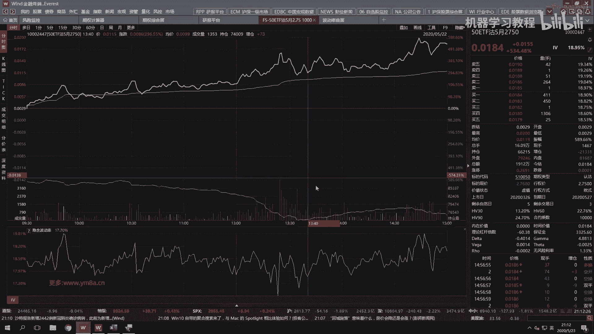

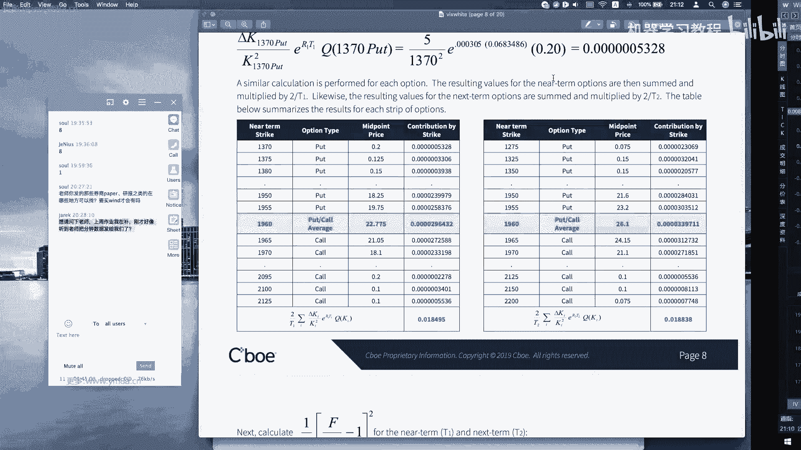

可以说是辅助我的噪点。就这一点的话，大家可以看到，就是说这边是一个波动率点，市市场上这边是一个波动率高点。因为当然这个。呃，要注意put的，他这边可能。铺台不是特别明显，我们换一个。这个还不是特别明显。

换一个。稍微远远一点，因为近月的就是它的波动率会就是比较大嘛，就是就是伽ma比较大的话。然后呃伽ma比较大，相对来说就是我快到期，然后它的波动率就其实也不会说就是说是就是波动也会上沉下调会夸张一点。

然后如果稍微看近远一点，就是不要看靠那么近，就是说我看几十天的话，那可能这样的话，你可能开的看的明显一点。那显然是到这个点的话。就是说我们待会可以看一下，就是50TF行情。我记得到那边的时候。

它就是说波动率的快速下跌。即使说我方向就是说股票稳一TF还的接着下跌，但肯定波动率的下挫。那我肯能即使方向看对了，我还是去亏钱。那在这个时候你如果有波动指数看到就是说整个 index到了一个非常夸张。

并且迅速在衰减的过程。那你可能考虑要去一下。对，并就是说你要买的话，你事实上是不能在这边买的话，事实上没看到就是说这边你买的话，可能就是买在了最高点。那当然就是说你可能同样的时候我去做风控的时候。

就是说。我是不是对，有的时候就是说我看是不是要在这儿去砍仓，对吧？但，事实上就是说你我在波动率的最低点，我不一定我就在我不一定要在就是说呃。波动于有拐点的地方去弹仓，我可能稍微扛一会儿。

我可能评价的位置是会更好一些。对，所以就是我 index一方面就是说你帮助你在盘中去呃做你的期权的交易决策时候，你可能会考虑你的买卖点，可能会有一些呃选取可以去做优化。然后对，因为本质上来说。

大家要理解就是说期权的波动率隐含波动率不是说我们是不是说由我们决定的，它本质上反映的是市场交易的这样一个预期。当对于期权有更多的需求的时候，我自然隐含波动率就会上涨，买的人比卖的人多嘛，对吧？

那如果对于期权没有那么多的需求的时候，呢，市场波动就会去下降。对。

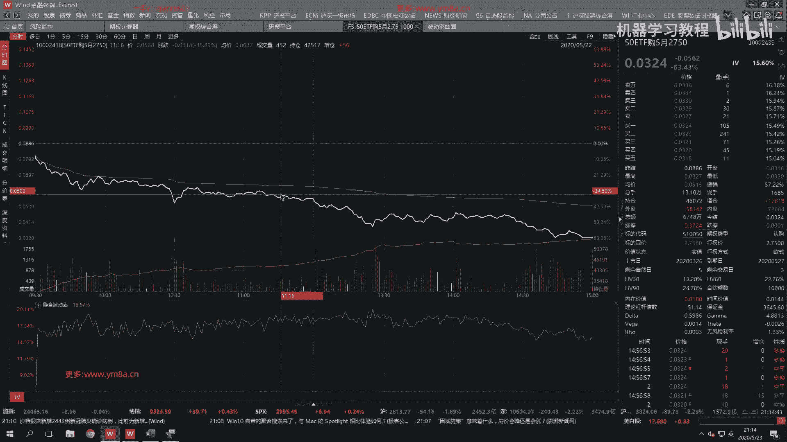

然后一般大跌的时候可能会波动率会比较上涨。然后然要注意的是成熟市场等。A股的期权波动与特征可能还会有一些区别。然后大家也可以去研究一下。

然后以及甚至会有人说到就是说嗯CPOE提供的vis嗯这样的一个指数有可能是会被存在。就是基于它的一些衍生品是有可能会存在一些套利的空间的。对。

所以所以说我要建议大家还是说把那个w paper仔细去看一下里面的就是具体实现的细节，然后自己去把这样的index去实现一下。然后嗯是可以跟这样的。嗯。跟他的。

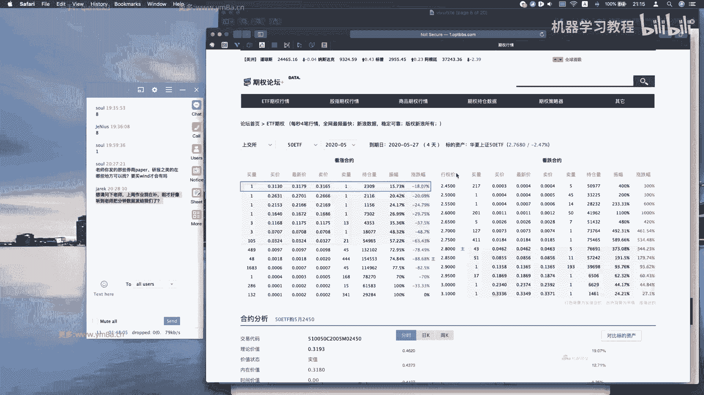

volity index我们去对比，对吧？嗯。

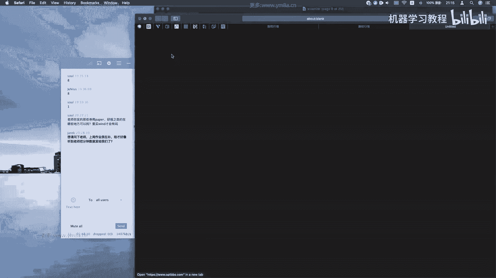

对，就这个网站我觉得就是大家可以是去。就如果教育期群还是可以去参考的对，但事实上做的东西还挺多的。然后当然是说，因为如果你就是已经开通了期权权限，你完全是不用可以不用用它的了。

你可以自己就是把vol index。然后因为我可以拿到tick的数据。我事实上我在盘中的时候，我观察到了vol index是会比别人快很多。他应该这边最快就一分钟更新一次。

但我们在盘中我们是可以做到tick级别的更新。呃，对，这个是比较重要的一点，就是同样来说，我们拿到的东西会比别人会快一点。对。呃，okK然后vix这一部分大家有什么问题吗？Yeah。嗯。

现在还有啊还多了一位同学，OK现在有10个同学。嗯，好的，然后如果vix没有什么问题的话，然后其实还有一个叫skill。skill的话其实会更简单一点。同样的也是种类似的思路，它反应来说就是。

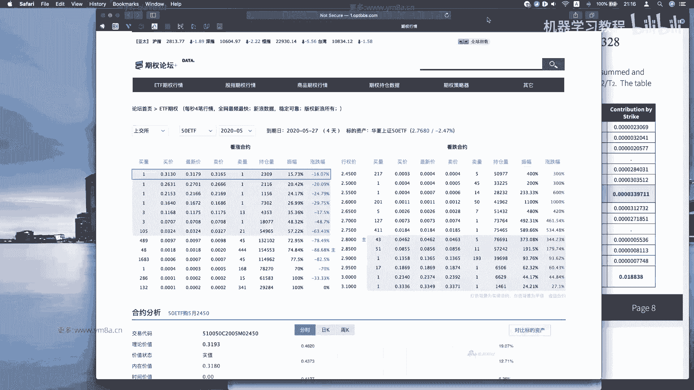

晚哪能看到波动与去面呢？

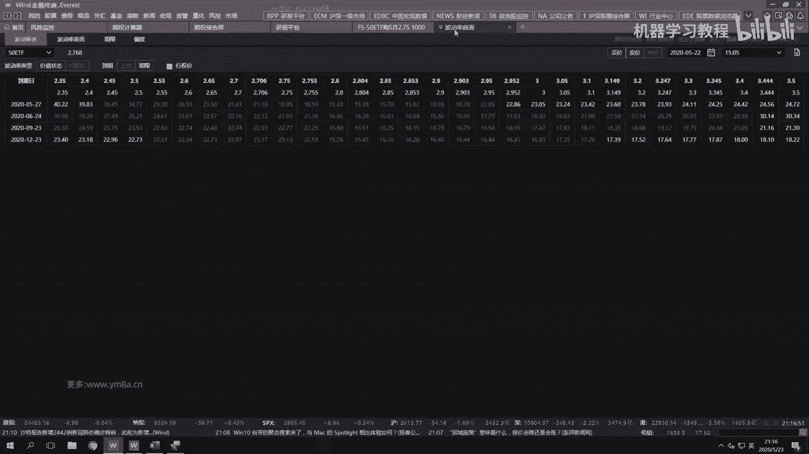

哦。稍等，我登一个。呃，mac版本的应该就能看到，稍等一下啊。嗯。就呃mix的就是ski这样一个指数，待会儿也会给。也有一个 index就是它本质上来说就是说我正常来说。

我市场应该是有一个所谓的volt smile。就是说对当我对于同样的呃就是我两边对于put这样一个需求应该是类似就是对 money需求是类似。但是some号市场就出现了偏移。

这个时候就是说我对于极端的时候，put会有了需求，就是它imply会更高。那对于 imp会低。大家可以想一下是什么候会发。一般来说就是直接来说我什么时候会需要更多的put。

就是说呃一般来说是我会有更多的股票需要去对冲。就是说市场快速下跌的时候，我需要快速去对冲我的呃股票的呃，那这个时候我会是对就的会多需求把整个曲面这样一个方给打偏。大家也可以看到就是我们的话同样是同样是。

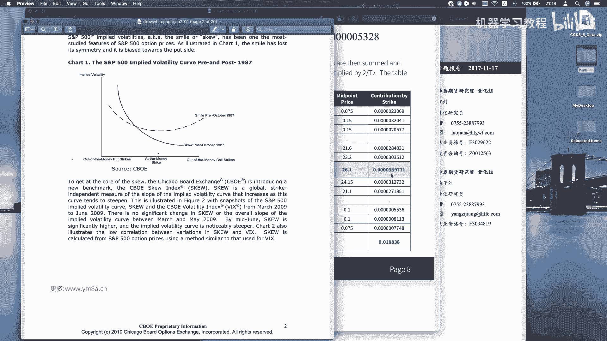

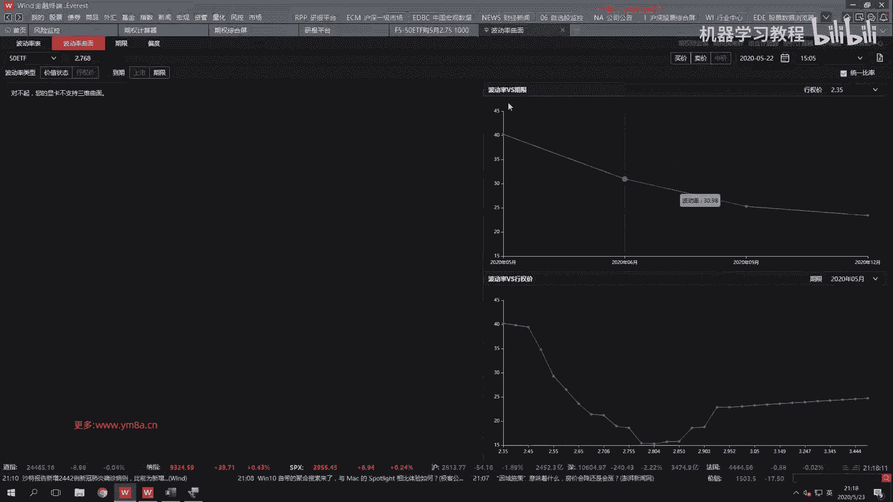

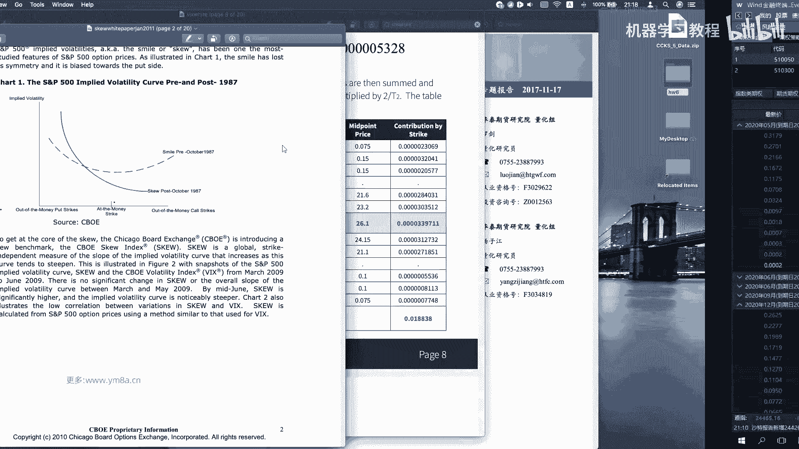

这边就是一个典型的，就是呃呃典型的这样一个呃报贴就是一个就是一个偏写的这样一个scu。这个大家可以看到，就是同样的品质的话，我的put的波动率会比cord高了。两三个点对，这还是比较夸张的。所以。

然后我们看一下，就是skill index它是怎么来算的，就是说就是说100的时候应该是就是飞偏的。然后然后也看到就是说。这个paper待会儿我也会发给来。本质上来说他算的就是一个。

就是就是从它的return的这样一个三呃就是一个expect error，就是它算面就是一个scu。对。啊，就是sll payoff。然后本质上来说你只要去。相当这这个应该是相对比较好算的对。

所以就这就这样一个公式expectation。然后嗯这个R的话是330天的liberator。然后缪是他的名，然后sigma是呃就是standard deviation。所以。然后呃然后要注意的就是呃。

对，其实然s index的话，我看下OPTDBBS上应该也有给大家。看到对。啊，这个paper比较多，大家就。然后下面有具体的计算方法。

然后我相信如果刚刚大家那个呃vollaity index这个方法理解了之后，其实你看所有的机号其实嗯都是类似的对吧？就是有了那个之后，两个其实算起来会也会比较方便。所以大家可以待会再去去算一下吧。

就是这这个后面就。呃。对，应该就都都是非常intu的，就是只要照着公式。然后我们刚刚其实很多东西都已经下了。嗯。OK然后的话然后想带大家再看一下。就这两个东西的话，即使说我。呃。

一方面是去就是说是去观察呃整个市场面是处于一个什么样的状态。然后待呃待会就是我们看兴业证券水晶球里面，它会用这些东西去来帮助我们做呃股指期货，或就是做股票的这样一个则势。然好。我看一下万德有没有登手。

嗯，稍等一下。嗯，中好了。

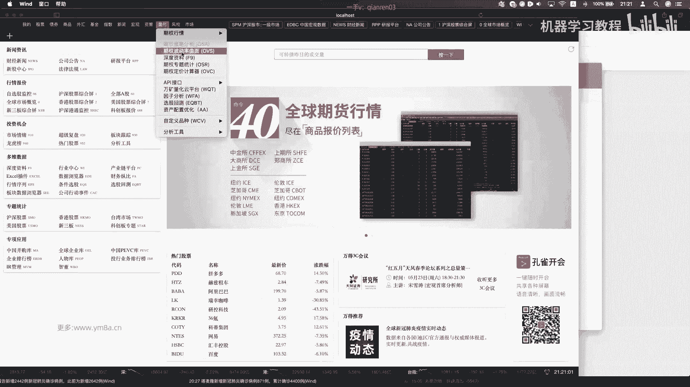

因，这样是我们看到这样一个politic的surface。对，然后他注意可能同学们可以按买家卖家中价去来做。然后事实上就是说你这边都要去做，然后这边还有不同的期限。对，然后注意这边它是一个三维的。

因为有不同到期日，然后也有不同的价值状态。呃，注意我们这边呢就是他这边都是out of them吧。对。加一个。呃，我们 tell。然后你如果来新人家的话。对。期谢。对。

然后他这边的话呃我不知道他这个期限是怎么来合成的呃。因为我不知道他是不是中间就做了一些差分的方法，就是差值的方法。对。因为我们现在你事实上是很难严格找到呃，当前去。距离当前一个月到期的这样一个期权合约。

然后一般我是习惯是看就是说我真实的这样一个合约是怎么样的一个状态。然后这边还有一个cu。然后。行的。然后OPTBDS的是给我看一下他们有没有更新。

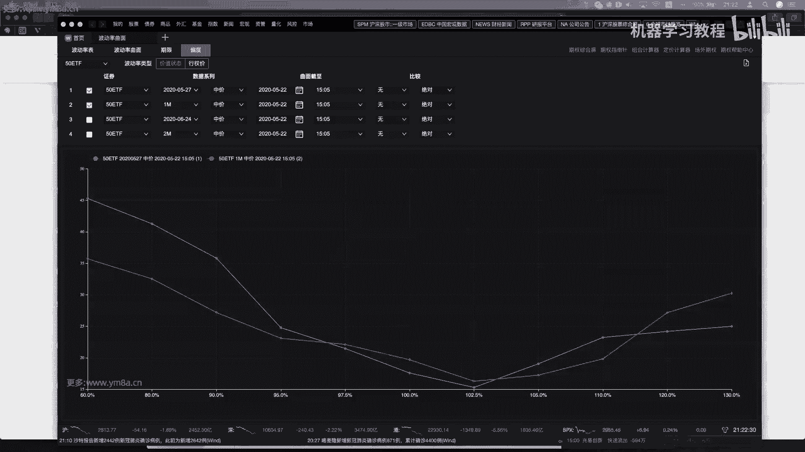

啊。还有。他一般是在100上下不多，就是100上下100是飞片的。She。然后然后的话。就大家希望就是先去呃就是把这两个paper里面的这两个指数自己去实践一下。

然后你这样就能明白他到底在讲什么样的一个事情，对吧？然后接下来的是就是。哦，一个。对，这样。就这样一个波动率套利的这样一个策略。呃，之前有接触过这样策略的同学了。就是呃本质上来说嗯。

他这边说是本质上来说我通过一个模型，然后就刻画出。嗯，我这个模型会给出一个隐含波动率。然后我是事实上我实际交易的过程当中，就是在market data里面又能去推算出这样一个隐行波动。那么我实际的模型。

我认为就是说真实应当我认为模型模型的波动也就是说市场应该给我这波动率，但嗯事实上跟市场有区别。那这个时候我想做的事情简单。我认为说模型的波动率呃就是任何就是高估或者低估的期权的隐含波动率。

最终会回归到我所刻画的模型上面。那我本质上来说，我就可以就说我通过一个卖高跟卖低的这样一个方式就可以去。去控制我的就是S就是控制我的呃呃就可以把他们的就是说。因为我本质上来说是我只想去做波动率的差。

那我可以通过说d量，就是把它的呃我可以把它delta给h掉。然后那所谓的dta就是说我在方向上的暴露。然后我因为我可以通过调不同的手术嘛，对吧？就其实它本质的意思就是说。

我希望最终呃它回归到一个这样一个光滑的这样一个曲面上去。我看一下。对，其实本质上来说就是说。比说我模型就是我market board的话是呃是给出了就是呃。OK他这边是把ask跟就是sell跟那个。

OK他是就是说我这边的呃。O对他因边是分别用那个的这样一个呃把他的给刻画出来。然后这样的一个纯色的线是我靠模型去呃拟合出来一个，然后大家可以看到，就是说这边时候市场是有高估跟有低估的。

其实本质要做的时候，我只要把高的期权去卖掉，把低的期权去买入。本质上我就可以去做这样的事情。然后然后怎么去调他的手术呢，就是说比如说我要买，那其实就要看的时候，我要买，比如说我要买一手这个期权。

然后我买一手这样的期权。那本本质上我只要让他们的delta去。

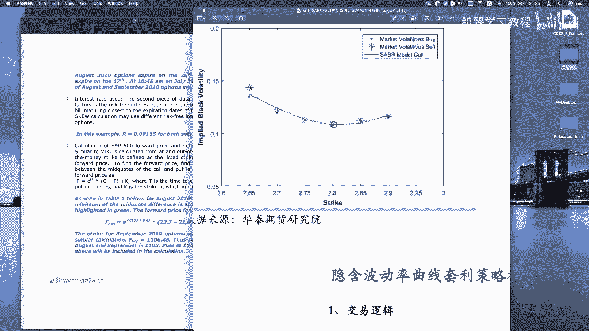

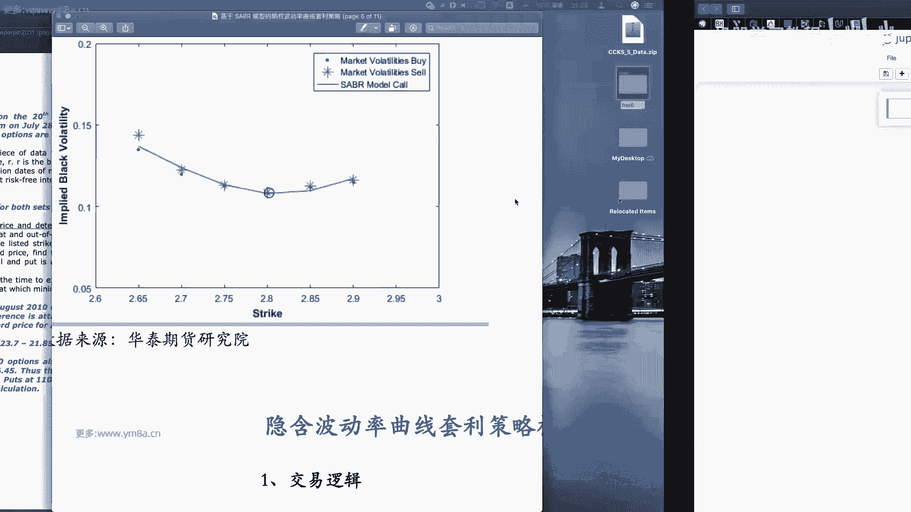

呃。就这样让他的调查去想等就ok了。比如说。Sorry to bear here。

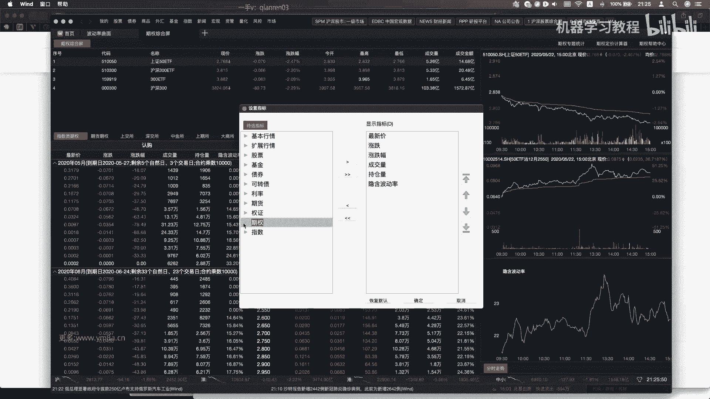

嗯。对我这边呢这边是有它的调查值。然后就说比如说我这边是0。8，然后这边是0。7的话，那我本质上我如果这边是实手，的它的调ta是8。然后我这边是呃这边因为是负的-0。7的话，那我这边就是要拿8除以-0。

7得到相应的手术。这其实整个它思路是很简单对。但是可能就是说我们的时候可能要去想一些事情。对，就是说首先第一点要考虑就是说呃嗯其实大家就是说SABR模型就是如果大家本质上他所做改变就是说我原来认为这个西格是一个常。

但是我现在认为它不是一个常数。对，而是服从一个分布。所以来说这个是这个模型最重要的一个改变。当然就是说大家不愿去担心，因为本质上来说餐饮板就是公司都给你好。

甚至你可以用那个框里面去直接去调这样的一个mod。对所这部分不是大家去。甚至我说模型不是最重要的。我重要的是找到一种方式去衡量有哪些高估或者低估，我甚至我可以去p一个。

我甚至就有一个光滑的一个二次一个这样一个呃曲面去去了pl去拟合这样的一个市场的波动力。我只要是它是一个comveax，然后我能找到高估跟低估的合约，就OK然后呃对。

然后但是要考虑一点就是说呃我是不是因为我看到就是说我每一个到期有都可以去做这样的一个操作。然后呃那我就要考虑的时候，就是说我什么时我呃比如说我有禁阅的，然后我可能说是sh了他，然后除了delta上面。

我在其他西腊字母上是不是也有暴露，然后以及就要考虑的是当价差达到多少的时候，我才可以进行去逃离。因为如果波动率只是说虽然有区别，但只差0。1%。那我个人觉得这是一定不能去做。

因为可能你的摩擦成本的覆盖不了，所以这部分就是在回撤的时候，大家可定要去注意。呃嗯大家注意就是一点是。可能呃用日级别的话，你可能就是按照他的这种方式来说，就是说如果按日级别你测下来表现还挺好的。

但事实上可能就是你这块钱不是他波动又回归的钱，你可能是由于隔夜之后，你整个整个Pfoo会有比较大的一个在其他数字母上有一些暴露。所以我我的建议是我要去回测这样的一个策略是哪分钟的数据。

然后并且要去测分钟的gs，然后去来去算。对。这样配备大家可以仔细研究一下，我觉得就是整个还是okK的。呃，对，就我们当时测下来其实效果是差不多。但不要要注意的是在17年市场波动率比较低。

就这这个这个策略work的前提是就是。当市场波动率处在比较高的环境下，我们本质上说做这个是可以可性可就是持续去赚钱。市场我们也去做过类似基于这个策略做了一些改进，就是我们模型跑了一段时间。

而事实上是还是赚了一些钱的对。当最暴力的时间我们没赶上，就是1516年的时候。对。我们18年的时候还OK真的还okK。对，所以这个策略应该就是长期的话来说也还是会work。

但是有的发现就是随着就是嗯自动化交易的越来越多，就是想要赚到这个钱不是特别对，不是特别容易了。然后要注意就是手续费跟市场流动性实上会去对他的呃收益也会造成比较大的影响。对的。然后嗯这边其实他也提到。

就是说我做的时候，他这边只用当月，我们后来去做的时候，不仅仅是当月，就是其实下季月流动性，就是下个月的流动性也还OK。因为我们首先要考虑是说我们持有的流动性，那持有的持有的合约是不是容易的。

非常不容容易的去交易。对，所以你可以去说我不仅仅做当月，我还去做下月。对，夏季月。然后这边提到他们只做了那个日线，然后事实上我们去做了分钟呃，以及更夸张的时候，我不用分钟。

我可以随时用盘中的数据去抓用tick只要有一个合约。如果说对方出价很很傻，出错了，那我可以完全干把去套住就抓住这样的机会。那这样的时候对你的交易系统可能会有比较大的要求，因为我同时去定150多个合约。

对。然后还要注意的就是你的就是。对希拉字母的这样一个对冲你整个持仓风险。对，这样的话其实就是你我们的就是要要值得这值得考虑。就是说当我持有的我我建完仓之后，我的delta是约等于0。

但是隔了一段时间之后，我的delta呃，可能又呃有了一些偏离。那我要考虑就是我以多少的频率去对冲我的delta。对，然后以及delta到了什么样的窗口的时候，我要去决定去对冲。

这个里面是有比较多的空间的。然后包括除呃除了就是我的delta的这样一些呃呃暴露我还要考虑就是我的。我其实就是说期权交易的话还挺多的。然后我想单纯去赚这个波动力的钱，还是相对来说会比较困难一点。对。

所以这是这就是说这种无套利的这种就是这种就是含波动这种套利，它是一种策略类型的代表。对一般来说现在倾向是大家是往更高的频率，然后以及更优的模型去做。就事实如果我用去定价的话。

S还好度还化的完全住数据去定价。但是，一跟上加加新个型。然后因为我还要要做的事情就是说我在算这个模型的时候，本质上他要去求解一个优化问题。我要找到我对应的参数。

然后使得我的波动力的就是我实际的隐含波动到模型曲面的隐含波动这样方误差误。它是最小的对那这样你求解的是一个优化问题。那这部分就是说要看就是你的优化，你每个人可能优化算法不一样。

那最后算下来就是参数可能会有一些细微的区别。这部分也是要大家去考虑的。所以就这个里面坑还是比较多的。呃，这是一个我们当时基于这样的策，就是这样的一个策略，可能研究的还挺长一段时间。

然后产生了各种各样的延伸的版本。所以有兴趣的同学是可以把它的策略去完整的回测一下。当然你可能就是说系统层面还要花比较多的功夫。因为你要用分钟数据的话，如果几年的分钟数据都落得到内存里还是挺大的对。

然后所有的greeks还是要预先去处理好，不能在回测时候再去重新去算。啊，这是一种就是策略类型的框架。对。然后还有一个就是说呃我本身来说是去做，就是我做波动率的话。

我除了虽然说做波动率的收敛或者是回归的这样一个。回归的这样一个呃。就是做加叉，就是相当于类似于做加叉收敛。只不过我这边做的是波动力收敛。除了这样一种方式，我还可以说我判断波动力的方向。对。

比如说我们看到的周五的。

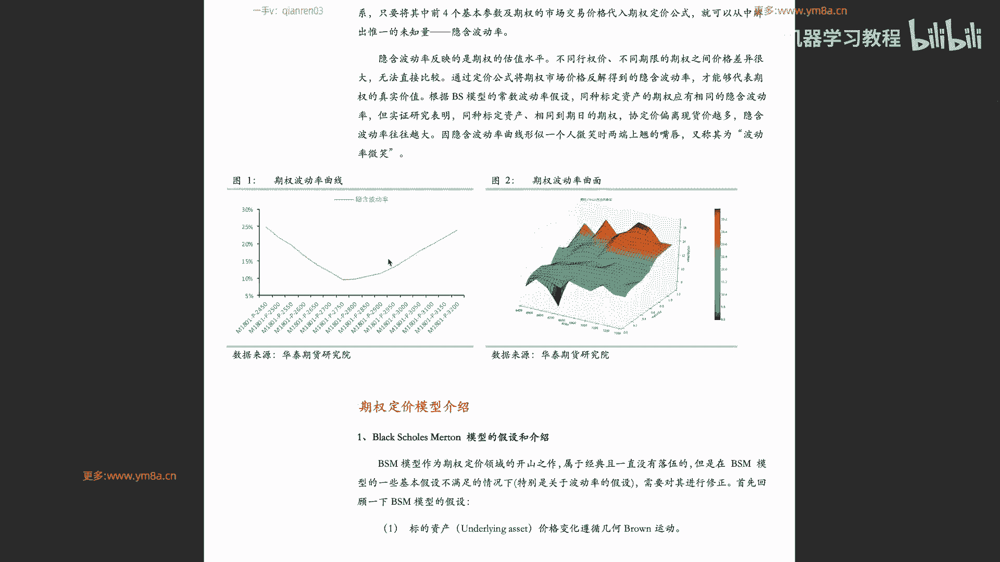

啊。对，这样一个情况。比如说我到这个点的时候，我是不是可以去上波动，因为市场这个波动率很夸张呀？这个从23。8几，然后一下子又回到了多少。你结果开盘是去，比如说我发现这个今天这个市场不太对。

然后我就开始去多波动率的，但实际上我单纯去赚波动率这样一个。这个今天当然是比较大3%的波动也就可以大吃一口，应该是赚非常多的钱。对。呃，这也是一种方式。所以嗯那这个时候就要去就要去判断，就作为监销而言。

不仅仅是做软化，我还要去判断。就是说我对于当前的走势是怎么来判断。对，因为注意要做期权的话，除了说我们用高频的就越越来越偏向高频，然后用通过模型去逃离，我还有一种考虑方式，是我是做主观，我会去思考。

根据当前的市场行情，我认为这下走势会怎么走。那么期权将是我去实现我这样交易策略的一种方式。对，比如说如果认为这下市场是波动缓慢的上涨，那我要考虑说就是说那我肯定会考虑说是我带有一定的方向性。

但是但是我不可能说单纯的只是浪一边的口，那我肯定要考虑是说我怎么样的。我可能会sell一些out of the money的这样一些call。

然后但是我同时会买一些浅度浅度虚值或者是浅度虚值的一些call。然后我怎么去控制我的风险敞口。对，所以这部分是可能我会觉得这是期权交易里面会比较有意思的一些地方。

然后当然我不是很清楚就是做场外期权的小伙伴们是怎么来做这样事情。因为我们当时也做过做场外期权。当然我我们其实很简单，就是我们是去抓券商定价的一些偏差。因为事实上刚开始推出来的时候。

可能大家对于业务不是很熟悉，就是报价还挺离谱的。嗯，就是本质上就是我就是做无风险讨论，真的是维ter里就是无风险。因为每一天的波动报的真的千差万别，只要勤快一点，能够多多向不同的呃即将去报价。

有的钱赚的是真的是非常容易。对，那当然是刚开始的时候，对，后面的话，当然肯能如果同学们就是有的做ex个elt给他齐权，那这块我可能不是特别熟。对的。

然后。好，呃，这部分就是我想要介绍的就是ACBR的这样一个呃这样一个模型。本质上你可以把ACBR换成，你也可以同样的去测试哪个效果会更好。对。呃，但是这部分来说你还是需要自己有这样的一个回测的系统。

你要基于啊我们期货的回测系统去进行一些修改。这就是应该是大家可以OK了。呃。好的。呃，这部分大家有什么问题吗？这个paper待会也会发给大家。我我我我我我的觉得我的我的建议是还是值得去仔细研读一下。

然后把相应的model去implement一下。然后其实说我们拍on自己写这样的一个模型。呃，因为它公式实是实际上都给你了，就是我的参数。这些都给您了，实际上算峡是非常快的。对。啊。

这部分大家有什么问题吗？就我本身上要去就是解一个优化问题，我去给这样的，就是我我我要去求解我忘记了是哪两个参数来着。

那个对去就是说我要去给定就OK就是去给定我要去计算每个期权SABR按照SABR模型算出来这样一个包。然后你做优化的话，如果简单一点的话，就用s盘或者是n派里面的，就是优化的包就可以了。

然后如果想要追求更更加稳定或者更优的求解期，那可以去看其他的求解器。对。这部分大家有什么问题吗？呃，OK呃，那好的，我们先休息10分钟，我们到那个50的时候再回来。对，然后接下来还有一个是对。

一个是兴业证券的，就是一个通过。呃，弃权去择使。对，去择使。虽然我觉得呃择时呢就是。每个人关系都不一样，有人觉得是玄熊。然后还有一个就是PL的attribution。好的，我们先休息10分钟。

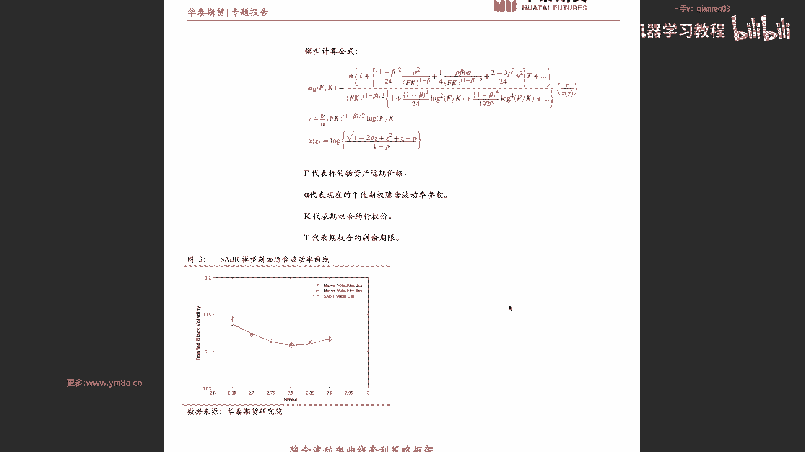

好的，哎，同学们啊，我们再坚持一下，还有最后一节课。OK然后对。然后对于择史比较感兴趣的同学，我想介绍一篇研报是关于。嗯。我们先来看这个。呃，星愿水晶球。本身来说。

它的assumption是在期权交易市场里面的交易者是更为专业的。那么他认为机后就标题起的很有意思啊，机构和散户到底谁看对了市场？

然后他们他们的目标是通过呃有期权上面构建出来的水晶球指数来应用指导ETF和股指期货的这样一个投资。然后让投资看起来也挺诱人的，然后。他主要说的是因为就是当这个推出来的背景应该是在。像这是什么？

这是2017年对，2月9日上市。所以呃。嗯，就具体的就是说s就是这些东西大家可以自己客户去看。对。嗯嗯，待会我们就看这是它最早的一个版本。呃。

我们主要关注来说它是怎么来由期权去呃延伸到我们的估值期货跟ETF的价易的。就首先大家可以思考一件事情，就是说如果我们从呃直接上来讲，当我觉得。股票上面股票市场回去上涨的时候，作为一个专业的投机者。

作为一个投机者而言，就是说我希望的肯定是去long call或者是shop put。那么然后如果我认为下跌的时候，肯定是shop call或者是去long put。那这样可能就会对于说他们的持仓量上面。

成交量上面来说会产生一些。嗯，还有产产生一些差别。那么就是说这样的话就是一个呃第第一个叫我们叫co ratio这样的一个因子。它本质上来说是通过不同类型的呃成交量的大小，然后反映当年时间市场的偏好。对。

然后有人甚至进一步说是说呃看涨看见比例数值进行差分。嗯，OK这样也大家都觉得都可以去尝试。然后我们我们刚开刚开始就测试的就是拿四个因子去做。对，然后基本上还O。

但是可能不不就是想要说稳定的时候也不是那么难不是那么容易。对，然后然后如果说是做期权的话，肯定避免不了实，就是隐含波动率。对，所以说就是本它会有点类似于我们所看到的。对。

因为本就是说我对隐含波动反应的是工需的差别。那么我去比较靠和put的隐含波动的这样一个差别，就能够去。判断市场的一个方向方向。对。所他还是老套路，先是算这样的一个 differencefference。

然后再去算差分。对，然后还有一个是方差方差风险一下。其实也就是我们提到就是implyable跟我们realable就是实际的波动率这样的一个差别，当然大家注意就是如果有一本书叫optionable西。

对这里面大概提到了有4种计算波动方式如果感兴趣的同学可以把那个第一节再发给大家看一下。对，就是说我们怎么去计算realable实际上是有多种方式的对呃，当然是说本质来说，我不管怎么去计算。

我就看我的impliablerealable这样的一个差别，事实上也是可能会产相呃产生比较大的一个因子这就是说不管怎么来说，我觉得这几个因子来说，从呃从经济学意义上来说，它是有一定的有一定的价值对。

然后然后隐含波动力的曲线结构。然后其实这个对就是说它当然就是说嗯大家可以试试看，就是说这个东西你本账是拿ski来做。对你如果说把skill在代言群是不是也可以去预测这样的一个因子。然后大家可以看一下。

就是。这个它是到什么时候，它效果哈，就是说我们看到就是说如果说你去多空的话，相当来说我还是跑赢了对吧？跑赢了就是下面两个对，然后如果是如果是期货的话，也是ok哎，大家注意。

反正就是说因为它是根据这样的因子来去，就是说来算的这样一个打分嘛，其实是跟因子投资会非常类似，就是说跟我们K实有类思，就是说我算出来的，比如说我用线性模型有一堆因子。然后我算出来这样一个分数。

然后我看一下到什么时候分数的时候，我选择多什么时候分数以下我去选择空。这就是非常类似的这样一个操作。对，然后大家也可以看到，就是说有时候并不是说呃说我。就是其实更关键是说我选择底层的因子的质量会怎么样？

然后他选择这样一个4个典型的因子。对，然后这个是15年的吧。15年的对15年的这样一个。一个养报，然后他们做的比较好的一个事情是一直在去进行持续的去跟踪。然后到今天发给大家的话是。呃，3。0版本。

前面一版面大家看到就是说。因字已经做了，就应就是我们刚刚说c ratio，然后它查分，然后他引ki对吧？然后skill查分，然后呃我配那个O和C是什么？就这边这边那个说实话我还没有特别关注。

因为我们当时只用了1。0的版本。对。然后他这一次里面他会严格一些的，就是他还去看了一下，就是他的T统计量。Okay。然后。对。还是回顾一下，就是他择实思想呃，这个基本上没有什么变化，对吧？

然后呃你说我们他他说的不是主管，我们主要是从量价数数据上去来做。对，本质上做量的化就是说我们希望说去从统计意义上来看，有没有这样的呃真正的阿尔法在里面。然后他强调的是经济学逻辑。

不是追求统计的这样一个效果。所以。本质上还是说就是基本上是这几类吧。呃，我们刚刚说的就是对，就是波动率的风险溢价。就是就是我们刚刚提到的就是跟re的这样一个区别。然后他这边有个基线结构呃。Okay。

 skill。然后是认购put跟 call之间的这样一个价差。然后还有个volsile这样一个东西。对。然后18年出现了回撤呃，对，2月5号到9号，这个是这个是就是那个贸易战之间的。

之间的这样一个巨大的回调。所以大家要注意，就是呃模型可能说我在99%的时间都是work，但是1%的时候那就要做好风控。可能就是说如果模型失效了，或者说那我就要想办法怎么去减小我的损失。

其实这是一个比较难的问题。因为。呃，有可能是我坚持按照摸起来可能就扛过去了。但事实上是我不太能容忍在一天之内会有这么大的一个波动。即使说我知道他最终还是会回来，但可能按照风控的要求。

我就得把仓位给全部都砍掉。所以所以说最好方式还是说我要能。是trust尽可能的去trust我自己找到了这样一个模型。然后以及说我相信他在历史数据上说，我控制到它的最大的回撤在我容忍范围之内，对吧？

所以对就是一个完整的策略，即使做出来的话，就是说在机构里交易的时候，可能对于他的要求。不仅仅说是说收益有多少，嗯对于个人而言去交易，我可以去承担他的。就是极端的回撤，120%都okK。

但是如果在机构里出现这么个大的回撤，那可能会比较有比较严重的一些问题。对。然后这些因子的话，我觉得大家都可以去测试一下，就是为什么之前要让就是要去带带大家去算ski和呃之前的vicix。

因为这些东西如果我算好之后，事实上就是在研究的时候都可以把它作为因子去引入。对。所以就是说其实整个的量化的框架都是说我们从最原始的数据去出发，然后去计算各种各样的因子。

然后去研究我们的因子跟我们未来未来之间收益的这样一些关系，对吧？所以okK整个的其实它则时体系基本上就是还是围绕着之前的那四类的因子，然后去不断的去考虑。然后它会对每个因子专门去计算这样的一个。

对大家看sha ratio有的0。80。9还是挺好的对。嗯，OK因为这篇paper其实我们没有去对，但是他说他我没有去实现，就是所以我就还是说有兴趣的同学，我觉得还是去做一下吧。对。

但然这里面就是不可能要求大家做的都把它都去实现。它其实功夫还是比较大的。因为首先大家一个期权的回收系统可能就要比之前的期货要复杂一些。对，可能要花大了不少的时间。但然我觉得就是做出来的话。

应该还是OK的。因为毕竟来说有这样的研究工具，你去把自己的策略去交易之前可能。测一下之后，至少心里会有底。对我觉得是不会比。没有任何的测试，直接就去交易，会心里会有底很多。

至少我知道就是以及这个模型失效的时候，呃，我会根据当前的表现跟历史上表情去比较，去判断我这个模型是不是失效。对。然后其实如果自动化系统做的好的话，呃，我应该是去把我每天的这些策略在收盘之后。

不管有没有去上线，我都去把它去全部的去测试一遍，然后把它的performance都记入到数据库里，这样持久下来，你才会有就是包括就是不管是因子还是模型，都会去计算。

这样的话持久下来才会去不断的去迭代我们的这样的模型。对。所以这样是一个就是想引入的这样一个择时的这样一个模型。OK然后反正之后配本会去发给大家。这部分大家有什么问题吗？

就其实呃就是说量化交易本质上的时候，当我大家都掌握相同的工具时，比如都是股票的时候，我都是从股票的财务数据，然后我甚至从股票的因子数据。那我考虑的时候，我在做交易的时候，我是不是要考引入期。

如果我能引入期权的数据，对吧？那我是不是会比别人也得一些优势，这就我们的 edge，对吧？因为事实上就是从对你就是不同于这个我我觉得是非常明显的。就是从期权上面来说，我是能够去判断。

就是说在市场在一定程度上去判断我的拐点。对我不定要求剩余100。但事实上我只要能提高我的胜率，我都会愿意把这个因子纳入我的模型当中。对。所以。呃。当然还有一个对期间里面还有个trick问题。

就是大家知道就是A股不太能做空，所以呃会有一些put，会有一些议价吧，或者是就是这部分我其实还没有特别想要怎么去处理。因为。对，就跟就跟股指期或者深贴水是有类似的这样一些问题。

所以还是要有蛮足东西去去值得去思考的对。

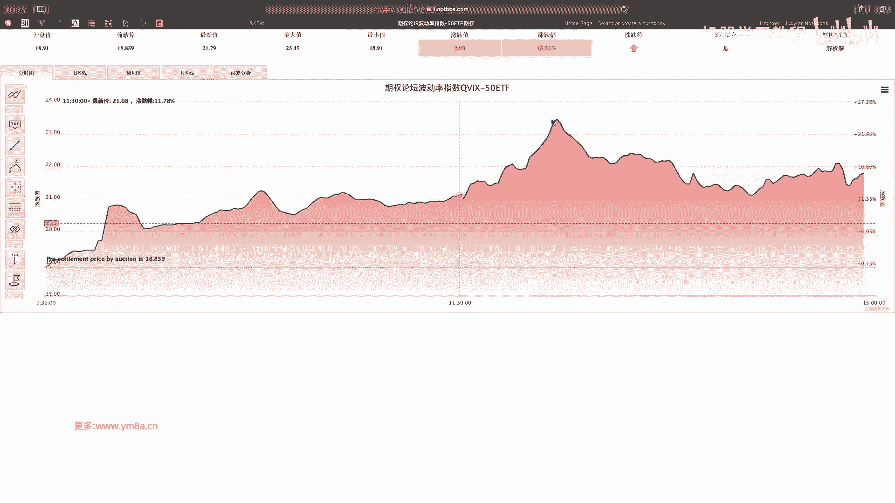

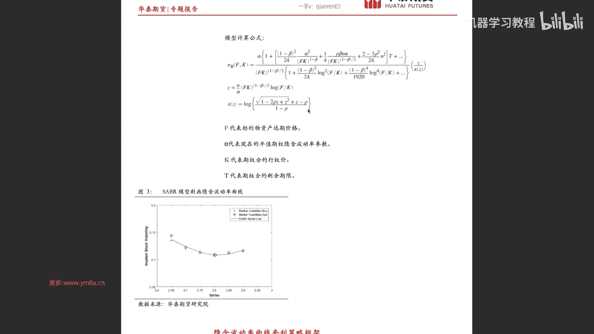

呃，所以这部分大家到现在为止就是有什么问题吗？就是呃我们讲了一个是SABR的，一个是逃利。然后然后这边是一个关于择式的这样一个模型。嗯。然后呃对。这部分大家都觉得O吗？好的，然后最后还有一个就是。呃。

这部分不是说这边呃一部一边是这个里面引入了，就这个这个眼报里面引入了，就是说我根据reable跟我的implyable之间。我们刚刚刚提到的就是怎么去去做呃去做word这样的一个。呃。啊。

波动率的这样一个预测，不是预测，就是波动率的这样一个走势。就是当前的波跟过去八周的过，就是跟历史上的波动去比较。对，然后就是long跟shotball，大后看到这个也OK了对吧？然后。对。

这这这这是一种波动率的方式。就是我其实本身来说，不管是主观还是通过技术指标还是量化的方式，我一定要去判断波动率的方向。我要去判断波动接下来会怎么走，这个是比较重要一点，就是做期权的话，一定是呃。嗯。

因为我不可能说就买了期权等到期。那那那样的话其实。对，还大部大概率还会归零，因为期权大部分都会expire，对吧？都是按零去归掉。尤其尤其在美国的话，就是说他们做我统计应该是88%的期权。

都是就是呃都会去以零的价格去归零。所以本质上就是说就是作为卖方的，我卖期权有一个波动的溢价。对因为我 assume是呃implyable的一直是大于会大于re赚的是始终是呃尤其到最后的话。

就是它implyable会归零。对，当然有时候他未必有时候可能implyable就会去低于。低于实际的relic。那这个这个时候可能也不是说让大家就无脑去买。当然买的话你肯定会去有优势。

就是你去你需要去通过判断波动率的水平决定我这个时候策略的一些方向。对。波动一个方向。然后一个是就是说这个是就是告诉大家，就是波动率的一个择时呃，是可以考虑去做。因为这个跟我们之之前的波动率套利不太一样。

就是说我们这个时候本质上持有的是纯粹的波动率的这样一个暴露。对，然后之前的话更多倾向于是赚波动率收敛的钱。我不我不希望我的波动率微改上面有太大的这样一个暴露。呃。

然后另外一个就是要讲的就是波动率的不是不是波动率，就是PNL的attribution。就是。就是我怎么去计算，就是我的这样的一个呃就是我的这样一个收益到底是由哪个新下字母上面去获得呢？

就是其实其实本上来说我只要做一个t勒的这样一个tlor expansion，把它展开到二阶的话，其实就OK了。就是每一个齐全的盈亏组合，这个呃dta偏L就是dta偏L是指当前这一刻的。

比如说profoo的净值减去上一个时刻的profoo净值，然后乘以然后这个dta那dtaS是underline的差比如这边是文EF。

然后这个delta的话是指当前的这呃是指就是呃就dta应该来说因为我taT是比较小，就是我 assume我 assume这个是一小段时间。对，其实这个时候dta不会差别特别大。

然后然后就是说这个是这个是delta，因为为dta本账是就是我的呃option price对吧？ byS对吧？那就是DS，然后就是这是台一阶道，然后这是台二阶道。

然后所以你t展开前面二阶道前面有个2分之1。然后这个是在西塔对于时间上，对于时间的导数，所以我要乘以点塔题。然后这个是对于波动力的导数的，维是对于波动力导数。

所所以我需要去算一个就是呃就是implyable这样一个差。然后我通过这样的一个方式，我可以去把我的就是期权价格的这样一个变化。分别的去把它换算到我的各个的字母上面。

其实这个就是因因因为我们一般不考虑利率吧。就是我在一个时间内，就是我比如一天我今天利率都没有变化，我其实没有考虑。对对，所以这部分的话是这个大家可以去验证一下。

然后然后当然我其他有人说呃因为我实际上还有更高级的其字母，我都把它忽略到，我们都把它就放到一个残差下面去对归因到残差上面去。然后注意到是因为呃比如说我说我能不能把日频的这么去做呢？

我说你当然可以看这个误差会相当相当大。一般来说从我个人经验来说，一般来说我把它用分钟频率去这么做一个齐权的这样一个归因的话，就是呃一般来说可能会效果比较好差就是可以缩小到一定的水平。

基本上是我觉得还对然你要更确的话，你可以拿数据去，但我觉得也不是那么有必要。所以我们当时每天在交易做一个事情是我今fo怎么去变化。对我需要去。🤧咳。然后我有期权的买卖点。

我要把各个时间的我的foo的这些其他字母都给算出来，然后算出来就是这个delta你可以是这边你可以针对一个期权可以去算。你也可以我针对我整个的fo整个投资组合去来算，然后把整个今天的给算出来。

然后分分解到各个希腊字母上，然后可以知道就是说O我今天赚的是什么样的那这个时候为什么要做这样一个事情。比如说我要去我的ACBR的这样一个套利的模型。理上来说说我的ta是保证大部分时间我是把掉的对？

就是我在ta暴露应该是零要去看一看。就是说我今天一天下来是不是真的是在就是伽马跟上挣了钱，而不是在elta上对就这个是比较重要的这个是比较重要的一点然后。

所以就是说这个attribution的事实上就是说一般是我们盘后会去每天都会去做这样的一个事情。你可以去看你的各种各样的我的不同的策略。最后算下来的是不是按照我想要的方式。

是不是按照我预计当中的去预预计方式去赚钱，或者是去亏钱。呃，对，这个是我想要提到的呃呃做期权应该都会去做这样的一个事情嗯。呃，OK然后的话就是从我想期权两节课，其实主要想讲就是这么多。

然后关于实际在交易过程当中的话，呃，对我们实际交易的话，就说其实我们今天就是从盘前我们要做的事情，就是说我们不应该是不应该需要要有文件，我们应该所有的东西都要有数据库。你要在盘前的话。

把我们所有的今天要交易的那些合约，我们全部都拿出来。然后我们的定价引擎全部去打开。然后呃所有期权的基本信息，然后所有的持仓都要先去核对好。然后等到呃9点就集合竞价的时候，我们一般不会去交易。

但我会去关注。对呃，然后等到9点30分就是market data推过来的时候，我们得要去检查你的就是定价的引擎。对。其实要做的就是类似于。哦，那是。对，就是你就是要去做一个风控的事情。

就是风控你要做的事情。嗯。这其实你要做的。OhOkay。

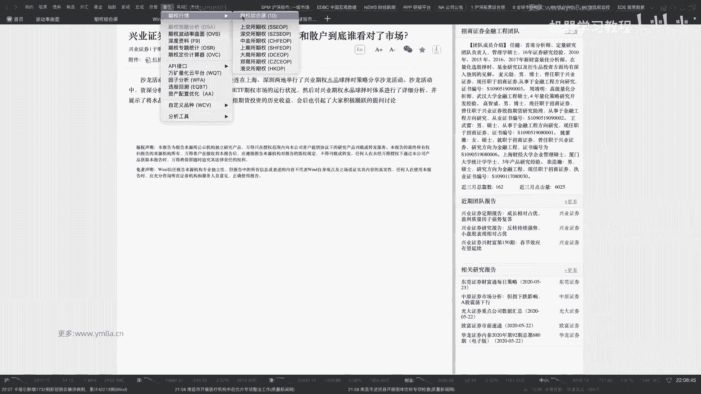

嗯。什么是不是还没有啊，问的了。😔，对，其实要做的事情就是说我需要有一个界面去同时的去。我就是说我在做期权时候，我不关心我整个期权portfo的价格是什么呀？就是说我不关心这个价格走到什么样的地步。

我还是说我们更关注的是希腊字母，就是说我希望有一个界面，就是说去能够去呃。

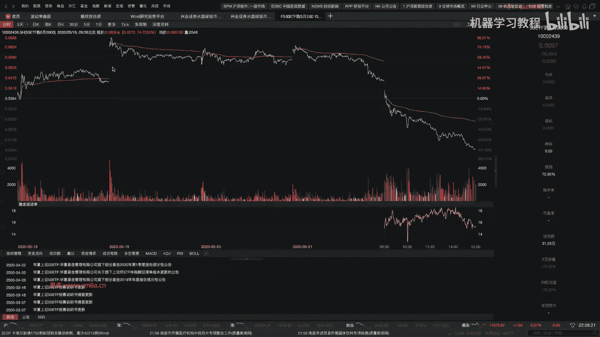

我还要看windows版本，能够去盯到我整个portfoo的这个。诶。就呃就是我的portfoo里面的每个的其他字母会是处于什么样的一个状态状态。哦，对。嗯0。挺迟怪了。嗯。

就是说呃我不关心具体的一个期权的合约位是呃，什么样。对，但是我要关注，比如说我的data暴露是不是在我的呃在我的预定的风险敞口之内。然后要关注我的呃伽ma上，我是正伽马还是负的伽ma？对呃。

为什么这么快？这个。😔，我要删一些东西。怎是。对，就是我需要关注我整个投资组合的呃，就是为什么关注geks。因为其实geks其实也就是我的风险指标了。就是因为我事实上我根据我当前的greeks。

我是可以去判断。比如说当市场波动1%的时候，对，那我可以判断我大概会在deta上亏多少钱，赚多少钱，在ma上赚多少钱，亏多少钱。然后我知道波动率每上涨1%或者下跌1%的时候，我的总的投资组合是多少钱。

就是说按照我们之前这样一个归因的。

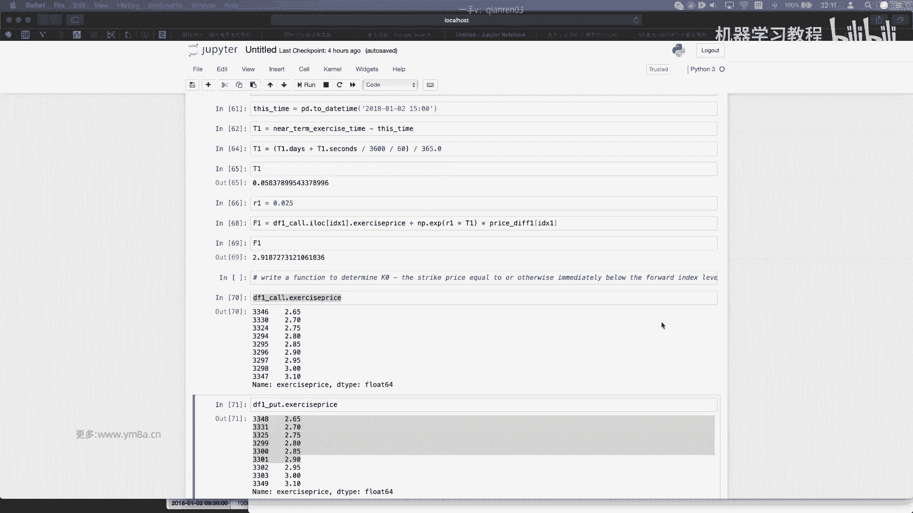

按照我们之前的这样一个归因的这样一个方式的话，算了我们就不看就是之前的这样我们做完的这样一个归因。我即使不去具体的盯我有哪一个portfoo呃不我有钉我有哪一个期权。

我都能知道整个投资组合大概会以什么样的方式去变动。比是说其实期权交易的不是说它本身价格，我们一直就是在交易它的各个希腊字母。对，这个是期权相对于我们的呃CTA或者是股票交易的这样一个巨大区别。

我们其实不care它的价格，我只关关注我的这个的这样一个风险这样分布。因为当是不是有人要问说我是不是可以对冲我所有的风险。那有风险，那它就是一条直线，就是一个0。对，事实上我嗯如果不加现货。

也不太可能去完全对冲所有的希母的风险。对。就是我们是希望是肯定是我要暴露一部分希腊字母，然后通过这部分暴露的希腊字母能够去换取我对应的这样一个呃收益。OK好不好意思，刚刚有同学提到是呃对。

这部分的话就是说呃转波动力暴露那边讲一讲。其实呃O是这样，就是嗯有同学提到就是说我们最简单就是说，如果说我认为就是呃即使说就比如说我认为就是说接下来我们要去考虑说我不知道接下来方向会怎么动，对不对？

但是我知道接下来会有大事情会发生，它一定会有大的变动。那其实对于钱基本上而言，我要做一个呃就是long就是一个多波动力，那多波动率是什么意思？就是说我希望的就是说我有我的。

浪我的我希望在我的viga上有正的保露。然后。对，但是我不需望不知道有什么方向暴露。那比如说那现在的话，其实你无论我现在的话，我不看这个因为到期的太近了，就是我看稍微远一点的下月的对。

那我那我说我知道个大的暴露。我本质上来说我可以找到品质的这样一个合约。比如说650这2个630，我可以通过等delta，就是他们的就是希腊字母的delta，就是说这个是0。5，那这个的话。呃，0。

44对我可以通过等deelta的方式去去配。比如说这个是配44首，这个配55首，那么这样两个乘起来，他们的delta就加起来应该是0。那通过这种方式的时候。

说我这个时候说我可以说我整个整个投资组合在方向上没有暴露。但这个时候我是浪浪就是浪的。因为我们的就是因为我我都是在去买入这样的期权合约，我两边各买。对，那这个时候即使说如果说第二天真的是有大的去变动。

那我这个时候收益可能就是说刚开可能可能会有一些就是说因为大部分是干嘛，然后如果说是波动力啊，如果是快速下跌。那这个时候你会发现。可能说。即使是认购的这样一个期权，它也不会跌太多。

因为我这时候波动率上涨了，上涨了很多，这是候抵消一部分抵抵消了就是。抵消了就是我方向上判断错误所亏损的钱。但同时我的put腾不仅是方向上看对赚钱，同时我也由于我的波动率快速上涨。

导致了我额外的赚到了一部分钱。就是大家也可以看周五的这一天的话就是。就这部分波动率上涨，事实上是给就之前其实它的斜率就是变化速度没有那么快。但是由于波动率快速上涨，实际上这一波收益是非常可观的。

大概是从64%一下子就到了126%。对，所以期权经常会是有这样，你可能觉得前面赚的不是很多。但是一旦波动率上来的时候，那整个如果你方向做对了，或者是你的微达暴露对应，那事实上是非常赚钱的对。

那当然也是说你你是可以估算出来这部分到底是赚了多少钱。因为你微改的话，比如说你这边。我知道这个它的V感是多少，就你是让你波动力的话是从。呃，19。6涨到了21点2219。6到上2。4个点。

然后你乘以一下V感你实际上就是用我们刚刚那个偏L的H倍的公式，你就能估算出我这段时间大概在波动率上赚了多少钱。事实上呃对，所以这部分叠加波动率的方式是非常就是夸张的一种方式。

然后更多人其实说我就是无脑做卖方嘛，卖方你说是赚时间价值没错，但其实你最终赚的钱是我希望这个期权，它归零就应它最终归零，那归到零的话，其实也可以看到它的implyable也是也会是零。

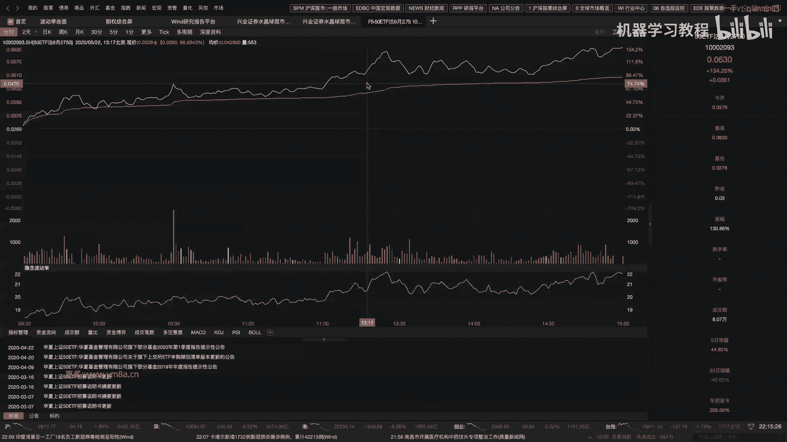

就是。嗯大家可以看。这是我快到期的会员，事实上就是哎这边的时候，它的implyable都已经是0，就是。呃，因为这个他这个是深度食指，就是深度食指为0的话，还会有一些。不一样地方。对。

所以还不能单纯的这么说。但是我说他到期的时候，如果真的是。因为我最终是说到如果他真的是到到期，就是它的价格是零的话，那本质上就是imply，那肯定也是0。因为代表市场对它没有需求。

我最终赚的是我的realable跟我implyable的这样一个差。呃，就对这个就是不是来able，是我卖出去的那个时刻的impable到最终implyable为0的这样一个场。

这是一种就是我做卖方常见的这种一种方式。啊，其实其是做期权不一定说是呃我一方面说如果偏向高频的话，那我希望我的模型定价更准确一些。然后我交易的更快一些。那其实更重要的是我还是要考虑我整个持仓的风险。对。

就是做好风险是比较重要的，就是本质上我就是拿我的风险跟我的收益去去进行一个tra off嘛，对吧？所以我觉得气成是我个人比较喜欢的这样一个方向，也是非常有意思的这样一个方向。呃。

尤其尤其现在日数期权合约多了嘛，然后同样的是深交所也有3001TF期权。然后上交所也有31TF期权。那我们是不是可以考虑就是呃两个交易所之间进行套利呢？呃是肯定是可以做的这样的事情。

那不那你就要去 price去看看他们到底能差多少。对，当然因为是上深交所现在流动性是不如上交所的。但还是可以去做。对，然后你要注意两个交易所之间的话，大概会有几十毫秒的延迟。对。

就是这个是由物理距离去考虑。事实上就是你交易去托管的话，你要去考虑怎么去优化整个线路。对，即使说我是走的是交易所的，就是我走的是电信的专线。那要考虑就是电信的专线，比如说同样的是从深圳到上海。

他会不会从深圳跑到江西，然后又比如说又往西部兜了一大圈，兜兜转转的回到了上海，还是说你考虑你这个专线到底是比如说非常值的从深圳跑到了上海。那这个之间也会有加差。对大家竞争已经竞争到这种地步了。

所以我们不是做高频套利的，就还是不用考虑去赚这种钱，还是安安稳稳的就是。我肯定是要去承担风险的，我不可能说做偏向market making，实让上我就是快进快出，可以说是承担的承担的风险。

他就不是在这些，他肯定是考虑我的就是inventory的这样的一些呃ris。所以就是每个人交易频率不一样，所考虑的问题也是不一样的。然后当然我们作为个人，如果作为个人交易者。

那我肯定是说我认为市场我对于大小盘是有风格的偏好。我说那我是不是可以比如说多大盘空小盘，当然这个还不是特别好。如果有中证500的期权，那做上来的话，那事实上会更有意思一些。然后以及就是中金所的股指期权。

它手数会比较大。那可能大家看到就是成交量会小一些。但是上他的一手的话。哦，我因为我没有交一个股值期权，他确实还挺大的。他的一手我不知道是多少钱。就是说对它是因为它的underline是呃沪沪深300。

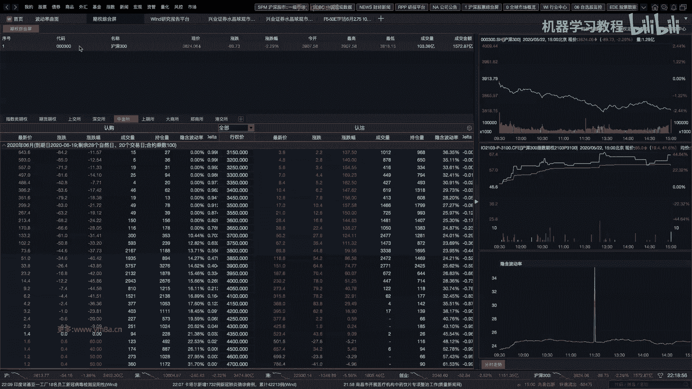

的指数要注意我们的我们的交易的underline是沪深300的ETF。那其实本质上ETF跟呃指数之间可能就会有一些就是ETF是不是有溢家，对吧？这里面其实呢差别的东西还是挺大的对。

所以其实整个期权的策略方面，我觉得维度是比较多的。我不管是看方向还是看波动率。对，还其实都有各种各样的策略。然后做的当然也有人做的好，就是说就是ok我就是一把锁。

就我我了解到的就是这个比较夸张的事情是就是有人是从660万做到了二十几块钱。那可能我觉得就比较奇葩，就是不断的买嘛，买完都归零。对，那这个是非常夸张的事情。你看现在这个合约是2块钱。嗯，我们看日线吧。

就。人家也是有光辉的时候的对。然后对，然后如果。就是现在是3。8块的话，你看3。9块的期权现在是60块，但是。最高的时候，你看这边有1100多。所以就是如果一直是无脑买的话，相对来说会比较吃亏的。

上市的时候还有1000多呢，现在只有。大概有程要规定了。如果后面几天没有暴涨的话。所以就是期权等交易的方向还是比较多的。嗯。好，大家还有什么问题吗？就是我想讲的期前的两节课，基本上就是讲到这些。

因为其实具体展开下去，每一个策略都可以讲很多的很多东西。但是就给大家指出一个方向。然后其实如果有了数据，有了研究工具，接下来很多都是大家自己的事情，就是嗯。嗯，对，就是具体怎么是。

具体的怎么大家去做研究了。对。

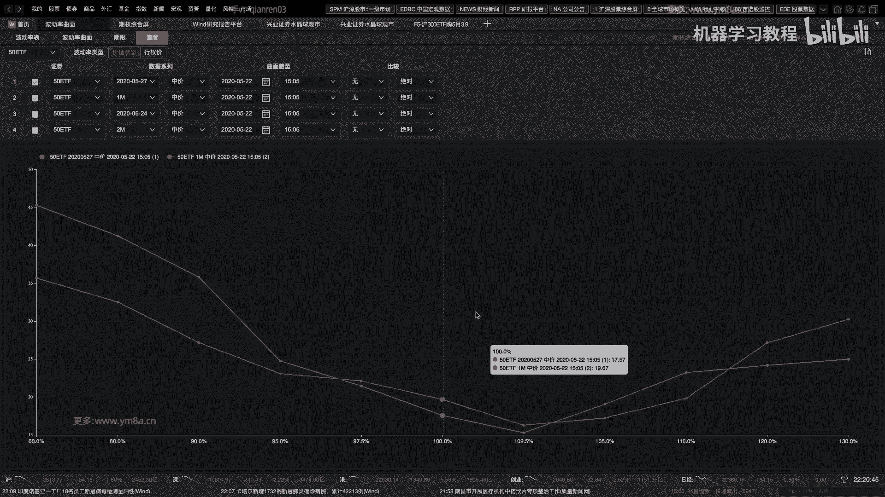

然后这边有一个。但你这边有一个问题是。哦。这边有一个问题是等一下，我把这个拿过来。嗯。这边有位同学的问问题是，我们看某个希腊字母对PLL的贡献，需要控制两个合约的其他希腊字母一样在比较PLL。呃。

对比这个问题，我可能。没有太看懂。呃，就是你去看希腊字母对PLL的贡献的话，你事实上就是我每个合约我都可以去这么算。对，每个合约我都可以去看到。因为我这个时候算下来PLL的话就是。这是我单纯的偏啊。

当然就是呃要注意的是，就是你不能严格的说是说。呃，比如说我的伽马跟美感之间没有任何关系，但这这显然是不对的。就是你事实上还要去，我不仅有二阶，我甚至还要更高阶的，然后甚至还有所谓的。

shahadow的这样一些呃greeks。那这里面就是呃我如果对这这份感兴趣，我推荐大家还是去看这本书。在那边看这就是黑天鹅的作者，其实他是个这这本书我觉得是非常经典的。然后他其实讲到了很多。

就是说在不是理想的市场情情况下，我怎么去做对冲。这部分应该如果是群里做期权的小伙伴应该有不少可能都接触过。对，或是应该是会比我熟悉。对，因为我没有怎么去做过exult这些期权的对。

就是如果呃考虑去这个的话，我就就我建我建议是去仔细读一读这本书。呃，其他因为我讲的更多的是偏向于就是说主流的是在。呃，买方里面我们怎么是去做期权的这样一个交易。对。

尤其是当下以50ETF跟沪深300ETF为主。其实这些都是我们当时工作其会做的事情，只不过说是会以这些比我们当前展现的可能是更完善一点。对，然后模型研究都会更精细一点。

然后我的定价跟风控都会有更好的自动化的工具来去处理这样的事情。然后包括我的整个的data，我整个的数据流也会有更好的工具去来完善，但整体的框架是不变的对。

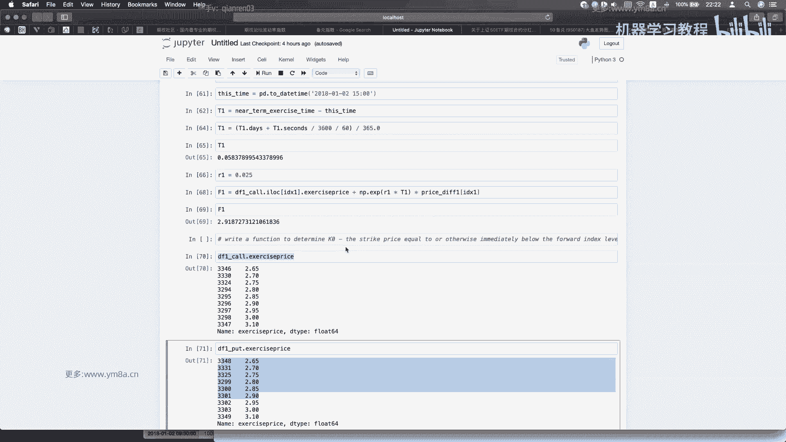

就是其实我们关注的都是这些东西，然后对。

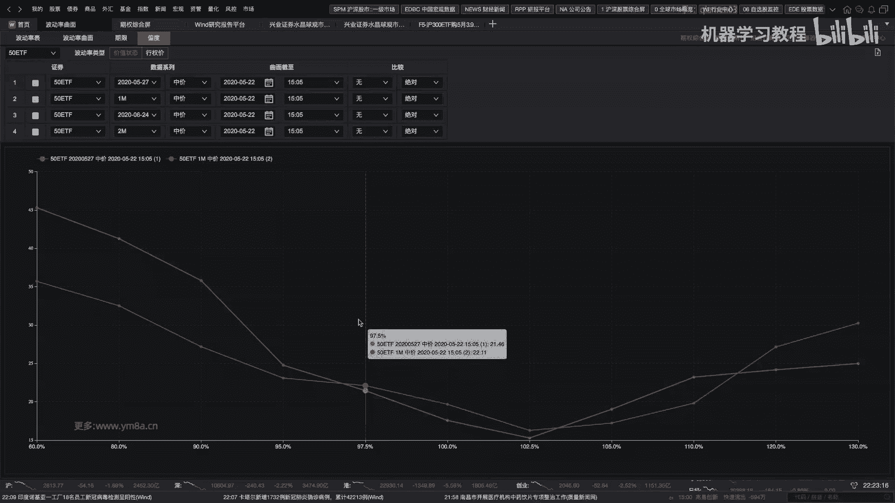

嗯，好，这节课其实到这边就这么多了，同学们还有什么问题吗？然后关于作业的话呃。我想想就是要真的把这一套东西都实现下来，我觉得没有几个愿因看不行。嗯，那我觉得大家就尽量吧，然后就是。

就是指数其实只出几个东西啊，就是一个是vol index怎么去算，然后是sll skill index，然后是由由此衍生出来的期权的这些。哦。skill跟voltatity index都算是都算是因子。

然后还有其他的水晶球里面提到的各个因子，大家都可以去做研究。然后有了期权的合约的。然后有了就是我们那个的gs跟implyable，我可以考虑去做呃曲面的套利。对。对，其实这是两个比较主流的方向。

然后如果说有人说我想测试，就是就我们刚课上提到的就是50TF不是有那个呃cover call就是对指数嘛，对指。那大家是不是可以其实我们有了现在这些工具。

我们完全可以自己去做这样的一个对指数对除了对指数的话，我们还可以去做其他的比如说我做去做一个这样一个指数。然后有人说我就想多波动力，那我是不是可以做一个多波动指数。那当然可以啊。

我就定期的就是说我每天还是我隔一段反正我每天去调仓，我就是去浪这样一个呃呃多波动力这样一个组合对我就是说在平的我就是按照等ta或者是等权力的这样方式去做那我每天去一次。

然后长期关跟踪这个指数的会怎么样我觉得这个都O这市场我们以前去做过。然后相应的我有然后我还。

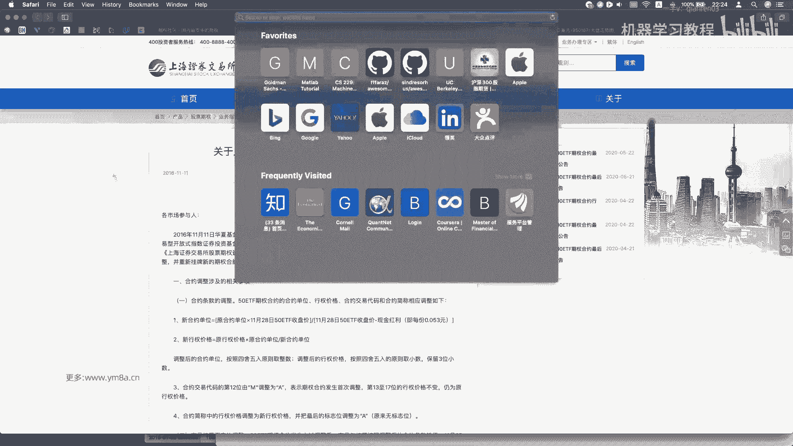

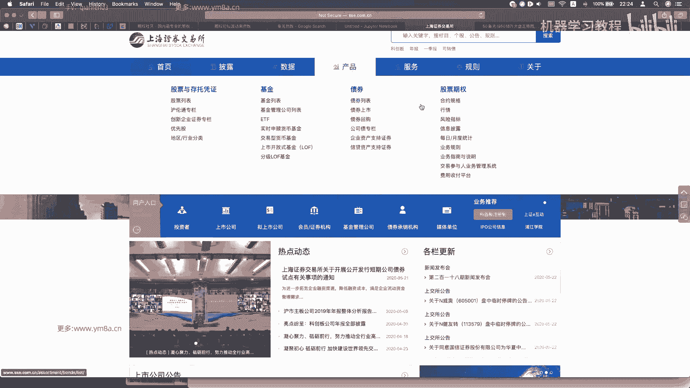

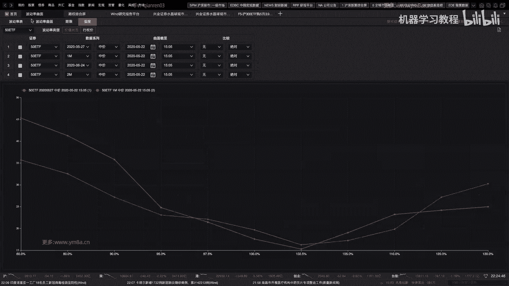

就是strddle，我就是不是说是品质的，我可以选稍微虚质一点的，然后看一看他的表现会怎样。对。然后然后我还可以，比如说我就是我就是长期的就是卖期权嘛，但是不是正常的卖期权，这个非常稳的。

但是就是一直卖一直爽。然后一早火葬场的就是这样，然后哪天就是implyible上来 boom就炸掉了嘛？实上就是卖期权的对，平时这日子非常爽，就是每个月你可以每个月挣钱。

然后高手吧你是每个星期每天挣钱都有可能。对，但是一旦就是你出现了黑天的时间，就是整个po都爆掉。那我是不是可以去。

做一个这样的一个 option这样一ex长期去跟踪近远月或者是更远的这样一个期权的ance，这这这都是我们可以去做，并且是市场也有人就是在机构里面去做这样的事情。然后然后然后以前如大家自己的IT的话。

其实我价公利能不能利空间存在我不能完全说没有研究过是有，但是着时间底可会越来越难。对，尤尤尤其随着大家交易系统进化，你想要抓住绝对无风险套利的这种机会也是越来越小的。

你当然可以就是不断的去拼IT我把托管当然是都是必须的然我还要去升级然后前两看到ber们做挺有是就是说当我的行情没没如记得不是还没有收到网卡完全到网卡。那我怎么把这个行情去给解析出来？对。刚刚我也蛮奇怪。

就是说不应该大家都不用网卡来。解析行情了吗？不是都用硬件来解了吗？当然what我只能插一句，其实就是。对，尤其是做market making方向，我们对于行情跟整个系统的稳定性是有非常大的这样一个需求。

对，所以就大家看，就是看结合自己的兴趣，然后跟自己想要从事的方向。对，都是可以做。我觉得期权领域是可以做很多有意思的事情。尤其随着中国之后。

中国中国记得现在50ETF还是沪深300ETF已经是世界第二大还是第三大的ETF期权的产品了。其实交易量是非常非常活跃。大家看一下一天对一天几百万的。对，这是非常夸张的事情。四。Okay。这个是。对。

反正就是数据都给到大家了。然后呃我想想如果还想要更新的数据的话，我是不是啊得跟老师申请一下，再去买一些最新的数据，这还还挺贵的，就是对。呃，万德的话是可以慢慢倒，但是效率比较低。一般万德我们要做的。

可能就是每天去取一下数据，然后跟我们数据库或者我们收到的数据去对一下。好的，这节课基本上就到这儿，同学们现在还有什么问题不？呃，put流动性差点的OTC唉，我记得我们群里有做场外交易的选手啊。

这个是不是可以出来给大家解答一下，就是put流动性差点的OTC市场呃，这个我不知道，这个讲真的我不知我我在我在场外市场做的就是绝对套利就是我都不看put我甚至可以说我就是相同价的合约不同券商之前给的报价都会差的刚开始的时候差的非常离谱。

那这个时候就是。对，只要你勤快的就可以去做。这个这个同学这个可以有哪位同学可以替我解答一下吗？或者我们留到下次嗯。呃，让我想一想嗯。场外的话put就场外主要是因为就是说波动力的差的盘口会比较大。

可能比如说一个一个波动一报20，然后就是我买的话，你只能按照就是说我卖的话，你只能按照20的波动西去买呃去卖。然后你买的话，你可能波动率报价是30。那这个这个其实是比较就是差。我只是举个例子。

就是差的非常大，想要绝对去做put的话。嗯，我直觉是不是特别可能，当然也不是说觉得就是说你本质上不管你是做coparity的话，你还做其他可能。都是要看对方报价有没有问题。对。嗯。

嗯这是有可能的对我我我不太确定。这个我真的不太确定嗯。好，这位同学在之后我们可以继续交流一下，风险很大。对，是。😊，对。并且对你还涉及到在现期货市场去去对冲，对吧？然后。

至至少CC我我们之前做的交易的说我都我就是同一个合约，在不同的券商闭了 ask都能去crose。那我这个当然就是无脑的去把它给买下来。好的，那如果没有什么问题的话，今天也10点半，让大家去早点休息吧。

今天我们课就先到这儿。好的呃，谢谢大家。

