# 2025最新AI量化交易实战教程，三小时入门到进阶！清华计算机博士讲解，零基础也学会了（AI人工智能丨数据分析丨数据挖掘丨机器学习实战丨深度学习丨编程） - P7：第八章： 股票多因子框架1 - 机器学习教程 - BV1ujk4YKEw9

喂喂各位同学现在可以听到吗，好我们再稍等一下啊，等大家稍微人再多一点，对我们等一等其他的同学，嗯哎期权的作业，现在大家做的怎么样了，啊已经到课的同学敲个一，让我知道大家已经到了哈。

对然后今天可能大家屏幕看起来有点奇怪，是因为啊我这边没有用一个外接的显示器，对，因为我现在在三亚休假，所以就是没有一个外接的显示器，然后这样屏幕分辨率可能投过去，大家可能会就是两边有点黑框，对。

请大家稍微多多包涵，对最近也是就是确实我工作也比较忙，然后找了一点空闲时间来休息一下，然后我看大家最近做作业呃，似乎好像也是就是很交作业的人也不是很多，也可以理解吧。

确实就是我觉得嗯就是在学这门课程的时候，大家不要把它去当做一种负担，对，因为呃就是大家本身，不管是学生处于求职的状态，还是说是工已经工作的人士，然后想要去了解这个领域，大家都是出于兴趣。

或者说是想要出于提升自己的目的，来去上这门课的，然后我觉得大家心态上嗯对嗯，就是大家心态上可能不就是即使说前面的课程，觉得学到现在，我们现在是第八课，总共是16节课。

然后如果是觉得其实到现在觉得还是挺困难的，我觉得是呃非常正常的事情啊，因为我可以说就是呃目前讲课确实是呃，包括有同学反馈说可能没有特别听懂，但确实是因为讲课的内容，说是把我之前工作的很多东西是去。

相当于说是做到压缩的过程中，就是把它压缩成呃现在这样一个课程，所以其实可以说是其中的信息含量，还是比较高的，嗯很有可能就是说之前，比如说简单的一个回测模块，我们只花了一两节课去讲一下。

但是之前就是怎么去形成，现在这样一个呃回测的框架，其实是应该说是花了比较长的时间，可能每天都会有相应的去迭代，也不仅仅是我一个人，可能有公司好几个同事，大家一起再去完善这样的一个回测模块。

所以如果大家觉得有困难，我个人觉得是非常正常，也是可以去理解的啊，对然后觉得嗯但因为这个课程会有录播的视频，所以其实如果说觉得前面有什么，没有太懂的地方，可以回过去再看，然后对如果还有困难的话。

可能确实是需要自己去多多的去啊，再去去研究，因为有一些细节的东西可能课上只是提了一下，然后在实践的过程当中，你可能会发现有一些问题，对我觉得这个是非常正常的事情，那这个时候就需要有自己。

对于嗯自己对于就是说整个的程序，或者说是呃写的东西，会自己需要有一个基本的判断，就是说这么写是不是可行，或者说这么写到底有没有道理，对，就是很多很多事情，可能它不是一个确定性的答案。

它是就是他是是他是说非常依赖于你的，可以说是依赖于你的实验结果，或者是怎样对，因为呃就是同样的是在量化交易当中，你采用什么样的数据库，你到底是用SQL还是NO SQL，还是还是说你就用文件的方式。

那么我觉得是非常取决于你想要交易的策略，然后就是说但是事实上就是量化这个东西，有非常多的理论的部分，然后也有非常多是就是偏向engineering的部分，然后呃在整个过程当中，就是大家要注意一点。

就是说做量化呢，其实说是需要自己是有工程师的思维，就是说我们面对每天面对新的问题，我们会去想办法去不断的去解决这些问题，然后对它跟开发工程师不太一样的地方，说是我们可能嗯在成熟过程当中。

不需要去呃去重复的造轮子，或者是去写很多的呃业务代码，当然初期的时候，可能我们需要自己去形成自己的，这样一个研究的框架，有基本的工具跟数据处理的方式，但是后期更多的话，还是大家要去多多去主动思考。

就同样的来说是去挖因子，比如之前我们提到呃，国泰君安的190一个因子，然后今年其实我们还会再去接着设计，就是有很多的东西是偏向研究的东西，但然后但是又需要，又需要一定的工程能力的实现。

所以这两者的结合可能会我会觉得说是嗯，会导致说在目前情况下，大家觉得学习会有一定的困难或者说是挑战，然后我也看了大家的魂，就是上了七次课之后，对于整个课程的回顾呃，我我想强调的一点就是说。

如果大家觉得课程当中有任何，你听不懂或者觉得困惑的地方，我觉得需要及时的把这样的问题给提出来，因为我记得可能在期权讲课的时候，我第一次课讲说我发现有一部分同学还挺熟悉，然后我在群里问了一下。

说我问了一下，是不是大家都对于本次的内容比较熟悉，也没有人回应我，然后我就会我就我就我就我就会默认，大家对于这一块东西都比较熟，那我们就很快的把这个东西就给过掉了，对啊。

但是是课后又会看到有一些同学他给我的反馈，说是对于很多东西都不是很懂，那我觉得这样可能其实就嗯，然后课程还没有提出来，那这样我觉得可能就不是很好，因为这样的话嗯，课上的两个多小时或者三个小时呃。

就是可能这样会浪费你比较多的时间，然后如果是没有相应的基础去呃，跟这样的课程的话，那收获也不是很大，那课后可能还要花更多的时间，所以我的意思是说，我会根据大家的理解能力跟相应的基础知识。

会对课程去做一些相应的调整，哪怕就是说我们放慢步骤，然后但是让大家就是啊清清楚楚的理解了，我们这节课所要讲授的内容，我觉得可能这样长远，长远来说会去能够帮助到大家，因为包括就是上课到现在。

大家肯定会发现，即使说我们是去交易不同的呃资产类别，但你会发现其实背后很多的思路是非常类似的，可能说股票我是多因子模型，期权我是波动一套类的模型，但是其实背后有些很多很核心的东西。

都是思思考的方式都是非常一致或是类似的，本质上来说，我都要去通过去找因子的方式，去提升我对于整个市场理解的一种效率，也就是说我去找到能够真正去影响市场的，这些因素对，然后我们会去做收益的预测。

然后同时我们也会去做投资组合，然后去呃降低整个市场的风险，去降降低整个持仓的风险，所以嗯不管是，然后其实说，不管我们这里面提到的每一部分内容，其实呃我多次提到过，在专业的公司都会有很多的人去处理。

然后我们这门课程还是说对，希望大家就是说对于这方面东西有一些了解，然后对，然后我今天有个提到，就是说其实就是说呃，因为我自己其实之前没有接触过太多的股票，多因子的交易，我是有帮同事是做过一些研究。

但是其实对于这一块，我也不是说有非常的自称或者说熟悉对，所以说呃，这两节课可能说更多的是跟大家一起去去，带着大家去完整的去理解多因子，整个模型到底是什么样的东西，事实上呃。

呃就是作为一个股票多因子投资的框架，它是有非常丰富，那就是丰富，而就是说是或者说是充实的内容的，对，就是我们今天可能说，我们今天我个人额觉得就是说比较好的一个，approach的方式。

是说我们先是去呃整体的去去理解一下，我们整个多因子呃，多因子模型体系到底在做什么样的事情，就是说即使说我对于整下面有些东西，我不是很了解，但是我知道它每一步大概是在做什么样的事情。

然后我们再去去逐步的去用代码，去把整个的细节去给补充起来对然后对，然后其实股票的数据其实也是比较坑，就我最近最近，其实比如说包括今天可能没有太多代码，然后但其实说我在处理数据上面，还花了比较多的时间。

就是今天先给到的大家是呃，股票从2010年到现在，到今年的3月12日的一个日收益率的数据对，然后之后的话还会去下节课，应该会慢慢给大家加上，就是说呃就是说除了交易的数据，我们这边还会涉及到的。

就是嗯其他的有关呃基本面的数据对，提到这里面的话，其实这这里的数据是有比较多的坑在里面的对，因为不管说是从万德还是从其他书源去提取，然后经常会出现的就是说呃，如果说财报的更正对。

但其实每一家数据库它是怎样去处理逻辑，那那其实那这里面其实会带来一些，我觉得个人会觉得会带来比较多的问题呃，举举一个简单的例子，比如说呃我公司的净利润哦，在当年的年报呃，3月30号之后，我公布。

4月1号我公布了说今年的净利润是多少，那么我公布了之后，理论来说，我的就是我的数据库里面，会去更新这样一个数值，但是如果说在5月份他的年报又更正了，说我的净利润呃，其实不是不是A其实是A加100。

那这样子的话呃，我们再去做回测的时候，可能很多数据库，我拿到的只是5月份最新的这样一个数据值，什么意思呢，就是说我在比如说是今年的4月1日，我拿到了，实际上是5月1日更正更正的这样一个数据值。

我拿到的是这个公司最新的净利润，但事实上在今年的4月份的时候，我是不知道他，今年他真实的净利润是5月份这个数值的，就是说事事实上就是说我能做，我能拿到的还是今年4月份的这样一个，错误的净利润对。

那那那如果说我们在，就是说在数据采集过程当中没有注意到这一点，可能我会说OK嗯，我用了一个比较对，我用了一个，事实上就是就是用了一个未来数据了，然后觉得拿这个因子做出了一个非常好的。

就是说这个因子发现测试下来说效果非常好，那这个实际上就是那可能在实盘的过程当中，就会出现比较大的问题，所以其实这个里面就是呃，因为涉及到基本面的数据，股票的数据采集是会比其他的。

如果是比期货跟期权只涉及行情数据来说，是相对来说是会复杂一些的，然后提到这一块的话，我个人觉得就是比较好的一个方式，就是说呃，不管我们是从万德，还是从其他第三方数据库提取。

其实最好的方式是说我每天都会去把嗯，当前所有股票的这些呃，能够取到的基本面的数值，会把它存当天的这样一个数值，即使说呃，然后嗯随着未来就是说如果说是万德数据库，或者说是从你从财报里面去提取这些数据。

但这个数据源更新了，那么在更新的当天，我就会获得一个新的这样一个数据，但是在历史回测的时候，我仍然是用当天的数据，而不是使用最新的这些数据，所以对这个里面是想跟大家提到的，就是股票的嗯。

股票的就是基础数据采集，里面其实是有挺多的一些坑，然后考虑到大家有没有数据原因，就是应该来说，我会把就是相应的一些数据是会提供给大家，对我不知道刚刚提到的呃，这个有关数据的基本面的数据的这个这个问题。

大家理解了没有，OK好的嗯对，然后就是呃上到现在的话，就是在正式讲今天的课程之前，还有大家还有什么想的一些问题，想要去问我的吗，然后刚刚这位同学是说提额最近一次的作业对，这个是嗯就是一个是对。

就相当于说是你需要把期权的这样一个，定价的模型，然后然后其实包括那个SABR的套利，然后我建议大家还是去去尝试去做一下，就是把这个整个的SB，那就基于随机波动率这样一个套利的模型，去回测一下。

看看效果对，就是对，所以第一步是我们先需要有就是期权的呃，imply able跟GREEKS的数据，然后我要是然后是基于这样的数据，我要再去去建立我的波动率的，这样一个套利的模型，对。

所以呃这应该是嗯对，就是第七次作业是没有明确的说了，就是没有说是需要怎样对呃，就是需要把SABR模型实现，我觉得是看大家吧，但因为确实那个整个模型实现起来，工作量说多不多。

但是就是说如果是完整的非常顺利的实现的话，其实应该不需要太多时间，但是考虑到同学们基础不一，其实就是能做出最后的净值回撤的曲线，我估计还是要花一些时间去探索的，但这门课程也不是说是像学校里的作业那样。

所以可能更多的是说对，就是大家基于自己感兴趣的内容去探索吧，对，好那嗯对，然后我想问就是群里呃，现在就是这么多同学对股票就是比较上这门课，当初是因为是想交易股票或者是其他的呃。

股票这个品类的同学让我了解一下吗，就是有多少人是想要去上完这门课，是自己去交易股票的，OK那可能就是OK对，那可能大家对于相对来说，股票可能是大家交易接触比较多的，这样一个品种，对。

然后对我我看到就是说，因为啊岳鹏老师感觉就是他其实对这块来说，自己实习可能也也就是做过一些多音字的模型，其实那如果课后大家有什么问题的话，如果不能解决解答的话，大家也可以去就是去问问岳鹏老师对。

然后嗯嗯今天的话，OK就是呃首先说有几个东西吧，就是一个是一个是就是说呃，一个是就是主动投资组合管理这本书，大家可以自己去找一下中文版或者英文版，对这本书我觉得还是比较经典的。

然后其实华泰里面他这个研报里面也有很多，去参考这本书，对主动投资组合管理呃，对然后呃然后华泰的这篇多因子的研报，我在课前发给大家，那它相对来说是偏向低频基本面一些的因子，也就是说这部分OK。

就是说固然是相对来说是有比较重要一部分，然后但是这两年去，或者说这两年其实大家更为关注的可能说是呃。

大家可以参考这篇研报，就是说会基于说交易额日级别，甚至是我采用日内的信号，做一些T加零的这些因子，那这些就是说嗯，就是短周期量价特征的多因子选股体系，那其实这一部分的话呃大家应该有，如果有了有了解的话。

其实是最近行业的公司，大家会做的比较多，因为因为相对来说呃这部分的因子来说，嗯主要我觉得是有几个优势吧，一个是呃呃相对来说我数据量会比较多一些，因为我每天或者我每天就是固定的频率，都可以去采集数据。

相对于华泰这边研报提到的月评的数据，我用日评的数据，相对来说能够去挖掘的东西会更多一些，然后还有一个就是说嗯，他这个交易的多因子，其实会跟CCTA里面的因子挖掘会有一些类似。

其实之前我们讲就是因子挖掘也会提的，也用到了这篇文章里面，就说提到这里面有给到很多的因子对，所以他这篇文章里面大概有200多个，短周期的阿尔法因子，然后对，然后还有一个就是说当我的数据量大了之后。

其实说我可以就是说去不再去，可以就是说利用一些非传按传非传统的方法，比如机器学习的方法去进行挖掘的挖掘，一些因子，包括哦也有人去用遗传的算法，遗传算法，去基于这些因子去进一步的衍生迭代啊。

对这是相对来说是比之前的，就是嗯嗯比之前的呃，就是基于乐评的因子来说，这是他的一个比较重要的优势啊，当然这个因子会呃，我个人会觉得就是说它交易型的因子很多，是非常依赖于当前市场的环境，什么意思呢。

如果当前市场交易活跃，有比较多的对手方的话，那么其实说我交易型的因子来说，可能赚钱的概率还是比较高，但是一旦说市场嗯交易量没有那么活跃，比如说正的交易量很活跃的时候，有1万亿的成交额。

但是如果说现在只有几千亿两三千亿，那么就要考虑说我这部分资金，可能我的交易的对手方都是跟我一样，去做这些短周期的阿尔法的，这些这样的一些呃资金，那么那么很有可能是说我可能会呃，不仅说没有阿尔法。

然后也有可能甚至会说去亏手续费，所以呃所以大家看去年各个基金的业绩的时候，也观察到，就是说呃当市场交易量很好的时候，大家都能去赚钱，但是随着说大家发现这个模型呃，赚钱的呃概率比较高，或者说也比较大。

能够提升的空间的时候，那其实大家进入的是非常快的对，所以会导致市场上在一段时间会嗯，就是说阿尔法会比较拥挤，然后大家的基金净值可能不会增长，甚至就保值暴涨，甚至会有一些略微的回撤。

那其实嗯大家可以去私募排排网，或者是其他相关网站上去，看到一些就是相关的做这些额那多因子选股的，然后就然后就尤其是叠加，叠加这种短周期量价特征的啊，这些基金的表现其实是能够看到一些东西的对。

呃然后当时我记得之前也说过，就是说市场，就是说相对来说比较成熟的一些公司的话，如果是用数据挖掘的方式，可能他们的多因子已经就是达到是千，这个数量级，甚至夸张了，我不知道有没有达到1万个对。

但是说几千个因子肯定是他们还比较常见的，但是嗯相应来说，这几千个因子可能不会说是那么robust，比如说我基本面的因子，可以可能说是过了几个月甚至一年，也许可能还得去交易，但是额。

但是就是说但是短周期数据挖掘出来因子，很有可能就是说嗯赚钱赚的很赚钱，赚的确实还不错，但是可能很快的就会发现，这个因子就会在逐渐失效，那么这个时候要基于现代的市场风格，去挖掘出新的因子。

所以在这一部分的时候，就会涉及到一些去嗯比拼的比拼算力，对他说呃，如果我的机器更强大，然后我是不是算法更好，能够去拓展出更多更有效的因子，对这部分可能也是很多，就是说如果是嗯大家是做程序员同学。

或者是做啊做这机器学习相关的同学，可能会觉得说OK，那这部分是不是可以结合我个人的一些优势，去尝试在这部分去做呢，我觉得这个是OK的，然后另外想提一下，就是说其实说因为整个市场是嗯非常大的吧。

就是说你完全可以考虑结合自己个人的特质，去考虑，说我到底在市场当中哪一个asset种类去发展，因为呃除了说是我去做交易挣钱，那如何去选好交易，就是说在整个交易生态链当中我做哪一环。

那其实这个也是像他也说，也是要去个人去选择的，它也是一个因子，就其实跟我们选行业和，就是说本质上来说就类似于我们选行业，选公司嗯是一样的，我们我们在我们在实际的，就每个人再去职业成长的时候。

也会去涉及到我说我选什么样的行业，我选什么样的公司，那放到量化这个行业，量量化这个行业里面嗯，量化这个行业里面，其实就是不仅仅说是我除了说自己做交易，那我可能还有说我可以去做研究，还是说我可以去做风控。

有各种各样的方式，哎那其每每个行业就每一个行，每一个就是小方向里面，其实都会有自己的阿尔法，对好的，那话不多说，我们今天开始就呃去设计一下，就是去我们去一起来了解一下，就是多因子模型是怎么样一个回事。

就是大家我不知道，就是说大家在交易股票的时候，诶，我首先问大家一个问题，就是大家自己在交易股票的时候，平均大概会持仓多少股票呢，嗯没有没有同学回答吗，就是大家都没有交易过股票吗，10~20 ok。

那我想问问这些，这个so有同学就是说你在交易这10~20只啊，10~20只股票的时候，你是怎么去选这些股票的呢，比如说你是这十呃，十十只到20只股票，比如说你是说我最近是炒热点，都是炒人工智能。

我就去买人工智能的股票呢，还是说我最近觉得呃芯片股比较好，我就买芯片的，就买芯片股相关的，还是说还是说我10~20只的话，我其实说类似于就是配上证五零或者沪深300，我就只配龙头。

其实刚刚想提到这些问题，就是说呃本质上来说你选择芯片股，或者说我选择行业龙头，本质上来说，其实这里面都对应着，我们实际上当中的一个阿尔法，或者说叫一个因子，曾经他们也许也许就是说。

大家如果有交易的更久一点，就是曾经在嗯呃之前有一段时间，就是说发现小市值成长性的股票比较好啊，那时候也有基金说我自己是做阿尔法，做绝对收益啊，对就是说我只选小市值的股票，他们会觉得说小市值或者说成长性。

这个是一个这个是一个阿尔法，但事实上嗯随着后来的市场风格切换，17年变成了白马股，一直在上涨，那你会发现那种小市值成长的这样的一个因子，就会去失效，那这个时候就需要实际上就是要去区分。

就是说这个到底是阿尔法，还是说是一个贝塔的问题对，所以其实多因子我觉得，因为我对这个领域也没有说是特别熟悉，但是从我个人角度来理解是说，多因子模型本质上是来说它给你提供一种框架，去让你去真正的去思考。

这个东西到底是是一个是是一个风险因子，还是说我是真正的一个阿尔法，对那本质上来说，它是降低了我们去处理信息的一个复杂度，嗯就是说我们之前来说，如果我们是看3000多只，3000多只股票。

每一只股票去分析它的基本面的信息，包括我去看他的消息，想要去看他的资金流入流出啊，那一直是看下来其实是比较累的，但是说多因子框，多因子多因子的这样一个模型，本质上来说。

我就是把我关注的这3000多只股票，把它去转化成，我只去看相应的这几十个因子，或者是几百个因子，那这样来说的话，我同事我要去考虑这样一个信息，就会去少了很多了，可以说呃大家看这样一个。

大家这样看这样一个就是呃下面还会去讲到，就是看这样一个公式，本质上来说，你看其实这个是一个矩阵的，一个矩阵的一个乘积，就是说大家可以理解为X是一个X是一个矩阵，然后嗯然后然后K是一个vector。

然后然后的话你其实X乘以FK是一个vector，你X乘以一个FK的话，你就可以得到啊，就是得到这样一个所谓的一个所谓的这样一个，呃就是一个收益率对，呃，然后嗯我们先如果这个就是说本质上来说是说。

我们从如我我们有很多个有，这就是说有这个股票的话，如果J啊应该是从一比如说到3500，那么嗯我们我们是事实上就可以得到，把把每一个股票的这样一个收益率，就分解到各个。

在就分解到就是这样一个capital k的因子上对，然后那这个时候我关注的对象，不再是这3000多只个股，而是说我关注我这K个因子相对来说，那我这样来说是不是就是说比我的，就是说我降我。

我能够有效去降低我信息的处理的，这样一个复杂度对，然后我们这边看到所有同学，其实对这个已经是已经是会有一些，那已经已经有一些金额，他事实上已经采用了因子选股的这样一种方式，对呃，但但是说机构当中就说嗯。

可能就是10~20的话，其实相对来说其实很难去对嗯，一些风险做到一些分分散吧，比如说我们对标中证500的话，那可能持仓正常来说，我觉得可能都要持持到100只的股票，对嗯对，当然让10~20的话也要看。

就是说我对标的是什么，如果说对，如果说是也，也许来说就是说个人在去交易的时候，我可能不会去严格的控制在某些风险上的，而某些风险因子上的暴露，我可能就是说我希甚至来说。

我希望他在这些风险因子上去有一些暴露，我觉得都是OK的，但是我们还是先系统的就是看一下啊，整个多因子呃模型是怎样去来构建的，对，然后其实整体来说就是说因子筛选，收益预测，风险预测组合优化哎。

其实说因子筛选跟收益预测，其实我们相对来说都会比较熟悉，因为之前我们有涉及到了，本质上来说，我们我们作为CTA来说，我们去Y因子做一个单个的因子，本质上我们也是去看他的IC跟他的I2，ICI2去。

就是说本质上看我现在的预测出来的因子值，跟我未来的收益这样的一个相关性，但是像但是说就是在股票多因子模型当中，我们可能会涉及，涉涉及到一些比较很多的一些东西，然后我们待会儿再接下来去一个个去看对啊。

所以说就是说在数据处理部分，然后基础数据采集这一部分，是我帮大家去完成了，其实这部分是相对来说在公司里面是比较花时，最花时间多的一部分，然后有兴趣的同学自己也可以去看一看，怎么去啊，采集这些数据。

或者说是去对吧，嗯事事实就是说可以的，可能的方式最为准确的方式是，我应该就是说我把上市公司历年的年报，每一次包括年报的更新跟改动，包括他季报的或者业绩预告等等，所有的这些东西去采集出来。

然后去对这些PDF或者是或者是PDF当中，涉及到表格进行结构化的处理，然后理论来说，这样子我是可以得到我每一步，在历史上每一步这样的数据，但是每一步就是说当时的真实的数据是什么样。

以及它未来的每一次改动，但事实上这样做的话，成本是非常大的，我觉得是有非常大的基金才会去考虑，做这样的事情对，然后那大部分公司，我知道都是去找相应的数据供应商，去拿到这样的一个数据。

然后当然可能也需要去做一些清洗，然后当数据单个数据源会嗯，单个数据源不是很准确的话，那还其实你可以去采取，就是说多个数据源去对比，然后如果说呃出现了一些差错，我们可能再去回到基础的。

就是公告和年报上面去处理下去，找到真实的数据进行修正，所以其实真真实的就是说况在工作当中，就是说如果没有专门的数据团队的话，其实数据基础数据的采集，就是是会花比较多的功夫对。

因为大家都不希望自己做出来模型是garbage，in garbage out对，但事实上就是我也是找朋友拿了一些数据，但是也不能严格的保证说，这个数据已经是百分之百正确的，但因为要去提升数据的质量。

事实上是要花比较大的建立的，然后希望大家也可以去理解对，那相应来说就是说基础数据里面，我们涉及到的行情的数据来说，是比较好去处理的，对待会我们也会去一起看一看，就是说我们现在给到大家的行情。

数据是什么样的对，然后然后就是数据的标准化跟识别有效的因子，然后接下来就是说对它会跟，就是其实说本质上，我们多因子模型其实在做的一个事情，就是说是在去做多元线性回归，那在多做多元线性回归。

其实前面的我们这些包括因子共线性，跟它的残方差异方二残残差的异方差分析，本质上都是去为了满足多元线性回归的条件，理解了这一点大家也会明白，就是我们为什么要去做这样的事情，对，然后计算因子的预期收益。

计算股票的预期收益，这个都是非常正常的事情，就是非常标准操作，本质上就是把因子的预测值，下一期的预测值我带到这个里面来，然后去算出预期的这样一个收益对，带到这样一个公式里来，然后呃接下来比较重要一部分。

就是风险的预测对，以及就是组合的这样一个优化，这个可能是我们之前没有回去强调这一点，本来就是说组合优化的话，呃，我们还是就是我们还是从就是先从股票的这样，组合的这样一个优化，因为本质上想就是告诉大家。

大家应该会理解，就是说盈亏同源，或者说风险跟收益是同源的对，所以说我不可能呃，我们当然尽可能是，希望说是去找到真正的阿尔法，而不是说风险因子，但是在某些时候的时候。

我可能会去这个之间是需要有trade off，也就是说当我极度的去暴露我的阿尔法的时候，我可能说我在我其他的风险层面上会去，有一些呃超出我的限制对呃，比如说嗯就是其实最简单，这就是4。3跟4。4的话。

其实大家相对来说看到后面会理解，就是行业的话其实比较好理解的是啊，对比如说我我我即使说我这个因子嗯，比如说我最近选出了一个因子，他买了很多的，其实本质上后来他看了一下投资组合，他买了很多的是芯片股。

那其实本质上来说，你在这个行业的时候，你对这个行业的就会有一个暴露了，那嗯如果说这个行业整体OK的话，我其实那我的表现一定会远超出大家，大家会发现我近期表现很好，但是如果这个行业最近不是很好。

那这样的我这样的，我整个的投资组合的回撤就会比较大，所以其实上就是说这个这一点，他说的意思就是说，我对我每一个行业都要去限制，我不能说因为我们按照A股的这种行业分类，按照中心的行业分类来说。

我要保证我单个的好啊，单个我投资组合里面，不能说我我持仓市值都是全部是，比如说是大金融，或者是或者是说信息技术等等，对说这部分需要大家去注意的，然后其实然后这里面还是说其实就是二次规划，求解组合权重。

就这一部分的话也会有一些改进的空间，就是我们可以用，因为可以用说我没用开源的求解器，但事实上来说，也会有一些公司会去考虑用商业的求解器，那么求解下来的结果嗯，是不是就可能会比我们用通用的一些。

开源的求解器，可能效果会去好一些对，或者说是求解的速度或者是求解的效率等等对，因为因为这个有的二次规划，不是说是一定有严格的，就是嗯就就是说可能我不一定能取到全局最优，我只能取到相对最优对。

但其实就是说整个的多因子的过程当中，嗯就是说我还是想强调的说，大家也看到，其实流程是非常复杂的，那么嗯嗯不要说是去期待，说我找到了一两个特别好的因子，我就能把我的整体的投资组合收益做的很高。

就是说他本质上来说，但找到好的因子，我有好的因子库固然是重要，但是事实上在做好投资过程当中的每一步，对于我整体的表现来说，也是非常重要的一个一件事情，尤其啊尤其这篇研报他提到的是说。

我们是按月读的数据去去调仓，那这个时候相对来说我的持仓的嗯，就是我交易的时候，冲击成本其实相对于呃，就是或者说我换手率不是很高吧，那这个时候我的交易的成本，相对于我整个投资组合应该来说不是特别重要。

但是如果说我要考虑的是每天去调仓，用T加零的这种方式嗯，就除了每天调仓之后，如果说甚至我会考虑去做一些T0的东西，嗯嗯大家明白T0是什么意思吧，对就是说那我就说简单来说，就是说我想做每天去交易的话。

那这个时候其实我每天选在什么时间节点交易，那这个里面可能还会去涉及到一些算法，交易的一些东西，那嗯对就是其实大家可以看到，就是说作为一个好的基金管理人，跑出一个漂亮的曲线。

其实是背后是有很多很多的各个环节的努力，涉及到公司各个各个部门，或者说是不同不同的同事之间的合作，对然后对，那其实说做量化比较有意思的一点，就是说我们可以对我们中间的每一个流程。

都会去进行去可以去都可以去不断的探索，它是一个无穷无尽的优化的，有无穷无尽的这样一个优化的空间，以及我是不是可以别出心裁，才就是引入一些新的一些流程，对，那就是这个里面就是说是比拼大家的智力。

以及投入度以及行业经验，对各方面的东西，所以我是觉得这个里面是比较有意思的，对好的额，刚刚提到T0的话，大家不太了解的话，就是可以去呃，可以去之后课后可以去搜一下，其实简单来说就是如果我们交易股票的话。

嗯那就交易期货的话，大家可以发现就说我当天买，当天买都没问题，那么呃股票的话呃，就是在中国目前持有的是T加一的制度，就是说我今天买入了股票，明天才能卖，那么所谓的做T0就是说我在啊。

我在比如说我今天同样是我持有这个，比如说持有00011，而中国平安我持有了10万股，我明天还想持有10万股，但是我是不是可以考虑说，我在今天持有的过程当中，我明天找到一个高点去把平安这个股票卖掉。

然后再在相应的低点把它买回来，那同样来说到明天结束的时候，我仍然持有相同数量的股票，但是持仓相应的成本会低了一些，那么嗯对就是目前就是比较做，大家做的比较多的，就是交易的嗯，就是多因子的。

就是股票的多因子模型，交易的时候，多多少少都会去叠加这样一些T0的，这样一些东西，因为本质上来说谁谁都希望，就是说我账面上持仓额没有变，但是可以用的资金会多了对，那么是事实上就这部分的。

那这部分做的东西可能就比较偏向于日内了，就跟我们这边的日级别的多音字还会不一样，但是但是说你其实是可以把T0去，叠加到我的产品当中去，提升我整个产品的投资组合的这样一个表现的。

那T0的话呃也不仅仅说是用机器，用算法我去去做，但事实上还有很多的人工交易员的存在对，但是个人对于就是人工T0交易员的嗯，我不好判断，因为可能目前来说，有一些人工T0交易员。

可能还是比嗯机器做出来的模型，可能效果还会好一些，但是长期来看的话，嗯随着机器的算力以及模型的不断的提升，能力的提升的话，人工交易员可能还是会逐渐被淘汰吧，这是这是我个人的一个观点。

因为如果从期货期货上的，就是说，之前可能还有大家做日内的这种高频的交易，但是现在期货上CCTA基本上还是以程序化的呃，交易为主，就是事实上就是说这个也可以看到，就是呃用机器逐渐取代取代人力。

是一个比较明显的一个趋势吧，对当然这是我个人的一个判这个人的一个观点，大家可以自行去判断对，然后刚刚就是提到了整个这样一个流程，然后嗯，然后其实这部分内容就是他的基本战略理论。

其实我是推荐大家就是如果感兴趣的话，是可以去详细的去看一看，就是说那就是看一下主动投资组合管理这本书，我觉得是非常经典的一本书，就是我嗯就是然后我们今天给大家提到的。

说说我们想要去做交易多因子的这样一个股票，本质上我相信大家都是希望我自己选，都是希望我交易出来的模型，是超出市场上的指数表现的，然后可能有人会说，就是之前自己交易的时候说嗯，这可能平时觉得还不错。

但是比如说比如说我平时选的股票还很好啊，市场跌的时候选的股票还涨，但是可能有时候就是说，在市场今天大涨200%分之三的时候，我自己选的股票反而涨幅没有跟上，没有跟上市场，那其实就是说呃。

其实这样说是说我自己选的股票嗯，就就是说对吧，可以可以说是说，应该说是在某一些地方是没有控制好的对，那其实我我们希望就是说做出来的模型是，能够说嗯当市场下跌的时候，我可能不一定说是完全的说反向上涨很多。

但是我希望来说是我尽量跌的，比市场的整体的大盘跌幅会小一些，但市场上涨的时候，我希望我投我的投资就会上涨，但同时上涨的部分也会比市场会去更多一些，对那这个其实就是说我们去投资，这，这是我们一个。

比如说做多因子模型的这样一个目标，然后当然也有人说是说，我希望不去承担市场上涨或下跌这样一个风险，那我可以考虑用股指期货去对冲，对啊这个是OK的，但其实本质上也是说这样子呃，是否对冲可能就占成就。

出现了市场上的两种产品，一种一种就是说我所谓的就是说做指数增强，然后另外一种我就是说做绝对收益对，就是指数增强是说我希望我做的，我做的东西是相对于股指数，是有一定的超额收益，就是我涨幅是比指数要去快的。

那那如果说今年表现指数啊，比如像18年指数跌了30%，那我觉得我的模型只跌了15%，甚至是10%，那即使说是它只是亏钱的，但是我可以说这样的一个模型，在当年市场还是比较有竞争力的。

对就是说这个时候就要考虑，就是嗯即使说他没有挣钱，但是我还就是说作为资方来说，我仍然会觉得他是一个相对来说是比较好的，一个投资人对额，但是如果说是去做绝对收益的话，理论来说是另外来说。

就应该说是不管市场涨跌，我都会去赚钱，这是非常理想的情形，对啊对，当当然大家也会去想说，我是不是任何时候都应该是去，就是说按理来说我是一个风险业务的，我是不是都应该只去投这样的产品。

或只去做这样的产品呢，我只去做绝对的收益，对，那这个时候可能大家又会觉得，就是对于个人交易者或者说一些散户来说，他也会觉得为什么今年市场啊，比如大比如19年大盘涨了30%，你这个产品只占了12%。

那是不是说非常不不不合格的这样一个产品呢，对那这个时候所以就是说就是NO free lunch，就我不可能说我既对冲掉市场的风险，我还要去获取上涨市场上涨的这样一个收益，那显然这是不现实的。

所以就是说大家自己再去交易的时候，我觉得这个也是非常personal的事情，就是说当然在公司里，是说我们这个产品的定位是指数指数增强，那就是指数增强是绝对收益，那就是绝对收益嗯，对于个人而言。

那就是非常personal事，也是我觉得，那可能是说我需要叠加上宏观的一些判断，我觉得今年的专题的走势会怎样，那我觉得我是不是可以放开一部分的，市场的敞口，对这个是非常personal的这样一个事情。

就是说我我是想说的一点，就是说除了呃除了我们的就是说量化投资之外，其实大家有兴趣的话，也应该是去关注一下宏观的一些资产配置，对，就是说这个可能嗯，这虽然说这个有有人会觉得宏观是玄学。

但是其实我自己最近也是一直在，就是逐步的去投入一些精力去学习这些东西，我个人觉得某种程度来说比单纯的做好量化，还是嗯还是对，还是会有一些额外的帮助的，对，如如果说呃短期来说。

大家是需要去做量化去提升自己的技能，但长期来说，如果说想要去不管是去管理好自己的资产，还是说以后想做自己的对冲基金，那么还是是需要去从一个更高的角度去考虑，当前的市场是什么样的状态。

我需要去配置什么样的策略，到底是CTA还是说是去还是去做股票，还是说是我去做衍生品，还是说我去，比如说最近定增又火起来了，定向增发又火起来了，那我是不是可以考虑去做量化定增对啊，就是说这某种程度上来说。

我怎么去配置一个好的基金经理人，其实这个里面也是有相应的一些阿尔法的，然后其实说这边他提到一个，所以说对于个人而言，其实我一直个人建议呃，个人的建议，就是说我们没有精力去做主动管理的话。

我其实买ETF就好了，就是目前我个人我个人在股票上的投资，也是说是以投资A股跟美股的ETF为主，对就是其实是没有做太多的主动管理，因为我觉得就是说在这方面，我不具有相应的优势对啊。

当然如果说嗯就是说从学习的角度考虑而言，我觉得大家可以尝试一下做主动管理，但是嗯先不用报太多的，就是说觉得说我一下子做个几个月就能去挣钱，但事实上就是说我观察到我身边的朋友。

可能整个模型差不多迭代了三到4年的时候，才，相对来说会有一定的，就是10%几的超额收益，那我觉得是已经是非常不容易了对，所以先要先提前告诉大家，整个整个事情的难度是什么样的，对这10%几。

相对来说是相对来说是比较稳定，就是超额收益会有回撤，但是跟一线的三十四十%，那可能还是会有些区别对，但我觉得就是已经跟上了市场主流的水平，已经是非常不容易的，这个事情，还有这个它里面提到一点。

就是说这个哲学的问题嗯，就是啊也就是就是说投资者就是被动管理策略，因为隐含假设是performer manager，是不可能战胜市场啊，这样我觉得嗯，这个这个这个这个引出来的话题就很很很长。

到底是不是有效市场，嗯其实我个人一直会觉得，就是说它是部分有效吧，就是我市场需要有嗯套利者的存在，去把去把这部分这部分阿尔法去吃掉，吃掉这些阿尔法，让市场真正回归于额，回归于。

就是说回归到一个平衡的这样一个市场状态，对，然后因为我们是，既然说我们是想做多因子的交易，本质上来说，我们还是会觉得市场可能会存在套利的空间，对，所以啊对，所以的话就是这个是我个人的一些理念。

如果嗯觉得如果觉得就是说不认同这种理念，那其实就可以说我们就买被动的呃，被动的股票就OK了，嗯就被动的指数就OK了，然后当然对于课程而言，就是想我我们到底是还是这部分战胜了市场，还是没有战胜市场的。

那就要就要考虑了，因为本质上来说，我们都是在跟别人去做对手盘对，额，所以这个图其实讲的还是比较嗯比较清晰的对，就这样一个事情嗯好的，我们第一节课就是先给大家的，简单的介绍一下这些东西。

然后大家有什么问题吗，我们先就可以先留言，我们到8。30再回来，我们先休息一会先休息一下嗯。

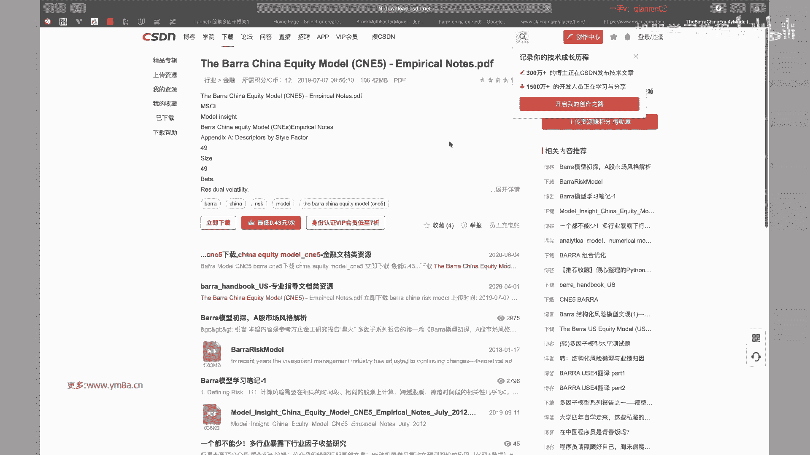

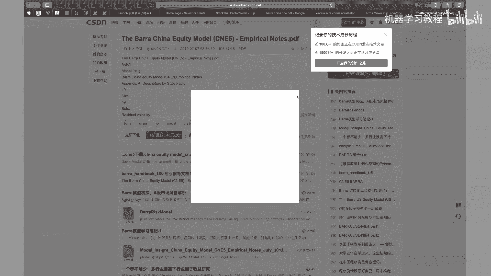

好的哎，各位同学，我们回到课堂上来哈，OK然后刚刚想给大家找的那个，之后课后再给大家找吧，就是BARA的呃，BARA的这样一个handbook，这个应该很多公司都会去对于它里面的那些。

模型区域进行研究对，所以我觉得还是值得去让大家去看一看的，然后嗯刚刚提到就是说定信跟电量管理嗯，OK就是我们既然选择是去做量化投资，我们肯定是倾向于是定量的管理，对，额然后呢提提到一点说。

定量管理本质是统计套利，其实啊尤其是用在对多因子模型上面，显然就是这样子，就是说嗯，只是说嗯目前来说是这本书里面他提到的，说是有，有这样多的一些东西吧，但是说比如说第五条，就是说基于合理的经济理论。

其实现在基于很多数据挖掘的这种方式，其实也对相应的这些观点产生了一些挑战，然后包括有说持续跟稳定的模式，认为是二对嗯，现在可能说我交易的就是短周期嗯，相应的来说我模型产生的速度很快。

但我DK的是DK的速度也很快，所以其实很多的观点就是说，大家都可以去自己去考虑它到底是不是有效，以及对，以及说以及说在当前的市场环境下，它是不是适用，对与其就是说包括是说在A股，我们同样的是根据因子。

比如说我选根据嗯，根据，因此我选择做多前20%，做空前后面20%的股票收，那可能说是发现没有做空的情况对，那然后这个时候其实有一些因子会发现，正是因为他没有办法去做空，才会去有效。

当如果市场真的可能能去做空的时候，这个因子也就是说也就失去了，能够去赚钱的这种效应对，所以其实这里面有挺多比较好玩的东西，大家都可以去逐步的去探索，然后我们刚刚提到的，就是说经典的多因子的表达式呃。

OK然后我们下来就去看看怎么去怎么，这个公式到底我们怎么去用对，嗯然后说定性管理案，其实这里面要提的就是说主要管对定性管理，主要是从因此对这部分反正怎么说呢，就说我们其实是希望说我们是希望来说说。

如果我们找不到的，就是说找到的就是无法解释的超额收益的话，我们想办法去把对应的因子给找出来，那其实这就是我们的一个我们的一个edge，就是我们我们自己相比别人有特殊的地方，对其实我们要做的事情。

就是说我们其实希望说是去不断的去找到，能够去获得超和收益的这些因素，这个是我们做量化研究的，一个比较重要的一个地方，对，然后的话可多啊，对这部分，反正这个是对这部分大家可以了解一下。

其实呃这我不管是说做股票的多因子，还是说我去做CTA，其实本质上来说都是需要去考虑这些的，就本质上我要去做预测，然后我要去控制风险，然后过程控制，它可能更加就说是偏向于就是operation的方面。

就是不管是我说保证回测跟交易的一致，然后以及说是我去优化我的交易系统，对第四点的话，可能就是说嗯如果是做CTA的话，可能就是考虑嗯如果做的频率过高，手续费就要去考虑。

就说我眼力跟手续费的这样一个比例对啊对，所以其实所以其实是说每一部分我们都可以去，都可以去不断的去做优化，去追求，去追求极致，把每一部分都去做到最好，那相对来说就是说能够提升的空间就比较大了。

对那如果说我其中某一点做不好的话，嗯可能说也有可能能赚钱，但是说想要去持续稳定的高效赚钱，那相对来说是比较难的，对，然后其实呃要提到就是说大家对我们提到，就是说什么是风险的话，就是比较标准的。

就是说是去看嗯，嗯就是就是收益的标准差，Standard deviation，这个这个确实是就是Mark rz提完之后之后，就是大家一直会一直去沿用，包括我们现在来做的也是比较标准的，这样一个事情。

对嗯，当然说至于至于这一点的话，要不要去，就是说有人要不要去考，就是说我嗯这这部分，所以说每个人对于风险的，如果说你想用其他定义，比如说我只考虑嗯就是当SIRISK嗯。

那那可能就是说你相应的模型也要去进行，相应的调整这部分大家可以去想一想，因为我自己我们其实没有做太多的考虑，都是采用去额，就是用这样的一个收益的标准差，然后以及就要考虑说，这张图。

它画出来是说我们收益率是一个正态分布，但事实上就是说呃对，要去考虑说我们是市场上当中，是不是这样一个正态分布的收益率，大家可以有兴趣的话，是可以把就是收益率的破号出来看一下对，不管是期货还是股票。

可能会跟标准的正态分布式会有一定的嗯，就是有一定的区别对嗯嗯然后再多说一句，就是说事实上我们就是说看不同的策略风格，就是说我们这边看的说是asset，就是一个股票，或者说呃。

或者说一个因子的收益率的正态分布吧，然后但是说我们交易出来这样一个策略，其实每个人不同类型的交易策略，你看他收益率的分布是能够看出一些东西的，比如说CCTA的话，很有可能典型是说我大的亏损。

可能相对来说是比较少，因为我都会去做相应的止损，但是啊，但是说我可能大部分都是说是在小的亏损，这些就是说我大大部分都是说啊，有我可能说整体的甚至说是会有一些偏呃。

expected value可能是小于零，但是我对于一些heavy tale的时候，我可能会有一些额外的超额，就是说在这些某些特别好的天，我可能会赚比较多的钱，那么使得我整体的投资组合收益是正的。

然后划到如果说划到资金取向来说，可能就是平时不断的在有一些下跌就是平缓，但遇到一个遇到一个特殊的情况的时候，有一个比较大的台阶上升，对，那其实是说从收益率的分布来上，是能够看出一些呃。

一些策略的比较典型的特征呢，那比如说我期卖期权，我可能平时就是每天甚至都是稳的去赚钱，等出现一些市场出现一些大跌等，甚至有可能是大涨的时候，我作为期权的，就是说我shot报的时候。

我可能会遭受比较大的这样一个回撤，反映下来就是说我平时都是缓慢上升，但是可能会有偶尔会有这种大的比较大的回撤，那么怎么去减小这种回撤，那就是作为期权的投资顾问的话，要去这是他们的一个就是核心竞争力了。

对，额OK然后的话，然后这里面就是说呃，然后这边有提到一个，就是说是PFOO这样一个嗯，就是为什么我们要去做投资组合，就本质上来说是因为我投资组合的呃，投资组合的时候风险是比我的。

可以说是小于等于一个投资组合当中，各资产标准差的加权平均，所以这这部分就是说，我们为什么要去做投资组合呃，其实大家也会就说提到，就是说分餐化有应该有很多人会提到，就说分餐化是唯一免费的午餐对。

那其实嗯不管是说是在去投资的过程当中，我去找到嗯，相关就是呃就找到去，我可以找到就是说negative correlation的一些因子，或者说是我找到不相关的一些因子。

然后或者说我个人再去做资产配置的时候，我不是说我把我所有的资产都放到股票上，而可能说是股票啊，房地产另类投资，甚至数字货币，多方面的去分散风险的去配置，对这个这个是可能是是相对来说是比较好的，一种。

就是希望财富的稳健的增长的这样一种方式，我个人觉得相对来说是比较可行的，其实他也有点就是类似于去投基金，因为基金本质上来说，如果是指数基金，本质上来说我就是去分散化的，去按照对应的市值比例。

投资了这几十只甚至是几百只股票对，然后如果我觉得说嗯对，然后如果我说我投了全球，各个国家市场的基金啊，对，那么我相对来说，我资产的就是或资产的分散化程度是比较好的，对呃嗯事实上就是有一种投资策略。

大家是可以考虑，就是自己就是个人业余可以试一试，就是我去去投资全球各个国家的指数，对你可以拿它去做一个择时，或者是去做一个资产配置，有人还是可以做出比较好的，这样一个资产配置的模型，然后业界比较典型的。

就是一个美林时钟的资产配置模型，相对来说就是我什么时候配股票，什么时候赔债券对呃大家可以感兴趣的话，是可以去找到去看一下的对，然后其实我们就是说这这个例子的话，大家就是去了解理解一下，就是说本质上来说。

我如果两个S都是0。5，0。5的50%的权重的话，然后我们的就是他们收益率相关系数对，如果说完全线性相关，如果等于一的时候，我们是可以得到这样一个式子对啊，然后如果是N只股票的话。

我把它去嗯N支N支股票的话，去扩展一下的话，就是呃如果是收益率互不相关，就是说我的呃就是我的roll是零的话，那其实就是其实就是本质上来说的话，然你就是把这边的0。5换成了额N分之一，对NN2N分之一。

然后你再去，然后我们就应该是可以得到这样一个呃，就是divide by square root of n对这样一个呃组合的风险，然后然后就是OK嗯，然后就是一个对，还好就是我们要提到。

就是说我们做这样一个投资组合，我target的目标是什么，因为嗯大家有应该也可以去关注一下，市场上当前在做的嗯投资组合，就是说一般来说，目前是以就是中证500的指数增强。

或者是中证500的绝对收益比较多，所以大家可以想一想，就是说我为什么对标的是中证500，就是是是排除掉就是沪深300之后，后面比较大的500只股票，为什么是选择它作为这样一个额股票池，对大家可以想一想。

然后为什么就是大家可以就是我想问一问大家，就是为什么他要去选中证500，而不是选上证五零，大家不是上证五零，不是都是白马股嘛，就是很多的就说地产金融对，咦为什么不选沪深300，就是前300只大票。

大家可以去想一想，为什么要去做，就是说选中证500对，我想问问就是呃就是嗯SL同学，就是如果方便的话，你可以我想问一个告诉一下大家，就是你选的这个股票，大概是是是属于当中哪一类，是哪一个股票池里面的。

然后你为什么要去做这样的一个选择，这其实考虑这个问题也是比较简单的一个事情，就是说我要去考虑我在什么样的股票池当中，我可以去做出超额收益，但事实上就是大家也可以看到大票的话，相对来说。

尤其是上证五零可能波动，每只股票每天都不会有太大的波动，那么我要去同样的对，我要同样的去交易的时候，我要从当中去，如果我不管是去做T加零还是去每天去交易，相对来说我如果像工商银行这种。

每天就波动几个点对，那就是就是说小数点后面不是说百分之几，就是说比如说他五块几，六块几的话，我们可以看一看它的价格吧。

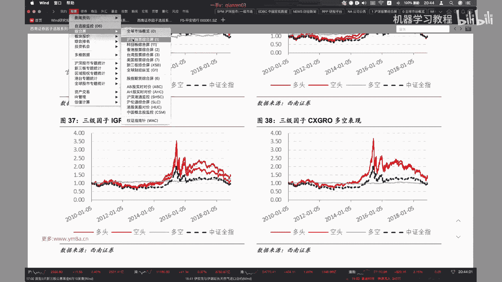

呃上证五，上证五零里面就是说大家可以看到，就是上证五零，它的股票池相对来说都是额券商，然后这种，对然后刚刚看到这个典型的银行股，这是这是这是农业银行，那相对来说如果我每天去交易了。

可能都覆盖不了它的成本，我每天上下就波动一个点，如果我想要去做一个相对来说有一些波动的话，就是说如果我是T加零，我希望高卖低买的话，那事实上就是说我可能都覆盖不了我的，手续费的成本，对大家可以看一下。

这是银行股的一些典型的特征，对，然后的话相应的来说再去看沪深300，这时候会发现就是我看沪深300，事实上就是波动来说已经简单直观来说，我看到的是比上证五零的波动要去大了，对。

已经会出现百分之几的这种波动，我事实上是可以，就是说有一些潜在的可能的交易机会了，对，对然后我们再看就是说事，事实上市场交易的是以中证500对标比较多，对中证500大家可以看一下他的持仓对。

那就是看下他的就是股票里面都是什么，就直观的大家可以应该可以看到，就是说中证500的波动是远大于沪深300，跟上证五零的对，那那作为交易来说说，我其实不担心说他今天一直不单，应该是上哪儿下跌。

但是我期望是说，我的股票当中是会有比较大的波动，因为只有在波动的时候，我才有可能会存在被错误定价的可能，那不管是散户由于情绪或者是其他的方面原因，我才有可能去获取相应的啊。

相应的就是说我交易的这样一个空间，对，所以那就是目前市场上主流，就是说大家是会去交易这样一个，中证500的这样一个呃指数，那其实其实也是就是说还有为什么是去交易，这个是因为为什么说我不再去交易。

后面的更小盘的股票，那其实是跟就是我们现在当前有哪些股指期货，是比较直接相关的，就是因为我除了我们我们刚刚上一节课提到，除了说我们想要去做嗯，想要去做，就是说指数增强。

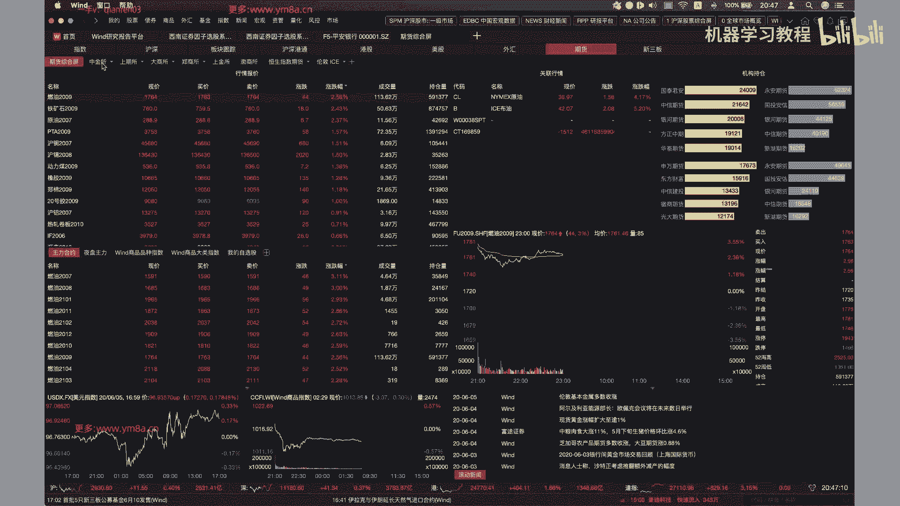

就是说我持有这些股票，我希望获取指数的超额收益，那么还有的是大家会去做啊，做绝对收益，那么我希望对冲市场，上涨或者下跌的风险的时候，我这个时候就会去考虑用股指期货去对冲，所以大家看到就是说。

只有我市场提供股指期货的才会去考虑，才有可能去做出这样的策略，这这边所以是IIC呃，然后嗯对IC和IF，大家也可以从成交额当中，其实也能看出一些东西吧，就是股指成交额和成交量对，对啊。

大家可以看到就是持仓对，相对来说IIC的话持仓是最多的，也就是对于我们的中证500啊，持仓和成交量相对来说都是比较多，当然市值上成交市值上到嗯不会有差那么大对，然后相对来说RH我们提到上证五零啊。

因为那这个时候可能交易成交量就会比较小了，对这个是看当月的这样一个合约，对啊，其实应该是看，就是说把近月远月的都统计下来看，但是一般来说就是股指期货是在近月的时候，流动性会比较好一点。

大家会交易的会多一些对，所以就是本质上来说，就是说大家可以想，就是期货跟股票市场是会有一定的联系对，所以就是我我包括就是说我给大家，就是说提供的数据，虽然是所有的股票都会都会有啊，就是给大家提供的数据。

所有股票数据都会有，但是我们可能还是希望大家说，基于中证500的这样一个指数来去去做对标，看我能不能去呃，产生一些超，产生一些超额收益对，OK嗯然后呃covers matrix。

大家呃呃大家明白是什么意思吧，就是本质上来说就是我哦我是有就是有N个呃，有N个股票，然后两两之间去算他们的，去算他们的之间的这样一个嗯，去就是去算他们的这样一个呃就是呃小呃，就是算他们一个斜斜方差，对。

然后对，就是所以所以因为是因为是嗯两两股票都会有，所以如果如果说就是说我们是3000只，3000只股票来实上这个举证是嗯是非常大的对，那就是呃3000×3000，然后我要估计的估计的数量。

就是说因为因为它是对称的嘛，西格玛一二跟西格玛二一是相同，所以是我要估计的是这样一个上三角，或者是一个下三角，下三角的一个矩阵，事实上是一个N平方倍对，那这个时候大家要看考看到，就是说为什么我们不去啊。

单纯的就是嗯去看每只两两个股之间的，这样一个嗯covers coverance，matrix确实是计算量会相对来说会比较大，但是我们多因子的话，我们就可以考虑说把这些的口呃。

把3000个3000多只股票的维度去降低，降低成就，我们只考虑因子的这样一个，K的这样一个维度对，然后CPM是这样一个嗯，对学过金融的同学，应该相对来说会比较了解一些对。

其实然后包括这里面就是给到了这样一个呃，贝塔的这样一个定义，对，他就是说是额资产跟市场收益率之之间的，这样一个资产的收益率跟市场收益率之间的，这样一个COVERANCE。

然后除以一个就是市场收益率这样的一个额，方差对，就是股票或啊，就是这样一个贝塔这样一个定义嗯，然后的话，然后然后然后其实说我们嗯，然后如果说我们有了贝塔之后，就可以就是说把市场就超额收收益。

就是分解为我们的市场部分，跟我们的残差这样的一个部分啊，然后他这边有一些assumption，就是说如果呃就是残差收益率，市场收益率是独立的，然后所以我可以把额投资组合这样这样的一个。

就是呃方差去进一步的这样一个呃去分解对，然后OK嗯，所以其实说大家也可以看到，就是多因子的这样一个模型，其实是一步步的去迭代出来的，对啊，它刚刚是我们基于就资本资产的资，这样一个市场的定价模型。

然后再去加上一个套利的模型，OK啊，然后接下来我们就就说呃这样的公式的话，其实现在大家看到他的话，就可以理解是说我们从我们的呃，从从我们的嗯，就RJJ代表是每一个呃每呃就是每一个股票。

然后我们现在是把每一个把股票的这样，一个呃收益，把股票的这样一个收益率，去分解到我们这样的因子上去，分解分解到我们多个因子上去，然后我们是希望我们的呃去嗯去找到，就是说尽可能的去找到我们的K个。

K就是K个因子使得我们的，然后尽可能去解释出我们的收益率，是由这K个因子来决定的，这其实也就是我们多因子模型想要去追求的，这样一个东西呃，然后这边下面提到的说，多因子模型有三种的这样一个。

这三种这样一个形式啊，宏观经济因子模型相对来说，如果说宏观的数据不是更新频率，不是特别高的话，那事实上就是说那如果要我要用这个模型的话，嗯怎么说我更新的，那我相对来说我的多因子的。

这样更新的频率就不是特特别的去，就我不能去频繁的去更新我们这样多因子呃，然后OK然后他说这边提到说是数据的问题呃，60个数据来估计十个宏观因子，每个月的回归嗯，OK嗯确实是就是就是尤其是宏观的。

就是说我遇到这些宏观的因子怎么去把它处理，其实也是会一个问题，所以实际操作当中，我们不太会去考虑这项写的一些的东西，然后然后这第二部分就是说，现在大家的多因子模型当中应该都会去呃，都会去考虑这些东西的。

就是基本面的因呃，基本面的这样呃因子模型呃，事实上这些东西的话也就提到，就说无非是数据处理复杂一些，但是其实如果我们还是说，建好了数据处理的pipeline之后，每天去更新也还是OK的对。

所以这部分事实上就是说，我们在去做多因子模型的时候是要去考虑的，对，然后统计因子模型这个它确实提到，就是说因子有很难很多，这很难直观的这样一个含义，嗯对这个其实就是。

嗯这个OK这确实是他提到这样一个一个部分，然后包括我们其实说我们自己用数据挖掘，就是从股票的交易数据，不管还是什么其他数据，这种数据挖掘其实也会有类似的一些问题，当然这是这个跟学术研究不太一样的一点是。

有的时候就是说嗯，我当然希望说我能够去找到，说有明确经济学意义，解释意义的这点因子，但是可能把这个因子研究出来，黄花菜也凉了，那那那但是说如果我们是基于统计上来讲，说我们这个因子真的是可以去奏效。

那么是我们是有大概率的，我们是可以大概率的去相信，这个因子在未来也是可以去奏效的，这也就是说我们去，这也是说我们做因子挖掘的意义，不然的话就是说，如果说我们真的要去完整的去，确定每一个因子的话。

那我觉得就是基于嗯，基于这就基于这样的话，基于这样的考虑，那我们挖掘基于我们就是挖掘因子的速度，是远大于我们去验证这样一个因子，有效性的速度的话，那么很有可能就是面对我们都不会有。

对因子有这样一个交易的可能和机会对，因为事实上市场竞争是非常激烈，当我们必须用，我们就是借助现代的工具去对我们的因子，进行啊高频率的更新去挖掘，对，这样去保证我们的就是，那我们的就是阿尔法的模型。

是处于相对处于来说一个领先的位置，然后啊BORA老师就是MMSCI提供的，MSCIT下提供的，就是嗯它会有对美股跟A股都会有去有这样的，就是有这样的模型，他们相对来说他们做的模型还是比较系统的。

然后我觉得大家呃还是可以，之后其实会找到文档，还是我觉得，还是大家还是值得去好好去研究一下，里面提到的各种各样的因子的构建，然后以及怎么去测试因子，我觉得收获还是比较大的，对，然后他说基本面多因子。

这样一个基本面多因子模型，最基本的假设说是类似属性的股票，在市场上具有相似的收益率，对那其实呃对你说，因为不管是交易价格，交易量，市场大小，然后额波动率，然后以及说我们这些估值的这样一些属性。

对这个是非常reasonable的，因为嗯就是不管是做价值投资，还是说是去做量化投资，你本质上来说啊，尤其是做价值投资，归根结底还是说是希望当前的，就是希望嗯最终我投资的股票或者是公司。

它的估值能够嗯或者说它的价格能够反映出，真实地反映出它的基本面，对，这也是就是对嗯，所以说多因子模型就是完全的，纳入这些基本面的多因子，我觉得是非常，这其实是非常是说符合我们的直觉。

也是觉得也是也是非常正常的这样一个事情对，然后呃下面这样一个，就是下面这样一个公式的话，大家呃仔细来看一下，就是我们看一下，就说我们这边capital k是我们的呃，就是K个因子，然后我们是N个N个的。

这这是RP是我们的这样一个嗯，是我们的这样一个portfolio，然后注意这个就这个不是说单只股票的return，这这这是我们的这样一个portfolio对，然后然后就是然后说这个里面的。

说我们这个时候，我们整个投资组合的这样一个因子的回报，是那投资组合的回报是由我们每一个因子的呃，呃就是每个这样一个因子的回报额，和我们就是说和我们的残差部分来构成的，然后当当然每个因子的部分。

事实上是由我们投资组合的，就是投资组合当中呃，每一个股票的权重啊，和它的和这个股票在这个因子上的暴露，这样一个成绩，对这个其实呃大家仔细看一下，应该不难理解，对。

其实或者或者如果你觉得看这个比较困难的话，就是你把它换成下面的这样一个矩阵，这样一个形式，我觉得就比较好理解了，对我们本质上，我们还是说这个这边是我们的，一个个的一个个股票，然后大家看到就是每一行。

其实你做的事情就是呃，我第一只股票在第一个因子上，然后呃的暴露，然后乘以相应的这样一个音，还这样二乘以这样的一个F1对，然后其实我要做的事情，就是说把每一个每一只股票。

在每一个因子上都去对应的去把它乘起来，然后再加上我们的参差部分，这样我们得到的就是每一行就2万，得到的是每一个因子的这样一个收益率，然后我再让我整个PFOO的收益率是，其实是就是是把我这样的呃。

就是我PFOO收益率，本质上就是我每一个投资的股票的收益率，乘以它相应的权重，所以大家会看到就是有这样的一个HPJ，每个股票的权重，我只要RP就等于就是R1乘以H呃，H p1，然后加上R2乘以HP2。

对，其实其实这这这这两个就是上下，这两个公式是等价的，对就这样子的话，大家有没有，就是说对于直观的我们多因子模型，在做什么样的事情，有一个最基本的了解，其实本质上就是这样一个东西。

对这就是如果是理解了这个矩阵，其实我们接下来的事情就比较好做了，对就原来说我们要做的事情是嗯，就是从1000只股票的预期的收益跟风险，然后现在我我换换成了说，我既然说我找到了呃，这20个因子。

我只要去研究这20个因子的收益跟风险对，但其实相对来说他说的是预测的复杂度的降低，那么我导致相应的我获得trade off，就是我能够去提升我预测的这样一个精度，因为大家可以想象一下。

其实你对于去研究单个预测，单个股票的涨跌，其实相对来说是会比较困难，但是我可以去呃预测这样一个因子的表现，其实还是我觉得获得的确定性是会比较多的，这样一个事情，也是会有相对来说比较大的这样一个确定性。

因为作为单个股票而言，就是其实它是有多个啊，就是能够有多个影响它涨跌的这样一个因素，单纯的去预测股票涨跌，如果我去拿LOSTM或者是其他的深度呃，就是深度网络的这样一些模型去来预测的话。

嗯那其实就是说这里面不可解释性是非常的大，但是如果我去转为去预测这些因子的话，相对来说，一方面我因为我预测这些因子本质上是有多个，有有很多个就是有市场，全市场的股票去来帮助我去研究这些因。

就是用这些股票数据来去研究这些因子，像尤其是它还具有一定的经济学的意义，那么相对来说去研究这些因子，那么可能获得的确定性是会大一点，所以这也就是说，可能很多有一些人就是在在尝试说嗯，做股票的预测的时候。

可能或者是做什么的预测的时候，说我不管3727，我能把找到这些特征去呃，扔到我这样一个网网络里，希望说我这样的一个网络，是不是可以像其他的深度学习网络一样，只要我参数足够多，网络足够深。

就一个一定能够去学到，去赚钱的这样一个模型的，那可能就是有可能会有点困难，因为呃本质来说，我个人理解是再多的模型，对于这样一个股票具有无限复杂度来说，都只能是无限复杂度的系统来说，都只能是去做一个近似。

本质上来说嗯，多因子模型是给了我们这样一个作呃，作为一个它给了我们一种框架，能够去降低整个市场的复杂度，去帮助我们，就说只去关注主要影响市场的这些呃因素，然后我们把其他不能继续解释的。

这个部分去丢掉残渣，然后我们接下来要做的事情是只要去找到，只要去不断的提升研究这些影响，而主要影响市场的这些因素的准确度，然后去减少我们残差的部分，或者说是这对在这这样的话来说。

我们觉得就是说去做这样的一个预测，可能比单纯的说呃去预测个股的涨跌，会去有个更大的一些嗯准确度吧，或者说是有更大的信心去去做这样的事情对，所以到这部分，大家有没有就是对多因子模型，有一些就是基本的了解。

就是然后我提到就是说呃，如果说因为这里面是基于我个人的理解，如果大家觉得有什么不准确，或者是就是有什么觉得说的不对的地方，我觉得是需要直接去指指啊，直接提出来的，然后如果不能确认的话。

我也会去找各位senior的同事，去讨论一些这些事情，对希望是说不要给大家带来错误的一些观念，对，当然对下的呃对呃，我觉得就是说因为因为可能在讲这个，讲这个时候可能里面也加了一些私货。

所以反正加了私货的部分，我觉得我都会去提出来，然后就是说我我是鼓励大家去思考的，因为啊投资这个事情，说白了也是非常personal的事情，即使是用相同的框架，那做出来的结果可能也是完全不一样对。

所以我我是鼓励大家，就是跟我一起去共同的去探讨，然后去思考，就是因为我觉得这个才是，就是说我们真正的做量化投资的乐趣所在，而不是单纯的说像嗯跑深度学习一样。

我把这个模型按照paper里面的方式完全搭出来，那么大概率我复习下来的结果也是差不多的，对嗯在量化里面没有说是去追求模型的准确度，或者说是识别的准确率吧，但是我们某种程度来说。

我们是希望通过量化的方式去，不断地增加我们对于市场的了解，那么对于呃，然后我们是希望以一种相对比较科学，或者说是可解释的方式去呃理解市场，这样增加我们自己对于模型的这样一个可信度，对。

然后这边提到就是说OK这个是记就是COVERANCE，就是一个是N平方的复杂度，所以说当我们要去嗯，如果是多个股票的话，其实这样的这样的就是呃，我们需要的就是需要的就是窗口或者数据量，其实是比较大的。

对T大于1000嗯，当然要注意是说，我们也不是说不能去考虑做这样的事情，就是我们如果不是说不是阅读频率的话，就是说他说现在是最常规的是阅读频率，但事实上可能我觉得可能现在每天。

大家基本上都是每天去更新我们的模型了，对呃在尤其在发达市场，其实是有可能去做这样的尝试，但是呃我自己是没有尝试过，如果有兴趣的同学是可以去尝试一下，就是说如果我们我们单纯的就不用多音字。

我们就用就用股票来取，就用1000只股票的，就是数据来去估计估计这样的一个协方差矩阵，大家其实可以看一下嗯，我觉得可能这样举证都不一定对啊，不一定对，也确实不一定能够去。

嗯可能就是可能甚至会说求解的时候，可能都会遇到一些困难吧，对，然后他这边要强调一说，它不是一个因果关系的模型，对我们只是说是相关性跟因果性，这是两个东西，对的是有相关，但是我们不能说是这个因子。

决定了这个市场的收益，但事实上我们都是反过来的，我们都是从呃就是正常的投资流程，是我们从历史数据当中，我们得到了一些能够，可能能够解释这个市场收益的一些因子，然后我们根据这些因子去预测明天的收益率。

但是我们不能说，我们根据这些因子计算出来的收益率，那就是明天的收益率，那显然是不对的，那但当然就是说当然就是说，如果说我们预测出来的这些因子，到了T加一的时期，真的是跟我们市场真实收益率是比较接近。

Ok，那那我们就大概就是说我们这样的一个因子了，多因子的模型就起作用了，我们去能够去赚到我们呃，市场符合我们预期的这样一个钱，对，嗯OK，然后就是呃呃这个的话其实跟之前会有点类似，就是他这边是嗯。

这部分就是待会给大家自己去看一下，其实本质上跟前面没有特别大的区别，它只是嗯对，他只是说我们把就是说在多因子的框架下，就是我们市场风险，怎么由我们的股票的这样一个。

单个股票的风险转化程序转变成一个因子的，在因子上的这样一个风险，对，Um，Okay，Um，然后是多因子模型的对，协方差矩阵一般是按多长周期的数据，估计出来的，这个我觉得大家可以去看。

就是你这边他看到的说是，就是说因为说是采用历史数据进行估计，其实这个长度是T远大于N对，那么那么就也就是说，那就要其实就要看我们就是协方差矩阵里面，我们有多少个相关系数，当然我们用日频数据。

从10年到现在可能还好一些，如果说我们的就是就是呃，就是包括，接下来就是说有一些就是算协方差矩阵，是有一些，因此认识面试告诉我们，其实我们要用多少天的数据来去算对，所以这个当然我觉得这个原则是。

这显然是这是显然的，对我们不能说是啊，因为因为毕竟有这么多参数，我们不能说是很我们数，我们实际提供的数据量，就是提供的样本数量还小于参数的数量，那么我们一定是可以找到，这是完全去拟合我们的。

你完全拟合我们当前数据的这样一个参数组，对吧，所以这部分我觉得也是非常惊艳的事情，也不是说是呃你一定是确定的使用多长数据的，多长周期的数据估估计出来的，甚至来说就是就是我是不是可以考虑。

就是包括就是说我们在拿因子去做预测的时候，我是考虑说拿前期，前期这么多因子的这样一个平均值呢，还是说我着重考虑近期的因子的影响，那其实这里面都是有可以去很多去尝试的空间。

就是一旦就是说大家有觉得呃有什么问题的话，我唯一能给的就是说是OK我们去做个实验，我们去尝试一下，我采用不同周期的数据去嗯，去估计出来协方差矩阵，那看一看对我整体的performance。

会有怎么样的影响，对我觉得这个是就是是整个做量化过程当中，我自己体会到，就是说当我有一个想法的时候，我嗯你固然可是可以去问，就是问也就是问一问旁边的同事有没有去做过，但是如果说别人也没有做过。

或者说他也只是简单尝试一下，那我完全可以尝试的想法，就是说我们自己去，就是尝试一下这个想法是不是可行，对就是它本质上来说更加偏向于是一种研究，我不觉得说有什么，就是说我们当然说是有一些基本的一些假设。

就是说比如说我不可能说拿太短的周期去估算，我的协方差矩阵，但是呃至于要用多长，我觉得可能是真的是实验出来才会去知道，有这样的结果，对甚至来说我在不同的市场上，我选不同的呃股票时，那我可能都会去考虑。

都会去都会去进行相应的调整，本质上来说这个多长的周期，这是模型当中的一个线，如果用算用我们实验learning当中来对比的话，算是一个就是超参数对，就是hyper parameter，这这这样可能是对。

我觉得可能是大家要自自己去考虑，而不是说有一个确定性的这样一个解对，嗯然后就是说呃对呃，影响影多因子的多因子模型的分解，这market risk大概是相对来说是比较直观的，就是说当市场上涨和下跌的时候。

嗯是呃它会直观的去影响呃股票的上涨和下跌，然后sector risk对呃行业的风险，所以对，所以说就是接下来就是这里面提到的一个风，每提到的这样一些风险，其实说我们在做额，在做多因子模型的时候。

其实到后期我们都要去对它进行相应的控制，对就是说我要控制我相应的，因此在这些方向上的暴露，对，然后风格因子是指股票市场结构，嗯曾经就是说要提到一点，就是说曾经就说比如说小市值比嗯，表现更优的话。

嗯那有有曾经一段时间就是说它是一个阿尔法，但是到了后来的时候，大家发现其实它是一个就是风险因子，它不是一个真正的阿尔法，那那什么是阿尔法呢，唉什么是阿尔法，真正的阿尔法，你能发现当这样的一个小市值风格。

在什么时候进行切换的时候，那你这样的一个发现，这样小数值切换的这样一个影子，那才才才是一个真正的，就是才是真正的一个阿尔法，对嗯对，当然也也说，曾经如果说市场上交易者，不是所有人都认为这样是。

就是不是所有人都认同这样的呃因子的时候，或者说大家还没有发现这个因子的时候，那这样的风险因子可能是你的阿尔法，但是随着市场慢慢的进化，每一个交易者都会逐渐的去发现，那其实这样这样的去发现你。

你目前正在交易这个因子，那么慢慢的就是说也有阿尔法，就变成了我们这样一个呃，所谓的这样一个风和所谓的一个风险因子了，对，嗯然后他接下来提到的就是OK，其实就是这张图了。

然后他接下来提到的就是12类因子的话，啊K12的名字对嗯，对大家可以就是这个表格里面它会给出来，就是说里面有哪些这些因子，然后其实我们今天主要先，因为我们其实有数据还没有处理完。

就是这些数据还没有完全的拿给大家呃，确实处理起来也是处理的时间，也是超出了我的预期嗯，对我们今天先是就给到大家的，是大家是可以就是从我们的，就是呃我们是会按照多因子的框架去做。

但是我们接下来是大家可以先去从，就是国泰卷的，就是从日级别的因子开始去可以尝试，尤其是偏向就短周期交易性的因子嗯，那为什么考虑说做这个，一方面就是说是我们的数据，有数据相对来说可以可以比较获得得到。

然后另外一个就是说呃，可能从当中，就是我个人觉得是从这些日记，比日评的交易数据当中获得，就是去挖到因子的，这样概率其实还是相对来说是比较高的，以及就是说可能国泰居然给到的那啊，将近200个因子当中。

其实都有一些是相对来说现在还是可以去用的，对好的，然后接下来然后呃接下来下一课的话，我们就来去考虑，就是跟大家怎么去嗯，我们去看看一看，就是怎么去把这些因子去，我们要去做怎样的数据处理，对。

其实这里面也是有一些东西的，然后我们带着大家一起来做一下对，然后还是我们先休息15分钟，还是09：30的时候，我们再回到课上来。

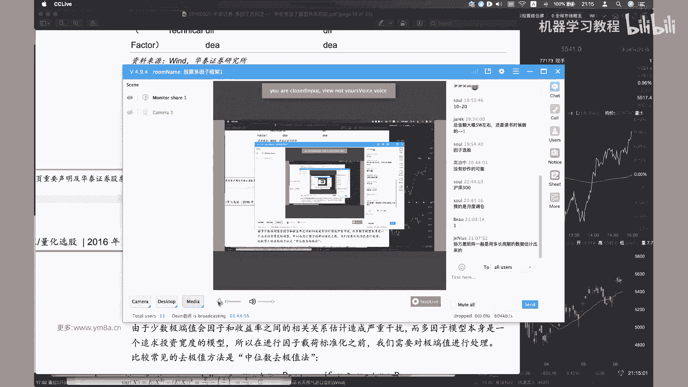

哎好的，各位同学，我们现在开始第三课啊，大家再坚持一下，还有一个小时，对啊，然后然后我也想提到就是对，然后就是接下来，就是说我们始终会去围绕这样一个流程图，流程图去做，不管是接下来做我们的作业。

还是就是说做project，大家要去嗯，我们要明白，就是说我们所做的事情，在整个流程当中是去做哪一步，那其实也就是，哎sorry，就是我想给大家看的就是对，比如说先去看这接下来的流程。

数据采集工作大部分情况下，我替大家完成了这个事情，然后接下来是数据标准化，然后识别有效因子呃，对，然后我们可能在比较会花比较多的精力的，一部分是就是在我们的收益，就是一个是这一部分吧，就是识别有效因子。

然后是收益模型，对这这两部分可能我们会花比较多的，呃一些的事件，然后我们具体看一看，就是说呃，然后提到就是说这这里面因为涉及到很多的，就是一些基本面的因子，然后如果大家对于这里面的概念。

不是特别理解的话，很简单，找一份先找一份财报出来看一下，就不管是茅台啊，就你感兴趣的公司，找一部分他的年报看一下，然后看看这里面就是每一部分，它对应的是什么东西，然后还有一本书，我是想推荐给大家。

就是我自己也看了这本书，然后去入门的，然后如果你考过CFA的话，应该这里面的概念对你而言不是什么难事，呃，手把手教你读财报，我觉得这本书写的还是比较呃，简单明了的，就是说教你去了解一些。

就是股市当中最基本的这些概念，到底是什么意思，对，呃对，然后觉得就是长期如果是想做股票投资的话，还是还是把基本面的概念稍微会了解一些，可能会好一些，嗯对然后这边的话就是说数据标准化的话。

就是对这个其实比较简单，就是我们就是把相当于一个说是中位数去极值，就是把我们的outlier给回归到对，回归到我们的一个范围之内，确认机制就是然后再进行标准化，这个都是大家在琢磨训练例当中。

其实也是用到非常多的标准的这样一个操作呃，但是这个N取多少呢，大家可以自己去试一下，然后我一般是取二或者是三，其实然后你当然具体说你每一个case的话，是不是要去去看一下它的分布。

我觉得这个也是要去大家也是要去考虑的对，所以其实里面就是有很多的参数，是可以去进行调整，嗯对嗯，然后然后当然说一个是说我们基于原始，就是说原始值，还是说是说我们只关注它的排序，因为排序本质上来说。

我就没有这些参数了嘛，就是这是我本质上，这是一个非参数的一个统计的方法，对啊呃是有对，有一些因子，如果说是你觉得是说用原始值处理，也比较麻烦的话，或者说或者说选取处理下来效果不是很好，那其实可以考虑说。

直接把我们原始值转化成排序对，所以大家其实可以看到，就整个多元的模型里面能调整的空间是非常大，就是说不管我是对其中哪一步做了一些调整，那么导致大家最后做下来的模型其实都不是。

就是导致差的还是有一些区别的对，所以我们刚刚看到的是，我们是在做数据标准化的这一步，对，就是一个是嗯取极值，再就再去做标准化，还有一个是我用rank来去做标准化，嗯OK对。

然后的话就是然后只是着重想强调一下，就是说有效因子的识别，我们到底要去怎么来做这样的事情，我们先是先来看一下，就是说这个研报里面它到底是怎么来做，就是说呃比如说一个是呃，它其实这个意思是说。

市场跟行业因子是不是纳入模型，本质上来说，就是说嗯就是说我比如说我拿出一个分红高的，这样分红高分红的这样一个因子，那么它其实对应的实际嗯，可能说他某一些行业的股票，会有比较高的分红概率。

或者说分红的比例比较高，那其实说我这样因子就是一个不纯粹的，不纯不纯粹的这样一个因子，它其实是考虑了比较多的行业因子在其中，所以嗯所以其实我们要做的是，就是在做在回归的时候，其实是要去考虑。

我们要把呃呃这样的，我们我们找到了因子在行业上的暴露，是需要去进行去考虑去剔除掉，然后我们只是剔除掉这些在行业跟市场上暴露，我去留他的残差，作为我的因子，然后在这个里面呃。

这里面就是呃这里面提到的几个比较多的东西，一个是嗯对，一个是就是说这个这个这个这个XJTS呃，JST本质上来说它就是个binary variable，就是说嗯他如果是行业S暴露度为一，否则为零对。

然后有一些人可能会采取说嗯作为一个公司，它有多个主营业务，那么这个公司嗯，可能会，我是不是可以把把它把它按照一定的比例，分到不同的行业当中去，呃固然是可以，但是这样的哎我觉得也可以去做。

但是如果是为了简化考虑来说，我们就把一个公司归到一个行业，其实就OK了对然后这里面的行业是怎么区分呢，就是说呃一般我们常用的是中性跟申万的这样，一个呃行业分类，嗯其实对中信跟申万。

申万宏源的这样行业分类，其实有的里面也有一些坑，我记不清是中性还是申万，哪个里面曾经是有做过一次调整，就是呃是把地产归到了金融里面去，所以嗯嗯并且就是不同的公司呃，对就是不在同一个公司。

在不同的时间内也有可能会发生，也有可能会发生行业的变更，那那么这个里面其实嗯，如果是需要更加准确的去看一个公司的，在行业上的暴露的话，那么是需要去维护一个表格，根据公司的好，根据公司的行业变更。

去及时的调整一个公司在呃，每调整一个公司在不同行业的，他就是他的环境化划分对，那其实他是可能会影响到我们因子的，这样一个呃，影响因子的这样一个呃它的有效性的，对所以我给大家的建议就是简简化来说。

就是之后会给大家提供一个嗯，提供一个A股的就是好公司的行业分类吧，然后我不确定能不能找到，就是各个上市公司，他们的行业变更的这样一个时间对呃，然后其实有了这样的一个数据之后，然后包括就是说嗯。

那我们就能根据这个行业去找到呃，嗯我们根据行业，然后把行业当中的股票在当期的嗯，就是行业的各个股票，根据在当期的一个市值，我们就能够算出整整个行业的，在当期的这样一个收益率，对，其实这样每一个啊。

每一个我们这样的一个值都是可以去算出来的，对然后呃对，所以这部分是是讲的，就是说是我先要去考虑，就是说把我的嗯，把我的行业因子跟市场因子去纳入模型，然后去再去验证，就是我这样的一个因子的有效性。

我们这边不仅仅说是风格因子了，包括我们接下来就是说嗯，我就是说同学们去测试的时候，是可以是应该是去拿日级别的，国泰君安的这些因子去测试的，我们去测，我们因为我们测试的是交易性的因子。

但是本质上我们还是采取类似的这样一个思路，我们还是先先要去做单因子回归，去确定这个因子的底气的这样一个收益率对，那么呃嗯我不太确定的事情，就是说嗯当然也有一些是会考虑到说我这嗯sorry。

就是我这里面的因子，呃呃是不是交，因为交易型的因子很有可能是嗯，不会具有太多的这样一些行业的暴露，因为本质上来说是人交易的信息，但其实也不确定，所以最好还是说是去嗯把这些因子去去做一下。

这样的过程大家也可以对比一下，就是说我不去做嗯，我我我不去考虑行业跟市场跟考虑了，这个时候我因此的效果是不是有区别对，然后我们做完上一步之后，就是说嗯做完上一步之后，就是说呃就是说为什么不用还。

我还提一下，为什么不用这个呢，其实嗯对，因为说其实是本土的行业分类的话，相对来说是说如果大家都去呃，就可能嗯当然也要看你是说是我持仓的，我持仓的数量了，但如果说我持仓的数量比较少的时候，你可能按这么多。

如果去做的行业中心都不是呃，都我都不一定能够说找到这样的，找到这么多找就是说找到这么多嗯，那这么多股票能够说都覆盖了这么多行业对嗯，所以我觉得这是一个综合去权衡，考虑这样一个问题，然后就是说这样子。

这是做一个统计学上的一个T检验，是确定因子在DT7是否和收益率显著相关对，然后致美者我要强调的要强调一个是计算，就是t absolute value的均值，就是因为我不仅仅说是要去看他是不是说是噢。

T值等不等于零，但是如果是一会正，一会负，就是说那本质还是说我们的因子，一会跟收益率与收益率相关性是为正，有时候是为负，那其实是比较不稳定的，那其实就比较嗯，那那就很那很就是就是可能会额低。

他这边说提到是低估因子的这样一个有效性，对，Uh okay，然后然后大家可以想到就是说呃T值检验的话，就是说大家可以去理解一下，跟着我去理解一下，就是说嗯我因为是我对每一期，就是说在这篇研报里。

他用的是month，但如果说我是做交易日评，就是说我对于每一天，我都可以横截面去做这样一个回归，然后可以得到当时呃就是这个第K个因子，在当期的这样一个因子的收益率对，然后他同时说说。

到是说我对于这样一个时间的序列，也是需要去进行去做T检验，OK嗯根据第三点，然后或者说然后，然后也就是说根据我们第三点做出来的T检验，之后，可能会去得，就就就就是说能够得到，就说是收益因子还是风险因子。

我们当然追求的是收益因子，但是风险因子的话呃也可以啊，也是要去纳入的，对，嗯然后上次就是有大家提到，就说我为什么要去算，就是说去算我们的就是因子的这样一个值，呃，我做完上面之后说我可能已经做完了体检验。

然后应该找到了一些跟嗯，跟我们的额收益率是比较相关的，这样一个呃因子，然后okay，因为本质上来说就是啊IIC值，除了说是就IIC值，本质上反映的是我们的下期收益率，跟本期因子暴露度数这样一个相关。

线性相关程度，大家回想一下，我们之前在去做的时候，本质上都是去拿因子去预测额下一期的收益率，跟当前因子这样一个correlation对，然后呃如果如果就是就是说我们做到最晚一步。

就是然后我刚刚也其实也提到，就是说因子标准化处理之后，我需要就是把我们的呃呃市值因子，行业因子等等去，就是说我把它去剔除掉，我只因为本质上来说，很多因子可能都是跟这些因子是，就是说我得到因子。

其实跟这些是有比较大的相关的，我希望是说剔除掉，说不是小市值因子，也不是行业因子，然后然后再去得到说排除掉这些因素之后的呃，残差值，这个才是说我想要去考虑的，你想要去评估的。

真正去想要去评估的这样一个因子对，然后接下来就是比较呃股票回测，其实呃就是说我得到了因子之后，一般常见的做法就是说我需要去，比如说我分成哦，去分成就是N个组合嘛，然后一般来说我们分二。

我一般是分就是五组吧，一般来说我个人建议是分五组可能会好一些，然后这边是大人，沪深300，我们用中证500其实都OK了对，然后本质上来说就是按照每个行业，就是我去行业里面去去啊，按照每个每个行业内。

按照从高到低去分成N个组合对，比如说我这边N就取五，然后然后他这个是什么意思，就是说我不是有这么多行业吗，我在每一个行业里面都会去选取第一组，那么呃我比如我是啊20几个行业，十几个行业之后。

我们就得到第一组的这样一个股票，然后当然它同时也要注意，就是说组合组合内行业间权重，我需要去按照我的指数去进行配比，那本质上来说，他就是得到这样一个行业中心组合。

就是说呃我我沪深300或者中证500当中，地产股占多少比例，那么我同样的我在我整个投资组合额组合之间，就是说我得到了嗯，我比如说我都选去选这个得分最高的第一组，那么我在得到这么多这么多行业方向的时候。

比例也需要按照相应的沪深300当中，相应的比例去配对，然后其实做股票回测来说相对来说会好一些，因为我们不需要去嗯不需要去考虑，就是说嗯我回测的有效性，或者说是回测的准确度跟实盘的差距有多少。

一般来说我们只需要去考虑，按照嗯嗯，我们这一般来说都是按照收盘价去计算，然后你可能再去加上相应的一个交易的成本，其实就OK了，对本质上来说，我只需要嗯，嗯比如说我固定的是1000万还是100万的金额。

然后我按照第一天的，就是我投资组合的这投资投资组合，这样一个呃五个组合，每一个组合当中每个股票所占据的权重，当我把资金分配到呃这样的股票，然后去观，然后去观察到第二天的时候。

我们的这样的一个投资组合的净值，然后其实每天去更新的去计算这样的一个呃，投资组合的呃，投就是持仓的这样一个总和，其实就比较就比较容易的就能够算出来，整个就是portfolio这样的一个绩效了。

然后同样的这些是跟前面是非常一致的，就是说年化收益率波动比额年化波动，然后sharp ratio等等呃，OK然后的话今天我们先是先会看到这么多，就是因为我们今天也就是大家课后，也可能能够去做的事情。

也就是说我们先去把啊整个的前两部分，我们去把这部分给，就是从我们去识别单个的因子，然后去啊前期是可能还没有做到下面的这些，对我们可能先是先去做单个的因子，然后把，然后就说我们把它因子按照分层去测一下。

就是说我们里面这呃，测一下每个因子的这样一个表现，对我觉得这样来说，可能大家能够快速的感受一下，就是说呃整个体整个体系是怎么去work的，而不是说是先去一步步的大框架，把整个流程给走完。

那那样可能花的时间会久一点对，然后然后我们参考的因子就是从，呃国泰君安的时候，因为因为国泰君安这个里面提到的，这些因子对呃，他其实这篇这篇论文他强强调一点，就是说呃，他其实是说呃因为他他他的观点是说。

因为是A股，他认为A股市场跟我们的呃，呃，跟其他的就是成熟市场是呃，不一样的地方在于，我们其实投机性相对是比较重，就是跟投资者解读结构或者等等，其他有一些关系，那么呃那么我们是本质上来说。

我们可以利用这种管，利用这种可以某种程度上说是优势，去去调整我们的因子的构建，而不是说我们还是用基本面，因为在A股交易，可能很多散户都是不看基本面，那么我们就要去利用散户这种冲动，去考虑怎么去利用额。

你去构建构建这些因子，然后不知道呃之前的话有没有，大家有没有200个短周期因子，有没有在就是在期货上面有进行去测试，因为因为之前客场在期货因子那一刻，我们有提到说，其实这个里面提到的很多的。

短周期的阿尔法因子，大家是可以考虑去在嗯在期货上去进行测试的，对然后就是这边跟你讲的是OK嗯，这边其实跟之前讲的是类似的，然后嗯然后我们当时提到就是说有一些因子，就是说我们这边是只有自己的时间序列。

当时是我们可以用在期货上的啊，对然后然后那主要是因为说我们如果是想要去，如果涉及到rank的话，没有没有其他的股票，我们是没有没有其他的期货，我们是不太好去做rank的，就是说不可以去。

不太好横截面上去做这样的事情，但是今天到这个时候，我们提供了股票的数据，我们不仅仅是可以，就是说在时间序列上去算出这样的因子值，也是可以在呃，如果涉及到横截面的因子。

我们也是可以去考虑去是去做这样的事情的，所以我想问一问，就上节课大家有没有去啊，做这样的，就是就是在之前，大家有没有去尝试过这里面的因子，嗯然后强调一下，就是说这个因子收益率是不是就是回报和因子。

做单因子回归的系数呃，不不能这么说吧，因为就是如果你看这个里面的，它的因子的收益率，本质上他还是做了，相当于说是做了这样一个咳做咳，做了这样一个回测的，就是说我我们我们刚刚有提到。

就是说我们去把它分区分组去做这样的一个，我们分成N组，然后我们看一下，就是说我们比如说我们排名最高的第一组，多第一组空第五组之后，这样得到一个股票的这样一个收益率，呃，我不确定说回报跟因子。

对这个可能理解的不是特别正确对，然后呃然后要提到就是说这个里面有一些东西，Correlation，这个是打OK的，rank的话本质上就是这个我想一想，这部分是参考，最好是参考那个。

就是对这里的一些基本概念不理解的话，是参考word框里面的有提到的啊，101个阿尔法里面，那其实它这个是是参照word框的，101阿尔法里面来的，然后对啊，对rank的话。

本质上就是说我在股票里面的这里面，股票的这样一个排名了，对之前我们说如果是如果是期货的话，不太好去做这样的事情，但是股票其实是OK的，还有TS就是time series呃，OK然后delay的话。

相当于说是把我的这个数据推迟是推迟五天，对，嗯对，然后的话这部分的话就是有一些，因为我没也没有去完全的测试，完整的测试过里面的这些因子，所以如果遇到了一些问题的话，可能我们到时候再一起去解决吧对啊。

然后还想看一个就是数据，就是我给大家拿到的，这样一个数据呃，我先，对现在漏的这样一个数据，就是这里面是从10年一直到20年，所以接近有10年的这样日数据，然后stock i第，对我们这样每一天。

每一天的数据是，就是在A股就是交易的这样一些，而这些A股交易的股票，然后他有time，然后有pre close，这些是非常标准的数据，然后volume amount deal number。

然后percent change呃，然后这边主要是想强调一个，然后让swing是政府，然后VIEUP是voerated average price，就是额成交量加权平均价。

而这个里面提到的就是一个复权的概念呃，Adjusted factor，对呃，大家看到就是说这个是中国平安，在3月12日，就说我们当前的就是3月12日，收盘价格是14。68。

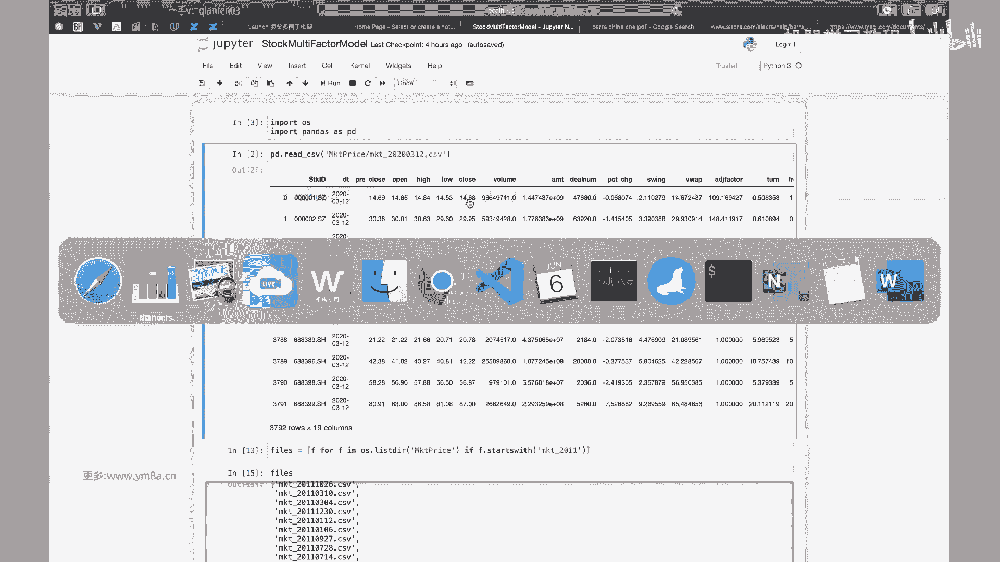

然后然后然然就涉及到一个，所以我们才会有复权的这样一个概念，这除圈除夕什么意思呢，就是因为叫stock spits，就以同样的来说，我为了市场的流动性，或者是基于种种因素，我比如说我现在是100块一股。

那100块一股的话，那整个公司的股东会觉得说OK这个100块一股，大家买一手的话就要啊1万块钱是不是有点贵，那那那我是不是可以考虑说我把一股拆成两股，那我同样的这时候我就变成50块钱一股。

那这个时候就说哎，这时候散户投资者会觉得OK之前要买1万，买一手是要1万，但现在只要5000块钱，那那你说我可以，其实说我整个公司的总市值是没有变化，但是整个整个股票在市场交易的流动性。

是去是可能会去增加的，所以大家会去有动机去做这样的事情，对，那么那么那么其实说整个股票，就是说从上市以来，随着股票的价格不断去上涨，那么如果说我不去做这样的spirits。

那么它的价格可能说是涨得非常的高啊，但事实上就是说事实上是说，历史上每一只股票，可能多多少少都会去做过一些呃，不管是分红还是说是去嗯，还是去还是说是是就是比如说是十送十之类的。

那比如说有stock spirits，有这样的出现的话，那那也就是说，其实我们现在的价格，并不是反映出真实的当事人呃，并不是反映出当时而真实的这样一个呃价价格，我们可以看就是说在这里面有复权方式。

我们现在如果是采取不复权的话，呃是这样一个，价格，但是但是一般来说我们还是会去用复权的，这样一个数据，就是说如果说我是向前复权，向呃向向向前复权的是什么意思呢，就是说如果我是向后复选的话。

就是说我按照就是当时的，我按我按照按照嗯平安，就是说最刚开始上市的这样一个价格，然后我嗯我我把我把我现在，比如说我现在可能真实的价格是14块钱，13块钱，但是我按照从上市的价格，我去回推到嗯没有分红。

或者说是没有配股之前的这样一个价格，我就会得到这样一个所谓的一个，那也就是说我按照呃就是得到一个向后复选，这样一个价格呃，但是一般来说就是说我们在去做股票的时候，如果你算算收益率，可能大家嗯。

但是呃就是你这就是说我可以从当中去看出，真实的这样一个走势，但是事实上我就是说我得到的股票的价格，并不是我真实的这样一个价格，所以所以说我们更加就是说在呃常用的，我个人常用的是。

还是说是说就是说向前付钱的这样一种方式，向前复权的方式，说我保留我每一天的价格都是真实的，都是真实的价格，但是我去想办法把历史的价格，按照当前的价格去进行去调整，就是说其实向前复选和向后复选。

本质上来说只是对，就是说我参照了这样一个基数不一样，我目的都是说是希望说我股票的价格，去反映出我真实的历史的价格这样一个变动呃，不然说如果说在这边直接额直接分红的话。

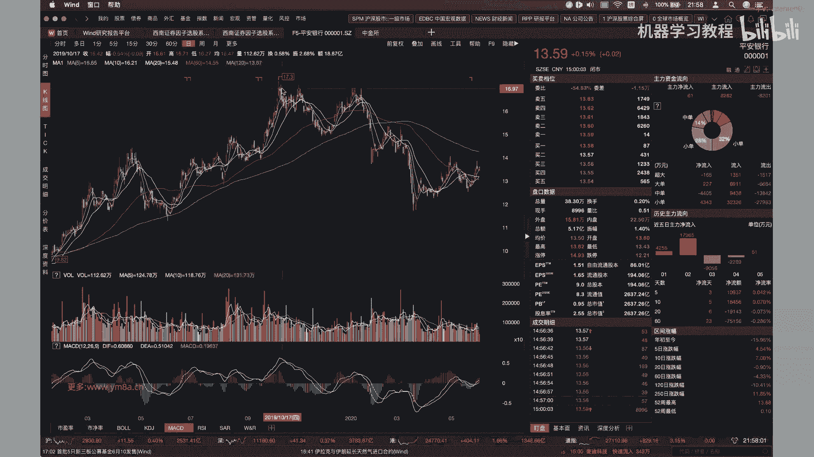

有额就直接是拆股的话，那价格可能会有一个比较大的变动对，所以这adjusted factor的话，其实你啊就是我们这边就是说，如果我们去把这样的一个close价格，14。

68去乘以它的这样一个adjusted factor，然后就可以去得到说我应该是得到一个呃，算是一个前复权的价格对，所以这个是大家要去注意的，然后这边有一个就turn是一个turn over对。

然后还有一个free turn over，是说是排除掉，就是嗯额持股5%以上的这样一个股东，然后是本章，是拿一个流通股的股东去做这样一个通融，因为我们要考虑说它本质上说考虑的事情是呃。

嗯本质上考虑是说不同的股票，可能说大股东持股的比例不一样，如果能交易的呃，这个这个其实非常intuitive，就是我能交易的股票占我呃，就是说我今天实际交易，占我实际总共能交易的股票的这样一个比例。

对啊，注意这边是就是这个，实际上是应该是就是percent，就是你看这个是已经是百分比了，然后这边trace status其实可以比较理解，就是说他是是不是正常交易停牌状态对。

然后包括就是说是持续了多少天，然后max app or down的话是涨跌停，为什么要有这一栏，就是说我们再去做回撤的时候，如果是涨停，你也买不进去，如果是跌停，你卖不掉，这部分就是是回撤。

是大家要注意就比较tricky的一部分对。

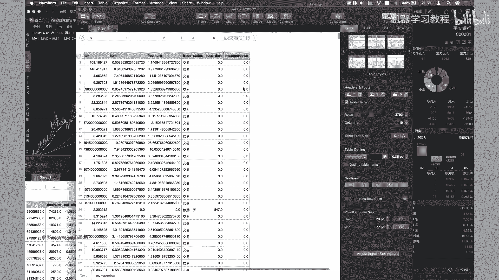

你要你要去做相应的调整对，然后其实说股票这里面还有一些坑，就是好想一下，就是嗯，对呃这是行业行业行业变动的问题，对然后包括说有一些股票是退市的问题，其实就是大家这就是处理的时候，有比较多的细节。

可能就大家在呃待会就是回去写作业的时候，就是得去额外的去注意一下啊，包括就是停牌的处理，所以然后以及嗯然后中证500，我不我不太确定，中证500就是他变更的频率是就中证500。

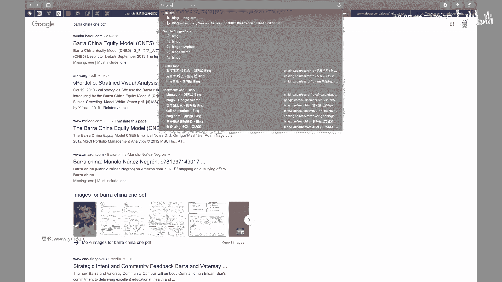

因为可能说有一些股票会调入，会会调出，就是如果遇到这些信息的话，就是大家可以去正好是去。

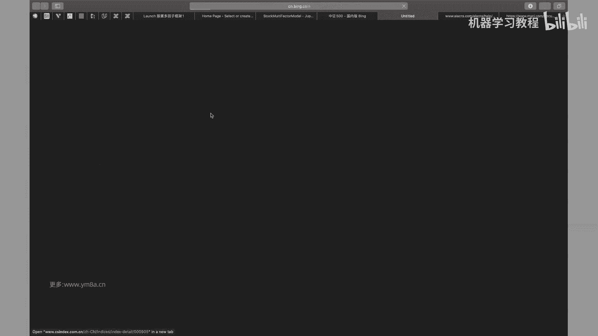

去就是编制指数官网去了解了解一下，就说他到底是怎么做的对吧，他其实是剔除了沪深300之后，然后就是前五指只股票，然后的话呃就是要去看一下，就是他的就是包括就是他的调整对。

这应该是我记得是每半年还是一年会调整一次，所以这这个时候就是嗯，这个时候大家就需要去注意的，就是我回测的时候，历史上，我应该也需要去拿到这样的额一些名单对，因为如果说我们去。

我们以中证500或者沪深300，作为股票池的时候，以我们选股的就是stock universe，只能是基于这些股票去进行调整，然后嗯，当然当然就是说这里面还有一个小trick，就是说。

事实上我不用非等到指数样本调整的时候，才去真正的去调整，因为事实上有些股票已经，我们可以大概率的确定，就是说他已经不会符合呃，就是指数成为指数样本股的这样一些条件。

他已经不在前800名或者是前300名之内了，那么我们再去调仓的时候，可能是不是可以考虑去去去提前调仓呢，就是说我不用非要等到指数公布的这一天，生效了，这一天再继续进行调仓，而我在就说我股票构建的。

我股票performer去构建的时候，我可能提前一个月甚至两个月的时候，我就会去逐渐的去考虑去调整这样的仓位了，这个是实际交易过程当中大家去考虑的，当然我们就是说在呃在研究的过程当中。

可能就是说大家先去不用去考虑，就是说去不用去考虑，我去提前调仓，我只需要去根据历史上就是呃，沪深300和中证500的，我每天的股票池是什么就可以了。

对呃这部分也是就是呃可能大家得去自己，就是说把历史上的或者想办法去拿到历史上，就是每一次嗯，沪深300跟中证500调整的这样一个名单。

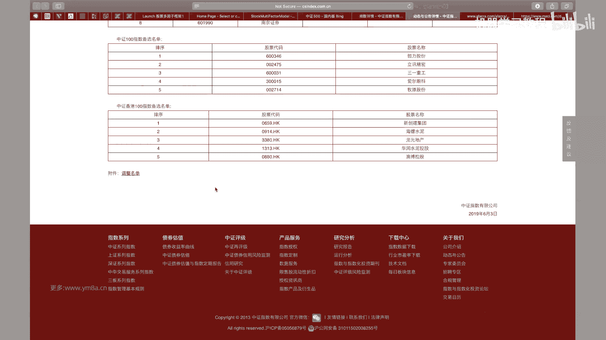

那么大家在选股票池的时候就会要去，其实是去要就到了，当这相应的调整期是需要去看，就是调整我们的股票的，对，就我们计算因子的话呃，我们比如说我们这次可以按沪深300或者，中证500去做，我们不一定。

因为我们实际上要做的时候，不是说针对所有的股票都去算这样因子，我们因为我们的股票池决定了，说只能是在中证500内去选，所以其实我们只需要带对中证500进行嗯，去进行相应的计算就OK了。

我们每天实际上做的是一个slice，就是把呃3000多只股票当中，选取我们需要的这些股票来进行计算，对对，所以可能这次作业的时候，大家会去算因子的时候，可能会发现。

就是可能会有一些有挺多地方是需要注意的，就是大家可能都比较小心一点吧，就不像之前的期权或者是期货，就是其实我们整理好了，合约数据相相对还是比较简单的，嗯只要按部就班的去做就可以了。

那这里面可能大家处理的时候，会有比较多的细节要去注意，然后嗯对，然后事实上就是嗯还有一个就是你看吧，就是如果看看自己计算机，能不能是我这边只漏掉了一年的数据，我是想如果去漏的7年的数据。

可能电脑都会不定不一定撑得住，对咳嗯，这边一年的数据差不多就是52万行对额，然后反正其实其实说我们去算因子的话，嗯你只需要去啊，不管你是按照股票作为主index stock id。

还是说date time作为index，其实呃相对来说有了我们之前的这些公式的话，就是说你只要整理好，本质上来说去算它的因子，应该来说是比较好去做的，对这这部分的话就是我会把数据给了大家之后。

大家去课后开始去测试一些因子嗯，就噢我们去会基于就是我们今天讲的这样一个，就是这样的一个多因子模型的框架，去来测试一下，就是我们先去完成单因子测试的这样一个部分，然后尽可能的说如果有可能的话。

我们是把它的额最好是做一下分层，去做一下回测，看看会怎么样，对就是我们只是再去测一下，就是单个因子的这样一个效果呃，然后的话对，我觉得今天我要讲的主要的东西就是这么多。

然后关于就是收益模型跟风险模型的话，我们还有下面的课去接着讲呃，今天的这些东西对可能就是讲的比较多，股票多因子方面的一些东西，但可能扣定的部分没有特别多，因为我觉得可能涉及到的东西。

其实之前我们就基本的一些操作，可能我们之前也都讲了，然后如果有什么困难的话，我们下节课呃再会对它进行，对大家同学们当中遇到的困难进行调整吧，对然后主要的就是我想对，主要是想补充一些。

我们可能会用到的一些细节对，嗯大家还有什么问题吗，横截面上买大的或者小的来评估因子的表现吗，嗯就是就是因子来算出来之后，就是说嗯对你可以这么理解吧，就是说我们不是把因子说算出来之后去分层嘛。

根据不同的层数啊，也就是说分为五层，我们看每一组，我们事实要去把每一组持仓的这样一个表现，都去给大家去prod出来，就是呃嗯就是这篇研报里他也提到了，就是，他测试的这样一个结果，哎这个他还没有分层。

如果，我看一下他这个，嗯对就理论来说，我们是需要就是说我们分了五层的话，我们是把每一层的收益都要去画出来的，对就这样，我们其实能够看出他是不是这样的一个因子，是不是稳定对。

对其实我个人就是比较倾向于就是说啊，如果大家有没有基本面的数据源，或者是呃或者是稳定的数据的话，呃尤其尤其是维护基本面数据，其实还是要花挺多功夫，我个人倾向于是说大家是尝试的。

还是就是说去做短周期的量价引资，包括就是说CTA，其实也是建议大家就是从日内开始去做，因为因为呃不仅仅说是数据容易，相对来说容易获取，因为呃我们只需要去获取股票的日的交易数据。

那其实这样不管是从新浪财经还是从其他地方，你都可以获取得到，然后还有一个就是说因为相对来说呃，数据量比较丰富，我们更加能够容易判断出，我这样的一个因子是不是有效对，而不是说像而不是说是像基本面因子。

如果我真的是一个月测一次的话，那一年只有12次机会，那其实不是特别理想对，嗯OK嗯好的，那大家还有什么问题吗，就这节课可能刚开始是说我讲到讲到这些东西，可能大家会觉得有点抽象，呃我觉得是比较正常。

因为其实我自己之前刚开始看的时候，也是会觉得嗯有一些困难，但是但是其实你嗯你写一些代码之后，觉得去，就是说包括说怎么去对因子做标准化处理，写一些代码之后，大家可能会觉得对于他有更加的深入，这样一些认知。

然后如果觉得还是比较困惑的话，其实呃也可以去参照互联网上，我不确，我不太确定什么各种优矿RST框之类，是不是也有一些比较成熟的就是多因子的模型，大家可以拿过来去对照看看看。

因为因为我看到的很多开源的模型，并不是把每一步都做的，然后大家也可以去把它拉下来看一看，就是说就是拿别人的数据，跟我们自己构建出来的数据，做出来的因子效果是有怎么样的差异。

对然后他为什么要去做这样的处理，对然后这两篇paper课前应该都是已经发给大家了，对嗯OK所以对，我个人其实是还是说我倾向于，就是说大家去尝试一下做短周期量价因子对，因为基本面的数据。

我尽量是在下周的时候给大家准备好对呃，然后嗯基于短周期的量价因子，我们其实事实上我们现在已经有了数据，以及也有了相应的基础的知识，是可以大家去做起来的，额OK对，然后嗯那大家现在还有什么问题吗。

OK其实忘记了它这边其实是有这样的含义的，对，Return d t m，然后包括delay，Whatever，对，所以其实不用不用去搜word框搜呃，直接参考他这个就OK了。

就是其实我觉得就这个还是挺良心的，就是不像有的演报只是给出来说，OK我这个因子表现挺好，但至少这个因子是给出来了，嗯就是我这个因子是怎么算的，对，所以其实大家可以去是去验证一下吧，对。

然后这里面就是可能涉及到，就是呃这样一个约束，我们下一节课再去跟大家去讲，然后其实嗯对，我们因为刚刚有提到一些就是行业的约束，但是其他的比如说在RCU2，就是那个二组合的优化里面。

还没有提到比较多的东西呃。

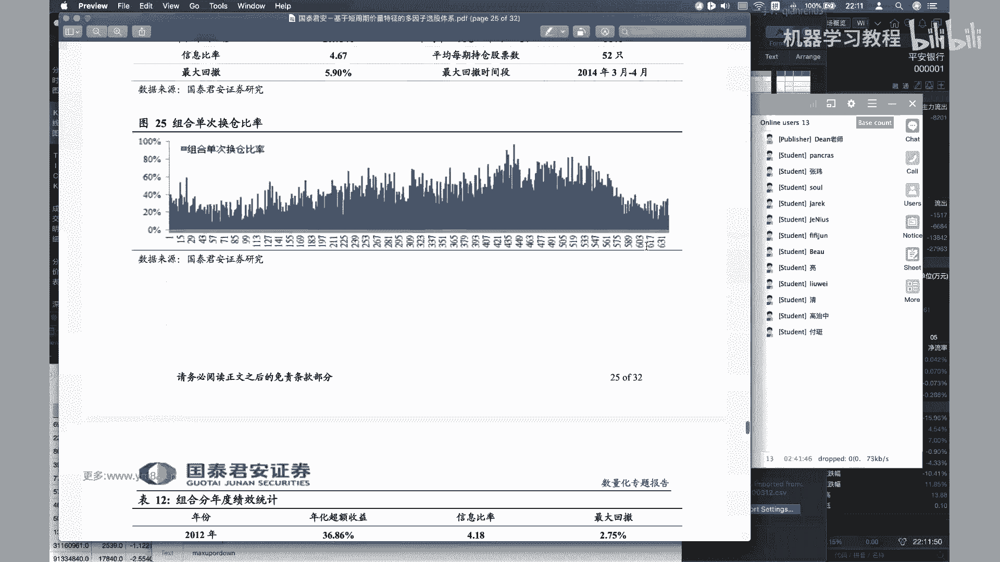

然后想要对多因子模型去详细了解的话。

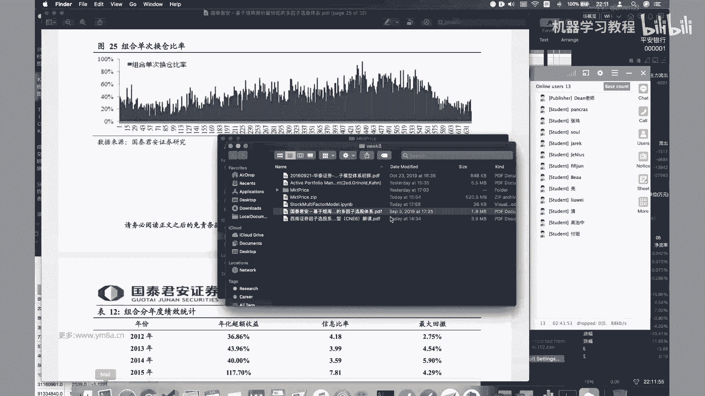

还是去看这本，这本应该有有有中文叫主动投资，主动投资组合管理，The active of folio management，就其实它里面的东西还是比较多的，对其实大家也可以看到。

就是这部分内容相比于就是CCTA里面，其实是涉及到了一些，就是可能就是主要是线性回归吧，对于对涉及到比较一些多的统计的东西，然后如果对于同学们对于里面涉及到的啊，多元线性回归。

然后然后统计包括嗯t stars，就是T这是什么意思，那么大家都可以去呃，觉得相应的基础还是要去去学习和补充一下对，然后对其实其他倒没有什么，因为那也不会有太复杂的东西吧，应该就是基本上就是基于本科的。

本本科的统计的一些东西嗯，我们还是就是记住整个这个流程图，对我们现在开off走道去尝试去做这个嗯，有效因子的识别对，但其实这两个我们都还没有去做对，还是有挺多东西的，但是其实大家也熟悉一下。

就是整个流程，然后里面具体的细节，可能大家真的得花时间去看这个研报，因为这个这个断断续续，我可能前后看了好几个月了，对这个也确实是比较经典的一篇研报，然后然后包括它基于后面的一些研报。

我也会给大家找出来，然后就是我觉得就是还是搭起来，先先有一个就是最基本的概念，然后我们一步步的把整个框架给搭起来吧，然后对，因为漫画确实还是属于一个，就是需要大家去不断去迭代改进的过程。

不太可能是一蹴而就对，好的那如果就是大家没有什么问题的话，我们今天的课就先上到这边，好那我们今天课就先到这边呃，大家晚安。

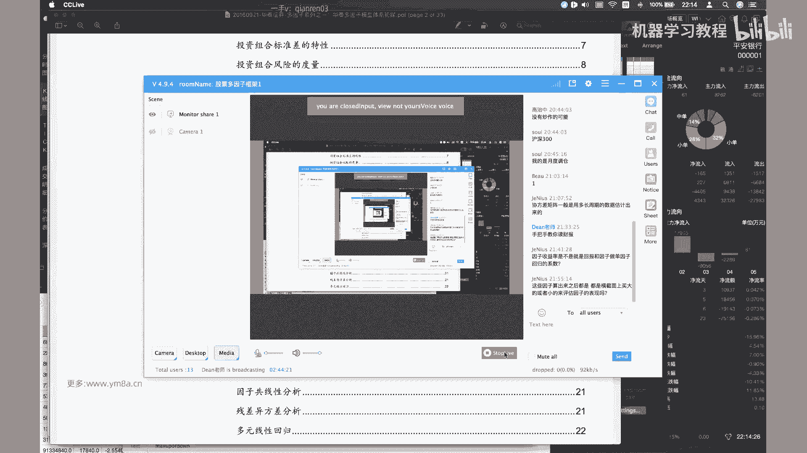