# 2025最新AI量化交易实战教程，三小时入门到进阶！清华计算机博士讲解，零基础也学会了（AI人工智能丨数据分析丨数据挖掘丨机器学习实战丨深度学习丨编程） - P8：第九章： 股票多因子框架2 - 机器学习教程 - BV1ujk4YKEw9

诶hello，各位同学能听到吗，唉各位同学再稍等一下，我们现在才来了两个人，嗯各位同学，我们再稍等一下啊，我们再等一等其他同学呃，这节课呢呃我们是接着进行多因子模型的讲解，然后这节课可能会偏实践为主。

然后主要是嗯，我确实这两周花了也比较多的时间，是去找到这些数据，以及怎么把这些数据整合起来去进行，我们多因子的就是单因呃，各个因子的检验流程，所以这节课我们着重的是嗯就是否专注在。

就是说我们怎么去运用这些因子对，以及包括有很多的数据处理的部分，然后刚刚发到微信群里的是呃，是一部分的股票的基本面数据，从2016年开始，然后还有一部分现在还没有上传完对，然后呃基本面数据里面。

大概呃覆盖的应该是一呃110个因子吧，如果记得不错的话，是基本面的因子对，然后从2016年开始，2016年之前的还没有下完对，嗯然后加上我们上一节课的一些基本面的呃，就是呃烂价的数据的话。

在market price里面应该其实很很多，很多的因子都是可以去尝试去做了，嗯OK嗯，我们就先开始吧，对我估计今天可能也没有很多人对呃，就是首先让大家思考一个问题，就是说我们在进行多因子模型的时候。

到底是需要哪些数据呃，各位同学可以想一想，然后那个敲在聊天对话框里，然后其实我这边给了一些对，下面其实给了一些，但是大家可以想一想，就是它对应的是需要的什么，尤其到底我们需要的是哪些数据。

对因为这个事情还是蛮重要的，对呃可能可能很多，就是其实之前也有一些朋友，就是说是他可能是做机器学习相关的，然后嗯对，可能用神经网络暴力拟合去做了很多预测，但是有一些最基本的东西，可能就是反而是错过了。

所以导致做的策略看下来，就是说实际交易的效果也不是很好对，呃大家可以想一想，就是说我们到底是需要哪些数据，就就这这个问题，或者说再具体点，就是说比如说我们的目标是嗯，对标中证500这样一个指数对嗯。

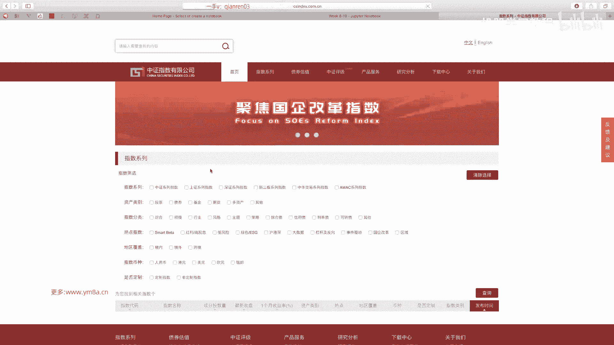

对，首先首先我们要了解一下是什么是呃。

中正，中正我看一下，能。

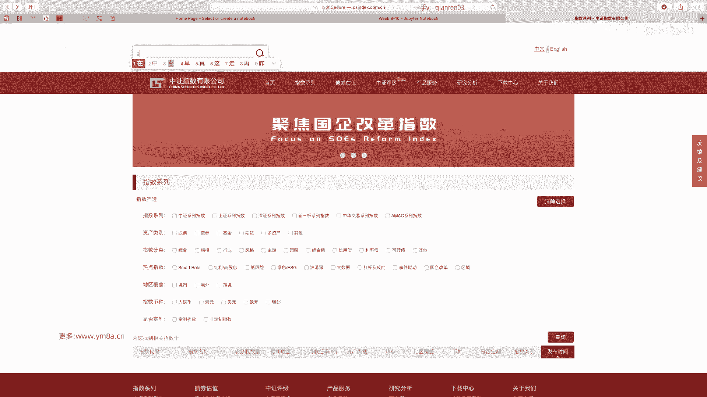

我们找的是OK中证系列指出。

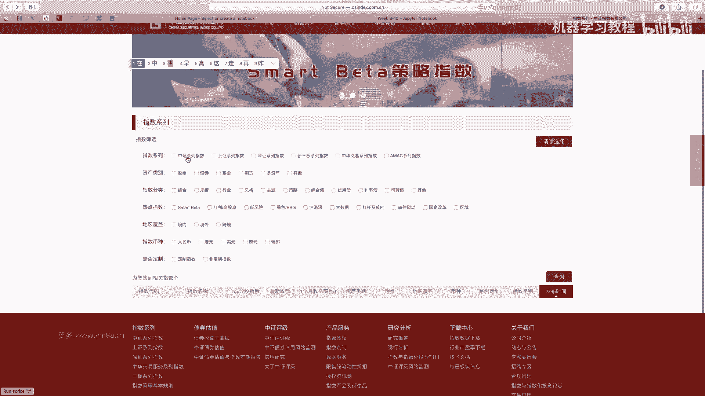

OK我重新搜一下吧，中正，对，首先我们要知道就是说它是什么，中证500指数，OK对，首先要知道的是，就是说我们假定额，我们现在就是benchmark，基准是我们选的是中证500指数。

他是排除沪深300的，就是总排总市值排名前300名的股票，然后大概是靠前的，然后之后的500只股票组成的，所以它反映的是A股市场当中，一批中小市值的呃，公司的股票嗯，对呃然后然后就是说大家想一下。

就是说为什么，就是说现在市场主流交易的都是这五，就是这500只股票，其实之前我们也提过嗯，嗯就是一方面要考虑说股票要有一定的市值呃，每天的换手率要能够得到保证，同时每天股票还有相应的波动。

那么它综合看下来呃，前300只或者说前50只股票我们不会去碰，是因为呃相当于是大盘，相当于是大盘股波动的比例比较小，比如说银行股对啊，然后如果是太小的股票，可能会有啊。

就是可能会有流通性或者是其他方面的问题，所以综合来看呃，500只股票既反映了说是算是，说是A股的一部分的中坚力量，但同时又有一定的就是说错误交易的机会存在，这个时候我们才会去考虑。

去做一个多因子的模型对嗯，对然后我们看一下，就是说呃就是为什为什么要去看这个指数，刚刚还是回到刚刚那个问题，就是说我们在多因子模型，我们如果去对标这样的一个呃中证500的指数，我们到底是需要哪些数据嗯。

大家呃想想到的话就是往这个聊天框里去，就是敲到这个聊聊聊天对计划对话框里吧，我想问一问大家对，就是说我们要去做这样一个呃，其实研报里也提到了，我们需要做这样一个多因子的模型，到底是需要哪些数据。

就总不能说我们直接拿着，我们就给到我们的这样一个就是market data，就是market price，直接就去做这样一个模型，显然是不太靠谱的吧对吧，因因。

因为首先market price给的是一个，全市场的这样一个模型，全市场全市场的数据对，其实那全市场的数据的话，那其实很自然的，第一个问题就是说嗯，既然我们要做的是我们的股票池是中证的，抱歉嗯。

我们的股票池是中证500，那么所那么肯定要知道是说嗯，至少我要知道就是说它的收益率是怎么样对，所以这个其实第一个，我们需要的是说指数的价格，另外一个人说我们需要知道是哪50只股票，嗯得500只股票。

所以我们还需要的是指数的成分对，因为这样的话我们选的股票池，我们选的股票都是从这500只股票中去选，我们不会选500只，500只股票之外的对，这是就是说我们交易的股票池，所以说这两个数据是一定是需要的。

交易费OK敲其其提的这个交易对，OK然后我们看这边有同学说是我放到这来嗯，嘶怎么拖不过来呢，OK对他需要的是中证500的价格数据，中证500每只股票的基本面，行业分类，财务基本面。

OK其实嗯这位同学提到不少，然后我们接下来要看，就是说能想一下，就是说呃基本面数据对，其实其实他这边提到有一个很好的是行业分类，因为还记得我们上一节课说，我们需要做行业跟市值的中性。

就说我们很多因子本质上是依赖于行业的，我需要把题剔除行业的部分，把剔除行业的残差残差给暴露出来，所以我们这个其实就是说是，成分股行业数据，大家注意一下，这个数据是一个静态的数据吗。

就是说呃想象一个公司如果被并购，或者说是重组导致它的行业属性去发生变更，那么其实我们可以说成分股行业数据，它不是一个静态的数据，所以我们需要的是它的就是一个具体的分布嗯，或者说是变动吧。

成分股行业变动的数据，我们需要知道每一只股票在什么时候，他从哪个行业变成了变成了另外哪一个行业，我们需要这样知道这样具体的数据，这样我们每天我们按照我们的交易频率去进行，调整的时候。

才会知道我们就是怎么去做行业中心，因为行业中性每每对应的具体的一个行业，它每天是会去进，社会肯定是变化的，然后这一部分呢，我们我个人的习惯是拿中信的呃，一级行业指数，当然你也可以说是去做二级三级。

就是说这简单来说这个一级就是呃，待会我们会去看一级的话，就是说把行业分，把整体的A股分成29个行业，然后二级的话我们会针对的一级再进去，再进行细分呃，比如说我们的化工有呃，我们这儿有基础化工。

然后还有嗯其他的各种衍生的对，然后然后包括我还可以进行细分到二级，细分到三级，但是为什么我们不会就是说我这边只用一级呢，因为我们在具体的做，如果要去做行业中心的话，我们想象一下500只股票，29个行业。

其实平均一下也没有很多时间了，如果再去分，再去分二级三级，那么可能我分到三级的时候，一个行业里面可能就那么一两只，两三只股票对，所以这会给我们的自我行业中心造成困难，所以一般来说。

可能我们做到一级的行业指数就够了，当然也可以试一下，是不是说我们可以再去进行进一步的细分，二级和三级对呃然后这边提到的是，对这个肯定是对，基本面数据或者说加财务数据，基本面数据。

财务其实啊对财务三包括的基本面板，然后我们的量价数据，对，其实因为这个量价的数据，就是我们可以算出成分股的每一个的收益率了，然后其实还有一个比较重要的，就是说我们要去做。

呃行业中哎我们要去做市值中心的话，其实我们是需要知道呃我这个呃成分股的，你可以说是市值，或者说是，权重吧对对，然后所以基本上我们的数据就是包括在这儿呃，但是多因子模型就是比较复杂的地方。

是主要是在于呃指数我会定期的去进行调整，行业会去变动，然后包括提到基本面的数据的时候，就是我们经常会有，比如说嗯新股交易，就是新股上市的时候连续几个涨停，那这部分我们肯定是交易不了。

所以其实这里面就会带来一些额外的，其他的数据，比如说我们需要额，股票的上市日期为什么需要这个呢，我们在做做多因子模型的时候，可能我个人的习惯是上市一年之内的股票，我都不会去交易。

那么我们需要去把这部分给去剔除，对，OK所以到这一部分的话，基本上我们可能所需要的数据都是这些了，然后我们要去看一看，接下来怎么去具体的去处理这些数据，OK然后对。

我们先我们先来看一下各个数据是什么样吧，我们对它有一个直观的感觉，我把这部分当然对交易，交易费当然也是很重要的一部分，就是说我们在回测的过程当中，我们要去考虑我们的这样一个的交易的成本，对。

Um okay，我们先花点时间，把那个把我们要用的数据给先load下来了，因为确实数据会花比较久的时间，Um and so，对还是我们先去，我们先去看一下，就是说我们刚刚发到群里的那个基本面的数据。

它到底是一个什么样的格式，但我们还是按照每日去存储的，对，所以本质上就是每一个股票，每一天我们都会有各种各样的基本面数据，然后对应的这个他的就是基本面的因子的值，呃这个是从万德上拉下来。

然后如果需要具体的含义的话，我还得把它去找到一份中文的去解释对，去把它的具体含义给拉下来，就是除了前面的stock id跟data time，对，呃，大家注意说嗯就是因为就还上一节课。

我们提到说为什么要去每天都去拉这样的数据，因为只因为我们可以说是基本面的数据，或者说他可能会去更新，但如果说嗯就是为了防止用到未来数据，我们必须知道在当前的当下这个时刻，它的数据是什么样。

就比如说我们知道呃这里面3000多只股，2000多只股票里面一定会有股票，会是在未来会发生它的基本面的数据变更，比如说财报的修正，年报的修正等等对，但是在当前这个时刻。

我们是不知道它未来的数据会发生怎样的变更，所以相当于说我们在现在这个时间节点，比如说我们获取了今天的，我们过去了这周五的嗯，幺儿还是遥遥，嗯我看下这个数据是到哪儿了，K，比如说就是说。

假设我们是获取了最新的这样一个数据，6月1号的数据，我们相当于说把这个数据保存下来，就有就有了一个历史阶段的截图对，但即使说这个数据以后去更新了，但是我在6月1号我获得的数据。

始终就是这个数据不会是最新的数据，这样我们就是说最好是说每天去更新，我们的基本面跟量价的这样数据，这样防我们才拥有，最最就是说最贴合市场实际的这样一个数值，防止因因为因为很多人再去做回测的时候。

他只会拉一个最新的一个数值，就是说嗯即使说你说是2019年第三季度，第四季度这样一个财务的数据，但是这个数据很有可能是在，2020年去进行更新的，如果拿这样的数据去进行回测的话，那大概率是用了未来数据。

你可能表现很好，但是实际交易的时候可能效果就不是这么好了，所以这个这个算是呃基本面数据的一个坑吧，对，所以其实就是说是需要比较大的精力，去维护这样的因子的，就是维护基本面数据。

这样的嗯就每天更新的这样一个data pipeline对，但其实这个呃我也不能保证说，我给大家提供到的一定是最为准确的，这样一个数据，因为有些数据可能也是没有办法，就是只能是就是说已经过了这个时间节点。

17年的数据，我如果只能拉到就是16年调整过后的数据，对嗯等于说就是说对于数据的质量的去追求，其实是一个无穷无尽的这样一个步骤，对呃可能会花掉大家比较多的精力，就是在实际交易的过程当中。

对可能嗯真正用于说是去调整模型，倒不一定有那么多时间，但是可能数据就是提升数据的质量，其实说对于整体的表现提升是有，相对来说是有更大的意义的，对，OK就是这这部分是我们看到的。

就是一个呃基本面的这样一个数据，然后然不是所有的数据它都会有，然后呢，这个时候就是说嗯，再去构建基本面的因子的时候，你可以说是去剔除，还是说你采用行业的平均值去代替等等，有多种多样的方式嗯对然后。

对这部分我学，然后是量价数据，对，然后还是，嗯对高开低收，然后还有一个呃就是复权因子对，然后他交易状态，然后其实说我们在算收益率的时候，我个人的习惯是把他的close price去乘以。

这样一个adjusted factor，这样我们得到就是复权之后的这样一个价格，然后再去用复权之后的价格去算他的daily return，或者是历史上的收益率，那呃如果你不这么去做的话。

那就需要更多的信息了，你需要把具体到历史上，以及它的份额是怎么调整的，你需要把这个信息给拿到，然后再去算它的收益率，那如果是简单一点的话，就是直接把他的cos price去乘以。

这样一个adjusted factor，然后我们就可以得到他的一个adjusted price对，然后你再去拿它去做一些呃，哼量价上面的一些因子，对这个是相对来说是比较呃可行的，这样一个步骤对嗯，Ok。

然后的话，然后再看一看，行业的变动，我们可以加好，6000905是中信额，这是是中证500指数的，唱一个security code，哦sorry，这个是指数的，这个是指数的，这个不好意思，却是指数变动。

就我们说到就是说呃，在这个里面它会进行指数的调整，剩余股票按照前500名的股票对，就我先剔除了300，然后去排剔除，就是最后的20%，然后是选了要二前500名，所以说呃。

因为我是按日均总市值去从高到低进行排名，但显然这不是一个固定的值呃，那我需要到一定时间的时候，我需要进行调整，一般来说好像是每半年去调整一次，对呃对，是6月跟12月的第二个星期五，的下一个交易日。

然后所以所以所以说就是我们会有这样的一个，呃股票的，就是我我需要知道他他是是挪进来，还是是挪出去的这样一个状态对，所以所以你看的就是这是他具体的发生日期对，然后这个应该是整个历史上的可能都呃。

应该不是整个历史上，应该是近几年的都在里面对，然然后的话对index这是指数的，然然后就是因为说我们会发生变动的话，其实那对应的每一期的，其实指数的权重也是会发生变化的，如果我们要用16年的数据的话。

我应该有这样一个um，Sorry，Should be wait，嗯OK扣点就扣点的问题看下，我看一下这个数据，OK是这样嗯，应该是就是看到从万德上拉下来，他最后最后没有剔除，然后。

然后还有一个有中文字符，这个是额这样一个指数的这样一个权重，然后这边应该是百分比对，就这个是已经除以除以过100的对额，然后这个是股票的代码，然后股票的名字，然后一般来说我们在做呃交易的时候。

就是说做量化的时候，我们把这个作为一个key对，就是一个一个是股票代码，一个是时间，因为他的名字可能会去变化，有时候是s st，有时候是新s st对，然后这个industry其实我们这边不需要。

因为我们接下来会去自己用呃，中信的一个行业分类，嗯中心的对是这个嗯，Stock sector change，呃这个数据呃，这个数据如果需要的话，我现在同学们现在需要吗，就是还是说先看我做，需要的话。

我也可以就是直接先发给大家，嗯这个表格是从记录了2003年开始，中证指数的这样一些嗯，这边有industry，然后然后我们看一下，主要是着重看这个industry code。

然后他这个是static呃S我也不知道是什么，Static security maybe，然后中信证券，然后前两位是一级，然后二级三级，所以呃对industry code s c看一下这个有什么啊。

对这这样一看就是现在明显一点，就是我看他有多少个，对190一个，就是说我们刚刚说为什么不把它分三级，那平均分到三级，也就是两个二点几个股票，那显然会有点少哈，所以我我们我们接下来就只要去。

只要是去用他的一级，其实就OK了，呃我这边已经写了，就是sector code对，然后然后它对应的这个sector是什么东西，然后要注意有一些可能是新股上市，所以他当时是undefined呃。

就没有问题，对没有问题，然后之后的话，哎，这就是说其实这个东西也是，你是需要去每天去更新的，因为因为呃你当然就是说如果有新股上市呃，你可以去在中信指数调整之前，我去把它人为进行修改。

那当然对于我们当前这个模型其实是不需要，因为我们刚刚有提到过，说我们只去交易，如果我只去交易嗯，上市呃，一年之后的股票的话，那么其实我们是不用去担心，中信指数到时候还没有提供他的行业分类。

因为一年一般来说就如果他没有提供的话，那那算是他的公司的市值了对就所以呃对，然后的话OK我看一看，Uipo date，OK还是encoding的问题。

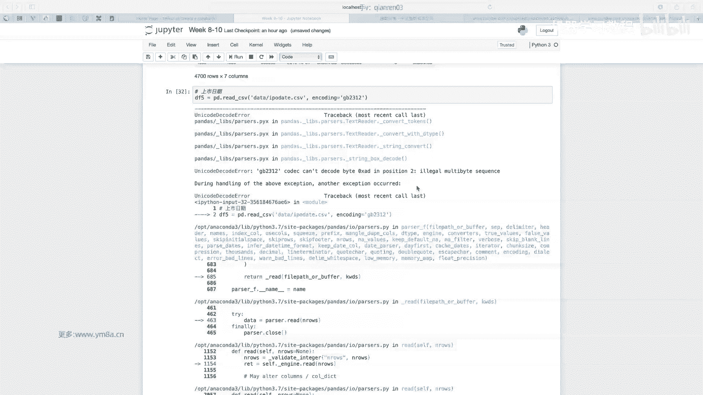

嗯这样吧，对，就是我们选取的是每一只股票，这样的一个上市日期，对，这样你就可以知道在每一天的时候有哪些股票，我的股票池里面是什么，是哪些股票对，其实其实这个这个东西是说，你再去做选股的时候是呃。

每一天你都会在中证500的股票池里面。

去选他的这样一个自己对，就是其实这样就OK，然后的话呃然后接下来就是，呃我们要去做的第一件事情就是说嗯，就如果因为我们要去去做行业中性对嗯，所以所以其实我们要做的事情，就是说我需要知道的是啊。

每天就假定我们的调仓频率是日，呃每天行业每天各个行业里，行业的股票有哪些，对这是这是我们首先要去解决的一个问题，因为呃因为既然我是按照日频去选股，那么股票额，那我尽可能的也应该说是去去日频率的。

去调整这样一个行业的，就是根据行业去进行中心化的调整，所以的呃对，所以接下来我们要先去做这样一个事情，就是大家回去看我们这样一个，就现在是你看到的是一个，各个股票的一个变动的表格。

对它只反映了说是每一只股票他是怎么去变化，对他是从呃，就是说他这边只是会只会反映每一只股票，历史上它变更了哪些行业对，那么如果他之前没有的话，我们默认就是说你看2003年1月1日。

是他第一次进入这个行业，对，但是之后的话其实说我们是需要根据他的，就根据他的，变动记录是进行实时的调整的，对，所以所以所以事实上就是说我们是需要一个function，是去维护，告诉我。

就是说我们这个function输入是什么，是当天的日期，然后我给定一个日期，然后你告诉我说我这样一个sector code，我应该把相应的股票的列表去维护出来。

所以这这个function就应该是实现这样一个功能，嗯so，所以这个这个函数应该是应该是怎么来写呢，就是说呃本质上来说你需要的是，Define，还有这样一个a stock list。

然后你的input是sector and date，the return是list of stocks，然后for sector on that date，然后你的sector呃，我这边说的是。

你可以是sector，是whatever，如果你用string对为为，为什么我这边用string，是因为我可以直接选它的数字的前两位，对嗯，那这样其实会省我一些事情，对这只我个人习惯。

你也可以就说index都无所谓，然后date的话，比如说我今天是，嗯我们选一个2016年的第一个交易日，就是说我选的这样一个日期的话，他也应该返回的是这样一个，sector对吧。

就是他应该返回的是当天是有哪些股票对，那这个这个这个事情对，是需要我们去来去做的，所以大家有没有有没有什么思路去做这个呢，可以想想，就是我们有我们我们已经有了股票的变动。

然后其实说我们只要是从这个表格里面，去重建出来额，相当于说重建一个动态的这样一个表格，对，OK所以我们刚刚不是说了，先是去唱吧，呃我可能是需要一个，我可能是需要这样一个cos来去维护吧。

对就是我可以把它做成，对，啊all right，所以第一件事情是，我们先需要去，去读取这样的，板块变化，嗯那这样，呃就是说我们就是要做这样的事情，最好最好是就是说很多很多东西都要去模块化。

因为我们之后你会频繁的去靠这个方式，就是说你每天你都会去得到这样一个sector列表，对你每天每个板块你都需要知道有哪些，有哪些股票，然后你才可以去，然后包括你甚至要去读它的，就是这个板块的市值是多少。

对，所以你刚开始就尽可能要想好，就是说我们怎么把这样的呃function进行模块化，函数名叫什么来着，Stock sector change，没错吧，Ok，OK所以我们得到的是这样的一个这样一个呃。

这样的一个表格，然后然后的话，其实就是在这个里面要做一些事情啊，首先我们的sector code其实已经读出来了，然后对，我这边说我倾向于把它是作为一个string来去做嗯。

我我倾向于把这string作为key的话，对这边其实可能还少了一个东西的话，就是呃我需要知道一个就是我的stock universe，就是啊当然这边也OK了，我们这边也OK，也。

因为其实这个里面已经给出了，我们所有的这样一个股票的这样一个代码，对，嗯因为大家注意这个里面可能是不是，可能是就是这个里面我们刚刚提到说，即使说它的三级行业，二级行业分类也都呃发生了变。

就是只要是二级或者三级行业发生变更的时候，他都会有这样一条记录，但是我们刚刚提到的，说是我们只关注一级的行业变化对，所以所以这里面可能要做的一件事情是，我想要去嗯，就是如果说他的。

如果说他的行业只是二级跟三级发生了变更，其实这样的记录我们是不需要的对，所以说我可以呃，因为我只关注他一级的行业，所以我先要去，啊remove这样的records，然后。

全职哎就是如果只有在二级行业的话，我是不需要去呃，去进行，就是呃就是我只要把这个，我就我就直接把这个记录去删除就好了，那么我们要做的事情是嗯，应该是drop duplicates，对。

A job duplicate，然后是，drop duplicate的话，但如果是要job duplicate，我们就是，呃我们最好是把他的这样，对其实是最好把它的呃，先把它加一列吧，就是加一列。

你要知道他的呃，这是sector，就是sector跟他的industry，跟他的security code两个一致的话，我其实就可以把它给去掉了，呃能给大家想一想怎么嘶，OK试一下，穿这不是K7。

然后我们按我们按股票的代码去进行排序，这样我们看一下，就是说这样是不是能达到我们想要的，这样一个效果，Security code，Ok，然后的话，我们来看，SS大K，然后我们选一个吧。

也没有哪个有多个的变动记录了，嗯让我看一下这。

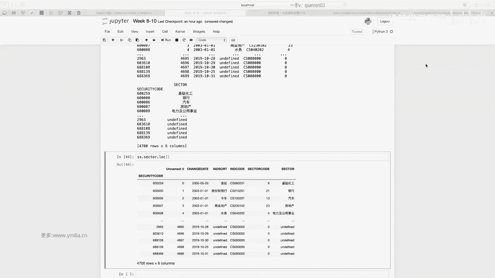

这OKSRY拿错了表格嗯。

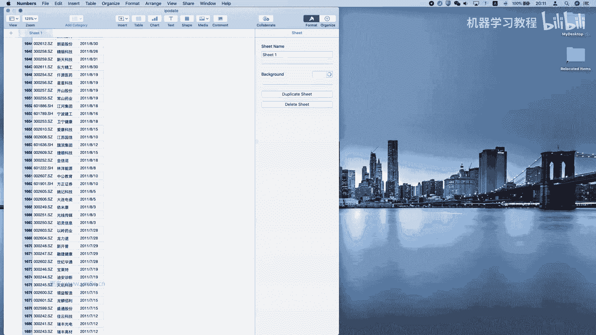

OK就事实上我们这张表格里面是已经是去呃，应该是已经是，或许我之前可能已经把他给drop掉了，所以可能这边表格里还看不到，就是有重复的，就是说只有二级和三级行业变更的记录。

但是但是如果说你拿到的是一张就是完整的呃，历史上的每一个包括二级跟三级的行业变更，你是需要去在这边去做这样一步一个步骤的对，然后OK然后的话嗯OK，其实这样子的话你就可以拿到这样一个，战士没嗯。

每只股票的行业变更记录，然后那其实在做get stock list的时候，你只需要去拿到呃，就是你只需要去拿到额最新的这样一个呃，你只需要知道每只股票相当于说最后一个值，就呃。

在当前就给定日期之前的最后一个值就OK了，对这就大家明白吧，就是说嗯比如说是2016年1月4日，那么我只需要在整个data frame里面，是取2016年1月4日之前的变更记录。

然后再取里面的最后一个记录，那其实我就可以得到它的sector code，所以呃然后接下去是要做的事情是嗯，这是因为我们这边是self，DF这我直接失去，Sector，然后，然后这边有change呃。

这边有个change date，所以我们刚刚说是只需要是取在变化日之前的，那么我们就是呃change date，然后小于我们的，哦我不确定字符串是可不可取啊，所以最好是，啊我们把他这个时间变成时间戳。

可能会好一些，对哦，最好是把它变成时间戳，你们试下字符串应该也可以比，2月其实就是大家注意，就是呃呃最好就是说变量名不要去用date，但是好吧，我可能是like呃，因为因为这个跟我们的包里面的名字。

会产生冲突，不是一个特别好的编程习惯，但是somehow我习惯了用这个对，那还是我们叫它什么呢，就是current date好了，还是把它变回来，免得以后自己看不清楚，对a current date。

就这一步的目的是我只选取在我，我比如说我在回测或者研究过程当中，我只选取当前时间节点之前的股票变更记录，以获取这个股票最新的行业行业的记录对，然后，所以df change date小于，对。

然后我要选的第二个事情是sector se，这边还有一个校服，然后这个是DFDT嗯，啊sector，我觉得seer怎么会是一个，洪刚刚说我们要的是一个string，哦那没问题，我在这边处理一下就好了。

呃sector的话直接取这个，For x in t done in the stry code，然后我们取它的two two four，嗯这样应该是对的，然后这样子的话我们就可以去。

return那这个时候我要return的是什么呢，嗯啊你直接return它的index就OK了，呃我试一下啊，SC我们要去dead stock list，然后我们看银行股吧，零六，然后，怎么会是空呢。

哪里出现了问题，我先看一看嗯，Soft door sector，我每天都会去，4700，你觉得这行可能时间还是要去处理一下对，嗯267，OK那现在OK我是刚刚没有加载吗，银行股有这么多吗，Ok01。

然后，24，OK哦忘记了，这是全市场，不不仅仅是中证500，所以是quite reasonable对，所以所以这样子的话，基本上就是实现了我们这样一个功能呃，我们再回顾一下整个流程。

本质上就说我需要的是在历史上，每一个时间节点，任何一个板块，我要知道有哪些股票对，这就是我们直接要去解决这样一个问题，然后你可以通过这样一个stock sector的，这样一个cos去维护。

而这块大家还有什么问题不，就因为拿到的是对啊，这这这部分主要是呃，如果只有二级跟三级市场的行业变更的话，呃，就是大家如果拿到原始数据，是只有包括这个二级和三级行业市场变更的话。

那你肯定需要job deprecates，对，就是说如果只有这个变更，我其实是不care的，对，当然有一些呃有一些人在去做的时候会把额，就是会把公司按照行业去进行呃，呃公司按照行业去进行。

就是权重去进行划分，就比如说一个公司额30%的是行业A，40%是行业B，但是我们这边简化处理的时候，我们不做这样的处理，我们只把是把每个公司归到一个行业，OK嗯这部分大家现在还有什么问题吗。

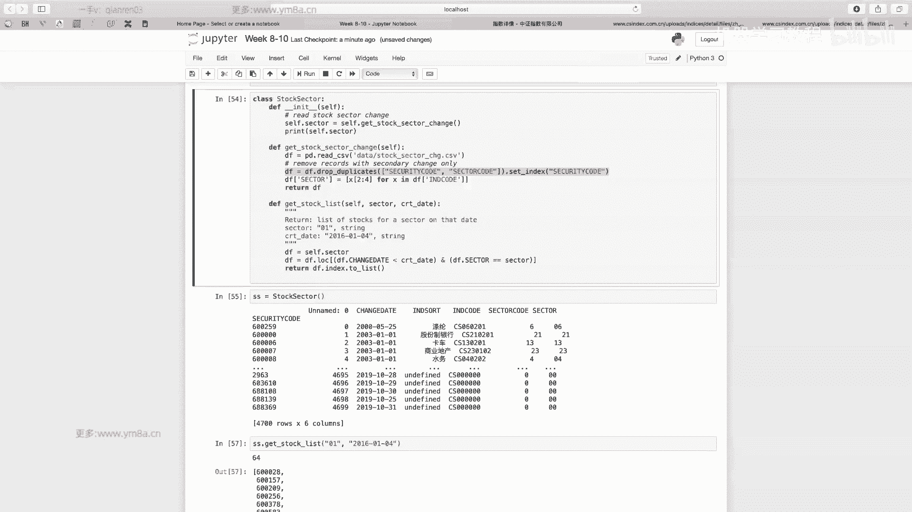

OK我们先休息一下，嗯这个朋友说为什么会出现。

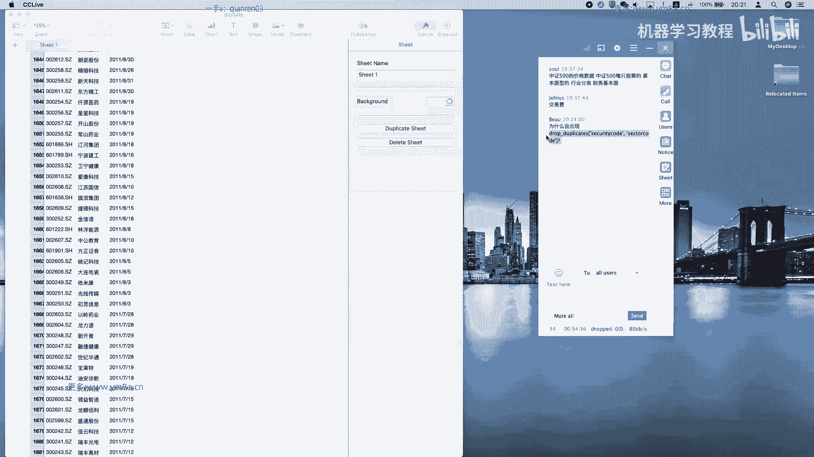

就是哦sorry，我这边是不是sector code，不是security code，就呃就是说本质上来说就是呃之前燃烧，我们学我们想做的事，Sorry，我是不是应该写错了，这个应该是，和sector。

Sorry，这样可严重的问题，谢谢提醒，这边应该是sector，就是说我这边会呃只去变更他的，我把这个放前面，这样才对，谢谢这位同学提醒，我刚刚提到了，就是说这边我们为什么要去做这样的事情。

说因为有些这里面变动记录是包含一级，二级三级，任何一个小级别的变动都会去影响，但是事实上我们是不care的，我们只要选最新的呃，我们只需要知道它的一级行业，是什么时候发生变化就OK了。

所以如果只是二级跟三级的这样一个变动，我直接把它去变更掉就OK，我直接把这条记录剔除掉，就OK，那么这个记录就是说sector，就是我这边实际上是取得他他的一级对，所以说如果如果他这边变更连续的都是呃。

比如说是二三，接下来又是一个二三，那实际上我是不care的，那我就把这条记录给去除掉就好了。

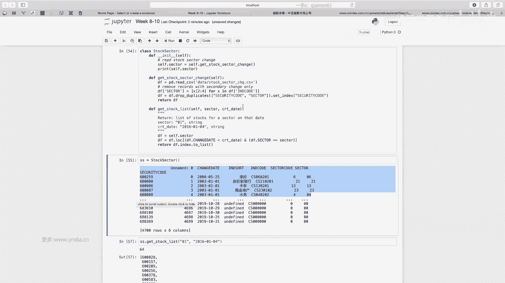

对，呃我不知道解哦，我解释明白了没有。

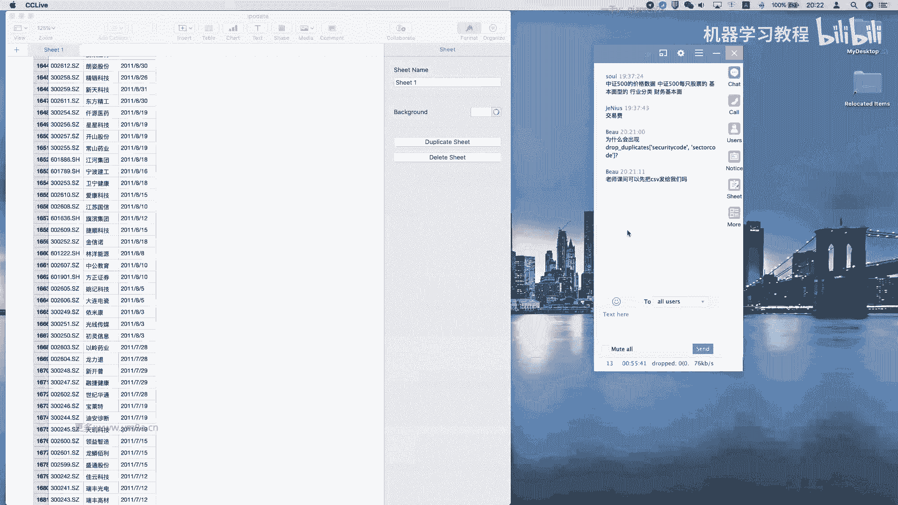

这位同学好的，我现在就把这个CSV发给大家，我们先休息15分钟，然后我们8。35的时候再回来，对然后这边其实还有个小问题，其实对，我应该是先把所有的股票去处理成标准的，带SZ或者是SH的这样代码。

因为后面和我们的会统一，待会来处理一下，然后我先把数据发给大家嗯，好大家先休息。

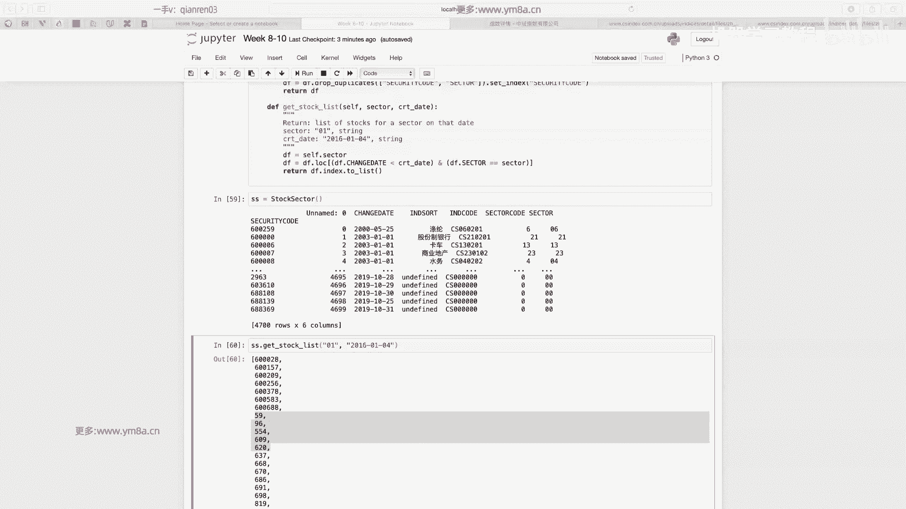

然后课间还是老规矩，有什么问题可以提啊，对这是对，这个可能刚开始没有听到过，这个不是行业加入，是呃你可以理解为是还呃。

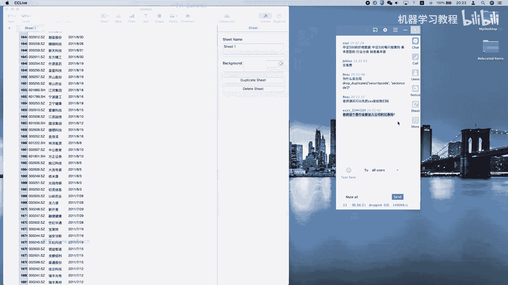

不仅仅是行业和加入，就是说比如说IPO的时候，我们看到就是这是去年写的数据，IPO的时候哎，新公司上市，那么我肯定要去对它有一个行业分类，那其实我说的这张表格是行业变动的记录呃。

与一个公司由于主营业务的变更，被并购或者重组，会导致它的主营业务变更，那么相应的在行业的他的行业行业当中，它的行业板块是要去变动的，它维护的就是这样一个记录表格，就是说我们是通过这样一个记录的表格去。

然后通过下面这样一个class去产生一个在时间上，我们可以任意获取的，一个能获取任意板块的这样一个股票的代码，对。

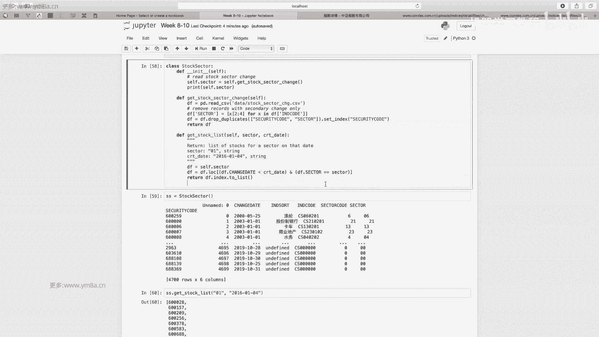

可能这位同学不用这么写呃。

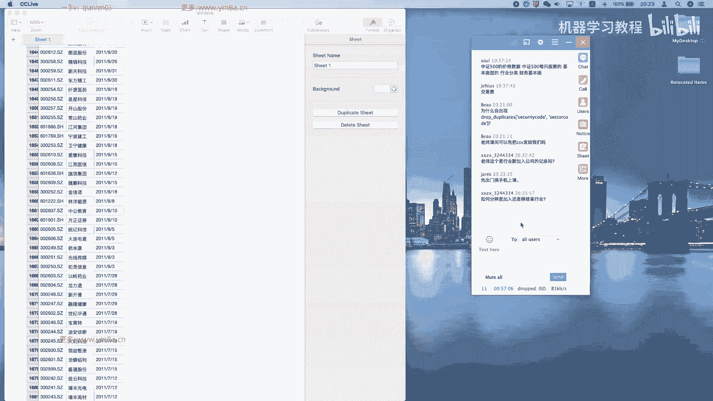

加入还是移除，其实你不用care，是去加入会移除啊，因为我们说呃他就是呃不是说加热会移除，那么行业一嗯，一个公司它从行业A变更到行业B，那么相应的A的公司自然就呃就就会少了，对不对。

就是他自然是A的公司的数量就会缺少，然后B公司的话就是呃B工资哎，就是行业B的话，那么它的数量就会就会增加，OK我这里面可能想起一个问题，嗯好我先把数据发给大家。

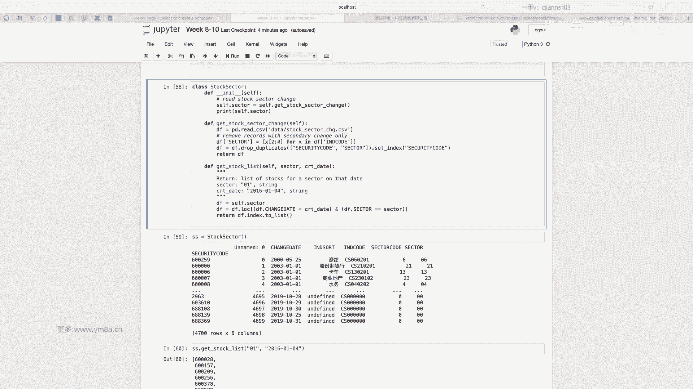

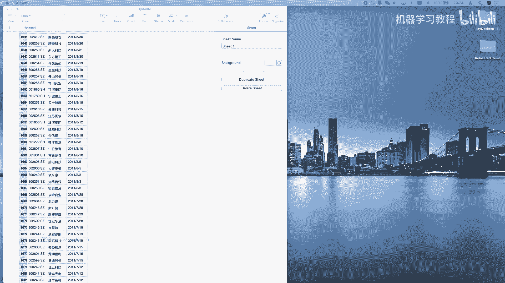

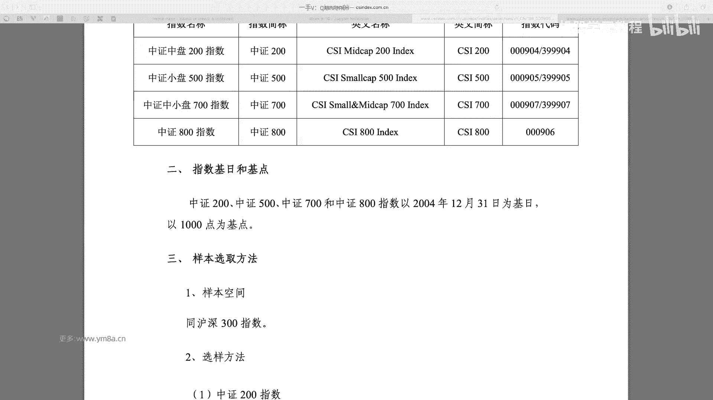

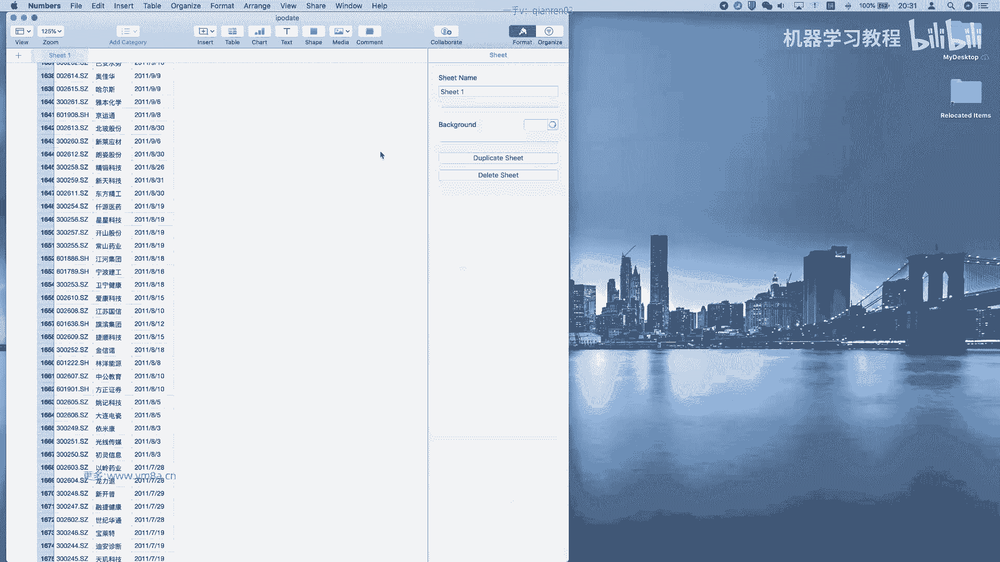

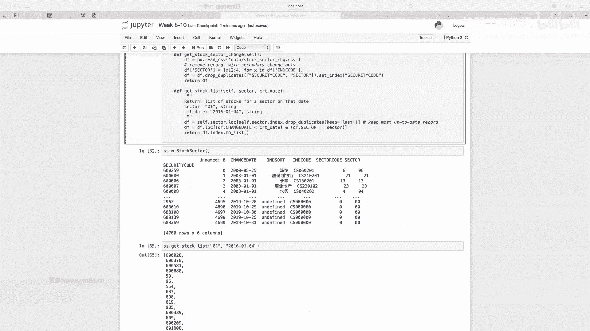

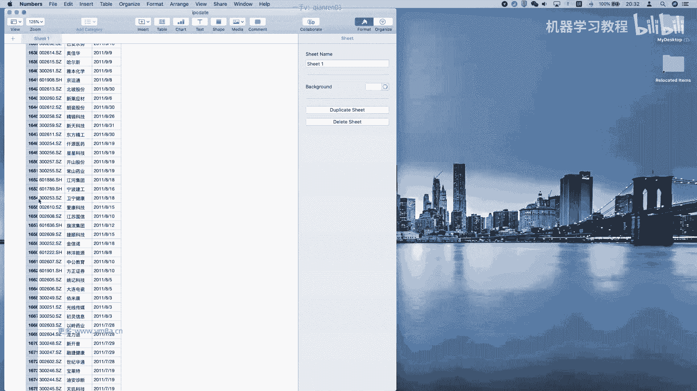

OKOK嗯嗯刚刚有个同学那个问到。

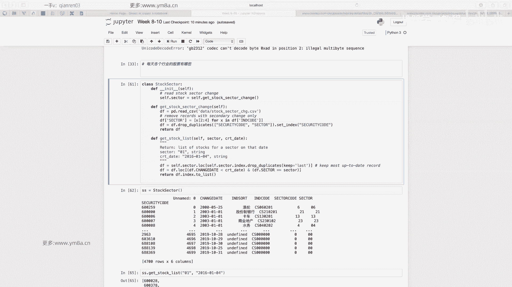

说，这个里面是不是那个呃。

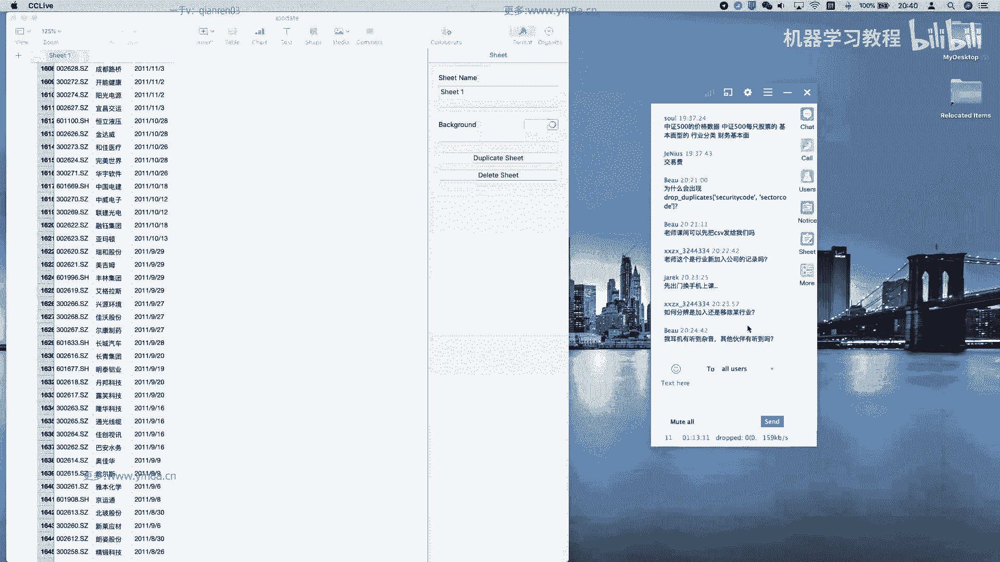

分辨还是加入还是艺术行业对，所以我刚刚忘了一个很重要的点，就是我们刚之前在看到，说是选在2016年1月4日的时候，银行额银行股份到额就是银呃，银行到底是呃不不是银行对，就是为什么为什么数量会比较多。

对对，而且其实这个里面就是比较重要的一点，就是说就是说我们刚刚说只考虑了，说他有行业新增人，说他移出去的时候怎么办呢，所以你就是要去考虑，就是你只能去保保留，每个行业里面最后一条记录。

就是因为因为以一个行业变动，可能会有多条记录，就是从03年开始的时候，我我每个每只股票给了一个，初始的这样一个记录，那之后随着他的随着他的行业的变动，那它可能会历经多个行业，那么这个时候我们要选的时候。

在这个行业之前，我只能去选他最后一条记录，就免得是免得免得出现一个一个股票，在多个行业当中出现的情形，对所以刚刚这一点就是大，就是大家要注意一下对，就有自己也要注意一下对。

是需要加这样的一个处理嗯对然后的话OK呃，然后就是说我们把这个问题给解决，就是为什么股票代码我们把加上后缀，嗯然后也根根据加后缀的话，其实你可以去从ipo list里面去加。

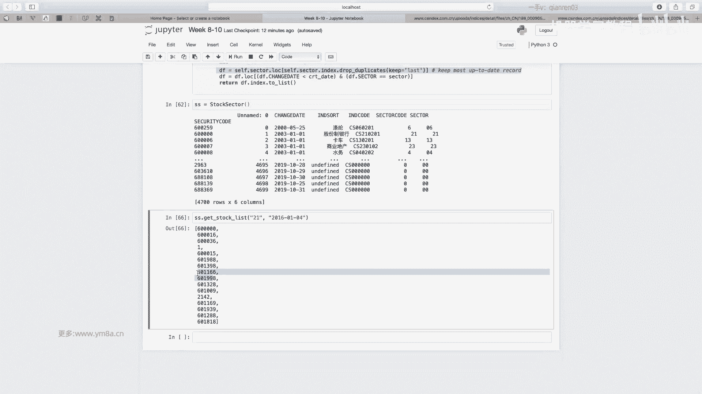

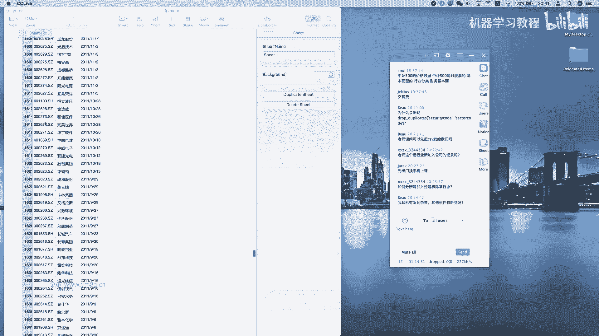

或者其实你可以看嘛，就是因很简单，就是说你小就是零零开头的是深圳，然后六零开头的是上海，然后三零开头的也是深圳对，所以所以你可以，我们就可以用简单的这样一个规则就强了。

就可以把他的security code给加上后缀呃，那我们要做的事情对，然后大家大家听到的话会有杂音吗，我有今天可能换了一个降噪耳机，我不知道这个是不是这个原因对，所以在load之前的话，嗯对。

其实可以这样处理，Uh define，我们这边有security code，我再加一个，就是我想一下，只要是就是，那其实其实很简单，就是只要说是小于这个数值，小于6×10的五次方，就是6万的时候。

我因为他这边是把当数值型除以五，在前面加SZ，其他的就加上SH就OK了，就所以嗯，D f i，Security code，然后this market，And，Can you，我先把所有的都加上上海好了。

然后，然后再去把，当然啦，嗯all right，中间还要加个变量，就是，Open prod f dot sh，Security code，然后小于6×10的五次方，嗯然后把这部分本就是。

对这部分是绅士的，OK我还是可以加一个KX加，对就是说呃小于它的是，Chang，然后这个时候不要去返回index了吧，DF对，嗯我起床，Security，Code security，Kiero。

No security，没去过，嗯OK代码是加上前面还少了一个leading zero，嗯这个问题我想一下是，four2X我是应该多，Oh lady says，you escape北京街上。

我只要在对这是我在读的时候，把把这部分，就是把内行去读的时候，就额保证是嗯，保证是这是需要，为什么，应该是converters，然后我的column是column是什么。

column是security code，我把它用string类型去读就可以了，就这样，这个问题应该可以解决，Security code，然后呃ra x string x嗯，我错了，小鱼OK是在比较。

那我只能用int来比咯，所以这个还是避免不了，就是我竟然用呃，OK那我换一个方法来，那我用string来比也是OK的，嗯还不行吗，string and float区别，嗯这个还有什么问题啊。

对就是其实我现在做法就是说，我希望把他的就是我们的目标，已经是把它按上海跟深圳去划分，但是前面的零还是漏掉了，漏掉了嗯，不是我看这部分也没有问题，嗯这部分已经开始丢掉了，所以这个这个没有起作用。

Converters，这样没有起作用的话，Ok，我想想有没有什么其他办法，除了说是嗯，我是不是可以用d tape，不要用这个converters，Let's try，D type。

Security code，然后把它做成string类型，Hope this works，怎么还是小儿，我看一下，就是原始的数据，是时候拿到数据里面，就是已经把前面零给丢掉了，所以导致他拿不到。

啊OK这是我的问题，就是我我应该是拷贝数据的时候，前面的零丢掉了，所以，所以导致他就是在读的时候我怎么加零，我以为原来这里面CSV文件里面是有立定zero，嗯那也简单，我们就，然用z few吧。

先把它对，这样子的话会不会有什么问题呃，我还是要先把它给加上，就是，嗯你觉得这两个没有什么问题，都是按string去读，然后呃，Df，然后security code，然后我去把它apply一下。

Consecurity code，然后是apply arm的X，print df导head，看一下，Tell，Okay，This works three，好，这样子的话我们就有一个对，这样子的话。

OK这个21银行股应该就对了好了，现在同学们对这部分有什么问题不嗯，对立对幽灵补齐，是的，不好意思，我刚刚确实对，因为因为因为因为我我直觉是，就是我的original data里面这个里面是有零的。

但是3号应该是从呃，呃不知道从excel里面还是从哪拷贝出来的时候，会出现这样的问题，所以好的，那那呃对，这部分就是说我们是要去做行业中心的时候，是去拿到的这样一个数据，然后OK呃接下来我们看看。

就是说我们先来pit一下，就是基本面的这样一个数据里面，怎么去把它按行业来去划分呃，OK所以接下来我们要去漏的一个，fundamental的data，Fundamental data。

这个吧基本面数据我们我们就就取，然后我们取这个吧，呃就是这个是那个PB的那个就是他是，啊我忘记了PBLR音节，这是试金绿队，市净率的倒数它是PB的倒数，就是就是市净率是总市值除以规模。

公司的所有者权益合计，那么就是然后，那那它的倒数就是说，gram公司的所有和所有者权益合计，除以一个总市值对，这就是权益除以总市值，OK然后的话，so额，当然这里面就是。

其实这这这个这个方程还不是很完善，不是很完善，意思是说我是不是呃，因为我会，我是不是要把它都去呃，因为我们刚刚看到整个的行业分类，其实是有29个的对嗯，我们在这边能看到吗，就是。

我可以看SSSD呃sector，然后我们有一个sector，对，然后你日过10日，And tur，List，然后你再去下载一下，它是有这29个分类呃，因为零零式就是undetermined。

就是我认为把它加上了一个零零，所以要去做的话呃，sum号的话我们就会去，我们可以用一个dictionary去维护。

就是当天的一个呃security sector这样一个dict security sector，Dict，Home，For，Circusector in what，我们是不是，嗯就我这边我直接拷贝一个。

我直接拷贝一个，这样我自己写的dict，因为维护起来会好一些啊，让我找一下，对这边有一个constant，我这边把它贴过来，把它放在上面，嗯all right，对这个是中信的一级行业的分类。

不是这是人工整理的对，然后那其实for sector in sector dict呃，大case ss，然后security这样，因为它不是一个常数，所以我不需要大写大写，他是每天会去变化的这样一个值。

价值so我得到的都应该是，嗯let's see，其实严谨一点的写法，我不应该hard code，CURRENDATE是2016january force，然后，希望这个是CURRENDATE。

OK唉这样我们就得到了当天的，就是我们按照行业划分的股票的，就是股票的代码，然后它是一个dict，每一个对应的是一个list，OK所以这样子的话我们来去做的时候，我们就可以说是去把因子。

先按照行业来去去划分好，我们先来看一下，就是我们刚刚所说的BPLR的这样的，一个ratio，它是在各个行业里面是怎么去分布的，对啊，对你事实上就是说你再去每天再去做的时候，可能都要去做这样的一个事情。

对你要去更新当天各个行业里面的各个股票对，然后OK然后我们再去，取d f zero是吧，呃t f zero嗯，OK这里面还差一个事情，就是说我们不要全市场的，我们需要在中证500里面去取。

OK然后我们中证500，我们说我们按照是，就是2015年12月31号的这样一个呃，Index weight，就是说这个里面是给出了我当天中证500呃，有哪些股票。

所以我取的是一个呃subset right，就是我们去只需要嗯，不管是这个里面还是这个里面就是security sector dict，跟就是我们的数据里面，可能都是取的是一个subset。

就是都是取自己嗯DFC一点wind code对吧，然后呃OK然后我想想这个里面是选一个呃，inner join还是a location，DF点stark i d呃，但显然不能这么写，这么写的话。

因为他是一个series series，是不能再这样判断的嗯，我可以先加一个condition判断吧，嗯先loop一下，应该有更好的办法，我想一想，不不不用去做loop，Loop，这样事情实在是有点蠢。

对嗯呃我搜一下应该是，Let's say panas，Inner join，是吧，嗯不应该，这个网出问题了，确实是我们现在问题是呃，我要选取额当天指数里面的，当前指数就是当天中证500指数里面的。

这些股票，我们不用取全部的stock id，只是就我们本质上是取一个subset，好吧，pandas in my joy官方文档打不开，换一个，会之前实在不行，只先录不录。

First stop com or，20DF点零，干枯，And tell me for security，d f start start开D，然后in tru，哎。

So cut n t f three dot recode uh else force，不知道这样写不行不行啊，嗯还是写到后面，Sorry，可能有点忘记了这个格式，这样顺序。

Uflick df three，打开ID，第20一点，RT code还有问题，Oh okay，应该是d half0，Df0，嗯OK，都不在different te。

Two else force of security in，OK这样子的话不会都是force吧，set的DF0点方，哎没写进去，Of security alright to me。

Is dear sandia，Encode，它不是一个，Le，然后然后我们再看下跌F音，这回应该不会OK有true，那这样就对了，所以刚刚对你就是他这个list。

不能是一个就是pandas series对，OK所以这样子的话，然后我们刚刚说，我们要去选取的是我们DF0当中的，Uh，Defly dot found in，然后这个时候500号。

这个就是我们今天就是我们所要选的，1月4日的这样的一个data，就是这个时候是我们这个时候的已经达到了，是只选取在指数当中，我们所需要的数据对，所以这步大家有什么问题吗，you seek对。

确实有这个命令，我忘记了，那肯定用的不是很熟，对，对我会直接用is in的话，对这这个应该是直接用is in就OK了，对确实这样，我这样兜了一圈，然后这个时候就是说这边是一个PB的这样，一个倒数嗯。

PB有了这样一个P，然后这个时候要做的事情是，我们把它按行业去算它的均值，那N好NH算均值的时候，你还要一个东西，不仅仅是这样的一个，不仅仅说是我知道哪些股票，当然可以最基本的就是我们可以先从呃。

你可以先从就说我去等权重吧，我直接就是行业里面有哪些股票，我把它去按等权重，那其实更合适的方式，你可能是还是要去中证500当中，就各个行业的就是每一只股票的比重，你要按还是按照去它的市值去加权。

就按按按指数的权重去加权，这样来做可能会更好一些，但是不妨碍我可以先去按，就是按照他的指数权重去，就是按照呃，对我按照等权重的方式下来去看一下对，因为这样你可能直接取一下。

取一个按行业区分的平均值就OK了，对，那这个时候要做的事情，就是把他的BPLR，这个值我按照我的sector去进行划分呃，OK然后其实的话其实你可以做的事情是，后面加一个sector。

然后你group by对吧，这是一种方式嗯，所以我现在，偶把DF就变成这个了啊，然后df sector，对其实就是单位看到就是说一个是说呃。

我们刚刚实现是有sector到security这样的一个hash呃，不是HASHMAP，对它是一个就是一个字典，但其实你需要的是反过来，是你你还是需要一个function去维护。

由stock id到他的sector嗯，这个让我想一下怎么来做嘞，你啊你可以去把字典翻转一下就可以了，如果简单一点的话，对，那就是再去加一个constant，不是constant。

加一个字典就是sector security对，对然后这个时候，有没有一些复杂度更低的操作让我想一想，然后就是four key uh and four sector security list。

Securrelist in in，在这样的一个字典当中，然后我去他的items，然后，Um all right push for security，知道做什么事情吗，就是我把它反过来去。

应应该有复杂度更低的或者更好的方法，但是暂时没想到，我羡慕把他，我先把他强行给转换过来吧，还好只是，比较小的一个字典，然后这个时候就是security to sector，嗯对，嗯希望不要出错。

让我们看一下c security中国平安的代码是什么来着，The sector，Let's say，SC嗯，K dict，Capital me，what嗯，Security，我先看一下它是什么。

我是不是没写进去，诶，诶诶啊sorry，我果然还是做反了，OK中国平安银行股，我做一个sanity check，然后有了这个之后，哦直接去，做一个这应该是一个OE的操作吧，或者是不是可以直接apply。

不太确定，Um stock finding，I d for stock，这里肯定是可以去啊，有一个OE的操作的，000这是什么情况，000418，这个股票不在我们的板块代码当中啊，这个就有点奇怪啊，0。

0418是什么股票。

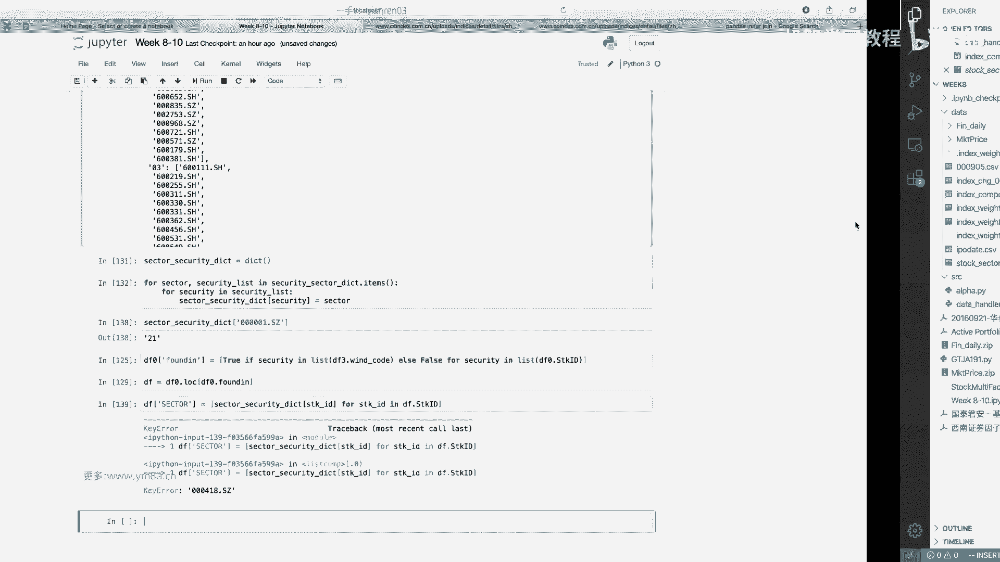

我看一下，OK呃这里面引入一个问题，当退市的股票的时候嗯，对因为在16年的时候还没有退市，嗯所以说也就说我们得到的一个结论是，其实我们的板块代码当中。

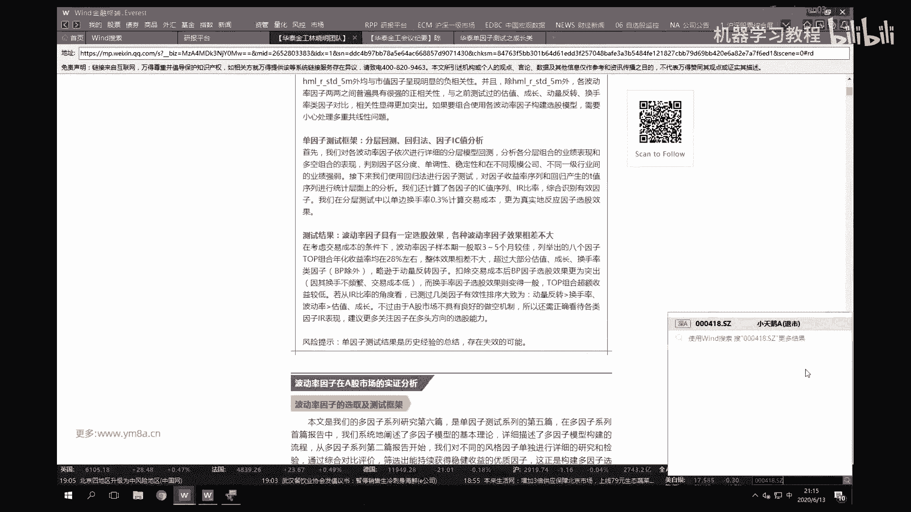

可能缺失了退市的股票，不应该啊，嗯是这，真的是没有哈好吧，那这样拿到了这样一个数据是有问题的，它不包含退市的股票，I'm fine，那我先对，因为就是说我们在做历史研究的时候，其实呃做回测的时候。

如果在16年的时候他没有退市，你还是要去把它，就是嗯就在当时的时间节点没有退市，那可能还是要去把它包含在其中的呃，然后看一下当天pf0，TF点stock，所以股票就是会有各种各样的麻烦的一些东西，在。

嗯对呀，Sorry，前面上一个location，嗯发令，然后我还要确认一下当天的他的交易状态，量价数据TF1，如果他当天是，如果当年他是退市或者是停牌状态，其实也是不需要的。

所以我们这边处理还是少了一步，One two，F one，嗯当天是正常交易状态，对OK啊，我想想有没有股市停牌的列表去维护，小天鹅，我只能把它去放到家电里面去了，要自己去养。

我们这边先去给他加到16这个里面吧，对这个只能先这样去做了，Um sector dict sector，Guy，Stuck list。

Sector dict create e security sector addict，然后在这边加一下嗯，Security，Jor to give to do fix the last bug，A首。

先看一下，那太阳一天，然后我们再去，然后这个时候我们再看一下有没有，OK加进去了啊，这也是加进去了，000418，所以忠诚五排里面还是会有退市的股票，然后对。

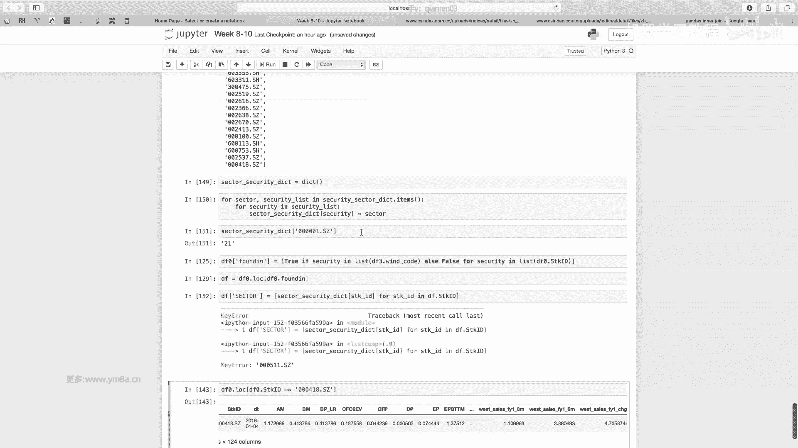

啊还有这个问题，说明对，就其实是排名前面的股票，还是会出现各种各样的问题，Sorry。

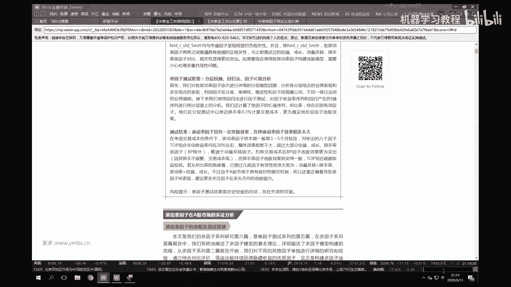

这个是我的疏忽，对，是。

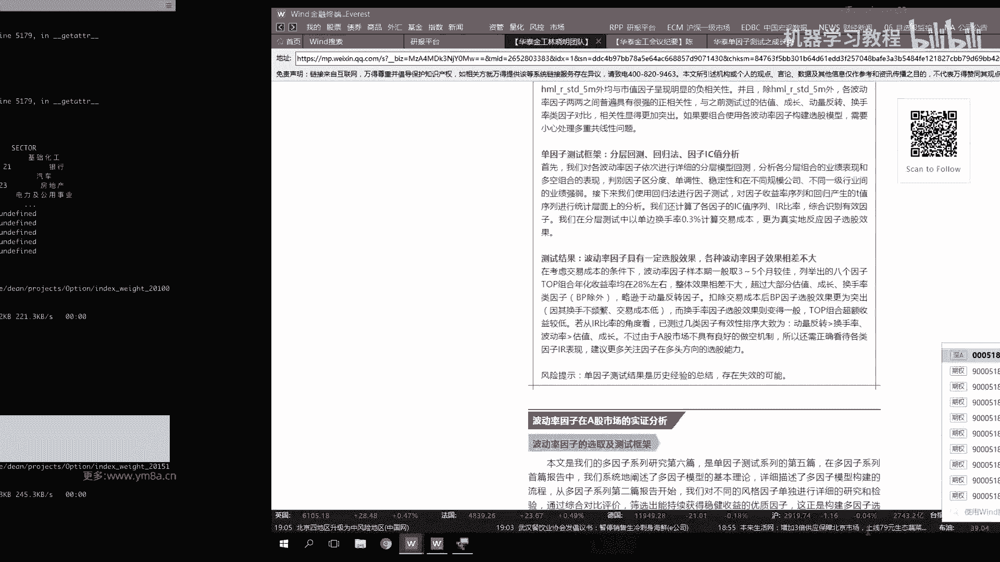

四环生物5511，Ok。

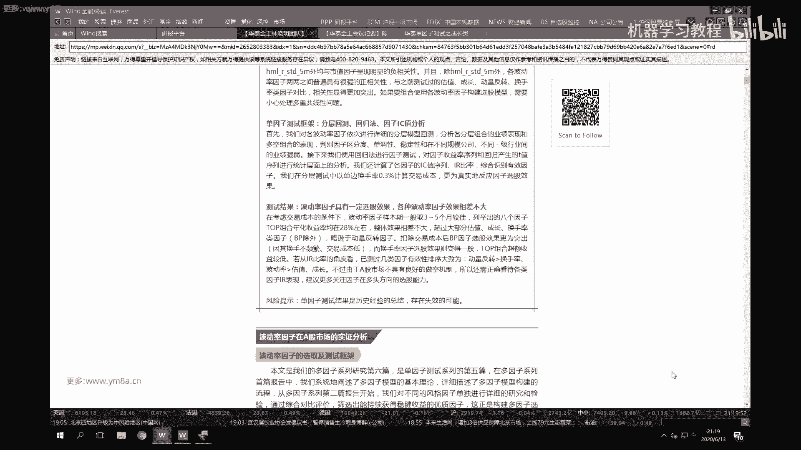

喷水什么行业的，000炸药。

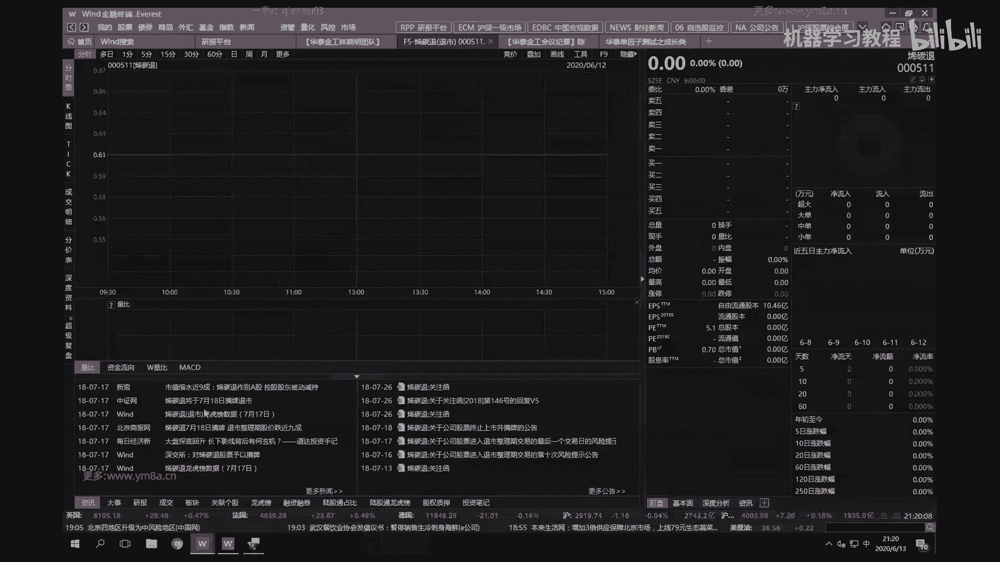

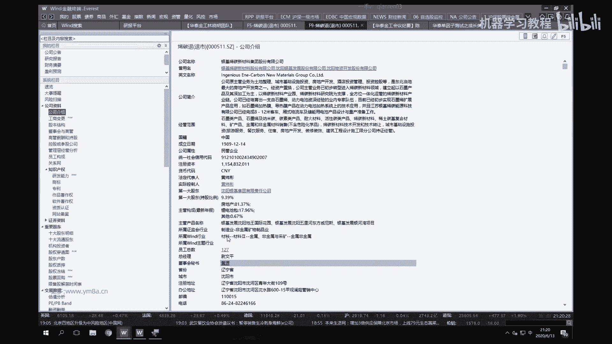

缩手腕的谎言是，材料，那如果是wind的话，嗯如果是中性的话，材料他是放碳非金属新材料，还是说是去化工呢，还是有色金属，OK我先把它按嘶，这个也没有吧，000511，OK我先把，我们先把这些放到。

先把它放到零零这个列表里，然后先把它给drop对，虽然这不是一个特别合适的方式，因为嗯，不是看下当天是不是交易状态，对理论来说，就是说即使说现在它是退市的股票，我们在呃历史研究的时候。

还是要去把它去放到我们的，就是股票的对股票的列表当中去，其实这里面可能问题还不少嗯，我看一下当时我获取这个表格的时候，是不是把，OK对我可能当时是确实就是只取了，就到目前为止还是在呃暂时状态的这些股票。

所以这里面确实是漏掉了一些嗯，我先看一下four文，你先看下有多少是退市的FX，Not in sector，security index index有五只，股票额有这六只，那我们先把这六只给剔除掉吧。

28就是，但实际上在操作时候，我们还是不能去，就是就是在去真正的去做的时候，我们是事实上是不能去呃，怎么操作对，因为因为我相当于说我从事后知道了，在当时有只有只有这六只股票，不在我的股票池之内呃。

那这样可能会呃就是引起比较严重的问题对，呃，那同样的，因为相当于说我人为的就去除了这些嗯，就是人为人为的去除了这些额退市的股票对，那那回得下来结果肯定是不对的。

X sector security addict，可对应该这样应该是七只股票，所以500当中有七呃，经过4年OK1。4%还可以，不是特别高，但是但事实上就是如果考虑到是中证500。

其实这个比例还是比较高的，对呃那好那我们先休息一下吧，然后我来把这个数据给处理一下对，然后大家有什么问题吗，对于这就是就是我想强调，还是说就是确实是股票数据在处理过程当中，其实有比较多的坑。

应该是我们目前接触到的里面数据复数处理，数据最为复杂的一种对，所以那也没也没有很多的细节，还是就是大家包括自己在动手再去做的时候，可能要去去注意的对，嗯对，因为一旦是涉及到基本面。

然后涉及到各种各样的数据的话，确实会麻烦一些，然后还是想办法把这个股票的数据，就是industry change，这样这样一个数据达到一个历史上，包括退市的股票数据，然后这这个问题应该就能够去解决。

我们也不应该去把退市的股票给剔除好吧，那大家先休息一下，我来把这个问题给解决，嗯好的，同学们接着回来啊，刚刚我把那个数据给更新了一下，对是包括这样这样子，就是说呃。

stock sector里面原来的原始数据里面是包，就包括了已经退市的股票，然后我们再去做相应的map，然后这个时候我们就可以得到了，即使是退出股票，我们也会有sector。

就是呃我们能够得到它历史的板块的代码，对就是所以还是再次提醒大家，就是处理数据的部部分，是相对来说是在股票里面是比较重要的，因为对涉及到各种基本面的数据，然后然后包括退市涨跌停等等。

其他这些事还是提醒大家要注意那对，所以刚刚一个小细节没有做好，那很有可能就是说我把历史上都退市的，股票都已经剔除了，那肯定表现是要远远好于指数的，然后刚刚有同学提到就是呃什么问题，就是有有有有有同学。

就是提到那个研报的问题的话，那可以就发到群里了，然后不记得上周好像是，就这周有哪位同学加我微信的，当时好像忘掉了，然后现在好想再去加回来的时候，好像已经过期了，所以所以不好意思，麻烦那位同学。

就是在如果还有问题要加我私聊的话，那可以自己就是再再发一次那个friend request，我不小心就之前可能比较忙，就忘掉了，对抱歉，好的，然后这样这样子的话，我们回到这边来。

就是说我们的基本面数据是有了，每一个的sector对吧，然后然后这个时候就这个时候嗯，然后我主要看那个嘞，我们先看的是呃BPLR，然后我看看能不能group bye，Goodbye usector。

然后，取个M，诶是这么做的吗，Goodbye sector，Sorry，这个不能这么对，好的先是，还是不行啊，先group bye，然后再取，应该是可以的，先good bye，然后，哎OK这样子的话是。

我们就是获取了当天的这样一个BP呃，L呃就是sector by me，然后那其实接下来要想就是说我想要去先去，因为我们有时候要去看时序创因子对吧，那我可能想要做的方式是。

我要把比如说我们现在要去做16年，然后每一天的就是因子的值，然后但是同时要按行业去把它plot出来的话，对我们接下来要去就是做这样的一个事情，呃，这个这个是就是说我默认的话是等权重对。

等权重物可以用goodbye，然后那那那大家可以想一想，就是说我我们之前不还是有这样一个呃，我也不知道DFG，这不是个好名字，就是大家不要学，我不要用这种对，不要用这种方式对呃，你还是说wait对吧。

这这这个是一个weight，就是你可以assume，就是说这个权重的话，我们按我们有股票代码对，然后我们这个权重你可以说是呃，你可以说是这个是i wait，是指它在指数当中呃，在在指数当中的权重对。

你可以就assume，它是呃在一定时期是有效的，其实更更好的方式是就是应该是去考虑，因为我们要去考虑，就是每天的我如果说有一些临时的变更的话，但其实这个这个指数这个权重，最好是去每天去更新的。

但是短时间内，比如说你已经更新了一段时间了，其实没有问题，你可以先按这个权重去，你可以用这个权重是用一段时间，更好的方式是每天去更新对嗯，OK然后的话我们先把它对，然后先把一天的给画出来吧。

就是先先是吧，先不用看一整眼，我可以考虑一下，就是呃我我这个时候需要加权平均了，不是等权重，我们可以看一下这两个因子值在行业，不同的行业之内是到底是有多大的差别，对主要是想给大家先看这一点。

就是其实因为因为就是我说过量化，是很多东西是呃经验型，或者说是我也不知道会怎样，我只能把这种方处理的方式做一个实验，然后看实际的效果到底有多大的区别，然后以此来去辅佐我们的研究，对，那这个时候我说。

等权重跟按照指数的权重到底会有多大的差异，我们可以去来测一下，这一个就可以来测试一下呃，那如果说是，但我们先看一下weight呃，weight的，这样一个东西就是他的应该是理论来说。

我们的和我们的这个data frame，我们的目前所做的这样data frame，它应该是股票代码应该是保持完全一致的对吧，就如果不一致的话，那可能就会有点问题了，所以我但是保险起见。

我们还是要去check一下这个事情，嗯让我想一下，是这个时候我要用的是Python里面的set啊，Equality，然后我看一下这个它的，我们要看3。7。

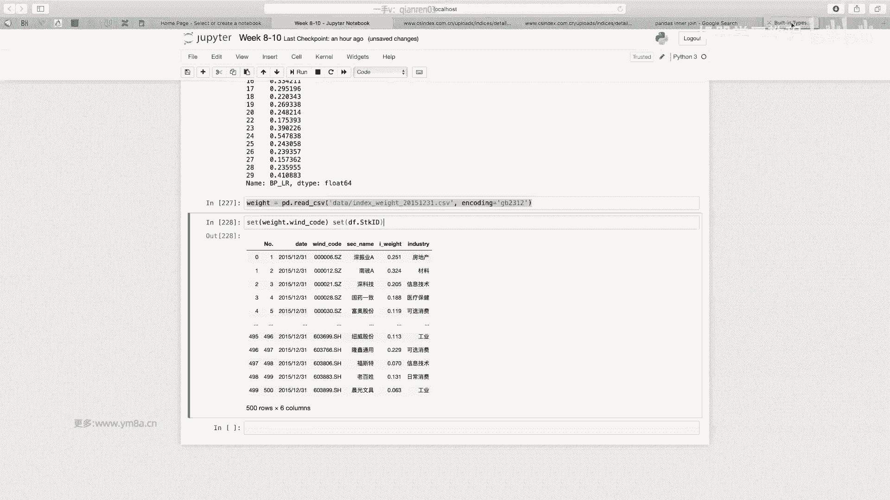

We're quality testing。

Shit，没人回答啥对，我要看两个集合是不是comparison equal呃，应该是可以这么做的啊，这时候直接用equal就OK，应该是不care顺序的吧，Ok true，所以这个是没有问题。

所以最好是assert对我用断言嗯，然后然后接下来就是把我们的这样一个，这其实说我只举了这样一个例子哈，就是这这只是一个因子，但事实事实上就是说，因为每一列都是一个都是一个财务指标值。

然后我们你是都可以去把它呃，就是说是去来去做的，因为但是我们现在还没到处理因子这一步，因为处理因子你还要去考虑就是呃取极值，然后是对，然后去就是用标准，然后去把它标准化，我们现在还没到这一步呃对。

但但但是就是先我先要先要看的是说，我们把这样的一个值按权重跟，本权重跟按他的实际的位置去划分，到底有没有区别，那么要做的事情是呃，我相当于说要把BPLR这个值再去乘以，我们的weight。

然后再去group by and some，应该就OK了，对吧嗯，他第一步要做的事情是呃，我们把这个weight加到这个data frame里去吧，就是呃我我现在是在notebook里面这么做。

但事实上就是说要知道，就是每天你在后台我们去做的时候，是有多个因子，包括我们用量价数据去衍生，算了很多的无数的因子，然后它的它都是一个自动化的过程，就是我们现在是我们，我只是在展示说我们应该怎么去做。

但事实上就是在每天的，你应该把所有的东西都做成一个自动化的过程，自动化去算因子，自动化的去呃算，然后你再去回测，再去算IIC，再去回测等等一系列东西对，但是之前还是要去理解他。

每一步到底在去做什么样的事情，就是现在接下来做的事情是把weight给做进去，然后同样的，小孩security in，J，嗯其实其实，如果我因为因为因为我这边，其实已经按照他的stock id去排序了。

我只要make sure，就是两个都是按照他的stock code去排序的话，你其实我就你直接你其实直接复制过来就OK了，都不要用loop对吧对，就是直接用with点就直接copy过来就可以了。

因为已经排过序了，然后我们刚刚已经检查过了，两个集合是完全一样的，所以，所以你直接复制过来，应该就是OK的，他他是有什么意见，他的原因就是好，那我听你的，嗯还是不行啊，OK这样的，A讲好，这样你就。

嗯嗯好吧，but uh我太好，这样就对了，对好了，然后那要做的事情就是，我们刚刚说我们这边有一个goodbye and main对吧，那你还可以做的事就是把weight。

a multiplied by你的，BPLR对吧，这样我是加权，然后我是不是还是要，Ef group bye，嗯我先加一栏板对，Waited，不只是中间计算过程，其实可以不用，All right。

然后df group by我们的sector，然后你这个时候，Weighted bp l r，对吧，这个我们来，按，我们叫它factor one coo，The time，Factor two。

F2可以减吗，我不确定，好像还是差别还是有点大哈，Half year，所以，对就是他他才明白这个值还是差的比较大的，对就是所以去所以其可能来说等权重，你跟等等权重可能不是一个特别好的主意。

尤其是对因因因，因为呃我们直觉上也是，就是说呃你在你在做五五百的选股的时候，你如果说你是等权重，本质上来说，如如果你的所有的股票都是等权重，那显然其实你对于500，不管是行业上还是说事实上。

其实暴露可能都不太一致了，对呃对嗯对，因为因为因为因为你相当于就是人为去降低了，呃那些大市值的这样股票的权重对，虽然500里面有限制啊，就是说一个股票权重是不可以超过10%，还是呃不是我不是。

我不太确定这个这个比例是多少对，但肯定是会有一定的限制对，呃所以可能直接上来说，我们还是要去选取第二种方式对诶，因就是我不知道大家了不了解这个因子，但这个这个呃，就是说你你就是说你资产除以一个。

就是你你试经率的这样一个倒数的话，还还是挺大的一个值对，就你PB的倒数就这个差的还是挺大的，所以个人直觉来说，你可能还是说把它按照行业去进行加权，然后再去这样处理，可能会好一些。

OK所以呃就是说我们这样整个来说，你可以按照行业的这样一个值，你是可以得到的对吧，就是说我可以得到N行业的这样一个值，然后我在想到，然后我们接下来要做的事情是，其实你要做的事情。

就是本场你是去重复上面的步骤，然后就是把它全部给rap up起来对吧，你把上面的其实我每天都要去做点事情，然后你要把一年的数据，或者说一个月的一个time series数据给pl出来额。

那这个时候让我想一想，对这样子的话只有bug，这个bug已经废，已经OK了，然后这个也暂时不需要对，对我们，对这个是一个时序的变化值对吧，就是这样一个dict，它是它是一个time dependent。

相应的下面也是个time dependent，对，所以的话，那其实每天你的df sector都会去变，那不管怎么说，我们先还是漏的数据吧，先把数据给load进来，可能会花久一点，一年的时间，我们先。

那我们先load1whatever，一年一个月两个月的数据对嗯，嗯我们看看数据，我们是放在，Da，然后是基本面的thing daily，Okay uh，然后我们取2016年的数据。

有没有什么办法是files firelest，然后我要做的是什么嘞，没有没有排序啊，我直接，Start with，对这个我相当于去绕过了，对就是说还是说你大家发现现在数据多的时候。

你发现用CSV读其实不是特别方便，对不对，其实我个人还是建议就是拿到了，拿到了这个数据之后呃，大家把它把它放到数据库里，对呃，可能可能刚开始你会花比较多的时间去，放到数据库里。

但是你事实上你做好了这样一个流程之后，你每天去更新数据库，然后你的数据呃，这样你获取起来会远比用CSV会方便很多，大家也看到就是处理CSV，那其实发现这里面有各各种各样的坑。

然后要么是encoding的问题啊，如果你是python2读的话，那肯定更更是一堆坑，所以我还是强烈强烈，建议大家把它放到数据库里对，然后要强调一点，就是呃兼容的时间数数，时间序列这样一个数据库。

它的一个特性是不会，一般来说一旦我写到数据库里了，我不会轻易的去改变它的数值，而不会像互联网的一个数据，可能它是一个实时的data呃，就是一个data stream这样一个流。

然后你数据库可能每天不断的在读呃，读库写库，然后改变什么的，但是时间序列数据库经常，一般来说你只会做的事情是不断的去append，往里面去加数据，一般来说不会轻易的去改变里面的数据，对这个是一个特性。

对um starts with f starts with，然后吧，然后就是，可以，嗯然后我要做的事情是去，然后要做的事情是把他的全部失去append，对或者是concatenate。

就是把一个每天的一个数据读进来，然后加到原来的data frame里面去，对呃，嗯这样子的话，所以然后我要做的事情是，Pd uh data frame，然后for file in file。

这个可能会画久一点啊，这应该还好还OK，File list，DEFRPD就是concatenate ate，然后我做的是DF，一个是这是我原来的data frame，然后另外一个是去读我的新的。

新的数据，Let's see，对嗯，Oops，这个挂号都起来了，然后这边是file，不用放量还是好，再堵一会儿对，然后，Sort，Stuck adding，然后是地铁，然后要做的事情是哦。

那这个时候其实对，那这人这边我可能只能先按循环来去做了，就是，对就是我去按照一天一天的去完成这样的事情，对，IDTDNT哎读好了哈，对呃对一年数据是70万行，然后这边一个assumption。

是我们的这个指数的权重，没有去没有在这一年当中没有去调整额，我可以当这个音质，对呃，我是不是可以去只保留，只保留三列吧，那肯定处于全，就是减少一点内存对吧嗯，可以这样写吗，第一题我先不要去对。

万一tap，万一我DT还能用呢，这个时候已经sot过了，不需要再S1遍，就是永远给自己留个后路，不要不不要去一下子把那个DF给override，然后再重新读取这个这个这个挺不划算的。

等于因为因为大部分开销，是你是IO之间的开销，就是从磁盘读到你的内存里，然后去之后把它一直放在内存里，去操作就可以了，OK这是我们的，这样的话数据会少了不少啊，呃我是不是可以把两个，顺序变一下。

我先按时间在on put the security code，First stock，开id，嗯其实一会儿单眼，一会儿双眼也不是特别好，还是保持consistent，Oh，我是不是让他又呃又读了一遍。

啊哦还让他读完吧，那没办法了，嗯这样不挺对，或者at暂停，呃t f two应该还在内存里呢，好的这是个好消息，那反过来去，嗯第七，OK这样子的话，我们把它去按照额时间跟那个什么呃。

时间和事先按照时间去排，然后再先照股票代码去排，然后我们要做的事情是repeat pro，就是上面的process，但我们要做的事情让大家再理一理思路啊，我这我这我现在也有点乱，对理一理思路。

就是说呃我们需要知道每天的权重，这个就已经已经权重，其实相对来说已经是帮我们固定了额，所以这样还好一点呃，那我们先把权重给做了呗，就对吧，Waited d p l，二等于，我们上面是怎么做来着。

上面的是，UWAITED是，weight对吧，就是这个时候就不能，就是这个时候就不能直接去那个，因为weight df跟我们这个里面的DF2的，它的数据长度是不一样的，所以这个时候你要做的操作是。

嗯让我想想这个里面有什么操作，就是大家看到就是，就包括我们在讲后面的因子的自动生成的时候，其实呃就是我们会之后会去讲，就是用遗传算法去怎么来去说，是去人工能生成更多的因子，其实你的操作对象本质上都是你。

你一般来说我们在整个过程过程当中，我们使用data frame去操作的，但是如果你为了效率的考虑的话，你最好还是把data frame你换成原生的类似的是对，甚至不要用NPIRR。

就用原生的Python的类似的对象，但是然后然后然后一些复杂的计算的话，不用当派，你就用Python的自己去写，你可能会解就这样，这样可能能节约不少的内存，因为就是在算因子过程当中。

限制的不一定是按限制的嗯，CPU是一方面，但另一方面可能是你的内存不太够对，那之前我们在算的时候，是放在128G的机器上去计算的对，然后每天基本上是跑满的状态对，然后我这个笔记本只有16G。

所以可能不是特别够，但是作为演示应该没什么问题嗯，所以所以接下来要做的事情是，对这个代码我之前写过一遍，但是现在在给大家写的时候也不是特别熟悉，所以本质上我给大家展现的是。

就是我们怎么来去解决这个问题吧，对解决问题的思路嗯，所以要做的事情是嗯，我直觉上是要用apply，因为我要做的事情是，其实我要做的事情是两个data frame multiply对吧。

但是它的长度是不一样的，相当于说是我每隔嗯每隔对一定的行数是区呃，去乘这样的数据呃，但是这样有个问题，如果中间涉及到指数的，我先看一下啊，嗯tel500，df two的话，我已经按照时间去排序了。

但是哎这个里面数据是不是有问题啊，因为到最后的，OK我没有把它存成df two，嗯OK我知道为什么，就是但但还是一个股票池的问题，就是我们本身选取的股票池里面，是不止是中证500，所以第一步就是。

所以所以我建议大家还是就是，这边我来catch跟大家说一下，就是刚刚提到的内存的问题，就是说搞了个MONGODB上传数据很慢，然后经常把我的内存占满呃，那要看你怎么上传了，对，就是课后我们可以讨论一下。

就是应应该来说，我记得我们之前数据把它做好之后，应该就MONGODB就是数据库，你还是有一些优化的空间的，包括说你保存的格式啊，你说你能用int型的，你肯定就用int对吧，然后包括MONGODB。

你设index怎么设对应该还好吧，但是MONGODB我觉得是比较好用的一个数据，因为它每一个你你每一行相当于就是一个dictionary，就是一个字典对吧嗯，当然这个我们可以之后课后去看，对嗯对。

刚刚第一个问题是说，为什么为什么最后500行会有奇奇怪怪的东西，就是因为我我们这个在data frame里面，还忘了一个很重要的一步，就是你要把，我只要选，subset对吧。

嗯就是只要选那个在中证500当中的股票池，所以我本质上是，Select rose，然后，我就是说我只要选stock id，在中证500当中的股票池，所以的话呃还是用is in好了，对df dot。

然后对刚刚那个同学说的是is in，不要用loop了，D e f two stock i d，然后10is in and what u，当然是我们那天指数的权重了呃。

WAIGHTDF对我们只选在我们这边，assumption是指数在接下来一年没有调权重，但事实上是应该是每半年会调一次，所以中间你是要去做这样的处理的，对wait d f dot uwind code。

还是先不要把路给走，绝先看一下，这样对不对啊，他没有这样的index吗，Ok，En security code，security name还是，OK我已经把它设成index了。

所以之前就是这就是后面的操作，前面的操作可能会影响后面呃，去把它换成index应该就OK了，嗯所以所以其实一个好的方法是，我在设index的时候，仍然就是keep columns等于H5。

仍然把这个column保存在里面，这样应该会好一些，OK然后这样这样就这样就对了哈，然后这个时候我也不需要去check，就是我每天选出来的股票，是不是，是不是跟我的那支持中证500指数里面一只。

因为我本来就是这么选的对吧，呃那这个时候我可以overwrite，overwrite这个df to，嗯然后嗯，OK这样应该是没问题了，然后然后对，然后嗯可以怎么做呢。

一个是就是说我接下来每天要去算这样一个，weight对吧，呃我自然可以是直接去乘以，一个是循环去做，但是我想不循环对吧，因为轩轩可能这12万行循环下来也很快，就是我每500行，每每500行你去做。

但是应该是有其他的办法去避免这样的循环的，对这样，因为呃对写程序还是要考虑一定的效率问题，因为我这只是一个因子，如果我1万个因子，那速度差的还是挺多的，所以，本身这就是其实如果如果这部分是。

就是计算的时候是就是CPU intensive的话，其实大家可以试试看，就是你呃用number把去加速，然后去尽量把它并行化呃，也可以说是我不知道这样用C加加写有多麻烦，对因为因为数据还是挺多的。

这部分美术我们我们还是用的Python去处理的，对，这样两个肯定不能乘，因为它们的长度是不一样的，数据长度对吧，Ui wait，呃wait，怎么写的，是这样，对了吧，这样就称不出来了。

OK我来查一下data frame，实在不行，直连还是我先看一下，正好正好对比一下吧，就是如果loop的计算跟我的额，跟我的就是直接的VECTORIH计算，会有多大的差别，然后要做的事情是。

Hd ts s，这是这是我这一年的交易日，对，其实其实其实不应该这么去读，就是我们我们还是应该就是我们之前提到，应该有一个function，也是直接去获取这样的操作，对。

就是你直接去获取每年的交易日就OK了，对就是之前积累的函数，应该都是可以慢慢用去用上的，Ud t s d f to dot location，我有点忘记，对吧，这样子，然后你再取取他得，这时候不是。

嗯好吧，还是还是还是OK还可以啊，然后这个时候还是需要去他的sector，但与我们之前提到的啊，在哪里，听声音，2+5敏捷嗯，我们这边只有一个dictionary，但其实我可以把它去嗯。

因为这样做太慢了对吧，我们每次都要去重复的去取这样一个，嗯你应该是说我直接把刚刚的这样一个，就是从股票代码到security到sector code，这样一个dict做成一个list。

我们只要是做成一个list应该就OK了对吧，那其实我只要保证它的key是按照security code去排序，然后直接把他的value做成一个list就OK了，然后我们测试一下吧，JECT看他的，嗯对。

他的key不是区嗯，他的key不是按顺序的对吧，我那我得看一下Python的，2k，嗯这个，或者是我记得应该是有一个叫ordered addict，这样一个数据结构，我们可能是可以去用的，对吧啊。

这有点蠢，By keys on，这items是atrial sequence that contains peer，啊还能，那我还是那好吧，那我这边还是先这么做吧，按照着趋势，好的，这个是讲顺序了。

然后嗯，然后shot the kids对，然后是我们不是这个，然后是sector，这个才是这样的一个东西，Ok secret，然后这边直接就overwrite，它能这么做吗，不用去override。

Security，Project，Security，For，Security in thirty kiss，对这样我自然就得到了，按股票代码排的行业顺序值，然后直接把这个东西呃，就是，Sector。

我叫它sector list，大家明白这个是什么意思吗，就是我直接把他的，嗯就是行业的这样一个sector，按照股票代码从小到大去排序，因为我们这边已经排过序了，所以我这边在for loop的时候。

直接，去把它a pen，就是直接把它贴过去就好了，这样应该会省不少时间，so我们把它放在这儿，应该是在之前去做好的，然后sector list，这样长度应该是对的哈，呃他有什么意见，他有意见，Ok。

那我看一下是什么情况，好好吧，又忘记了一个关键的问题呃，中证500对吧，老子上不上，记太多东西了，对这样就对了，就是说我只把中证500当中的按顺序去排，其他我不管，希望这回我们是对的，好的嗯。

然后就好的，然后group bye对吧，呃group bye，啊我要google by两次，因为第一个是先sector。

goodbye问Python data frame能不能double group buy，我看一下，就是我先按sector再按时间去排呃，或者是先按时间再去按sector，还应该是可以的哈。

我先看一下是哦，这边是，嗯sector，然后再去NDT，我先看看它的size是什么，嗯OK这这个时候我们大家理解一下，就是，这个是第一个是sector code，就是说在零一的板块当中。

今天是这四只股票，然后第二天是另外四只股票，然后OK对吧，嗯这样子大家明白了，就是我先按板块再按时间去排这个，这样这样我们是不是就可以得到一个板块的，按时间序列，然后但是我们不是要看size。

我们是要看上面的呃，就像我们要去下面上面的就是wait的min，我先看一看min得到的是什么样的值，这样子的话我们是不是得到了sector，按照他的时间序列这样一个呃，按照时间序列的这样一个。

BPL2的这样一个因子值对吧，呃这是按照等权重的嗯，Equally weighted，但是我们刚刚我们已经从一天的数据当中发现，等权重的效果，就是等权重跟我们指数的权重还差的比较大。

呃我现在看看DF2是什么样的状况，对，然后我们刚刚如果我要算，我要算的话，是按照指数，按照指数去加权的话，我们需要去加一个new column waited的，wait waited呃。

BPL2我们可以在这边做吗，可以吗，不行，因为这个是按时间来分，但是我们是需要，Uh can i，还没有错，我还是按照时间来区分，第2two对吧，没有错，是按时间来分，只不过这边是。

Waited d p r r，然后这个时候你要做的事情是，Df two dolocation，DT这时候才应是排好序的，我们把原来的DP l r ultiply by waited df。

这时候因为是已经按照stock id排好序，然后并且是，I wait，I think，应该是这样嗯，这样子的话是，唉算了，怎么会这么慢，对还是还是还是想想一想办法之后，就是就如果算一个因子怎么办的话。

那这个确实肯定是有点久对，就因为100多个因子循环下来，那真是够喝一壶的，显显显显然应该是有办法去向量化的，那那大家想一想，这个这个这个怎么把它去向量化，对我还是对，尽量不去写新环对。

只不过现在是一下子讲了三个小时，脑袋已经有点overwhelmed，已经不知道怎么去想办法去把它向量化了，对于因为其实对我本质上是，我每500行去乘一次这样一个权重，但我事实上去做的事情是对。

应该是可以去向量化的，对，啊怎么会这么慢，不应该啊，这里面有什么问题吗，Sector list，jove the kernel holy 嗯，确定，也还行啊，好吧大大家明白我的意思是我看一看。

那这样只能去重启了，嗯希望他还在，不在的话就直接用好吧，那从头再爬一遍，嗯还能再load一下数据，呃那个大家要是累了可以先下课，然后反正我是会我等这个可以把它弄完，对大家之后可以回去看视频对。

然后还有哪位同学是要私下找我，有什么那个国泰君安的研报问题的，你可以先留言了，对你先你先你先在微信上留言，然后之后我会来跟你来解答，呃所以所以我想我可以问一下，就是大家就是呃整个的这样这样的一个流程。

现在现在就是包括怎么去拿数据，整个流程大家都清楚了，那那比如说之后说我们自己去重新去研究，一个因子的话，大家能够自己去做了，对，比如说沪深300，然后我去研究，Whatever，不管是基本面还是对。

就是烟包里面任意一个因子，应该大家应该有想办法，应该能够自己去把它去，至少是把它去按行业去破导出来，然后对，然后之后我们再去看，怎么按照怎么去做因子的一些处理，因因因因为现在只是现在行业。

就是说我先本质上是想展现的，是说，因此本质上是在是在行业跟市值，这两个会有很大的暴露，然后然后研报里面提到的说有两种方式，一种是说我把行业跟市值的暴露都剔除，然后取他们的参照。

就是我我先做先对行业跟市值做一个前行回归，然后再去嗯，就是就是作者，然后取它们的残差，得到这样一个因子，然后一种方式是说，另外一种方式是说我只只剔除行业的暴露，但是呃我把市值纳入其中对。

然后大家可以去看一下，就是这样的，就是因此，甚至你还可以说我行业跟市值，我都不去做中心化，然后去再去看额他的收益或者是会是怎样对，本质上是想给大家展现这样的一个东西，好了吗，好了吗，好了吗。

Ok sword，已经，嗯d elf，我看看df two是什么，可能这边就是DF啊，70万行TF，嗯确定是不是这样，嗯靠，好想看一下t f two，12万好万千啊，All right，然后，啊，师父。

我不应该这么去做，我可以，对因为我每次去乘这样data frame比较慢，但我可以换一种方式吗，我直接把它data呃，我直接在df to，就是我觉得这一新加一列这个权重就好了。

然后这样子我就直接变成两列相乘了，对对应该这样去做会好一点嗯，我不知道大家听明白我的意思了没有，就是就是因为相当于说，我在循环的去乘这样一个事情，那为什么我先不把它加这样一列呢，对吧，就是说。

可以暂停吗，Interrupt，好吧，应该今天任务对，嗯那问题就变成了他是怎么来加呢，这本质上我是把一个小的举小的一个呃，小的一个data frame，然后不断的去把它pad好吧，嗯那大家先休息吧。

我来把这个问题解决对，然后这位同学的问题是，唱的，嗯二十四三天6。2，24，是不是没有考虑全国，嗯好的，这个问题待会我先看一下，现在还暂时不能解答对啊，大家再看一下这个问题，然后好的。

同学们可以先休息了啊，还有这么这么多同学围观我写代码，你压力有点大，OK嗯好，我来去解决这个问题，嘶应该这种方式等呆呆，就是还在听的同学替我想一想，有没有什么更好的解决办法，确确实好像这么做是有点蠢。

对，就本质上来说对，并且我现在还是一个固定权重，这其实应该算是比较好解决问题，如果如果如果之后就是说我我我会有一个，就是如果我每天是动态的权重呢，就是说我不是，我不是用的是中证500的固定的权重呃。

给我一指数权重，而是我每天根据最新的500的市值去，就是市场的就是流通股的市值，我去实际计算最新的权重，但事实上是呃，这个是现在就是有不少公司是在怎么去做的，就是我每天是要去track。

就是最新的指数的权重到底是什么样的，甚至我会自己去算一个指数的值对，而不是简单的，就是跟着中证500的这样一个指数，我不确定中证500的指数是不是每天会去变调，调整对，还是说他嗯对。

虽然万德上是有那样的数据，我还没有拉下来过，我不太确定，就是大家可以也可以去验证一下，就是说中证500的指数权重，在没有调入和调出的过程当中会不会有剧变化，对太久没有用这个了，用的不是特别熟。

Data frame，解释算是left join还是right join，我测试一下，哇太啊啊，应该穿的是他的，I，但显然这样没有中文上去，因为咳两个没有相同的这样一个呃index，啊好吧。

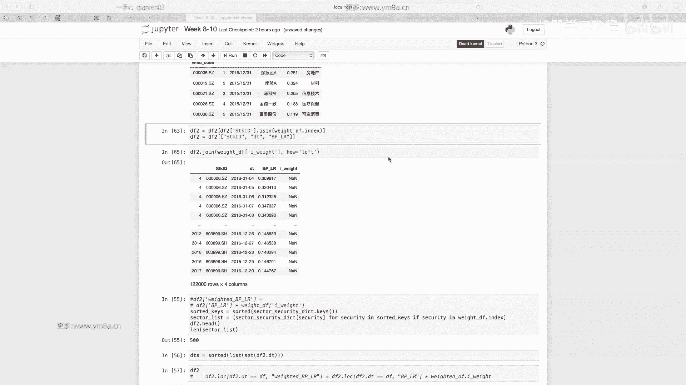

我先下节课，我再把这个问题告诉大家吧，然后这边还有把这个问题给解决，这边还有个同学问的问题是，基金数据要去做哪些处理方法的回测呃，这部分可能我不是特别特别熟，因为本质上你是要去做基金的组合。

对做基金的基金的数据处理，这我可能不是特别熟，因为我目前只涉及过，就是说哪一些公募基金的持仓数据，去做一些因子，但是还没有单独去处理过force的回撤，所以这个这个问题我暂时不能回答。

但是我可以帮你去问一下朋友，可以去怎么来处理这个事情，对嗯，记得微信上私信我一下，或者是个群里艾特我，对，好的呃，那大家先不早了，大家也先休息吧，然后我把这个问题解决了，下节课再告诉大家，对。

或者让之后发给大家进来，是更新的，可以跑的notebook好，那这节课先这样。