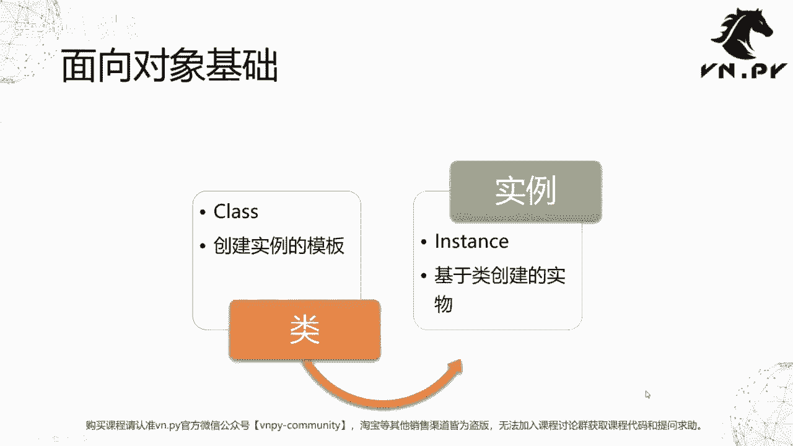
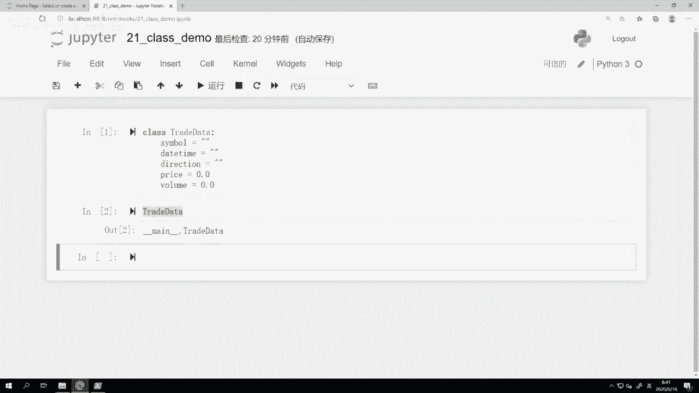
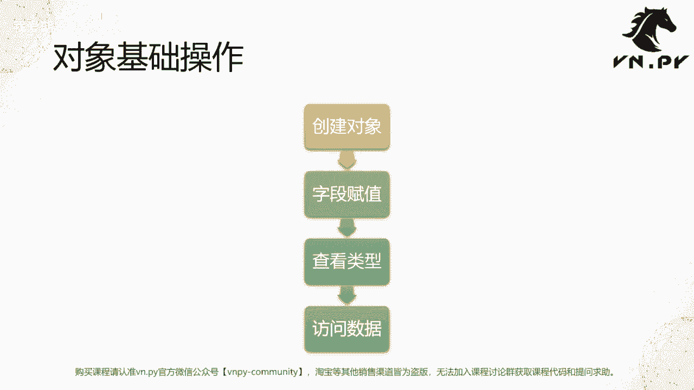
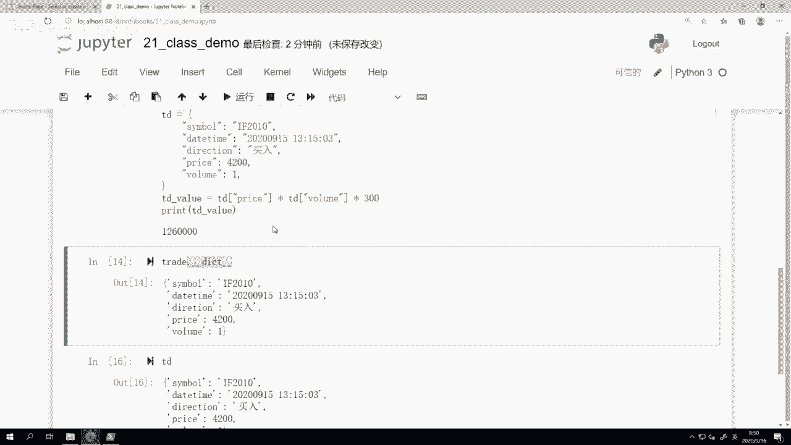

# 21. 开发一个类 - P1 - 我爱期货 - BV1GG2gYBEPr

OK欢迎来到量化交易零基础入门系列，30天解锁Python量化开发课程，那么今天呢是我们的第21节课，在之前我们差不多花了六节课的时间，深入的讲解了Python世界里面，这个函数的啊种种细节。

那么从这一节课开始啊，接下来大概十节课的时间，我们将会花在一个更大的主题上，就叫做面向对象编程啊，那么今天呢是我们的第一步，叫做开发一个类，首先啊，我可能要来介绍几个面向对象编程的基础概念。

那面向对象这个词呢，你乍一听可能觉得怪怪的，说，这不像中文啊，确实它是一个来源于英文世界的，这么一个直义词啊，它的英文是叫做object oriented，Object，就是对象的意思，某个东西啊。

oriented是面向它啊，或者说针对他的这么一个设计啊，所以这个面向对象编程呢，背后核心的这么一个哲学，就是把我们编程里面涉及到的各种函数，各种数据以一种比较啊，对我们人来说容易理解的方法给整合起来。

让我们在写代码的时候呢，不用去一点点想各种底层的数据结构啊等等，可能尽可能的把我们的思维，解放到这种高维度的设计上啊，来提高我们的这么一个生产力，那这个还是有点抽象啊，我们接下来就要看两个具体的概念。

首先要接触的第一个概念叫做类L是什么，它的英文叫做class啊，这个class也是我们Python里面用来定义一个类的，关键字啊，关键字就像我们之前已经学过的，比如说def啊，比如说这个啊。

这个这个我们Python里面的可能continue啊，try except啊等等啊，这些都是Python语法自带的这些词啊，这些就叫做Python里面的关键字，那这个类啊。

一般我们把它理解为一个创建实例的模板啊，这个还是有点抽象啊，我们再举个更实际的例子，就是想象你来造一辆车，那么我们知道啊，车的内部有非常多的组成部分，有这个底盘啊，有这个啊。

外面的外壳有最重要的四个轮胎，以及这个核心驱动的叫做发动机的系统啊，那么这些每一个系统都有许多复杂的功能，那对于我们消费者啊，对于我们买车的人来说，其实我完全不在乎，或者说不想去指导这个车子里面。

比如说诶这个引擎怎么工作的啊，轮胎是怎么样用橡胶造出来的，这些事跟我没关系，我只想要知道怎么去开这辆车啊，以及可能买车的时候我会关注一下诶，这车子的啊，这个的这个这个动力好不好啊，颜色好不好看啊。

外壳的形状我喜不喜欢等等啊，这是我作为一个消费者所关心的，那么在我们这个例子里面，类就是造车的时候所用的那个图纸，你可以认为图纸描述了这辆车车是怎么造的，以及它可能内部也描述了诶，我要用什么轮胎或引擎。

要有什么型号的啊，当然对引擎它也会有它的图纸，就可以无限细分下去，直到把这个造车里面，所有的细节都包含在里面，的这么一个复杂的图纸啊，那这个东西呢就可以视作我们的一个类，那真正造车的时候相对来说啊。

有了这么一个图纸，又有了我们现代世界的这么多的，叫做工业机器人，其实比较简单啊，你把这个造车的这些这些流程，这个图纸上写的方法，输入到工程员机器人里面啊，启动一下，放上原料啊。

那也就随着一辆辆车一点点就自动化的造出来，但是造完了之后可能还要人工去啊，做一些额外的这个检查，质量的控啊，监控啊等等相关内容，我们先不管那些细节啊，我们就来看造车这个过程就是这么简单，把图纸丢进去。

启动按钮，然后可能一辆辆车就造出来了，那么在这个例子里面，图纸就是我们所谓的类啊，就是我们的class而造出来的，最后的那一辆辆真正的车啊，就给我们人用的那个车，就是所谓的实力啊。

实力的英文叫做instance，或者呢在这个面向对象的世界里面，有的时候我们会把这几个词混用啊，实例对象对象实例这三个词，有的时候指的都是同一个东西，就是用class啊，就是用我们的类。

用我们的图纸造出来的，那个实际我们要去用的东西啊，所以我们这边给它中文描述，叫做基于类去创建的实物，那大体上就是这个概念，我相信你能够去通过造车的这么一个例子，来理解啊。

但是怎么样把它映射到我们编程里面的概念呢。

我们还是要来看一个具体的例子，那这边我们用叫做金融交易里面的，这么一个成交来举例啊，我们接下来会创建一个类，叫做trade data，它对应的啊这个概念呢是一个成交记录啊，就我们每天不管你炒股炒期货。

炒外或者炒数字货币啊，其实你每下的一笔单子，都有可能有一笔或者多笔的成交记录啊，这些记录呢会有最少最少要标识这些信息啊，当然这个只是最基本的五条信息，可能还有更多细节，我们这边上来还是为了简单。

我们先讲最基本的，首先是代码啊，这个代码就是你买卖成交的是哪一个东西，或者说是哪一个合约，是啊，这个可能60036的招商银行还是F啊，2010的股指期货，还是BTCUSD的数字货币对吧。

这个首先要有个代码标识，第二个是你的成交一定发生在现实世界里面的，某一个时间点上啊，这个时间点既包括日期，也包括时这个这个具体的时间啊，所以我们给它取名叫时间啊，对应的这个字段呢叫做date time。

第三个啊就是你买卖的方向了啊，所谓的direction这个容易理解，你要么就买，要么就卖嘛，也不会有其他事情可以做啊，最后两个一个是成交价格的price，一个是成交数量的volume啊。

那么这一块呢就是我们一个最基本的，你就想象他造车吧，这是我们要记录一个成交的这么一个图纸啊。

接下来呢我们就打开哎，还是打开我们的jupiter notebook啊，这节课的名字叫21class demo啊，因为是讲怎么样去创建一个类的，我们就先来试着创建这么一个trade data啊。

这节课我就直接手打了class trade data啊，然后冒号，那么这里的这个写法，首先class是所谓的这个关键字啊，就是你只要某一行开头写的这个关键词，那么Python就知道啊。

后面你就是要定一个类的，那中间一定要有个空格，然后这个举比特把我们高亮成蓝色的了，部分这个trader data就是我们这个类的名字啊，当然同样后面要跟个冒号啊，当然现在你已经接触了挺多啊。

不管是自己写这种条件语句，循环语句，还是自己定义一个函数，所以我相信你对这个Python具这个这个基础的，这个语法已经有一点啊这这种感觉了啊，因为他其实绝大部分写都是这么写的，你要做一件事情的时候。

后面要跟个冒号，然后我们先来定义啊这个symbol，symbol是什么，就是我们的代码它应该是一个怎么样的样子，它一般情况下会是一个字符串啊，我们就直接symbol等于一个空的字符串，然后是时间。

date time也等于一个空的字符串啊，方向direction，Direction，买卖嘛，我们也是一个字符串，然后price啊，这个可能是一个浮点数，我们就写个0。0volume啊。

volume呢对于如果是股票或者期货的话，一般可能就是一个整数就行了，但是如果你要考虑到啊，到数字货币的这么一个兼容的话，那我们知道数字货币有可能有零点啊，一个比比特币啊，甚至0。

00几个比特币的这种成交啊，所以这个时候volume可能是个浮点数，那这边我们出于兼容性考虑，也把它定义为一个浮点数啊，那这样一共就六行的代码，大家可以看到class trade data。

symbol data time代direction，哒哒哒啊，我们就完成了这么一个类的定义，shift回车之后啊，这个trade data这么一个类就已经存在了。

我们可以先试着哎来访问一下trade data，看看会怎么样，他会告诉我trade data是一个位于当前啊，这一个ma就前面俩下影线，下面，后面俩下影线的这个面。

是我们呃Python解释器在执行的时候，最核心的那个叫做所谓的命名空间啊，当然这个概念呢我们现在还没讲到，反正你就记着他，就是我们在运行主的这么一个Python程序的时候。

他的所谓的主入口所在的那个文件，trade data呢，就是我们这边定义的这个类啊，它已经存在在这个系统里面了。

好那我们再来看下一步，有了这么一个类啊，就说白了我现在图纸已经准备好了，下面呢我们就可以用它来造我们的车了，或者说造我们一笔一笔的成交记录了，所以这边我们接下来会做这么几个，基础的对象的操作啊。

第一步创建对象，第二步字段的赋值，第三步查看类型，第四步访问数据啊。

这里呢我们就来一步步操作一下，首先创建对象，我们先来创建第一个trade啊，我们给它就命名叫trade好了，等于trade data，你可以看到这个创建的操作，和我们调用一个函数的时候非常像。

就调用一个不需要你输入任何参数的函数，的时候非常像，就直接创建了回车，完了这么一个对象就已经创建出来，有点像什么，有点像我们创建一个空的字典啊，如果你还记得之前我们几节课的内容。

当时我们有提过dict这个关键子，其实在Python内部指的就是一个字典类啊，它指的就是一个类，只不过这个类比较特殊，是我们Python语言内部用C来实现的一个类啊。

不像我这边这个trade data是用就Python语言本身啊，我在Python里面写的是这个类啊，这个dict呢是啊，这个用C语言在Python，虚拟机内部实现的这么一个类，有了对象之后。

下一步我们就可以对它进行字段赋值了啊，我们把要记录的这笔，委托的一些数据给复制上去，比如说trade trade点symbol啊，我们先对他的这个代码进行赋值，我们就是直接写个F2010啊，简单一点。

现在9月份吧啊，这个我们写个2010就10月份的合约，然后第二个trade点date time啊，当然现在还没开盘了啊，我假设一个昨天的时间，2020啊，0915，然后呢，这可能是中午15点呃。

不不好意思一点这个15分啊，这个零三秒成交的啊，这就是我的这个成交时间，戳treat点，direction等于百啊，这个买入，或者我直接写个中文行买入，买入啊。

然后trade点price等于A最近的成交价格，我就随便写一个，可能4200，然后treat their volume，我这个出于试验嘛，我就买一手就行了，那这样我们就完成了。

对这么一个刚创建出来的成交记录，所有字段的复制啊，这样回车一下啊，那他这个时候呢，这个TRA的对象的一个个字段值，都已经在里面了，那这里我们要注意的两个点吧，第一个点。

怎么样去对某一个对象的一个字段复制，就是先是这个对象，紧接着跟一个英文的这个点，然后是你要复制的那个字段的名字，就是这个点symbol啊，等于就什么东西啊，这就是后面的这个操作。

其实就跟我们最早讲的变量赋值，完全一个意思啊，但是前面当你要去访问一个对象字段时，一定是前面是这个对象啊，他的名字本身，然后跟一个点，再跟你要访问的那个字段的名字啊，那么这样的字段赋值我们也完成了啊。

第三步我们可以来查看一下类型，怎么查看类型呢，还是用type函数啊，我们就来看一下type trade，看看它是什么，我们可以看到这里返回的这个啊，面缺data是不是。

就是这当我们打印trade data本身的时候，那JUPITER或者说我这样啊，Print trade data，你可以看到当我print它的时候，Python虚拟机会告诉我，OK这是一个类。

这是一个class，然后这个class是位于main啊，这么一个组的命名空间下的，这个trade data这么一个类，同理下面我的这里的操作的时候，我也可以在外面加一个print啊。

这样玩得出来的结果是完全一样的，所以通过这种啊，通过tape函数，我们可以来访问说诶，这个对象它是用哪个类给我创建出来的啊，起到这么一个作用，最后一步呢我们就可以来访问一下这个数据了，访问数据啊。

之前我们写到trade这个对象，或者trade这个实例上的这一个个字段，我们也同样可以非常方便的访问它，比如说treat symbol啊，直接调用它返回结果就是个字符串F2010，或者我print啊。

Tra symbol，大家可以看到，直接就跟你在访问一个变量的时候的，这种感觉是高度类似的啊，然后呃我们这边呢也可以，比如说我现在想要计算一下这个啊，trading a value啊，成交价值。

成交价值怎么算啊，就等于trade their price就成交的金额乘以成交的啊，这个手术啊再乘以一个合约乘数，当然我们就这样，我们没有给我们的成交字段加上合约乘数，这么一个内容。

但我知道股指期货合约乘数可能是300啊，那我就把它写上去，最后我们来print这个trade value，诶啊不好意思，trading value啊，这样我们就可以得到这个计算出来的结果，就这笔成交。

它的价值是差不多一百二十六万万的样子啊，假设真的是上面这个数据的话，所以这样呢我们就基本上完成了一个基础的，创建一个类啊，创建一个简单非常简单的类，就是一个trade data啊，一共带五个字段。

然后怎么样去把它实例化为一个对象，就我们这边的这个小的trade，然后呢把它一个个字段复制上去，然后再去这个啊查看类型和访问它内部的数据，所以到这你可能会有一个问题啊。

说诶这个东西怎么感觉跟字典那么像对吧，如果我们之前按照我们之前课哎，这个字典概念类比，如果我们按照之前课的方法，我是不是可以直接创建一个假设啊，我就管它叫T好了，就一个叫TD的这么一个字典啊。

我就创建这么一个字典，然后其中有个symbol等于这个F2010啊，然后daytime等于这个好，我就直接把他们都复制过来，我就稍微偷掉了，Direction price volume。

你可能会觉得说哎我怎么跟创建这么一个字典，其实效果差不多嘛，那如果还是需要一个trading value，可能是一个比如说TD啊value，它就等于这个t d price乘以t d volume。

再乘以个300对吧，那这个时候的感觉好像就起到了完全和啊，我创建一个对象一模一样的功能，那为什么我还需要额外的这个对象的概念呢，这块的内容我们需要到哎后面一点课来讲哈。

就是除了我们可以有这个数据的保存功能外，对象更重要的是可以把数据和围绕着它的，一系列计算函数放在一起，让我们人更加容易去理解，让我们写代码更加方便啊，这块内容我们到后面来讲。

但反正你这边的这个猜测呢是非常有道理的，还记得我们前面在讲字典的概念的时候，我也提到Python内部大部分对象，它背后啊的数据储存，都是通过一个字典来实现的。

那那节课我也是用的是一个Python内置的对象啊，所以当时报错了，所以这节课我们再来试一下，就之前我创建这个TRA的对象，我来访问一下他的dict啊，看看他长什么样子。

你可以看到他正好真的就是有这么一个dict，而且这个dict就他背后的这个字典内容，和我们把这个TD内容print一下，是不是两个东西长的，或者我直接TD啊，是不是两个东西我长得就一模一样。

所以在Python内部对象的数据存储本身就是围绕，这就是基于字典来实现的啊，其实他是把这些trade这个对象，背后的这些数据都放在一个啊，与它对应的这个字典里面啊，那当然了。

这个字典可能在很多时候用的时候，会比我我一个单纯的啊，就一个纯字典更加灵活，更加方便一些，那这块内容呢也是接下来我们要花差不多久啊，接下来还有大概九节课吧，都是讲面向对象的啊。

我们要花这个九节课一点一点去把它讲清。

讲细的内容，OK那么啊我们这节课的内容呢就到这里啊。

更多精华内容，还是请扫码关注我们的社区公众号。