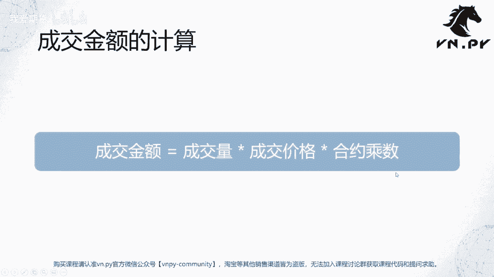
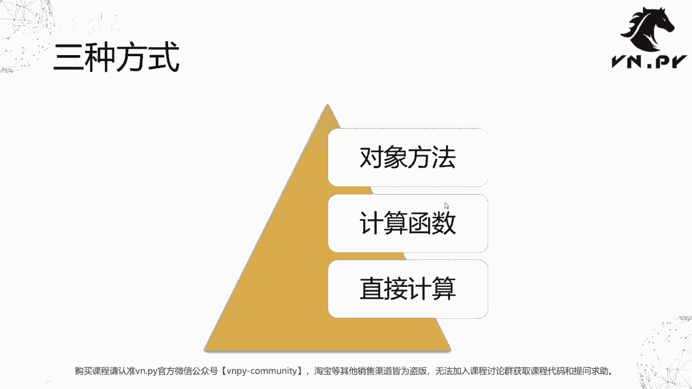
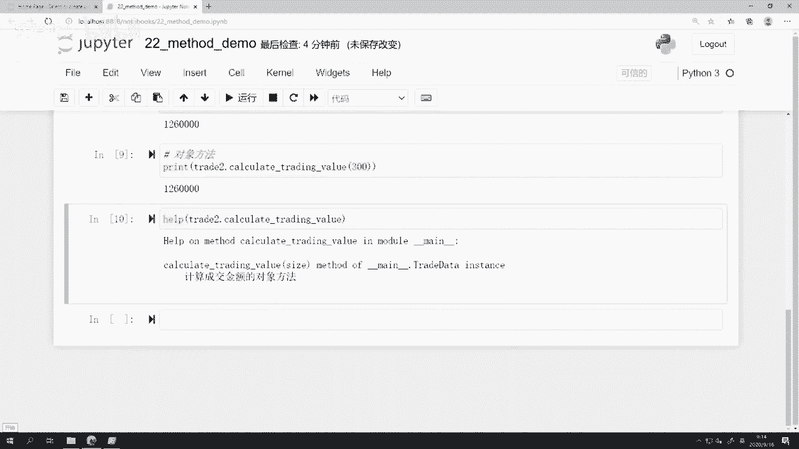
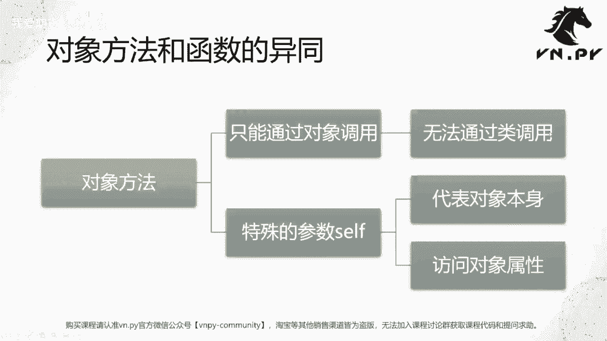
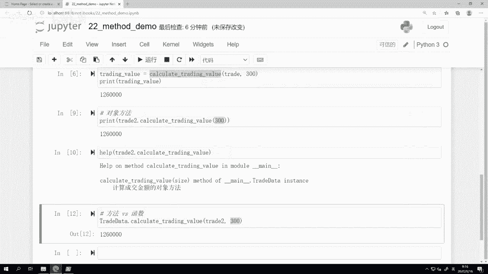
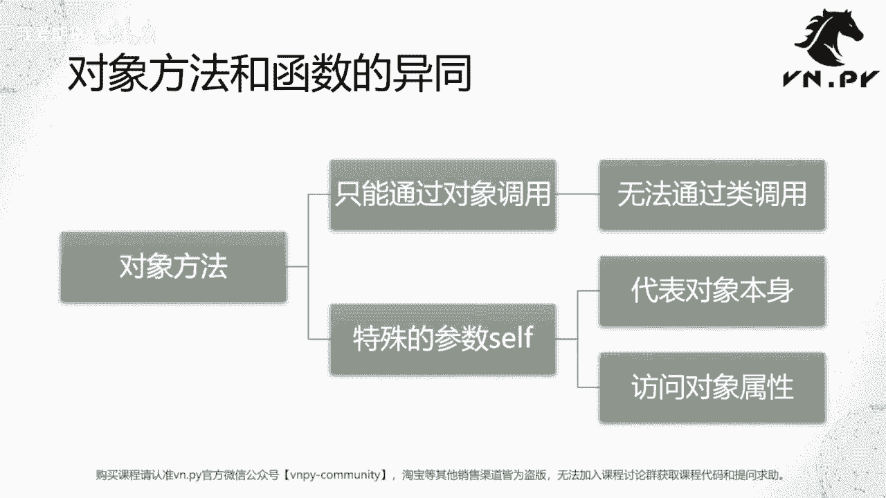
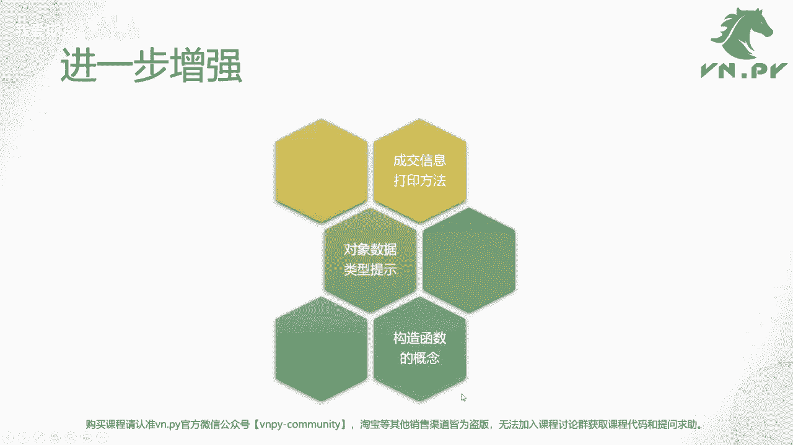
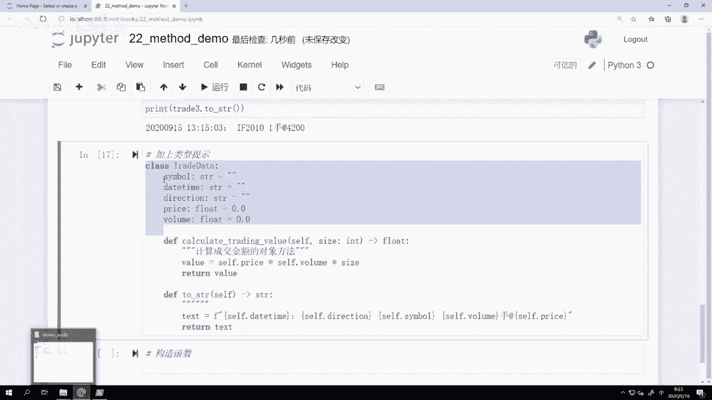
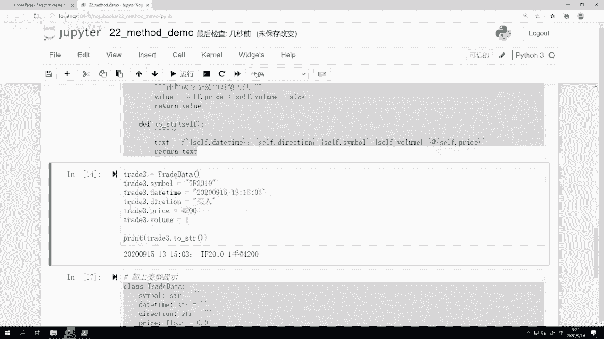
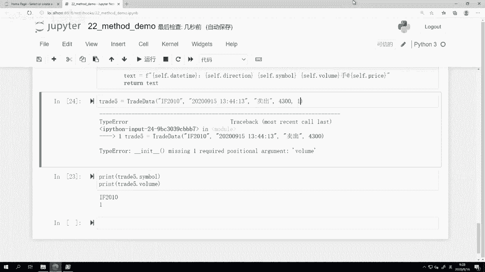

# 22.对象的方法 - P1 - 我爱期货 - BV1aG2gYBEpJ

OK欢迎来到量化交易零基础入门系列，30天解锁Python量化开发课程，那么今天呢是我们的第22节课，在上一节课里面啊，我们最后留了一点悬念啊，叫做这个对象，如果你只是用它来存数据的话。

跟字典其实在功能上本质上没多大区别，那为什么我们在编程语言里面还需要啊，对象这么一个概念呢，这块的内容呢就是我们今天要讲的对象的方法，我们先来看一下上节课，最后啊我们用来演示访问对象数据的时候。

那当时我们算了一个叫做成交对应的金额啊，那这个成交金额的计算是怎么算的呢，成交金额等于成交量乘以成交价格，再乘以合约乘数啊，就是我们最后算出来那个，大概100多万的那么一个数值。

那接下来呢我们要来看一看啊，如果我为了算这个数值，有哪三种方法可以来实现，第一种方法呢，就最简单的叫直接计算法，第二种方法哎我们定义一个函数来计算，最后一种方法，我们把这个函数啊整合到对象内部。

就是我们所谓的对象方法了。

同样我们这节课也是那开个GP特来讲哈，上节课有些重复的代码，我这边都已经把它给复制过来，这样就省得手敲了，这节课呢啊就是方法的英文对象，方法啊，这个词的英文是method啊。

用来和我们啊外部本身的那个函数和function，做一个区分啊，所以这节课我们就叫22method demo，然后呢我们这边还是先创建好一个类，然后对它进行字段的赋值，诶这个。

trade等于trade data啊，先把创建出来，然后赋值，然后我们看看，首先第一步上节课原始的那个计算方法，这个叫做啊trading value等于trade的点啊。

price乘以trade点volume，再乘以个300对吧，300是我们股指期货合约乘数，这就确定value，让我们print的一下确定value，我们来看一看这个数值是多少，那这是最基本的算法啊。

最基本的我要计算的话，那那就直接写一个计算公式，就把Python当计算机用就行了，然后呢结合上我们之前哎，差不多15节课到20节课我们学过的内容，我们知道我还可以定义一个函数啊。

Calculate trading value，这么一个函数啊，然后呢我们把trade作为一个对象给传进去，然后可能我在后面再传一个额外的参数size，偶传两个参数。

一个参数是这个我们之前创建的trade对象，第二个参数是我们的合约乘数啊，就size，那么它的这个计算结果呢应该是trading value，等于trade点，price乘以trade点volume好。

再乘一个size return trading value啊，这个就是一个很普通的两部的这么一个，计算函数的实现啊，所以我们要来先把它给定义出来，然后呢我们来调用它一下，看一下结果啊。

这个trading value等于AKQ，value trade size呢就传300，这样传进去之后，我们看一下这个print trading，那这种方法，同样我们也可以把这个结果给计算出来。

但是这种方法有一个，比起上面这个方法有什么好处呢，就是我们的这个计算逻辑，已经封装成一个函数了，所以在我程序不同的地方，我有的时候想要重复再去用的时候。

我只要调用这个calculate training value函数就行，我没有必要再去把上面这个完整的计算公式，去写一遍啊，那这样对于我来说已经第一步方便了一些，但是呢这个函数还是一个独立的函数。

每次调它的时候，我可能还要想一下这个函数的名字是什么，有没有更好的方法呢，就是我们最后这一步要讲的叫做对象方法啊，他的话要稍微对我们这个trade data，做一些额外的改造，我们要在下面去创建一个哎。

我们创建第一个对象啊的方法啊，这个对象方法创建，同样是使用def函数去创建的，只不过在创建它的时候，你是把它创建在一个类的下面，同时前面有这么一个四个空格的缩进啊。

Calculate trading value，self第一个参数一定是self，第二个参数呢是size，啊这里我同样可以把它呃加上一个，就是帮助文档嘛，叫做计算，计算成交金额的啊，对象方法好。

然后啊这个内容其实一样的，没什么特别trading，我就直接打value吧，短一点self点price乘以save点value，再乘一个size，return value即可，好。

这样我再次运行它一下啊，刚刚就我加上这个函数之后，我又按了一下shift回车，目的呢是为了让我这一段修改生效啊，否则你不要在JUPITER里面改完一段内容，就不运行它。

你就直接在下面去做围绕他的操作会报错的啊，因为没有生效，这样运行完了之后，厦门我们要再做一步，就是我要重新创建一个新的trade对象，因为现有的trade对象。

还是用刚刚那个trade data的方法给创造出来的，所以它并不包含这个calculate，training value的方法啊，所以在这里我们要再创造一次，再对他重新复制复制一次啊，或者还有个选择啊。

我就创建一个新的吧，我在下面创建一个新的trade2，我把老的也留着啊，我创建一个trader2啊，就也有这些字段，此时呢我们就可以直接啊，在这个对象方法这里调用，甚至我可以更加简单一点啊。

这个print trade2点calculate trading value，同样结果也可以算出来12600啊，那么可以认为在计算这件事情上，以上三种方法是等价的啊，第一种方法就直接写原始的计算语句。

在这个JUPITER里面去算，第二种方法我们定义了一个计算函数，然后把trade和size给传进去去算，再到这边，第三种方法我们直接把这个函数，其实你可以看到，我们只是把这个函数它的逻辑给写到了。

trade data这个类的内部，写到内部之后有什么好处，第一个我们再去算的时候，我不用再想这个calculate training value，这个函数叫啥名字啊。

因为它就跟train data放在一起了，第二个我们当时在计算calculate，training data的时候，第一个要传进去的参数是trade对吧，但是因为我们把它放到这个类里面了，它可以使用啊。

在所有就类上面的方法被调用用的时候，都会传入一个额外的叫做self的这么一个参数，当然这个self的名字是你自己起的啊，你可以把它起名，如果像CJ加A就管它叫this。

你把这边所有的self都改成改成this也行啊，只不过Python的标准写法里面大家都使用self啊，那么这边呢用了self之后，这个self指代的就是我们这个对象本身，所以此时你访问self。

访问self点price，就是我自己的那个价格，self点volume，就是我自己的数量，再乘一个外部创建参数size啊，就那个合约陈述，我们就可以把这个计算结果啊，这个这个成交额的结果可以计算出来。

然后返回它了，所以你可以看到啊，这个这个我们从第一步原始的计算啊，为了能把这个计算逻辑代码后面我不想再写它，我希望就是说写一遍啊，别的地方重用就行了，我们就给了他一个名字，把它命名为一个函数。

然后呢这个函数我们哎又在后面再用的时候，我想着还老要去记着它啊，有点麻烦，我又把它索性封装到了这个类的内部，变成了一个对象的方法啊，这样呢，其实我们是在一步一步去完成这么一个，抽象的工作啊。

同样我们这边啊，因为刚刚我这个在这写了一个，计算成交金额的方法，我也可以来访问help除以二点help啊，直接tap下自动补全，我也可以通过help函数来访额访问一下。

就他的这个里面啊的这个说明的文字内容好，看看他是怎么用的。

那么啊接下来呢要讲的，或者说你可能现在已经有一个疑问，就说诶，我怎么觉得这个对象的方法和函数那么的像啊，甚至于他们呃，这个这个就是用起来的时候，完全就是一样的对吧。

只不过一个可能是在外面把trade给传进去，还有一个呢就是哎我本身就在trade这个对象上，所以我trade不用传了啊，他们俩异同点在哪呢，首先对象方法是只能通过对象来调用的啊。

就必须你在创建一个对象之后，你才能调用它，你无法通过类来调用，什么意思。

比如说啊这个方法vs函数，我如果想试着通过class啊，就是我们的那个trade data这个类，直接去调用calculate trading value，然后传个300进去，他会报错的。

此时的报错内容是叫做calculate treating value，Missing one required，Positional argument size，他会告诉你，不好意思。

你要调这个类的计算函数的话，你少了一个参数，少了一个什么呢，少了一个size size，我们看一下上面这个例子里面的，第二个参数是size啊，当我在调用这个函数，就是在类级别去调用它的时候。

它需要我去自己额外传入第一个参数就是self啊，那因为我刚刚只传了一个参数，所以它被其实被复制到self这个啊参数上去了，所以后面这个size就等于没传，所以是个空的。

如果我们想要用这个啊类级别起到相同的效果，我们可以这样，就是我们调用类的calculate treating value，这么就直接在类级别调用这个方法，但是此时一定要显示的。

就跟我们上面直接调用这个函数一样，把我们要计算的那个trade的对象传进去啊，再把第二个参数300传进去啊，但这个方法就就这个写法肯定是比较麻烦，而且对我们人来说不太好记忆的，所以在实践里面。

大家都会直接用trade2点calculate trade value，只传一个300进去，但通过这个例子你可以理解啊，其实他也是封装一个函数，这个函数被绑到了类上计算的时候。

它会自动帮你去省掉这么一个第一个参数，要传进去这第一个参数就是这个对象本身，他会帮你把它省掉，你只要传第二个参数啊，就从第二个参数开始往后传就行了，所以这个特殊的参数self啊。

其实是对象方法和函数最大的区别，那么这个self代表的就是你当前还调用方法的，这个对象本身，而我们可以通过这个self去访问对象，相应的属性啊，或者说你去访问对象内部其他的方法也可以啊。

所以这个是最大的区别，就如果不考虑这一点，Python内部的函数和Python内部的方法，就这个这个对象方法，两者在很多时候是可以等价来用的啊，如果你就是不考虑self这一点的话。

其实两者很多时候是可以等价用的，但正因为有了一个oy self，或者你可以把它理解为一个语法糖，什么叫语法糖，就让你写代码时候可以写的代码量更少一点，可以让你用更少了，键盘敲击的次次数。

就能把你想要表达的意思给表达出来啊，这个呢就是我们啊这个对象方法主要的作用。

那么对象方法和我们的这个对象的数据储存，两者结合起来之后啊，就可以大幅增强，我们这个对面向对象这么一个啊编程方式，在我们写代码时候的威力啊，可以让我们在这个写代码的时候呢。

变得非常的呃啊这个这个怎么说呢，更加结构化哈，把同样的东西放在就类似的东西，或者相关的东西放在同样的地方，这样我们在后面用的时候就能方便很多，所以在接下来我们要看三个啊，我们的进一步增强。

第一步我们打印一下成交的信息啊，我们加一个额外的打印方法，第二步我们来洗查看一下啊，或者说增加一下对象数据的类型提示啊，第三步我们要讲一讲构造函数的概念。

我们就在这里一步步讲啊，第一个是叫成交信息的打印方法，那此时呢我又来哎，我再来定义怎么TRADA啊，我又来定义它了，我再额外加一个方法叫TOSTRING啊，什么叫TOSTRING呢。

就是把它转化成一个字符串，当然这个转化字符串的时候啊，我是把它转化成，就把它相应的信息转化成一个字符串，那么此时因为我只需要我自身的信息就行了，我并不需要外面再给我传任何参数进来。

所以这个to string函数我只保留了第一个self参数，那么这个self参数我们知道在调to string函数的时候，是不用传的啊，所以他就用起来很方便了，那我们怎么to string呢。

其实也也挺简单的，就是这个text啊，我就用个字符串格式化对吧啊，我们之前课上讲的内容了，呃，首先，我们先用一个时间戳分割一下，然后呢self点啊，这个direction就是你交易的方向。

然后下面是我们的这个symbol，好，我们交易的合约代码，然后是我们的self点volume，你买了多少手，最后跟一个at啊，在什么价格成交的，最后我们return text啊。

那这样呢我们还是创建一个trade，三好，我们再创建一个trade对象，好我把这个转换成字符串打印一下，大家可以看到，在这个时候我就非常诶这个舒服的，把整个对象里面的信息转化成一个。

我人能一眼看出来的字符串，可以打印出来，如果我不这么做啊，我直接去print trade3，大家看一下或者是什么情况，他会告诉我，这是一个哎这个位于main命名空间下面，一个trade data对象啊。

然后这后面跟的是这个对象为内存中的地址，那这个信息确实是一个Python解释器内部的信息，但对我这个人，对我这个写代码的人，或者甚至于啊大家学这个都是为了做交易，量化交易嘛对于我这个交易员来说。

这个信息没有任何意义，我根本就不想知道这个信息，那此时呢把它转化成A字符串啊，print to string啊，可能呢就更加实用，或者说才有意义，然后再下一步啊，就叫做加上这个类型提示。

那么额这个类型提示的概念，我们在19节课，20节课也讲了啊，那类型提示，同样这个方法在我们类的这个定义里面，也可以去用，比如说这个symbol，我们可以把它定义为A就是个字符串啊，都完全一样的写法。

该跟冒号的跟冒号啊，该跟等会儿我们的放函数最后返回值呃，那个方法返回中跟一个箭头，这三个都是string对吧，然后per price把加上float类型，volume呢也加上一个float类型。

Calculate，确定value的时候啊，一般前面这个self变量，我们是没有必要加上类型的，因为这个本来就是对象本身，你也不需要告诉解释器啊，它是某个类型，这没必要。

size呢我们可能加上一个类型是int，然后这么一个计算结果的返回值，我把它返回为float类型啊，然后two string因为没有额外的参数，我也不需要加啊，然后这里呢返回值类型是一个string啊。

那么这样我们相当于就额外的加上了类型提示，那加上类型提示之后呢，在用的时候我们仍感觉不到什么区区别，但是在写代码的时候啊，如果你在vs code里面写，那就可以帮再加上我们之前讲的啊。

用到flag8这样的检查，它就可以很有效的帮你在执行程序之前，把一些不小心打错type的地方给筛查出来好，然后最后一个呢，我最后一步我们要讲一讲构造函数了，那什么是构造函数。

截止目前我们在创建trade data的时候。

我们都是大家可以看到这trace3，我们都是先创建对象，然后把这一个个值给复制上去啊，那么这个方法呢不能说不好，但是无疑第一个稍微有点麻烦对吧，我写写这个光吹前面吹的三这个东西，我就又额外多打了五遍。

然后第二个啊，如果我在创建对象之后有一个字段没传的话。

但是我又没注意哎，比如这个地方我忘了传volume的话，我在这再打一个这个trace，三点two string就很怪啊，成交20。0手，而且这查不出来的，因为我没赋值，就是没赋值啊。

这个呃Python也不会给我任何额外的提示对吧，只有运行的时候看到结果才知道诶，前面漏传了一个，所以Python里面在类在创建的时候，都有额外的一种方法叫做这个构造函数啊，怎么样去建这个构造函数呢。

它的名字叫做INIT啊，注意这个INIT大家可以看到前面有俩下划线，后面也有俩下划线，这种前后都带两个下划线的方法，或者说函数在Python的世界里面叫做魔法方法，那么它们是啊。

当然我们后面一节课会讲啊，是这个Python解释器留给我们的一个去哎，把这个啊数据对象本身的一些操作给修改，给重新实现的这么一种特殊的函数啊，现在我们先不管它，我们现在先呃一个基础的用法吧。

你就把它理解为也是一个函数，但是这个函数是当你创建trade data对象时候，自动调用的，我们在这里啊，我们把这个函数改一下，就是你在创建的时候就要给我把这些symbol，this time啊。

direction price volume都必须传进来啊，如果有一个少传了的话，那么等会我们可以来看一下结果啊，In it，这或者不写也行啊，随便save点，symbol等于symbol。

啊我们在这个当对象被创建出来的时候，就自动就或者说强制要求哎，你必须把这些值给我附进来，如果没负，那不好意思，后面我就给你报错，这样呢可以有效的去避免说诶，偶尔可能创建时候不小心漏打了一个啊。

这样就少数据的情况，你这样回车啊，弄完了之后，此时我再去试着直接创建一个trade data，大家可以看结果是怎么样吹的，五等于吹，他会直接报错，告诉你INIT函数，missing5个。

Missing five，Required，Position，Arguments，少了五个啊，按照位置去算的这种啊参数啊，Symbol detea，这五个都少了，所以正确要用的时候，你要怎么知。

你要把他们都传进去，啊这个时间我就随便写了啊，20200915 13。50，44分13秒啊，这个方向是卖出啊，改一个吧，不要老都是买入啊，然后我这次赚了钱了，在4300卖的成交了一手啊。

这样回车完了之后，你可以看到，我们才能正确的去把trade5给创建出来，同时现在在trade5上面的这些字段，也都已经存在了，啊我就随便打两个啊，我都打了，大家可以看到在这的字段都存存在了。

而上面如果我少打一个参数，我把最后一个一给漏了，你看他也是创建不了，他都会告诉你，你哪怕少一个参数，他也会告诉你这个少了一个，所以呢就可以强制我们在运行的时候，正确的能够看到诶这个数据有没有。

而且这个对象的创建，是不是该赋值的那些内容都复制进去了啊，不要说哎我可能付了几个，有几个忘了，结果到运行的时候啊，程序莫名其妙算出来，结果不对的，我才发现哈，说前面代码写错了，那如果像这种情况。

你运行到那个地方，Python直接就抛异常，他会告诉你啊，这地方你有东西写错了，就非常方便，能让我们把错误的地方给找到，OK那么哈这节课的内容呢就也到这了啊。

然后更多精彩内容，还是请扫码关注我们的社区公众号。