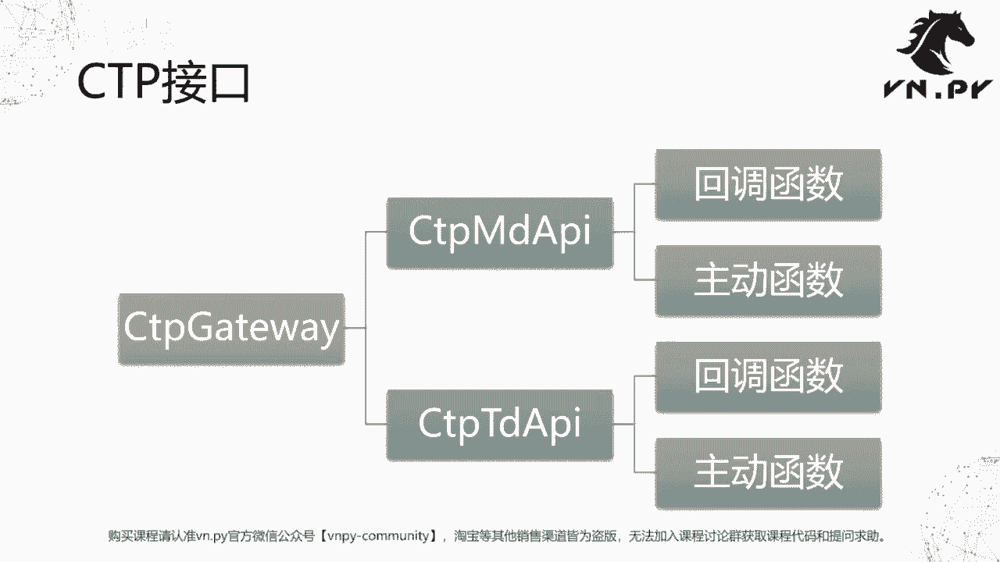
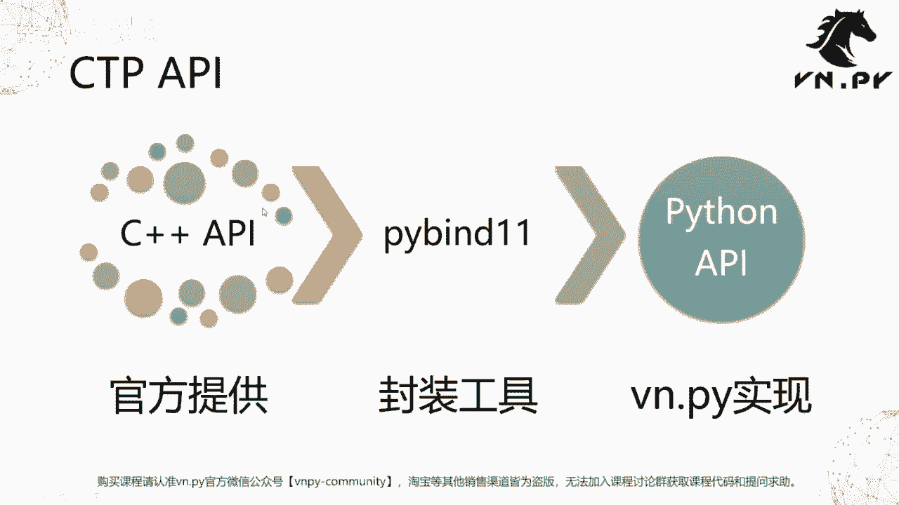
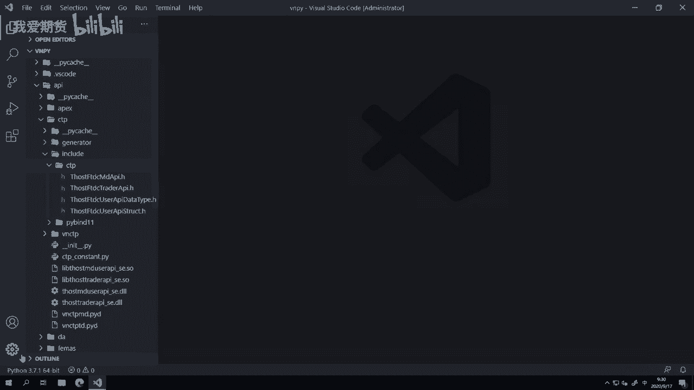
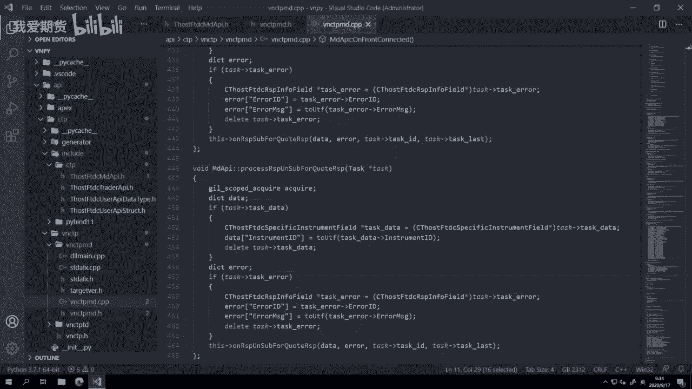

# 25.初探交易接口 - P1 - 我爱期货 - BV13G2gYBEoh

OK欢迎来到量化交易零基础入门系列，30天解锁Python量化开发课程，那么今天呢是我们的第25节课了，在上一节课里面我们学完了，怎么样在子类里面去重载一个，父类提供的方法啊。

去实现一些我们在子类里面的自定义逻辑，那么到这里呢，其实我们已经把去开发一个交易接口时候，主要要用到的，各种Python里面的概念都已经掌握了啊，当然实操层面还有很多的细节啊，很多这个啊代码。

比如说用怎么样用一些标准的Python库啊，去实现我们要的逻辑，但是大体上它的原理就是这么一回事，所以这节课呢算是我们的第一次，比较实践的课程啊，我们来初探一下我们的交易接口啊。

当然这节课我们并不是要大家直接就去掌握，开发了，只是带大家去看一看啊，我们的交易接口和之前讲的那些面向对象，是怎么一个原理，怎么一个关系，那么我们这节课要讲的是这么一个CCTP接口哈，这个也是国内可能。

大家在第一次接触量化交易的时候，最常见到的这么一个接口啊，当然有一些如果你是做数字货币开始的，那可能你比较常接触的是那边的一些，Rest的结构，但我们今天就来讲，还是最常见的这个期货的CDP接口。

那在V点派里面，CCTP接口的名字啊，这个类叫做cctp gateway，那么在它内部又包含了两个对象，而这两个对象的类呢分别叫CTPMDAAPI和。

CTPTDAPIMD是market data的缩写啊，所以它是行情接口，TD是trade的缩写，所以它是交易接口，然后在每一个API，就每一个这个类里面都是既有主回调函数，也有主动函数啊，既有回调函数。

也有主动函数，那么记着我们上节课讲的那个点，主动函数是给你写程序的人去调的啊，就你可以随时决定我什么时候去发单，我什么时候去撤单，我什么时候去登录接口啊，我什么时候去查询合约。

这些都是你这个写程序的人可以去决定的，你把写在程序里面什么地方，你去调这个方法，他就什么时候去做，另外一种函数叫做回调函数啊，或者你也可以管它叫回调方法，反正一个意思，回调函数是当外部我们的程序。

外部有什么事情发生的时候，我们这个程序自动去调用的，所以这个调用并不由你这个写程序的人控制，你可以去控制的是在调用的时候，你要怎么去实现这个函数内部的逻辑啊，就是调用的时候我要去做哪些处理。

但是它什么时候被调用，这一点的控制权不在你，而在外部啊，比如说外部你订阅一个行情之后，订阅行情这件事情你可以控制，但是行情什么时候，从交易所的服务器推到柜台的行情，服务器再推给你，推给你的API。

这件事情你控制不了啊，因为这个推送是由交易所那边发起的，但是一旦这个数据到了你本地的API里面，他收到数据了，立即他就会来调用这个回调函数，那这个时候呢，我们的程序就可以来实现。

所谓的这个叫事件驱动的编程啊，我不是傻乎乎，在这等，每隔一秒钟，然后呢去做，如果有就做一些事，没有就啊什么都不做，这个是一种比较傻的叫做时间驱动的编程模式，而对于我们这种量化交易的程序啊。

对实时性有很高需求的，我们都会采用叫做事件驱动的编程，一旦外部有什么数据到了，我们本地的系统里面啊，我们的回调函数被触发了，那立即就会触发我们上面啊，不管是啊策略的执行这个这个运行啊。

还是我们图形界面的更新啊等等，处理完了之后，如果要下单，立即就出去，这种瞬间的啊，你来了我就给你立即算好，就发出去，这种叫做事件驱动的编程啊。

概念讲完了，我们接下来就来看代码，还是打开我们的这个啊vs code，那这节这节课我们打开vs code的时候，大家注意是上节课剩下的内容啊，因为vs code有一个自动去在每次打开的时候。

显示你上一次关闭的时候的内容的功能，那我要做的第一步呢，先把它给关了，叉叉把它给关了啊，然后我们在file里面open photo啊，大家还记得我要打开的是VN pi的那个目录，在哪呢，在C盘啊。

我可以如果你记得比较熟的话，可以在这直接手书啊，不用一个点鼠标了，Vn studio，而且手术的时候，它下面会不断的有东西出来，你可以实现智能提示lip啊，甚至我写杠，然后site我可以直接诶。

不好意思，重来阿，VN studio lab site啊，就11。1点就只打头两个字，然后按一下下这个方向键，它就能自动选VMPY啊，这个目录，然后我们就选择文件夹，把这打开，打开之后我们可以看到啊。

就整个代码已经出来了，我们找到好，我们先把这个整个折叠都给折折叠起来啊，这个就是我们的VPY的文件夹，找到gateway目录，往下翻，找到CCTP目录，点开其中的c TP gateway点派。

那在这个里面啊，就是我们的VN点派的整个CCTP接口的代码，大家可以看到上面有很多内容啊，你看着就很长，加载了好多的东西，我也我也左右分一下啊，这样看着舒服一点，上面加载了好多东西，对吧。

然后这边是很多的这种字典，这些字典提供的功能呢是一个叫CCTP，里面的数据定义到VOR派内部，数据定义的转换啊，怎么样转换就通过这个字典的键值，如果CDB传到这个状态给我。

我就把它转化成对应的VN点派里面的，这个结构，这个是字典的用法啊，再往下呢，我们又可以看到这里还有一个叫做全局变量啊，max float和china t z，这个是中国时区啊。

这个等会我们用来做时间戳的，时区转化的时候要用，以及一些用来缓存数据的全局字典，还simple exchange map等等啊，那这些呢我们这个大体上的概念，前面的其实都讲过了嘛，就是这个字典啊。

这个列表等等数据结构的缓存啊，然后往下翻的话，你会发现代码很长啊，这个足足有将近1000行，900多行代码，所以还是上节课我们讲的逻辑，先CTRL2把折一下，我不想看那么多细节，我就想先看个大概。

看大概的话我们可以注意到这里啊，先CTRL可以CTRL1吧，然后先就这样吧，彻底折叠起来，我们可以看到一共三个大类，Cctp gateway，CCTPMDIAPICTPTDAAPI啊。

然后c t b gateway我们把它点开，是我们的这个所谓的交易啊，这个接口的标准实现，那这个接口是给VN点派上面的主引擎，去连所有接口的时候，他都是这么一个实现啊，这个是标准化的实现啊。

有这么多的主动函数，connect subscribe sorder等等啊，这块我们先不管，我们来看下面两个API，MDAAPI和TDAAPI，首先啊我们就看简单一点。

MDAAPI两个原理其实是完全一样的，我们就看MDAAPI，就看行情，首先我们定义这个啊类的时候，我们继承了一个父类，这个负累是一个MDAPI，然后这个MDAAPI是哪来的呢。

大家可以看到我一上去的时候，它有个提示叫pie bind e1type啊，这个类型是我们在C加加语言里面啊，把原声的C加加的CCTPAPI封装出来的，一个Python接口啊，呃一个Python的类啊。

但是这个封装怎么讲呢，可能呃等会儿我们最后也稍微看一下，我们看一下代码就不讲原理了啊，那在这反正你就记住它是一个负累啊，你实现了这个CPPMDAAPI是一个子类，子类里面我们可以看到有INIT函数。

然后有一堆以on开头的函数，一般在所有的编程语言里面就也不说所有吧，绝大部分编程语言里面，回调函数的命名大家都遵循一个规则，就是它前面以西这个o on啊，on作为一个这个开头语啊，有的是大写的。

有的是小写的，这个不一定，那么为什么选它做开头语呢，意思就是当某件事情发生的时候，我这个函数被调用，所谓的on front connected，就是在front connected这件事情发生的时候。

我这个函数被调用啊，所以它叫on front connected，front是啊，在这个编程啊，或者说比较这种叫做所谓的服务端编程里面，他的意思是那个啊服务器的叫做前置机进程啊，这个意思呢。

就是当你的这个接口，连上了CCTP的服务器的时候，他就会来调用这个on front connected，然后on frondisconnected，这个容易理解就断了嘛。

然后on r s p user login，RSP是response啊，回馈或者反应这个词的缩写，User login，我们大体啊能理解user就是用户嘛，login就登录嘛。

On response user login，所以是当你登录啊，成功了或者失败了，他都会通过这个回调函数，来告诉你对应的信息啊，底下还有一些什么。

on response error on这个response submarket data，我我们就不一个个概念讲了，然后on return depth market data，这个是比较重要的。

这个是当你订阅完行情之后，交易所那边每当有一个行情推送的时候，这个回调函数就会被调用，那么我们在这里啊，我们在上一节课已经学过了所谓的方法，重载之后，其实你就容易理解了，这些带on的回调函数。

都是在父类MDAAPI里面就已经提供了的方法，所以当我们继承CDPMDAAPI，当然在父类里面提供的方法，其实这些函数都是空的啊，他们都是什么逻辑都没做啊，就他他基本上就是。

或者你理解为他就把数据打印一下，其实它打印都不做啊，他是什么都不做的，那所以在这样一个情况下，我们要在比如收到行情的时候做什么事情，这一件要做的事情，我们就要自己在我们的啊。

这个回调方法的重载里面去实现，比如说我刚刚点开了啊，Return type market data，我们可以看到这下面我们做了很多这个事情啊，一行行往下看，其实也不复杂。

第一步检查一下这个data data是一个字典，是一个dict类型，我先看一下它有没有update time这个字段啊，如果这个这个update time是所谓这个tick的，最新的时间戳。

有的时候在CCTP系统重启的时候，它会推一些嗯不带时间戳的垃圾数据过来，所以我就看他没有时间戳，那我就不需要处理，我就直接啊这个函数下面我都不做任何处理啊，我就起到一个过滤的作用。

因为我不想处理垃圾数据嘛，第二步我来看一下哎，这个合约代码对应的交易所代码，我是不是已经有了，如果查不到的话，因为symbol exchange map，是我放在上面这个一个全局字典啊。

在我获取合约信息的时候，他会把对应的每个合约代码，和每个交易所的关系缓存下来啊，如果我这边get不到，那这个字典的get逻辑我们也学过了，Get，如果get不到。

就是直接这个exchange就是个空字符串，如果是个空字符串，那这边我们if not判断的时候，它就是为true，因为空字符串嘛，它not的那自然就是true，空字符串本身就是false。

所以就也是直接return，不需要做后面处理，然后再往下啊，我们把这个CCTP推购推送过来的这个啊，tick的时间和我今天的日期，两个做一个字符串的拼接，拼成一个叫time stem。

这个是个时间戳的字符串，然后呢啊我用到了Python里面一个date time库，这个是个时间转化的库，我把这个字符串啊，这个时间的字符串转化成啊，这个前面是这个字符串。

time stem后面是个字符串的格式，年月日空格时冒号分冒号秒小数点，然后后面跟的是毫秒啊，通过这个方式把它转化成一个时间戳的对象，然后我们再把这个时间戳的对象，转化到我们中国市区，就中国东八区啊。

China tz time time zone，TZ是这个市区time zone的缩写，把localized转化成本地的这么一个时间戳，然后我们就创建一个VN点派，内部定义的数据结构的对象啊。

就我们的tick data啊，这个你可以认为这个tick data就是个类嘛，然后创建的时候把这么多字段都给写进去啊，哒哒哒好多字段，因为我们的我们知道就是盘口tick，有很多信息，什么合约啊，代码啊。

交易所啊，时间戳啊，它是什么名字啊，今天的日内成交量，最新成交价涨跌停，高开低抽啊，买卖盘口一档啊，以及我这个是哪个接口来的，Gateway name，我都要把它写进去，然后呢对于不同的市场啊。

比如说期货一般情况下可能就只有一档的数据，但是对于股票来说，它可能有两档啊，它它可能有五档数据，甚至有的时候比如说你期货你要level two，或者说啊股票你有呃这个level two啊。

期货有level two，你会有五大，股票，有level two，你会有十大啊，就你有可能有更多数据，所以我这边做个判断，如果你有二档数据的话，我就把二档到五档数据给你取出来，取完了之后。

我去调用gateway的UNTICKED的这么一个回调函数，把我这个已经啊这个转化成VN，点派内部的这个tick，就是我的tick时间戳的对象，不好意思，tick盘口数据的对象给推送出去。

至于推送出去之后后面怎么处理，其实我在这已经不关心了，因为这个处理是在gateway层面实现的啊，所以啊这个这个尽管我讲了，你也听了，但现在听不懂是很正常的啊，大家记住。

现在还是在学Python的基础而已，这个逻辑的实现是需要对啊交易内部的一些啊，这个原理有所了解的，所以你现在听不懂很正常，没关系，随着学习的不断深入，你就记着这边有我们有讲过一段诶。

怎么样去这个实现交易接口的原理啊，等到可能50节课学完之后，你再回到这节课来看一看，那个时候呢相信会有一个比较深一点的理解，下面这些啊，其他函数什么connect login，反正没有on开头的。

大家可以看到没有on开头的，这些函数都是所谓的主动函数，主动函数是干嘛的，就是在我们的程序内部给我们自己调的啊，我们自己调的这些函数一般就是就正常命名，你你啥功能你就命名什么。

connect就是连接服务器嘛啊login就是登录嘛，subscribe就订阅行情，close就是把它这个对象给关掉，把连接给断掉，然后登出，等会就可以把对象销毁了，Update date，就是每天呃。

就时不时更新一下今天的这个最新的日期，那这些函数啊，或者说这些主动方法它不是由父类提供的了，他不是在MDAAPI里的，而是我们自己在CTPMDIAPI里面，自己去实现的，所以你可以把它类比成上面这对。

on front connected什么，就有点像我们上节课里面讲的那些，继承自父类的，比如two string啊，这类函数，然后这些呢就有点像是在子类里面。

比如说future trade detail里面，我们实现的那个啊，这个这个这个这个calculate cash change啊，计算现金变化，这么一个在子类层面实现的方法啊，当然额在原理上讲。

他们都是类下面的方法，但是因为调用者不同，这个是我们自己决定什么时候调的，比如说connect这个连接交易接口的时候啊，虽然它定义在这，但是真正调查的时候什么时候掉，V得派主界面。

你点那个连接按钮的时候，它一层层传下来，最后就在调这个函数啊，但是连上去之后，什么时候会收到on front connected这个回调，不好意思，这个是由外部CTPAP呃，那个服务器啊。

你要连他OK你发个数据包过去，那他那边确认你登录呃，这个连接成功了，会给你返一个数据包，这个时候我们on front connected就会被调用啊，所以这个什么时候被调用，我不知道啊。

这个是由外部这个啊决定的，举个例子，比如说啊你发了数据包，但不好意思，这时候网断了，或者那边服务器没开，所以connect你可以正常调数据包，可以发出去，但是因为网断了，或者那边服务器没开。

所以你永远都收不到on front connected啊，就你前置机是连不上去的，因为人家没开嘛，所以这个时候，这个回调函数就一直不会被调用啊，那么这些一个个的实现下。

我们可以看到CTP的TTAAPI也是一样啊，只不过他的因为交易嘛，就是它的相应的回调函数逻辑会更多一点啊，然后这个主动函数呢也会更多一点，但所有的原理都是类似的，有的这些函呃，这主动函数有这个参数。

有的没有啊，这些回调函数呢，每个的啊基于函数的这个前缀不同嘛，就它属于不同类型的回调函数，所以它对应进来的这个字段啊，有多少个参数也会有所区别，那么整体上呢，这个就是我们一个CTPAAPI的啊。

或者说c TP gateway的这么一个工作接口，那Python的部分讲完了之后啊，现在你肯定有这个问题，就是那个MDAAPI是怎么来的，我们刚才也讲了，他是在C加加里面我们自己封装的，那封装的时候。

我们刚刚有看到那个MMBAAPI，是一个叫拍半的一一类型对吧，那这个就是一个所有VN点派内部的API，和外部啊官方提供的API之间的关系了，那么我们就以这个CDP举例，Cdp，首先是我们国内。

上海期货交易所下属的一家软件公司，叫做上汽技术公司，他们开发的这个CCTP的柜台，同时提供了一个叫做C加加版本的CTP的API，所以你认为可以认为这个是官方提供的，那对于其他的API，你比如说像货币啊。

这个数字货币交易所，它也有提供一个他们那边呢，比如说Rest或者WEBSOCKETAPI，那这些API呢都是官方提供的，这些API能不能用可以用，但是用的话你相应的比如说哎你要用这个啊。

CETP官方提供的API，你就要写C加加语言，你没办法直接在PAPON里面用，而我们为了去能够在Python里面用，我们就要做一件事情，叫做什么叫封装，封装呢，就是把同样的C加加里面的功能。

转化到在Python里面就能去用啊，然后Python里面呃，就比如说回调函数CAI里面回调了，我把数据结构转到Python的字典，然后呢推给Python的环境里面，Python这边要发单了。

要去调用主动函数了，那我传进来的是一个Python的，比如字典啊，那这个字典又进到这个A呃，通过转化工具转成C加加里面啊，它其实是一个最底层的结构体指针，然后再把这个数据发出去。

那么这个转化这件事情实现呢，是通过这个叫PBIND11的库啊，它是一个封装工具，这样封装完之后得出来的东西就是一个Python API啊，那么这个Python API呢也是VN点P。

我们这个开源项目里面最重要的组成部分之一，我们有大量的啊，就是把外面其他的啊语言或者其他模式的接口，转成了Python接口，这样的大家在写程序的时候就比较方便了啊，那同样所以这块啊是纯粹的。

就是C加加里面API长什么样子，我们就只是把语言给换一下，换成这个Python的API，我们还没有把他所谓的一些业务逻辑，比如说我们刚刚在gateway里面看到不同的啊，这个数据类型的转化。

比如CDP里面他可能用的是自己的数据类型，我们把它转成Python里面的这些对应的字段定义，然后呢，这样VENDER排上层才能够标准化的统一去处理啊，就所以你可以认为所有的不同的这堆gateway。

在van der派内部，他们都是不同的多态实现啊。

然后我们来稍微看一下这个CC加加的AAPI，也是打开我们的这个new server啊，打开这个new server好，我们先把cdp gateway给关了，然后把gateway文件夹给折起来。

然后进到这个叫API的文件夹里面，API文件夹里面找到CCTP，先找到include文件夹，然后这里面呢有个CCTP文件夹。

大家可以看到这一共有四个文件，我们先点开这个叫MDAPI，点H点开之后它是C加加的文件啊，叫点HC加加点头文件，哎这个我不要啊，然后这个时候你看到有一堆乱码对吧，有乱码，这个乱码看着很难受啊。

主要原因是因为啊，呃这个vs code默认的编码是叫UTF8编码，而这个C加加的啊，CDP的API是GPK编码，所以这时候我们按键盘上Ctrl shift再按P啊，按住Ctrl shift时按P。

然后选择change呃，输入change file encoding啊，然后呢选择这个reopen with including，重新打开文件，换一个编码格式打开，选择第一个GB2312。

这是我们中国的字符编码模式，UTF8是一个全球通用的格式啊，这个是我们中国独有的格式啊，这样完了之后大家可以看到就不管它啊，这样我们就可以看到已经有这么多啊，这个中文信息我们都就可以看到啊。

然后可以看到诶，这个CTPIPI最早是2006年就有了，现在到2020年了，至此已经啊过去14年了，所以想想历史还挺久的哈，然后我们就往下翻啊，我们可以同样在CCTP里面看到有类似的东西。

它有个叫啊这么长名字的这个MDSSPI，这是一个类，然后呢也有个这个MDAPI，这也是个类，这个呢是提供的回调函数的接口啊，或者说他的这些方法，这个API，MDAAPI呢是提供了一个主动函数这一类的。

这个方法，那为什么要这么设计呢，主要是不同的编程语言，它的原理有所区别，所以在C加加里面呢，它是要把回调函数和主动函数，拆成两个类来实现的，对于我们Python来说不用这么麻烦。

所以我们可以把它整合在一起实现，而相应的逻辑实现呢，就在左侧这个目录VNCTP，找到VNCTPMD，然后呢我们点开这个VNCTPMD，点H啊，同样有乱码，我们也把它转一下。

那在这个里面我们可以看到的就是我们这个啊，VN点pad m d a API的继承实现了，当然这个只是我们的所谓头文件里面实现，它定义了一堆的接口啊，我们有细节加的回调函数，有对回调函数数据的处理函数。

又把它转成主动函数的啊，不不好意思，Python回调函数的这一堆小写的，你看这些on front，Conneon，front disconnet就已经是我们Python里面小写的，你也回调函数。

然后下面呢还有我的主动函数啊，当然这里是接口定义啊，你看着挺简单的，一共100多行，你真要实现这个逻辑的话，就转化的逻辑还是挺复杂的啊，每一个回调函数，我们都要先把它的数据结构转成推送给啊。

另外一个线程，另外呃推送给一个队列，然后在另外一个线程里面由内对process函数去处理，然后转成Python的函数，然后再推给Python的环境啊，反正我们这边就大概提一句，具体的实现呢还是挺复杂的。

你有多复杂呢，把这个文件拖一下，将近也有这么啊快1000行的样子，你就可以知道它有多复杂啊，而且这个里面很多逻辑还是重复的，这还是一个啊行情呢，如果那个啊交易的大概有三四千行的代码吧。

所以就就这个接口封装还是挺复杂的啊，但它但它的原理不复杂，纯粹只是一个工作量特别大，但是呢代码行数一多，你就很容易打错，所以这件事情还是挺挺枯燥的吧，嗯大家有兴趣可以自己看一看啊。

但是如果你觉得啊，这节课的内容彻底听得云里雾里，完全不知道在讲什么，也不用去担心，因为本身这节课就是我们第一次编程，Python到现在我们差不多也快学一半了，25节课把前面这一半我们所有的知识点。

所有的内容串起来，第一次来看看，把这些知识点应用在实践里面的时候，它可以用成什么样子啊，他具体到底每个细节是怎么样，但你可以看其实所有的这个程序，不管是va pd接口封装还是上面的图形界面。

或者说你开发的那些CCTA的策略，都是用这些简单的部分拼接起来的啊，所以编程不是一件复杂的事情，只要你愿意花时间去学，只要一点一点，每遇到一个难的地方，每遇到你一个你现在不懂的地方。

花点时间把它给攻克掉啊，你每攻克一个就提升一点，每攻克就提升一点，其实不要花很久，可能如果你能专注学，就如果你是学生的话，可能你能哎比如暑假花个两三个月，你就能有挺大的提升了，但是如果你要上班的话。

可能每天晚上只能花一两个小时的话呢，那多花点时间，比如345个月你也能有相当大的提升，所以不要觉得编程是什么，我学不会的东西，没这回事，它就是一门纯粹的知识而已，一定可以学会的啊。

所以啊OK那么我们这节课的内容呢就也到这啊，更多精华内容，还是请扫码关注我们的社区公众号。