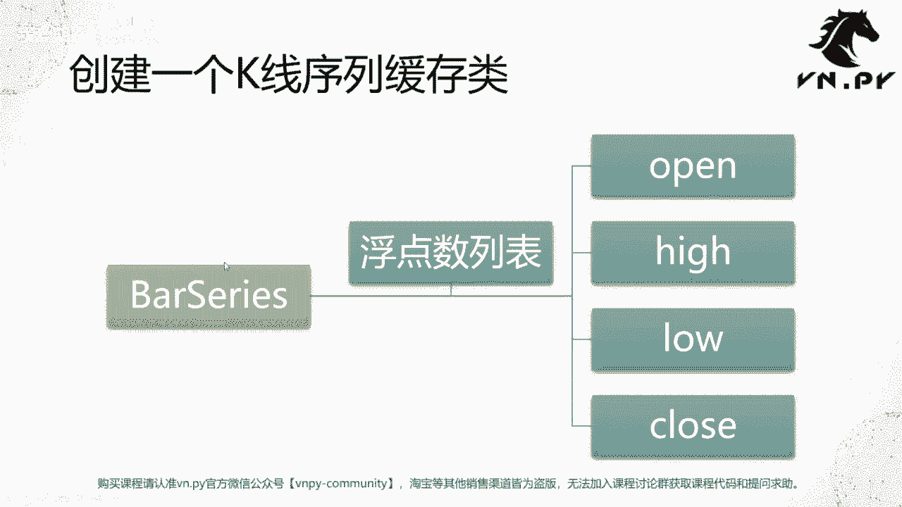
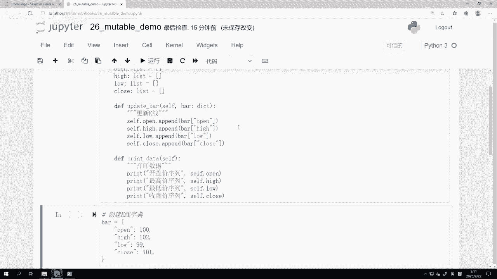
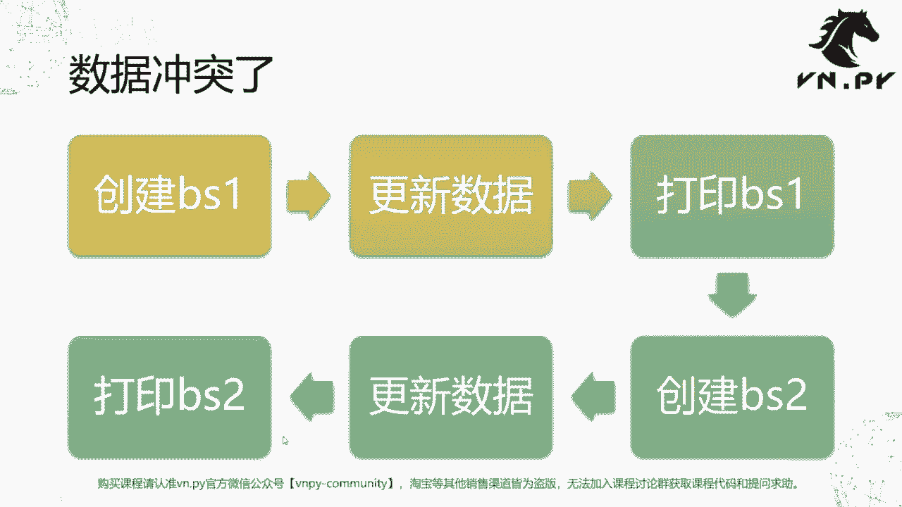
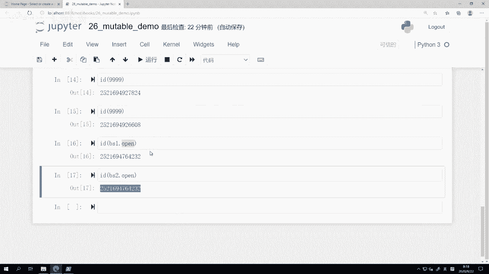
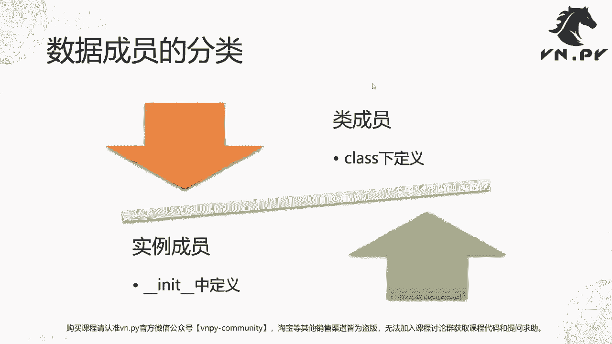
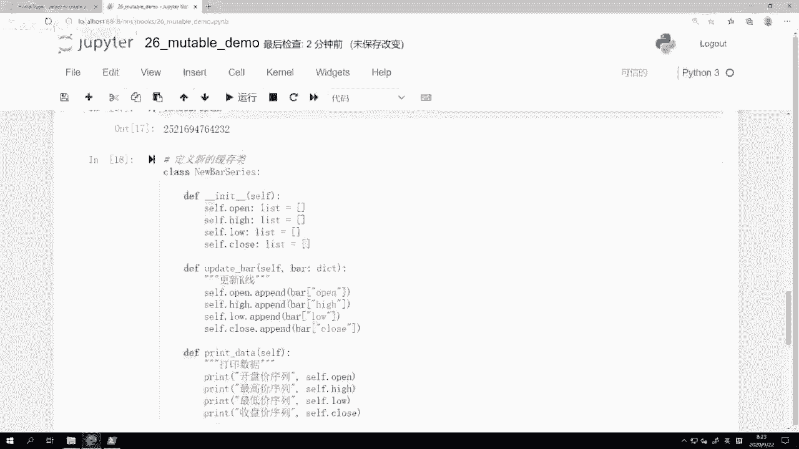
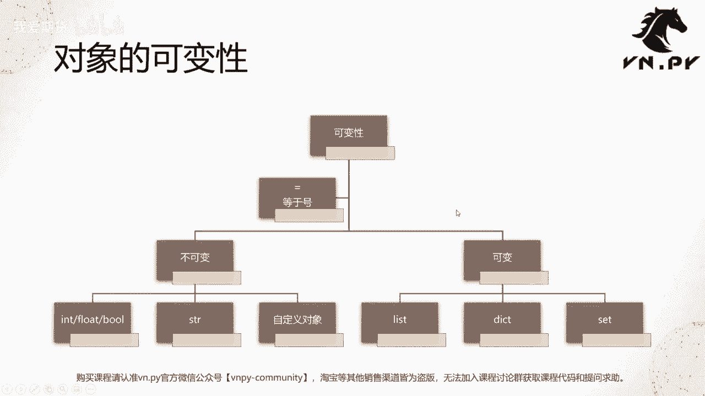
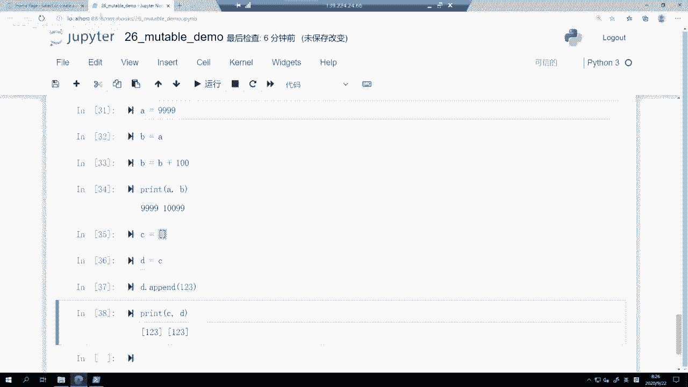
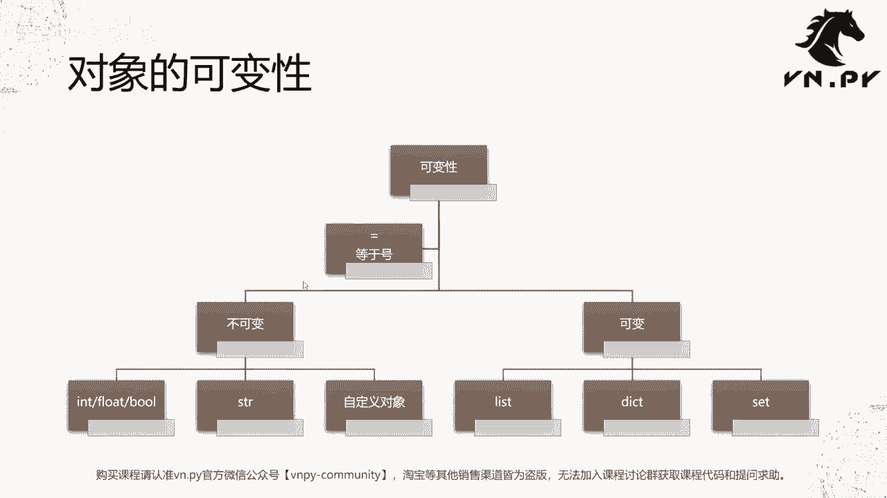

# 26.可变vs不可变 - P1 - 我爱期货 - BV1u72gYNEDt

OK欢迎来到量化交易零基础入门系列，30天解锁Python量化开发课程，那么今天呢是我们的第26节课了，在上一节课里面，我们看了看怎么样把我们面向对象啊，学到目前的这些知识。

和我们VOR派中底层交易接口的开发结合起来，那这节课里面呢，我们要来讲一个比较深入的话题了，叫做Python内部对象的可变性和不可变性，这节课的内容啊，我们先从一个例子来开始啊，这一步呢。

我们先来创建一个叫做K线序列的缓存类，8series这么一个类，那这个类的主要作用啊，就是在我们啊比如说实盘里面或者回测里面，不断有一根又一根新的K线数据进来的时候，我们把它缓存下来啊，用于后续的计算。

不管你用来算技术指标也好啊，还是用来算一些统计数据也好，那所以这个bar series类下面啊，我们把它定义了四个成员啊，分别是open hello clothes，这么四个所谓的浮点数列表。

那学到现在的话，应该你可以比较简单的就能把这么一个定义。

在代码里面写出来，好，我们这边呢就来看这节课的这个，jupiter notebook啊，我们起名叫做mutable，Demo mutable，在这个编程语言里面，它指的是某一个对象。

它是可变的还是不可变的啊，可变的就是mutable啊，那么也跟我们这节课的主题呼应啊，就可变性对不可变性啊，我们这边先来定义这么一个缓存类，叫class by series。

下面是open hello close这么四个空的列表啊，他们每个的类型类型都是一个list，然后我们定义了两个方法，第一个方法呢叫做update bar啊。

就是把一个新的K线给推送到我们这个bar series，缓存里面来啊，把这个新的K线的数据给啊记录，那么这个K线的对象我们看这边八哈，我把它声明为一个dict一个字典的类型，然后呢操作很简单。

就是self点open这么一个好，我们的list，我们调用它的IPAD，然后把bar里面的open这个字段，因为bar是个字典嘛，把它其中的open这个字段的值，就是收开盘价值取出来。

然后呢添加到这个啊8series的shift，点open的这么一个缓存的列表里面去啊，Hello，close都同理操作，那这样我们是不是就把进来的，一个一一个的这种啊单根K线的啊，高开低收。

数据缓存到了一个把它已经聚合起来了，就是开盘价归开盘价高，最高价归最低价最低啊，这最高贵最高，然后等等啊，以此类推的这样的一个完整的序列里面，那这样呢我们后面再要去做任何，比如技术指标啊。

比如说统计方面的分析计算啊，就变得非常方便了啊，这个是第一个方法，update bar的作用，第二个方法呢叫做print data，这里的print data就是很简单的，我们把它打印出来。

然后我们把每一个开盘价，最高价，最低价，收盘价的序列都给打印出来啊，我们看一看里面的数据是具体有什么内容好，我们先把这个类给运行一下啊。

把它给声明好，那么第二步呢，我们要来啊这个尝试做一些操作啊，我们这边叫数据冲突，等会我们来看看他怎么个冲突法，首先我们创建BS1这么一个对象啊，就我们第一个把serious的这个实例化对象。

然后我们往里面更新数据，更新完了之后，我们打印一下BSE，然后呢我们再来创建一个BS2，再往里面更新数据，再来打印BS2，非常简单的，这个其实是两大步操作对吧，先创建一个8series。

再往里面更新数据啊，然后打一下看看这个数据长什么样子，我们当然额这个一共做了两遍啊，但我们看看这两遍的结果会有什么的区别。

好，我们这边呢，下面就来创建这么一个叫做K线的字典，很简单，我们创建一个BA字典，然后open hello clothes，就这么四个数字啊，没什么特别的，那然后下面我们就来创建这个缓存的实例啊。

BS1等于8series，然后我们调用BS1的这个update bar函数，把我们的K线给更新进去，那更新进去之后，我们再来print data的时候，你可以比较简单的预期啊，会打印出来什么结果呢。

其实就应该是高开盘加序列，后面跟着这个列表里面的数据对吧，他应该就是啊，因为我只更新了一次K线嘛，它应该只有就是这个一个K线的，这么一个结果啊，这个是比较容易理解的，那一百一百029十九一百零一。

说白了就把这个字典里面的，每个字段的值取出来，放到对应的列表里面啊，然后这样打一下结果就出来了，那这个是第一遍啊，我们对BS1的操作挺正常的，这个符合我们的预期，然后我们来做第二遍啊。

我们再来创建BS2了啊，这个操作是完全一样的，完全啊和这个BS1重复的，但是呢我们看结构会有什么不同，我就很快的都运行一下啊，还是创建了一个新的BS啊，然后呢往里面推了一根K线。

但是这个时候再来打印的时候发现不对了，明明我只推了一次K线进去，为什么打出来的这个列表的结果里面有两条，看着就像我把同样的这个数据更新了两次，到BS1，或者更新了两次，叫到这个BS2里面啊。

这个感觉就不太对了嘛，我只更新了一次，为什么会有两个数据点，结果呢，在这里我们就遭遇了在Python里面的，这个叫做可变对象啊的这个影视在对象呃，在一个实例被创建出来的时候，他的一个绑定关系啊。

说着有点绕，我们先来看它原理，那这里呢我们要介绍一个Python内置新的函数，叫做id函数，它的作用啊就是啊叫做检查对象的内存地址啊，你直接id括号传任何一个东西，比如IDBS1啊。

就可以看到BS1这个对象在我们内存里面，它的地址是什么，它应该是个数字啊，然后我们也可以看一下IDBS2啊，他在这个地址是怎么着，它也是一个数字，我们在这里看到他们两个的数字是不一样的，一个48312。

一个是什么04088啊，这个地址是不一样的，不一样，就说明了他们两个在内存里面是两个东西，这一点先记住啊，同样的地址意味着是同一个东西，东西不同的地址意味着是不同的东西，比如说我们来创建两个啊。

先来一个id啊，我们看一个这个字符额整数一，在内存里面的地址就是这么一个一，如果我再来一次id2，它在内存里面地址，大家可以看到一和二的内存地址不一样，但如果我再来调用个一的话，你会发现它是一样的啊。

这是因为在我们Python内部，对于这种比较小的，其实是应该是250以内的整数啊，它会自动去复用这些内存地址，那么减小我们的内存开销啊，所以两个如果都是数字一的话，它们在内存里面地址是完全一样的。

但如果我比如说一个是id9999啊，再来一个id9999，你会发现他们俩不一样啊，一个是这个是比较小的，就大概那个数字我不记得，应该255吧，大概是反正255以内的，可能他就是用同样一个啊对象。

如果是比较大的数字，它可能是不同的对象啊，反正我们这里要记住的，就是用id看到数字一样的，那他们就是内存里面同一个东西不一样的，就是不同的东西，所以我们这里看啊，BS1BSS2哎，这两东西地址不一样。

所以他们应该是不同的对吧，但是为什么我更新的数据却产生了这种，就是第二次更新的数据又写到第一次的啊，反正和第一次的那个东西都都都都放在一起了，就所谓的冲突了嘛，为什么会有这样的结果，那我们这里要看的。

其实不是BS1的这么一个地址，而是我们下面这里要看的这个BS一点open，和BS2点open这两个对象的地址，因为我们要记住啊，在Python里面基本上可以说万物皆对象，Python里面的什么整数也好。

字符串也好，一个列表也好，类上面的一个方法也好，一个函数也好，还是类上面的这些啊，一个成员属性，比如说这些列表也好，他们全都是一个对象，所以每一个对象都会有自己的内存地址，那在这里尽管BS1BS2。

他们俩内存地址是不一样，这是俩东西，但是我打印他们的啊，这个open列表，分别打印他们的open列表的这个id的时候，你可以看到它其实是同一个东西，指向的都是同一个东西，所以这个就是造成了我们上面这个。

数据冲突的原因，本质上呢是因为两次我们啊往这个就调用update bar，往这个四个列表里面塞的数据，他们其实都是在同一个列表里面啊，就尽管你创建两个8serious的对象。

但他们两个的这个下面的open，Hello close，这四个列表指向的都是同一个啊，这个列表对象啊就分别指向是同一个列表对象，就把BS1的open和BS2的open是一个对象。

BS1的HAI和BS2的HAI是同一个对象，low clothes也分别都是同一个对象，不是说他们这四个列表都是同一个对象，所以这就造成了数据冲突的问题。

那么在Python里面呢，我们这个啊某一个对象或者某一个实例下面的，所谓这些数据是成员的分类啊，大体上可以分为成两类，一类叫做类成员，是在class这个关键词下面定义的，还有一类叫做实例成员。

是在INIT中定义的啊，记住这两区别，一个是类成员，一个是实例成员，那我们这里刚刚8series里面定义的是什么，我们是在class下面定义的，所以他们是类成员，类成员会导致一个什么问题。

在所有的这个我们用8series这个类，去创建一个对象出来的时候，每个对象都会带上open hello clothes，这四个这个所谓的啊这个属性成员啊，或者叫数据成员啊，反正都一个意思。

嗯一般我们就管它叫成员了啊，就这个词听着有点怪啊，反正你知道是这个啊，这个这个实例下面的这些数据字段就行了，那每当你创建一个8series s的，这个实例对象出来的时候。

他们每个实例对象带有的这open hello clothes，指向的都是FASERIES，这个类里面本身定义的这四个字段，所以造成了这个，后面我们刚刚看到所有的各种重复问题，那要解决怎么解决呢。

其实也非常简单，我把整个复制下来哎，定义这个新的缓存怎么解决，创建一个INIT函数好，我们把这个bar series改个名字啊，叫new bseries，这样让它避免重复，然后在所有的这些啊。

open hello的close的四个列表定义，都把它放到INIT函数下面，放到INIT函数下之后，注意啊，这里写的时候前面一定要带有self，否则你的定义就只是在函数内部定义，这个函数执行完之后。

open hello clothes就四个啊，这个数据就没了啊，它就是如果你不把它绑定到self点啊，就不把他绑定在self这个啊，就自身的这个实例对象上的话，那这四个列表在你运行完函数。

这个INIT是个函数吗，我们这个啊在对象被初始化的时候会被调用啊，如果你没有做这个绑定的话，那不好意思，运行完他们就消失了哈，所以你也就在后面执行里面就会出现各种错误。

那这里我们先来把刚刚我们这四个列表的定义，移到了我们的对象定义下面，先回车，然后我们再把上面做的这些竖起事情啊，我们大体上就重复一下，我简单一点复制粘贴一下啊，这个我给他改个名字NBSE啊。

就是new bs e的意思，然后NBS一点update bar啊，这个bar，然后呢我就直接啊这个调用点print data，我们可以看到我创建新的new bseries的时候，把这个数据哎给推送进去。

更新进去就没什么问题了啊，如果我再创建一个这个NBS2啊，我也同样做同样操作的时候，我们看一下，诶，不好意思，我我这写错了啊，应该是往NBS2里面推送，我们可以发现也没有重复了啊。

这个时候NBS1和NBS2的行为，就符合我们正常的预期了，其实等于我们之前把那四个字段定义在啊，就这个open hello close，定义在类下面，这种操作，其实在代码的开发上面可以叫做一种bug。

因为你想实现的功能，和你自己写出来的这个代码，两者是对不上的，就你做错了这件事情啊，正确的做法是把它们放到这个下面的，当然上面这个做法有它自己的作用，而不是说他就绝对这个这个方法本身是错的。

而是你这里的这个用它的方法是错的啊，所以我们这这样改完了之后呢，我们可以发现它符合我们的预期，同时我们也打印一下，比如说NBS2点close啊，和这个我们看一下，然后IDNBS一点close。

我们可以发现它们是完全指向不同的东西啊，然后呢即使我们直接看下NBS2和NBS1，当然他肯定也是指向不同的东西，所以此时就不会再有这个数据冲突的情况啊，这个就是一种解决方案，那讲到这儿呢。

你大体上应该至少我们这个例子，你没明白什么意思。

但你可能有点懵啊，说这个东西有什么意义呢，啊，它背后的问题，就叫做这个对象的可变性的问题了，好在Python里面的对象，整体上基于他的这个可变性与否，可以分成两类，一种呢叫做可变对象，一种呃。

就就我们现在简单的基础的就是不可变对象啊，然后这个啊这个复杂一点的，就是所谓的可变对象，那么反正不管是可变对象也好，还是不可变的对象也好，他们正常在赋值的时候，都是通过等于号来赋值的。

那不可变对象有哪些呢，int float blow ball啊，这个是呃最基本的Python里面的类型，然后呢string啊，string就是这个字符串，那要注意一下字符串这个类型，那前四个哈。

在几乎所有的编程语言里面都是不可变的，这没什么区别，string这个类型在很多语有些语言里面它是可变的，比如说在C加加里面，如果是一个string类的话，那这个string类对象本身就是可变的啊。

它其实是一个所谓的字符串列表，但是在Python里面的string类，它指向的那个对象是不可变的啊，这是一个挺大的区别，也是Python和其他一些编程语言的区别啊，然后还有我们自定义的一些对象。

比如我们刚刚呃这个定义的吧，serious这个类啊，它也是不可变的，但是也同样Python里面有许多可变的，这样的对象，主要就是我们之前讲的那堆数据容器了，list dict和set啊，不包含TAPO。

因为我们当时讲过TAPO本身是不可变的，TAO是四个基础的数据容器里面，唯一一个不可变的。

而list dict set都是可变的，什么意思呢，我们这边来看一下啊，比如说A等于9999，然后B等于9999，这个时候我如果把B等于B加上100，我们print a在print b。

我们会看到A还是这个9999，本身B已经变成了这个啊1万99，所以A和尽管啊B是先啊，不好意思，我这边改一下，A是999，把B先赋值成，就是把A的值赋给B，然后呢我们再这样，我们发现结果还是一样的啊。

就是尽管B等于A了，但这里B的这个操作还是B本身，他并没有跑去对A指向的这个，9999的整数做操作，但是下面我们这个例子先创建一个C的列表，D等于C，然后这时候我们往D里面随便IPAD一个东西啊。

123，这时候我们print c再print d，我们会发现他们两个列表里面都有123，这个数字，为什么，因为列表在Python里面是一个所谓的可变对象，所以对它用等号的时候。

其实D和C指向的都是同一个东西，都是内存里面的同一个这个地址，上面放着的这个列表的对象，所以你在对D调用IPAD的方法的时候，那它们是就这个123的数字，其实是传到了这个之前的列表里面。

那C同样也是指向这个列表，结果就会导致C和D的啊，打印出来结果都是一样的，同样你也可以试一试啊，就这这种操作方法你也可以试一试，就回到我们PPT里里面来。

你可以把这边每个我们说的不可变对象，Int float bo string，还有我们自定义对象，你也都操作一下，把他们实例化两个出来，然后对其中一个做操作啊，你看他是不是会就是它两个A归AB不归B。

就你尽管对B初始化或者对它赋值的时候，把它啊等于了A，但是你对它做任何操作的话，不会影响A的值，但是对于可变对象啊，不管list dict set啊，你如果初始化了C和D啊，D初始化为C的话。

那你对D做任何操作，其实C都会变，而这个就是不可变和可变性，两个在Python里面最主要的区别，这个东西其实是一个灵活点啊，就是他给Python编程语言带来了很多，叫做所谓的动态特性啊。

在我们这个后面熟悉了之后，在写代码的时候有很多的帮助，可以让我们写代码很方便，但是一上来你不熟悉的时候，这是一个初学者非常容易掉进去的坑，也是在我们VOR派的啊，这个这个策略开发里面容易犯的一个嗯。

怎么说呢，常见的初学者的这个一个错误吧，所以下一节课呢我们会来具体的看一看啊。

OK那么这节课的内容呢就先到这啊，更多精华内容，还是请扫码关注我们的社区公众号。