# 26集全！B站目前唯一能将【量化交易】讲清楚的教程！用AI从零开始打造你的交易机器人！大数据量化交易／机器学习／Python金融分析 - P15：第八章第1节： 股票多因子框架1 - 机器学习教程 - BV1w4421S7Zx

喂喂各位同学现在可以听到吗，好我们再稍等一下啊，等大家稍微人再多一点，对我们等一等其他的同学，哎期权的作业，现在大家做的怎么样了，啊已经到课的同学敲个一，让我知道大家已经到了哈。

对然后今天可能大家屏幕看起来有点奇怪，是因为啊我这边没有用一个外接的显示器，对，因为我现在在三亚休假，所以就是没有一个外接的显示器，然后这样屏幕分辨率可能投过去，大家可能会就是两边有点黑框，对。

请大家稍微多多包涵，对最近也是就是确实我工作也比较忙，然后找了一点空闲时间来休息一下，然后我看大家最近做作业呃，似乎好像也是就是交作业的人也不是很多，也可以理解吧。

确实就是我觉得嗯就是在学这门课程的时候，大家不要把它当做一种负担，对，因为呃就是大家本身，不管是学生处于求职的状态，还是说是已经工作的人，是然后想要去了解这个领域，大家都是出于兴趣。

或者说是想要出于提升自己的目的，来去上这门课的，然后我觉得大家心态上嗯对啊，就是大家心态上可能不就是即使说前面的课程，觉得学到现在，我们现在是第八课，总共是16节课。

然后如果是觉得其实到现在觉得还是挺困难的，我觉得是嗯非常正常的事情啊，因为我可以说就是呃目前讲课确实是呃，包括同学反馈说可能没有特别听懂，那确实是因为讲课的内容，说是把我之前工作的很多东西是去。

相当于说是做到压缩的过程中，就是把它压缩成呃现在这样一个课程，所以其实可以说是其中的信息含量，还是比较高的，嗯很有可能就是说之前，比如说简单的一个回测模块，我们只花了一两节课讲一下。

但是之前就是怎么去形成现在这样一个呃，回测的框架，其实是应该说是花了比较长的时间，可能每天都会有相应的去迭代，也不仅仅是我一个人，可能有公司好几个同事，大家一起再去完善这样的一个回测模块。

所以如果大家觉得有困难，我个人觉得是非常正常，也是可以去理解的啊，对然后觉得嗯但因为这个课程会有录播的视频，所以其实如果说觉得前面有什么，没有太多的地方可以回过去再看，然后对如果还有困难的话。

可能确实是需要自己去多多的去啊，再去去研究，因为有一些细节的东西，可能课上只是提了一下，然后在实践的过程当中，你可能会发现有一些问题，对我觉得这个是非常正常的事情，那这个时候就需要有自己对于嗯自己。

对于就是说整个的程序或者说是嗯写的东西，会自己需要有一个基本的判断，就说这么写是不是可行，或者说这么写到底有没有道理，对就是很多很多事情，可能他不是一个确定性的答案，他是就是他是他是说非常依赖于你的。

可以说是依赖于你的实验结果或者是怎样对，因为呃就是同样的是在量化教育当中，你采用什么样的数据库，你到底是用C口还是NO c口，还是还是说你就用文件的方式，那么我觉得是非常取决于你想要交易的策略。

然后就是说但是事实上就是量化这个东西，有非常多的理论的部分，然后也有非常多是就是偏向engineering的部分，然后呃在整个过程当中，就是大家要注意一点，就是说做量化呢。

其实说是需要自己是有工程师思维，就是说我们面对每天面对新的问题，我们会去想办法去不断的去解决这些问题，然后对他跟开发工程师不太一样的地方，说是我们可能嗯在陈述过程当中不需要去呃，去重复的造轮子。

或者是去写很多的呃业务代码，当然初期的时候，可能我们需要自己去形成自己的，这样一个研究的框架，有基本的工具和数据处理的方式，但是后期更多的话，还是大家要去多多去主动思考，就同样的来说是去挖因子。

比如之前我们提到国泰君安的，190一个因子，然后今年其实我们还会再去接着设计，就是有很多的东西是偏向研究的东西，但然后但是又需要，又需要一定的工程能力的实现，所以这两者的结合可能会我会觉得说是嗯。

会导致说在目前情况下，大家觉得学习会有一定的困难或者说是挑战，然后我也看了大家的活儿，就是上了七次课之后，对于整个课程的回顾呃，我我想强调一点，就是说，如果大家觉得课程当中有任何你听不懂。

或者觉得困惑的地方，我觉得需要及时的把这样的问题给提出来，因为我记得可能在期权讲课的时候，我第一次课讲说，我发现有一部分同学还挺熟悉，然后我在群里问了一下，说我问了一下。

是不是大家都对于本期的内容比较熟悉，因为没有人回应我，然后我就我就我就我就我就会默认，大家对于这一块东西都比较熟，那我们就很快的把这个东西就给过掉了，对啊，但是课后又会看到有一些同学他给我的反馈。

说是对于很多东西都不是很懂，那我觉得这样可能其实就嗯，然后课程没有提出来，那这样我觉得可能就不是很好，因为这样的话嗯，课上了两个多小时或者三个小时，就是可能这样会浪费你比较多的时间。

然后如果是没有相应的基础，去跟这样的课程的话，那收费也不是很大，那客户可能还要花更多的时间，所以我的意思是说，我会根据大家的理解能力跟相应的基础知识，会对课程去做一些相应的调整，哪怕就是说我们放慢步骤。

然后但是让大家就是啊清清楚楚的理解了，我们这节课所要讲述的内容，我觉得可能这样长远，长远来说会去能够帮助到大家，因为包括就是上课到现在，大家肯定会发现，即使说我们是去交易不同的呃资产类别。

但你会发现其实背后很多的思路是非常类似的，可能说股票我是多因子模型，期权我是波动一套类模型，但是其实背后有些很多很核心的东西，都是思思考的方式都是非常一致，或是类似的。

本质上来说都要去通过去找因子的方式，去提升我对于整个市场理解的一种效率，也就是说我去找到能够真正去影响市场的，这些因素对，然后我们会去做收益的预测，然后同时我们也会去做投资组合。

然后去啊降低整个市场的风险，去降降低整个持仓的风险，所以嗯不管是，然后其实说，不管我们这里面提到的每一部分内容，其实呃呃多次提到过，在专业的公司都会有很多人去处理，然后我们这门课程还是说。

也希望大家就是说对于这方面东西有一些了解，然后对，然后我今天也会提到，就是说其实就是说呃，因为我自己其实之前没有接触过太多的股票，多因子的交易，我室友帮同事是做过一些研究，但是其实对于这一块。

我也不是说有非常的自称或者说熟悉对，所以说呃这两节课，可能说更多的是跟大家一起去去，带着大家去完整的去理解多音字，整个模型到底是什么样的东西，事实上呃，呃就是作为一个股票多因子投资的框架。

它是有非常丰富，那就是丰富，而就是说是或者说是充实的内容的，对，就是我们今天可能说，我们今天我个人呃觉得就是说比较好的一个，PROACH的方式，是说，我们先是去呃整体的去去理解一下，我们整个多音字嗯。

多音字模型体系到底在做什么样的事情，就是说即使说我对于整下面有些东西，我不是很了解，但是我知道他每一步大概是在做什么样的事情，然后我们再去去逐步的去用代码，去把整个的细节去给补充起来对然后对。

然后其实股票的数据其实也是比较坑，就我最近最近，其实比如说包括今天可能没有太多代码，然后但其实说我在处理数据上面，还花了比较多的时间，就是今天先给到的大家是呃，股票从2010年到现在。

到今年的3月12日的一个日收益率的数据对，然后之后的话还会去下节课，应该会慢慢给大家加上，就是说呃就是说除了交易的数据，我们这边还会涉及到的就是嗯其他的有关啊，基本面的数据对，提到这里面的话。

其实这这里的数据是有比较多的坑在里面的对，因为不管说是从万德还是从其他书源去提取，然后经常会出现的就是说呃，如果说财报的更正对，但其实每一家数据库它是怎样去处理逻辑，那那那这里面其实会带来一些。

我觉得个人会觉得带来比较多的问题啊，举举一个简单的例子，比如说呃我公司的净利润哦，在当年的年报23月30号之后，我公布4月1号公布了，说今年的净利润是多少，那么我公布了之后，另外来说。

我的就是我的数据库里面，会去更新这样一个数值，但是如果说在5月份它的年报又更正了，说我的净利润啊，其实不是不是A其实是A加100，那这样子的话呃，我们再去做回测的时候，可能很多数据库。

我拿到的只是5月份最新的这样一个数据值，什么意思呢，就是说我在比如说是今年的4月1日，我拿到了，实际上是5月1日更正更正的这样一个数据值，我拿到的是这个公司最新的净利润，但事实上在今年的4月份的时候。

我是不知道他今年它真实的净利润，是5月份这个数值的，就是说事事实上就是说我能做，我能拿到的还是今年4月份的这样一个，错误的净利润对，那那那如果说我们在，就是说在数据采集过程当中没有注意到这一点。

可能会说OK嗯，我用了一个比较对，我用了一个，事实上就是就是用了一个未来数据了，然后觉得拿这个因子做出了一个非常好的，就是说这个因子发现测试下来说效果非常好，那这个实际上就是那可能在实盘的过程当中。

就会出现比较大的问题，所以其实这个里面就是呃，因为涉及到基本面的数据，股票的数据采集是会比其他的，如果是比期货和期权，只涉及行情数据来说，是相对来说是会复杂一些的，然后提到这一块的话。

我个人觉得是比较好的一个方式，就是说呃，不管我们是从万德，还是从其他第三方数据库提取，其实最好的方式就是说我每天都会去把嗯，当前所有股票的这些呃，能够取到的基本面的数值，会把它存当天的这样一个数值。

即使说嗯，然后随着未来就是说如果说是万德数据库，或者说是从你从财报里面去提取这些数据，那这个数据源更新了，那么在更新的当天，我就会获得一个新的这样一个数据，但是在历史回测的时候，我仍然是用当天的数据。

而不是使用最新的这些数据，所以对这个里面是想跟大家提到的，就是股票的嗯，股票的就是基础数据采集，里面其实是有挺多的一些坑，然后考虑到大家有没有数据原因，就是应该来说会把相应的一些数据，是会提供给大家。

对我不知道刚刚提到的呃，这个有关数据的基本面，对数据的这个这个问题，大家理解了没有，OK好的嗯对，然后就是呃上到现在的话，就是在正式讲今天的课程之前，还有大家还有什么想的一些问题想要问我的吗。

然后刚刚这位同学就说急啊，最近一次的作业对，这个是嗯就是一个是对，就相当于说是你需要把期权的这样一个，定价的模型，然后然后其实包括那个SBR的套利，然后我建议大家还是去去尝试去做一下。

就是把这个整个的SB就基于随机波动率，这样一个套利的模型去回测一下，看看效果对，就是对，所以第一步是，我们先需要有就是期权的IMPLIABLE，跟GREEKS的数据，然后我要去，然后是基于这样的数据。

我要再去去建立，我的不懂力的这样一个套利的模型，对，所以呃这应该是嗯对，就是第七次作业是没有明确的说了，就是没有说是需要怎样对呃，就是需要把SBR模型实现，我觉得是看大家吧，那确实那个整个模型实现起来。

工作上说多不多，但是就是说如果是完整的非常顺利的实现的话，其实应该不需要太多时间，但是考虑到同学们基础不一，其实就是能做出最后的净值回撤的曲线，我估计还是要花一些时间去探索的。

但这门课程也不是说是像学校里的作业那样，所以可能更多的是说对，就是大家基于自己感兴趣的内容去探索吧，好嘞嗯对，然后我想问就是群里啊，现在就是这么多同学对股票就是比较上这门课。

当初是因为是想交易股票或者是其他的股票，这个品类的同学让我了解一下吗，就是有多少人是想去上完这门课，是自己去交易股票的，OK那可能就是OK对，那可能大家对于相对来说，股票可能是大家交流接触比较多的。

这样一个品种，对，然后对我我看到就是说，因为岳鹏老师感觉就是他其实对这块来说，自己实习可能也也就是做过一些多音字的模型，其实那如果课后大家有什么问题的话，如果不能解决解答的话。

大家也可以去就是去问问岳鹏老师对，然后嗯嗯今天的话，OK就是呃首先说有几个东西吧，就是一个是一个是就是说呃，一个是就是主动投资组合管理这本书，大家可以自己去找一下中文版或者应用版。

对这本书我觉得还是比较经典的，然后其实华泰里面他这个研报里面也有很多，去参考这本书对主动投资组合管理啊，对，然后呃然后华泰的这篇多因子的研报。

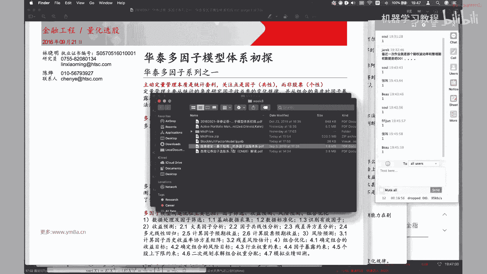

在课前发给大家，嗯它相对来说是偏向低频基本面一些的，因此也就是说这部分OK，就是说固然是相对来说是有比较重要一部分，然后但是这两年或者说这两年，其实大家更为关注的可能说是哦，大家可以参考这篇研报。

就是说会基于说交易啊，日级别，甚至是我采用日内的信号，做一些T加零的这些因子，那这些就是说嗯，就是短周期量价特征的多因子选股体系，那其实这一部分的话呃，大家应该有，如果有了有了解的话。

其实是最近行业的公司，大家会做的比较多，因为因为相对来说这部分的因子来说，嗯主要我觉得是有几个优势吧，一个是呃相对来说我数据量会比较多一些，因为我每天或者每天就是固定的频率，都可以去采集数据。

相对于华泰这边研报提到的乐评的数据，我用日本的数据，相对来说能够去挖掘的东西会更多一些，然后还有一个就是说嗯，他这个交易的多音字，其实会跟CCTA里面的因子挖掘会有一些类似。

其实之前我们讲就是因子挖掘也会提的，也用到了这篇文章里面，就提到这里面给到很多的因子对，所以他这篇文章里面大概有200多个，短周期的阿尔法因子，然后对，然后还有一个就是说当我的数据量大了之后。

其实说我可以就是说去不再去，可以就是说利用一些非常安全非传统的方法，比如机器学习的方法去进行挖掘的挖掘，一些因子，包括哦也有人去用遗传的算法，遗传算法去基于这些因子去进一步的衍生，迭代啊。

对这是相对来说是比之前的，就是嗯嗯比之前的呃，就是基于乐谱的因子来说，这是他的一个比较重要的优势啊，当然这个因子会呃，我个人会觉得就是说它交易型的因子很多，是非常依赖于当前市场的环境，什么意思呢。

如果当前市场交易活跃，有比较多的对手方的话，那么其实说我交易型的因子来说，可能赚钱的概率还是比较高，但是一旦说市场嗯交易量没有那么活跃，比如说正常交易量很活跃的时候，有1万亿的成交额。

但是如果说现在只有几千亿两三千亿，那么就要考虑说我这部分资金，可能我的交易的对手方都是跟我一样，去做这些短周期的阿尔法的，之前这样的一些呃资金，那么那么很有可能就是说我可能会呃，不仅说没有阿尔法。

然后也有可能甚至会说去亏手续费，所以呃所以大家看去年各个基金的业绩的时候，也观察到，就是说而当市场交易量很好的时候，大家都能赚钱，但是随着说大家发现这个模型啊赚钱的嗯，概率比较高，或者说也比较大。

能够提升的空间的时候，那其实大家进入的是非常快的对，所以会导致市场上在一段时间会嗯，就是说阿尔法会比较拥挤，然后大家的基金净值可能不会增长，甚至就保值保值，甚至会有一些略微的回撤。

那其实嗯大家可以去私募排排网，或者是其他相关网站上去，看到一些就是相关的做这些啊，那多因子选股的，然后就然后就尤其是叠加，叠加这种短周期量价特征的啊，这些基金的表现其实是能够看到一些东西的对。

嗯但当时我记得之前也说过，就是说市场，就是说相对来说比较成熟的一些公司的话，如果是用数据挖掘的方式，可能他们的多因子已经就是达到是千，这个数量级，甚至夸张了，我不知道有没有达到1万个对。

但是说几千个因子肯定是他们还比较常见的，但是相对来说，这几千个因子可能不会说是那么robust，比如说我基本面的因子，可以可以说是过了几个月甚至一年，也许可能还在去交易。

但是呃但是就是说但是短周期数据挖掘出来，因此很有可能就是说嗯赚钱赚的，赚钱赚的确实还不错，但是可能很快就会发现，这个因子就会在逐渐失效，那么这个时候要基于现在的市场风格，去挖掘出新的因子。

所以在这部分的时候，就会涉及到一些去嗯比拼的比拼算力，对他说，如果我的机器更强大，然后我是不是算法更好，能够去拓展出更多更有效的因子，对这部分可能也是很多，就是说如果是嗯大家是做程序员同学。

或者是做做做机器学习相关的同学，可能会觉得说OK，那这部分是不是可以结合我个人的一些优势，去尝试在这部分去做呢，我觉得这个是OK的，然后另外想提一下，就是说其实说因为整个市场是非常大的吧。

就是说你完全可以考虑结合自己个人的特质，去考虑，说我到底在市场当中哪一个S种类去发展，因为除了说是我去做教育赚钱，那如何去选好交易，就是说在整个交易生态链当中，我做哪一环，那其实这个也是相对来说。

也是要去个人去选择的，它也是一个因子，就其实跟我们选行业呃，就是说本质来说就类似于我们选行业，选公司啊是一样的，我们我们在我们在实际的，每个人都去职业成长的时候，也会去涉及到我说我选什么样的行业。

我选什么样的公司，那放到量化这个行量量化这个行业里面嗯，量化这个行业里面，其实就是不仅仅说是我除了说自己做交易，那我可能还有说我可以去做研究，还是说我可以去做风控，有各种各样的方式。

哎那就每每个行业就每一个好，每一个就是小方向里面其实都会有自己的玩法，对好的，那话不多说，我们今天开始就去设计一下，就是去我们去一起来了解一下，就是多因子模型是怎么一回事，就是大家我不知道。

就是说大家在交易股票的时候，我首先问大家一个问题，就是大家自己在交易股票的时候，平均大概会持仓多少股票，嗯没有没有同学回答吗，就是大家都没有交易过股票吗，10~20 k，那我想问问这些这个soul同学。

就是说你在交易这10~20只啊，10~20只股票的时候，你是怎么去选这些股票的呢，比如说你是这十十十只到20只股票，比如说你是说我最近是炒热点，都是炒人工智能，我就去买人工智能的股票呢。

还是说我最近觉得呃芯片股比较好，我就买芯片的，就买芯片股相关的，还是说还是说我10~20只的话，我其实说类似于就是配上证五零或者沪深300，我就只配龙头，其实刚刚想提到这些问题。

是说本质上来说你选择芯片股，或者说我选择行业龙头，本质上来说，其实这里面都对应着，我们实际上当中的一个阿尔法，或者说叫一个因子，曾经他们也许也许就是大家，如果有交易的更久一点。

就是曾经在嗯嗯之前有一段时间，就是说发现小市值成长性的股票比较好啊，那时候也有基金说我自己是做阿尔法，做绝对收益啊，对就是说我只选小市值的股票，但我觉得说小市值或者说成长性，这个是一个这个是一个阿尔法。

但事实上嗯随着后来的市场风格切换，17年变成了白马股，一直在上涨，那你会发现那种小市值成长的这样的一个因子，就会失效，那这个时候就需要实际上就是要去区分，就是说这个到底是阿尔法。

还是说是一个贝塔的问题对，所以其实多音字，我觉得因为我对这个领域也没有说是特别熟悉，但是从我个人角度来理解，就是说多因子模型本质上来说，它给你提供一种框架，去让你去真正的去思考。

这个东西到底是是一个是是一个风险因子，还是说我是真正的一个阿尔法，对，那本质上来说，它是降低了我们去处理信息的一个复杂度，嗯就是说我们之前来说，如果我们是看3000多只，3000多只股票。

每一只股票去分析它的基本面的信息，包括我去看他的消息，想去看他的资金流入流出啊，那一直是看下来其实是比较累的，但是说多因子框，多因子多因子的这样一个模型，本质上来说我就是把我关注的这3000多只股票。

把它转化成，我只去看相应的这几十个因子，或者是几百个因子，那这样来说的话，我同时我要去考虑这样一个信息，就会去少了很多了，可以说嗯大家看这样一个，大家这样看这样一个就是哦下面还会去讲到。

就是看这样一个公式，本质上来说，你看其实这个是一个矩阵的，一个矩阵的一个乘积，就是说大家可以理解为X是一个X是一个矩阵，然后嗯然后然后K是一个vector。

然后然后的话你其实X乘以FK是一个vector，X乘以一个FK的话，你就可以得到啊，就是得到这样一个所谓的一个所谓的这样一个，呃就是一个收益率啊，然后嗯我们先如果这个就是说本质上来说是说。

我们从如我们有很多个有，这就是说有这个股票的话，如果这啊应该是从一比如说到3500，那么我们我们是事实就可以得到，把把每一个股票的这样一个收益率，就分解到各个。

在就分解到就是这样一个capital k的因子上对，然后那这个时候我关注的对象，不再是这3000多只个股，而是说我关注我这K个因子相对来说，那我这样来说是不是就是说比我的，就是说我降我。

我能够有效去降低我信息的处理，这样一个复杂度对，然后我们这边看到soul同学，其实对这个已经是已经是会有一些，那已经已经有一些进了，他事实上已经采用了因子选股的这样一种方式，对呃。

但但是说机构当中就说嗯，可能就是10~20的话，其实相对来说其实很难去对嗯，一些风险做到一些分分散吧，比如说我们对标中证500的话，那可能持仓正常来说，我觉得可能都要持持到100只的股票对嗯。

当然要10~20的话，也要看，就是说我对标的是什么，如果说对，如果说是也许来说就是个人在去交易的时候，我可能不会去严格的控制在某些风险上的，某些风险因子上的暴露，我可能就是说我甚至来说。

我希望他在这些风险因子上去有一些暴露，我觉得都是OK的，但是我们还是先系统的就是看一下啊，整个多因子模型是怎样去来构建的对，然后其实整体来说就是说因此筛选收益预测，风险预测组合优化。

其实说因此筛选跟收益预测，其实我们相对来说都会比较熟悉，因为之前我们有涉及到了，本质上来说，我们我们作为CTA来说，我们去Y因子做一个单个因子，本质上我们也是去看他的IC跟他的I2，ICIR去。

就是说本质上看我现在的预测出来的因子值，跟我未来的收益这样一个相关性，但是他就是说就是在股票多因子模型当中，我们可能会涉及，涉及到一些比较很多的一些东西，然后我们待会儿再接下来去一个个去看对啊。

所以说就是说在数据处理部分，然后基础数据采集这部分是我帮大家去完成了，其实这部分是相对来说在公司里面是比较花时，最花时间多的一部分，而有兴趣的同学自己也可以去看一看怎么去啊，采集数据的，或者说是去对吧。

嗯是事实，就是说可以的，可能的方式最为准确的方式是，我应该就是说我把上市公司历年的年报，每一次包括年报的更新跟改动，包括他的季报的或者业绩预告等等，所有的这些东西去采集出来。

然后去对这些PDF或者或者是PDF当中，涉及到表格进行结构化的处理，然后理论来说，这样子我是可以得到我每一步在历史上，每一部这样的数据，但是每一步就是说当时的真实的数据是什么，以及它未来的每一次改动。

但事实上这样做的话，成本是非常大的，我觉得是有非常大的基金才去考虑，做这样的事情对，然后那大部分公司我知道都是去找相应的数据，供应商去拿到这样的一个数据，然后当然可能也需要去做一些清洗。

然后当数据单个数据员会嗯，单个数据不是很准确的话，那还其实你可以去采取，就是说多个数据源去对比，然后如果说啊出现了一些差错，我们可能再去回到基础的，就是公告和年报上面去处理一下。

去找到真实的数据进行修正，所以其实真真实的就是说何况在工作当中，就是说如果没有专门的数据团队的话，其实基础数据的采集，就是社会化比较多的功夫对，因为大家都不希望自己做出来模型是garbage。

in garbage对，但事实上就是我也是找朋友拿了一些数据，但是也不能严格的保证说，这个数据已经是百分之百正确的，但因为要去提升数据的质量，事实上是要花比较大的精力，然后希望大家也可以去理解诶。

那相对来说就是说基础数据里面，我们涉及到的行情的数据来说，是比较好去处理的，对待会我们也会去一起看一看，就是说我们现在给到大家的行情，数据是什么样的对，然后然后就是数据的标准化，更识别有效的因子。

然后接下来就是说对它会跟，就是其实说本质上，我们多因子模型其实在做的一个事情，就是说食材去做多元线性回归，那再多做多元线性回归，其实前面的我们这些包括因子共线性，跟它的残方差异方二残残差的异方差分析。

本质上都是去为了满足多元线性回归的条件，理解了这一点，大家也会明白，就是我们为什么要去做这样的事情，对，然后计算因子的预期收益，计算股票的预期收益，这个都是非常正常的事情，就是非常标准草的。

本质上就是把因子的预测值，下一期的预测值我带到这个里面来，然后去算出预期的这样一个收益对，带到这样一个公式来，然后呃接下来比较重要的一部分，就是风险的预测对，以及就是组合的这样一个优化。

这可能是我们之前没有回去强调这一点，本来就是说组合优化的话，呃，我们还是就是我们还是从就是先从股票的这样，组合的这样一个优化，因为本质上下就是告诉大家，大家应该会理解的，就是说盈亏同源。

或者说风险跟收益是同源的对，所以说我不可能是呃，我们当然尽可能是希望，说是去找到真正的阿尔法，而不是说风险因子，但是在某些时候的时候，我可能会去这个之间是需要有吹的。

就是说当我极度的去暴露我的阿尔法的时候，我可能说我在我其他的风险层面上，会去有一些呃超出我的限制对呃，比如说嗯就是其实最简单，这就是4。3和4。4的话，其实大家相对来说看到后面会理解。

因为行业的话其实比较好理解的是啊，对比如说我我我其实说我这个因子嗯，比如说我最近选出了一个因子，他买了很多的，其实本质上后来他看了一下投资组合，他买了很多的是芯片股，那其实本质上还说你在这个行业的时候。

你对这个行业的就会有一个暴露了，那如果说这个行业整体OK的话，我其实那我的表现一定会远超出大家，大家会发现我近期表现好，但是如果这个行业最近不是很好，那这样我这样的，我整个的投资组合的回撤就会比较大。

所以其实上就是说这个这点他说的意思就是说，我对我每一个行业都要去限制，我不能说因为我们按照A股的这种行业分类，按照中心的行业分类来说，我要保证我单个的好啊，单个我投资组合里面。

不能说我持仓市值都是全部是比如说是大金融，或者是或者是说信息技术等等，对这部分需要大家去注意的，然后其实然后这里面也就是说，其实就是二次规划求解组合权重，就这一部分的话也会有一些改进的空间。

就是我们可以用，因为可以用说我们用开源的求解器，但事实上来说，也会有一些公司会去考虑用商业的求解器，那么求解下来的结果嗯，是不是就可能会比我们用通用的一些，开源的求解器，可能效果会好一些。

对或者说是求解的速度或者是求解的效率等等，因为因为就有的二次规划，不是说是一定有严格的，就是嗯就就是说可能我不一定能取到全局最优，我只能取到相对最优，对看来其实就是说整个的多因子的过程当中。

嗯就是说我还是想强调的说，大家也看到，其实流程是非常复杂的，那么嗯嗯不要说是去期待，说我找到了一两个特别好的因子，我就能把我的整体的投资组合收益做的很高，就是说他本质上来说，但找到好的因子。

我有好的因子库固然重要，但是事实上在做好投资过程，当中的每一步对于我整体的表现来说，也是非常重要的一个一件事情，尤其啊尤其这篇研报他提到的是说，我们是按阅读的数据去去调仓。

那这个时候相对来说我的持仓的嗯，就是我交易的时候，冲击成本其实相对于呃，或者说我换手率不是很高吧，那这个时候我的交易的成本，相对于我整个投资组合应该来说不是特别重要，但是如果说我要考虑的是每天去调仓。

用T加零的这种方式嗯，就除了每天调仓之后，如果说甚至我会考虑去做一些T0的东西，嗯大家明白T0是什么意思吧，对就是说那我就说简单来说，就是说我想做每天去交易的话。

那这个时候其实我每天选在什么时间节点交易，那这个里面可能还会去涉及到一些算法，交易的一些东西啊啊对，就是其实大家可以看到，就是说作为一个好的基金管理人，跑出一个漂亮的曲线。

其实是背后是有很多很多的各个环节的努力，涉及到公司各个各个部门，或者说是不同不同的同事之间的合作，对然后对那其实说做的话比较有意思的一点，就是说我们可以对我们中间的每一个流程，都会去进行曲。

可以去都可以去不断的探索，它是一个无穷无尽的优化的，有无穷无尽的这样一个优化的空间，以及我是不是可以别出心裁，才就是引入一些新的一些流程，对，那就是这个里面就是说是比拼大家的治理。

以及投入度以及行业经验，对各方面的东西，所以我是觉得这个里面是比较有意思的，对好的嗯，刚刚提到T0的话，大家不太了解的话，就是可以去呃，可以去之后课后可以去搜一下，其实简单来说就是如果我们交易股票的话。

嗯那就交易期货的话，大家可以发现是我当天买，当天卖都没问题，那么呃股票的话，就是在中国目前持有的是T加一的，指的是说我今天买入的股票，明天才能卖，那么所谓的做T0就是说我在啊。

我在比如说我今天同样是我持有这个，比如说持有00011，中国平安，我持有了10万股，我明天还想持有10万股，但是我是不是可以考虑说，我在今天持有的过程当中，我明天找到一个高点去把平安这个股票卖掉。

然后再在相应的低点把它买回来，那同样来说到明天结束的时候，我仍然持有相同数量的股票，但是持仓相应的成本会低了一些，那么嗯对就是目前就是比较做，大家做的比较多的就是交易的，那就是多音字。

就是股票的多因子模型，交易的时候，多多少少都会去叠加这样一些T0的，这样一些东西，因为本质上来说谁谁都希望，就是说我账面上持仓啊没有变，但是可以用的资金会多了，对，那么事实上就这部分的这部分做的东西。

可能就比较偏向于日内了，就跟我们这边的日级别的多音词还会不一样，但是但是说你其实是可以把T0去叠加到，我的产品当中去提升，我整个产品的投资组合的这样一个表现的，那T0的话也不仅仅说是用机器。

用算法我去去做，但事实上还有很多的人工交易员的存在，但是个人对于就是人工T0交易员的呃，我不好判断，因为可能目前来说，有一些人工T0交易员，可能还是比嗯机器做出来的模型，可能效果还会好一些。

但是长期来看的话，嗯随着机器的算力以及模型的不断的提升，能力的提升的话，人工交易员可能还是会逐渐被淘汰吧，这是这是我个人的一个观点，因为如果从期货期货上的，就是说之前可能还有大家做日内的这种。

高频的交易，但是现在期货上CCTA，基本上还是以程序化的交易为主，就是事实上就是说这个也可以看到，就是呃用机器逐渐取代取代人力，是一个比较明显的一个趋势吧，对当然这是我个人的一个判断，这个人的一个观点。

大家可以自行去判断对，然后刚刚就是提到了整个这样一个流程，然后嗯，然后其实这部分内容，就是它的基本这样一个理论，其实我是推荐大家就是如果感兴趣的话，是可以去详细的去看一看。

就是说那就看一下主动投资组合管理这本书，我觉得是非常经典的一本书，就是我嗯就是然后我们今天给大家提到的，说说我们想要去做交易多因子的这样一个股票，本质上我相信大家都是希望我自己选的。

都是希望我交易出来的模型，是超出市场上的指数表现的，然后可能有人会说，就是之前自己交易的时候说嗯，这可能平时觉得还不错，但是比如说比如说我平时选的股票还很好啊，市场跌的时候选的股票还涨。

但可能有时候就说在市场今天大涨2%，3%的时候，我自己选的股票反而涨幅没有跟上，没有跟上市场，那其实就是说呃，其实这样说说我自己选的股票嗯，就就是说对吧，可以可以说是说。

应该说是在某一些地方是没有控制好的，对，那其实我们希望你说做出来的模型是能够说嗯，当市场下跌的时候，我可能不一定说是完全的说反向上涨很多，但是我希望来说是，我尽量跌得比市场的整体的大盘跌幅会小一些。

但市场上涨的时候，我希望我投我的投资就会上涨，但同时上涨的部分也会比市场会更多一些，对那这个其实就是说我们去投资，这，这是我们一个，比如说做多因子模型的这样一个目标，然后当然也有人说是说。

我希望不去承担市场上涨或下跌这样一个风险，那我可以考虑用股指期货去对冲，对啊，这个是OK的，但其实本质上也就是说这样子是否对冲，可能就站成就出现了市场上的两种产品。

一种一种就是说我所谓的就是说做指数增强，然后另外一种我就是说做绝对收益对，就是指数增强是说我希望我做的，我做的东西是相对于股指数，是有一定的超额收益，就是我涨幅是比指数来去快的。

那那如果说今年表现指数啊，比如像18年指数跌了30%，那我觉得我的模型只跌了15%，甚至是10%，那即使说他是亏钱的，但是我可以说这样的一个模型，在当年市场还是比较有竞争力的，对就是说这个时候就要考虑。

就是嗯即使说他没有挣钱，但是我还就是说作为资方来说，我仍然会觉得他是一个相对来说是比较好的，一个投资人对啊，但是如果说是去做绝对收益的话，理论来说是别人来说，就应该说是不管市场涨跌，我都会去赚钱。

这是非常理想的情形，对啊对，但当时大家也会去想说，我是不是任何时候都应该是去，就是说按理来说我是一个风险厌恶的，我是不是都应该只去投这样的产品，或只去做这样的产品呢，我只去做绝对的收益对。

那这个时候可能大家就会觉得，这是对于个人交易者或者说一些散户来说，他就会觉得为什么今年市场啊，比如大，比如19年大盘涨了30%，你这个产品只占了12%，那是不是说非常不不不合格的这样一个产品，对。

那这个时候所以就是说就是NO free lunch，就我不可能说我自己对冲掉市场的风险，我还要去获取上市场上涨的这样一个收益，但显然这是不现实的，所以就是说大家自己去交易的时候。

我觉得这个也是非常personal事情，就是说当然在公司里，就是说我们这个产品的定位是指数，指数增长，那就是指数增长是绝对收益，那就是绝对收益，对于个人而言，那就是非常personal事。

也是我觉得那可能是我需要的，加上宏观的判断，我觉得今年的专题的走势会怎样，那我觉得我是不是可以放开一部分的，市场的敞口，对这个是非常personal的这样一个事情，就说我是想说的一点。

就是说除了呃除了我们的就是说量化投资之外，其实大家有兴趣的话，也应该是去关注一下宏观的一些资产配置，对，就是说这个可能嗯，虽然说这个有人会觉得宏观是玄学，但是其实我自己自己也是一直在。

就是逐步的去投入一些精力去学习这些东西，我个人觉得某种程度来说比单纯的做好量化，还是嗯还是对，还是会有一些额外的帮助的，对如如果说短期来说，大家是需要去做量化去提升自己的技能，但长期来说。

如果说想要去不管是去管理好自己的资产，还是说以后想做自己的对冲基金，那么还是需要去从一个更高的角度去考虑，当前的市场是什么样的状态，我需要去配置什么样的策略，到底是CTA还是说是去还是做股票。

还是说是我去做衍生品，还是说我去，比如说最近定增又火起来，定向增发又火起来了，那我是不是可以考虑去做量化定增对啊，就是说这某种程度来说，我怎么去配置一个好的基金经理人。

其实这里面也是有相应的一些阿尔法的，然后其实说这边他提到一个，所以说对于个人而言，其实我一直个人建议个人的建议，就是说我们没有精力去做主动管理好，我其实买ETF就好了。

就是目前我个人我个人在股票上的投资，也是说是以投资，而A股跟美股的ETF为主，对就是其实是没有做太多的主动管理，因为我觉得就是说在这方面，我不具有相应的优势对啊，当然如果说嗯就是说从学习的角度考虑而言。

我觉得大家可以尝试一下做主动管理，但是嗯先不用报太多的，就是说觉得说我一下子做个几个月就能去挣钱，但事实上就是说我观察到我身边的朋友，可能整个模型差不多迭代了三到4年的时候，才，相对来说会有一定的。

就是10%几的超额收益，那我觉得是已经是非常不容易了，对所以先要先提前告诉大家，整个整个事情的难度是什么样的，对，这10%几相对来说是相对来说是比较稳定，就是超额收益会有回撤，但是跟一线的三十四十%。

那可能还是会有些区别对，但是我觉得就是已经跟上了市场主流的水平，已经是非常不容易这个事情，还有这个它里面提到一点，就是这个哲学的问题嗯，就是啊影就是就是说投资者就是被动管理策略。

因为隐含假设是performer manager，是不可能战胜市场啊，这样我觉得这个这个这个这个引出来，话题就很很很长，到底是不是有效市场嗯，其实我个人一直会觉得就是说它是部分有效吧。

就是我们市场需要有嗯套利者的存在，去把去把这部分啊这部分阿尔法去吃到，吃掉这些阿尔法让市场真正回归啊，回归就是说回归到一个平衡的，这样一个市场状态对，然后因为我们是，既然说我们是想做多因子的交易。

本质上来说，我们还是会觉得市场可能会存在套利的空间对，所以啊对，所以的话就是这个是我个人的一些理念，如果觉得如果觉得就是说不认同这种理念，那其实就可以说我们就买被动的呃，被动的股票就OK了。

那就被动的指数就OK了，然后当然对于课程而言，就是想我我们到底是还是这部分战胜了市场，还是没有战胜市场的，那就要考虑了，因为本质上来说我们都是在跟别人做对手盘对。

呃所以这个图其实讲的还是比较比较清晰的对，就这样一个事情，嗯好的，我们第一节课就是先给大家简单的介绍一下，这些东西，然后大家有什么问题吗，我们先就可以先留言，我们到8。30再回来。

我们先休息一会先休息一下。

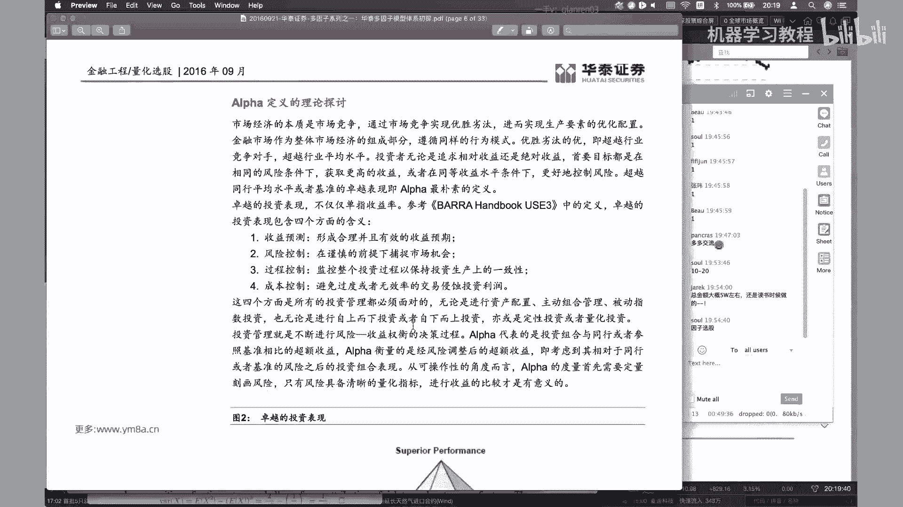

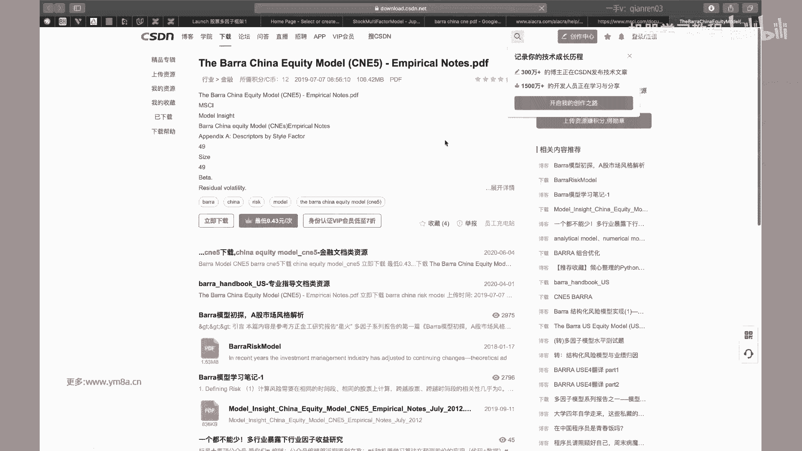

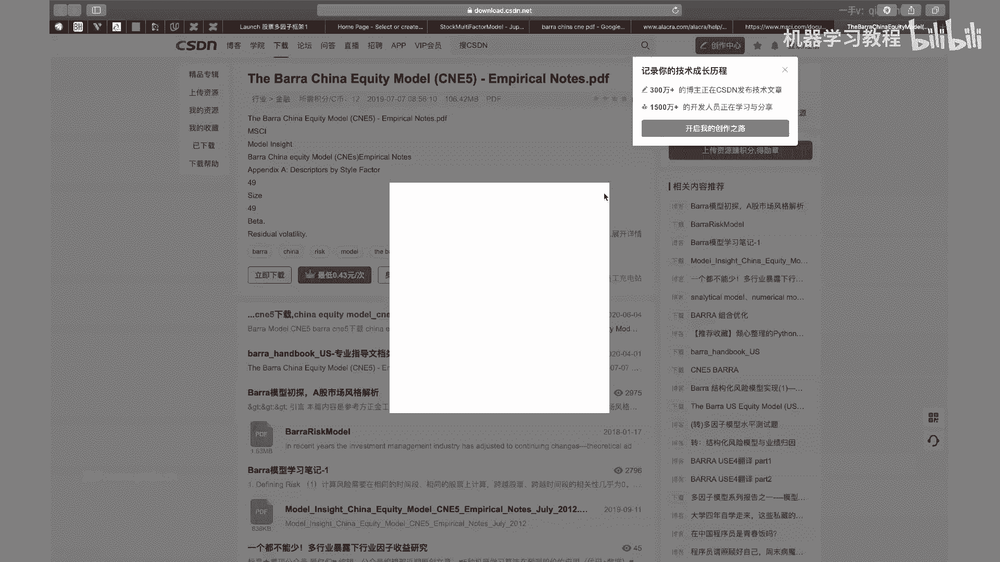

好的各位同学，我们回到课堂上来哈，OK然后刚刚想给大家找的那个，之后课后再给大家找吧，就是BA的BA的这样一个handbook，这个应该很多公司都会去对于，它里面的那些模型去进行研究对。

所以我觉得还是值得去让大家去看一看的，然后嗯刚刚提到就是说定性和定量管理，OK就是我们既然选择是去做量化投资，我们肯定是倾向于是定量的管理对，嗯然后呢提到一点说，电量管理本质是统计套利。

其实啊尤其是用在对多因子模型上面，显然就是这样子，就是说嗯，只是说嗯目前来说这本书里面提到的说是有，有这样多的一些东西吧，但是说比如说第五条，就是说基于合理的经济理论。

其实现在基于很多数据挖掘的这种方式，其实也对相应的这些观点产生了一些挑战，然后包括说持续跟稳定的模式，认为是嗯对嗯，现在可能说我交易的就是短周期嗯，相对来说我模型产生的速度很快。

但我DK是DK的速度也很快，所以其实很多的观点就是说，大家都可以去自己去考虑他到底是不是有效，以及对一直说一直说在当前的市场环境下，它是不是适用，对其实就是说包括说在A股，我们同样的是根据因子。

比如说我选根据嗯，根据因此我选择做多前20%，做空前后面20%的股票的时候，那可能说是发现没有做空的情况对，那然后这个时候其实有一些因子会发现，正是因为他没有办法去做空，才会去有效。

当然如果市场真的可能去做空的时候，这个因子也就是说也就失去了，能够去赚钱的这种效应对，所以其实这里面有挺多比较好玩的东西，大家都可以去逐步的去探索，然后我们刚刚提到的，就是说经典的多音字的表达式啊。

OK然后我们下来就去看看怎么去怎么，这个公式到底我们怎么去用对，嗯然后说定性管理，其实这里面提一个就是说主要管对定性管理，主要是从因此对这部分反正怎么说呢，就说我们其实是希望说。

我们是希望来说说如果我们找不到的，就是说找到的就是无法解释的超额收益的话，我们想办法去把对应的因子给找出来，那其实这就是我们的一个我们的一个edge，就是我们我们自己相比别人有特殊的地方。

对其实我们要做的事情，就是说我们其实希望说是去不断的去找到，能够去获得回收益的这些颜色，这个是我们做量化研究的一个，比较重要的一个地方，对，然后的话可以读啊，对这部分。

反正这个是对这部分大家可以了解一下，其实嗯这我不管是说做股票的多音字，还是说我去做CTA，其实本质上来说都是需要去考虑这些的，就本场我要去做预测，然后我要去控制风险，然后过程控制。

它可能更加说是偏向于就是operation的方面，就是不管是我说保证回撤跟交易的一致，然后以及说是我去优化我的交易系统，对第四点的话可能就是说嗯如果是做T的话，可能就是考虑嗯如果做的频率过高。

手续费就要去考虑，说我眼力跟手续费的这样一个比例对啊对，所以其实所以其实说每一部分我们都可以去，都可以去不断的去做优化，去追求，去追求极致，把每一部分都去做到最好。

那相对来说就是说能够提升的空间就比较大了，对，那如果说我其中某一点做不好的话，嗯可能说也有可能能赚钱，但是说想要去持续稳定的高效赚钱，但相对来说是比较难的对，然后其实呃要提到就是说大家对我们提到。

就是说什么是风险的话，就是比较标准的，就是说是去看嗯，嗯就是就是收益的标准差，Standard deviation，这个这个确实是就是Mark with提完之后之后，就是大家一直会一直去沿用。

包括我们现在来做的也是比较标准的，这样一个事情，对啊，当然说至于至于这一点的话，要不要去，就是说有人要不要去考，就是说我嗯这这部分，所以说每个人对于风险的，如果说你想用其他定义，比如说我只考虑啊。

就是当赛risk，那那可能就是说你相应的模型也要去进行，相应的调整这部分大家可以去想一想，因为我自己我们其实没有做太多的考虑，都是采用去啊，就是用这样的一个收益的标准差。

然后以及就要考虑说这张图它画出来，就说我们收益率是一个正态分布，但事实上就是说呃对，要去考虑说我们市市场当中，是不是这样一个正态分布的收益，大家可以有兴趣，好是可以把就是收益率给破出来看一下对。

不管是期货还是股票，可能会跟标准的正态分布是会有一定的，就是有一定的区别，对嗯嗯然后再多说一句，就是说事实上我们就是说看不同的策略风格，就是说我们这边看的说是埃塞，就是一个股票，或者说呃。

或者说一个因子的收益率的正态分布吧，然后但是说我们交易出来这样一个策略，其实每个人不同类型的交易策略，你看它收益率的分布是能够看出一些东西的，比如说CTA的话，很有可能典型的说我大的亏损。

可能相对来说是比较少，因为我都会去做相应的止损，但是啊，但是说我可能大部分都是说是在小的亏损，这些就是说我大大部分都是说，还有我可能说整体的甚至说是会有一些偏，expected value可能是小于零。

但是我对于heavy tale的时候，我可能会有一些额外的超额，就是说在这些某些特别好的天，我可能会赚比较多的钱，那么使得我整体的投资组合收益是正的，然后画到如果说画到资金取向来说。

可能就是平时不断的在有一些下跌，就是平缓，遇到一个遇到一个特殊的情况的时候，有一个比较大的台阶上升，对，那其实说从收益率的分布来讲，是能够看出一些呃，一些策略的比较典型的特征呢，那比如说我起卖期权。

我可能平时就是每天都是稳的去赚钱，等出现一些市场出现一些大跌等，甚至有可能是大涨的时候，我作为齐全的，就是说我shot ball的时候，我可能会遭受比较大的这样一个回撤，反一下就是说我平时都是缓慢上升。

但是可能会有偶尔会有这种大的比较大的回撤，那么怎么去减少这种回撤，那就是作为期权的投资顾问的话，要去支持他们的一个就是核心竞争力了，对呃，OK然后的话，然后这里面就是说呃，然后这边有提到一个。

就是说是performer这样一个，这就是为什么我们要去做投资组合，就本质上来说是因为我投资组合的呃，投资组合的时候，风险是比我的，可以说是小于等于一个投资组合当中，各资产标准差的加权平均。

所以这部分就是说，我们为什么要去做投资组合啊，其实大家也会说提到就说分散化，有应该有很多人会提到，就说分散化是唯一免费的午餐对，那其实嗯不管是说是在去投资的过程当中，我去找到嗯，相关就是嗯就找到去。

我可以找到就是说negative correlation的一些因子，或者说是我找到不相关的一些因子，然后或者说我个人再去做资产配置的时候，我不是说我把我所有的资产都放在股票上，而可能说是股票啊。

房地产另类投资，甚至数字货币，多方面的去分散风险的去配置，对这个这个是可能是相对来说是比较好的一种，就是希望财富的稳健的增长的这样一种方式，我个人觉得相对来说是比较可行的。

其实它也有点就是类似于去投基金，因为基金本质上来说，如果是指数基金，本质上来说，我就是去分散化的去按照对应的市值比例，投资了这几十只甚至是几百只股票对，然后如果我觉得说嗯对，然后如果我说我投了全球。

各个国家市场的基金啊，对，那么我相对来说，我资产的就是和资产的分散化程度是比较好的，对啊嗯，事实上就是有一种投资策略，大家是可以考虑，就是自己个人业余可以试一试，就是我去去投资全球各个国家的指数。

对你可以拿它去做一个择时，或者是去做一个资产配置救人，还是可以做出比较好的，这样一个资产配置的模型，然后业界比较典型的，就是一个美林时钟的资产配置模型，相对来说就是我什么时候配股票，什么时候配债券。

对大家可以感兴趣的话，还是可以去找到去看一下的对，然后其实我们就是说这个例子的话，大家就是去了解理解一下，就是说本质上来说，如果两个S都是0。5，0。5的50%的权重的话。

然后我们的就是他们收益率相关系数对，如果说完全线性相关，row等于一的时候，我们是可以得到这样一个式子对啊，然后如果是N只股票的话，我把它去安置，安置股票的话，去扩展一下的话。

就是呃如果是收益率互补相关，就是说我的呃就是我的row是零的话，那其实就是其实就是本质上来说的话啊，你就是把这边的0。5换成了呃，N分之一对12，然后你再去，然后我们就应该是可以得到这样一个呃。

就是divide by square root of n的这样一个组合的风险，然后然后就是OK嗯，然后就是一个对，还好就是我们要提到，就是说我们做这样一个投资组合，我target的目标是什么。

因为嗯大家有应该也可以去关注一下，市场上当前在做的嗯投资组合，就是说一般来说，目前是以就是中证500的指数增强，或者是中证500的绝对收益比较多，所以大家可以想一想，就说我为什么对标的是中证500。

就是是是排除掉就是沪深300之后，后面比较大的500只股票，为什么是选择它作为这样一个呃股票池，对大家可以想一想，然后为什么就是大家可以就是我想问一问大家，就是为什么他要去选中证500。

而不是选上证五零，大家不是上证五零，不是都是白马股嘛，就是很多人说地产金融对，你为什么不选沪深300，就是前300只大票，大家可以去想一想，为什么要去做，就是说选中证500对。

我想问问就是呃就是呃soul同学，就是如果方便的话，你可以我想问一个告诉一下大家，就是你选的这个股票，大概是是是属于当中哪一类，是哪一个股票池里面的，然后你为什么要去做这样的一个选择。

就其实考虑这个问题也是比较简单的一个事情，就是说我要去考虑我在什么样的股票池当中，我可以去做出超额收益，但事实上就是大家也可以看到大票的话，相对来说，尤其是上证五零可能波动。

每只股票每天都不会有太大的波动，那么我要去同样的对，我要同样的去交易的时候，我要从当中去，如果我不管是去做T加零还是去每天去交易，相对来说我如果像工商银行这种，每天波动几个点对。

那就是说小数点后面不是说百分之几，就是说比如说他五块六块的话，我们可以看一看它的价格吧，上证五上证50年，可以说大家可以看到上证五零，它的股票池相对来说都是券商，然后这种。

对然后刚刚看到这个典型的银行股，这是这是这是农业银行，那相对来说如果我每天就交易了，可能都覆盖不了它的成本，我每天上下波动一个点，如果我想要去做一个相对来说有一些波动的话，就是说如果我是T加零。

我希望高卖低买的话，但事实上就是说我可能都覆盖不了我的，手续费的成本，对大家可以看一下，这是银行股的一些典型的特征，对然后的话相对来说再去看沪深300，这时候才发现我看沪深300。

事实上就是波动来说已经简单直观来说，我看到的是比上证五零的波段要去大了对，已经会出现百分之几的这种波动，我事实上是可以，就是说有一些潜在的客人的交易机会了，对对然后我们再开始说事。

事实上市场交易的是以中证500对标比较多，对中证500大家可以看一下他的持仓对，那就是看它的就是股票里面都是什么，就直观的大家可以应该可以看到，就是说中证500的波动，是远大于沪深300和上证五零的对。

那那作为交易来说说，我其实不担心说，他今天一直不但应该是上涨还是下跌，但是我期望是说，我的股票当中是会有比较大的波动，因为只有在波动的时候，才有可能会存在被错误定价的可能。

那不管是散户由于情绪或者是其他的方案原因，我才有可能去获取相应的啊，相应的就是说我交易的这样一个空间，对，所以就是目前市场主流，就是说大家是会去交易这样一个，中证500的这样一个啊指数。

那其实其实也是就是说还有为什么是去交易，这个是因为为什么说我不再去交易，后面的更小盘的股票，那其实是跟就是我们现在当前有哪些股指期货，是比较直接相关的，就是因为我除了我们我们刚刚上一节课提到。

除了说我们想要去做啊，想要去做，就是说指数增强，就是说我持有这些股票，我希望获取指数的超额收益，那么还有的是大家会去做啊，做绝对收益，那么我希望对冲市场，上涨或者下跌的风险的时候。

我这个时候就会去考虑用股指期货对冲，所以大家看到，就是说只有我市场提供股指期货的才会去考虑，才有可能去做出这样的策略，这这边所以是C啊，然后嗯对IC和IF大家也可以从成交额当中，其实也能看出一些东西的。

就是股指成交额和成交量对，对啊，大家可以看到就是持仓对，相对来说IC的话持仓是最多的，也就是对于我们的中轴500啊，持仓和成交量相对来说都是比较多，但是市值上成交市值上到不会有差那么大对。

然后相对来说RH我们提到上证五零，因为那个时候可能交成交量就会比较小对，就是看当月的这样一个合约，对啊，其实应该是看就是说把近月远月的都统计下来，但是一般来说就是股指期货是在近月的时候。

流动性会比较好一点，大家会交易的会多一些对，所以就是说本质上来说，就是说大家可以想，期货跟股票市场是会有一定的联系对，所以就是我我包括就是说我给大家，就是说提供的数据，但是所有的股票都会都会有啊。

就是给大家提供的数据，所有股票数据都会有，但是我们可能还是希望大家说，基于中证500的这样一个指数来去去做对标，看我能不能去二产生一些超，产生一些超额收益对，OK啊，然后covers matrix。

大家嗯嗯大家明白是什么意思呢，就是本质上来说就是我哦，我是有就是有N个有N个股票，然后两两之间去算他们的，去向他们之间的这样一个嗯去，就是去算他们这样一个呃，就是呃呃就算他们一个斜斜方差，对，然后对。

就是所以所以因为是因为是嗯两两股票都会有，所以如果如果说就是说我们是3000只，3000只股票来，实际上这个矩阵是嗯是非常大的，对那就是呃3000×3000，然后我要估计的估计的数量。

就是说因为因为它是对称的嘛，西格玛一二跟西格玛二一是相同，所以是我估计的是这样一个上三角，或者是一个下三角，下三角的一个矩阵，但事实上是一个N平方倍对，那这个时候大家要看到就说为什么我们不去啊。

单纯的就是嗯去看每只两，两个股之间的这样一个嗯coerce coverage metrics，确实是自存量会相对来说会比较大，但是我们多因子的话，我们就可以考虑把这些的口呃。

把3000个3000多只股票的维度去降低，降低成就，我们只考虑因子的这样一个，K的这样一个维度对，然后CPM是这样一个嗯，对学过金融的同学，应该相对来说会比较了解一些，对。

其实然后包括这里面就是给到了这样一个，贝塔的这样一个定义，对他就是说是，资产跟市场收益率之间的这样一个，资产的收益率，跟市场收益率之间的这样一个COVERANCE。

除以一个就是市场收益率这样的一个呃方差对，就是股票和啊，就是这样一个贝塔这样一个定义嗯，然后的话然后然后然后其实说我们嗯，然后如果说我们有了贝塔之后，就可以就是说把市场就是超额收益。

就是分解为我们的市场部分，跟我们的残差这样的一个部分嗯，然后他这边有一些assumption，就是说如果那就是残差收益率，市场收益率是独立的，然后所以我可以把投资组合这个这样的一个。

就是呃方差去进一步的这样一个去分解对，然后OK所以其实说大家也可以看到，就是多因子的这样一个模型，其实是一步步的去迭代出来的，对啊，它刚刚是我们继续就资本资产的这样一个，市场的定价模型。

然后再去加上一个套利的模型，OK啊然后接下来我们就说这样的公式的话，其实现在大家看到他的话就可以理解的说，我们从我们的嗯，从从那嗯至RJJ代表是每一个呃，呃就是每一个股票。

然后我们现在是把每一把股票的这样一个哎，收益，把股票的这样一个收益率，去分解到我们这样的因子上去，分分解到我们多个因子上去，然后我们是希望我们的嗯去嗯去找到，就是说尽可能的去找到我们的K歌。

K就是K歌因子使得我们的，然后尽可能去解释出我们的收益率，是由这K个因子来决定的，这其实也就是我们多因子模型想要去追求的，这样一个东西呃，然后这边下面提到的说，多因子模型有三种的这样一个。

这三种这样一个形式啊，宏观经济因子模型相对来说，如果说宏观的数据不是更新频率，不是特别高的话，那事实上就是说那如果我要用这个模型的话，嗯怎么说我更新的，那么相对来说，我的多因子的这样更新的频率。

就不是特特别的去，就我不能去频繁的去更新我们这样多因子呃，然后OK然后他说这边提到说是数据的问题啊，60个数据来估计十个宏观因子，每个月的回归OK嗯，确实是就是就是尤其是宏观的。

就是说我遇到这些宏观的因子怎么去把它处理，其实也是会一个问题，所以实际操作当中，我们不太会去考虑这些你写的一些的东西，然后然后第二部分就是说，现在大家的多因子模型当中应该都会去呃，都会去考虑这些东西的。

就是基本面的因呃，基本面的这样呃因子模型呃，事实上这些东西的话，就提到的无非是数据处理复杂一些，但是其实如果我们还是说，建好了数据处理的PIPA之后，每天去更新也还是OK的对，所以这部分。

事实上就是说我们在去做多因子模型的时候，是要去考虑的对，然后统计因子模型这个他确实提到，就是说因此有很难很多，这很难直观的这样一个含义，对，这个其实就是嗯这个OK，就确实是他提到这样一个一个部分。

然后包括我们其实说我们自己用数据挖掘，就是从股票的交易数据，不管还是什么其他数据，具体数据挖掘其实也会有类似的一些问题，当然这是这个跟学术研究不太一样的一点，是有的时候就说嗯，我当然希望说我能够去找到。

说有明确经济学意义解释意义的这点因子，但是可能把这个因子研究出来，黄花菜也凉了，那那那但是说如果我们是基于统计上来讲，说我们这个因子真的是可以去奏效，那么是我们是有大概率的，我们是可以大概率的去相信。

这个因子在未来也是可以去奏效的，这也就是说我们去，这也是说我们做因子挖掘的意义，不然的话就是说，如果说我们真的要去完整的去确定，每一个因子的话，那我觉得就是基于嗯，基于基于这样的话，基于这样的考虑。

那我们挖掘基于我们就是挖掘因子的速度，是远大于我们去验证这样一个因子有效性，的速度的话，那么很有可能就是面对我们都不会有，对因子有这样一个交易的可能和机会对，因为事实上市场竞争是非常激烈，我们必须用。

我们就是借助现代的工具去对我们的因子进行，高频率的更新去挖掘，对这样去保证我们的就是，那我们的就是阿尔法的模型，是处于相处于来说一个领先的位置，然后borrow大师就是MMCIT供的。

MSCIT下提供的，就是嗯它会有对美股跟A股都会有去有这样的，就是有这样的模型，他们相对来说他们做的模型还是比较系统的，然后我觉得大家嗯还是可以之后就会找到文档，还是我觉得还是大家。

还是值得去好好去研究一下嗯，里面提到的各种各样的因子的构件，然后以及怎么去测试因子，我觉得收获还是比较大的，对，然后他说基本面多因子，这样一个基本面多因子模型，最基本的假设说是类似属性的股票。

在市场具有相似的收益率，对那其实嗯对你说，因为不管是交易价格，交易量，市场大小，然后波动率，然后以及说我们这些估值的这样一些属性，对这个是非常reasonable的，因为就是不管是做价值投资。

还是说是去做量化投资，你本质上来说也是做价值投资，归根结底还是说是希望当前的就是希望嗯，最终我投资的股票或者是公司，它的估值能够嗯，或者说它的价格能够反映出真实的，反映出它的基本面，对这也是就是对嗯。

所以说多因子模型就是完全的，纳入这些基本面的多因子，我觉得是非常对，其实是非常是说符合我们的直觉，也是觉得也是也是非常正常的这样一个事情对，然后下面这样一个就是下面这样一个公式的话，大家仔细看一下。

就是我们看一下，就说我们这边capital是我们的就是K歌因子，然后我们是N个N个的，这是RP是我们的这样一个嗯，是我们的这样一个portfolio，然后注意这个这个不是说单只股票的return。

这是我们的这样一个portfolio，然后然后就是然后说这个里面的人说，我们这个时候，我们整个投资组合的这样一个因子的回报，是那投资组合的回报是由我们每个因子的呃，呃就是每个这样一个因子的回报呃。

和我们就是说和我们的残差部分来构成的，然后呢，当然每个因子的部分，事实上是由我们投资组合的，就是投资组合当中呃，每一个股票的权重啊，和它的和这个股票在这个因子上的暴露，这样一个成绩。

对这个其实大家仔细看一下，应该不难理解，对，其实或者或者如果你觉得看这个比较困难的话，就是你把它换成下面的这样一个矩阵，这样一个形式，我觉得就比较好理解了，对我们本质上还是说。

这个这边是我们的一个个的一个个股票，然后大家看到就是每一行，其实你做的事情就是呃，我第一只股票在第一个因子上，然后呃的暴露，然后乘以相应的这样一个音，这样二乘以这样的一个F1对，然后其实我要做的事情。

就是说把每一个每一只股票，在每一个因子上都去对应的去把它存起来，然后再加上我们的参差部分，这样我们得到的就是每一行就2万，得到的是每一个因子的这样一个收益率，然后我再让我整个PERFOLIO的收益率是。

其实是就是是把我这样的呃，就是我PFOLIO收益率，本质上就是我每一个投资的股票的收益率，乘以它相应的权重，所以大家会看到就是有这样的一个HPJ，每个股票的权重，我只要2P就等于就是R1乘以HHP1。

然后加上R2乘以HP2对，其实其实这这这这两个就是上下，这两个公式是等价的，对就这样子的话，大家有没有，就是说对于直观的我们多音字模型，在做什么样的事情，有一个最基本的了解，其实本质上就是这样一个东西。

对这就是如果是理解了这个矩阵，其实我们接下来的事情就比较好做了，对就原来说我们要做的事情是嗯，就是从1000只股票的预期的收益跟风险，然后现在我我换换成了说，我既然说我找到了这20个因子。

我只要去研究这20个因子的收益跟风险，对嗯，其实相对来说他说的是预测的复杂度是降低，那么我导致相应的我获得吹的就是，我能够去提升我预测的这样一个精度，因为大家可以想象一下，其实你对于去研究单个预测。

单个股票的涨跌，其实相对来说会比较困难，但是我可以去呃预测这样一个因子的表现，其实还是我觉得获得的确定性是会比较多的，这样一个事情，也是会有相对来说比较大的这样一个确定性，因作为单个股票而言。

就是其实它是有多个啊，就是能够有多个影响它涨跌的这样一个因素，单纯的去预测股票涨跌，如果我去那LOSTM或者是其他的深度，而是深度网络的这样一些模型去来预测的话。

嗯那其实就是说这里面不可解释性是非常的大，但是如果我去转为去预测这些因子的话，相对来说，一方面我因为我预测这些因子本质上是有多个，有有很多个就是有市场，全市场的股票去来帮助我去研究这些。

就是用这些股票数据来去研究这些因子，像尤其是它还具有一定的经济学的意义，那么相对来说去研究这些因子，那么可能会有确定性是会大一点，所以这也就是说，可能很多有一些人就是在在尝试说嗯，做股票的预测的时候。

可能或者是做什么的预测的时候，说我不管3727，我能把找到这些特征去呃，扔到我这样一个网络里，希望说我这样的网络是不是可以，像其他的深度学习网络一样，只要我参数足够多，网络足够深，就一个一定能够去学到。

去赚钱的这样一个模型的，那可能就是有可能会有点困难，因为呃本质来说，我个人理解是再多的模型，对于这样一个股票具有无限复杂度来说，都只能是无限复杂度的系统来说，都只能是去做一个近似，本质上来说嗯。

多音字模型是给了我们这样一个作呃，作为一个它给了我们一种框架，能够去降低整个市场的复杂度，去帮助我们，是说只去关注主要影响市场的这些呃因素，然后我们把其他不能继续解释这部分，去丢掉残差。

然后我们接下来做的事情是只要去找到，只要去不断的提升研究这些影响，主要影响市场的这些因素的准确度，然后去减少我们残差的部分，或者说是对在这这样的话来说，我们觉得是说去做这样的一个预测。

可能比单纯的说啊去预测个股的涨跌，会去有个更大的一些嗯准确度吧，或者说是有更大的信心去去做这样的事情，对，所以到这部分，大家有没有，就是对多音字模型有一些就是基本的了解，就是然后我要提到，就是说呃。

如果说因为这里面是基于我个人的理解，如果大家觉得有什么不准确，或者是就是有什么觉得说的不对的地方，我觉得是需要去指指直接提出来的，然后如果不能确认的话，我也会去找各位senior的同事。

去讨论一些这些事情，对希望是说不要给大家带来错误的一些观点，对，当然对啊对啊，我觉得就是说因为因为可能在讲讲这个时候，可能里面也加了一些私货，所以反正加勒斯或者部分，我觉得我都会去提出来。

然后就是说我我是鼓励大家去思考的，因为嗯投资这个事情，说白了也是非常personal的事情，即使使用相同的框架，那做出来的结果可能也是完全不一样对，所以我我是鼓励大家，就是跟我一起去共同的去探讨。

然后去思考，就是因为我觉得这个才是，就是说我们真正做量化投资的乐趣所在，而不是单纯的说像嗯跑深度学习，让我把这个模型按照paper里面的方式完全搭出来，那么大概率我复习下来的结果也是差不多的对。

嗯在量化里面没有说是去追求模型的准确度，或者说是识别的准确率吧，但是我们某种程度来说，我们是希望通过量化的方式去不断的增加，我们对于市场的了解，那么对于呃，然后我们是希望以一种相对比较科学。

或者说是可解释的方式去呃理解市场，这样增加我们自己对于模型的这样一个可信度，对，然后这边提到的就是说OK这个是这就是covers，就是一个是N平方的复杂度，所以说当我们要去嗯，如果是多个股票的话。

其实这样的这样的就是呃，我们需要的就是需要的就是窗口或者数据量，其实是比较大的，对T大于1000嗯，当然注意说，我们也不是说不能去考虑这样的事情，就是我们如果不是说不是阅读频率的话。

就是说他说现在是最常规的是阅读频率，但事实上可能我觉得可能现在每天，大家基本上都是每天去更新我们的模型啊，对啊，尤其在发达市场，其实也是有可能去做这样的尝试，但是呃我自己是没有尝试过。

如果有兴趣的同学可以去尝试一下，就是说如果我们我们单纯的就不用多音字，我们就用就用股票来取，就用1000只股票的，就是数据来去故意估计这样的一个斜方差矩阵，大家可以看一下嗯。

我觉得可能这样举证都不一定对啊，不一定对于确实不一定能够去，嗯可能就是可能甚至会说求解的时候，可能都会遇到一些困难吧，对，然后他这边要强调说，他不是一个因果关系的模型，对我们只是说是相关性和因果性。

这是两个东西，就是有相关，但是我们不能说是这个因子，决定了这个市场的收益，但事实上我们都是反过来的，我们都是从哎就是正常的投资流程，是我们从历史数据当中，我们得到了一些。

能够可能能够解释这个市场收益的一些因子，然后我们根据这些因子去预测明天的收益率，但是我们不能说，我们根据这些因子计算出来的收益率，那就是明天的收益率，那显然是不对的，那当然就是说当然就是说。

如果说我们预测出来的这些因子，到了T加一的时期，真的是跟我们市场真实收益率是比较接近，Ok，那那我们就大概就是说我们这样的一个因子的，多因子的模型就起作用了，我们去能够去赚到我们市场。

符合我们预期的这样一个钱，对嗯，Ok，然后就是嗯嗯这个的话其实跟之前会有点类似，就是他这边是嗯，这部分就是待会儿给大家自己去看一下，其实本质上跟前面没有特别大的区别，它只是嗯对。

他只是说我们把就是说在多因子的框架下，就是说我们市场风险怎么由我们的股票的，这样一个单个股票的风险转化程序，转变成一个因子的，在因子上的这样一个风险对，um okay嗯，然后是端子模型的对。

协方差距这一般是多长周期的数据估计出来的，这个我觉得大家可以去看，就是你这边他看到的说是，就是说因为说是采用历史数据进行估计，其实这个长度是T远大于对，那么那么就也就是说。

那就其实就要看我们就是协方差矩阵里面，我们有多少个相关系数，当然我们用日本数据，从10年到现在可能还好一些，如果说我们的就是就是呃，就是包括接下来，就是说有一些就是算协方差矩阵是有一些。

因此认识民事告诉我们，其实我们要用多少钱的数据来去算对，所以这个当然我觉得这个原则是只显示，最显然的，对我们不能说是啊，因为因为毕竟有这么多参数，我们不能说是和我们数，我们实际提供的数据量。

就是提供的样本数量还小于参数的数量，那么我们一定可以找到，这是完全去拟合我们的，你完全拟合我们当前数据的这样一个参数组，对吧，所以这部分我觉得也是非常惊艳的事情，也不是说是啊。

你一定是确定的适用多场数据的，多长周期的数据估计出来的，甚至来说就是就是我是不是得考虑，就是包括就是说我们在拿因子去做预测的时候，我是考虑说拿前期，前期这么多因子的这样一个平均值呢。

还是说我着重考虑近期的因子的影响，那其实这里面都是有可以去很多去尝试的空间，就是一旦就是说大家觉得嗯有什么问题的话，我唯一能给的就是说是OK我们去做个实验，我们去尝试一下，我采用不同周期的数据去嗯。

去估计出来协方差矩阵，那看一看对我整体的performance，会有怎么样的影响，对我觉得这个是就是是整个做量化过程当中，我自己体会到，就是说当我有一个想法的时候，我而你固然是可以去问。

就是问就是问一问旁边的同事有没有去做过，但是如果说别人也没有做过，或者说他也只是简单尝试一下，那我完全可以尝试的想法，就是说我们自己去就是尝试一下，这个想法是不是可行。

对就是它本质上来说更加偏向是一种研究，我不觉得有什么，就是说我们当然说是有一些基本的一些假设，就是说比如说我不可能说拿太短的周期去估算，我的一些方差矩阵，但是啊质量有多长。

我觉得可能是真的是实验出来才会去知道，有这样的结果，对甚至来说我在不同的市场上我选不同的，而股票是那我可能都会去考虑，都会去都会去进行相应的调整，本质上来说这个多长的周期，这是模型当中的一个SM。

如果用用我们实验当中来对比的话，算是一个就是超参数对，就是HYPERPARAMETER，这这这样可能是对，我觉得可能是大家要自己去考虑，而不是说有一个确定性的这样一个解对嗯，然后就是说嗯对嗯。

音响音多因子的多因子模型的分解，这Mark risk大概是相对来说是比较直观，就是说当市场上涨和下跌的时候，嗯是啊他会直观的去影响股票的上涨和下跌，然后sector risk对行业的风险，所以对。

所以说就是接下来就是这里面提到的一个方，每提到的这样一些方面，其实说我们在做呃，在做多因子模型的时候，其实到后期我们都要去对它进行相应的控制，对就是说我要控制我相应的，因此在这些方向上的暴露对。

然后风格因子是指股票市场结构，嗯曾经就是说要提到一点，就是说曾经说比如说小市值比嗯表现更优的话，嗯那有有曾经一段时间就是说它是一个阿尔法，但是到了后来的时候，大家发现其实它是一个就是风险因子。

它不是一个真正的阿尔法，那那什么是阿尔法呢，哎什么是阿尔法，真正的阿尔法，你能发现当这样的一个小市值风格，在什么时候进行切换的时候，那你这样的一个发现，这样小数值切换的这样一个因子，那才才是一个真正的。

就是才是真正的一个阿尔法，对嗯对，当然也就是说曾经如果说市场上交易者，不是所有人都认为这样，是就是不是所有人都认同这样的呃因子的时候，或者说大家还没有发现这个因子的时候。

那这样的风险因子可能是你的阿尔法，但是随着市场慢慢的进化，每一个交易日都会逐渐的去发现，那其实这样这样的就发现你，你目前正在交易这个因子，那么慢慢的就是说也有阿尔法。

就变成了我们这样一个所谓的这样一个所谓的，一个风险因子，对，嗯然后他接下来提到的就是K，其实就是这张图了，然后他接下来提到的就是12类因子的话，呃K12的轮子对嗯，大家可以就是这个表格里面它会给出来。

就是说里面有哪些这些因子，然后其实我们今天主要是因为，我们其实有数据还没有处理完，就是这些数据还没有完全的拿给大家啊，确实处理起来也是处理的时间，是超出了我的预期，对我们今天先是就给到大家的。

是大家是可以就是从我们的就是呃，我们是会按照多因子的框架去做，但是我们接下来是大家可以先去从就是国泰君，那就是从日记别的因子开去可以尝试，尤其是偏向就是短周期交易性的因子嗯，那为什么考虑说做这个。

一方面就是说是我们的数据，有数据相对来说可以可以比较获得的到，然后另外一个就是说呃，可能从当中就是我个人觉得是从这些日级别，日平的交易数据当中获得，就是去挖到因子，这样概率其实还是相对来说是比较高的。

以及就是说可能国泰居然给到的，那将近200个因子当中，其实都有一些是相对来说现在还是可以去用的，对好的，然后接下来，然后接下来下一课的话，我们就来去考虑，就是跟大家怎么去嗯，我们去看看一看。

就是怎么去把这些因子去，我们要去做怎样的数据处理对，其实这里面也是有一些东西的，然后我们带着大家一起来做一下对，然后还是我们先休息15分钟，还是09：30的时候，我们再回到课上来。

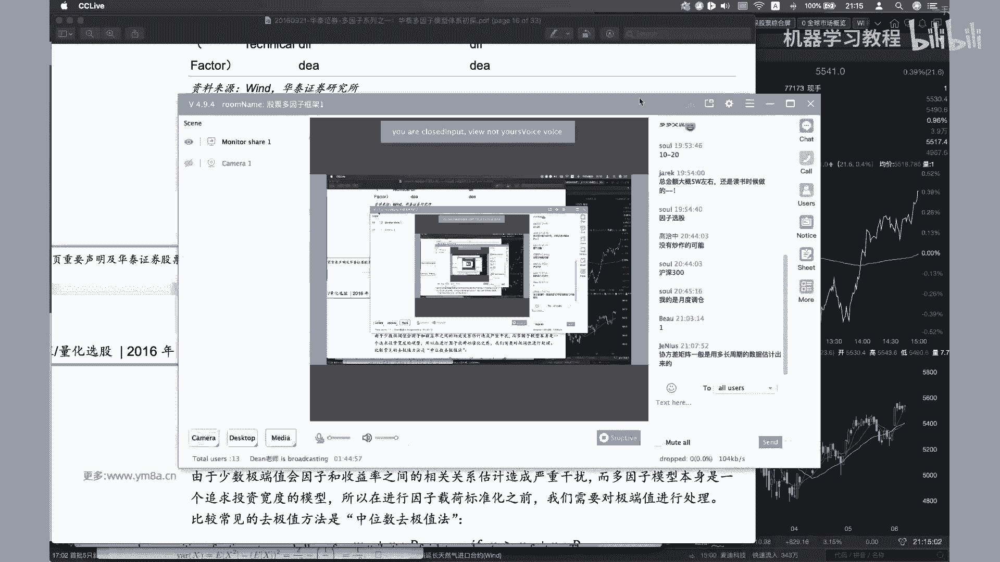

诶好的，各位同学，我们现在开始第三课啊，大家再坚持一下，还有一个小时，对啊，然后然后我想提到就是对，然后就是接下来就是说，我们始终会去围绕这样一个流程图，流程图去做，不管是接下来做我们的作业。

还是就是说做project，大家去，我们要明白，就是说我们所做的事情，在整个流程当中是去做哪一步，其实就是，sorry就是我想给大家看的就是对，比如说先去看接下来的流程，数据采集工作大部分情况下。

我替大家完成了这个事情，然后接下来是数据标准化，然后识别有效因子啊，对，然后我们可能在比较会花比较多的精力的，一部分是就是在我们的收益，就是一个是这一部分吧，就是识别有效因子，然后是收益模型。

对这这两部分可能我们会花比较多的，呃一些的事件，然后我们具体看一看，就是说呃，然后提到就是说这这里面因为涉及到很多的，就是一些基本面的因子，然后如果大家对于这里面的概念，不是特别理解的话，很简单。

找一份先找一份财报出来看一下，就不管是茅台啊，你感兴趣的公司，找一部分他的年报看一下，然后看看这里面就是每一部分，它对应的是什么东西，然后还有一本书我是想推荐给大家，就是我自己也看这本书，然后去入门的。

然后如果你考过CFA的话，这里面的概念对你而言不是什么难事，呃，手把手教你读财报，我觉得这本书写的还是比较简单明了的，就是说教你去了解一些，就是股市当中最基本的这些概念，到底是什么意思，对啊对。

然后我觉得就是长期如果是想做股票投资的话，还是还是把基本面的概念稍微了解一下，可能会好一些嗯，对然后这边的话就是说数据标准化的话，就是对这个其实比较简单，就是我们就是把相当于一个说是中位数取极值。

就是把我们的outlier给回归到对，回归到我们的一个范围之内啊，去换机制，二就是然后再进行标准化，这个都是大家在琢磨试验令当中，其实也是用到非常多的标准的这样一个操作，呃，但是这个N取多少呢。

大家可以自己去试一下，然后我一般是取二或者是三，其实然后你当然具体说你每一个case的话，是不是要去去看一下它的分布，我觉得这个也是要去大家也是要去考虑的对，所以其实里面就是有很多的参数。

是可以去进行调整，嗯对嗯，然后然后当时说一个是说我们基于原始，就是说原始值，还是说是说我们只关注它的排序，因为排序本质上来说我就没有这些参数了嘛，就是就是我本质上就是一个非参数的一个，统计的方法，对啊。

适用对，有一些因子，如果说是你就是说用原始值处理，也比较麻烦的话，或者说或者说选取处理一下，效果不是很好，那其实可以考虑说，直接把我们原始值转化成排序对，所以大家其实可以看到整个多音的模型里面。

能调整的空间是非常大，就是说不管我是对齐了哪一步做了一些调整，那么导致大家最后做下来的模型其实都不是，就是导致差的还是有一些区别的对，所以我们刚刚看到的是，我们是在做数据标准化的这一步对。

就是一个是嗯取极值在就再去做标准化，还有一个是我用rank来去做标准化嗯，对然后的话就是然后就是着重想强调一下，就是说有效因子的识别，我们到底要怎么做这样的事情，我们先去先来看一下。

就是说这个研报里面他到底是怎么来做，就是说啊你说一个是他其实这个意思是说，市场跟行业因子是不是纳入模型，本质上来说，就是说嗯就是说我比如说我拿出一个分红高的，这样分红高分红的这样一个因子。

那么它其实对应的实际嗯，可能说他某一些行业的股票，会有比较高的分红概率，或者说分红的比例比较高，那其实说我这样因子就是一个不纯粹的，不纯不纯粹的这样一个因子，它其实是考虑的比较多的行业因子，在其中。

所以嗯所以其实我们要做的是，就是在做在回归的时候，其实是要去考虑，我们要把呃呃这样的我们我们找到，因此在行业上的暴露是需要去进行去考虑，去剔除掉，然后我们只是剔除掉这些在行业跟市场上暴露。

我去留他的残差，作为我的因子，然后在这个里面，这里面就是这里面提到的几个比较多的东西，一个是嗯对，一个是就是说这个这个这个就是XJTGST，本质上来说它就是个binary variable。

就是说嗯他如果是行业S暴露的为一，否则为零对，然后有一些人可能会采取说嗯作为一个公司，它有多个主营业务，那么这个公司嗯，可能会我是不是可以把它，把它，把它按照一定的比例分到不同的行业当中去，固然是可以。

但是这样的哎我觉得也可以去做，但是如果是为了简化考虑来说，我们就把一个公司归到一个行业，其实就OK了，然后这里面的行业是怎么区分呢，就是说呃，一般我们常用的是中信跟申万的这样，一个行业分类。

嗯其实对中信跟申万，申万宏源的障碍行业分类，其实有的里面有一些坑，我记不清是中下还是上万，哪个里面曾经是有做过一次调整，就是呃是把地产归到了金融里面去，所以嗯嗯并且就是不同的公司啊。

对就是同一个公司在不同的时间内，也有可能会发生，也有可能会发生行业的变更，那那么这个里面其实嗯，如果是需要更加准确的去看一个公司的，在行业上的暴露的话，那么是需要去维护一个表格，根据公司的。

根据公司的行业变更，去及时的调整一个公司在呃呃，调整一个公司在不同行业的，它就是它的环境划分对，那其实它是可能会影响到我们因子的这样一个，影响因子的这样一个呃它的有效性的。

对所以我给大家的建议就是简简化来说，就是之后会给大家提供一个嗯提供一个A股的，就是和公司的行业分类吧，然后我不确定能不能找到就是各个上市公司，他们的行业变革的这样一个时间对啊。

然后其实有了这样的一个数据之后，然后包括就是说嗯，那我们就能根据这个行业去找到嗯，嗯我们根据行业，然后把行业当中的股票在当期的嗯，就是行业的各个股票，根据在当期的一个市值，我们就能够算出整整个行业的。

在当期的这样一个收益率，对其实这样每一个啊，每一个我们这样的一个值都是可以去算出来的，对然后嗯对，所以这部分是是讲的，就是说是我先要去考虑，就是说把我的二，把我的行业因子跟市场因子去纳入模型。

然后去再去验证，就是我这样的一个因子的有效性，我们这边不仅仅说是风格因子，包括我们接下来就是说嗯，我就是说同学们去测试的时候，是可以是应该是去拿日级别的，国泰君安的这些银子去测试的，我们去测。

我们因为我们测试是交易型的因子，但是本质上我们还是采取类似的这样一个思路，我们还是先先要去做单因子回归，去确定这个因子的底气的这样一个收益率对，那么呃嗯我不太确定的事情，就是说嗯当然也有一些是会考虑到。

是说我这嗯算了，就是我这里面的因子，呃呃是不是因为交易性的因子，很有可能是嗯，不会具有太多的这样一些行业的暴露，因为本质上来说是交易的信息，但其实也不确定，所以最好还是说是去嗯把这些因子去去做一下。

这样的过程大家可以对比一下，就是说我不去做嗯，我我我不去考虑行业跟市场跟考虑，这个时候我因此的效果是不是有区别对，然后我们做完上一步之后，就是说嗯做完上一步之后，就是说呃就是说为什么不用还还提一下。

为什么不用这个的，其实嗯对，因为说其实是本土的行业分类的话，相对来说是说如果大家都去啊，就可能嗯当然也要看你是说是我持仓的，我持仓的数量了，但如果说我持仓的数量比较少的时候，你可以按这么多。

你去做的行业中心都不是呃，都我都不一定能够说找到这样的，找到这么多找的就是说找到这么多嗯，这么多股票能够说都覆盖了这么多行业对嗯，所以我觉得这是一个综合去权衡，考虑这样一个问题，然后就是说这样做。

这是做一个统计学上的一个T检验，是确定，因此在DT7是否和收益率显著相关对，然后去美者我要强调的要强调一个是计算，就是t absolute value的兼职，就是因为我不仅仅说是要去看他。

是不是说是T值等于等于零，但是如果是一会正，一会负，就是说那本质还是说我们的因子，一会儿跟收益率就是收益率相关性是为正，有时候是为负，那其实是比较不稳定的，那其实就比较嗯，那那就好。

那还就是就是可能会不定，他这边说提到是低估因子的这样一个有效性，对嗯，OK然后然后大家可以想到就是说呃，体质检验的话，就是说大家可以去理解一下，跟着我去理解一下，就是说嗯我因为是我对每一期。

就是说在这篇研报里，他用的是month，但如果说我是做交易日评，就是说我对于每一天，我都可以横截面去做这样一个回归，然后可以得到当时呃就是这个第K个因子，在当期的这样一个因子的收益率对，然后他同时说说。

到是说我对于这样一个时间的序列，也是需要去进行去做T检验，OK啊，根据第三，然后或者说然后，然后也就是说根据我们第三点做出来的体检验，之后，可能会去，就就就就是说能够得到的，说是收益因子还是风险因子。

我们当然追求的是收益因子，当然风险因子的话呃也可以啊，也是要去纳入的对，嗯然后上次就是大家提到，就说为什么要去算，就是说去算我们的就是因子的这样一个值，呃，我做完上面之后说我可能已经做完了体检。

然后应该找到了一些跟嗯，跟我们的收益率是比较相关的这样一个因子，然后OK，因为本质上来说就是啊IC值除了说是就IC值，本质上反映的是我们的下期收益率，跟本期因子暴露度的这样一个相关，线性相关程度。

大家回想一下，我们之前在去做的时候，本质上都是去拿因子去预测下一期的收益率，跟当前因子这样一个correlation对，然后呃如果如果就是就是说我们做到这晚一步，然后我刚刚也其实也提到。

就说因子标准化处理之后，我需要就是把我们的呃呃市值因子，化原因子等等去，就是说把它去剔除掉，我只因为本质上来说，很多因子可能都是跟这些因子是，就是说我得到因子，其实跟这些是有比较大的相关的。

我希望是说剔除掉的时不是小市值因子，也不是行业因子，然后然后再去得到说，排除掉这些因素之后的残差值，这个才是说我想要去考虑的，很想要去评估的，真正去想要去评估的这样一个因子。

对然后接下来就是比较呃股票回撤，其实嗯就是说我得到了因子之后，一般常见的做法就是说我需要去，比如说我分成哦，去分成就是N个组合嘛，然后一般来说我们分啊，我一般是分就是五组吧。

一般来说我个人经验是分五组可能会好一些，然后这边是大人，沪深300，我们用中证500其实都OK了，对，然后本质上来说就是按照每个行业，就是我去行业里面去去，按照每个每个行业内。

按照从高到低去分成N个组合，对就是说我这边N就取五，然后然后他这个是什么意思，就是说我不是有这么多行业吗，我在每个行业里面都会去选取第一组，那么呃我比如我是20几个行业，十几个行业之后。

我们就得到第一组的这样一个股票，然后但是他同时也要注意，就是说组合组合内行业间权重，我需要去按照我的指数去进行配比，本质上来说它就是得到这样一个行业中心组合，就是说啊我我沪深300或者中证500当中。

地产股占多少比例，那么我同样的我在我整个投资组合组合之间，就是说我得到了嗯，我比如说我都选去选这个得分最高的第一组，那么我在得到这么多这么多行业方向的时候，比例也需要按照相应的沪深300当中。

相应的比例去配对，然后其实做股票回测来说相对来说会好一些，因为我们不需要去嗯不需要去考虑，就是说嗯我回测的有效性，或者说是回测的准确度跟实盘的差距有多少，一般来说我们只需要去考虑，按照嗯嗯。

我们这一般来说都是按照收盘价去计算，然后你可以再去加上相应的一个交易的成本，其实就OK了，对本质上来说，我只需要嗯，嗯比如说我固定的是1000万还是100万的金额，然后我按照第一天的就是我投资组合的。

就投资投资组合这样一个嗯五个组合，每一个组合当中每个股票所占据的权重，那我把资金分配到呃这样的股票，然后去观，然后去观察到第二天的时候，我们的这样的一个投资组合的净值。

然后其实每天去更新的去计算这样的一个呃，投资组合的额头，就是持仓的这样一个总和，其实就比较就比较容易的就能算出来，整个就是portfolio这样的一个绩效了，然后同样的这些是跟前面是非常一致的。

就是说年化收益率波动比额年化波动，然后SHERIAL等等啊，OK然后的话今天我们先是先会看到这么多，就是因为我们今天也就是大家课后，也可能能够去做的事情，也就是说我们先去把啊整个的前两部分。

我们去把这部分给，就是从我们去识别单个的因子，然后去哦，现在其实可能还没有做到下面这些，对我们可能先是先去做单个的因子，然后把，然后就说我们把它因子按照分层去测一下，就是说我们这边这个测一下。

每个因子的这样一个表现，对我觉得这样来说，可能大家能够快速的感受一下，就是说啊整个体整个体系是怎么去work的，而不是说是先去一步步的大框架，把整个流程给走完，那那可能花的时间会久一点。

然后然后我们参考的因子就是从，国泰君安的时候，因为因为国泰君安这个里面提到的这些因子，对他其实这篇这篇论文他强调一点，就是说啊，他其实是说呃因为他他他的观点是说，因为是A股，他认为A股市场跟我们的呃。

呃，跟其他的就是成熟市场是呃，不一样的地方在于，我们其实投机性相对是比较重，就是跟投资者解读结构或者等等其他有些关系，那么呃那么我们是本质上来说，我们可以利用这种，利用这种可以某种程度上说是优势。

去去调整我们的因子的构建，而不是说我们还是用基本面，因为在A股交易，可能很多散户都是不看基本面，那么我们就要去利用散户这种冲动，去考虑怎么去利用啊，你去构建构建这些因子，然后不知道之前的话有没有。

大家有没有200个短周期因子，有没有在就是在期货上没有进行去测试，因为因为之前客场在期货因子那一刻，我没有提到，说，其实这里面提到的很多的短周期的阿尔法因子，大家是可以考虑去在嗯在期货上去进行测试的。

对，然后就这边跟讲的是OK嗯，这边其实跟之前讲的是类似的，然后嗯然后我们当时提到就是说有一些，因此就是说我们这边是只有自己的时间序列，当时是我们可以用在期货上的啊。

对然后然后那主要是因为说我们如果是想去，如果涉及到rank的话，没有没有其他的股票，我们是没有没有其他的期货，我们是不太好去做rank的，就是说不可以就不太好，很简便上去做这样的事情。

但是今天到这个我们提供了股票的数据，我们不仅仅是可以，就是说在时间序列上去算出这样的因子值，也是可以在呃，如果涉及到横截面的因子，我们也是可以去考虑是去做这样的事情的，所以我想问一问。

这上节课大家有没有去啊，做这样的，就是就是在之前，大家有没有去尝试过这里面的影子，然后强调一下，就是说这个因子收益率是不是就是回报和因子，做单因子回归的系数不能这么说吧，因为就是如果你看这个里面的。

它的因子的收益率，本质上他还是做了相当于是做了这样一个做嗯，做了这样一个回测的，就是说我我刚刚有提到，就是说我们去把它数据分组去做这样的一个，我们分成N组，然后我们看一下。

就是说我们比如说我们排名最高的第一组，多第一组空第五组之后，这样得到一个股票的这样一个收益率呃，我不确定说回报跟因子对，这个可能理解的不是特别正确对，然后呃然后提到就是说这个里面有一些东西。

Correlation，这个是打OK的，rank的话本质上就是这个我想想这部分是参考，最好是参考那个就是对这里的一些基本概念，不理解的话，是参考word count里面有提到的啊，101个阿尔法里面。

那其实他这个是是参照word矿的，101阿尔法里面来的，然后对哦，对rank的话，本质上就是说我在股票里面的这里面，股票的这样一个排名了，对之前我们说如果是如果是期货的话，不太好去做这样的事情。

但是股票其实是OK的，好像TS就是time series呃，OK然后delay的话，相当于说是把我的这个数据推迟推迟五天，对，嗯对，然后的话这部分的话就是有一些，因为我们也没有去对于完全的测试。

完整的测试过里面的这些因子，所以如果遇到了一些问题的话，可能我们到时候再一起去解决吧，对啊，然后还想看一个就是数据，就是我给大家拿到的这样一个数据啊，我先，对现在漏的这样一个数据。

就是这里面是从10年一直到20年，所以接近有10年的这样日数据，然后stock第对我们这样每一天，每一天的数据，是就是在A股就是交易的这样一些，那这些A股交易的股票，然后他有time。

然后有PCLOSE，这些是非常标准的数据，然后volume amount dual number，然后percent change啊，然后这边主要是想强调一个让swing是振幅。

然后VIVO是vulnerated average price，就是嗯成交量加权平均价，而这个里面提到的就是一个父权的概念啊，Justive factor，对呃。

大家看到就是说这个是中国平安在3月12日。

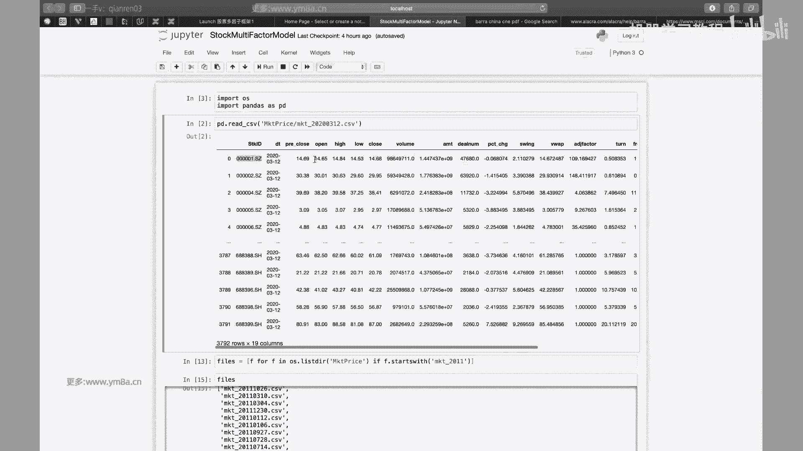

就是我们当前的就是3月12日，收盘价格是14。68。

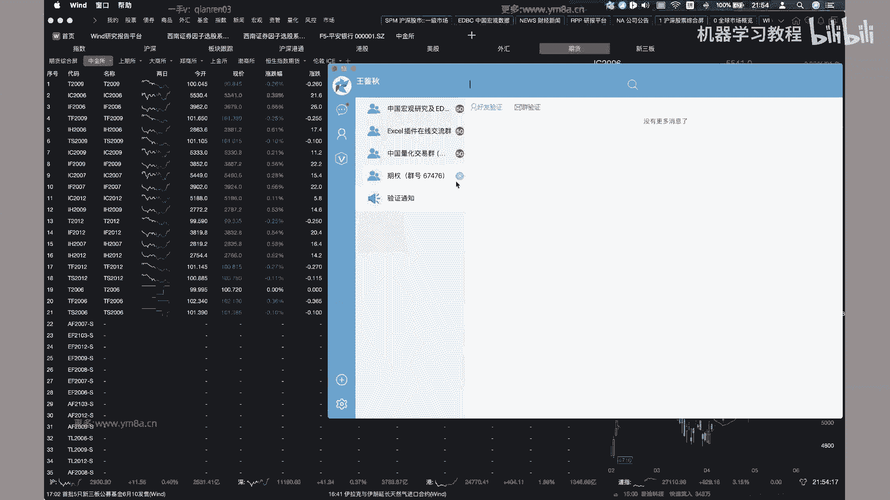

然后然后就涉及到一个，呃呃除权除息的问题，所以我们才会有复权的这样一个概念，除权除夕什么意思呢，就是因为叫stock spits，就同样的来说，我为了市场的流动性，或者是基于种种因素。

比如说我现在是100块一股，那100块一股的话，那整个公司的股东会觉得说这个100块一股，大买一手的话就要啊1万块钱是不是有点贵，那那那我是不是可以考虑说我把一股拆成两股。

那么同样的这时候就变成50块钱一股，那这个时候就说诶，这时候散户投资者会觉得OK之前要买1万，买一手是要1万，但现在只要5000块钱，那那就说我可以，其实说我整个公司的总市值是没有变化。

但是整个整个股票在市场交易的流动性失去，是很容易去增加的，所以大家会去有动机去做这样的事情，对，那么那么那么其实说整个股票，就是说从上市以来，随着股票的价格不断上涨。

那么如果说我不去做这样的spirit，那么它的价格可能说是涨得非常的高啊，但事实上就是说事实上是说，历史上每一只股票，可能多多少少都会去做过一些，不管是分红还是说失去还是去。

还是说是是就是比如说是十送十之类的，那比如说有stock space有这样的出现的话，那那也就是说，其实我们现在的价格并不是反映出真实的，当时并不是反映出当时真实的这样一个啊价啊。

价格我们可以看就是说在这里面有复权方式，我们现在如果是采取不复权的话，呃是这样一个，价格，但是但是一般来说我们还是会去用复权的，这样一个数据，就是说如果说我是向前复权，向向向向前复权的是什么意思呢。

就是说如果是向后复权的话，就是说我按照就是当时的，我按我按照按照嗯平安，就说最刚开始上市的这样一个价格，然后我嗯我我把我把我现在，比如说我现在可能真实价格是14块钱，13块钱，但是我按照从上市的价格。

我去回推到嗯没有分红，或者说是没有配股之前的这样一个价格，我就会得到这样一个所谓的一个嗯，就是说我按照呃就是得到一个向后复权，这样一个价格啊，但是一般来说就是说我们在去做股票的时候，如果你算算收益率。

可能大家嗯，但是就是你这就是说我可以从当中去看出，真实的这样一个走势，但是事实上我就是说我得到的股票的价格，并不是我真实的这样一个价格，所以所以说我们更加就是说在呃常用的，我个人常用的是。

还是说是说就是说向前付钱的这样一种方式。

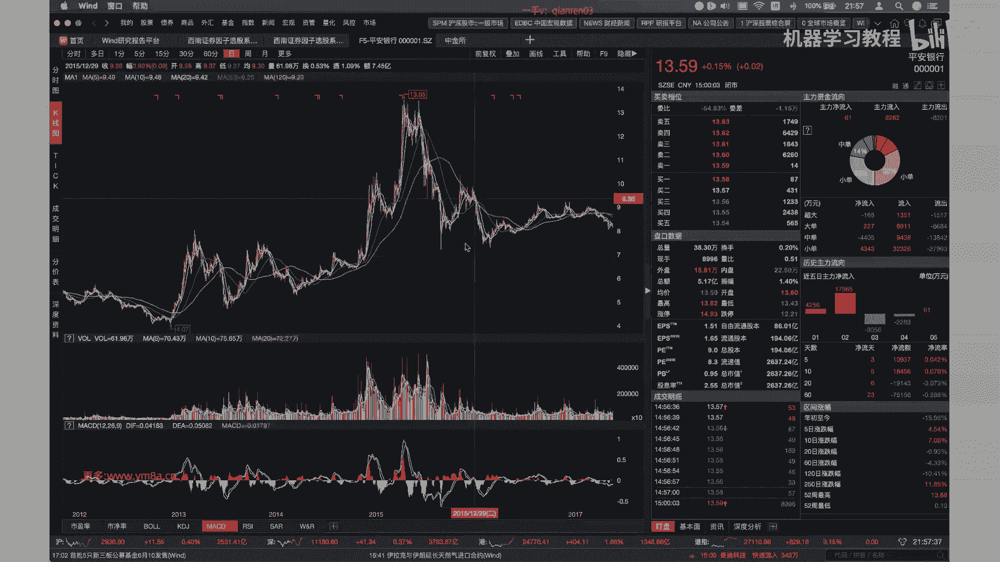

向前复权的方式，说我保留我每天的价格都是真实的，都是真实的价格，但是我去想办法把历史的价格，按照当前的价格去进行去调整，就是说其实向前复习和向后付钱，本质上来说只是对，就是说我参照了这样一个基数不一样。

我目的都是说是希望说我股票的价格，去反映出我真实的历史的价格这样一个变动啊，不然说如果说在这边直接啊直接分红的话，就直接是拆股的话，那价格可能会有一个比较大的变动对。

所以这adjusted factor的话，其实你就是我们这边就是说，如果我们去把这样的一个cos价格是4。68，去乘以它的这样一个adjusted factor，然后就可以去得到说我应该是得到一个呃。

算是一个前夫权的价格对，所以这个是大家要去注意的，然后这边有一个就turn是一个TVER对，然后还有一个free tower是说是排除掉，就是嗯嗯持股5%以上的这样一个股东。

然后是本章是拿一个流通股的股东，去做这样一个通用，因为我们要考虑说它本质上来说考虑的事情是，嗯嗯本质上考虑就是说不同的股票，可能说大股东持股的比例不一样，如果能交易的呃，这个这个其实非常TUITIVE。

就是我能交易的股票占我啊，就是说我今天实际交易的占50，总共能交易的股票是这样一个比例对，要注意，这边是就是这个实际上是应该是这个percent，就是你看这是已经是百分比了。

然后这边train status是可以比较理解，就是说他是是不是正常交易停牌状态对，然后包括就是说是持续了多少天，然后max app2down的话是涨跌停，为什么要有这一栏，就是说我们再去做回测的时候。

如果是涨停以卖不进去，如果是跌停，你卖不掉，这部分就是是回车时，大家注意就比较tricky的一部分，对你要你要去做相应的调整对，然后其实说股票这里面还有一些坑，就是我想一下就是嗯。

对啊就是行业行业变动的问题，对然后包括说有一些股票是退市的问题，其实就是大家这就是处理的时候，有比较多的细节，可能就是大家在待会儿就回去写作业的时候，就是得去额外的去注意一下啊，包括就是停牌的处理。

所以然后一集嗯，然后中证500我不太确定，中证500就是他变更的频率是就中证500，因为可能说有些股票会入会会调出，就是如果遇到这些信息的话，就是大家可以去正好是去，去就是编制指数，刚刚去了解了解一下。

就是说他到底是怎么做的对吧，他其实是剔除了沪深300之后，然后就是前五只股票，然后的话呃就是要去看一下，就是他的就是包括就是它的调整，对，这个应该是，我记得是每半年还是一年会调整一次。

所以这个时候就是嗯，这个时候大家就需要去注意的，就是我回测的时候，历史上我应该也需要去拿到这样的啊，1000名单对，因为如果说我们去，我们以中证500或者沪深300，作为股票池的时候。

以我们选股的就是stop。

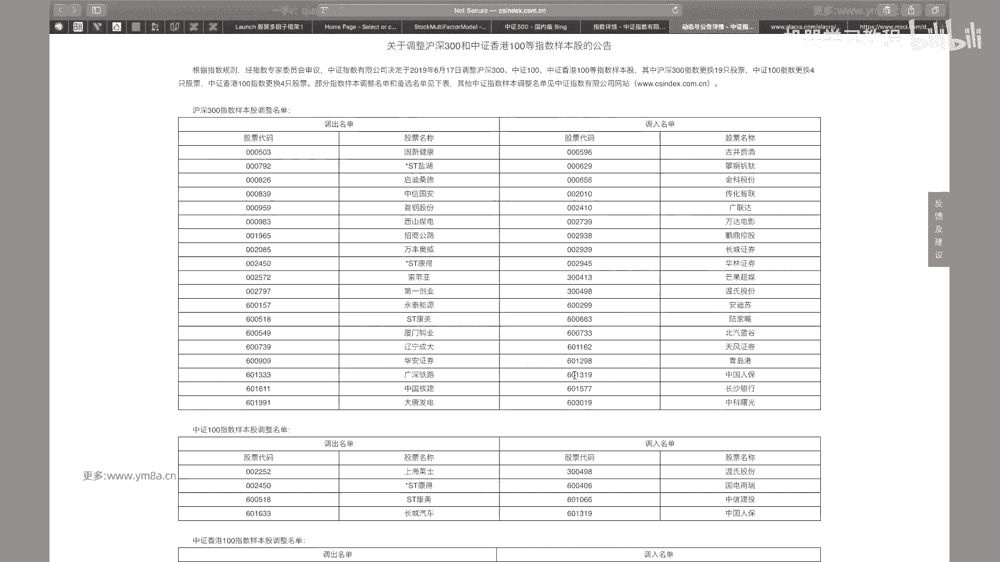

只能是基于这些股票去进行调整，然后嗯。

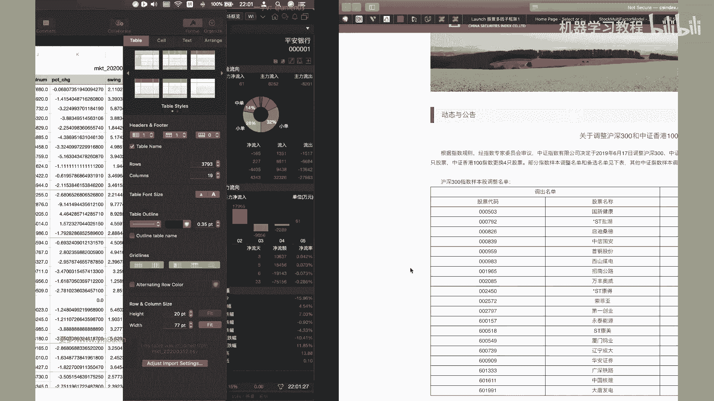

当然当然就是说这里面还有一个小trick，就是说，事实上我不用非等到指数样本调整的时候，才去真正的去调整，因为事实上有些股票已经我们可以大概的确定，就是说他已经不会符合啊。

就是指数成为指数样本股的这样一些条件，他已经不到前800名或者是前300名之内了，那么我们再去调仓的时候，可能是不是可以考虑去去提前调仓呢，就是说我不用非要等到只是公布的这一天。

剩下的这一天才去进行调仓，而我在这说我股票构建，我股票portfolio去构建的时候，我可能提前一个月甚至两个月的时候，就会去逐渐的去考虑去调整这样的仓位了，这个是实际交易过程当中大家去考虑。

当然我们就是说在呃在研究的过程当中，可能就是说大家先去不用去考虑，就是说去不愿意去考虑，我去提前跳槽，我只需要去根据历史上，就是沪深300和中证500的，我每天的股票池是什么就可以了。

对呃这部分也是就是呃可能大家得去自己，就是说把历史上的或者想办法去拿到历史上，就是每一次嗯，沪深300跟中证500调整的这样一个名单。

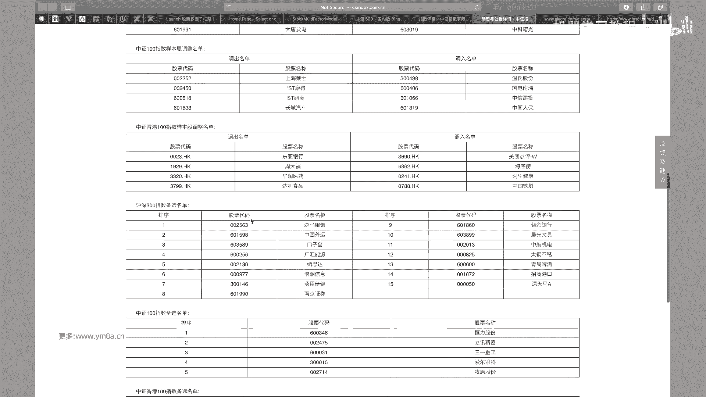

那么大家在选股票池的时候就会要去，其实是去就到了，当相应的调整器是需要去看，就是调整我们的股票的，对就我们计算因子的话，呃，我们比如说我们这次可以按户均300或者，中证500去做，我们不一定。

因为我们实际上要做的时候，不是说针对所有的股票都去算，这样子，我们因为我们的股票池决定了，只能是在中证500内去选，所以其实我们只需要对对中证500进行按，去进行相应的计算就OK了。

我每天实际上做的是一个slice，就是把呃3000多只股票中选取，我们需要的这些股票来进行计算对对，所以可能这次作业的时候。

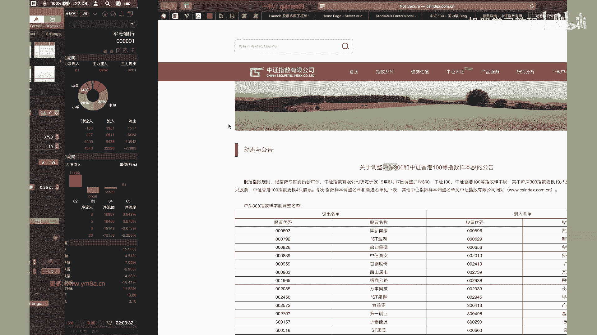

大家会去算因子的时候，可能会发现，就是可能会有一些有挺多地方是需要注意的，就是大家可能都比较小心一点吧，就不像之前的期权或者是期货，就是其实我们整理好了，合约数据相对还是比较简单的嗯。

只要按部就班的去做就可以了，这里面可能大家处理的时候，会有比较多的细节要去注意，然后，对然后事实上就是还有一个就是你看吧，就是如果看看自己计算机，能不能是我这边只漏了一年的数据。

我是然后如果去漏的7年的数据，可能电脑都不一定不一定撑得住，对嗯，嗯这边一年的数据差不多就是52万行对啊，然后反正其实其实说我们去算因子的话，嗯你只需要去啊。

不管你是按照股票作为主index stock id，还是说DTIME作为index，其实二相对来说有了我们之前的这些公式的话，就是说你只要整理好，本质上来说，就算它的因子应该来说是比较好去做的。

嗯对这部分的话就是我会把数据给了大家之后，大家去课后开始去测试一些因子，就呃我们学会基于就是我们今天讲的这样一个，就是这样的一个多因子模型的框架，去来测试一下，就是我们先去完成单因子测试的这样一个部分。

然后尽可能的说如果有可能的话，我们是把它的呃，最好是做一下分层去做一下回测，看看怎么样对就是我们只是再去测一下，就是单个因子的这样一个效果，然后的话对，我觉得今天我要讲的主要的东西就是这么多。

然后关于就是收益模型跟风险模型的话，我们还有下面的课去接着讲今天的这些东西对，可能就是讲的比较多，股票多因子方面的一些东西，但可能coding的部分没有特别多，因为我觉得可能涉及到的东西。

其实之前我们就基本的一些操作，可能我们之前也都讲了，然后如果有什么困难的话，我们下节课呃，再会对它进行，对大家同学们当中遇到的困难进行调整吧，对然后主要的就是我想对。

主要是想补充一些我们可能会用到的一些细节，对，嗯达达还有什么问题吗，横截面上买大的或者小的来评估因子的表现吗，嗯就是就是因子来算出来之后，就是说嗯对你可以这么理解吧。

就是说我们不是把因子说算出来之后去分层嘛，根据不同的层数啊，也就是说分为五层，我们看每一组，我们是上去把每一组持仓的这样一个表现，都去给他去破出来。

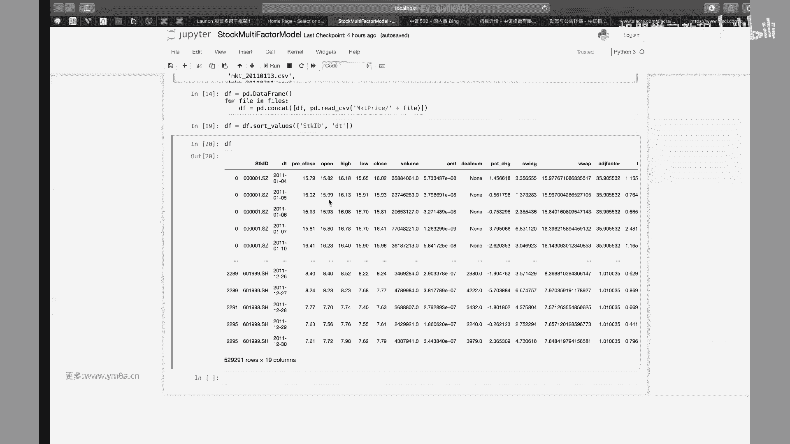

就是啊，就这篇演报里他也提到了，就是，他测试的这样一个结果，诶这个他还没有分层，如果，我看一下他这个，嗯对就理论来说，我们是需要就是说我们分了五层的话，我们是把每一层的收益都要画出来的，对就这样。

我们其实能够看出他是不是这样的一个因子，是不是稳定对，对其实我个人是比较倾向于就是说啊，如果大家有没有基本面的数据源，或者是呃或者是稳定的数据的话啊，尤其是维护基本面数据，其实还是要花挺多功夫。

我个人倾向于是说大家是尝试的，还是就是说去做短周期的量价因子，包括就是说CTA，其实也是建议大家就是从日内开始去做，因为因为呃不仅仅说是数据容易，相对来说容易获取。

因为我们只需要去获取股票的日的交易数据，那其实这样，不管是从新浪财经，还是从其他地方都可以获取得到，然后还有一个就是说因为相对来说呃，数据量比较丰富，我们更加能够容易判断出，这样的一个因子是不是有效对。

而不是说像而不是说像基本面因子，如果我真的是一个月测一测完，那一年只有12次机会，但其实不是特别理想对，嗯OK嗯好的，那大家还有什么问题吗，就这节课可能刚开始是说我讲到讲到这些东西。

可能大家会觉得有点抽象，呃我觉得是比较正常，因为其实我自己之前刚开始看的时候，也是会觉得有些困难，但是但是其实嗯你写一些代码之后，我觉得去，就是说包括说我怎么去对因子做标准化处理，写一些代码之后。

大家可能会觉得对于他有更加的深入，这样一些认知，然后如果觉得还是比较困惑的话，其实呃也可以去参照互联网上，我不确定我不太确定什么各种铀矿，rice框之类的，是不是也有一些比较成熟的就是多音字的模型。

大家可以拿过来对照看看看，因为因为我看到了很多开源的模型，并不是把每一步都做的，然后大家也可以去把它拉起来看一看，就是说就是拿别人的数据给，我们自己构建出来的数据，做出来的因子效果是有怎么样的差异对。

然后他为什么要去做这样的处理，对然后这两篇paper课程应该都是已经发给大家了，对OK所以对，我个人其实是还是说，我倾向于说大家去尝试一下，做短周期量价因子对，因为基本面的数据。

我尽量是在下周的时候给大家准备好对啊，然后嗯基于短周期量价因子，我们其实事实上我们现在已经有了数据，以及也有了相应的基础的知识，是可以大家去做起来的，OK对然后那大家现在还有什么问题吗。

OK先忘记了它里边其实是有这样的含义的，对，Return d t m，然后包括delay，Whatever，对，所以其实不用不用去搜word corso，直接参考它这个就OK了。

就是其实我觉得这个还是挺良心的，就是不像有的研报只是给出来说，我这个印子表现挺好，但至少这个因子是给出来了啊，就是我这个性子是怎么算的，对所以其实大家可以去验证一下吧，对。

然后这里面就是可能涉及到就是啊，这样一个约束，我们下一节课再去跟大家去讲，然后其实嗯对，我们应该刚刚有提到一些就是行业的元素，但是其他的就是说在RCU2，就是那个组合的优化里面。

还没有提到比较多的东西呃，然后想要对多因子模型去详细了解的话。

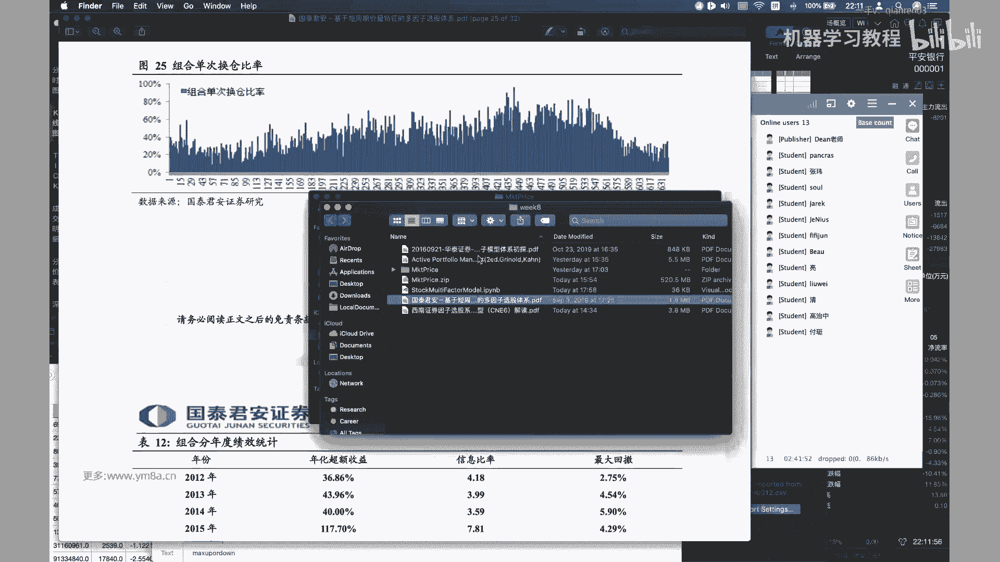

是去看剧本，剧本应该有有有中文叫主动投资，主动投资组合管理，Active folio management，就其实他一点东西还是比较多的，对其实大家也可以看到，就是这部分内容相比。

就是CT里面其实是涉及到了一些，就是可能就是主要是线性违规吧，对于对涉及到比较一些多的统计的东西，然后如果对于同学们对于里面涉及到的啊，多元线性回归，然后稍后统计包括t stars，就是T是什么意思。

那么大家都可以去呃，觉得相应的基础还是要去去学习和补充一下对，然后对其实其他倒没有什么，因为那也不会有太复杂的东西吧，应该就是基本上就是基于本科的，本科的统计的一些东西，我们还是就是记住整个这个流程图。

对，后面现在看着走道去尝试去做这个呃，有效因子的识别对，但其实这两个我们都还没有去做对，还是有挺多东西的，但是其实大家也熟悉一下，就是整个流程，然后里面具体的细节，可能大家真的得花时间去看这个眼光。

因为这个这个断断续续我前后看了好几个月了，对这个也确实是比较经典的一篇研报，然后然后包括他基于后面的一些研报，我也会给大家找出来，然后就是我觉得还是打起来，先先有一个就是最基本的概念。

然后我们一步步的把整个框架给搭起来吧，然后对，因为漫画确实还是属于一个，就是需要大家去不断去迭代改进的过程，不太可能是一蹴而就对，好的那如果就是大家没有什么问题的话，我们今天的课就先上到这边。

好那我们今天课就先到这边，大家晚安。

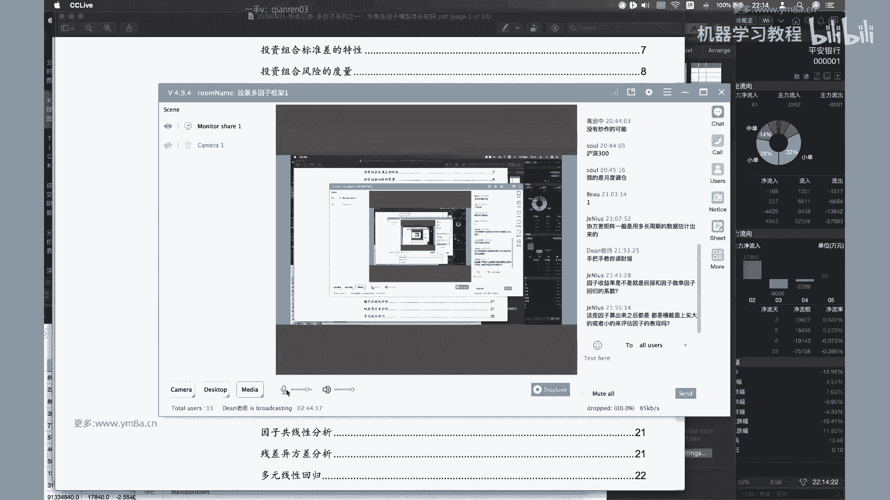