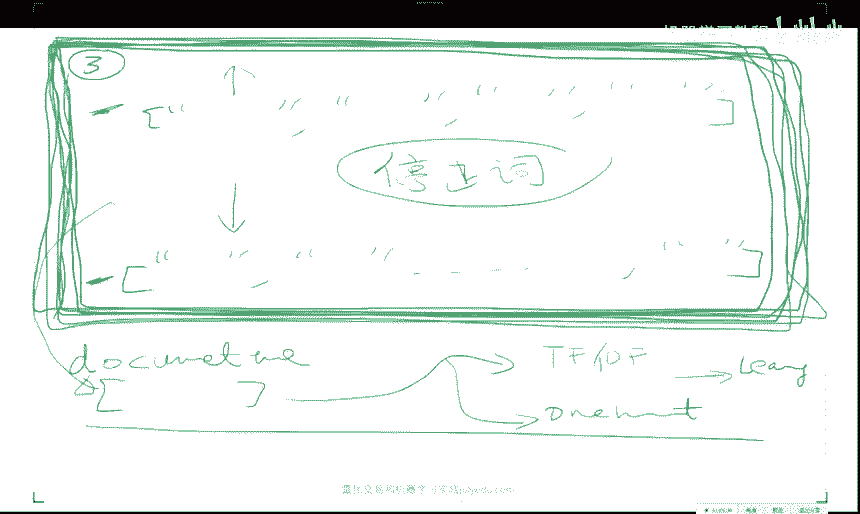
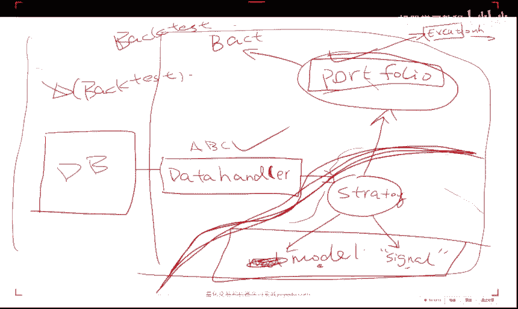
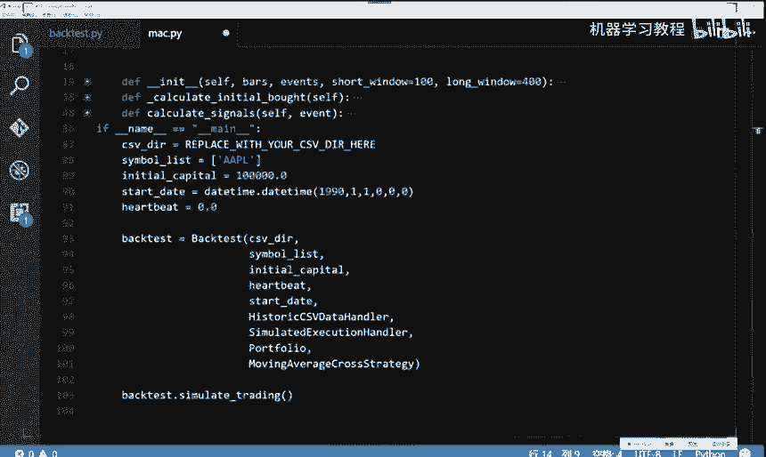
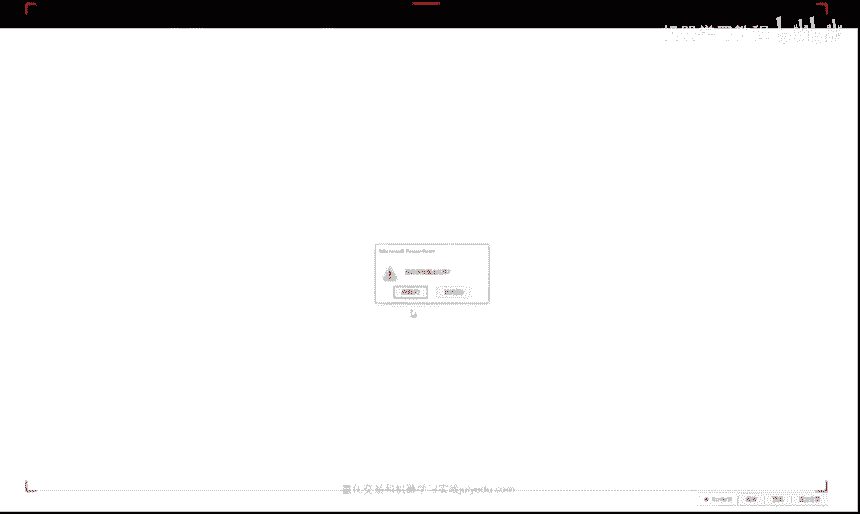
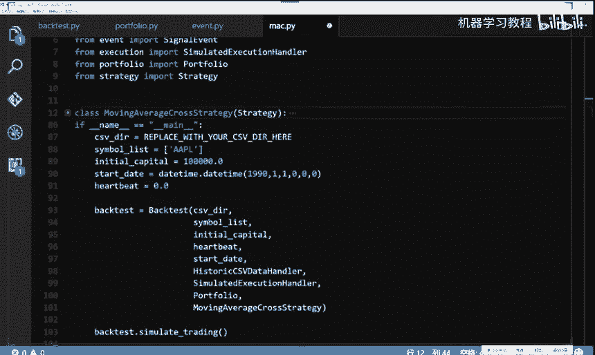
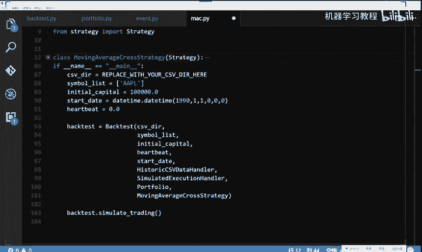

# 26集全！B站目前唯一能将【量化交易】讲清楚的教程！用AI从零开始打造你的交易机器人！大数据量化交易／机器学习／Python金融分析 - P8：08自动交易系统的搭建 - 机器学习教程 - BV1w4421S7Zx

呃关于呃昨天的那个作业，大家有问题没有，就是呃有没有做尝试，或者说啊大家在做的过程中有没有啊，关于建模方面的问题，或者说怎么发现，怎么自己所有的模型R方都是负的啊，这这种情况我希望是嗯不要发声啊啊啊啊。

解压就行了，你你解压啊，用7zip解压之类的，有一个如果你是windows系统的话，有有一个叫7is zip，这个我感觉比WRAR要好用一点，这这个东西，好看来这个小伙伴还没有在做这个数据。

那个数据质量很好啊，那个数据质量嗯，那个数据质量我只能告诉你很好啊，嗯然后呃大家一定要尝试着做一下，然后另外是这样，如果你是比如说是大概啊2000棵树左右的，这个啊啊随机森林奥对，再再说一下哈。

随机森林这个这一这一类的模型，有一个在sk learn里里头，有一个是叫随机森林random forest啊，这个REGRESSOR，另外一个叫做extra extra tree啊。

哎x tra trees啊，Regression，这两个这这个是叫做这叫做完全随机数啊，就是它其实是比随机森林要呃要出现的晚一点，随机森林大概是2001年，这个是差不多是04年还是06年。

然后他他的这个随机因素呢，比随机森林还要更随机，就是他的这个随随机森林，好歹是我每次选出来了根号N个这个维度，在这根号N个N个维度中，我进行了一个贪心算法，选择出来最优的这这么一个啊分界面。

而这个完全随机数，这个叫做呃extremely random trees，叫做ex他他的这个论文引自ex dreaming，就是极度的嗯极度的这个random trace，那么这种极度的随机数呢。

它更能够他对过拟合的这个抗击，过拟合的这个能力，他会更好，为什么他是每一次随机的选择一个维度之后，随机的选择一个点进行分呃，进行这个确定这个分界面，也就是说这样的话，让会它的这个数目。

就是呃长得就会特别的不一样，当你每一个树长得特别不一样的时候，你做一个集成，你就肯定会非常的会非常的不一样了，所以说当你的树要要干得很大的时候，我建议大家用这个啊。

sk learn里头的这个这个呃extra trace啊，regression它的性能，对对不起啊，它性能一般来说会比随机森林要稍微，好那么一点点，但是也是取决于不同的任务，所以说你没有任何理由啊。

只试验一个随机森林，而不试验这个extra trace regreor或者classify，嗯具体的情况还是需要啊，通过具体的实验来做咳嗯SKN出嗯，嗯都都是南派啊，我我建议你用pandas进行IO。

然后你再做这个再做呃，在做机器学习的时候，再把它再从pandas是那个data frame，data frame中选择出来，你所感兴趣的子列，它它本身也就是number派，OK啊。

Random forest requiok，他没有什么区别，但就是一个就就是说根据你的这个呃，任务来看的，你的任务是想回归一个实数，就当你的Y是一个连续的一个数的时候，比如说你要连续的一个实数的时候。

那么你就用这个regression，如果你要分类零一分类的话，你就要用这个classify，就说他的这个嗯对嗯，还有什么问题吗，就是SK2，你要是读它这个源码的话，他就要求大概每一个监督学习分类器。

它要么是一个做regression，要么做一个做分类的，它一般名字后面都是什么REGRESSOR，或者这个classifier啊，对对他做regression的时候，他就是将我这个子空间中的所有点。

求一个平均值，就就是他的这个做的这个啊regression，然后他这个分类就是说我这个子区域中，每一个点啊，每各种类别的它它会返回一个distribution，就说我在这个子空间中啊，一类占99%。

所以我就预测为一类，然后二类占1%啊，但是你也可以，你也可以把这个叫做就是sk learn里头，每一个函数啊，大部分的函数都会有个predict，这个predict就predict就是你真实的。

你想要的那个Y的那个值，你还干还可以干一件事，叫做predict，Probably proper one p p r o b a predict probability。

就是说predict probability，就是你给我一个X，我给你一个给你一个分布，这个分布呢就是说零类占额，零类的可能性是多少，一类的可能性是多少，二类可能性多少，他是会给你这么一个类的这个分布。

你在有些问题中，其实你更需要得到一个分布啊，什么啊，问号是什么意思，在数据上会不会加了很多feature之后，模型预测性能达到一个瓶颈上不去了，是这样，模型的预测瓶颈呃，模型肯定会达到一个瓶颈上不去了。

不可能它永远的能够到百分之百，但是模型到瓶颈的原因有的时候并不是，一般来说不会是你加feature造成的啊，加feature一般来说是好事，而不是坏事，呃如果你想问的是，我目前模型上不去了，怎么办。

当你非常呃很嗯什么都往里加的时候，你最好再再做一种这个特征选择的，这个过程有可能会让你的模型再往上走一点，就是说不管怎么样，你不管加不加feature，你的特征选择这一步啊，最好是要做的。

但是当你选好了之后呢，你就有理由相信啊，我的这种feature啊，再减的话肯定是嗯不合理的对，啊R方值和复制的差不多有这么几个原因，一个原因是你忘加这个嗯这个常数项了，这个截距项了。

另外一个是你的模型啊，under fit啊，它不是特征选择的问题啊，也有可能你的当你的特征是一个极度随机的，这么一个，就是完全跟Y无关的一些一些数的时候，他是有可能的，还有一个可能性是。

你可以尝试比较一下MSE啊，就是当你实在是不知道该怎么办的时候，你想算了啊，因为有可能你数据集中大部分就是你，你所要回归的问题，你的这些Y值它是极度不平衡的，大部分都是零。

那么这样的话你就很可能预测的不是很好，那么在这种情况下呢，你来汇报一下这个MSE啊，也可以嗯，然后这个这个sk learn里头有一个有一个紫的，这个model叫做matrix，Tricks。

今天好像我在群里说了啊，这个sk learn点matrix，这个matrix里头他给你实现了各种各样，你能想到的基本上常用的所有的这个函数，包括了这个MSE啊，这个R方值啊，这个accuracy。

对于分类来说的accuracy啊等等的东西啊，他都帮你啊在这个里头写好，所以有的时候你不一定非要用二放置，你用其他的也可以嗯，还有问题吗，关于作业，关于关于作业，我我是非常希望大家啊一定要做一下。

因为啊其实你嗯在，尤其是在这个呃机器学习建模这这件事上，你做的越多，你这个是你能够真正掌握或者说真正进步的，我认为的唯一的途径就是当你做过几遍之后，你再回过头来再看啊，一些机器学习的东西的时候。

或者说再回过头来再听我讲，就是嗯之前的第二讲或者第三讲的时候，你的感受就会非常深，而你没有做这件事的时候，我无论怎么声嘶力竭的强调一些事情，你也很难啊获得共鸣，所以说我非常希望啊大家一定要上手做一下啊。

这个是嗯应该是唯一的一个途径啊，那么最开始对于初学者，比如说你是从啊金融这边，或者说是从程序员这边转过来的，你对于初学者来说，你嗯把这个pipeline啊走通啊，嗯嗯这个其实就是你的第一境界。

然后然后第一境界之后呢，你就可以不断的逐渐的，让你的这个模型变得复杂一些，然后再加一些你自己的理解，然后在方方面面进行一些改进，同时当你有了比较熟练的这种建模的经验之后。

就是把这条路啊踏踏实实的多走过几遍之后，你就会有意识的去选择一些啊机器学习的啊，材料进行啊钻研，否则一直看的话心里会很虚，会不知道啊这个东西到底能在我的这个经验中，他是地位在哪。

所以说大家一定要做一下啊，深度学习嗯，深度学习的样本也是这样，取决于你的这个神经网络的结构，比如说你的结呃，你神经网络层数比较深的时候啊，数据肯定会多，当你只有一层浅层单隐层的时候啊，上千个就能做。

一般来说啊，当然我这么这样回答，你大概不是很满意，我个人建议来说啊，在啊3万个点以上可以考虑深度学习，但是比如说你只有三啊，两两两三千个数据点，然后每个点大概是一两百维的，你做一个啊三层左右的啊。

神经网络也完全没有问题啊，啊百万数据是可以做的，嗯百万数据你这样你就百万数，你最好用的啊，大概啊四块左右的GPU显卡，训练时间大概会在嗯一周左右，啊差不多是嗯20左个20轮左右的迭代。

batch size在128左右的话，每一轮迭代会耗好几个小时，这样OK在使用boost效果不好的时候，分析提升效果流程大概是什么样的，嗯在使用嗯啊这个问题还是比较比较宽泛的。

因为就是嗯当你一个模型出了问题之后啊，该怎么办啊，嗯那么就是说嗯，首先要就是说你要画出这个所谓的，就是你的这个模型性能的，这个就是说你的模型性能的这些相关的图表，因为性能不好啊。

那就是幸福的幸福的模型啊，性能好的模型总是一样的，性能不好的模型是千奇百怪的，不一样，你要你要你要学会分析这些模型的啊，各种的啊啊分析的这些呃性能指标的这些图表，比如说所谓的啊rock啊。

AOC啊什么的啊，Around the curve，还有这个rock啊，这个大家回去查一下就行，这个很简单的一些指标的图表怎么看啊，以及要分析一下你的积分类器到底是否合适啊。

你是你积分类器嗯嗯嗯嗯的问题，还是你的boost的问题，还是你本身的数据类别不平衡，而你的不你的这个不死算法，并没有考虑到这些因素等等，这些问题来来进行分析啊，CSV数据可以用啊。

我也挺鼓励大家用VN的，你们就用这个RU啊，这个激活单元就行，不要用SIGMOID，SIGMOID不是很好使，嗯嗯就用我给你那个cos也行，或者你实在你说老师不行，就是不就是不想用。

那你用你你就用这个MATLAB，它有一个图形界面的这么一个，神经网络的一个小工具，但是问题是MATLAB它只有单隐藏，这是第一啊，第2MATLAB它不仅只有单隐层。

同时呢它的所有激活单元都是SIGNMENT，就是已经是啊，就是MATLAB的神啊，MATLAB自带的神经网络的这个工具箱，还处在80年代，当然有一个这个MATT康复net，这个这个第三方的一个库。

这个库呢是别人写了一些MATLAB的一些函函数啊，而这些函数呢是支持目前主流的各种，深度学习的函数的实现的啊，但是我建议你要费那个劲儿，你还是用Python的cross就行了，大家都走到这一步了啊。

sk learn都会用的话，科斯应该问题不是很大，OK最后一个问题如果有的话，大家一定要做这个建模的这个作业，我才好啊，让你啊给你更更更多的建议，让你啊获得比较啊更进一步的这个进步啊，嗯对嗯。

那OK那我们看今天的这个事情，OK今天讲这么几件事情，第一啊嗯讲一个极简主义的，NLP与量化建模的这个课程，用我我用我能花费的，我我时间允许允许的最小的时间，告诉大家怎么样用这个新闻数据跟这个框头。

把把它的本质教给大家，因为毕竟在目前这个时代啊，你你参加一些面试啊，或者你要做的一些事情，你跟别人聊的时候，你要是啊不会做这个实在说不过去，毕竟大家啊这个来都来了，那么这一块作为教学大纲的话。

嗯再加上很多同学给我写信的这个呼声，我觉得是还是加进去吧，这是第一啊，第二的话给大会这个风控，我会分分两次课来讲啊，风控我会分两次课来讲，为什么呢，是因为这个这个代码我写课后就会给大家啊。

基于事件驱动的这么一个量化交易系统，今天我就会给大家，因为咱们今天是第八次课了，下周是第九次跟第十次就完了，然后呢这里头的这个代码呢，它是最多的是整个一个小系统，那么如果我下次课再讲这个的话。

你没有时间来看了，所以我希望大家，从今天我给你这这些玩意儿之后，你把嗯嗯，你用一周的时间把我讲的这个系统，你彻底消化掉，然后呢风控的第二部分呢，我会在第九次课，基于这个系统，大家往上加，这样的话呢。

我认为大家的这个吸收会会好一点，所以说今天我就是啊决定啊啊啊啊嗯，把风控拆开，然后把风控拆开之后，挤出点时间来教大家一点，NLP和怎么处理NLP的各种问题，然后最后呢把这个量化交易系统。

这个设计的主要思路，因为大家在没有花一两天时间认真读代码之前，我说什么你也听不进去，我把主要思路先说一遍啊，然后你们用一周的时间看一看，然后回过头来再听我讲一讲，就是再回过头来看一看录像。

然后我们下周啊，周六周天咱们再把接基于这个系统，我再多讲点深的，最后呢再给大家啊，我有多少时间我就讲多少这个案例分析啊，差不多接下来的咱们共同度过的时光，就是这么定义的，OK然后这个CNN啊。

嗯这个同学说的并不是很对，现在CNN啊在NLP中啊用处是很大的，就是说嗯嗯CN跟LSTM，RLSSTM就CN跟RN的话，呃他如果你都在都是做这个磁嵌入的方法，你做分类任务的话。

这两个目前在这个A4LA4L，就是说这个自然语言处理的国际顶级会议中，这两个现在基本上啊做的都有，然后在很多的在这个文本的分类任务上，CN做的不比RLSMRLSTM差多少好，那么关于我今天要说的事情。

大家还还有疑问吗，啊实在抱歉啊，这个事情我给大家加进去了，但是呢这个这个强化学习我实在沸腾不进去了，强化学习一讲开了两个小时就没了，那讲不了其他的了，那么这个风控呢跟这个交易系统代码的本质呢。

只有不讲不行，所以说啊强化学习啊，对不起各位，但是NLP呢，我尽我的最大的能量跟大家说一下啊，啊这个中级班就不知道了，这个看我时间安排吧，我实在是太忙了，今天今天早上这个有有一个super AI会议。

他一个REBUTTLE啊，然后在做，然后中午帮一个公司擦了个屁股，然后下午我跟大家做这个事情，这个啊不能保证啊，OK啊啊没有任务的话，咱们就就开始上车啊，好好，那么今天的话哈对再给大家剧透一下。

今天的话你们就能写出来一个回测系统啊，能够画出来这玩意儿啊，然后能够做各种的回测，就相当于今天你们就有自己的一个优矿了啊，嗯嗯好好，那么现在开始先先说一下这个NLP哈，LP是自然语言处理啊。

而自然语言处理呢，他在深度学习之前的一个时代，它主要是什么语法术啊，什么就是分析，就是比较的注重于这个领域知识，就是跟这个呃计算机视觉一样啊，它跟计算机视觉啊发展的速度都蛮像。

比如说计算机视觉在深度学习这个领域之前，他主要的是非常领域，就是很领域专家的人，他们怎么样来提取一些什么hog啊，还有什么shift啊，就是说他们用了各种各样的奇音技巧。

来对一个图像进行一个feature的一种重表达啊，比如说你搞出一个hog特征来啊，你就牛的不得了了啊，搞一个shift啊就更更牛啊，你基于耗子，你做个SVM等等一些事情，就说就是之前的这个啊啊啊。

计算机视觉跟之前的这个自然语言处理，他们的这些领域知识，比如说他要建立一些语法术啊，还有要运运运用一些，比如说这个这个这个嗯嗯嗯嗯嗯，就是说他有很多就是就是只有自然语言处理，这个呃这个这个社区的人。

他们很感兴趣的一些问题，而现在呢由于嗯表示的问题，就是一一个文本的一个表示的问题，已经不是很大的问题了，所以大家都在就直接的拿来，就是因为这些你想提取特征，这些这是只是中间步骤。

我们最后的问题归根结底还是什么啊，啊归根结底还是分类或者回归什么意思呢，啊给你一张图片啊，请你告诉我他是哪一类啊，如果是车是什么车分类问题啊，对于文文本来说，我给你一段话，请你告诉我啊。

他的他应该处于什么，他的标签应该是什么，就给你这段话，他这应该是嗯嗯嗯新闻类的还是娱乐类的，或者说给你这段话，请你告诉我他是这个啊啊积极的还是消极的，或者说给你一段话。

请你告诉我他是看涨还是看跌的啊等等，当然自然语言处理，还有一个自己的一个独特的任务，就叫做所谓的sequence to sequence learning，就是说我给你段中文。

你给我说一句对应的英文啊等等的一些事情啊，那么但是呢嗯嗯就是说我其实自然语言处理，在量化交易中，它其实归根结底啊，是一个分类或者一个回归任务，因为我们其实只会作为机器学习这个角度来讲。

我们只会分类和回归啊，就是我们会的，我们会的和我们想做的啊，中间就是一个所谓的搞机器学习应用算法的人，就是说我们把我们会什么跟我们想想做什么，设计一个情境出来啊，把它中间连起来。

比如说我们会呃会这个SVM啊，这是纯机器学习的人发明出来的，我们想干什么事呢，我们想对这个金融金融数据进行分类，那么专门搞量化的人呢，就从SRISVM中把这个模型拿来，把我们想做的事情。

应用上有一个比较不错的一个性能体现，这个就叫做搞应用的，搞理论的是什么人呢，搞理论的是啊，我管你应用是什么，我我来搞一个天下第一的这个模型出来，你爱爱怎么用怎么用啊，所以说啊这个机器学习啊。

机器学习是这个计算机视觉跟自然语言处理的，所谓的上游学科，就是说就是说上游就是说嗯嗯嗯嗯嗯对对，就是就是上游的意思，然后啊啊啊机器学习的上游学科是什么呢，机器学习学习的上游学科啊，是啊统计学。

所以说机器学习所用到的数学知识，是跳不出统计学的魔掌，所以你要是真正的想做啊，嗯嗯想做机器学习的话呢，啊啊统那就就所以说所谓的统计学习啊，就是就打这儿来的，就是因为我们在理论分析中用到的数学工具啊。

不会在统计学之外啊，嗯有问题没有，Ok，那我们现在就讲怎么样的对一个文本进行分类，那么我们现在的归根结底的问题就是什么呢，我们归根结底的问题是，首先啊给你一段新闻，这个新闻你可以啊。

嗯一条新闻你可以给它变成一个string，对不对啊，今天早上点点点点点点点点，给你段新闻，我想知道这个新闻，它对股票是看涨的还是看跌的，就这么简单的一个问题，那么大家想想这是一个什么样的一个问题啊。

那么这是一个分类的问题，那么如果作为机器学习中的一个，监督学习的问题的话，我们第一第一件事是干嘛，第一件事是要有一个好的一个表示，就我们怎么重新表示这段新闻，这个是一个蛮关键的一个问题，对不对。

那么今天先给大家先介绍一个叫做所谓的啊，朴素贝叶斯，naive啊，蓝衣服base，朴素贝叶斯的方法怎么样的，对嗯一段新闻做这个嗯，做这个啊，看涨还是看跌的这个这个分类问题啊，表示是什么意思呢。

就是说我怎么样呢，因为因为我你所学到的一个SVM，或者你所学到的一个啊线性分类器，他看到的X必须得是一些数值，必必必须得是new eraco的，对不对，而我现在看到的是一个string啊。

这string你说我把这个UNICODE给他让他学，那肯定学不出来什么明白玩意啊，那么怎么表示这个玩意呢，这是第一步，第二步，假如说我们会一些表示，第二步我如何如何建立训练集啊。

而且我现在给大家提一个要求，我不想人工标注了我，你能不能自动化的建立一些啊，你想要多少就有多少的一个训练集，我考考大家给大家一分钟的时间思考，如果你现在要干这件事情，你老板给你说。

就是我现在再把任务强调一遍啊，请建立这么一个一个对儿啊，X是一段一个string啊，你先不管它是怎么被encoding的，你先不管它是怎么被表示的，Y是什么呢，Y是啊，零或者一。

你怎么自己啊自动化的来建立这个东西嗯，一分钟时间大家想一想，聚类是一个非监督的方法，但是你聚完类之后，你是不是还要人工干预一下，就是说你还得发现啊，这个聚类中心都是看涨的，这个聚类中心都是看跌的啊。

你能不能啊，完全的自动化，给一些涨跌的WORKBACK是可以，但是我现在就假如说啊，你我现在要求你去开拓这个啊，泰国的金融市场啊，你泰文不认识啊，找雨衣库啊，嗯咱们先来一个全自动化的。

就是你比如说你说OK我这辈子没炒过股啊，我只会机器学习怎么办啊，不是我现在的意思是你怎么样的找出这个Y来，怎么样确定一个训练，你就是说已经标注好的这么一个结果，那，嗯词频分析也不好使。

是因为你没法知道这个词频它对应的是涨，还是对应的是跌，语料库也没有啊，你现在只有一个图share啊，已经没有没有啊，仔细想啊，你们想想，当时你你们的进你们的时序数据是怎么建立的，训练集啊，对。

这个同学说的是，其实如果比如说你没有任何，就是你就是小米加步枪的情况下，你每一个新闻，你每一个新闻，这个S它是不是对应一个时间戳的，你每一个新闻对应一个时间戳，这个时间戳，比如说是201啊。

16年10月30日，我有这么一个关于啊，美的啊公司的这么一个新闻啊，不要2016年的，比如说是二0115年10月30号，我有一个美的公司的一个新闻，然后我们再看它2015年，2015年10月。

比如说啊这个啊啊啊啊，今天是10月最后一天了，那就11月1号到11月5号，他的这个嗯嗯嗯嗯嗯嗯，他的这个美的新闻的呃呃美的集团的这个股票，它究竟是涨了还是跌了，那么你就能自己就能建立这么一个非常粗糙的。

但是全自动化的一个训练集了，听明白了吗，当你这个数据量特别大的时候，这种方式就管用了，就是说啊它的本质其实是什么呢，本质是每一段新闻其实它是有一个时间的，每一个时间点我们能获得很多这个新闻，对不对。

每一个时间点是有一个新闻的，而这个时间点他对未来的一个影响啊，你如果看历史数据的话，你是能把这两方面的数据进行一个融合的啊，然后你就能建立这么一个新闻，到股价的一个对应的关系，对了。

那么它的噪声肯定是有的，很有可能这个新闻他什么都嗯嗯嗯，一天正负面的新闻有多少条，有多少条是多少条啊，越多越好啊，因为你还没建立学呃学习算法呢，因为你真正要干的事情是你今天来了呃，一坨新闻啊。

你想知道这坨新闻中每一个新闻对，你想计算一个指标出来，放到你的这个feature中啊，或者建立一个纯粹基于嗯嗯，新闻或者公告的这么一个分类器，啊新闻都是孤立样本，没有没有关系啊。

嗯嗯你的标签就是你的这个tag嗯，就是你的这个它对未来股价的一个影响，对，就是说你凡是只要是你有了这么一个对应关系，你机器学习的你你你会干的这些事，跟你想干的这些就你会干的。

机器学习中的所有东西你就都能加进去了，包括权重啊，包括各种各样的啊一些事情啊都可以，你都可以做进去了，这是一大类的一个方法，嗯嗯是这样，这个是一般来说是关于个股的，嗯你这样做是可以的，比如说关于嗯。

就是当你的这个数据量足够大的时候，有的时候比比比如说今天的这个个股，它的负面消息会很多，他负面销售会有很多，会让他的这个啊股价一下下去了，很可能他今天会有一个比较啊，比较正面的一个东西。

但是它并不能影响，并不能影响这个啊这个下行的这个区这个趋势，当你这个数据量足够大的时候，你今天来了一坨，你就能预测出来它是好是坏的嗯，这是最懒的一个方法，当然如果你嗯呃有人力。

物力能够进行一定量的人工标记，会大幅的提高你的这个分类器的性能，关于这个setup大家还有问题没有好，那么我们现在就看看一个最简单的，一个最简单的一个啊分类器，它是怎么玩的啊，而且非常有效啊。

非常有效啊，啊等一下我看看啊，就是说他是这样嗯，哎我把这个你们稍等一下哈，嗯让他永远处于，因为我现在搞了一个这个双屏的，我让他一直在前面，这样的话我能看到你们的这个留言会比较好好。

那么naive base，它是什么呢，啊大家有没有接触过图模型啊，啊如果没有的话啊，如果从图模型的角度来说，它是最简单的一类图模型啊，就是说他的这些每一个X啊，从图模型的角度来看啊，他就是这个玩意儿。

如果你没听说过图模型的话，就没关系，你就当我什么也没什么也没说，那么啊他是这样，他是这样嗯，很很简单很有效啊，很简单很有效，OK嗯嗯首先我们需要建立一个字典，就是说比如说我们的这个嗯一个新闻库吧。

比如说你有S1啊，这是一个新闻啊，有个S2啊，这是一个新闻啊，它里头有什么叫我们啊，啊什么等等等等的一些一些词，然后一直到SN，他这是一个新闻图示里头已经有，对不对，那么你有这个新闻之后呢。

啊你要干的第一件事情，你要先分词，因为尤其是中文，中文的分词很麻烦，就是说你先要把这些玩意儿得得，把这词儿得分开成一个词儿，一个词儿的，那么那么这个中文的分词本身就是一个啊。

嗯自然语言处理的一个蛮难的一个问题，但是呢有一个啊有一个这个包叫结巴啊，你们就你们就你们就pipe啊，Install，结巴就行，是一个结巴分词的一个东西，什么意思呢，就是说啊这个接这个结巴。

这个玩意儿有它能干什么呢，你给我一个字符串啊，我给你返回这个字符串，分好词之后的一个list，啊啊看来有同学是专门吃NLP这碗饭的啊，很很好啊，咱们组的这个背景都非常的，都非常的广泛。

那么就是说我们给他分词之后，我们就会建立一个，然后我们对对这个语料库中，所有出现的可能的词，我们是不是就会有一个字典，这个字典比比如说比如说这个字典哈，比如说就是说我们对这个语料库中，我们发现啊。

这这些词大概一共有8000个啊，8000个词啊，包括了我们啊，包括了这个啊，今天啊包括了这个啊，他们啊啊等等等啊，大概有8000个词儿，那么我们我们怎么表示啊，怎么表示这么一个表示一个新闻呢，啊很简单。

比如说是一个啊这个啊八纤维的一个词哈，如果是一个八纤维的一呃，嗯嗯如果是八纤维的一个词，那么我们就用一个one hot encoder的一个方式，那么就是它是一个8000啊乘以一的一个向量。

如果这个今今天这个词出现在这个新闻里头，那么它它对应的，比如说今天是我们这个字典中的第啊，第2000个，我这个今天的id就是今天的id，如果是这两天，那么它D2000个元素X2000啊，就等于一啊。

如果这个第1999个词，在这8000个词库里头，就是8000个词库里头的，第1999个没有出现，那么X1999就等于零，那么我们就会以一个非常稀疏的一个啊。

一个啊PREDICUL了一个非常稀疏的一个document啊，来就这个document，就这个news啊，你叫news吧啊，这个news你就能给他啊，表现成为一个8000×1的一个向量啊。

有问题没有啊对吧，那么但是我们要干的啊，当然你这个事情还有一个事情是什么呢，是这8000个词儿，你要先把一个叫所谓的停止词先去掉啊，什么意思呢，就是在嗯各种语言中，什么DDD呀，什么嗯。

就是是啊嗯就是各种的非常常见的，没有任何意义的啊，这个亭子池，你就不要放到这个这个这个特征表达的，这个向量里吧，因为嗯每一个文档都会或多或少的出现这些词，而这些词呢对一个嗯。

嗯对你这个呃是否会影响股价这件事情，他是没有任何啊啊积极或者消极的作用的，所以说我们要建立一个这个这个这个文本的，特征表示之前呢，我们要先把这个停停止词给它去掉。

就是说把这些常用的一些词去掉，因为有一个叫做所谓的哎抱歉哈。

因为有一个所谓的叫做这个幂律定律，就是这个幂律定律它说的是什么呢，这个幂律定律它说的是啊，真正啊你你你你一个文档，真正值钱的这些词的词频是非常低的啊，他大致说的是这么一个事儿。

就是说如果我们要统计统计我们的词频的话啊，如果我们要统一啊，统计一个语料库的这个词频的话啊，常常见的这些词基本上都是无意义的，而它出现的这个频率极高，然后一个文档就一个文档。

真正的这个新闻跟那个新闻不一样的地方，都是在尾巴上的这些词频啊，它不一样的，而前面这些嗯嗯嗯嗯嗯非常高频的这些东西呢，你把它全砍了都没关系，而真正的有价值的这些东西呢，往往呢就在那几句话和几个词儿啊。

而每个文档呢就是在这几个词上啊，不一样的，造成了整个文档呢啊意义上的不一样啊，OKOK啊，OK那么我们现在就会啊，首先我们现在会表示一个X了对吧，这个X就是一个，的这么一个向量。

而每一个向量的这个意义代表的是是否这个词，是否这个word，啊是否这个word啊啊出现了啊，啊那么我们有了X之后呢，我们就能建立一个啊啊，叫做朴素贝叶斯的一个模型了啊嗯好。

那么我们现在看看这个朴素贝叶斯模型，他说的是什么啊，有问题没有啊，嗯嗯好好，那么比如说假如说我们的这个X是8000维的，没有问题吧，比如说就是就是说我们一共有8000个词儿啊，假如说我们是X是八纤维的。

其实那么就是我们这个X就能表现成X1啊，X二一直到X8000，每一个xi呢它是零或者一的对吧，这是我们刚才你就简单的做一个文本的预处理，我们就会得到这么一个八纤维的这么一个向量。

而这个我们要干的事情是我们要计算一个概率，这个概率是什么呢，这个概率是嗯就是说我们的模型假设啊，这个叫做模型假设，刚刚开始学这个概率图的时候，很多人就会忘了什么是什么是什么，是假设和什么是嗯甲甲怎么写。

甲，模型假设是这样，我们的模型要假设这个如果given一个Y啊，就是说当我们知道了这个Y应该是看涨的啊，就是说Y是我们的这个类别啊，Y是我们的类别，given我们的Y我们的这个X的概率是是多少。

就是说如果就这个叫做所谓的生成式模型啊，嗯嗯嗯嗯嗯就是该问一个Y，就是咱们先想他的这个问题的反面的这个问题，就是说给问一个y given一个看涨的一个文档，那么一个看涨的一个新闻啊。

他这个X呃呃出现这些啊，嗯啊就是出现这个X1到X5000啊啊8000啊，这些的概率它应该是多应应该是多少，那么这个是我们的想求的一个数，而这个模型假设它假设的是什么呢。

它假设的是这这8000个变量的这个联合，分布的一个联合啊，一一个条件概基于呃，呃应该叫做conditional啊，Joint probability，就是说啊条件的联合分布模型。

假设成为他们简单的这些基，就是说X1given y乘以probability of x2given y，点点点就是就是把这个联合分布拆开，成为了成为了8000个独立分布啊，可以问Y什么意思呢。

就是说嗯嗯嗯嗯，就是这个公式的意思啊，也不能也不能再简单了啊，嗯他们假设的是什么呢，假设的是X每一个xi跟这个啊probability of x啊，就是每一个probability x xi。

given y跟given x j就等于probability of xi given y，就是说我的xi跟XJ是条件独立的，就当你given y的时候，如果用概率图模型来表示的话呢，就是嗯。

就这个东西这个是X1，这是X2，这是X啊，N这个是Y就是说当我given y的时候，我的每一个啊啊X它是互相独立的，那么这个为什么是naive的呢，naive的意思就是说。

其实真实社会中并不是这个样子的，就是说嗯就是说他们之间是有关系，就是他们他们之间其实是呃呃在很多情况下，他们是相关的，但是问题是在啊，很多自然语言处理的这个啊分类任务中啊啊啊。

实践啊证明这个的分类效果就已经很好了，尤其是比如说垃圾邮件的分类器啊，用一个naive base啊，就会啊就已经很好了，你就不需要再上更加复杂的啊一个模型了，就是说这个条件。

这个条件的独立假设是我们的这个assumption啊，当我们相信这个事情成立的时候，这个这个等式它就成立，而为什么我们要相信这个事情成立呢，是因为我们呢能够大幅减少这个模型的参数，空间啊。

立马就本来是啊二的8000次方啊，减一个，因为你要把这个联合分布写出来，它它需要二的8000次方减一的参数，而现在一下就降到了多少，降到了8000个参数了，你就只需要学这8000个参数就行，什么意思呢。

他意思就是说如果如果这个新闻是看涨的，那么这个啊这个这个这个啊啊这个这个啊，证监局啊，跟这个啊派息这两个词儿，他们是互相独立的，没有问题吧，好那么如果没有问题的话，那么我们来看一下啊。

我们如果知道了这个东西，我们其实我们的终极目标是什么，我们的终极目标就是我们在做预测的时候，我们想知道的一个东西是，这个东西是我们given一个X，当我们得到了这么一个，当我们得到这么一个文本的时候。

我们想知道Y等于一的概率是多少，对不对，这个是我们想知道的，我们做预测的时候，做做预测的时候，我们是要预测这个概率的，而我们现在嗯模型建立的是什么呢，是反过来的这个东西啊。

当我们given y等于一的时候，X的概率，这个我们啊是能求出来的，怎么求啊，很简单啊，你看一下啊，probability of呃，Y given x，那么我们就简单的在这个嗯。

在这个你的这个语料库中数一下就行了，比如说嗯对好，我来在这写一下吧，probability of x1Y等于一，这个怎么求呢，你比如说你的语料库中一共有N条新闻啊，N条新闻中看涨的一共大概有啊。

不要N了，比如说一共有1万条新闻啊，那么看涨呢大概有三三千条啊，那么你就你就数一下，在这三天嗯嗯在这个3000个文档中啊，在这3000个看涨的文档中，X1这个词出现的次数是多少。

比如说X1IXC这个词出现了300次，那么这个东西就是0。3，所以说我们就这么简单的做一个，做一个数数的话，我们这个概率是能算出来的，是能啊啊对ml就是叫做嗯你嗯对是0。1对啊，是0。1，抱歉啊，0。

10。1口误，数学不大，好不好意思，嗯对吧，那么就是说前面的这个概率我们是能算出来的，就是能学出来的，你你数据是什么样，我们就我就能给你一个这个东西，对不对，那么我们现在知道的是这个东西。

我们是可以认出来，对不对，他是LEARNABLE的，我们LEARNABLE这个东西，但是我们做预测的时候，是我们拿到一个新闻数据，我们想知道它它是一的概率是多少，我们怎么办啊。

就用传说中的这个贝叶斯定理就行啊，贝叶斯定理他说说的这个东西，贝叶斯定理他说的是probability of a，given b啊，等于什么等于啊，Probability，Probability of。

你把这两个换一下啊，你把这两个换一下，就是probability of啊B啊，given a啊，乘以啊，probability of啊啊of a啊，除以什么呢，除以probability of b。

就用这个贝叶斯定理，你把这个贝叶斯定理啊进行一个使用啊，你就能你把它你看你，你你就你就能把这两边一交换，那么就是probability of x啊，given啊。

Y等于一乘以probability of啊啊Y啊等于一啊，除以什么呢，除以这个probability df x，而这一项是常数项，是因为什么呢，当你要计算proposity of y等于零。

given x的时候，它这个它这个分子也是probability of x，所以说你要你，你比如说你要计算你来了一个新闻文本看涨啊，它的概率跟来一个新闻本看跌，他这个概率你要比较一下，对不对。

你但是你要你你你如果是多分类的话，你就要呃比较哪个概率更大，你就预测为哪个，但是你不管是啊多分类还是单分类，这底下这个分子都都是一样的，所以你只需要计算上面这个东西就行。

也就是说你只需要去用propriate of x，given y等于零，或者probability of x啊，给了Y等于一，然后probability就是计算这两个项，它们的值就行，而我刚才说过了。

这两个项怎么计算呢，嗯这两个项怎么计算这个东西啊，很好计算啊，1万个文档中3000个看涨，他就是30%啊，这个东西怎么计算，我刚才说过了啊，就是简单的这么数一下，把这8000个数乘乘起来就行啊。

那个properly l y等于零怎么计算，其实跟他一样，那么其实就是一减30%就行啊，这个东西怎么计算啊，一样你再把它跑一遍啊，算一下，看一下哪个高预测哪个啊，听上去很简单啊。

简单到令人发指的这么一个模型啊，他在对新闻文本的分类数据上做的是相当不错，尤其是如果你比较勤快一点，标注一些啊，就是你真正的标注一些哪些新闻是看涨的话啊，这样做的啊效果是非常好的，而且有几个建议。

第一啊，不要从论坛上趴，论坛上的噪声太大，这是第一啊，第二的话呢，嗯如果是一些国家性的这些政策性的文件啊，对于宏观经济的这个走势的，这个判断还是比较准的啊，关于有呃关于呃奶油base有什么问题没有。

OK啊，新闻从哪爬，第一图片里头有啊，第二呢啊什么雪球啊，一般来说如果你非要爬这个论坛上的东西的话，目前好像嗯据我所知啊，主要都在雪球网上啊进行爬，在其他在微博上。

一定不要想微微博上的这个噪声实在是太大了，然后图sh上我给你的那个啊金融金融数据上，它有一个有一些呃啊啊啊啊新闻数据啊，就是有一些金融方面的新闻数据，但是你如果要做一些啊你自己的事情的话。

就可以在其他的一些，其实雅虎金融跟新浪金融也都可以啊，因为因为我记着图示上就是爬的是新浪金融啊，对如果没有的时候呢，叫要叫做一个所谓的拉普拉斯平滑，就是说如果比如说你0÷0了啊，怎么办啊。

你硬加个一就行，或者加一个常数就行，这是一个理论上能证明他有些好的性质，但其实是为了事后诸葛亮来解释，这样做，你大胆的做吧，不会啊，出门不会被雷劈了啊，你就这么做就行，这个是呃文本分类。

能够真正的进行商业化应用的第一个好例子，就是我们的每个邮箱的这个垃圾邮件的分类，它是垃圾，它不是垃圾，它是垃圾，它不是垃圾的，第一个最商用的一个很成功的例子，就是基于贝叶斯啊，继续拿一部分叶斯做的。

在这个之前好像还不是特别特别著名的，就是嗯嗯所谓的啊杀手级的应用还不是特别多，好像啊好，那么稍微简短的再说两句，深度学习怎么玩这个事，嗯深度学这样就说我们首先要做要，先做word vector啊。

这个是非监督的学习啊，这个这个就比较爽了，就是说你当你分词之后啊，当你分词之后，你对语料库中的这些词儿做一个非监督的学习，非监督的学习之后，你会有这么一个embedding的这么一个一个函数。

你可以把它看作一个黑箱，这黑箱能干呢干嘛呢，输入一个词就输入一个xi啊，比如说这个词是什么，输出一个300维的一个向量啊，当你有这个向量之后呢，你基于沃土啊，vector你就能对。

比如说嗯你就能比如说对对一个新闻标题啊，对啊对于一个新闻标题，你就能你就能把一个新闻标题给它，表达成一个矩阵啊，对一对一段文本吧，表达成一个矩阵，这个矩阵的每一行是一个词儿啊，这个矩阵的维度啊，行行数。

一般来说就是说比如说你可以给它固定规律，就是每句话都得是啊30个词儿，那么就是30×300维的一个矩阵，那么如果这句话只有20个词，你就剩下的这些词你给它补零啊，那么那么就是说啊。

你你你你现在就会有一个比较比较高级的，这么一个表示的方法，这个里头是每一个词儿，比如说我们啊我们是一个啊300枚的向量，今天这又是个300枚的一个向量啊访问，然后这又是一个300米的向量。

有了这个之后啊，我们对它做这个卷积神经网络，你就可以把它看做一个图像了啊，对它做检验神经网络的一个关键，就是你这个filter啊，你这个filter的大小的这个宽度，一定要是你这个词儿的长度。

因为你如果这样做卷积就没有意义了，因为它每一行是一个独立的一个个体，对不对，它每一行是一个独立个体，你要做卷积的时候，你这个filter必须得是啊一行一行的来，或者一呃两横两横的来。

然后你再对这个这句话来做一个深，你就能把模型你就能做深了啊，不是大家先大家先聊这个，先聊课这个沃尔图vector，大家有问题没有，就是说就是说基于深度学习的这种标注啊，大家有问题没有。

这是我要讲的第二种啊，第二种常见的范式啊，OK深啊，其实document to vector，最简单的document to vector就是一种很naive的呃，一个嗯一个把这些词的一个加权平均啊。

比如说这个文档中出现了80个词，我把这80个词的what to vector，我求一个平均数，那么这个效果不是很好，但是基于深度学习。

现在有一个比较好叫skip soft skip salt t h o u g草，skip soft model啊，这个你可以把它看作一个黑箱模型，就是输入任何任意长度的，输入任意长度的一段序列。

输出一个四零啊，呃4800维的一个向量啊，这个就很酷，这个就相当于什么这个这个就相当于一个啊，克雷奥的word vector，它其实相当于什么，它其实相当于一个sentence to vector。

那你一个sentence，你把一个document看成一个很长的sentence，那么它就是一个document to vector，我不是很建议用document to vector。

因为它的这个性能不是很好，你就直接呃你呃呃但是你要你要你你要用也行，因为嗯嗯嗯就是说你啊可以首选这个，就是问题的嗯呃如果你要走深度学习的话，这个词频其实是嗯呃他其实考虑的嗯，它其实是有词频的。

因为比如说嗯这个词出现了一次，这个词在这又出现了一次，那么这两行它是完全一样的，那么它啊对，深度学习在这方面的优势，当你的数据量极大的时候，他的这个分类的这个准确率会高，比如说你有一个非常棒的一个。

新闻的一个语料库，你做做深度学习来做啊，来做这个情感或者分类分析的话啊，它的效果会好一些，里面的卷积好，里面的卷积怎么了，并不是啊，建议的是用word vector。

然后用word to vector之后，你建立这么一个矩阵，就是把一个一维的这么一啊，一一些话建立，建立起一个啊二维的这么一个一个矩阵，然后在这个矩阵上，你把这个矩阵就当做一个图像，你就你就走卷积就行。

是类似图像的处理模式，只有一个小trick，就是说我这个filter，我这个卷积的大小，长得要是这种就是长得是必须得啊，cover掉整个的宽度的唯一一个地方不一样，其他地方都都蛮像的，我回头给大家嗯。

嗯上传一篇paper，就是关于怎么做这个的问题，啊不一定这你无所谓，你可以把它，你可以把一条新闻看中一句话，你把句号全去了，这没这没有问题，然后第三种加人工干预啊，我我说一下现在业界啊业绩怎么加呢。

你这样你你要维护一个列表，你维护一个看涨的一个列表，这个是你自己维护的，你自己定义一些词，你问一些老中医啊，你自己定义这么一个词，你在你在维护一个看跌的一个一个词啊，这个东西啊各家各家都不一样。

你有了这么两个啊，你自己定义的这么一个两个列表之后，你来一个新的一个文档，一个document，你在只只只只用你这两个列表中的啊，出现的这些词儿，对这个document的做，你想做的任意的这种编码。

TFDF也可以，用这个one号的也可以啊，然后你再做这个learning的这个过程，是这样啊，100个字截取前面五个字，是这样，首先要去去，首先要去掉停止词啊，就是说停止。

停止词的意思就是说把那些废词全去了，怎么今天上午啊啊，就是这这这种词儿你要全去了，然后呢对嗯注意，我现在说的这个其实还是蛮重要的，因为我刚才说的那个是全自动化的一个东西，全自动化的肯定是没有。

你有一点人工干预的一个事情要好，你们自己维护一个嗯，具有专家知识的这么一个表，你觉得哪个词，你可以就是说做这个事情其实很简单，你自己挑出来100篇新闻，就你自己挑出来100篇新闻。

你请比较好的一些分析师，你让他来说，请你把你认为的关键词儿给我画出来，他就会给你画出来，画上个100篇啊，你就会你就会有一个蛮丰富的，一个你自己的一个列表了，有了之后呢。

你基于你这个列表再对你这个document做一个重表，示，你在玩这个事情啊，给大家3分钟的时间提问啊，就是关于我今天说的呃，上半嗯嗯嗯是是头一个小时的问题，大家嗯OK我NLP就不讲了。

就讲到这了，大家可以提问啊，好人工形成的词表给予更好的权。

不是你只看人工形成的这个词表，就是说你把一个文，比如说你来了一个新闻，你只把这些是否出现了人工词表中的这些词儿，摘出来，然后把其他所有词全部看作停止词，对这个会有一个这个呃就这个呃。

任远航同学问的这个问题，就是说他会有一个每一嗯，嗯如果用你这种处理方法的话，它它它的长度是变长的，变长情况下要么就是切，就是说你你切掉一些，权重的不同是学出来的嗯，矩阵位数过大或额会额。

你可以考虑成一个数，就是说会啊，数据维度高的时候肯定会有各种的问题，所以说你们还是可以先从简单的啊入手，我在最后一节课的时候，会跟大家分享几个别人是怎么做的，嗯的这个报告，就是说我大概最后一课会啊。

5分钟分享一个案例啊，分享两个小时啊，把所有的事情争取给大家，就是让大家多看一看，各种各样别人做的各种各样的方法，好啊，你问啊啊啊，是这样，what to vector是你最好是在一个极大的一个东西上。

训练好之后，你就用就行，因为你这个表示，你毕竟还要再再进行二次的学习，表示只要不是太差就行，而且同时我个人不建议啊，自己就是说在深度学习里头有这么一句话，叫登特比尔hero，就是嗯，就是你别逞强啊。

最好用别人训练好的what to vector的模型，它并不是就是说一般来说你可以，你在一个很大的一个数据上，你把what to vector训练好之后，你就你就把它当做一个字典就行了。

当做一个黑盒就行了啊，就是有一个词我给你个向量，有一个词给一个向量啊，最后肯定会推荐一些好的论文的，然后今天是呃也是刚才在课前按照承诺，我上传了上周呃的那个呃一个关于遗传算法的，非常好的一本小书。

网上没有，大家就别放到网上去了啊，别便宜了那帮小子嗯，中文的有啊，中文的啊，海国纳跟搜狗好像开源了，分别开源了两个，他们自己的中科院的好像也开源了，开源过啊，这个啊你们查一下，应该应应应该会有的好。

那么我们现在看接下来的这个，接下来的这个这个东西嗯，是这样，接下来大概要讲两个事情哈，一个事情是我们怎么样的定义一些performance，就是说OK你现在你是你牛逼，你预测出来明天涨还是跌了。

但是嗯OK你明天你你你你，你知道你明天啊要涨多少啊，然后呢然后你是把你嗯全家身当都压上去呢，还是你甚至再用一定杠杆再借点钱，再来再来炒股呢，还是OK我就嗯我就拿出我的百分之啊，30的钱啊来炒股啊。

这个问题怎么回答啊，另外就是说呃你呃如果看涨，你你要买你买多少啊，这种问题呢都属于这个所谓的策略问题，而这个问题呢，嗯如果你不用的这个这个强化学习的话，你这个这个是人工定义的。

嗯就是说如果啊如果啊在在考虑非啊，在非这个reinforcement learning这个setting下，你的这些strategy啊，是是一个嗯嗯user define的一个东西。

而这个SI就是说嗯他其实嗯嗯，但但是你在做这个实现的时候，其实它是有两个事的，一个事所谓的这个model啊，另外一个事儿，就是说嗯嗯你要所谓的create一个signal啊。

就是说这个买还是卖的这个东西啊，就是你的这个你你你的这个你的这个信号啊，跟你这个model它是两回事情，这个事情是满积极学习的一个事情，而这个事情呢是满啊金融的一个事情，好我们今天呢先看第一部分。

就是说我们要create signal，我们第一部分我们该怎么弄，然后呢我再介绍一下嗯，嗯我给你的这个平台，然后呢，下一次呢我们再基于这个平台再开发一点，比较有意思的一些事情啊。

接下来的时间我们就这么度过啊，有问题没有，那么首先我们先看这个，就是嗯就是我们怎么样的度量，怎么样我们度量一个策略的好坏呢，一个一个策略策，怎么写一个策略啊，这个其实大家都很清楚啊。

嗯你在任何的一个在线的量化交易平台中，他都会给你返回各种的策略的度量的方式，而这个策略的度量跟我们模型的预测，是两个事情啊，这个我强调过了，模型的预测，会告诉你它以百分之多少的准确率啊，啊预测对了。

未来，这个是模型模型的度量，而策略的度量就会落实到钱了，就就会落实到，比如说啊有各种各样的这个这个度量的方式吧，这个PNL啊，就说你的呃这个这个啊啊这个偷偷啊，perfect loss啊。

还有这个就是等等的，在我在第在第一节课的时候，给大家说了不少的啊，这些度度量的方式啊，就包括了这个啊这个LOS啊，wind啊，这个ratio啊，还有这个等等的这个啊，比如说这个average啊。

average啊，parrot啊，平均的这个PNL的这个时间啊等等，还有最重要的一个是risk，我我们怎么样定义我们的一个投资的，一个风险啊，大家一定要记住一个事情啊，在金融领域或者说在量化领域。

风险这个词儿它跟谁是同义词啊，大家想过没有，就是我们数学有一个公式专门刻画风险，OK波动性的数学，它对应的这个数学是什么，Ok uncertainly，它对应的哎对variance说的很对方差。

这两个是同义词，就是说风险就是方差，什么意思呢，就是说因为方差你是有一个期望值的，这个这个是你的期望值，期望值，它的这个方差，就是说我我就你承诺你能给我100块钱，但是你的方差很大的话。

就是你有时候给我150，有时候只给我50，那么这种情况下呢就叫做风险大，风险小是什么呢，我说给你100，我一定不会给你101块，我也一定不会给你99块，我一直都在很小的一个区间啊，在做这个事情。

那么这个方差呢刻画了，就是说呃呃如如果用比较文科的一个词，它叫它叫风险，如果用一个比较理科的一个词啊，它就叫方差，而而大部分的这个就是说，而而而对于就是说对于方差的这个分析呢。

其实是啊我们这个啊啊做这个做做这个呃，就是说做这个啊啊，风风险管理里头一个非常关键的一个指标，各种各样的琴技巧，其实都是在啊研究方差上做文章啊，就是利用方差做一些嗯一些调整。

比如说你说你的这个回报是嗯嗯15%，但是我要通过一呃你的这个啊啊啊，return的这些方差来进行一个调整，来重新建立我对你的这个return的一种一种信念，嗯啊我不认为这样做是这样定义是好的。

哎咱们慢慢的慢慢来看吧，慢慢来看吧，那么比如说你不考虑你不考虑这个风险，就是你并没有你并没有考虑到风险，你风险的一种关于回报的定义，return它应该是什么呢。

就是return of t就是说你还就是说如就你在T时呃，在T时刻你的这个回报的啊，这个定义，其实那么就是你的这个啊port fielo的这个资产，减去你这个刚开始的时候啊的这个价值。

然后你除以刚开始的这个价值乘以百分之百啊，这个就是你的return啊，啊这个就是的基金经理A告诉你啊，他的回报率是15%，那就是这么计算的那么一个啊，所谓的这个actic curve啊。

他画的其实就这玩意儿啊，就这个叫做嗯，就一般来说都是往上走的啊，然后啊突然这样，那么如果只看这个所谓的这个啊，叫做accurity curve啊，横轴是时间啊，啊那么这个东西呢。

呃他的这个嗯嗯嗯其实大家都大差不差，都是往上走的，但是你只看这个图呢很难比较不同的嗯，你这个策略的这个表现是因为它在微观尺度上，它长得是很不一样的，但是你看这个趋势一般来说啊都是往上走的。

那么就需要有另外一种方式来评价，你不同的这个啊策略的这个啊这个性能啊，那么一个啊最经典的一个一个评价指标，就是所谓的这个啊啊啊下啊，叫夏普率是吧，shop ratio啊，他什么意思呢。

它比如说你策略A它是15%的回报啊，嗯但是你的方差啊，嗯但是你的方差是比如说啊嗯零点啊0。5啊，这B的话大概是12%的回报啊，但是它的方差大概是比如零点啊二啊，那么我们应该选哪个呢。

嗯怎么回答这个问题啊，为什么呢，就是你怎么样呢，用一个公式来算这个事呢，啊嗯嗯嗯就很简单了啊，就是用这个所谓的这个嗯ureturn of i减去。

return of risk on free除以这个迈尔斯啊，return off i减去啊这个return of risk free，他的这个根号什么意思呢，就是说呃首先我们这个期望值我们要不要投它。

你们要先跟一个无风险的一个，一个产品的这个回报呃，你先求个差，比如说呃就是说呃呃比如说国债的这个收益率，你你你的这个收益率跟国债的差不多，那我肯定不我傻呀，我我肯定我就把钱啊，我就存余额宝里了，对吧嗯。

我就嗯就是说你要首先要定义一个无风险的，一个产品的一个回报，然后呢，你的这个回报呢减去无风险的这个产品回报，这个平均值，如果你不考虑风险的话，你就只看这一列，你就能得出一个结论，挑高的来就行。

但是呢我们要除以它他的这个方差，就相当于嗯嗯嗯就相当于调整了一下，就是嗯调整一下我们的这个对，对这个收益的这么一个一个期望，这个值呢是能够更加嗯就是说考虑了风险之后，更加合理的一种评价指标，有问题没有。

然后如果你要做这个年化的夏普率，他干的事情你就除以N，就你前面在啊再乘以这个N的根号就行啊，比如说这个是啊sharp啊一啊，那么就是S1就行啊，啊这个是我们呃在下一次啊，真正要讲这个怎么应用风控中啊。

要干的要额要要要熟练掌握的第一个公式啊，第二个公式是第二个公公式，回答的是这这个问题啊，第二个公式回答的是什么问题呢，啊就是说比如说OK啊，好比如说我们现在知道你一个产品。

它的这个嗯sharp ratio啊，它是嗯大概是比如说嗯百分之呃，不比如说是1。2啊，然后你知道你的信心大概是百分之这个信心啊，就是说你呃，你认为他的这个信心大概是，比如说70%啊。

你打算把比如说你你有1万块钱啊，你打算放多少钱放到这个产品里头，啊有一种计算方式是这样，有一种计算方式就是叫做啊BP减Q除以B，就是啊这个B呢就是说你你的这个赔率啊。

这个P呢就是说你对这个产品这个信心啊，Q呢它就是一减P啊，这个B呢就是你这个赔率嗯，对这个是凯利公式的啊，第一种用法啊，第二种用法是你的这个滋阴的这个，LK这两个事儿等等价的啊。

他这个allocation就是说我这个I啊，除以它这个西格玛的这个I，就是说啊啊我的这个额收益率啊，除以它的这个收益率，这个方差是比如说我对一个自然组合啊的这个，part fuelo的的这个策略。

我所需要给他配的这个权重，这么算就行，然后我们所要所要用到的这个嗯，嗯就是我们预期的这个呃，预期的这个收益，就应该等于R加上X平方除以这个二，而就是说这个啊这个risk free的这么一个。

啊的一个interest rate啊，然后这个S是年化的，这个年画的这个sharp ratial啊，这个算算出来的这个值呢，这个算出来这个值，就是我们对你整个这个策略的收益的，这么一个期望啊。

这个F是strategy，i look就是说他的这个资产配比啊，啊这些事情是我们下次做这个啊，做这个呃这个这个啊真正的这个计算啊，风控啊中的这个啊公式的基石啊，因为下次我就啊。

就假设你们这些基础知识就都知道了，然后你们回去需要看的就是一些关于呃，凯利公式的啊一些定义啊，和夏普率的具体的一些计算啊，这两个你们啊就就差不多，就是我们下次课，我们就假设这些知识大家都会了。

嗯哎嗯下次下下次会有啊，啊，这个G这个G就是说我们这个啊，就是说嗯这就是说我们这个体期望谁的期望呢，是这个啊你的这个你的这个PERFUU，你的这个PERFUU的这个这个增长率啊。

of一个port fielo，那么其实你是用这个事情是来算杠杆的啊，啊如果嗯嗯对吧，嗯这个其实你是用来算杠杆的，就比如说如果他是22%的话，那么我们就期望一年之后啊，这个东西应该给我22%的这个收益啊。

啊具体怎怎么算这个资产组合管理，这个是我们下节课的任务啊，我们这节课呢，是因为我们现在如果你没有一个系统的话，你这个算你也塞塞不进去，所以说我觉得还是先先现在开始给大家嗯，把这个台子先搭起来。

要不然再写一堆函数，到时候你都不知道，你都不知道怎么塞，塞到哪去，好，那么接下来我们终于啊讲到了一个嗯，一个比较码农的一个事情啊，就说我怎么样写一个叫所谓的event driving，的这么一个啊。

在这这个engine的，怎么写一个基于事件驱动的，这个整个的交易系统，先说motivation吧，先说我们为什么要搞这么一个所谓的事件啊，先说我们为为什么要搞一个，基于基于事件驱动的这么一个引擎啊。

因为如果大家啊都做了，之前我给大家留的这些作业了的话，你们就就会发现，自己有时候写的这些东西有点乱，就是说就是代码很难重复利用，而且你的这个项目也没有一个比较好的呃，一个管理系统，或者说也不是很好扩展。

或者说你写的时候也很容易出现bug，因为如果你不是事件驱动的话，你很容易不小心啊啊把未来的一些呃，就是你把未来的数据就是啊发生在未来的事件，你放到此时此刻啊进行了，那么就会有各种各样的嗯啊问题啊。

那么基于事件驱动的这个引擎呢，是目前大家想做量化交易回测也好，这个实盘也好，大家发现啊，用这种思路来打造你的这个啊建模平台，是一个啊大家的共识，无论是这个国外的这个狂投币。

还是这个嗯这个国内的各种各样的，这些在线的平台，他们都是遵循着这个设计逻辑跟这个范式啊，来进行啊，开发的，就是他们的核心的这个股价其实是一样的啊，一些关键函数也许是关键函数名不一样。

或者说啊它比它多了三个函数，但是呢嗯嗯整个的这个实现逻辑呢啊，其实是一样的，因为大家都都现在的共识是，如果要啊做这个量化实验的话啊，你把它放到嗯基于事件驱动的这个角度啊，来写的话。

你不管是在做实验还是在做维护啊，都会非常爽啊，OK那我今天呢就给大家一个啊，极简主义的这么一个五脏俱全的这么一个平台，因为嗯肯定是系统越复杂，你越难看明白啊，我给大家一个能跑起来的啊。

最简单的一个东西啊，但是你能网上能如果你之前的作业都做的话，你就会非常开心，是因为你就知道怎么样扩展成，你想要扩展的那个样子，因为每一个嗯个体和单位，他们的需求都是不一样的，相当于给你一个kernel。

你往上面自己家里的这些东西好，那么先说什么叫做event driving呢，event driving其实它就是它就是一个true循环，就是说如果你是while true啊，While true。

那么一个无限的一个循环，那么它会有一个这个有一个啊new event啊，我先说一个伪代码，然后咱下接下来就要看代码了，哈啊就是说你先啊get一个event，这个事这个事件有各种各样的事件。

待会我会说有什么样的事件，然后呢你就会比如说啊你就会有有些逻辑，if啊，这个new event，这个新的这个事件啊，等于等于什么，那么我们要做do something啊，然后当我们把这个啊啊。

这个事件队列全部清空之后呢，啊这个这轮循环就算结就算结束结束了，我们就走到下一个循环，比如说我在这个事件队列里面已经空了，那么我们就就我们就啊take啊，比如说啊。

这个这个时间就相当于我们等上500ms，这个这个在量化里头，它有个词叫心跳，Heartbeat，然后这样的话我们就就相当于永不停息的，有有这么一个有有有这么一个触循环，然后不断的啊处理这个啊任务。

队列中的这些任务处理完之后，我们走下一轮啊，嗯有问题没有，就比如说你要玩一个游戏的话，这永远是一个触循环啊，那么它就监听着你鼠标的行为啊，如果鼠标点哪儿我们就干嘛，如果鼠标点哪儿我们就干嘛。

就是把这个很多的这些A关于这个event，全处理完了，那么我们就走下一个循环，有问题没有啊，完全可以啊啊啊呃呃呃这这这无无所谓，这个tag的这个时间，是取决于你要在什么尺度上做交易，或者要在什么尺。

你的这个是取决于你的策略的，你的策略是需要在什么尺度上做的，然后你每过一个tick，你就要你你的这个数据处理程序，就要进行更新啊，你是想每每一个小时把你的数据库更新一下。

还是你是想每500ms把你的数据更更新一下，这个是有你自己的这个，啊不是跳出veil，就是说就进入，就相当于你等就是说相当于你又等了，就是不要让他立马进入下一轮，他不会跳出去，这块巨偏。

后端这块就是说如果今天你没今天东西，我给你的代码，你没跑明白的话，你就你就你就你就你就用狂投币这些油矿吧啊，啊啊你嗯那其实是可以的，如果你的频率不是太高的话，嗯啊Python好，我现在先说一下嗯。

这个主要的这个主要的这个逻辑是什么，好吧，这个接口其实有很多现成的这个嗯什么嗯，这个其实很多嗯现成的交易系统，它都给你提供了AAPI，你直接跟他接过去就行，比如这个跟IB是你就无缝，你就接了。

但是跟国内的那就不好说啊，然后咱们这个有些同学这个QQ号比较奇特哈，80000是是匿名吗，还是什么不太清楚，为什么要匿名呢啊好那么我们现在就就就说哈，嗯其实他就是大概是这么几个事情啊。

卧槽原来是真的QQ号啊，牛逼啊，久仰久仰啊，是是啊，因为讲一个，讲一个系统是最最麻烦的一个事情啊，我尝试着呃来把这个能讲清楚好吧，嗯然后待会儿咱们再看看代码，你这不是你这是有一个数据库的，这是你的dB。

你这个dB跟你的这个东西，要要要跟你的这个我先说说这个上层的逻辑哈，比如说你在开发之前，你你你你需要干的事情，然后再把这样的话，大家在下周在读这个代码过程中，就会不会太痛苦，反正哦我看一下。

这你是有个database的啊对吧，你这database不管是啊CIRCU还是一堆cf，CSV没有关系啊，那么你要干的事情呢，就是说啊，你是需要有这么一个叫做啊，data handler的一个东西吧。

这是一个嗯这是一个这个类，是一个AABC的一个类啊，就是嗯就是啊抽象的这个呃鸡肋，它是要干嘛呢，它是要实现你要从数据库中提取数据，中未给你呃，未给任何需要数据交互的这些啊类的啊，所有的函数都要实现。

包括了嗯，你嗯嗯就是说咱们之前的各种的特征，提提提取的那些函数，就是只要涉及到了跟数据库啊，相嗯嗯相交互的这个东西，我们是需要有一个data handler的，OK然后我们还需要有一个什么呢。

我们还需要有一个这个叫做有了这个data handler，他是他一般是会给谁呢，它会有一个叫strategy啊，这个类这个类干两件事情，一个一类事情是建模model啊，建这个就是。

一类事情是生成一个signal，这个signal是啊买或者卖啊，或者hold，就是说它会生成这个啊一些这个six signal啊，生成这些啊一系列的这个signal，然后呢他给谁呢。

这strategy他不干事啊，他给一个最大的一个类叫做PFO啊，这个类就相当于这个是相当于你的管家类啊，他干所有的就是他接收到啊，就是他接收到这个买或者卖的这些单之后。

他来决定是否要啊进行这个嗯back test，或者是否直接进进行这个通过这个嗯，Execution handler，x cution handler进行实盘的交易，还是我们直接触发这个这个回测。

那么而且同时呢我要更新我啊，就相当于记账一样，我要更新我的所有的资产，我要计算我的sharp ratio，我要我要进做我的风控，就是我这个相当于一个中控平台好，基本上其实他这个整个的逻辑啊。

其实就这么简单啊，然后同时呢我们要再做一个啊，整个的一个把把它全部封装起来的，这么一套东西啊，把它叫做back test，back啊，回测啊，B a c k test，而我刚才说的这个基于事件驱动的。

这个这个这个循环它在哪呢，它就在这个back test这个类的实现里头，你就会看到有一个啊，有一个永远为真的这么一个循环，它是在这个里头的，然后当我们这个写好之后，这个写好之后，这基本上就不动了。

我们平时建模呢其实就是在这个里头，我们要啊实现一个strategy做，就是extend的一个111个strategy这个类，然后生成每个人不同的这个模型，然后撂给PERFUU，然后进行回测比较。

那么其实我们的那些看到的那个什么优矿啊，什么，他其实就是让你在网页中实现了一个新的，strategy这个类，然后他其他的这些他都帮你写好了，就是说其实你能看到的，就是你用户需要反复写的呢。

就是你不断的extend这个类就行，先说哲学上的这种安排哈，嗯然后再看代码嗯，目前大家有问题没有没有没有好没有，我来，那我我现在就把这个我就把这个我给它打开，我给大家看一下，然后待会就给他发到。

发到咱们这个咱们这个群里啊。

稍等能看到吗，啊心跳监控放到back test里头，他的他的这个想法就是说他的这个想法，就是说我们要等一段的时间来来，就比如说因为你你做交易的时候，它它总是有一个最小的时间间隔的，啊，好来别急。

怎么样可还行啊，先看这个最高的上面封装啊，先不看这个，我给大家先看怎么用对，一定要讲一个东西，你要学会造轮子之前，你要先先学会用轮子对吧，假如说我刚才那个系统已经写好了，就是说我这个回测系统已经写好了。

没有问题吧，嘶回测系统写好了，我们平时怎么用呢，啊其实是这么用的，你有了这个回测系统这块，其实就是那个优矿往他们后台所跑的地方，优化网前台，他料给你的呢，这个是一个基于啊最简单的啊。

一啊moving average的这这个一个啊啊strategy，他是实现了这个strategy这个ABC，那么你就需要写的呢，其实就是啊，你需要这个比如说呃这个函数是一定要有的。

calculate一个signal，就是说你啊你你你你在什么情况下，你要买，什么情况下你要卖啊，然后另外呢因为呃呃呃呃，因为这个这个moving average strategy。

它并不并不并并不涉及啊，基于历史数据的机器学习，所以它它并并不需要有一个这个build model的，这个函数，但是我们以后要做比较严肃的，这个build model的这个东西呢是你对你自己的。

比如说这个另外一个random forest呃，strategy里头的一个函数是build model，就是你的所有的learn，就是你那电脑一下嗯，跟死了一样，停了有半分钟或者停停了。

有一个小时的那些函数都是在这个类，就你要实现的这个新类里头，你要你要不断的实现的，当你只需要实现完strategy这个类之后，你就直接把这个strategy，撂到这个回测平台里头，它就会产出啊。

你所期待的这个啊。

你所期待的这个这个结果呢。

咱们看这个咱们还是看这个代码哈，这个这个大家一定啊回去啊要仔细的看一下我，我今天进我的这个能能，就是说啊就是首先这个最顶层是这个啊，所谓的这个啊back test层，这个back test里头。

它他的这个呃run back test，它就它就是有这么一个触循环啊，只要是真的时候，他就不断的啊，他就呃呃嗯，他就不断的把这个事件来推入到这个啊，已已问的这个这个队列队列里头去，当这个队列为空的时候。

我们就可以走到下一个循环里头，那么我们这个这个队列的这个呃，这个疑问的type呢差不多有这么几种，一种是市场行为啊，市场给你的新的数据，或者是你你你的这个strategy，给了一个这个signal。

是买还是卖，然后或者是你啊你的这个pot fu6啊，是啊有一个下单啊，然后还有这个这个fill order，或者这个就是说你怎么样的更新你自己的这个，你这个记账的这个系统啊，因为你这个你这个疑问的事件。

其实就就都能归结为这四类，就所谓的market signal order跟feel，然后你把这些事件队列里的事件都清空之后呢，你就time sleep就行，你这个heartbeat是你自己定义的。

OK啊没有问题吧，那么这个嗯有问题吗，对这个大家回去一定看一下，因为这你回去嗯对你你你跑一下跑一下就行，嗯嗯啊，然后你这个这个这个呃，嗯这个这个PERFEL是最最麻烦的一个事情啊，啊会当然会啊。

我不可能啊，只跟只许看不许摸啊，那咱不干这事啊，嗯然后这个pose pho其实呃啊，如果同时几个事件过来，这个就比较麻烦了啊，那就是嗯你只要你只你就是说你细节太多了。

然后你这跑的flow是最麻烦的一个一个类，因为你需要对你的这个呃，就是你需要更新你自己的这个你的这个词资产，同时你你这个port fo要实现你的这个风控管理，来决定是否呃，呃。

对你的这个对你的这个资产进行一个资产组合，同时呢你这个port fo的输入是什么，PFU的输入是你的strategy，就是啊是啊，就是你这个strategy是买还是卖。

然后你这POTOFO根根据你strategy，买跟卖这个信号，再结合啊你自己的风控逻辑来决定是否要下单，如果下下多少，就是都在put fi6里头啊进行啊，一定程度的这个更新啊，嗯这个里头的就是这个函数。

是大家嗯要要做的比较多的一个一个事情，然后呢还有一个类，就是还有一类，还有一个比较重要的一个类，就是event，就是说所有的疑问都在这个里头定义啊，啊不是strategy，不是训练好的啊。

strategy要包含训练好的模型，SLOGY是你需要不断开发的一个事情，这个疑问的这个类，就是你定义了我刚才说的那四种疑问啊，你都需要有有你自己的一个定义啊，啊嗯，那么今天的一个作业就是啊。

基于我给你这个平台，然后你你你需要把你之前写的嗯，那些个函数就是计算feature，那些函数选择一种合适的方式，放到这个data handler的这个库里头啊，其他的不动就改写这个类就开源。

你可以没有问题，因为现在有很多人拿了一些，奇奇怪怪的一些东西，就就就就出去，就就不知道要干嘛啊啊对，就是说当你有了这个当当你有了这个东西之后，您只需要只需要写strategy，其他的都不用写。

当然你要跟你的这个啊啊数据做好对接之后，所以今天的作业就是啊，请基于这套系统跟你自己给的数据库对接好，然后呢成功地跑起这个回测模型来，这样的话就就就相当于把你之前的这些代码。

以一种比较好的一个方式进行一种管理，嗯今天作业听明白了吗，就说假如说你在没有风控的这个前提下，就是以最简单的这个下单的策略，就是如果要买我就买，如果要卖我就呃我就卖啊，这种策略。

这strategy传来的这种策略的前提下，我们能够跑出一个风控模型出来呃，你需要参考的这个函呃，参考的这个就是这个Mac啊，就是啊moving average啊，crossing这个函数。

你你你只需要把这个主函数改成你相应的，你自己的啊，比如说啊啊啊嗯嗯，某一支中国的这个沪深300中的某一只股票，同时呢，你要实现了你自己的这个，机器学习的这个训练模型。

然后我强烈建议呢你把data handler啊，这个函数可以进行啊部分的扩充，能够更加的自如地来适应你自己的建模过程，也可以是把这个特征提取的这个东西，放到你的strategy这个里头去，这也没问题。

嗯嗯啊实时这个是分尺度的，如果你尺度在几分钟的话，没有什么问题啊，我这不是i id，我这给你们讲课，我专门装了个windows，我天我这个是呃vs studio啊啊code啊，V啊叫vs code啊。

只能用来看啊啊，我自己的这个个人的偏好并不能影响大家，你们就用自己顺手的吧，我就我就不影响你们了，嗯啊anacona Python不是IDE啊，不过anaconda Python。

它里头好像有一个什么spider的这么一个东西，能够当做IDE啊，风控不需要有单独类风控，直接放到这个put fi6这个类里头去啊，你也可以给他写大，你这这玩意你没个头的，当你的需求越来越大的时候。

你这玩意儿肯定我我，我这个其实是给大家的一个嗯极简的一个一个，为了理解整个系统逻辑的这么一个小项目，而你真正的要放到一个非常高频的一，个环境中去，那是肯定不不合适的，但是如果我们上来就学一个啊。

非常工业化优化好的一个东西的话呢，也不现实，所以说从简单的学起吧，strategy的model，一般你可以有任何多个，比如今天我想做个随机森林，明天我想做个，就是说这个strategy。

strategy里的model，是你每天要做实验的各种各样的东西啊，这个取决于港，因为在一个机构里头来说的话，你并不需要是一个全站工程师啊，你只需要干你分内的事情就行。

那么如果你是一个量化的一个啊这个researcher的话，一个框的researcher的话，一般的工作语言主语主要是Python，那么如果你是这个啊啊啊啊。

这个technology或者这个it类那个部门的话，你主要是要实现极其高效的这个下单，跟这个订单管理系统，那么你一般来说是用C加加的，就去这这岗不一样，那么如果你是一个就是我自己炒股炒着玩儿啊。

那无所谓啊，每天不是每天都改model，每天都会在model上做一些新的实验，来验证你的一些想法，这个系统的入口是不是这个麦克，这个Python相当于一个一个测试啊，就是说嗯相当于对这个系统的一个展示。

就是说它是一个嗯它是有main函数的啊，会响因为我们在下次课的时候，因为因为你想如果我下次课本来计划的是嗯，下次课把这个代码给大家，但如果下次课给大家的话，大家没有时间消化，就课程结束了啊。

这样的话我怕大家吸收的不够好，所以说这次课给大家，然后下次课咱再接着再讲讲，还有什么问题吗啊今天的作业是部署代码，昨天的作业不要忘了，昨天的作业是干到0。0几来着啊，请回答嗯，应该是0。07啊，好好好。

今天给的代码，你只要稍微调一下，你把你的这个只要你跟数据对接上你，你如果非常懒的话，你直接跟这个图示对接它的online的数据，如果你不是很懒的话，你跟你本地的数据进行对接，接下来就能跑。

啊应该是可以的，我给大家一个一个样例啊，一个HTML的一个文件，因为这个平台它相当于一个，就是任何一个交易系统所必备的一个东西，你能往上接着往上涨，任何事情，如果你要交易的话。

你会额外写很多很多额外的一些代码，因为跟你的这个是跟你要跟谁接有关的，啊这个跟机构的差异在于这个是用作教学用的，而机构的所有函数，都会自己以非常高效的方式重写，比如说嗯首先啊需要额计算密集型的所有函数。

用session啊，就是一个SEISON，大家应该听过哈，就是嗯同时呢嗯对就是把它往高效写吧，同时能够嗯就是啊，徐啸天同学拼出来的这个东西，就是说嗯，那么这个就是纯纯高性能计算的一个事情。

这个嗯主要就是说怎么样呢，让我们的系统分析它的这个瓶颈跟热点，让它越来越快，同时能够处理高并发，同时呢还要满足各种各样的交易的需求，那么这个东西就能无限的啊丰富下去啊，对现在这个系统最后的输出。

嗯嗯嗯我代码该业了，你跑一下你就知道了，就是他这个输出就会print出来，我今天讲课前面的这个东西啊。

给大家看一下，就会输出这些个玩意儿啊，就是如果我们对这个苹果股票，用这个移动移动平均啊的这个策略来跑的话，它就自动会告诉你叭叭叭叭叭，就跟你就跟你要输出那个什么是一模一样的，就是就跟你要你要你。

你在玩这个优优矿网的那个输出是一模一样的，嗯嗯啊对是，啊咱们这个课就剩最后一周了啊，啊非常希望大家呃呃嗯嗯不要放弃啊，用最后一周的时间啊，好好的呃，把这个呃呃呃再过一遍，因为我力力求的是嗯是循序渐进。

同时呢让大家在最后一次能够，把这前十讲的东西全部能搂起来，所以希望大家啊在未来的一周啊，把握好这个时间啊，嗯然后我争取在最后的两次课，我尽我的能力啊，给大家加上四个小时之内。

越就是嗯尽可能丰富的这个内容，嗯取决于我的语速啊，那么今天咱们就啊最后再留一个是一个，最后再留一分钟，看看有什么最其他的问题啊，是十次课，今天是第八次，所以还剩两次。

但是两次会在一周时间内就连续两天内搞定，这样的话呢嗯嗯怕大家来不及，比如说下次下次留的作业我就不会改了，嗯嗯啊是没有界面，但是其实嗯你要就如果你要图形化的界面的话，嗯对对，确实是其实也不是很需要老师。

而那个比如说现在现行比较时髦的这些在线的，做矿的这个平台，它其实就是他把这个嗯back test这个结果，用这个JS给你进行了一个渲染跟交互啊，与之前那块好这个问题我回答一下这个问题哈。

之前那块预测分出来分类结果，信心那块是怎么算的呢，啊信心是这样，如果你是贝叶斯学派的人的话，如果你做这个，如果你用的是比如说所谓的高斯过程回归啊，他这个嗯它每一个预测点它都会给你一个分布，这是第一啊。

如果你是就是比如说我跑这个随机森林的话，你一个比较合理的方法，就是你你做一个K折K折的这个交叉验证，然后汇报一下K折，交叉验证上他的这个平均准确率，这个就应该是你认为你能做对的，一个信心的一个表示。

对我会给你一个跟IB接口的，但是跟其他的啊，这个其实啊你们自己自己接就是了，或者对于尤其是如果对于初学者，我强烈建议，如果你是说K老师，我就是在家炒股炒着玩，我编程特别强，我记忆学也不错。

对于这种的学员呢，我强烈建议你手动下单，你别整这些啊，频率放低点，你手动下吧，又一点也不丢人啊，你每天晚上你下班回来，你跑一下跑把这结果你自己啊定一下，然后第二天你你做就行。

刚开始的时候强烈建议不要不要玩火啊，因为这里头涉及到的一些工程量实在太大了，尤其是对于你一个人在家做这个事情的话啊，你频率肯定也上不去啊，所以说你还是你还是自己来，比如说嗯我现在认识不少这个。

他们是就是自己用一个，就是用这个量化交易的这个模型，机器学习的算法，而且算法是什么我都知道，它收益率还相当不错，因为那些模型是找我弄的，然后他们干的事情就是每天晚上回来，然后把算法跑一遍。

选出来一些股票，然后对资产组合也计算一下，第二天早上起来拿手机下单啊，不丢人啊，所以说如果你们以后如果有一些啊建模的问题，可以可以找我啊，但是你不要嗯不要找我帮你debug什么的，这种这种问题啊。

啊再跟大家说点能说的啊，我这门课上说的都是能说的，不能说的我都不说，能说的是我嗯嗯给大家点信心，就是嗯有人纯用这个嗯啊自然语言的方法啊，模型我也知道，因为也是我给的啊，他在做一个选股的一个事情。

做得还不错，至少没亏啊，行好能说的都说了，那么今天抱歉啊，拖堂了20多分钟，是因为啊这个咱们今天晚开的有点晚，那么今天我们就先到这儿啊，大家晚安，我会在后半夜把这个代码传给大家。

你们早上起来早上起来就有了，因为我还有一些事情我得赶紧啊，嗯好啊。

