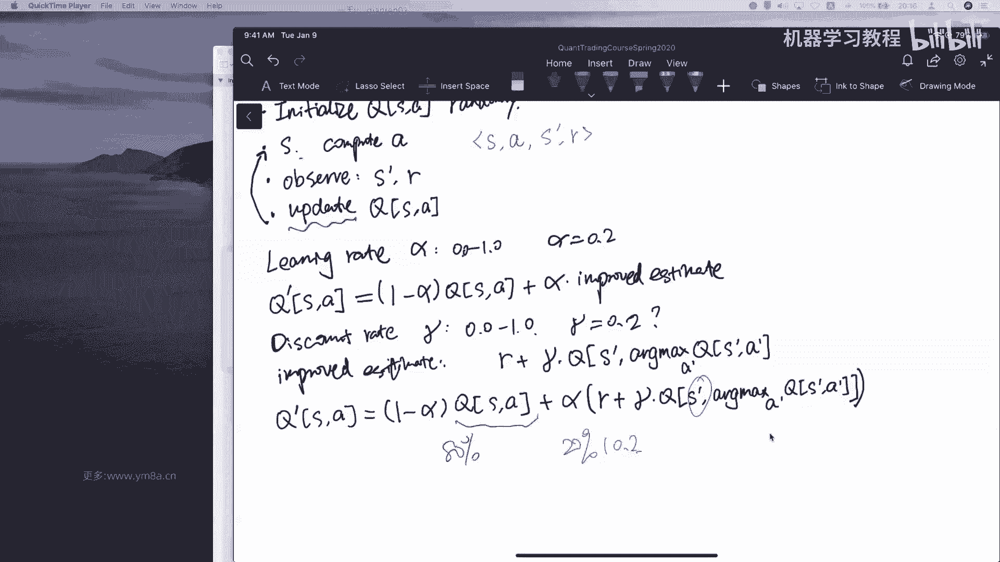
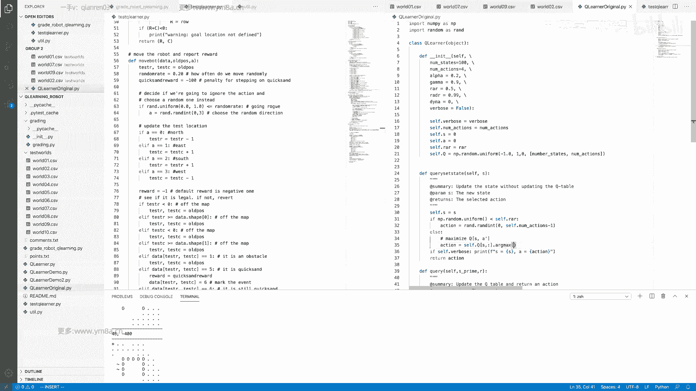
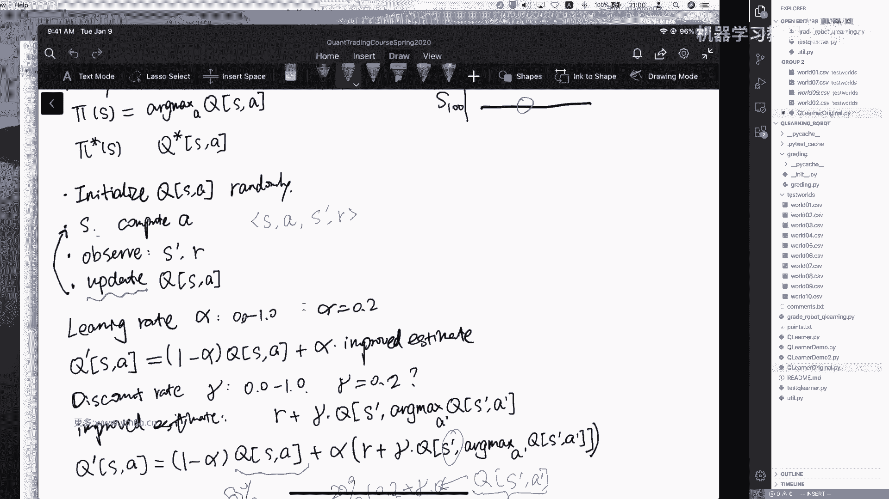
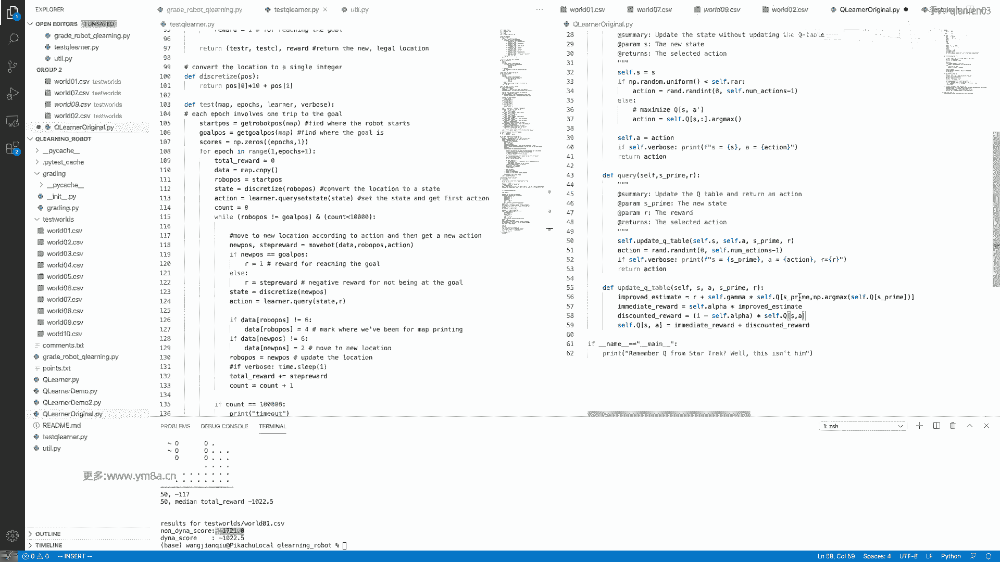
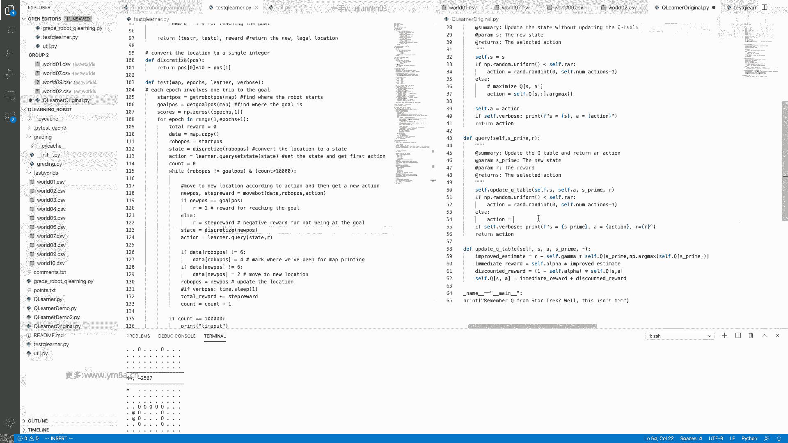
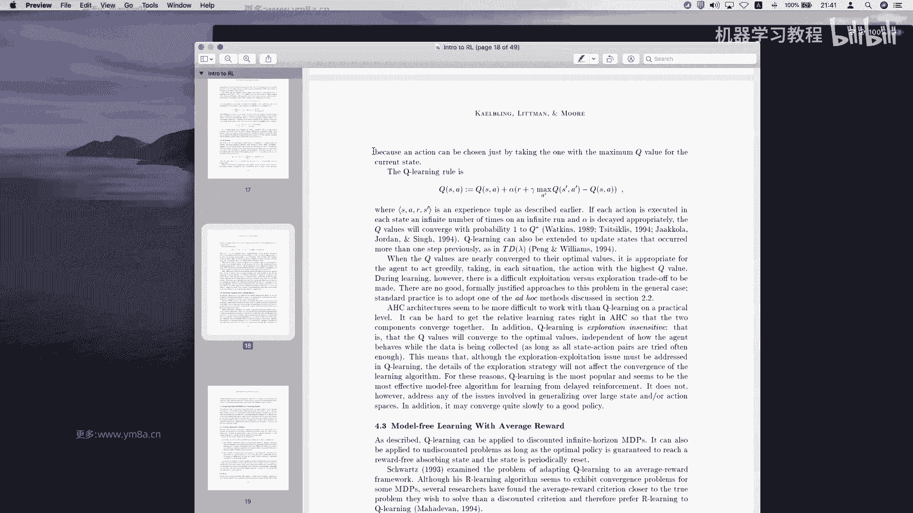
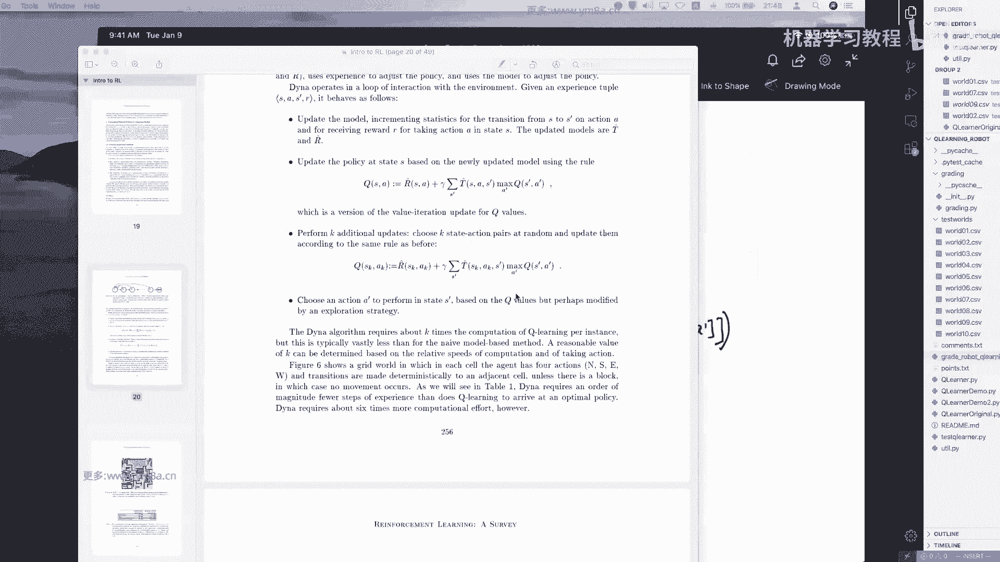

# 26集全！B站目前唯一能将【量化交易】讲清楚的教程！用AI从零开始打造你的交易机器人！大数据量化交易／机器学习／Python金融分析 - P18：第一十一章第1节： 量化交易的特征工程 - 机器学习教程 - BV1w4421S7Zx

诶好，各位同学能听到吗，嗯我们过一会儿再开始啊。

我们再稍微等一下其他的同学，嗯行我看今天可能也不会有其他人过来了，那我们就先开始吧，今天这节课程主要是给大家介绍，就是强化学习当中的q learning，然后这节课我们会简单的做一个呃。

一个一个小的project，是在呃就是在一个地图当中，然后让你的robot去最终去逃出，走到最终的这样一个目标，然后下节课呢我们会接着这节课的q learn，引用写出来的q render。

然后去尝试去去把它应用到股票的交易上，交易当中去，然后可能很多同学呃不知道呃，先问一下大家，就是了解过强化学习，或者说知道啊q learning是怎么回事的，同学在群里打个一，但是当然不熟悉，也没问题。

没问题没问题，应该讲的我觉得还是比较比较容易接受的，对，他并不会像其他机器学习，特别复杂的逻辑在里面对，所以我们今天的课程大概是对，因为希望在两个半小时到三个小时之间，能够把这个东西。

小小的一个就是q learning这个东西给做出来，然后我们先看一下这个问题的，就是problem setting是什么样的对，像我们提到这是一个，我们接下来会有很多的test case。

就是说每个是一个地图，然后它是一个10×10的矩阵，10×10的矩阵当中，然后我们这是我们的一个起始位置，然后起始位置呃，在接下来的其实呃我我们的整个游戏是这样，就刚开始我们会从起始位置开始。

然后每次你可以上下左右各各移动一步，然后这个这个就是说我们对应到强化学习当中，就是所说的我们所做的action好，那接下来我们会具体的去formless说这个action是什么，那接下来就是说呃。

他们的最终目标是走到地图当中为salvage，也是我们最终的目的地，然后这里面有几个有几个限制，一个是地图当中的这个一一是代表什么意思呢，就是说看这是一个墙，你不能过去，如果你走过去的话，你还会就是你。

你你是说相当于说你不能跨越过去，然后五五是可以走过去，然后但但但它它是一个流沙流沙的意思，就是说当你走过去的时候，你需要你你你的你的reward，就是你会扣很多很多的分，那整个呃为什么。

为什么说要去做这样一个的problem setting，就是说这很类似于我们的一个股票的交易，因为我们希望说我们的模型到最后获取，我们的目标是获取长期的一个收益，或者说是我呃我的目标是获取每天比较小。

而每每天尽可能去获取一个正收益，当然这两个目标的设定不一样，会导致呃你学习的模型可能会非常不一样，但是在这边呢，我们先是先简单就是说嗯，我们我们这个问题，为什么是是一个简化版本的问题。

首先是我们每一步决策是一定是说是离散化的，我只有就说呃我只有说1234上下左右，就说我写向上向下向左向有四种决策，但是在股票交易当中，其实呃嗯不是的，或者说现实生活中绝大多数问题都不是。

因为还涉及到说你到底要呃，除了说你交易的方向，你还有交易的标的，交易的你迟早要交易的数量等等对，但是呃我们之后是可以有办法把嗯，连续的交易去想办法去把把它进行离散化，但是我们先考虑最简单的离散的模型对。

嗯然后我们先看一下，就是说我先把整体的这个模型给跑一下，给大家看一下是什么情况啊，我们最重要跑的是一个test learner，在这个task learner当中呢。

呃我们现在是说这是一个original的这样一个文件，这也是我们待会去实现的这样一个文件，就说我们先先就是说如果说我们的每一步状态，就是说都是随机的，就是说先随机的，我们来看一下会是什么样的情况。

嗯他会跑50个，就是跑50次，然后然后大家看到就是说这个嗯，然后这个这个零就代表是墙，你不能穿越过去，然后这边的呃at是相当于是一个流沙，然后最终star这个星是你的目的地。

这个点啊是你是实际上是你经过的路径，大家可以看到在随机过程当中啊，随机的过程当中，你最终很有可能出现的情况，就是说你把图当中每一个点，都是都会遍历过去了，然后最终你才会去走到这样一个目的地，对。

然后OK啊，然后我这边之前还写了一个，就是说加上了一些加上了q learning的部分，然后这时候看一下它的路径，就是给大家一个直观的感受，唉但先注意一下。

就是说之前的刚刚这个school是刚刚是-1000分，大概我现在是-33分，-33分是什么概念，先解释一下，就是说我们在render reward是什么呢，或者像我们先看直接直观这个路径。

大家可以看到跟刚才的呃非常密集的路径，走到终终点不一样的是，这边路径相对来说会比较直观，对就相对来说会比较直接，就是说最理想的路径当然是从就是说中间啊，中间最下面这个点了啊，对我们把它放到右边来。

就是从二这个点，然后向左走，再一直向上走，我可以呃逃过所有的阻碍跟流沙，我最终达到目的，这样来说是是说是对我的惩罚是最小的，注意这边我把reward跟乘法放作换到同一个，因为本质上来说。

我把我每一步的reward做成一个负数就可以了，然后事实上这个模型当中，我们也是这么来处理的，然后我们接下来具体看一下，就是说整个的process跑这样一个simulation，到底是什么意思。

首先就是说我们走进的是TESCO这个函数，就是我们今天要做的事情，就只是去implement这个q cooler这样一个class，对我们只需要去implement这两个函数，其实并不会很麻烦。

但是最终效果还是可以的对，然后刚开始他先做了一个实验，是low的地图，那low的地图之后他把它变成了一个呃npd array，对，比如说我读了这个CSV，然后这个时候他做了一个事情。

这边是跑了epoch，是跑了OK跑了500，然后这个时候是初始化我们的q learner，这样的一些参数，而具体这些参数的含义，接下来我会去给大家一个个讲过去是什么意思，然后然后这个时候。

然后这个时候他我其实每次simulation，你要做的事情，就是说是去计算一个他的total reward，对呃然后total reward计算在上面会有，然后我们这边是我们。

我们今天先去考虑NDA的这样一个q learning，然后有时间我们可以看一下，就是DINA的q learning，其实了解了这个之后再了解这个不会很麻烦，然后我们看看就说这个reward是怎么算的。

就是说啊首先刚开始的时候是start position，这是我们每一张地图，你都会有一个你初始的这样一个位置，然后对我们找到这个二，这都是你的位置，然后三是你要去的目的地对，然后零是可以正常通过。

所以这次就一是相对来说是比较简单的，一个地图对，然后到了后面的地图，可能对他都会比较trick一点，可能就类似于迷宫，可能只有一条路径才能走过去，然后正好也可以测试一下，就是这个算法的表现。

然后这边有一个DISCRETIZED，这是什么意思，其实其实我们不是10×10的地图吗，你把这相当于一个二维的这样一个，二维的这样一个地地图，你就相当于说是啊变成了这样一个state。

state是什么呢，呃我们这边实际上是100state，每一个你啊robot你处于每一个地点，每一个position，你就说你处于二维矩阵，每一个位置都对应一个位置啊，都对应一个你的你的最终的状态。

比如说000102，这是我们拿坐标对吧，但你我们可以把零零啊，我们可以把就是说比如说是D，我们从左上角作为作为起始D吧，对我们把就是说嗯第五行第六列，那那你可以把它转化成就是说5×5乘以呃。

SR5-1乘以十，加上加上多少，加上六啊，加上五对，然后加上六吧，这样这实际上相当于说你是第46个位置，相当于说是说我把这二维的这样一个map，你discrete得到这样一个state。

你说我们这边的state，就是说你啊这个这个这个点处于每个位置，都是对于这样一个state对嗯，然后就说接下来action就是我们的q learning，要去做的事情。

就是说这个是当然是初始化cue set state，所以说我们先是把整个的就是说呃整个的呃，呃整个的就是说我们刚开始的这样一个呃，就是说在初始的这样一个位置，我要去做怎样的一个行动。

对就是说这本上我要return说我的action1说，所以其实强化强化学习过程当中，最重要的就是说一个是state，就是我当前状态是什么，然后根据当前状态我要做什么action，那做完这个。

接下来我们要看的就是说根据这个action，我会得到什么样的reward，OK所以接下来就是说要做的一个事情，就是说嗯那时候我没有到达最终目的地，以及说我move次数小于1万次的时候。

我需要去跟我需要去来移移动，我的这个去以我的robot对，那这个时候就可以看一下，就是说上面这样一个函数，比如说他是要去根据你的呃原来的位置，然后根据你的地图，然后根据你的action。

就是说啊我在处理当前的位置，我做了什么样的行动对，然后他还要要要来计算你的reward对，这边是一个random rate，这边是默认是0。2，然后这就是我们刚刚提到的，说当我遇到一个流沙的形状的时候。

也就是说这边的是就是说这边的state是，也就是说如果我遇到的是，就是啊如果是五这个类型的时候啊，如果是五这个类型的时候，我的我的我的我的reward就会变成是-100对，然后嗯嗯OK，然后这边就是说。

如果说是说是在random state的时候，那这个时候我不是采取呃，不是采取，更不是采取我的实际的就是action，就不是我采取的是全领取action，而是说随机在上下左右四个方向当中。

我随机选这样一个方向对，然后嗯这个时候然后再去更新它的test location，test location的话，这边一个是test row and column，本质上来说，如果你向北移动的话。

就是说你的row number要去减一，如果你啊向东移动的话，你的color number要去加一，然后向南和向西也是一样的，对这边有一个对，这边可以看到一下，就是old position，呃。

让我想想这边传递对，它传递的是一个二维的，这样一个就是roll index和column index，类似这样一个东西，然后接下来就讲到他的，就是说我默认的reward都是一，这一轮就是说哪怕你不动。

而事实上你一般会去会去动啊，但是有时候你可能说是你超出边界了，但是我默认的default reward都是一对啊，所以说我们整个游戏的目标是，最终我希望我到达long run来说，就是长期来看。

我到达最终目的地的reward，是相对来说是不要让他付的太多，或者说你你可以理解为maximize或者minimize，仅仅是一个符号的问题对，然后说这边有就是说这边有几个bug condition。

要去注意的，就是当你逃离地图的时候啊，你就说你如果要去新的位置，超出就超越界的话，那我那么就是说呃你需要还是保持原来的位置，你说对，因为reward仍然是一，你的D你的位置是不会变化的。

然后如果说你是走到了你下一步走到了这个呃，嗯就是走到了quick and走到流沙这边的时候，那这个时候你的reward会变成new reward，会变成就是嗯就是-100。

因为我们这边定义的是quick and reward是-100对，然后并且是对，然后然后如果你达到了目的地，你这个时候是变成了一这个时候，并且游戏同时结束，对最终的时候就是本质上这个游戏是说嗯。

我要去根据我的地图的设置，然后然后希望让这个让我的这个robot，能够自主的去计算，怎么去根据我当前的状态状态，然后以及我的得分去考虑我下一步的决策。

对这其实也是说是q learning要去做这样一个事情，然后我不知道这样的一个问题的设定，大家有没有先了解清楚，对大概就是这对于这个问题的设定有有问题吗，其实看起来代码有点长，但其实还是OK的。

就是你每次的话其实要做的事情，就是嗯我写好了这样一个嗯q learner，然后我每次的话是我要去做的一个事情，是是在二你在test的时候，本质上要去做的事情。

是你我要向这个learner去根据我当前的state，跟我的上一步的reward，能够得出我下一步的action是什么，所以说我们的目标是嗯我知道当前的state是什么，然后我也知道reward是什么。

然后我的q learner要去算出我下一步的action，这其实嗯就是说这个q learning还是非常嗯，类似于我们股票交易的，我知道当前的市场状态是什么，然后我上一步的决策已经做完了。

买卖或者是持仓不变，然后我也得到了最新的pl，就是我的river，然后这个时候我要去考虑，在当前这样一个时间节点，我要去做什么了，我要做什么，Action，对七七，这这也是为什么我们要去考虑。

就是这样一个就是rainspring inforcement learning，或者说我们在这边就是用它的，我们这边主要看的是q learning，对，所以就本质上，他是说我们就是来做这样一个的呃。

我们的位置会去变化对，然后比如说我们会根据我们的position，得到我们的state，就是我每次运动到不同地方，我的state是会变化的，嗯这块现大家有问题吗。

然后然后这部分呢就是q learning这一部分对，或者我不知道是不是讲的有点快，就是可能需要就是给大家一点时间来去理解，这个里面的一些细节对，但是没关系，我们之后写代码的时候，也会慢慢来去跟大家来去。

就是理解这些事情吧，对或者我先给大家看一会，大家可以先开2分钟，然后有什么问题再来问我，其核心是在这一块，就是这是一个就是simulation，啊我看到有就是有后来的同学。

就是说我们今天讲的是就是讲的是q learning，然后我们现在是有这样一个呃问题的，这样一个setting，就是说我们会从我们会漏的一个地图，然后会从初始二这个位置。

希望这个robot两个字形走到三这个位置，然后我们考虑整个过程的这样一个reward，我们希望去就是mid mix cost，或者说是maximize the reward对。

然后一是代表是这样一个抢对，然后五代表是这样一个流沙，然后一是过不去，然后五的话我们的就是啊，就是说我们的reward会变成会变成-100对，这个我看看这边这边的地图，对不是每个地图都是有五的。

但一这个地图相对会典型一点，对，然后这边是用q learning跑出来，这样一个他的一些轨迹，然后这个来说相对来说这个是比较快的一步，总共用了12步就达到了目的地，可以说是一步都没有浪费对。

OK嗯如果没有什么问题啊，我先来讲一讲，就是就是说可能现在大家看的有点懵，就是我们要怎么去做这样一个q learning，因为我们拿到的就是，因为我们拿到的就是这样一个呃function。

然后这个这个这个时候对我我什么都不知道，我只知道每一步的就是我新的状态是什么，我只知道我新的状态，然后我也只知道，就是说上一步的这个reward是什么，比如说我只知道上一个新的状态。

以及上一步的reward，要根据这个来去计算我的新的action，其实条件会有点少，对对对，就是直观的想一想啊，直观的想一下，就是说我们在做股票交易的时候，就是说我们考虑的是什么呢。

我们做交易的时候考虑的是，我们固然要只考虑说我当前状态是什么，就是说我当前有有没有持仓，然后我也知道，就是说我上一步去做了什么事情对，然后我也知道就是说我上一部交易完，或者是嗯对我确定完之后。

我有一个reward，就是我的pl对对，然后然后然后我就要去做，我这个时候要下一步要去做什么样的交易决策，但事实上我们在交易的时候，不仅仅考虑的是上一步的决策跟reward，我还会考虑上一部之前的决策。

也会去记住历史上我每一次亏损或者盈利的，这样一个呃记录或者是event对，然后这个时候其实我人工的主观交易的时候，我是把历史当中，我每一次的交易都记在我的大脑里，形成了这样一个模型去交易。

那我现在其实q learning，本质上也是要去做这样一个事情，我也希望说是把我历史上每一次的，state是什么样，然后我每次state的reward又是怎么样，然后我希望来去考虑根据。

就是说如果说最最最呃，如果说我当前的这样一个state，跟历史上state已经是重复出现过，并且并且在我们这样的一个问题的设置当中，uh我的state总共就那么几种，那么一定是历史上出现过的。

在出现这样一个相同的stage的时候，我需要去，我需要去考虑怎么来做出最佳的这样一个决策，这也是我们就是Q00要去做了这样一个事情，对那为什么要去就说是q learning呢，可以说是说呃。

我们来接下来就是有一点点理论的一部分，但是不会太多。

OK就是说，hello啊，不好意思，刚刚可能网断了，现在大家有看到吗，OK刚刚刚我们讲的是哪儿，不好意思啊，这个这个出了点意外对，对我们刚刚刚刚讲的哪里啊，是啊，就那个我做了不同的决策。

我都会得到相应的这样一个reward，对，然后呃，我希望能说是我随着我做不同的这样的事情，我做的我的reward也会变得我做了不同的事情，我得到了不同的结果，我的reward也会变得越来越丰富。

那这个时候我希望不断的去更新，我自己的这样一个CUTABLE，然后最终我就得到了说，我根据我的q table可以去指引我未来的决策，当我遇到相同的时候，我可以选择哪个，比如说我现在state100。

我选择呃，我历史上做这么多决策，得到了综合这些reward，我选择其中最大的这样一个，所以对，那如果选择这个最大的，并不意味着说，在接下来我一定会获得更大的这样一个，哎reward x线网网网OK了吗。

我想起来了，不好意思，我今天没有插有线网，OK那那这样我我我我设置一下网络，然后大家先就是先休息5分钟，我把换成有线网，然后之后应该会稳定一些，OK现在应该现在应该不会断线了，就不好意思。

我今天那个没有没有，就确实是没有切成有线网，现在切到有线网之后，把WIFI关掉，应该会好一些，对呃sorry，很抱歉影响大家的听课的体验啊，大家大家大家大家千万不要睡着啊，千万不要睡着。

这部分是看起来有点枯燥，但是对于接下来我们就是说理解，就是这两周我们都会围绕这强化学习这一部分，来做一些文章，对呃对，然后对这一次的project的话，我还是希望这个应该不会花太多时间。

如果大家理解了整个过程的话，我觉得可能应该一个小时到，两个小时之内就可以搞定，对代码不会很长，就差不多十几行吧，对然后嗯对，然后就是说就是说本质上来说。

q learning是相当于说我们人从小到大也会做呃，很多很多的事情对，然后呃做很多事情说我们有些事情是做对了，有些事情是做错了，嗯3号的话嗯那之后在面临相同的情形的时候，我们会去考虑怎么做事情。

那我们肯定要去考虑在历史上我回顾到，比如说啊OK我当前又到了这个状态，对那这个reward可能是上次我选择了decision a啊，哇这个reward是-50，然后选了第四项二的话。

我认为word是-100，然后由-150，然后甚至负9999，对啊，我们选一个正的吧，对那那作为一个正常的理性来说，我当前处于stay three这样S3这样一个信息，我上次吃了这么多亏。

OK那么我选择了action，肯定是考虑说嗯，选择我对我自己利益最大化这样一个行动，于是我自然而然的就呃sorry，我利益最大化的，那我肯定会选择正50，也就是说我们查到了我们这action a。

所以本质上qq learning就是在做这样的一个事情，所以说我们看整个q learning process，就是说呃我会有一个初始的随机这样一个状态，就是说相当于说我们刚刚来到这个世界上。

或者说我们刚刚作为新手交易啊，我也不知道怎么去做，其实说新手去做交易的话啊，完全都是随机的，然后嗯有一些啊有些所谓的新手的运气，那可能是因为他运气真的是就是刚开始赚了钱，那是因为新手的运气比较好。

有些人亏了钱，但总体来说应该是啊对相对来说，在应该是处于一个可以说是均值来说，新手应该是都是会亏钱的对，但不管我们说刚开始我们说我可以说initialize，Randomly。

我不管用一个侦查还是uniform这样一个分布好，接下来的时候，我会有一个初始的这样一个位置state，就像我们刚刚初始的啊position，在这对，那得到的得到了这样一个就是说呃初始的位置。

初始的位置之后呢，我们会去根据我们的这样一个table去查。

我们应该去做什么样的compute，我们的a action，那得到了我们既然做完action之后的话，我会得到我现在的state，同时我也会我根据我上一步的action。

我也会得到相应的得到相应的这样一个反馈啊，对得到这样一个相应的反馈之后，我才会去嗯对的，就是说得到reward之后，我才会去考虑说更新，我得到了新的这次经验经验教训。

比如说我这次选了action a k，然后是真的是挣钱了，或者是选了选了action1，我真的真钱，那这个时候我考虑说我要更新我这个表格，比如说把正50变成了真百对。

所以说我们可以不断地去循环这样一个过程对，然后我说在整个过程当中，其实我们比较关注的是什么，是呃是当前的state，然后我当前的action以及我根据当前的action之后，我得到了新的state。

以及在这个过程当中得到的一个reward，这样一个top是我们比较关心的这样一个事情，那接下来的时候，就我们就要考虑说我们该怎么去计算，我们的这样一个最核心的是我们怎么去计算。

我们怎么来update我们的rule，OK然后我刚刚也提到了，说我们在上面的这样一个guiding principle，是immediate immediate，然后加加一个discounted，对。

首先我们在就是在machine learning当中，如果大家学过就是steep descent，就知道有一个就是说我在下降的时候，有一个叫learn，就是啊，其实不管是哪里有任何一个就是有梯度的想法。

你都会有一个叫learning rate阿尔法，Learning rate alpha，然后一般是，0~1 k，那这样的意思是说什么呢，我们上面考虑说是我会去考虑我discounted reward。

然后加上一个immediately reward，那如果我们用公式来写的话，就是说，要记住是这是我更新的这样一个cute cutable，然后我要去，把握历史的我回去记住一加阿尔法。

就是这个是我历史的这样一个CUTABLE，然后接下来呢我要去根据我的learning rate，我选择一部分去学习，我新的这样一个improved estimate对吧，这部分大家可以理解吧。

就是说我学习的就是说啊记住记住这是一个，你就是说我们这是q table，你可以理解为是矩阵当中每一个元素了对吧，然后就第四行第一列，然后你说我会去考虑说，记住当前历史的这样一减阿尔法。

然后加上我新的improve的一些estimate，然后对啊，然后这个时候你知道，其实就是想说我们improved estimate怎么去来做啊，这个时候可能又要去引入一个新的参数。

然后我们就一般这个阿尔法我们取0。2，然后我们这个时候会取一个discount rate，我们叫伽马，也是0。0到1。0，那这样一个呃improved estimate是什么呢。

首先我会有当前的这样一个reward，呃同时说呃我需要去考虑，就是说为什么他是要一个叫discount，我会去考虑这样一个伽马，然后记住这里面就是有一部分说是，这部分是什么呢。

就是说我会考虑说improved estimate，我会考虑，我新的state，然后这个时候的action是什么呢，就是说我会去考虑说action，我要去考虑，使得我在新的这样一个state的情况下。

我要做出找到最大的这样一个A，然后再去找到我新的这样最大的A的，这样一个在当前的这样一个Q，在这一个当前的这一个q table，去找到他这样一个值，对这部分可能会有点绕，大家可以去想一下。

然后这个时候也是会类似的伽马伽马的话哦，想一想啊，默认的应该是呃，Sorry，这个我有点忘记了，待会可以看一下这个是多少，如果记得不错的话，应该也是0。2对，然后如果你把整个合起来的话啊。

对我们会得到这样一个，我怎么去更新我这样一个CUTABLE，然后加上阿尔法一个给我加一个discount，OK大家可以先对着这个式子开一会，对，这是到今天可能就是最最theoretical这段部分。

就到这就OK了，对，其实我们在就是就是说接下来我们就是来看，怎么就是实现这个公式，就是说呃我们为什么要去这么做吧，或者说就其实整个的principle，就是说我在根据我得到了新的。

就是说我怎么去把我历史的经验，跟我当前的reward去结合在一起，其实考虑的就是这样一个就是这样的一个事情，然后就是q learning的话，其实不止这一种，应该有其他这样一种，也有其他的这种函数。

但是说我会觉得这种方式是还OK还挺不错的，对所以说啊对对，相对来说其实它实现起来会比较简单，因为我们涉及到的一个是说，我把这个是我历史的这样一个部分记住了，我取了80%对吧，然后我新的我20%，20%。

除了说是我现有的这样一个reward，然后还考虑了说是在新的这样一个状态下，要记住这个这个S是s prime prime是可以得到的，因为只要有了有了当前就是历史的，这样就是上一部的这样一。

然后我又得到了action，那么我们就可以，自然就可以得到新的新的这样一个state对吧。

因为在反映到我们呃，这边你们是只要我走完。

不管是向哪个方向走一步之后，我都会得到新的这样一个PREME，对我得到这样新的一个s prime之后，我要去查这样一个嗯CUTABLE，但这就是说我查的是在新的state下，我会去查什么样的一个qt。

比如说我从S3走到了S4，那我要再看S4的情况下啊，对怎么来把我的呃，呃我来把S4的情况下，然后我找到了我其中最大的啊这样一个action，然后我去查到呃。

然后把这个对应的action这样一个reward给返回，对二把这样不是不属于我是一个Q直接返回，对，其实说我就要找的是最大的这样一个呃，Q值对吧，所以这边也是qs prime对。

但这注意的时候这个是对对，这个的prime的不一定是就是说是，对这个这个是一个s prime，然后就注意这个是啊，这边的a prime为什么要用a prime，它跟A不一样的，就是说我不是找的。

我这边这边不是说是我在新的状态下，我仍然采取上一步这样一个系统，那显然是没有道理的，我考虑的是在新的状态下，按用旧的这样一个q table，我仍然会考虑呃，我我仍然会考虑做出怎样的这样一个还要考虑。

我仍然要去做出最优的这样一个action，然后把历史上的把在新的状态下，在旧的表格的这样一个，旧的q table里面的这样一个只，我把它按照一定的discount再去乘进去。

对如果简单的理解来说是这样子呃，大家可以再想一想，对其实仔细理解一下，它并没有很麻烦，就是说我在更新的时候，其实说我需要去记住历史，待会要去考虑加入新的东西，对，就如果说我丢掉了伽马乘以这一项。

就相当于说我不我就说我没有考虑说呃，我新的这样一个state会去对我的这样一个CUTABLE，会造成什么样的影响对吧，那我只我只有说是我家，我不仅仅说是说呃这个CUTABLE。

然后我我就是说不仅仅说我要去算新的q table，但同时说新的q table，我对于我就是说新的action也要去把它纳入，因为如果是没有新的action的话，呃对这部分会这部分会有点吃亏吧，我觉得。

我不知道我给大家讲明白了美好对，那个那个对，那咱先去时先课间休息10分钟，然后对，然后把这部分也可以去理解一下，然后嗯不是特别理解的话，可以去课间时间就去搜一下。

比如说q learning到底是怎么回事，我我我已经就是说我尽力给大家讲明白，对，然后下节课我们再来看看，就是说我们怎么把这个游戏再去，然后有了这些概念之后，我们再来去再去进一步详细的去解释。

这样一个project我们怎么样去做好吧，好那大家先休息一下。

OK啊，同学们，我们现在回来哈，然后嗯，这个时候的话sorry，刚刚听了这边二伽马的默认的rate是呃，零点是0。9，不是0。2，所以刚刚对刚刚那个是给大家说错了嗯，OK然后的话是，对啊。

所以大家现在就是对于这一块，就是我刚刚讲的就是整个问题的setting，就是我不知道有没有有没有给大家讲清楚，然后就是说我们现在用q learning这个算法来去尝试。

说实现应用到这个应用到这个问题上面去，就是如果刚开始的话，OK我们先就是print一下，是我们输入的是输入的是什么，Sorry，Print data，就我们这边输入的是word01。

然后我们把它读成一个矩阵，怎么用break这样本啊，X你知道可可，大家work，OK我把，不是我把verbs改成false，然后再print就OK，就是说我们的input是这样一个地图。

然后呃实际上传递的是一个two dimensional，这样一个二维的这样一个array对嗯，然后嗯然后这个时候我们要做的就是事情是嗯，是Q啊，就是initialize这个q a q learner。

然后我们这边用的是下段q demo，然后我们我们还是回到，original对，OK大家这时候可以看到，就是呃我们用的是NDA的这样一个school rewarding，你看是不是接近-1200啊。

-1200大概什么概念呢，可能就是我不是说嘛，再一次那个流沙当中是-100，那差不多得跑了，可能好多次对吧，这个是然后是对，就是对，50次的这样一个应该是是我们是平均对，然后嗯对。

然后我们来看看就是这个要去怎么去做吧，就整个问题是我们刚开始会去input，就是说把这样的一个地图给输进去，输进去之后啊，然后要做的事情，就是说我们不是有500个epoch嘛，然后这个时候然后去算。

我对于这样每一个epoch都会去，就是我都会去看一下他的reward对吧，然后我的input是什么呢，就是说我的我的我的这样一个learner，然后对啊，我们把它先变成，一每次就跑一次。

然后verbal改成true，他每次都要跑，啊每次都要跑50个吗，49OK好想一想，Ok，Step，Epoch ranch，我是1~2，Two tone uh u，OK比如说然后刚开始的还是好。

get a文件，在这边把它给count等于零，time out门boss他会print，Sorry，来这边break，我希望他只跑一次，看一下是不是，吸水器嗯，OK这边是只跑了一步啊，如果把它去掉的话。

诶奇了怪了，好吧，我们先看就是我们先看，就是说我们要实现这样一个class，就说我们在实现的这个过程当中说是啊，如果我们刚开始默认的action的话啊，在这边就是我们会是一个随机的这样一个action。

对吧，比如说我们会选择是呃，我们总共是self number actions，总共是number of action，总共是四个，也就是上下左右，所以我们会选择啊。

random int当中的任意任意一个对，然后如果说对，然后相应的相应的来说我们这个时候嗯，然后然后然后这个时候就是我们的计算的reward，这样一个过程，会通过啊move bottom这个函数来实现。

然后我们回到就是说这个例子的话，呃，就刚开始的例子，如果我们是在二这个位置，然后我们随机啊，上下左右四个方向，不管怎么样，其实维吾尔都应该是一啊，我们可以看看这个逻辑是怎么处理的。

就是首先是说old position的话，应该返回的是952，是呃对是返回的是啊，应该是九五，你可以print看一下，Uh what uk，这是有随机的吗，OK它每一步sorry这样太长了。

比如说我们首先可以看到它返回的，是这样一个呃，每次这样一个position，然后呃然后然后如果说是我们朝北走的话，这边是那什么都没有，就是正常是可以走，OK那这个时候word会变成一。

然后同时他的啊column会点就是太呃，Sorry，向北的话是row会减一对，row number会减一，然后其他不变，所以这个时候你可以返回他的那new就是新的test。

这样一个啊roll和test column对，然后对，然后这个时候他reward里返回，这个是相当于我们每一步，是走到这样的一个过程，但是如果说举例子是从八，也就是说从这一行啊，呃第八行，然后第三列。

然后你这个roll index应该是73272对，那如果是七二的话啊，如果是我接下来也是要向北走，那这个时候遇到什么问题，就是说当我的呃，It's an obstacle，就是说我遇到阻碍的时候。

那我的位置保持不变，相当于是我没有走对，但这个时候我仍然是一，我仍然是保持这样的一个位置对，那其实可以去想的话，如果我每次，如果我每一次都是采取相同的这样一个角色，接着向北走。

我的reward只会不断的会变得越来越富，越来越富，事实上就是说总归会到某一个极点，我的选择向北走，这个reward会啊会超出，会使得会使得是说呃，会使得说远远的超出。

选择其他方向的这样一个reward，于是那么自然而然我们根据q learning，刚刚我们说我们要选择optimal这样一个action，使得我的这样的一个Q的值是最大，那自然而然他就不会去选择向北走。

而可能会选择向左或者向右对，这就明白了，这个里面主要的逻辑是这样对，然后如果是在就是说是在如果是向北走，遇到了我沙地里就是流沙的情况的时候，这个时候quick scary world。

我们这边定义为是-100对，那定义-100的时候，同时他又会说把就是说原来这样一个data，把这个地方标记为这样一个六啊，这也是我们之前就是大家看到的，PRT一下。

然后我不知道他返回的是copy还是原来的，OK你说如果是走到五的话，那这个时候说是呃，我可以把这个就是说我这个地方就是标记成标，记成这样一个标记成六，然后如果接下来是六的话，说我接下来还是会在啊。

会在会在流沙里面，那相对来说就说我现在里面的话，就是说呃我会reword会变的，就是说其实会增长的非常快，就是说一定要去想办法去走走出去对吧，然后那其实我们要做的事情呢啊，大家都想着说。

我们要去做整个整个这样一个q learning的话，我们先一步步来尝试做吧，就是说刚开始的时候是我们是呃有这样一个action，对吧，呃那其实我们先试试看啊，我们先不看。

就是说我们接下来每一步仍然是这样一个CURY，就是KY的话仍然是这样一个随机的，大家看到就说我这边没有做任何变化，都是呃RENDERNIZE，然后就是说我领到嗯number of action。

就是我总共有四个action，我随便选，我今天都是随便选，那我们先做先做了一个事情，说是我能不能在初始化的时候先去说，我不再是说是不再是说直接就是这样一个啊，Random number。

我先根据我的随机给定一个q table，然后让他来去呃，选择这样一个初始化最大的一个方向，那么因为刚刚我们要想到说，我们的q table是什么来着，我们说刚刚开始的第一步是啊。

要做的事情是啊，Initialize a que table randomly。

那这边的时候我们要做的事情。

就是说我会选择呃，比如说我就用一个uniform distribution好了啊，这边对我这边我把它写成Q，然后这个时候，这个时候他的dimension该是多少呢，有哪位同学可以告诉我。

就是说我我我要做的事情是对，每一个state我都要给出一个action对吧，我这边用uniform，然后选择是-1。0到1。0的这样一个，然后这个是一个matrix的dimension。

能告诉我哪位同学可以告诉我，它的维度是多少呢，就是说我们要啊，就是说我们CUTABLE，然后回到我们这个图吧。

我们q table是什么。

就是说我们之后都要去维护这样一个q table，所以我这边才把它写成这样一个class的属性变量。

我们之后都会去更新cc到Q对吧，然后对其实这个投影已经写出来了。

就说我要根据每个state都要给出这样一个action对吧，0240123，但我们这边先做的事情就是说，而且dog sorry，这不是0123对，就是我这个q table。

是要根据q table给出这样的不同的action，但我q table里面实际上是什么，我刚刚说的是是我们的reward对吧，我们reward function在下面对我们他会来实现这个。

那哪位同学可以告诉我，他的就是CUTABLE的维度是多少呢，这个问题应该不难吧，其实我已经写在这边了。

对，就是说我要根据我的每一个state，都要能从这个CUTABLE找出对应的一个action对吧，来记住我们这样一个q learner的class，不仅仅说是说是对于我这样的一个game，你没发现。

我这个里面没有涉及到任何的什么position，我没有任何的position，我我只有我的state，我只有我的action，就零来说，我把这个class稍微修改一下。

我是可以无缝地应用到股票的交易上去的对吧，我要修改仅仅是我的一些stake，然后和action对，因为相应的股票的时候，我在确定的时候，我只不过传传进去的时候，我都呃我的reward是能记住。

不是说有这个class来屈服的，计算的，是由我这个test kenner来计算的，相对来说如果把它改成股票q train，我只要传入新的reward方程就行对吧。

所以所以说就是说我是说理解这个class是怎么，q lender是怎么去运作的，我觉得还是比较重要的，所以希望大家能跟我一起去思考吧，对这个这个这个这个dimension到底是多少。

就说我们我我要做的事情是根据这样一个CUTABLE，从不同的state，然后找到这个state对应的几个action中，reward哪个最大对吧，那么那么这个dimension是什么。

我们刚刚知道我们这边number of states是在这边对吧，所以其实其实我们刚刚说的是根据我的number of states，要140，然后但是我们是记录的时候。

我们这边是如果我就是COSPLAN后呢，所以这边其实就是number actions呀，很好对，我希望大家跟我一起主动去思考对，因为其实也是在理解，就是说我们整个的整个的这样一个q process。

到底是什么样的对，因为我们记住，我们其实就是在import这样这样这样一个事情，对吧。

我们现在其他都没有变好，然后的话，我现在仅仅是把刚开始就变一下，对啊all right，然后这边有一个对，就是说这个RR是什么意思，就是说呃我们希望在我们的q learning的过程当中。

需要去引入一定的随机性，我不完全按照我的q table，始终不是说我始终按照我的q table去找，我，在一些情况下，就包括你在看test的时候，你会发现就是他的action呃。

我忘记哪边是有一个rate来的，在这边就是说啊这边他在move bottom的时候，他已经有一个random randomly，那其实我们这边做的是一个，类似的这样一个举动。

就说我在Q2就是curious set state，是在刚开始第一个action，我也希望是类似于去引入这样一个啊随机性，在里面一部分情况下，说是就是说我用的是我的这样一个呃0~3的。

零到number of state，a number of actions的这样一个random的操作，这是一个记住这个是一个uniform的呃，或者说对他就是说四个概率是一样的对吧。

就是说我number of number of actions不同action的概率是一样的，那这个时候就说一一部分情况下，我希望是这样子，然后呃在另一部分的情况下，是我还希望的是。

我要去选择我的这样一个，选择我的这样一个最大化的这样一个呃action，那这个时候大家都要想一下，是说我这个action是怎么来去做的，我刚刚说过是啊，Uh maximize，maximize q对吧。

然后这个是呃我的state是maximize，然后我还选取我的这样一个action对吧，还记得我们刚刚说的ARGMAX。

其实本质是在呃在这边ARGMAX对，就是说，其实在我就是说我们第一步，或者说接下来每一步都一样，我要根据我的state去computer这样一个A。

我们这个A是怎么computer出来的，选择的是对应于我的这一个state的时候，对应这样一个state，然后我要去maximize的这样一个action，那这个值到底是什么呢，这个值是什么呢。

大家记住了，就是说我的action，这边是因为简化是说呃我的行和列，其实我正好是action number of faction，就是总共是四个，然后是0123，其实正好对应的是我的呃。

就是相当于是我的column的这样一个序号，但事实上我说我完全可以说我把我的number actions，就是说哦我变成我还是四个，但是我的action action的序号，我可以不不是说用0123。

我可以用5796，就任意一个，或者说用数字ABC，用字母ABCD来代替都可以，但是这边这边是我们正好是讨巧了，我正好是零，对应的是action0，就是第零列是对应action0。

第一列对应的是action1，所以在这边的话，如果我们要去选择呃maximize，就是说最大的这样一个column的话，而maximize这样一个Q的话，其实我选择的仅仅是他的index对吧。

不然的话其实是我还要去去相当于去查个表，去看一下我的index的这样一个值是什么东西对，因为记住action本质是0~3的这样一个，现在是因为是零到number of action对吧。

那么这边是什么呢，比如说我希望的是这个时候就有一个202，再过来吧，叫啊reward action rate，然后这个时候我可以在这边初始化，然后下面还会用得到，如果我产生一个，那这个时候怎么办呢。

那就是直接是一个uniform的就好了，呃呃或者，对，我就用南派点random uniform，那这个时候我跟他去比，如果说是小于小于它的话，我就是说按照这样的，就是说我以这样的概率去啊随机选取。

如果是另外如果是说然后以另外一部分概率说，我要去选取我的这样一个呃最大的这样一个action，这个记录是我们的，这相当于就是我们的q table，去查表的这样一个表格，根据我当前的state对吧。

我相当于说把这一行的所有值都选出来，然后选出其中最大的这样一个序号，对这就是我的action，大家可以再看一下这个表格。

Sorry，我的这个对，我假设我查的是S3对，然后我找到其中最大的这样一个的index。

Which is a1，然后我们这边对，就返回这样一个action。

然后为了方便的话，我会在下面就是把，我会把我的action给保存下来，因为我们之后会用到上一步的action，好吧，就这个时候我只是在变了一个初始的curious state。

那相对来说应该不会对他产生特别大的影响，我们这个是要改成我们的original，没问题，Number of states，Okay，Number，对我希望大家跟上我的思路哈。

就是sorry uniform，我这边是不是参数传的太多了，q gender的话，如果是，Number of，Non pre render，点uniform，然后两个参数有问题啊，为什么。

Three positional argument，Arguments，OK果然1。0，好这应该是没有什么变化，甚至某种程度来说，加上初始这样一个初始化，它可能还会变得更差一点。

但whatever没有关系，然后接下来就是说，就是我们涉及到我们这样一个很核心的，就是说我们初始化之后，然后接下来我们要去更新我们的，还记得我们整个的流程，我们在这computer。

然后可以observe的prime，然后得到我的reward对吧。

然后就是说我已经呃，我已经就是说在这边的时候，在move about time的时候嗯，move move move的时候，Move but，然后他会在这边，是我们在这边呢。

是有一个我在每次移动的时候哈，我给了这样一个action，它会告诉我新的呃position，然后也会告诉我这一步的reward，然后根据我的river的时候。

然后这个时候我可以根据我新的position，去计算出我的state，对吧啊，这这个state其实就很简单，因为我们是相当于把坐标去进行离散化，诶对吧，我们是10×10的坐标。

然后变成了0~99的这样一个状态，所以我们在这一步的时候，我们已经得到了，就是说哪些哪些是确定的哈，我们现在可以确定一下，就是说我上一部的state是有的，然后我查这样一个CUTABLE。

得到了新的action对吧，我得到了这样一个新的action之后，然后我要去借，这个时候我也能计算出或者叫observe，观察到我新的state，也就是说有些或者说新的position。

这两个因为是可以随时转化过来，然后也得到了我这一步的step reward，然后这个时候我要去记得这个时候要做的事情，就是说我要去update我的q table对吧，这个过程有了state。

然后有了action，然后我得到了我新的state，然后得到了reward。

我这个是要去update我的q table，那么我们怎么来update我们的CUTABLE啊，为了这样子的话，这样我们写先写一个function update cutable呃。

这个时候谁可以告诉我说我要我需要update cutable，需要哪些参数呢，对吧，还记得我们提到的四元组吗，这样其实我们需要的update，我们的CUTABLE仅仅是这个加上我们原本的Q对吧。

所以我要去，我相当于说我要就是传入的，四个状态不是四个状态，这是我的原来的状态，SSOS对吧，我们这边已经保存了curious state，然后what action，然后是我新的state。

然后我的reward are对吧，然后我们把它放到这边来，可能会方便我们处理一点嗯，还记得我们的CUTABLE怎么去update吗，a s prime和我的R呃。

我们回来看这个函数。

说我们先拆开，先分两部分，不用着急啊，先分两部分。

我们知道的说是，我记得我们不能我们更新的是什么，更新的是仅仅是QSA，我们不注意，我们不是一次性更新全部的这样一个表格，大家需要理解清楚，因为我只在这个状态下去更新了，别说我注意的是我在state情况。

我在state the action做出了action a，然后我现在去更新我这样的一个更新，我这样的一个就是说是我的这样一个q q table，那这样q table怎么去更新呢。

我们说是分成两部分对吧，一个是嗯，It reward，然后另外一个是this content reward，然后把这两个加起来，对吧，那么，Discounted reward。

然后这个时候我们知道是说discounted reward，是什么类。

我要把过去我做的这个很好实现，对不对，就是一减阿尔法乘以QA，我把我上一步的就说是之前旧的这样一个q table，我把它按照一定的权重去记住历史的对，那这边我还需要。

self dot alpha对吧，这个参数我下面需要用到，然后我这边在做的事情，就是说，一减去阿尔法，这个很好做对吧，阿尔法乘以QSA，Sorry，这个应该用self，要注意我们这边就是比较方便的。

是因为我们用了南派的这样一个ray，所以其实正好就是可以用，就是用QA这样一种方式来去访问它的index，就访问到他的这样一个q table的值了对吧，这本是比较OK的。

这部分现在大家能够follow上吗，能跟上吗，记住我们说这分为两部分，我们一步一步步来嘛对吧，一个是immediate，然后一个是discounted，但是现在discount这个很好做。

因为就是说是历史的对吧，我们阿尔法是零点。

0。2的话，就是说80%我要记住上一步的，那接下来要做的是，就是说我要用阿尔法乘一个improve estimate。

OK啊，那这个improved estimate是什么嘞，比如说首先是由我们这一步的及时的step reward，R对吧，我这一步的拿到的step reward是多少，是R对吧，然后呢还有什么呢。

是我还记得我们有上面一个伽马的参数吗，我希望我去记住一部分，你说我需要要去记住我的一部分的用用什么呢，这个时候这边要比较tricky的一部分，就是说是，最早这个公式我们这边记住是哪些呃。

是是sorry，新的这样一个state as prime，不是S就是如果是S的话就没有意义了，相当于说我们又得去拿前面的就是呃新呃，拿前面的这样一个旧的。

说上一步的state，我现在拿的是我下一步的这样一个状态，所以是s prime，然后这边还有一个是什么呢，这边还有一个是arg max。

就是说是在s prime，然后以及我新的这样一个action的情况下啊，我要去找到在新的s prime，就是说我新的这样一个table s，然后我要去比如说S4吧，我要去找到让S4最大的这样一个A对吧。

那这边就是说一样的，那这个我们之前有在上面做过类似的操作，是在这边，只不过我这边是把这个换成，就是这边仅仅是换成s prime就OK了，对吧，或者我用这个吧，并且应该没有这个这个冒号是多余的。

其实对这一步也就完成了我们的更新，这样一个q table，这样一个一个说我的reward function，到底要怎样的去频率去更新，当然这个时候再去理解一下，其实最核心的也仅仅就是在这边了。

对就是简简单单的，你其实完全可以写到一行去，我把它拆成334小时，为了方便大家去理解，就当它到底是哪两部分，一部分是historical，我呃啊历史上的Q。

然后加上我新的improved这样一个estimate，然后乘以另外一个权重，improved estimate包括什么呢，包括包括一部分及时的reward，以及。

以及说我还要加上说是在新的新的state的情况下，我在过在过去的这样一个q table里面，比如说我怎么去找到儿子，然后他的这样一个啊reward到底是多少对吧。

注意这边我们不是直接写成qs prime a，因为我们这边的做到的action a跟我们的qs prime，这就跟当派ag max这个东西做的是不一样，这个是a prime。

就是说我要根据新的state，找到我的这个A跟我过去上一步的state a，那显然是不一样的，对不对，所以这边不可以简单的直接写成qs prime a对，所以为什么要多这一步。

我要是找到我新的state这样的一个action，然后再去找到新的对应的，这个时候他的这样一个QQ值是多少对吧，不然我直接写成QSPLA，那显然就是说呃。

就是就是我们需要就是说apple to apple嘛对吧，一个是S3，一个是S4，我显然不能把S4呃，比如S3是对应的是A1，S4对应的是A2，我不能拿S4去直接对应S3的A对吧。

就是这个核心逻辑在这，如果理解了这个的话，我觉得就是整个的流程就是OK的，就说我其实要做的事情就是说去update cutable对吧，我既然update到CUTABLE之后呢。

呃然后然后然后这个时候我们记住哦，我们原先的决策是action对吧，就是那其实是就是说都是随机的，所几个stay完全是随机，那么我接下来要去做的事情啊，其实就不是说是不是随机的了，那同样的我们还是有。

我希望说是，保持一定的随机性，一样的，然后，在这种情况下，我希望来做出我的新的action嗯，那这个时候就说我已经有了新的，这样一个q table了，大家可以告诉我。

应该怎么去得到新的这样一个action吗，就是说我已经更新了我的q table，就是说我已经进入了整个q learning，这样一个过程当中，我每一次每一次都有新的位置，就像反映在下面这里面。

就是我每次都会走到新的位置，我走到中间的过程的时候，我已经有了最新的这样一个q table，我怎么根据最新的q table来去计算，来指导我当前的这样一个决策呢，大家可以想象这这这部分该写什么。

就对就回到我们q learning的这样一个过程中。

说就是说我我每一步我已经更新完之后，再回到我的S，那这个时候应该计算我的新的action a。

那这个这部分该写什么呢，哪位同学可以告诉我吗，对吧，我我要去计算我新的action，就是大家需要理解整整整这样一个循环，更新CUTABLE，然后根据我的q table去指导指引我的行动，OK啊。

哪位同学可以告诉我吗，呃其实其实他做做做什么事情。

就是就是一个查找的过程对吧，我找到我对应的这样一个state，然后找到我哪哪哪个的Q值最大，我就选这个action就好了，其实这个还是比较简单的对吧。

就是说其实麻烦的在up的CUTABLE这样一个过程呃，我既然已经知道最新的CUTABLE了，那我要去怎么做呢，那我就求下面已经写过了，哈兰派点art max对吧，那这部分再写一个Q，这边填什么呢。

哪位同学告诉我这是填S还是填s prime，这个应该是填s prime，为什么呢，记住我们已经是进入了新的state，我们的action是说我们在上一步得到了我的呃，其实我们QE传进来是什么。

就是说我已经得到了，这边也没有S了，对，因为因为我说我传进来就是一个，我新的这样一个呃呃我的一个state，然后我以及我这一步的state reward，然后我要去计算我新的这样一个action。

仅此而已对吧，嗯可以还是回到就是左边的这样一个啊，test test里面，我们在learner里面要做的事情是什么，我curry给的是一个，我给了一个当前的state和一个reward。

你要告诉我的action是什么对吧，记住我们的curry，那就curry只做了这样一个事情，根据state跟reward去计算我的action，只不过说在拿到这个state跟reward的时候。

我把我历史上的这样一些的呃，总所有的reward都记在我的q table里面去了，对我在做这样的决策之前，事实上我先去根据当前知识，就是根据这一步的reward和stay，我算了一下，我的我算了一下。

我的就是CUTABLE这样一个值对，所以所以这边就是说，为什么要去保留上一步的这样一个state，是比较重要的对，因为我们对我如果不保留上一步的话，我只有最新，我就会只有最新。

就是传传进来的这样一个s prime，我只有知道下一步跟这一步的s prime，我才能去指导我做出新的这样一个action对吧。

还是回到这里记住这样一个流程，对我有了action对吧，然后计算action。

然后才能得到新的s prime和reward，他就是说啊，新的state和reward都是交给就是呃test cutner来去做的，那其实我们只要把这边就是你要记住，说我传进来是一个s prime。

就当前的这样一个s prime，然后我穿回去action是什么就好了对吧，呃其实这边然后你同样的，我更新我的historical这样一个S，然后我也更新我的action对吧，那其实就OK了。

但是这边还有一个地方是在于这个trick，还有一个参数没有用到，就在q learning的过程当中，随着就是直观的要想啊，随着我掌握的数据越来越多，那么我是不是每次还是要有一定的就是二。

也就是50%的概率要去随机的，而不是从我而不是去查我的q table q，而不是查五的最新的这样一个q table，那显然是反违反直觉的对吧，即使说我学的东西越来越多，然后我掌握经验越来越丰富。

但是我仍然是跟刚开始一样，以固定的概率去选择，去随机呃，去随机的挑选这样一个action，那显然这样这样这样是非常不负责任，或者说是效率是比较低的，那我们直观的这样直觉的这样一个行动，是说。

我每次我希望我逐步降低，我的随机的这样一个比例，或者是概率，那里有，那我要做的事情是什么，我每一步都会去，每一步我都会去给他一个discount，记住这个值是0。99。

那么随着我的就是说随着我的step不断的向前，那么我选择任意的概率会越来越小，而我会给我的q table，这首选择我的q table的概率会越来越大，OK这样的话其实说是理论来说。

整个流程才会去比较的完善啊，我们这时候再来试一下啊，其实我们刚刚说是指random，是记住这个值是平均的，reward是media total，reward是-1022。5，-573。0k。

这个还是看到有区别，然后media的变成了-214对吧，这还是相对效果还是比较明显的，就是从-1000多变成了-200多，而这个时候路径是已经有了一些区别了，所以整个这一部分的。

就是最简单的这样一个q learning，这样一个框架是基本上是这样的，大家现在就是还有什么问题吗，对啊，其实说还是去理解整个这样一个更新，这样一个QQ的这样一个过程，然后对或者对。

然后去理解这样一个问题的这样一个setting，对呃问题的其实嗯对，因为这个相对来说还这个问题就是我们换一个，如果我们换一个零二的话会怎样，应该是从第一列第五行来走。

然后看到这个还是最终还是能走出来的哈对吧，对因为其实这这就是说它整个的过程是这样，就是说啊如果是说他走到嗯，他走他就是说走到，如果说他不就是在呃第7号这个位置，他不选择向右走，而选择向下走的话。

那可能就是说你会不断的就是现在这，然后你的reward会越来越富，但是如果你以一定的概率，就说是选择向左向右去走的话，那你其实会，然后这个时候你会慢慢的就是不断的迭代，去选择，让它接着去走。

对感兴趣的同学，其实是可以把我觉得能做什么事情呢，一个是你把它每一步的，每一步的action都给它打印出来，然后另外一个事情是嗯去记去看每一步，做完action之后。

我怎么去给我的q table是怎么去更新的，对，然后我觉得这样子可能能够帮助大家，直观的去理解一下，就是整个q learning的这样一个过程，OK我留点时间给大家消化一下，对于除了我们那边讲到的。

其实还有两个随机的东西在里面吧，一个是这个对我每次取下兰语，说是降低我走这个分支的概率，然后大家可以试一下，就是如果把参数，挑战的话会怎样对吧，那这个时候已经明显变得机智了很多对吧。

就可以看不同的参数调整，对他会有什么样的影响，然后对这是这是这是我learning learning rate对吧，就是说我选择越大的阿尔法呃，实际上是说我选的是说对历史的数据。

我其实就是依赖是越小的对，这类就是historical这样一个CUTABLE，对，但如果是对极端情形，我选九的话，就说完全按依赖于最新，基本上可以说是按照最新的这样，一个学到的东西去走。

但某些时候未必是最优的对吧，好我给大家就是有点时间去消化一下，然后有什么问题的话，大家课间可以，然后来问我，OK啊同学们刚刚回来一下对，然后对待会课后会把程序发给大家。

就是其实还是建议大家就是呃快点快点，就是去直观的先去理解一下，就是说他每一步到底是怎么做的，然后有必要的话是，其实是要把整个这样一个q table去，最好是给它打印出来。

然后你我觉得这样可能能够直观的去理解一下，他做了什么事情，然后这边他做了一个print的事情，是如果是障碍的话，他打的是零还是O我也不知道对，然后新的话是就是说是，二是什么类型来着呃。

二二是他就是当前他自己的这样一个位置对，然后三是目的地呃，然后他把它换成用用那个用X来表示，然后点的话就是正常可以走，然后就然后这样是嗯流沙对，然后他这边有一个这样一个state的话。

就是说如果是嗯如果你踩进去的话，它会变成一个at我不知道uh，What，这个找不到有没有这样一个at的这样一个状态，可以再跑一遍看看，对就我本来就是慢速了，0。1秒一次，让他去观察到这样一个过程。

对这个没有走到呃，然后的话我们这边调的learning rate是多少来着，然后试一下，就是如果调成0。8，这个比较极端，只根据基本上是只根据最新的reward来去调整，对这这样一个问题肯定是说嗯。

你会发现他可能就是限于局部的这样一个地方，会比较多，然后，OK但是显然来说他遇到了，就当他遇到沙子的地方，人说他一般来说不会跟着上一步直接踩进去，因为上一步的reward是非常大的，这个差不多是。

但是看到他这一部分的话，是财经学手2805，这个RAR调的，我这边默认的调的是，二这个是不是调的有问题啊，0。5，小人都，0。240。999，差一点没，啊print可能有点多，对。

然后我还是建议大家就是课后的时候，可能需要把这个嗯，这正好是我会给他一个空白的，然后最好大家肯定自己先去实现一遍，然后对，然后这边有一篇比较好的paper是介绍。

Reinforcement learning，上一个survey，然后感兴趣的同学可以去看一下，然后我们着重来看一下这个嗯嗯OK，对，看一下4。2章节，这是我们的q learning。

OK然后还有一个DA的CULLY对，你说其实看q learning，本质上就是说他还是这样一个，还是还是这样一个room对吧，每次我们就更新我们的CUTABLE。

然后大家看到就是这边有max max max的这样一个呃，但是这边还有还有，我不知道他这个这就是为什么会去减去哦，没有问题，对这个减去QA的话，放到前面就是一减阿尔法嘛对吧，一减阿尔法乘以一个Q。

然后加上我们的阿尔法跟我们形式是等价的对，然后注意我们我们需要的是需要关注的是。

就是experience这样一个top对吧，嗯然后嗯然后对我其实我们说呃，我们我们在整个这样一个学习过程当中，我们没有把它让它去做到，就是如果是就做到就是converge对吧。

因为我们这边其实是限定步骤哦。

或者是说是走到我们的目标位置，但是你实际上去训练的时候，你是可以考虑说要不要要不要去。

那就是进行converge到什么地步对呃，事实上就是说应该是有这样一个呃，嗯有这样一个曲线对啊，就是说啊随着我们的q learning的，q learning的逐步的逐步的逐步的进行。

然后我们的这样的一个呃iteration不断增加，然后我们的return或者说是我们的reward，也会converge到一个相对比较高的地步，当然他converge的速率肯定是不如刚开始一样。

就是使呃不会像刚开始一样非常的快，我们可以看到就说他是在converge，但是它的速率会不断的去减小，对嗯嗯，所以OK，然后然后对还有想强调的，就是在q learning这个过程中，说。

这个模型其实是我们看到整个模型是不一样的，就相当于说是不依赖于说我们的参数，或者说是q learning是对，那这边也提到了说independent on how的agent behaves。

就是说你不就是说你不会说依赖于，就是说你的这样一个卷怎么去运动，对嗯嗯，然后然后还想提到的是一个DA的这样一个，这里有一个就是戴拿q learning。

就说其实在q learning我们在刚刚的印象过程中发现，就是说其实整个过程当中是有非常多的啊，整个运算我要不断的得到新的action呃，然后我又又又会有新的就是新的这样一个位置。

然后对于有新的state，然后有新的action，其实整个计算过程当中还是比较time consuming的，然后其实大部分时间你看到它在整个过程中。

也就是在可能会陷于局部的一些位置。

不断的进行随机的，类似于一些随机游走，所以其实他后来提出了一个呃，呃DINA的这样一个Q能力，本质上他要做什么事情，就是说我能不能说是在我的，我不再说是嗯对我的，每次我回到我的呃这样一个地图当中去进行。

去训练，更新我的q table，我能不能去生成一些呃随机的这样一些随机的，这样一些就是我的state，然后也生成一些随机的这样一些action，然后我用这些随机的state和action来进行我的就。

然后然后去进行训练我的q table，然后我拿这样一个新的这样一个q table，再来去啊，再来去把它用到我实际的地图当中。

然而这样我省的时间是什么，我少少在了，我少少用了时间，再用于跟其他的嗯，就是在现实当中进行交互，我是相当于说我是自己去构造了一个啊，苏州的这样一个呃这样一个状态。

然后让我的q table可以得以得以不断的去学习，对啊其实这个实现起来的话也可以，就是也可以去做了，但是呃然后如果有机会了，下节课的话，我们再过来给大家就是implement一下。

就是或者说直接把这个代码给到大家，大家可以去理解一下对，然后q learning这个过程，主要是主要是，今天是想给大家先介绍这样一个过程，然后希望大家是把整个process去理解，然后下一节课的话。

我们再回去把整个的这样一个过程，去应用到股票交易过程当中去，因为还是想强调的是说，他慧根股票是有是会有一些类似的地方，但是可能就是我们需要我们去思考，就是说我实际去运用到交易过程当中的时候，呃。

我的reward到底就是就是我的action和reward，到底是什么对吧，然后以及说我怎么这是一个离散化的，我怎么如果说是一个连续化的这样一个空间，我该怎么去操作这些，可能也就是说有人说。

包括我们下节课就是实际拿股票去，就是拿就是交易数据去做的，其实我们可能我也只会去参考嗯，参考就是离散的两个空间，我只会设定三个三个三个的action，无非是by sl，还有一个就是说我是后对吧。

但事实上就是说我实际要把整个reinforcement，这样一个q learning应用到交易过程当中，我觉得其实考虑的地方可能还是比较多的嗯对，然后这部分的话可能就是说呃，我们课上不会去设计。

说是因为我也不是特别清楚，实际再去交易过程当中，有多少说是应用到强化学习的呃，有多少就是说真正的实际人去运用到强化学习，去进行实盘交易对，然后尤其是大家有看到，就是说我需要的其实训练的样本是比较多的。

我太过低频的交易其实是相对来说是不太适合，Reinforcement learning，可能更多的是在于说，更多的是可能偏向于，就是订单流的这样一个建模，对我可能说是能够从实际的order。

所有当中能够去得到一些高频的这样一些信息，然后相对来说啊，我样本比较多，我也可能说是能够得到啊，经过一些长长期的训练，我也可以得到一个相对比较稳定的结果，但如果是比较低频率的样本。

那么可能有时候应用下来并不会是，可能不一定能够得到理想的这样一些结果，对呃，然后q learning的话，如果对，然后这边还有一个，就是我这边不是有十个地图吗。

然后实际上只是说这样一个有一个grade的，这样一个function的话，是可以对所有的地图都会去进行去test case对，大家有看到就是说不同的reward。

best reward一个一级跟你是这样能做到效果，media reward实际上还是有挺大的这样一些差别的对，所以说事实上就是说，我如果把它调的比较好的话，是可以呃，大概率来说应该是对，就可能是呃。

嗯就是你可能用很短的这样一个步骤，就能够去得到，得到最终这样一个比较好的一个结果对，然后这边然后这边用的都是这边，还有的是默认这样一些参数，Ok，嗯然后对，其实今天没有，可能没有太多的这样一些问题。

主要是讲q learning，我不知道大家，所以今天听懂了没有，我还挺担心的。

可能或者说是我今天可能讲的，就是可能讲的不是特别清楚。

那其实嗯就是我自己刚开始看的时候，也花了一些时间去理解，但是其实真正把整个它就是update cutable，这样一个表格去理解清楚，我觉得其实理解然后抓语气无非就是抓住呃。

一个是q table怎么去更新，然后我去，然后以及对应的理解，state action跟reward这几个东西对吧，一般reward的话是我自己去决定的，然后大家也可以提前想一想。

就是说我在这边是这样人为的设置，这样一个环境就是不同的呃，不同的走到不同的位置，然后给到相应的reward是不一样，但如果是实际的股票交易的，或者说这些实盘交易的时候，我到底该给什么样的reward呢。

对我因为我不同的，如果本质上影响到的是对，是会影响到我的q table对，那如果说是嗯理论来说，如果直观的来说，我肯定是尽快的希望我的q learning这样一个系统，尽快的收敛，达到稳定。

那么我希望的是我每天得到的交易数据，或者说我每次交易的数据，都能够去及时的得到更新，那最直观来说，我把我每一次的收益率作为这样一个reward对吧，对然后那如果说是呃的dunk。

每天的收益率肯定是会比长期来说，我一年我跑完所有的呃，一年之后呃，比如说我已经跑了250个交易日，我一年得到这样一个收益率，作为一个reward会要好一些，因为我的反馈会来的更及时。

然后我能够及时的更新我的q table，对对，当然当然就是说实际去应用的过程当中，还是有挺多的难点的，对可能就是需要大家如果对这块感兴趣的话，可能还需要额外的花功夫去呃去来研究我。

我们这边今天能给到的是，首先是介绍什么是q learning，然后希望就是说借这样一个简单的例子，大家可以自己去，我会给大家空白文件，大家自己能够把q learning算法实现起来，因为实现起来之后。

其实等到下一节课，我们在节目基础上去改的话，其实做股票交易会比较，我觉得可能会比较好一些对，因为如果直接拿股票的话，然后对并且这样的test case相对来说数据比较简单。

然后每一步的话大家都可以亲自去调试，对这个是我今天主要想讲的内容，那大家还有什么问题吗，除了比较理论外对，其实我就是如果是notes上面的。

我觉得是这个过程可能大家理解清楚，就是其实所谓的q table，它就是一个二维的数组，然后我觉得你理解清楚这个概念，然后它相对来说，它会有比较大的确定性在里面对，因为我根据我每一次的action。

我的因为我这里面其实没有引入随机性对吧，因为我每一次的action，我都会有一个明确的这样一个reward，然后我的reward我更新，我reward更新我的q table，这样公式也是确定的。

唯一的不确定就是说我不确定性的引入是在嗯，我这是不确定不确定性，因为在于是由于我比如说我市场是随机的，或者说我每一步的哦，运动的方向是随机的啊，这个时候会引入随机性。

但是这并不影响我CUTABLE的更新，我CUTABLE我只要是给定的state跟我给定的呃，给给给给定个reward，我都能够去及时的去更新对吧，嗯如果没有什么问题的话，今天可能课要就可能是会提前。

也就提前一些结束对，然后其实就是说啊我还想问问大家，就是之后还有什么特别想要去了解的内容，想要去呃，想要去来，我可以做一些研究，然后给大家去讲一下嘛，对然后因为之前想到的说是呃衍生品。

原来留了呃对留了三节课，我们差不多求两节课结束讲的比较快，然后可能还多了多了，差不多有两节课的时间对，然后呃实盘交易那部分的话，因为我不不想引入太多的C加加，可能对，就是就是因为C加加就是CDP那部分。

逻辑交易跟会测就跟数据那块是比较类似的，就是对，如果如果如果一块搞懂，其实在做另外一块，应该没有什么特别大的问题对，呃然后如果然后呃高频交易的话，如果有兴趣的话，可以给大家简单介绍一下。

就是说现在大家所采用的一些技术，然后有一些简单的就是高频交易的算法，也可以也可以跟大家去去呃，去分享一下对，然后包括然后呃以及业界，现在当中可能大家最近有发现了，可能用的比较多的。

可能大家都在用NLP的一些知识去啊，去做证券交易啊，然后一些所谓的robot advisor，对这些的话可以也可以给大家简单介绍一下对，但是实际据我了解，实际应用交易可能不是特别多。

但是更多的可能是用来做一些因子的挖掘，或者是做一些风险的控制对，然后的话，嗯然后债券的话其实我不是特别熟，但是如果然后包括，因为债券其实可能大家也不会，如果不是在机构当中，可能一般不会去涉及到去交易吧。

对啊债券的债券其实还是挺大一块，因为整个市场来说，就是嗯就是不固定收益这一块，和和股票这一块其实都是占比较大的一块，但是散户就是个人其实不太接触的到，就是固收的交易，对呃。

故事的模型其实也相对来说是比较比较复杂对，因为债券里面可能还有很多的跟嗯原生品，然后跟期权会结合在一块，然后我觉得可能超出了这行，就这门课能够讲出了这样一些范围，然后对啊，呃我不知道。

就是说如果有同学感兴趣的话，就是需要去做，就是可以比如说专门拿个一节课或者两节课啊，给大家整理一下，就是我遇到的，或者说我认为是比较经典的一些，就是框的一些面试题，那我不知道就是现在大家有没有。

大家就是要找暑期实习的，或者是找工作的，应该应该现在已经应该已经开始暑期实习了吧，对吧，因为我们最近实习生也基本上都开始工作了，对啊对，但如果就是说有兴趣的话，是可以考虑，就是说啊。

拿出一节课时间来给大家集中讲述一下，就是说那些遇到的一些面试题，以及我们需要怎样的准备对，因为其实我们从回顾到课程最刚开始的呃，这是第11还是第12节课，我们就刚开始说。

其实我们是从几个不同的S种类去讲，但是归根结底都是呃，就是说是说我们是怎么去从刚开始的数据，然后以及说怎么去找因子，然后回归到就是怎么去回测，去验证自己的想法这样一个过程，然后还差一块是投资组合对。

嗯然后嗯对，然后大家觉得对这门课程还有什么想法，或者是呃反馈的话，也可以跟我去讲，然后之前有同学是跟我上一节课就跟我提到了，就是说觉得就说不要在课上去是写很多的代码，所以这很多代码记嗯。

就是那样的话就是从零开始写代码，他可能可能大家有时候跟不上，然后我们我们不是跟不上，我就觉得可能有点无聊，所以这节课可能有一些代码直接就先给到大家。

然后我们课上只会涉及到少部分的一些，实际的代码的操作对，因为确实上一门课，如果几百行写下来的话，可能时间都确实不太够对吧，所以课前能够最后还是可能说尽量的嗯，就是把代码是课前准备给大家。

我们课上只是只是只是进行核心代码的讲解，跟写作，对嗯好，那如果没有什么问题的话，我们今天因为提前就提前结束了，因为大家可能昨天也上了课，今天也上课还比较累，对那大家还有什么问题不，嗯就有代码再整理一下。

然后对，然后明天明天发给大家吧，好那没有什么问题的话，那大家可以想一想，然后那我们今天就课程先结束对，然后q learning的话，我课后再找一找，有没有可简单的跟入门，就是呃我觉得讲的比较好的。

好的资料可以找到给大家。

