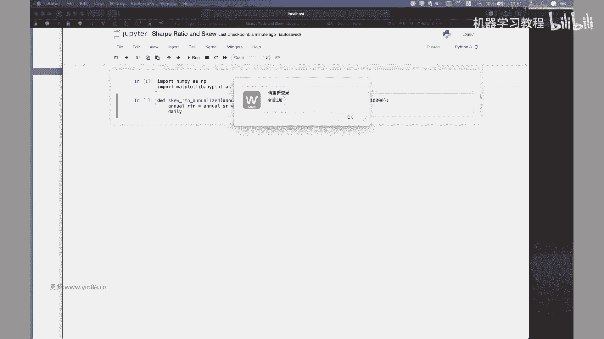
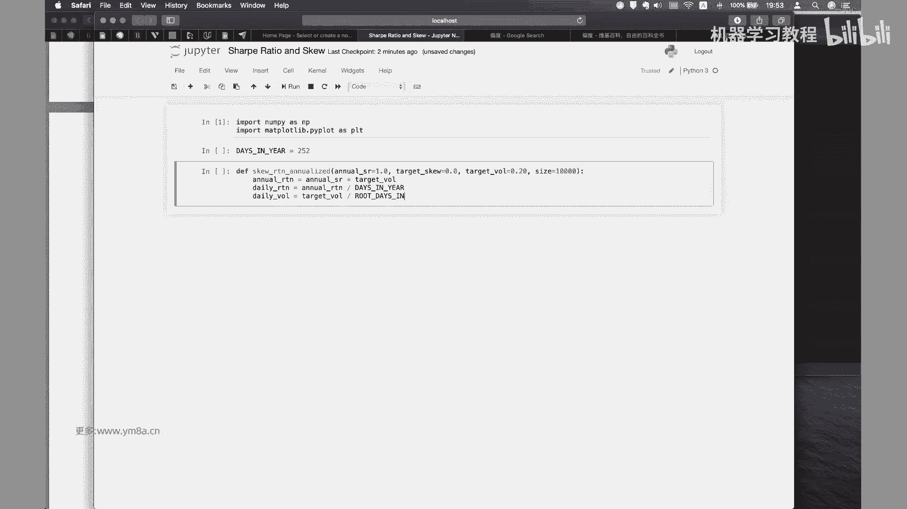
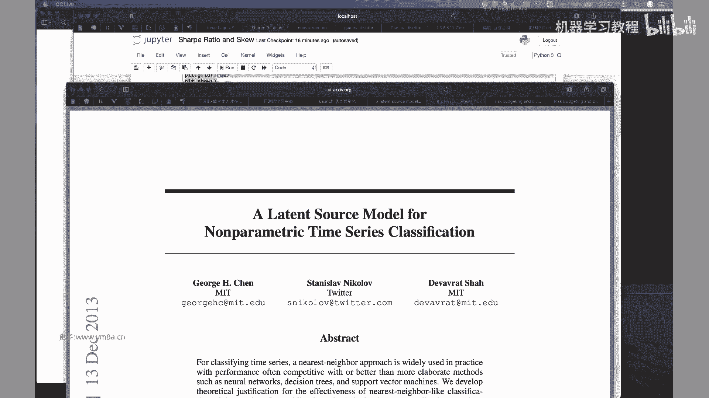
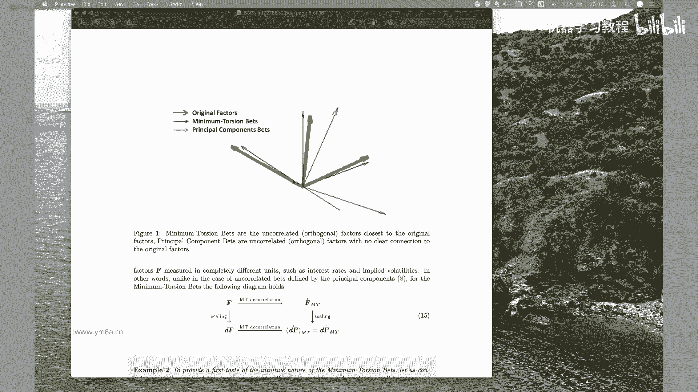
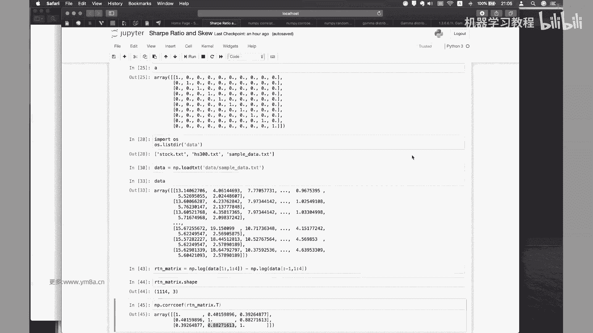
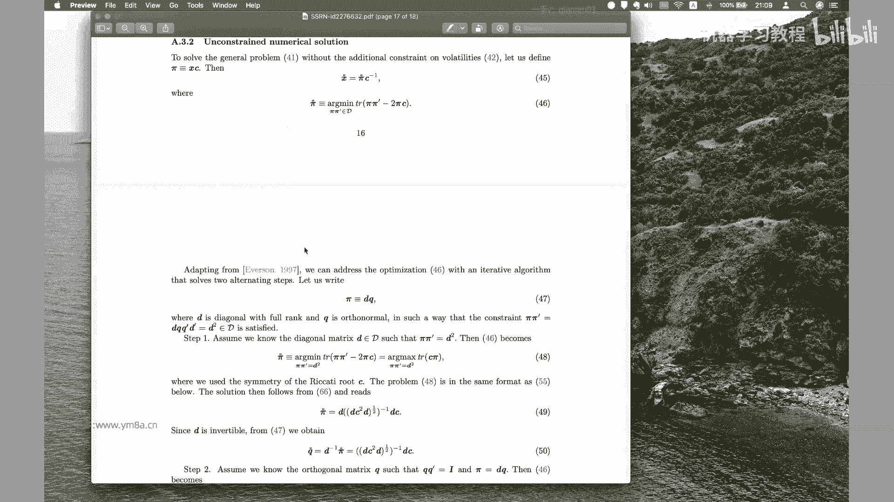
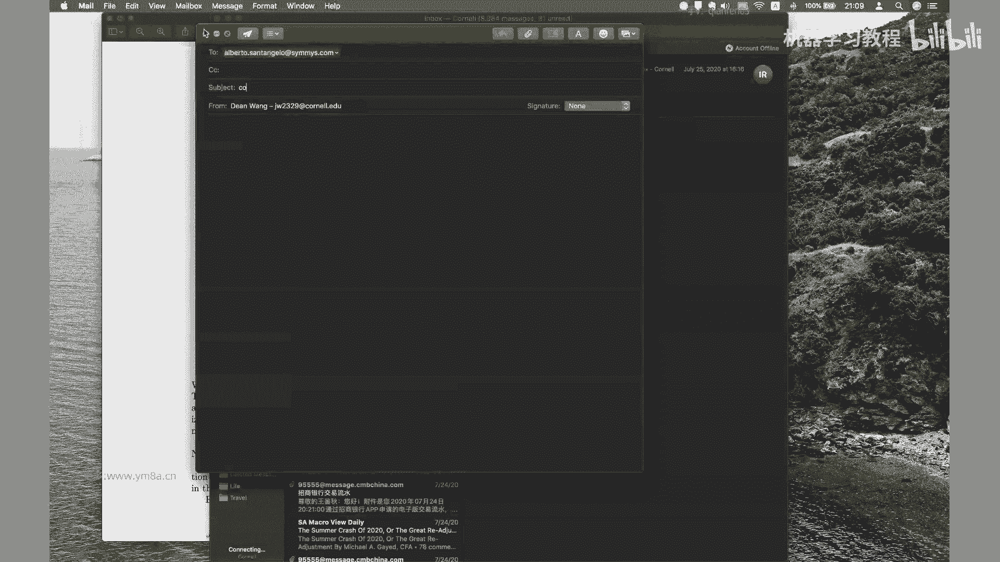
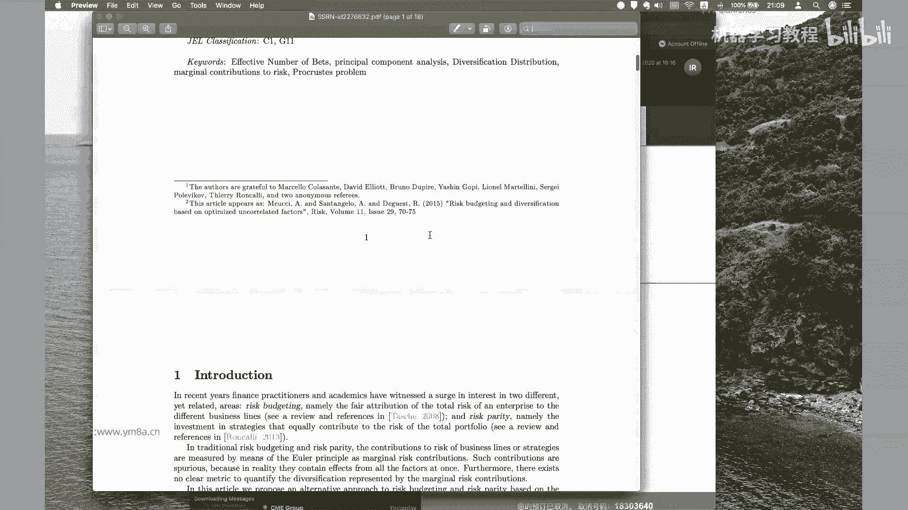
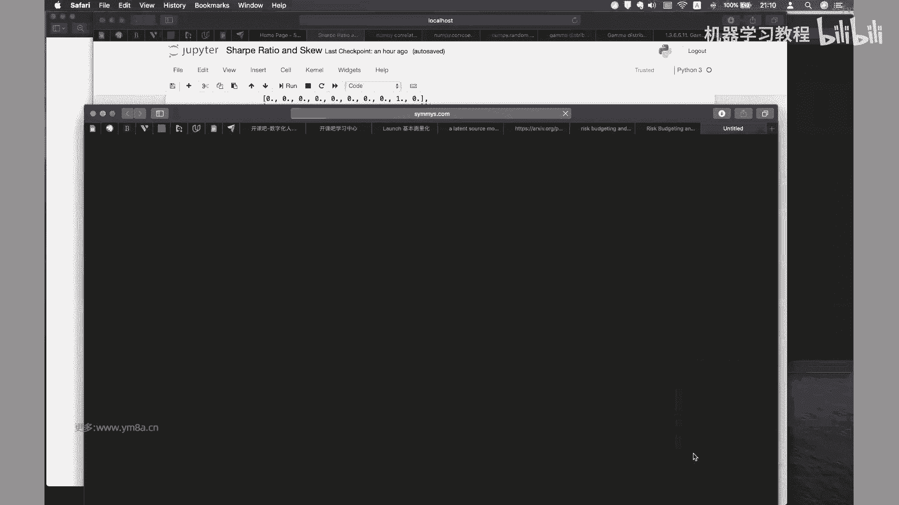
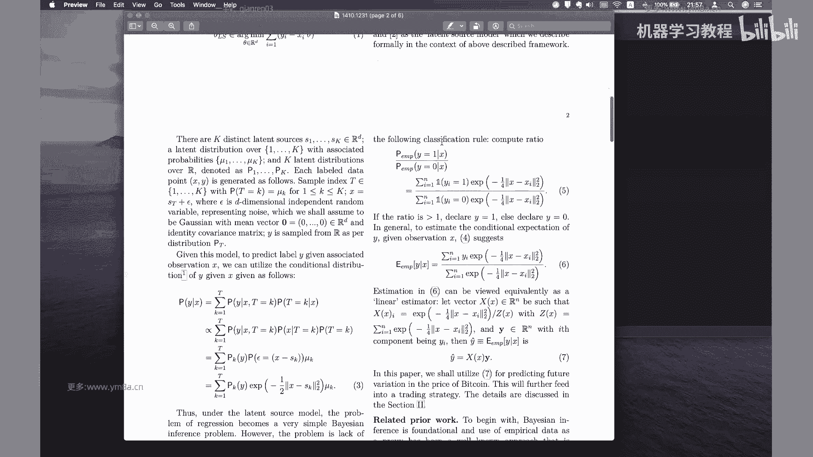

# 26集全！B站目前唯一能将【量化交易】讲清楚的教程！用AI从零开始打造你的交易机器人！大数据量化交易／机器学习／Python金融分析 - P22：第一十五章第1节： 基本面量化 - 机器学习教程 - BV1w4421S7Zx

现在大家可以吗，不好意思，我刚刚忘了对，Ok，好的，那我们今天正式开始我们今天的课程，然后对之前我们讲了那么多的就是策略和框架，或者说是就是包括有一些挖因子的方法，其实今天会讲一些，就是呃。

我觉得可能是这就是大家再去正式交易的时候，其实是会比较重要的一个内容，就是关于风险，风险控制，对其实从本质意义上来说，我们所做的事情，就是说，大家我不知道大家有没有思考过一个问题。

就是呃一个我一个策略的潜在收益，到底是由什么来决定的，对就是其实本质上来说，大家常常说一点，就是说是风险和收益是同源，所以其实是我们策略所潜在所承担的，这样一个潜在的风险。

是决定了策略的这样一个潜在的收益，但其实举一个简单的例子，如果我们是买保险的话，就是说我们买的保险是需要购买，保险时是需要支付保险费，但是然后按照平均的出险率去计算的话，那么保险公司是可以获得盈利。

但是嗯另外一方面的时候，作为保险的买家，我们付出的是保费在回报做，而他的回报就是说在重大的突发事件的时候，我们可以获得相应的弥补和损失，对那么回回到我们金融市场上来说。

嗯其实两我们会有两种类似的收益的风格，一种是说是嗯，如果我们是想要去啊购买保险的人，我们都会，那那么我们想要去购买这样一个保险，也就是说我们希望在突发事件，就是市场，比如说剧烈波动或者下跌的时候。

我们希望获得额外的收益，那么那么我们平时那么作为这一部分人，我们需要接受的这样一个事实，就是说，我们可能的回报率，会低于与市场的一个平均回报，那么另外跟我们做对手盘的人，就是说我愿意出售这样保险的人。

那么我就会通过赚取额外的风险溢价，来获得更高的回报，就是说从某种意义上来说，并不是说他的投资水平会针对说比收益率高的，会比收益率低的而言是差，而是说他赚取了我对应收益率，所承担的额外的风险溢价。

所以嗯嗯所以就是说类似于，就像类似于保险公司的这样一个利润，然后说如果某些资产容易受到这些风险的影响，那么如果我去购买了这些资产，我就可以通过这些购买这些资产获得，获得额外的回报，Okay um。

其实嗯其实说了这么多，其实我们只是想强调的，也就是说是风险敞口，是决定了我们这样一个收益，然后嗯风险敞口，然后其实然后其实还有一个是想说的是，嗯为什么大家会去投资股票。

而不是说是去投资债券等等更安全的资产，因为相对来说我债券的话，我可以就是我carry，然后就有这样的收益，那股票，那么显然其实投资者其实嗯期待的是说，我希望希望是从股票当中去获得，额外的这样一个回报。

那其实我说我所说的这些回报，它是来自于一系列的风险因素，比如说我们常见的说是，曾经有一段时间是小市值的公司啊，可以稳定的跑赢大市值的公司，这其实后来被论证它它不是一个阿尔法，它其实是一个风险因子。

但事实上来说是一这个是反的，但因为在后期你可能发现大市值的公司，其实是会跑了跑过跑赢小小市值的公司，OK其实那么这个我们强调的就是说，这是一个就是说是市值的这样一个，或者说是公司规模这样一个因子。

然后呃那么其实在债券当中，我们也会有类似的情况，会发现，就是说较长，较长期的债券的收益率是高于短期的债券，因为嗯因为本质上来说，我借给你更长时间的钱，我们是需要承担更长的。

就是说会有承担更更更大的这样一个风险，跟较长较长期限的借贷，就会对应较较大的这样一个风险，因此那么我也可以获得对应风险更多的一个，风险补偿，OK这所以就是说，所以说就说这个我们其实说的是持续的。

这样一个风险溢价，会导致不同的资产之间的收益率会有会有区别，比如说股票和债券，然后长期债呃呃然后长期债券跟短期债券，然后另外一个就是说嗯大家考虑的一点，就是说风险的偏好。

人们对于风险的偏好是保持不变的吗，显然不是，这是一个随着时间去变化，随着时间变化的一个量嗯，那么那么这样的话来说嗯，那么这样如果说风险是随着时间变化，如果我们去能够去抓住人们风险，对时间的偏好的话。

那么事实上事实上我们就存在着，说低买高卖的这样一种交易的方式，我们我们我们赌的是人们的风险偏好会回归，回归，回归一个会出现均值回归，比如说当前说我们认为当前存在溢价，那么我可以说是卖出对应的资产。

我们认为等资产等回到一定时期，人们的风险偏好啊会回到正常，那么资产的价格也会相应回到正常的水平，OK嗯对，当然这一点的话就需要说啊，因为投资者的交易心理是会变化的，市场是由投资者的信心。

投资者的交易出来的，那么嗯其实这样就不存在一个非常完全正确的，这样一个解答，然后就是说到底什么才是正确的估值，什么才是正确的一个呃市场的状态，这个就需要每个人都会有自己的另外一个判断。

然后另外还想强调的一点，就是说我们我们待会来看一下，就是说就是说作为呃作为一个理性的投资者，其实我们关心的是啊，市场的这样也会关心的是资产的夏普比率下，Sharp ratio，然后就是说嗯，但事实上嗯。

这样一个理性的假设是否是正确的呢，就是说我对于这是不是说，同样的一个夏普比率的两个资产，我们在选择的时候是没有偏好的呢，但事实上我会我会觉得，这个理性的假设可能并不是那么正确，因为具有相同的夏普比率。

这样一个资产，我们可能会存在不同的收益分布，那么就一种一种就是说是我们作为保险，类似于就是说我们是去买保险，偶尔会出现大额分布，小部分时候是亏钱，那另外一方面呢就是说是说另外一方面。

就是说呃可能说是我平时会稳定的赚钱，但是作为保险的卖方，在突发事件的时候，我们可能会去亏钱，然后的话那这个其实体现的是什么，体现的，其实是就是说是一个偏度skill的一个问题。

然后我们在我们接下来看一下，就是说去看一下具有两个不同偏度，但是具有相同夏普比率的资产的话，呃，他们画出来的就是说它们的分布，包括他们的收益是怎么样的，我们可以来去一起去看一下。

对呃这部分一点会涉及到一些编程。

Okay，So um，On call，好的，就是我们想要去做的事，比如说呃我现在想要去呃，我不知道大家对于偏度这个概念是不是熟悉，哎大家还记得我们之前在期权的时候，讲过一个偏度指数的一个问题。

就是我们我们用期权来合成一个，我们用不同的期权价格，然后去合合合成一个呃和，就是计算一个偏度指数，反映当前市场的一个预期，对其实看这个图就说这个是负偏态，Negative skill。

然后是然后是这个是positive skill，对简单来说就是说嗯负片多的话，还是说就是我们刚刚呃刚就是刚刚所说的，就是说呃我的收益，我我我我的收益指的就是比如说我的收益，其实是啊。

其实是就是说是处于是是大于零对，但但是说呃但是说我可能就是说我会有偶尔的，在极端情况下，我可能会回去亏了多少钱，那么正片的话是说是我平时都会去亏小钱，但是在偶尔的时候我会去赚一大笔钱。

这两个就是说我们可我们可以去哦，我们可以通过一段代码，就是说去合成我具有相同的夏普比率，就是说本质上来说啊，我都可以获得在相同的波动下，都可以获得预期的相同的预期回报，但是这两种资产。

就是说我的return这种distribution是不一样的，OK然后我们来试一下，对，就是说怎么去来去计算这样一个嗯，计算一个这样一个skill，OK啊，OK然后的话，呃或者对我不知道。

这就是这部分的话，就是交给大家自己去写代码，还是说我们要在课上去，就简单的就是写一下对，就是说我们比如说给我们的UID，就是年化的这样一个夏普比例是一。

然后我们的target school我们默认是我们要给定一个，就是说target skill，sq的计算公式，OK就是说是样本的三阶标准句，OK然后我们就是就是说这个其实想给，就是展示一下。

就是说我们怎么去根据这样一个给定的，chaparral和target skill，然后去对出来，把它这个把他的distribution给，然后同样的我们要给一个目标的这样一个波动，波动率。

因为因为事实上就是说我给定了，给定了我的目标的这样一个嗯波动率的话，然后给定了一个下午比例，那我的return是啥，就得是确定后，OK然后我把这个，sorry哦，这样子，应该是这样对，然后OK。

不好意思，刚刚见面可能大家不好意思，刚刚见面可能弄错了，放错了代码，然后OK，就是说我们需要去给这样的一个target，Chaparratio，然后给给一个就是说target skill，然后包括它的。

包括TILITY，然后OK然后首先呃annual return，他就是说是，Sherial，然后去乘以一个呃TELEVI对吧，这个这不就是我们的那个，这不是就是夏普，夏普比例这样一个计算的这样一个公式。

然后，嗯我要把这个，OK然后，OK然后然后就是说是我的，那么我就要去算我的一个是DAVOR，那么在算对daily return的时候，就是要考虑说我怎么把，就要考虑就是啊。

从年化的夏普比例转化成这样一个daily的return。

下去，the return的话，事实上就是annual return，然后是除以，就是呃我一年有有多少天，然后我们这边就用200，或者把它作为constant好了，我们把它作为一个常数，嗯对。

然后的话就是那么daily vall的话就是说是TBALL，然后是除以root days in year。

因为这里面涉及到一个开根号的问题，就波动了，然后。

嗯OK，Root days in here，等于就是days in，一然后乘以零就是开根号对吧，Ok，那么然后这个时候，我这边这个时常想写的是一个呃，这样我是把它写成一个就是interface。

然后SCRETURN，然后我需要的是我希望是target name，target return是我的，Daily return，然后呃target u，WW是啊。

这边我用该是target daily vl的话，这应该是我的daily vtarget，我这边也是这个就是target，对他们cue，然后size是。

size size就说我们前面做的事情是把它去标准化，然后接下来再去英特尔这样一个，就是说我们把它全部转化成我们日化的波动率，跟日化的这样一个收益，记住这边已经全部是，Skt，然后size ok。

然后的话，这样做的事情就是说呃我们要去，就是说是生成一个，就是说我们要从就是呃gua distribution里面去采，就采样对，然后的话对伽马分队就是说它的probability density。

是这样的一个形式，然后接下来我们再来去，OK所以就是说是嗯我们要生成的，就是说是生成呃，因为GA有两个参数嘛，一个是就是是一个是shape，然后是一个scale。

然后就是说啊这shift是nonnegative skill，是说是也是拿negative，然后的话我们在这边的话，OK我们把ship parameter ship用用什么来做呢，我们用的是呃。

二用我们用用这样的方式来处理，就是用二来除以我们的一个target，我们用TT，但是但是就是说为什么让让让，就说我们因为可能会有正片度或者是负片度，所以我们这边是要用absolute，就用绝对值。

然后但是要注意的事情，就是说如果我们需要一个偏度为零的呢，所以我们还要去不能用2÷0，那我们再加一个，s e e-6极小值好了，对，所以完整的形式就是说我们parameter。

就是我们的这parameter这样的参数，就是用我们的二除以target school，Target school，然后加上一个这样的话，然后我们再去把它去平方一下。

这样我们就得到了一个就是parameter这样一个事，就是嗯shift这样一个parameter，然后然后我们的scale采用的是呃，这个要用的就是我们用target，Target the level。

然后再去除以，Target ball，我想一下target ball，Target del，然后除以K，太阳没事，OK用parameter sh，然后这边我们要去，刚刚是OK。

然后然后接下来的话我们就会去生成samples，就是根据我们的呃，根据我们的gun distribution的这两个参数等，等到gm to preme shape，Parameter scale。

然后size size，然后我们需要生成的是，一个list ok嗯，然后我们再去算额，Ok，然后其实我们就是说要把这样的一个sample给它，去算出来samples。

然后然后如果说我们的就是TTQ小于零，然后我们的adjusted signal，然后把它设成呃-1。0，然后我默认的话是这个有什么用，我们在下面看1。0K，然后然后我们要做的事情是二，就是OK嗯。

然后在做的事情，就是说是，我要去把我的这样一个均值去调整到我的，daily return上面去，因为我现在生成的这样一个distribution，显然它的daily呃就是target return。

跟我的target return是呃是不一样的，那么我们要去调整一下我的嗯嗯嗯，sample main是等于，呃这个是怎么来的，是这个是ga distribution min。

OK所以是k research parameter，K and main parameter mu，所以是，sorry parameter mu啊，我想找他的是，像这个网页可能有点慢。

就是为什么我们要用ga distribution，因为我们知道的是伽马distribution，指就是说我们是知道有伽马distribution这样一个SKU，然后我们是用它来去构造。

我们想要的这样一个分布，可以会好一点吧，就是说我的我的mean的话是可以拿shape，就是parameter ship和我们的skill这样一个parameter，再去乘以我们一个调整的这样一个。

OK我用这个MONE是等于，Shift，然后去乘以我们的呃parameter，parameter的scale，然后就说我们是希望把他的嗯，然后再乘一个adjusted signal，Ok。

然后adjustment in adjustment，我们对我们的，那时候是我们的target，my target reer和我们的命值进行这样一个差距，然后这个时候我的新的samples就可以写成。

我对于每个for x in sample，我要去把它X去乘以a adjusted signal，然后再去加上我的main，Just met，然后才去把我这样的一个spost character。

OK然后的话先pose，然后我们再去，比如说我们想要去给一个年化夏普比例为一，然后偏度为一，然后给2500个的这样一个样本，那我们就直接调这样一个curator analy，找一个函数试一下。

然后比如说就是1。01。0，嗯嗯然后的话target wall的话，比如说是0。20，然后2500，这没有问题，Days in year，Ok。

Or primary steel parameter skill，Sample fing samples，OK这样我们就得到了这样一个skill analyze，return的这样一个呃。

我们得到的是他的sample，就是我们的这样一个呃return的distribution，然后我们来把它画一个HIRAM对吧，这样我们就能看出他是不是真的是呃，这样的一个TNT。

就是一个是正偏度的这样一个形态对吧，其实可以验证我们的代码，那么我们要做的是sorry，这是samples list，这本身就是list spose，然后number bin so把它100。

OK看看k p LT plot a matt t y k p LT，这样子的话我们看到的就是说是呃KPLT点，bread等于等于在great true，然后PLT点show，Ok，然后我们这边看到的。

这就是一个我们想要给定的，说是呃analyzed sherate为一，然后我们的daily daily的这样一个VOTION呃，呃sorry，这是啊，这是但是年化20%波动率，然后对2500个样本。

这个时候你可以看到这是一个是属于，这是属于一个非常典型的，是属于一个正片都这个状态，因为就是要记住是正片度，说你可能说大部分时候都是每天都会去亏啊，亏点亏点小钱对。

但是但是但是这偶尔的时候我去赚一些大钱，对这是一种分类，这是一种收益分布的形态，那么同样的我仍然也可以，我也可以去，我们给一个负片读的这样一个形态，like哦，同样是差不多的位移。

然后但是我的skill是负的，然后我的return仍然是这样，然后，OK对这个时候大家可以去看一下，就是说嗯，对对对，刚提到就说是我们没有考虑，就是那个risk free interest。

你当然可以去加了，对等等，我是我这边是主要是想强调的是说呃，对于同样的夏普比率，我们的收益的分布是可以，可能是产生完全不同的形态，那么这两种是孰好孰坏，我个人觉得是看个人的风格对，就简单。

第二种这个是什么样的情况呢，就是说嗯嗯怎样我可以做成这样的一种心态，就比如说我个人去，比如说散户，我去交易的时候，只要一有盈利，我就去落袋，那么显然而说我会限制我的DARETURN。

我每天最多赚了2%嗯，但是但是但是往往有些情况说是亏的比较多，就是反而越亏越多，那么我再去反反向加仓，或者是说死不止损，那么会导致这样一种形态来说，我可能会有极端的这些天数。

那一天可能亏了700%分之二，比如说那天市场开盘就跌了3%，但是按照3%，我没有去止损，所以然后然后接着从3%再一路下跌，下跌到7%，这也是一种心情对，那么上面这种情形是什么情况。

比如说今天开盘跌了2%k，我只要我投资组合有一个，比如说是止损线是2。1%啊，负的2。12。2，那么到了这个限制的时候，我立刻就止损，那么那么我保证我每天的投资组合，都不会去亏了，亏了超过这样的情形。

那么偶尔说市场比较好的时候呃，我们就采取让利润奔跑这样一种形式，然后说OK我不设止盈，我可以去怎么去做，那么我同样的也可以得到这样一个分布，那么这两种情况的话，显然是说第一种是嗯。

理论上来说是理性的交易者，我们都希望我们的策略就有一个正片，都这样一个形态，因为这样的话就是这样来说，我可以说是印度，我的整个系统是对于黑天鹅有比较强的，这样一个抗冲击力。

但是呃事实上再去第一种人交易的时候，觉得是属于一种比较反人类的这样一种情形啊，这也是说在量化交易的时候，我们如果采取这种量化交易的形式，是在策略里面通过限制我们的最大的亏损。

是可以达到实现正片录的这样一种状况，对可能说是每天交易起来，可能大部分时候我可能都会去亏损，因为会付出手续费或者是品牌交易怎样，但是我保证我每天到达最大的亏损的时候，会去清盘，或者说我今天就停止交易。

那么那么比如说我同样的起步资金是100万，那么我即使说是2%的话，那我其实可以扛扛很多个连续下跌的情形，对呃所以这两种的话不能说是孰优孰劣，我只是我们这边强调的例子。

是说是给定相同的年化波动率跟年化收益率，我们可以造成不同的收益形态，那么这两种的取舍我觉得是取决于个人嗯，当然我们是希望是说我们的投资组合是具有负，我们是希望我们的投资组合，是具有一定的抗黑天鹅的能力。

也就是说是具有一个正正太的这样一个偏度，OK所以这部分的话是，就是说大家在实际去交易的时候，自己要是去考虑我的策略是开始往什么样的走，那么什么样的策略，具有正片度的这样一种状况呢，我刚才提到买期权。

我平时都是买小期权，我都我都买out of the money，就是我都是买深度虚值这样一个呃，两边去买，那么我赌的是市场有大波动，平时大部分情况下我都是到期归零，我都会去每天损失一些时间价值。

但是偶尔有些情况我会去赚钱，对像这种第二种比较典型的例子是market making，可能是说说OK我大概率都会去挣钱，每天都会去挣一点小钱，但市场不太好，可能会去亏一些钱，所以对呃在这个领域的时候。

就是大家要去就是去自行去思考，就是包括说嗯，对我们想要去或者去赚取什么样的钱，一般来说就是作为一个机构投资者的话，如果是一个放到放，其实我们更加倾向于会有一个，比如说我们的最大亏损是可控的。

因为投资者作为机构投资者，其实是不希望自己投资回一天，可能出现五个百分点以上的亏损，这是非常夸张的一个事情，对，也就是说在个人投资跟机构投资的时候，可能这两点会有比较本质上的区别。

然后对这一点是想强调大家的时候，就是呃在风险，就是说呃其实这个里面是暗黑，就是说我们是嗯，我们看起来是具有相同年化收益率和波动率的，这样一个资产，其实它可能里面暗含的一个偏度风险，所对应的一个风险溢价。

对这个是大家一定要去特别特别注意的对啊，然后另外一点的话就是说嗯，如果你仓位比较大的时候，其实你还要去考，就是说我们讲的今天讲的风险，这是第三点，因为前面第一第一点讲的是说是，我们强调说是股票呃。

就是资产本身可能存在，长期的持续的风险溢价嗯，股票和债券，长期债券相对于短期债券，另外一点就是说强调的是呃啊，风险偏好可能会随着时间变化，但是风险偏好随着时间变化的。

意思是说这一点可能大家要去考虑的时候，其实有一篇经典的文章是，就是呃美林银行写的啊。

美林的时钟时钟模型，那么其实这个是一个非常简单的一个啊，也不是说这不是简单，就是一个我觉得是写的。

写的是比较经典的一个就是关于资产配置，然后随着不同人在不同的周期里，在不在不同的周期情况下，我们可能要去配置什么样的资产，那么其实这个里面就是说这个里面就是说是嗯，那风险其实是类似的。

就是说在不同的时期风险，那么呃是风人们的风险编号去开会会去变化，那么作为一个投资者的时候，你我们应该是要去考虑到，在对应时期的风险偏好，那么要去考虑我的策略去往什么地方放下配置。

比如他最近就是说比如说资金啊漫灌的时候，那其实大家都知道，有时候你可能这个时候不能持有啊，大量的现金，你可能要去抗通胀的话，你不管是去买美元，而不是sorry，不是买美元买黄金，然后是去。

然后或者是去说你去投房地产，或者因为在中国，你可能知道资金嗯，如果不去往股市，只能去往楼市，也只有这两个蓄水池对对，所以要么股市，要么是楼市嘛对啊，这一点是就是大家需要去考虑的，就是说并不是说。

因为风险可能随着时间去偏好去变化，那么我在任何时候都是保持一个低风险，我我都是始终是啊很低的仓位去投资，很高的比例，去处于说是持有现今天这样一个情况，那么这个是要是要是要是要去考虑对，因为呃在通胀时期。

就是呃就是如果我都只有持有现金，那么其实我跑赢我就已经跑赢了，跑输了，这样整个一个无风险的收益率对，所以这个是第二点，第三点就是我们刚刚强调的。

说是看起来return和就是看起来就是sharp ratio，一样的资产，其实可能会有不同的distribution，这个里面可能会呃对，可能会出现不一样的问题，就是说你可能可能你说你策略如果赚钱。

是属于第一种，是属于这种的话，嗯就要就要去思考一下，就是说我们可能在极端情况下，我们比如说看不到0。02，负的0。02左边这样一个情况，比如说我们大概大概率的时候都是去，都是这样的，我我投资的时候。

你看到我最近资产收益都是正的，那么其实你要去想一想，我这个策略，或者说我这种投资方式里面，是不是还有一个，但还有一个偏多的这样一个风险溢价藏在里面，这个是这个是说大家要去思考，尤其是在策略。

可能说我已经跑了跑了观察一段时间，跑了一段周期，发现在赚钱，但是这个时候大家要注意哦，有没有有没有有没有，可能当市场突发事件的时候，我的策略可可能会产生比较大的亏损，因为嗯尤其是在机构投资者的时候。

就是你小亏其实还无所谓，或者说你不赚钱少赚钱都还OK，但是一旦出现一天7%，8%的亏损的时候，那大家想着说我很小的一个基金，那也有一个亿的一个亿的这样一个规模，那么那其实亏78%。

那一天七八百万对于投资人是非常巨大的损失，所以这个时候对，这个是大家在做策略的时候要去思考的，那么怎样我要去判断我的这样一个策略，你可能需要去对应的做一些，就是说是做一些压力测试哦。

对你可能要去考虑一下嗯，极端情况下，比如说你我是，我是说是单纯的就是期权到VOTRADING，我要去sell bow时候，对你要去考虑一下，当市场发生巨大的波动的时候，我是不是可能会承担相应的损失。

OK然后第四点就是说，当我的资金规模达到一定程度的时候，我们就要去考虑资产的流动性了呃，简单的例子来说，就是说比如说我在一个小盘股里面投了很多钱，然后发现问题是流通股里面占的比例比较大了。

那这个时候你即使说我通过坐庄的什么方式，把它拉高，我想要去出货，其实也没有没有那么容易能够把呃，能够把相应的就是呃，相应的就是我的股票去清仓，对，然后另外就是说嗯对，然后对，然后的话就是说。

其实机构投资者在投资的时候就考虑了，就是说我要看啊，我要去配置什么样的策略，他我就要关注我对应的管理人，我背后的底层资产是什么，那么机构投资者肯定是希望说是是投资于，流动性比较好的资产。

这也是大家为什么观察到，在国内二级市场的私募基金里面呃，主要投资的是比如说是股票，是期货，因为这样因为相对来说流动性会比较好对，因为机构投资者有一个需求是我可能会有平呃，不不一定是平台。

我可能会有大量的申购或者赎回，那么我希望我就说我在申购和赎回的时候，不要去过分的影响资产的价格，对这样可能会造成额外的损失，另外一点流动性的意思就是流动性，典型大家身边的例子就是要考虑房地产。

对同样的房地产啊，作为一个价值，总价值比较高的这样一个房地产的时候，那么他在去交易的时候，是不是可以很好的去交易，当我需要去把房子去快速的变现的时候，是不是能按照市场价格去快速的变现，对嗯对嗯啊。

这里面其实就有一个，就是说是流动性比较低的资产的话，嗯其实说呃流对于流动性比较低的资产，那么它具有流动，我们会对流动性风险作为一个做一个补偿，那它的价格可能会偏高一点，其实这个也就解释了。

就是说为什么是小市值的公司，可能会出现比较高的这样一个收益，OK然后同样的我刚刚说到房地产就是土地，然后还有一个是风险投资，因为大家知道就是风险投资的时候，对风险投资额流动性。

就是大家知道我是投私募股权基金，我投了很多的创业公司，然后那么其实这个时候呃，风险投资的一部分说，为什么说可能会出现几倍，几十甚至几十倍的超额收益，但其实还有一部分是。

因为哦我们是有一个流动性的补偿在里面，一般来说我去私募去，刚开始去投的话，可能要锁定三到5年对，所以嗯就是说这个时候投资者可能我们就会说，我们倾向于持有比较长，时长时间去持有这样一个低流动性的资产。

比如说房地产，我们不会去频繁的去交易，因为这个时候他可能会具有更高的回报，OK啊，然后还要再提到，就是说风险的话，就是说是，就是说嗯我看到了这个市场有利润，但是我不一定有办法能够去做进去。

这可能是因为教育壁垒，比如说大家都知道A股，A股有些标的值得投，但是只有作为中国人，就说我我才可以去投资，那么外国的个人想要去投资的话，那可能只能去通过呃特定的渠道来进入，对那么这个是有壁垒对。

然后不管你说是港股通话还是还是B股的方式，对嗯，然后另外一点说是我想要去做高频交易，OK那可以，但是做高频交易的时候，你需要去租用交易所的服务器，然后你需要你甚至可能要去拉专线。

如果说你要去比如去做商品期货，利用芝加哥智商所的信号，来去跟国内去做联动的话，那我肯定要去拉一条赚钱对，或者要去租用这样的赚钱，那这样的价格和成本都是要去考虑的对，然后或者说呃私募股权投资的时候。

我知道这家公司很好，但是我要去做投资之前，我是要去做尽职调查，那么我也需要就是聘请相应的法律顾问啊，聘请相应的律师事，律师事务所，会计事务所，那这个时候也是需要很大的投入成本。

所以在交易的时候是这一部分也是要去考虑，就是交易壁垒，还有收益，但就是要考虑权衡我的成本跟收益呃，另外一点就是说呃，还有我觉得个人觉得比较有意思的一个领域，就是behavior finance，行为。

金融领域，其实是有很多的一些比较有意思的解释，就是能够去解释，我们现有的传统的经典的金融学，不能解释的这样一个东西，比如我刚刚提到的时候，人们总是希望你去止盈，为什么要去止盈呢，因为我每次交易的时候。

OK我都去做对了，然后我盈利落袋了，那么我我去止盈的时候就可以，我又做对了一次，那其实大脑会认为OK我自己又做对了一件事情，那么为什么不愿意止损，因为止损就认为就是要去让自己去承认。

我自己做错了这个决策，那其实是比较困难的这样一个事情对，OK所以那么其实基于这一点的话，行为金融学其实是能够做出一些比较有意思的，这样一些策略嗯，OK然后我们总结一下，就是说嗯。

就是说拥有正偏度收益的这样一个策略，会有哪些，就是说呃就像这种的话，其实这个我不知道大家如果做过期货，应该会想到典型的就是趋势跟踪的策略，其实它的收益分布会非常强，每天可能会会有点小亏。

但是会抓住一些机会，我会去赚的比较多，对这是CTA就是期货这一块趋势跟踪，然后还有一个就是说是买期权对吧，然后这个是正常的，然后负偏多的话，其实一个是就是FX carry，就是我去做外汇的这样一个逃离。

然后还有我是shortfall做空波动率，然后还有market making，然后还有一个典型的例子就是long term capital management对吧，就是长期资本做债券的套利。

那么其实也是有负平度的，OK所以今天第一节课是给大家，就是希望大家就是说在结束这门课程之前啊，千万要树立，就是风险和收益同源的这样一个概念，然后我们要你需要清楚的知道。

我们在交易过程当中可能会存在什么样的风险，另外一点就是就是operation，就是呃操作的风险对啊，因为有同应该有同学是这方面的专家对，然后这是典型的就是长二是骑士资本吧，应该是400个million。

就是4亿美金对，是应该是一个小时内全部亏光，就是高频交易服务器的出错，OK这个是运营的风险，这个是大家要去注意的，所以呃还是强调了说嗯，这门课程我们讲的是量化投资，没有鼓励大家说是去实际的。

自己去拿自己的资金去做，因为我觉得就是呃，对自己的钱还是要非常的慎重，不管是去做股票还是做期货，尤其期货加上杠杆，就是或者说它的杠杆比较容易去获取，大家千万要注意对。

所以OK呃第一节课的内容就是跟大家讲，就是说是呃主要是要去强调各种各样的风险对，OK希望大家就是在未来的时候投资，是希望大家投资顺利，OK然后我们先休息一下。

然后下节课的话就是刚刚这篇paper讲的是呃，sorry不是是刚刚在群里发给大家一篇paper，讲的是说我们怎么去optimize呃，我们现在这样一个就是minimum。

torsion的这样一个一个方法，就是risk budgeting和diversification，就是用一种新的线性变化的方法，然后我们去消除我们的呃，变量之间的这样一个相关性。

O然后下节课我们再来一起去看一下好，那大家先休息一下。

诶hello，同学们，我们开始第二节课，然后呃这篇paper他原来是就是自带，是这个作者在他个人的blog上面写了一篇文章，然后嗯对，然后就是说呃他其实他是，他是想说。

就是说他会类似于我们之前有提到过的PC，然后把原来变量之间的相关性去消除，把高度相关的这样一个变量去转化成呃，完全不相关的一个正交的因子，但是呃主要是它跟PC的区别，是PC我们得到的新的呃向量。

其实它的内在的含义是不确定或者说是模糊的，嗯那么我们在这篇文章里，他提示提出的就是说是一种嗯，更具有直观性跟可解释性的一种方式，呃其实简单的来说是，OK我们先简单的就是对比一下这样一个图。

比如说我们原来比如说我们三个的因子向量，那么作为一个PC来说，我们得到的是三个互相垂直的这样一个向量，但是呃跟原来的区别是比较大的，那么我们用他所说的这样一种minimum。

torsion的这样一种方式的话，是得到的仍然是三个新的啊，呃互相是正交的这样一个向量，但是它跟原来的向量的偏差是最小的。

所以他其实解决了他提出的是这样一种概念，那么他为什么就是他的呃，OK就是为什么要去采用这样一种方式呢，就是呃可以简单的来跟大家呃，这篇paper应该是有提供扣的，所以我们可能这节课不用带大家去。

是我我没有看过他，我自己去写，稍微用那个Python写了一下，然后其实本质上可能也就是到最后，也就是去掉一个包，去解一个这样一个凸优化的问题，对，然后这应该是它是对，用用用用微软的方法去解一个图啊。

去解一个优化的问题，所以呃后面就是说如果要涉及到解法的话，可能需要大家有一定的，就是数值分析的这样一些基础对，然后可能做起来会还会去会比较方便对，然后的话OK我们先来带大家简单的勾勒一下。

就是为什么他有这种方法对，其实他这里面啊对比就是说是呃，呃我不知道大家有没有理解，就是risk party，就是说这不就是桥水资产比较典型的一种策略，就是说我们配的是我们希望我们的target。

这样的一种呃，我们不同的资产把它配置到相同的，我们不是说是去均匀的分配，而是说我们把每种资产的啊，波动率配置到我们相同的这样一个嗯，或者说我们目标的这样一个比例，所以说我们把配资产变成了去配风险。

OK然后的话对你说是就是说他这边他提到的，说是他这边在最终章里，我们用的是呃呃，我们是基于一种effect，number of bts的这样一种方式，然后就是原来的。

还是说我们是算的是correlated factors，那接下来的话就是说我们用这种方式的话，能够去能够去有，能够去更好的去衡量我们的风险，因为因为我们的风，我们的不同的因子之间完全是正交化了。

那么我们就可以去计算出我们的因子，对于我们这因子的风险，对于整个组合风险的这样一个贡献，OK然后就是说这个的话就是说是我们如果有，如果有N个投资组合，然后每一个投资组合占的比例是的是weight的话。

W n，那么我们整个然后R是每个每个的是每个嗯，每个S这样一个return，那我们的total return就是他们的加权平均，这个没有问题，然后那么对于呃然后对于典型的因子投资而言。

我们之我们之前有提过，因子投资，本质上是把我们从asset资产上的收益率，转化成一个因子的收益率，所以我们把这边的FK的话。

就是说是嗯嗯他就是把它变成是factory return combination，仍然是我们的投资组合，那这样就是它的下面是找的是呃是嗯，DSR这个bk他不是说是那个wait。

其实是就是exposure，就是投资组合在这个因子上的这样一个暴露，暴露的程度，然后的话OKOK然后，然后就是这边的话，我看看这个notation有没有必要去告诉大家，然后呢。

然后这边其实他提到就是说是呃呃相对的，True relative contribution to the total risk，就是说我第K个资产，或者说是第呃KGKG因子的话，就是说是嗯嗯配个因子。

然后我它对于组合这样一个投资组合，风险的这样一个贡献度是什么，还是说是说是这样是一个就是BK，然后乘以这样一个FK，然后就是他的一个波动率，也就是，也就是说是我整个投资组合，在K歌上面的暴露度。

然后乘以投资组合的收益率，那么我就得到了投资组合的，然后算这这个这一部分的这样一个variance，然后再除以整个的收益率的序列，这样一个VANCE，我就得到了我这样一个贡献度。

然后那么显然说我所有的贡献度加起来是一，同时每一部分都是大于等于零，OK嗯OK然后的话呃，然后就是说然后我想就是说是呃，然后什么叫是所谓的风险评价，就说是我每一部分投资组合的贡献都是一样的。

股股票债券或者是其他的对吧，然后OK嗯然后在接下来的时候，它引入了它引入了一个FECTIBS概念，其实只是学过有信息学背景的同学，也知道他其实来自于就是一个呃，它是它是它是衡量，而是我这样一个分布的。

就是相当于说是一个混乱度对，Ok，那么那么它就是用的是一个就是就是一个是撇，就是求和，然后再用exponential的这样一个形式，OK学过信息论的同学应该对这个比较熟悉，对嗯对。

有点类似于旧大商算法里面这样一个概念，OK嗯对啊，然后的话OK然后他就是要说的是嗯，Okay u，然后然后现在提到的是，就是说啊这部分其实是说我们强调这部分，就是说我们原来比如说有了一系列的资产。

然后我们要通过就是说啊，PC的方式去把它转化成一，转化成就是新的principal component beats，它其实要做的事情，就是呃，就是说我们我们，我们我们这边把所有的因子跟我们的呃。

或者说跟我们的，或者说是原原始的呃，不同的资产，我们就把它进行等价的去等价，我们后面就是把它认为是等价，就是说我这边F可以说我可以是不同的factor，Factor。

也可以是我认为是不同的asset对吧，那么我要去算我不同这些factor，这之间的就是COVERANCE，然后我去做PC对吧，其实做了也就做了一个就是im value的。

就是去做一个decomposition，然后得到了，然后就是说比如说我们得到了就是嗯，然后我们得到的就是，OK然后得到的是拉姆达是先给了个打rix of，先给了VALU。

就是square root of ion value，然后就是一的话就是我们的ion vectors，然后再把它去，OK然后已经normalize，所以然后他就说的是。

这边再定义一个叫principal component，Component beats，它这个是什么意思，其实就是把我新得到的这样一个呃，ion vector去啊，去乘以我原来的乘。

乘以我原来的factor，那么我就得到了，就相当于说做了这样一个线性变换，OK然后的话我就可以说是，然后就可以得到我的return的话，其实就等于我新的这样一个，还有就是就得得到新的这B乘以呃。

新的B然后去乘以我原来这样一个factor，然后就等价于现在这样一个形式，OK啊，然后的话OK然后所以它我通过上面的这样一种，我先去把它去呃，呃去做PC，然后我就可以去得到我新的呃，就是PC的。

在这在PC的情况下叫principal component，Fication distribution，然后就可以呃得到这样的形式，对这部分是怎么来的呢，是OK他说这个是啊，你得看一下，Sorry。

这部分的话感兴趣的同学可以自行去看推导，对这部分不是对应该这部分不是特别难理解，然后然后主要想强调的就是，接下来他这个我们想要强调的就是说对，为什么他要用这个minimum torian的BTS。

那就是说我们之前用PC，其实直观来说，我已经把各个的呃资产或者说因子，已经去做了分散化，就说我已经得到的是不正交的这样一个因子，但是呃呃这个来说按理来说性质是比较理想，但是它有一个什么样的一个问题呢。

就是说是嗯他说的是statistical，Statistically unstable，然后就是说嗯就是说他说是对呃，就是说是不是就是说我得到了这样一个新的，components不是特别稳定。

而especially to to the reality to lose idm，就是说如果特定值其实比较小，就是说我如果把我的那个答案对角的那个矩阵，从大到小排列的话，就越往后的话。

其实说是越来越不稳定的，OK然后第二个说是说他嗯不具有一个，就是说他不是说是如果我去进行scale，transformation的话，那么但是我得到了新的这样一个新的，得到了新的这样一个东西。

它不具有一个良好的这样一个特性，就是说我同样都去skin的话，两个skin得到的结果是不一样，按理来说，如果我我希望的性质是说是我嗯我原来的factor，我去scale一下之后再去做PC，我得到的呃。

我得到的东西应该是，相当于说把我PC之后的结果再直接去做scale，两个得到的结果是一样的，但事实上是不一样的，那么他举了这样一个例子，他举了这样一个例子是怎么来说呢，就是说反之就是这样一个例子。

就是说他举的是一个近似于呃，嗯就是说我每个嗯，就是我比如说他考虑这样一个perform lio的啊，我有我有我有N个，我有对我有N个PERFOLIO，然后的话呃就我每一个weight的话。

在资产当中我都是占N分之一，然后嗯然后他强调的是这样一个信息，就说我所有的因子都是具有相同的波动率，然后并且是呃，然后然后他的然后就是说如果是，然后并且相同的波动，并且是说的话，如果两个不相等的话。

两个两个因子不一样不一两个因子不一样啊，他是说他们的，就是他们的correlation其实是完全一致，这个其实是非常极端的意思，就是说嗯OK然后但是然后他这边强调说是。

我虽然说我不同的因子之间会有会会是相同的，就是CORCORRELATION，但是我的correlation的这样一个系数，其实是非常小的入，而这个roll是非常的非常的小，所以呢嗯你你可以这样。

他就说是说是嗯，所以他把这个认为是HOMOGENIUS这样一个market，在这种情况下，他认为是说我说我这样分散化的资产的话来说，是我不管怎样去分配的话，我其实呃大家直观的可以去想一想。

我不同的资产之间嗯就是说我们的相关性很小，对或者说近似于林，那么我再去分配的时候，其实我应该是考虑到把所有的资产，就是我会非常的去分散化的去配，去配置这些资产，这是我们的直觉，对不对。

因为嗯对两个资产之间没有什么相关性，那么呃就举简单的例子来说，如果两个资产是完全相关的，就完全是相关的，那其实我说我配两个资产，配哪个都一样对吧，那么如果两个资产是完全不相关的话。

那我说其实比较好的配置，说是我可能一人一半，那么按照我们的这样的一种思考的话，我们我们近似认为，如果N个资产之间是有非常弱的相关性，那么N个资产配下来，应该也是说，也是说是近似于均匀分配的这样一种结果。

但是事实上呢说我这样的，但是我事实上就是说用上面这种方法做下来，说是呃equality folio，但总是就是说总是说我会去，总会去BT同一个这样BT唯一的这样一个资产啊。

算了不是唯一就是BT这样一个资产，但是其实上就是说是OK就是说这种情况下，是，就是说是认为PC我们用这种方式去解决不了的，因为其实他他其实构造的是什么样的一个例子。

就是说我再去算不同资产之间的相关性的时候，就说我事实上就是说我这个矩阵我要去算他的，我要去相当于说是去做算它的特征值的时候，其实是比较难解，然后可能是我的特征值都比较小。

因为我整个矩阵对大家可以去自行去验证一下，就是把它举证找到这样一个，就是说就是对角线为一，然后嗯然后我们去找到一个就是非对角线的，correlation的话都是非常小，比如说0。01。

然后我们把这样的一个矩阵，大家去算一下它的特征值，然后再去看一下，就大家就能明白他所说的是什么意思，也就是说他们在前面提到，就是说对于嗯lowest eye value，当特征值比较小的时候。

就算出来结果不是特别稳定，OK这部分的话对如果不是特别熟悉，大家可以去呃，回顾一下线性代数里面的一些相关的知识对，然后应该就能够去明白，我刚刚所说的这些东西是什么了，对那么那么对于以上的这些问题。

作者就是提出了这样一种新的，这样一种解决的框架，叫minimum torsion beats，它本质上来说是minimum torian，是转换嘛，该去转，然后或者说是我是希望的是。

说把我原来的这样一个factor去旋转一定的程度，嗯嗯旋转一定的角度，然后说使得说我的这样新的factors是互相正交，但是我跟我原来的factors其实偏差不会特别大。

OK那这个我觉得其实是比较有意思的一个想法，因为大家在做特征工程的时候，我可能挖了一堆因子，然后我也可能也是用PC降维了，但降维下来有什么东西我可能不是特别清楚，那么用这种方式的话，我可能说嗯。

可能来说是把我这些新的因子去进行一个，打包的处理，但同时得到的因子跟原来因子偏差不会特别大，但同时又有效地降低了我组，我的因子之间的相关性，那其实这个是，也就是说我们是非常想要的这样一个结果。

我个人觉得这个这种想法提出来，还是比较有意思的，OK嗯嗯OK就是说是他其实他要做的事情是什么，就是说我本质上是说，我去构造一个最小的扭转矩阵，然后把我原来的这样一个向量，转化成正交的一样一个因子向量。

那么首先呢就是okay，Um，但是提到就说是之前的巴拉巴拉巴拉巴拉，然后return sub optimal，OK然后fortunate就是说除了原来的就是说呃，Zero correlation。

Transformation，就是PC是一种，那么我们还可以说是呃，就是说我现在的呃呃original factors allows to express，就是把我现在的投资组合。

转化成新的一种decomposition，转化成新的投资组合的方式，所以他这边强调的说是，我们其实要引入的是一个TORTIONS对吧，就是说反差其实本质就是factor rotation。

就是把我的因子旋转，大家看到的话，就说下面这个图，它的根就是说我的起点是没有变，我直接把它去把它进行一个旋转，然后的话OK，然后这个这个矩阵的这样一个dimension，就是说是K乘以K。

因为我有K个因子，然后的话，OK啊然后这部分losy decomposition，学过一点数据分析，应该知道这个是啥，但是我们不用看这个，然后我们现在我们主要关注的是，他是怎么去定义我们这样的啊。

Tortional transformation，他说我们的torsion transformation是这样的一个，就是说是嗯开始我们的呃，他是这样一个矩阵，他要去满足。

说是我要能够去呃去求这样一个公式的最小值，但同时他也是说是哦，Sorry，这部分是就是说是就是同时你要满足，就是说这个东西就是说是我哦，那我这边的话就相当于说是我TF把我们的，就是说我的TF算下来。

就是说呃TF的话，然后你呃所以TF的话，就是如果你把这边的LL换成l inverse，或者是呃T的话，其实无所谓，就是t inverse，然后是然后是sorry，就是t invert，然后T转置。

然后T的inverse的转置，然后你乘起来要是I要满足这样一个条件，然后他说的是你知道个NTE叫什么，我也不知道他为什么叫NTE，然后但是他说的是multi entry。

Normalized tracking error，这个它本身说是tracking error，tracking error的意思是，我需要去跟我原来的向量之间的，那就是说是叫它叫tracker。

就说是跟踪误差，然后就说我们在这个里面，这个公式里面就说是呃，他这个K的话是，比如说FK就是原来factor的第K个元素，或者DK factor，然后这个ZOK，然后然后这个Z的话就是说是我新的。

Sorry，这边，因为这个Z的话就是我是新的这样一个呃factor，因为TF我转就是说我转旋转之后，转完之后就是我新的这样一个factor，那么我Z的话是DK factor。

然后这边呢然后这个SD的话是标准，这个SD就是标准差，然后刚刚这边说的，其实这个的话是应该CCR的话是相关系数的，是相关系相关系数矩阵对嗯，就这个是什么意思，就是说啊这刚刚这个。

但这个这个其实你就是我们刚刚说过的时候，我们需要去分散化，对不对，但同时我要去满足我新得到的因子，也是说是尽可能的是，当然这边是等号，就是说我希望我的就是不同的因子，是完全是独立的。

所以说它是我说我的相关系数矩阵，是一个identity，是一个就对角线为一的这样一个矩阵，这部分大家可以理解吧，然后嗯OK然后的话就是所以说他要去，相当于说是去下面我要去minimize。

是我这样的一个track error，但同时我要去满足我的满足，我的这样一个仍然是呃因子之间独立的关系，其实我觉得也是非常符合直觉，只不过是在这部分定义的时候，我们可以去思考一下。

作者为什么当初要采用这样的一个定义，所以还是回到我们的就是刚开始的出发点，就是说我希望找到一套新的框架，能够去使我的因子仍然保持正交化，但同时我希望我的因子具有可解释性，那么怎么去衡量可解释性。

在这篇文章当中，作者采用的方式说，我是去跟原来的因子的向量的偏差去最小化，OK然后的话OK呃所以说嗯你可以这么想着，说是我通过旋转的这种方式，我把我原来的这样原始的收益率的向量。

或者是原始的因子的向量转化成了一个嗯，转化成一个嗯，稍微就是说我转化成一个新的向量，但同时仍然保，仍然保留原来样本中很多的这样一个信息，OK所以的话这个时候我觉得是这篇文章里面，最为重要的一个创新点。

然后的话OK我不知道，就是刚刚这一部分我给大家讲明白了没有，大家就对这部分有什么问题吗，就是嗯接下来就是说求解的部分，你可以不用去了解，其实其实他求解部分自己写一下也没有很麻烦。

大概十几行代码也可以写完对，但是我希望大家去理解这个概念，就是说我们怎么去，所以就从刚开始我们去去挖因子，然后去很用呃去衡量因不同因子之间的相关性，然后我们有用去PC的方式去实现因子的降维。

去找到新的组合之后嗯，更具有解释性呃，更就是更独立的这样一些因子，但是同时在PC的过程当中，我们可能丧失了因子跟原来的具有可解释性的，我们人工构造出来这些因子之间的相呃，可解释性，那么我们希望说是嗯。

仍然保留PC不同因子之间相互独立的特性，但同呃就是correlation为零，但是同时我们希望我们的心得到因子，具有可解释性，所以这是我也是觉得是比较重要的一个思路，就是我们怎么去一步一步的。

去逐步解决相应的问题，那么嗯对这部分我不知道，我给大家讲明白了没有，就知道整个问题的就是motivation，我们是怎么来的，呃是这样就是相关性的，就是举刚刚有同学提到相关性矩阵对角线为一，就是这样。

就是说嗯我们相关性矩阵就是呃let's say，就是这样，就是说我们为什么比如说我们是十个因子，或者是十个十个asset，其实我们希望说是分散化的时候，是做到什么样的地步，就是说哦，因为每一行。

就是说比如说每一行从这边是12345，6789十十个资产或者十个因子，这本书也是个因子，那么每一行每一列代表的是两个因子，或者是两个S之间的correlation。

那我希望这个correlation matrix对角线为一，什么意思，就是说除了我自己跟自己是完全相关，我希望我自己跟其他的资产都不去相关，都是没有相关关系，那么这部分也就是说是整个这样一个相关性的。

这样一个对角，就是这样一个对角，就是一个第一个呢就是唯一的这样一个矩阵，我不知道我解释清楚了没有，那个意思是说什么呢，我这就是说我想要达到分散化，什么是分散化。

那我们说我们的correlation matrix，就是这样一个对角矩阵，就是就是一个啊就是一个sorry，这个叫identity matrix，就是这样一个对对角线全为一的这样一个矩阵，恒等矩阵对吧。

就是说我怎么去衡量说是分散化嘛对吧，你当然也可以说是OK我找到那个呃就是说嗯对，因为因为因为随便去，大家画一个任何的收益率的话，就是各个大我们举一个简单的例子吧，或者对我们对举一个简单的例子。

我们去实际看一下，就是说呃，你看一下几个SR之间的，Okay，Um，这个是应该是，这应该是我拿的是几支股票的，这样一个八只股票，然后一百一十一千，115天的这样一个价格的数据。

然后我们去算一下他的correlation，这样怎么去算一下他的correlation的，这样一个matrix，应该是可以的，Ok，首先呢就是return matrix对吧，是什么呢，就是。

我log好了，Log return，啊sorry，不是初见，OK这样我就得到了是1113天的，一百一一千一百一十四天的这样一个waiter，然后的话我再去算一下他的correlation的。

Correlation matrix，那我其实直接就呃南派是哪个来着，所以我查一下南派correlation matrix，对啊，OK然后或者的话他coverance matrix其实是一样的。

好像correlation好了就，可能需要可能需要一定的转制，但是应该还，On pon correlation，啊这个维度好像不太对，对不对，应该是8×8，那么转个治好了，Ok。

对这部分就得到了我们的correlation matrix，然后显然对角线为一对吧，然后这个是不是画的不是特别清楚呀，好吧就选第一个，选三个字上好了，这样可能，对吧，就是说我们对角线唯一让人看到。

就是说呃这几只股票是什么来着，OK对你看到就是还是有一定的相关性的对吧，然后第二支的话是光明乳业，然后大家看到刚刚我们看到的就是232个，科雷神比较大，因为都是证券，海通跟中信，所以，22332对。

这两个没错，所以所以所以所以说这篇文章就是说是对。

然后具体说要去我怎么去求解这样一个问题，其实论文当中已经给出来了，所以说是我一般来说就是说，一般是这样一个优化问题的话，你都会去想办法去把它转，如果说我们直观想到说能够有解析解是最好。

然后如果不能有解析解的话，一般会用数值解的方式去做，那么他要去做的方式，其实就是说是哦就是把原来的先算一个，就是呃原来的COVERANCE这一个matrix cf。

然后接下来他要做的是这这这这一块的话对，其实它的算法就给到这，然后呃照着这个其实就已经可以去实现，你本质上就是给一个D，然后然后matt tab是有直接的直接的这样一个function。

我也不知道这个是什么，但本质上就是这个应该还行，他就是，OK这个应该是这个这个应该可以发现，可以去解这个事情，然后其实大部分来说，你本质上做的都是一些矩阵的乘法，或者是inverse对吧。

universe就是拿DC去反斜run，去除它就OK了，然后对这部这部分就是说可能，然后就是刚开始，如果大家说我觉得就是说不用去关注，说我如何的想到这个解决方案，你我我就做量化的时候。

你可能更加需要关注的是，OK我需要看明白它每一个里面写的是什么东西，然后如何要去求解，然后这边给了一个case，然后我不知道大家有没有兴趣，就是如果大家有必要的话，就呃可以可以可以就是演示一下。

我们怎么去做这个事情，但是呃我我我的建议是说呃，不是你这个paper应该可能给了源代码对应呃，其实说是MATLAB写的话，那我们可以用Python转一下，其实也不是特别的花时间对。

就是说我希望大家就是说要注重的能力，是通过paper里面，然后看了能够去快速的看得懂paper，然后把里面相关的一些呃方法去实现对，然后的话对，因为上节课其实有朋友就是说说。

他遇到了一些可以说paper的话，可能说不是看得特别懂，然后问我有什么办法呃，我的意思肯定是慢慢的耐下心来看，然后看自己缺的是哪一块，因为其实看了这篇paper里面还涉及到一些。

这这里面涉及到一些比较多的东西，感觉是呃可能应该是数值分析里面的一些东西，然后希望大家就是说，可能线性代数的基础会好一点，会好一些，然后如果上过线性数值分析的课程。

包括刚刚前面讲了chrosy decomposition，然后包括说就是PC的话，其实之前我们课上也写过吧对吧，不是直接去掉包，而是说是我们去去通过求特征值的方法，然后我们去看特征值到底要去切到哪。

来去做PC，那么在这边对，那么大家可能就是那基本线性代数基础，肯定要去掌握的，然后如果可能你缺了一些基础，可能就会觉得有些东西不太看得懂，然后如果是上路数值分析的话，对于他这套就是说围绕的就是方法。

其实是应该是会比较熟悉的，就是我给定一个初始的解，然后给大家，然后我去不断的去，就是说iterative，就是不断迭代的方法去逼近最终这样一个解对，然后学得好的同学或者基础扎实的同学。

应该也要也能够知道这个算法的，就是稳定性对，以及说它的效率怎么样，因为在实际交易过程中说，如果我算因子就很很简单，就是说比如说我是算分钟的因子，然后但是我3000多只股票啊，3000多只股票。

然后假设我几百个因子，然后我每分钟都去算的话，如果我这个数值解的解法需要花很多时间，那么在实际交易当中是不可行的，并且我要去考虑我这个数值解，在交易当中稳不稳定，所以这部分的话是可能大家要去要去关注的。

就是说除了看那种paper，还有就是说不管是用meta还是用C加加，还是用Python啊，要能够写出稳定的解决方案，但是一般来说是交易的话，可能就一数值解的方法，可能都要去用C加加来实现。

包括如果有交易债券的同学，也知道就是linear programming，就是在债券当中应该用的是比较多的对呃，然后这部分的话，我看一下作者应该是有那个有扣的话，然后这节课的话。

我们应该不会就带大家再去去去，把这个核心的算法去实现，那其实就是整个流程其实已经写了利润，这边还是挺应该不是KPL，就是MATLAB的代码之后可以给到大家对啊对，其实核心的就这几行。

对作者的话sorry。

作者的话应该我看一下，作者应该是给了code的。

Sorry，我应该把邮件退掉。

对，然后课后大家可以去自己，把那个代码去下载一下，OK然后的话嗯，所以对于这篇论文的话，呃，大家有什么问题吗，对我觉得就是他比较比较有意思的一个点，就是嗯对，就是用用一种新的方式。

能够去定量的衡量我们asset，或者是因子之间的相关性，对啊，这个我觉得是比较比较有意思的这样一个地方，Full documented code b，好吧，这个肯定是remember。

肯定需要大家自己去注册一下，然后拍对MATLAB的code可能会好写一些对。

因为可能就是一个嗯，我唯一还卡，目前我还卡了一个卡的地方，就是它下面提到就是，嗯对这个我不知道就是Python里面有没有什么解决，解决解决办法去左，或者因为因为因为MATLAB是可以直接去掉这样一个。

哎掉就是掉一个掉一个包就对对，所以可能Python这一块的话，可能大家去看一下，但这个好像也不是特别麻烦，OK可能把对，就是把这个式子求完之后，直接去开根号，但是我就是说呃因为中间肯定涉及到很多的。

就是呃中间的变量，其实我们不用说把所有的每一步都是完整的，就是说算完数值啊，就是说把DC平方D3个乘起来再去开根号，这样这样这样这样去做，肯定是就是会比较比较慢嘛对吧，那肯定是说如果中间有变量。

我能够知道，有说上一步能够利用上一步的一些变量，那可能就是说算下来可能会优化一些对，所以OK呃这部分的话，然后它下面有一个就是对比这样一个结果了，就是它里面就提到就说是用呃，用他这种方式的话。

能够嗯能够去产生怎么样的这样一个呃，能能够产生什么样的变化，对我我给大家就是我给大家建议，就是说是呃最好是把这个算法实现出来，然后你我们可以去对比一下，就是说嗯把PC的方式应用于。

刚刚我们说的那个就是股票N支股票，然后去算一下他的呃，呃然后去看一下他的相关性矩阵，相关性肯定没问题啊，一般来说经过呃就是样本去处理之后，就是哦我correlation应该会近似于一个看。

近似于一个就是呃对角矩阵，然后但是然后也可以说再用一个，就是我们现在用的minimum torsion这样一种方式，再，然后再去看它收益率相关性的这样一个矩阵呃，OK然后的话怎么去测试。

说怎么去测试我的minimum torian的方式，跟我原来的呃，跟我原来的PC的方式的组合的优劣呢，我们可以选取一个简单的benchmark，就是说我们把我们的asset去做一个投资组合。

怎么去做投资组合呢，我们呃一个是说是呃，也就我的benchmark组合，你可以用就是risk party，比如说我有八只股票，那么我通过比如说我是每个月调仓，或者是每个季度调仓呃。

让我的每一只股票所占的占，投组合的风险是完全一样，都是12。5%，然后我可以去，那么我通过这样的方式的话，我是不是就可以哎呀，那让我们用通过这样的方式的话，就可以去呃得到我就是说我的pro6的各种组合。

然后我们把他的是把它不同时间的这样一个，表现去普出来，市场就能够去对比，然后我去测了一下，就是这个是呃这部分还是就是就是mini material的话，是比risk party还是会稍微略胜一些的。

对这部分我是觉得大家可以去自己去测试一下，对一部分是就是说除了是用在风险测试，这的话其实就是包括在前面的，因此选择部分嗯，大家也可以尝试一下，用minimum token这样一种方式对嗯。

OK然后嗯这部分大家有什么问题吗，然后下节课我还想给大家讲一个，就是我觉得比较有意思的是，用一个贝叶斯的引援的这样一个模型的，这样一个策略，OK如果没有什么问题的话，我们先休息15分钟。

然后第三课的话我们是讲就是呃，Sorry，不是这件事，这篇对你说是被EEN的这样一个regression，然后对作者是把用来去交易数字货币，但事实上我们是可以去把它拿来，去做其他的交易品种。

OK然后这个paper大家可以先去看一下，对其实也是对我们之前所说的就是做线性回归，线性线性回归的一些模型的这样一些review，对其实里面讲了很多东西是类似的，只不过是从贝叶斯的角度。

会有一些新新的新的新的思考，OK那好我们先休息一下，然后待会再见，哦哦哦不好意思，刚刚我看到这边有同学问他和PC相比有啥缺点，我觉得可能PC算法是比较简单啊，对就是这部分就是说你可能要去实现出来的话。

就是我们刚刚提到的说呃一个缺点，就是说实现起来会复杂一些，然后它是一个迭代的方法，虽然就是说测试一下，它迭代就是收敛的速度是比较快的，就达到我想要的精度其实是比较快的，但是毕竟不像PC。

我可能就是我我因为本身就就就一步嘛，我都是有解析解的，我是有解析解，但是但是这个是没有解细节的，那你事实上如果我做的频率越高，我的因子数量越多，那你要去考虑我整部分的开销。

或者是打给我的整个系统带来的延迟是多大，就是我个人其实觉得做到现在，量化其实有一个核心，就是说它就是量化，核心并不在于说是找阿尔法或者找预测做预测。

其实我我觉得核心其本质上是在做optimization，在优化，我需要知道我整个系统我的瓶颈是在哪里，并不意味着说我的因子挖的最好，然后我我我我整个我就能赚最多钱，但事实上不是这样的。

这就是我个人觉得可能还是要去找出，是说我系统哪一部分最弱，然后我把这部分投入了精力去改善之后，对于我整个系统的收益是有多少呃，就是说因为因为量化，本质上还是一个系统工程嘛。

我需要从从前到后每一步其实都要去注意，那么作为一个框，就是说如果是偏策略的话，那你是要去考虑说啊，一个是挖因子了，这个自然不用提，还有一个是考虑说我因子的，就是说我我整个的这样一个策略的框架对。

除了说我能挖到因子，那么因子之间怎么去组合，那么其实今天的这种方式，是给大家带来一种新的体验，就是除了大家都用PC，说除了大家都用深度学习去挖因子，我是不是还有新的方式，然后我怎么去组合因子。

怎么去利用因子，其实这里面是有很多很多可以优化的地方，就就甚至来说是，我都即使说我都用同样的方式去挖因子，那么我数据啊，同样的方式去合成因子，去处理因子，那也有可能说由于我得到的数据不一样。

可能会导致我因子的值会不一样，甚至说由于我的我计算的对呃，我计算的算力可能不如别人，或者说我的计算机算法起来不是很高，我没有很好的数据库，我没有很好的分析平台，去统计历史上的这些因子值。

那么也会导致研究效率会不如别人，所以我一直觉得就是整个量化的核心，可能是在优化这一部分，比如说我需要知道我系统的瓶颈是在哪，然后我需要知道我用什么样的方式，可以去改进它，对好的，那我们待会再见。

OK诶同学们，我们才开始第三节课，然后这篇文章其实讲的是基于一个，就是贝叶斯的回归方法，然后来他拿它来去预测比特币的价格，然后贝叶斯回归的话，就是说是就是说我利用数据来进行贝叶斯推断。

然后他他们将贝叶斯回归所用一个叫一个叫啊，Latent latent source model，叫引援模型，OK然后大家可以看一下，就是他的performance的这样一个表现对。

然后差不多是对60天的时间，基本上是对，5月6号到这个是6月17号不到60天，然后资金的话基本上是差不多是翻了倍对，Ok，然后的话就是说他其实说它的assumption是什么。

就是说我们之前我们提到的说是线性回归啊，在线性回归里面，我们做的事情本质上是去求解啊，求解一系列参数，然后使得就是这样一个均方误差，而不是均方误差，就是说是这样的误差，那时我们就是说啊误差是最小化。

就是所谓的呃呃LINUX就是LINUX对，这是说我们经典的这样一个呃，这是这是我们经典的这样一个对模型，然后就是非参数的这样一个统计的模型，然后就是说，当然这里面就是有一个强烈的assumption。

就是说是就是说我们希望说我们的这样的一个，呃呃呃独立随机噪声，它是符合一个额均值为零，方差为一的一个呃，这标准的高斯分布或者正态分布，然后然后包括所谓的拉S的话，其实说是加了一个，就是说我正则项对嗯对。

这部分是跟机器学习里面没有什么区别，但是在这个里面是说嗯，说嗯嗯其实说我们说经典的这样，就一个最小二乘法来估计这样一个CA的参数，嗯它的assumption是什么呢，就是说我们其实说在经典的算法当中。

我们输入的参数的这样dimension，比如说X的dimension呃，呃应该是固定的，比如说他不会说是一个高维的数据，而不是说是一个很高的位，然后样本很少，但事实上我们的金融时间序列。

其实就是符合这样一个特点，就是说我们事实上我们观察到的是呃，我们的数据的维度，事实上是远远大于我们的样本量N，那么这个时候呃，这个时候可能就是说所以说是嗯，就包括说我们想要去尝试啊。

为什么说之前想强调说我们想要去尝试啊，深度学习模型我可以说是很多很多的参数，然后几百个几千个，甚而甚至包括最新的不知道大概多少年，甚至几亿个参数，这都有可能对，但在这种情况下的时候呃。

已经就不符合我们的说样本量远大于维度，这样一个那这样一种这样的assumption啊，那这是说我之前强调说，我们可能用过分的用深度学习，未必是一个正确的这样一个方向，所以嗯哼对。

当时说我们已经用在实际的时候，我们可以说除了一般是用来SL嘛，就是说加了一个正则项，然后就说去尽量的去排除，这样就是说去排除一些过拟合的这样一些问题，那么在引援引援模型的时候，就是说。

因为我们现在的数据其实是具有非常高的维度，那么这样其实说我们就很难去找到一个，合适的这样一个参数的空间，对，因为呃因为参数空间肯定就是说如果维度很高，那么参数空间可能就非常的复杂。

那往往就不具有实际的这样一个意义，那么在这篇文章的时候，他们嗯作者采用了一个方式是说说，我们是假设是有K个不同的这样一个引援，然后这个引援的话呃，然后这个这些引援。

就是说他在一到K之间是有一个对应的概率的，就是对应的一个概率，然后我们把在DL，然后我们把就是说，然后就是说我们把这样的一个呃，就是说，我们就是说在地位上，RD上的这样一个K歌的这样一个潜在分布。

我们就把它说是标注成这样，P1到PK，然后他是怎么去生成对应那对应的，这样一个呃标记的这样样本点的，就是说嗯，然后他说的是就是说呃然后我说就是假设的，这就是sample index。

就是样本的索引是T然后对应的潜在的分布的，对应的对应的潜在的分布概率啊，P也就是说是PT等于K的时候是等于MK，然后然后我说构造的时候X是等于呃，X是等于ST，加上一个随机的这样一个地位的。

这样一个随机噪声，那么然后它是一个符合高斯分布，然后我们的数据标签的就是这个Y的话，就是呃是从我们的这样的一个嗯，应该是从我们的呃，我们就是RD上的，我们从R上面去进行采样。

然后呃然后用这样的一个用这样一个模型，然后为了预测说给定我们相关的一个呃，观测值X，然后我们要去呃，就是说我们预测，就是说我们给定了一个观测值X，我们要给Y打上什么样的标签，那这个时候他就说是用了一个。

就是条件概率的公式，首先说是我们观察到就是说在X的，在X以及说他就是我们前面，不是说我们有K歌K歌引援吗，那么我就要去观察啊，Sorry，是因为是T个T样本的索引，对它是有TT个T个引援。

sorry是K歌音源，然后是样本的索引，然后如果你是落在第K歌K歌上面的时候，我观察到X的是我观察到X呃，我呃就是我观察到X，那么我得到了呃，相关的相关的预测值的这样一个标签外的概率。

然后再乘以对应的这样一个概率分布，这部分，这个OK，这本质上就是一个条件概率的这样一个公式，那么那么它是正比，就是说它是正比于说嗯，OK这部这部分也没有问题，只是把这部分再去PT了。

也可以这部分再去展开，那么它就是说嗯就是说在这样一个引援模型，我们就是说它本质上就是说把一个回归模型，去转化成一个贝叶斯推断的问题，说under the latent source model。

就是原来就是我们的一个回归问题，我把它转化成一个贝叶斯推断问题，就形成形成这样一个形式，那么就是说这个这样的一个问题，它是在于什么呢，它缺缺乏是说我对于这样的一个数据源呃，我K歌这样一个引援。

我不知道它对应的就是不对应的分布概率，以及说他的他的他的概率，就是它的属于一个具体概率是多少，然后它的概率的分布是什么样，我是不知道的，那么我们怎么去解决这样一个问题呢，就是说嗯就是说我们是用。

我们是就是说是用经验的数据，然后来去估计我们这样的可来去来去，作为我们真实分布的这样一个代理，然后我们就要去来计算这个里面的一些，出现的条件概率，OK那么这个条件概率它是它是怎么做的呢。

就是说嗯就是说我们给定了这样一个，我们给定的说N个N个数据点之后，我们经验的条件概率就把它转化成嗯，嗯就把它转化成这样的一个形式，那么在这个里面就是说呃其实他想说的是，就是在Y等于一的。

所以这边有没有KY等于一的，这样一个正样本的情况下，就是说比如说我在二分类的这样一个任务当中，然后我们假定，然后我们假定就是Y是零和一当中的一个，那么在第三第四个式子本质上来说。

我在这个第四个式子其实是在计算这两个人，是在是在计算这两个的这样一个比例，这个比例就分别是对，就是这边的这样一个形式，我只是在计算呃这两个一个比例，那么如果说是呃，如果说这个比例大于一的话。

我们认为Y就是Y就是一，然后否六，否则的话我们就说呃Y就是一个零，然后为了说是去估计这样一个Y的，这样一个条件期望的话，然后我们如果我们给得到一个观测值，那么我们就可以得到额对。

然后这个时候我们就可以说把这样的一个，把这样一个式子，相当于说进行一个等等等效的，去视为一个线性的这样一个估计，然后他就说是我们我们就是有一列向量的，我们有一列向量是符合这样的一个呃。

是符合这样的一个关系，那么那么我们可以就是用y hat，然后是来去就是用来Y代表来表示，就是哎就是经验的这样一个分布，所以说嗯，Ok，所以他就是说把原来的这样一个线性。

回归的问题转化成一个贝叶斯推断的一个问题，那么其实它的规则是相对来说是比较简单的，它仅仅是然后用这个东西来预测来，来作为我们的这样一个预测，我就是说我得到了我前面的这样一个X。

前面的观测到了X用它来进行作为我价格预测，那么嗯OK那么在具体具体的就是文章中，在这个策略当中，作者到底是到底是怎么做的呢，呃他他用的是k CORE这样一个数据对，然后他做的事情是说我们是去。

我们是去预测十秒钟价格的呃，predict是价格的十秒钟之内价格的平均的变化，然后我们用前面的就是说呃用然后就是说是，然后我们就是用它来去说，如果说它大于呃T的话，然后你肯定就是去买入。

然后然后如果是他如果是他小于负T，然后如果他就去卖空，OK然后的话呃，但是这个里面就是肯定会有一个问题，因为这个文章当中，作者用的数据是14年2月到14年7月，原始数据点其实是超过2亿个。

那么嗯并且它是有那个订单部的这样一个数据，然后是订单部的话，它是就是best beat和offer是前60个，然后数据点间隔是两秒钟，但是他是为了我们去降低这样的，降低计算的方式的话，我可能是去。

就是我把构造成间隔为十秒的时间序列，但是怎么说呢，就是我把原来的数据点都去应试到，就是最接近的，未来的这样一个十秒的这样一个时间点，比如说是比如说我是现在是在第一分钟二秒。

那么我就把它去映射到一分钟十秒上，得到这个信息，然后一分钟呃，11秒，那就要放到一分钟20秒对，那就这样的一种方式嗯，所以说他就说在这篇文章当中，我们用的是十秒钟的预测，十秒钟间隔平均变化。

OK那么OK然后在这篇文章中，我记得作者是他用的是三个不同长度的子集，然后一个是时间长度30分钟，然后一个时间长度是六呃60分钟，另外一个是120分钟，然后的话嗯我然后的话就是说是。

然后我们就是说呃我要去做贝叶斯回归的话，那我要去进行训练嘛，那么就是说我肯定就是说是把啊，X就是第一个样本N第一个X1对吧，他这边是表示成，我看下他是怎么表示X1X2X3K，然后他要去呃。

他要去进行就是贝叶斯回归而计算平均价差，那么当呃，它它当然它这个里面他还用了一个变量啊，他就是说是就是嗯就是说是B的这样一个呃，他是拿了对，他是拿了这个东西，你说是就是最优的这样一个订单。

最优最优的60个订单的这样一个量，在这个里面，其实这个应该叫这个是比较常见的叫呃take in balance，它衡量的是买卖之间不平衡的这样一个程度，这这是一个比较典型的一个因子。

所以说他还会把这个里面去嗯，把去还会他会去计算这个值，然后他把这DOTAP的估计值，用这样的一个形式来表达，就是说我引入了呃，它其实这里面就出现了就是三四个参数了。

就是一个是呃一一个是说是价格的平均的变化，然后他们用的是是嗯就是三个时间长度，然后另外一个就是说是当前的这样一个ticket，imbalance嗯，OK但是刚刚我们前面就是强调的，就是说是。

嗯当然这个这个文章里面，它强调的是分为三阶段了，他是说第一个阶段我是要用使用用，就是说用第一个时间段的时间数据，来找到模式SJ，然后然后找到了SA之后，我再去学习我对应的这四个四个参数W。

然后最后一个最后一个时间段，我会把这个是把这个数据用来去评估，我整个策略这样一个性能，Ok，然后就是就是说SJ的，就是说在第一个SJ，SJ的这样一个选择的时候，它是呃它是把呃呃就是说他是把适当长度上。

所有的可能时间序列我都会去进行尝试，然后呃这部分应该是比较花时间，因为你相当于说是进行便利嘛，然后他在这边是用的是呃180，360和720，然后的话这部分他算的是用，128G内存和32个盒。

然后OK然后这个时候，然后他这个时候就是说我选他最后就选择了，说是选择20个，这里面他用了一个k means的方法，对他用k means方法是算，就是在100个cluster当中。

我首先是首先是把我这样的懂了，把我这样的特征去进行，放在呃去cluster乘100个，然后我再从里面选择20个最有效的，然后就这个意思是在做做什么呢，其实会类似于我们人工再去去找策略。

找这个市场当中的一个pattern，什么头肩顶，什么什么或者是之类的这样一个方式，对嗯，对这个，然后这个里面它有一个注意的，就是说是就是说向量的相似度，他要注意他用的是这样的一个方式。

对它是衡量就是两个，就是就是就是呃，就是就是一个L2范数的这样一个平，就本来说我要去计算计算相似相似度的话，它也是一个skirt l two norm，就是L2范数平方，但这个是比较呃。

它就是就是说是花时间比较多，然后它的优化的话用这样的一个方式，因为这个时候本质上呃对，这个时候我只有M个相乘相减，就是这个复杂度的话是，对这个FW就是相对来说对会降下来，这个是呃。

这个是ON的这样一个复杂度，对线性的也要复杂度，然后的话，然后它这里面其实做了一些就是测试啊，就是说呃它有一个就是阈值的这样一个，我因为我刚刚提了起来，就说你要去交易的时候。

你要去delta p要超过一定的阈值，这个T那么其实直直接上大家也会知道，就是说当我的T的阈值T的值比较大的时候，我交易的频率肯定会减小，因为而显然说我价格的，我预测的波动幅度比较小嘛。

呃比相对来说对预测的波动幅度比较小，呃那么我替大的话，我就会降低我的交易的频率，那么嗯对看看这篇文章，简单的一个结论就是说，随着我这样一个阈值T的增加，让我交易次数减少，但是同时我平均啊。

就我平时同时我这个平均持仓的时间会增加，这个是非常符合直觉的，然后我们得到的结果是说，这个每笔交易的平均利润是会去增加的呃，OK然后的话这边有一个这个图，就在这个是，就是说在我们不同阈值下的这样一个。

策略的表现，这个纵轴是这样PLL然后介绍，然后是不同的，我选不同的T对吧，那么大家直接观察到的是，就是说是这个black是偷偷pl，然后蓝色的是呃pl，然后说随着我T的增加，我的pl是去是去增加的。

然后然后在这边的话啊，随着我T的增加，我的holding time也是去增加，可以理解，然后我的我的就是simple的size，sample size是去降低的O嗯，然后就是说他其实说我们刚刚前面提到。

就是说用clustering，嗯或者是嗯然后就是kin用用k means方法，有时候是找到类似的这样一种pattern，他找到了pattern，OK这个是十秒钟，这个其实他是他找了一个典型的这样一个。

这样一个pattern，这个就有点类似于呃我们是比如说是头肩顶啊，或者是对这样的一种pattern，这这个这个这个我觉得比较有意思的，一个地方是嗯，就是我们再去交易的时候，我们人可能常常是去观察到。

能够去人工去观察一些pattern，然后再去把它写成策略，但是在这篇文章框架当中，是我是用贝叶斯的方式，然后我不是呃，我是我是通过定义，就是说之间的定定义下来的这样一个相似度。

然后我是需要机器去用算法去去找到，常常见这样一个pattern，那么对这个这个事情是比特币市场，他可能说是说我把它分成20个机位，可能就会有比较好的效果，那么如果是对于股票市场的话。

那么可能就会需要我更有更多的，我cluster的时候，可能就要去尝试到去嗯，把它可能会呃分到更多的Python，可能20个不一定够，可能甚至需要100个甚至是200个，这个我觉得是比较有意思的一个地方。

这篇文章对，就是我觉得是比较典型的一个创新点，对嗯OK嗯嗯对呃，当然要注意的时候，肯定是说如果说我聚类分成20个的话，如果说找到20个的圆形的向量的，区分度比较小的话，呃就是说如果说我万一也是分20个。

然后我拿到股票上去应用，然后找到发现诶，几个Python之间可能差别不是特别大，那这个时候我觉得可能就要去考虑一下，就是说嗯甚至说如果说我clustering就找到了，Pattern，不是像这种。

那肯定说就是一条比一条斜线单独向上，然后有一点小小的波折，或者是一条斜线向下，然后又稍微长了一点，就是说这个Python不是特别明显的话，那说明就是clustering效果不是很好，所以就在这部分。

还是就是你你可能需要做一些可视化，把我clustering得到的Python的结果去画出来，对那这个时候的话啊对，那如果是效果比较差的话，那么我们就要去考虑一下嗯，就是把原来聚类数从20。

你可能要进行扩展，然后的话呃had变，我觉得可以考虑一点，就是说是嗯，嗯你可以去衡量我们时间序列复杂度的，一个样本上对，然后你把聚类的结果，按照这样一个样本上去进行排列的话，可能能够去找到一些新的。

比较有意思的一些pattern对，因为这篇文章里他这边对，就是说我是在提到强调，是说，如果我们要去应用到股票或者期货市场的话，我们可能要对这个算法去做的一些改进，然后呃另外一点就是说是嗯，对啊。

然后就是说他在最后算回归的话，嗯就是因为我们在学算回归的话，我们可能还是要去考虑，就是一个就是我们的误差项的话，嗯如果说是得到误差的话，这一块我可能还没有想到特别好的办法，因为本质上他是在做线性回归嘛。

那如果说不是用线性回归的话，可能得去想一些其他的办法，因为就是说，因为本质上你是在去解这样一个优化，解解一个优化问题对嗯，对我觉得就是这篇文章创新点，一个就说是我怎么通过，就是把我的呃。

把我的这样一个典型的线性回归问题，转化成一个新的一个通过引援的，然后转化成一个贝叶斯的问题，然后另外一个创新点，就说是我怎么去找这个引援，我是通过聚类的方式去找，我们的这样一个pattern。

我觉得这个这个可能是适合一些同学，就说OK我觉得这部分市场呃，觉得说我想要去呃，我不太清楚的知道A股可能有什么样的特征，那我可以先去尝试用聚类的方式去看一看，或者说是我有了一个先验的，我先有先问我。

我我现在有这样一个观点，说这两个股票之间在在那一定情况下，它会有相应的比较类似的表现，那我是不是可以去呃去去验证一下，比如说他们的cluster一下的结果，是不是符合我的预期，OK啊。

我觉得就是对这个这个这个这个就是说呃，这个是相对于我们传统的就是说一个非参数的，比如说回归的一个方法，它是引入了一种呃，引入了一种新的新的思考模式，因为我们传统的找因子，不管是用任何方式找因子。

还是说做预测，其实我们都是在尝试拿低维的数据去解释，高维的数据，我们能够看到的都只是整个市场当中的一部分，那么对啊，然而通过就是说这种clustering的方式的话，我们我们说。

我们虽然说我们不知道市场有什么特征，但是我可以看到市场在这种特定的情况下，可以去把它进行分类，那么对这种情况下，可能说我们会保留有，原来市场比较多的这样一个信息，嗯嗯这个是大家可以去思考的。

因为我觉得这两种方式其实是对应的，就是不同的一种不同的一种思考的方式，或者说是一种投资的框架，然后这种方式的话，其实我还没有去把它这个算法去在A股上，或者是CCTA上去测试。

对感兴趣的同学可以去试一下对嗯。

因为我觉得还有关于贝叶斯，就是优化这一块的话，其实我觉得还是可能在未来会有，会有比较大的应用，因为其实就是游戏到最近的话，可能大家如果策略会有比较同质化的话，那想要跟别人做出一些不一样的策略。

可能是需要去想一想一些新的东西，对嗯，对，大家其实也可以就是看到就是从刚开始到现在，我们能接触到的模型，其实会就是会有各种各样的思路，然后对，然后嗯嗯，然后的话肯定说，就是说包括就是说在工作当中呃。

就最近几期讲的内容，大家会发现我们可能都会从paper为主，然后去去讲他的idea，然后事实上就是说在量化研究的工作当中，有，就是到了后期，你会慢慢的就会去从刚开始的处理数据，去慢慢的转向。

就是说我要去找新的想法，新的想法怎么来拍脑袋也是可以，然后其实更多的是建议大家多多去关注，各方面的论文对，然后去及时的去跟踪最新的论文，看看别人有什么好的想法，因为往往一篇论文当中。

可能不只是不只是一个因子，他有可能还是摆了新的思考的方式，然后甚至说我把它因子基于改变的话，对有都会给我们的就是投资会带来一些新的，比较有意思的东西，这些就是鼓励大家，还是说是嗯在就是说随着前面的。

就是说111是，先是扎实相应的数据处理的这样一个基础，然后第二个是增强编程能力，我能够根据对应的paper对应的数数学模型，把它转化成代码，然后第三个就是说有了前面两点的话，这样的基本能力我要有。

我要有更强的动力去follow，去观察市场提取性的特征，然后我要去能够跟最新的paper，从从别人发表的paper上面去得知结果，但是有一种趋势，就是说一般发表下来的paper的结果。

那可能大家都就是都我可以说是发表出来，因此一般都是已经失效了，有人会这么说，但是我会觉得还是去看一看，别人怎么去思考和处理问题的啊，即使说这个因子已失效，但是他这种构造，而这种思考的方式。

我觉得还是会给大家带来一些，带来一些新的理解对吧，因为我一直会觉得就是一个人闭门造车的时候，想到了因子，或者说你做事情的方式其实会比较类似，那么也只有在不断的和别人交流的过程当中啊。

保持对自己投资这样一种框架的改进，可能长远来说我觉得会比自己单独做会好一点，就是说如果你想要就是说你想要走得快，一个人走就可以了，但是如果想要走得远，我建议还是说能够找到身边的同伴去，有这样互相的支持。

可能会好一些，OK然后今天的内容就讲了这么多，另外我还我还想强调一点，就是因为我在GITHUB上面有看到，同学们把自己的作业和代码传上去啊，我建议就是不是不是建议啊，就是说我可能还是希望大家就是把。

因为涉及到版权的问题，就是因为呃包括作业是属于老师个人和开课吧，这边课程的合作，那么我希望大家把自己的代码设成隐私，就是视频private不要去设为公开对，因为这个我觉得还是会比较严肃。

因为这涉及到就是知识产权的一些问题对，所以希望大家引起注意，就是代码上传到GITHUB的时候，就是呃千万不要设成公开，因为理论上来说，一旦设为公开GITHUB的话，就会有机器人会把你对应的代码。

相当于已经克隆过来了，对，可能就是这个代码就是永久性的，在互联网上公开了，我我觉得就是说从这个角度来讲，还是希望大家要注意对，就是之前已经设为公开同学，希望就是尽可能把那个目录给设成隐私，对，呃。

我还是不希望，就是说呃现在一些代码就是说出，现在就是在互联网上，对这点是强调，希望大家注意的，呃然后的话对这篇paper的话可能讲讲，这就是简单的讲一下他的思想，然后嗯要去把它应用到我。

我我自己感受感觉一下，这个代码的代码量还是比较大的，就是如果要把整个框架去应用到你A股上，我觉得可能要做的工作，比前面几篇配文要多得多，所以不会强求大家去做，但是就是就是想告诉大家说。

除了我们传统的因子投资，还可以，基于就是说我们贝叶斯的这种方式，去探索新的模型，就是说我不知道有什么样的呃，有什么样的pattern，但是我可以去尝试做clustering。

能够去找到类似的这样一些pattern，Okay uh，然后的话OK对，对，因为这这这部分人说其实这个这个paper的，其实说因为我们之前是做因子嘛对吧，然后没有涉及到特别多的。

就是对这部分其实说是本质上来说，也是说据基于预测值去构建一个交易策略，因为啊有很多人说我是不去做预测的对，就是我根据市场的pattern，市场的变化去随机的去。

而不是随机就根据市场的pattern去考虑，我应该所做的这样一个决策呃，那么然后的话我希望这是最后一节课的话，应该会给大家介绍一下，就是说我基于随机最优控制，我怎么去做一个套利交易对。

然后对其实就是最优的optimal control的话，其实是呃，是比较适合去解决一个投资问题的框架，然后下节课我们还会去解释，用这个东西去嗯，去尝试着去啊，包括简单的回去介绍一下。

就是pair trading，就是去做逃离对，可能会嗯有些东西可能会偏对，可能会偏一些随机过程的一些东西，然后我建议大家对随机过程，可能稍微去了解一下，我觉得可能会比较好一点对呃包括呃对啊，伊藤引理。

当然这些东西可能花的会，如果没有学过随机数学，可能会花的有点久，但是应该没问题，就是不是特别短的话，就是数学推导可以跳过，但是就是代码至少要看得懂对吧，嗯嗯OK然后的话那今天的课程就先这样。

然后呃还是说大家有什么问题，对对之前就白天有个同学问我问题，我我不是没看没看到，白天还在忙其他事情，然后待会儿之后之后，我还是会会会去会去回复的，嗯然后再次强调一下，就是代码的问题。

希望大家就是把之前上传到GITHUB上，的代码去设为private，不要不要不要对外公开，好的，那今天就课程就先这样。

