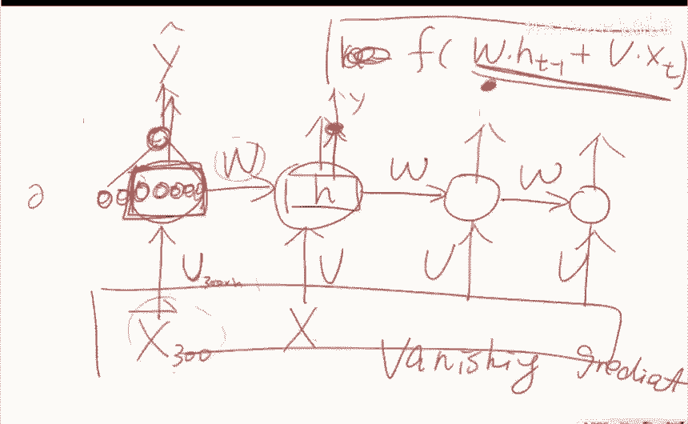
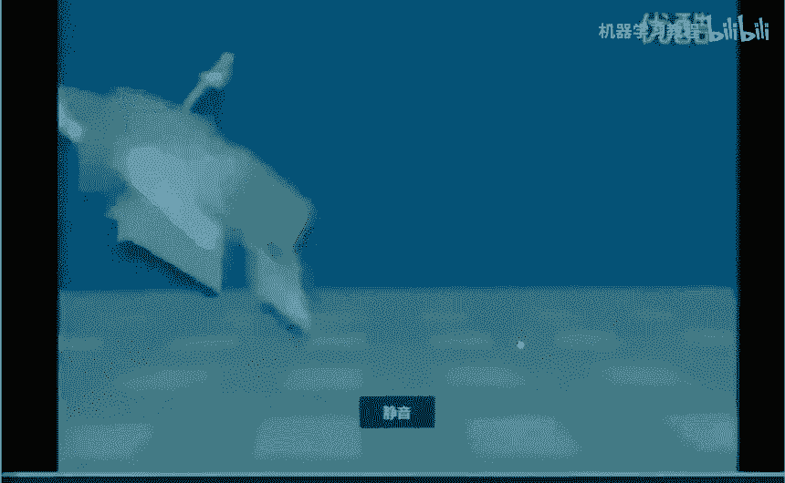
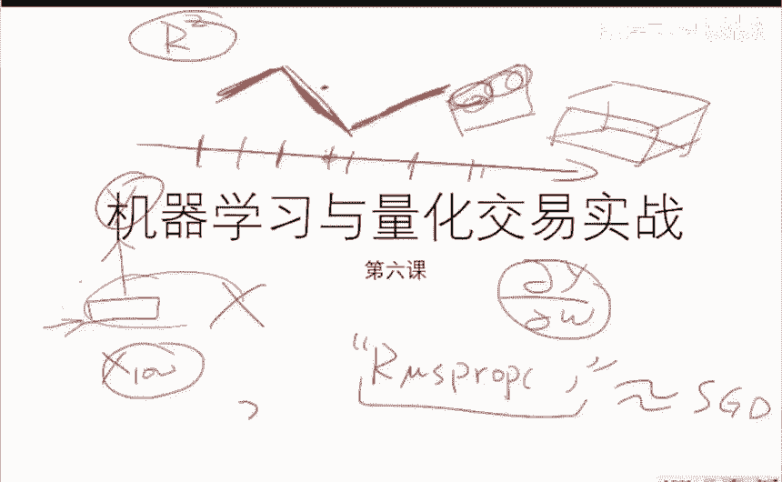

# 26集全！B站目前唯一能将【量化交易】讲清楚的教程！用AI从零开始打造你的交易机器人！大数据量化交易／机器学习／Python金融分析 - P6：06策略建模：基于机器学习的策略建模 - 机器学习教程 - BV1w4421S7Zx

嗯今天讲的东西比较多啊，啊差不多四次课的时间，我争取压到一次，因为大家点菜点的太厉害了啊，嗯咱们来看啊，今天大概讲这么几件事情哈，主要第一个是啊，那么今天的主题是特征选择。

就是基于我们上一次他这个课程啊，就是已经，如果当你已经有一个这个原始的，所谓的肉data之后，我们怎么样的通过各种的这个啊啊啊，所谓的这个啊transform，就相当于一些变化。

变成我们所需要的在每一个时间点上，每一个time，它所对应的这个X和相应的这个Y值，和你想预测的这个Y值，这个叫做所谓的这个训练集对吧，我们上节课已经会嗯，嗯主要讲的就是说我们怎么制作这些训练集，Ok。

那么这节课我们的关键是，我们怎么样把这些训练集进行，第一步的，就是说我们把这些训练题做一定性质的，所谓的这种你可以看成一种优化，而这个优化的方式呢叫做feature selection。

就是说因为我们现在上节课选的这些X，都是拍着脑袋选的，经常一选可以选300位，但是300V有可能有的是冗余的，也有的时候有可能是啊，每一列它的数值都一样啊，这个也是很有可能的。

比如说你不小心选了一列进去全是零啊，这怎么办啊，那么我们今天就学各种各样的优化方法，来选出来一组比较比较这个啊啊，这个开了挂的这个X，因为当年X的质量好的时候啊，你用一个这个分类器。

才能分出比较好的一个结果，当你X的质量很差的话啊，你用再好的这个分类器也很难得到啊，一个很好的结果，OK那么大概是讲这三件事情，一个是特征选择的一个主体的这个啊啊啊啊，一个一个方法。

就是说特征选择的这个过程是什么，和它的意义在哪，另外呢给大家啊介绍一下遗传算法怎么用啊，然后呢基于这个我是特别的想讲，就是啊，这个就是真正的让让大家真正理解。

所谓的back propagation这个算法，因为其实现在讲各种深度学习的啊，博客也好，书也好，还有各种各样的课程也好，他们更多的是关注的这个网络是谁跟谁连的，但是呢如果你要做稍微体面一点的。

真正应用的话，你如果不能真正的掌握BP算法的本质的话，你就很难理解一些目前比较先进的一些，关于神经网络的一些应用，然后呢再基于基于基于这个BB算法，我接着往下呢给大家介绍一下，你怎么样用这个啊。

RN为什么要要讲这两个呢，就是遗传算法跟这个神经网络是两大并行的，玄学，就是嗯没有什么理论很强的理论背景，但是呢在实践中又极其有效，而我们在这个课里头，我其实为这个事情也想了很长时间，我也很稳定为为难。

就是说如果用两到三个小时教给大家，什么是贝叶斯方法，那这个事情实在是啊太难了，因为大家的这个背景也不是太不是太一样，那么又得交给又得照顾到，如果没有好的数学背景的同学啊，也要照顾到。

我们毕竟是量化教育呃，呃与机器学习实战，又必须得让大家真正掌握几个，真正能够在实际中运用到的人工智能的算法啊，然后时间还有限，所以我想来想去，我觉得如果大家，诸位今天能把这个神经网络和遗传算法。

两个真正掌握了，并且能应用到实践中的话，嗯也是非常好的一个事情，这个是这两个是啊很棒的两个方法，嗯不会给大家制造太多的这个所谓的啊，各种的数学门槛也好，还是其他的门槛也好，就相当于降龙18掌教你一掌。

亢龙有悔啊，你拿这个别人来了，你都用亢龙有悔打回去就行啊，嗯就是说嗯比如说你一把AK47吧，啊他也许比其他的这个课啊，比其他的工具啊，看上去要不是那么的装逼啊，但是呢在实际实战应用中还是相当不错的啊。

这是第一个第一个事情好，那么大概就是然后我争取用两个小时啊给啊，但是啊想讲这两个的另外另外一个原因是，目前市面上讲这两件事的博客和书，都都太不好了，我我目前没有找到一个比较体面的。

真正能把这两件事讲清楚的一些东西，所以我觉得那也是我挑选这两个方法的，一个比较重要的原因啊，嗯OK那我们现在开始上车好，那么先说上次作业哈，就是昨昨天就是啊，不是前天周六啊，周六的最后一张PPT。

我给了你们一个百度网盘的链接和密码，那个里头是我帮你们做好的一个训练集，training x跟这个对应的这个Y，你要对Y做一个预测啊，把那个real啊Y那一列啊，就有一列都是零，你不管。

那么那个是我加上去的啊，你就你就直接预测这个real y就行，然后呢就这个X我已经帮你到都提取好了，数据比较大，那么最后一个批啊，最后一个作业呢，最后一个作业就是啊啊啊啊，我就我就帮你把数据已经做好了。

你要干的事情，就是用各种的机器学习的这个这个方法，用各种机器学习的方法来来来，在这个数据集上做一个回啊，回归任务，做一个regression的一个任务，做完regression任务。

你不是有他真正真实的Y值吗，你有你这个prediction的Y值，然后呢，你就要汇报你的真实的Y值跟prediction的Y值，在我给你的这个训练集上，因为这个数据是跟时间有关的，如果你把它呃。

就是把这些数据进行重新的排序的话，你很可能你的性能很好，但是是假的啊，就是说你用前70%的数据做训练，你在4%后30%的数据上啊，请给我汇报你的这个R方值，然后呢你最好你先用一个这个benchmark。

最简单的方法，你至少用一个KN，用一个这个线性回归，你在我给你的数据上跑一下，汇报一下线性回归在测试集上的R方值，汇报一下KNN在测试集上的R方值，然后加上今天今天我会教你怎么样的选出来，从这个X中啊。

那么多列中选出来一些比较好的子集，然后你再基于这个特征选择之后的方法，再做一个啊新的一个模型，然后再汇报最好的表现啊，这个是一个比赛啊，第一名的同学是有奖励的啊，有一个人说卡其他人卡不卡不卡不卡好。

有一个人说卡我就不卡，好好好，那我们接着往下走啊，那我们就是这样啊，先用比较简短的时间，我们说一下这个特征选择的三种方法，比如说我们X比如说我们的这个X，每一个时间时间的X我没有X1。

一直到XP大概有P个P，有可能比如说等于300，也可能等于1000，也可能等于20，而这个啊这些X呢是你拍脑袋自己弄出来的啊，就是说你觉得这个东西也有用，这个东西也有用，什么东西你都掉进去了。

这是一个原始的X，那么基于这个原始的X来做，那肯定是不好的对吧，那么怎么选呢，大概有这么三种方法，第一种方法就是所谓的叫呃呃这个子集选择，就是说我们呢我们选出来啊，用某种方式选出来，这不是300个的吗。

我们选出来30个啊，这30个我们在这30个上做预测啊，这是第一种方法，就说我们选一个子集出来啊，第二种方法呢是我们也不选一个子集出来了，我们让这些系数呢啊比较有规律的啊，比如说这个X啊。

xi它不是很重要，那么这个系数它就会自动的为零啊，这样的话就作为一种选择，那么这种东西其实呢我们之前的这个拉so，干的就是这事，对不对啊，这个讲过了，所以说SHAK讲过了。

然后呢降维是另外一种完全不一样的方法，它是什么意思呢，它是说这个子集选择我选出来的东西，这些X的值是不变的，我只不过是选出来的其中的有限几列，而这个降维呢是直接把这300位直接做一个。

比如说我一个300维的一个向量，X3001的一个向量，我用一种函数给他，就是说我用我用这个函数就能给它变成一个啊，比如说啊啊啊啊，Z它是在20维度上的，而这20维的向量是这300维的某某一种。

线性或者非线性的一种组合，就是说这个这种降维的手法转换出来的东西，它的每一列的意义，跟原来的300列是一点都不一样的，就这也就是说完全相当于变身了一下，变变身了之后，然后再做再做这个新的。

在这个新的数据比上在做啊，回归或者分类任务，比如昨天有人提提到了说啊，我用一个auto coder行不行，没有问题，auto coder就是降维的一种方式，PC也可以啊，SVD也可以。

还有各种各样的起音技巧都可以，对PC没问题啊，可以做啊，一般多少维度需要降温，这个不好说啊，嗯降维的意思并不是说我想画到平面上，而只是想把一些某一些类间的，一些这个这个VANCE进行某某种的伸缩啊。

好啊，那么我们今天先用啊，先看看最简单的我们怎么选一个子集书了，好吧，就是说我们选子集，其实它它难是难在哪呢，是这样啊，先说一下评价标准，比如说我们现在有一堆这些X，有些这些X它好还是不好的。

那么我们就可以计算这些X跟这个所谓对应的，Y值的方值，阿峰值是在二方值，这个二方值大家回去查就会有一个公式，待会我会给出这个相当于一种指标，来判断回归任务的好还是不好，那么他最不好是零，最好是一啊啊。

那么就是说那么我们要选的时候，我们如果有pig向啊，pig变量，我们每个变量可以选择或者不选，所以说如果我们暴力的来猜，我们最优的这个子集组合的话，那么它是指数级别复杂度的。

如果你要暴力的全部把它枚举一遍的话，你是枚举不完的，所以说就有一种啊，你要你没法得到一个最优解的话，那我们只能逼近这个最优解，毕竟这个最优解，最优解的意思就是说我们选出来这个子集，它的峰值最大啊。

这个就是这就是我们的目的，那么一个最简单的方法就是所谓的贪心啊，就是从算法上的角度就叫贪心啊，先看暴利啊，这个这个是纯暴利啊，纯暴利，就是说我们比如说，因为我们现在甚至不知道最优子集的。

比如说我们原来是300个变量，我们甚至不知道最优子集应该是五个变量最好，还是十个变量最好，更不用说如果是五个变量，最好是哪五个变量最好，那么我们能干的事情就是草，那就暴力吧啊我们假设最优质的是一的时候。

我们把那300个全试一遍，最优子集是二的时候，我们选300个，选两个啊，全部试一遍，最后只一三的时候，我300选三啊，就是排列组合嘛，我把所有可能性全部暴力的撸一遍，录完之后呢。

我们汇报那个具有最大的R方值了，或者呢是这个最大的是AC或者BC值的，那么这几个这几个这个评价指标，都是对这个特征的一种评价啊，具体哪个好，其实有的人喜欢这个BIC，有的人喜欢AIC。

有的人用R方就蛮不错，这个是一个完全的一个，没有什么很有道理的一个方法，他只不过是一个评价指标而已，那么这个是最暴力的方法啊，在这个最暴力的方法，当你的这个维度，比如说我只有五维的时候。

可以暴力的马力变啊，但是维度一高的话，这样做就不好了，这样做肯定是有问题的，那么一个所谓的这个想逼近最优子集的一个，只需要走一个for loop的，就是ONON复杂度的算法，他是这样做的，他这样做的。

他就说啊，OK那么我们现在就是嗯嗯假设我们的X有X1，一直到XP，然后最优的这个是我们的整个的这个空间，然后最优的这个集合，我们现在刚开始不知道的，那么我们就暴力了，我们先选一个。

就是如果我们最优质的只有一个的话，他应该是谁，就是说最牛的那个X哎，就是最最重要的那个变量是哪个，那我们的暴力的就单个的算一遍，比如选出来的X8啊，如果比如说这个这个300维的一个回归问题。

我们只能做一个一维的回归的话，我们发现X8是最好的，那我们就把X8放进去，然后呢如果是再往上加的话，就我把X8固定了，不要像之前那样是N选二或者三或者四，我们就把这个X8固定了，再在剩下的这些里头选。

如果我要加一个加哪个最好，就相当于每一步最好，然后就啊这么跑一遍，跑完之后呢啊返回最最好的那个组合啊，就是比如说我加到某一步，我再加就加不上去了，那你就就返回一个啊。

只有十个变量的一个selection，这个是非常简单的啊，有一个比较有效的一个东西叫做forward selection，这个都很简单，大家有问题的，还有一种方法是它是所谓的叫做backward。

这个我就不讲了，Awards selection，它是倒着来，他就说我先把这这这300个我全都要，然后我只比如说你只要我开除一个员工啊，我具体开除谁，那么我就一个一个的啊，我开除X1的时候。

我算个二方值，开出X2的时候，我算个二方之，开除X300时候我算一个二方值，我把把R方值啊，降低最少的那个员工给他开掉啊，有你没你都一样，我把你干死，就是倒着从最多降到最少，这个是啊穷人的做法。

先先如果我这公司只招一个人，谁能给我这个公司带来最大的价值，先把那个人招上来，然后再招一个，如果这个人已经入职了，我再再再该招谁啊，一直招到啊，不用招了为止，这个这这个变化从就是如果你早生了30年。

这个算法就是你的没有任何天才的成分概率，关于我说的前面这些所有的玩意儿啊，这些东西都是日常有人天天在用的东西，我说的很快，是因为我后面东西更重要，我需要把时间留出来，大家有问题没，XX1是一个维度。

X8是一个维度，整个X是一个向量，它是P维的，计算的时候X是代入神经，我目前还没有神经网络，咱先不说神经网络的事哈，训练集和实际的训练集要求当然一样，因为我们算方的时候是在训练集上算的啊。

咱们咱们就先问我讲的东西，降维的东西，我后面讲，有不卡的没有没有没有，好好好好好好好有一个不卡的，咱们说好啊，一个不卡咱就不说了啊，好，那么现在咱们讲，真正我非常激情的和我想讲的两件事情。

因为这两个东西我发现呃其实不难，但是网上讲明白的实在我没找着，所以我觉得草那这个事情我还是讲一下吧，啊讲一下先讲啊，第一个巫术啊，遗传算法，第一咱们讲genetic algorithm。

这个一般算法很牛的，这个遗传算法不仅是在特种选择里头，我们在今后的一些选股的里头，它因为它是什么呢，它它它是一类没有什么就遗传算法的神经网络，都是基于生物生物现象，就是Inspired。

他们都是一些inspire algorithm，就是说他们是从生物学中获得一定灵感的，一些算法啊，它是不是真实的对生物的模拟呢，你说这个是呃神经网络是不是大脑，它它它肯定屁也不是，但是呢它是从呃。

呃这个脑细胞中获得了一些灵感，而发明的一类数学模型一样，这个遗传算法是它从DNA中啊啊啊啊，获得的一些灵感，他能干的事情是各种的你的优化理论，比如说我有一个问题，我想找出最优的那一个啊。

或者最优的那一个可以是最优的一些子集，也可以是最优的一种投资组合，就是这个最优是由你定的，他都能干，而且干的呢其实相当不错，相当不错，在很多地方跟这个神经网络是并驾齐驱的，它是广泛地应用在各种的领域中。

在金融中就也不用说了，那么基于啊大家的人，目前对这个呃呃呃这个呃呃进展来说，我觉得是时候把这个东西教给大家，如果会了之后呢，啊就是环游师交给傻姑那三叉子啊，你就能把吴某李莫愁能能能查跑，就一点也不丢人。

你用遗传算法一点也不丢人，如果把它用好的话，那么课后呢我会给大家赠送一本非常好的书，这个书网上买不着啊的一个电子版啊，就是网上没有盗版的一个电子版，然后这个这个书里头对遗传算法的各种实现，讲的非常好。

还有一些很好的例子啊，这个是后话，咱们先听啊，先听预传算法究竟是个什么玩意儿，好吧啊，那我们现在开始好遗传算法，这样他的理论依据很简单，第一个理论依据是关于种群的，就是说比如说我们现在有一个一个种群。

有2000个个体，然后这2000个个体呢，嗯如果适应环境的就活下来了，不适应环境的呢就死了，然后活下来的人呢，他在跟活下来的人再再再进行交配，然后生下来的子弹呢不行了，又死了活嗯好的呢又活下来了。

然后大概这么1000轮迭代之后啊，那一拨人就是最优秀的啊，相当于啊就这么一个很简单的理论，第二个是关于这个，那么每个人他的它的好坏是取决于它的基因的，所谓的DNA，那么大概用2分钟时间。

给大家上一堂高中生物课哈，就这样，这个是你的细胞，好吧，这是你的细胞，这细胞里头呢你有一个细胞核对吧，细胞核呢比如说你是有假如说嗯最简单的情况，一个生物它必须有两条染色体啊。

两条染色体染色体上就是就有DNA啊，那么DNA就包含了你所有的这个信息啊，这个呢是这个是你妈妈给你的，这个是你爸爸给你的，OK那么我们平时的这个细胞分裂呢，平时的细胞分裂就是简单的。

你目前有的两个DNA进行了一次复制，然后一变二了，那么你就是你的体细胞，你就会依然隔一段啊，没有任何问题，他们是完全的一种复制啊，那么性细胞是这样，性性细胞是叫所谓的啊。

对减数分裂解说分裂还是这样分的啊，就是它分完之后呢，他这每每一个细胞呢就只带一个了啊，就是说我进行分裂的时候，我不复制啊，那么每一个就只带一个了，然后这个呢比如说是啊啊一个男小男孩的啊，这么一个性细胞。

然后一个小女孩的呢再把他的贡献，然后这两个呢在，但是呢啊啊就是说他们在从体细胞啊，变到这个呃这个呃生殖细胞的时候，这些东西就发就会发生一些变异，就是这个位点零啊，从从从从比如说从A就变成T了。

这个位点从T就变，就就相当于有一些数就会就会变叫做变异啊，然后第二个呢他会就是他会crossover，就是说他们会这个片段呢，就跑到这个片段上去了，就是这两这两个片段就互换了。

所以你你这个你这个生殖细胞的这两个东西呢，跟原来就不大一样了，就是有的地方是不一样的，就是有的地方的数值不一样的，有的地方这个片段呢，这一段本来是这一段身上的，他们两个给交换了一下啊。

这个是遗传算法的一个关键的一个灵感，就遗传算法主要是从这儿得到的一些灵感，然后那么你产生的这个东西跟另外一个啊，小朋友的东西结合之后，就变成了一个新的细胞，注意哈在在变异跟这个呃。

呃就是说在基因变异跟基因的这个重组，就是说呃这块的DNA跑到了这块去，这块的跟他交换，这个部分，是只是会发生在你奶奶跟你爷爷的身上，而而你爸爸跟你妈妈在造你的时候，他们两个的DNA是不会产生这个事情的。

他们就简单的一个结合了，这个是相当于一个最简单的高中生物学，那么它里头有很多更复杂的东西，那么这个这个数学模型它没有他没有考虑到啊，好好那么啊，那么那么就这么简单的一个事。

咱们现在看看咱们怎么样的对这个事情建模，并且来寻找一些函数的最优点，选寻找出来一些最优的一些事情，好好，那么我们现在开始它其实很简单，他就是这样做的，他这样做的，他是这样。

这不是比如说啊DNA它的表示方法是，比如说t cg啊，有的时候是这个啊啊啊T，有的时候啊啊对应的是U啊，这但是生物学家是用这个啊，这个这个这个啊四个东西表示这个我们不好。

他是生物学家干这个事情是base for，就是说它它是一个四进制的，这个没意思，我们计算机一般来说都是二进制，我们喜欢用零一啊，那么这个零一呢，可以表达你的这个问题的任何一个一个选择，比如说举个例子。

我们这个X一一直到X300，我们最想要一组，最想要一个最优的个体，这个最优的个体代表了我要不要这个变量，比如说10011001，这组叫做这个叫做基因型基因型，这个叫做表现型，叫这个是GENOTYPE。

这个是phenotype表现型，就是说我们刚开始在建模之前呢，我们先先要定义一种定一个映射，就说我们想要的东西是这300个维度里头，我们选出有限的一个维度，而我们用基因来表达这个问题呢。

就是说我们想要一个零一的这个向量，这个向量呢啊如果是一就代表我要它，如果是零就代表我不要，那么我们刚开始的时候，我们是不知道这个到底是100，一零还是1000还是101，这个不知道的遗传算法就会通过啊。

50轮的这个迭代或者眼镜啊，就会给你找到一个最牛的一个个体，能够存活下来的，这个是我们的这个所谓的问题的set up，我们把问题先啊先先摆出来，大家有问题没有没有问题好，那我们接着看接着看，就是这样。

那么比如说我们现在有，我们现在有一个种群，那么我们就要从种群中选那个最好的人哈，比如说我们有很多种群，这个种群的每一个个体就是它的基因型，比如说这每一个杠杆，就是每一个零一的一个串串。

这个就是我们的所谓的基因型，对不对，那么我们刚开始的时候，就是说我们刚开始是有这么一个种群，我们先初始化，就是我们编程的时候，我们先初始化1000个随机的零一的串。

那么这个是我们所谓的刚开始的这个population，长度不一样，是因为我待会儿要画其他东西，我画不，但是其实它们的长度都是这个300维的，一个零一串，那么遗传算法的第一个啊啊idea。

就是我有一个所谓的从population，他们的一个叫一个一个变异，一个叫做mutation，它是变异，变异是什么意思呢，编译就是我随机的取一些位点，随机的在这些X呃，在这些D呃，呃这些零一串上。

我选择一些数，让它从零变到啊，就是呃就是让他从零变到一，或者从一变到零，这个没问题吧，就说我随机的让一些这个呃DNA的位点，给它进行变异啊，就是让它的基因型进行改变，因为有的时候。

我们比如说要求一个函数的极值的时候，它可以不是零一，它也可以是1。2，5。3啊，3。7没有问题，那么在这种情况下，比如说我们要求一个函数，求一个函数的极值的时候，它的基因型也可以长。

是一个实数的一个连连续的一个向量，那么我们这里的变异，就相当于我们对随机的以某一定概率，那么这个概，这个概率就是我们预先的一个超参数随机的，比如说以0。05的0。05%的概率。

让每一个这个位点产生一个变异，那么它还还会有一个这个啊超参数叫step size，叫做步长，就是说我变异多少，比如说1。2，我只能在正-0。1这个范围内编一个随机数，对吧，你不能你得限制它。

不能变异的太多，这是这个是遗传算法的，你能干的第一个事情，OK第二个事情是什么呢，遗传算法能干的第二个事情是这样，我刚才也我刚才也说过了，第二个事情我们能干的呢是啊，所谓的这个cross over啊。

叫做，他是什么意思，他就说我随机的选一些两两的一些对，让它在某一个区域里头互换，就比如说这个这个种群中，这这两个他没有变啊，这两个呢他以前是以前是嗯嗯，就是说他以前这一块，比如说我换一个颜色吧。

比如在种群里头，这是两个，这是两个不一样的哈，那么我们要进行一个叫做crossover的一个基因重组，基因重组他干的事情就是他重组之后的结果，就是这条中这一段是他的。

那么他的这一段呢是这个红色的这个DNA的啊，就是说我们啊这一段东西，我们进进行一个啊啊啊一一个swap，就是说啊他他的信息到了啊，甲的信息到了乙的身子上，乙的身信息到了甲的身子上。

那么这个选择也是有指数指数级别多的，就是你能够以就是它的这个随机性是非常大的，我能够非常随机的来做这件事情，对不对，这个是第二个第二个干的事情，第三个干的事情呢，当我们有了变异了啊。

有了这个cross over了，那我们呢就要从这个基因型到表现型，我们来把这些人给他造出来，就是每一个基因型，我们对应的是我们这个问题嘛，就是我的具体要选哪一个X。

那么我这些表现呢我会定义一个叫做适合函数，Fitness，就是大自然就开始选了，在这个里头大自然选的这个函数就是R方值啊，你给我一个呃呃组合策略，我给你个R方值，然后呢，比如说这个人他的二分值是0。8。

这个人所对应的二分值是0。2，那这个人就死了，就是它对应的这个DNA，如果是这个的话，那么就说明这个DNA是不好的，这个组合是不好的，那么他的这个呃这个这个适合度大概比，比如说是0。7。

那么呢我们在用一种阈值，我们把好的人选出来，选出来一个子集，比如说这是啊啊四个DNA啊，这五个DNA我们变成了三个，变成三个之后，把这些东西我们再迭代着再来一遍啊，这就算是一个generation。

一代人就这么产生了，然后就不断的这么来玩这个事情，当你玩十次的时候，你就会选出来非常棒的一些人，有问题没有，那并不能保证收敛，就只能你就走到一定程度，一般来说种群如果你足够大，就就遗传算法牛的地方。

就是当我们的种群足够大，因为我们的这个随机性非常的大，任何的非凸的问题就是凸凸问题就是凸优化呃，遗传算法做着不在话下，极其快的就收敛了，非多优化做的甚至比很多骑行技巧都来得好啊，这些0。2，0。

8是你的这个函数的定义出来的，就是说我我们的问题是，要找一个最优的一个东西，那最优这个东西你肯定要定义是什么，比如说我们要找一个函数的极值，那这个函数你得知道，我们要找一些这个X子集的选择。

那个fitness就是这个R方值，这个是你的问题的一个定义，表现型是所有基因的集合吗，不是表现型，就是说我们的这个基因所对应的，真实的问题是什么，比如说我给你一个这个呃，在有有的情况下。

表现型就等于基因型呃，但是比如说在这个特征选择里头，我们的基因型是100101串，很没有意义的编码，那么它背后的意义是我要不要选择某一个变量，那么嗯还有很多人要干的事情，是一个叫做啊求一个函数的最大值。

比如说嗯举个例子哈，比如说我现在告诉你有一个函数，它是一个黑黑核函数，这个函数不知道它的系数是多少，但是你给我一个X，我会给你一个Y，我们现在的目的是什么呢，我们现在的目的是请你告诉我X等于几的时候。

Y能够最大，这没问题吧，这是一个呃很经典的一个问题，那么遗传算法怎么做呢，比如说这个X比如30维的，比如说X是30维的，那么呢遗传算法就是表现型和基因型就一样了，我的X我随随机的生成一个30维的。

一些一些向量，0。11。29。9，它是一个30位的，我比如说我随机生成1万个这么多的，这么多的东西，那么这个里头的非NESS是什么呢，这个里头就是我们对这些这些个基因。

我们每一个人我们算一个这个FX我谁大谁活啊，谁小谁死，因为我们要找最大的，这个还不是机器学习，还没有机器学习的事啊，真实的Y就在训练集里头啊，你的训练集必须得有个X得有个Y监督学习嘛，再提2分钟的问题。

基于这个算法，遗传算法的理论很难，因为你们可以看到遗传算法跟神经网络一样啊，它的地方就在于没有什么理论，但是就是works，所以学术界不喜欢啊，但是工业界很喜欢，因为他们不需要证明。

他们只需要能用就行啊，怎么样，我马上就会跟你说啊，你看这个不就是选择遗传算法，这个用法就是在做这个就是在做这个啊，这个这个变量选择中就可以用，我已经，其实我已经把做变量选择的方法已经介绍过了。

这里没有Y，这里的Y值就是我们的要预测这个东西，因为我们有一个Y值，我们有一些X我们要计算一个R方，这个R方我们是会算的，对不对，这里的Y就是你你要做的回归任务的这个Y值，这超酷这个这个东西。

而且非常好的，就是它非常容易实现，唯一要注意的就是要最好能够并行化一点，因为我们动不动一生成就生成1万个啊，这个种群的数目，这1万个里头，我们每一个都有可能进行一个变异，每两两个都有可能进行一定的杂交。

那么你串行的写就就就不大好，皆适合一切优化问题，像我们选择一个特征的一个子集是一个优化啊，一以后我们要讲的，比如说我们现在有1万只股票啊，再举一个例子，比如说我们现在有N只股票。

这支这支股票我们到底选谁，那么也可以把它看作一个选择的问题，就是001001啊，就是选择这支股票跟这支股票，那么他的这个呃我们要不要做一些其他的东西，我们这些变量都能放进去，然后我们进行一定系列的遗传。

我们选出来一个最最好的一个一个串，它背后的这个表现型就是我们要干的事情，他他他能做的东西太多了，都可以啊，都可以有我，我课后就会给大家一套，别人做好的一个一个东西，嗯嗯啊，冯老师讲课不会说。

光给你个算法，告诉你他没有办法实现的股票，这个例子就是Y就是你要预测的这个值，就是，price of t加一，或者return of t加一，再说一遍，fitness的函数是你要定义你。

你看你什么时候选，你什么时候说，哎老子今天要用遗传算法，你得先有一个问题啊，你的问题是要找一个函数的最优点呢，还是要找一组啊X的一个好的一个组合呢，那么你得先有这个fitness的函数。

你就说我需要找一些东西，让它的这个fitness最大，但是我不知道怎么找啊，因为我不会凸优化或者非凸优化，那么遗传算法能帮你找，所以说如果不知道fitness这个函数的话。

你什么时候你就不可能会想到遗传算法，这两个是反的，就是你得先有fitness，就是先有你的问题，你的问题现在是选择N个X，让这N个X的R方值最大，OK那这个R方值就是你的fitness，对不对。

我要选出来一组这个X是这个fitness，就是说你给我一对X，我算一个fitness，那么我算一个R方值，谁大了，谁活谁小的谁死，对不对，那么如果这个同学你问非的例子是什么呢。

在这个例子里头可以是R方值，在其他例子里，它可以是任何事情，嗯就是说我们现在有一个问题，就是说我们要有一个目标啊，就是说一般来说是max或者minimize，一个东西，一个东西，一个fitness。

它有一个输入对吧，finish啊，这个X我们现在是要max或者min一个X是变量，fitness是给定的，是你目前在量化中遇到的一切的问题，如果是一个最大值或者最小值的话，遗传算法就能够给你找到一些X。

让这个X呢，当你啊在你给定这个分类里头算的时候呢，它是有可能取到最大的啊，他是这样，这个不好说，复杂问题的迭代次数多，简单问题的迭代次数少，但是呢一般来说你迭代，比如说你已经迭代了，迭代了100轮了。

它就其实就已经有最好的了，你叠你多迭代了900轮，不会造成，就是说你你你多迭代几轮不会有太大的问题啊，因为那个牛人的DNA就一直，他的血脉就就就就下去了，好再说几个遗传算法中的一些细节问题，细节问题。

细节问题就是说我们我们再回头看这个图哈，这个图很棒啊，这个图，大家这个图我还是不要再对他进行一些侮辱好，那么这个图，那么现在有一个问题，就是我飞的那次怎么选，OK我算出来这个分了，这没问题啊，0。80。

20。7啊，这个人的face是1。3，这个人的finish是50，因为我这个这个finish他它它不是一个概率，对不对，它它是我这个函数的一个实数啊，有的非内说不定的吗，还是负的呢，怎么办啊。

然后那么我们怎么从这个总群里头，我们选择一些嗯牛人的这个这个血脉出来呢，啊那么一种比较简单的这个选法呢，他就是这样，就是说这是第一种选择的方法，第一种选择的方法就是说我用概率来选，概率选是什么意思呢。

比如说我这个啊，我目前的这个population，这个群体中有有一号人，2号人，3号人，4号人，5号人，6号人，然后我就一个一个的看啊，比如说一号人的fitness，比如它是1。2，它是0。3，它是0。

1，肯定死必死无疑啊，他大概是1。5啊，这是啊，当年他的fitness这样，那么我们是我们每看一个人，我们就随机的扔一个random number，Random number，比如说它是0~1的一个数。

那么就是说我我以某一定的概率来选择，要不要这个一号的人留下来，那这个概率可以是什么呢，就是说我要不要选一这个人的概率，它可以是这个111这个一号人，他的fitness除以整个的这个fitness。

这个和那么他这样的话，就每一个人他其实就是一个概率了，对不对，然后呢那么比如这个概率算下来，算下来之后，比如说是0。0。0。6，那我那么就是说，我们想让他以60%的概率存活下来。

那么我们怎么样用程序实现这个事儿，我以60%的嗯概率来要他呢，很简单的一个小trick，就是我们先让计算机随机生成一个数，看这个数生成的这个random number，跟0。6进行比较，如果它大于零了。

我就啊啊要它，如果它小于零了，我就不要他，那么我们具体选的时候，我就这样用，每一个根据他的fitness来来生成一个随机数，看这个随机数是否大于一个阈值，因为这样的它的等效的命题就是。

我以百分之多少的可能性把它给要进去了，O他没有过拟合的问题，因为这个我们没过拟合，是函数的这个逼近的问题，而我们现在是找一个函数的最大点或者最小点，他唯一有可能是陷入局部最优啊，它不会有过拟合的问题啊。

不是小于0。6，是它跟0。6的差，一一求差，如果他如果他嗯，我看看啊，如果它小于零小于零，就说明我有0。6的，如果它小于零就要好对，就是说我们用南派里头就是那男NP点run，DM点random。

这个函数，它就会在0~1之间有一个有呃均匀的产生，一个以均匀的概率产生一个随机数，如果他这个比如说0。6的话，就是0~1之间，如果他如果它落在了这个区域，我们就要它这是我们的threshold0。6。

所以就它跟0。6比它的差小于等于零的时候，我们就把它要进来，对小于等于零，大家说的很对，因为这些东西也是我啊啊对对啊，就是我们尽量的相信一个啊，函数库所提供的伪随机数的质量啊，为什么要跟一个随机数比较。

因为假如说我就是就是说，我现在要说的是要说的这个事儿，就是说我们如何实现以0。6的，就是以60%的概率，要一个人或者不要一个人，那么有一个小的一个一个实现的一个trick。

就是我们的implementation的一个问题，这是纯纯粹的一个implementation，怎么样实现这个事，就是我以60%的情况啊，让这个X1放到我这个列表里头去，你怎么实现呢。

啊你要你你你你实现的这个方法，就是我random出来一个0~1之间的一个实数，我让它跟00。6比，因为我random出来0~1的一个实数，它60%的可能性，都会在这个零到0。6之间，因为它是均匀分布的。

如果他不在零到0。6之间，就说明它是40%的那个情况，那么我就会比较我这个random出来，这个数跟0。6比，如果他在0。6这个区间里头，就说明这是60%的情况，那我就要他这就一个小的一个trick。

ok FA好，那么就是说这个0。6是怎么算出来，0。6是基于fitness数算出来的，就是说这号人物，我为什么让他以这么大的概率活呢，是因为草人家的菲特尼斯很大呀，他的finish怎么又映射到概率了呢。

啊很简单，我把他的fitness除以整个的finance和，就是你能你应该活的，这个你应该存活的这个这个概率嗯，另外一种基于概率的，基于概率的衍生，就是我基于rank，基于rank来的，意思就是说呢。

比如说嗯我也不需要非要定义出来，那么硬的一个概率，我只要让我表现最好的那个人，以一个比较大的概率活下来，如果没有选到他的话，我以这个概率选择表现第二好的点点点，这么往下走啊，然后呢。

呃目前大家实现的一般是要有两个这个事情，一个呢一个是基于他的fitness，另外一个呢是要这个种群的diversity，就是说，比如说我现在已经选了一号人，2号人跟5号人了。

然后呢我要计算这个群体里的这个VANCE，然后我要求我每加进来一个人，我要让这个种群的多样性要尽可能的多，就是说我加进来的下一号人，最好要让这个种群里这个VN最大，谁最大，谁进来。

在在他的这个fitness比较相近的这个前提下，这个有点像我们这个这个啊学过微观经济，你就知道这些都是有taliate function，那么就是说我的diversity就是种群的多样度。

跟我的fitness它是有这么一种啊，就是说啊啊就是他们的贡献是一样的，我们尽可能的在这些线上选择，选择它的一个组合，就是说我非得很高了，但是如果我不能对这个种群的多样性，进行一个贡献的话。

我有可能妈的选的十个人，这十个人都是一个模子里刻出来的，那么根据啊，这个达尔文的这个这个这个这个这个理论，如果一个种群只有一个人的话，就是如果一个种群里头他没有多样性的话。

很可能他就会到一个函数的一个局部最优，它就出不来了，所以尽可能的要让这些X长得都不大一样，这样的话才能够让大家在这个函数的寻址空间，中的各个地方保障啊，避免它达到一个函数的局部最优的这个问题。

多样性的度量标准可以由你定义，这有各种各样的千奇百怪的度量标准啊，你一个比较简单的方法，就是计算他的这个这个这个，这个这个这个这个这个这个VANCE，也可以是比如说你计算就是他的。

你可以计算它的entropy，计算它的熵值，这个这个问题应该这个你应该你应该想想，应该是能回答出来的，因为我们在决策树里头，我们决定要不要切这一刀，其实就是说要让它的多样性越来越小。

就是要让他们的这个越来越不混乱，所以我们用这个熵值也能定义它，没有问题，最终选出来的是一群人，而这群人在这个函数上的性能都要么是最低的，要么最高，就是说都是你想要的那一群输入，要的是一群书。

我们的函数是不知道的，我们也完全不想知道这个函数是什么，就是机器学其实想通过一些点来拟合，这个函数是什么，而这个优化理论是我把函数固定了，你这个函数，反正呢我能不断的给你个X，你给我返回一个Y。

优化理论是想找出一个函数的最小值或最大值，不是不是不是最终选出来的，就是我的这个问题的这个输入，这个输入这个东西，那么在这个里头，在我今天举的这个例子里头，这些10010它可以是一种feature。

但是在其他例子里头，我完全可以是就是就是实打实的X，我并没有进行特征选择，比如说比如说我心里头想了一个函数，是F等于X平方，但是我不告诉你，然后你就问你就说一我给你一的话，你给我几，我说你给我一的话。

我给你一，然后你又说我给你十的时候，你给我挤，我说你给我十的时候，我给你100，然后你就会又问哎，我给你25的时候，你给我多少，我就说你给我25的时候，我算一下平方2525，我就给你625。

然后你现在的意思就是说，遗传算法能够就这么长出来很多轮，他就能找出来一个X，它能够让这个函数最小为零啊，它就涨了一些之后，他就发现哦，那我给你零的时候，你就最小了，然后就不错，你猜猜对了。

那么这些东西就是遗传算法的输出，所以它可以不是一个特征选择，它是一个优化问题，而在我们这个例子里头，这个fitness呢它是一个想做一个X的自己选择，非常强大的一个东西，因为它这个是好。

那么今天给大家留一个作业，关于遗传算法的作业，玩这个事情啊，是这样，我们现在有这么一个函数，这么一个函数是什么呢，你输入一个字符串，就是就是是这样，我们就是嗯好重重重重说一下哈，就是说暴利的不是暴力的。

密码猜测问题，用遗传算法来猜猜密码好吧，猜你的这个password，比如说我要求大家输入一个字符串，Hello，空格，你也可以写100多，也就是说你能写100多个词，无所谓。

就是hello world吧，比如说你现在我需要要求你写一个遗传算法，来猜出来这个字符串，Hello world，我给你，我你能有什么呢，你能有的是一个函数，这个函数是什么呢，输入一个string。

输出的是什么呢，输出的是你，你对了的对了的字母的个数，Number of characters，Which，Is correct。

比如说啊我真实的值true value是hello world h e l l，卧槽我居然不会拼英文了，HELLO对吧，比如说我输入一个F，比如说你输入一个HE什么什么什么什么什么，其他就在那胡说呢。

那么我输出就是一个二对吧，如果比如我输入一个H，我输出是个一，然后我输入一个啊，今天的纽纽纽约时报那么长一串的东西，你输出就是零对吧，那么我们怎么样用遗传算法来做这个事情呢，啊其实很简单。

算法就是那么你就生成，那么你的DNA其实就是有26种可能性，对不对，那么你就能生成一个字一个字符串，然后就是呃啊零到每一个位点，它就是0~26的这么一个应该是27，因为你还得包括空格对吧。

0~27的一个数，比如说他是一，他是25，他是啊六啊等等这些东西，然后你就生成生成很多组种群，然后通过不断的这个杂杂交跟这个变异，然后呢是的差不多啊。

1000多次就会猜出来这个hello world的这个结果，代码很简单啊，我回头也会发给大家啊，然后以及包括怎么样用遗传算法来做这个，八皇后问题，还有用遗传算法来选股啊，这个都这个这个都会有啊。

好遗传算法有什么缺点和限制，OK遗传算法的缺点是，如果当你的你产生的这个种群，数目比较小的时候，他很难找到一个全局，就这个global就是说全局最优点，就是说你的种群最好要大。

你尽量的要并行迭代的次数要比较长，它的缺点就是有的时候不是太好预测，来做这个事情，就是说他跑到什么时候是个头呢，就是遗传算法的问题，跟深度学习的问题是一模一样的，是嗯我们不知道怎么为什么他就他就OK了。

它不适合的场景，不适合它的场景是，如果你的问题是一个凸函数的话，你直接就用SD就做，就就就可以，比如说纯粹的在寻找一个函数的极值这个问题，再加上如果这个函数它是连续的，你还知道它的一些啊这个解析式。

比如我告诉你XY等于X平方的时候，你就直接用图形化的方法就能求出B是解了，你就不就不用这样，它是一个也不能说是黑河吧，因为它是它是一个非常所谓的演化计算啊，就想在演化技术上做理论是很难的一件事情。

现在目前有一些人在尝试，但是也没有做出一些大新闻，关于遗传算法选择特征子集，建议大家去看这个算法，pose去年这个NPS的一篇论文，是一个嗯某一位老师做出来很不错的一个方法。

就是说这个东西就是就是利用了一些遗传算法，来做这个自己选择的问题，做的还可以，其实用我刚才说的那个方法就能做，这个是为了一些很懂，就这个算法是背后是有理论保证的，最后给大家留。

因为我待会还要讲后面很多的东西，给大家留3分钟的时间进行提问，我一会回来好，我回来了，那么我们接下来啊遗传算法就告一段落了哈，我们接下来讲神经网络啊，这个神经网络的真正的原理我永远都怎么讲，多少遍。

我都不累啊，那么我们给我，我给你们讲一版，你能听到的最好的一次好，关于BP啊，不是关于卷积神经网络，那个是搞图像的人用的好，下面我们看这个ANN啊，因为上次讲的还是太糙了，如果大家真正要能用的话。

那么几句话会的本来就会不会的，听完还是有点晕啊，今天让你不晕，好好好，我们赶紧上车，因为今天有可能要拖堂草，因为后面的东西实在是太有意思了，好NN他是这样，刚才我们基于种群。

我们想的这么一套很民科的方法，但是极其有效啊，等等等，我在课程快结束的时候给大家看一段视频，让大家看看遗传算法能做多么令人惊讶的事情，然后这个AN一样，AN也是一帮民科啊，读了一些这个高中的生物学知识。

他这样先说一点点的生物学原理，你脑子其实啊我们现在之间的交流，就是我们我的这一坨脑细胞，在跟你的这一坨脑细胞，控制了一些肌肉进行发声，然后通过一些电子的这些设备，传到了你的嗯耳朵里头。

然后又汇报给他脑细胞，所以我们现在在交流的本质，这么想其实还挺挺令人起鸡皮疙瘩的，就是其实现在就是一堆脑细胞，在跟另外几堆脑细胞在进行一些一些交流，那么脑细胞内部它是什么东西呢，这是脑细胞。

这是脑细胞的细胞核，每一个神经细胞呢，它它它有一个很长的这么一，个叫做轴突的一个东西，然后它上面呢它有一些接收信号的一些东西，他们这个东西呢叫树图，每一次呢就是说这个轴突轴突的这些东西。

它就是如果别人给就这是另外一个神经细胞，它的轴突是跟他接着的，然后它也有它在，它也有一些这这些啊，啊树图，来接受别的这个神经元，对他的这个产生的电信号，那么每一个神经元它干的事情其实就一件事情。

他决定是否要向下一个神经元产生电位刺激，比如说当他受到的这个呃环境给他的刺激，大于一个某一个电位，大于一个阈值的时候，他就决定发射啊，它就崩，它就会发射一个，比如说啊一个零点值是0。6。

这么大小的一个电信号，那么这个电信号它怎么决定它是不是要发射呢，是根据它的这些轴突啊，他的这些轴都，比如说这个人给了他0。3的电信号，这个人给了他0。1的电信号，这个细胞给了他0。9的电信号。

那么他们把这些电信号啊加个呃，全部加一个加加加权求和啊，WI乘以它的这个电电信号的这个signal i，那么加权求和如果它大于一个一个阈值，如果给他的刺激不够强烈，他就说啊，那我就闷声发大财。

我就不吭声啊，就这么简单的一件，其实脑细胞比这个要复杂得多啊，但是生物学家呢其实他也没弄明白具体的事，具体是什么机制，但是目前的这些机制，生物学家说OK没错，你们说的是对的，但是呢其他机制呢。

呃其实生物学家也不也也不是太清楚啊，现在脑科学还是属于一塌糊涂的一个阶段，那么我们现在就想用数学模型怎么把握，刚才说的这些话给它搞出来，我们怎么把我们怎么样用数学，把我刚才说的这些话表达出来。

好那么嗯嗯其实很简单，其实很简单，就是这样，我们这不是啊，这不是有，这个就是我们的输入其实就是这些X啊，比如说我X是300位的一个向量，有一个300维的向量，我们输出对应一个Y值对吧。

这个Y值比如说是一是一维的，那我们的输入最简单的方法，就比如说我有X一一直到啊，比如说这个啊XN对吧，这个就是我轴突啊，就是我啊树突就是我收到的这些信号值，收到的这些信号值呢啊我们是有这么一个要求。

一个求一个每一个信号值，我们对应的一个权重，对不对，X1跟W1我们算出来了一个数，然后这个XN呢，它也会有一个这个相当于给他放大的这个倍数，这个权重WN我也有一个值，然后呢。

我们把这些值呢用一个简单的一个summation，给它加起来，这没有问题吧，我给它加起来之后呢，算出来一个数，然后我再用一个阈值函数，就是说如果它大于一个T我就发射为一，如果它小于T我就发射为零。

然后我我就发射为一个零或者一，这就是刚才我说的那个神经呃，刚才我说的这个神经元的一个，最简单的一个数学模型，这其实是真正神经网络的老祖宗，perception感知器，就是这个事。

就是说我有一些输入的一些信号啊，我进行一些加权啊，乘以乘以W我我都给他加加起来，就是其实他就是说X1乘以W1，加上X2乘以W2，一直到XN乘以WN给它加起来之后，我看看他是不是跟T比。

如果大于T我就输出为一，小于T我就输出为零，这是一个神经元啊，对这是一个神经元，有问题没有，刚刚的生物模型是有的，刚刚的生物模型就是我们假设他们的，他们这个东西，就是我这个这个神经的这个这个细胞。

我怎么样决定它是否大呢，它确实是生物学家会告诉你，它是有一个全职的啊，那么这是一这是对一个神经元的一个建模，那我们对一坨神经元的深度学习，或者说是多层神经网络，他们一坨神拳，其实这玩意就是你脑子啊。

这是你脑子，你脑子里有什么呢，你脑子里其实是有的是一堆权重啊，有一堆各种各样的一些权重，和一些各种各样的一些阈值啊，以一种很奇怪的方式连起来，然后输入呢是一些信号，比如说这个信号它是N维的。

它就是X一一直到XN，然后比如说这个X1到XN，它可以是一个图片，那么它就是一个嗯，比如说如果是28×28，那个图片的话，那就是七百七百多位的一个向量输出呢，大概比如说它可以输出为两维的一个。

Z1或者Z2，那么我们现在其实要干的事情，就是我们现在不知道大脑这个函数是什么，我们要干的事情呢，就是说我们认为Z这个向量，它是一个两维的向量，它应该是谁的一个函数呢，它肯定是输入的一个函数，稍等啊。

他肯定是X的一个函数，对不对，肯定是，我的输出肯定是输入的一个函数，它还是谁的函数呢，它还是W的一些函数，对不对，这些权重因为权重变了，我这输出肯肯定就变了，我的输入变了，我的输出也肯定变了。

还有谁会变呢，我的阈值变了，我的输出肯定也就变了，对不对，那么这个Z值呢，它可以是，它就是这个输入的一些函数和，这个W的一些函数跟T的一些函数，而这个函数是什么，我还没告诉你，对不对啊。

那么现在就是这么一个东西，那么首先要干的第一件事是我不想要这个阈值，这个阈值变得太多了，我玩不过来了，怎么办，我能不能不要这个阈值，有没有什么方法啊，考考大家，啊其实很简单啊，有多简单呢。

就是在我们刚才这个片子里头啊，刚才这个数学模型里头，我们再加一项，再加一项，让他的输入永远是一，让他的输入永远是一，然后我们乘一个再给他来一个全职W0，也放到这个。

也放到这个求和的SUMATION里头去，W0当W等于T的时候呢，其实就相当于把这个函数就往过挪了一下，挪完之后，它的阈值就就让大家的阈值都都为零了，大于零就就只需要跟零比了啊。

这个是啊神经网络这门学科做的第一个进步，就是我把阈值这个事儿干掉了啊，我相当于加一个这个叫做iOS term，就是我的输入有X1到XN，我再硬加出来一个常数项啊，这个常数项的这个权重。

你就可以解释为这个阈值，这样有个好处是，我只需要用学习算法找出来这些W就行了，我不需要再找T了，因为这个P就是其中一个W的一个值啊，这是我们要干的第一步啊，听小票吧，啊对啊好啊，全职全职怎么定义。

定义定义就是就定义就是定义，其实你大概问的是全职怎么找，这就是我今天要给大家讲的，用BP的算法来找，这个是真正人类智慧的结晶，是怎么怎么找这些W啊，就是说那么现在的问题就是啊，张三说W这个W等于0。3。

李四说他等于0。4啊，他应该等于0。5，到底谁好对吧啊，怎么样的找到一组，所以现在我们的关键是怎么样的找到一组W，使得这个Z呢美就在我们的训练集里头，比如说我们现在观测到了很多X输入，观测到了很多输出。

我们怎么样的学出来一组这些W，让这些W你所预测出来的这些Z值，跟他越近越好，这是我们的目的，对不对，再说一遍哈，这句话就很重要了，我在这再写一下，就是我们的Z值啊，他不是我们这个一个函数。

这个函数是你的大脑啊，或者说就是上帝才知道的一个东西，跟X这个是我们不知道的对吧，这个是股决定股票涨跌的一个东西，而我们不知道这个东西我们知道什么呢，我们知道训练集对不对，我们知道很多训练集。

我们知道很多的X跟很多的Z，我们想B想想，拟合出来一个这个函数的一个一个近似，所以说呢我们现在知道的是，我们如果有一个G这个函数，我们输入了一个X，我们输出了一个D。

就说我们现在有的是这个我们的这个一个，神神神经网络对吧，它里头有有一些W，那么我们想想要获得的，就是说让让我们定义的这个这个东西，跟我们实际观测到的这个F，就这两个东西越近越好。

也就是说我们会有一个要要要定义一个，我们所谓的performance，它是什么呢，那它就是尽可能的要让这个Z值，跟我们的这个地址越近越好对吧，Z值是真实值，真实值，D值是我们的预测值啊对吧。

那怎么样定义我们这个神经网络，就是这一组神经网络，比如说我们的参数固定了，它是0。2W20。9，怎么样定义我这个东西很好坏呢，我给他一个最简单的方法是，比如说我给他求一个二范式就行。

就是我定义定义是它跟它的一个一个差啊，我的平方再乘以1/2，为什么呢，你其实你是可以，如果你你P值你可以定位成Z减D就行，但是呢Z减D的这个函数呢，它是它是它它在零处不好求导。

那么我们一个一个想让它好求导的，一个小trick，就给它变成一个二分式，一个平方式就行，那么我们现在的关键就变成了，我们怎么样的寻找一些W，使得这些W造出来的D跟真实的Z值比。

他这个performance啊，就是啊越小越好啊，就这个其实就是你这个cost啊，有问题没有，这其实也是任何监督学习都要干的事情，对吧好啊，这个任何监督学习都是要这么干的，对不对嗯。

那任何监督学习都要这么干呢，那我们现在就说任何的监督学习，我们如果有一个P值，这个P值我们给它求求个负的吧，因为我这个人比较喜欢求一个函数的最大值，对吧，这个P值你给它翻过来，它其实就是这样P值。

比如说给他来个负号啊对吧，它可以是负的1/2的，这个Z减D的平方对吧，那么我们现在就要求它的最大值，那么这个P是谁的函数呢，这个P它应该是W的函数，因为我们已经给定了X了。

所以那就是我你每给我一个W的组合，我就会得到一个P，对不对，你没给我一个W的组合，我就会得到一个P，那么嗯嗯嗯跟神经网络没关系，任何的监督学习，我要找一组最优的W，我们怎么做呢。

啊就是所谓的这个随机梯度下降法，比如说我的W是两枚的W1跟W2对吧，那么我每一个W1和W2的组合，我会对应一个我这个performance的一个高度啊，那么它的这个等高线呢，比如说他也许是这样子的。

那么我们要干的事情，就是说找一组最优的W1和W2的组合，让他能够在这个山上，山的这个顶端，就能够让他到这个P的这个最大的这个地方，这个是我们想要的一组，这个是机器学习学要学出来的东西。

就是如果我给了你的训练集的一些X跟Y了，请你给我找到一个函数的最优点，就是请你告诉我W1W2到底等于什么，能够让我这个东西最小或者最大，对吧啊，那么如果我们啊，那么这怎么找呢。

你要暴力的搜肯定搜不过来啊，这个这个东西你不能说啊，我每一局所有W的可能的取值啊，从零到1万，我在枚举W2的所有可能取值从零到1万，然后两两的在在暴力的是，那你这叫叫叫出来叫啊，就不好了。

那我们要干的事情是什么呢，那就是所谓的这个啊梯度下降，我们每一次比如说我初始值在这，我初始值在这的话，我W我怎么更新呢，我要更新为W减去阿尔法贝的是什么呢，阿尔法贝的这个P值对W值的这个偏导。

比如说我W1每次怎么更新，W1每次就用这么一个简单的这么一个方程式，你就能更新，如果我们知道这个P的这个这个导数啊，P对W的导数，这个是P对这个Z跟D的导数，如果我们知道这个P对W1的一个导数。

我们就能求，就根据这个简单的更新的一个法则，这个阿尔法是我们的学习率，比如说0。03，比如现在我的W1，我看他的这个纵坐标，比如说这是1。2，那就是1。2要更新到几呢，1。2要更新到1。2。

减去一个阿尔法贝的，减去高阿尔法贝的0。03倍的，这个P这个东西对W1的一个偏导数，它是一个数啊，当你把W1这个1。2带进去的时候，它是一个数，就是P对W1它它是一个函数，但是当我W1等于1。2的时候。

它就是一个把函数带进去，它就是一个真实的实数了，我根据这个更新法则，我就能把那么迭代的一步一步来，我就能把W就能啊，他们就就一直到最优点了，这个是啊，这个是很通用的，任何的机器学算法都是这么干的。

那么神经网络难在难，难在哪呢，就难在了我这个这个东西怎么求，怎么求，如果是线性回归模型，这个东西很容易就求出来了，对吧，按住硬的这个课，安卓应用的线性回归，他就他他他在第一周就告诉你。

这玩意儿怎么求了对吧，那我一他妈的一神经网络的这个东西，我怎么求啊，人们整整花了20年才发现怎么求这个东西啊，也就是真正的赵鑫鑫呢，他们发明了这个这个这个BP算法之后，他们才知道啊，那能这么久。

因为在以前的话，当这个W特别多的时候，当这W参数，一个深度学习网络动辄几千万个这个W，你如果没有一个很有效的算法，你不会求这个P对W的偏导的话，你是没有办法找到一个最优的，这个W的这个值了。

那么人们整整差不多花了20多年，才突然有一天啊，其实很简单，突然有一天才发现啊，我有我这么做这么做这么做啊，他就可以了，而而这个算法呢是神经时想想，真正掌握神经网络的一个本质的本质的本质，所以我给大家。

而很多的这个神经网络教程呢讲到这就不讲了，就说啊用一种算法啊，你就能找到一个最优的，你接着往下做，因为他们想讲这个卷积网络的一些特征，但是啊啊啊很少有人把这个事情讲的比较明白，那咱们今天就看看。

其实它不难啊，那咱们看看啊，怎么来玩这个事情啊，那么首先呢我们要干的第一件事是这样干的，第一件事是先把这个这个东西再做，再做一个改变，怎么改，请看，就是说我现在的这个这个决定。

就是比如说我这是一个神经元细胞，这个细胞我现在把所有东西我线性求职，我加了和之后，我用一个很简单的这么一个零一的这阶梯函数，来决定我要不要fire出去，就是要不要啊产生这个神经冲动。

这个函数有一个不好的地方是嗯，大家知道我们要求P对W的一个一个偏导，那么它里头的每一个环节最好都能求导，这玩意儿不能求导啊，在零的地方，所以我就把它我给它做一个转变，我给它变成一个能求导的。

长得又像它的一个函数，大家想想看长得又像他又能求导是哪个函数呢，啊就是我们传说中的SIGMOID函数，SIGMOID函数的选择就是就是打这儿来的，西格玛的函数，就是啊，像这个一。

它的函数等于一加强E的负阿尔法次方啊，就是这个SIGMOID，西格玛的函数，那么它在阿尔法等于零的时候，这个是1/2，它是0。5，阿尔法特别大的时候，它无限趋近于一，阿尔法特别小的时候呢。

它无限趋近于零，它其实相当于这个硬，这个是一个硬域值，hard虽然说就相当于一个软阈值啊，它就比较软了，就是它是一个比较连续的光滑的一个好函数，这个是sigma的当时的一个啊一个想法。

那么sigma能求导这件事啊，是是我们能干后面的啊，这个事的一个一个关键啊，有问题没有，大家，怎么就求导，就是说我现在这个之前，这个阈值函数不是不能求导吗，我现在想想，想要对每一个东西能求导。

我就先把这个这个阈值这个函数给它变，变成一个光滑的函数，光滑的函数还得长得有点像，他是谁呢，sigma这就是sigma的选择它的一个原因啊，而且sigma这个函数求导它它特别棒。

如果如果Y是11加上E的负X的话，Y撇等于什么，Y撇等于Y乘以11点Y，就说他的求导还还还非常酷，它的求导是相当于自己啊，阿尔法的系数刚好等于一，不是这个函数的定义，就是它SIGMOID函数的定义。

就是它这是一个函数嘛，我要用一个函数，如果这个图像长这个样子，它的解析式就是它好，为什么要在这个地方求，他马上会说啊，马上就会说，那么现在我们就以啊，人类历史上最简单的一个神经网络。

我们来求一下这个东西，你就知道了，他是什么呢，请看好啊，他只有两个神经元数，是因为我们现在不考虑，就我们以前的X不是一个向量吗，比如说100为乘以一的，对应一个Y值是11的。

我们先不考虑这种复杂的矩阵运算，这个是真正BP算法能理解的一个关键，你先别想复杂了，听我给你讲，你先想简单的啊，X是一个实数啊，是个一一维的一个东西，Y也是一个实数，它也是一个一维的东西。

我有一个X一一个F映射，是从实数到实数的一个映射，比如说是一个这样的一个函数，我们要干的是这件事情好吧，那我们要干这件事情，我们就可以建立一个最简单的神经网络，这个神经网络的每一层只有一个神经元。

听好了，请看好，那么我们现在就就是说好在一个新版本上线，我们现在有一个有一个X对吧，有个最简单的一个神经元呢，我X我要乘11个系数，对不对，乘一个W1，这个W1我这个结果呢我给它起个名字。

那咱们就把它叫做P1，这个P1呢，我们要要经过一个这个，我刚才说这个SIGMOID的这个这个，这个sigma的这个函数，这个阈值，这个函数，就是说这个P1跑到这个阈值的这个函数里呢，这个函数是什么呢。

这个函数是一加上E的负阿尔法次方，你给我一个P1，我就给你一个P经过0~1变化之后呃，经过西格玛变变变换之后，一个0~1的一个值，对不对，那么我们出来的这个东西呢，我们把它可以把它叫做Y对吧。

我们把这个Y呢我们在又进行了一个啊，一个一个W啊，这应该W2吧，啊这个W2呢我们算出来一个激活呃，呃一个就是W2乘以Y的一个这个叫P2，咱跟他一样吧，就是给他写写的是一样的。

然后呢再来一个再来一个这个SIGMOID函数，最后呢我们有一个输出是我们的Z值，你如果只其实一个神经元这个东西，这个东西是一个神经元，这个东西呢是第二个身体对吧，我就不画了，那么这个东西就是我们的啊。

最简单的一个具有一个隐藏的一个神经元，有问题没有，关于我写我画的这个图，大家有问题没有，超级酷啊，接下来我要给你干的事情，超级酷啊，不是等等是是什么意思啊，为什么就不是就是神经网络的体系结构。

我现在就假设我用这两个东西，我来我现在要干的事情是什么呢，我想让找找一组合适的W1跟W2，使得我来一个X，我输出的Z跟我真实值的这个D越近越好，而不是跟我真实训练集中的，这个X对应的这个数越近越好。

你可以你可以经过1万层，但是我为了告诉大家，怎么样的找这些W经过两层，是你要经过1万层，我今天黑板写不下啊，因为一次的话它就不是就不是神经网络了，一次就是一次就是线性回归模型，哥哥你看哈，不是疑似。

就是logistic回归，logistic回归就是我X常用的W用了个sigma，对不对，P1跟阿尔法就是P1跟阿尔法没有什么关系，就是说我这个函数的这个函数的定义，可以是这样。

你这个数这个这个阿尔法是输入，当当P1等于阿尔法的时候，就当P1是输入的时候，阿尔法就会变成P1，如果那好啊，好好都明白了吧，都明白，开始我开始给你变戏法了啊，人类想了25年想明白的一个事儿啊。

还有问题没有，好好，那么我们现在其实就是想知道这个W2跟W1，对不对，然后我们要记住我们的损失函数是什么，我们损失函数是P对不对啊，这个是就是说我们损失函数，我们是想让这个P最大化，这个P是什么呢。

P是啊，这个D跟Z的这个差值的平方，对不对啊，没有问题吧，我们想让他最大化啊，OK啊，好好好，那我们现在开始了哈，好，准备好，那么我们现在如果想让他最大化，其实归根结底还是要干的一个事。

就是要干这个事儿，要求出来他们的偏导，求出偏导之后，我就能用这个随机梯度下降的方法，这个算法来迭代的更新它了，我要更新它之前，我必须得知道它的偏导是什么，一旦知道偏导是什么，我立马就带到这个啊。

随机梯度下降这个这个这个更新法则里头，我就能更新了，好那么我们看，那么我们其实现在就想知道的是这个东西，P对这个P啊，他对细分别要知道P对W2的PDW2的偏导，跟P对W1的偏导对吧，你只有两个不知道的。

你X是知道的啊，X是你的训练，你的输入ZZ是你的这个输出，而这个W1跟W2是你要学出来的东西，对不对，那么我们看这个图哈，看这个图是最好记的，你这个Z啊，你这个P你这个P要对W2进行偏导。

PDW2中间还隔着个Z呢，怎么办啊，链式法则就在这P对W2的偏导，它能是P到谁的偏导，P到Z的偏导，对不对，再乘以Z到W2偏导有问题没有，就相当于这是一个恒恒等变换，P到WW2的偏导就等于P到Z的偏导。

乘以Z到W2的偏导，而Z到W2的偏导，是不是还能再写一部呢，请看Z到W的偏导，我给他就能替换成Z对P2，就是你看W2到W2到Z，其实是经过了一个P2的，对不对，那么那么我们Z对W2的偏导。

那么就能写成Z对P2的偏导，乘以P2除以W2的一个偏导，有问题没有，这是第一个，这是第一个神奇的地方，就是它等于第一项乘以第二项乘以第三项，有问题没有，OK好我们看看哈P6Z的偏导能不能求。

能求P对Z的偏导就是什么呢，P对Z的偏导就是二的递减Z嘛，你都能带进去，P对Z的偏导是能求的，Z对P的偏导能不能求Z对P的偏导，能求啊，就是SIGMOID函数的偏导。

sigma的函数的偏导不就等于这个SIGMOID，就是如果我们把它那么就是F撇乘以一减F嘛，对吧，这个也是能求的，给我一个数，我就能求P2对W2，能不能求P2对W2，那就是Y值啊，那也能求啊，对不对。

就递归，这就要谢谢我，我先不聊这个词，那么P2对W2是能求的，P2对W2就是Y值，就是第一个神经元的激活值，就是他对他的偏导，对不对，那么一样的，我看着这个图我已经这么写了。

我看这个图闭着眼睛都能写出来，P对W的前景，这走的有点远了，但是没关系，来咱们长征一次，看看咱们能不能，就是如果你这个真正看明白的话，你下下一个呢，你就你就写就行了，咱看图说话就行。

首先P对W的一一的求导，肯定是P对这个Z的求导，对不对，乘以Z对这个P2的求导对吧，那么再乘以谁呢，那么就是到了P2了，P2再对Y嘛对吧，那么就是P2对Y的求导，那么再乘以一个呢，就是Y的又对谁呢。

Y那么就是对P1的求导，然后呢P1对谁呢，P1对W1，手撸就撸出来了，不用查书，不用查任何东西，你手你就能露出来，给大家用2分钟时间仔细看着这个黑板，想一下啊，画看一下它对应的这个这个地方啊。

其实PP对W1的求导就是P对Z的求导，然后就是Z对P2，然后P2对Y，然后Y对啊，这个P1，然后P1对W1啊，就这么一个简单的事情，给大家这个一分钟的时间消化一下，我目前学到的东西啊，奇迹还没有发。

这不是BP啊，这不是这不是BP的全部啊，BP的全部还他的经，这是他的，这是他的第二个巧妙的地方，我跟你说，任何一个改变世界的东西，基本上三个三个三个巧妙的地方加起来啊。

就你就能你就能变变成一个miracle，在里头梯度向量还没还没到BP呢，别着急啊，不要着急啊，D怎么在里头没有D啊啊我哪写D了啊啊啊，你说的这个D啊，D是这个真实值，真实值和预测值。

你要在这一项里头要要要算啊，梯度下降的关系啊啊好，那我明白了，梯度下降的关系是我任何一个函数，我要更新它的权重，我都需要知道一个求偏导这个东西，我才能做SD，就是随机梯度下降这个算法我要做SD。

我必须得知道它对它的偏导，而神经网络的偏导呢，以前以前大家一直不知道该怎么有效的来算啊，就是以前大家光盯着这个看，光盯着P对W2看P对W呃，呃呃P对W的偏导看怎么看也看明白，操这怎么弄啊。

这么复杂啊啊怎么办啊啊还没完啊，我还没讲完，好9。3吧，再给2分钟的时间啊，提问啊，因为这块是啊，这个神经网络能够牛逼，他要没有这个东西，他就怎么牛，他也牛不起来啊，并不是卷积啊。

那些东西那些东西不重要啊，那些东西是，变量只有W啊，你看谁谁变了，X变了吗，X没变吧啊X是你的输入啊，你变不了啊，W能变吗，W是你模型的参数，就是你现在的模型，其实认为X到Z应该满足这种变化。

就是啊X输入一个X，我先给他乘个W，再让它非线性变换，再乘个W再非线性变换，这是你的模型假设，而你这个模型里头能变的只有W1跟W2，其他的不能变，P对Z的偏导，这不写着呢吗。

我告诉你一个函数P它是递减Z的平方啊，D还是一个常数，请你告诉我，对Z的偏导等于什么，这个应该是啊，这个你应该会吧啊，不是这个它就等于DPDZ就等于这个是变量，这个常量，那就是2D减Z负，对不对。

这个偏导的意义就是用来更新W，我W我他对W的偏导求出来了，我要干嘛，我要扔到这个CD这个函数里头，这个是很多初学者蒙的地方啊，就是哎我他妈求了偏导，怎么老师就把书合上了啊。

是因为GD还在下一章才才给你讲的，P1P2是什么，PP2是我定义的东西，我们把X乘以W1的这个值叫P1啊，我起了个变量名字给他，把这个place holder相当于，啊对这就不是一。

如果一个数学界的一个警察在这儿的话，那么他肯定会说你这个符号不大对的，其实无所谓啊，咬我呀，真实只减预测一的平方跟预测只减真是一样啊，肯定是一样的，Y的意思，这Y的意思是我定义的，我输入一个P1。

我给他做了一个非线性变换输出，这个东西我给他叫个Y，就是所有东西咱都给它变变变量化，你好能只要能给他起名，你就对他就嗯我感觉大家基本上都掌握了，目前来看的话，好，那么我们把这个东西，我们在。

我们把这个东西我们再给它倒过来写一下，这就来这BP，这个这个这个这个动态规划就出来了哈，我们这不是倒着写的吗，我们给他正过来行吧，正过来写的话呢，那其实就是P对这个W2的这个偏导。

它就应该等于这个P2对这个W2的偏导乘以，这个Z对P2的偏导乘以这个，嗯对吧，那么这个P对第一层的这个权重的，W1的这个偏导，你要给他把那个顺序换一下，那就是，嗯忘了看，记不住了，P1WEYP对对。

那么就是，哎呀我这个因为你要记住，到了这个你就要爆炸了，就stack overflow，我看看啊，好没问题对，那么我们先给他这么反着写一下，没有问题，就是你就是把A乘B乘C写成B乘C乘A嘛，对吧。

那么我们现在的问题就在于什么呢，啊这个里头的每一项也都能求啊，我我那我把图也画到这吧，图画到这儿，大家好，对比着看，不用反复的翻了，啊比如说我们把图画到这儿吧，我们经过了一个非线性变化，生成了一个Y值。

然后又给他经过一个非线性变换，生成了一个Z值对吧，我们看这个图说话，那么，没有问题吧，没有问题，那么我们我们看哈，那么当我们比如说当这个玩意儿复杂的时候，我们怎么办，问题就来了，问题怎么来了呢。

比如说嗯但我们这个X有X一X2XN的时候，比如我们先看两个吧，先看X1和X2的时候，那么如果X1和X2也要来这个东西，就是说我的输入如果是啊两维的话呢，我的输出啊是Z1跟Z2。

然后那么我X也要再用另一个参数，我还要跟他这边交互，那么X2呢还要跟他交互，就相当于我的神经网络，就是说我的输入这是X1，这是X2，然后我隐藏节点，比如说是如果是三个的话，这两个是一对权重啊。

这三个是一堆选中，这三个是一堆权重对吧，那么我们就有各种的这种这些路，这这一个圆圆，这个圆圈代表着就代表了一个激活函数，这些这些这些箭头呢，就代表的是一个全职的一个值。

这个就是说相当于我刚才这个图的一个，另外一种表示方法啊，那么我们当我们的路有这么多的时候，我们要求这个链式好，当我们录有，就当我们的从X2到Z1的这个路，可能性特别多的时候，当你的层数越来越多的时候。

我们要求偏导求的这些路的这个可能的路径，是以指数复杂度往上走的，这个是一个大问题，这个是一个大问题，就是说当我们的这个层数增加的时候，我们的possible path path，它是呈指数级别增加的。

这个是很多讲这个啊BP算法它忽略的地方，他没有把BP，真正为什么人想了20年才想出来的，这个东西的真正的就是BP算法，它真正牛的地方，他是在解决了这个问题，就是说如果你用我刚才给你教的这个办法。

当你层数多的时候，你这个是写不过来的，但是BP如果你这样看的话，你把它转过，就是你如果用这个递归的这样看的话，你会发现不管我X2到Z1是由哪条路过来的，我Z1和Z2其实看见的只是P2。

跟这个P比如说二一撇只看见的是这两个东西，就是不管只要我这两个不就前面的这些，我不管你怎么变，只要这两个我知道了，我Z1到Z2就相当于这两个最后一层的，这最后一层的激活值。

把我们的这个这个最后的这个东西，这个门给守住了，所以你就看见你，其实你会看见你看这求了个P对Z的偏导，对不对，正规就从这来的，我这求了一个P对Z的偏导，这也求了一个，这求了一个Z对P2的偏导。

哎我这也求了一个，就相当于我这个东西我不需要算，那算那么多次了，有多少次呢，有这个number of，就可能的这个路径的这个次数的一个，就就我就能减少计算，就能够直接的以指数复杂度。

我就能降到了一个线性，就相当于你看我这个Z就是我倒数最后一层，跟这个Z的偏导，我算一次，我其他的所有路我都不用算了，这个其实是动态规划思想的一个核心，就是说啊我BP的这个back也是从这儿来的。

我倒着从后面倒着往前算，我后面这个只要算一次，我其他的这些方程式我都给他代入这个数就行，我就不用再反复算了啊，这样的话呢就大幅度减少了我们的计算时间，也就是说我的计算开销呢它是它是O啊。

这个啊number of hidden layer的，这个就爽了，这个就爽大发了，就是说我的我的复杂度是跟我的层数，是只呈线性阶级的这个增长，你看对吧，我这个东西我算过一次了，我算其他的参数的时候。

因为我这个这个W很有可能千万级别，就是说任何一个深度神经网络的，我这个W是几千万个参数，那么我这每一次我都要这么算的话，那那那就把人算死了，那么当我们就就相当于有一个bottom up的这么。

一个一个一个接近，就是说我把这个东西我以这个啊啊啊，back back propagate这种形式，我一层一层的算，我算完之后，我能在每一个参数中能反复用，这样的话呢是啊BP算法的一个核心。

大家听明白了没有，就是说我这个东西我每一层对它的一个偏导，我能对所有的参数进行重复利用，这个是牛逼的一个地方，而很多人都忽略了这个地方嗯，很多人光知道啊，求个偏导，求偏导，求偏导，你要用的不聪明。

你也你也就了啊，比如说求个偏导之后，你每一个你都这么都，你每一个都这么硬，求，当你的参数量非常多的时候，你就你这算法也罢啊，他快就快在了，用动规的思想加上偏加上练链式求导法则，算一个之后全部用啊。

就这么几件事啊，就把就把活干了啊，啊而现在好玩的是很多教神经网络的一些博客，不强调这一点，你不强调这一点就相当于你在啊，萧伯纳有一句话是别人夸我的时候，我都会拘束不安，因为没夸在点子上啊。

这个BP算法呢他就会觉得操，你们觉得我牛，但是你没你没夸在点子上啊，嗯好那么现在看这个RN，现在最后我拖10分钟的糖，我们看一下RNRN是什么呢，因为我们之前学的不管是卷积神经网络也好。

还是这个多层感知器也好，它都是一层就这么猛，你就往前走就行了啊，你给我一个X，我拿到一个Y，不管中间有几层，你可以N层无所谓，最后有一个Y啊，这个是所谓的前置神经网络。

Feedforward neural network，大家用的很多，包括卷积神经网络，当我们他这个是一些卷积操作的时候，他就是卷积神经网络，就是比如说我的书是一个平面的一个图像，那么我们的这个卷积层。

其实他就从平面就转成了这个，三维的一些tensor，比如说我这图像应该是三维的，就是tensor到tensor，就是他从一个一维的就变成一个三维的，三维的，之后又变了很多的三维的，大家不用管。

因为卷积你们也用不上啊，最后再给他结卷，结卷成一个一个一个一维的，然后再对这一维的再来再来几项，我们做一个分类或者回归，这都是啊，这个是CNN啊。

这个是mlp mountain air perception啊，这个都是大大幅度的啊，大家在用的一个东西，但是有一个东西长得跟这俩都不大一样，啊啊啊啊啊，对你也可以铺领，对它是有铺垫的。

铺垫之后就是一个大块块变成一个小框框，我就不画了，无所谓，好马拉是这样，RN是这样，这是我唯一从网上拿的一个图哈，怎么说好这样而是这样，我每一个时刻我来一个X，比如说我在T时刻我有个XT。

我在T时刻呢有一个YT，然后我想干的事情是我每来一个T时刻，来来一个MC，我输出一个YT，但是我同时我又来了，比如说XT加一，我这个网络呢能够记住我上一个时刻，XT的一些蛛丝马迹。

当我看到XT加一的时候，我能够预测出来YY的T，这个T加一能够体现出来这个模型，能够记住我上一时刻的一些东西，哎这个这个事情相信很合理，对不对，就是他的这个intuition。

它的这个背后的这个动机其实很合理，就是说当我在预测我，我这个人是很喜欢举具体的例子，我不喜欢写写这种奇奇怪怪的下标，咱们还是把它简单的写给，比如说嗯X啊，在这个在在零时刻的时候，我预测的是啊。

就是在我X0时刻的时候，我预测的是Y0，在X等于一时刻，在一时刻的时候呢，我要预测的是Y1，但是我要求我要求这个模型呢，请你在预测Y1的时候，你能不能记住X0的一些信息，来指导我预测X1。

同理我到了X2的时候，你要预测Y2的时候，你这个模型能不能记住X0和X1的信息，这两个信息同时来指导我预测Y2，也就是说我到二二十课，我预测完二的时候，请你把之前的东西啊也都以某种形式。

相当于以某种记忆啊，能够记住啊，这个是RN的一个关键，关于这个RN的关键，大家有问题没有，就是他的这个关键假设啊，不好意思啊，刚才是在倒水，不是在尿尿。

RNRN的全称是recurrent neural network，叫做递归神经网络，怎么记住我，这就是我马上要要教大家的地方，Recurrent neural network，他记住是这样。

他想记住是这样，想记住是这样，你看哈，因为你们要去看这个RN的话，RN的这个介绍不好懂，比如说我这个要记住呢，就是说我需要给他一个参数，是你要往前面记多少，你要记十步还是要记100步，还是要记1万步。

这个是你的一个参数，如果你的参数给定了，比如说我每一次往前进四步啊，他长的就是这个样子，这个网络呀，网络完全因为你们看到其实任何一个神经网络，它可以长成一个，只要你没有还他他都可以啊对吧。

我这输入这啥啊，X它是比如说是300维的，然后我X我有一些权重啊，这个权重我把它叫做U对吧，权重矩阵嘛就是我之前的这个东西就是什么，这个东西就是由我X先变成一个，这是比如说100维的。

我要乘以一个100×300位的，那么就会变成一个300维的，一个隐藏100维的乘以100倍300的矩阵，然后再做一个非线性变换，这里也是一样的，我成了一个U，这个U大概是300乘以黑人layer的。

这个size是这么一个矩阵，对不对，300乘以黑灯链二，这个矩阵呢我给它映射到了隐含层，这个隐含层要干的事情是什么呢，隐含层干的事情是我在这个时刻，我要预测出它所对应的Y值来，那么怎么做的呢。

那么就很简单，我这个隐含层的激活值啊，比如说我这是这是H比如说如果是50的话，那么就是50个隐隐含层，50个隐含层，我再给他project到一个神经元上，我就给他预测出去了对吧，这就是我要干的事情。

是这个神经网络其实是一个很复杂的一个啊，这个样子的一个东西，就是我长的是长，可是这个不一样，他这个B样是干嘛的，我到了下一个时刻的时候呢，下一个时刻的时候，我这又有一个矩阵叫W。

这W把隐含层的这个这个输出，跟输入层的这个优质我同时的喂给这个隐含层，也就是说这个隐含层这个隐含层这个hidden hidden，它其实是一个W乘以last，这个hidden t减一，加上这个U乘以。

你此时此刻X是这个东西，就是说我这个W跟隐含层的激活值，我求了一个求了一个映射，它是100枚的对吧，我X跟U也求了一个这个映射也是100枚的，这俩100维的向量简单粗暴的加1+1起，加一起之后呢。

我才把这个才把这个H输出出去，然后我要预测完的话，我再给他接一个也行，干嘛也行，然后这个W到他们也一样，然后RN那个关键假设，就是每一次这个隐含层之间的这个这个映射，跟X到隐含层的这个映射。

不管时间他们都是同一个这个矩阵，W是学出来的一样，你就通过BP就能学出来所有的参数，凡是你不知道的东西全都会通过训练集学出来，因为我看刚才已经会BP了，其实会BP的话。

这个东西同样能够用链式法则求导能求出来，因为它是一个它是一个无环的一个拓扑结结构，都可以通过BP的算法能够求出来，那么如果用一种比较紧致的算法，来紧致的这个图模型来表示的话，它就是这个样子，有一个输入。

这个输入呢这个神经元在这个节点，它根据这个输入啊啊，以及上一个时刻的，这个上一个时刻的引节点的这个激活值，我求一个啊，求求一个W的这个变换，然后跟这个X值我加一块，我把它弄出个输出出来，这就是RNN。

而这个隐含节点可以是什么呢，可以是个sigma函数，这就是最简单的2N，也可以是一个双曲函数，没有问题，但是现在大家最火的是一个叫什么，叫一个LSTM那个东西，这个东西它的体系结构跟这玩意一模一样。

它只有一个地方不一样，就是说以前我这个东西啊，它是一个简单的一个函数嘛，就是它的激活值就是一个简单的sigma函数，对不对，LOSTM是说当我们这个层数特别多的时候。

比如说当我们要往前看十个时间点的时候，你要求这个梯度的话，你数学能证明出来他有一个叫做梯度消失问题，就求求他妈成零了，Vation gradient problem，那么LSTM呢。

就是他把这个每一个sigma这个函数啊，给它变成了一个他从一个sigma的这个函数，给它变成了一个极其复杂的里头，又有一些其他参数的一些代代，带，带一些各种的记忆门啊，什么门的一些一些小的一些函数。

就相当于你作为程序员来说，你可以不管，就是你你你要只想用的话，你只需要知道这个sigma的函数，变成了一个更加复杂的一些函数的集合，但是他的输入输出都是一样的，在这个cos里头。

你只需要调用ISTM这个函数，你只需要告诉他我输入的维度，你只需要告诉他我往前看多少，维和输出是什么东西就行，然后里头的你都不用管，尤其是这不是一个机器学习的课程，你就更不用管了啊。

那么就是你要知道的是LSTM，你如果要去维基百科去看LSTM的图啊，我强烈鼓励大家去看一下，一定要去看一下，看完之后你就你就鬼鬼也看不懂的玩意儿，但其实它的本质呢就是这个东西。

LSTM它叫做long shot memory，就是说是什么呢，就是说它的这个以前我们的神经网络，的每一个节点，它不是一个简单的一个非线性变换吧，他现在要干的事情是我们这个输入啊。

这个hidden layer的这些书，我用一些用用四个函数，他一共用了四个函数，就是就在这个里头他又用了一些嗯，就是用了四个函数，这个这个是一个函数，一个SIGMOID函数。

它这个东西是他用四个函数的一个整体，但是它的输入和输出跟sigma是一样的啊，但是那么就是它里头有更多的一些，更多的一些奇奇怪怪的一些权重，是需要去学的啊，这个你不用管，那U跟V就是我们这个啊好好。

U跟V就是我刚才说的这个我这个里头的，就是我这个里头的U跟W就他写的是这个东西，U跟V就是这这从X到引节点，我们不是得乘个矩阵嘛，就相当于我们把这些全职一个一个的全职。

把它每一个数我给它写成一个矩阵了啊，不不不不，递归神经网络和循环神经网络，是两个完全不一样的东西啊，一个叫做recursive，一个叫做，Save neural network，一个叫做record。

嗯嗯这个是做语法术的时候用的，这个你不管这个是纯粹NLP的事啊，这个事情是我们要干的，这个东西是跟时间有关的，建模这个这个叫做循环啊，这个叫做这个叫做循环递归网络，这个是循环，不是循环。

然后这个叫做你的那个叫什么递归啊，这个叫做递归，这两个嗯不大一样的事情啊，V是这样，你看哈V的话，我们这隐含层不是如果是100枚的，我这输入如果要是一维的，我怎么办，我100枚再V我再给他一再来一个呗。

就相当于这是一个100维的一个隐含节点，我输出是一个涨跌，我怎么办，那我就给他100，给他给他活活的摁到这个一维中去，我再来一个激活值就出去了，怎么体现记录了多个，你看哈，那么我们做BP的时候。

我们就会发现，如果我们要做，如果是这个体系结构，我们要做BP的时候，改变了这个这个时刻Y值的东西，你要做BP这个链式求导求回去，你就会发现他也跟这个就是YT加三。

他跟这个比如说W1，它跟它这个里头就有这些H1的这些项，那么你通过这个链式法则的这个这个公式，你就能看出来啊，当他变就当第一个时刻的hidden layer变的时候，第30个的Y值会相应的变化。

这就说明了它的这个时序的这个这个相关性啊，因为你想毕竟一个一个一个东西，一个Y对一个W，它的这个偏导意味着它这个东西对W，比如说Y来对W1偏导的意义是什么，意义是当我们W1变化，比如说这个数算下来。

比如说是0。3，它的意义是当我W变换0。3的时候玩呃，W玩变换为一的时候，我W变要变换是0。3，就它是一个这个梯度的这么一个一个作用嗯，所以说当我们在T3时刻Y值变化的时候，我们能通过公式啊看到啊。

是跟这个H1时刻的这个变化是有关的，所以我们就知道这个模型吧，第一时刻的这个啊变化他考虑进去了，好最后在承诺大家跟大家说一下这个啊，跟大家说一下这个这个这个这个叫什么呃，演化计算能干的一个事情。

然后这个能干的事情，你看就是说我们进行了一些这个这个是呃。

八八十年代他们就他们就搞出来的一个事情，就是说比如说我们有一个这个。

物理模拟的一个一个环境啊，我们有一个物理模拟的环境，就是说这个呃物理定律都是写死的，一个相当于一个仿真器，然后呢，我们用这个神经网络呢，来编码这些物体的运动的方向，来让他们学会在这些空间中进行运动。

你看他们现在经过一些迭代，他们哎就而这些物体的长相呢，也是用神经网络长出来的，就是他刚开始长的大概是比如说两个木块，然后又变成三个木块，然后又变成两个模块，就要求他们通过一些神经啊。

通过一些这个遗传算法的迭代，长出来一种最适应海底这个环境的，这些物体的这个样子，你看哎这这就是一些迭代它长大的样子，而且他们唉这么动，这在什么时刻怎么动，也是用这个啊。

GDCIV怎么说啊，变变出来的东西，你看哎经过差不多这是四五百次迭代，他们就完全就是长出来的一个新的生物，就是这个这个东西的掌法是啊，由由这个遗传算法所进化的，你看他在物理物理的这个环境，他也知道啊。

如果我的定义FX函数是在空间中进行走动的话，那么我们就应该长成这个样子，并且这么走，就是说在这里的fitness的函数，就是根据物理定律来定义好的，我要往前走这个事情啊，这个就是纯粹找个物理系的人。

把牛三律全写进去啊，就行啊，你看这就是他们慢慢长出来的一些东西啊，而而且他的这个东西呢。

他这个长相也是由遗传算法进化出来的，比如说他这个东西的爸爸大概只有这个，只有两个两个木块啊，然后他涨着涨着涨着涨，他就知道我操长着长着呢，他他就知道这个这个东西需要这么多了，啊啊啊啊啊。

然后呢后面还有一个好玩的，就是他们如果非的那次函数是要抓这个小红点，就说你们能看见吗，你们你们现在能看吗，能不能看见啊，能能能能能好好好，那么如果它的fitness呢是捕捉这个小红点。

那么他们也就会再看这，当小红点动的时候，他们也学会哎，这么动我就能抓住这些小红点，非常酷啊，继续啊，你看这些奇奇怪怪的一些生物，他们就知道去追食捕食这些小红点啊。

啊然后比较有意思的是，这个就是说啊两个两个生物，你们要学习抢抢夺食物啊，学习出一种动作规范来来抢夺这个食物，以并且学习出一种长相来谁，你看哎这个就比较傻的，他就一抱，然后这个还学雷锋，还还给对方推啊。

这个比较聪明啊，他他与其学习抢食物，他学习出来的规则是把对方推开，你们你们去看就把对方就一次就推开了啊，哎就把东西给糊住了啊，然后再看这个啊，这个他就哎哎就把对方就摁住了，这个就这个就一爆啊。

反正都是很有意思的一些这个这个这个结果啊，你看A啊，啊这是两个啊啊这就拿走了，就这这一看就是比较贪心的一种啊，啊还有如果两个都比较攻击性的，他们两个就就死锁了啊啊就就就就死锁了。

这个里头唯一写写进去写死就是物理定律啊，就是一个一个游戏的，任何一个游戏引擎都能干啊，这个这个有意思，这个来与其抢食物，他学习出来的是把对方胖揍一顿啊啊啊，对，好诶，这就拿拿到了啊啊这这就比较悲哀了啊。

拿不到就跑了啊啊，好稍稍等回答这个问题啊，咱们先把这个看完，我永远看这个看不累啊，哎好对，视频链接啊，可以给你们就搜这个car smith，优酷上只有一个人。

传了一个关于carl smith的这么一个视频好，那么我们现在回来回过头来看这个，今天的这个这个这个总结，我是否达到了这个目的，同时我看一下这个同学的问题，你这个是。

你就你这个是非常也是非常常见的一个算法，就比如说我们叫做peace wise regression，就是我们不要给它分出一些区间出来，这个区间里头我们拟合一个线性函数，这个区间我们拟合一个线性函数。

这个区间里头我们拟合一个线性函数，然后具体做预测的时候来一个X，先看在哪个区间里头，然后再在这个区间里面对应的那个函数值，我们做一个做一个预测，然后汇报出来他的这个值没有问题好。

那么我们今天的这个作业再回到作业哈，请用这个feature selection的这些方法，遗传算法也好，这个这个forward selection也好做一些啊，遗传算法诶不是做一些特征选择的方式。

同时注意看这个sk learn里头的这个，他给你写好的这个特征选择的函数，很多人光会用II，很多人忽略了sk learn里头有已经写好的，非常棒的特征选择的这些函数，你要用这个也没有问题啊。

同时呢再加上你自己的一些模型啊，学有余力的，你可以就直接用这cross里的LSTM了啊，但是你要你要会用啊，用的不好的话，一般还就就很容易OVERFIT，然后呢同时你汇报出来你的最优的结果。

这个遗传算法我们在以后的一些选股的过程中，也也会接收到啊，就是说这个东西大家今天记住了，记住它的最最最本质的一些东西，我们以后会会有一些实践，然后今天在课后，我大概得明天早上。

因为我现在我现在这个翻墙的这个东西，好出点问题啊，就是在我那个一个云盘里头，我得我尽快的给大家，就是一个非常好的一个一传算法的，一个实现各种遗传算法的一个Python的一些程序，对好好。

今天拖堂拖的比较久，最后再给大家啊，这么多图要是留在P会留会留，这些图都会留在PDF上啊，最后再给大家留2分钟的时间提问吧，啊这个我不知道，这个我没有做过统计，但是IOSM在某些问题上确实做的还不错。

啊就是主要是你的主要的参数，其实是你的这个体系结构的选择，以及你啊LOSTM中每一个隐藏的这个数目，其他的都其实没有什么可选的地方啊，对LOSTM用一个叫im pop的一个算法，它其实啊其实你这些都。

这些你都可以不关心，因为别人都帮你写好了，但是这个东西呢它它是约等于，你可以把它看成约等于SCD，这个东西就算是呃，你就算是用用了一个更好的一个这个算法，但是你到最后你还是要求这个Y对W的偏导。

所以说呢什么东西RN跟CN的区别，就是我的这个这个网络长得不一样，CNCN的CN跟他是完全不一样的，CN是每一个神经元只看一个部分啊，每一个神经只看一个部分，然后有很多的所谓的很多的神经元啊。

就会长成一个一个tensor的样子，这个你可以不用管隐藏的数目，不不不，隐藏的数目指的是，就是啊啊你啊，你也可以就是他这个啊这个input dimension的，就是说你比如说你X100。

你要给它映射到多少倍对吧，为什么定义为隐藏，就隐藏是一个名字而已，就是说我还是我观测到的，X是我是输我里头的东西的一些激活值，我就把它叫做隐藏啊，选择特征的时候就是嗯不是选择特征的时候。

你其实用这个呃线性回归的这个算出来，这个R方值就能当做一个比较，就已经可以一个一个指标了啊，这个不好说啊，这个你需要比如说你要分段，你到底分几多少，分在哪，这个这个嗯有各种各样的方法。

比如说你用这个kernel dd叫做dcity estimation，来进行估计，或者用一些企业各种方法都可以做啊，比如说你可以考虑它的这个这边的函数，密密度在这边比较高啊，或者怎么样的。

就用有各种各样的方法来做这个事情，但是其实啊这些分分段啊，什么这些方法都是其实是在嗯大数据之前，那些时代就那么几个数啊，当你数据量很大的时候，你用任何一个非线性的一个模型，就能做得不错了啊。

所以1954都可以无所谓，这个有各种各样的奇淫技巧，你去看这个introduction to statistical learning，就是，这本书里头好像有专门一节，专门讲这个怎么样做，怎么样。

用各种各样的方法来估计这个啊，分段的这个区间，嗯啊这个会这个我刚才说过了，他是在我的一个云盘里头，那个云盘需要翻墙，我今天晚上不一定能翻明白啊，今天我还得再找一个啊对啊，他其实啊我其实想说的是这样。

我其实想说的是这个PC他干的事情，是他他把这个每一个数据投影在了啊，让它这个方差类类内方差最大的几个方向里头，但是我对就是这个主演量化同学，你是想把这个时间分为啊，比如说10年到15年是一个一个区间。

我给他拟合一下，15年到18年是一个区间，我给他拟合一下这个这个想法啊，可以这个想法其实就是说我对不同的时间段，拟合了一些不同的函数嗯，量化交易有一个就是最最哎呀，这个这个东西。

其实好的程序员跟好的量化消防员，他们的共性都是都是野生的，很少有谁说嗯，通过几本书拿来说，就是张无忌掉到个山洞里头，有个老猴子从肚子里颠出一本书来说，你练啊练一练，他就把九阳神功练成了，在编程。

还有机器学习以及做量化都没有，都没有这等好事，但是有一个叫这个，他写的几本书可以去看一看，但是他主要是以MATLAB的写的这个东西行，那今天就就到这里，今天是因为讲的是我比较喜欢的一个事情。

所以给大家拖了会儿糖啊。