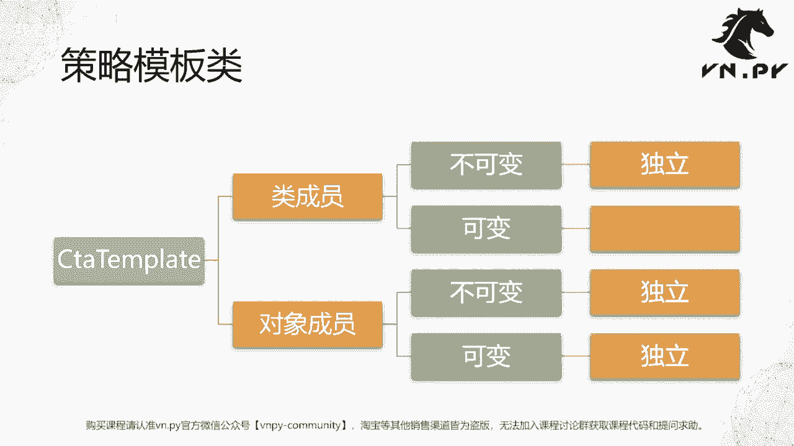
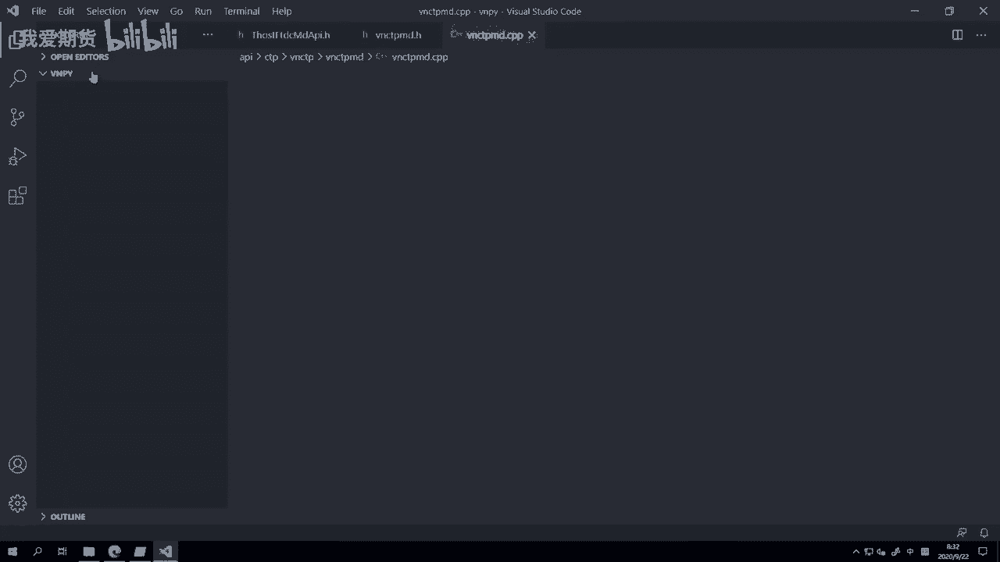
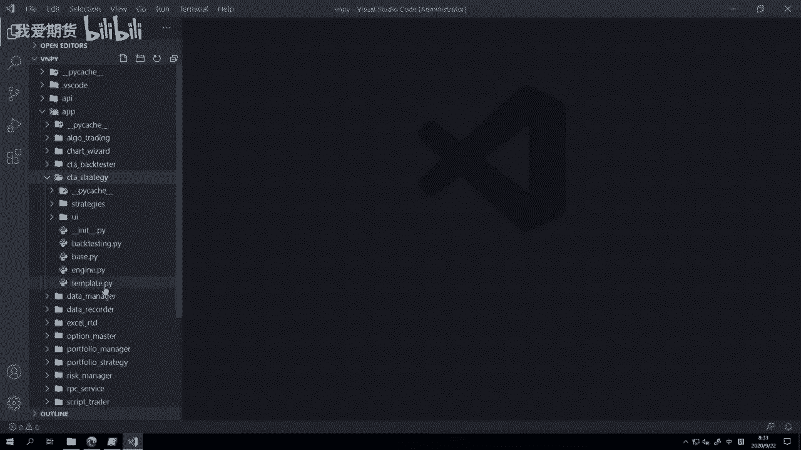
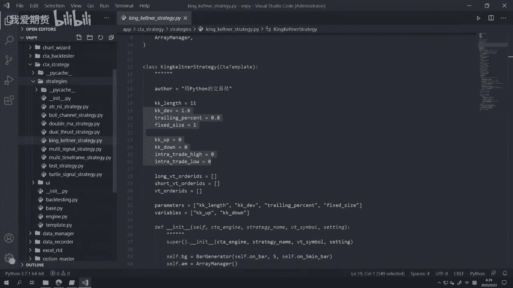
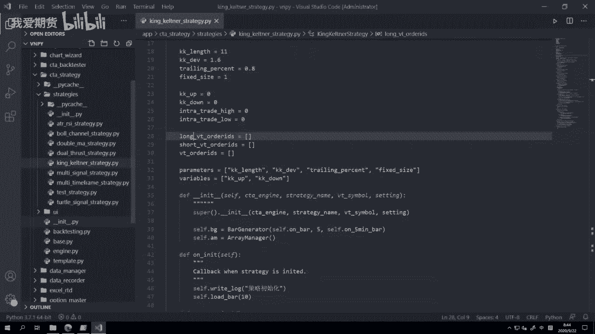

# 27.CTA策略的变量 - P1 - 我爱期货 - BV1S72gYNECk

OK欢迎来到量化交易零基础入门系列，30天解锁Python量化开发课程，那么今天呢是我们第27节课了，在上一节课里面，我们讲了这个Python内部对象的课，可变性和不可变性的区别啊。

或者说这个对象整体要分，可以分为这个可变对象和不可变对象，那么这节课呢，我们要来看一看他们的一个实践应用啊，就在我们写van点派内部的CCTA策略的时候，他的这些策略成员变量啊。

有怎么样的一个和这个可变不可变对象的关系，那上节课我们也提到了，这其实是很多初学者容易犯的一个错误，或者容易掉进去的一个坑，那等会呢我们会来看到啊，在van der paneb。

我们用来写CCTA策略的时候，要继承的这么一个策略模板类ccta template啊，就这个类，那这个city a template的作用，和我们在之前讲接口那节课里面，讲到接口层的那个作用有一点类似。

它的函数整体上也可以分为两类，回调函数和主动函数，回调函数用于接收外部推送过来的数据啊，比如说你这个策略交易的那个合约的行情，比如说你这个策略发出去的，委托的成交回报等等啊。

或者你这个策略在图形界面上被点击启动，被点击停止这些按钮的时候，对应的一个通知啊，这些是回调函数，然后还有就是这个发单撤单啊，做一些查询的时候的主动函数，那和我们之前讲的那个接口其实很像。

等会我们来看啊，然后我们在这个类下面啊，因为我们要写策略嘛，中间肯定要有一些缓存，我这个数据啊，缓存中间状态的这些所谓的成员啊，有可能它是一个简单的数字，也有可能啊它是一个数据容器，比如字典啊，列表啊。

这个集合啊，set啊等等啊，那这里定义的时候，就会涉及到我们上节课讲的问题了，你可以把它对定义成类成员，也有的时候可以把它定义成对象成员，那么要注意的是，它们两个在这个类的实例化的时候。

是有很大的区别的，如果我们先来看类成员，类成员里面如果是一个不可变的这么一个啊，这个这个成员的话，就你在内成员下面啊，定义的这个对象是不可变的话，那么当一个实例啊。

就是我们通过这个类创建出实例一和实例二，的时候，这两个实例的这个成员，其实指向的是不同的这个对象啊，说白了就是两个是独立的，两个没关系啊，所以你对A策略里面的字段改了之后，不会影响到B1那边。

但是如果他们两个啊是可变的，就这个类成员是可变的，比如说是一个集合，一个词典，一个列表，那不好意思了，这是初始化出来的时候，他们默认是共享的，都是指向同一个地址的，所以这个时候你对它做任何操作。

都会造成一些额外的问题啊，这个这个我把专门标红了是要注意的，但是如果你把这些啊这个成员定义在对象上面，就定义在那个INIT函数下，那就不用担心了，不管是不可变对象还是可变对象，它们都是独立的。

所以就不会造成任何的问题啊，所以这边呢我们就呃这个概念讲完了。

这节课就一张PPT，下面我们就来看代码，打开我们这个啊这个这个服务器啊，然后启动这个video studio code，这时候还是一样啊。

在这个之前VNPY的目录，因为我已经打开过了，所以它会自动缓存的，我这次打开呢它又自动打开了啊，我们找到这个app目录，找到其中的c t a strategy。

然后找到下面有一个啊叫做这个template点派啊。

这个template点派里面定义的就是EPOSE，定义的就是我们的这个策略模板啊，这个就是我们的策略模板，ccta template这么一个类，然后我同样左右边都开下来了，那么在这个类里面呢。

我先把代码折叠一下，给大家整体看一下，好我们把它折叠起来之后啊，这个最上面有一堆什么啊，init update setting什么，以get开头的这些个函数，这些函数不同样啊，就是呃他们也属于主动函数。

但不是给我们写策略的人去调的，这个是给我们这个叫做策略引擎去调的，他有的时候要来管理我们策略的时候去调用的，剩下的我们来看啊，这堆就这上面的先不看啊，先看这堆有前面有个at。

有个virtue装饰器的这些所谓的回调函数，那这一些回调函数的作用，其实就跟我们之前啊讲交易接口的时候的，回调函数作用是类似的，那当他们啊当外部某件事情发生的时候，就会来触发和这件事情相关的回调函数。

然后你要在这件事情发生的时候做什么事情啊，你在这件事情发生的时候，你要去执行什么样的程序逻辑，比如说算个技术指标，比如说下个单或者启动的时候，你要写个日志或者停止的时候，你给自己的微信啊。

的QQ邮箱发一个这个邮件啊等等，这都可随你便，你可以自己把它们写在这些回调函数下，写下来之后的作用就是当那件事情发生的时候，程序就会自动来调你这块的逻辑，所以就会做你定义好的，要他做的那些事情。

那这里on init on start，On stop，这三个啊，回调函数分别是在策略，在主界面被点那个初始化按钮的时候啊，去掉它，on start就启动的时候掉它，on stoup就停止的时候掉它。

哎这个很容易理解对吧，就从字面上就容易理解，然后下面有这么五个围绕着交易相关的，On tick，是当底层交易接口有这么一个啊，行情推过来的时候，同时这个行情是我这个策略交易的那个合约。

那我这里ARTICK就会收到，举个例子，我这个策略可能我定义它的交易F啊，这个2011的，那此时如果接口层来了一个，比如说IC2011的行情，那我这里是不会收到的啊，我们的外面有一个那个叫做策略引擎。

他会帮我过滤掉啊，他不会把这个不相干的数据推给我，所以我在这个on tick里面直接写，我这个和我策略相关的逻辑就行，然后on bar啊，是这个是K线的回调函数，就是我们用tick来合成K线之后啊。

就调它on trade和on order啊，这分别是有成交推送和啊，这个有委托状态变化的时候的回调函数啊，然后on stop hold，这是停止单，再往下什么，By sell short cover。

这个是最常用的，就是买卖下单的啊这些主动函数，那这些主动函数呢是交给我们用户啊，我们自己写策略的时候啊，我们作为一个交易员，希望说诶上面啊我收到一个K线之后，那一般情况下我可能做的第一步事情。

就是把这个K线给缓存下来嘛，缓存到一个啊，像我们这个上节课举例的那个，8series的这个队列里面啊，现呃不好意思，这个缓存容器里面啊，先把缓存着，再下一步我可以计算，比如说诶如果我要用均线的话。

那我就直接用这个内置函数，先做个sum求和，然后除以个啊长度啊对吧，这就是个平均数嘛啊这个就可以算均线，或者说我要算，比如说唐基安通道，我就取最高价最低价啊，这个max min啊我就可以算。

那反正缓存好之后，把数据丢到那些容器里面之后，我们就可以算很多的各种各样的东西，满足条件的时候，我就来调这些白色short cover啊，或者说底下的cancer order撤单，Cancel out。

全撤等等相关的函数来做这个我的买卖交易的，最后呢还有这个什么write log啊，Get engine type，get prestic等等啊，这个是一些和查询相关的函数，还有这个load bar。

Load tick，这个是初始化的时候加载数据，然后send email发送我们的啊邮件等等啊，那么这些都是所谓的主动函数整体上啊，所以这样我们看完之后，你大概知道就是策略模板这东西的概念啊。

和我们的嗯怎么说呢，和我们那个底层交易接口的类啊，其实很像啊，它都是一种类啊，那当然这里类啊定义的时候，我们还继承了一个叫ABC啊，这个是比较啊，我们后面会讲到吧。

它是一个叫做abstract base classes啊，这个啊一个一个叫做抽象接口类啊，它的主要作用呢是为了实现，防止有些时候你继承了一个ccta template，你什么操作都不做。

直接把这个啊类给添加到我们策略引擎里面去，的时候，因为你什么逻辑都没实现嘛，直接添加进去会有可能会引起各种问题啊，所以有了ABC之后呢，就可以强迫你必须去实现它啊，否则就要出问题。

然后啊我们下面就来看这边，我们具体一个策略啊，策略在这点开strategies目录，还是位于city strategy下的strategies目录，然后我们里面随便找一个。

比如说那我们找一个double m a哎，我们找一个带那种啊，就找这个好了，这个叫king katina strategy和金肯特特纳策略，然后这个策略下面呢，我们先因为在这里我们还没有讲到。

CCTA策略本身的原理啊，本身的很多细节内容，这个在我们另外一个课啊，就全实战进阶系列，CTA策略的课里面有详细的讲解，我们先从编程的角度来看，那这里这个king cina strategy。

首先它是一个类，然后下面有这么多的他所谓的这些成员变量，其中啊前面这些什么浮点数啊，字符串，这都没关系哈，我们知道他都是所谓的在我们这个啊PPT里面啊，我们回到PPT看一下啊。

他们都是我们PPT里面这个类成员，下面的不可变成员，所以他们都是独立的啊，这没关系，但是也有这个两个啊。

不是三个long video is short video的id啊，video的IDE这么三个列表，它们是所谓的可变成员，那这样的话，如果我们直接像这样定义啊，你其实可以想象嘛。

就是如果创建两个king cattain，a strategy的实力的时候，就有可能造成各种各样的问题啊，所以这种写法在我们，如果你是在策略里面这样写的话。

那就必须强制要求就这个king cattle and strategy，在一个就你启动了一个VN得pad，那个van trader里面只能啊创建一次，如果你同样啊，就这个策略你既交EIF。

又交ES又叫1IH的话，就会造成这三个实例对象之间，这个字段的冲突啊，就会造成后面各种各样的问题，那所以这个是我们官方呃自带的一个例子啊，那这么写不是说绝对就错，但是你要知道你重复用的时候。

他们就会引发问题啊，他们的这个所谓的缓存的委托号字段，就有可能冲突，怎么解决呢，两个方法，第一个索性把他们都给删掉啊，把类成员下面定义全部给删掉，移到这里的。

这个对象成员上去全部啊放到这个INIT函数下，然后在前面加上self，这是最简单的方法啊，在这定义呢，就你就不用担心什么冲突问题，因为我们刚之前已经讲过，所有对象成员关它是可变的还是不可变的。

它都是独立的啊，不会有任何冲突，这是第一种方法，第二种方法，这里呃这个初始化的定义，我们也还是放在类里面，因为有的时候可能你这个在variables，就后面这个变量什么里面，你想把它们写进去啊。

后面在这个啊就是界面上输出的时候，你可能希望能看到他们，那也没关系，如果你把他们在上面定义了，也同样注意，在下面你要把它们重新再初始化一遍，啊就是，当然我们这里的这个重新初始化操作。

你会看起来跟我直接把它移下来，直接把这三个字段移下来，就直接把这三个字段删了，只留下面的，你会看着感觉很像啊，但其实他们在啊内部的性质上有一点区别啊，你写在类里面的情况下。

那就是在类的级别已经定义好一份了，当对象被出创建出来的时候，这些字段一开始就是存在的，只不过在创建的过程中啊，这个我们的解释器调到盈利弹出，我们又把它指向了一个全新的空列表啊，所以这个叫做再初始化操作。

如果说啊我直接把它给删了的话，那么相当于这三个字段，在我们这个策略类的级别是不存在的，他们只在策略实例被创建出来之后才存在啊，所以这是两个挺不同的点啊，当然要取决于你自自己具体的这个啊，怎么说呢。

你策略的逻辑需求来写啊，但一定要记住，如果你没有在下面INIT里面重新初始化，或者说你没有在INIT里面创建的话，而是只写在这的时候。

你创建两个king countenance strategy的实例啊，就你拿这个类去初始化，多个这个策略对象出来的时候，他们的这三个列表是指向的，都是同一个列表，好就你三个策略。

long video的id这个列表指向的都是同一个列表，short video的id列表指向都是同一个列表，这种情况不是说，100%一定会在运行的时候出错，但他很有可能会带来额外的问题。

所以我们推荐大家呢要自己写代码的时候，想清楚啊，这个策略我是不是有可能去创建多个实例的，是的话，不要在类下面简单的定义完之后，定义完这些可变对象啊，这里我们定义的是列表，如果你定义的是集合。

如果你定义的是字典，也会有同样的问题，所以一定要注意啊，如果你不希望他们冲突的话，在INIT下面再去初始化一份啊，这个是很重要的一个点，OK那么啊这节课呢。

我们其实主要就是用这个啊策略模板类吧，去把我们上节课讲的，那个可变和不可变对象的例子啊，他的一个应用场景给大家就具体的呃，怎么怎么展示了一下吧，那尤其是这个策略下面的啊。

这些可变数据容器成员互相之间冲突的问题，在我们vider pad初学者用户里面有，就经常有人掉在这个坑里啊，群里面有很多人问，就论坛上也有很多人问，所以我们专门把它拎出来一节课。

给大家讲清楚背后的原理是什么，那有些时候啊我们是不希望它共享的，但是也有些时候可能我们是希望他们共享的，比如说你可能有些时候希望啊，比如说在用其他一些量化平台的时候，你可能也有用到这种叫做全局啊。

变量的这么一个所谓的数据结构啊，它的作用呢是让A策略做的事情，B策略也能知道啊，或者说你用这个啊实例化出来ABCDE，你搞了五个策略实例的时候，他们互相之间做的事情互相都能知道。

比如说哎总体开的仓位是多少，比如总体利用的已经用掉了，保证金是多少，如果你有这种通讯需求的时候，那么你把那些可变数据结构，比如说是一个字典定义为类成员，就是正确的用法了啊。

就是所以不要觉得这个类成员是可变对象，就一定是错误的用法，不是的，他是不同的应用场景，你要用不同的方法，那如果你只是希望啊这个是数据容器，只对当前这个策略实例啊是有效的。

就是它只有这个当前策略实例能访问到，他不会被别的其他的那些策略对象给影响的话，那一定啊要记着把它定义成对象成员啊，所以这是一个啊挺怎么说呢，也不能说叫绕吧，就这这如果不讲清楚的话。

大家挺就这就自己去看的话，挺难啊，学明白的这么一个东西啊，所以我们就专门拎出一节课来讲。

OK那么这节课的内容呢就到这啊，这个更多精华内容，还是请扫码关注我们的社区公众号。