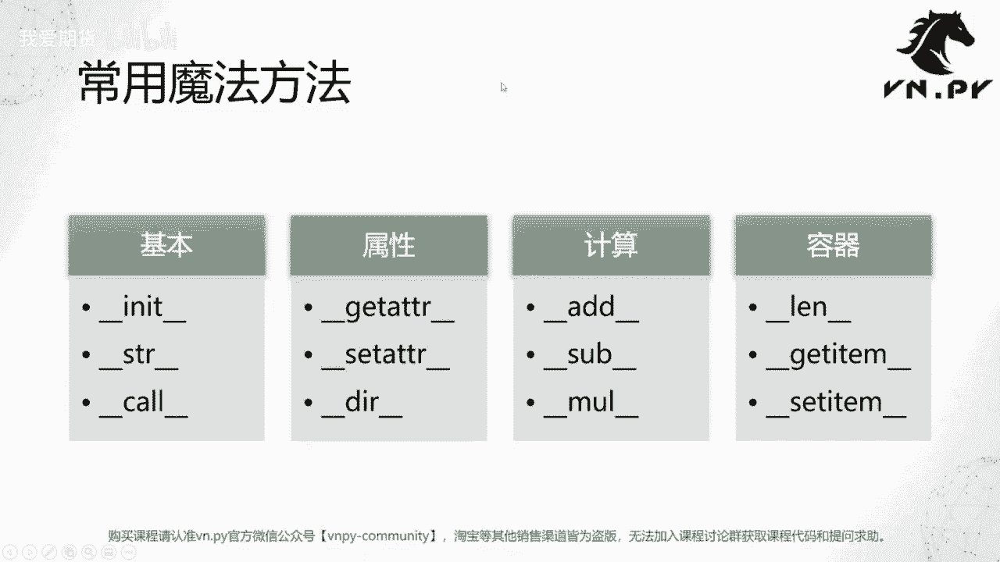

# 28.定制magic method - P1 - 我爱期货 - BV1S72gYNEUo

OK欢迎来到量化交易零基础入门系列，30天解锁Python量化开发课程，那么今天呢是我们的第28节课，之前，我们花了两节课的时间，讲了Python内部这个对象的可变性和不可变性啊。

以及他们在我们写一个ct策略，或者说基于这个ct template类，去开发我们的策略类的时候的具体应用，那么整体上啊，这些内容已经属于Python面向对象开发的比较高级，比较进阶的内容了啊。

包括这节课的内容啊，叫做定制，magic method也是一样的，它都是比较复杂，比较深入的啊，这个面向对象的开发，如果这些内容，你可能现在听着感觉有点听得云里雾里，听不懂没关系，不用啊，太着急。

你只要记住有这么一个概念，后面遇到问题的时候再回来看一看这些PPT啊，就可以了，现在没办法立即消化吸收，没关系啊，这三节课内容确实是深入的好，那么我们这节课呢就先来看一看啊，这个叫什么。

是magic method，翻译成中文，它就是魔法方法啊，魔法在哪呢啊，我们这个首先啊这些方法那方法记住，一定是这个类下面的方法啊，它不是一个嗯就是单独的独立的函数啊，这是第一点要注意的点。

第二个这些方法，它的名字前后都有这个双下划线给包围着，你可能现在想到已经想到了一个是什么，就是我们的那个INIT方法啊，当对象被初始化的时候，有解释器自动调用的那个方法，那这些魔法方法它的作用是什么呢。

描述上叫做定义了对象基础操作时的行为啊，可能呢这个描述也有点太书面化，你也觉得莫名其妙，我把它转化成白话来说，就是当你对这个对象啊调用一个，比如说Python内置函数啊，你可能想看一下它的长度。

你可能想把它转成一个字符串，你可能想要把他这个这个这个给加一下，减一下，求个幂等等啊，那这些内置函数对这个对象调用的时候，会发生什么，这些事情我们也可以去控制啊，可能不像其他编程语言里面啊。

就是最基础级别的，你能做的事情就是这些所谓的编程语言，内置函数好，它提供事情，这些事事情在有些编程语言里面是不能变的，但是在Python里面，它同样是可以变的，第二种情况呢就基础语法了。

什么是基础语法加减乘除啊，生成列表，然后呢这个各种if else等等相关的运算啊，这些都是Python IP的基础语法，那这为什么有这块的东西哈，那引出的一个比较深入的概念，就叫做所谓的原编程技术。

原编程技术呢英文叫做meta programming，你可以理解啊，它是一种可以让编程语言在运行的时候，自动再去生成编程语言啊，然后去执行的功能是不是听着有点神奇，就是编程语言在运行的时候。

自己还能新生成新的编程语言，那这么一个功能就叫做原编程，Python被认为是在原编程领域，非功能非常强大的一个语言，当然不是最强的啊，最简单最强的是一个叫做list的啊，这个啊这个编程语言。

当年啊这个lisp语言是的，但这就是学习成本太高了，因为确实太复杂了，它从最基础的东西上就是原编程，那Python呢可能是在这个工业领域用的最多的哈，然后对原编程支持特别好的这么一个语言。

我们不需要在这节课里面，掌握到那么深的内容啊，这些概念大家大体上给记住就好啊，下面呢我们来看两个简单的例子，第一个例子就是我们的INIT函数了，这个INIT函数呢，就是当类被实例化为对象的时候。

由解释器自动来调用，这是第一个我们要看的，第二个我们要看的呢是这个叫string函数啊，调用string函数的这注注意啊，这个不一样啊，INIT或者我们应该呃不叫他们函数。

应该叫INIT方法和string方法，那这两个方法，string方法是在我们对这个对象调用string函数的时候，输出的字符串内容啊，那怎么个区别呢，我们就来通过这个代码例子，还是实际来看一看。

这节课呢是第28节课，叫magic demo，好名字挺好听的，那我们这里啊把之前一节课吹data额，这个就我们刚开始讲面向这个对象的概念时候，用的那个例子的代码给拷过来了啊，这个分别是创建去data类。

以及实例化一个对象出来，那这时候我们先来讲讲这个啊，你看我们当时的字段，这些成所谓的数据成员的定义是放在类下面的，那截止到之前我们讲了可变和不可变性之后，你应该知道诶，这个绝大部分时候。

如果你不是一定要用到这种，通过类去共享某些数据成员的，这么一个特性的话，比较更好的方案还是把它们啊，这些数据成员的定义给放到INIT函数下面，那么这样呢，相当于这个字段是由这个对象独享的。

它不就你只要放在它，它肯定不会共享啊，所以一般情况下放在这会比较好一点，然后啊这个INIT函数我们之前也讲了，他什么时候会被运行呢，它的运行不是由我们去主动调用的，我们不需要去调用这个INIT函数。

它会在我们创建trade data对象的时候，比如说在下面这个单元格，当我们创建这个确定对象data对象的时候，会由Python解释器帮我们自动去调用它。

所以我没有必要说哎我先就创建个trade data对象，然后我再调用这个什么trade点INIT这个函数啊，然后去把下面的这些字段初始化出来，没有必要这样做，只要你创建这个确切对象，data出来之后。

那解释器自动就帮你调了，所以这就是第一个我们魔法方法它的特征，它不是啊，就是我们一般情况下不会自己主动，在代码里面去掉，这些模仿方法，不是完全没有啊，就是但大部分时候你不会去主动调啊。

然后他的调用其实是在我们去做一些其他事情，比如做做加减乘除，比如说哎等会我们看看那个string啊，去做其他事情的时候，有解释器自动来调的，你可以把它理解，有点像我们前几节课讲的回调函数啊。

但是这个回调函数呢又不是由外面发过来的啊，说白了这个他怎么被触发的，还是啊你自己做的什么事事情的时候触发的，只不过呢中间过了一道啊，你掉的是string函数，string函数呢解释器收到这个命令之后。

又帮你来调这个对象的魔法方法啊，所以我们这边先就把这个trade data给运行一下，然后呢我们创建一个它实例出来，我们把他这个print一下啊，print这个trade点two string啊。

我们可以看到这个，就我们之前那几节课输出过的结果，哎这看着很舒服对吧，但是有一个啊这个不怎么方便对吧，比如说我有的时候可能就想print一个trade，哎，不好意思，打错了，print trade啊。

这个打出来的东西呢，它就是这么一个叫做trade data object啊，这么这么一个呃对象啊，然后它的内存地址在哪，这个打出来了啊，不能说它完全没有用，但是99%的情况下，我其实并不关心这个信息啊。

我对他一点兴趣都没有，或者如果我想要把它转化成一个字符串的时候，他也是这么一个信息啊，也也也就是它不是一个很有意义的东西啊，或者如果我想要想把它转化成有意义的东西。

就一定要调用这个trade点TOSTRING啊，一定要这样，我去主动调一个函数解转化一下才行，那有没有更好的方法呢，其实我们这边可以在当前这个类下面，再实现一个另外的魔法方法，不好意思啊。

啊这个def这么一个魔法方法，前后都用string包裹起来啊，然后我们就直接return sept two st，相当于我加了一个新的方法啊，当然这个新的方法加完之后。

后面我这个额都要重新初始化一下才行啊，我们可以发现print这个trade点two string，这还是正常可以工作的，然后我们来试试看，唉print直接print trade会怎么样。

它打印出来的结果，也不再是刚刚那个啊内存地址了，而是我们这边two string输出的内容，什么意思啊，当我们其实很多时候对一个对象调用这种，比如说我们在调用这个四这个啊string啊，tat的时候。

它返回的也不再是刚刚那个奇怪字符串额，就是内存地址的那个信息了，而是这个我们想要的啊，有意义的这个成交内部的内容，这两步操作的时候，其实Python解释器都是自动帮我们去调用了。

trade data这个对象下面的这个magic method啊，在这个里面你返回什么东西，Python会自动的帮你把这个值A就相当于转化出来，通过这个函数给输出出来，所以我甚至可以在这边啊。

再加上一个魔法方法的威力啊，随便说一句话啊，是逗号，然后我们再来一个啊，不好意思，这个这个这个应该是字符串啊，这个我，加吧直接用加法好了，好，你可以看到我们在这里，这个也运行一下。

你可以在这里额外加上任何你想要输出的内容，只要你在啊这里写的东西，那下面不管调用print方法，调用string这些啊，这个函数把它转化成字符串的时候，都会来调用这个啊。

前后有下划线的string这个Python的方法，那相应的你在这个里面希望去返回什么内容，那对应的Python的解释器就会自动把这些内容给啊，通过这些函数下面的print和string。

这些原始的函数给输出出来，所以呢这样一定程度上，我们就算是自己改变了trade data这个对象啊，或者这个类在我们Python解释器运行过程中，它就基于这些自身的内置函数啊。

数这个改变输出的一些行为啊，我们就通过我们代码去改变它，所以有的时候你可能通过这种啊，string去输出一些就是纯代码级别啊，自定义化的功能也可以去实现。

甚至我可以不用这种方法来定义一个trade data类，而是通过这些各种魔法啊，这些所谓的魔法方法，动态组合的方式来创建一个类出来，那么在Python里面都可以去实现啊，当然这些内容就比较复杂了。

所以这节课并不是我们的重点，我们更多是把这个概念给大家讲一讲啊，就认识到Python里面有magic method，这么一个比较神奇的圆边绳的用法，那比较常用的一些魔法方法，我们这边也简单的列一下。

虽然啊可能很多时候啊，大家不一定就是这个一上来学的时候需要去用，他们基本的就是第一个方法，INIT方法，这个我们都知道非常常用，在啊一个类初始化为呃，或者实例化为一个对象的时候，一定会去掉它。

所以这个是我们最常用的写，只要你后面写Python面向对象编程，你整天就要跟这个方法打交道，string啊这么一个方法，刚好我们已经演示了，其实就是很多时候我们想少一点代码。

我就想print一个什么东西，他给我输出一个什么结果的时候，你就可以把这个啊string这么一个函数给实现上啊，这样他否则的话你打印一个对象的时候，它永远是输出那个对象的内存地址啊。

这个内存地址对我们看的人来说没意义，然后call这个方法这个是特殊一点，Python内部所有的函数啊，就是我们之前学习的定义一个Python内部的函数，或者说Python啊这个类下面的这些方法。

他们其实也都是一个对象，那这些对象的特点，就是他们有一个叫call的魔法方法，所以这个call的魔法方法呢，实现的就是那个函数内部的逻辑，所以你甚至可以实现一个，你可以自己定义一个类，然后呢在下面是呃。

我们这边就演示一下哈，我定义一个好玩一点，定义一个test类，然后呢我来定义一个，call方法啊，这call的方法里面呢我们就是写个AB，然后就pr这个return a加B啊。

这样写完之后其实起到一个什么作用，test我先创建一个怎么类出来啊，然后调用T啊，三四你可以看见我在这里初始化的是个类，但是我可以把这个类像一个函数一样来用，原因就是因为我定义了这个类的。

call的这个魔法方法，所以对于Python来说，只要一个类或者它初始化呃，实例化出来的这个对象有这么一个cod啊，这么一个魔法方法，我都可以把它当做一个啊这个函数来调，不管它是不是函数都没关系。

其实在Python看来，这个东西就是一个函数了啊，所以这是一个非常神奇的点，啊然后属性类的啊，包括get attribute，set attribute和DIR，这是访问某个啊。

这个对象下属的一些特殊属性的时候，你可以去获取它的某个字段对应的啊函数也好，对应的这个成员变量也好，或者说呢你直接哎通过代码去对某个对象，设置一个成员变量，这可以通过这些属性的魔法方法实现。

然后以及一些啊这个加减乘除啊，围绕计算相关的魔法方法，Add sub multiply，举个例子啊，有的时候你可能会想着说诶我这个trade啊，这是一笔成交的数据对吧。

我想要它加上另一笔trade之后返回出来，整体或持仓的状态变化，那你直接拿俩trade加肯定是不行的嘛，但你如果实现一个ADD的魔法方法之后啊，他就可以通过这样来实现了，然后最后是围绕容器类的一些魔法。

这个方法还包括这个LAN啊，这个是求啊，这个数据有多长，就得当我们在调用那个Python，内置LAN那个函数的时候，就会来调用对象的这个啊LAN的方法，还有get items set item啊。

这个是通过那个方括号下标访问的时候，那容器啊这个对象会做什么样的行为啊，那通过这两个魔法方法来定义的，所以呃当然我们这边只列出了很少的，这么一共12个，其实Python内部的魔法方法加起来。

大概有可能上百个左右吧，如果这些魔法方法你都诶比较好的掌握了，你都比较好的这个能应用在自己的编程里面，你会发现写Python真的可以变成一个啊，很神奇的事情，你可以把它写的像CJ加一样。

你可以把他想写的，你可以把它写的像文化一样等等都可以啊，基本上用Python就只有你想不到，没有你做不到的事情啊，当然这个需要很深入的学习啊，这个不是我们啊现阶段需要去掌握的内容，但是呢知道这个知识哈。

知道未来你可以有一天能做这些事情，OK那么这节课呢就到这啊，我们更多精华内容，还是请扫码关注我们的社区公众号。

