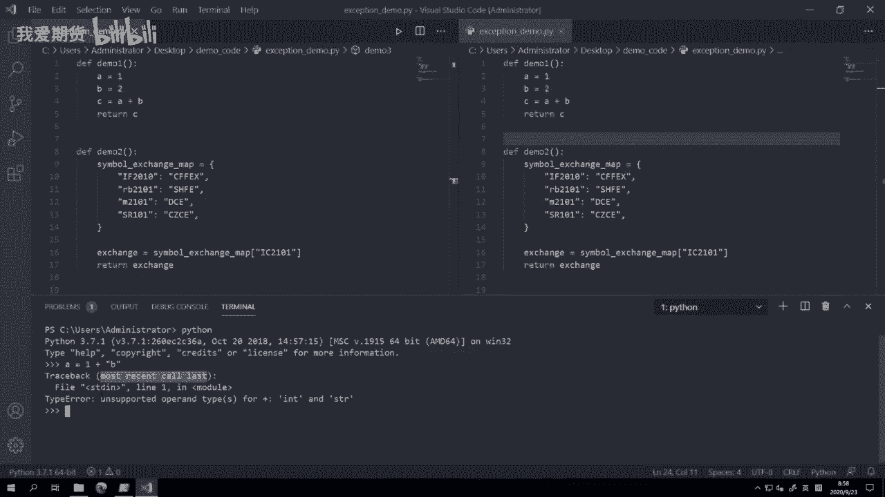
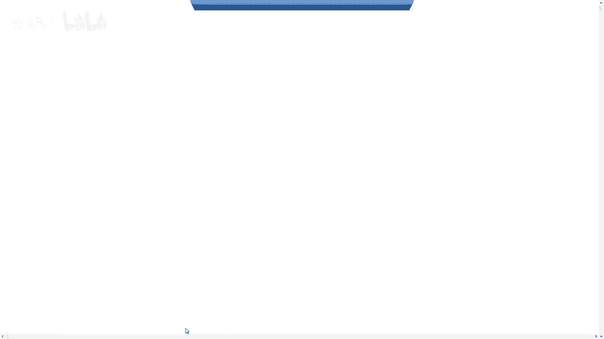
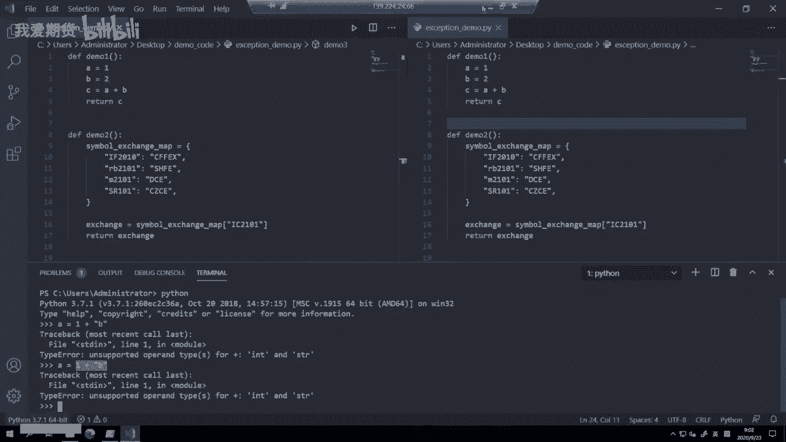
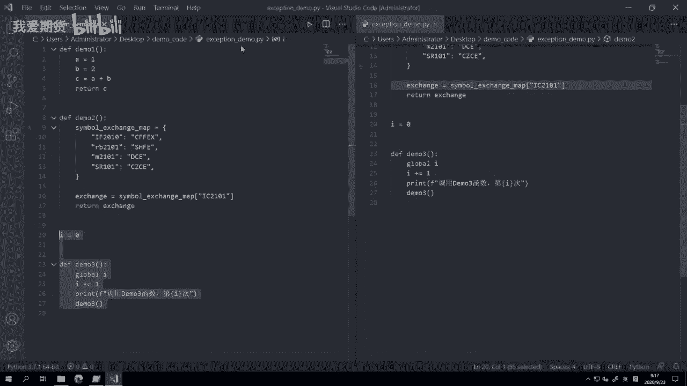

# 29.有关异常定义 - P1 - 我爱期货 - BV1872gYNEE4

OK欢迎来到量化交易零基础入门系列，30天解锁Python量化开发课程，那么今天呢是我们的第29节课了，在上一节课里面啊，我们基本上收尾了Python里面，面向对象开发这块的知识，从这节课开始呢。

我们要来讲一讲异常的概念，首先什么是异常，异常的英文呢是exception啊，他什么时候会出现呢，主要就是在程序运行出错的时候，那么在像C加加C之类的编译型语言，往往程序运行出错的时候呢。

程序就会直接给挂掉啊，就崩掉了，异常退出了哦，我们在windows上有的时候开着这个office，或者开的一些其他的播放器啊，或者浏览器可能跑的好好的，他突然就窗口就没了啊。

往往这个时候其实就是后面出异常了，那么这种情况呢对于我们这些写程序的人来说，可能不是太友好啊，说白了出问题了，那我知道出问题了，但是出在哪呢，那这个我可能要花好多时间去找。

所以Python在解释器层面提供了非常完善的，这个叫做异常捕捉的功能，在Python内部啊，可能99%以上的这些出错的情况，解释器呢都能帮我们自动捕捉住啊，这样即使这个运行被打断了啊，就程序停下来了。

但是呢我们可以很直观的看到哎，到底什么地方出了问题，我们就紧接着可以去修复它，可以让它恢复到正常去运行，所以这也是一个Python在实践工作里面，它可以让我们这个人的效率变得特别高的，原因之一。

那么常见的这个错误啊，我们这边也列了一下，第一个就是错误的语法啊，你比如说用Python的那些关键字，你打错了啊，用那些啊运算符，你可能前后少了什么东西，那这个就叫错误的语法，第二种是错误的运算。

整数加整数，浮点数乘浮点数，这些都OK都正常，但是如果你拿这个字符串去乘一个浮点数，那这个Python就会给你抛出个错误了，因为这种是不支持的计算模式嘛，本身我们人去想的话，你拿一个字符串成一个小数。

这也没有任何意义嘛对吧，所以这个就是叫错误的运算，最后呢还有一种叫错误的调用啊，这个一般是围绕着函数，围绕着这个对象的，那举个例子，你可能定义了一个函数，一个加法函数A和B两个参数，但是你在调查的时候。

你只传了一个参数，你可能只传了一个AB，你漏传了，或者你传了三个参数，多了一个，那不管怎么样，都是这个我们在调用这个函数的时候出错了，所以呢此时解释器也会告诉我们啊，这一行代码你写错了。

让你可以快速的去修复，那接下来呢我们就尝试着去触发一个异常，我们看看它长的到底是什么样子的啊。

一个最简单的例子，A等于一加上这个B这B是个字符串，我们这边呢已经打开了一个啊vs code，然后呢在vs code terminal里面，我们就运行Python，然后这个A1等于一加上B这个字符串。

紧接着我们就可以看到，这抛出了一个叫trace spect的东西啊，然后啊他有个most recent call last，这句话什么意思呢，首先trace back是一个跟踪记录的意思啊。

它的英文词里面是跟踪记录，Most recent call last，就是最近你调用的那一行代码是什么，那啊出错这个事情啊，我们知道在这个运行的过程中，对于Python来说是哪一行运行出错了。

他紧接着就在这一行会把整个程序给停下来，然后他会抛出这个异常，所以这个异常信息里面要包含的就是，他到底停在哪一行了，那这样我们才人能去看吗，所以在Python里面，他不可能说诶我之前运行已经出异常了。

我过又运行了好多行，然后我才把异常抛出来，不会讲Python一定是哪一行出异常，哪一行就给你抛出来，所以抛出来这个最近调用的这一行，代码的信息啊，就是你要去查的那个代码啊，然后呢我们来看一下啊。

就接下来还有一段内容，什么file s t d音啊等等等等。

我们来看看他们大概是怎么一个意思，那异常的信息构成呢大体上分成这个啊三块，第一块就是出错的位置了，等会我们来看啊，它包括出错是出在哪一个文件里的，哪个Python文件里的出错。

出在这个Python文件里的哪一行，然后第二类是异常的类型啊，这个到底是一个可能你计算的时候，用的数据类型出错了，还是你访问字典的时候，某一个键值没找到，出错了，还是什么其他一个类型的错误。

最后呢是提示信息啊，尽管就同一个类型的错误，它也可能在各种不同的情景下，有各种不同的啊千奇百怪的细节，举个例子啊，就这个type error，其实就像我们刚刚触发的那个就是一个type error。

我们用一个啊整数加了一个字符串，所以他这个是一个类型错误，因为这俩东西不能去加，那有的时候你可能是拿字符串乘了一个这个，浮点数啊，你有可能拿这个字符串去除了一个布尔值啊，等等。

我不知道你到底会有可能会犯什么错误，但这些错误呢每种的细节不一样，所以我们除了类型以外，我们还需要一些这种细节的提示信息，帮助我们更快的去确定啊，到底什么地方我写错了，那这样我随机就可以把它给改掉。

这个时候呢我们来回到我们的vs code。

那这里可以看到除了第一行TRANSBACK以外，第二行file s t t in line啊，这一然后in module这句话什么意思，file就是出错的那个文件，那我们这里呢并没有用文件去运行代码。

而是直接启动了Python解释器，然后我随机敲了一行代码进去回车，所以此时啊对于啊这个Python解释器来说，这一行代码所在的位置是通过啊，这个叫做s t d in啊，这是操作系统的标准输入。

一般情况下我们在键盘上打一些东西的时候啊，或者在鼠标上点一些东西的时候，这时候输入到我们系操作系统里面，这个通道就叫s t d in标准输入啊，对应的还有个STDL的标准输出，好在。

所以这一行我们这个一加B这个出错的代码，是我输进去的，所以他并没有一个文件，而是来源于我们这个STD音啊，这个也是一种叫做描述符，出错错在哪一行呢，出错在第一行什么意思，因为我输了这行代码。

我就运行它了，所以那自然对应的就是第一行嘛，我如果再运行一次，大家可以看一下，他还是在第一行啊，因为你是每输一行，你就运行一次，所以他这个出错点呢永远在第一行，然后在哪个模块下面啊。

因为我们这里并没有去定义任何的类，并没有定义任何的函数，所以他出错就出错，在这个最高的这个负极或者全局的空间里面，所以就直接写in module，等会我们来看一下这啊。

我们还有另外的这个函函数的demo，我们看他们出错的时候是在什么地方出错，然后最后这个出错类型是type，也就刚刚讲了是个类型错误啊，描述信息叫unsupported operate types啊。

括号s for这个呃，就这个加号plus啊，int and string什么意思，不支持的运算符类型啊，你用对于加号，你做了一个不支持的这个运算，怎么不支持呢，你拿整数去加字符串，这个东西是不支持的啊。

所以我看到这个提示信息的时候，我紧接着就应该知道哦，我刚刚肯定写的什么代码里面，我有一个地方我是拿一个整数去加字符串的啊，所以我紧接着回来看啊，就其实我们这简单吧，就一个一加这个B的字符串。

如果很长的话，你应该很快通过这句话就能定位到这个啊，出错的那个就一个长语句里面出错的点在哪啊，所以呢这个就是Python完整的一个异常信息，可以告诉我们的啊，这个地方。

那接下来呢我们来看三个更复杂一点的例子，分别是语句不全哈，这个就是Python本身我写的那个语法就出错了，然后第二个字典访问，我可能访问字典里面一个键，但是这个键不存在，最后有一个递归超限啊。

这个在我们嗯目前呃就刚上手学习的时候，可能不太遇到，等到你用Python越来越多，可能开始用一些函数式编程，用一些比较复杂计算的时候啊，容易遇到递归的问题啊，这个时候呢就会出现啊，你比较容易遇到啊。

所以我们三个不同维度的异常啊。

我们分别呢都来看一看他长什么样子，那这边我先来退出一下我的这么一个啊Python，然后cs把屏幕清空一下，然后重新启动，这里呢大家可以看到啊，我这个啊编写了一个这节课的代码。

叫exception demo啊，这个异常也是，那我一共定义的三个这个所谓的啊函数啊，Demo 1dem2，demo3啊，demo1就是这个语法错误，语法错误错在哪呢，大家可以看到啊。

我定义了A定义了B，然后C这里哦刚刚有是等于A加B的，我现在特意把B给删了，等于加号后面少了个东西，然后直接return c，那我们先来看看它会啊出什么样子，From exception。

啊这句话的意思是从exception demo这个Python文件里面，去把所有的这些你定义好的函数给加载进来，那模块的这一块的概念啊，我们现在还没讲，可能要再过个啊，三节课左右我们才会去讲。

反正现在你就记着你就写这句话，然后运行一下它就行了，运行之后你看紧接着就出错了，叫做trace back啊，这个啊得得得module哦，不好意思，section好，我运行的目录出错了啊。

这个这个不是这个问题，然后我就把它换一下CD desktop啊，这个demo code Python from exception name，啊这个是我们要看的错误啊，我们要看的错误。

这我们可以看到第一个trace back most recent call lass，反正这个基本上第一行都会有这个信息的出错，错在哪呢，首先啊第一个错误叫fire s t t in line。

什么in module，这什么意思，是因为我取我刚刚运行那行代码，是加载这个模块，但是在加载的时候，紧接着又发生了第二个错误啊，第二个错误是什么，叫做这个在这个文件里面file的的的这么长。

它的文件目录告诉你了哪一行line for啊，就第四行也告诉你了，第三行内容是什么，C加A这个包括有个小箭头都给你标出来，什么地方不对啊，然后错误与呃类型是syntax error，语法错误。

就说白了就是你打Python什么地方打错了，invalid syntax无效的语法啊，这个就典型的就是啊这个地方少了一个东西，所以我很快就可以判断到啊，这啊，包括因为我们这个之前装了。

flag8的提示器啊，它其实这里会有，我刚刚删完之后，其实大家如果注意的话，这个小波浪红的小波浪就已经出来了，告诉你这地方少了东西啊，这时候我把B加回去的话，大家可以看我再次import哎，就没问题了。

他可以正常工作了，那此时呢我去运行demo1啊，这个函数就没有任何问题，它可以正常的去啊，这工作返回结果，因为他已经没问题了，随即我们来看demo2，就第二个这个错误啊，我们就直接来运行它。

我们可以看到他抛了一个错误，叫key error i c2101找不到啊，为什么会有这个错误呢，我们回到代码里面看，首先我定义了一个叫做symbol exchange map。

而我定义了一个国内期货的合约代码，和它对应的那个期货交易所的，字符串的映射关系啊，把他们放到一个字典里面去了，然后呃这个字典里面我放了F2010RB，2101m2101，这个都破们S2101啊。

这是正常素的白糖，首先你注意点，这个也是我们提前提一下，四个期货交易所，每家的命名规则是有区别的，他们的英文部分是大写的，你看IF是股指嘛，SR是这个白糖上期所和大商所，他们的英文部分是小写的。

一个是RB一个是M啊，都是小写的，然后对于数字部分部分，中金所上级所大上所都是四位啊，前面两个是年啊，20年后面两个是两位是月啊，这个10月或者21年的1月啊，整体上这样，但是对于镇上所来说。

他是数字三位，数字三位的时候，他把年最前面那位给省了，所以后面这个一就代表21年啊，零一就代表是1月啊，所以这个四个不同的交易所，他们命名规则就不一样，有些啊这刚上手国内期货交易的用户。

经常尤其从可能这个i it行业开发行业转过来，转到第一次接触交易的人很容易犯的一个坑，就是不知道啊，这个不同交易所大小写有区别啊，他以为都是一样的，比如说输个啊，这个F2010啊。

就前面要小写或者输个RB2101，那么在你输这样的代码，在交易的时候都会出错的啊，VOR派用的这些交易代码，都是遵循了交易所的规则，我们没有做任何啊，这个这个拍脑袋自己去瞎搞的这个转化啊。

所以呢就是交易的时候一定要指导啊，每个交易所是怎么定义的，这个是不一样的，包括海外也是海外，不同的交易所的这个合约代码，都有自己的一套命名规则，你做既然做交易的，就一定要啊把这些都能记在心里面啊。

这个算是一个常识性的东西，就跟乘法口诀表一样，然后下一步呢我们去这个symbol exchange map，在这个字典里面，我们试着去取出一个叫IC2101的这个啊。

就是中证500的这个股指期货的对应的，交易所啊，当然我知道他是重金锁，但在这个字典里面，我们可以看到是没有ICAR101的，所以当我取它的时候会怎么样。

就会触发这里的这么一个key error kera，你也可以看啊，他这个首先还是发SDD音，因为出错的时候，这个抛异常的时候，他会从最里面出错的那一行开始，逐级的往上提示你，直到告诉你啊。

这个最上面出错的这个调用在哪，以及最里面或者最下面，他这个真实出错的那行代码在哪啊，所以他会Python就非常人性化，你可以一点一点往里面看进去，知道出错错在哪，那这里同样啊出错处在这个地方啊。

在16行啊，in demo2这个函数里面出错了，然后出错的内容还是以前的，他的这个为什么出错了，因为IC2101这个键在字典里面不存在，所以它叫一个key error。

然后大家可能注意到我这儿把鼠标移上去，他会有这么一个哎有这么一个下划线出来，他也会告诉我，Open in file，Open file in editor，然后得得得下面这行什么意思，按住键。

如果我这个啊当前这个文件不在啊，就可能我运行一些比较大，你比如运行V点派跑你的策略时候可能它出错，那这个时候我当然可以啊，在这个左侧导航栏栏里面，1。1点就找到这个文件，把它打开，但这个麻烦嘛。

更方便的方法是按住键盘上CTRL键，紧接着就来点一下，你可以看到鼠标变成一个小手的这么一个符号，点一下，它会自动在vs code里面跳转到这一行代码上打开，如果这个文件没打开，它会自动帮你改。

打开打开之后跳转到这一行出错的代码上啊，所以紧接着你就可以去修改它，这个就非常方便啊，速度非常可以很快的去改好，然后这个demo2我们也看完了，我们来看demo3，demo3运行的时候出现了一个错误啊。

首先第一个错误，这第一个这个异常叫on blocal error啊，什local variable，I referenced before assignment，什么意思。

你看我们在这个demo3里面我们是干什么，我们对I，这个我们我们现在demo3外面定义一个I啊，这个I是定义在demo3函数外面的，然后我们对I做了一个自增操作，然后呢我们打印一下啊。

调用demo3的次数，第I次就其实就记录一下，我到底第几次调用demo3嘛，但这里他告诉我一个错误，就是你在这个函数里面并没有先去初始化，I这个这个这个对象啊，I在这个函数内部是不存在的。

此时你直接去访问它，对它自增的时候，他会说local variable找不到啊，就是在你对它先初始化，先对它赋值之前，赋值是assignment，就是你在对它赋值之前，你就引用了它。

所以叫referenced before assignment啊，是这么一个意思啊，那所以这里我就知道哎这出错了，那怎么样，我能在函数里面用到，对象或者是变量呢，我们要加上global globby啊。

因为I这个东西是定义在全局空间里面的，是定义在我们整个负的啊，这个这个文件的最外层的，大家可以看到它的缩进和这些def demo，而定义函数的是在同一个级别，所以它是定义在最外面的，所以叫做全局变量。

你要用它的话呢，你要先在前面加一行GLOBI，意思就是我把全局空间里面的I这个变量，放到我的这个本地函数空间里面来，后面我对他操作的时候呢，就在对全局这个做操作。

然后这个时候啊我们就当然要重新加载一下了，我要先退出一下Python啊，再来PHX赛，然后这时候我来运行demo3，那会怎么样，大家可以看疯狂的打印啊，打印了多少次呢，打印了995次啊。

然后出错出错为什么出错，我们来看一下代码内容，首先每次我们调用demo3之后，都是先把I自增一对吧，这个时候我们打印一下，调用demo3的函数第多少次啊。

然后我们在demo3里面又来调用了demo3自身，这个呢就叫做递归调用，就是在一个函数里面调用自己啊，当然我们这里没有传参数啊，如果啊有序，一般在用递归的时候，你是需要去传参数的。

就是所以比如说计算斐波拉契数列啊，这个啊递归就是一个非常常用的算法，那么在Python里面我们可以看到前面都没问题，一次次掉，直到掉到了第995次，他出错了啊，抛了个异常，为什么会抛异常呢。

这个地方你可以看到是啊，他说了一个叫recursion error，什么意思，递归深度错误，Maximum recursion depth exceeded。

While calling a python object，在你不断的调用某个函数，就自己调自己自己调自己的时候，这个递归的深度超限了啊，这个限制是Python里面自带的，那么这里一旦超限了之后。

就会抛出这个异常错误啊，然后就终止执行了，所以我们可以看到，首先这个深度大概就是什么995个，深度不到1000嘛，呃当然这个深度是可以调的，这个可以在Python解释器级别去，通过一些全局设置去调啊。

但默认情况下，一般我们不建议大家调，你的递归995个啊，或者接近1000个，已经绰绰有余够用了，如果真运行到这么多次的时候，大部分时候都是程序出错了，你可以想象，如果这里没有这个递归深度出错会怎么样。

Python会一直这样运行下去，不断的去调用这个demo，三不断自我调用，自我调用呃，这个不断打印，直到把我们的内存整个耗干净啊，当然我这台机器的内存也不是很大，四核8G的啊，但是呃只要你让他一直跑啊。

他最后是可以把8G的内存整个耗干净的，而且这个过程中你感觉就是程序电脑就卡死啊，什么什么都没有，然后突然啪一下，这个可能操作系统突然就出问题了啊，那这个呢就是额如果你不对递归做限制，会出的问题。

我们可以看到这里，因为Python做了限制嘛，所以到了一定的次数之后啊，就抛异常了，那抛异常的话，这里会有个信息，就是看最后出错了，这个信息自然是在这一行对吧，但是他出错的时就掉他的那个函数是在哪呢。

又在上一次的demo3这一行啊，然后谁来调的demo3呢，又是上一个demo3，所以他这里有个叫previous line repeated，992more times，就你同样的这个信息。

前面还重复了992次啊，因为你是在不断递归，不断重复的，所以呢呃这个我们Python输出异常的时候也很聪明，他就把一些前面重复的内容给你折叠起来，因为这个信息重复的呀，不对我没意义啊。

我我不能通过它判断到额外的一些出错点啊，所以Python就很聪明的帮我们自动把它折叠起来，那这个呢就是啊，最后一个我们展示的这个出错类型叫递归超限，对于前面的，这就是我们这边讲展示这三个错误啊。

第一个错误肯定大家非常容易遇到syntax error，尤其是初学的时候，你什么地方少打一个，多打一个，多打一个括号什么的，非常常见，这个不用担心，随时出现之后随时改啊。

反正Python给我们很好的提示，这个呢掌握它，然后第二个这个key error key error，在我们接下来如果你开始写CCTA策略，你写这个底层交易接口的时候啊，经常也容易遇到。

因为你可能访问了某个字典里面的键，但你还没有塞对应的数据进去啊，所以你需要对它做一些特殊处理，这个也没问题，最后这个递归超限，这个刚刚就像我们刚刚提的，他是在做一些特殊的啊。

这个算法的时候才会可能用到递归的技术，所以说呢我估计大家真正遭遇递归朝鲜的时候，还额这个遭遇这个异常吧，还早哈，所以不用太担心啊，如果你开始写一些数字货币的交易结构，那有可能会遇到这。

但现在先不用担心它啊，即使这个递归你可能听的有点云里雾里的，也不用紧张啊，OK额那么啊这节课的内容呢也就到这啊。

然后更多精华内容，还是请扫码关注我们的社区公众号。