# 2_Python基础_条件语句和循环 - P1 - Crypto小白书 - BV1Nq421F7ER

三驴大家好，这里是加密小白书，专注于web3AI及个人提升，欢迎来到Python基础第二节课，今天我们将学习条件语句和循环语句，这些是Python非常重要的控制结构。

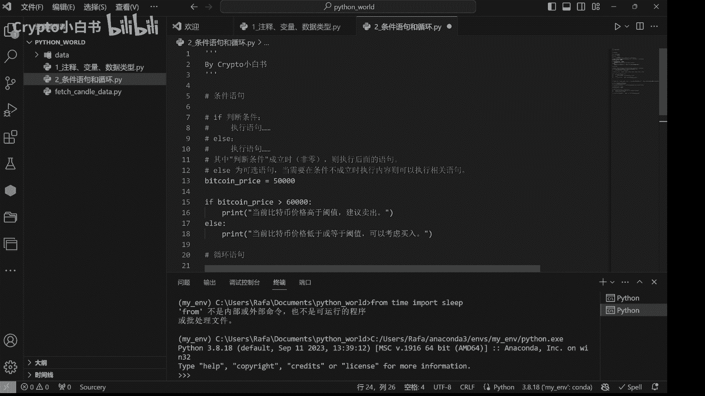

首先的话我们来看一看条件语句，条件语句的结构呢就是if加条件冒号一个缩进，然后执行语句，也就是说如果判断条件为真，则执行这个执行语句代码块，如果判断条件为假，或者说非真，那么就执行else后面的代码块。

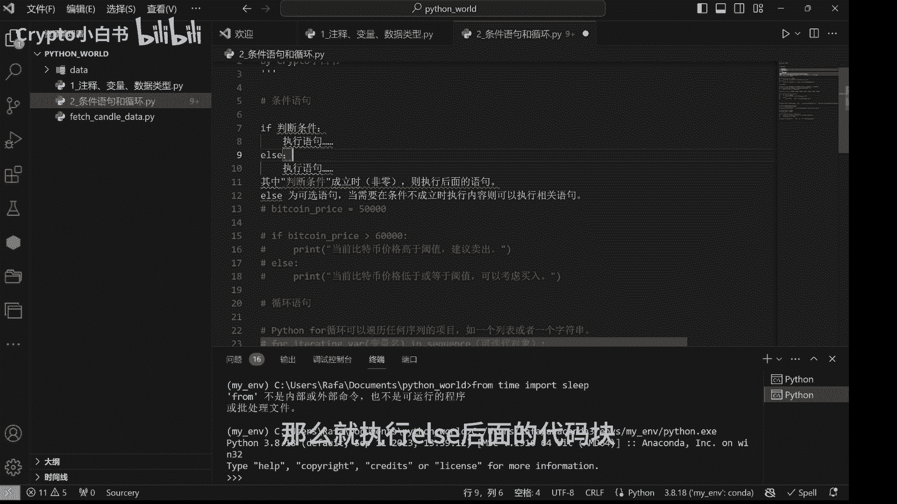

举个简单例子。

在数字货币量化投资中，我们可以使用条件语句来进行逻辑判断，例如根据价格波动情况，来决定是否要买入或者卖出，如果比特币价格大于6万，就输出当前比特币价格高阈值，建议卖出。

否则也就是说如果比特币价格小于等于6万，就输出当前比特币价格低于或等于阈值，可以考虑买入。

好这里我们设定比特币价格为5万，我们运行一下。

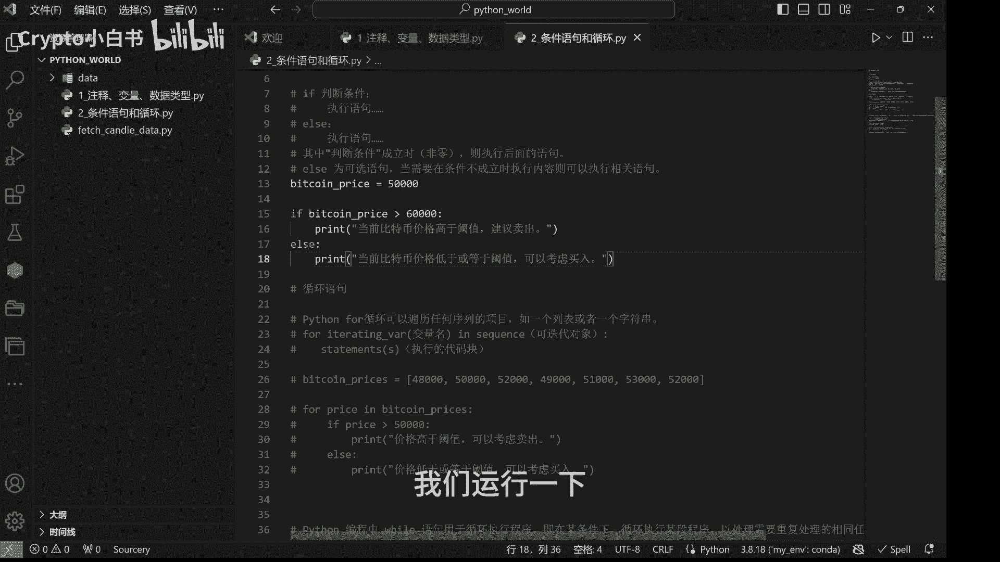

输出了当前比特币价格低于或等于阈值，可以考虑买入，那如果我们把它改成7万，再次运行，显示当前比特币价格高于阈值，建议卖出。

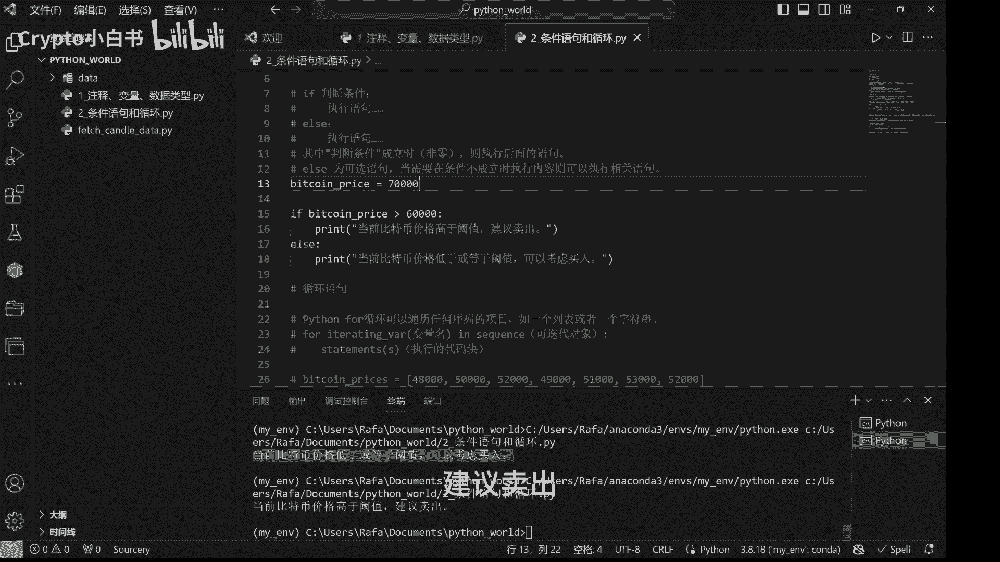

OK接下来我们来看一看循环语句，循环语句呢允许我们重复执行某一段代码，直到满足指定条件为止。

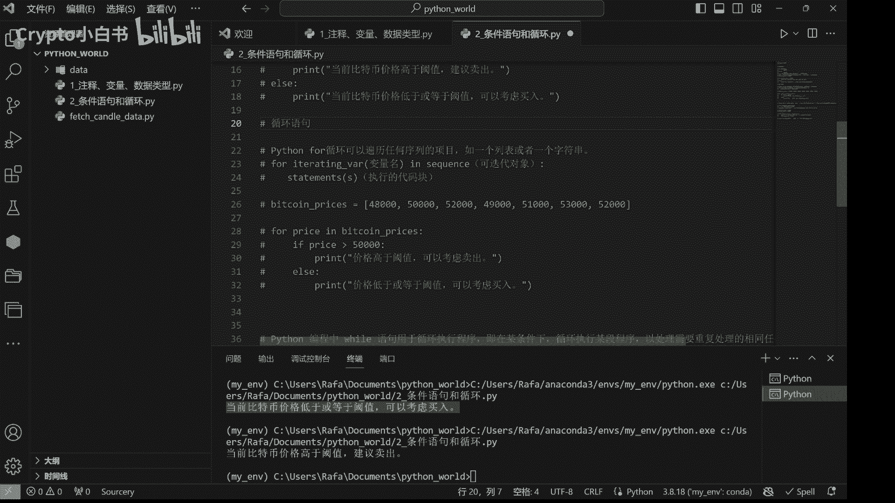

循环语句分为两种，一种是for循环，一种是while循环，我们先来看看for循环的结构。

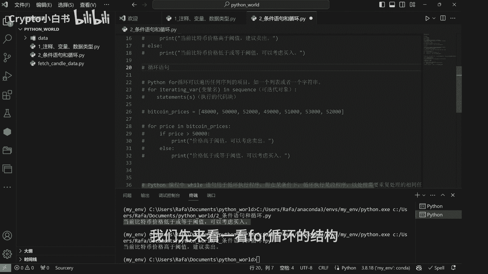

for关键词跟着一个变量名，关键词in，接着一个可迭代对象，可以是一个列表或者字符串等，最后是一个冒号和缩进的代码块，它的含义呢是对每一个可迭代对象中的变量，执行这个代码块的操作，我们来看一个案例。

假设我们有一个列表叫做bitcoin prices，储存了过去一周，比特币每日日末24点整的价格，那么我们使用一个for循环，遍历比特币的日末价格，并根据价格是否高于5万进行相应的逻辑判断。

并打印判断结果，For price in bitcoin prices，Bitcoin prices，这个列表就是我们刚才说到的可迭代对象，price就是我们给可迭代对象中的变量取的变量名。

就可以是price，可以是X，可以是Y，可以是任何你想取的名字，然后对这个可迭代对象中的每个变量price，我们都执行下面的代码快操作，如果价格大于5万，the print这个如果价格小于等于5万。

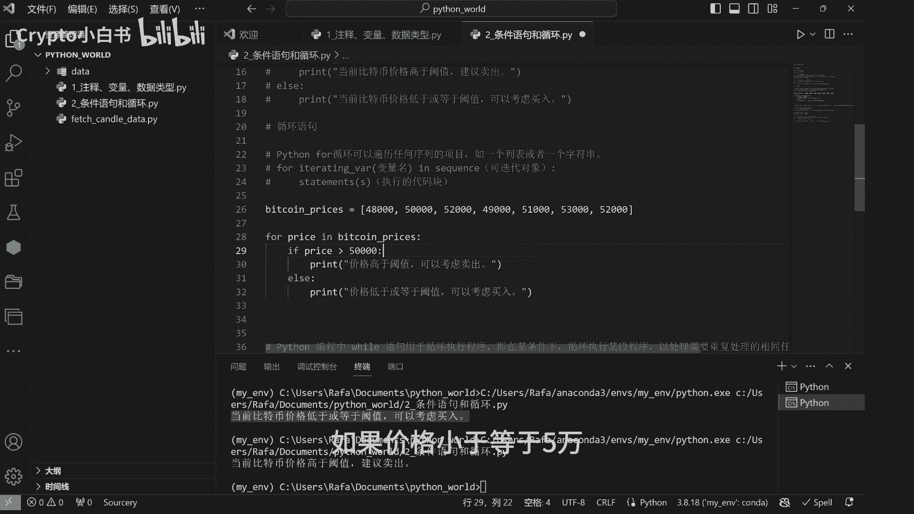

就print，这个我们现在运行一下这段代码，可以看到对过去一周七天每天的日末价格，我们都做了一个判断，有的是可以考虑买入。

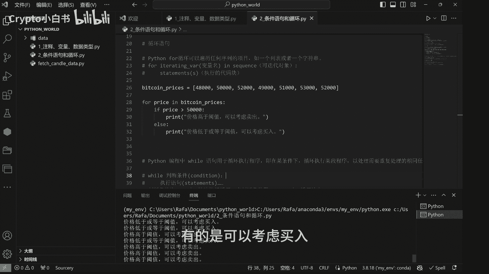

有的是可以考虑卖出，我们继续来看另外一种Python常见的循环，以及while循环，摩尔循环会在条件为真时重复执行代码，直到条件变为假为止，它的基本结构是while判断条件，Condition。

冒号缩进的执行语句代码块，也就是说当判断条件为真时，它就会执行执行语句代码块，然后他再去判断这个判断条件是否人为真，如果人为真，他就继续执行执行语句代码块，直到某一次执行条件变为甲变为false。

它就会停止执行这个代码块并退出循环，为了方便大家理解，我们来看一个实际的案例。

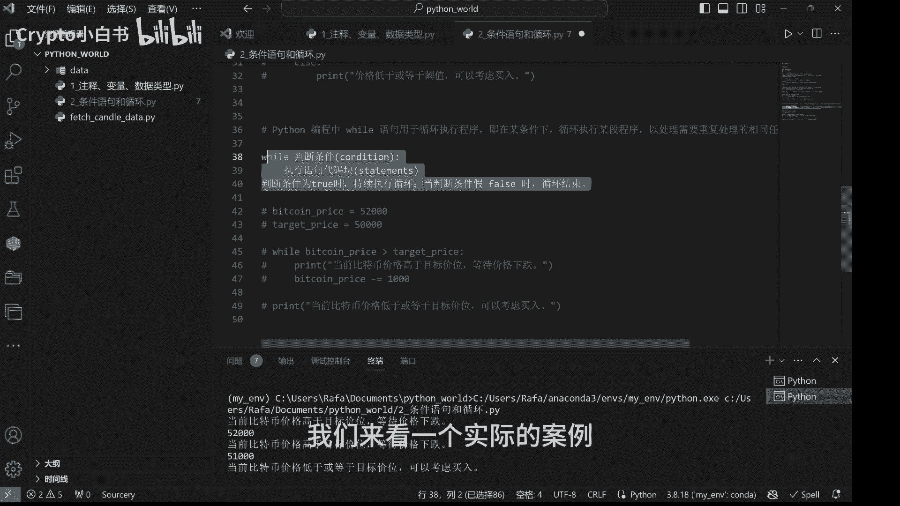

假设我们希望在比特币价格。

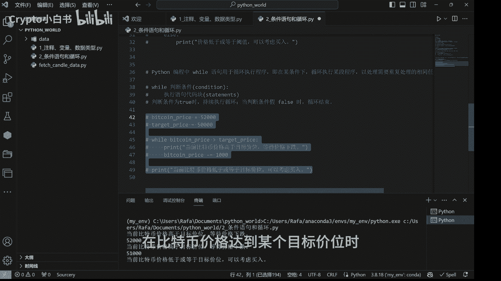

达到某个目标价位时进行买入操作，假设我们想要在比特币啊，它的目标价格跌破5万的时候进行买入操作，而现在的比特币价格为5万2。

那么我们进行一个while循环，will be comprise大于target price，就会print当前比特币价格高于目标价位，等待价格下跌，并且呢做一个呃比特币价格减1000的操作。

不然的话啊比特币价格不变，一直都是5万2，大于5万是个恒等式嘛，我们需要做一个比特币减1000这个操作，来确保比特币价格在某一个时刻会跌破5万，从而退出循环，否则就是一个死循环，为了方便大家理解呢。

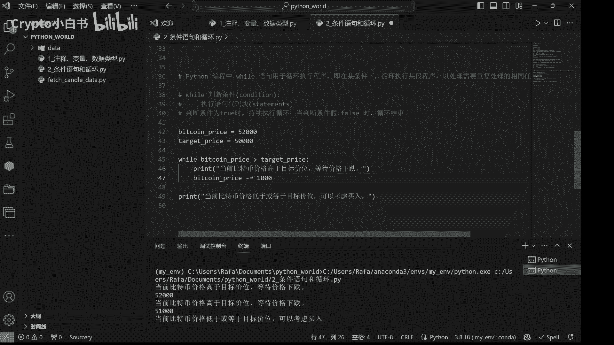

我们在这里print一下bitcoin price。

并且在它减1000以后，继续print一下point price，我们运行一下子弹代码，我来解释一下它背后的逻辑，首先循环开始前，bitcoin price是5万2。

大于target price50000，所以才会print当前比特币价格高于目标价位，等待价格下跌，并且他print了比特币价格是5万2，然后我们做了一个比特币价格减1000的操作，做完之后呢。

比特币价格就变成了5万1000，第一个循环结束，第一个循环结束，回到判断条件，condition查看这个判断条件是否为真，此时bitcoin price变成了5万1000，仍旧大于5万。

所以他进入第二个循环，当前比特币价格高于目标价位，等待价格下跌啊，print当时的比特币价格是5万1，做了一个比特币价格减1000的操作变成了5万，第二个循环结束，我们再回到判断条件。

判断判断条件是否人为真，此时比特币价格5万大于5万并不成立。

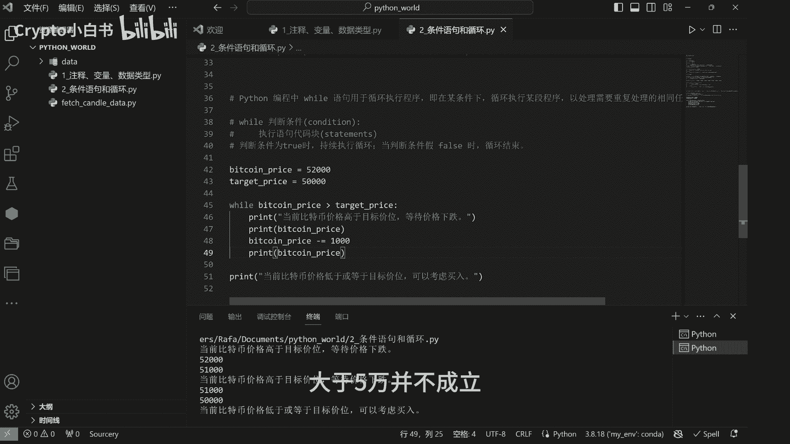

因为5万等于5万嘛，于是判断条件为假循环结束，退出循环，这个代码快结束，我们print当前比特币价格低于或等于目标价位，可以考虑买入。

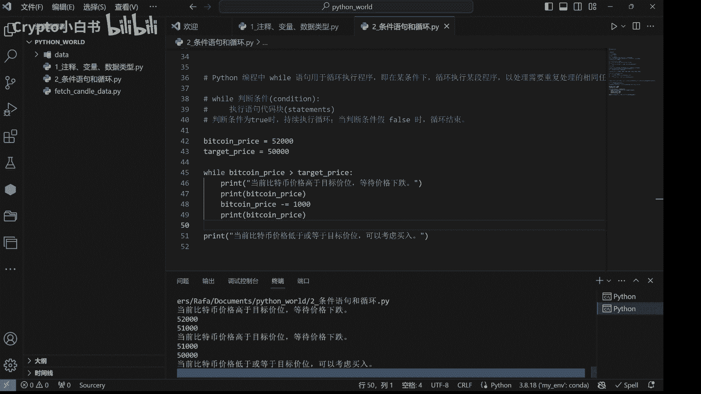

嗯所以总结下来while语句其实非常好理解，它就是当while后面的判断条件为真实，就会持续执行下面的代码块，直到判断条件为假循环结束，退出循环。

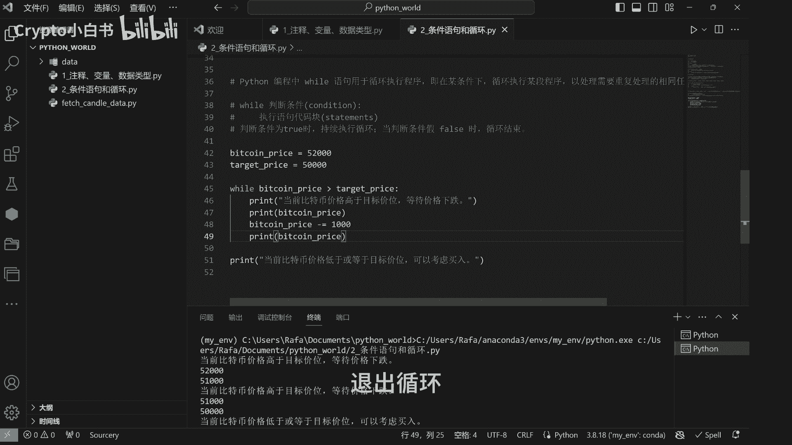