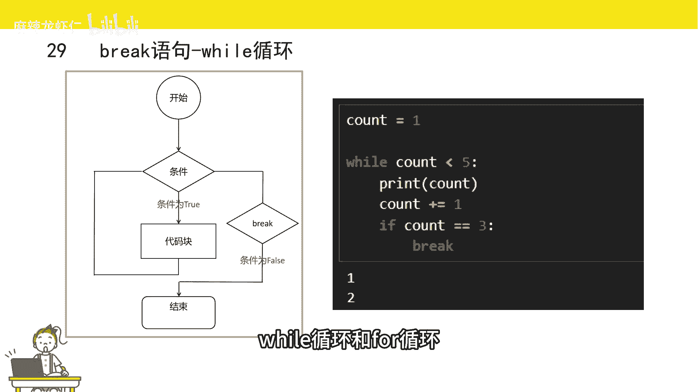
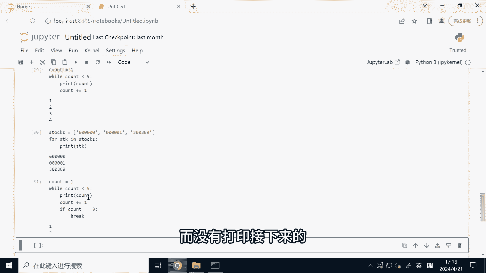
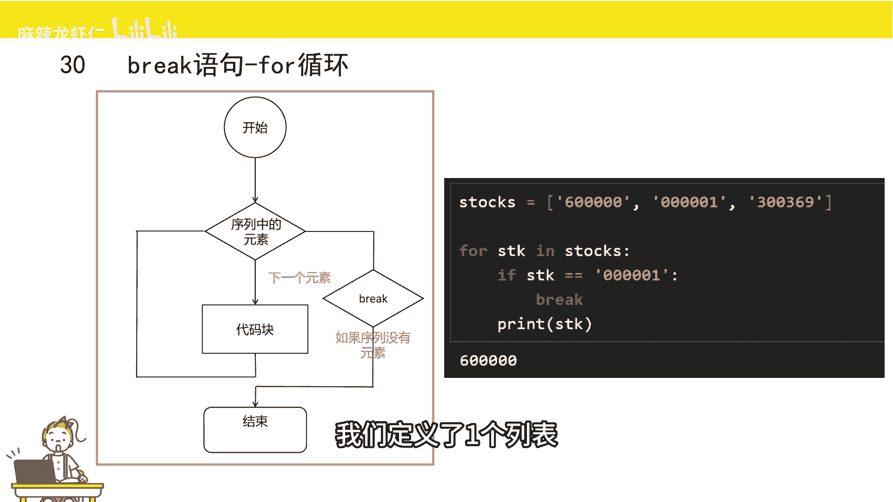
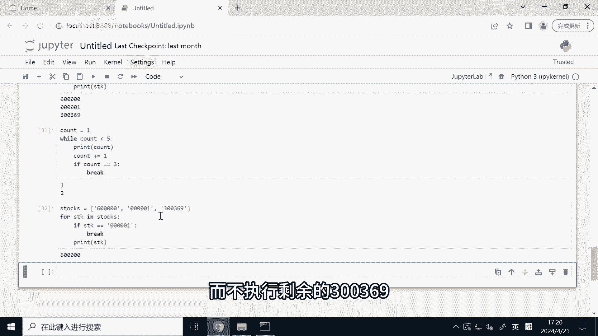
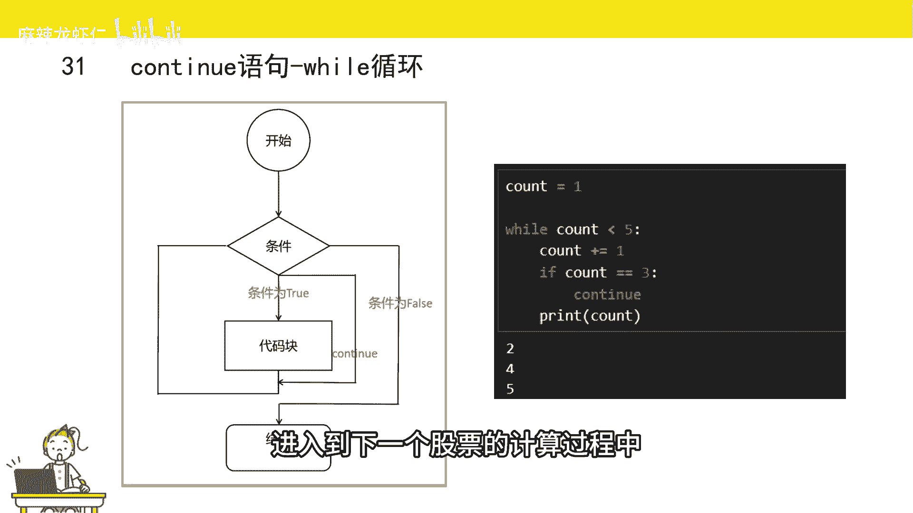
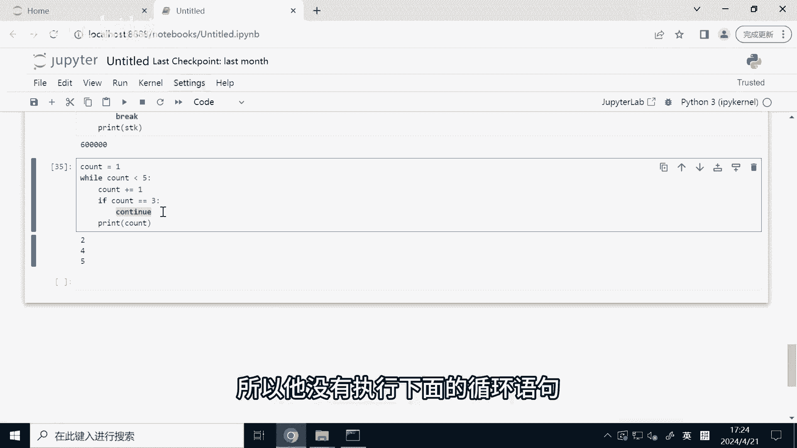
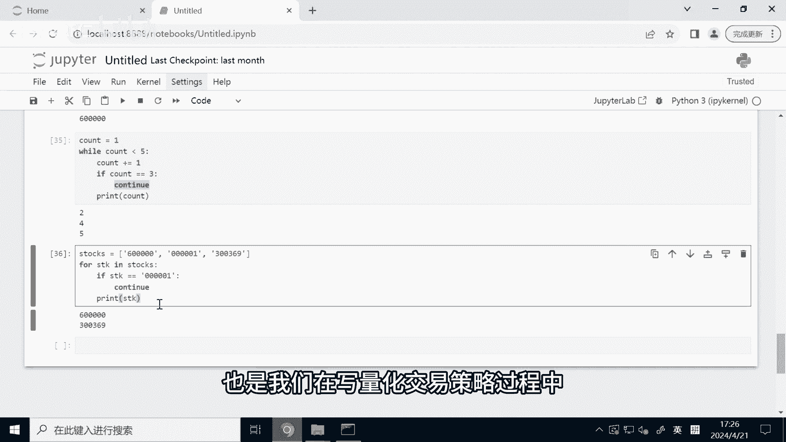

# 2小时速刷python量化交易--break和continue语句 - P1 - 麻辣龙虾仁 - BV1Xr421373p

介绍完while循环和for循环后，我们来给大家简单的介绍一下break语句和continue，有一句break是终端的意思，就是我们在进行循环语句时，当运行到break语句就跳出循环。

不再执行剩下的循环，举个例子，我们要寻找某个股票池里，满足均线多头排列的第一个股票，那我们可以轮询所有的股票池，然后判断这只股票是否满足均线多头排列，如果当有一个满足的话，那我们就可以取出这个股票。

然后不再运行剩下的循环，这首就会用到布莱克，这里呢，我给大家分别演示while循环和for循环。

是如何运用black语句的，这里我们首先定义一个变量，count赋值为一，然后循环当count小于50则进入循环，先把count打印，然后count自增一，接着判断，如果count，等于30。

The break，跳出这个循环，不再执行剩余的循环，这里呢我们把代码已经写好了，我们运行一下，我们可以发现只打印了一和二，这是什么原因呢，首先count等于一，我们判断一是小于五的。

所以我们打印一那count就变成了二，由于count等于二是不等于三的，所以他没有跳出整个循环，然后接下来判断当count是小于五，所以我们打印了二，count就变成了三，因为三是等于三的。

所以我们跳出了循环，所以他只打印了一和二，而没有打印，接下来的比如说345。

那其实for循环也是类似的，这里呢我也是给大家演示一下，我们定义了一个列表。

它里面是一些股票代码，然后我们用for来轮询这个列表，我们先用if条件判断语句来判断这个股票代码，也就是这个STK变量是否等于00001，如果是等于的话，我们则break跳出整个循环，不执行剩下的循环。

接下来我们利用print语句，来把这个STK这个变量给打印，接下来我们来运行一下，我们发现只打印了600000，这是为什么呢，首先STK它是第零个元素，他是600000，它不等于00001。

所以他没有break，他会执行剩余的循环，接下来STK变成了000001，由于它等于00001，所以他到了贝克语句，他跳出整个循环而不执行剩余的300369。

接下来是continue，continue语句是继续的意思，就是当我们进行循环语句时，执行到continue语句，Python就不执行旁听，有后面的代码，但是他没有退出整个循环，而是进入到下一个循环听。

有条件是我们在写量化策略过程中，经常能用到的一个关键词，举个例子，我们要判断某个股票是否满足均线多头排列，由于我们计算均线呢可能用到了历史行情，如果股票池里的某只股票，它的历史行情没获取到。

那我们计算均线时可能就有问题，这时候呢，我们为了不影响股票池里其他股票进行判断，我们就会跳出这个股票，进入到下一个股票的计算过程中。

这时候呢我们就可以用到continue，我们先来看一看在while循环中，是怎么样利用continue语句的，我们还是定义一个变量count，然后复制为一，On count，小于50则进入循环。

首先count自增一，然后呢判断TT是否等于三，如果等于三的时候，则我们不执行后面的语句，我们直接进入到下一个循环当中，接下来我们打印count，这时候呢打印了245，没有打印三。

我们来看一下整个循环是怎么一个过程的，首先count等于一，复制为一，接下来一是小于五，所以进入到这个循环，count自增一，count变成了二，or是不等于三的，所以没有运行这个continue语句。

它打印了all，接下来进入到下一个循环当中，二是小于五的，然后count它子增益变成了三鲁豫，三是等于三的，所以他进入了这个continue这个语句里面，他没有执行下面的这个PLA语句。

他又进入了下一个循环，count u自增益刚刚是等于三，接下来变成四了，由于四不等于三，所以它没有运行这个continue语句，它是打印了四，那接下来四又是小于五的，那四四自增一变成了五，五不等于三。

所以依然是没有运行着continue语句，它打印五，接下来五小于五，这个是false，所以他没有执行下面的循环语句。

那在for循环里面continue也是实现类似的功能，这里呢我们还是定义一个列表。

列表里面都是一些股票，接下来我们用for循环来轮询这个列表，然后呢，用衣服条件判断语句来判断，STK这个变量是否等于000001，如果是的话，我们continue，接下来打印这个变量。

这时候我们发现stokes它是一个列表，它有三个元素，但是它只打印了60000和300369，这是什么原因呢，我们来看一下，首先STK这个变量它是第零个元素，600000还是不等于000001的。

所以他没有运行这个continue语句，他是打印了600000，接下来进入到下一个循环当中，STK它变成了0。0001，它是等于00001的，所以它运行了这个continue语句。

怨天遇了这个continue语句以后呢，他就不执行圣域的循环，它不支持剩余的代码块，所以这一句他没有执行，它变成了下一个循环，也就是SDK变成了300369，由于300369也是不等于00001的。

所以他这里是没有执行continue语句，而是执行了打印，那到了300369以后呢，他没有生育的元素，所以他跳出了整个循环，beer语句和continue语句，也是我们在写量化交易策略过程中。

经常能遇到的语句。