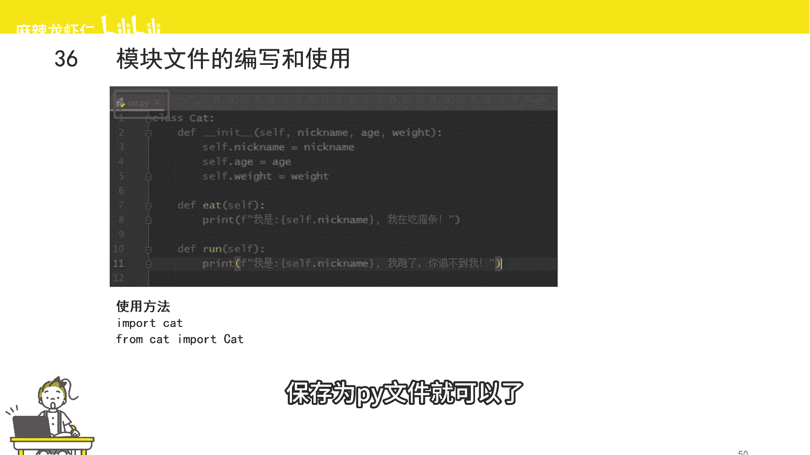
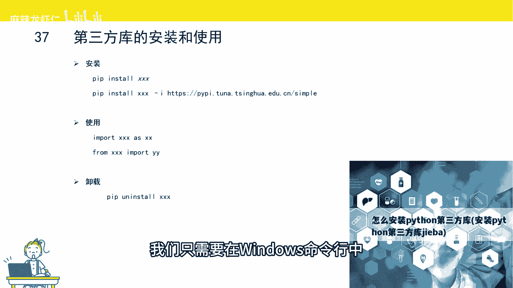
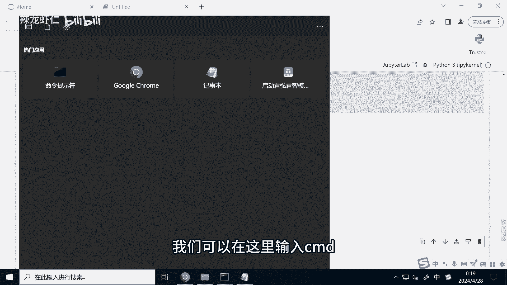
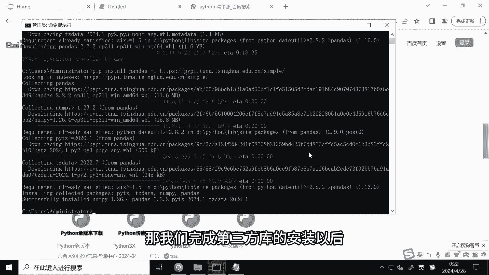
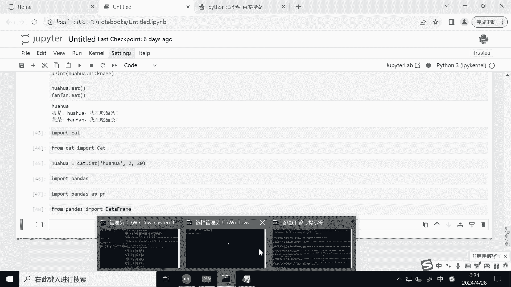
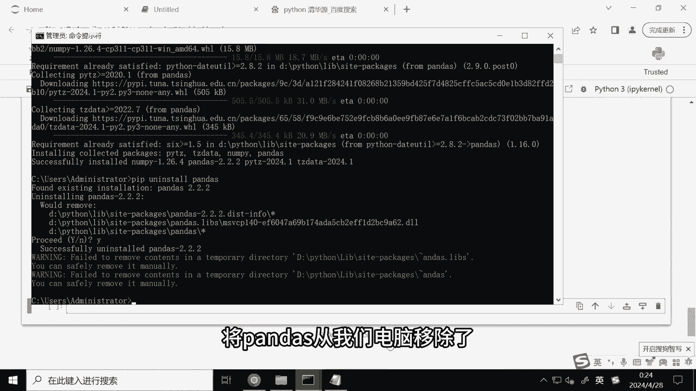
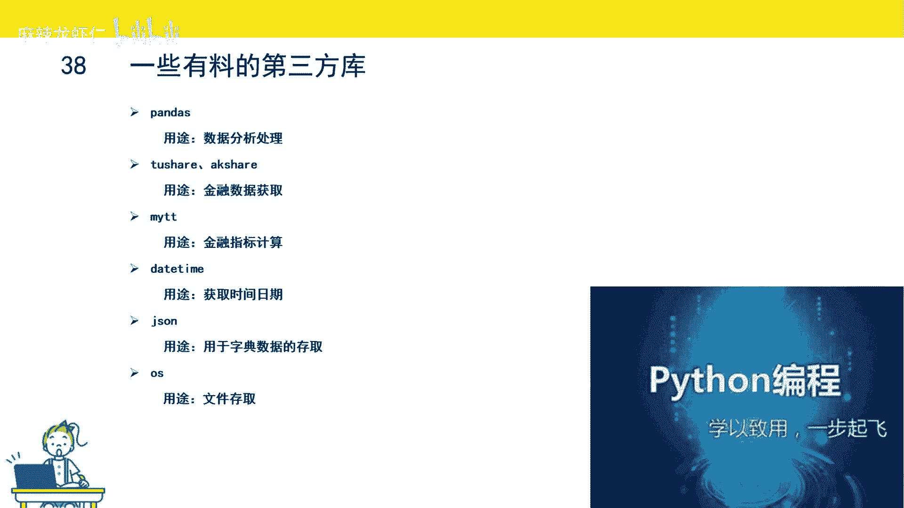

# 2小时速刷python量化交易--python模块 - P1 - 麻辣龙虾仁 - BV1FE421j7oD

而我们讲过的函数，是一个完成特定功能的代码块，而类是一个比函数更大的概念，类里面可以包括一批成员函数，而模块它又是比类更大的一个概念模块，里面可以有多个类，多个函数，它是个打包好的。

实现特定功能的代码块，模块有两种，一种是别人写的，我们称之为第三方模块，业内有个术语叫做轮子，我们不要重复造轮子，只是说不要去重复实现那些已经实现的功能，那另外一种呢就是我们自己写的。

那我们自己要怎么写模块呢。

我们只需要把我们自己写的代码，比如说我们刚刚写的猫猫那个类，保存为pi文件就可以了。

那这里呢我们先来试一下，我们复制cat这类的代码，然后呢在我们运行折腾notebook的这个目录下面，我们新建一个cat，文件，然后将后缀改为点PY，然后确定，接下来我们可以通过记事本的形式。

来打开这个文件，然后呢把我们刚刚复制好的代码，然后复制进去保存，这样我们就自己写了一个模块，那如果我们要使用这个模块的话，我们要怎么办呢，我们可以直接import这个文件名。

这样我们就引入了这个文件下面，所有的类和函数，如果我们只需要这个文件里面的猫猫这个类，其他的我暂时还不用，那我们就可以from cat import cat，来只引路猫猫泪。

那如果你要调用模块里面的函数或者是类，那需要怎么做呢，只需要模块的名字，然后后面加点点，后面就是你需要调用的函数或者是类，比如说我们要初始化猫猫这个类，那我们只需要cat，就是我们引入的这个模块的名字。

然后一个点号点号里面的cat呢，就是我们刚刚定义的这个类，我们已经把这个类的代码，复制到这个文件里面的，这样我们就完成了这个模块里面类的调用，刚刚我们也讲到过，我们不能重复造轮子，不能使大脑都自己去写。

对于一些常见的功能，Python几乎都有相应的库，Python提供了很多第三方库，很多功能别人已经帮你写好了，这也是Python这么火的一个原因之一，Python如何安装第三方库呢，其实很简单。

我们只需要在windows命令行中去安装即可。

我们可以在这里输入CMD。

然后按回车打开命令窗口，比如说我带领大家安装一个pandas库，我们可以输入g IP nestor handles，然后按回射，这样的话，系统就会自动的帮我们去国外的Python源上面。

下载pandas的文件，然后进行安装，由于默认的pandas库，他的语言呢其实是在国外的，你需要去国外的网站上签去下载，然后安装，然后我们可以看到现在安装起来会比较慢。

那这时候我们有没有办法能加快这个速度呢，我们可以把Python的元从国外的圆，切换成我们国内的，比如说清华大学的元，这里呢我给大家去试一下，这点我们先CTRL加D把安装这段代码给关掉。

然后呢我们使用国内的源，我们六娃七换成国内的圆的话，我们需要加上杠I这个参数，邓艾参数后面就是我们国内圆的一个地址，比如说我们这里用的是清华大学的源，然后我们按回车，我们可以发现。

现在安装起来就比刚刚安装的时候快很多，原因的话是，因为我们是在国内的网站上去下载，Python的第三方模块，然后再安装的，相比于国外来说，国内的速度要快很多。

这样的话我们就完成了handle这个库的安装，那我们完成第三方库的安装以后。

那要怎么使用第三方库呢，我们可以用import，不明来实现第三方库的引入，这样的话我们就把pandas on这个库引入进来了，当然我们还可以用到另外一个关键词，叫做二字关键词，二字的意思呢就是简写。

比如说我们一把把pandas，然后简写为pd，而后续调用的时候呢，我们就可以用pd点来进行相应的模块的调用，那如果我们只引入这个第三方库，里面的某个函数或者说某个类，那我们可以这么做，第三方库。

比如说我们是pandas，这个故，然后import这个库里面的函数或者是类，比如说我们要引入pandas里面的data frame，那我们可以输入data frame。

这样的话我们就只单独引入了this frame这一类，我们刚刚演示怎么安装第三方库，那要怎么去卸载第三方库呢。

我们可以p IP on in store，比如说我们要把panda子弟卸载了，当了室安装摄install，那么卸载呢是on in store，有前面加个UN，然后呢我们这里需要去按Y来进行确认。

那样的话我们就成功的将pandas字，从我们电脑移除了。

接下来给大家介绍几个常用的第三方库，比如说pandas，刚刚我们也介绍过，记得我们用的非常多啊，pandas是由一个用来做数据处理的一个库，因为量化交易它本质上来说其实就是数据科学，所以pandas4。

在量化交易里面是用的非常广泛的，第二类库就是to share，或者说ak share，这两个都是金融的数据库，能提供很多免费的金融数据，比如说历史行情，财务数据等等，方便我们用来做策略的研究。

第三方库叫做MTT，这是一个金融指标计算的库，可以将托慢性的公式转化为Python的代码，因为国内很多股民呀他是用拖拉信的，所以说这个库还是非常实用的，接下来是this time这个库。

它是一个时间的库，我们可以用来获取时间，对时间变量进行相应的操作，这个也很重要，因为股票交易都是有时间限制的，所以我们经常用这个库来进行时间的判断，杰森库是用来对字典型数据进行存取的库。

我们有时候需要把策略的参数保存到本地，这个时候呢我们就有可能会用到JSON文件，最后是OS库，这个就是文件读取的库。

