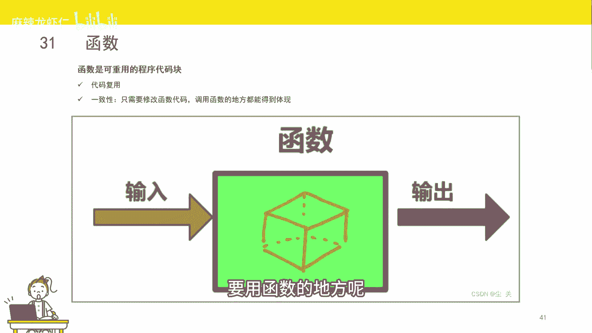
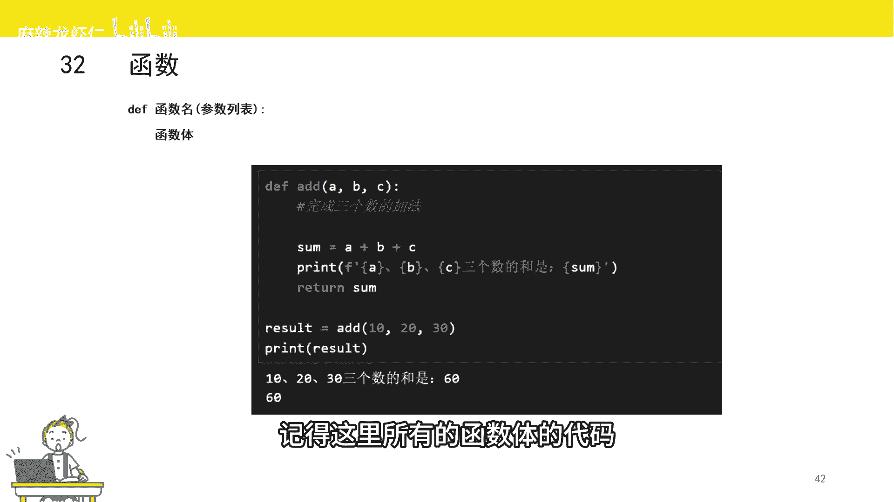
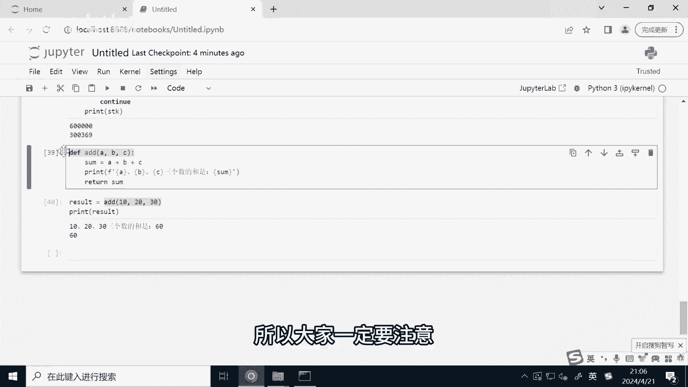

# 2小时速刷python量化交易--函数 - P1 - 麻辣龙虾仁 - BV1Zx4y187jf

接下来给大家介绍Python非常重要的概念，函数，其实我们在初中高中只有函数的概念，一般函数未写成Y等于FX。

对于任何地域内的自变量，都有个因变量与之对应，NPYTHON中的函数也是类似，对于一个输入函数，经过运算以后会得到一个输出，那函数有什么作用呢，第一就是代码复用，比如我们要在多个地方实现相同的功能。

那我们就可以把这些相同的功能，都写到一个函数里面，哪里用到的这些功能呢，只需要调用这个函数就可以了，就不用写那么多代码，起到了代码复用的效果，另外如果你要改动这个功能，那你只需要改动函数就可以了。

调用函数的地方都能得到体现。

那函数长什么样呢，函数的一般格式如下，另一个函数需要用到DEF关键字，这个就代表后面的是函数，DF后面是空格，接下来是函数名，函数名必须要字母或者下划线开头，开头以后可以是字母数字或者下划线。

函数名后面是个小括号，小括号里是函数参数的列表，就类似于我们说的自变量AK4，小括号后面是冒号，冒号换行，下面就是函数体，也就是函数要执行的代码，记得这里所有的函数体的代码都是需要缩进的。

这里我们举个例子，我们来写一个函数，时间的功能是返回三个数之和，比如我们定义一个函数A的后面接了三个参数，分别是ABC，然后是冒号，接下来里面是函数题，那首先呢我们定义了一个变量。

sum等赋值为A加上B加上C3个数之和，然后呢我们打印一个字符串，这里我们用到的格式化输出，接下来我们把sun这个值返回这里呢，我们一定要用了return关键词，这个关键词的意思呢就是把值返回。

然后呢我们运行一下，那怎么调用这个函数呢，我们只需要用到函数名，函数名后面加小括号，括号里面是传入的参数，那么就可以运行这个函数，如果这个函数有返回值的话呢，我们还可以把返回值赋值给其他变量。

返回值的意思就是类似于数学，概率面里面的自变量Y1个函数可以有返回值，也可以没有返回值，如果你没有定义返回值的话，那么这个函数返回的是NN，这里呢我们来试一下，我们调用A函数分别传入三个参数。

十二十三十，然后呢，我们把这个返回值也打印，我们可以看到我们已经调用了A的这个函数，因为它在这个函数题里面，有句打印的这个一句语句，还已经成功把我们的这三个输入参数，以及我们的SAM。

这被两位打印出来了，然后我们可以看到result，这个值正好也是我们三个数之和，10+20，加30等于60，我也成功打印出来了，这里有个需要注意的地方，就是我们在传入参数的类型以及个数。

要和我们函数的定义一定要是一致的，不然会报错，我们新手在写量化交易策略过程中，经常会因为这个问题导致了你的代码会报错。

