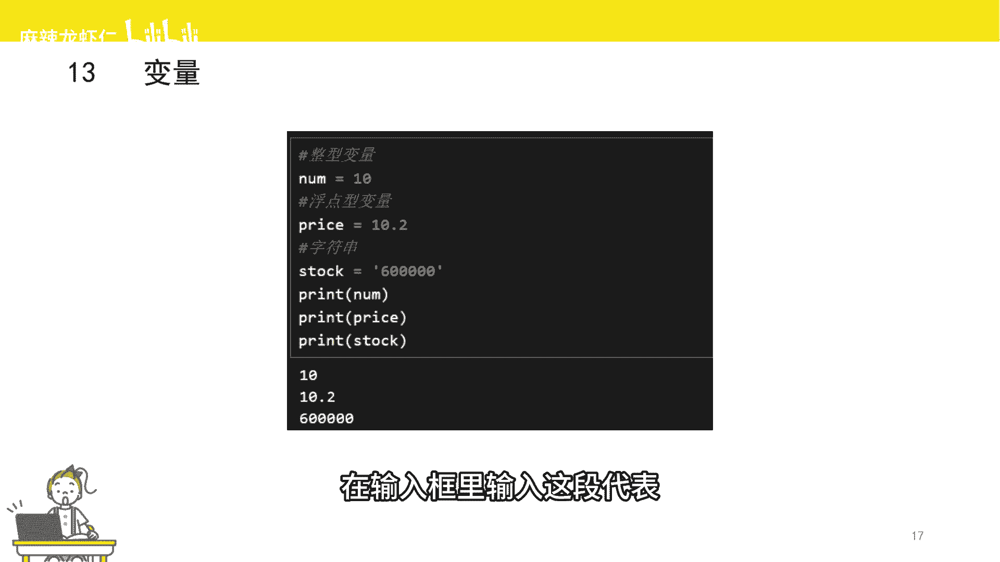
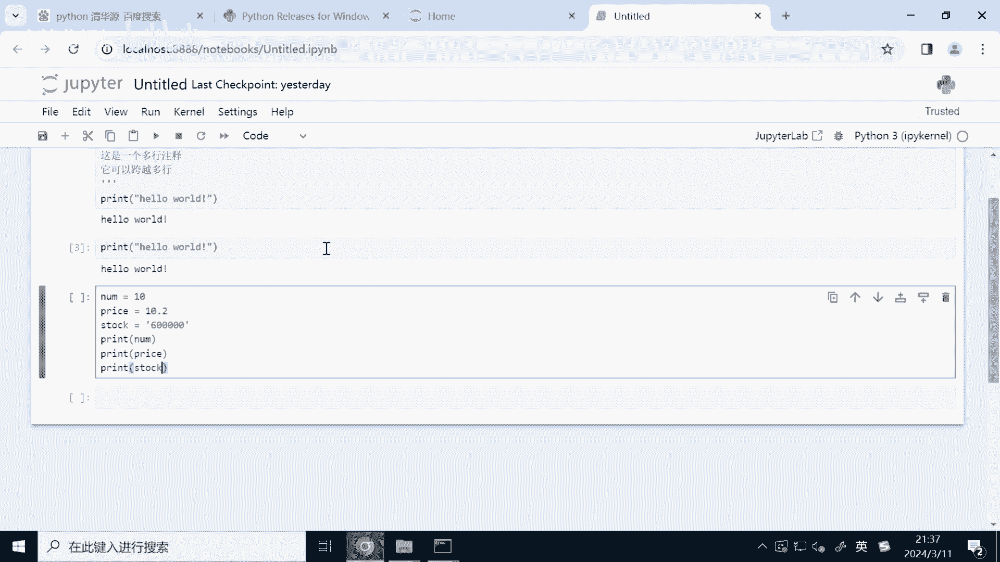
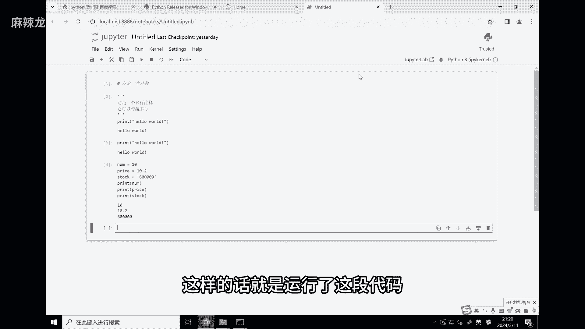
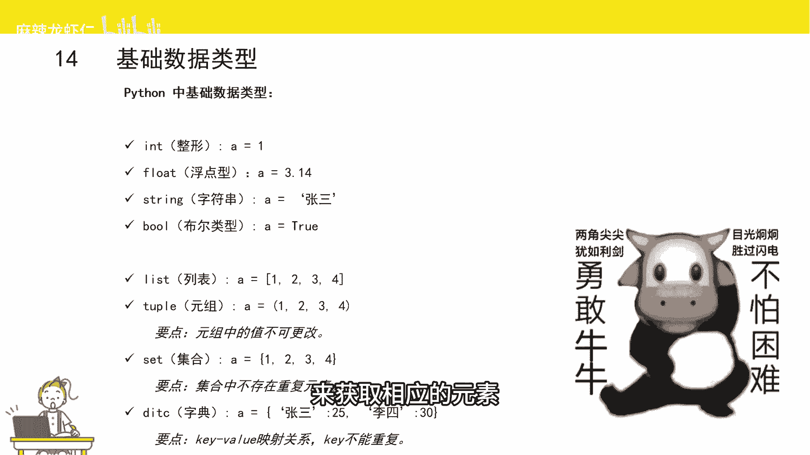

# 2小时速刷python量化交易--变量和数据类型 - P1 - 麻辣龙虾仁 - BV1tt421L76C

接下来给大家介绍Python变量和数据类型，首先什么是变量，变量就是别名，数据的名称就跟我们的名字一样，比如说你叫张三，他叫李四，只是个名称而已，那为什么叫变量呢，因为是可以变的量。

这个变量可以指代这个数据，也可以指代另外一个数据，当然变量是不能随便起名字的，Python规定了变量只能由字母数字和下划线组成，并且开头只能是字母和下划线，Python创建一个变量很简单。

只需要给变量提供一个名字，再加上一个等号，等号右边是一个值，这样就实现了变量赋值的效果，比如这里我创建了四个变量，分别是number变量只代整数十，这里再重复一句，这里的等号不是等于的意思。

而是赋值的意思，赋值就是告诉变量你代表的是什么样的数据，比如左边这个变量代表的就是整数10prize，这个变量代表的是小数10。2stock，这个变量代表的就是一串字符，需要注意的是。

当我们使用等号给变量赋值时，Python会自动根据所赋值的值，来确定变量的数据类型，这里也建议大家跟我一起敲下代码，在输入框里输入这段代码。

输入完成以后呢，我们按shift加回车，这样的话就是运行了旧的代码。

接下来给大家介绍一下数据类型，Python对各种数据进行了分类，主要的目的是为了更好的去处理数据，我们的现实生活中，其实也对数据进行了类似的分类，比如说整数小数一段话等等，Python数据类型。

其实跟现实生活中的数据是有对应的，比如现实生活中的整数，Python把整数这种类型叫做整形，现实生活中的小数，Python叫做浮点型，现实生活中的一段话，Python叫做字符串，现实中生活中的真或者假。

Python叫布尔型，一串数据用中括号括起来的一串数据，Python叫做列表，用小括号括起来的一串不可变的数据，Python元组，集合其实就是我们高中学过的数学里的概念，一串没有重复元素的数据叫做集合。

那字典就是由一组键值对组成，那键值对这有什么呢，它由键和值组成，中间用感叹号来连接，键就是名称的意思，直就是这个名称所对应的数据内容，通过这个名称呢，我们可以找到它所对应的这个值。

后面这几种数据类型其实都包含好几个元素，这些数据类型可以分为两个类型，一种是可以变的，比如列表字典集合，我们可以对这个数据类型进行一些增加删除，修改和查找的操作，另外一种是不可以变的数据类型。

比如说字符串元组，我们就没办法对这两个数据类型进行，比如说增加删除和修改，从另外一个分裂的角度来说，这几种数据类型还可以分为是否有序，就是我们通过序号找到相应的元素，比如字符串列表元组，这些都是有序的。

另外一种数据类型是无序的，就没有办法根据序号来获取相应的元素。

