# 2小时速刷python量化交易--基本数据类型以及操作 - P1 - 麻辣龙虾仁 - BV1N2421N7nb

接下来给大家详细介绍常用的几种数据类型，以及他们的操作，首先是布尔类型的变量，这个很重要，我们在写量化策略经常的用到，比如我们要判断某个条件是否正确或者错误，正确，在Python中用Q来表示错误。

在Python中用false来表示，大家注意这个true和false首字母都是大写。

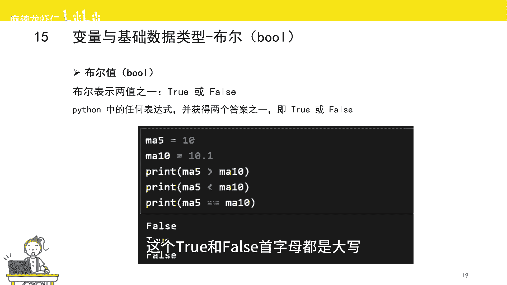

Python是区分大小写的，我这里举个例子来跟着我一起操作一下，我们定义一个变量，NA5代表5日均线复制为十，我们定义另外一个变量，ma时代表10日均线复制为10。1。

我们判断5日均线是否大于10日均线，然后用来打印结果，5日均线十小于10日均线10。1，所以打印出来的第一个结果是false，第二个结果打印出来是true，第三个结果打印出来也是false。

其中第三个这两个等于号在Python中是等于的意思，我们后续会讲到这块。

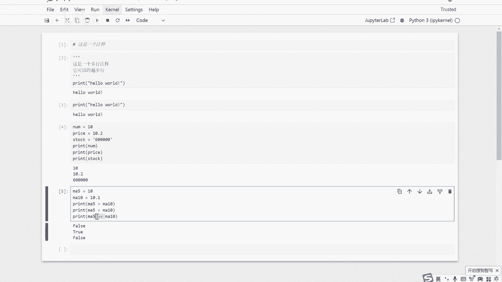

接下来是字符串，字符串是什么，字符串是用单引号或者双引号或者三个引号，获取来的一串有序的序列，单引号和双引号实现的功能都是一样的，有序是指字符串里面的元素，都是按照顺序来排列的。

可以通过序号来获取元素有两种排列方式，从前往后和从后往前，从前往后，数01234，最前面这个元素的序号是零，大家这里一定要注意，Python的序号都是从零开始，而不是从一开始从后往前数，一负二，三负四。

我们可以通过序号来获取字符串里面的元素，可以从前往后获取，也可以从后往前获取。

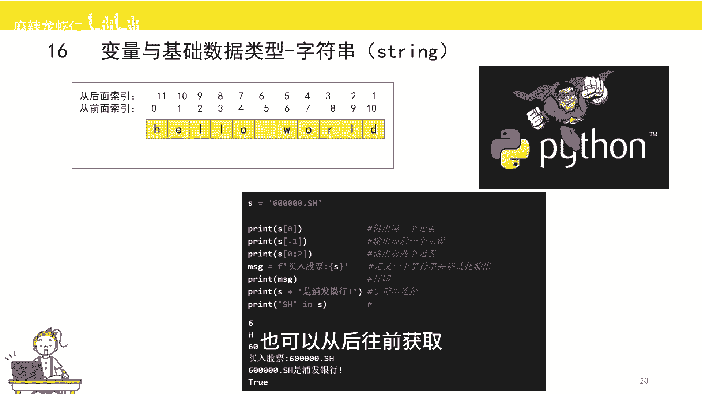

比如我们定义一个字符串，为60000点SH，然后我们要获取最前面那个元素，那我们就可以通过字符串，然后再加中括号，然后再加序号，比如说我们要获取最前面那个元素，那我们就可以传入序号为零，然后我们打印。

我们可以看到已经拿到了最前面的元素为六，那我们也可以从后往前去获取，比如我们要获取最后一个元素，那么我们就可以传入序号为一，这样的话我们就获取到了最后一个元素H。

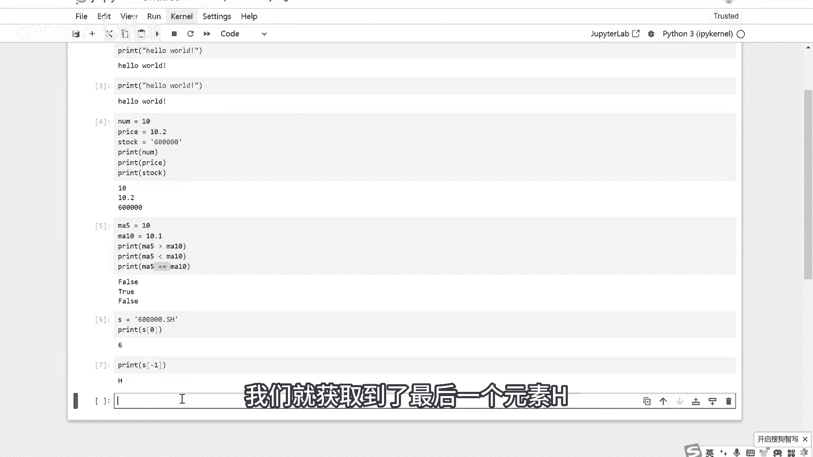

如果我要获取字符串里面多个元素怎么办呢，我们在写量化策略过程中，其实经常能遇到，比如说我们要获取股票代码的前两位，来判断是否是创业板，因为创业板是三零开头，我们可以获取前两个元素知识后呢。

就要用到一个叫做切片的操作，切片就是去获取字符串的一部分，它是指定起始需要和结束序号，来获取序列的一部分，它的语法是前面序号中间一个冒号，后面再加一个序号，获取从前到后的元素，但是不包括后面的这个序号。

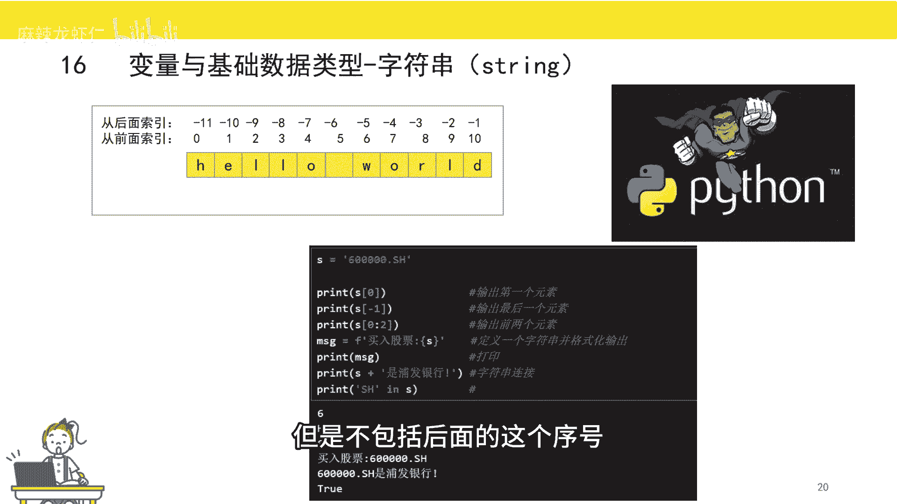

比如我们要获取前两个元素，那我们就可以传入零冒号奥，这样的话就可以获取第零个和第一个元素，但是后面的这个or这个元素是不会获取的，我们试一下，我们发现已经取到了前两个元素六零。

当然你也可以省略第一个序号代表从头开始，我们也来试一下，这样的话我们就没有传入前面序号零，我们同样来获取一下，我们会发现跟前面的实现的效果是一样的，当然你也可以省略后一个序号代表到最后面。

并且是包含最后的，把切片操作除了用字符串以外，其实还可以与操作其他的一些数据类型，比如说列表和元组，接下来是格式化输出。

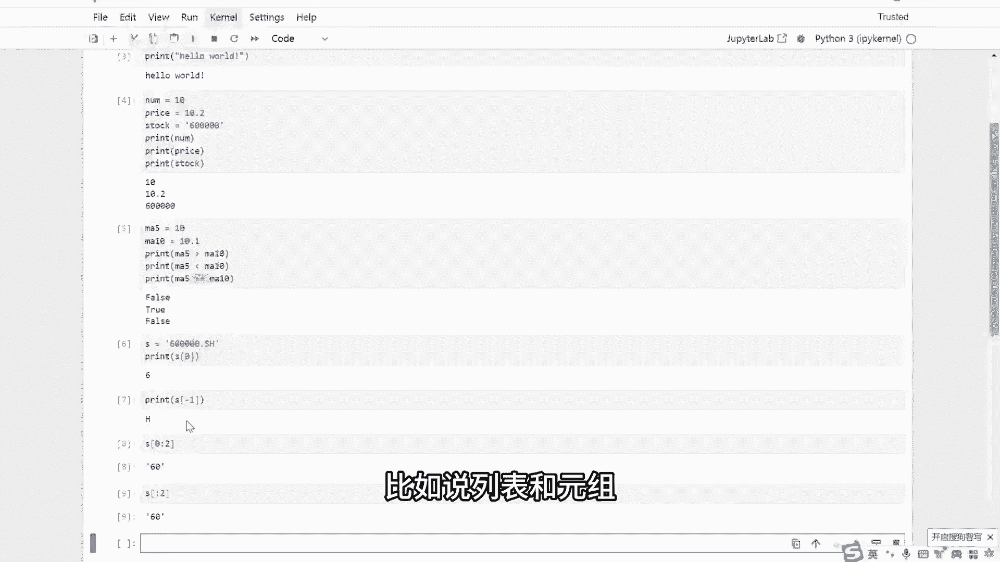

有时候我们需要把变量插入到一个字符串当中，这时候呢我们可以使用大括号作为占位符，然后在字符串前面加一个F，比如我们想在这个字符串中插入股票代码。

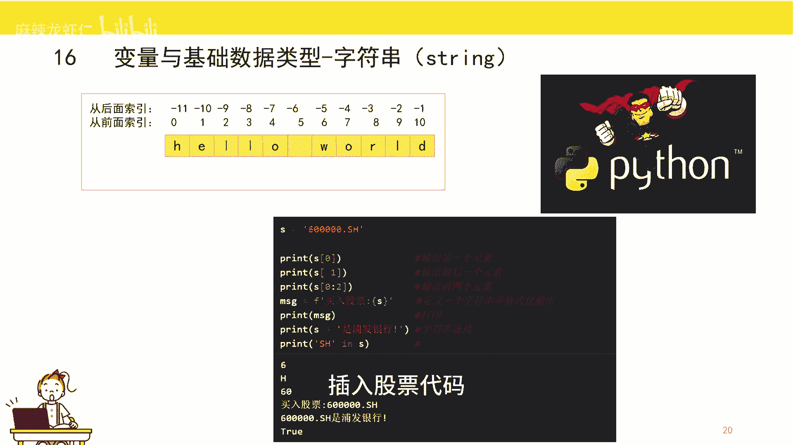

就可以用这种方式，这里我们试一下，我们定义了一个字符串message，然后通过大括号，把S这个字符串插入到message这个字符串中，然后打印，我们可以看到，我们已经把S这个字符串。

已经插入到message这个字符串当中，这样的话就完成了字符串的格式化输出，格式化叔叔在写量化策略过程中也经常会用到，特别是什么情况呢，我们在打印日志消息的时候，有时候我们需要把两个字符串相加。

变成一个新的字符串，这时候可以用到字符串的一个加法，把两个字符串拼接起来，比如说，我们打印S加上一个字符串，我们可以看到输出的是两个字符串，相加的一个结果，最后我们要判断某个字符串。

是否在另外一个字符串当中，这里我们也经常能用到，比如说我们写量化策略，股票代码的结尾一般都会加上交易所，比如说我们刚刚定义的600000点SH，那SH这两个字母就代表上海，那么如果我们要判断某个股票。

是否是上交所的股票，那我们就可以通过SH这两个字母，是否在股票代码当中，来判断这个股票是否是上交所的股票，然后返回true，那说明是返回祸死，那寿命不是，这里我们演示一下，我们可以看到SH这两个字符。

的确是在S这个字符串当中。

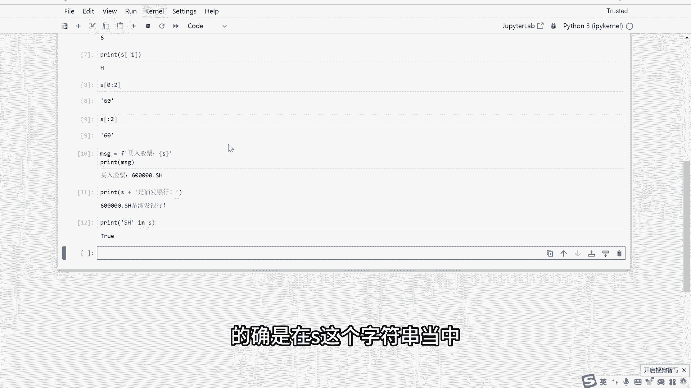

接下来是列表，列表在写量化策略过程中也非常重要，我们经常要用到列表，是用中括号括起来的一串有序的序列，这里我们提到两个关键字，一个是中括号，用中号括起来的就是列表，一个是有序。

就是能通过序号来获取列表里的元素，这里呢我们也举个简单的例子，比如说我们定义一个股票的列表。

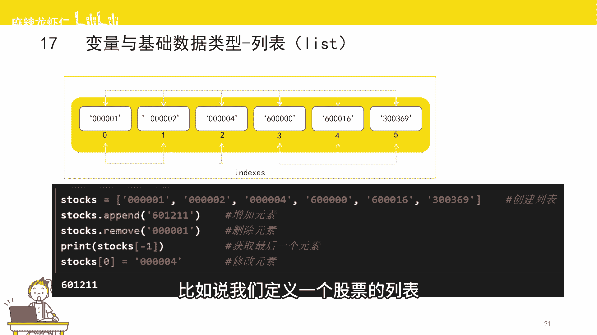

股票列表中有六个股票，这六个股票分别是60000~300369，拿序号也是从零开始，接下来给大家介绍一些列表的操作，比如我们要在这个列表中新增一个股票怎么办，我们要在这个股票十中新增一个股票怎么办。

那我们可以调用列表的一个成员函数叫AP，比如说我们要插入一个股票池，601211，我们就可以调用append函数，然后运行一下，我们打一下stock这个字列表的值，我们可以发现我们已经把601211。

已经加入到这个股票池，也就是这个列表中了，如果我们要把一个股票从这个股票池中删除，那我们要怎么办呢，我们可以调用一个成员函数，叫做吕木五，比如我们要把600000，这个股票从这个股票池中删除。

那我们就可以调用铃木函数，然后运行，我们继续打印出来看一下，我们可以发现60000已经从这个股票池，也就是从这个列表中已经删除了，如果我们要获取列表中的某个元素。

那我们可以通过跟字符串取元素的方式一样的，用中括号再加序号来获取，比如说我们要获取最后一个元素，那我们就可以通过获取序号为一的时，来获取这个元素，OK我们已经获取到了最后一个元素，601211。

最后一个操作是修改，如果我们要把股票池中的某个股票给修改了，那我们只需要把这个修改后的值，赋值给你需要赋值的那个序号就可以了，比如说我们要修改最前面那个元素，也就是序号为零的那个元素。

那我们就直接复制就可以了，我们可以看到。

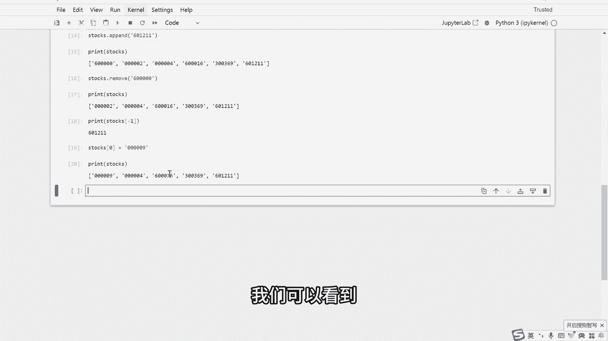

已经把最前面那个元素已经修改好了，接下来是集合，集合是用大括号括起来的一组无序的序列，这里两个关键字啊，一个是无序，一个是大括号，我们在写策略过程中，用集合的地方非常少，当然也有个应用场景。

比如说我们有个股票池，或者说一个列表，列表里面有重复的元素，那么你想要删除重复的元素要怎么办呢，那我们可以通过把列表转化为集合。

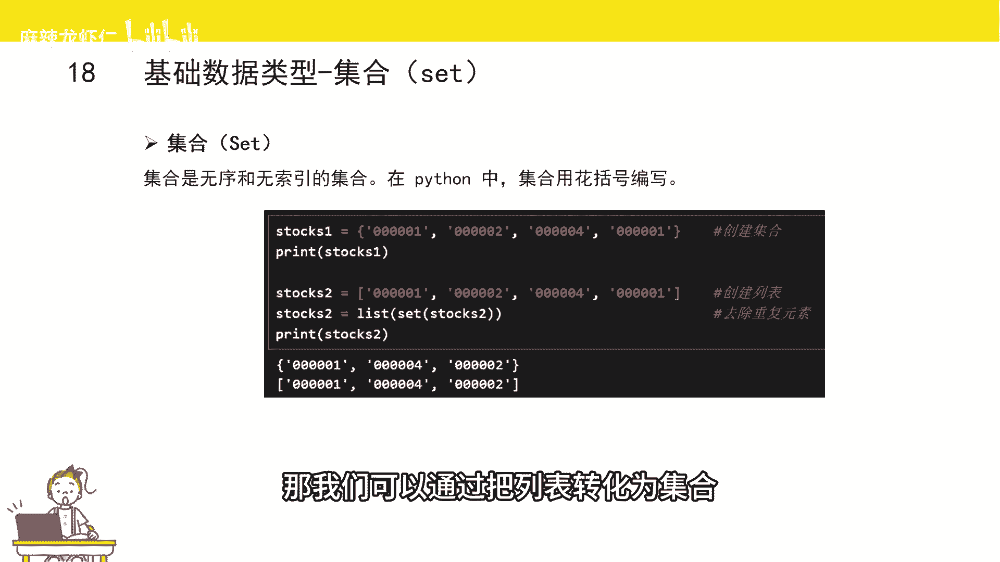

然后再把集合又继续转化为列表就可以了，举个例子，我们有个股票池，也就是列表，然后里面有重复的股票，我们可以看到在这个列表里面，它有个重复元素000001，那我们要怎么样才能把这个重复元素都给删除。

每一个元素都保留一份呢，这时候我们可以用到集合的特性，集合是没有重复元素的，我们可以把这个列表强制转化为集合，然后再把集合又强制转化为列表，通过这种方式来将重复元素给删除。

我们可以看到我们已经把重复元素，000001给删除了，在这个新的列表里面的，每个元素都是只有一份的，刚刚给大家讲过一个概念，叫做强制类型转换，这里我稍微给大家提一下，就是某一个类型的变量。

我们如果我们要把它变成另外一个类型的变量，那我们就可以用到强制类型转换，比如说把浮点数也就是小数转化为整数，那我们就可以用int函数来将这个小数进行。

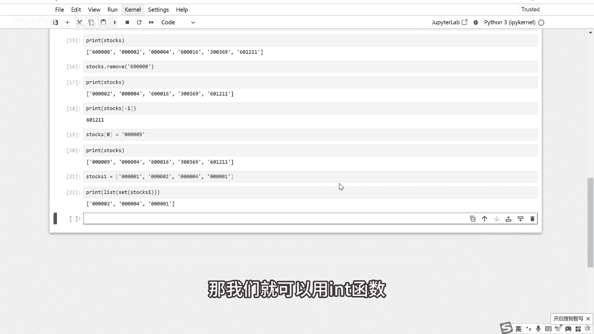

强制类型的转换，接下来是字典，我们现实生活中的字典是用来查字或者说词的，字典会有一个目录，它对应的是字或者词所在的一个位置，有个对应关系，有了目录以后就可以找到对应的字或者词，拿Python的数据类型。

字典也是类似的意思，它是用一组大括号括起来的，无序的序列里面每个元素都是由舰支队来组成，剑指队之间用冒号来连接，无序是指没有通办法通过序号来获取元素。

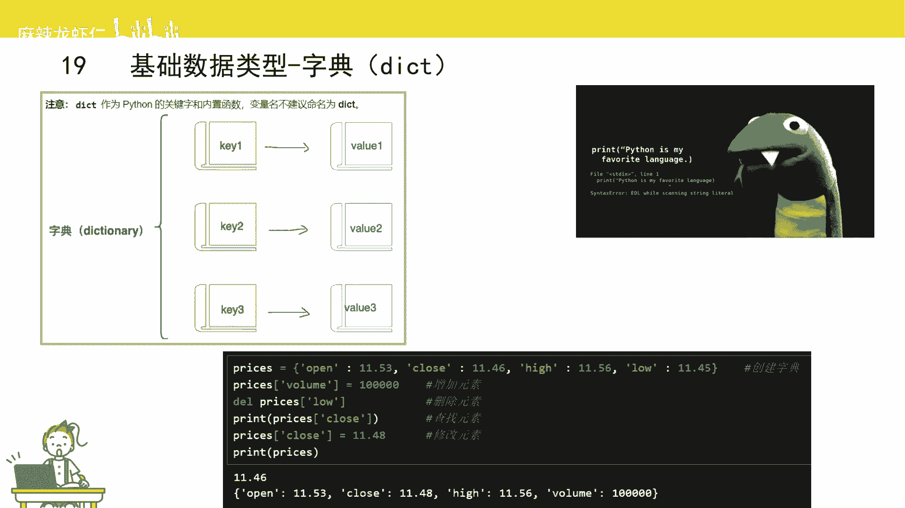

这里我们举个例子，我们定一个叫做pad的字典，用来保存行情，太子他是个字典，它的键是字符串，Open clothes，high和low分别代表了开盘价，收盘价，最高价和最低价值，就是这几个字段相应的值。

比如说开盘价是11。53，收盘价是11。46，那接下来我给大家介绍一下字符串的操作，比如说我们要在这个字符串里面增加一个元素，那我们只需要把这个值复制给相应的键，就可以了，比如说我们要增加一个元素。

交易料涡流，那我们就可以把交易量1000复制个涡流就好了，我们可以看到，我俩已经成功地加入到这个字典当中了，那如果我们要把一个元素从这个字典中删除，那我们要怎么做呢，我们可以用在一个叫做DL的函数。

DL函数后面加上删除的键，那么就可以把这个键值都删除，比如说我们要把这个open这个键值对删除，那我们可以调用DR函数，我们可以看到open，这个剑指队已经从这个字典章中已经删除了。

如果我们要在这个字典中去查找某个元素的值，那我们还是可以用到中国号，但是中括号里面不是序号，因为字典是没有序的，中括号里面的是建，比如说我们要获取收盘价，那我们可以用到中括号，再加上对应的剑的名字。

我们可以看到我们已经获取了收盘价，11。46，那这里呢其实跟字串是非常类似的，但是有些不一样的地方，字符串是直接传入序号，比如说零，那就说最前面那个元素，一就是最后面那个元素，但是字典的话。

它传入的不是序号，因为它是无序的，它传入的是剑的名字，我们这里定义了好几个键，比如说open键，codes键，high和low，那我们只要把这个键传进去，那我们就可以得到这个键所对应的值。

最后如果我们要对这个字典进行修改操作，比如说我们要把最高价给修改，那我们要怎么做呢，我们只需要把修改之后对应的值，直接给复制给相应的键就可以了，我们可以看到head，这个建筑队已经被我们成功的修改了。

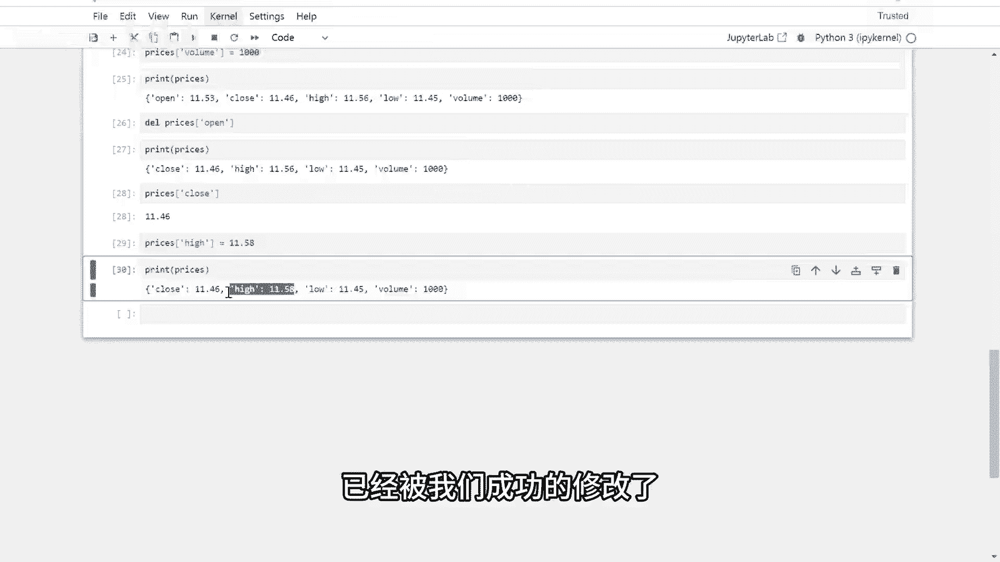

最后一个数据类型是元组，元组是用小括号括起来，一组有序的序列是有序，并且是不可以更改的，有序是指我们还是可以通过序号来获取元素。

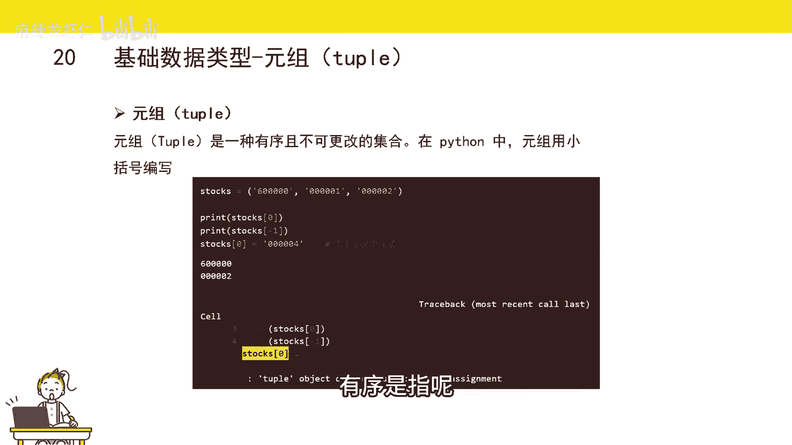

比如说我们定义了一个元组，这个元组呢也是一组股票代码，我如果我们要获取第零个元素，序号为零的元素，那我们也是可以跟字符串或者说列表，来获取元素一样的，通过中括号加上序号的形式来获取。

这样的话我们就成功的获取了第零个元素，因为元组它是一组有序的，并且是不可更改的序列，所以它的元素的值是不可以修改的，当我们想要修改某个值的时候，我们来看一下会发生什么，比如说我们要修改第零个元素的值。

把它修改为，我们可以看到已经报错了，那他有个提示啊。

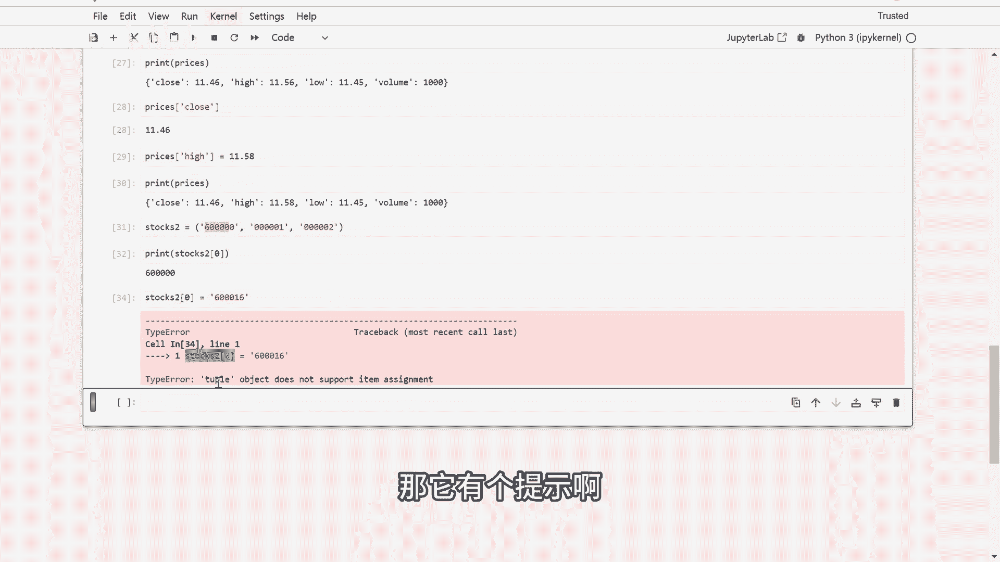