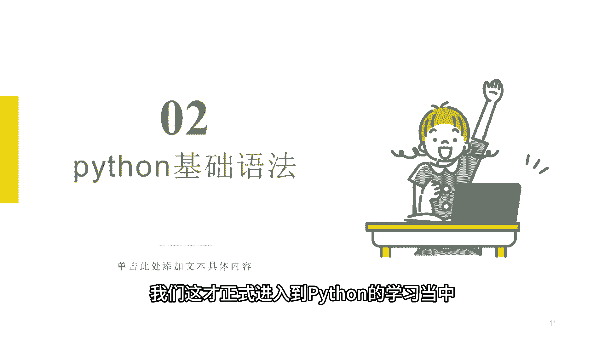
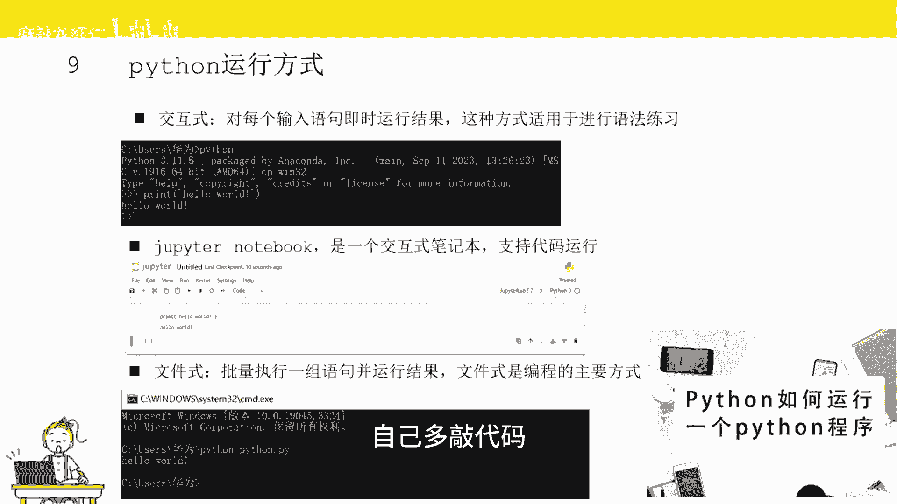
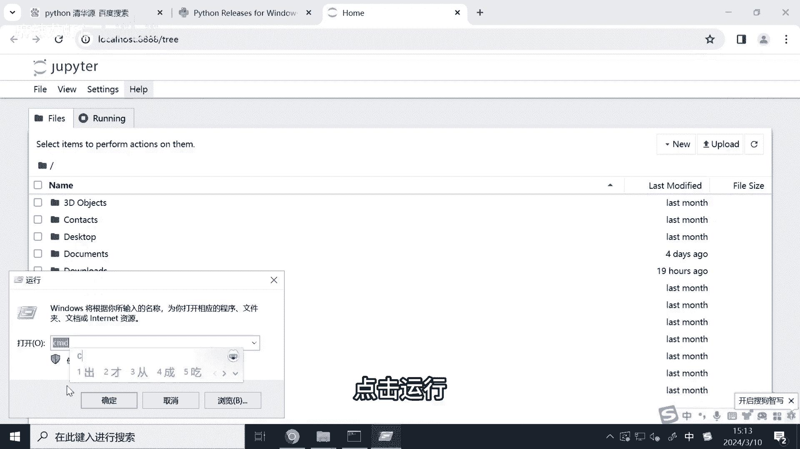
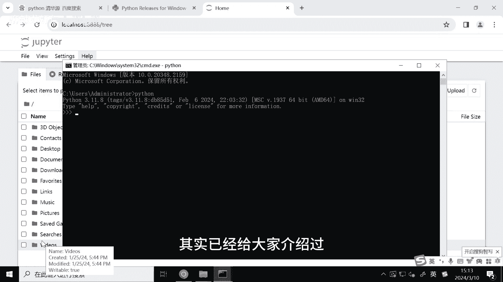
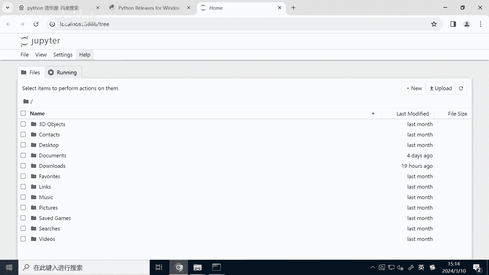
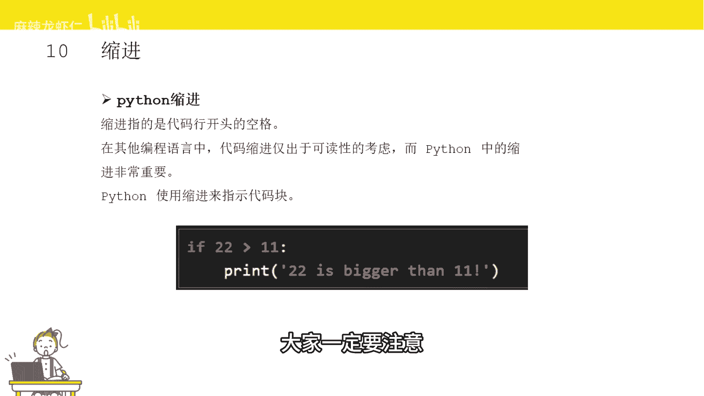
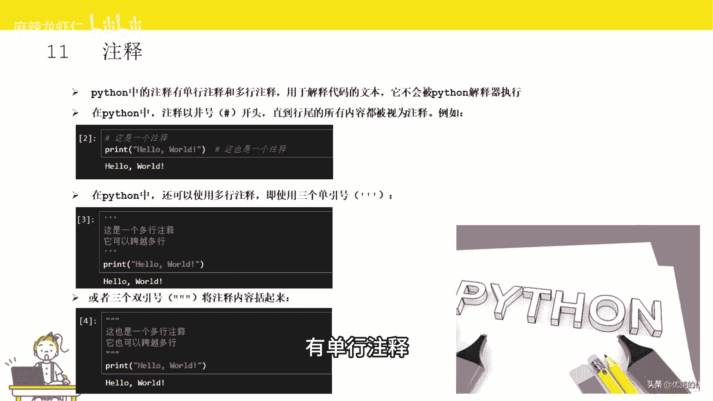
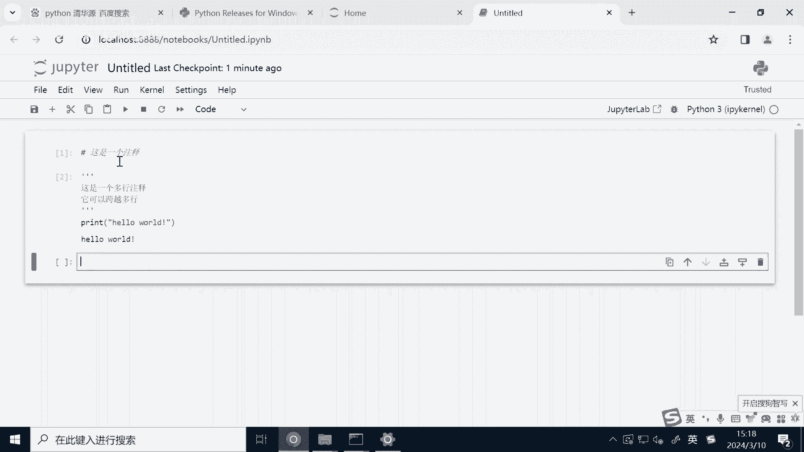
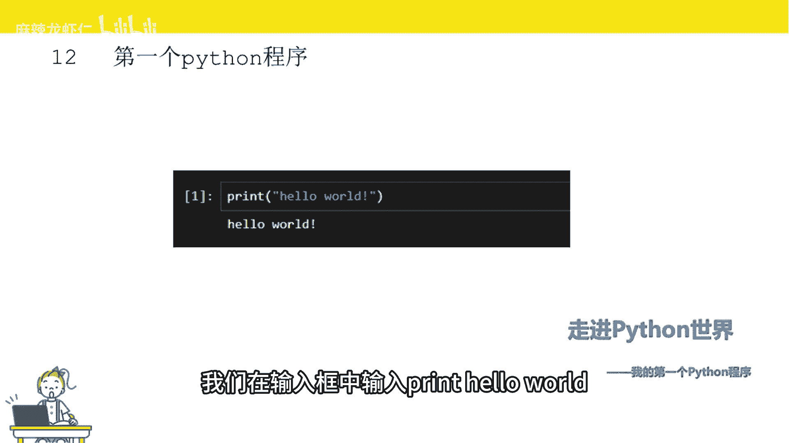
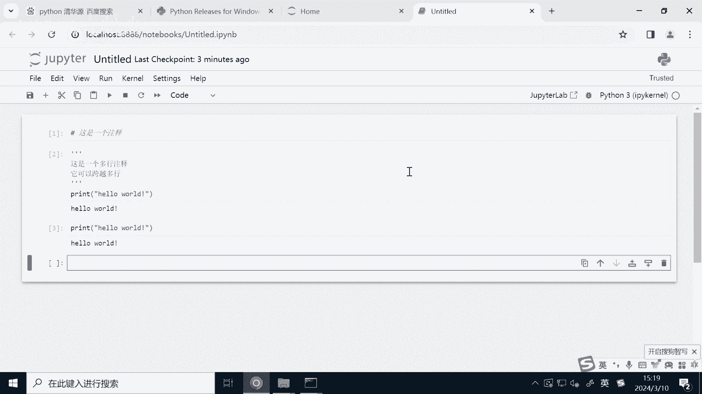

# 2小时速刷python量化交易--基础语法 - P1 - 麻辣龙虾仁 - BV1YF4m1V7Cx

OK准备好环境以后，我们这才正式进入到Python的学习当中。

首先给大家介绍一下Python代码的运行方式，这里我总结了一下，有三种运行方式，第一种是交互式的，就是我们每输入一行代码，解释器会输出运行的结果，这里呢我们试一下，这里我有个建议。

就是我们在学习Python编程的时候，建议大家还是要多试一试，自己多敲代码。

这样才能找到手感，我们打开mini窗口，点击运行，输入CMD。

然后输入Python，叫我我们就进入到了交互式编程环境中，我们就可以在这里进行编程，这种方式呢比较适合Python的学习，第二种方式是JSON notebook，也类似于这种。

我们上一个视频其实已经给大家介绍过。

如何打开notebook，这里呢我们已经打开来了，那还有一种方式就是文件式的，我们把一组Python代码写到一个后缀点，PY的文件中，然后一次性执行这个文件里的所有的代码，其实这种才是编程的主流。

因为往往大型的项目，其实都需要实现非常多的功能，有非常多的代码都是通过Python文件形式来保存的，这里呢我准备了一个简单的Python文件，然后只需要在命令行窗口中输入Python空格。

后面加上这个Python文件的名字。

这样其实就可以运行Python里面的代码了。

OK介绍完Python的运行方式，接下来给大家介绍一下缩进，缩技能是用来指代，这是一个代码块的同一个代码块，执行同样的功能，那缩进长什么样子呢，z j PPT print前面的空格就是缩进。

一般是四个空格，或者说键盘里的tab键，那什么情况要用脑缩记呢，比如说if条件语句，for循环语句，while循环语句函数等等，比如这里我的示例代码，如果22大于11，则执行下面这段代码块。

这个时候就要用到了缩进，用来代表条件为真的情况下，需要做相应的操作，因为缩进导致程序报错是非常多，新手经常会遇到的问题，比如if条件忘记缩进，导致程序代码报错，大家一定要注意。

接下来是注释，注释是什么意思呢，其实就是备注的一次，我们有时候写完代码，如果过段时间再看的话，或者说我的代码要给别人看，这个时候你写个备注，提示一下这段代码的作用，它是实现什么样的功能。

这样的话就能避免以后在写这段代码的时候，忘记这段代码实现的什么功能，而这个备注是不能运行的，它只是提示到了一个提示的作用，Python被注有几种方式，由单行注释。

用井号开头，井号后面的都是注释，接下来我们可以试试看，我们新建一个JPL的book，然后输入井号，后面输入我们需要注释内容，然后按shift加回车，我们运行一下这一行，我们可以看到。

其实这里是没有运行这行代码的，那还有一种呢是三个单引号，或者说三个双引号，三个引号跟井号最大的不同点，在于可以实现多行的注释，这里我们一样来试试看，这里呢我们在三个单引号里面输入多行。

然后还是按照shift加回撤，我们可以看到它前面的这些注释，其实是没有运行的，它只是运行了这个打印花了沃的这一行代码。

当然双引号其实实现的效果是一样的，小安这些我们就可以写第一段Python代码，你会发现很神奇的现象，几乎任何一个编程语言，我们学习的第一行代码都是打印，什么叫打印，就是输出电脑屏幕的意思。

比如这里我们就是把hello world输入到电脑屏幕，大家跟着我一起操作，其实刚刚我们已经输入了hello world的，但是是为了展示另外一个知识点，这里呢我们就重新来写一下这段代码。

我们在输入框中输入print hello world。

大家注意一下，在输入的时候都是要切换成英文状态下输入，比如说这里的括号，双引号都是英文状态下的，输入完成以后呢，我们就可以按shift加回车键来运行这行Python代码，我们可以看到这行代码的输入结果。

屏幕上输出了hello world的。

