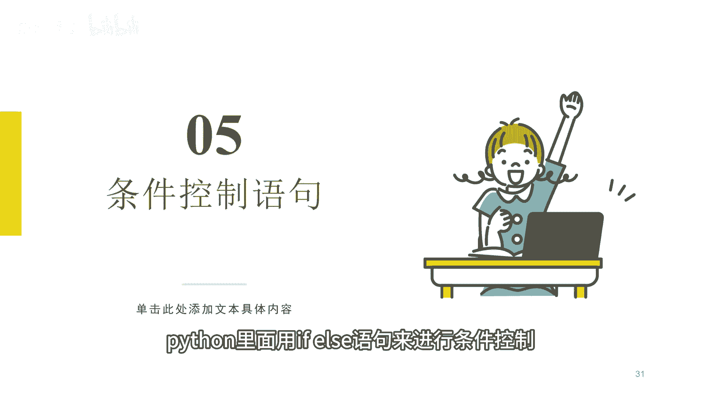
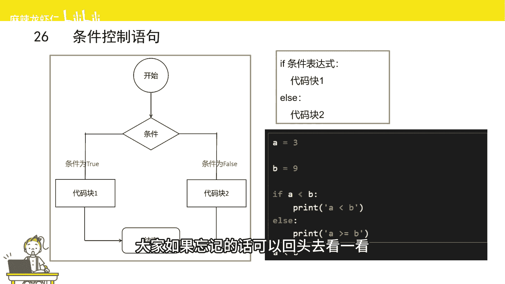
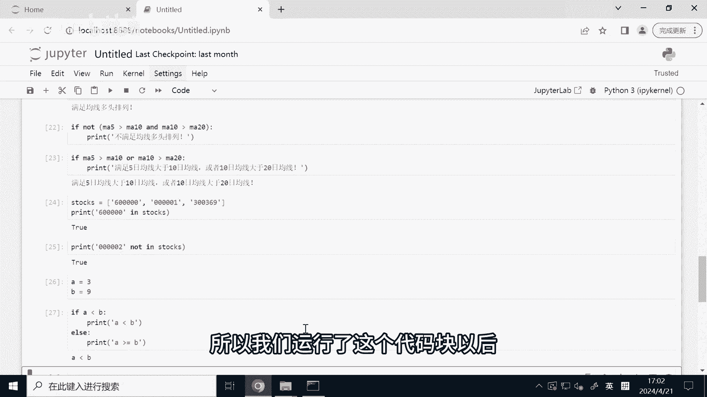
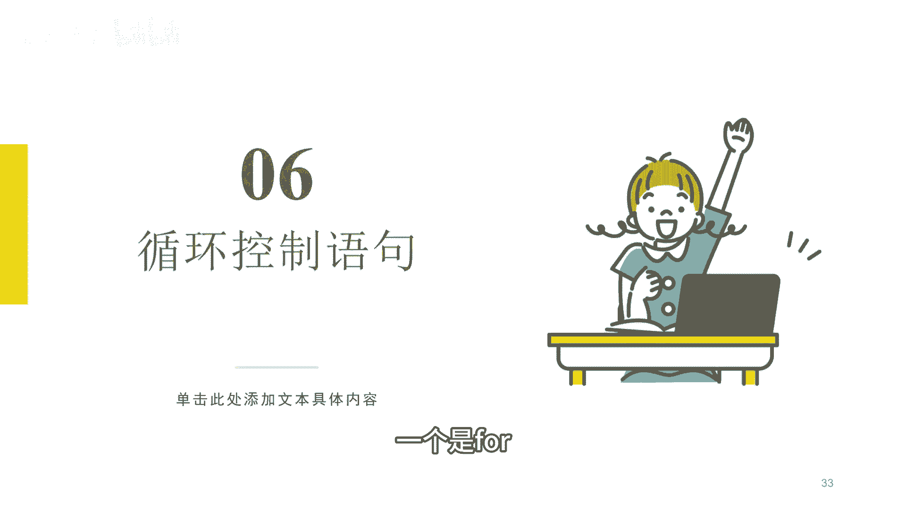
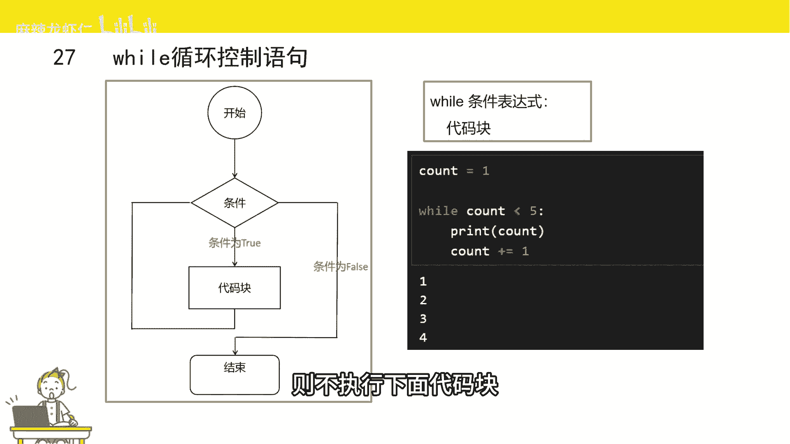
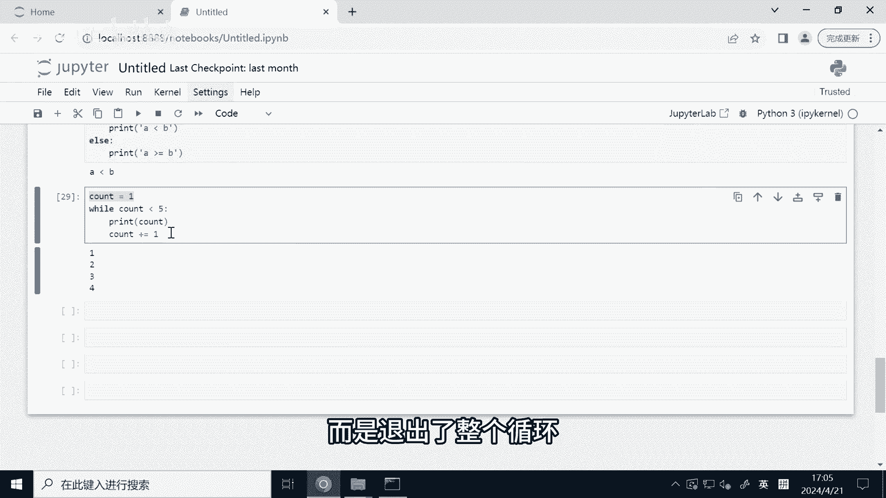
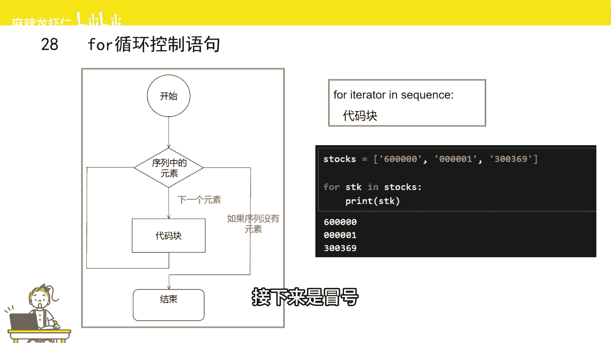
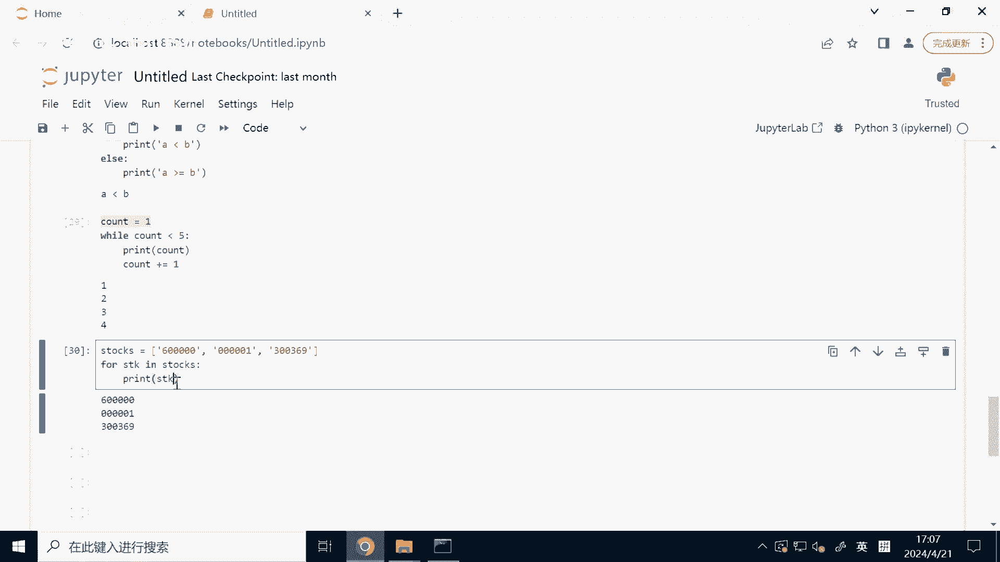

# 2小时速刷python量化交易--条件控制和循环控制 - P1 - 麻辣龙虾仁 - BV1tw4m127iM

接下来给大家介绍条件控制语句，那什么是条件控制，就是满足某个条件，我们需要控制，满足条件后需要做什么动作，这叫条件控制，比如当满足均线多头排列时，我们需要买入股票。

Python里面用if else语句来进行强制控制。

我来看左边将流行图，首先开始进入条件控制流程，判断某个条件是否正确，如果结果为true，则执行代码块一，然后结束整个流程，如果条件为false，则执行另外一个代码块or，然后结束流程。

if else语句的语法是if后面加一个条件表达式，然后冒号，接下来是条件为true时要执行的代码块，代码块下面是else，然后冒号，接下来是条件为false时要执行的代码块。

当然也else也是可以不要的，大家注意一下，if和else后面的代码块都是要缩进的，在之前的视频里，我有跟大家讲过，大家如果忘记的话。

可以回头去看一看，这里我给大家举个最简单的例子，我们定义两个变量A和B，A复制为三，B复制为九，然后判断A和B的大小，我们这里用到了if关键字，if后面是一个条件表达式，A小于B，然后是冒号。

接下来是当条件为正确时，需要执行的代码块，这里呢我们执行一段打印语句，接下来是else关键字，然后也是冒号判断为false时需要执行的语句，这里呢我们也是打印一段话，这里呢我们运行一下。

由于A的确是小于B，所以我们需运行了这个代码块以后。

打印出来了相应的结果，讲完条件控制语句，接下来给大家介绍一下循环控制语句，那什么是循环控制，其实就是重复做某件事情，比如我们要判断某个股票池里，哪些股票是满足均线多头排列的。

那我们需要对股票池里的所有股票，都做一遍判断，这给鸡叫做循环，Python有两个循环控制语句，一个是well，一个是for while。

循环控制语句的结构如左边所示，首先进入while循环，然后判断条件是否为true，如果是，则执行代码块执行完成以后，继续判断条件是否为true，如果是，则继续执行，一直重复执行，直到条件为false。

退出整个循环，那我们来看一下while循环长什么样，VR后面有个条件表达式表达式，我们有一个冒号，接下来换行就进入到了循环里的代码块，当条件为true时，则执行下面的代码块。

如果条件表达式为false时，则不执行下面代码块。

并且跳出循环，我们来试一下这个例子，首先我们定义了一个变量，count赋值为一，然后进入到while循环，判断count是否是小于五，如果小于五的话，则打印count，然后count自增一。

这个加等号呢是一个自增赋值运算符，之前我们也有讲过，然后我们来运行一下这里的代码，我们可以发现这里报错了，因为我们刚刚用的是等于号，而不是赋值号，大家以后写代码的时候一定要小心。

我们可以看到打印出来的一和四，我们再来捋一下整个循环的过程，首先count为一，它是小于五的，我们打印count1，接下来count变成了二，二，也是小于五的，我们接下来打印二哦，自增益变成三。

三也小于五，继续打印三，count就变成四四小于五，继续小于打印，然后呢count变现的五，由于五并不是小于五，所以他后面是没有执行的代码块，而是退出了整个循环。

for循环主要是用来遍历某个序列的便利，就是挨个访问的意思，for循环的结构如左边所示，首先取出序列里的某个元素，然后呢执行下面的代码块，然后呢接下来取下一个元素，继续执行代码块，直到没有元素为止。

结束整个循环流程，我们来看一下for循环长什么样，首先for循环关键字后面是一个变量，然后呢是in管联字，in后面是个序号，接下来是冒号。

然后换行就进入到了循环里的代码块，这里呢我们举个例子，首先我们定一个stocks，将一个变量它是一个列表，然后里面的元素都是股票代码，接下来我们用for来轮询这样一个列表。

然后用print来打印里面的元素，我来运行一下，我们可以看到，我们已经把这个列表里面的所有元素，都打印出来的，它的运行逻辑是这样的，首先STK它是D0的元素，也就是600000，然后打印打印完成以后。

他又被吃了第一个元素000001接着打印，然后呢他又变成第二个元素，然后接着打印，他会重复这样一个动作，直到没有元素为止，因此它打印了这个列表里面的所有元素，for循环。

其实我们在写量化教育策略过程中经常能用到。

