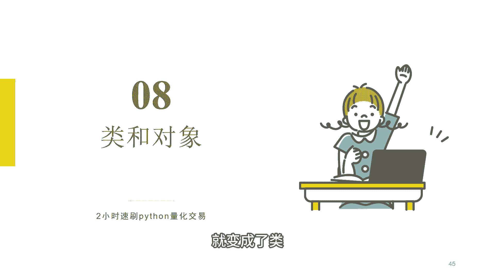
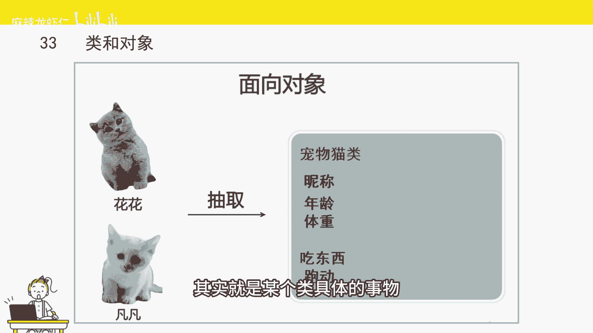
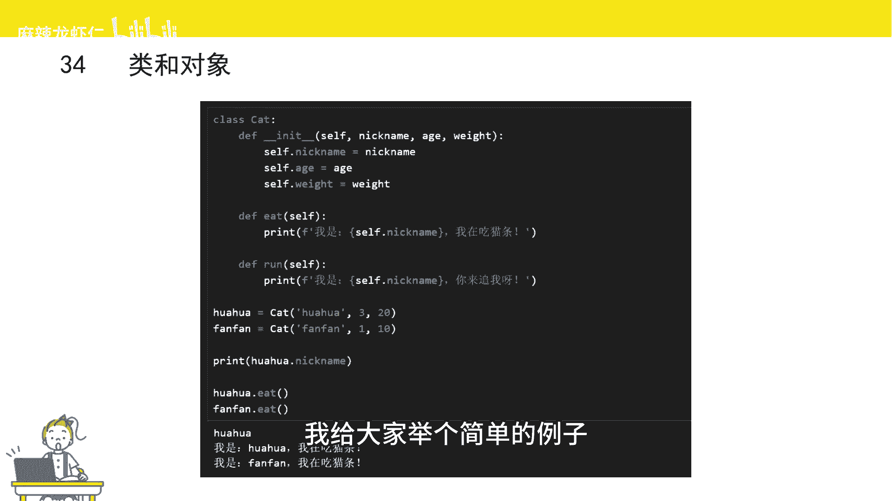
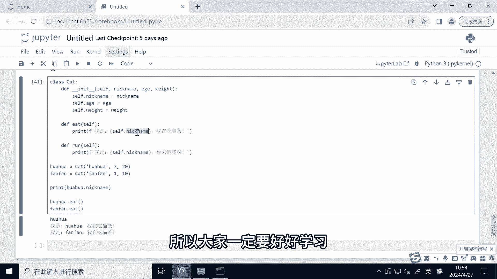

# 2小时速刷python量化交易--类和对象 - P1 - 麻辣龙虾仁 - BV1ZH4y1A7F2

接下来是类和对象，这跟我们现实中的类的概念很像，人类猫类它都是类，那我们把同一个类别的事物，把它们相同的特征抽取出来以后，就变成了类。

比如两只猫猫花花和凡凡，那他们有什么共同的特征呢，比如他们都有昵称，都有年龄和体重，这是他们静态的特征，也叫做属性，他们还有动态的行为，比如说它们都会吃猫粮，都会跑动，这个难叫方法。

把相同属性和行为的事物抽取出来，就变成了一个类，那什么是对象呢，花花就是一个对象，它除了拥有猫这个类所有共同的特征以外，还有个性化的特征，比如说泡花它是一只银渐层，它的腿特别短。

那么对象呢其实就是某个类具体的事物。

那介绍完类和对象的概念以后，我们来介绍一下在Python当中类长什么样，在Python当中，类是通过class这个关键词来标识的，class后面是类的名字，然后是冒号，冒号后面就是类的属性和方法。

那这里呢我给大家举个简单的例子。

这里呢我已经把代码已经给写好了，比如说我们定义一个叫做cat猫猫类冒号，后面的就是具体的类的属性和方法，比如它的第一个函数是INIT函数，这个函数呢它是类内置的一个函数，所有的类都会有一个INIT函数。

它被称为类的构造函数，当创建这个类的对象的时候呢，就会默认的去调用这个函数，这函数将参数不知给对象的属性，或者完成一些在创建对象时需要执行的，其他的操作，我们举的这个例子呢，它的构造函数有几个参数。

首先第一个参数是self参数，他self参数它代表了这个类的对象，cf参数在类的函数里面是必须有的，每个类的函数它都会有这个参数，虽然说我们在调用的时候不用传入，那接下来是三个参数。

分别代表是nickname，昵称age，年龄weight，体重，接下来冒号，然后进入到函数题，将三个参数分别赋值给对象的属性，因为是对象他自己的属性，所以用用到self点代表当前这个对象。

接下来我们定义两个我们自定义的函数，分别是it和run，刚刚也讲到过，如果是类的函数都要用self作为第一个参数，那it这个函数除了self参数以外呢，它是没有额外的参数的，然后函数体。

这打印一个字符串，用到了格式化输出，如果我们要在函数里面访问对象属性的话，那我们就可以用self点属性名，比如我们这里是获取那个name，那就是self点那个name，接下来是run函数。

也是实现的一个类似的功能，只是说打印的内容可能不太一样了，OK写完了以后呢，我们可以通过这个类来创建一个实例化的对象，比如我们创建了一个猫猫类，那我们要创建一个具体的猫，比如说花花或者是反反。

那可以通过类名来实例化，并且认为后面需要带参数，这些参数呢其实就是INIT这个函数的参数，当然self这个参数刚也讲到过，是不用去传的，比如说我们这里是创建了两个累的对象，分别是花花和凡凡。

那我们要创建对象的时候呢，我们只需要在cat后面传入nickname，昵称，age和wait这三个参数就可以了，其实我们这么做的话，其实就是调用了INIT这个函数，系统默认帮我们调用了类的INIT函数。

这样的话就可以去创建一个类的对象，而我们接下来的话把这个类的对象的一个结果，赋值给一个变量，那这样的话花花和凡凡就成了猫类的两个对象，如果我们要访问对象的属性或者是方法，只需要通过点号来进行访问。

比如我们要访问花花的ECHNICKNAME，那我们就可以哗哗点nick name，然后呢就会过去到哗哗的昵称，如果我们要去运行类里面的函数，那我们只需要用到对象的名字，然后呢点号后面是函数的名字。

然后呢你需要传入参数就可以调用，因为我们it函数是没有参数的，所以我们这里没有腾出任何参数，这里我们来运行一下，我们可以发现通过这句话，我们已经获取到了花花她的昵称，花花这个对象的昵称。

我们调用花花的it函数，我们是运行了里面这个函数的内容，然后打印我是花花，我在吃猫条，那我们调用反反的E的函数呢，我们也是打印了一句话，我是凡凡，我在吃猫条，这里我们发现我们调用同样的E函数。

为什么输出的结果是不一样的呢，原因是因为我们在这两个类对象的it函数当中，我们在打印的字符串里面插入的是这个对象，他自己的属性，所以不同对象调用出来的结果是不一样的，因为这两个对象。

它的nickname这个昵称其实是不一样的，类在我们写量化交易策略过程中，也是经常能用到的。

