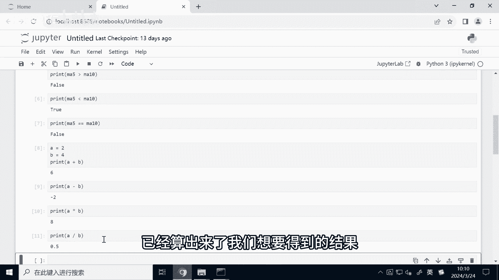
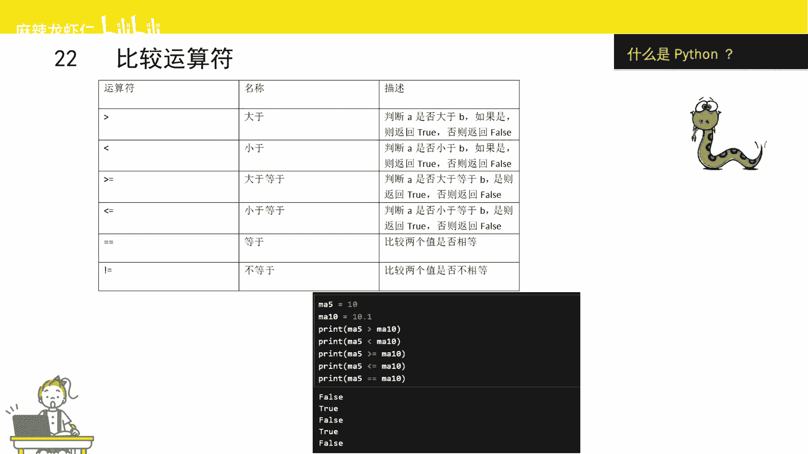
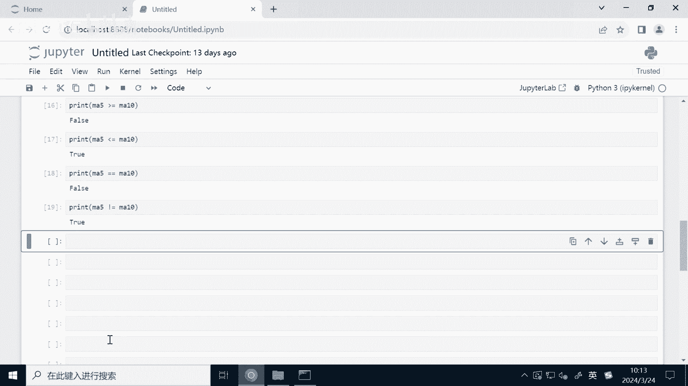
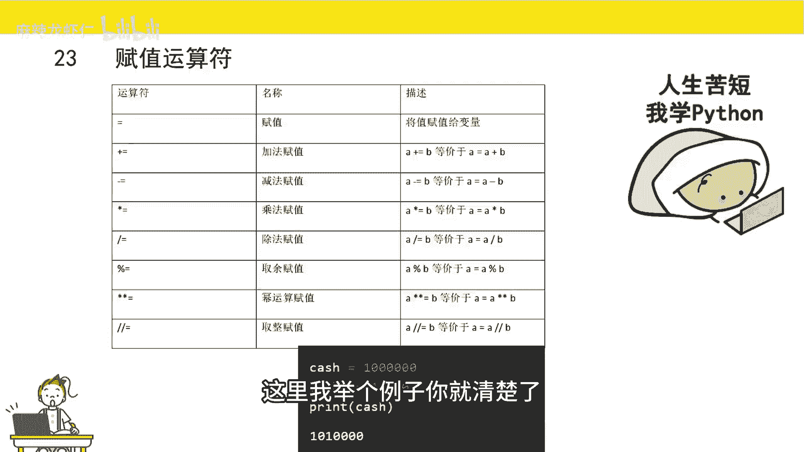
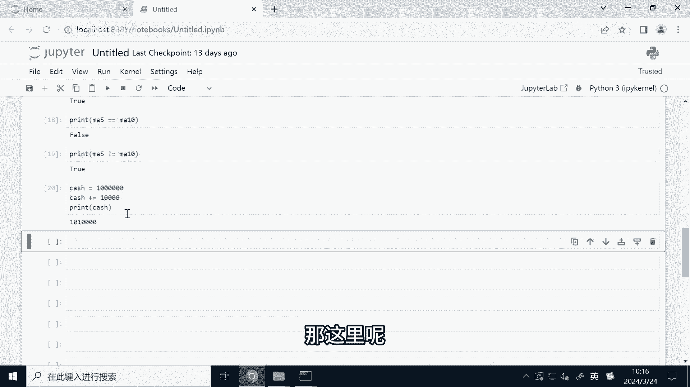
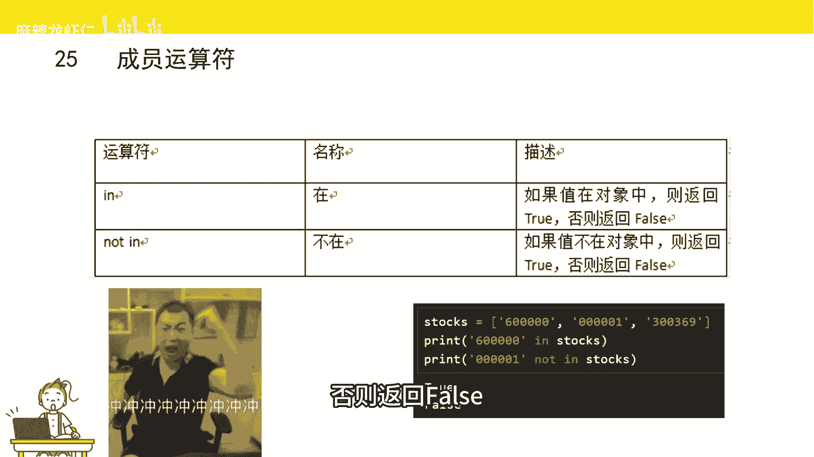
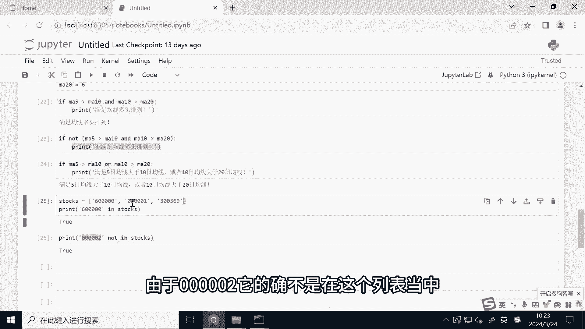

# 2小时速刷python量化交易--运算符 - P1 - 麻辣龙虾仁 - BV1Et421G7Wq

接下来给大家介绍算术运算符，什么是运算符，我们有了数据以后，需要对数据进行操作，对数据进行操作的符号就是运算符，比如我们有两个整数，那我们可以对整数做加法，做减法，这就叫运算符。

运算符分为好几种，我们来一一介绍，首先是我们最熟悉的算术运算符，就是加减乘除，加法和减法跟我们数据里学的差不多，我们可以看到都是一个加号和一个减号，但是乘法就变成了星号，除法就变成了一个斜杠。

取余是什么呢，又是一个整数，辅以另外一个整数以后得到的余数，两个斜杠就是整除两个星号。

就是幂运算就是多少次方的意思，接下来我们来实际来看一看，首先我们定义两个整数的变量，A赋值为二，B赋值为四，那这里的等号呢其实就是赋值的意思，一会我们在赋值运算符里面，会给大家做详细的介绍。

大家跟着我操作就可以了，接下来我们计算一下，A和B这两个数的加法运算，我们可以看到已经成功的算出来了，A加B的一个结果，接下来我给大家演示一下减法，OK也得到了A减B等于二，我们可以看到A减B等于二。

A乘以B等于八，A除以B等于0。5，已经算出来了，我们想要得到的结果。

两个数除了有加减乘除这种基本的操作以外，还可以对两个数进行比大小，比如说大于小于等于，比较以后会得到一个布尔型的知to或者false，代表正确或者说错误，大于号，小于号跟我们现实中的大于号。

小于号其实是一样的，但是Python里面的大于等于它是大于号，加上等号小于等于是小于号，加等号等于在Python中是用两个等号来表示，大家这里一定要注释，因为后续肯轮，因为这个很容易出错。

那不等于就是感叹号。

再加等号，我们这里还是继续来操作一下，我们定义两个变量，5日均线，Ma5，10日均线没十，我们将ma5复制为十，ma10复制为10。1，这里我可以通过比较运算符，对这两个变量进行一个比较。

比如说我们判断一下ma5是否大于ma10，我们可以发现返回的结果是false，代表并不大于，因为NA5是十，NMA10是10。1，那我们可以判断一下ma5是否小于ma10，我们可以看到的确是小叶。

所以它打印出来是true，大于等于和小于等于也是一样的，我们可以看到，由于M5是小于每十的，所以大于等于号，返回的结果是false，那小于等于这个也是正确的，所以返回结果是true，那两者由于不等于。

所以等号返回的结果是false，那的确两者不等于。

所以最终返回的结果是true i，一个值复制给某一个变量，这就涉及到一个赋值运算符，这个其实我们很早也遇到过，在介绍变量的时候，我们首先定义了一个变量，然后给变量一个值，这就叫赋值。

等号是最常见的复制运算符，除了等号日这个最常见以外，还有其他的一些复制操作，比如说加法赋值，它是加号代加等号，这个是啥意思呢，其实它就是将两个动作合并成一个动作，比如说加法复制A加等于B。

那就是A等于A加B它里面有两个操作，首先是计算A加B得到了一个结果，然后再把这个结果复制给A，这里我举个例子你就清楚了。

我们定义一个变量叫做泰式，我们假设这个变量为，我们股票账号里面的可用资金，我们将它定义为100万，当我们卖出一个股票以后，那我们可用资金就增加了，比如说我们卖了1万市值的股票。

那我们可以用资金就要增加1万，这时候我们就可以用到加法复制运算符，来更新这个TCH变量，我们可以看到我们调用了加法复制运算符，就成功的把这个cash这个变量更新了，它里面做了两步操作。

首先是我们100万+1万=1010000，这是第一步操作，第二步操作是把101万复制给太史，最终我们把太史这个变量打印出来，就是最终的结果，101万买解法复制运算符，乘法和除法的赋值运算符。

也跟加法复制运算符都是同一个道理，那这里呢留个作业。

然后大家自行去试一试，逻辑运算符主要是对布尔型的值进行计算的，运算符有三种，逻辑运算符，分别是and or和not，分别对应与或非与就是并写的意思，当两个条件都要满足的时候才是正确的，或就是或者的意思。

只要你满足一个条件就可以了，非就是不是的意思，如果你的条件是错的，那非才是正确的，对应Python就是两个布尔型变量的运算，两个变形变量都要为true的时候，你这个and运算符的结果它能是true。

只有一个为false都不行，那O的话只要有一个为true，那结果为true，两个都为false，那才是false，note就是非的一次，如果布尔型变量为true，那么note得到的结果是false。

如果是false，那么not得到的结果就是true，逻辑运算符在量化策略过程中也经常能遇到，比如我们要判断某些选股条件是否要同时满足，我们还要进行相应的买入卖出操作，比如说股票要满足均线多头排列。

今年多头排列就是当5日均线大于10日均线，并且10日均线大于20日均线的时候，这时候我们要用到and运算符，改成Python代码，都是ma5大于ma10，并且A10大于N20。

对我们试一下，我们定义了三个变量，分别是ma5，Ma10，Ma20，我们从这三个变量可以看到ma50大元为十，并且ma10是大圆面，20的，它其实是符合一个均线多头排列的一个形态。

那我们要用Python代码去判断，我们要怎么写呢，if它是一个条件判断一句，后续我们会讲，当后面返回的值是true，则我们打印一句话，我们可以看到，由于这两个条件，比如说ma5和ma。

ma5大于ma10以节，ma10大于BMI20，这两个都是满分的，所以and运算符最终计算出来的结果也是true，所以它会打印下面这句话，接下来我给大家演示一下模特运算符，这里我们还是举这个例子。

我们已经训完了，由于在这个里面他最终返回的结果是true，所以你not a true以后，他最终结果是false，因为这个结果是false，所以他后面不会去打印这句话，接下来给大家演示一下奥运算符。

这我们调用了这个O的逻辑运算符，O的话就是如果这两个条件只要有一个是CHU，那么最终得到的结果也是chill，我们可以看到，由于这两个得到的结果都是CHE，所以O的话它最终的结果也是true。

因此他会打赢下面这句话，最后是成员运算符，判断某个元素是否在某个序列当中，简单举个例子，我们要判断某个股票是否是我们定义的，自选的股票列表当中，哪有两个成员运算符，in和not in在或者不在运算符。

它返回的值是一个布尔型的值，如果元素在序列当中，则返回为true，否则返回false。

这里呢我们也来试一下，我们定一个列表，我们要判断一个股票代码，比如说，600000是否在这个股票史上中，我们可以看到，60000其实是在这个股票列表当中，所以他最终打印的结果是去。

接下来我们来试试not in这个成员运算符，我们可以看到，由于0002他的确不是在这个列表当中。

