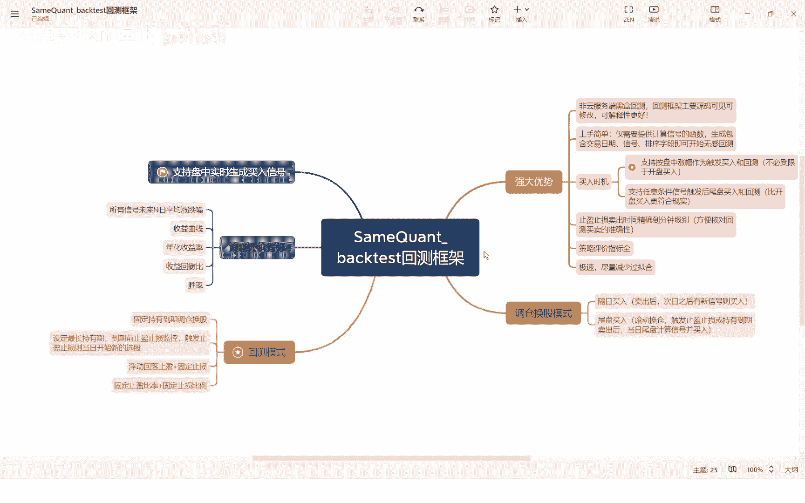
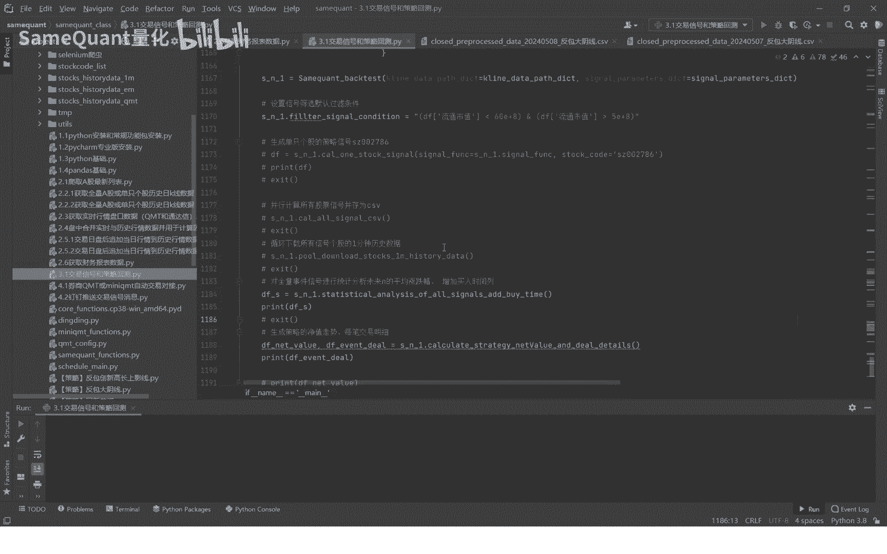
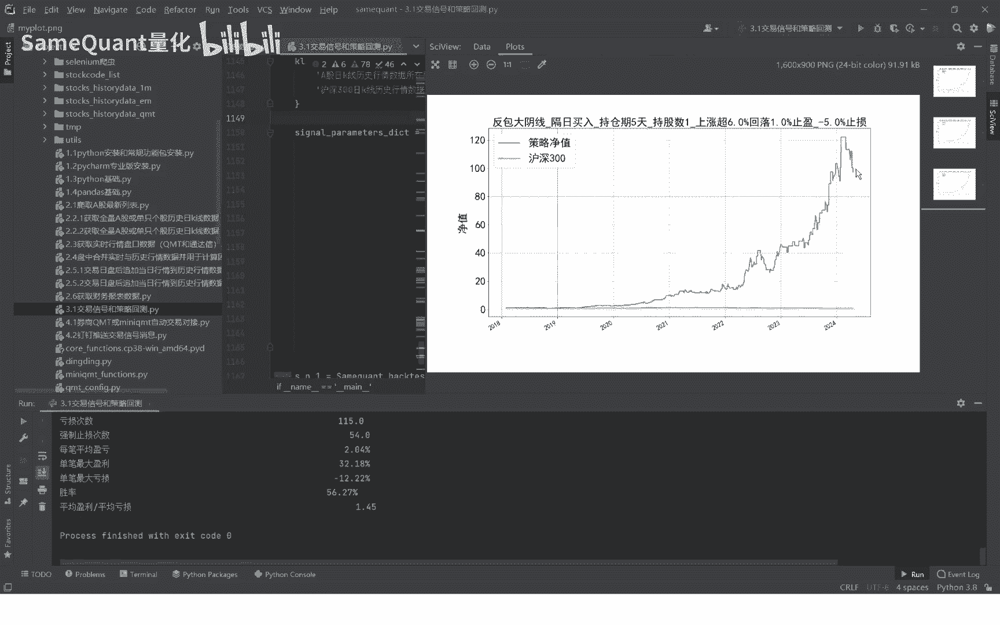
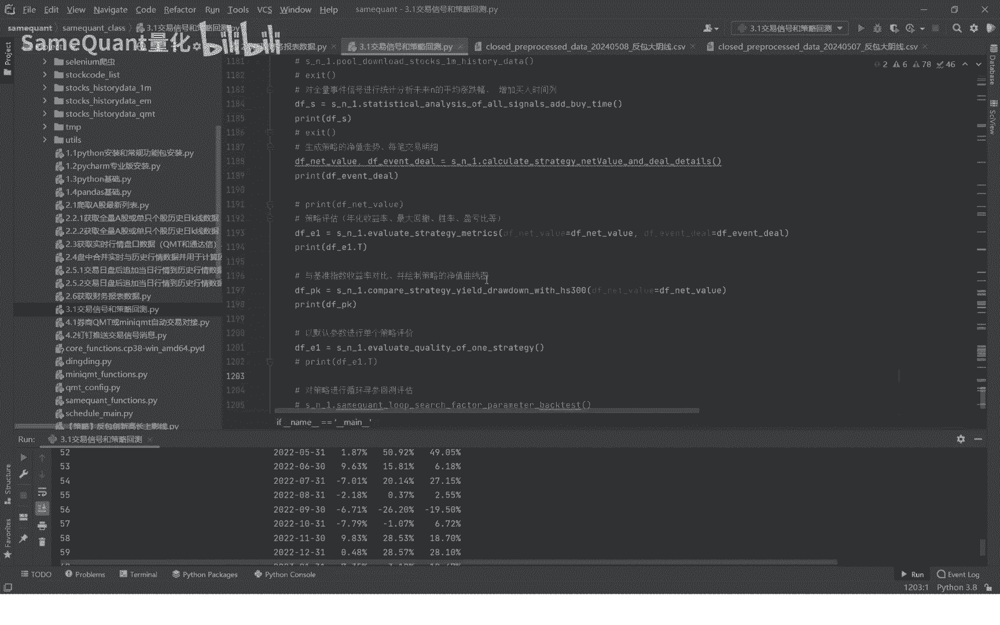
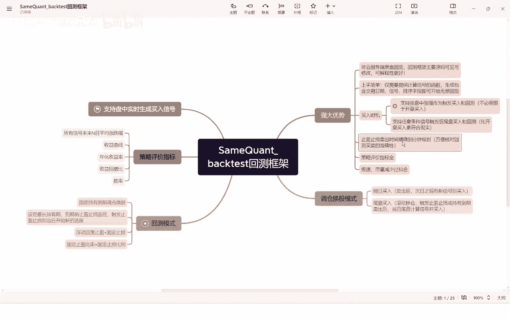
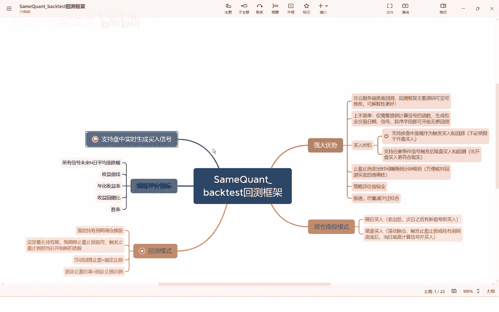
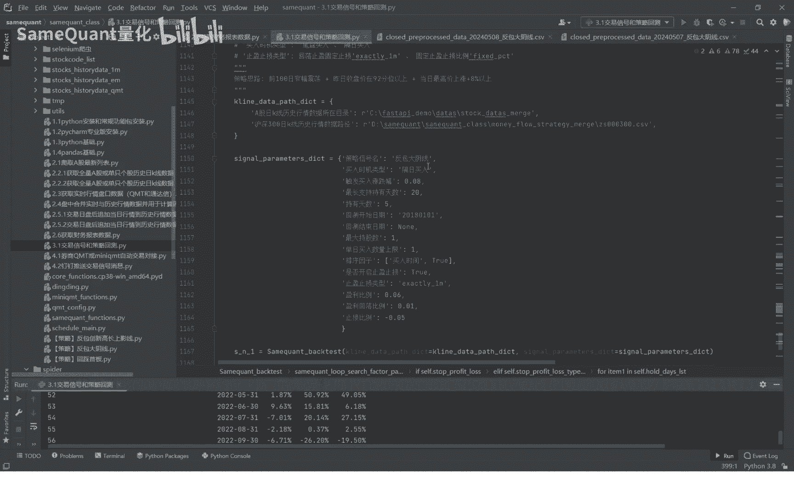

# 3.1 【国内最好框架】SameQuant量化回测框架介绍 - P1 - SameQuant量化 - BV1Tx4y1W7Fs

大家好，这里是simple矿车量化，我是打板课，本期课程呢将进入整个自选课的，最核心的一个环节。

也就是策略的交易信号的一个计算，以及策略的一个回撤啊，这是整个的重中之重啊，我们前面的课程可能代码讲解的没那么细，就是一掠而过的那种状态，这些课程我们就要精讲了，我们要对着这个源码跟大家一对一的精讲了。

因为这是整个策略回测框架是非常重要的，而且这个难度是最高的一个部分，我们呢先演示一个策略。

先运行给大家看一下，这个策略呢叫反包大阴线，策略思路是隔日买入，持仓期是五天，持股数是一满仓操作啊，上涨超6%，回落1%，然后止盈亏损负5%止损，就这样的一个策略，从2018年至今。

是整个市差不多翻了将近100倍。

我们来看一下策略的一些评价指标，首先呢这是策略的所有的信号的一个统计，也就是所有信号的后一天的平均的涨跌幅，上涨概率过两天的，一直到后19天的这样一个统计，这个统计主要是方便一眼看来。

看出这个策略是一个短线策略，还是一个长线策略，一般短线策略来说，它的所有信号的后三天的一个平均涨跌幅，是正的，周长概率呢也是相对来说比较高的好，这个表格就是整个策略的历史的明细的，一个买卖交易记录。

同时呢给大家看一个最最重要的一个信息，咱们的一个回撤引擎的一个交易记录，是精确到什么呢，精确的买入时间的买入日期，买入时间，这个买入时间是精确到分钟数的，也就是说你是哪一分钟买入的。

另外呢卖出卖出日期和卖出时间，这个卖出时间也是精确到分钟数的，你比如说这个他是2018年2月7日的，10：01分出发买入，因为咱们的策略是涨幅达到8%，触发买入的，所以说呢他就是10：01分就触发了。

涨幅达到8%进行买入了，卖出是2月9日9点31，也就是一开盘的前一分钟就触发了卖出，因为我们卖出的止盈的规则是，盈利达到6%，超过6%，然后回落达1%，进行一个卖出或者是一个止损，亏损5%卖出哈。

优势他在啊之前触发了之后，精确到分钟之后，我们就可以详细的核对你整个策略的一笔交易，它是否是否是准确无误的，它的收益率是否是准确无误的，因为只有这样你去核对，你才能避免什么，避免整个回撤的一个过滤盒。

那如果说你回撤过滤盒，那你就是过拟合的比较严重，那么你整个回撤或者结果都是错的，那如果说你用这个错的一个结果，你去实盘交易，那那一定是灾难性的，所以说这个必须要避免，所以说一个回测框架的核心。

一定是尽量避免过拟合，另外一定要精准，尤其是每次跳的收益率要精准哈，好接下来这里的一个表格呢是策略的一个评价，首先是策略回测区间，累计净值，年化收益率最大回撤盈利次数，亏损次数，强制止损次数。

也就是触发5%止损的次数无数次，单笔最大盈利占比，最大亏损胜率，这个呢是月啊，月度的策略的收益率与基准收益率，也就是沪深300指数的一个对比，好了，这就是咱们的一个一个回车框架。

大概的一个内容，接下来呢我们再详细的介绍一下sim count back test，这个回车框架，首先呢这个回测框架是我个人这个代码，一行一行敲出来的，这个是绝对原创的。

而且呢这个回测框架我可以自信的说是碾压，你能在市场上见到的所碾压就是绝大多数吧，99%的一个回车框架，为什么呢，为什么有这种自信呢，第一它有一些强大的优势，第一呢咱们的一个回测框架啊是白河回撤。

也就是说我们是不是黑河的，因为我们是可以看到原版的，因为大多数的回车方向，比如说同花顺的也好，通达信的也好，或者是什么QMT也好，或者什么PC的也好，他们的回撤框架是黑盒的，你看不到回车框架的源码。

你看不到源码，你你怎么知道他哪些环节有没有过拟合呢，他回去的结果有没有有没有问题呢，这个你心里是没有没有数的，你没有办法去评估的啊，因为它是黑盒的，咱们的回测框架的主要源码都是可见的。

甚至你是可以修改的，所以说呢可解释性是更加好的，第二呢这个上手比较简单啊，你熟悉这个回车框架之后，你仅需要提供简单的一些字段，比如说这个计算信号的函数生成，然后包含交易日信号排序字段之后。

这样的一个cs表格之后，你就可以完成接下来所有的一个无感回撤了，也就是说你熟悉了这个回车框架之后，你即使有一些回车框架里面的一些代码，你你看不懂，也不影响你就说快速的上手回撤，因为买入时机支持两种。

一种是按盘中根据涨跌不触发买入，比如说涨幅达到8%，我触发买入或是跌了5%进行一个买入，这样的一个策略的话，基本上怎么可以涵盖市场，90%的一些策略了，因为我们实盘过程中。

很多时候你要么是根据涨跌幅触发买入，要么是根据某一个什么找一个价位支撑位啊，或者是压力位进行一个买卖等等，当然也有一些你主观交易，你随机的交易，那这个东西其实就没办法形成一个策略啊。

这个就不在我们一个一个回撤的一个，能力范围之内了啊，咱们回车引擎是支持止盈止损，止盈止损呢是卖出的时间是精确到分钟级别，精确精确，分钟级别是方便我们去核对整个回撤的啊。

他的买卖交易的每笔交易它的一个准确性。

这个是非常核心一个关键的一个回车框架哈，策略的指标也是比较全的，速度是非常快的，像咱们的长包大阴线啊，比如说我们在这里进行一个循环循，循环循环循在运行的话，差不多一个车位一秒钟也就40分钟吧。

差不多也就完成了，速度是非常快的哈，一个策略不到一秒嘛，4000多个策略理论上来讲是需要4000多秒，但是实际过程中也就40分钟，也就是一个策略，这个所有参数参数循环下来将近4000多个啊。

我们目前的这个循环下，4000多个你就可以结束了，当然你还可以多一些策略，设置一些策略参数，你比如说那样的话，他的回撤的量会倍增。

时间会更久哈，但是我们依然这个速度是极快的，调仓换股模式，调仓换股模式支持两种，一种是隔日买入，隔日买入，也就是说我今天我卖出之后空仓之后，我今天就不再买了，下一个交易日买，因为为什么要下一个交易日买。

因为我们是根据涨跌幅来迟缓买入的，那这个时候他其实是有一个买卖，它是有一个先后顺序的，如果你当天爱出啊，止损周卖出再买入的话，因为你一定是先卖再后买嘛，如果没有仓位的情况下。

那如果你是当日进行卖出之后再再买入，这个逻辑上会有一些问题的啊，因为你触发，比如说涨8%，涨幅的时间可能就是9。31分，但是09：31分的时候，你可能你的仓位并没有空出来，如果你的回测框架里面。

你不设置隔热买入，当天买入，那你肯定逻辑上就有问题了，是有冲突的啊，也就是说，隔日买入是一定是与这个盘中涨跌幅触发买入，是相对应的啊，另外这个尾盘买入，这个尾盘买入的意思就特别简单。

就说我比如说我今天尾盘买入，我明天尾盘卖掉，卖掉之后我仓位空出来，我我再进行一个选股，如果有选出有股票的话，那么我就立即买入，尾盘买入持有啊，尾盘卖出来，每天的尾盘调仓换股这两种模式，回测模式呢。

首先支持我们最常见的是固定持有到期的啊，你比如说持有五天到期啊，期间他无论涨多少，跌多少都不卖啊，持有到期我就尾盘卖掉，以收盘价卖掉啊，这是非常常见的模式，我们是支持的，另外支持止盈止损。

也就是你设定一个最长持有期，到期前如果触发了止盈止损吧，那就先立即卖掉啊，卖掉之后，然后触发止盈止损的之后，当日的尾盘或者是隔热，再进行新的一些信号触发买入，然后止盈止损的话又分两种模式。

一种是浮动回落止盈加固定指数，也就是说不动回落主义的意思，就是说比如说我涨了6%以上，我盈利达到6%以上，从最高点回落1%，我就卖掉啊，这就是回落止盈啊，这个当然这个盈利达到多少，回落多少。

这个是你自己设置的固定止损，也就是你亏损达到多少就立即卖掉，除了浮动的回落，还自支持固定的止损比例，也就是说，比如说我设置百分比率达到6%卖出，那么它的涨幅最高价达到6%，盈利达到6%之后。

那就立即进行一个卖出，不管接下来的涨跌，止损也是一样，只要触发了这个止损比例就立即卖出啊，策略的评价指标，咱们的这个回车引擎，策略评价指标也是相比较丰富的，比如说所有信号未来N日的一个平均涨跌幅。

收益曲线年化收益，所以回收比胜氯氧等，另外我们的回车引擎还是支持盘中实时的，甚至买入信号，甚至买入信号之后，我们就可以方便的跟mt进行一个。

实盘交易的一个对接好了，关于我们的一个回测框架就介绍到这里，接下来我们就会针对反包大阴线这个策略，进行一些详细的一个讲解，希望大家能够熟悉咱们的一个回车框架，因为咱们这个课程的核心其实就是在回测框架。

因为你只有掌握了这个回测框架之后啊，你才能今后才能快速的进行一个回撤寻参，才能验证你的策略能不能赚钱，能不能应用于实盘去评估，这个是非常核心的一环，好了这期呢我们就先到这里。

