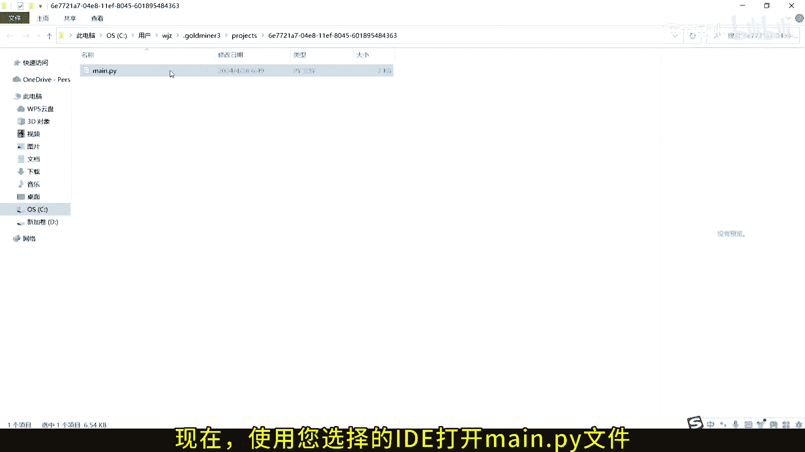
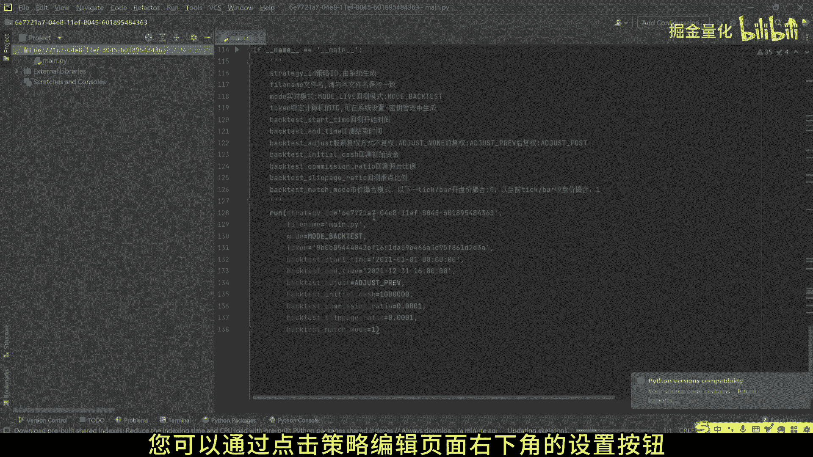
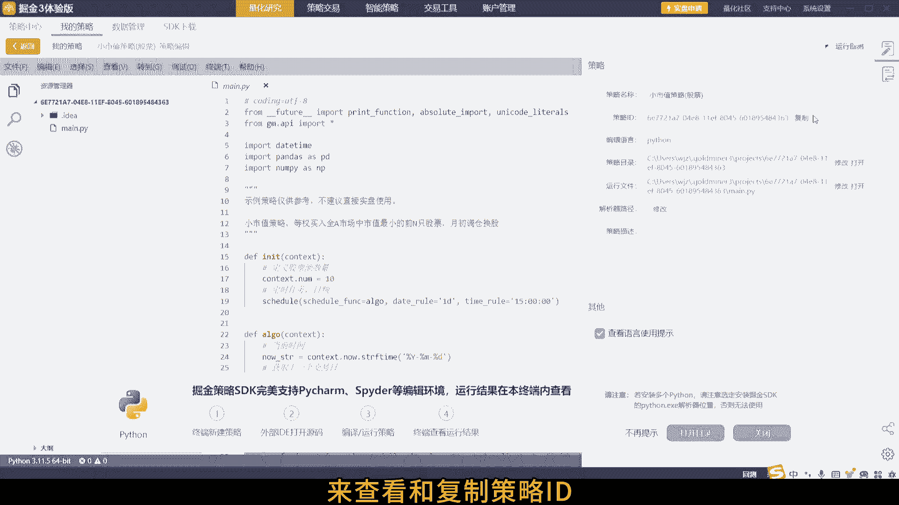
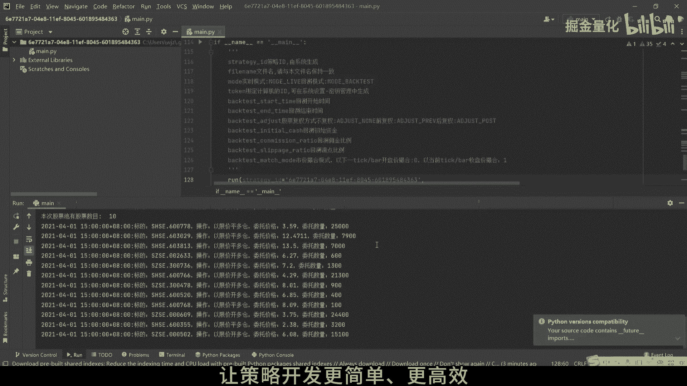

# 3.2 在第三方IDE下编辑掘金量化策略 - P1 - 掘金量化 - BV1Uf421X7e1

欢迎来到掘金量化策略编辑教程，今天我们将展示如何在第三方IDE中，编辑您的量化策略，首先我们需要创建一个策略，以示例策略为例，我们需要从右下角设置按钮，打开包含您策略的目录。

接下来在策略目录中找到策略文件main p why，现在使用你选择的IDE打开main派文件。

为了确保策略能够正常运行，您需要在IDE中配置一个已安装有gm的Python解析器，策略id是终端用来识别策略身份的关键，您可以通过点击策略编辑页面。

右下角的设置按钮来查看和复制策略id。

token id用于服务端识别您的用户身份，您可以在系统设置中获取或重新生成token id，现在您可以开始编辑您的策略，确保您的策略id与终端中的设置一致，以上就是在第三方IDE中。

编辑掘金量化策略的全部步骤，现在您可以保存并开始测试您的策略，感谢您观看本教程，如果您在使用过程中有任何疑问，欢迎随时联系我们的技术支持团队，掘金量化。

