# 3.2 策略回测之计算单只个股策略信号 - P1 - SameQuant量化 - BV1bw4m1Q7ur

各位学员你们好，我是打板哥，我们这期呢正式进入策略回测的一个，源码的精讲环节，为了便于大家更加清晰的了解，整个回车的一个流程，我们先来介绍一下我们新框架back test。

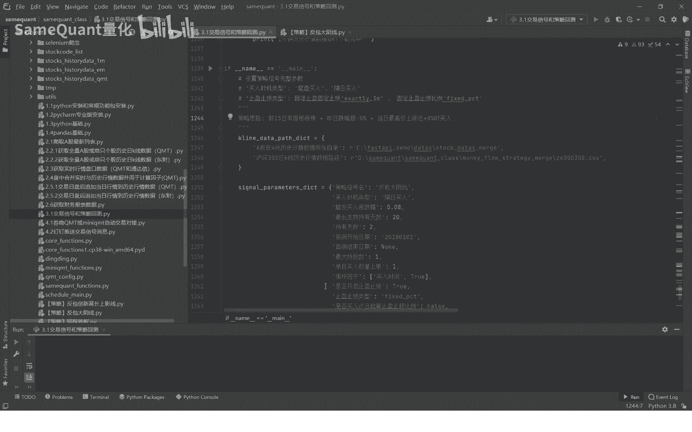

一个回撤框架的一个完整的一个回撤步骤，回车的时候呢，首先第一步，比如说我们脑子里面有一个策略，首先第一步是你写出你的一个策略的，大概的一个逻辑，并且要找到这个符合你这个策略逻辑的，一个个股。

去计算这只个股它历史的策略信号，也就是先针对单一只个股，先把这个逻辑计算信号的一个逻辑写出来，这个方法的函数写出来，然后去计算验证一下是否是OK的，完全符合的时长是否对得上，而下一步。

第二步就是要并行计算，我所有个股的一个历史的策略信号啊，你的策略回测区间的一个信号，所有的信号形成一个文件夹，那形成这样一个文件夹，这是为了便于后面的一个一个计算，历史交易明细。

另外呢也是为了方便我们去核对，你的策略信号的，是否是所有的都是准确的啊，也是方便核对好，接下来就进入一个最核心的环节，我们要根据你策略的一个，你设置的一个回车参数，你比如说你的持有期每日买多少只股票啊。

最大持股数，每支票里的仓位等等，你这样的设置的一些策略回撤参数，我们要计算出一个什么，你的策略的历史的交易明细，比如说历史上都有某一天它有五个信号，你最后我们策略要求是每天最多买两只股票。

那你到底是买了两只股票呢，你这里面有一个逻辑，在这里面就涉及到一个排序因子了，就是你要选出符合条件的两只，从五只里面选出两只股票，这个就涉及到排序因子了哈，你要计算出三只股票它的一个买入的时间。

卖出的时间，卖出的日期，这个也是为了我们方便去核对你这个策略，回撤这个过程中是否是准确无误的，这个是非常关键的，我们在市场上，你见到的很多的回测框架或者回车引擎，它要么是黑盒的，你看不到源码。

你也看不到逻辑，一要么他就是逐步进行回撤的，足跟K线回放进行回撤的，第一它是黑盒的逻辑，另外它速度是非常慢的，所以我们这回测框架速度是很快的，而且的话他主板的回撤它通常来说它没有什么。

尤其是日K级别主bug，他没有什么没有具体的买入卖出时间，如果是分钟级别的又特别慢，所以说啊，你在市场上能见到的一个回撤框架的话，说实话对我们普通的个人投资者，是非常不友好的。

你包括QMDPC的这些回撤框架，我都使用过啊，说实话非常的难用啊，好这是第三步，第四步，我们要根据我们的策略的一个回撤的，历史的交易记录，以及单日日的一个盈亏，那么就形成什么呢，形成我们策略的历史的。

每日的净值的一个走势图啊，净值的一个历史，每日的净值用于去计算我们的策略评价指标，计算策略评价指标的时候，我们还要拿来与什么，拿来与基准指数，也就是沪深300指数，历史的每日的收益率做一个对比好。

这是策略的评价指标，到了第五步是绘制我们的策略的净值曲线，这个也是跟沪深300做对比哈，那么第六步也是非常核心的一个环节了，因为我们在前面策略回撤的过程中，是啊随便给了一个参数。

就说我们不知道最优参数是什么，我们只是凭印象给了一个参数，比如说持有期五天，每天买入一直零冲高10%，回到1%，止损是负10%，最开始我们只能随便给一个参数，去回撤这个策略，但是回撤完之后。

这个参数我们最开始设定的参数，毫无疑问它可能不是最优的一个参数，所以说我们就涉及到一个循环回参，也就是我们把我们设计的一些策略，的一个参数啊，每一个核心参数我们就给它多个值，多个参数，我们就循环。

这样就可能会形成新的成千上万个一个新策略，只不过策略参数不一样，这个时候我们就要去循环去跑，去找到最优的一个参数，那么形成一个一个寻常的结果。

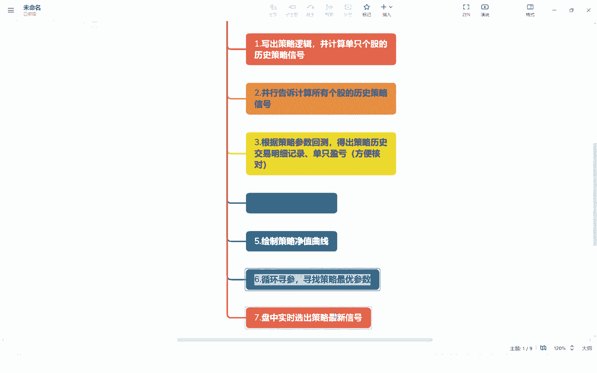

我们这里呢为了直观的让大家看到，我们在直接打开寻常的结果给大家看一下。

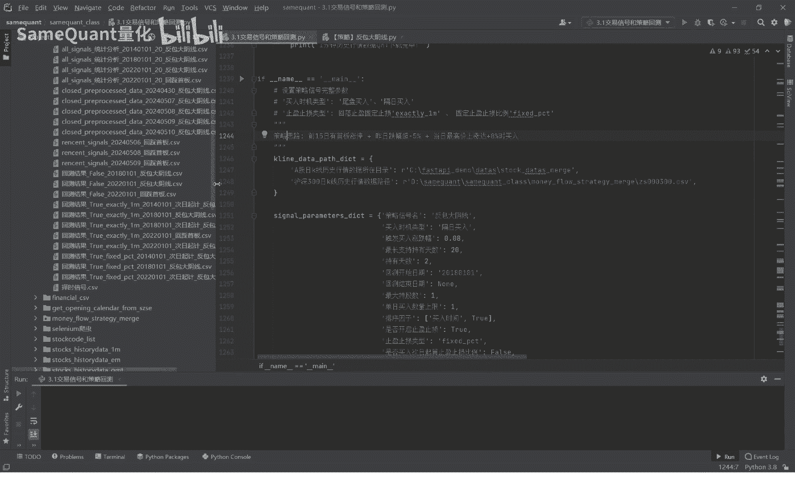

比如说这个，这就是一个策略群参的一个结果的一个过程啊，当然我们在目前演示的只是循环，只循环了100次，100次是获得了最优的一个结果，就是这个参数是吧，休息两天，持股一买入次日企上涨超6%。

回落1%止盈负5%止损，但是6年的时间，差不多翻了127。85倍，年化收益率比118。22，最大回到37。57%啊，这就是一个循环寻参之后形成的一个，回测结果的一个CSV文件啊。

方便大家去找到最优的一个月参数，好这一步完成之后，这个策略呢还没完呢，还涉及到一个核心的一个环节啊，当然这个环节包括六环节和七环节，那可能很多的回测框架，那它是不支持这两个功能的啊。

很多的一个你见到的策略回测框架，它只到五，第五步就结束了，没有了，我们的一个回测框架，还有第七步哈，你这个策略有计算策略信号的一个逻辑在那，那你就接下来最后一步设计一个我的策略。

正好假设我要用这个策略实盘，就是说盘中的时候，我需要实时选出这个策略的信号的，这里就涉及到啊，如何写出这样的一个函数和方法，是我们盘中的时候可以急速的一秒钟生成，我们实时的选股策略的一个最新信号。

当然有的策略你没办法一秒钟选出来，你可能需要这个30秒，你比如说我们的尾盘选股策略，它其实是一个定时选股策略，那你要尾盘计算怎么样，要计算这个5000多只股票的话，那你大概是需要20~30秒的。

所以说这个就没办法及时，但有一些策略，比如说我们这次要精讲的一个反包大阴线策略，它就是盘中就可以一秒钟出最新的一个信号，那四盘的时候你就循环去访问这个函数或方法，只要出现这个信号。

就一秒以内就会出现信号的话，它就立即可以发送出来了，就接到四盘啊，第七步也是最重要的一步啊，这就是整个的一个步骤，这整个的步骤是环环相扣的，每个环节都是要非常逻辑非常严谨的啊，不能不容易出错的。

当然我们一个回撤的一个框架，他不可能没有说没有缺陷啊，不可能说没有过拟合的一部分啊，任何一个回测框架都有过拟合的一部分，这一点咱们必须弱，所以但是你最重要的是，要尽少减少的一个过年课。

而且你的逻辑要特别严谨，而且的话你的回撤到每一步，你是怎么样，你是能有东西方便你去核对的啊，你不能是黑盒的，黑盒的，你没办法核对，那那这个东西很危险啊。

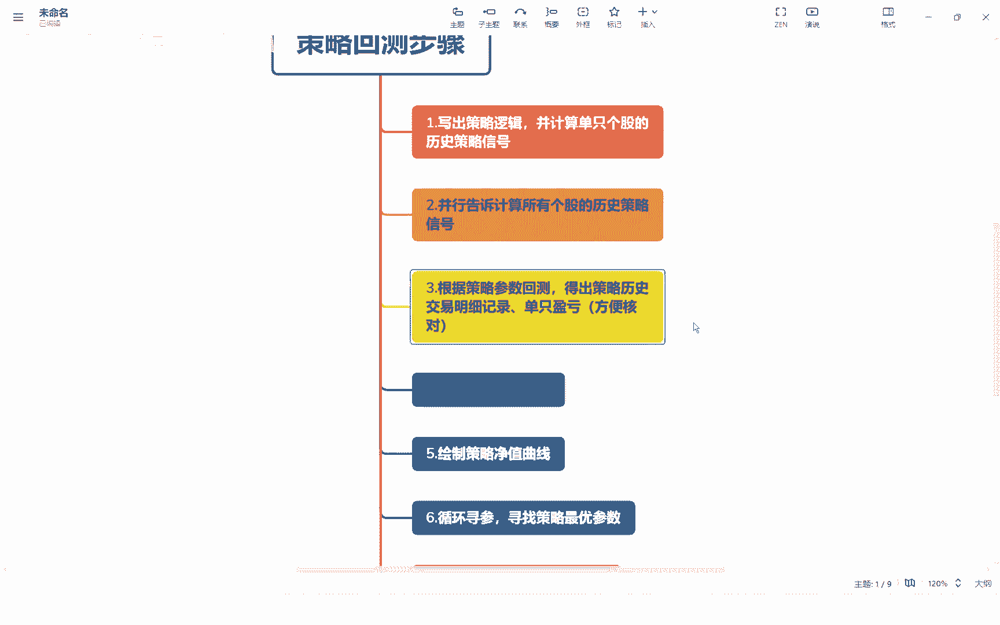

我们的回测框架绝对是可以核对的好，接下来我们就开始上手讲这个策略，我们这个策略的一个思路呢就叫反包大阴线啊，首先你给他策略起个名字叫反包大阴线，这个名字呢你要设置到这个策略名。

这个参数里面啊这个名字起个名哈，我们大概的输入5000，你先把它讲出来，第一个是什么，前15日由首板涨停啊，这是第一个选股的条件，第二个呢的一个跌幅超过5%以上，5%，6%，7%，百分之百不行，这都行。

当然这个这个还有一个就是你不能跌停，跌停都要排除掉哈，当日盘中上涨80%，也就是反反包昨日的下跌，上涨80%买入，就这样的一个思路啊，这个思路为了直观的让大家了解这个思路呢，我们先运行一次票啊。

大家看一下，我们以这个灵宝三星为例哈，历史的为例，我们可以看到它的一个，这里是对于这支票它的历史的信号有三个，从2018年至今有三个，我们来看一下，也就是你看最近的也就是这两个。

2023年10月11月十日和11月1日，11月10日也就是红色箭头这一天，11月1日，也就是这一天，他的一个思路就是首先就是这啊，前面他的前一天啊，前15日这一天有首板涨停，你看这天是首板涨停。

这一天的啊，前面15天这一天，包括这一天都是有10万涨停的，这所以说所以说这两个红色箭头的信号的两天，他这个这个条件啊，第一个条件都是符合的，第二个条件是什么呢，第二个条件就是昨日跌幅超5%。

也就是这一天你看到没，这你看他这一天跌幅，收盘跌幅是-5。92啊，这一天对吧，这一天跌幅是5。五点九六是吧，都是符合的什么，第三个条件啊，当日最高价信号，当日的最高价上涨达80%买入是吧。

因为这一天你可以看到它是收盘涨停的，收盘涨停盘中早盘的时候肯定达到8%了，达到8%的时候就触发买入，在达到涨幅达到8%的时候，你已涨停价买入，你大概率是可以买入成交的吧，可以立即成交的吧。

包括这支票也是一样，涨到8%的时候，你立即涨停买入，或者是你挂单百分之，你这个是可以成交的吧，没有问题吧是吧，所以这个条件注意啊，这个一定是最高价达到8%，你不能你这个策略的时候，你不能写收盘价的啊。

因为收盘价是属于是未来函数，一定是过拟合的，所以说我们在一个策略回撤的时候，一定要用最高价达到8%，因为你你比如说我设定是80%买入，那也就是说理论上只要最高价达到8%，就触发了我的买入条件。

你不能用收盘价哈，因为你收盘价你肯定是过拟合的，因为你最高价达到8%，收盘的时候可能是是跌幅，可能是下跌了或者涨幅3%，它就不符合条件了，这个时候如果说你把选出来，你用收盘价选出来的大约达8%的。

那你你你在历史当中你肯定是过拟合的，因为你把很多中盘没有8%，它实际触发了信号的股票，你可以过滤掉了啊，这特别注意这个逻辑一定要严谨，一定要用最高价，而不是收盘价哈，这个是非常重要的哈。

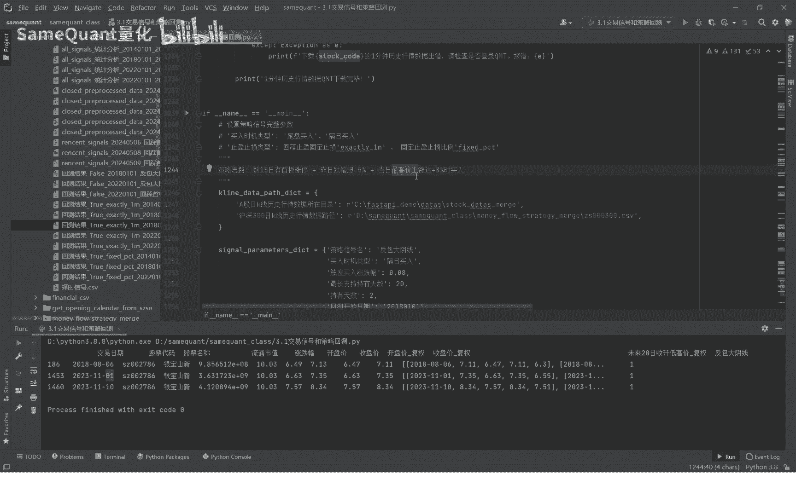

我们也看了，我们对照一个图也看了哈，我们接下来就正式进入。

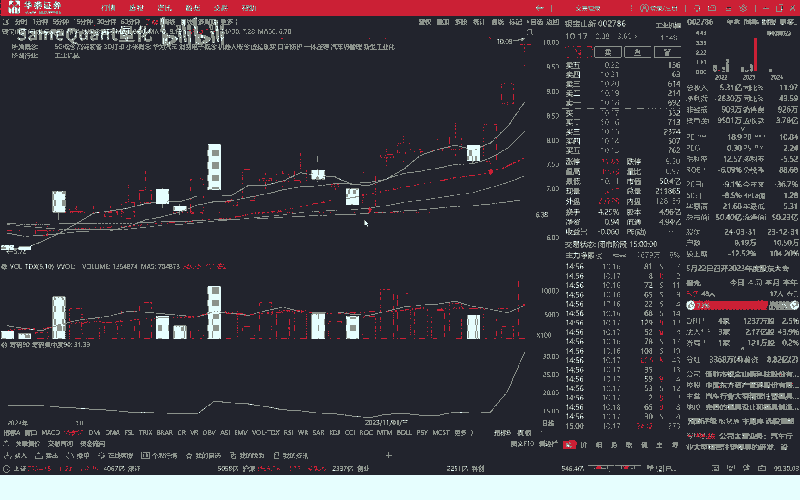

计算单只信号的战略信号，这里要补充一点，就是说比如说你有一个策略思路了，比如说这个创新高涨停，你比如说这一天是创新高，主板涨停嘛，那前天有个大跌，那那你如果说形成你自己这样的一个策略，也是一样。

你先把这个策略大概的思路求来写出来之后，你去找到对应的一只个股，接下来去写单支的信号的一个函数，好我们接下来就写这个反包大阴线这个策略，单支票的啊，计算的一些函数和方法，首先这就是这个啊。

首先你新增一个函数就叫反包大阴线，vt signal这个函数方法首先在第一句呢，把上面信号的一个名字给复制给他啊，所以后面要用这个end date，End date，也就是你回撤的一个时间。

那回撤时间默认是烂是为空的，如果是默认是烂的话，就获取一个最近的一个交易日，这个如何获取最近的交易日日期，这个是我们课程里面一个封装好的一个方法，你直接用就行了，这个股票代码嘛。

你要一个参数就是传入股票代码，传入股票代码之后，你首先要找到什么，找到这只股票代码，它的一个什么名字，行情，你要你要把历史的这个行情给我们的，历史行情就在这个目录下面，我可以大家给大家看一下哈。

但是5月11日是这个哈，今天没有，所以说这个数据是非常全的，另外我们可以看到字段有交易日期，代码跟收不开高低前收盘价，然后前收盘价这个特别重要，这个是要用于计算盘价的，所以这个是字段。

另外他当日的一个每日收盘的涨跌幅，换手率，涨跌额，成交量总市值，流通市值，流通市值列一般也是非常重要的，因为我们一般都能遇到流通市值去，你做这个排序因子，所以这很重要，另外呢，我这个数据里面还包含了。

他这个这个资金流数据，超大单买入金额，超大的卖出金额，大单中单，还有一些申万一级行业，它所处的一级行业三，当然等等，这些这个数据远远不止这些，还有非常多的一个数据，只不过是我没有加载进来啊。

这就是一个历史行情数据的一个表，我们就运行一下给大家看一下哈，有点hi，只是打印了前五个，它实际是这里面你看这个行业这些都有的，策略中到这些数据，我们策略用到的数据其实就是日代码名称，开高收低。

然后涨跌幅还有这个流通市值就没了，其他的也是用不上的啊，这就读取到他历史行情数据，那么截取这个123开始的对吧，但是我们只需要什么，我们其实我们只需要，从2018年1月1日开始的。

因为我们的回撤是这开始日期，那么你就数据先截取一下，那在这里你先截取一下，就说这样的话你这个数据量会变少，数据量会变少之后这样你回车的速度会增快，对吧，你不能这个回车引擎。

就是我们在回撤的时候要准确的情况下，要怎么样要让他的一个数据量要减少，所以说这一步要做一个筛选，根据回车开始结束日期做一个筛选吧，筛选完之后，这里要这里要特别注意。

他如果是为空返回掉了这支票就直接跳过了，返回一个空的这个庞大的data frame就直接返回了，我们在这里打印一下这个有一些股票对吧，他会报错，因为有些股票你比如说他2021年上市。

但是到2015年他就退市了，所以说就2018年开始他没有数据了，数据就是空的，那数据是空的，如果说你没有这一句的话，你接下来往下面报错的，明白吗，所以说代码每一步都是很精准的，一个地方出错。

其他地方就就出错了，好你看这就是筛选数据，他就这里是从2027年11月1日开始的，而不而不是2011日，当然这里面也是有一个向前预留一个60天的，一到60日均线，如果涉及到60日均线的话。

60日均线也就差不多是三个月，因为每个月大概在20个交，60日均线就三个月，其实这里最好是卷90日哈，那我们现在就直接改成90日，因为我们撤离撤离中涉及到计算60日均线，60日均线需要90天。

60日均线呢，它比最好是向前取90天的一个数据，不然的话他就不是就没办法有，从1月1号开始了，改成90日哈，然后再重新的，这里也是很重要的一个环节，你向前取90天天数，我们是整个回撤引擎。

就取2010年1月1日之后的数据哈，然后呢上市要大于30天，因为上市小于30天的话，那个新股上市，因为历史的话，那新股上市有很多一字涨停，那就排除掉，因为这样的话你会影响一个策略的一个收益。

所以说不上三天以内我们就去掉哈，特别重要了，这个呢是一个计算复权价，一测的时候，他这个这个结果才相对来说是比较客观的，在我们默认默认是取得一个前复权，也会出现一些问题，你比如说茅台富权，它可能出现负值。

这个时候你在回撤的时候也会出现问题的，会出现这个问题，就是说给说又是不可避免的一个出现过，拟合不低的复权价就全部计算出来了数啊，计算涨停，为什么要计算涨停价呢，因为我们策略里面用的要有首板涨停。

那计算涨停价嘛对吧，我们这里呢也打印给大家，涨停价，房跌停是否收房停，涨是否涨停价吧，这个讲吧，就这个计算涨停价值这个函数，其实这个很复杂的东西，一般人能计算出来的，这所以你要自己去研究。

计算涨停价的话，你可能都得研究一个星期，你才能写出来，我们在这个计算涨停价这个函数的这个方法。

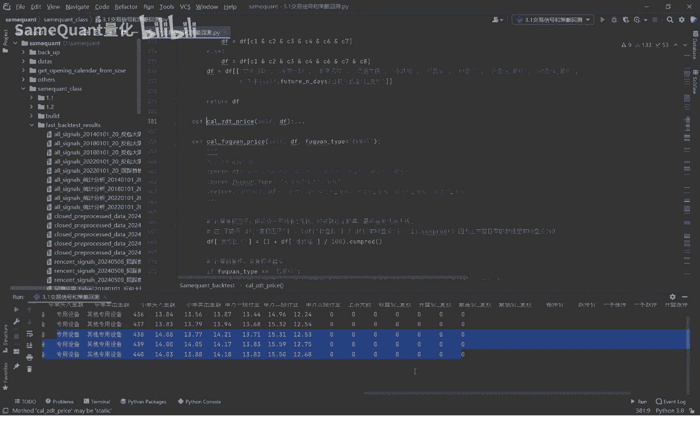

这个在全市场就是排名前三，他这个你像计算这些对吧，涨停炸板收盘跌停，涨停开盘跌停，这这个东西我们再给大家看一个东西哈。

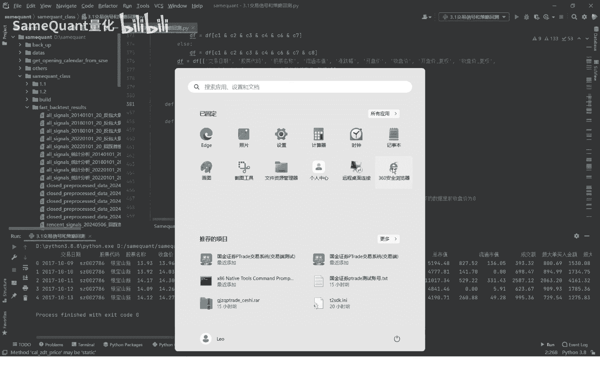

包括咱们的这个一个网站，你看这里面的一些统计数据，其实都是都是怎么样，你看他的统计的一直每天实时的全量A股，它实时的一个涨停，加速炸板加速出版加速零加速，T字板一字跌停。

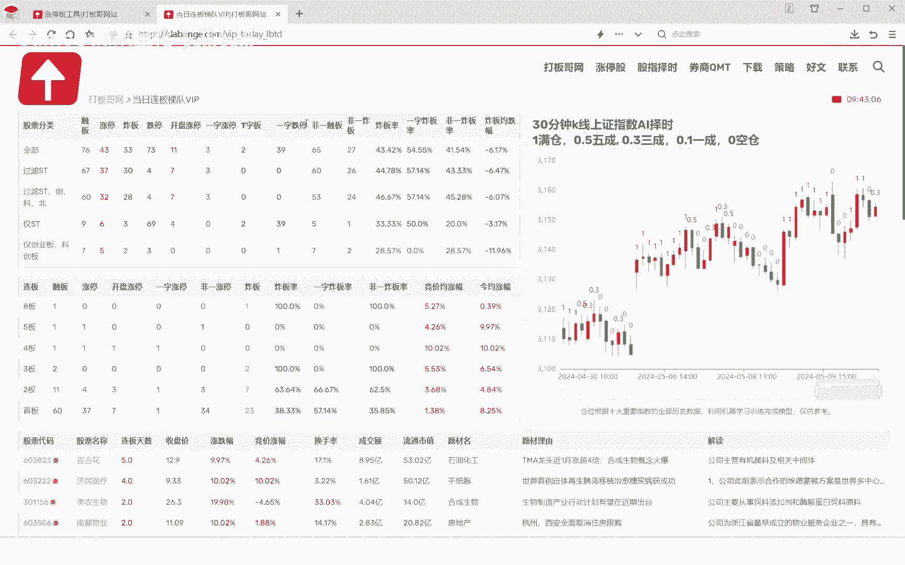

飞一出版，飞一炸板，扎板栗一直扎板，你这个东西对吧，这个东西能计算出来。

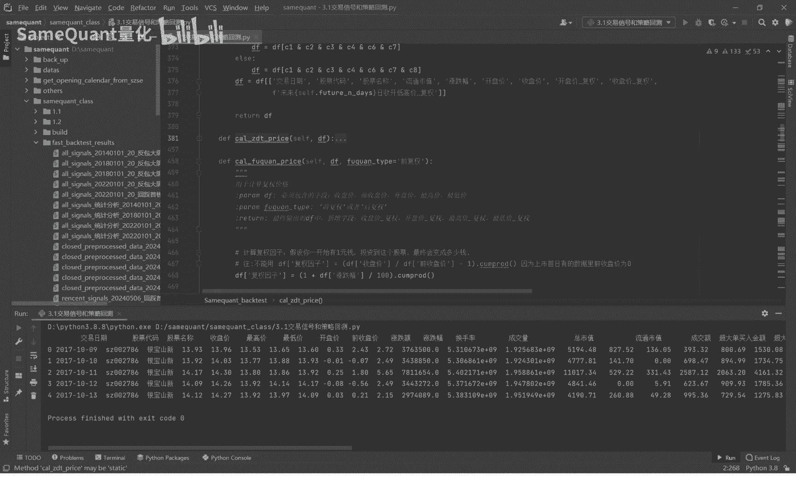

其实主要依赖于这个行，这个我们这个方法就算这个涨停价这个方法哈，你对涨停案和引擎版比较感兴趣的话，可以也可以经常来光顾一下，这个我们打板各网站，因为它这里面的统，我们这个网站的统计数据是非常全的。

包括每一只个股，它实时的涨跌原因解读的这个都有的，我的原因解读，这个这个数据是非常强大和好用的哈代码来。

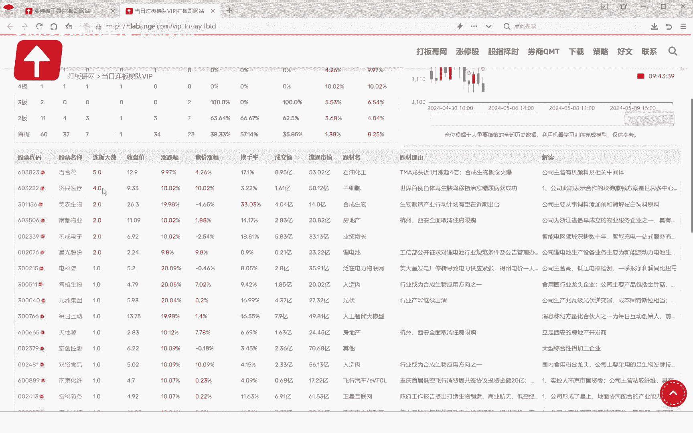

所以这种格式年月日也就是这种格式哈，因为交易日期要格式要统一，统一之后才能方便这个对进行计算或者比较哈，这个也是很关键的重要了，大家要注意这个这个这个这个特别重要了，这两句特别重要。

因为这个涉及到我们这个策略的计算，后面回撤计算这个策略，它每日收益，这个我们需要把什么呢，我们需要把它未来的，比如说这个你设计的，我们一般默认设置的是未来20天的，它的一个开高收低的一个复权价。

要形成一个列表，增加到我们这个来哈，我们直接打印一下，给大家看一下，这个，因为这个数据是我们策略回测是必须要用到的，一个数据，没这个数据没办法没办法回撤的，所以这个数据也是需要用到的哈，按均线。

因为我们这个均线要用到4日均线，50日均线，二十三十六十日均线好吧，这些都是特别重要的啊，当然我注些那个列我注销掉了，因为暂时我们这个策略运用上，我注销掉了哈，这个这个方法叫SAM。

因为这个东西也是很重要，然后连续涨停，当然这个连续涨停可能可能用不上，你们用不上，但是我也只是我也把这个连续涨停。

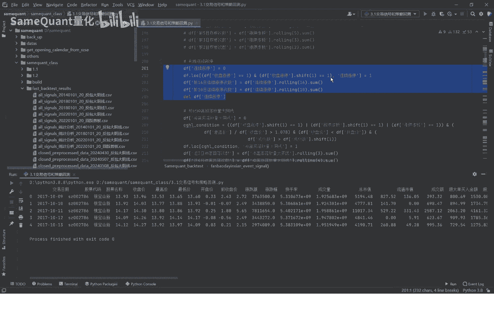

计算的一个方法告诉大家了，这个什么叫连续涨停，就是这这一天是首版对吧，那么这一天就是连续涨停，就是第二版，这一天就是300，连续涨停就是三百五百六百七百八百九百，如果你如何把这个它是第九版单人计算出来。

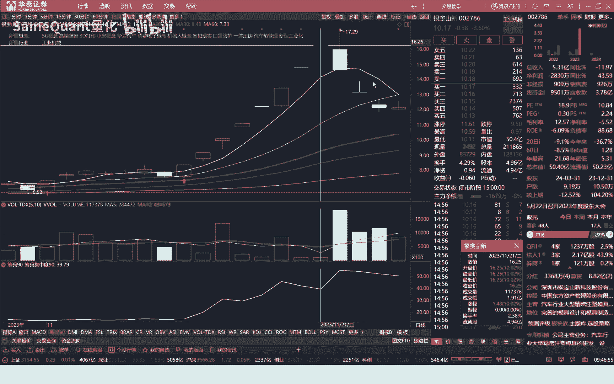

这个东西就大家了哈，升高回落大阴线。

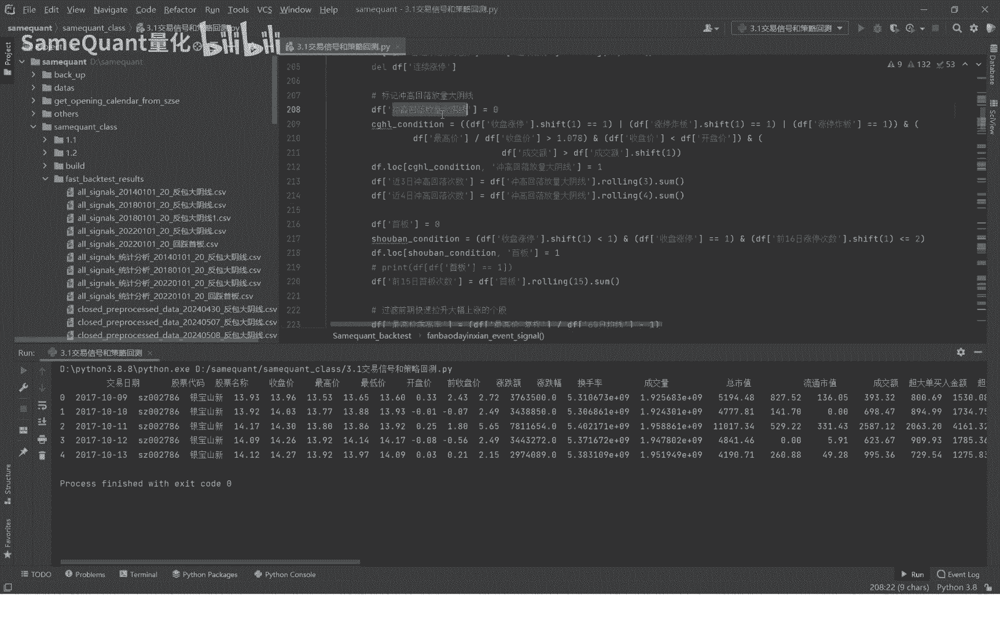

冲高回落大阴线，这个主要是策略里面规避这种风险用的，你比如说这个票对吧，这一天一个，这一天就是一个冲高回落大阴线对吧。

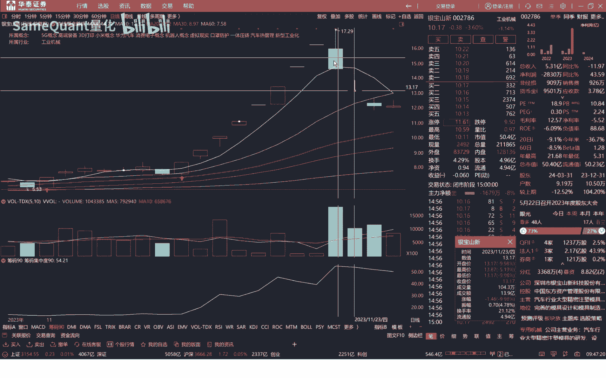

这也是冲高回落大阴线，就是如果说遇到这个冲高回落大阴线的话，我们要过滤掉，就说说他前四是有这种我们这种信号，我们就过滤掉，因为我们会觉得这这个我们就过滤掉，我们之前反包大阴线。

但是这些细节都是没有讲的是吧，一个像一个策略回撤出来，6年100多倍的一个策略，它不是不是你随便就能找到的，那他肯定是很核心的东西，在这里面我今天给你讲，给大家的东西都是核心的东西。

你到的这种核心的东西哈，寻找一个策略的一个方法告诉大家，比如说这这几句冲高回落大阴线，这个就是一个规避风险的一个，这就特别注注意了，首板是如何计算的出你标记出那天是首版的，你如果计算出这一天是首版。

这一天也是首版，这一天也是首版的对吧，很核心了，你不能你不能把二版标记成手板，那肯定就会变问题了，他手板的第一天，这个在前一天没有涨停对吧，然后是，然后他当日是涨停的，因为他当天是首板。

他肯定要收盘涨停嘛，你不能是炸板了对吧，所以说当天收盘是要涨停的，另外他好，又是我允许他涨停次数小于等于二次涨停，所以说我也我要求他6日可以再有一次涨停，一个手板人，首先他他前一天不是涨停。

然后呢当天涨停，然后他前16日呢涨停次数二，他前16再有一次涨停，我们就定义为这为手板，然后前15日首板次数呢，就是主板rolling15点SM，也就是前15日首板次数对吧。

因为我们前15日有涨停嘛对吧，那你肯定10万次数大于等于一嘛对吧，计算出来，然后前十五十万次数外是最高价，关联关联率高危预警，这些也就是我们去，然后昨日他是收盘是没有跌停这一句了。

首先昨日的收盘跌停等于零，也就是收盘没有跌停哈，然后do看到没，跌幅小于五，昨天的跌幅小于五哈，然后这里是，然后当天的最高价要达到涨幅要达到8%，这里就是属于现代数玩家赋权什么大于一加。

这个参数就是8%，8%是你自己设置，你可以设置700%分之六多型号，但严谨的一个东西哈是吧，这个点也很重要，因为有的票对吧，他直接开盘一字涨停了对吧，涨停它也符合我们我们的这个策略里面。

这涨停也符合我们策略的一个条件呢，就就说假设假设他这一天对吧，他这天是一直涨停的，它是不是也符合我们策略信号的一个条件呢，对吧，但是但是一字涨停的票，你是没有办法买到的，你明白吗，那你回撤的时候。

你把这个一字涨停的给加进去了，那你肯定是过拟合的，所以说我们这里面要加一个条件，就是说如果是要低于8%的，只有低于8%，那么它在涨到8%的时候触发我们的条件，我们才有机会买入对吧，我们的策略才是严谨的。

每一句话就是这个8万别的你少少这么一句话，你这个策略回撤起来，这个别了，也就是说它的30日均线是上移的，均线是大于20日均均线的，然后20日均线是大三三十日均线的，我们还加入了这个条件哈。

当这个条件你可以去掉，然后你回车试一试好，然后呢我们先进入你一列，比如说这个反包大阴线，我们给大家打印看一下吧，哈这里策略信号条件啊，这七个条件加到一块，然后计算这个策略信号哈。

这个策略信号哈总共只有三个嘛，前100都没有这个策略信号哈，不过因为它只有三个嘛对吧，接下来我们就只取我们所需要的一个数据哈，用这个不等于一的，也就是它符合我们测量信号条件的哈，我们打印出来哈。

只有单个了哈，三个日期的出这个策略信号，那么这个东西其实就是要需要我们盘中，实时选股的时候用到的，实时选股的时候，这句主要是用于尾盘尾盘选股的一个，这个后面再讲，这里呢你不用管这个不影响我们的策略运行。

我们计算这个反包大阴线的完成了，我们再运行一下看一下哈，获得这样的一个方法了，就计算单只股票的这个反包大阴线，这个信号的一个方法，然后这支票呢，2018年至今有三次这样的信号。

每次之后几乎都有一个很不错的一个上涨，三次信号就出来了，补充一下，还有其他的一些条件，比如说这个也，我们来讲一下这个策略的一个参数，首先是反包大阴线哈这些，当然这些参数我们都还没有涉及。

我们今天的这期课程都还没有涉及，今天主要讲的就是包括单行线这个函数，然后计算单支票的那，下一节我们就分享计算所有票了，就是把这个手反包大阴线的，他这个回撤区间内的所有的信号，全全部给它计算出来。

然后这样的一个表形成这样的一个表格，我们可以看到这历史上所有的二到这里，我们下节就讲这个计算，所有这期先到这里。

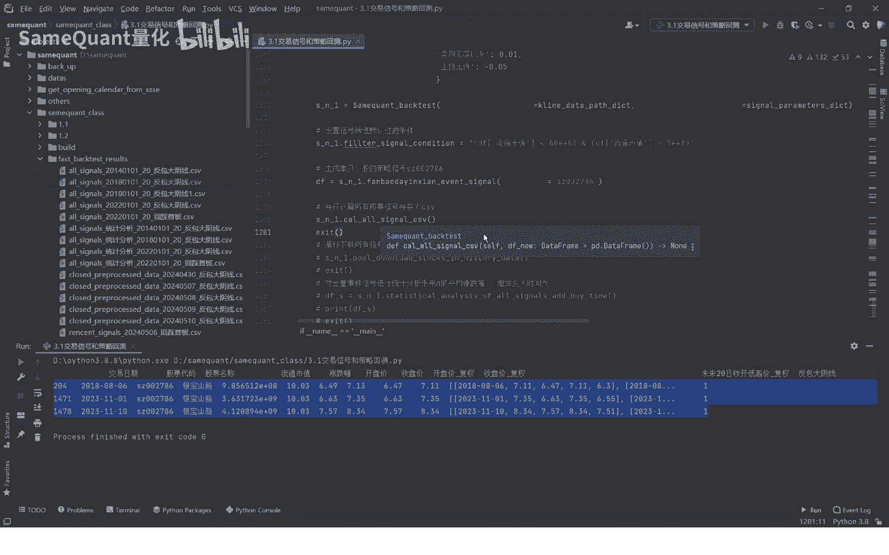