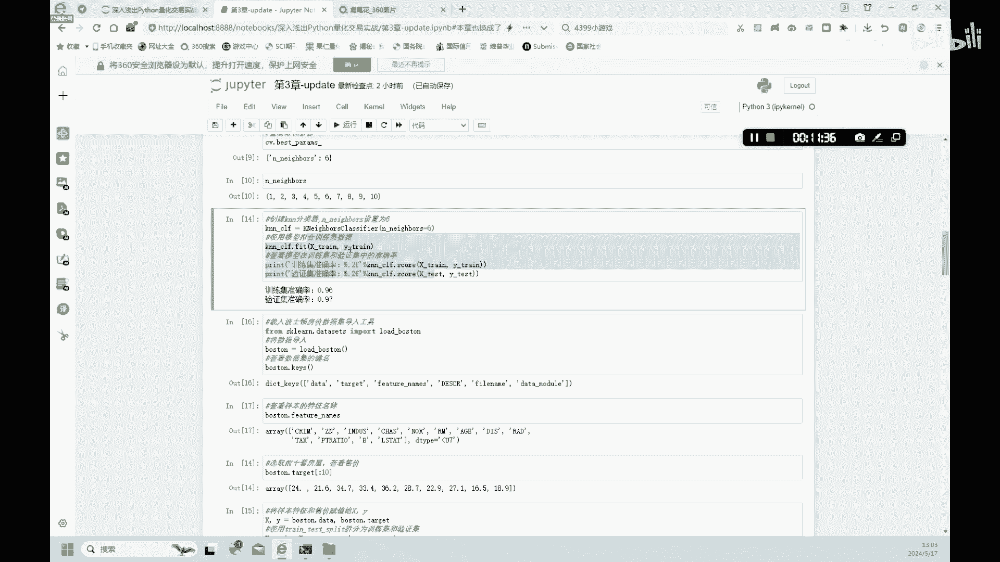

# 3.2【金融科技】机器学习之KNN分类任务 - P1 - 隋UP主 - BV18csuehE9n

在我们了解了机器学习的基本概念之后呢，我们呢进一步的来学习一下，机器学习的基本工具好，首先呢在Python的这种这个工具包里面啊，第三方库里面有非常多的，机器学习的这种工具啊。

嗯比如说呢这个比较成熟的啊，Skater learn，还有这种深度学习的啊，TENSORFLOW啊，Pytorch，还有啊CURI这些都是一些第三方库。

然后我们呢这节课呢主要是用scatter learn，learn这个这个软件，哪来这个第三方库呢，来实践一下，我们的这种分类和回归的一个学习啊，嗯这个skater呢我们呢使用的第一个算法呢。

就是KNN这个算法，KNN的算法就是K最临近它的一个定义呢，就是预测领域中啊，邻域中最频繁的分类，或者是回归情况下的一个平均值啊，具体是什么意思呢，我们呢就是通过这样的一个案例，大家就可以清楚地知道。

首先呢我们呢要导入一个啊skate learn呢，它自带的一个数据啊，就是它是导入一个这个鸢尾花的一个数据，这样的一个案例数据啊，大家导入这个数据，import这个这个ERIS，这个艾瑞斯啊。

就是鸢尾花的一个英文名字啊，然后呢我们在导入KNN的分类模型，我们呢首先是做一个分类，后面再会做回归好，大家注意我们先做的是分类，然后再导入图表啊，啊图画图的一些工具好，我们往下看。

首先呢我们呢把这个艾瑞斯啊，他这个数据啊给定义出来，这个数据集啊定义出来，然后我们可以查看这个数据集里面有哪几个，哪几项啊，这个kiss是什么。

在他的几项里面有什么有这个数据data target目标啊，这个frame target name这个不知道是什么，还有一个特征的一个名字，还有这种文件的名字，还有数据的一个这个类型啊。

这些这些这个主要的项目，在这个数据里面主要有这几项好，我们呢重点的关注的是两个，一个是target，一个是这个啊future name，因为这两个这个关键值呢，分别是样本的分类标签和特征名称啊。

特征特征的一个名称，然后我们呢就要根据这种特征来对这种这种花，进行一个分类啊，虽然虽然说呢这个鸢都是一个鸢尾花，但是它有一种花呢，它也是有不同的这种品种也好啊，不同的花色。

不同的这种这种嗯一些特殊的一些点吧，我们通过这种特殊的这种特征啊，来对这种鸢尾花进行一个分类好吧，我们首先呢来查看一下它的一个特征值，这个特征值呢我们查看之后呢会出现这四类啊，这四类分别是什么意思呢。

就是这个萼片的一个长度，就是花的恶片的一个长度，还有恶片的一个宽度，还有花瓣的长度啊，花瓣的那种宽度是吧，这四个特征对这四个特征呢，然后我们通过这四个特征啊，对这种这个花进行一个分类好吧。

我们呢然后再查看一下这个数据集，它已有的这个分类啊，好这个分类呢分了012，就是把这个数据集呢分为了一个三类啊，我们数据集看完之后呢，我们就来想办法开始啊预测这样的一个分类啊，好我们根据这个数据啊。

想要达到什么样的目的啊，我们要根据这个鸢尾花额，这个萼片呢和花瓣的一个长度和宽度，那四类特征值结合分类标签来训练一个模型，让我们以后啊只要见到这种鸢尾花，哎我们这个模型呢都能够认出来啊。

以便让模型可以预测出某一种未知，不在这种样本中的这种鸢尾花属于哪一个类别，这是我们想要得到了一个这样的一个呃，准确的一个模型，好，首先呢我们呢第一步呢是将这个拆分数据集，我们拆分数据集呢。

首先呢是将样本的特征和标签呢，分别这种赋予X和YX和Y啊，等于一个艾瑞斯data，还有eris target啊，然后我们呢查看一下x sheep，然后查看一下我们这种分类结果是吧。

它分为了就是150和四，我们可以看到这个150呢，就是我们现有的这个样本总共是150个，然后四呢就是每个样本呢，它有四个不同的这种特征啊，或者是不同的这种额目标值啊啊target，然后呢我们呢。

要继续对这个全样本进行一个拆分，我们把它分为就是X除以就是训练训练集，还有一个验证集，验证集呢就是test是吧，把X分为这两部分啊，然后呢这个Y呢也分为这两部分，我们拆分之后呢。

大家可以看一下它的结果啊，是112和四啊，这是什么意思呢，我们呢就从150个样本中的，选取了112个作为训练集，剩下的部分呢就作为验证集，然后四呢就是特征值不变啊，这个target不变。

还是我们要通过四类进行一个区分啊，好，下面呢我们就来建一个这个KNN的一个分类器，好用这个分类器呢，哎来看一下它的一个训练的一个结果，好我们看一下这个啊，使用训练模拟器，这个母训练模拟器就是这段代码。

然后通过这种训练模拟器，这个训练完之后，我们看一下打印出来的一个结果，训练集他的一个准确率，大家可以看一下96%，然后呢，这个验证集他的一个准确率是97%啊，就是嗯整体来说呢。

他的一个就是训练的这个训练集和验证集，他的分数都是比较高的啊，这个模型呢就说明它的一个效果还是不错的好，我们继续来往下看，好我们呢还可以进一步来优化这个模型，如何优化这个模型呢。

在这个skate learn呢，这个第三方库里面呢，就是这个KNN呢，可以通过一个ENNEIGHBORS这一个参数啊，调节这个参数来改进这个模型的这种性能，在这个这个enables这个默认值呢。

这个can这个目这个算法中呢，它的默认值呢原来是五啊，所以说呢我们可以就是通过一个网络的网格，搜索的一个功能，来寻找这个模型的一个最优参数，也就是寻找这个enable最优的一个参数。

我们使用啊这种网格搜索，就是导入这样一个这个程序，导入这样一个程序，然后呢我们定义一个ENNEIGHBOR，它的一个区间呢是1~10的一个区间，就是这样这样写，然后呢通过这种网格搜索呀是吧。

我们需要就是来找到一个最优解啊，找到一个最优解，这里呢我们可以得到一个ENNEIGHBOR，它这种值呢是吧，六是最合适的啊，这个UNIOR是什么意思呢，啊就是说我们前面是吧，有这么多值啊，150个值啊。

我们每五个啊唯一小组来，因为网格搜索嘛最开始的是五个为一组，来测一下它们是否有相似度啊，然后进行分类五个五个分类，然后呢这种五个五个分类，这种可能呢不是最优的解啊。

所以说呢这种我们呢就可以通过这种最优化，找到哪几个数啊，凑一块凑成一个小组，他的这种准确度最高，我们呢就通过这种最优化的一个方式，找到了每六个是形成一个对比，每六个对比一次，每六个对比一次。

这种交叉的进行比对，我们呢能够得到一个更好的一个结果，然后呢我们继续来看，我们继续来用KN这个模型呢来这个训练，然后ENNEIGHBOR设定呢，这里就不用默认值五了，我们设置是为六，然后其他的不变。

我们打印出来的训练集的准确度呢，96%，然后验证集的准确率97%啊，和之前的这个没有设定的时候诶，结果是一样的，没有什么差别，在我们这两个模型之中啊，啊，所以说我们这个模型已经是达到96%。

97的一个准确度啊，就是也就是说就是这个鸢尾花呀。

这个这这种花基本上这个电脑能够认出百分之，就是我们的这个程序能认出60%，其实输只要输入这个图片，我们呢就能够把这个鸢尾花做个分，分到合适的这种四类里面的其中的一类里面好。

