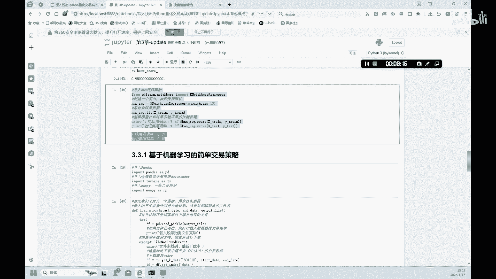

# 3.3【金融科技】机器学习之KNN回归任务 - P1 - 隋UP主 - BV1eWpweyEYA

好我们来看一下这个KN算法，用于回归的一个计算，好我们看一下，我们首先呢是导入这个波士顿房价的数据是吧，大家导入这个波士顿房价的一个数据，import这个数据，然后这个这个波士顿呢就是代表了。

我们当前使用的是数据，然后我们看一下BOSTON里面数据，这个kiss有多少啊，有几个啊，data target feature name啊，这个还有file name啊。

data model module这些这几项好，我们呢还是和之前那个鸢尾花的分析一样，我们首先呢是查看一下样板的这个特征值，这个这个feature name，大家可以看一下它的这种特征的。

总共有123456789十十一十二，十三十四个是13个，有13个特征值，好特征值包括了一下这种房间的这种数量，RM呢啊就是，2M呢就是这种房间那种数量，这个值啦，就是房子的这种年龄啊。

好这在我们这个数据里面有这几个特征啊，总共13个特征，好我们看一下这种前十套房的一个target，我们来看一下这个BOSTON这个数据里面，它房价的前十套房的这种房价是多少，这里列出来了二十四二十一。

6啊，万美金呢，好有了这样的数据之后呢，我们呢就可以呀，来进行一个这种训练模型的训练，首先呢我们还是跟之前一样，要把这个数据呢就是赋值成X和Y，这个X呢就是啊整个这种数据集是吧。

这种Y呢就是这个target啊，这种房价目标房价好，X呢又分为两部分，这个训练集，还有这个验证集啊，这个Y呢也是分为y train，还有y test，好我们可以看一下这个分完之后的。

拆分完之后的一个结果啊，我们这个数据里面总共有五百五百零六个，这种波士顿的这种房子的样本，然后呢我们拆分之后呢，在训练集里面有379个这样的一个样本，在这个验证集里面有127个这样的样本。

然后呢这个这个13呢这个特征值还是不变啊，好我们看一下，继续来看一下，我们在这里呢我们呢要预测一个房价，我们那就不是一个分类问题了，我们呢这里就是一个回归问题，所以说我们用到的这个函数呢。

就是这个regression啊，这KN的一个regression，Regressor，好，好大家可以看一下，我们就用KNNREG就是re啊，这个regression的这样的一个一个训练模型。

我们来训练X和Y啊，我们可以看一下得到的这种训练集的一个结果，我们可以得到68%的一个准确率，而验证集的准确率呢唉只有45%，这说明了什么，这个模型呢它处于一个欠拟合的一个状态啊，模型呢并不是特别好。

所以说呢我们对于这样的不好的模型呢，我们更要更加的要进行什么进，更更加要进行一个训练，好，怎么样，就是对这种模型进一步的改进，我们可以看一下，我们呢还是用之前那一个，类似一个网格搜索的一种方式啊。

这个来首先来设定一个这个这个N，这个NEIGHB，这个ENNEIGHB呢，是我们呢让这种enables参数呢，是从1~20来遍历整一整个这种啊，整个这个数集啊啊每20个遍历一次，买20个便利一次啊。

然后我们想达到的一个目的呢是什么，就是我们想找到一个ENNEIGHBORS的一个取值，使得啊，我们这个regression的一个的一个R方，达到一个最大化好大家可以看一下，我们做回归的时候。

都会有一个指标，衡量这个模型好坏的一个指标呢，我们都会选用这个R方的这个指标做回归，所以说呢我们呢这个搜索这个ENNEIGHBOR呢，也是搜索到一个ENNEIGHBOR。

这个ENNEIGHBOR要达到什么样的一个效果呢，使得这个模型啊，训训练及模型啊，验证集模型它能都能够达到一个最高值，最好值啊，所以说呢我们通过这样的一个设置啊，然后，找到一个最好值。

通过这样的一个网格的一个搜索的方式啊，我们找到了这个UNIOR，当等于十的时候，他这个r square是最好的，然后呢我们呢也可以就是看一下啊，他一个最好的一个square呢是r square。

可以提高到98%啊，阿square，PASSWORE达到0。98的一个数值，就说这个模型呢已经非常好了，好我们呢在这里重新设置了一下，这个ENNEIGHBOR等于十，然后我们来重新的测算一下。

这个训练集的准确率，还有验证集的准确率，大家可以看一下嗯，他的这个调整后，调整ENNEIGHBORS之后的一个准确率啊，还不如之前的一个准确率，好这就说明啊，我们这个模型呢他预测房价这个模型。

我们用这13个这种特征值，来预测这个房价的变化，它并不很准确啊，所以说呢我们可能啊还要这个房价呢，可能还跟一些货币政策呀，当前的这种经济环境啊，宏观因素啊，影响也是比较大的。

所以说呢在我们这种预测房价的时候，可能还要加入其他的一个控制变量啊，这也是可能是就是我们这这里呢只是给大家，就是举一个例子啊，所以说这个这个结果不好没有关系，但是呢如果只是你是真正的来做一个这个研究。

或者是做一个这种实战的策略的股票交易的话，可能就差别很大了。

