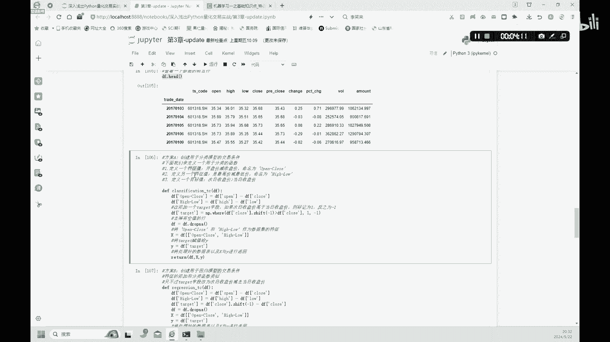
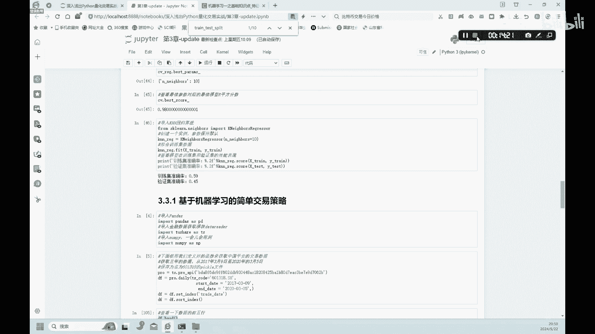

# 3.4【金融科技】机器学习在交易中的简单应用 - P1 - 隋UP主 - BV1RppseCE8o

我们继续来学习一下，基于机器学习的一个简单的交易策略好，我们首先呢还是导入pandas to share数据库好，我们下面来继续来导入数据啊，从这个to share里面啊，连上这个to share。

然后呢，我们下载这个一一只股票的，这个每天的daily的一个数据，他这个股票代码呢是中国平安，然后股票的这种起止时间呢，我们这里选取2017~2020年，这里呢你大家也可以自己来调整。

下面呢就是来设置了一下这个索引呢啊，然后对它进行一个排序，我们索引的排序大家可以看一下，展示前几列的一个数据，在这里大家可以看一下，这是中国平安的，就股票2017年到2020年的一个数据啊。

好有了这样的数据以后呢，我们哪来开始做一个这种交易条件好，这里有方案A和方案B就是我们用两种方式，一种是我们之前学过的这种分类啊，然后呢再用这种回归的模式啊，来看一下怎么样设置这种交易条件好。

首先呢我们看一下这个分类的交易条件好，我们分类的交易条件呢主要是来定义两个值啊，一个是X1个是YX是什么，X就是一个特征值，Y是一个目标值，我们来定义这两个好，首先来看一下这种特征值。

我们是怎么样定义的，特征值的定义的话，我们第一个是用开盘价减去收盘价，就是用这个open减去这个close啊，在open这一列减去这close这一列，这是第一个特征值。

我们在定义第二个特征值是最高价减去最低价，这个hi减去这个low啊，这两列好两个特征值，然后我们再定义一个目标值是什么，这个日收盘价大于这个前昨日的这个收盘价好，那可以看一下次这个次日的一个收盘价。

这里写错了，次日的一个收盘价额高于当日的一个收盘价，好我们看一下他这个这个定义啊，啊用这个代码来表示一下，然后就是define一个classification，一个分类，DF对DF进行一个分类啊。

然后呢首先呢第一个是定义了一个特征值，开盘价就是减去一个这个收盘价，然后第二个特征值定义了一个啊，DFH减low等于high，这个用hi减去low，这个值好，然后呢我们定义第三个值是一个目标值啊。

用这样的这个NP啊，N派这where这个函数啊，close的前一天大于它的当天，前一天大于它的当天，这个shift minus one呢就是前一天，然后这个大于它的这个这个当天的一个价格啊。

然后我们在这个去掉这个空值，然后呢我们把X赋值为这两个，就是前面这两个X呢就是特征值，然后Y呢就是target啊，然后我们再再return这个值就可以了，好这就是我们做的第一个分类的交易条件，好。

我们为什么要定义这种特征值啊。

还有目标值这两个值啊，这里呢大家看一下它的一个定义啊，特征值和目标值的一个定义啊，特征值呢是一些事物的特征啊，目标值呢它就是最终的结果，大家要注意特征值是会影响到目标值的啊，特征值的选取。

我们刚才选了两个X是吧，这两个X它是会影响到这种Y的啊，而这目标值是特征值的一个最终归属。

好大家要注意啊，这个模型是否准确呢啊一个很重要的地方呢，就是我们选的这种特征值呢啊是否能够是吧，比较准确的符合这个模型啊，好我们这是方案A，方案B呢是创建回归模型的这种交易条件。

第一个是这个是呃这个分类条件，这个下一个是回归条件啊，好这回归条件呢前两个特征值是不变的，还是用这个啊，这两个，然后只是改变了一下他的一个目标值，目标值呢改为次日的一个收盘价，减去当日的一个收盘价，好。

大家注意看一下这个define啊，这个regression这个回归啊，对DF进行一个做一个回归，然后呢还是定义了这两个特征值啊，跟上面一样，然后目标值呢是用这个shift one。

这个次日的减去当日的次日的收盘价，减去当日的收盘价啊，然后容吗继续来定义了XY和前面是一样好了，这就是两个方案啊，就是两个交易条件的方案好，我们下面呢就是使用这种分类这个算法的，定制这种交易策略。

大家注意啊，我们下面从这里开始往下，我们都是用分类交易啊，一等课后的，大家有时间自己呢把这个classification这个这个换乘，这个regression好吧，自己试一下这个方案B啊。

plan b他得出来什么结果好，我们这里演示呢只用这个分类好吧好，我们看一下这个和之前一样，我们是这里也是就开始啊，把数据分为啊两个这个训练集和验证集啊，大家可以看一下。

我们训练集呢现在里面会有584个，这个数据特征值是二啊，两个特征值这里我们知道，然后来训练这个剩下的值呢都是验证集啊，好我们可以看一下这样的一个一个结果，在这里，啊输出的一个结果，好我们看一下。

我们用这个KNN这个算法来预估一下，这个模型，我们已经有了这个XY，还有了这个训练集和验证集，然后我们呢就用KN这个算法来预测一下啊，这个模型它的一个准确率啊。

哦这个我们设定这个ENNEIGHBOR呢是95，当然呢大家也可以按照前面的这个部分呢，用网格搜索来搜索一个最优的一个，ENNEIGHBORS啊，啊如果不是这个如果就是啊不是网格搜索的话。

可能这个数值不太准确啊，好这里我们只是一个案例啊，大家就是知道就好了，好，这里呢我们呢就是首先呢第一个是打印出来的，是一个训练集的一个准确率啊，然后下面是一个验证集的一个准确率啊，我们呢用了特征值。

用了目标值，然后呢是吧，准确率只有56%啊，啊验证集中只有50%的一个准确率，也就是说用这个股票呢，我们来预测它的一个目标是什么，目标就是一个收盘价，大大这个次日的一个收盘价，大于这个当日收盘价。

这样的一个想要达到这样一个目标，我们用这样的模型来预测是吧，找出这样的这样的一个目标啊，准确率呢只有50%左右啊，这个模型呢并不是很好好，书中呢认为呢，这个我们因为这个训练这个模型呢。

样本样本的特征比较少，所以呢无法支撑模型，做出一个更加准确的一个判断啊，我们之后呢会用一些更加准确的一个，平台的数据来进行一个就是新的一个训练，我们这里呢就是大家知道，就是这样的一个逻辑就好了。

我们先构建了什么X和Y，然后构建了训练集，还有验证集，然后我们就预测是吧，分别预测在训练集和验证集里面啊，他的一个达到达到一个这个目标值的，一个准确性有多少啊，好我们再继续往下看。

我们呢使用KNN这种模型啊，预测每日股价的一个啊涨跌，然后呢我们可以保存成一个啊predict signals，这个predict signal是什么，预测一个交易的这种信号啊，因为我们这个在量化交易。

重点就是找这样的一个信号啊，我们用这种也是KN这个classification的一个，这种predict，一个函数predict x啊，然后呢我们呢这个return呢在这个在数，我们呢再增加一个字段。

就是当日的这个收盘价除以前一日的收盘价，然后取自然对数这样的一个啊，这个return大家可以看一下，我们新在这里生成两列，一个是signal是吧，通过这个预测这个他交易的信号在哪一天。

我们不用人为的啊判断它的信号，我们是通过前面那种特征值，然后预测它的一个交易信号在哪里是吧，有正一有一啊，哪里是买哪，哪里是卖出是吧，然后再生成一列这个return啊，这一列这就是我们这一步的一个作用。

然后呢，下面呢我们就开始来计算一个累计的一个回报，好大家可以看一下这种累积的回报啊，就是定义一个啊这个calculum returns，这个累计的一个收益率，然后他的累计收益率的这种计算方。

计算方式呢就在这里啊，好，这是计算一个正常的一个，就是基准的一个累计收益，然后下面呢我们再来计算一个策略，这个用这个策略的一个累计收益，它怎么它有什么区别。

大家可以看就是在原基准的这个return的基础上，我们乘以了个什么，乘以了一个这个刚才这个KN这个算法，算出它的它的交易的一个信号，是乘以他的个信号啊，大家注意这是不一样的地方。

然后呢我们有了这样的return，在原来return的基础上是吧，我们加上了这种信号，交易产生的这个新的这个strategy return，然后呢我们有了这个，然后再来算一下这个COCHUM这个额。

累积的一个收益是吧，这就成了一个使用交易策略之后的，一个累计收益，这是没有使用交易策略略的，一个累计的一个收益，这两个，然后呢我们呢就对这两个进行一个画图，大家可以看一下啊，画图是吧。

我们设置一个这个画布，然后呢我们先就是普通的基准的这个return，然后使用这个策略的return，我们分别画两条线啊，好大家可以看一下啊，我们就是下面的这张图就画出来了，这就是我们的这个黄橘黄色。

这条线，就是我们使用了这个模型的预测的这个signal，之后，它的一个累计的一个收益，而这个蓝色这种虚线它是基准的一个收益，没有使用这种交易策略，没有使用我们这种预测的这种交易信号啊，它的一个收益好。

这就是我们简单的来介绍了一个交易中的一个。

