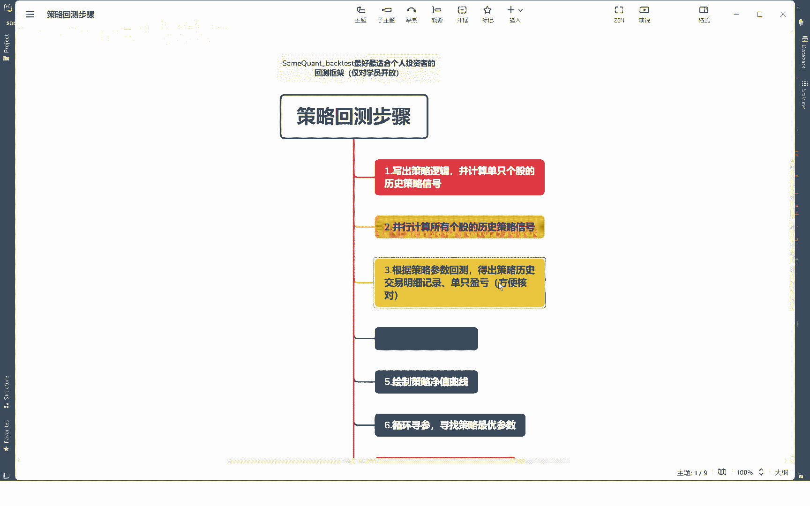
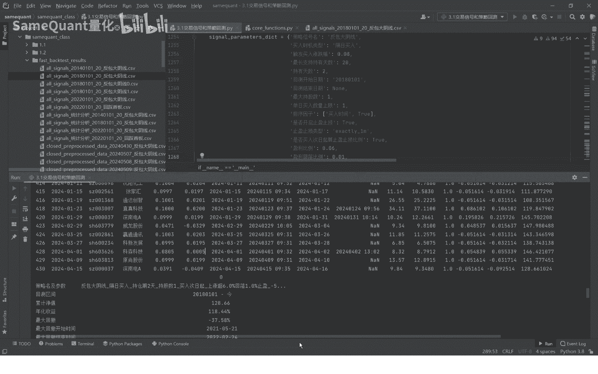
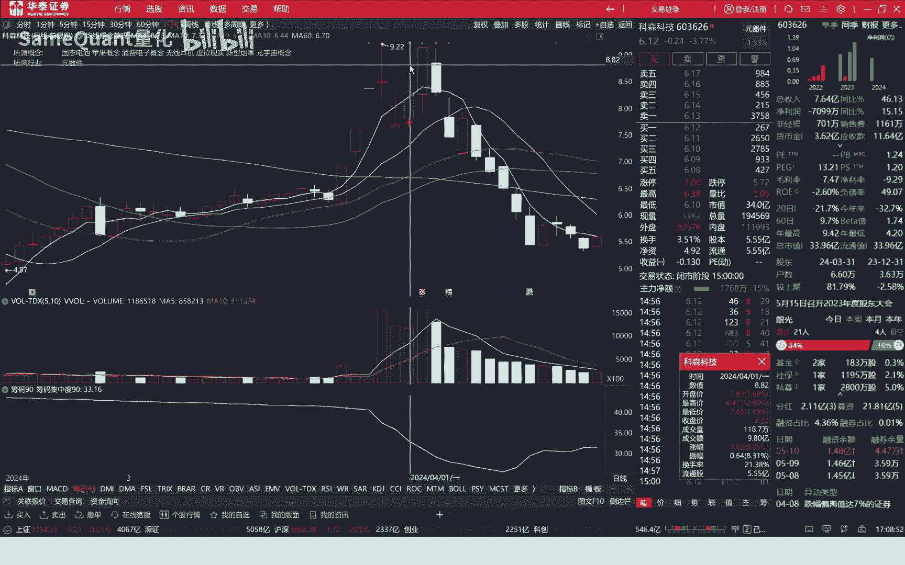
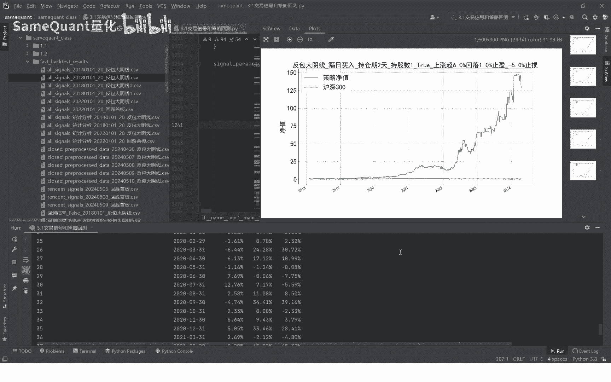
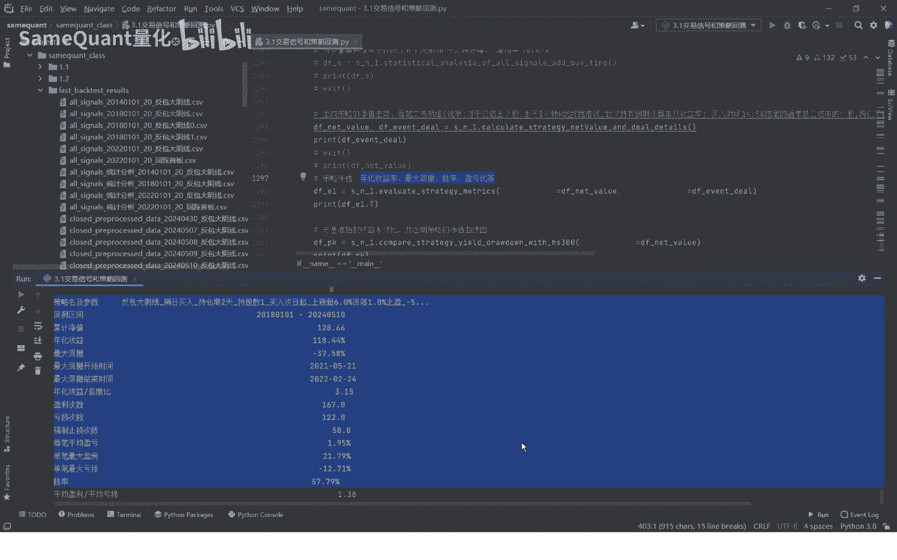

# 3.5 计算策略历史每笔交易明细、策略净值【核心】 - P1 - SameQuant量化 - BV1pJ4m1A7Uo

各位学员你们好，这里是金门矿场量化，我是打板哥，这节课继续，我们用框子back test策略回测框架的一个核心环节，根据策略的一个参数进行回撤，并且要得出一个策略的历史的交易明细，记录。

单支盈亏等等数据。

方便我们对整个策略的一个进行一个核对，好我们直接来到代码环节，先运行一下，这咱们讲的这个策略，还是这个6年100多倍的反包大阴线策略啊，继续我们拉到最上面来啊，这个就是我们的一个策略的一个历史的一个。

交易明细了哈，6年多了一个交易明细，每一笔的交易明细情况我们可以看到呢，这个交易明细里面包含有这个交易日期代码，买入当日的一个收盘涨跌幅，还有买入当日的一个盈亏比例，买入的一个日期，买入的具体时间。

具体的时间是精确到这个分钟数，卖出日期连卖出时间也是精确到分钟数的啊，前面这个是买入时间，后面这个是卖出时间，都是精确到分钟数，因为只有精确到分钟数，才方便我们去核对你这个策略，这个回撤的精准度。

那因为我们遇到的很多回测框架，它是买入卖出，他们是没有精准到这个分钟的，那么这个问题就很大，尤其是你日K级别的一个回撤的话，你没有精确到这个分钟数，那么你这个回测框架应该说是是很高的。

高的一个回撤框架啊，咱们的这个回车框架，虽然是日K级别的一个回撤，但是是支持到分钟级别的，而且效率速率是非常高的，好，还有哪些链呢，有买入价格，买入时间啊，还有价格，还有对应的卖出价格。

这也是为了咱们方便核对哈，这个仓位，那一般来说如果说你只是满仓单吊一只票的话，那么这个这个仓位盈利就是满仓的意思哈，如果你是为你的持仓股限制是两只的话，那么每只票的这个仓位就是0。5，如果是三只。

就是0。33，四只就是0。25，这个以此类推啊，每一个信号我们就配置，根据你的一个持仓数量去配置一个仓位，次起盈亏比例，也就是买入当日结束之后，次日开始到卖出期间的一个盈亏比例。

单日盈亏比例就是一个买入当日的盈亏比例，当日的浮盈比例，再加上自己的一个盈亏比例呃，两个相加就是单只的盈亏比例好，单支盈亏比例之后啊，就可以计算这个策略的一个每日的一个净值了，你比如说一支票是亏了3%。

它的净值就来到0。968，第二支票又亏了3。3%，让他净值就来到0。935，然后第三次票盈利了1。3%，那净值回升到啊0。948哈，就这样以此类推计算下去，最后是这个策略累积到了128倍啊。

6年时间翻了128倍，我们最后一支票我们来看一下哈，最后一支票是这个ca深蓝DA，也就是深蓝DA，我们看到它的信号，这一天是这一天出的信号，那这天信号，首先第一前15日吧，这有一个手办长。

你这个条件是符合的，另外昨日有一个什么，有一个收盘下跌5%以上是负10%，负5。49%是符合，另外第三个主要的条件，就是说当日怎么样，当日盘中最高价达到8%，你看他当时早盘是最高冲到涨停价了是吧。

所以说这个是符合的我们的策略的一个逻辑，就是涨到8%的时候，我们就以这个卖溢价进行委托买入好，你看我们可以看到，假设以8%的这个价格买入的，那收盘是4。3%，也就是他当时浮亏了将近4%点多哈。

来我们看一下这里这里你看这个就是比例，当日盈亏比例就是4。09%啊，这个就是这样哈，我们的策略的一个止盈止损参数是啥呢，策略的止盈止损参数是，止损比例是负5%啊，是负5%。

我们这设置的一个参数是次日起算止盈，止损比例，也就是这个如果是为出的话，我次日起啊载入当日不算哈，从次日起，如果接下来盘中，如果跌幅，如果这个浮亏再次下跌5%就触发止损啊，那止盈的一个规则是买入次日起。

如果盈利达到或超过6%之后，然后从最高点回落1%啊，这两个条件同时满足之后啊，也就是冲高回落之后，我们就进行一个已回落的当时的价格收盘价啊，进行一个卖出哈，这样的，那我们最后的这支票对我们这个深蓝店A。

因为他当时第二天是什么，我们当时第二天，你看到他当时第二天开盘价是-4。5，7号开盘之后冲了一下，然后立即向下，立即向上冲了下，你肯定没有赢嘛，没有盈利，你肯定就不会卖嘛，又往下跌，往下跌。

跌肯定跌幅超过早盘跌幅就超过百分之，这个五了嘛，那肯定就触发止损了，如果跌幅超过5%，我们就以负5%进行卖出哈，你看就是他卖出时间，第二天就盘中就触发止损之后，我们看到它只是0。516。

它的一个我们叫买入次日企的一个持仓，盈亏比例也就是负5。16%啊，首先是这负0516%，它是加上了一个卖出的手续，还有华点啊，所以说是符文，所以说这单支票他就亏损了9。25%，这只票卖出了就结束了。

所以说我们从最后一支票来说，你可以看到我们的子逻辑是非常严谨的，没有任何问题，是完全按照我们的一个回测框架的一个要求，来进行回撤的，这个是为了尽最大程度过离合好。

我们再来看一下这支票最近的盈利的一只票啊，这是亏损的票，我们再来找一只盈利的票，看一下他计算的是否是精准的哈，科森科技4月1号9点32啊，也就是这个红色箭头，这一天你看这个它前面这一天是有手板涨停的。

前一天下跌超过了负5%，同时它没有跌停，这天早盘是到了百分之百分之，导盘是到了8%到8%的时候，我们触发买入没有问题，第二天盘中盘中他是最低价是-4。93，他没有触发止损，下午啊6%到了6%回落。

有一个回落触发了止盈，也就是说他大概止盈的时间，就是13。001102那个样子哈，我们来看一下这里是不是在我们看一下它的卖，你看这个卖出时间就是4月2日的13。02，没有跟我们的分时图是对。

没有任何问题，它的盈利是多少呢，盈利就是它这个旧期盈利是超过了6%，回到1%，他最后是以六买入次起，持有盈利是5。4%哈，他买入当天，买入当天是几乎没有盈利嘛。

因为买入当天我们可以看到，买入当天它的收盘价是收盘，涨幅是8。05%。

8。05%，也就是它只是怎么样，只盈利了零点0。05%哈，你几乎没有盈利，总共就加起来三只票盈利了5。5%，同时我们在盈利买入的时候，我买入的手续费也扣掉了哈，这个是这个是很精准，没有问题的，好了。

咱们的，我们说的真诚，策略的净值走势和每笔交易明细啊，这个是非常关键的啊，一个你要想看懂这一个表格，就是交易明细表，你最重要的是，首先你要对我们的策略的框架要要特别熟悉哈。

我们这里的重点给大家讲一讲一下，首先呢策略买入的一个条件是啊，盘中涨幅达到8%触发买入啊，都没有问题啊，我们这些这些历史的每一笔交易中，他都是符合这个条件的，所以说没有过拟合情况哈。

买入时机这个要注意了啊，我们板报大阴线，这个策略买入时机一定要隔日买入，隔日买入，隔日卖，买入后隔日之后卖出，这个要特别重要，他是什么意思呢，就是说我这一笔一笔是1月30日买入，2月1号卖出的。

2月1号卖出之后，你正常来说，我们如果说主观交易的人，我2月1号卖出卖出之后，我当当天就可以买入了，正常来说当天就可以买入，但是咱们的这个策略反包单线这个策略，你是只能隔着买入，也就是下一个交易日。

下一个交易日他来到了2月7号出了一个新号，也就是说2月7号进行一个买入的啊，而不是说这个也就是说这个卖出的日期，跟下一笔的买入日期是不能有重叠的啊，为什么呢，大家这里一定要思考一下，为什么。

因为我们这止盈止损的一个架构，你比如说你卖出的止盈的时间，你可能是13。36，是不是，比如说这一笔他卖出的时间是十十三。36，如果你当日买入，你当时买入，如果你买入的那个信号是早于13。36。

比如说是9。35的，那你这个时间上你肯定冲突了，你你你不能说我我还没卖呢，我凭空我就买了啊，你买你没有资金了，那你这个账户已经被这个持仓占用了，他到十一十一点，他在下午01：36才卖出。

你不能去跑到上午9。35就去买入，这样的话你肯定这个策略的回撤，逻辑上就有重大漏洞的，所以说咱们反包大阴线策略只能买入时机，只能是隔日买入，当然不是说他这个策略反包大阴线就隔了买入。

而是说我们如果我们的策略以某一个涨幅，当日某一个涨幅达到多少，触发买入的这种策略，所有这种类型的策略就是自发买入涨跌幅，这个策略的你涨跌幅触发了你载入实际类型，你就必须用这个隔日买入。

当然我们的策略还支持另外一种模式，叫尾盘买入，尾盘买入的话，就以尾盘卖买入你之后你尾盘卖掉，卖掉之后又可以当日就可以重新买，因为你尾盘卖掉再买完全来得及嘛，这个就不会有时间上的冲突啊。

当然你尾盘买卖的话那样一种，那你肯定就不是以买入涨跌幅触发的，如果说你设置这里，你某一个策略，你是希望是尾盘买卖的，而不是以涨跌幅出发买买入的，那那你这个就可以设置成尾盘买入。

当你设买入实际类型为尾盘买入的时候，那那啊你这个参数它就不会生效，就不会影响你的策略啊，这个要特别注意好，这是一个关键问题，另外还有一个关键问题，我们这里有一个排序因子，排序因子是什么意思啊。

我们来先打开啊，比如说我们来拉到最前面，比如说2月7号，你看这一天，2月7号这一天我们是只买了，最后只选择买入了一支票嘛，你看下面，因为我们的策略是只持仓一只票，这一支票一直是满仓的一个状态。

所以说你某一日他你只买一张一只票，但是2月历史上的18年，2月7号这天有三个信号，有三个信号，那你到底买哪一只呢，是不是你到底选择哪一只，是你是选择哪一只买入，那那你选择不同。

你肯定对结果的影响是非常大的，那我们这里那有的人说啊，我能不能选择，但根据流通市值选择最小的这一只买入啊，大家思考这个问题，你能选择按流通市值最小或者是最大的，内置买入吗，思考一下这个问题。

也就是说你能不能把这个排序因子，这里设置成这个流通式子可以吗，思考一下这个问题可以吗，毫无疑问，我现在就公布答案，你再去思考一下，是绝对不可以用流通市值，如果说你的这个策略是买入，实际利息是尾盘买卖的。

你尾尾盘选股的时候，你假设你尾盘选出了这三只，尾盘的时候选出三个信号，然后你尾盘你要买入吗，那么这个时候你再用流通市值去做一个排序，选择流通市值最小的去买入，这个是没有任何问题的哈。

但是我们现在是隔日买入，你你出发涨跌幅这种的，这个时候你是，你是绝对不能用流通市值去作为排序因子，而选择这个一这一天三个信号而去选择，这个流动是最小的那一只买入的，因为你触发信号。

它的时间是有先后顺序的，你无法判断说这个流通市值小的，就一定先触发流通市值大的就后触发它，这个先后顺序你是没有办法知道的，这个时候，所以说我们这里面，行情书里面有一个很重要的一个例叫买入时间。

看到没买入时间，当天你触发涨幅达到8%，它的一个有一个买入时间，那么我们就选择怎么样，所以我们这里的排序，因此我们啊只能设置买入时间，就以你之前是哪个最先出现，我就最先买哪一次。

我不管你这个流通市值大小是吧，一定是以买入时间比这个策略才是准确的，而且买入时间你必须选择，也就是这里设置为true true就是表示表示升序啊，再去因子，这个要说明一下，而且你必须要升学。

哪一个先出现，我就买哪个，当然啊有的，所以说你这里不能设置为false，如果设置为false，那你这逻辑上肯定是有不自洽，有问题哈，当然我们可以改成false，也是可以回撤的啊。

回去之后大家可以看一下结果，结果肯定是会变糟糕的，当然它你看这个也有45倍哈，那结果为什么会变糟糕了，其实也特别好理解，你肯定是最先出版的，最先达到的肯定就要强势一点，你长期下来你肯定收益率更好。

这一点能理解吗，所以说排序因子这里要特别注意啊，如果是隔日买入的，买入实际类型为隔日买入啊，而且这个触发涨跌幅是以这个为准去买入的啊，有触发涨跌，咱们排序因子一定是用载入时间的啊，你不能用其他的。

当然用其他的也可以，你只要逻辑上自洽啊，逻辑严谨就可以哈，如果是尾盘买入卖出的话，调仓换股的话，排序因子你可以用流通市值或者是其他的，任何的一个因子，你都是可以的啊，只要你在生成全量信号的时候。

你把这个因子的啊这一列啊，你把这个放到这个表格里面，这个CSV文件里面就可以哈，这个是特别要注意哈，这个止盈止损类型啊，我们这边是这个参数支持两种，一种是叫做回落，冲高回落止盈加上固定止损参数。

就因为它只要用到一厘米的一个行啊，一分钟的行情数据，所以说后面这个就是一分钟行情数据，一个exactly dm，它准确了一分钟，钢琴通过采取止盈止损耗，他这样的话它就会通过整体比例达到6%，超过6%。

然后从中高中最高点回到1%触发止盈，那么就会以增效好，那还有一种方式，以mix的也就是固定的止盈止损比例，固定的，如果你设置这个参数的话，设置这个参数，那么改成固定的止盈止损比例数，这个参数就失效了。

回落这个就失效了，那个是什么意思呢，只要这个票它的盈利达到6%，我就立即卖出，我不管接下来涨还是跌，我就达到6%，我就卖啊，只要盈利达到9%我就买了，只要亏损不5%就立即卖掉，你设置这fake的时候。

参照这个参数就没有生效了，就不会影响你好。

我们也可以再运行一下这个固定啊，你整止损比例的时候，它这里面的一个表现，它固定，我们可以看到他这个策略是这个也有，也也也可以啊，这个策略收益率也可以有89倍，虽然比这个差一点点，但其实影响不大哈。

你看这个是100将近130多倍啊。

这就是我们详细的一个一个参数哈，另外的话这个回车开始日期的，一般你要设定设定好之后，我们前期课程讲到的那些步骤，你就要完整的来一遍啊，比如说这个是单只个股的一个侧面信号计算哈，计算全量的信号。

这个是下载一分钟历史行情数据，是全量数据的一个买入时间，增加买入时间点，这是一步是必须要再来到这一步，剩下的全部都要做一遍哈，也就是说你回车开始日期，如果你改变之后啊，你一个新的日期。

那么你前面那几步都要重新做一遍啊，不然会遇到问题的，这个要注意啊，回撤结束日期我们默认你就填个烂就可以了，不建议你写一个固定值，你填烂的时候，烂的时候也就是空的意思哈，你填这个的时候。

它我们默认就会取最近的一个交易日哈，从开始到最近的一个交易日，最大持股数是什么意思呢，最大持股数就是说我这个策略哈，我这个账户我持仓的最大数量，我这个策略如果是一，也就是满仓单调，如果是二。

那就是最大持股数就是两只，每只股票我给他仓位是50%，如果是最大持股数三只，那么我每一个信号，我每一只股票的，我给他的仓位就是百分是31/3三，好单日买入股票数量上限，这是什么意思呢。

你比如说如果说我最大持股数是三，那如果单日买入数量是是一，那么我就是我每天我最多，我只买入一支票信号的是吧，那下一个下一个交易日出现信号之后，那我再买入一次，再下下次我再买日抽出三次。

当然这个的话你如果最大持股数，你设三三持股，3月11，这样的话你的仓位历史当中，你的仓位可能多数时候仓位就比较低啊，所以一般来说，我通常的这两个参数是就设置成一样的比较好，当然你不能说啊。

我当日买入的数量上限，我这个大于这个最大持股，说烂了，那就那肯定逻辑上就有问题了，这是说所有的参数就介绍下，介绍完了，还有啊，之前的课程有一点我忘记，好像我忘记了这个环节给补上。

你设计的一个环节是什么呢，就是说我们前期有计算这个，这是计算单只个股的涨跌，大阴线的一个策略信号，好我们再来一下，这是单支票，单支票一般来说这个就是这个方法哈，反包单线计算策略信号的一个。

单支票的一个方法啊，你写完之后运行之后没有问题之后，你还有一步是什么呢，还有一个步骤就是说你要设置一下，设置一下设置信号的方法名，就是设置signal function，就等于反包大阴线。

Event signal，这个是必须要设置的，你不设置的话，那会会出问题的哈，如果说啊你比如说你自己又传了一个策略，叫叫什么回踩手板的策略，那比如说你想回撤你自己的策略，那怎么办呢，首先也是一样。

你在啊你在咱们这个类里面，你再增加一个，你比如说增加一个回踩手板疑问，不带手办嘛，这个名字就是你怎么取都行哈，你在这里写代码哈，我们这里就不写了，就来个pass是吧，你想想回撤你这个策略。

那这个时候怎么办呢，那就是你要把这个signal方法，因为你改成这个改成你这个就是回踩手板，那么它才会进行一个回撤是吧，后面的一个循环回车，那计算权衡它才会生效是吧，你不能说啊，我要回踩手板。

你这个O的镜号的方法名还是反包大阴线，那就会出问题啊，这个要特别注意啊，也就是说如果说你自己有一个策略，那那你就先写一下你自己这个策略的，计算信号的单只个股的一个方法好，你写完之后校验完成之后。

你就把它你这个策略名，你就把复制给signal function就可以了，你这个策略就可以进行一个完整的一个回车，就特别简单哈，因为我们这一次这个框架，就是为了方便你自己去传策略用的好。

这个我们就删掉了这个代码，无用啊，我就删掉，我们再来运行一下策略，好，看一下这个数据曲线，我们今天的课程讲的生存策略的一个净值走势，和每笔交易明细，下节课呢我们就要分享对策略的一个评估了，年化收益率。

最大回撤胜率，盈亏比例也就是这个数据了，下一节课就讲这个数据的一个计算了，好了，本期课程先到这里。

